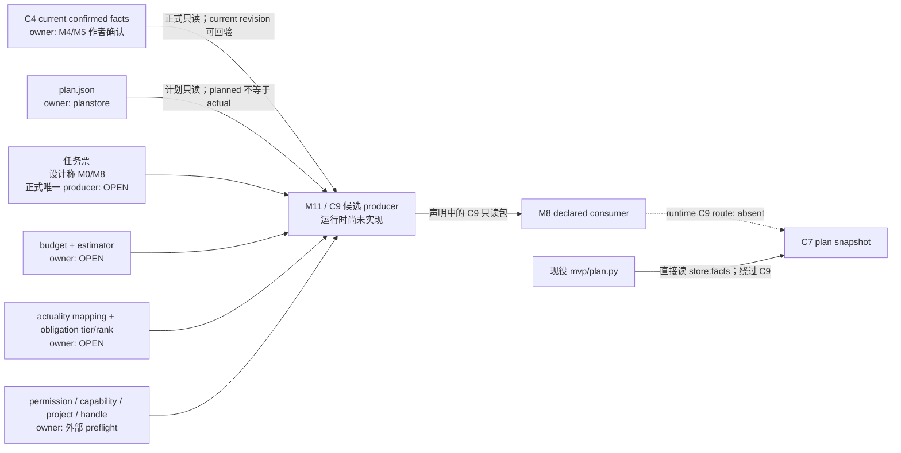

# C9 owner / producer / consumer 一页接缝图

## 大白话结论

- 正式存储合同已经写明：C9 候选由 M11 生产、M8 读取，任何来源变化都要重编，C9 不能回写真源。
- 运行时并没有 `mvp/packer.py`；现役 `mvp/plan.py` 直接读取事实账，不消费 C9。
- 所以“方向”闭合，“运行时 producer→consumer”没有闭合。
- C4 和 planstore 的源 owner 已经明确；任务票范围、预算、估算器、统一 actuality、HARD/SHOULD/MAY 与排序没有正式唯一 owner，全部保持 OPEN。
- OPEN 输入缺失时由 M11 候选输入门停止；真正修复必须回到对应 owner，M11 不接管。

这份图不替 T03/A、M0、M8 或产品分配新职责，只记录现行文件已经说了什么、还缺什么。

来源：Codex
