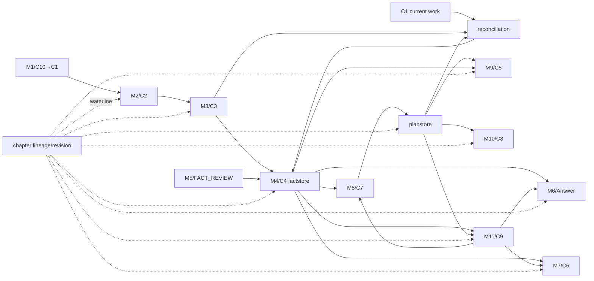
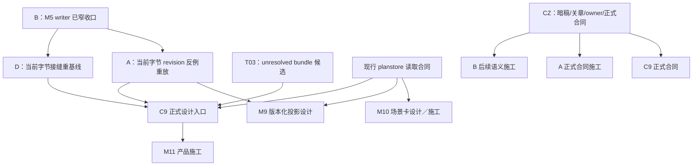

# M1～M11 成熟度、唯一 owner 与接缝图

## 读法

这里不把成熟度压成一个总分。每个模块分开看：

- **语义／设计**：方向是否清楚；
- **正式合同**：收发格式是否已经落；
- **运行本体**：是否有当前实现；
- **当前证据**：是否在现行字节上通过；
- **模块本体缺口**：模块自己还没建什么；
- **真实等待**：必须等谁，还是只是自己没做。

产品模块编号来自 `02_current_route/novel-mvp/ARCHITECTURE.md`。`governance/module_registry.json` 使用另一套 M00～M16 命名，不能裸名混用。

## M1～M11 当前成熟度

| 模块 | 唯一 owner（当前可确定部分） | 正式合同／实现 | 当前证据 | 模块本体缺口 | 真正等待关系 | 审查判决 |
|---|---|---|---|---|---|---|
| **M1 导入器** | M1 拥有 intake 与 C10→C1 投影；**章节 revision 权威 owner 未定** | C10 v4、C1 v0-r01；本地 C10-first 路径已建 | D READY-01/02 是旧 store 字节的历史 PASS；A 复现同章重导错误 | 自动语义分诊、Tags 采用身份对账、stable chapter lineage、revision action | D 现在可重放；revision 设计等 A；正式 owner 等 CZ | `PARTIAL_RUNTIME__REVISION_BLOCKER` |
| **M2 切窗器** | M2 拥有单次 C1→C2 切分 | C2 v0；`segment.py` 已建 | D READY-01 历史机械 PASS | C2 自身无 source/chapter revision 回指；持久锚点基准未定 | revision-aware 坐标需要 A；普通切窗不必等 T03 | `NARROW_RUNTIME__WATERLINE_GAP` |
| **M3 抽取／候选发现** | M3 拥有 C2→C3 候选，不拥有真值 | C3 v0；抽取路径存在 | D READY-03 历史机械 PASS；T03 未见语义 FAIL | 未决跨段聚合、闭合反证、限定范围、absence/unknown 区分 | 等 T03 形成候选对象；不等 B 才能做离线研究 | `MECHANICAL_SAFE__SEMANTIC_NOT_READY` |
| **M4 事实账** | M4/factstore 是 confirmed facts 唯一写域 | C4 v0-r02；B writer 已正式落 | B 当前字节强 PASS；D 旧字节机械 PASS | revision stale/recheck、anchor、unresolved 表达；M5 UX 不在 M4 | 等 A/T03 的正式语义候选；不能由 M4 自创字段 | `STRONG_WRITER_BASE__SEMANTIC_GAPS` |
| **M5 审查台** | M5 拥有作者审查动作；持久化由 M4 writer | FACT_REVIEW v1；CLI 极简动作已建 | B 20/20、83/83、178/178 | C5 概览 UX、批量确认负担、高影响签字界面、revision 后处理 | UX 可另做；暗稿／关章／revision 权限等 CZ/A | `NARROW_ACTION_PATH_PASS__UX_UNBUILT` |
| **M6 取证问答** | M6 只读 C4，拥有回答与覆盖回执 | 无正式回答合同；`ask.py` 关键词版 | A 证明旧 confirmed fact 仍可查询；当前无 revision 水位 | 弃权、证据闭包、覆盖回执、revision/current source 过滤、C9 消费 | revision 过滤等 A；共同前提包等 M11 | `RUNTIME_STUB__STALE_RISK` |
| **M7 一致性体检** | M7 只读 C4，输出 C6 | C6 v0；`check.py` 已建 | D READY-04 历史机械 PASS | C6 无 source_commit_seq/chapter revision/needs_recheck；语义误报仍需本地数据 | D 当前字节重放；版本水位等 A | `NARROW_RUNTIME__VERSION_GAP` |
| **M8 续写规划** | M8 拥有规划动作与 C7；planstore 是规划账唯一持久写口 | C7 v0、C7_SELECTION v1、PLAN_LEDGER r05/r06 候选合同；部分实现 | B 加强 facts↔RE 事务；planstore handover/reconcile 已有测试 | 通用 planstore 动作、网页画布、完整主循环；暗稿／关章开放 | 基础规划不必等 T03；C9 集成等 A/T03；暗稿/关章等 CZ | `PARTIAL_RUNTIME__NOT_FULL_M8` |
| **M9 故事概览** | M9 拥有 C5 投影；不得写真值 | C5 未落；产品未建；设计 R03 | 无当前模块结果票 | C5、投影版本、水位、概览生成与审查 UI 全部欠 | 需要稳定的 C4/planstore 读取身份；主要不是“等上游”，是本体未建 | `DESIGN_ONLY__BODY_GAP` |
| **M10 场景卡出口** | M10 拥有 C8 投影与外部出口；不得写真值 | C8 未落；产品未建；设计 R01 | 无当前模块结果票 | C8、资产/插件来源、版本、导出验收 | V0 可在 plan object 稳定后独立推进；不必等待 T03 全部成熟 | `DESIGN_ONLY__BODY_GAP` |
| **M11 上下文打包器** | M11 拥有 C9 编译与覆盖／预算回执；只读真源 | C9 未落；产品未建；设计 R01；C 有实验候选 | R19 actuality＋R21 budget；7/7+6/7，不是正式通过 | 正式输入身份、revision 水位、unresolved bundle、消费方合同、原始 JSON 兼容、回捞机制 | 真实等待 A revision、T03 unresolved、现行 planstore read contract；D 重放后再进设计 | `EXPERIMENTAL_RULES__NO_C9__NO_RUNTIME` |

## owner 不能混用的三条边界

### 边界 A｜模块 owner ≠ 跨切面 owner

M1 是导入 owner，不自动成为章节 revision 全链 owner；M4 是 facts 写域，不自动拥有章节正文版本；planstore 是规划持久化 owner，不自动拥有 frozen chapter。章节 revision 需要独立的权威归属和 action 合同，不能让三个现有 owner 都各存一个 current rev。

### 边界 B｜动作 owner ≠ 持久 writer

M5 可以拥有 `FACT_REVIEW_ACTION`，但只有 M4/factstore 能写 facts；M8 可以提出／选择规划动作，但 planstore 才写 plan；M11 只能编译包，不能借“补上下文”修改任何真源。

### 边界 C｜投影 owner ≠ 真值 owner

M7/C6、M9/C5、M10/C8、M11/C9 都是投影／执行工件。它们可以过期、重建、修订提案，但不能反写真值。

## 十条直接接缝

| Seam ID | 直接接缝 | 唯一写 owner | 当前证据 | 当前缺口 | 下一动作 |
|---|---|---|---|---|---|
| S01 | C10→C1→C2 | M1 写 C1；M2 写 C2 | D READY-01 历史 PASS | revision/source 回指不在 C2 | D 当前字节重放；A 设计水位 |
| S02 | 非 Chapter→0 C1/M2 | M1 | D READY-02 历史 PASS | Tags 采用身份冲突 | D 重放＋C10 owner 对账候选 |
| S03 | C2→C3 | M3 | 普通抽取路径；T03 新候选 | 未决发现／聚合失败 | T03 离线研究 |
| S04 | C3→M4/C4 | M4/factstore | D READY-03 历史 PASS | actuality/unresolved/entity scope 无表达 | D 重放；T03 候选，不先改正式字段 |
| S05 | M5 action→M4 facts＋RE stale | M4/factstore | B 当前强 PASS | revision stale 与暗稿/关章不在本票 | B idle；A/CZ 后续 |
| S06 | C4→M6/M7 | M6/M7 只读 | D READY-04 历史 PASS；A stale 反例 | source revision、水位、coverage | D 重放；A 设计 |
| S07 | C4＋意图→M8/C7→selection→planstore | planstore | C7/selection/planstore 部分已落 | 通用 actions、UX、暗稿/关章 | 不扩大 B；等语义决定 |
| S08 | C1＋C3＋planstore→reconciliation→facts/RE | M4＋planstore 协调事务 | B 83/83 相关回归 | chapter revision 与重新对账触发 | A 设计，不开第二事务系统 |
| S09 | C4＋planstore→M9/C5、M10/C8 | M9/M10 各自只写投影 | 只有设计稿 | C5/C8 本体与版本回执 | 未来独立施工；不是当前六窗任务 |
| S10 | task＋C4＋planstore→M11/C9→M6/M7/M8 | M11 只写 C9 工件 | C 的规则候选 | 无正式 C9、revision/unresolved/format/coverage | C idle，等 A/T03/D 新停点 |

## 章节 revision 是跨切面水位，不应变成万能字段

建议把它理解成一条受控“证据版本基线”，而不是所有对象都随手加 `rev`：

1. 章节证据域持有 stable lineage、append-only revisions、current pointer；
2. C2/C3 的一次运行工件声明消费哪个 revision，不拥有 lineage；
3. C4 fact 的证据锚绑定 revision，revision 变化后进入已冻结的 stale/recheck 语义；
4. M6/M7/M9/M10/M11 输出记录 `consumed_story_snapshot` 或等价水位，过期时显式返回 stale；
5. planstore 只保存其引用的 fact/revision 依赖，不复制章节正文或 current pointer；
6. restore 采用“旧内容作为新 revision 追加”，不静默回拨历史。

这些只是差异候选，字段名、owner 和枚举均为 `CZ_EXPLICIT_APPROVAL_REQUIRED`。

## B 最新改动对四窗的重放／排序影响

| 旧窗口 | 是否被 B 直接改字节影响 | 判定 | 推荐顺序 |
|---|---|---|---|
| D | 是：四夹具都纳入旧 `store.py`；READY-03/04 还纳入旧 C4 | 历史 PASS 保留，当前字节需重放 | D 立即重放 |
| A | 是：探针使用旧 store 路径；但 current 合同仍无 revision | blocker 保留，两个反例在新字节重基线 | A 阶段开头重放，然后做合同候选 |
| T03 | 语义未见结果不依赖 B writer；旧 14/14/C4 3/3 若要作为现行回归需定向重放 | 核心 FAIL 不变；不必因 B 重跑全部模型 | T03 先离线表示研究，必要机械回归交 D |
| C | R21 冻结模型实验不依赖 B writer 字节 | 实验结果保留；正式 C9 未来必须读现行 B/planstore 身份 | C 有意空闲，不重跑模型 |

## 真正等待图

🔥 最容易误判的点：

- D 不需要等 A/T03 才做当前字节重放；
- A 不需要等 T03 才做 revision 合同候选；
- T03 不需要等 A 才做离线证据束研究，但不能先发明正式 C3/C4 字段；
- C 才需要同时等 A/T03/D 到新停点；
- M9/M10 不是“只等人”，它们自己还缺 C5/C8 和实现。

来源：`02_current_route/novel-mvp/ARCHITECTURE.md`、当前合同／设计稿、A/B/C/D 回执。
