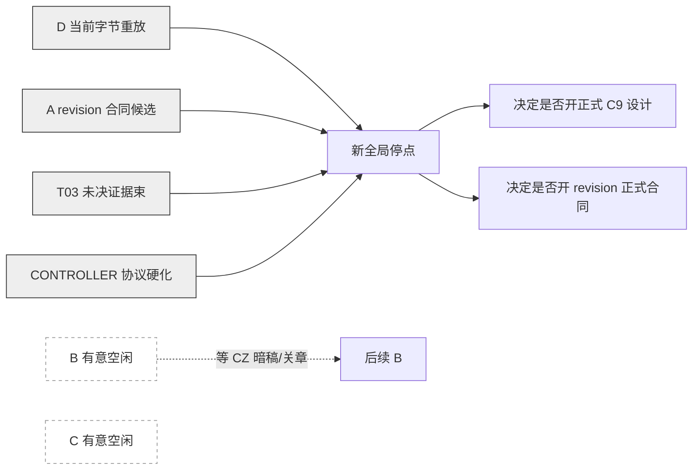

# 下一轮长阶段组合

## 组合判决

下一轮只建议四条运行线：`CONTROLLER / T03 / A / D`。`B / C` 有意空闲。这样能避免 A/B 再次碰 `PLAN_LEDGER_STORAGE.md`，也避免 C 在缺 revision/unresolved 身份时提前造正式 C9。

| 优先级 | 窗口 | SHOULD_RUN | 推荐阶段 | 独占写集 | 关键产出 |
|---:|---|---|---|---|---|
| P0 | CONTROLLER | YES | `CTRL-SHARED-PAGE-PROTOCOL-HARDENING-01` | `TEMP/shared_page_protocol_hardening_20260818_r01/**` | 协议 v2 候选、双 SHA、租约异常态、模拟回执 |
| P0 | D | YES | `D-CURRENT-BYTE-SEAM-REBASELINE-01` | `TEMP/t03_m1_m11_current_byte_seam_rebaseline_20260818_r01/**` | 四票当前字节重放＋B writer 接缝回归 |
| P1 | A | YES | `A-CHAPTER-REVISION-MINIMUM-CONTRACT-DESIGN-01` | `TEMP/m1_m4_chapter_revision_contract_candidate_20260818_r01/**` | 当前反例重放、owner/水位/锚/事务候选 |
| P1 | T03 | YES | `T03-UNRESOLVED-BUNDLE-AND-CLOSED-COUNTEREVIDENCE-01` | `TEMP/v0_c3_unresolved_bundle_stage_20260818_r02/**` | 非连续证据束、闭合反证、分母合同、离线门 |
| — | B | NO | `B-INTENTIONAL-IDLE-AFTER-M5-WRITER-01` | 无 | 保持 writer 基线，不碰暗稿／关章／revision |
| — | C | NO | `C-INTENTIONAL-IDLE-BEFORE-C9-01` | 无 | 冻结 R19＋R21，不扩 Prompt／模型／C9 |

## 运行顺序与并行关系

四条运行线可以并行，因为写集互不重叠：

- CONTROLLER 只写协议 TEMP；
- D 只写接缝重放 TEMP；
- A 只写 revision 候选 TEMP；
- T03 只写 unresolved 研究 TEMP；
- 任何窗口都不改正式合同／产品。

## 长阶段的共同纪律

每个运行阶段都必须完整覆盖：

`当前字节冻结 → 诊断／设计 → 实作候选或夹具 → 验证 → 相关回归 → 差分归因 → 自验收 → 收口回执`

普通 runner、格式、validator、单个测试失败、一次命令错误由本窗口自行修复继续，不能当提前停点。只允许在下面情况提前停：

- 缺少原始证据且无法安全恢复；
- 当前正式字节在阶段中变化，导致冻结基线失效；
- 写集与另一窗口冲突；
- 必须新增权限、费用、API、Gold、正式合同、R13 或产品语义；
- 发现路线会造成真值越权或不可恢复写入。

## CONTROLLER 长阶段摘要

目标不是“写更长 Prompt”，而是把共享页面从礼貌约定升级为可审计运输协议候选：

- 双／三 SHA：本地原件、运输脱敏、转换回执；
- 租约 TTL、heartbeat、cancel、异常态；
- instruction epoch、authority manifest、namespace；
- 页面回复 exactly-once capture 与 route receipt；
- 顾问建议永不携带授权；
- 六类攻击模拟：串线、旧字节、旧指令、重复回复、人工粘贴中断、权限措辞污染。

正式协议或 routes 配置变更：`CZ_EXPLICIT_APPROVAL_REQUIRED`。

## D 长阶段摘要

D 先冻结 B 当前正式文件 SHA，再执行：

1. READY-01～04 原夹具原断言重放；
2. 对每张票给“旧 PASS／新 PASS 或 FAIL”的字节差分归因；
3. 增加两组 B writer 接缝断言：facts 与 active RE stale 同事务；M7/C6 路径对 facts 只读；
4. 运行定向 novel-mvp 回归；
5. 保留所有语义 `SEMANTIC_UNJUDGED` 和合同 gap，不替 owner 拍字段。

不需要模型或 API。

## A 长阶段摘要

A 开头先在 B 最新字节上重放两个 WRONG_SUCCESS。之后不写产品，只产出最小合同候选：

- 同一章显式目标身份；
- lineage 与 revisions 的 owner 方案比较；
- append-only revision 与 restore-as-new；
- C4 stale/recheck 的三种语义方案及各自消费者影响；
- anchor 基准两案，禁止坐标混用；
- M2/M3/M4/M6/M7/planstore/M9/M10/M11 水位表；
- 多文件原子提交、迁移、恢复和回滚；
- 至少覆盖同章修改、相同重导、撤回新版、恢复旧版、锚迁移成功／失败、旧 fact 查询的机械夹具设计。

正式 owner 与合同选择：`CZ_EXPLICIT_APPROVAL_REQUIRED`。

## T03 长阶段摘要

T03 不再调同 Prompt。离线阶段要形成一个可审查但无真值权的“未决证据束”候选：

- 一个命题可引用多个不连续原文 span；
- 分开正向未决证据、备选方案、反对／未表态、明确闭合反证；
- 区分“原文明说尚未完成”与“当前覆盖内没看到完成动作”；
- 保留 qualifier、对象范围、actuality，不让模型写命题真值；
- 评测单位分开：bundle full、bundle partial、span recall、closure false trigger、ordinary negative false trigger；
- 用现有冻结材料做离线回放和反例扩充。

只有在候选冻结、评测分母冻结且 CZ 明字批准新 Gold/API 后，才可进入新未见阶段。不能默认沿用“没人反对即调用”。

## B 有意空闲

B 当前 writer 基线已经足够强。继续施工只会碰：

- 暗稿是否算签字；
- 收工是否允许开下一章；
- 关章；
- revision stale 如何进入 factstore。

这些都不是普通实现尾巴。B 应保持当前正式字节，不抢 A 的合同设计，也不替 CZ 决策。

## C 有意空闲

C 已经拿到本轮新增信息：预算规则能解决 REAL-06，不能解决 REAL-03。继续跑模型大概率只是重复。正式 C9 设计至少要看到：

- A 的 revision/source waterline 候选；
- T03 的 unresolved bundle 候选；
- D 在 B 当前字节上的接缝回执；
- planstore 当前读取身份与三消费方需求。

这些没齐前，C 最有价值的动作是冻结，不是制造更多 Prompt 版本。

## 下一次总审触发点

四条运行线都到完整收口，或任一条命中权限／语义硬停时，再做一次全局审查。不要在普通实现 bug 后频繁回传。

详细可直接路由的窗口文本见 `WINDOW_INSTRUCTIONS/`。

来源：六身份最新证据与本次全局接缝审查。
