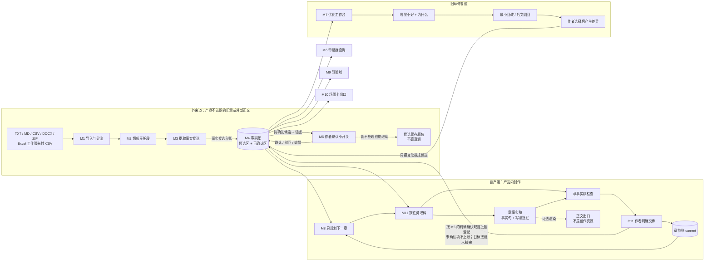
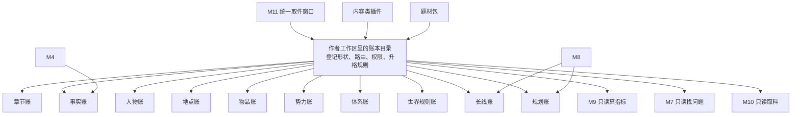

# novel-mvp 小说辅助产品总管线

> **页面身份：产品目标图，不是完成图。** 这里按 CZ 2026-08-20 的口径说明产品要怎样工作。当前合同和代码仍有旧单车道、旧“工作稿”机器名和未接好的账本；具体差距见下文“当前和目标不要混读”。

CZ 2026-08-13 拍板的建法：**整条产品线拆成模块，模块之间只认合同（数据格式），不认对方内部实现。** 好处：

- 某个模块做得不好，整个换掉，前后模块不受影响（例：抽取器换模型，只动 M3 内部，合同不变）；
- 合同要改，只惊动这份合同的收发两端，其他线路照跑；
- 每个模块可以交给不同 Agent 按合同独立施工，交付时只验「进什么、出什么」。

## 总管线：双车道，加一条旧章修复回路

两条车道和一条修复回路的大白话：

- **外来道**处理“小说辅助产品还不认识”的正文，所以要切段、抽取、请作者确认。
- **自产道**处理产品里已经按事实句组织好的章事实稿。它不能再回 M2／M3 重抽，避免把自己的结构化事实重新猜一遍。
- **旧章修复道**由 M7 给修法，作者选择后只处理发生变化的内容；不把整章重新扔进入料区。

## 真源怎么认

- 外来且不打算继续修改的旧章，作者确认过的导入版本是原文依据和原始证据；下游要用的结构化事实，仍须经过事实确认后进入事实账。
- 开始用产品创作后，要按范围认真源：**事实句是“已经发生”的真源；大纲、长线账和规划账是“准备怎么写”的真源。** 两边都权威，但不能互相冒充。正文和场景卡只是可以重新生成的出口。
- 只有作者明确确认过的事实才进入事实账。作者可以先不处理候选并继续创作；未处理不等于自动确认。
- 作者点击“以这版章事实稿为准”是一次明确动作，不是沉默确认。交棒时可以批量确认本章结构化事实；仍待确认的内容继续挂着，不给 M8 当下一章硬前提。
- 已经发生的放事实账，正在走的线放长线账，下一章怎么写放规划账。

## 仓库层：账本目录加 10 本固定账

每个项目开局就登记这 10 本账，空账也保留。内容少时可以只是一个小 JSON；内容变多或被频繁引用后再升级成更完整的结构。模块和插件始终走同一个取件窗口，不直接猜物理文件。完整口径见 [账本目录 R01](design/LEDGER_DIRECTORY_DESIGN_R01.md)。

## 模块清单：读进什么、产出什么、放哪、谁会用

| 能力 | 读进什么 | 产出什么 | 放到哪 | 谁会用 | 当前和目标的差距 |
|---|---|---|---|---|---|
| M1 入料区·导入与分流 | 外来文件、粘贴内容、作者声明的材料身份 | 材料身份和外来章节 current | 输入清单、材料架、章节账 | M2 和材料类功能 | 当前支持 TXT／MD／CSV／DOCX／ZIP；CSV 不猜表格字段，Excel 工作簿会明确停止并提示逐表转 CSV |
| M2 入料区·责任段 | 外来道的当前章节 | 带原文坐标的责任段 | 责任段快照 | M3 | 当前会读取所有 C1 current，尚不会识别外来道／自产道 |
| M3 入料区·事实提名 | 责任段和冻结／实时模型回包 | 带引文的事实候选 | 候选快照 | M4、M5 | 运输和严格解析已有切片；真实抽取质量仍需内容评测 |
| M4 事实账 | 当前章节证据、事实候选、作者明确动作 | 已确认事实和候选／驳回状态 | 事实账 | M6～M11 | 已有可运行切片；自产章事实在交棒时按确认规则直登的接缝尚未完成 |
| M5 作者确认小开关 | 外来候选、正文差异候选、章事实稿里的待确认事实和证据 | 确认／驳回／编辑后确认动作 | 动作结果写回事实账 | 所有只认真源的下游 | 当前要求作者逐条明确动作；目标可在“以这版为准”时批量确认，**不点完不会卡全线，也不会自动确认** |
| M6 带证据查询 | 作者问题、当前已确认事实、可见章节范围 | 事实句、引文和上下文 | 查询结果可临时保存或导出 | 作者、M7 等读侧能力 | 机械证据查询可用；不是自然语言剧情裁判 |
| M7 优化工作台 | 作者指出的问题、现行事实、世界规则和证据 | 问题位置、原因、最小回改与后文圆回两种修法 | 优化报告，只是投影 | 作者选择；被选修法再走差异确认 | 当前主要是一致性体检切片，完整优化工作台尚未做到；永远只报告不改书 |
| M8 下一章规划 | 已确认事实、规划账、长线账、作者目的 | 下一章选择卡、章计划、长线安排 | 规划账和长线账 | 章事实稿、M10、M11 | C7 和局部选择运输已有切片；选择卡全文保存、正式落账和长线账未完整接好 |
| M9 驾驶舱 | 已确认的事实及其他账本 | 目标进度、人物关系、故事线、重大选择、钩子等指标 | 可刷新的展示投影 | 作者 | 当前只有概览投影切片；指标清单还是候选，不进 127 条预期 |
| M10 场景卡出口 | 下一章规划、人物阶段、地点和事件绑定 | 场景卡、可复制文本、外部创作提示 | 导出文件或投影 | 视频／图片／外部写作工具 | 出口原型可用；可信人物阶段和故事时间取料还没接好 |
| M11 上下文打包 | 任务、预算和账本目录提供的材料 | 本次任务的小材料包、遗漏说明、回取码 | 任务包和安全回执 | 章事实稿、章事实稿检查、M6／M7／M8 | 确定性打包和部分回取码已有切片；10 本账还没有全部接上取件窗口 |
| 章事实稿 | 已确认事实、下一章规划、M11 材料包、写法插件批注 | 按交代顺序排列的事实句和写法批注 | 交棒后进入章节账 | 章事实稿检查、下一章规划、可选正文渲染 | 当前正式合同仍叫 WORK_DRAFT，内容形状也不是这套目标；需要另行迁移 |
| 章事实稿检查 | 未交棒的章事实稿、章槽、M11 材料包和检查要求 | 有证据的问题清单；不把“检查完”写成“全绿” | 检查结果账 | 作者决定是否交棒或修改 | 当前旧票号 T14 已有结果保存／读回切片，但检查对象仍是旧合同形状 |

M1～M4 对作者可以合称“入料区”，但四步继续分开记账；方便替换工具，也方便查清哪一步出错。T14 只保留作历史票号，不能再画成第 12 个模块。

## 当前和目标不要混读

| 目标产品口径 | 当前代码／合同实际情况 |
|---|---|
| 自产章是章事实稿，不回 M2／M3 | 当前 C1／C2 没有外来道与自产道标记，进入 C1 后仍会被 M2 切段 |
| C11 登记章事实稿 current | 当前 C11 管章节 revision，旧 WORK_DRAFT 合同仍偏正文式工作稿；章事实稿对象尚未落合同 |
| C10 只接外来文件 | 当前工作稿交棒路线曾借 C10 做受控来源；目标切换需要另行改合同和接缝 |
| 10 本固定账都有目录和统一取件窗口 | 当前作者工作区只有 chapters、facts、plan 等零散逻辑键，没有完整账本目录 |
| M7 是完整优化工作台 | 当前主要能给一致性／健康报告，不会完整生成两种修法 |
| M9 是只读驾驶舱 | 当前主要是概览卡原型，指标清单还没有冻结成产品合同 |
| Excel／CSV 属于入料区 | CSV 可按原文本进入材料身份链；XLS／XLSX／XLSM 不拆内部文件，明确提示逐表转 CSV，不能冒充已支持工作簿语义 |

这张差距表的作用是防止一句“方向已经拍了”被误读成“代码已经做好了”。方向改变后的合同迁移和模块接线要另开工程任务；本页不自动授权施工。

## 材料架（M1 分拣的目标槽位，CZ 2026-08-13 02:14 拍板）

用户导进来的东西远不止正文。每个书项目备好这些架子，导入器负责把混在一起的材料拆开、认出身份、放对位置：

| 架子 | 装什么 | 例子 | 后续谁消费 |
|---|---|---|---|
| 书名卡 | 小说名称 | 《万鬼伏藏》 | 全局 |
| 简介卡 | 详情页那种吸引人的文案——**可能与剧情毫无关系**，单独放，不混进事实 | 「一口棺材，葬尽天下鬼……」 | 展示层 |
| 类型标签 | 题材/频道/标签 | 悬疑·灵异·无限流 | 展示层／M8 规划参考 |
| 章节架 | 每章标题＋正文，逐章区分 | 第1章/第2章/第3章 | 只在外来道进入 M2 切段 → M3 抽取 |
| 大纲区 | 作者粘贴的整段大纲（全书/分卷） | 「第一卷主角发现……」 | M8 续写规划对照 |
| 设定集 | 世界观：等级体系、金手指、系统、朝代背景、世界机制、力量规则…… | 「灵气分九品；主角有签到系统」 | M8 规划＋M7 体检对照 |

三条铁规（承 SI-006 P3 拍板）：

1. **分拣结果永远是候选**：自动认完给作者一屏「分拣确认」（这段是简介、这三章是正文、这坨是世界观——不对可以改），确认后才入架。
2. **高影响错误零容忍**：把正文章节静默丢掉或错拆，是最严重的分拣事故；宁可标「不确定」让作者点一下。
3. **架子身份 ≠ 真值身份**：大纲和设定集属于「作者声明的参考材料」，不是抽取出来的事实账；它们进不进真值层，走各自的确认流程。

当前格式支持：TXT／MD／CSV 直读；CSV 保留原字节和解码文本，不解析表头、不猜列身份；DOCX 用标准库解包（zip+xml 抽正文）；ZIP 解包后对内容物递归分拣；纯粘贴按文本走。XLS／XLSX／XLSM 会在拆容器前整批停止，并提示把每个需要的工作表另存为 CSV UTF-8；这不等于支持 Excel 工作簿。

### T03-A 本地收口边界（2026-08-18）

- Explicit Intro／Setting／Title／Tags 已进入正式 C10 身份链；Unknown 不生成 C1。
- TXT／MD／CSV／DOCX／ZIP 共用本地格式路由，已覆盖的解码、容器、章序和 source-span 错误在写 C1 前失败关闭；Excel 工作簿也在写入前明确停止。
- 已知错误成功为 0；S1A F09、未声明前置区的 R03 和复杂格式长尾仍允许安全停止。
- `--outline` 仍是历史 C1 兼容入口，但 Pre-M3 admission 会阻断；迁移、R13 对齐、ADD-043 和长尾格式均为后续债。
- 身份只能写成 `CLOSED_LOCAL_PASS`，不代表生产上线或完整六架语义自动分诊。

## 当前合同清单（机器现实，尚未完成产品口径迁移）

下面列的是当前机器实际认的合同。正式合同里仍有 `WORK_DRAFT` 等旧名字；产品页面统一说“章事实稿”，但不能靠改中文说明假装合同形状已经迁完。

合同文件放 [contracts/](contracts/)，每份合同一个 md：字段表＋JSON 示例＋版本号。**改合同必须升版本号并同步收发两端；模块内部随便改，不用打招呼。**

| 代号 | 连接 | 内容一句话 | 状态 |
|---|---|---|---|
| C1 | M1／旧写作入口交棒→M2 | v0 字段描述现状（仍可能含 outline）；当前仍沿用旧工作稿交棒接收边界，尚未迁成“章事实稿自产道” | v0-r01 已落：[C1_CHAPTER_DOC.md](contracts/C1_CHAPTER_DOC.md) |
| C2 | M2→M3 | 责任段：正文段＋左右 halo＋位置信息 | v0 已落：[C2_SEGMENT.md](contracts/C2_SEGMENT.md) |
| C3 | M3→M4 | 事实候选：text＋quote 原文依据＋段落来源＋模型标注 | v0 已落：[C3_FACT_CANDIDATE.md](contracts/C3_FACT_CANDIDATE.md) |
| C4 | M4→下游 | 事实查询：状态（extracted/confirmed/rejected）＋证据＋章节坐标 | v0-r02 已落：[C4_FACT_QUERY.md](contracts/C4_FACT_QUERY.md) |
| FACT_REVIEW | M5 作者动作层→M4 | 确认／驳回／改判／改写后采纳的短命命令；旧 CLI 只保留兼容表面 | v1 已落：[FACT_REVIEW_ACTION.md](contracts/FACT_REVIEW_ACTION.md) |
| C5 | M9→M5 | 概览卡：本章事件梗概＋配图引用＋可展开的细节锚点 | 待落 |
| C6 | M7→UI | 体检报告：矛盾类型＋涉事事实＋双方证据＋严重度；矛盾/存疑/别名/完整性四账分开 | v0 已落：[C6_HEALTH_REPORT.md](contracts/C6_HEALTH_REPORT.md) |
| C7 | M8→CLI／临时消费者 | 一次出题快照，只覆盖写 `plan_latest.json`；不是规划账，不是 `plan.json` | v0 已落：[C7_PLOT_LAYER.md](contracts/C7_PLOT_LAYER.md) |
| PLAN_LEDGER | M8／画布→planstore | 规划账：未来怎么写，以及计划和书稿怎样对照 | 合同 r05 已落；`mvp/planstore.py` 已实现 handover＋跨文件恢复，`mvp/reconcile.py` 已实现六态观察／作者 facts 准入／stale；通用 planstore 其他动作未完成 |
| RECONCILIATION | C1＋C3＋planstore→M4/M5 | 短命六态候选与作者 facts 准入动作；模型只观察，作者确认后才接 confirmed C4 与 RE | v1 已落：[RECONCILIATION_CANDIDATE.md](contracts/RECONCILIATION_CANDIDATE.md)／[RECONCILIATION_FACT_ADMISSION_ACTION.md](contracts/RECONCILIATION_FACT_ADMISSION_ACTION.md) |
| WORK_DRAFT | 旧机器名→检测／收工／交棒动作层 | 当前合同仍保存正文式工作稿；目标产品要迁成“章事实稿”，但本页不改合同 | v1 已落：[WRITING_DESK_WORK_DRAFT.md](contracts/WRITING_DESK_WORK_DRAFT.md) |
| WRITING_CLOSEOUT | 写作区作者动作层→收工流程 | `full_check`／`skip_check`／`no_prose` 三路短命命令；不写规划账、不关章 | v1 已落：[WRITING_DESK_CLOSEOUT_ACTION.md](contracts/WRITING_DESK_CLOSEOUT_ACTION.md) |
| WORK_DRAFT_HANDOVER | 写作区作者动作层→C1 接收边界 | 显式“以这篇为准”的短命命令；C1 成功后才可进入 `handover_parts` | v1 已落：[WORK_DRAFT_HANDOVER_ACTION.md](contracts/WORK_DRAFT_HANDOVER_ACTION.md) |
| C8 | M10→外部 | 场景卡：画面描述＋人物＋情绪＋台词信息点（谁说出什么信息＋语气，**不给成句台词**——【一致性修订 20260813】ADD-017 J1 口径）（视频工作流可直接吃） | 正式 C8 尚未冻结；M10 本地原型切片已存在 |
| C9 | M11→M8/M6/M7 | 共同前提包：分区（铁律/近章/本线/望远/禁做/回取索引）＋每项「为何加载」＋预算与版本 | 设计稿有字段建议，待落 |
| C10 | M1 Intake writer→材料存储／C1 投影门 | source-span 材料身份＋authority＋revision；v2 增加 Setting，v3 增加 Title，v4 增加 Tags，仍只有 Confirmed Chapter 可生成章节 C1 | v4 正式合同已落并兼容 v1／v2／v3：[C10_INTAKE_MATERIAL_IDENTITY.md](contracts/C10_INTAKE_MATERIAL_IDENTITY.md)；运行时 Intro／Setting／Title／Tags 产品路径已接。正式 validator 仍冻结旧登记文字“Tags 产品未实现”和 `NON_BLOCKING_ADOPTION_STATUS_DEBT`，这是采用状态债，不代表当前运行时能力 |

## 设计纪律（旧设计打捞＋现行拍板凝练，2026-08-13）

1. **投影可改，进真值须确认**：概览（C5）、体检报告（C6）、场景卡（C8）、未来 MCP 回传，全部是投影——可以物化、会过期作废。产品内允许直接纠错；修改先停在投影／提案层，作者确认后才写宿主真值。导出的静态文件可以只读。不得在投影上另开第二真源。
2. **程序只验机械正确，人才验语义真假**：程序能核引文回填、位置、格式；「这条事实成不成立」只有作者在审查台点头才算，模型不给自己签绿票。
3. **计划不冒充事实，双车道不串线**：外来正文走 M1→M2→M3→M4 候选区→M5；自产章事实稿经作者明确交棒后直接登记，不回 M2／M3。规划只说明未来准备怎么写，不能因为被选中或被渲染就冒充已经发生。
4. **证据闭包**：M6 的回答默认「结论＋逐字引文＋前后文窗口」，不甩孤立的事实 ID。
5. **体检不整本亮红**：M7 只报直接矛盾＋可点开的双方证据；误报可豁免且留豁免理由，不做吓人的全书红灯墙。
6. **可回取 ≠ 预抽尽**：长期账只收作者确认的关键变化；细节问题回原文现查（M6 已支持），「抽干净整本书」不是完成标准。
7. **提示词工厂红线**（【一致性修订 20260813】ADD-017 J1）：产品把「怎么写」的全部思考给足——每段如何描写、这句对白要透露什么信息，可细到句级「描写要求」（全是现成大纲账的组装）；用户拿完整指导去任何外部写作 AI 生成正文。红线只有一条：**不给写作模型、不生成正文**——教程「生成的故事」、台词扩写、场景卡对白要点一律「给要求给信息点、不给成文」。

## 修改规则（三句话）

1. **模块内部**：随便改随便换，合同不变即可，改完自测过就交付（轻档）。
2. **合同**：升版本号，只通知收发两端模块改造，其他线路不动。
3. **加新模块**：定新合同挂上线路图，不改已有合同。

## 历史施工顺序（2026-08-13 快照，不再代表当前产品路线）

下面保留旧排期只为查历史。2026-08-20 之后的模块定位、双车道和账本目录，以本页前半段为准；不能拿旧“第几单”覆盖新产品口径。

1. **第一单（地基）**：把现有代码按上表拆成模块文件＋落地 C1–C4 合同。✅ 已完工（2026-08-13）。
2. **第二单**：M7 一致性体检原型——库里六本书 1352 条候选当试验田（CZ 已拍）。✅ 已完工（2026-08-13，两书实测＋误报抽查见 ISSUES I-014～I-017）。另：M3b 抽取质量管线（refine 六段）已随设计实装实测（ADD-015 边设计边实装授权），T-03 金标校准挂账待跑。

### 三单起重排【提案待 CZ 过目】（2026-08-13 一致性巡检提出；19 份设计稿齐了，原三/四/五单按依赖重排如下，未过目前旧顺序不作废）

| 单 | 内容 | 图纸 | 为什么排这里 |
|---|---|---|---|
| **第三单**（维持） | M1 材料架分拣＋C1 升 v1（材料包）；顺带修 I-014 重复 id＋砍 errors=ignore | INTAKE_SHELVES | C1 v1 材料包是版本管理和一切后续的地基；I-014 搭本单的车 |
| **第四单**（新插入） | 章版本管理（M1×M4 交界）：版本链＋证据锚三分流＋迁移对账屏＋存量书一次性冻 rev 1 脚本 | CHAPTER_REVISION | ADD-011 判 GAP-01 优先级最高（「修完书稿放不回产品」是打磨型作者每周踩的断头路）；依赖 C1 v1，紧跟第三单最省 |
| **第五单**（原四单） | M9 故事概览＋M5 审查台概览化（C5 落地）＋首屏体系骨架（层 0 书架/层 1 横带；接力点先出机械件＋C5 简版） | REVIEW_OVERVIEW＋FIRST_SCREEN | 概览是通用展示原则（F2：感官愉悦为主产品）；接力点全量等第六单反推供货，先上简版不空等 |
| **第六单 a**（原五单拆细） | 规划账地基：planstore（plan.json＋流水）＋反向剧情图管线 L1（影子章槽，第六单头一件）＋停点注册表接线（设置页读档，号谱见 REGISTRY §5.1） | PLAN_LEDGER_STORAGE＋REVERSE_PLOT_MAP＋STOP_POINT_REGISTRY | 反推是接力点和前提包的地基（GAP-03）；planstore 是它的落账处 |
| **第六单 b** | M8 核心环：M11 打包器（C9）→ 汇聚→编排→出题→铺满→收口（C7 v1）＋章工作台沙箱/选线（P20/P21）＋F-4 会话包＋M8 §1.6 出题实验（施工第一周跑） | M8_PLANNING＋CONTEXT_PACKER＋CHAPTER_WORKBENCH | **历史“只有 M8 使用 M11”已作废**；现行目标还包括章事实稿和章事实稿检查 |
| **第六单 c** | M8 周边件：插件 V0（8 组件出题链路）＋节奏包 V0（网文包收编成包，禁硬编码字面量）＋全书大纲引导＋监控台（BEAT/P19/P22/F-7）＋灵感账（P16）＋人物账 V0（实体行/NPC 卡/可变区搭章影班车，P18/F-6）＋**J5 混合输入＋落位核查（M8 R02 必吸收件）** | PLUGIN＋GENRE_RHYTHM＋GLOBAL_OUTLINE＋IDEA_LEDGER＋CHARACTER_LEDGER | 全部挂在 M8 出题链路上，链路通了逐件上；插件/理论包内容工单独立排期 |
| **第七单** | M10 场景卡出口（C8 按 J1 信息点口径）＋教程双路 R02 实装（J7 真书演示材料，吃三/五/六单全部产出）＋角色视角 V1 防降智重放（J6；吃人物账＋反推＋体检家族） | SCENE_CARD＋TUTORIAL＋ROLE_POV | 教程是全线产出的收口展示，最后装配最省返工；防降智排期 J6 已拍 |
| 并行/之后 | MCP V1 只读＋提案（核心环验证完成即做，Q6 时机不变）；拆书 V1（前置 M8 挂件表＋整本工程设施）；漫剧映射 V1（M10 后）；T-03 金标校准 | MCP_INTERFACE＋BOOK_DISSECT＋GENRE_RHYTHM | 各自前置齐了就开，不占主线 |

依赖主线一句话：**C1 v1（三单）→ 版本管理（四单）→ 概览（五单）→ planstore＋反推（六 a）→ M11＋M8（六 b）→ 周边件（六 c）→ 出口与教程（七单）**；付费墙相关一律冻结不排（J2）。

来源：CZ 2026-08-13 模块化拍板；CZ 2026-08-20 产品纠偏；Cursor／Codex 整理

修订记录：
- 2026-08-13 晚：M8 行改指 R02＋CLI 出题 V0；C7 v0 落地。亲拍已改 A9／G5。
- 一致性修订 20260813：M7 行改「进货检查」口径（G7）；C8 行对白要点改台词信息点（J1）；设计纪律补第 7 条提示词工厂红线（J1）；M8/M9/M10 现状挂设计稿指针；施工顺序三单起给重排提案【提案待 CZ 过目】。设计稿群一致性巡检执行。
- 2026-08-15：按 SI-016 清旧句。M4 收窄为已确认事实写域；C7 标明出题快照；规划账合同挂上；投影可改、进真值须确认；M8 指 R04。
- 2026-08-20：改成外来道／自产道双车道，加一条旧章修复回路；自产章事实稿不再回 M2／M3；M5 改成确认小开关，M7 改成优化工作台，M9 改成只读驾驶舱；新增账本目录和 10 本固定账，并单列当前与目标差距。
