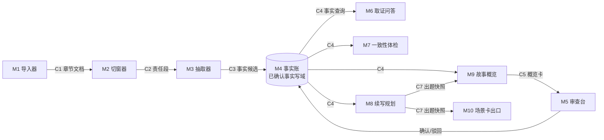

# novel-mvp 模块化线路图

CZ 2026-08-13 拍板的建法：**整条产品线拆成模块，模块之间只认合同（数据格式），不认对方内部实现。** 好处：

- 某个模块做得不好，整个换掉，前后模块不受影响（例：抽取器换模型，只动 M3 内部，合同不变）；
- 合同要改，只惊动这份合同的收发两端，其他线路照跑；
- 每个模块可以交给不同 Agent 按合同独立施工，交付时只验「进什么、出什么」。

## 线路图

结构核心一句话：**M4 是已确认事实的唯一写域**——上游只能投「候选」，只有 M5 里作者确认过的才升级成事实真值。问未来安排看规划账，问书稿写了什么看冻结书稿，问作者私下已定事实看作者签字来源。下游（问答/体检/规划/概览）只读事实账，不能把「现在该怎么写」也丢给 C4。

## 模块清单

| 代号 | 名字 | 管什么 | 吃 | 吐 | 现状 |
|---|---|---|---|---|---|
| M0 | 编排器 | CLI／未来 Web 入口，按用户命令调其他模块 | 用户命令 | — | `cli.py` 已拆净：只剩参数解析＋模块调用（第一单） |
| M1 | 导入器 | 多格式接收（TXT/MD/DOCX/ZIP/粘贴）→ 拆单元 → 明确身份上架（见下「材料架」）→ 作者确认；身份不清时 Unknown／强停，不靠内容猜 | 用户文件 | C10 → C1 | T03-A 已 `CLOSED_LOCAL_PASS`：常用入口统一 C10-first，只有 Confirmed Chapter 可生成 C1；不是 Production Ready，语义自动分类未实现 |
| M2 | 切窗器 | 章节 → 冠军结构责任段（620–923 字＋180 halo） | C1 | C2 | `mvp/segment.py` 已拆出 |
| M3 | 抽取器 | 责任段 → 事实句候选（调 API） | C2 | C3 | `mvp/extract.py` 已收窄：只剩 prompt 构造＋arkcli 调用＋JSON 解析；换模型/Prompt 只动这里 |
| M4 | 事实账 | 候选入账、确认/驳回、状态管理、查询；已确认事实的唯一写域 | C3＋审查操作 | C4 | `mvp/factstore.py` 是唯一 facts 事务 writer；`store.py` 保留兼容调用面（schema v0 临时件，等 N16） |
| M5 | 审查台 | 作者确认界面：默认故事概览（半屏图＋梗概），点开看细节 | C5＋C4 | FACT_REVIEW_ACTION → M4 | `cli.py confirm` 极简版已统一走事务；概览 UX 待建 |
| M6 | 取证问答 | 关键词/问题 → 带原文依据的回答 | C4 | 回答＋证据 | `mvp/ask.py` 已拆出（关键词全含匹配版） |
| M7 | 一致性体检 | **导入口岸的进货检查**（【一致性修订 20260813】ADD-013 G7）：存量正文扫内伤（人名/时间线/设定冲突，每条带证据）＋新章正文粘回入库时的增量核对；不做例行全书体检；创作侧仍须做关章质检及必要的本章增量检查 | C4 | C6 | `mvp/check.py` 已建（第二单）：机械分组＋一组一次调用＋四账分开（矛盾/存疑/别名/完整性），报告分层（真值≠候选） |
| M8 | 续写规划 | 事实账＋作者目的 → 卡片选项＋卡上目的注解＋写作指导（副产品）；冲突爆出；可反向拆前置卡。不代写正文 | C4＋用户意图＋规划账 | C7 出题快照 | CLI 最小出题 V0 已建（`mvp/plan.py`，`cli.py plan`）；网页画布未建。设计：[M8_PLANNING_DESIGN_R04.md](design/M8_PLANNING_DESIGN_R04.md)；字段：[PLAN_LEDGER_STORAGE.md](contracts/PLAN_LEDGER_STORAGE.md) |
| M9 | 故事概览 | 章节事实 → 事件梗概＋配图（SVG），审查和教程共用 | C4 | C5 | 未建（回应 I-008）；设计稿 [REVIEW_OVERVIEW_DESIGN_R03.md](design/REVIEW_OVERVIEW_DESIGN_R03.md) |
| M10 | 场景卡出口 | 剧情层 → 场景卡 JSON（给即梦/可灵等视频工作流） | C7 | C8 | 未建；设计稿 design/SCENE_CARD_EXPORT_DESIGN_R01.md（台词字段已按 J1 改信息点口径） |
| M11 | 上下文打包器 | 按任务编译「共同前提包」：两轴定档五档压缩＋硬预算＋保底集＋缺料逃生；账本细、执行包瘦的执行者 | C4＋规划账＋任务描述 | C9 | 设计稿完成（design/CONTEXT_PACKER_DESIGN_R01.md），随 M8 第一单施工 |

## 材料架（M1 分拣的目标槽位，CZ 2026-08-13 02:14 拍板）

用户导进来的东西远不止正文。每个书项目备好这些架子，导入器负责把混在一起的材料拆开、认出身份、放对位置：

| 架子 | 装什么 | 例子 | 后续谁消费 |
|---|---|---|---|
| 书名卡 | 小说名称 | 《万鬼伏藏》 | 全局 |
| 简介卡 | 详情页那种吸引人的文案——**可能与剧情毫无关系**，单独放，不混进事实 | 「一口棺材，葬尽天下鬼……」 | 展示层 |
| 类型标签 | 题材/频道/标签 | 悬疑·灵异·无限流 | 展示层／M8 规划参考 |
| 章节架 | 每章标题＋正文，逐章区分 | 第1章/第2章/第3章 | M2 切窗 → M3 抽取（正线） |
| 大纲区 | 作者粘贴的整段大纲（全书/分卷） | 「第一卷主角发现……」 | M8 续写规划对照 |
| 设定集 | 世界观：等级体系、金手指、系统、朝代背景、世界机制、力量规则…… | 「灵气分九品；主角有签到系统」 | M8 规划＋M7 体检对照 |

三条铁规（承 SI-006 P3 拍板）：

1. **分拣结果永远是候选**：自动认完给作者一屏「分拣确认」（这段是简介、这三章是正文、这坨是世界观——不对可以改），确认后才入架。
2. **高影响错误零容忍**：把正文章节静默丢掉或错拆，是最严重的分拣事故；宁可标「不确定」让作者点一下。
3. **架子身份 ≠ 真值身份**：大纲和设定集属于「作者声明的参考材料」，不是抽取出来的事实账；它们进不进真值层，走各自的确认流程。

格式支持：TXT/MD 直读；DOCX 用标准库解包（zip+xml 抽正文）；ZIP 解包后对内容物递归分拣；纯粘贴按文本走。

### T03-A 本地收口边界（2026-08-18）

- Explicit Intro／Setting／Title／Tags 已进入正式 C10 身份链；Unknown 不生成 C1。
- TXT／MD／DOCX／ZIP 共用本地格式路由，已覆盖的解码、容器、章序和 source-span 错误在写 C1 前失败关闭。
- 已知错误成功为 0；S1A F09、未声明前置区的 R03 和复杂格式长尾仍允许安全停止。
- `--outline` 仍是历史 C1 兼容入口，但 Pre-M3 admission 会阻断；迁移、R13 对齐、ADD-043 和长尾格式均为后续债。
- 身份只能写成 `CLOSED_LOCAL_PASS`，不代表生产上线或完整六架语义自动分诊。

## 合同清单

合同文件放 [contracts/](contracts/)，每份合同一个 md：字段表＋JSON 示例＋版本号。**改合同必须升版本号并同步收发两端；模块内部随便改，不用打招呼。**

| 代号 | 连接 | 内容一句话 | 状态 |
|---|---|---|---|
| C1 | M1／写作区交棒→M2 | v0 字段描述现状（仍可能含 outline）；v0-r01 补工作稿经作者显式交棒后才进入 C1 的接收边界 | v0-r01 已落：[C1_CHAPTER_DOC.md](contracts/C1_CHAPTER_DOC.md) |
| C2 | M2→M3 | 责任段：正文段＋左右 halo＋位置信息 | v0 已落：[C2_SEGMENT.md](contracts/C2_SEGMENT.md) |
| C3 | M3→M4 | 事实候选：text＋quote 原文依据＋段落来源＋模型标注 | v0 已落：[C3_FACT_CANDIDATE.md](contracts/C3_FACT_CANDIDATE.md) |
| C4 | M4→下游 | 事实查询：状态（extracted/confirmed/rejected）＋证据＋章节坐标 | v0-r02 已落：[C4_FACT_QUERY.md](contracts/C4_FACT_QUERY.md) |
| FACT_REVIEW | M5 作者动作层→M4 | 确认／驳回／改判／改写后采纳的短命命令；旧 CLI 只保留兼容表面 | v1 已落：[FACT_REVIEW_ACTION.md](contracts/FACT_REVIEW_ACTION.md) |
| C5 | M9→M5 | 概览卡：本章事件梗概＋配图引用＋可展开的细节锚点 | 待落 |
| C6 | M7→UI | 体检报告：矛盾类型＋涉事事实＋双方证据＋严重度；矛盾/存疑/别名/完整性四账分开 | v0 已落：[C6_HEALTH_REPORT.md](contracts/C6_HEALTH_REPORT.md) |
| C7 | M8→CLI／临时消费者 | 一次出题快照，只覆盖写 `plan_latest.json`；不是规划账，不是 `plan.json` | v0 已落：[C7_PLOT_LAYER.md](contracts/C7_PLOT_LAYER.md) |
| PLAN_LEDGER | M8／画布→planstore | 规划账：未来怎么写，以及计划和书稿怎样对照 | 合同 r05 已落；`mvp/planstore.py` 已实现 handover＋跨文件恢复，`mvp/reconcile.py` 已实现六态观察／作者 facts 准入／stale；通用 planstore 其他动作未完成 |
| RECONCILIATION | C1＋C3＋planstore→M4/M5 | 短命六态候选与作者 facts 准入动作；模型只观察，作者确认后才接 confirmed C4 与 RE | v1 已落：[RECONCILIATION_CANDIDATE.md](contracts/RECONCILIATION_CANDIDATE.md)／[RECONCILIATION_FACT_ADMISSION_ACTION.md](contracts/RECONCILIATION_FACT_ADMISSION_ACTION.md) |
| WORK_DRAFT | 写作区 owner→检测／收工／交棒动作层 | 同一章槽的作者当前工作稿＋单调 revision；不是 C1、冻结书稿或事实 | v1 已落：[WRITING_DESK_WORK_DRAFT.md](contracts/WRITING_DESK_WORK_DRAFT.md) |
| WRITING_CLOSEOUT | 写作区作者动作层→收工流程 | `full_check`／`skip_check`／`no_prose` 三路短命命令；不写规划账、不关章 | v1 已落：[WRITING_DESK_CLOSEOUT_ACTION.md](contracts/WRITING_DESK_CLOSEOUT_ACTION.md) |
| WORK_DRAFT_HANDOVER | 写作区作者动作层→C1 接收边界 | 显式“以这篇为准”的短命命令；C1 成功后才可进入 `handover_parts` | v1 已落：[WORK_DRAFT_HANDOVER_ACTION.md](contracts/WORK_DRAFT_HANDOVER_ACTION.md) |
| C8 | M10→外部 | 场景卡：画面描述＋人物＋情绪＋台词信息点（谁说出什么信息＋语气，**不给成句台词**——【一致性修订 20260813】ADD-017 J1 口径）（视频工作流可直接吃） | 未开工 |
| C9 | M11→M8/M6/M7 | 共同前提包：分区（铁律/近章/本线/望远/禁做/回取索引）＋每项「为何加载」＋预算与版本 | 设计稿有字段建议，待落 |
| C10 | M1 Intake writer→材料存储／C1 投影门 | source-span 材料身份＋authority＋revision；v2 增加 Setting，v3 增加 Title，v4 增加 Tags，仍只有 Confirmed Chapter 可生成章节 C1 | v4 正式合同已落并兼容 v1／v2／v3：[C10_INTAKE_MATERIAL_IDENTITY.md](contracts/C10_INTAKE_MATERIAL_IDENTITY.md)；运行时 Intro／Setting／Title／Tags 产品路径已接。正式 validator 仍冻结旧登记文字“Tags 产品未实现”和 `NON_BLOCKING_ADOPTION_STATUS_DEBT`，这是采用状态债，不代表当前运行时能力 |

## 设计纪律（旧设计打捞＋现行拍板凝练，2026-08-13）

1. **投影可改，进真值须确认**：概览（C5）、体检报告（C6）、场景卡（C8）、未来 MCP 回传，全部是投影——可以物化、会过期作废。产品内允许直接纠错；修改先停在投影／提案层，作者确认后才写宿主真值。导出的静态文件可以只读。不得在投影上另开第二真源。
2. **程序只验机械正确，人才验语义真假**：程序能核引文回填、位置、格式；「这条事实成不成立」只有作者在审查台点头才算，模型不给自己签绿票。
3. **计划不冒充事实**：M8 续写规划的产物永远标「计划」；新章写成后走 M1→M3→M5 正常入账，计划和事实不进同一张表。
4. **证据闭包**：M6 的回答默认「结论＋逐字引文＋前后文窗口」，不甩孤立的事实 ID。
5. **体检不整本亮红**：M7 只报直接矛盾＋可点开的双方证据；误报可豁免且留豁免理由，不做吓人的全书红灯墙。
6. **可回取 ≠ 预抽尽**：长期账只收作者确认的关键变化；细节问题回原文现查（M6 已支持），「抽干净整本书」不是完成标准。
7. **提示词工厂红线**（【一致性修订 20260813】ADD-017 J1）：产品把「怎么写」的全部思考给足——每段如何描写、这句对白要透露什么信息，可细到句级「描写要求」（全是现成大纲账的组装）；用户拿完整指导去任何外部写作 AI 生成正文。红线只有一条：**不给写作模型、不生成正文**——教程「生成的故事」、台词扩写、场景卡对白要点一律「给要求给信息点、不给成文」。

## 修改规则（三句话）

1. **模块内部**：随便改随便换，合同不变即可，改完自测过就交付（轻档）。
2. **合同**：升版本号，只通知收发两端模块改造，其他线路不动。
3. **加新模块**：定新合同挂上线路图，不改已有合同。

## 施工顺序

1. **第一单（地基）**：把现有代码按上表拆成模块文件＋落地 C1–C4 合同。✅ 已完工（2026-08-13）。
2. **第二单**：M7 一致性体检原型——库里六本书 1352 条候选当试验田（CZ 已拍）。✅ 已完工（2026-08-13，两书实测＋误报抽查见 ISSUES I-014～I-017）。另：M3b 抽取质量管线（refine 六段）已随设计实装实测（ADD-015 边设计边实装授权），T-03 金标校准挂账待跑。

### 三单起重排【提案待 CZ 过目】（2026-08-13 一致性巡检提出；19 份设计稿齐了，原三/四/五单按依赖重排如下，未过目前旧顺序不作废）

| 单 | 内容 | 图纸 | 为什么排这里 |
|---|---|---|---|
| **第三单**（维持） | M1 材料架分拣＋C1 升 v1（材料包）；顺带修 I-014 重复 id＋砍 errors=ignore | INTAKE_SHELVES | C1 v1 材料包是版本管理和一切后续的地基；I-014 搭本单的车 |
| **第四单**（新插入） | 章版本管理（M1×M4 交界）：版本链＋证据锚三分流＋迁移对账屏＋存量书一次性冻 rev 1 脚本 | CHAPTER_REVISION | ADD-011 判 GAP-01 优先级最高（「修完书稿放不回产品」是打磨型作者每周踩的断头路）；依赖 C1 v1，紧跟第三单最省 |
| **第五单**（原四单） | M9 故事概览＋M5 审查台概览化（C5 落地）＋首屏体系骨架（层 0 书架/层 1 横带；接力点先出机械件＋C5 简版） | REVIEW_OVERVIEW＋FIRST_SCREEN | 概览是通用展示原则（F2：感官愉悦为主产品）；接力点全量等第六单反推供货，先上简版不空等 |
| **第六单 a**（原五单拆细） | 规划账地基：planstore（plan.json＋流水）＋反向剧情图管线 L1（影子章槽，第六单头一件）＋停点注册表接线（设置页读档，号谱见 REGISTRY §5.1） | PLAN_LEDGER_STORAGE＋REVERSE_PLOT_MAP＋STOP_POINT_REGISTRY | 反推是接力点和前提包的地基（GAP-03）；planstore 是它的落账处 |
| **第六单 b** | M8 核心环：M11 打包器（C9）→ 汇聚→编排→出题→铺满→收口（C7 v1）＋章工作台沙箱/选线（P20/P21）＋F-4 会话包＋M8 §1.6 出题实验（施工第一周跑） | M8_PLANNING＋CONTEXT_PACKER＋CHAPTER_WORKBENCH | M11 随 M8（唯一直接消费者）；实验先行再锁 Prompt |
| **第六单 c** | M8 周边件：插件 V0（8 组件出题链路）＋节奏包 V0（网文包收编成包，禁硬编码字面量）＋全书大纲引导＋监控台（BEAT/P19/P22/F-7）＋灵感账（P16）＋人物账 V0（实体行/NPC 卡/可变区搭章影班车，P18/F-6）＋**J5 混合输入＋落位核查（M8 R02 必吸收件）** | PLUGIN＋GENRE_RHYTHM＋GLOBAL_OUTLINE＋IDEA_LEDGER＋CHARACTER_LEDGER | 全部挂在 M8 出题链路上，链路通了逐件上；插件/理论包内容工单独立排期 |
| **第七单** | M10 场景卡出口（C8 按 J1 信息点口径）＋教程双路 R02 实装（J7 真书演示材料，吃三/五/六单全部产出）＋角色视角 V1 防降智重放（J6；吃人物账＋反推＋体检家族） | SCENE_CARD＋TUTORIAL＋ROLE_POV | 教程是全线产出的收口展示，最后装配最省返工；防降智排期 J6 已拍 |
| 并行/之后 | MCP V1 只读＋提案（核心环验证完成即做，Q6 时机不变）；拆书 V1（前置 M8 挂件表＋整本工程设施）；漫剧映射 V1（M10 后）；T-03 金标校准 | MCP_INTERFACE＋BOOK_DISSECT＋GENRE_RHYTHM | 各自前置齐了就开，不占主线 |

依赖主线一句话：**C1 v1（三单）→ 版本管理（四单）→ 概览（五单）→ planstore＋反推（六 a）→ M11＋M8（六 b）→ 周边件（六 c）→ 出口与教程（七单）**；付费墙相关一律冻结不排（J2）。

来源：CZ 2026-08-13 模块化拍板；Cursor 设计

修订记录：
- 2026-08-13 晚：M8 行改指 R02＋CLI 出题 V0；C7 v0 落地。亲拍已改 A9／G5。
- 一致性修订 20260813：M7 行改「进货检查」口径（G7）；C8 行对白要点改台词信息点（J1）；设计纪律补第 7 条提示词工厂红线（J1）；M8/M9/M10 现状挂设计稿指针；施工顺序三单起给重排提案【提案待 CZ 过目】。设计稿群一致性巡检执行。
- 2026-08-15：按 SI-016 清旧句。M4 收窄为已确认事实写域；C7 标明出题快照；规划账合同挂上；投影可改、进真值须确认；M8 指 R04。
