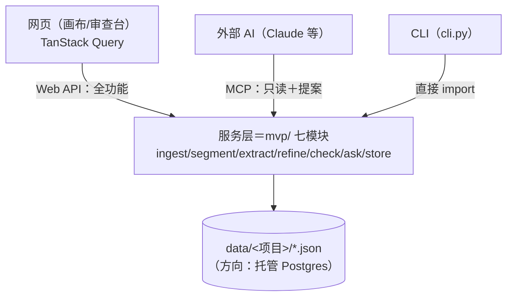

# 「故事真源引擎」API 暴露层设计稿 R01

身份：**轻档设计稿。** 回答 CZ 的原问题——「这些如何暴露 API，然后网页是可以接入哪些内容的」。把现有 CLI 形态的 MVP 模块（M1–M7）包成网页和外部程序能调的 HTTP API 层；端点名、字段名是建议值，不是施工合同。
前提已拍，本稿不重新讨论：托管 Postgres 方向＋前端 TanStack Query 消费（挂账本 ADD-025）；外部工具写侧只能提案、写入正史永不开放（Q6／N05-A，详见 [MCP_INTERFACE_DESIGN_R01.md](MCP_INTERFACE_DESIGN_R01.md)）。

---

## 0. 一句话＋一张图

**业务逻辑不动，在 mvp/ 七个模块外面加一层薄薄的 HTTP 壳；这层壳有两张脸——网页 API（作者本人，全功能）和 MCP（外部 AI，只读＋提案）——CLI 继续当第三张脸留着调试用。**



关键认识：现在的 `cli.py` 已经是「参数解析＋调模块＋打印」的编排壳，**API 层就是它的孪生兄弟**——同样只做参数解析＋调模块，把「打印」换成「返回 JSON」。合同（C1–C6）在模块间怎么流，一个字不用改。

---

## 1. 框架选择：FastAPI（替拍，理由如下）

推荐 **FastAPI ＋ uvicorn**，不是随大流：

1. **Pydantic 模型＝合同的代码化**。C1–C6 合同是字段表，FastAPI 用 Pydantic 声明请求/响应模型，等于把合同抄成可执行的校验器——合同升版本，Pydantic 模型跟着升，一处定义两处受益（校验＋文档）。
2. **自动出 OpenAPI 文档**。前端设计员拿 `/docs` 页面就能看到全部端点和 schema，TanStack Query 可以配代码生成器（如 orval）从 OpenAPI 直接生成带类型的查询钩子——前后端合同对齐不靠口头。
3. **原生异步**。抽取/体检是长任务，FastAPI 的 asyncio 底座跟第 3 节的进程内队列是同一套事件循环，不用额外线程模型。
4. 备选淘汰理由：Flask 要自己拼校验和文档，等于手写一遍合同；Django 全家桶太重，我们没有 ORM/Admin/模板的需求（存储层 v0 还是 JSON 文件）。

### 1.1 服务化前必须做的三个小改造（不是重构，是排雷）

现有模块是给 CLI 写的，有三个习惯搬进服务层会出事，列在这里当施工注意：

| 雷 | 现状 | 改法 |
|---|---|---|
| `SystemExit` 当错误 | `store.py`/`check.py` 里「项目不存在」「章节不存在」直接 `raise SystemExit` | 换成领域异常（如 `NotFoundError`），API 层译成 404/400；CLI 层照旧译成退出码。改模块内部，合同不动 |
| 文件直写无锁 | `_save` 整文件覆盖写，两个并发请求同时确认事实会互相吞写 | V0 最省方案：**写操作全部经过第 3 节的单 worker 串行执行**，读操作随便并发。等上 Postgres 自然消失 |
| `ingest_files` 吃文件路径 | CLI 传本地路径 | 网页传的是上传内容；`ingest_text`（吃标题＋文本）已经存在，API 走它，`ingest_files` 留给 CLI |

---

## 2. 服务层切分：端点 → 模块函数映射

原则一句话：**每个端点背后就是一个现成模块函数，schema 引用现有合同，不发明第二套。**

| 端点 | 背后的模块函数 | 请求体 | 响应体（引用合同） |
|---|---|---|---|
| 建项目 | `store.init_project` | `{name}` | 项目元信息（project.json 同款） |
| 列/查项目 | `store.chapters`＋`store.facts` 计数 | — | 概况计数（cli `status` 同款口径） |
| 导入章节 | `ingest.ingest_text`（逐份） | `{title, text, kind}` 数组 | [C1](../contracts/C1_CHAPTER_DOC.md) 章节文档＋导入损失报告（C1 附录） |
| 列章节 | `store.chapters` | — | C1 列表（**默认不含 `text` 全文**，见 4.2 体量预算） |
| 读单章 | `store.chapters` 过滤 | — | C1 单条（含全文） |
| 提交抽取任务 | `segment.segment_chapter` → `ex.extract_segment` → `store.add_fact_candidates`（cli `cmd_extract` 同款编排，搬进 worker） | `{chapter_id?, redo}` | 任务号（第 3 节任务模型） |
| 提交精修任务 | `refine.run_pipeline`（cli `cmd_refine` 编排） | `{chapter_id, stages, fresh}` | 任务号；结果＝质量小票报告 |
| 提交体检任务 | `check.run_check` → `check.save_report` | `{}` | 任务号；结果＝[C6](../contracts/C6_HEALTH_REPORT.md) 报告 |
| 体检预演 | `check.format_plan` 的数据版（`build_groups`） | — | 分组计划＋预计调用次数（**零模型调用，同步**） |
| 读体检报告 | 读 `health_report.json` | — | C6 报告（分账分页给，见 4.2） |
| 列事实/候选 | `store.facts`＋过滤分页 | 查询参数 `status/chapter_id/q/page` | [C4](../contracts/C4_FACT_QUERY.md) 列表 |
| 确认/驳回单条 | `store.set_status`／`store.edit_fact_text` | `{action, text?, reason_tag?}` | 更新后的 C4 单条 |
| 批量处置 | 循环 `store.set_status`（worker 内串行） | 处置数组 | 逐条结果 |
| 事实检索 | `ask.search_confirmed` | 查询参数 `keywords` | C4＋`chapter_title`（M6 现有口径，只回 confirmed） |
| 修账 | `store.repair_ids` | — | 修账报告（I-014 同款） |
| 概览首屏包 | 组合调用（见 4.1） | — | 新增轻合同 C-OV（本稿提议，见 4.1） |

外部候选载入（cli `candidates` 命令、[C3](../contracts/C3_FACT_CANDIDATE.md) 文件入口）不开 HTTP 端点——网页没有这个场景，外部投递候选的正路是将来 MCP 的 `propose_change`。

---

## 3. 异步任务模型

### 3.1 队列选型：进程内单 worker，不上 Redis（替拍）

抽取一章＝4 段 × 每段一次模型调用（10–30 秒），整本 10 章要 10–20 分钟；体检一次 9–14 次调用、约 2 分钟。这类任务不能让 HTTP 请求干等，必须异步。但 MVP 阶段：

- **单作者单机**：arkcli 凭证在本机 profile 里，任务天然绑这台机器，分布式队列没有用武之地；
- **任务幂等可重跑**：抽取自带「已有结果跳过、`--redo` 强制」逻辑，进程重启丢了排队中的任务，重新点一下就行，不丢数据；
- **量级**：一个作者同时排队的任务是个位数。

所以 V0 方案：**asyncio 进程内队列＋单 worker 串行消费**。arkcli 是阻塞 subprocess，worker 里丢线程池跑（`to_thread`），不堵事件循环。单 worker 串行还顺手解决了 1.1 的文件并发写问题——一石二鸟。

任务记录落盘 `data/<项目>/jobs.json`（活任务态在内存，落盘只为重启后能看历史和结果指针）。任务对象：

```json
{
  "job_id": "j-20260813-001",
  "type": "extract | refine | check",
  "project": "万鬼伏藏",
  "params": {"chapter_id": "c03", "redo": false},
  "status": "queued | running | done | failed",
  "progress": {"stage": "c03·段2/4", "calls_done": 5, "calls_total": 12, "errors": []},
  "result_ref": "health_report.json 或内联结果",
  "created_at": "…", "started_at": "…", "finished_at": "…"
}
```

进度数据是现成的——`cmd_extract`/`run_check` 已经有 `on_imported`/`on_group` 回调在给 CLI 打进度行，worker 把同一个回调改成「更新 job.progress」即可，模块零改动。

**什么时候才需要升级**：上托管 Postgres、服务跑到云上、或出现多实例时，队列跟着搬进 **Postgres 任务表（`SELECT … FOR UPDATE SKIP LOCKED`）**，不引入 Redis——能靠已拍板的 Postgres 解决的，不加第二个中间件。Redis 只有在将来出现「秒级高频任务」时再议（可预见的未来没有）。

### 3.2 进度怎么给前端：轮询，不上 SSE（替拍）

V0 用**轮询**：前端 TanStack Query 对 `GET /jobs/{id}` 设 `refetchInterval: 2000`（任务运行中 2 秒一拍，done/failed 后停）。理由：

- 单次进度响应 <1KB，2 秒一拍对低网速零压力；
- 任务本身以「十秒级」为单位推进（一次模型调用 10–30 秒），2 秒轮询的实时感绰绰有余；
- TanStack Query 的轮询是一行配置，SSE 要额外的连接管理、断线重连、代理兼容——为「进度条丝滑 2 秒」不值得。

SSE 留作 V1 可选项，触发条件：出现真正的流式场景（如逐条推送抽取出的候选、协作场景他人操作实时可见）。

---

## 4. 端点清单 v0

鉴权级别只有一档：**AUTHOR**（作者本人钥匙，见第 6 节）——**没有任何匿名/公开端点，没带钥匙一律 401**（N05-A「默认拒读」在 HTTP 层的落法）。体量为典型响应的估算值，供低网速预算参考。

### 4.1 项目与概览

| 端点 | 同步性 | 体量 | 说明 |
|---|---|---|---|
| `POST /projects` | 同步 | <1KB | 建项目 |
| `GET /projects` | 同步 | <2KB | 项目列表＋各账计数 |
| `GET /projects/{p}/overview` | 同步 | 5–20KB | **画布首屏包**，见下 |
| `POST /projects/{p}/repair-ids` | 同步 | <5KB | 修账（维护类，I-014） |

`overview` 是给画布首屏专门拼的一口——目标是**首屏一次请求全拿到，不让低网速用户等五个瀑布请求**：

- 项目元信息＋章节列表（id/标题/kind/字数/每章事实计数，**不含正文**）；
- 事实账计数（候选/已确认/已拒绝，按章分布）；
- 待确认候选数（审查台入口的红点数字）；
- 最近体检摘要（C6 的 `summary`＋`generated_at`，不含条目明细）；
- 运行中/最近的任务简表。

这是本稿唯一提议新增的轻合同（暂名 C-OV）：它是纯投影快照，全部字段从 C1/C4/C6 现有数据聚合，不产生新的真源。

### 4.2 章节与导入

| 端点 | 同步性 | 体量 | 说明 |
|---|---|---|---|
| `POST /projects/{p}/chapters` | 同步 | <2KB | 单章/批量导入（JSON 数组：`{title, text, kind}`），返回 C1＋损失报告。纯写盘不调模型，10 章一批也在 1 秒内，**不需要做成异步任务** |
| `GET /projects/{p}/chapters` | 同步 | <5KB | 列表，不含全文 |
| `GET /projects/{p}/chapters/{c}` | 同步 | 10–30KB | 单章含全文（一章 3–8 千字 ≈ 10–25KB UTF-8）。正文按章拿，永不出现「全书正文一口返回」的端点 |

批量导入的「进度查询」在 v0 不需要单独机制：同步返回损失报告就是结果。将来 M1 材料架分拣（三单，含 DOCX/ZIP）落地后，分拣＋确认才升级成异步任务＋分拣确认屏，届时沿用第 3 节任务模型。

### 4.3 抽取与任务

| 端点 | 同步性 | 体量 | 说明 |
|---|---|---|---|
| `POST /projects/{p}/jobs/extract` | **异步** | <1KB | `{chapter_id?, redo}`，省 chapter_id＝全书待抽章。返回 job_id |
| `POST /projects/{p}/jobs/refine` | **异步** | <1KB | `{chapter_id, stages?, fresh?}`（M3b 质检管线） |
| `POST /projects/{p}/jobs/check` | **异步** | <1KB | 全书体检 |
| `GET /projects/{p}/jobs` | 同步 | <3KB | 任务列表（运行中＋历史） |
| `GET /jobs/{id}` | 同步（轮询口） | <1KB | 状态＋进度＋错误；done 后带 result_ref |
| `GET /projects/{p}/check-plan` | 同步 | <3KB | 体检分组预演（零调用），前端在「开始体检」按钮旁展示「预计调用 N 次」——对齐「点击前有预估」的体验纪律（ADD-027） |

### 4.4 候选审查（审查台的 API 面）

| 端点 | 同步性 | 体量 | 说明 |
|---|---|---|---|
| `GET /projects/{p}/facts` | 同步 | 每页 15–30KB | 过滤参数 `status`/`chapter_id`/`q`（文本包含）；**默认分页 50 条**（1352 条全量 ≈ 400KB，禁止不分页） |
| `POST /projects/{p}/facts/{f}/decision` | 同步 | <1KB | `{action: confirm|reject|restore, text?, reason_tag?}`。`text`＝改写后确认（原句备档进 note，`store.edit_fact_text` 现有语义）；`reason_tag`＝驳回标签四选（抽错了/重复/不重要/是梦境或假设，ADD-009 同款，喂迭代） |
| `POST /projects/{p}/facts/decisions` | 同步 | <5KB | 批量处置：`[{fact_id, action, …}]`，worker 内串行落账，逐条返回成败。**批量上限一章**——章级封顶的签字含金量纪律（ADD-009），不做「全书一键采纳」 |

### 4.5 事实查询与体检报告

| 端点 | 同步性 | 体量 | 说明 |
|---|---|---|---|
| `GET /projects/{p}/facts/search` | 同步 | <10KB | `keywords`（空格分隔，全含命中）——M6 现有语义：**只查 confirmed**，带 chapter_title。按章/按人物查询走 4.4 的 `facts?chapter_id=`／`facts?q=人名&status=confirmed`，不另开端点 |
| `GET /projects/{p}/health-report` | 同步 | 摘要 <2KB；每账每页 10–40KB | 最近一次 C6 报告。参数 `account`（conflicts/insufficient/alias_hints/integrity）＋`page`：默认只回 `summary`＋`scan`＋`generated_at`（含过期提示），点开哪本账再拿哪本——报告全文可达数百 KB，摘要先行是低网速的救命设计 |

v0 合计 **18 个端点**。刻意不做的：删项目/删章节（破坏性动作，等回收站设计再开）；全文搜索正文（M6 只搜事实账；正文搜索等有真实需求再议）；WebSocket。

---

## 5. 「网页可以接入哪些内容」——CZ 直接问的那张表

口径：V0＝网页 MVP 首版就接；V1＝模块或前置合同落地后接；暂不＝有明确理由先不暴露。

| 产品数据/能力 | 网页接入 | 走哪些端点 | 理由 |
|---|---|---|---|
| 项目/书管理 | **V0** | 4.1 | 一切的入口 |
| 章节正文（导入＋查看） | **V0** | 4.2 | 正线起点；正文按章给 |
| 抽取任务（提交＋进度） | **V0** | 4.3 | 核心环的发动机 |
| 事实候选列表＋确认/驳回 | **V0** | 4.4 | 审查台是产品身份所在（作者签字才成真） |
| 已确认事实查询（取证问答的检索底座） | **V0** | 4.5 | M6 已实跑；网页 V0 先给关键词检索＋证据展示 |
| 一致性体检（触发＋报告） | **V0** | 4.3＋4.5 | M7 已实跑两本书；报告分账分页现成 |
| 概览首屏包 | **V0** | 4.1 | 画布首屏一口拿全 |
| 抽取质检管线（refine 精修） | **V1** | 4.3 已留端点 | 功能已实装，但审查台先跑通「抽取→确认」基础环再上「精修」按钮，避免首版界面双流程打架；后端零成本，纯前端排期问题 |
| 材料架（简介卡/设定集/大纲区） | **V1** | 待 C1 v1 | 三单（INTAKE_SHELVES）落地后才有这些架子可暴露 |
| 故事概览卡（C5 半屏图＋梗概） | **V1** | 待 M9 | 模块未建（五单） |
| 外部提案收件箱 | **V1** | 待 MCP V1 | 提案通道随 MCP 上线，网页同步开收件箱审批面（MCP 稿第 2 节的「作者处置」端） |
| 人物账 | **V1** | 待六单 c | 模块未建 |
| 续写规划（M8 剧情层/写作指导） | **V1** | 待六单 b | 模块未建；上线时注意「计划不冒充事实」——规划数据永远单独端点、单独标注，不混进 facts |
| 规划账/反向剧情图 | **V1** | 待六单 a | 同上 |
| 场景卡出口（C8） | **暂不** | — | 七单；且消费方是视频工作流不是自家网页，届时更可能是导出文件而非在线 API |
| 问答的「替你组织答案」档（跑模型的 ask） | **暂不** | — | M6 现状是关键词检索；跑模型组织答案的档位连 MCP 稿都还在开放问题 B 里待拍，网页不抢跑 |
| rejected 已拒绝候选 | **V0 顺带** | 4.4 `status=rejected` | 作者自己的账本自己能看（含反悔 restore）；对外（MCP）才是「候选不出门」 |
| 全书导出 | **暂不** | — | 付费权利交叉（洞-23）＋付费墙冻结（J2），设计权不在本稿 |

---

## 6. 鉴权与租户：单用户先行，多租户留位

### 6.1 V0 最简方案（替拍）

**一把静态 API key（Bearer token）**：服务端环境变量存一把长随机串，网页前端登录页输入一次、存 localStorage，之后每个请求带 `Authorization: Bearer <key>`。没带或带错一律 401。

为什么这么糙也够：V0 服务跑在作者自己机器或私有部署上，唯一用户是作者本人；这把 key 的作用是「别让局域网里其他设备误碰」，不是对抗互联网攻击。**不做**用户表、注册、密码找回——单用户阶段做这些是给自己发明工作。

上公网托管（跟 Postgres 一起）时再升级成正经 session：具体方案（邮箱魔法链接／OAuth）标 **ASK_CZ**，因为它牵动注册流程和产品形态，不该由技术层替拍。

### 6.2 多租户余地：user_id 现在就进 schema，值先写死

| 动作 | V0 做法 |
|---|---|
| 数据模型 | 项目元信息（project.json）加 `owner_user_id` 字段，V0 固定 `"u001"`；将来 Postgres 建表时它就是天然的租户列 |
| API 形状 | 端点路径**不带** user 段（`/projects/{p}`，不是 `/users/{u}/projects/{p}`）——user 永远从鉴权凭证解析，不从 URL 拿，这样多用户上线时 URL 一个不用改 |
| 服务层函数 | 现有模块函数签名不动；API 层解析出 user 后校验 `owner_user_id` 再放行，校验逻辑集中在一个依赖注入点 |
| 数据目录 | `data/<项目>/` v0 不动；迁 Postgres 时按 `owner_user_id` 列隔离，不搞目录套目录 |

一句话：**多租户的钩子挂在数据上（一个字段）和凭证解析上（一个函数），不挂在 URL 和模块代码上**——这两处将来改起来最贵，现在就锁对形状。

### 6.3 网页钥匙和 MCP 钥匙不是一回事

网页 Bearer key＝作者本人的全功能身份；MCP 钥匙＝作者造给外部工具的受限凭证（按书、按工具组、按视角档，MCP 稿第 3 节）。两套凭证、两个验证入口，**MCP 钥匙在 Web API 上无效，反之亦然**——防止外部工具拿着 MCP 钥匙绕到全功能门口。

---

## 7. 与 MCP 的关系：同一服务层，两张脸

分层：`mvp/ 模块（业务）` → `服务函数层（本稿第 2 节的映射）` → 两个薄适配器：**REST 路由（Web API）**和 **MCP server**。两个适配器都不写业务逻辑，只做翻译和权限裁剪。边界一张表说清：

| 能力 | Web API（作者本人） | MCP（外部工具） |
|---|---|---|
| 读 confirmed 真值 | ✅ 全量 | ✅ 瘦包＋配额＋防泄底章上限 |
| 读 extracted 候选 | ✅（审查台的原料） | ❌ 候选不出门 |
| 读 rejected | ✅（可反悔） | ❌ |
| 读章节正文 | ✅ 按章 | ❌ 只按事实号展开单个责任段（`get_evidence`） |
| 确认/驳回候选（写状态） | ✅ 这就是审查台 | ❌ 永不——写入正史只发生在作者手里 |
| 直接新增/改写事实 | ✅（确认时改写，原句备档） | ❌ 只能 `propose_change` 交提案 |
| 提交抽取/体检任务（烧模型调用） | ✅ | ❌ V1 不开（V2 的 `check_draft` 按预估计价另议） |
| 读体检报告 | ✅ 全账 | ✅ 摘要＋分页 |
| 建/删项目 | ✅ | ❌ |
| 审批外部提案 | ✅（V1 收件箱） | ❌ 只能查自己提案的状态 |
| 凭证 | 作者 Bearer key（全功能） | 作者造的受限钥匙（按书/工具组/视角/有效期） |

判断口诀：**「能不能做」在服务层管一次（如「升降状态只走 M5」），「谁能做」在适配器各管各的**。MCP 的闸门（项目级开关、配额、审计）装在它自己的适配器和数据层，不污染 Web API 代码路径。

---

## 8. 替拍决策记录

本稿替拍的技术选择，逐条列出；CZ 扫一眼，不同意哪条推翻哪条，不牵连其他：

| # | 决策 | 一句话理由 | 争议度 |
|---|---|---|---|
| 1 | 框架用 FastAPI＋uvicorn | Pydantic＝合同代码化；自动 OpenAPI 喂 TanStack Query 代码生成 | 低 |
| 2 | 异步任务用进程内 asyncio 队列＋单 worker 串行，不上 Redis/Celery | 单作者单机、任务幂等、量级个位数；串行还顺手解决文件并发写 | 低 |
| 3 | 升级路径定为 Postgres 任务表（SKIP LOCKED），不是 Redis | 复用已拍板的 Postgres，不加第二个中间件 | 低 |
| 4 | 进度用轮询（2 秒），V0 不做 SSE | 任务十秒级推进，轮询响应 <1KB；SSE 的连接管理不值 | 低 |
| 5 | 鉴权 V0 用一把静态 Bearer key，无用户表 | 单用户私有部署阶段，注册体系是自我发明的工作 | 中——公网托管的正式登录方案 **ASK_CZ** |
| 6 | `owner_user_id` 现在进 schema（值固定 u001），URL 不带 user 段 | 多租户钩子挂在最贵的两处（数据＋凭证解析），其余零成本 | 低 |
| 7 | 存储 v0 维持 JSON 文件，Postgres 迁移不在本稿排期 | schema v0 本来就是等 N16 重建的临时件，迁移时机应跟 N16 一起拍 | 中——**ASK_CZ**：迁 Postgres 是等 N16 还是先迁再改 |
| 8 | 新增概览轻合同 C-OV（首屏聚合投影） | 低网速首屏一次请求拿全；纯投影不产生新真源 | 低 |
| 9 | 批量处置上限一章、无全书一键采纳 | 章级封顶签字纪律（ADD-009）在 API 层执行，不留后门 | 低（纪律已拍，只是执行位置） |
| 10 | 导入 v0 走同步 JSON（不做上传异步任务） | 纯写盘 1 秒内完事；DOCX/ZIP 分拣（三单）落地时再升异步 | 低 |
| 11 | 删项目/删章节端点 v0 不开 | 破坏性动作等回收站/软删除设计，不裸奔 | 低 |
| 12 | 网页 key 与 MCP 钥匙双轨隔离、互不通用 | 防外部工具拿受限钥匙绕到全功能入口 | 低 |

---

来源：Cursor 设计员（Fable 5），2026-08-13。依据：mvp/ 七模块＋C1–C6 合同现状＋[ARCHITECTURE.md](../ARCHITECTURE.md)＋[MCP_INTERFACE_DESIGN_R01.md](MCP_INTERFACE_DESIGN_R01.md)（Q6/N05-A 边界）＋挂账本 ADD-025（托管 Postgres／TanStack Query）、ADD-009（章级封顶／驳回标签）、ADD-027（点击前有预估）。并行稿 WEB_CANVAS_MVP_DESIGN_R01 的消费需求按「导入/进度/候选审查/事实查询/体检/概览」自行推导，两稿合龙时以画布稿实际需求校准端点清单。
