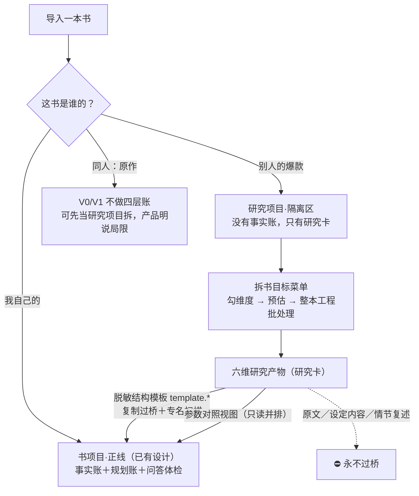

# 「故事真源引擎」拆书目标菜单设计稿 R01

身份：**轻档设计稿。** 补 CZ 点名的缺口：现有设计只回答了「自己的书导进来抽事实」这条正线（材料架＋功能地图 F1–F7），没人回答「我要拆**别人的**书，拆出来是哪些内容——拆结构还是拆世界观还是拆什么」。本稿给这份目标菜单，连带定四件事：别人的书怎么跟自己的账本隔离、研究成果怎么复用、走不走现有管线、收费站在哪。它不是施工单；我的排期判断是**不进 V0**（第 7 节），设计先备着。⚠️ 版权法律细节未调查，本稿只定产品姿态，商用前要过律师。

例子约定：自己的书沿用贯穿例《万鬼伏藏》；被拆的爆款自拟一本《长夜灯官》——克系都市异闻＋序列升级流，风格对标《诡秘之主》一系，书名内容纯属自拟。

命名一句（对齐 ADD-004 Q1 命名纪律，不让用户学新词）：界面上这功能就叫「**拆书**」（用户词，笔灵已把它养成搜索词）；文档和代码内部叫「**研究项目／研究卡**」。

---

## 0. 一句话＋一张图

拆别人的书＝开一个**隔离的结构研究项目**：进货口跟自己的书同一个（M1 导入照用），产物却是另一个物种——不是事实账，是**研究卡**（笔记）。研究成果只有两条腿能走进你自己的书：**脱敏的结构模板**（`template.*` 挂件）和**参数对照视图**；原文、设定内容、情节复述一步都过不去。



为什么是这个形状，三个出处顶住：

- **P3 输入侧调查**：拆书至少是三种产品；拆别人的爆款＝「学习结构和读者反馈机制」，第一次可信交付＝「建立隔离的『结构研究项目』，默认只学结构、不仿表达」（原话）；
- **ADD-010 真值方向**：有正文则正文为真——别人的书我们只有正文，一切拆解产物都是「影」。而事实账／规划账是伺候**作者自己的书**的真值体系，别人的书永远没有资格往里进。研究项目就是一个**只有影子的项目**：正文为真（但那个「真」不归我们维护），产物全是观察，没有任何东西能升真值；
- **ADD-001**：「不代写正文」是主动卖点——拆书一旦滑向「照它写」，卖点自己塌掉。

## 1. 拆书是三张合同，本稿设计第二张

P3 的三对象表，加一列本稿处置：

| 对象 | 用户目标 | 应优先产出（P3 原文） | 账本归属 | 本稿处置 |
|---|---|---|---|---|
| 自己的旧书 | 续写、修文、找回上下文、查冲突 | 反向章纲、人物当前状态、时间线、知情范围、伏笔回收表、原文证据 | 事实账＋规划账（正线） | 已有设计，不归本菜单（见 1.1） |
| 别人的爆款 | 学习结构和读者反馈机制 | 开篇钩子、冲突升级、爽点曲线、章节卡点、角色功能、结构模板 | 研究卡（隔离研究项目） | **本稿主体**（第 2–6 节） |
| 同人原作 | 吃透原作，控 OOC 和偏离点 | 原作事实／合理推断／粉丝共识／作者自设四层 | 研究卡＋权威层字段（V2） | V0/V1 不做，建议见 1.2 |

### 1.1 拆自己的书：正线已有，为什么不归本菜单

P3 合同一的产物在现有设计里都有户口：反向章纲／反向剧情图归 M8/M9（进规划账、带「旧稿反推」来源标签，R02 第 3.8 节）；人物状态、时间线、知情范围归事实账＋长线账（F10，v2）；伏笔回收表归伏笔账（R02 第 3.7 节）；原文证据是全线地基（证据闭包纪律）。拆多深的选择也有了：导入时的整理程度三档（skeleton/focused/full，材料架稿第 5.2 节）。

两边的根本区别：拆自己的书是**维护真值**（产物要签字入账、错了是事故），拆别人的书是**学习观察**（产物是笔记、错了改笔记）。一个菜单硬装两种权利结构只会互相污染，所以分开。

### 1.2 同人拆原作：V0/V1 不做四层，理由和过渡姿态

**建议：四层分账（原作事实／合理推断／粉丝共识／作者自设）押到 V2。** 三个理由：

1. **权属风险比拆爆款更高一档**：四层账的地基是把原作整本导进来当参照系——整本导入是完整复制件，比「拆结构学写法」的姿态更重（⚠️ 法律边界未调查，姿态先保守）；
2. **粉丝共识层需要外部数据源**（wiki、圈内讨论），是一条全新的数据通道，V1 背不动；
3. 主体用户（3–20 章卡住的作者）里同人作者占比没有数据，优先级排不上去。

**过渡姿态（V1 就能给）**：同人作者自己的同人文按「自己的书」走正线（M1 的 I-005 疑似衍生标记照旧，知情边界归 M3/M7 处置）；想拆原作，可以开研究项目用「世界观架构＋人物功能」维度拆——但产品要明说局限：「这只是研究笔记，不会自动区分『原作明说』和『你的推断』」。

**V2 形状预告（不占施工）**：四层＝研究卡加一个权威层字段（`authority`）：原作明说（带引文坐标可回验）／合理推断（模型标注）／粉丝共识（外部导入、需声明来源）／作者自设（手填）。复用研究卡结构，不发明新对象。

## 2. 拆书目标菜单（本稿主菜）

菜单只出现在研究项目里。P3 说用户在爆款里找的六样货，跟菜单的对应关系——一样都没丢：

| P3 说用户在找什么 | 菜单哪一项 |
|---|---|
| 开篇钩子 | ② 开篇钩子 |
| 冲突升级 | ① 结构节拍的「赌注台阶」列 |
| 情绪／爽点曲线 | ③ 爽点曲线 |
| 章节卡点 | ③ 爽点曲线（章尾卡点是它的半张脸） |
| 角色功能 | ④ 人物功能与弧光 |
| 结构模板 | ① 结构节拍的导出物（脱敏模板） |

每个维度的产物都是「**观察摘要卡＋明细**」两层：摘要卡三五句人话（这本书这个维度最值得学的几件事），明细表给想深挖的人——对齐「概览优先」通用展示原则（CZ Q1 拍板：默认给概览，点开才见细节）。

### 2.1 结构节拍（beat）

**干嘛**：把整本书的骨架摸出来——每章在干什么活（功能，不是剧情）、大小高潮踩在哪、冲突的赌注怎么一级级抬上去、卷怎么收。

**产物**：节拍表（每章一行）＋卷结构摘要＋可一键「存为结构模板」（脱敏后过桥，见 3.2）。

**例**（《长夜灯官》前 30 章节选）：

| 章 | 功能标注 | 节拍类型 | 赌注台阶 |
|---|---|---|---|
| 1 | 异常当面砸下＋主角处境交代 | 悬念钩 | 个人安危 |
| 2 | 第一条生存规则给出 | 世界观开窗 | 个人安危 |
| 3 | 金手指显形（残灯认主） | 金手指亮相 | 个人安危 |
| 5 | 首个案件收束 | 单元小收束 | 个人安危 |
| 7 | 首胜＋首次付代价 | 小高潮 | 卷入衙门任务 |
| 12 | 力量首升 | 升级节拍 | 卷入衙门任务 |
| 18 | 三方阵营格局摊开 | 格局开窗 | 三方博弈 |
| 23 | 导师退场信号 | 转折预埋 | 三方博弈 |
| 28–30 | 夜市失守 | 卷高潮（连章） | 城域危机 |

摘要卡示意：「这本书每 4–6 章必有一个节拍事件；赌注每卷抬一级（个人→任务→博弈→城域）；单元案件和主线悬念双轨推进，案件负责短期满足，主线负责长期钩子。」

冲突升级不单开维度：它就是节拍表的「赌注台阶」列——单开会让菜单像论文答辩，六项已经是勾选项的上限（概览优先，别让小白先学会六个名词）。

### 2.2 开篇钩子（hook）

**干嘛**：黄金三章专项——这本书靠什么让人不划走：钩子类型、挂出位置、回收距离、信息释放顺序。主体用户最疼的一截；笔灵把「开篇公式」单独产品化，印证需求真实。

**产物**：钩子卡组（每钩一卡）＋悬念栈统计（同时挂着几个未回收悬念、最长跨度）。

**例**（钩子卡一张全样，其余简列）：

> **钩子 H1｜第 1 章开场约 200 字内｜类型：异常直给**
> 观察：尸体睁眼这个异常不解释、先砸脸；主角身份（守夜小吏）半页内交代完——先吓人，后立人。
> 回收：第 5 章案件收束时给出睁眼原因（跨 4 章）。
> 留人机制：恐怖悬念＋处境代入。
> 原文位置：第 1 章第 1–3 段（点开看短窗口回验）

- H2｜第 1 章末｜身份反差：白天抄文书的小吏，夜里是唯一看得见「灯下影」的人（回收：第 3 章残灯认主）；
- H3｜第 2 章｜规则禁忌：「夜里有人喊你名字，千万别应」——给读者一条马上能用的恐惧规则（回收：第 4 章同僚应名出事，规则显灵）。

悬念栈统计：前三章平均每章挂 2–3 个新悬念；回收最长跨 4 章；第 1 章「事件先于设定」（先出事，后解释世界）。

### 2.3 爽点曲线与章尾卡点（emotion）

**干嘛**：情绪节奏——峰值踩在哪几章、什么类型（立威／破局／升级／揭秘／收获／复仇）、隔几章一个；每章结尾用什么卡点勾下一章（危机悬停／新谜抛出／反转句）。爽点和卡点合归一维：都是节奏账，一次逐章扫描顺手全标。

**产物**：逐章情绪标注＋曲线图（章号×强度折线，峰值挂类型标签）＋间隔统计。

**例**（统计摘要）：

- 峰值：章 7（首胜·中峰）、章 12（升级·中峰）、章 18（揭秘·中峰）、章 28–30（卷高潮·连峰）；
- 间隔：平均 4–5 章一个中峰，全书没有超过 6 章的干旱段；
- 卡点：约九成章节以卡点收尾，危机悬停占一半强；升级章的前一章固定用「资源到位但差一步」蓄力；
- 摘要卡一句：这本书的爽感靠「单元案件满足＋主线悬念推进」错开发糖，读者永远同时欠着一短一长两笔期待。

❓ 强度分档口径待实测标定（模型标 1–5 档，档间一致性要抽查）——本稿不编判据。

### 2.4 人物功能与弧光（character）

**干嘛**：角色在结构里的**功能位**（不是人物小传）：谁是导师、谁是对照组、谁是行走的世界观说明书；出场节奏；弧光在哪几章拐弯。

**产物**：人物功能表＋弧光卡（主要角色每人一张）。

**例**：

| 角色 | 功能位 | 出场节奏 | 弧光拐点 |
|---|---|---|---|
| 程晏 | 主角 | — | 章 7 首次付代价；章 23 信念动摇 |
| 老灯头 | 导师＋行走的世界观说明书 | 每 2–3 章一场戏 | 章 23 退场信号；章 30 献身 |
| 沈横 | 同侪对照组（走另一条升级路线） | 章 4 引入，之后每卷交叉一次 | 章 18 立场分岔 |
| 夜市娘子 | 情报商＋灰色阵营人格化 | 章 9 引入，按需出场 | 未见（长线留白） |

摘要卡一句：导师在卷末退场，给主角腾出权责空间——「导师退场」在这本书里是卷结构配件，不是情感事件。

### 2.5 世界观架构（world）

**干嘛**：拆的是**设定的骨架和释放节奏**，不是设定内容本身——顶层分几类、每类多大规模、按什么顺序开窗、软硬规则配比。⚠️ 这一维最容易踩线：把人家的设定条目抄成自己的库，版权上是内容复制、创作上是同质化，两头都输。所以产物强制停在架构层。

**产物**：架构骨架图（分类树＋各类规模）＋揭示节奏表（哪一章开哪扇窗）。

**例**：

- 顶层四类：力量体系（九阶，逐阶揭示——升到才讲）／阵营（明三暗一）／禁忌规则（约十来条，按「先违反后解释」出场）／历史谜团（两条长线，卷末各抖半张牌）；
- 第一卷只开约三成设定窗，剩下的全是留白钩子；
- 软硬配比：硬规则（违反必出事）约占三分之一，其余是氛围性软设定；
- **产物里没有的**：每一阶叫什么、能干什么、禁忌具体是什么——要看那些，去读原书。

跟同人的区别划清：同人拆原作要的恰恰是设定**内容**（原作事实），那归 1.2 的四层账（V2），不归这一维。同一个「世界观」词，两种合同，别混。

### 2.6 叙事参数（narrative）——「文风」的合规替身

**干嘛**：可测量的叙事特征：句长分布、对话占比、POV 与人称、平均章长、章内场景数、信息密度节奏（开头多少字进第一个事件）。大半是机械统计（程序数字数，不调模型、不花积分），少数（信息密度、叙事距离）要模型标注。

**产物**：参数表，支持跟自己的书并排对照。

**例**（对照表，数字为示意）：

| 参数 | 《长夜灯官》 | 《万鬼伏藏》（你的） |
|---|---|---|
| 平均句长 | 约 18 字 | 约 26 字 |
| 对话占比 | 42% | 23% |
| POV | 单一第三人称贴脸 | 单一第三人称 |
| 平均章长 | 2,400 字 | 2,600 字 |
| 章内场景数 | 平均 2 场 | 平均 3–4 场 |
| 进入首个事件 | 章首约 300 字 | 章首约 800 字 |

用途是**自查对照**：「你的开头进入事件比它慢 500 字」是能直接动手改的线索；「写得像它」不是本产品提供的服务。

### 2.7 文风裁决：不做「文风模仿」，连开关都不给

菜单里**没有**「拆文风」这一项，也不做「只学结构／仿表达」切换开关——开关意味着「仿表达」档存在。这不是设置项，是产品边界（同款句式见 ADD-005 的边界条：真值签字不进停点档位系统；权利红线同理，不进设置）。

为什么这么定：

1. **P3 原话**：「建议不要输出『同款文风』。更稳妥的是输出可观察特征：句长、视角、对话比例、叙事距离、信息密度和章节奖励机制」。P3 还建议提供「只学结构、不仿表达」开关，我们比它再收一步——开关的另一头没有合法形态，给开关等于许愿一个不打算建的功能；
2. **文风就是表达本身**。模仿表达直接撞「不代写、只学结构不仿表达」红线（P3 红线＋ADD-001 把「不代写」定为主动卖点）；平台容忍圈也画在「校对／要素／粗纲」（SI-006 交叉结论 8，晋江口径），文风模仿在圈外；
3. 作者说「想学文风」，真实需求八成是「怎么开场、对话密度多大、多快进事件」——叙事参数＋钩子卡组能满足；剩下两成（词句质感）只能靠人读原书，产品不该也不能代劳。

### 2.8 菜单一屏、预设与范围联动

```
研究项目《长夜灯官》 已导入 486 章 · 约 128 万字
这本书你想拆什么？（勾选，右侧实时预估）

☑ 开篇钩子    黄金三章怎么抓人           → 钩子卡组＋悬念栈     ≈ N 积分
☑ 结构节拍    每章干什么活、骨架长什么样   → 节拍表＋可存模板     ≈ N 积分
☐ 爽点曲线    情绪峰值和章尾卡点的节奏     → 曲线＋间隔统计       ≈ N 积分
☐ 人物功能    谁是导师、谁是对照组         → 功能表＋弧光卡       ≈ N 积分
☐ 世界观架构  设定怎么搭、按什么节奏放     → 骨架图＋揭示节奏表   ≈ N 积分
☐ 叙事参数    句长/对话比/进事件速度       → 参数表（机械统计，免积分）

预设：〔学开头〕〔学结构〕〔全面研究〕
范围：〔前 3 章·免费试拆〕〔第一卷 约30章〕〔全书 486 章·整本工程〕

本次预估：≈ N 积分 · ≈ N 分钟          〔开拆〕
仅供个人学习研究；产物是结构骨架，不含原书正文。
```

（N＝待标定的预估数，本稿不编；声明一行的语义见第 4 节。）

- **三个预设**（小白不必先学会六个维度名词）：**学开头**＝钩子＋叙事参数（默认选中，免费试拆就是它的前 3 章版）；**学结构**＝节拍＋爽点曲线；**全面研究**＝全勾。
- **范围×维度的最小量**：钩子只要前 3–5 章；节拍／爽点至少一卷（约 20–30 章）才有形状；人物／世界观越全越准。范围不够时对应维度置灰＋一句「样本太少，结论会糙」。❓ 各维最小章数待实测标定。
- **菜单就是预估器的输入**：勾选×范围 → 预估积分和时长 → 知情确认 → 后台批处理。这正是整本工程的既有形状（ADD-002 预估制；「大工程」按 ADD-009 已统一改叫「整本工程」）。定价按「一个项目一个价」呈现，内部同一章读几遍是实现细节——正好绕开 P7 拒付雷区「同一轮读取拆多次收费」。

## 3. 隔离设计：研究项目的三条铁规

1. **永不建事实账。** 研究产物全是研究卡（笔记语义），没有「确认升真值」动作——不是省一道工序，是**没有真值可签**：事实账的语义是「我的书的已发生真相」，别人的书在我们这里只有正文和观察（ADD-010 应用：研究项目＝只有影子的项目）。研究卡标错了，作者改卡或弃卡，不惊动任何账本。
2. **两种过桥物之外零流动。** 能从研究项目走进书项目的只有：①脱敏结构模板（复制过桥，见 3.2）；②参数对照视图（只读并排，不写入）。研究内容永不进书项目的抽取输入、问答语料、生成执行包——按 ADD-007「执行包必须瘦」，别人书的内容连被称重的资格都没有。
3. **原书正文只住本地冻结原料。** 报告导出、模板、（将来若有的）云端同步一律不带原书正文；界面回验只开短窗口（开放问题 O1）。

### 3.1 编号

研究卡编号 `RC-`（候选，进 ADD-009 前缀登记表时定稿）；绝不占用 `F-`（事实）／`PE-`（计划事件）——编号隔离是账本隔离的机械面。

### 3.2 结构模板怎么过桥（`template.*` 机制的第一个外源客户）

R02 第 6 节已备好挂点机制：稳定坐标＋挂件对象（`template.*` 命名空间）＋模板＝坐标映射＋缺位提醒。本稿只是给它接上第一个从研究项目来的客户：

- **生成**：节拍表 → 模板草稿＝槽位序列＋功能词＋间隔参数。例：`template.night_lantern_v1`＝「槽 1 悬念钩 → 槽 2 世界观开窗 → 槽 3 金手指亮相 → 槽 5 单元小收束 → 槽 7 小高潮 → 槽 12 升级节拍 → …（30 槽）＋『每 4–6 章一个节拍事件』」；
- **脱敏检查（过桥闸）**：机械扫描——模板文本里出现研究对象的专名（人名／地名／专有名词，人物功能表里现成有清单）就黄标；作者过目一眼放行（新停点位，编号待进停点注册表登记，不在本稿私定）。「槽 7 要有小高潮」能过桥；「槽 7 主角用铜灯反杀夜枭」过不去；
- **落位**：**复制**一份进书项目的挂件表，带来源标（`source: research/长夜灯官研究@v1`）——复制不是引用：删研究项目不断链，书项目也不背研究项目这个运行依赖；
- **使用**：挂到《万鬼伏藏》的规划账上，缺位提醒照 R02 既有纪律——「你的第 7 章槽位还没有小高潮」提一次就闭嘴，不硬性规定、不追旧账（v2 捞货 46）。

### 3.3 跟反向剧情图划清（同形不同命）

节拍表长得像反向剧情图——都是从正文反推的结构。但账本身份完全不同，一张表说死：

| | 反向剧情图（自己的书） | 结构节拍表（别人的书） |
|---|---|---|
| 住哪 | 规划账候选，带「旧稿反推」来源标签 | 研究卡，永远是笔记 |
| 能否升格 | 作者可认领升「作者声明」（ADD-010 移交机制） | **没有认领动作**——你不能认领别人的书 |
| 谁消费 | M8 续写、M9 概览 | 只有研究工作台＋模板导出 |

## 4. 权利与合规姿态

⚠️ 先声明：本节是**产品姿态**，不是法律意见。合理使用边界、汇编权、「梗概到什么程度算演绎作品」全部未调查，商用前过律师。

四条姿态：

1. **用途姿态：个人学习研究工具。** 作家拆书做笔记本来就是写作学习的常规动作，市面同类都以此立足（Marlowe 官方原话「It does not generate or rewrite text」，跟我们同姿态）；产品做的是把手工拆书笔记效率化。建研究项目时**一次性**声明（护栏只放一次，不逐次骚扰）：研究对象应是你合法获得的文本；产物供个人学习，不作为原作衍生品商用。
2. **产物姿态：骨架，不是正文，也不是缩写本。** 验收口径一句话：**拿着全部研究产物，写不出《长夜灯官》，只能写出你自己的书。** 落法三条：功能标注不做逐章剧情梗概全集（能替代阅读的缩写本不是本功能的产物）；模板过桥强制脱敏；叙事参数是测量、不是表达。
3. **正文姿态：别人的正文不出用户本地。** 冻结原料留在本地当回验底座；导出物、模板、云端一律不含原书正文；界面回验短窗口。
4. **表达红线：三个不提供。** 不提供文风模仿（2.7 已裁决）；不提供「照这本书写／续写这本书」；不拿研究对象当底稿生成任何正文——自己的书都不代写，别人的书更没有。

对外话术（对齐 SI-006 话术黑名单的谨慎口径）：

- ✅ 能说：「帮你把爆款的结构拆开看懂：钩子怎么挂、节奏怎么踩」「只学结构，不仿表达」；
- ❌ 不能说：「一键学会 XX 大神的文风」「拆完你也能写出一样的书」，以及任何形态的「版权无忧」——合规声明永远不承诺版权干净（SI-006 交叉结论 8）。

## 5. 管线复用：前段同一条，后段换物种

### 5.1 逐模块对照

| 模块 | 研究项目用不用 | 怎么用 |
|---|---|---|
| M1 导入 | ✅ 原样复用 | 零静默丢字对研究同样要命——缺章会让节拍表和曲线错位；损失报告、冻结原料、SHA、量闸全套照用；I-005 疑似衍生标记顺便当误入提示 |
| M2 切窗 | ✅ 机制复用，参数另调 | 机械切分＋坐标照用；但研究观察多是章级／卷级，窗口比抽事实的责任段大。⚠️ 各维最优窗口未实测，动手前拿真书标定 |
| M3 抽取 | 🔶 壳复用，prompt 换家族 | 调 API、JSON 解析、坐标回填照用；prompt 从「抽事实句」换成研究族 `research.beat/hook/emotion/character/world`——正好是模块化拍板说的「换 Prompt 只动 M3 内部」 |
| 机械统计器 | 🆕 新小件 | 叙事参数的大半（句长／对话比／章长／场景数）程序直接数，不调模型、零积分 |
| M4 事实账 | ❌ 不建 | 隔离铁规 1 |
| M5 审查台 | ❌ 不走 | 没有真值可签。研究卡在**研究工作台**看／改／弃——轻确认，错误代价低（治理三档的轻档思想：笔记标错不污染任何真值） |
| M6 问答／M7 体检／M8 规划／M9 概览 | ❌ 不开 | 四个都是伺候自己书的真值消费者。「问别人的书」记 V2 功能候选，不占本稿 |

### 5.2 新合同 C10：研究卡（建议稿，编号顺延现有 C1–C9）

| 字段 | 装什么 |
|---|---|
| card_id | `RC-xxxx` |
| dimension | beat / hook / emotion / character / world / narrative |
| target_ref | 研究对象坐标（章／段／字符区间，指回冻结原料——回验从本地读，卡里不存长引文） |
| observation | 功能标注／观察正文（产品生成；具体度分档见开放问题 O3） |
| tags | 类型词（钩子类型／爽点类型／功能位……开放词表） |
| model_note / author_note | 模型原判留痕／作者批注——卡可改可弃，改了留原判：研究卡是笔记，作者是笔记的主人 |
| status | keep / discard |
| export_class | 内部档／脱敏档（出项目用哪档，联动 O3） |

### 5.3 存储落位

```
data/
  万鬼伏藏/                  # 书项目（正线，现状一根毫毛不动）
  research/
    长夜灯官研究/
      raw/  intake/           # M1 原样：冻结原料＋材料包
      chapters.json           # 研究对象的章节户口（v0 投影同款）
      research_cards.json     # 六维研究卡（C10）
      exports/                # 脱敏模板、研究报告导出件
```

书项目那侧只多一样东西：挂件表里可能躺着一份带 `source: research/...` 来源标的模板**副本**。除此之外两个世界互不知晓。

## 6. 收费定位（占位——ADD-008 暂行＋【一致性修订 20260813】ADD-017 J2 付费墙话题冻结待调查：本节数字与分层讨论一律按占位身份读，不删内容、不再展开）

市面锚点（P3／SI-006 实查过的真实价格）：

| 锚点 | 价格 | 说明 |
|---|---|---|
| Marlowe | $29.95/本；月付 $19.95 含 4 次；年付 $159 含 48 次 | AI 拆解，明示不生成不改写 |
| 笔灵拆书 | 活动价 199 元终身 | 国内直接对标：爆款大纲、开篇公式、嗨点 |
| AutoCrit Pro | $30/月 | 订阅型分析 |
| Storysnap | $50/本 | AI 单本分析 |
| Reedsy 人工评估 | 约 $1,576/8 万词 | 人工天花板价 |

候选定位（结构给死，数字全部暂行）：

- **免费试拆＝引流钩**：前 3 章×开篇钩子维（＋叙事参数机械版），免费。对齐免费层「前三章看效果」的既有形状（ADD-002）；成本有上界；产出的钩子卡组天然是「想看全书拆解」的广告；
- **整本拆解＝按项目付费**：菜单勾选×范围 → 预估锁价 → 知情开拆。这正是 P7 验证过的「大工程按项目买成果」形状——拆别人的书是整本工程设施的第一个非正线客户；
- **订阅联动候选**：订阅含 N 次单本拆解或折扣（Marlowe 月付含次数模式印证有人买账）；
- 失败不收费、预估先行、看证据不扣费，P7 五雷区照避。

一句话定位：**付费能力，带免费试拆当引流钩**——不做纯免费获客（几百章的模型成本真实存在），也不做高冷付费墙（试拆要让人先看到威力）。

## 7. 排期建议＋总稿对齐

判断：**拆书菜单不进 V0。** 为什么：V0 的命根子是把自己书的核心环跑通（导入→抽取→确认→问答／体检，北极星验收链），拆书是第二曲线，抢排期等于稀释核心环；但它是已验证的付费点（笔灵 199 终身卖得动、Marlowe 单本 $29.95 活着）＋天然获客素材，不该沉底。三步走：

| 版本 | 做什么 | 为什么这么切 |
|---|---|---|
| **V0（现在）** | 不给入口。只在项目对象里预留 `project_type: book / research` 字段（一行成本），I-005 标记照旧 | 字段先埋、免得将来数据迁移（同「挂点先行」的手法，ADD-004 Q7）；入口不给，因为免费层／教程动线已拍死，不许愿没建的功能（材料架稿第 6 节同款纪律） |
| **V1（前置：M8 挂件表＋整本工程批处理设施就位）** | 研究项目最小版：**开篇钩子＋结构节拍**两维；免费试拆（前 3 章钩子）；模板过桥打通；叙事参数机械统计版顺手带（零模型成本） | 两维正好是笔灵产品化验证过的最强需求（开篇公式＋爆款大纲）；模板要有地方挂（依赖 M8 挂件表）、全书拆是批处理形状（依赖整本工程设施）——前置就这两个，齐了就能上 |
| **V2** | 补齐爽点曲线／人物功能／世界观架构；同人四层账（authority 字段）；对照分析（拿自己的书跑研究维度、跟研究对象并排）；多本横向对比（同题材拆 3–5 本比节拍） | 全是「V1 骨架上长肉」的活，不动结构 |

**总稿对齐**：功能地图 F1–F12 目前**没有**拆书卡——「整本拆解」字样出现在 F1 和计费章，指的都是自己的书。本稿就是这张缺卡的设计底稿；建议 R08 吸收背景板时补一张功能卡（F13 候选：拆书研究项目），卡文可从本稿第 0／3／4 节直接压缩。

## 8. 开放问题（3 个）

**O1｜回验窗口多大——研究工作台会不会变成阅读器？**
场景：作者点开钩子卡想看原文，「异常直给」到底是怎么写的。窗口给多大？给整章，工作台就成了带笔记功能的阅读器；只给一句，看不出手法。
- A. 短窗口：坐标前后各约 200 字——够看清手法，不够追书；
- B. 整段／整场展示；
- C. 不限（正文本来就是用户本地的文件）。
- 👉 推荐 A。本地显示虽无传播问题，但工作台变阅读器会模糊「研究工具」的产品身份，将来一上云端同步就变成存储传播别人的正文；短窗口＋「想看更长去你自己的阅读器」是干净姿态。⚠️ 200 字是拍脑袋数，拿真实钩子卡实测回验够不够用再调。

**O2｜脱敏模板能不能出项目、进社区？**
场景：你拆出《长夜灯官》的 30 章节拍模板，写手群里的朋友也想要。给不给分享？
- A. V1 模板只在本人账号的书项目里用，不做分享；
- B. 匿名模板库：过了脱敏检查的模板可投稿共享；
- C. 官方模板包：产品方自己拆公版书／买授权爆款，出官方结构模板（笔灵「开篇公式」的产品化同款，可收费）。
- 👉 推荐 A 先行，C 记入远期商业化候选；B 押后——用户生成模板的脱敏质量不可控（专名扫描挡不住换皮复述），审核成本先不背。结构本身大概率不受版权保护（⚠️ 未调查），但平台传播的姿态要比个人使用保守一档。

**O3｜功能标注允许多具体——学习价值和复述红线怎么分档？**
场景：节拍卡写「第 7 章：首胜」太抽象，学不到东西；写「第 7 章：主角用第 3 章埋的铜灯反杀夜枭，代价是左眼失明」就已经在复述剧情。产品生成的标注默认写到哪一档？
- A. 一句话功能级复述（含关键因果，不含对白和描写）——学习价值优先；
- B. 功能词＋抽象说明（「首胜＋首次代价，回收前期道具」）——合规姿态优先；
- C. 分档：界面内看＝A（本地自用），导出／模板／分享＝B（脱敏）。
- 👉 推荐 C：「看」和「带走」的风险不同——界面内 A 档保学习价值，出项目一律 B 档；脱敏检查点本来就设在过桥处（3.2），顺手管这个。C10 的 `export_class` 字段就是给它留的。

## 9. 来源与追溯

- P3 输入侧调查（拆书三合同、隔离研究项目、只学结构不仿表达、价格锚点）：小说架构仓 `references/survey-inbox/packages/PRODUCT_DESIGN_RESEARCH_RETURNS_20260813_R01/returns/333.md`（完整路径复制用：`/Users/a1234/挣钱/小说架构/references/survey-inbox/packages/PRODUCT_DESIGN_RESEARCH_RETURNS_20260813_R01/returns/333.md`）
- SI-006 消化稿（付费点交叉验证、平台合规圈、话术黑名单、复用避雷）：`/Users/a1234/挣钱/小说架构/TEMP/bgboard-audit-20260809-r01/17_SI006_DIGEST_20260813_R01.md`
- 挂账本 ADD-001（不代写＝卖点）／ADD-002（免费前三章、整本工程预估制）／ADD-008（收费暂行）／ADD-009（词典命名：整本工程、前缀登记表）／ADD-010（真值方向性）：`/Users/a1234/挣钱/小说架构/TEMP/bgboard-audit-20260809-r01/18_R07_ADDENDUM_LEDGER_20260813_R01.md`
- 总稿功能地图（确认无拆书卡、F13 候选落点）：`/Users/a1234/挣钱/小说架构/TEMP/product_master_spec_20260813/05_feature_map.md`
- [INTAKE_SHELVES_DESIGN_R01.md](INTAKE_SHELVES_DESIGN_R01.md)：M1 复用面（冻结原料／损失报告／量闸）、导入目的道岔的「不弹问卷」纪律、I-005、整理程度三档。
- [OUTLINE_STRUCTURE_DESIGN_R02.md](OUTLINE_STRUCTURE_DESIGN_R02.md)：挂点机制（`template.*`＝坐标映射＋缺位提醒）、模板不唠叨纪律、反向剧情图与来源身份标签。
- [STOP_POINT_REGISTRY_R01.md](STOP_POINT_REGISTRY_R01.md)：模板过桥「作者过目」新停点，编号待登记，本稿不私定。
- [../ARCHITECTURE.md](../ARCHITECTURE.md)：模块线路、「换 Prompt 只动 M3 内部」、合同清单（C10 顺位）、设计纪律。

来源：Cursor（Fable 5 Max）设计，2026-08-13；依据 CZ 点名的拆书菜单缺口。

修订记录：
- 一致性修订 20260813：§6 收费定位补 J2 冻结标注（付费墙话题冻结待调查，占位身份）。设计稿群一致性巡检执行。
