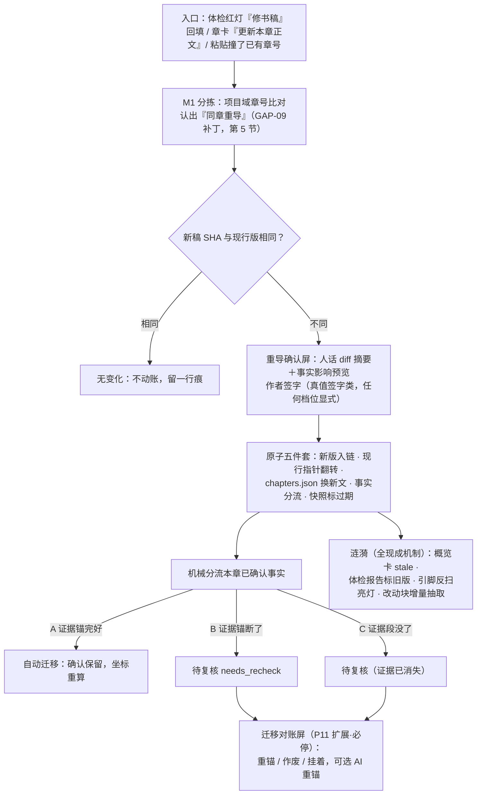

# 章节改稿重导与版本管理 设计稿 R01（CHAPTER_REVISION_DESIGN）

身份：**轻档设计稿，GAP-01 设计单（ADD-011 已派，优先级最高）。** 它接的是日常走查第 3 天那条断头路：体检红灯给了「修书稿」这个明选项，作者也真去把稿改完了，回来却发现产品没有「修订稿放回来」这条路，只能降灯留理由，从此账本和本地稿两张皮（走查屏 4 原文）。本稿坐在 **M1 导入器 × M4 事实账的交界**上：M1 只负责认出「这是旧章的新版」并把新稿冻住，版本链、事实迁移、下游涟漪全在 M4 侧——遵守 INTAKE §8 的边界原话「别在导入器里私搭」。

本稿不动合同文件：涉及 C1/C4/C5/C6 的改动全部是**建议稿**（第 6 节集中列），正式升版随施工单做、同步收发两端。标 ⚠️ 未调查 的地方动手前必须实测。**排期依赖**：版本链踩在 C1 v1 材料包（冻结原料＋SHA＋source_ref）的地基上，本单排在施工第三单（M1 材料架分拣）之后。

出处简写：

| 简写 | 文件 |
|---|---|
| 走查 | [DAILY_LOOP_WALKTHROUGH_R01.md](DAILY_LOOP_WALKTHROUGH_R01.md)（第 3 天屏 4＝GAP-01 现场；屏 8＝GAP-09 现场） |
| INTAKE | [INTAKE_SHELVES_DESIGN_R01.md](INTAKE_SHELVES_DESIGN_R01.md)（冻结原料＋SHA＋覆盖对账＋章序审计） |
| STORAGE | [PLAN_LEDGER_STORAGE_DESIGN_R01.md](PLAN_LEDGER_STORAGE_DESIGN_R01.md)（规划账字段＋引脚反扫＋移交五件套＋plan_history 流水） |
| REVIEW | [REVIEW_OVERVIEW_DESIGN_R01.md](REVIEW_OVERVIEW_DESIGN_R01.md)（批量两步签＋降灯豁免＋stale 快照＋收件箱） |
| REGISTRY | [STOP_POINT_REGISTRY_R01.md](STOP_POINT_REGISTRY_R01.md)（停点总表 P1–P15＋真值签字清单＋S/F 类） |
| PACKER | [CONTEXT_PACKER_DESIGN_R01.md](CONTEXT_PACKER_DESIGN_R01.md)（前提包＋缺料逃生 P9） |
| C1/C2/C3/C4/C6 | [../contracts/](../contracts/) 下同名合同（v0 现状） |
| I-XXX | [../ISSUES.md](../ISSUES.md) 台账 |
| ARCH | [../ARCHITECTURE.md](../ARCHITECTURE.md)（模块线路＋设计纪律） |
| ADD-XXX | 挂账本（小说架构仓，路径含中文，复制用）：`/Users/a1234/挣钱/小说架构/TEMP/bgboard-audit-20260809-r01/18_R07_ADDENDUM_LEDGER_20260813_R01.md` |
| 捞货 N | 19 号捞货概念 N（复制用）：`.../19_NOTION_V2_SALVAGE_20260813_R01.md` |
| 晚捞 N | 23 号捞货概念 N（复制用）：`.../23_NOTION_REQWIKI_LATE_SALVAGE_20260813_R01.md` |

---

## 0. 一句话＋一张图

一句话：**同一章从此有门牌和版本两层——门牌（c02）永远不变，版本只增不删；重导＝新版本入链＋现行指针翻转＋38 条已确认事实按「证据锚还在不在」机械分成三类，锚还在的自动跟过去，锚断的回待复核等作者签字。** 依据三条已拍的大原则：改了稿正文就是新真值、影子必须跟上（ADD-010）；冻结正文是最终证据，改了另存新版本、不静默覆盖（捞货 1）；确认绑定当时的前提快照，前提变了旧确认回到待复核、不是永远有效（晚捞 7）。



把走查那一幕接回来：宋岸周一晚上改完第 2 章（寿数口径＋顺手修了「林晚」漏改），点开收件箱红灯 h-021 上的「修完了，放回来」，粘贴，签一次字，处理 7 条待复核，横幅提示重跑体检。h-021/h-022 两盏灯自动标「基于旧稿」——不用再降灯留理由，账本和他的稿子重新是一张皮。

## 1. 版本模型：同一章的多版怎么存

### 1.1 先分家：门牌是门牌，版本是版本

- **章门牌（chapter_id，`c02`）**：全线下游认的身份——事实的 `chapter_id`、槽位映射的 `chapter_id`、概览卡的 `chapter_ref` 全指它。重导**永不换门牌**，所以下游引用一根不断。
- **章版本（rev，整数自增）**：每次正文实际变化＋作者签字，产生一版。每版冻结（SHA＋来源坐标＋时间），**旧版永不删**——为什么这么狠：旧版是历史确认的「前提快照」本体（晚捞 7），38 条事实的 quote 是照着旧版转抄的、签字是对着旧版签的，删旧版等于把已签确认的证据地基抽掉，「可核验」卖点当场塌半边（捞货 1 同款纪律：改了另存新版本，不静默覆盖）。
- **现行版指针（`rev` 字段指向最新已签版本）**：M2 切窗、M6 证据抽屉、M7 体检、M11 打包器默认全读现行版——正文为真，真值就是现行版这份字（ADD-010）。

不发新 ID 前缀：版本从属于章，数据里就是 `{chapter_id, rev}` 一对，行文写作「c02 第 2 版」。「重导」「待复核」「现行版」等用词交词典下版登记（ADD-009 词典纪律），本稿暂用。

### 1.2 落字段：chapters.json 章条目加两个字段（C1 v1.1 建议）

沿用 INTAKE §5.4 的 v0 兼容总策略——**只加字段不改字段，`text` 永远＝现行版全文**，M2/M0 这些 v0 消费者零改动、且立即读到新真值：

| 字段 | 类型 | 含义 |
|---|---|---|
| `rev` | int | 现行版号，首次入库＝1 |
| `versions[]` | list | 版本链，每版一行、只追加：`{rev, sha256, chars, source_ref, imported_at, decided_by, note}` |

版本行三个要点：

- `sha256` 算**章正文本身**（即当时的 `text` 字符串），不是源文件——自含可验，不用解包原料就能核「现行版是不是这份字」；
- `source_ref` 指回材料包冻结原料（`{package, unit, source, start, end}`，INTAKE §1.2/§1.3）——**旧版全文不复制第二份**，要看旧版就按坐标从 `raw/` 回放原文连续区间，这正是冻结原料设计留好的能力，不另发明存储；
- `note` 留人话（如「体检 h-021 修书稿回填」），谁签的记 `decided_by`。

**v0 存量书怎么升**：现库的章没走过材料架、没有 raw。升级脚本把现有 `text` 冻成 rev 1 基线（补算 SHA，`source_ref: null`＋note「v0 存量基线」），一次跑完。此后所有版本都有完整来源链。

### 1.3 与流水账的关系：各账记各的，不造第三本

- **`plan_history.jsonl` 是规划账的流水**（STORAGE §7），章版本是事实侧的事，**不写进去**。重导的涟漪如果真的动了规划账对象（作者处置受牵连计划、槽位映射变化），那些动作照常走规划账自己的留痕——各记各的，靠 `{chapter_id, rev}` 和事实状态变化衔接。为什么不共用一本：两本账分家是存储层铁律（STORAGE §6.1「plan_* 与 fact_* 分家，两本账不混编号」），流水混写等于从后门破功。
- **章这边的历史就是版本链本身**（一版一行、只追加），重导签字记在材料包 `p5_log`（重导也是一次导入，本来就有 PKG 台账，INTAKE §5.2）；**逐条事实的迁移判决记在事实身上**（状态＋`recheck`＋`note`＋`decided_at`，见 §3.3）。迁移对账单是现算的派生视图，不落成第四份档案——同 STORAGE §1.6「完整偏差报告是派生产物，不落账」的处理方式。

## 2. 重导流程：作者视角逐屏走

### 2.1 三个入口，殊途同归

1. **体检红灯处置回程**（主动线）：收件箱红灯选了「修书稿」（总稿 11 章处置四选）后，条目上常驻一个回程按钮「修完了，放回来」——点开直达粘贴框，**章号预填**（红灯 evidence 本来就带 `chapter_id`，C6）。为什么要这个按钮：走查证明「修书稿」是四选里唯一没有回程的选项，回程就该长在出发点上。
2. **章卡入口**：每张章卡动作区加「更新本章正文」，同一个粘贴框，章号预填。
3. **裸粘贴/重新上传兜底**：作者直接粘贴或传文件，M1 章序审计按**项目域**比对发现章号与既有章重合（第 5 节补丁）→ 不再只给一条「章号重复」review 提示（INTAKE §1.5 v1 的旧口径），改为引流进本流程。章号识别不出时走 I-006 兜底链，最后让作者手选「替换哪一章」；作者说「不是替换，是插新章」→ 退回正常新章流。

### 2.2 一道免费闸：SHA 相同＝无事发生

新稿全文 SHA 与现行版相同 → 不新建版本、不动账，横幅一句「第 2 章与现行版一致，未做改动」＋材料包留痕。为什么值得单写：作者重传整本三章的文件只为改其中一章是常态，另两章逐字节没变，这道闸让「多章重传」自动缩成「只处理真变了的那章」，零成本零打扰。

### 2.3 重导确认屏：diff 给作者看什么

识别成功后一屏（示意文案）：

```
把这份新稿作为《雾都灯师》第 2 章的新版本？
现行版：第 1 版 · 3,912 字 · 2026-08-14 导入        新稿：3,980 字
────────────────────────────────────────────
改动概览（按段落对齐）：改了 3 段 · 删了 1 段 · 新增 2 段    ▸ 逐段对照
对账本的影响（38 条已确认事实）：
  ✅ 31 条不受影响，自动跟到新版
  ⚠️ 5 条证据句变了，需要你复核
  ⚠️ 2 条所在段落已删除，需要你处置
新增/改动部分将重新抽取：预计 ~4 积分
────────────────────────────────────────────
［确认替换（旧版保留可查）］ ［先看逐段对照］ ［取消］
```

三条设计定夺：

- **人话摘要在前，机器 diff 收进抽屉**。默认只给三行：段落级改动计数、事实影响三分类计数、积分预估；「逐段对照」（左旧右新、改动高亮）点了才展开。为什么：作者刚在自己的写作软件里改完稿，他要的是「产品接住了吗、我的账会怎样」，不是重读一遍 diff（同 REVIEW「概览代替清单」的展示总原则，ADD-002 Q1）。
- **确认替换是真值签字类动作，任何档位显式**——建议进 REGISTRY §2 清单新增一行（第 6 节）。为什么够格：现行正文就是全线证据底座（捞货 1），换底座比改一条事实（改史，签字类 #4）影响只大不小；省心档也不许自动吞。
- **积分预估行**照 ADD-002 预估制放置；抽取这类日常动作的花钱确认户口是 GAP-05 的同族悬案（走查 GAP-05），本稿不发 F 号，随其口径一起定。

### 2.4 签字之后：原子五件套

参照移交五件套的做法（STORAGE §3.2——一瞬间要改几处的动作包成一笔，MVP 文件时代靠一次整文件保存天然原子）：

1. **版本链追加一行**＋`rev` 指针翻到新版（chapters.json）；
2. **`text` 换成新版全文**——v0 消费者（M2 切窗、M0 status）即刻读到新真值，无感知升级；
3. **本章已确认事实跑机械分流**（§3.2），A 类当场迁完，B/C 类置 `needs_recheck`；本章未审候选同步处理（§3.5）；
4. **快照标过期**：该章概览卡 stale、涉该章的体检报告标「基于旧稿」（§4）；
5. **改动窗增量抽取**开跑：全章按现行版重切窗（M2 免费机械），只把与改动/新增段落相交的责任段喂 M3（花钱的部分省下来）。

材料包 `p5_log` 记签字（`action: "chapter_revision", chapter: "c02", from_rev: 1, to_rev: 2`）。然后进迁移对账屏（§3.4）——若 B/C 类为零，直接收尾横幅（张力见开放问题 O1）。

## 3. 已确认事实的迁移：三类分流（核心难题）

### 3.1 先钉语义：前提快照的粒度是「证据锚」，不是「整章任何一字」

晚捞 7 说确认绑定当时前提快照、前提变了旧确认回待复核。**关键是「前提」取多大**：取「整章」——章里改一个标点，96 条全回待复核，I-008 确认疲劳原地复活，没人用；取「证据锚」——这条事实赖以成立的那句原文（quote）或那个段落还原样在，就认定前提未变，确认保留。本稿取证据锚粒度。为什么站得住：事实账的可核验性从来就锚在「事实句 ↔ 原文依据」这一对上（C4 的 text＋quote），锚没动＝作者签字时看的证据依旧成立；至于「锚没动但远处改动让事实间接变假」——那是跨章改动也会有的一致性问题，本来就归 M7 体检管（改设定后正文侧冲突由体检报告，走查屏 2 系统回话同款分工），迁移不越权替体检重审全账。

### 3.2 机械分流规则（程序验机械，人验语义——ARCH 纪律 2）

预备动作两步，全免费：①新旧两版正文按 C2 同款规范化（各自然段去首尾空白、单 `\n` 连接——偏移基准与 C2 一致，不另立标准）做**段落级对齐 diff**，得出每段「未动／修改／删除／新增」；②每条已确认事实找**锚定段**——quote 在旧版全文逐字定位（命中即得段号）；quote 定位不到的（I-013：转抄失真本来就存在），按 `seg` 重跑 M2 确定性切窗还原段界、取该窗覆盖段。然后按次序判：

| 判定次序 | 机械信号 | 类 | 处置 |
|---|---|---|---|
| 1 | quote 在**新版**逐字命中（唯一命中，或多处命中时对齐段内那处） | **A 自动迁移** | 确认保留；重算 `seg`、锚定版本前进到新版、顺手记下校验过的 `quote_span` 字符区间 |
| 2 | quote 新版未命中，但锚定段属**未动块** | **A′ 自动迁移** | 同上（quote 维持原样——转抄失真的旧账不因迁移恶化也不假装修好，I-013 现状如实带过去） |
| 3 | 锚定段属**修改块**且 quote 未命中 | **B 待复核** | `needs_recheck(quote_lost)`，进对账屏「改动区」，新旧段对照 |
| 4 | 锚定段属**删除块**且 quote 未命中 | **C 待复核·证据已消失** | `needs_recheck(evidence_gone)`，进对账屏「删除区」，默认按钮＝作废 |
| 5 | quote 旧版也定位不到＋seg 还原异常（锚定失败） | **B 兜底** | `needs_recheck(anchor_lost)`——宁停不猜，不许拿相近段落硬接（晚捞 8「落不到就定点查」同款纪律） |

对齐任务要求的三类：任务①（段落没动）＝规则 1＋2 两张脸——quote 逐字还在是比「整段没动」更精确的「证据完好」，整段没动兜住 quote 失真的旧账；任务②（段落改了但事实可能仍成立）＝规则 3；任务③（事实被改掉——体检红灯的目标）＝规则 4 为主。**特意不做**「只认整段未动才自动迁」的保守版：打磨型作者的常态是段内改措辞，那个版本会把大量证据完好的事实误伤进待复核，等于把 I-008 换个屏复活。也**特意不做**机械判「事实被改掉」——「改掉」是语义判断，机器只能证明「证据没了」，判死刑必须作者签（驳回对称纪律，REVIEW §5.1 #4）。

两个加分项顺手落袋：规则 1 命中的事实拿到**程序校验过的字符级 `quote_span`**——这正是 I-013 想要的字符锚，迁移一次等于给能命中的存量账做一次部分修复（只记实打实校验过的，不虚标）；段落重排、整段挪位置不炸账——quote 命中不依赖段界。

### 3.3 待复核是什么状态（C4 v1 建议）

- `status` 枚举加第四值 **`needs_recheck`**。为什么不复用「打回 extracted」：会丢「作者曾签过字」这个事实，还会混进批量放行通道被当新候选顺手签掉；待复核的正确待遇是**单独排队、显式处置**（晚捞 7 原话就是「回到待复核」，不是「回到候选」）。
- 事实加锚定版本 `chapter_rev`（int）：确认或迁移那一刻绑定的章版本——这就是「前提快照」的落盘形态。A 类迁移后前进到新版；B/C 类停在旧版，直到作者签字处置才前进。
- 加 `recheck` 对象（可 null）：`{reason: quote_lost / evidence_gone / anchor_lost, from_rev, flagged_at}`。
- **下游语义一刀切：`needs_recheck` 不是真值**（C4 铁律「只有 confirmed 是真值」不破例）——M6 取证问答不引用；M11 前提包不装（若因此缺关键料，出题时 P9 缺料必停自然接住，PACKER §2.3——现成的安全网，不另设）；M7 体检把它按候选层对待，不作真值方。诚实的代价诚实付：改了正文，受影响的账目退出真值圈等复核，绝不「静默保留」装没事。
- 证据抽屉照常能看：待复核条目标「锚在第 1 版（已非现行）」，引文从旧版回放渲染（§1.2 的回放能力在这里兑现），旁边给新版对应段的跳转。

### 3.4 迁移对账屏：人工兜底长什么样

B/C 类非空时必停进此屏（停点归属：**P11 的触发扩展**——P11 本来管「改判/删除已入架章牵连已确认事实」（REGISTRY，候选、恒必停），重导是同一形状的第三种触发「章内容变更牵连真值」；按 REGISTRY §5 规矩设计稿不自行续号，本稿作为重导分支的宿主稿，扩展登记交 REGISTRY 下版）。屏形（示意）：

```
第 2 章已更新到第 2 版 · 38 条事实：31 条已自动跟上 ✓
需要你处理的 7 条：
┌ 改动区（5）────────────────────────────
│ F-0012 灯油以人的寿数炼成，寿入油者折其年
│   原证据句已不在新稿（旧：「雾都的灯油，用人的记忆熬」）
│   新第 4 段：「灯楼一亮，点灯人的寿数便折进灯油里……」
│   ［仍成立：锚到这段］［AI 帮我找证据句 ~1 积分］［已不成立：作废］［挂着］
├ 删除区（2）────────────────────────────
│ F-0031 陈更在灯市口第一次见到收油人
│   所在段落已整段删除（旧版第 7 段，点看原文）
│   ［在别处仍成立：重锚］［已不成立：作废］［挂着］
└ ［这 5 条都仍成立（段级批量重锚）→ 预览］
```

处置动作全部复用既有签字语义，没有新发明：

- **重锚（仍成立）**：作者点新版里的支撑段（或句）→ confirmed 保留、`chapter_rev` 前进、新锚落账。批量档「都仍成立」＝**段级批量重锚**：quote 置空串＋note 备档旧 quote（quote 可空是 C4 既有语义，外部候选本来就允许），锚落到对齐后的新段——证据粒度从句降到段，但账是诚实的，作者以后可随时补句锚。批量必带影响预览、两步生效，且**只到本章封顶**（REVIEW §1.4 两步签＋ADD-009 #3 章级封顶，原样沿用）。
- **AI 重锚（可选按钮）**：让模型在对齐段里为这条事实句找新证据句，**程序校验候选 quote 逐字存在于新版**才呈给作者，作者点头才落账——模型不手写引文、不自签绿票（捞货 9/10），花积分走预估行。要不要做进第一版见 §7。
- **作废（已不成立）**：confirmed → rejected，note 记「因 c02 第 2 版改稿作废」＋`decided_at`。为什么落 rejected 不落回候选：这是一次显式判决，判决进账留痕（对称纪律）；真回心转意，改写确认能复活。
- **挂着**：维持 `needs_recheck`，不拦别的事——但它不是真值，挂多久就多久不进问答/前提包，收件箱常亮一条计数（零唠叨：一条聚合计数，不逐条轰炸，捞货 21）。

### 3.5 未审候选与新抽候选怎么办

- **旧版未审候选**（extracted，还没人看）：同一套分流跑一遍，A 类保留原样等审；B/C 类标 `stale_candidate` 收进「旧版候选」折叠区——不删（留痕）、不进默认审查流。为什么不给待复核待遇：候选是模型产出、没有作者签字，没有「确认要不要延续」的问题，新抽会覆盖同一片正文。
- **增量抽取的新候选**（改动/新增窗）照常进审查台；对账屏处理过的 B 类事实若与新候选重复，作者在同一张章卡上一眼可见（新候选 beat 与待复核条相邻展示），驳回重复的那份即可。⚠️ 未实测：改动窗抽取与待复核条目同屏的信息密度，施工时拿真书走一遍再定版式。

## 4. 对下游的涟漪：一张清单，全部复用现成机制

重导确认落账那一刻，下面这些自动发生（无一新发明，出处逐行标）：

| # | 涟漪对象 | 触发机制（现成） | 作者看见什么 | 出处 |
|---|---|---|---|---|
| 1 | 本章概览卡 | 快照过期：卡记生成时点，账变了标 stale，点了才重生成（重生成若计积分走花钱确认） | 章卡角标「概览已过期」 | REVIEW §2.1 铁规三＋P8＋F-3；C5 补丁见第 6 节 |
| 2 | 体检报告 | 只读投影快照过期：报告涉该章的条目标「基于旧稿」，**不自动清灯也不自动重跑**——机械只能证明旧证据过期，不能证明新文没矛盾 | h-021/h-022 折叠降噪＋「正文已更新，重跑才算数」；横幅建议重跑（P6 提醒不停＋F-1 预估确认） | C6「只读投影」语义＋REGISTRY P6/F-1；C6 补丁见第 6 节 |
| 3 | 规划账受牵连计划 | **事实状态变化本来就触发引脚反扫**：B/C 类翻 `needs_recheck`、作废翻 rejected 时，程序反扫 `target_ref` 命中的依据引脚，受牵连计划节点亮灯 | P4 删改重核清单（作者档位决定必停还是挂角标） | STORAGE §1.10＋R02 §3.8＋REGISTRY P4——零新代码，坐享其成 |
| 4 | 前提包／出题 | `needs_recheck` 不是 confirmed → 打包器自然不装；关键料因此缺席时出题停下来要料 | P9 缺料必停：「补一句设定／按模糊处理」 | PACKER §2.3＋REGISTRY P9 |
| 5 | 已移交章的计划卡 | **不动**。当初的打算原样保留，正文侧变化由体检兜——重导不重跑 P13 偏差对账（那是新章移交的仪式，重导没有新移交） | 计划卡无变化 | STORAGE §3.2 第 2 条＋R02 §4 分工 |
| 6 | 取证问答／证据抽屉 | M6 只读 confirmed：A 类照常引用（引文已是新版坐标）；待复核条不引用；抽屉按每条事实的锚定版本渲染 | 问答证据永远指得回现行字 | C4 语义规则＋§3.3 |
| 7 | 接力点第一屏 | 投影现算：字数、体检计数刷新；待复核非零时「未结的账」多一行 | 「第 2 章 7 条待复核」计数 | 捞货 38 六要素之「未结事项」 |

一句收束：**涟漪只沿直接支撑传播**——引脚扫得到的亮灯、快照标过期、其余不自动递归动账（捞货 20 原话「只提名直接受影响项，不自动递归删除」）。走查抱怨的「半张清单」（GAP-06）在重导场景反而是齐的：正文侧变化本来就是这次动作的主体，不存在「体检异步兜正文」的时差。

## 5. GAP-09 落地：缺章审计以项目为域（C1 v1 一行补丁）

走查屏 8 的现场：每天粘一章是最高频导入形态，材料包只含第 4 章，包内审计 `found=[4]` 算不算断档没口径。ADD-011 已拍口径「缺章审计以项目为域，不以包为域」，落成 INTAKE §1.5 第 1 条的补丁原文如下（建议一字进 INTAKE 下版）：

> **章序审计（项目域）**：审计对象＝项目现有章号 ∪ 本包章号的**合并序列**；缺章、断档、章序矛盾以合并后序列判定（追加包 `found=[4]` 且项目已有 1–3 → 无断档不强停）；本包章号与项目既有章**重合**时判「同章重导」，引流进改稿重导流程（CHAPTER_REVISION 设计），不再只给「章号重复」review 提示。`loss_report.chapter_audit` 增设 `project_merged: {found, missing, duplicates_vs_project}` 三键，包内三键维持原义。S-1 缺章断档强停改按 `project_merged.missing` 触发。

一句为什么：审计的问题是「这本书缺不缺章」，书的账本在项目里不在包里；包域判定对追加包必然误报（天天强停一次「缺 1–3 章」，狼来了三天就没人信强停了）。

## 6. 合同与注册表补丁清单（全部建议稿，升版随施工单）

| 对象 | 补丁 | 一句为什么 |
|---|---|---|
| C1 v1（章节文档） | 章条目加 `rev`＋`versions[]`（§1.2）；章序审计项目域三键（§5） | 版本链的户口；GAP-09 |
| C4 v1（事实查询） | `status` 加 `needs_recheck`；加 `chapter_rev`（锚定版本＝前提快照）；加 `recheck{reason, from_rev, flagged_at}`（可 null）；A 类迁移时可记程序校验过的 `quote_span{start,end}`（相对该版规范化文本，基准同 C2） | 待复核的正身；I-013 字符锚的顺手部分修复 |
| C5（概览卡） | `snapshot_meta` 加 `chapter_rev`；stale 触发条件补「章版本变化」 | 卡过期目前只看事实账变更，重导必须也能触发 |
| C6（体检报告） | 报告生成时记各涉事章的 `rev`；渲染层据此给「基于旧稿」标 | 让灯知道自己引的是哪版正文，走查的降灯 hack 从根上不再需要 |
| REGISTRY §2 | 真值签字类建议加一行：**章版本替换（重导确认）**——任何档位显式 | 换的是全线证据底座，比改史只重不轻 |
| REGISTRY P11 | 触发扩展：「已入架章的**身份或内容**变更（改判／删除／同章重导）且牵连已抽或已确认事实」；重导分支宿主稿＝本稿 | 同形状不发新号（§3.4） |
| INTAKE §8 | 「同章重导 ❓ 待拍板」行改指本稿 | 关走查 GAP-01 的口 |

## 7. MVP 分期：第一版做多简

**第一版（随 C1 v1 施工后的小单）——机械闭环全通，AI 辅助只留一个可选按钮：**

1. 版本链＋现行指针＋v0 存量升级脚本（§1）；
2. 重导识别（项目域章号比对＋SHA 相同闸）＋确认屏（段落级 diff 摘要＋事实影响预览）＋真值签字（§2）；
3. 三类分流的机械部分全量做：①（规则 1＋2 自动迁移）和③（规则 4 证据消失检出）纯机械、零调用，②的**检出**（规则 3）也是机械的——三类的检出第一版全有，差别只在处置深度；
4. 迁移对账屏＋逐条处置＋段级批量重锚（两步签、章级封顶）（§3.4）；
5. 涟漪四件：概览 stale、体检标旧版、引脚反扫（本来就有）、改动窗增量抽取（§4）；
6. GAP-09 项目域审计补丁（§5）。

**②的重新定位要不要 API 辅助——建议：第一版做「单条 AI 重锚」按钮，不做自动批量。** 为什么这么切：纯手动兜底在改措辞密集的章会堆几十条待复核，段级批量重锚能泄压但会让证据粒度整体变粗——单条 AI 重锚（一次一条、程序校验 quote 逐字存在、作者点头落账、花积分走预估）是句级精度的唯一省力通道，机制上就是 M3 抽取通道的窄用法，增量成本小；而**自动批量重锚不做**——烧钱无预估上限，且批量场景下作者事实上不会逐条验语义，等于模型变相自签（捞货 10 红线）。⚠️ 未实测，第一版上线前拿库里真书改一章跑一遍再定按钮优先级：B 类真实占比、AI 重锚命中率。

**第二版以后**：段内句级 diff 精细分流（B 类再拆「只动措辞／动了事实」两档）、AI 批量重锚（带上限的批处理）、体检局部重跑（只扫涉该章事实的组，省积分）、任意两版对照视图、已发表章的完整锁定语义（捞货 19 的强锁／依赖升级，归 F10 长线账 v2）。

**⚠️ 未调查集中列**（动手前实测，本稿不编数）：段落级 diff 算法对中文网文的实际表现（段落 LCS 够不够，大段重写时对齐质量）；quote 在旧版的定位命中率（I-013 转抄失真占比未量化，决定 A′ 兜底承担多少）；B 类真实占比与 AI 重锚命中率（决定按钮优先级）；改动窗增量抽取与待复核条同屏的密度；体检局部重跑的分组成本。

## 8. 开放问题（交 CZ 拍）

**O1｜零待复核的重导，对账屏还弹不弹？**
场景：宋岸只改了两处「林晚」→「林晚棠」错别字，38 条全走 A 类自动迁移，没有一条要他处置。
- A. 也弹屏（哪怕全绿也过目一眼——P11 恒必停的字面执行）
- B. 不弹，横幅收尾：「已更新到第 2 版，38 条事实全部自动跟上 ✎ 查看迁移单」（提醒不停）
- 👉 推荐 B：签字已经在确认屏显式发生过（真值签字不省），零牵连时再拦一道是空停；有一条 B/C 就必停，这条底线不让。

**O2｜作者重导完又后悔，想退回上一版，怎么给？**
场景：周二他觉得寿数口径写崩了，想把第 2 章退回记忆口径的旧版。
- A. 现行指针直接回拨到旧版＋事实反向迁移（快，但要写一套反向状态机：A 类倒回去、已作废的复活……）
- B. 不做回拨：旧版正文一键取出（raw 回放）→ 当新稿再导一遍，成为第 3 版，走同一套重导流程
- 👉 推荐 B：版本链只前进，一套迁移逻辑走天下；「回滚」这个轻需求不配一套反向状态机（轻档纪律），而且第 3 版的账目分流会把「退回去牵连了什么」照常亮给他看，比无声指针回拨诚实。

**O3｜已发表的章重导，要不要多一道仪式？**
场景：第 2 章已在番茄上线，读者读过；他改的是设定口径，线上文与产品账本从此不一致。
- A. 不标不管，作者自己心里有数
- B. 章上给作者手标「已发表」旗；重导确认屏多一句提醒「这章读者已见过：产品账将按新稿为真，线上旧文的出入自己留意」，不拦
- C. 完整锁定语义：已发表＞强锁，改动强制走「改判／作者改史／后文证伪／角色被骗」四路径选择（捞货 19 全套）
- 👉 推荐 B：一个 bool＋一句话，成本近零，把捞货 19「改已发表历史必须显式选路径」的精神先落最薄的一层；C 是长线账 v2 的活，V0 没有发布集成、强锁没有依赖数据可算，硬上是空架子。

## 9. 边界：本设计不管什么

| 事 | 归谁 | 备注 |
|---|---|---|
| 新章首次入库的移交／偏差对账 | P13＋入账侧设计单（GAP-02，已派 M8 单） | 重导没有新移交，§4 第 5 行已划清 |
| 改判／删除已入架章的牵连处置本体 | INTAKE O3（P11 原生分支） | 本稿只扩 P11 触发，不替它设计删除流程 |
| 改设定的影响「拼屏」 | GAP-06（v2 前的聚合视图） | 重导的涟漪清单是它的一块素材 |
| quote 全量回填校验、字符坐标全面化 | M3/M4 侧 I-013 正解 | 本稿只顺手修 A 类命中的那部分 |
| 反向剧情图（旧稿反推章槽） | GAP-03 设计单（M8/M9） | 重导不重跑反推；影子节点要不要随新版刷新，归那单 |
| 多用户并发重导、发布平台集成 | 产品化阶段 | MVP 单写者，文件原子保存够用（STORAGE §4.2） |

## 10. 来源与追溯

- 同目录设计稿：[DAILY_LOOP_WALKTHROUGH_R01.md](DAILY_LOOP_WALKTHROUGH_R01.md)（GAP-01/GAP-09 现场＋降灯 hack 原文）、[INTAKE_SHELVES_DESIGN_R01.md](INTAKE_SHELVES_DESIGN_R01.md)（冻结原料／覆盖账／章序审计／§8 边界）、[PLAN_LEDGER_STORAGE_DESIGN_R01.md](PLAN_LEDGER_STORAGE_DESIGN_R01.md)（引脚反扫 §1.10／移交五件套 §3.2／流水 §7／两账分家 §6）、[REVIEW_OVERVIEW_DESIGN_R01.md](REVIEW_OVERVIEW_DESIGN_R01.md)（两步签 §1.4／降灯 §4.3／签字清单 §5.1／stale §2.1）、[STOP_POINT_REGISTRY_R01.md](STOP_POINT_REGISTRY_R01.md)（P4/P6/P8/P9/P11/P13＋登记规矩 §5）、[CONTEXT_PACKER_DESIGN_R01.md](CONTEXT_PACKER_DESIGN_R01.md)（P9 缺料逃生）。
- 合同与台账：[../contracts/C1_CHAPTER_DOC.md](../contracts/C1_CHAPTER_DOC.md)、[../contracts/C2_SEGMENT.md](../contracts/C2_SEGMENT.md)（规范化偏移基准）、[../contracts/C3_FACT_CANDIDATE.md](../contracts/C3_FACT_CANDIDATE.md)、[../contracts/C4_FACT_QUERY.md](../contracts/C4_FACT_QUERY.md)（quote 可空／只有 confirmed 是真值）、[../contracts/C6_HEALTH_REPORT.md](../contracts/C6_HEALTH_REPORT.md)（只读投影／evidence 坐标）、[../ISSUES.md](../ISSUES.md)（I-004/I-006/I-008/I-013）、[../ARCHITECTURE.md](../ARCHITECTURE.md)（设计纪律 1/2/3）。
- 挂账本（小说架构仓，路径含中文，复制用）：`/Users/a1234/挣钱/小说架构/TEMP/bgboard-audit-20260809-r01/18_R07_ADDENDUM_LEDGER_20260813_R01.md`——ADD-002（预估制／Q1 概览原则）、ADD-009（#3 章级封顶／词典纪律）、ADD-010（正文为真＋真值接力棒）、ADD-011（GAP-01 设计单已派＋GAP-09 已拍）。
- 19 号捞货（复制用）：`.../19_NOTION_V2_SALVAGE_20260813_R01.md`——概念 1（冻结正文／另存新版本）、9（程序回填引文）、10（不自签绿票）、19（锁定与改史）、20（影响传播只沿直接支撑）、21（零唠叨）、38（接力点六要素）。
- 23 号捞货（复制用）：`.../23_NOTION_REQWIKI_LATE_SALVAGE_20260813_R01.md`——概念 7（确认绑定前提快照→待复核，本稿 §3 的语义地基）、概念 8（落不到就定点查，不许猜）。
- 总稿 11 章（复制用）：`/Users/a1234/挣钱/小说架构/TEMP/product_master_spec_20260813/`——体检处置四选（修书稿／改史／标故意／挂账）。

## 11. 轻档自查记录

- 任务七问逐一回对过落点：版本模型→§1（版本链＋SHA＋时间＋旧版不删＋现行指针＋流水关系）；重导流程→§2（识别＝项目域章号＋签字；diff＝人话摘要三行＋对照抽屉；确认后＝原子五件套）；已确认事实迁移→§3（三类分流机械规则表＋待复核状态＋人工兜底屏，前提快照粒度显式对齐晚捞 7）；涟漪→§4（七行清单全标现成机制出处）；GAP-09→§5（补丁原文一段）；MVP 分期→§7（①③机械全做、②检出机械＋处置给单条 AI 按钮的建议、⚠️ 未调查五项集中列）；开放问题→§8（3 个，场景＋选项＋推荐）。
- 机制出处逐条核过原文：冻结原料/source_ref 回放（INTAKE §1.2/§1.3/§5.2）、v0 兼容只加字段（INTAKE §5.1/§5.4）、引脚反扫（STORAGE §1.10）、移交五件套原子（STORAGE §3.2）、两步签＋章级封顶（REVIEW §1.4＋ADD-009 #3）、stale 快照（REVIEW §2.1）、P 号与签字类边界（REGISTRY §2/§3/§5——本稿未自行续 P 号，扩展登记交 REGISTRY 下版）、quote 可空串（C4 字段表）、规范化基准（C2 偏移基准注）。
- 数字自洽：示意屏 38＝31＋5＋2；走查原文「38 条事实」沿用；对账屏例文 7＝5＋2。
- 未发明第二套的自检：版本存储复用冻结原料（不复制旧文）；待复核处置复用确认/驳回/改写签字语义；批量复用两步签；涟漪四件全挂现成停点/快照/反扫；新增的只有「版本链两字段＋needs_recheck 状态＋一张对账屏」，均无现成件可复用，属最小新增。
- 本单只写本文件一个新件，未动任何合同/注册表/宿主稿正文（补丁全为建议稿集中在第 6 节）。

来源：Cursor（Fable 5 Max）设计，2026-08-13；设计单依据 ADD-011（CZ 未反对即执行的分流），拍板真源始终是 CZ 账序。
