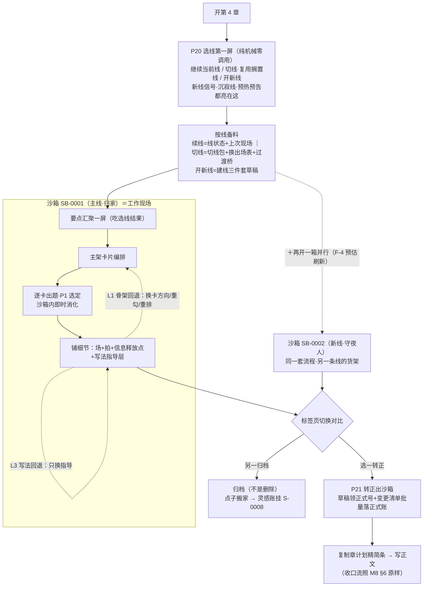

# 章工作台设计 R02（CHAPTER_WORKBENCH_DESIGN）——选线按需·章级沙箱·分层回退

身份：**轻档设计稿。** 第二版按 R13 对齐：选线不是每章必经（ADD-050）；沙箱选一转正＝对账，不做多支真合并（ADD-060）。历史稿 [CHAPTER_WORKBENCH_DESIGN_R01.md](CHAPTER_WORKBENCH_DESIGN_R01.md) 保留不动。

与 [M8_PLANNING_DESIGN_R03.md](M8_PLANNING_DESIGN_R03.md) 的分工：M8 管流程每一步干什么，本稿管现场规格。不是施工合同。

---

## 0. 一句话＋三句话

章工作台，说白了就是作者规划一章的**工作现场规格**：没定好线才先问「这章跟谁走」，进来之后随便铺随便改随便反悔（沙箱＋分层回退），满意了一键过闸才记进正式规划账（转正）。

1. **选线按需（ADD-050）**：上层已经定线就默认带过，前台只显示可改的当前线。没定好、作者改线、或对不上规划时才问。不要做成每章必经选线屏。切线仍是重动作，仍出切线包。
2. **章级沙箱（H3）**：这一章本来就在沙箱里进行，生成的不直接进正式账；同一章槽可以开两个沙箱各推一条线、切换对比，一个转正、一个归档——归档不是删除，好点子搬家去后面的章。
3. **分层回退（H7）**：章计划分三层——骨架（选线／要点／主架卡片／每卡方向）→ 细节（场／拍）→ 写法（指导层）。卡在哪层退哪层，细节跟卡走、卡不变细节留；每次回退记一张回退单，「全自动不满意」还是「手动走崩」机器数流水就能分出来，喂口味配置。

对小白的体感先说破：单线书＋省心档下，三机制几乎隐形——选线自动续、沙箱只有一个、转正自动过，跟没有这套机制时一模一样顺。机制的存在感只在需要它的人那里显形（多线作者、爱反悔的作者、并行推演的作者）——同停点哲学：控制颗粒度是高级能力（ADD-005）。

## 1. 选线按需：没定好才问，不是每章第一屏

### 1.1 第一屏长什么样（纯机械，零调用）

选线屏排在要点汇聚之前，而且是纯机械屏。**上层规划已经定线时，这一屏默认带过**，只显示可改的当前线标签；没定好才真正展开。汇聚调用在线定下来之后才开始花钱。

候选分三组，每条带一句话状态（全部机械拼装：线名＋`last_scene_ref` 的场胶囊＋沉寂章数＋触发相位缓存）：

```
第 4 章 ｜ 先选这章跟谁走（选完才备料）
━━ 继续当前线 ━━━━━━━━━━━━━━━━━━━━━━━━
 ● L-0001 十二禁棺主线（推荐：上章主导）
    上次现场：第 3 章场 5「首棺开启，老仵作的警告应验」
    货架预告：H-0003『开棺有代价』正在最佳期
━━ 换一条线（切镜头——主角可以整章不出现）━━━━
 ○ L-0002 师妹线（搁置中）
    搁置于第 2 章「她起了疑，没人跟进」｜已 2 章没动静
━━ 开新线 ━━━━━━━━━━━━━━━━━━━━━━━━━━
 ○ ＋ 守夜人线？（系统建议：第 3 章末尾的黑袍人还没归线）
 ○ ＋ 空白新线（自己起）
本章还有谁露面（可多选）：☐ L-0002 师妹线露一面
                         [就这么开工 →]
```

三条拼装规矩：

- **推荐来源分三级**（对齐 H1「首选路径是全局安排提前设计好」）：①本章槽位的大纲已排线（`storyline_refs` 有值）→ 照大纲推荐；②大纲没排 → 上一章主导线延续；③都没有 → 唯一活跃线。全书大纲的引导与分层深化是 H2 长线节奏监控台的地盘（另有设计单），选线屏只消费它的结果；作者「实在不要大纲」时，选线屏的系统建议式（1.3 的新线信号＋沉寂提醒）就是兜底。
- **选线不是单选题**：选的是**本章主导线**（决定备料和汇聚货架），另可勾「露面线」（该线在本章露一面，M8 章篮 `storyline_refs` 本来就是复数）。主导线吃全套备料，露面线只带一句线胶囊＋上次现场索引。
- **状态一句话必须可拼装**：触发相位取上次汇聚的评估缓存（M8 §3.5 第 7 条同款），没缓存就不显示这行——选线屏不为一行预告发起调用。

### 1.2 选完线，系统按线备料

「选不同线要准备的东西完全不同」落成三条备料路径（备料的物理形态就是给 C9 打包器的输入配置，机件全部现成）：

| 选择 | 系统准备什么 | 机件出处 |
|---|---|---|
| **续当前线** | 导入线状态＋上次现场：C9 本线区照旧装「上次现场 D0＋成员状态＋本线未结事项」 | [CONTEXT_PACKER_DESIGN_R01.md](CONTEXT_PACKER_DESIGN_R01.md) §1.2 ⑤区，零新增 |
| **切别的线／复用搁置线** | ①切线包三件（线状态＋上次现场＋成员状态）整体升档（本线跳档规则）；②**换出场表**——本章人物候选换成该线成员，主角可以整章不出现（切视角＝切镜头，H1 原话）；③**过渡桥提醒**：上章出口钩子不归本章主导线时，亮一条可选要点进货架——「上章钩子『老仵作的警告应验』悬着，本章开头给不给一笔远景？」勾了进编排，叉了随它（网文硬切也正常），提一次不复读；④搁置线加一行回场提示（搁置原因＋悬着什么） | 切线包＝PACKER ⑤区切线分支现成；过渡桥是新的一条**货架要点**（kind=过渡桥），不发明新交互——复用 G3 素材货架 |
| **开新线** | 建线三件套**草稿**：线名＋成员（从人物名单挑或新建）＋优先级，`line_status=active`、`last_scene_ref` 空（本章生成后回填）；外加一句可空的线目标（「这条线往哪走？一句话，不想填先空着」）。汇聚屏的必选区只有本章目标——新线没有历史欠账，桌子干净 | 三件套字段＝存储稿 §1.7 现成；**草稿住沙箱、转正才正式建档**——防「开线又归档」留一条零内容的壳线（理由见 §5.3） |

### 1.3 「这是不是新线」：三个主动触发

CZ 给的判定原则：「关注的内容变了就是新线」——视角切换（反派支线）、感情线（场景没变但关注点变）、复仇线（同视角但前一困境已解、新任务进来）。操作化成机器能执行的近似：**镜头（人物组合／地点）或任务（困境已解→新目标）二者有一换血，就该问一声。**

| # | 触发 | 判法 | 问的话术 |
|---|---|---|---|
| 1 | 新地区 | 机械：本章计划／要点里出现账上没有的地点，且主场景整体迁移（不是路过提一嘴） | 「到了新地方开新篇——要立一条线记它吗？」 |
| 2 | 新人物组合 | 机械：本章出场组合与每条现有线的成员表交集都很低（集合运算，阈值 ⚠️ 起步值待实测） | 「这批人不属于任何一条线——他们单独成线？」 |
| 3 | 前一困境已解＋新任务进来 | 模型：搭汇聚调用的便车顺手判（不加新调用）——同线同视角，但线上主困境已收、本章目标是全新任务 | 「复仇完了要寻宝了——关注的内容变了，算新线吗？」 |

三条配套规矩：

- **问 ≠ 拦**：新线信号是提醒不停的一行（亮在选线屏或沙箱内），作者答「并入当前线」后同一信号本槽不再问（提一次就闭嘴，捞货 46 家法）。
- **两个时机**：选线屏（基于上章内容——第 3 章末尾冒出黑袍人，第 4 章选线屏就亮「守夜人线？」）；沙箱内（卡片衍生出新地区／新组合时问「这批内容要不要拉出去立线」——支线卡 `branch_of` 机制现成，立线＝支线升格）。
- **判不准宁可问**：三触发都只产生「问句」，立不立线永远是作者的事——线是作者理解自己故事的方式，系统只负责在「像是新线」的时刻把问题递到眼前。

### 1.4 线多了怎么办：选线屏就是线级素材栏

H1 原话「线久无动静提醒收或搁置」，落法对齐 G2 触发预热哲学——**提醒不是等线死了才叫，而是把线的冷热常年亮在选线屏上**：

- **沉寂判定（纯机械零调用）**：距上次现场 ≥ 5 章（⚠️ 起步值，可进设置）∧ 线上没有预热／最佳期的触发候选 → 该线在选线屏折进「沉寂」组，带一行「已 6 章没动静：这章去写它 ／ 搁置 ／ 收束」。
- **预热面（正向引导）**：线上有伏笔进预热期时，选线屏在线名后亮「1 条伏笔快到最佳期」——把作者往该去的线上引，这就是 G2「触发期之前就开始预热」在线级的形态。选线屏＝**线级素材栏**：系统挑拣（推荐排序＋冷热标注），作者勾选（选线）——同一套素材栏交互哲学，只是货是「线」不是「要点」。
- **收与搁置是作者显式动作**：`line_status` 翻 `paused`／`converged`，流水留痕；搁置线不再进沉寂提醒（已经安顿了），收束线默认折叠出候选列表。
- **不唠叨**：同一条线的沉寂提醒提一次，之后只默默挂章数徽标。

## 2. 章级沙箱（H3）：工作现场就是沙箱

### 2.1 沙箱是什么——与 M8「选定即消化」的正面调和

CZ 原话把本性说破了：「这一章本来就在沙箱里进行（生成的不直接进数据库）。」所以沙箱不是新开一种模式，是**章工作台的本体**：开章选完线，系统自动开出第一个沙箱（作者感知就是「进了章计划工作台」），汇聚、编排、出题、铺满全部发生在里面。

必须正面调和的一处：M8 R01 §3.6 写「选定即执行变更清单落账」。沙箱制下这句话**语义保留、落点改写**：

- **不变的**：决定的时刻不变——P1 选定那一刻，消化标记、变更清单立刻生效，作者全程零补账。ADD-004 Q3 否决的「关章勾选」没有借沙箱还魂：转正是「过闸落笔」，不是「重新决定」，作者不重新勾任何一条。
- **变的**：生效的账在哪——选定即时改的是**沙箱视图**（正式账＋本箱覆盖），物理写进 `plan.json` 推迟到转正那一刻批量执行。
- **为什么必须缓写（两个硬理由）**：①多沙箱并行在物理上要求它——两个箱对同一条伏笔可能是两种收法，正式账只能记一种，谁先写谁污染；②回退变便宜——H7 的「整层作废」在草稿区是普通操作，直接落正式账则每次反悔都往主账拉一串 `voided` 尸体，账面很快没法看。

真值边界重申一次：沙箱→转正写的是**规划账**（计划层），不是真值签字；事实账、设定集永远不被转正直接碰——变更清单里的设定动作照 M8 §3.2 铁律生成提案卡，作者在设定集侧另签（双门不变）。

### 2.2 边界表：箱内自由 vs 出箱才生效

| 沙箱内自由（随便动，不碰正式账） | 出沙箱才生效（转正时批量落正式账） |
|---|---|
| 选线／换露面线（本箱属性）；要点勾选／叉掉；主架卡片编排、拆并增删（铺卡）；逐卡出题、P1 选定、回头换选项（沙箱内即时消化）；弃用全组＋快选标签；铺满；改任意格子；局部微调；各层回退；直接手写章计划（M8 §1.5 一等公民入口照样在箱内）；开新箱、归档本箱 | 卡片／选择记录／场／拍领正式号入账；槽位格子更新（goal／summary／scene_refs／exit_hook／storyline_refs…）；钩子推进／回收、必写承接消化的状态**真翻**并挂正式 OPT 号；新线三件套正式建档；设定变更提案卡生成（作者另签）；`slot_mappings`／容量灯触发的映射行落账 |

两个跨箱即时生效的例外，写明不藏：

- **弃用记录跨沙箱有效**（F8「必须被读到」不打折）：本槽**所有**沙箱（活跃／归档／已转正）的弃用组，都进后续任何一次出题的输入。作者在归档箱里说过「这几个思路都不对」，换个箱不等于思路又对了。物理上不需要提前入正式账——打包器直接扫本槽沙箱文件（§5.5 C9 增补）。
- **点子搬家产物即时落灵感账**：归档箱上的搬家是显式作者动作，产物一条直接进 `ideas.json`（见 §2.4），不等转正——归档箱没有转正这回事。

### 2.3 多沙箱并行：第 4 章开两箱推演

H3 给的纠正先记牢：**并行的两案通常不是「同一堆材料的两种排法」，而是「两条线各自的货架」**——收伏笔要看伏笔在哪条线，想收哪条线的伏笔就走哪条线。所以「开第二个沙箱」的第一步还是选线（P20 同屏复用），两箱的汇聚桌子天然不同。

《万鬼伏藏》第 4 章的画面：作者拿不准——按主线写「归家·代价砸下」，还是先开反派线写「守夜人」（黑袍人视角一整章，主角不出现）。

| | SB-0001「归家·代价砸下」 | SB-0002「守夜人·暗线开张」 |
|---|---|---|
| 主导线 | L-0001 十二禁棺主线 | 新线草稿「守夜人线」（成员：黑袍守夜人；暗中观察对象：陈九棺） |
| 汇聚桌子 | 必选：兑现 H-0003『开棺有代价』（最佳期）＋MC-0011；可选：师妹线露面… | 必选：只有本章目标「让读者知道有人在盯着开棺人」——**H-0003 不在这张桌上**（它挂在主线爷爷一线，这条线收不了它）；可选：过渡桥（上章警告应验的余波给不给一笔远景） |
| 推演结果 | 两卡三场（归家不识／族谱除名／棺中心跳），900＋700＋1,100＝2,700 字 | 一卡两场（守夜人记录开棺人／黑袍下的第二本名册），约 1,800 字 |

操作三件事：

- **开箱**：工作台顶部「＋再开一个推演」。开箱＝选线＋报花钱（F-4 预估刷新，§2.5）＋从零开始（新箱不复制旧箱内容——独立推演才有对比价值；「基于现箱改一点」是回退的活，不是开箱的活。分叉需求见开放问题 O2）。
- **切换对比**：顶部标签页随时切；「对比视图」轻做——两箱的卡片清单＋场序并排一屏，机械渲染零调用。不做逐格 diff：两箱结构可能完全不同，对比的单位是「方案」不是「字段」。
- **收束**：一箱转正（P21），其余活跃箱弹一句「归档？」——建议但不强制（作者可能想留着改天看）。转正之后其他箱自动亮「账本已变」标（它们的 `basis_note` 过期了），日后想转正必过预检复核（§5.3）。

### 2.4 归档不是删除：点子搬家

- **归档＝冻结只读**：翻 `archived`，列在工作台「已归档推演」折叠区；花过的积分不退（开箱时报过价）。
- **归档 ≠ 弃用，两个概念两条数据路**：弃用（F8）＝思路被作者否定，必须回流防止再推荐；归档＝「这回不走这条路」——点子还能用（H3 原话：两条不冲突的可以一先一后都用）。归档箱**里面**的弃用组照常回流；归档箱**整体**不算弃用。
- **点子搬家（轻机制）**：打开归档箱，任意卡／要点／场点「搬去后面的章」→ 生成**灵感账一条**（`ideas.json` 既有「轻安放」通道，`kind: sandbox_relocation`、出处链接 `SB-0002#d-ac-1`、挂靠目标槽 S-0008）→ 目标章要点汇聚时它自然上货架可选区。第 4 章的例子：SB-0002 归档后，把「守夜人首次正面露面」搬到 S-0008——正是 H3 原话「新线往后挪到第 8/9 章引出」。
- **搬的是骨血不是皮肉**：搬家产物＝一句话点子＋出处链接，不搬成品场／拍——细节到了新章语境多半要重铺，想回看细节点出处链接进归档箱。零新对象类型，全程复用灵感账。

### 2.5 沙箱与钱：会话包怎么算

CZ 点名「沙箱内出题也花积分」。三条口径，全部挂在 M8 §7 的规划会话包（F-4）上，不新开花钱户口：

- **沙箱不是免费游乐场**：箱内汇聚／编排／出题／铺满／微调全是真调用真积分，计入本章会话包；会话定义照旧（一章一会话），**两箱的花费加总算本章**。
- **开新箱＝F-4 的一次预估刷新事件**：横幅「再开一个推演 ≈ 再花 32 积分（汇聚＋编排＋出题＋铺满），本章预估 40 → 72」——并行推演双倍花钱这件事，开箱那一刻讲清楚（ADD-002 精神：积分制不是雷，不可预测才是）。120% 超支闸门按章会话累计照管。
- **归档不退钱，转正不加钱**：转正是程序动作零调用（预检是机械对时）；回退本身免费，回退后的重出题／重铺按包内动作正常计。

## 3. 分层回退（H7）：卡在哪层退哪层

### 3.1 三层是什么

CZ 原话：「剧情＝大骨架 → 填细节 → 更细的细节」，落到 M8 管线上：

| 层 | 里面装什么 | 对应 M8 步骤 |
|---|---|---|
| **L1 骨架** | 选线、要点勾选、主架卡片（几张卡／各串哪些要点）、每卡选定的方向（OPT 选中项） | 选线 → 汇聚 → 编排 → 逐卡出题选定 |
| **L2 细节** | 场（目标／阻力／转折／POV／字数）、拍（PE）、信息释放点、场序与字数分配 | 铺满＋局部微调 |
| **L3 写法** | 写法指导栏、挂件建议（插件「段落写法层」的内容，[PLUGIN_SKILL_SYSTEM_DESIGN_R01.md](PLUGIN_SKILL_SYSTEM_DESIGN_R01.md) 分层取用） | 铺满的指导栏／按需取层 |

「更细的细节」就是写法指导层——它指导**怎么写**，不改**写什么**；换指导不动剧情，是最便宜的回退。

### 3.2 各层回退动作表

回退全部发生在沙箱内（§2.2 边界），旧东西翻 `voided` 留箱内不删：

| 回退 | 动作 | 波及 | 花钱 |
|---|---|---|---|
| L3 换写法 | 换挂件／重取插件层，剧情格子不动 | 零 | 零或小调用（挂件词条现成） |
| L2 场级 | 该场重铺（卡方向不变，细节重来） | 本场旧场／拍作废 | 局部微调价 |
| L2 卡级 | 该卡全部细节重铺 | 该卡旧场／拍作废 | 部分重铺价 |
| L1 换卡方向 | 该卡重出题（旧选定标 `superseded`，**不算弃用**，见 §3.5） | 该卡 L2 全废＋该卡账务撤销重记 | 出题价 |
| L1 重勾要点／重排卡 | 受影响卡重出题 | 受影响卡的下游全废 | 受影响卡数 × 出题价 |
| L1 换主导线（最深） | **建议归档本箱＋开新箱**——选线是沙箱的出生属性，换线＝换箱 | 整箱归档，点子可搬 | 新箱全程 |

最深一档把 H7 和 H3 接成一件事：回退到线级＝并行机制接管——旧推演完整保留成归档箱，比「原地清空重来」信息零损失，点子还能搬。

### 3.3 骨架改了，哪些细节能留：四条机械规则

CZ 要的判定思路（「改动后哪些细节还能保留、哪些要重铺」），四条全是机器可执行的：

1. **细节跟卡走**：场带 `arc_ref`、拍挂场——被改卡的场／拍**整体**作废，没动的卡的场／拍**整体**保留。故意不做场内逐句抢救：半新半旧的缝合场比重写难收拾（⚠️ 设计判断，宁可多废一场不留缝合怪）。
2. **要点重勾的波及集＝`point_refs` 命中的卡**：摘掉要点 X → 引用 X 的卡要么重出题（换方向消化剩余要点）要么删卡；新增要点 → 挂进现有卡（该卡重出题）或加新卡。
3. **账务跟卡**：沙箱账务积压（`pending_changes`）每条带 `from_card`——卡废，它名下的账务条目自动撤销重记，不用人对账。
4. **章级布局标复查**：场序、字数分配是跨卡整章的事（M8 §1.5 铺满一次调用的理由）。任何卡级回退后的重铺调用，把**保留的场当「已定不重写」输入**，只重铺受影响卡＋顺手重排整章布局；布局变动照 P3 容量灯老规矩亮灯留痕，不静默。

第 4 章的例子：SB-0001 铺满后，作者觉得卡二「棺中异动」的方向不对——「深夜独听心跳」太静，重出题换成「心跳把他引到棺前，棺缝里望进去，没有尸体」。卡一「代价砸下」的两场（归家不识／族谱除名）原样保留，卡二旧场作废重铺；重铺时卡一的场作为已定输入，整章字数分配刷新一次、容量灯亮灯留痕。

### 3.4 回退单：「为什么回退」怎么记

CZ 点名：要能调查为什么重写——**全自动生成不满意** vs **手动一步步走崩**，天差地别；这个数据和驳回记录一样珍贵，进口味配置。落成两半，机器一半、作者一半：

- **机械归因（恒记录，零打扰）**：从沙箱流水数被废内容上的作者编辑次数，算出 `auto_ratio`＋三档 `origin_class`——`auto_untouched` 全自动没动过（0 次人改）／`auto_tweaked` 自动＋小改（1–3 次 ⚠️ 起步阈值）／`hand_worked` 深度手工（>3 次）。CZ 要区分的两种画面由此机械可分：回退掉的东西一手没动过＝对自动产出不满意；改了一堆还是崩＝手动走崩。
- **作者标签（快选，可跳过——O3 交拍）**：方向不对／节奏不对／写不下去／改主意了，四枚一击快选＋自由一句。跳过时只存机械档案。为什么不像弃用那样「至少填其一」：弃用没有任何机械信号，必须要人开口；回退的核心区分机器数流水就能得出，标签是锦上添花——强制会让回退心理变贵，作者为省一次弹窗将就错骨架，比丢一个标签亏得多。
- **去向**：沙箱 `rollbacks[]` 一条＋流水一行；关章沉降时并入 `taste.json` 原料（M8 §3.8 原料清单 += 回退单）。用法举例：骨架层 `auto_untouched` 回退偏多 → 出题方向常不合口味，选项生成要更重地读弃用记录和口味摘要；`hand_worked` 走崩偏多 → 容量／节奏提醒要更早亮。

### 3.5 回退与弃用，划清界（一次说完）

- **弃用**（F8）＝对一道题的全部选项说「思路都不对」——题级强负反馈，必须记档必须被后续生成读到；
- **回退**（H7）＝对已经选定／已经铺开的东西反悔——层级动作，旧选定标 `superseded` 不进弃用记录，因为作者可能同方向重选、只换细节。
- 回退重出题后，作者若接着点「这些思路都不对」，那一下才是弃用——两条数据各走各路，互不冒充。

## 4. 三机制合成：流程图＋第 4 章全程走查



第 4 章全程走一遍（每步标机制归属）：

| 步 | 发生什么 | 机制 |
|---|---|---|
| 1 | 开第 4 章 → 选线屏：主线（推荐，H-0003 最佳期预告）／师妹线（搁置，2 章没动静）／新线信号「守夜人还没归线」 | H1 |
| 2 | 作者拿不准 → 先按推荐走主线，SB-0001 自动开箱；汇聚→编排两卡→逐卡选定→铺满三场 2,700 字 | H3＋M8 管线 |
| 3 | 卡二方向不对 → 回骨架层重出题（卡一保留，账务跟卡撤销重记，布局标复查）；回退单自动记：层=骨架／范围=卡二／`auto_untouched`／标签「方向不对」 | H7 |
| 4 | 还是心痒守夜人 →「＋再开一个推演」：横幅报价（本章预估 40→72 积分）→ SB-0002 选新线草稿，汇聚桌上没有 H-0003（伏笔跟线走），铺一卡两场 | H3＋H1 |
| 5 | 标签页切换对比：代价不落地读者对规则没实感 → 主线该先走 | H3 |
| 6 | SB-0001 转正（P21：预检零复核 → 变更清单批量落账，H-0003 翻 paid 挂正式 OPT 号，草稿号换正式号）；SB-0002 归档，「守夜人首次正面露面」搬家 → 灵感账挂 S-0008 | H3 |
| 7 | 复制章计划精简条去写正文；收口流（粘回→移交→审查→对账→收工卡）照 M8 §6，一字不改 | M8 |

## 5. 数据形状（与 [PLAN_LEDGER_STORAGE_DESIGN_R01.md](PLAN_LEDGER_STORAGE_DESIGN_R01.md) 商量着定）

### 5.1 文件摆放

```text
data/<书名>/
  plan.json                正式规划账（存储稿原样，动它的只有「转正」）
  plan_history.jsonl       正式账流水（原样）
  sandboxes/
    SB-0001.json           每沙箱一文件（活跃/已转正/已归档都留着）
    SB-0002.json
  workbench_history.jsonl  沙箱区流水（纯追加，一行带 sandbox_ref：编辑/回退/归档/搬家/转正预检）
```

为什么沙箱单独放文件、不塞 plan.json：①沙箱是高频重写区，塞主账每次编辑都膨胀重写主文件（同存储稿 §7 把流水拆出去的理由）；②「沙箱不碰正式账」从物理上成立——审计时看 `plan.json` 的改动流水，只有转正一种来源。每沙箱一文件、一次原子保存，与主账同款做法。

### 5.2 沙箱对象字段表（`sandbox`，SB- 前缀暂定交词典 N9）

| 字段 | 类型 | 装什么 |
|---|---|---|
| `id` / `slot_ref` / `label` | str | 门牌（书内发号）＋归属章槽＋作者可改的名字（默认＝主导线名） |
| `sandbox_status` | enum | `active` 活跃／`promoted` 已转正（冻结只读）／`archived` 已归档（冻结只读） |
| `line_choice` | obj | 选线结果：`{primary, guests[], new_line_draft, decided_by}`——`new_line_draft` 是三件套草稿（名／成员／优先级／线目标），转正才正式建档 |
| `basis_note` | str | 开箱时正式账时点（转正预检对时用） |
| `point_board` | obj | 要点勾选 `{checked[], dismissed[], pinned_mandatory[]}`——**从 M8 8.4 的 chapter_slot 搬进沙箱**（两箱各勾各的，这字段天然属于箱） |
| `arc_cards[]` / `option_records[]` / `scenes[]` / `events[]` | list | 草稿对象四族，字段照 M8 §8.4／存储稿 §1 原样，**编号用草稿号**（§5.3）；弃用组就在 `option_records` 里（`group_status=discarded`） |
| `pending_changes[]` | list[obj] | 对共享对象的账务积压：`{seq, kind, target_ref, payload, from_card, status}`——kind 枚举：`hook_advance`／`hook_payoff`／`hook_plant`／`mc_digest`／`char_state`／`setting_proposal`／`create_storyline`／`slot_field`；`from_card` 让账务跟卡（§3.3 规则 3）；`status`：`pending`／`undone`（回退撤销留痕） |
| `rollbacks[]` | list[obj] | 回退单（§5.4） |
| `cost_used` | int | 本箱已花积分（F-4 会话按章加总的分项） |
| `promoted` | obj/null | 转正回执：`{at, mapping}`——mapping＝草稿号→正式号对照表 |
| 公共字段 | — | `created_at`／`updated_at`／`rev`／`note` 照存储稿 §1.1；`ledger` 恒 `"plan"`（沙箱也是计划态，铁字段防冒充）。`source_identity`／`truth_bearing` 不设在箱本身——箱内各草稿对象自己带，出生值照存储稿 §3.1 |

### 5.3 草稿号与转正六步

**草稿号**：沙箱内对象一律 `d-<族>-<n>`（`d-ac-1`、`d-scn-2`、`d-pe-7`、`d-opt-1`），箱内自编不领正式号。为什么：正式发号器不为推演烧号——两个箱各自编号也不撞（各文件各命名空间），归档箱永远不占正式号段，`plan.json` 的 `id_counters` 在沙箱期零改动。归档箱里的对象终身用草稿号，跨文件引用写全称（`SB-0002#d-ac-1`）。

**转正（P21）＝一笔原子动作，六步**：

1. **预检（机械对时）**：`pending_changes` 各目标对象的 `rev` 与开箱 `basis_note` 对照——账本在沙箱背后变过的（别的章转正把同一条伏笔收了、作者在别处改了钩子），列成「复核清单」逐条处置完才放行（像 P4 的清单形态）；
2. **领号**：草稿对象按 `plan.json` 发号器领正式号，箱内引用机械重写，mapping 留档；
3. **入账**：卡／选择记录／场／拍落 `plan.json` 对应数组；槽位格子按沙箱结果更新，槽位加 `plan_source_ref: "SB-0001"`（这章计划从哪个推演来的，追溯用）；
4. **执行账务积压**：钩子／承接翻状态挂正式 OPT 号；新线三件套建档；`setting_proposal` 生成提案卡**不直改**（M8 §3.2 铁律原样）；
5. **沙箱翻 `promoted`**＋mapping 写回沙箱文件；
6. **流水**：`plan_history` 记一条 `promote`（带沙箱号＋对象清单）；同槽其他活跃箱弹「归档？」。

MVP 原子性：先一次整文件保存 `plan.json`，再写沙箱文件；若第二步崩，重启载入预检发现「`plan_source_ref` 指向的箱还是 active」即亮修复提示——一行兜底，不过度设计。**转正撤销**：转正后、后续编辑叠上来之前，可一键撤——按 promote 流水条目逆放（对象移回箱、状态回翻），流水 `undo` 机制现成（存储稿 §7）；一旦有新编辑叠加就不许一键撤，改手工。

### 5.4 回退单字段（`rollback_record`，箱内序号 rb-n，不占全局前缀）

| 字段 | 装什么 |
|---|---|
| `layer` | `skeleton`／`detail`／`guidance` |
| `scope_ref` | 退的范围：整箱／卡号／场号 |
| `voided_refs` | 作废对象清单（草稿号） |
| `auto_ratio` / `origin_class` | 机械归因：被废内容的人改占比＋三档判（§3.4；从 `workbench_history` 数 actor=author 的次数） |
| `reason_tags` / `reason_note` | 快选标签（方向不对／节奏不对／写不下去／改主意了）＋自由一句，都可空 |
| `rolled_back_to` | 退回到什么状态（如「卡二重出题」） |
| `ts` | 时间 |

引用写法：`SB-0001#rb-2`；taste.json 的 `evidence_refs` 可直接引。

### 5.5 提交清单（本稿不改别的文件，列给各宿主吸收）

| 交给谁 | 增补什么 |
|---|---|
| M8 R02 修订 | ①流程头部加「选线第一屏（P20）」，汇聚输入多一项「主导线＋露面线」；②§3.6「选定即执行」补注「执行于沙箱视图，转正批量落正式账」（语义不变落点变，出处 ADD-016 H3）；③8.4 的 `point_board` 宿主从 chapter_slot 改为 sandbox；④arc_card／option_record 草稿期住沙箱文件、转正入正式账（字段不变）；⑤§7 F-4 预估刷新事件 += 开新沙箱；⑥§3.8 taste 原料 += 回退单 |
| 存储稿升 v1 | 新对象 `sandbox`＋`rollback_record`（§5.2／5.4）；`chapter_slot` 加 `plan_source_ref`；`id_counters` 加 `SB`；新文件 `sandboxes/`＋`workbench_history.jsonl`；流水动作词 += `sandbox_open`／`promote`／`archive`／`relocate`／`rollback` |
| C9（打包器落地时） | 任务票加 `sandbox_ref`；打包读取＝正式账＋本箱覆盖（已定卡出口／箱内已定 PE／积压中的钩子状态视图），覆盖条目 `why_loaded: "sandbox"`；弃用注入范围扩为「本槽全部沙箱（含归档）的 discarded 组」 |
| 词典 N9 | `SB-` 前缀暂定；「沙箱」「转正」「归档」「点子搬家」「回退单」词条候选 |
| 灵感账稿 | `ideas.json` 的 `kind` 值域 += `sandbox_relocation`（轻安放通道复用，零新机制） |

## 6. 停点标注（按 [STOP_POINT_REGISTRY_R01.md](STOP_POINT_REGISTRY_R01.md) 格式给行，落号归注册表承办）

【一致性修订 20260813】撞号改判：本稿原申报 P18/P19 与全书大纲稿撞号（挂账本 06:52 已裁定：大纲稿申报在先、本稿改 P20/P21——最终号谱见注册表 §5.1），下表照改：

| # | 停点位 | 在哪触发 | 小白／省心默认 | 高级默认 | 档位约束 | 出处 |
|---|---|---|---|---|---|---|
| P20 | 选线（这章跟谁走） | 没定好／改线／对不上规划时才问；已定线默认带过 | 提醒不停（推荐线自动带入＋横幅可换） | 必停（列全候选自己挑） | 不设无痕自动档——没定线不能装错料；已定线不要每章再问一遍 | 本稿 §1〔R13 ADD-050〕 |
| P21 | 章计划转正（出沙箱落正式账） | 沙箱铺满完成／作者点「转正」 | 提醒不停（唯一活跃箱 ∧ 预检零复核项时自动转正，横幅＋一键撤） | 必停（转正预览：变更清单汇总＋预检结果） | **≥2 个活跃沙箱时无视档位必停**（系统不替作者二选一）；预检有复核项必停；转正写规划账，不是真值签字，不进签字表 | 本稿 §2/§5〔候选，原 P19 改号〕 |

- **F-4 行补注建议**（提交注册表）：触发列加一句「开新沙箱时预估刷新并追加确认一次」。不新开 F 号。
- **盘点过、不占号的**（照注册表体例）：回退各层——作者主动动作＋回退单留痕；归档／点子搬家——作者显式动作留痕；新线信号三触发——提醒类提一次；沉寂线提醒——选线屏常亮徽标；过渡桥——货架可选要点，随 P1 消化通道走。

## 7. 开放问题（交 CZ 拍）

**O1｜归档沙箱攒多了怎么办？**
场景：写到 50 章，工作台底下躺了三十几个归档推演，列表越拉越长。
- A. 永不自动清，界面折叠解决（默认只显最近 3 个＋「查看全部」）
- B. 转正后隔几章提示一次「这批归档推演还要吗」，批量清（已搬走点子的优先）
- C. 归档那一刻就问「值得留吗」，不留的直接删
- 👉 推荐 A：一个箱几十 KB，存储不心疼；点子搬家的价值常在几十章后才显现（「当初那个反派视角的推演呢？」），清了就找不回。等真有作者抱怨列表脏再上 B；C 最差——归档时作者根本预知不了以后用不用得上。

**O2｜两个沙箱能不能「合并」或「分叉」？**
场景：推演完发现 A 箱的卡一＋B 箱的卡二拼起来才是最好的一章；或者想「保住现状，另开一份试个激进改法」。
- A. 都不做：选一箱转正，另一箱的好卡用点子搬家搬进来重出题重铺（V0 现案）
- B. 支持分叉（复制现箱再改），不支持合并
- C. 支持真合并（跨箱挑卡拼装）
- 👉 推荐 A：真合并要调和两套账务积压——同一条伏笔两种收法拼在一起就是账目事故，机械对齐成本高；「搬点子＋重出题」一次调用就拼出同样效果，且细节在新组合语境下重铺本来更对（§3.3 规则 1 同理）。分叉记 v2 候选，等真有作者喊「我想保住现状再试一版」。

**O3｜回退的理由标签，强制填还是可跳过？**
场景：作者半夜改烦了，十分钟里连退三次，每次都弹标签选择框。
- A. 快选可跳过，机械归因恒记录（本稿现案）
- B. 至少选一个标签（同弃用的「标签和理由至少其一」）
- 👉 推荐 A：弃用必须要人开口，因为机器对「思路为什么不对」毫无信号；回退不一样——CZ 点名要区分的「全自动不满意 vs 手动走崩」，机器数流水就能得出，标签只是加香料。强制标签会让回退这个动作心理变贵，作者为了省一次弹窗将就错骨架，比丢几个标签亏得多。

## 8. 轻档自查记录

- 任务书七项逐项回对：①选线前置（§1：候选三组带状态一句／三路备料／新线三触发操作化／沉寂线管理对齐预热哲学）；②章级沙箱（§2：边界表／多箱并行切换对比一转正一归档／点子搬家轻机制／会话包口径）；③分层回退（§3：三层定义／各层动作／保留判定四规则／回退单含「为什么回退」两半记法）；④合成流程图（§4 mermaid＋走查表）；⑤数据形状（§5：沙箱文件／草稿号／转正六步／回退单／与存储稿的提交清单）；⑥停点标注（§6：P20/P21 按注册表五样格式＋F-4 补注＋不占号盘点——原申报 P18/P19 撞号改判）；⑦开放问题 3 条（§7）——无缺项。
- ADD-016 三节原话逐条吸收核对：H1「选完才准备内容」（§1.2 三路备料）／「切视角=切镜头主角可整章不出现」（§1.2 换出场表）／「关注的内容变了就是新线」三例（§1.3 三触发）／「久无动静提醒收或搁置」（§1.4）／「首选全局安排、不要则引导、再不要系统建议式」（§1.1 三级推荐＋指向 H2 监控台）；H3「本来就在沙箱里」（§2.1）／「另开沙箱并行推演两条线切换着看」（§2.3）／「收伏笔要看伏笔在哪条线」（§2.3 两箱货架不同）／「不冲突的一先一后都用、挪到第 8/9 章」（§2.4 搬家例子）；H7「卡在哪层回哪层」（§3.2）／「回骨架改完重填、旧细节扔掉」（§3.3 规则 1）／「要能调查为什么重写：全自动不满意 vs 手动走崩」（§3.4 机械归因＋标签）。
- 上游机制冲突处置：M8 §3.6「选定即落账」按 ADD-016 H3 改写落点、保留语义（§2.1 正面调和，列进 M8 R02 提交清单）；M8 8.4 `point_board` 宿主迁移（§5.5）；ADD-004 Q3「不做关章勾选」复核——转正零逐条勾选，不还魂。
- 机制复用清点（零新发明核对）：过渡桥＝货架要点；点子搬家＝灵感账轻安放；转正撤销＝流水 undo 逆放；预检复核＝P4 清单形态；对比视图＝机械渲染；弃用跨箱回流＝打包器扫文件。新造的只有沙箱对象、回退单、草稿号规则三样，均为 H3/H7 的物理必需。
- ⚠️ 标注清点（无实测不拍死）：沉寂阈值 5 章（§1.4）、新组合交集阈值（§1.3）、机械归因三档次数阈值 0/1–3/>3（§3.4）、开箱报价示意数字（§2.5）、「不做场内逐句抢救」为设计判断（§3.3 规则 1）。
- 没发明新拍板：选线/转正停点标〔候选〕交注册表落号——原按「下一空号即 18/19」申报，漏核人物账（P18）与大纲稿（P18/P19）在先的申报，【一致性修订 20260813】按挂账裁定＋注册表 §5.1 改 **P20/P21**；F-4 补注交注册表；SB- 前缀＋五个词条交词典 N9；M8 R02／存储 v1／C9／灵感账各自的增补列清单不越界代改；转正判为非真值签字（写规划账）依 ADD-005 边界。
- 示例自洽核对：第 4 章走查与 OUTLINE R02／存储稿的 S-0004 正典对齐（H-0003 最佳期＝触发条件「首棺开启后」已满足于第 3 章；三场 900+700+1,100=2,700 对目标 2,600 在容量灯 105% 内）；SB-0002 桌上无 H-0003 与「伏笔跟线走」自洽；搬家目标 S-0008 与 H3 原话「第 8/9 章引出」一致；mermaid 已机械检查可渲染。

## 9. 来源与追溯

- 挂账本（小说架构仓，路径含中文，复制用）：`/Users/a1234/挣钱/小说架构/TEMP/bgboard-audit-20260809-r01/18_R07_ADDENDUM_LEDGER_20260813_R01.md`——**ADD-016 H1/H3/H7（本稿宪法）**、ADD-013 G3（要点汇聚——本稿选线在其上游）、ADD-012 F8（驳回=弃用必记——回退单的同族）、ADD-005（停点即设置）、ADD-004 Q3（选定即消化——§2.1 调和对象）、ADD-002（预估制——开箱报价依据）。
- [M8_PLANNING_DESIGN_R01.md](M8_PLANNING_DESIGN_R01.md)：汇聚／编排／出题／铺满／收口全管线、F-4 会话包、taste.json、弃用回流——本稿三机制的宿主流程；R02 修订提交清单见 §5.5。
- [OUTLINE_STRUCTURE_DESIGN_R02.md](OUTLINE_STRUCTURE_DESIGN_R02.md)：故事线三件套（成员／线状态／上次现场指针，§3.2）、切线包概念、章篮 `storyline_refs`。
- [CONTEXT_PACKER_DESIGN_R01.md](CONTEXT_PACKER_DESIGN_R01.md)：故事线是第一过滤器（两轴定档第一轴）、本线区／切线包装载、`why_loaded` 枚举（本稿加 `sandbox` 值）。
- [PLAN_LEDGER_STORAGE_DESIGN_R01.md](PLAN_LEDGER_STORAGE_DESIGN_R01.md)：字段家族、发号器三道闸（草稿号规则的对话对象）、流水与 undo、移交五件套（转正六步的形态参照）。
- [STOP_POINT_REGISTRY_R01.md](STOP_POINT_REGISTRY_R01.md)：领号规矩五样、不占号判例；[IDEA_LEDGER_DESIGN_R01.md](IDEA_LEDGER_DESIGN_R01.md)：轻安放通道（点子搬家复用）；[PLUGIN_SKILL_SYSTEM_DESIGN_R01.md](PLUGIN_SKILL_SYSTEM_DESIGN_R01.md)：L3 写法层的插件分层取用；[REVERSE_PLOT_MAP_DESIGN_R01.md](REVERSE_PLOT_MAP_DESIGN_R01.md)：P17 占号核对。

来源：Cursor（Fable 5 Max）设计，2026-08-13；拍板真源 CZ（ADD-016 H1/H3/H7 及所引各条），待 CZ 拍 O1–O3。

修订记录：
- 一致性修订 20260813：选线/转正停点号 P18/P19 → **P20/P21**（执行挂账本 06:52 撞号裁定；最终号谱见注册表 §5.1），§2.3、§4 图表、§5.3、§6 表、§8 自查同步改字。设计稿群一致性巡检执行。
