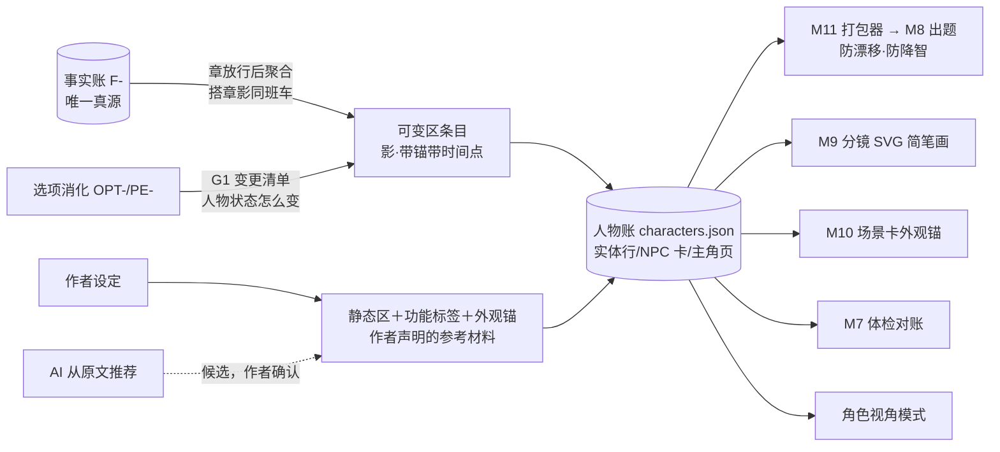
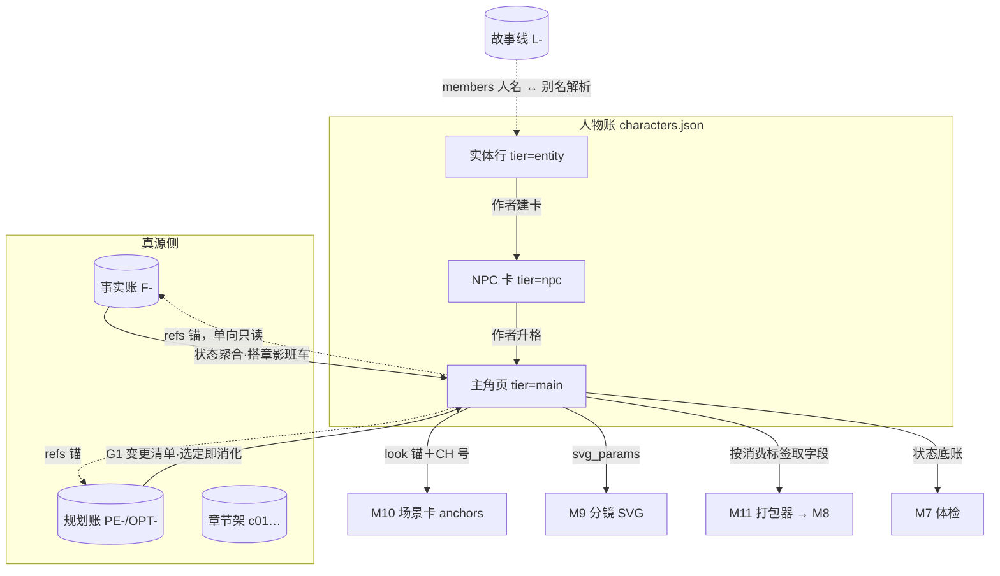

# 人物账设计稿 R02（CHARACTER_LEDGER_DESIGN）

身份：**轻档设计稿，ADD-016 H4 的专项设计单**（CZ 2026-08-13 05:23–05:35 拍板的人物账完整画面）。回答一件事：**人物的信息现在散在事实句里没有「家」——这个家长什么样**：页面怎么从账本聚合出来、字段分哪几种身份、静态和可变怎么分区、NPC 怎么极简复用、照片和 SVG 简笔画怎么放、每个字段哪些场景必填。不是施工合同：字段表是合同的人读版，新前缀（CH-）、新停点（P18）、新花钱确认（F-6）全部标候选，以词典 N9 和停点注册表发号为准。

## R01→R02 变化清单

R02 按第三册挂账本（`/Users/a1234/挣钱/小说架构/TEMP/bgboard-audit-20260809-r01/26_R09_ADDENDUM_LEDGER_VOL3_20260813_R01.md`，复制用）返工，R01 原样保留。变化五组：

1. **心理标签降级（ADD-033）**：R01 的「一个标签解析一串行为逻辑、当行为约束」降为**软先验＋编辑索引**（外调实证：认识标签是真的，靠单标签跑长程行为链是假的）；静态区新增**七层内核结构**（展示标签／人格基线／动机引擎／关系模式／情境签名／行为证据／动态状态），「情境签名」是新增字段；体系分工写死（Big Five 主骨架、依恋绑对象存、MBTI 只展示、九型拆动机、临床名默认不进提示词）；一致性检查器输出四档＋优先级链，**单一标签永不独立触发硬告警**。改动落点：§3.1／§3.2／§4.5／§7.1／§8.2。
2. **两层状态轴（ADD-030 人物侧）**：R01 创作侧「选定即落条目、identity=evidenced、status=current」是「选中冒充已发生」的病灶。R02 拆两面：**选中计划只生成 planned 面条目**，人物页「实际发生」（actual）态只能由**六态对账边或作者签字**推进。改动落点：§1.2／§4.2／§4.4／§8.2。
3. **CH ID 第一天用（ADD-032⑤）**：R01「事实账/规划账暂不加 CH 外键」的口子收掉——新写入第一天就用 CH ID，显示名全是投影（K7 对齐）。改动落点：§8.3／§8.4。
4. **多值状态 key＋故事时间轴（ADD-032⑥）**：可变区条目升 `state_key` 多值（`injury:left_arm` 级）＋故事内有效区间——断左臂与中毒不再互顶。改动落点：§4.2／§4.3／§8.2。
5. **知情硬账方向指针（ADD-037／A1）**：方向已拍、字段级仍 T3，本稿不施工枚举。硬账至少已知道／不知道／被误导（记下误解成什么）带原文锚；软猜测旁账不进真值。改动落点：§9。

文末新增「替拍决策记录」。修订处一律标「R02 修订（ADD-0XX，2026-08-13 替拍）」。

引用简写沿用反推稿口径：STORAGE＝[存储稿](PLAN_LEDGER_STORAGE_DESIGN_R01.md)、SCENE＝[场景卡稿](SCENE_CARD_EXPORT_DESIGN_R01.md)、RPM＝[反推稿](REVERSE_PLOT_MAP_DESIGN_R01.md)、REGISTRY＝[停点注册表](STOP_POINT_REGISTRY_R01.md)、ADD-XXX＝挂账本（小说架构仓，路径含中文，复制用）：`/Users/a1234/挣钱/小说架构/TEMP/bgboard-audit-20260809-r01/18_R07_ADDENDUM_LEDGER_20260813_R01.md`、捞货 XX＝同目录 19 号（Notion v2）、R捞 XX＝同目录 20 号（requirements）。

---

## 0. 三句话＋一张图（CZ 快读）

1. **人物页不是又一本真值账**：可变的部分（势力/关系/受伤/动机/困境/选择）全是事实账和规划账的**影子条目**——每条带证据锚和时间点，错了改条目不动事实（同 ADD-010 章影逻辑）；静态的部分（心理学标签/童年/追求）是**作者签字的人设参考材料**（同设定集身份）。页面本体是聚合渲染，防第二真源。
2. **字段分四种身份＋按消费场景打标**：每个字段标「原文有证据的/作者设定的/推测的/可变的」四选一（CZ 原话），再标「写小说必填/分镜必填/可选」——M11 打包器按场景取字段，账本可以细、执行包必须瘦（ADD-007＋ADD-014 同思路）。
3. **三档套餐＋NPC 功能标签复用**：实体行（自动登记零成本）→ NPC 卡（性别年龄段/职业/功能标签一句话）→ 主角页（全套）；「需要一个传话的→搜标签→看谁位置合适」。视觉资产两条腿：外观锚文字是导出正主（场景卡的上游收编到这里），SVG 简笔画参数管内部分镜（不调生图模型，⚠️ 具体绘制方案未调查）。



成本先说死：可变区聚合**零新增调用**（导入侧搭 RPM 章影同班车，创作侧走 ADD-013 G1 的变更清单）；静态区 AI 推荐是**单发按钮**（1 次调用/人物，花钱确认 F-6〔候选〕）；NPC 建卡作者填一句话，零调用。

---

## 1. 人物页是什么：一半视图、一半账

### 1.1 CZ 的画面先复述一遍

人物信息现在的惨状：陈九棺断没断臂、投没投靠义庄、现在最想干什么——全散在几百条事实句里，写第 20 章时模型要么想不起来、要么想错（人物漂移）。CZ 要的家：**页面主体从事实账自动聚合**（不能让人物页自己变成一本可以随便编的账），每个字段标身份，静态可变分区，主角全套 NPC 极简，能存照片、能出简笔画。

### 1.2 两类东西，两种宪法

人物页上的内容按「真源在哪」分两类，宪法不同：

| 类 | 装什么 | 真源在哪 | 错了怎么改 |
|---|---|---|---|
| **影子件**（可变区全部＋静态区里「原文有证据」的格子） | 势力/关系/受伤/动机/困境/选择；从正文抽出来的年龄外貌 | 事实账（F-）或规划账（PE-/OPT-），条目只是**属性化的影子**＋锚 | 改条目不动事实；事实改判→顺锚反扫→条目亮 stale（同 STORAGE §1.10 引脚机制）；抽错是产品的错（ADD-010） |
| **自有件**（静态区里作者设定的格子＋NPC 功能标签＋外观锚＋SVG 参数＋照片引用） | 心理学标签、童年经历、追求目标、功能标签、视觉资产 | 人物账自己——身份是「作者声明的参考材料」，同设定集架（ARCHITECTURE 铁规 3：架子身份≠真值身份） | 作者直接改，流水留痕；它不是事实，不参与体检红灯，只参与生成约束 |

**两层状态轴，先钉死**——R02 修订（ADD-030，2026-08-13 替拍）：可变区条目分两面——

| 面 | 谁能写 | 界面怎么显 |
|---|---|---|
| **planned 计划面** | 选项选定（G1 变更清单）即落——「作者安排了这件事」 | 灰底标「计划中·未写成」，永不冒充当前状态 |
| **actual 实际面** | 只有两扇门：①该章正文入库后的**六态对账边**判「兑现」；②作者显式签字（含暗稿签字，WRITING_DESK §3.3） | 正常显示，参与「当前状态」计算 |

「消化」只在规划层销账（选项清单照旧管「安排进了章计划」），人物页的「实际发生」态由对账边或签字推进——两层轴分开，选中永远不等于发生（背景板「未写成不发已发生态编号」的字段化）。

防第二真源三条（对齐 RPM §6 的同款纪律）：

1. **可变区条目不复制事实句正文**——条目存「属性＋值＋起始点＋锚」，点开锚现查 C4 见本尊；
2. **页面渲染层不落盘**——界面上那张漂亮的人物页每次打开现拼（同接力点第一屏待遇），落盘的只有条目和字段；
3. **影子件永不反写事实账**——聚合是单向只读（同引脚方向铁律）。

### 1.3 四种字段身份（CZ 原话落字段）

CZ 拍的四标签：**原文有证据的/作者设定的/推测的/可变的**。落到数据上是「三种来源 × 两个分区」——前三个是来源身份，第四个说的是这字段住在可变区：

| 界面标签（人话） | 数据落法 | 例子 |
|---|---|---|
| 📎 原文有证据的 | `identity:"evidenced"`＋`refs` 必非空（锚指 F- 号） | 「二十六七岁」——第 1 章原文写了 |
| ✍️ 作者设定的 | `identity:"author_set"` | 心理学标签「焦虑型依恋」——作者拍的人设 |
| 🤔 推测的 | `identity:"inferred"`（AI 给的候选，作者没签字） | AI 从行为猜「INFP」——作者可认领升 ✍️ |
| 🔄 可变的 | 字段住可变区——每条历史条目内部再各带上面三种身份之一＋时间点 | 受伤状态：条目 1「左臂断（第 12 章，📎F-0203）」 |

与 STORAGE 公共字段的对族关系：`evidenced`≈`draft_inferred`＋锚、`author_set`≈`author_declared`、`inferred`≈`model_suggested`——同一个语义家族，人物账用短枚举是因为它的字段是「格子级」不是「对象级」（一页里三种身份并存）。推测件升作者设定＝显式认领动作＋留痕（同 REGISTRY 真值签字表第 6 行的精神，但人物账不是真值账，属普通编辑留痕，不占签字表）。

人物账**不带 `truth_bearing` 字段**：它没有「计划→移交→正文」的生命周期，整本账是「视图＋参考材料」；账本级铁字段 `ledger:"character"` 防冒充（同 plan.json 的 `ledger:"plan"` 做法）。

---

## 2. 谁配拥有人物页：三档套餐＋升格降格＋离屏

对齐 R捞 3「出场过 ≠ 长期追」：本场演员表和长期盯的对象必须拆开，AI 拿不准的灰着放，升格只给入口。

### 2.1 三档

| 档 | 谁 | 有什么 | 怎么建 |
|---|---|---|---|
| **实体行**（tier=entity） | 抽取认出的所有人名 | 名字＋别名＋出场统计（在场章列表/被提及章列表，机械算） | **自动**，零调用——M3 抽取和 M7 别名账已经在认人，这里给个户口本；候选身份，灰着放 |
| **NPC 卡**（tier=npc） | 有戏份但不值得全套追的 | 实体行全部＋性别/年龄段/职业＋**功能标签**＋位置＋一句话 | **作者动作**：人物架上点实体行「建卡」填一句话；或导入建账引导里 AI 给「主要配角 3–5」候选（捞货 26 书籍档案表）勾选即建 |
| **主角页**（tier=main） | 主角＋核心配角 | NPC 卡全部＋静态区全套＋可变区全套＋视觉资产 | **作者升格**（显式点）；导入建账引导时 AI 建议主角 1–2 个（单主角/群像判断，捞货 26），作者确认 |

**为什么不自动全建**：一本书抽出来几十个人名，全建页＝人名爆炸＋每页都空着难看（I-008 确认过重的教训换个地方复活）。**为什么不纯靠作者**：他根本想不起来第 3 章那个货郎叫什么。所以：登记自动、建卡引导、升格显式——AI 只抬轿子不坐轿子。

出场阈值做成设置不做死（ADD-005：看似二选一的决策先问是不是该做成设置项）：实体行「浮上来」提示建卡的默认阈值＝在场 ≥3 章，设置页可调；提示走 **P18〔候选〕**（人物建卡/升格提醒，省心档提醒不停、掌控档必停，以注册表发号为准）。

### 2.2 升格降格＋合并

- **升格**：NPC → 主角页＝换套餐不换号，已有信息全保留，静态区空格子等作者补（缺什么第 7 节的消费标签会提醒）；
- **降格**：主角 → NPC＝全套字段折叠冷藏不删（留痕纪律）；
- **合并**：「陈九棺」「九爷」两个实体行发现是同一人——**别名命中只提示疑似，合并永远是作者动作**（捞货 18 原话）；合并后留一个 CH 号，另一个标 `merged_into` 留痕。别名是实体字段（`aliases` 列表），M7 别名账和场景卡锚的 `aliases` 都从这里取。

### 2.3 离屏实体怎么办

「爷爷忘了九棺」这条事实改的是**爷爷**的状态——哪怕爷爷这章根本没出场。规则：

- 状态聚合按「谁被改到」记账，不按「谁在场」——离屏被改照记（出场统计里「被提及」和「在场」分开，机械可判）；
- **main 档全套追**；npc/entity 档被状态改到时，不开全套可变区，只落一条**轻量待处理条目**（值＋锚）挂在卡上，积累 ≥2 条时 P18 提示「他被剧情改了好几次，要不要升格」——这就是 R捞 3「没露脸但状态被改到的走离屏视图＋升格入口」的落法；
- 升格最少信息（R捞 3 清单）：名字、分类、为何追、挂哪条线、下次唤回条件——前四样 NPC 卡字段现成，唤回条件复用 `note`。

---

## 3. 静态区：设置后固定的人设内核

### 3.1 字段表（main 档全套；每格＝`{value, identity, refs, note}`）

| 字段英文名 | 人话 | 典型身份 | 例子（陈九棺） |
|---|---|---|---|
| `name` | 本名 | 📎/✍️ | 陈九棺 |
| `aliases` | 别名（实体字段，不自动合并） | 📎 | 九棺、九爷 |
| `gender` | 性别 | 📎 | 男 |
| `age` | 年龄或年龄段 | 📎 | 二十六七岁 |
| `height_build` | 身高体型 | 📎/✍️ | 清瘦，偏高 |
| `origin` | 籍贯/国籍/出身 | ✍️ | 南方山县，抬棺匠世家 |
| `psych_tags` | **展示标签**（开放词表，可多个）——R02 修订（ADD-033）：降级为软先验＋编辑索引，只做展示与检索，不当行为约束 | ✍️/🤔 | 焦虑型依恋；ISFJ（守护者） |
| `persona_baseline` | **人格基线**（Big Five 五维，粗档＋一句证据）——R02 新增（ADD-033） | ✍️/🤔 | 尽责高·神经质偏高·外向低；「先顾别人后顾自己（c02）」 |
| `motivation_engine` | **动机引擎**（底层驱动 1–3 条，九型等体系拆成动机写进来）——R02 新增（ADD-033） | ✍️/🤔 | 怕被彻底遗忘＞怕死；欠谁的一定要还 |
| `situational_signatures` | **情境签名**（触发→解释→目标→默认反应→升级→例外＋历史证据）——R02 新增（ADD-033），七层里最值钱的一层 | ✍️/🤔 | 见 §3.2 例子 |
| `childhood` | 童年经历（几句话） | ✍️ | 爹娘早亡，爷爷带大；八岁起跟棺材睡一屋 |
| `pursuit` | 追求目标（人生级） | ✍️ | 活成人，不活成棺中名；保住还记得他的人 |
| `speech_style` | 口癖/说话方式（可选） | ✍️/📎 | 话少，急了才蹦长句；对死人比对活人客气 |

**追求 vs 动机的界线**（两个都是 CZ 点名的字段，别混）：`pursuit` 是人生级底层驱动，设置后固定——它解释「这个人为什么是这个人」；可变区的 `motivation` 是当前剧情阶段想要什么，解决一个换一个。陈九棺的追求十年不变，但他这三章的动机是「查清遗忘的规则边界」。

**「固定」的准确含义**：不是锁死不能改，是**改它＝改人设**，重大动作——显式编辑＋留痕＋顺手提醒「已写剧情里有 N 处行为按旧人设生成，要不要复查」（复用修改传播的提名机制，捞货 20：只提名直接受影响项，不自动递归）。日常创作流永远不碰静态区。

### 3.2 心理与行为内核：七层结构——R02 修订（ADD-033，2026-08-13 替拍）

R01 这一节的地基是「标准心理学标签模型可解析、可当行为约束」（H4 按推荐暂定项）。外调验证回来的结论把它掰成两半：**认识标签是真的**（模型对标签定义的复述率 96%），**靠单标签跑长程行为链是假的**（跨场景行为链得分 <0.62）。所以强假设降级：**标签留在展示层和检索层当软先验＋编辑索引；执行层吃的是展开后的「情境—动机—行为规则」**。一个标签不再顶三百字人设——顶的是「帮作者快速把三百字填出来」的脚手架。

**体系分工（写死，不再开放给口味）**：

| 体系 | 用在哪 | 为什么 |
|---|---|---|
| Big Five 五维 | **主骨架**（`persona_baseline`），进执行包 | 五套体系里效度证据最多、最可审计 |
| 依恋类型 | **绑具体对象存**，挂 `relations` 条目上（对 CH-0002 焦虑 80），不全局挂 | 对恋人焦虑 ≠ 对同事焦虑；不绑对象的依恋标签没有信息量 |
| MBTI | 只作**用户展示语**（`psych_tags`），不进执行包 | 作者认识它、爱用它，但它驱动不了行为推演 |
| 九型人格 | **拆成动机**写进 `motivation_engine`，标签本身不进执行 | 九型的可用部分就是动机结构，其余效度不足 |
| 临床诊断名（NPD/BPD…） | 默认**不进提示词**；作者要写极端角色，引导展开成情境签名 | 临床名进提示词的输出既刻板又有伦理风险 |

**七层内核**（新旧字段的对位——四层复用现成字段，三层新增，不另起炉灶）：

| 层 | 落在哪个字段 | 新旧 |
|---|---|---|
| ① 展示标签 | `psych_tags`（语义降级） | 复用 |
| ② 人格基线 | `persona_baseline`（Big Five 粗档） | **新增** |
| ③ 动机引擎 | `motivation_engine` | **新增**（与人生级 `pursuit` 分工：pursuit 是「要什么」，动机引擎是「什么在驱动他」） |
| ④ 关系模式 | `relations` 条目＋`attachment` 子字段（§4.3） | 复用＋扩 |
| ⑤ 情境签名 | `situational_signatures` | **新增，最值钱** |
| ⑥ 行为证据 | `choices` 选择日志（§4.3） | 复用（外调给了定量加固：带历史选择的预测 60%→77%） |
| ⑦ 动态状态 | 可变区全部（§4） | 复用 |

**情境签名的统一写法**：触发→解释→目标→默认反应→升级→例外＋历史证据。例（陈九棺）：

> 触发：有人碰他的藤箱｜解释：藤箱=爷爷还记得他的最后凭证｜目标：护住凭证｜默认反应：先挡后解释，话比平时冲｜升级：对方坚持→动手夺回，事后自责｜例外：师妹碰可以（c07 他亲手递过）｜证据：F-0048、OPT-0001

- **谁来填**：作者手填为主；F-6 那次 AI 推荐调用的产出从「标签候选」升级为**七层候选**（标签＋基线粗档＋动机＋2–3 条情境签名草稿，每条带原文行为证据），全部标 🤔，作者逐条认领升 ✍️。调用次数不变，还是 1 次/人物。
- **展示标签仍是开放词表**（推荐词表三族保留：人格结构族／依恋关系族／临床倾向族），可叠加 1–3 个；但界面话术改口——不再说「AI 会按它推演行为」，改说「这是你的速记签，AI 参考的是下面展开的内核」。自造标签的收法见开放问题一（结论不变，理由更顺了：反正标准标签也只是软先验）。
- **执行包怎么带**（改写 R01「只带标签名」）：M8 出题/角色视角包带的是**②基线＋③动机引擎＋⑤本场景命中的情境签名＋⑥choices 精选**；①展示标签不进执行包（检索与展示用）。签名按「本场触发条件是否可能命中」机械初筛＋预算档裁剪（§7.2）。

### 3.3 童年经历、追求怎么设置

同一条路：作者手填为主；AI 推荐按钮同班车（F-6 那一次调用把七层候选/童年/追求一起吐了，不拆几次——R02 修订（ADD-033））。推荐候选一律 🤔＋证据，作者确认才算数——AI 提案、人签字，全线同构（SI-006 交叉结论 3）。原文明写的童年往事（「爹娘死于第一口棺」抽成过事实句）自动预填并标 📎，作者可在此基础上补写。

---

## 4. 可变区：随剧情变、记录历史、防漂移

### 4.1 存在理由先说清

人物漂移的三种死法：断了的臂三章后自己长回来；上一卷刚背叛过主角的人这一卷毫无芥蒂；角色做出「他绝不会做」的选择。防的办法只有一个——**当前状态和历史轨迹结构化地摆着，生成时喂进去，体检时对得上**。这就是可变区。

### 4.2 数据形状：稀疏条目流（捞货 16 的落地）

每个可变字段＝一串条目（entry），**只在变化时落一条**，不逐章快照——捞货 16 的稀疏四元组（实体·属性·值·起始章＋证据锚）落地，R02 加三样：`state_key` 多值状态键、`until` 故事内有效区间、`facet` 计划/实际两面——R02 修订（ADD-032⑥＋ADD-030）：

```json
{"state_key": "injury:left_arm", "value": "断，暂不能持重物",
 "since": {"chapter": "c12", "scene": "SCN-0031"}, "until": null,
 "refs": ["F-0203"], "identity": "evidenced", "facet": "actual", "status": "current", "note": ""}
```

- `state_key`＝**多值状态键**（开放词表，`族:部位/对象` 写法：`injury:left_arm`、`poison:noon_mist`）——断左臂与中毒是两个 key，各自演化**不互顶**；`superseded` 只在**同 key** 新条目落下时才发生（R01 的「新条目顶旧条目」按字段整体顶，是 N17 时间拆分没落地的走样）；
- `since`／`until`＝**故事内有效区间**（章＋可选场）——「时间点是 CZ 点名的必带件」升级为区间：断臂第 12 章起、第 18 章治好，`until` 回填后条目翻 `expired`（留痕），N17 三种时间的「故事内时间」正式落字段；
- `refs`＝证据锚：导入侧指 F- 号；创作侧指 OPT-/PE- 号；
- `facet`＝两面轴（§1.2）：创作侧选定落的一律是 `planned`；**升 `actual` 只有两扇门**——该章对账边判「兑现」时聚合器换锚到 F- 号并翻面，或作者显式签字（含暗稿）。「当前状态」＝各 `state_key` 下 `facet:"actual"` ∧ `status:"current"` 的那条，现算不另存；planned 条目在页面上单独灰区显示「已安排·未写成」。

### 4.3 字段表（main 档；NPC 不开可变区，见 §2.3）

| 字段英文名 | 人话 | 条目值的形状 | 例子（陈九棺） |
|---|---|---|---|
| `faction` | 势力/阵营（会跳槽） | 一句话 | 「脱离抬棺行会，暂附义庄」（第 9 章起，📎F-0155） |
| `relations` | 关系（**有方向**：本页只存「我看对方」）——R02 扩（ADD-033）：加 `attachment` 子字段，依恋绑对象存 | `{with, kind 关系类型, stance 现状, attachment 依恋{style, intensity 0–100}}` | 对爷爷：祖孙——「我还记得他，他忘了我」；依恋：焦虑 80（第 4 章起，📎F-0048） |
| `body_state` | 受伤/身体状态——R02 修订（ADD-032⑥）：`state_key` 多值，不同伤病各自一串条目 | `state_key` 一键一串 | `injury:left_arm`「断，暂不能持重物」（c12 起）；`poison:noon_mist`「午雾之毒未解」（c14 起）——互不相顶 |
| `motivation` | 当前动机（阶段级） | 一句话 | 查清「遗忘」的规则边界（第 5 章起，📎OPT-0007） |
| `predicament` | 面临的困境（**解决即换**） | 一句话＋`resolved_by` | 「不开棺就没线索，开棺就再失去一人」（open） |
| `choices` | 做过的选择（**只增日志，防漂移的核心料**） | `{summary, cost 代价, reveals 显了什么性格}` | 「明知老仵作警告仍开首棺——为活命敢赌，但赌后自责」（第 3 章，📎OPT-0001） |
| `location` | 当前位置 | 地点名 | 义庄西厢（第 13 章起） |

三个说明：

- **关系为什么有方向**：陈九棺对爷爷的感情和爷爷对陈九棺的记忆是两回事（一个记得、一个忘了）——本页只存「我这一侧」，界面渲染时把对方页的反向条目拼给你看，两侧各自带锚各自演化，不双写不同步。
- **`location` 是 CZ 清单外的补充**，理由：NPC 复用要「看谁位置合适」（CZ 原话），没有位置字段这个搜索就瘸了；主角位置本来就是接力点要答的「到哪了」。
- **`choices` 记多细**是真问题，见开放问题二。

### 4.4 谁来写条目：两条聚合管线，零新增调用

| 侧 | 触发 | 怎么聚 | 落哪一面 | 成本 |
|---|---|---|---|---|
| **导入侧** | 章放行后 | **搭 RPM 章影同一班车**：章影调用（输入本来就是全章正文＋已确认事实）顺带产出「人物状态变化清单」——谁的什么属性从 X 变 Y＋证据 F 号；程序按清单落条目 | `actual`（证据是已确认事实） | **0 新增**（同班车零边际成本，RPM §2.2 同款论证）；此产出列为对 RPM R02 的增补建议① |
| **创作侧** | 选项选定即消化 | ADD-013 G1 拍过：选项折叠区**生成时就写好**「人物状态怎么变」——选定那刻程序按变更清单落条目，锚挂 OPT- 号 | **`planned`**——R02 修订（ADD-030）：选定只证明「安排了」，条目灰区显示；该章正文入库、对账边判「兑现」时聚合器换锚 F- 号并翻 `actual`；对账判「未写」则条目留 planned 随 PE 改期/作废联动 | **0**（变更清单是出题调用的既有产出；翻面搭对账班车） |

聚合件是 B 档贴文件待遇（RPM §2.2 三理由原样适用）：**直接入账不设确认关**——它不是真值，错了最大伤害是误导一次出题（P1 选项卡兜着）；强制逐条确认＝I-008 复活；人物页天天被看，错了点哪改哪。掌控档作者想逐条过，走 P18 必停档。手改/纠错三条路同 RPM §5：手改条目（留痕）、重聚合该章（搭章影重推 F-5 的车）、改上游事实（那边签字流程管，改完顺锚亮 stale）。

### 4.5 防漂移怎么消费（这个区存在的验收标准）

- **M8 出题**：打包器带「本章出场角色的当前状态（actual 面）＋人格基线＋动机引擎＋命中的情境签名＋choices 精选」——R02 修订（ADD-033）：裸标签不进包；生成的选项不许让断臂的人双手持刀（程序可校验的硬件如 `injury:*`），性格约束吃展开后的内核不吃标签名；
- **M7 体检／一致性检查器**——R02 修订（ADD-033，检查器合同注记）：输出**四档**，禁止输出「不符合 INFP」这类标签判词——
  1. 事实直接支持（有 F- 锚）；
  2. 符合默认倾向（与基线/签名一致）；
  3. **可解释偏离，需补诱因**（不像他，但可能是成长/伪装/伏笔——走机会提醒，ADD-013 G4「因为有矛盾才有剧情」）；
  4. 与已确认规则硬冲突（两端可回验的硬伤才配这档，如「左眼失明第 5 章用左眼瞄准」）。
  判定**优先级链**：世界事实＞已确认选择＞当前目标＞情境签名＞特质（基线）＞展示标签。**任何单一心理标签永不独立触发硬告警**——与已拍「AI 推断不能直接亮红灯」同构，特质是长期分布不是每次行为的规则；
- **角色视角模式**：扮演某角色跑剧情时，人设＝静态区七层、当前处境＝可变区 actual 面、可见集＝知情边界——防降智的全部燃料在这一页；
- **planned 面不参与体检硬对账**：计划里的状态没发生过，拿它对正文只会制造假矛盾——体检底账只吃 actual（R02 修订，ADD-030）。

---

## 5. NPC：极简卡＋功能标签复用

### 5.1 NPC 卡字段（全部一屏填完）

| 字段英文名 | 人话 | 例子（老仵作） |
|---|---|---|
| `name`/`aliases` | 名字 | 老仵作（姓佚） |
| `gender`/`age_band` | 性别/年龄段 | 男/六十以上 |
| `occupation` | 职业 | 义庄仵作 |
| `function_tags` | **功能标签**（开放词表，可多个） | 示警、给线索 |
| `function_note` | 功能一句话 | 「行里最后一个见过十二棺名录的人，开口就是半条线索」 |
| `position` | 位置（地点/组织/与主角的关系距离） | 义庄；与九棺是忘年交 |
| `storyline_refs` | 挂哪条线（可空） | L-0001 |

出场统计（在场/被提及章列表）从实体行继承，机械算不用填。CZ 的验收口径：「男 40 岁/职业/负责传话，一句话就够。」

### 5.2 功能标签初始词表（开放词表，可自造）

标签答的是「**这个 NPC 在剧情里是干什么用的**」——不是性格，是功能。初始词表六族（照开放词表原则给推荐、不锁清单；新标签用过即入本书词表）：

| 族 | 标签 |
|---|---|
| 推动 | 传话、带路、给线索、引发事件、目击、示警 |
| 阻碍 | 使绊子、告密、拦路、纠缠、怀疑、抢功 |
| 资源 | 借钱、给装备、医治、收留、教本事、放消息 |
| 情感 | 温情、安慰、陪伴、唤起回忆、示范普通人生活 |
| 氛围 | 市井群像、衬托世界观、搞笑解压、恐怖气氛源 |
| 结构 | 替死、牺牲、见证、传承、对照组（主角的另一种可能） |

### 5.3 按标签搜人（复用场景）

CZ 的画面：「这时需要一个传话的→搜标签→看谁位置合适。」落法：

- M8 出题遇到「需要一个功能位」时（或作者在聊天框问「有没有人能把消息带进义庄」），按 `function_tags` 搜本书 NPC 库→按 `position` 和 `storyline_refs` 排序（在场/同线/同地点的排前面）→给候选：「老仵作（就在义庄、和九棺有旧）能干这活，要不要用他？」；
- **复用优先于新造**是软引导不是硬规则：候选列表末尾永远有「新建一个 NPC」；但复用老面孔是网文的省钱好习惯（读者认识他，出场零成本），产品该顺手推一把；
- 搜索零调用——标签＋位置是结构化字段，程序过滤。

---

## 6. 视觉资产：照片、外观锚、SVG 简笔画

### 6.1 三样东西的分工

| 资产 | 是什么 | 谁消费 | 产品管到哪 |
|---|---|---|---|
| **照片/立绘**（导入） | 作者传的图（找的参考图、买的立绘） | 作者自己看＋导出包可带走 | 只管引用和归属（薄资产层，P6 拍过不做 DAM）；MVP 存 `data/<书>/assets/`＋文件引用 |
| **外观锚**（文字） | 版本化的固定外观描述——**导出侧的正主** | M10 场景卡（`look` 字段）、AI 分镜脚本、即梦提示词 | 全管：版本、确认状态、证据引用 |
| **SVG 简笔画**（参数） | 产品自己生成的两眼一嘴线条小人——**内部分镜的正主** | M9 概览配图、有声动态分镜、审查界面的角色头像 | 管角色级参数；渲染引擎 ⚠️ 未调查 |

**收编声明（对 SCENE R02 的增补建议②）**：SCENE R01 §3 把外观锚放在「设定集架形象子类」，当时人物账还没设计；本稿把外观锚收编进人物页视觉资产区当正主——**M9 画帧和 M10 出卡从人物账取同一份锚**（SCENE 的原始理由「帧和卡必须共用一份锚」不变，只是家搬了）；场景卡的 `anchor_id` 从 CH 号派生（AN-CHAR-001 ↔ CH-0001），设定集架里改放指针。锚的字段（`look`/`voice_hint`/`valid_from`/`status`/`source_refs`/`revision`）原样沿用 SCENE §2.2，不重复设计。

### 6.2 SVG 简笔画的特征参数集

设计原则：**特征叠加、分层组合**——底层到顶层依次是体型→服饰→头发→脸→表情→标志物，每层一个独立参数，换表情只换脸层、换衣服只换服饰层。角色级参数（恒定，落人物账）和实例级参数（每帧不同，落分镜帧不落人物账）分开：

**角色级参数（`svg_params`，落人物账）**：

| 参数 | 值域（初始集，开放扩） | 陈九棺 |
|---|---|---|
| `face_shape` 脸型 | 圆/瓜子/方/长/尖 | 瓜子 |
| `hair` 发型＋色 | 短寸/束发/披发/盘发/光头/双辫/乱发 × 色 | 束发·黑 |
| `brows` 眉基线 | 平/挑/垂 | 平 |
| `facial_hair` 须 | 无/短须/长须 | 无 |
| `build` 体型 | 瘦/标准/壮/胖 ＋ 高矮档 | 瘦·偏高 |
| `age_render` 年龄渲染 | 少年/青年/中年/老年（皱纹线、背弯幅度） | 青年 |
| `outfit` 服饰 | 类型（短打/长衫/袍/裙/西装/甲）＋主色 | 短打·黑 |
| `props` 标志物 | ≤3 个（自由文本→图形组件映射） | 旧藤箱、腕缠麻绳 |

**实例级参数（分镜帧带，不落人物账）**：`expression` 表情（中性/喜/怒/哀/惧/惊/尴尬/狠，眉眼嘴三件联动的预设）＋ `pose` 动作（站/坐/走/跑/蹲/指/抱臂/跪/躺）。

三条纪律：

- **标志物是认人的命根**：简笔画五官都差不多，读者靠藤箱认陈九棺、靠削果刀认爷爷——所以 `props` 上限 3 但下限建议 1，建卡时提示补；
- **参数从外观锚派生、同源不漂**：作者改外观锚文字→提示重派生参数→锚 `revision` 升版→已导出的场景卡照 SCENE 机制过期。文字是正主，参数是它的机器可读投影；
- **⚠️ 未调查**：具体绘制方案（自研参数化 SVG 组件库、现成开源 avatar 库改造、还是模型直出 SVG 代码）没做技术调查，本稿只定参数合同——不管引擎怎么换，吃的都是这套参数（同 STORAGE「形状是合同、引擎是实现」的拆法）。

### 6.3 内外两条出口

- **对内**：分镜/概览要画面时，SVG 引擎吃「角色级参数＋本帧实例参数」出图，贴进概览卡和有声动态分镜（ADD-001：边生成边附带）；
- **对外**：导出 AI 分镜脚本/场景卡时**输出文字外观锚**（`look` 段），不输出 SVG——外面的生图工具吃文字；SVG 小人可以作为构图参考随 ZIP 附带（SCENE §4.2 的 `frames/` 位置现成）。

---

## 7. 字段按消费场景打标签（ADD-014 同思路）

每个字段带 `usage_tags`，M11 打包器按当前任务场景取——这是「同一插件按消费场景分层取用」在人物账上的镜像：账本里全都有，执行包只装本场景要的。

**「必填」的准确语义**：不硬堵。该场景开工时字段空着→缺料提醒一行（同 P9 缺料回取家族的姿态：报缺、给补填入口、作者可无视继续）。

### 7.1 消费场景 × 字段对照表（main 档）

| 字段 | 写小说（M8 出题/打包） | 分镜（M9 SVG/M10 场景卡） | 体检（M7） | 角色视角 |
|---|---|---|---|---|
| 本名/别名 | 必填 | 必填 | 取用（别名账） | 必填 |
| 展示标签 `psych_tags` | 不取（检索/展示用）——R02 修订（ADD-033） | 不取 | 不取 | 不取 |
| 人格基线＋动机引擎 | **必填**——R02 新增（ADD-033） | 不取 | 取用（四档判定的「默认倾向」底账） | 必填（防降智核心） |
| 情境签名 | 必填（本场命中的） | 不取 | 取用 | 必填 |
| 追求目标 | 必填 | 不取 | 不取 | 必填 |
| 童年经历 | 可选（深度剧情按需带） | 不取 | 不取 | 可选 |
| 口癖/说话方式 | 可选（对白要点用） | 可选（配音 voice_hint） | 不取 | 可选 |
| 年龄/体型 | 可选 | **必填**（画得出人） | 取用 | 不取 |
| 外观锚 `look` | 不取 | **必填**（CZ 点名：外观细节是分镜必填） | 不取 | 不取 |
| SVG 参数 | 不取 | 必填（内部分镜）/不取（导出走文字锚） | 不取 | 不取 |
| 势力/关系 | 必填 | 可选（同框关系提示） | 取用 | 必填 |
| 受伤/身体状态 | **必填**（断臂不许持刀） | **必填**（绷带要画出来） | 取用（硬伤对账） | 必填 |
| 当前动机/困境 | 必填 | 不取 | 不取 | 必填 |
| 选择日志 | 可选（精选 3–5 条防漂移） | 不取 | 取用（一致性） | 可选 |
| 当前位置 | 必填 | 可选（场景默认地点） | 取用 | 必填 |
| 照片 | 不取 | 可选（导出附参考图） | 不取 | 不取 |

NPC 档一行说完：写小说取「功能标签＋位置＋一句话」，分镜取「年龄段/职业＋外观锚（有就用，没有提醒一次不唠叨）」，其余不取。

### 7.2 跟执行包预算的关系

打包器取人物字段还叠两层过滤：**出场过滤**（本章出场表上的角色才装，出场 NPC 只装一句话）＋**预算档位**（前提包紧张时，choices 精选从 5 条降 3 条、童年经历先扔）——每项可答「为什么加载」（捞货 42）。人物账再细，出题时进包的就一小撮。

---

## 8. 数据形状：characters.json＋JSON 示例＋引用关系

### 8.1 放哪、编号、公共件

- **每书一份 `data/<书名>/characters.json`＋`characters_history.jsonl` 流水**——同族同目录同做法（STORAGE §6.1 的摆法，发号器三道闸、临时文件原子替换、JSONL 纯追加全套照搬，不重复设计）；
- **为什么不塞进 plan.json**：人物横跨事实侧和规划侧（锚两边都指），跟谁住都名不正；且生命周期不同（人物页跨全书，规划账按章滚动）；
- **前缀 `CH-`〔暂定，交词典 N9〕**，样式同族 `CH-0001`；书内唯一，跨书可重（H8 跨书共享 v2 再谈映射）；
- 对象级公共件：`id`/`tier`/`created_at`/`updated_at`/`rev`/`note`（`source_identity` 不放对象级——一页三种身份并存，身份住格子上，§1.3）。

### 8.2 陈九棺（main）＋老仵作（npc）示例

```json
{
  "schema": "character-v1",
  "ledger": "character",
  "characters": [
    {
      "id": "CH-0001",
      "tier": "main",
      "name": "陈九棺",
      "aliases": ["九棺", "九爷"],
      "presence": {"appears_in": ["c01","c02","c03","c04"], "mentioned_in": ["c05"]},
      "static": {
        "gender":       {"value": "男", "identity": "evidenced", "refs": ["F-0003"]},
        "age":          {"value": "二十六七岁", "identity": "evidenced", "refs": ["F-0102"]},
        "height_build": {"value": "清瘦，偏高", "identity": "evidenced", "refs": ["F-0102"]},
        "origin":       {"value": "南方山县，抬棺匠世家", "identity": "author_set", "refs": []},
        "psych_tags":   {"value": ["焦虑型依恋", "ISFJ"], "identity": "inferred", "refs": ["F-0048", "F-0021"],
                         "note": "展示标签（软先验）：AI 推荐候选待作者认领；不进执行包"},
        "persona_baseline": {"value": {"openness": "中", "conscientiousness": "高", "extraversion": "低",
                             "agreeableness": "中高", "neuroticism": "偏高"},
                             "identity": "inferred", "refs": ["F-0021"], "note": "Big Five 粗档；先顾别人后顾自己（c02）"},
        "motivation_engine": {"value": ["怕被彻底遗忘＞怕死", "欠谁的一定要还"],
                              "identity": "author_set", "refs": []},
        "situational_signatures": {"value": [
            {"trigger": "有人碰他的藤箱", "interpretation": "藤箱=爷爷还记得他的最后凭证", "goal": "护住凭证",
             "default_response": "先挡后解释，话比平时冲", "escalation": "对方坚持→动手夺回，事后自责",
             "exceptions": "师妹碰可以（c07 他亲手递过）", "evidence_refs": ["F-0048", "OPT-0001"]}
          ], "identity": "author_set", "refs": []},
        "childhood":    {"value": "爹娘早亡，爷爷带大；八岁起跟棺材睡一屋", "identity": "author_set", "refs": []},
        "pursuit":      {"value": "活成人，不活成棺中名；保住还记得他的人", "identity": "author_set", "refs": []},
        "speech_style": {"value": "话少，急了才蹦长句；对死人比对活人客气", "identity": "author_set", "refs": []}
      },
      "variable": {
        "faction": [
          {"value": "脱离抬棺行会，暂附义庄", "since": {"chapter": "c09"}, "until": null, "refs": ["F-0155"],
           "identity": "evidenced", "facet": "actual", "status": "current", "note": ""}
        ],
        "relations": [
          {"with": "CH-0002", "kind": "祖孙", "stance": "我还记得他，他忘了我",
           "attachment": {"style": "焦虑", "intensity": 80},
           "since": {"chapter": "c04", "scene": "SCN-0007"}, "until": null, "refs": ["F-0048"],
           "identity": "evidenced", "facet": "actual", "status": "current", "note": ""}
        ],
        "body_state": [
          {"state_key": "injury:left_arm", "value": "断，暂不能持重物",
           "since": {"chapter": "c12"}, "until": null, "refs": ["F-0203"],
           "identity": "evidenced", "facet": "actual", "status": "current", "note": ""},
          {"state_key": "poison:noon_mist", "value": "午雾之毒未解，日中乏力",
           "since": {"chapter": "c14"}, "until": null, "refs": ["F-0231"],
           "identity": "evidenced", "facet": "actual", "status": "current", "note": "与断臂各 key 各演化，不互顶"}
        ],
        "motivation": [
          {"value": "查清『遗忘』的规则边界", "since": {"chapter": "c05"}, "until": null, "refs": ["OPT-0007"],
           "identity": "evidenced", "facet": "planned", "status": "current",
           "note": "创作侧 planned 面；对账边判兑现后换 F 锚并翻 actual（ADD-030）"}
        ],
        "predicament": [
          {"value": "不开棺就没线索，开棺就再失去一人", "since": {"chapter": "c05"}, "until": null, "refs": ["OPT-0007"],
           "identity": "evidenced", "facet": "planned", "status": "current", "resolved_by": null, "note": ""}
        ],
        "choices": [
          {"summary": "明知老仵作警告仍开首棺", "cost": "爷爷忘了他", "reveals": "为活命敢赌，赌后自责",
           "since": {"chapter": "c03"}, "refs": ["OPT-0001"], "identity": "evidenced", "facet": "actual", "note": ""}
        ],
        "location": [
          {"value": "义庄西厢", "since": {"chapter": "c13"}, "until": null, "refs": ["F-0221"],
           "identity": "evidenced", "facet": "actual", "status": "current", "note": ""}
        ]
      },
      "visual": {
        "photos": [{"file": "assets/ch0001_ref1.jpg", "caption": "作者找的气质参考", "imported_at": "2026-08-13"}],
        "look_versions": [
          {"revision": 1, "text": "二十六七岁的清瘦青年，肤色偏白带倦色；黑色粗布短打，肩背褪色旧藤箱；左手腕缠一圈麻绳（抬棺行规）；眉眼温和，常带心事",
           "valid_from": "c01", "status": "confirmed", "source_refs": ["F-0102"]}
        ],
        "svg_params": {"face_shape": "瓜子", "hair": {"style": "束发", "color": "黑"}, "brows": "平",
                       "facial_hair": "无", "build": {"frame": "瘦", "height": "偏高"}, "age_render": "青年",
                       "outfit": {"type": "短打", "color": "黑"}, "props": ["旧藤箱", "腕缠麻绳"]}
      },
      "usage_note": "",
      "created_at": "2026-08-13 06:00:00", "updated_at": "2026-08-13 06:30:00", "rev": 4, "note": ""
    },
    {
      "id": "CH-0007",
      "tier": "npc",
      "name": "老仵作",
      "aliases": [],
      "presence": {"appears_in": ["c02"], "mentioned_in": ["c03", "c04"]},
      "gender": "男", "age_band": "六十以上", "occupation": "义庄仵作",
      "function_tags": ["示警", "给线索"],
      "function_note": "行里最后一个见过十二棺名录的人，开口就是半条线索",
      "position": {"place": "义庄", "tie": "与九棺是忘年交"},
      "storyline_refs": ["L-0001"],
      "pending_changes": [
        {"value": "警告应验后闭口不谈棺事", "since": {"chapter": "c04"}, "refs": ["F-0051"], "identity": "evidenced"}
      ],
      "visual": {"look_versions": [], "svg_params": null, "photos": []},
      "created_at": "2026-08-13 06:05:00", "updated_at": "2026-08-13 06:20:00", "rev": 2, "note": "唤回条件：主角需要名录下落时"
    }
  ],
  "id_counters": {"CH": 7}
}
```

（实体行示意一行带过：`{"id":"CH-0012","tier":"entity","name":"货郎","aliases":[],"presence":{"appears_in":["c02"],"mentioned_in":[]}}`——就这些，灰着放。）

### 8.3 引用关系图



方向铁律一条：**人物账 → 事实/规划账，单向只读**（refs 只存对方 ID 字符串，读取时解引用）。反方向的引用——R02 修订（ADD-032⑤，2026-08-13 替拍）：R01「事实账/规划账继续用人名字符串、MVP 不加 CH 外键」的口子**收掉**。K7 拍的就是「所有引用永远指向唯一角色 ID，不硬编码名字」，外调审查也点名这是零争议违规。新口径：

- **新写入第一天就用 CH ID**：`scene.characters`／`storyline.members` 及一切新落账的人物引用一律写 `CH-xxxx`，显示名全是渲染层投影（别名表解引用）；
- **存量人名字符串不回溯批改**：靠别名表解析过渡，被编辑到时顺手换成 CH ID（渐进收敛，不搞全账迁移工程）；
- 内部永久 ID 与人类显示编号分离的总纪律见 ADD-032⑤，人物账天生合规（CH 号即永久 ID，`name`/`aliases` 全是投影）。

### 8.4 对兄弟稿的增补建议（汇总，各交 R02 吸收）

1. **交 RPM R02**：章影调用顺带产出「人物状态变化清单」（谁·什么属性·从 X 变 Y·证据 F 号），同班车零边际成本；
2. **交 SCENE R02**：外观锚正主上移人物账视觉资产区，`anchor_id` 从 CH 号派生，设定集架「形象」子类改存指针；
3. **交 STORAGE R02**：登记 characters.json 为第三本账（同目录族）；`storyline.members`／`scene.characters` 新写入改用 CH ID、显示名投影（R02 修订，ADD-032⑤——R01「保持人名字符串」一句作废）；
4. **交 REGISTRY**：P18（人物建卡/升格提醒，提醒不停/必停两档）、F-6（AI 从原文推荐人设，单发花钱确认）〔均候选，以注册表发号为准〕。【一致性修订 20260813】撞号核对结果：P18/F-6 按先占先得（本稿 06:17 提交在先）**归本稿**；后申报同号的全书大纲稿改 P22/F-7，章工作台按挂账裁定用 P20/P21——最终号谱见注册表 §5.1。

---

## 9. MVP 分期

**做**：characters.json 三档套餐＋发号三道闸；实体行自动登记（吃现有抽取/别名账，零调用）；NPC 卡＋功能标签＋按标签搜人；主角页静态区手填＋F-6 推荐按钮；可变区条目＋导入侧搭章影班车聚合；外观锚收编（文字版）；消费场景标签跟字段落（打包器 M11 施工时直接吃）；P18 登记。

**不做（结构留位）**：SVG 渲染引擎（⚠️ 方案未调查——`svg_params` 字段先落，M9 施工前补一次技术选型调查）；照片管理 UI（MVP 就是文件夹＋引用）；创作侧自动聚合（等 M8/G1 落地随第五单）；关系网可视化图谱（图概念保留，先列表，捞货 58 同款克制）；跨书人物复用（H8，v2）。

**知情账方向已拍、本稿不施工枚举（ADD-037／A1）**：硬账进真值——至少已知道／不知道／被误导（记下误解成什么）带原文锚；「读者大概猜到多少」做可重算旁账，不进真值。字段级词表仍留 T3。人物页「读者可知」继续只作展示边界，不在本稿发明完整可见性矩阵。

---

## 10. 开放问题（交 CZ 拍）

**开放一｜心理学标签，作者自造的词收不收？**
场景：作者不写「NPD」，写「恋兄情结」「财迷心窍」——模型对标准标签（MBTI/依恋型/临床倾向）认识很深，一个词能解析出一串行为逻辑；自造词就只是个普通形容，解析不出多少东西。
- A. 只收推荐词表里的标准标签，自造的拒收
- B. 开放收，但**认识度分档**：标准标签标「可解析」，自造标签标「仅备注」——出题时前者当行为约束、后者当普通人设文字；界面上提示「换成『依恋型』这类标准标签，AI 能推演得更准」
- C. 开放收且一视同仁
- 👉 推荐 B：开放词表是全线原则（挂件/功能标签都开放），但得诚实告诉作者哪种标签能驱动行为推演、哪种只是贴纸；A 会把「财迷」这种其实很好用的民间标签挡在门外，C 会让作者误以为自造词也有魔法。
- 【R02 注（ADD-033）】标签整体降级后这题变轻了：标准标签也只是软先验，「可解析」档的正确读法是「AI 能帮你把它展开成七层内核草稿」——B 的界面提示照此改写，推荐不变。

**开放二｜「做过的选择」记多细？**
场景：P1 出题四选一，作者一本书选几百次。全记到人物头上，choices 日志变垃圾场，打包时反而挑不出「能定义这个人」的那几条；全靠作者手动记，他根本不会记。
- A. 全记：每次选定都落一条
- B. AI 筛「性格显影级」才记：选项消化时顺手判一句「这个选择暴不暴露性格」（G1 变更清单已经在写人物状态变化，加个判断零边际成本），显影的落 choices，作者可删可补
- C. 只记作者手动钉的
- 👉 推荐 B：防漂移要的是「他是会做这种事的人」的证据链，不是操作日志（操作日志在 OPT 记录里本来就有，想查随时查）；B 的误筛靠作者可删可补兜底。

**开放三｜离屏太久的人物，要不要主动提醒作者？**
场景：爷爷第 4 章被遗忘后，作者一路写主线，二十章没碰过爷爷。系统看得见（人物页出场统计明摆着），要不要说话？
- A. 主动提醒：「爷爷已 20 章未出场，他还在『忘了你』的状态里」——防作者自己把人物忘了
- B. 不日常提醒；只在**出题涉及**该人物（他重新上场、或他所在的线被选中）时，打包器把离屏期间的状态变化摘要带进前提包
- C. 折中：不主动弹，但线收束前的检查（长线节奏监控台）把「本线成员离屏时长」列出来
- 👉 推荐 B＋C：零唠叨是铁律（捞货 21），人物长期离屏往往是作者的有意安排，日常提醒纯属指点江山；但他重新上场时系统必须记得全部账（这是产品的本分），线收束检查时列出来（那是作者主动来看的场合，不算打扰）。

---

## 11. 轻档自查记录

- ADD-016 H4 逐句回对：自动聚合为主＋四种字段身份（§1）、静态字段含心理学标签/童年（§3，追求目标 CZ 在查问里点名一并收）、可变字段六项全落（§4.3，势力/关系/受伤/动机/困境/选择）、主角 vs NPC 分层＋功能标签可复用（§2/§5）、照片＋SVG 简笔画＋导出写清特征（§6）、字段按消费场景打标签（§7）——无漏项。
- 三条捞货概念落位核对：概念 16 稀疏四元组→§4.2 条目形状；概念 18 别名实体字段不自动合并→§2.2 合并规则＋`aliases` 字段；R捞 3 出场过≠长期追→§2 三档＋离屏轻量条目＋升格最少信息清单。
- 示例 JSON 与字段表逐格对照过：陈九棺页每个静态格带 `{value, identity, refs}`、每条可变条目带 `since`＋`refs`＋`identity`＋`status`；老仵作卡字段与 §5.1 表一致；JSON 可解析。
- 编号纪律：CH-（暂定交词典 N9）、P18（查过 P17 已被反推稿领走）、F-6（查过 F-5 已被反推稿领走）均标候选；无其他新前缀。
- 成本自查：可变区聚合 0 新增调用（两条既有班车）、静态推荐 1 次/人物且单发确认、NPC 建卡和标签搜索 0 调用——对照 RPM 成本纪律同款克制。
- ⚠️ 两处未调查如实标注：SVG 具体绘制方案（§6.2/§9）；照片存储的产品化方案（§6.1 只给 MVP 文件夹做法）。
- R02 增量自查：ADD-033 五件逐项回对（降级软先验 §3.2 开头／体系分工表 §3.2／七层＋情境签名 §3.1+§3.2／检查器四档＋优先级链＋单标签不亮硬告警 §4.5／临床名不进提示词 §3.2 表）；ADD-030 人物侧回对（两面轴 §1.2、创作侧落 planned §4.4、JSON motivation 条目已翻 planned §8.2、体检只吃 actual §4.5）；ADD-032⑤⑥ 回对（CH ID 新写入 §8.3、state_key＋until §4.2/§4.3、JSON 双 key 示例互不顶 §8.2）；JSON 与字段表逐格重对过一遍，可解析。

## 12. 来源与追溯

- 任务出处＋拍板真源：挂账本 ADD-016 H4（人物账完整画面）；另用 ADD-010（真值方向性——影子逻辑的宪法）、ADD-013 G1（变更清单含人物状态怎么变）/G4（矛盾=机会）、ADD-014（按消费场景分层取用）、ADD-007（账本细执行包瘦）、ADD-005（该做设置的别拍全局答案）、ADD-008 第 5 条（角色视角模式吃人设防降智）、ADD-001（SVG 分镜=附带产物）。挂账本路径（小说架构仓，含中文，复制用）：`/Users/a1234/挣钱/小说架构/TEMP/bgboard-audit-20260809-r01/18_R07_ADDENDUM_LEDGER_20260813_R01.md`。
- [PLAN_LEDGER_STORAGE_DESIGN_R01.md](PLAN_LEDGER_STORAGE_DESIGN_R01.md)：公共字段族、发号三道闸、JSONL 流水、引脚单向只读、「形状是合同引擎是实现」。
- [SCENE_CARD_EXPORT_DESIGN_R01.md](SCENE_CARD_EXPORT_DESIGN_R01.md)：外观锚字段与版本机制（本稿收编其家、沿用其字段）、AN- 锚号、薄资产层边界。
- [REVERSE_PLOT_MAP_DESIGN_R01.md](REVERSE_PLOT_MAP_DESIGN_R01.md)：章影班车（聚合搭车）、B 档不设确认关三理由、改影不动文三条路、增补建议的交接模式。
- [STOP_POINT_REGISTRY_R01.md](STOP_POINT_REGISTRY_R01.md)：P1–P17 占号、F 类花钱确认原则。
- 捞货 16/18/26/42/58＋R捞 3（小说架构仓，复制用）：`/Users/a1234/挣钱/小说架构/TEMP/bgboard-audit-20260809-r01/19_NOTION_V2_SALVAGE_20260813_R01.md`、`.../20_NOTION_REQUIREMENTS_SALVAGE_20260813_R01.md`。
- [../ARCHITECTURE.md](../ARCHITECTURE.md)：模块线路、材料架三铁规、设计纪律 1（唯一真源＋只读快照）。

- 第三册挂账本（小说架构仓，路径含中文，复制用）：`/Users/a1234/挣钱/小说架构/TEMP/bgboard-audit-20260809-r01/26_R09_ADDENDUM_LEDGER_VOL3_20260813_R01.md`——ADD-030（两层状态轴）、ADD-032⑤⑥（CH ID／多值状态键）、ADD-033（心理标签降级，R02 主修订源）；判词细节见组 A 消化稿（`.../external_returns_batch2_20260813/digest_A_ledger_architecture.md`，复制用）。

来源：Cursor（Fable 5 Max）设计，2026-08-13；拍板真源始终是 CZ 账序。

## 替拍决策记录（R02，2026-08-13，CZ 可逐条改判）

挂账本给的是方向，下面这些落字段的细节是本次替拍新拍的：

1. **七层不另起七个字段**：行为证据复用 `choices`、动态状态复用可变区、关系模式挂 `relations` 扩 `attachment` 子字段——只新增 `persona_baseline`／`motivation_engine`／`situational_signatures` 三个字段。理由：七层是概念结构不是存储结构，重复建字段必出双账。
2. **`psych_tags` 字段名不改**：语义降级为展示标签，但字段名保留——已有引用（F-6 产出、§7 消费表）不用全改，界面话术改口即可。
3. **依恋子字段形状**：`attachment: {style, intensity 0–100}` 挂在 relations 条目上，intensity 用 0–100 粗刻度（回包例子「对 CH-002 焦虑 80」照抄）。
4. **检查器四档的落点**：判定逻辑归 M7 体检／写作区检测器的合同（本稿 §4.5 只写输出合同和优先级链），人物账负责把四档要吃的底账字段备齐——不在账本稿里实现检查器。
5. **F-6 调用产出升级不加价**：同一次调用从吐标签升级为吐七层候选（标签＋基线＋动机＋2–3 条签名草稿），调用次数与花钱确认不变。
6. **`facet` 两值不设第三值**：只有 `planned`/`actual`，暗稿不是第三面——暗稿签字走 actual 门（作者签字），来源老实标暗稿（WRITING_DESK §3.3 的裁决直接复用）。
7. **planned 条目的生命周期跟 PE 走**：对账判「未写」不自动删 planned 条目，随 PE 挪章/作废联动——人物页不自己长第二套处置逻辑。
8. **`state_key` 词表开放、族名给推荐**（`injury:`/`poison:`/`curse:`/`buff:`…），同挂件 key 开放词表先例；`until` 回填后条目翻 `expired` 不翻 `superseded`（前者是「到期」后者是「被顶」，语义分开）。
9. **存量人名字符串渐进收敛**：CH ID 第一天用只管新写入，不发动全账迁移——被编辑到时顺手换，避免为纪律开一个重档工程。

修订记录：
- R02 补记（2026-08-13 晚）：ADD-037／A1 知情硬账方向指针——方向已拍、字段级仍 T3，本稿不施工枚举；§9 从「另案不做」改口。
- R02 修订 20260813：按第三册挂账本 ADD-030／032⑤⑥／033 返工（变化清单见文头）；替拍授权 CZ 2026-08-13 上午原话，全部条目可改判。
- 一致性修订 20260813：§8.4 补撞号核对结果——P18/F-6 按先占先得归本稿（大纲稿改 P22/F-7），号位确权，行为设计无改动。设计稿群一致性巡检执行。
