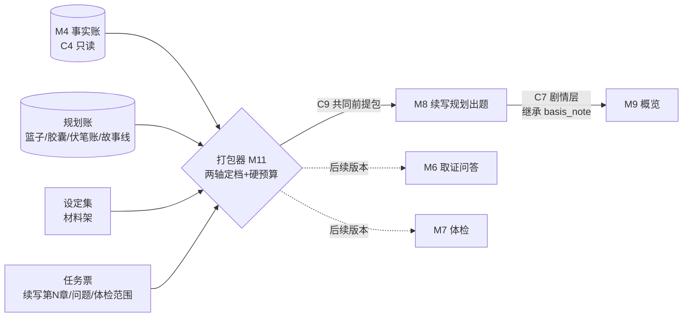

# 「故事真源引擎」上下文打包器设计稿 R01（共同前提包）

身份：**轻档设计稿。** 回应 CZ 2026-08-13 点名的「必须好好设计的大难题」（挂账本 ADD-008 第 4 条：D11 伸缩压缩是遗漏不是放弃，拿回来）＋同晚拍板的上下文负担纪律（ADD-007：账本可以细、执行包必须瘦）。不是施工合同、不是数据库 Schema；C9 部分是字段建议。例子沿用 R02 的《万鬼伏藏》。

---

## 0. 一句话＋一张图

**难题的画面**：写到第 40 章，让 API 出「下一步剧情怎么走」的题。它必须知道爷爷已经忘了主角（不可逆）、师妹一线上次出现是第 33 章、有个伏笔第 45 章前不能抖、世界规则是「开棺代价＝至亲遗忘」——脱离这些前提，「剧情立马走飞」（CZ 原话）。可前面 39 章的大纲＋几百条事实句不可能全塞进去：上下文有限，塞多了重点还会被稀释（ADD-007）。

**打包器就是干这个的**：每次开工前，从全部账本里**编译一份有 token 预算的「共同前提包」**——离工作点近的装全文，远的压一句，再远的只留个可回取的索引；不管压多狠，四样东西保底不丢（作者钉的、不可逆的、本章欠的账、本章禁做的）。包里每条都能回答「你为什么在这里」。



核心设计三句话：

1. **两轴定档**：故事线相关性是第一过滤器（v2 捞货 14），章距是第二压缩轴（望远镜：当前完整、近期展开、远处一句，v2 捞货 28）——两轴交叉决定每条材料装全文、装一句还是只留索引。
2. **硬预算＋先降档再踢出**：包永远不超预算；超重时把最远最低优先级的条目往更粗的档位压，压无可压才降成一行索引——**淘汰不是删除**，被挤出去的在「回取索引区」列着，API 和作者都看得见、点得回。
3. **保底集优先于一切摘要**：作者钉的、不可逆保底句、待消化欠账、禁做硬条，先于任何摘要占预算；生成中发现缺料就暂停补料重编，不静默从全库追加（v2 捞货 42）。

## 1. 输入输出：吃什么、吐什么、包长什么样

### 1.1 输入

| 输入 | 装什么 | 来源 |
|---|---|---|
| 任务票 | 任务类型（续写出题／取证问答／体检）＋工作点（哪个槽位/章）＋作者临时约束 | M0 编排器／M8 |
| 事实账 | 已确认事实、状态、证据坐标（只读） | M4，走 C4 |
| 规划账 | 五层篮子＋胶囊＋故事线架＋伏笔账＋待消化清单（只读） | R02 结构（⚠️ 读取合同待定，见第 6 节） |
| 设定集 | 材料架里作者声明的世界规则 | M1 材料架 |
| 预算档 | 本次包的 token 上限 | 配置（见开放问题 O1） |

三种任务形态**共用同一套打包机械，分区模板不同**：续写出题用下面 1.2 的七区全套；取证问答只要「问题＋相关事实＋证据窗口」；体检只要「检查范围＋生效规则＋涉事实体状态」。本稿主设计续写模板（CZ 难题的原场景）；问答/体检模板等 M6/M7 迁入时按此裁剪，MVP 不做。

### 1.2 输出：共同前提包的七个分区

包按「AI 读的顺序」排区——先知道要干什么，再知道什么不能碰，再由近及远看历史。CZ 提示的分区（铁律/近章/本线/望远/禁做）全部保留，我把「铁律」和「禁做」拆成两区：**铁律是全书恒真的（走到哪都带），禁做是本章特化的（换一章就换一批）**——生命周期不同，混在一起会让恒真条目被逐章重算。

| 区 | 装什么 | 预算比例 | 《万鬼伏藏》第 5 章的例子 |
|---|---|---|---|
| ① 任务卡 | 本章目标＋场安排草案＋**待消化清单**（预定落本槽位的伏笔、必写承接、上游挂着的计划事件）＋作者临时约束 | 8% | 目标「查明棺中第二次心跳的来源」；待消化：H-05「第二次心跳」预定本章推进 |
| ② 铁律区 | 书核（一句话前提＋主线节拍＋结局锚点）＋已确立世界规则＋**全书级**不可逆终态＋作者钉「全书」的条目 | 12% | 「开棺代价：至亲会遗忘开棺者」（正文已确认）；「已开一棺，代价已兑现一次」 |
| ③ 禁做区 | 本章不能违反的最小集（生成规则见第 4 节）：出场人物不可逆状态＋伏笔安全摘要＋章篮「不能违反」格 | 10% | 「爷爷已忘九棺（F-0044），本章不能认出他」；「棺中身份是未揭示底牌，本章只准写『有人』不准写『是谁』」 |
| ④ 近章区 | 上一章出口状态＋结尾钩子（完整）＋近 2–3 章展开摘要 | 25% | 第 4 章出口全文：族谱名字淡了一半、棺中第二次心跳；第 2–3 章各一段展开 |
| ⑤ 本线区 | 当前故事线上次现场（切线时装切线包三件）＋本线未结事项（将来义务账建成后，到期义务也走这格）＋**出场人物状态四元组＋知情要点** | 25% | L-main 上次现场＝第 4 章场 3；九棺状态：已开一棺/被爷爷遗忘/知道代价规则；爷爷状态：健在/已遗忘九棺 |
| ⑥ 望远区 | 本卷更早各章一句胶囊＋前卷每卷一句＋活跃他线每线一句（带覆盖 ID＋版本） | 12% | 「第 1 章：九棺发现阴棺里封着自己的名字（覆盖 PE-0101～0115）」；L-sub1 师妹线一句 |
| ⑦ 回取索引 | 没装进来的东西的目录，一行一条：ID＋类型＋标题 | 3% | 「F-0019 老仵作的警告原文（可回取）」 |
| 浮动预留 | 给缺料回取补料用，不预分配 | 5% | — |

⚠️ 比例是**起步默认值，无实测支撑**——现在全库六本书各三章，根本触不到预算边界；等真实长书进来，按第 7 节的触发条件实测校准。两条硬规矩现在就定死：

- **装不满不硬凑**：三章的书打出来的包就是小包，不为凑比例注水。比例是各区**上限**，不是配额。
- **检索对象＝账本对象，不是正文分片**（v2 捞货 27 原拍板，否定「泛泛混合检索正文分片」）：包里装的是事实句、计划事件、胶囊、状态四元组这些账本对象；正文原文只按证据锚从冻结书稿**按需回取少量**，不整段抄进包。

每个条目的通用字段：`text`（内容）＋`source_ref`（账本 ID，可跳证据）＋`why_loaded`（第 5 节）＋`tier`（压缩档）＋`version`（来源版本）。包头带 `basis_note`（编包时账本时点）——包是只读快照，会过期，账本变了要重编，不在包上改出第二真源（承 ARCHITECTURE 纪律 1）。

## 2. 压缩阶梯：两轴定档、五档伸缩

### 2.1 距离怎么算：不是纯章距

只按章距压缩会出事：师妹线上次出现在第 33 章，纯章距会把它压成一句话，可本章恰好要接师妹线——接线材料必须是展开的。所以：

- **第一轴：故事线相关性**（当前线／活跃他线／搁置线）。写下一章先定线，本线材料整体升档，搁置线整体降到线级一句（v2 捞货 14「故事线是第一过滤器」；R02 故事线架的「上次现场指针」就是给这里用的）。
- **第二轴：章距**（离工作章几章／同卷／跨卷）。同线之内再按远近伸缩（v2 捞货 28 望远镜）。

### 2.2 五档

| 档 | 待遇 | 默认落谁 |
|---|---|---|
| D0 完整 | 全文装入 | 任务卡；上一章出口；本线上次现场的接线材料 |
| D1 展开 | 章梗概＋该章关键事件句 | 近 2–3 章；本线最近 1–2 次出现的章 |
| D2 章胶囊 | 每章一句（R02 胶囊原则，现成的） | 本卷内其余章 |
| D3 卷/线胶囊 | 每卷一句、每条活跃他线一句，带覆盖 ID | 前面各卷；活跃他线；全书级不可逆句在望远区的形态 |
| D4 索引 | 一行：ID＋类型＋标题，可回取 | 其余一切；被预算挤出的条目 |

三条例外规则，全部来自已拍概念：

- **本线跳档**：当前线上次出现的章不管隔多远，按 D0/D1 待遇（切线优先接回同线材料，背景板 03 页记忆加载节原话）。
- **作者钉**：作者可把某条钉成「全书／本卷／本线／某角色出场才关键」（v2 捞货 27）——钉全书的常驻铁律区，钉本卷/本线/角色的在对应范围命中时强制升到 D1 以上。
- **不可逆保底**：不可逆句无论多远，望远区至少保一句（D3），永不降到 D4 以下——「不可逆内容永不丢失，但远处也只留一句」（v2 捞货 28 原话）。
- 因果链条目压缩时**保头尾**（v2 捞货 27）：「因为开棺→所以爷爷遗忘」压成一句时，因和果都得在句子里，不能只剩果。

### 2.3 正面回答 CZ 的两难

**「缩太密→缩来缩去还是很多」怎么防：硬预算，从结构上让包不可能超重。**

- 每区有上限、全包有总上限，这是编译期约束不是事后祈祷；
- 超重时执行「**先降档，再踢出**」：把区内**最远＋优先级最低**的条目往下压一档（D1→D2→D3），压到 D3 还超才降成 D4 索引行；
- 全局优先级从高到低：任务卡 ＞ 禁做硬条/不可逆保底 ＞ 作者钉（命中范围内）＞ 上一章出口 ＞ 本线上次现场 ＞ 出场人物状态 ＞ 近章展开 ＞ 望远条目。前三级是保底集，不参与淘汰；
- 数量级验算（⚠️ 估算，未实测）：D2 章胶囊一句约 25–40 token，100 章全上胶囊也就 3–4k token；D3 卷胶囊更小。**望远镜下，百章书的「导航层」本来就装得下**——真正吃预算的是事实句和状态，靠相关性过滤（只装本章出场实体）和终态沉降（第 3 节）压住。「还是很多」的恐惧主要来自想象「每章都要带一段」，按档压完不成立。

**「压太简→丢关键」怎么防：四道保底＋一条逃生通道。**

1. **作者钉**：作者说关键就是关键，钉的范围内永不被淘汰——人比算法懂自己的书；
2. **不可逆保底**：最狠的压缩下也留一句（见 2.2）；
3. **待消化清单必进**：本章欠的账（伏笔预定回收、必写承接）在任务卡里，不参与淘汰——欠账压丢了等于系统亲手制造断线；
4. **禁做硬条必进**：漏一条禁做，写出来的就是事故；
5. **逃生通道＝缺料暂停重编**（v2 捞货 42 原拍板）：出题过程中 API 发现前提不够（比如选项涉及一个包里只有一行索引的人物），返回「缺料清单」（点名要哪些 ID），打包器用浮动预留补料重编再跑——**不静默从全库追加**。这条把「打包时猜错了」从灾难降级成一次往返。
6. 兜底的兜底：包的可解释性（第 5 节）让「丢关键」事后可归因——剧情走飞时作者点开包，一眼看出是「该装没装」还是「装了没听」，前者调打包规则，后者调出题 Prompt。丢关键不再是黑盒玄学。

## 3. 「不可逆」判定与增长控制

### 3.1 什么算不可逆：一个核心测试＋五类清单

核心测试一句话：**后文能不能当它没发生过？** 后文每一章都必须与它兼容的，才是不可逆；只是「暂时如此」的状态（受伤、吵架、被关押）不算。

可操作分类（给入账打标用）：

| 类 | 例子 | 判定要点 |
|---|---|---|
| 死亡/永久损毁 | 角色死亡、断臂、金手指废掉 | ⚠️ 世界规则允许复活/再生的书里自动降级为「重大但可逆」——判定依赖设定集，不是绝对类 |
| 揭示翻转 | 伏笔已揭示、身份已公开 | 读者已经知道了，收不回。伏笔账「读者可知」标记翻转即触发 |
| 世界规则确立 | 「开棺代价＝至亲遗忘」向读者确认 | 只认作者声明＋正文确认两级来源（v2 捞货 17），AI 推断的规则不算 |
| 关系质变 | 结拜、收徒、背叛、结仇 | ❓ 最模糊的一类，默认「重大但可逆」，作者可手动升级为不可逆——待拍板 |
| 唯一资源消耗 | 一次性神器用掉、唯一名额占用 | 「唯一/一次性」得是设定集或正文里写明的 |

### 3.2 判定怎么落地：不加新工序，搭重签清单的车

背景板 03 页已拍的确认粒度机制里，「人物永久不可逆变化」「Bible 新增/改动」「作者锁定真相」「跨线大因果」本来就要进**重签清单**单独勾选、不随批量确认走。所以不可逆判定不需要发明新流程：**入账时模型按上表给「不可逆候选」标注，作者在重签清单上签字的那一下，同时就是不可逆认定**。M4 的事实句加一个 `irreversible` 字段，签字时落。误标的代价对称：漏标可后补（作者随时可钉），错标可摘（改判走留痕）。

### 3.3 「会不会积一大堆」：会积，但积不坏——四招增长控制

CZ 担心的场景是：写到 200 章，攒了几百条「永久保留」的句子，包被它们撑爆。拆解开，这个担心把两件事捆在一起了——**「永不删除」和「每次都带」是两个轴**，拆开就不怕：

1. **不可逆 ≠ 常驻**。不可逆管的是「账本里永不删除、要用时必能找到」；进不进包、进哪个区，照常走两轴定档＋作者钉范围。默认只有「全书级」不可逆（世界规则、主角级永久转折）常驻铁律区；配角的死亡属于「角色出场才关键」，他不出场就不装。
2. **终态沉降，流水变快照**。二十条「谁谁谁死了」的历史事件，在包里的形态不是二十句事件流水，而是人物状态表里各一行终态（「张三：已死@第 12 章，F-0201」）。事件账永久保留供回取，**包加载的是状态快照**——增长从 O(事件数) 变成 O(出场实体 × 属性数)，而每章出场实体是有限的（状态稀疏四元组：只加载本章出场或被碰到的字段，v2 捞货 16）。
3. **相关性过滤照管不可逆**。死了的龙套的不可逆死亡，只在该龙套再次被提到时加载。「永久」形容的是保存期限，不是加载频率。
4. **铁律区软上限**。全书级恒真清单超过软阈值（⚠️ 拍脑袋起步值：50 条）时提醒作者：「铁律区快挤了，这几条要不要改钉成本卷/本线级？」——防止作者把什么都钉成全书级。数量级预期（⚠️ 估算）：百章网文真正全书级的不可逆句，几十条以内；大头（配角变化、局部规则）都被范围过滤挡在外面。

## 4. 禁做清单怎么生成：三道过滤，不全量倒

禁做区的反面教材是把整本设定集＋全部已确认事实倒进去让 AI 自己看——那是用禁做区重新发明「全量加载」。正确做法是三道过滤抽**本章最小集**：

**第一道：相关性过滤**（这章碰得到的才要）——本章出场/被提及实体 ∪ 本章故事线 ∪ 本章涉及的规则域（有战斗才装力量规则，进皇宫才装朝廷礼制；⚠️ 规则域按设定集条目的实体/主题标签匹配，标签由 M1 分拣时打，标签质量是这道过滤的地基，未验证）。

**第二道：硬度过滤**（够硬的才配「禁」字）——四个合法来源，其他一律不进：

| 来源 | 抽什么 | 例子 |
|---|---|---|
| 设定集硬规则 | 只取「作者声明/正文确认」级；AI 推断的规则只能建议、不能禁做（v2 捞货 17） | 「开棺代价＝至亲遗忘」→「本章代价不能写成头痛了事」 |
| 已确认事实的不可逆终态 | 出场人物的不可逆状态，翻成「不能」句式 | 「爷爷已忘九棺（F-0044）→ 本章他不能认出九棺，除非走正式改史」 |
| 伏笔安全摘要 | 未揭示伏笔只带脱敏摘要，**永不带底牌本体**（R02 3.7 防泄底机制原样引用） | 「棺中身份是未揭示底牌，本章不得写明、不得暗示范围」 |
| 章篮「不能违反」格＋上游硬约束 | 作者在规划账手填的边界 | 「本章不能让师妹知道族谱的事」 |

**第三道：句式统一**——每条一句「不能 X，因为 Y（ID）」，AI 和作者读的是同一份清单。

数量目标：一章 5–15 条（⚠️ 经验预期值）。超预算时按硬度排序（不可逆 ＞ 伏笔防泄 ＞ 设定硬规则 ＞ 规划手填），挤出的降到回取索引——但实践中禁做区超预算本身就是信号：说明相关性过滤太松，先修过滤再谈扩预算。

## 5. 「为何加载」：包里每条都答得上这一句

每个条目带 `why_loaded`，取值封闭枚举：

| 值 | 意思 | 作者视图显示 |
|---|---|---|
| `task` | 本次任务直接需要（目标/待消化/临时约束） | 「本章的活」 |
| `iron` | 全书恒真常驻（书核/已确立世界规则/钉全书的） | 「全书铁律」 |
| `forbidden:来源` | 禁做条目，冒号后带来源类型 | 「本章红线（伏笔防泄）」 |
| `irreversible` | 不可逆保底 | 「永久事实」 |
| `pinned:范围` | 作者钉的，带钉的范围 | 「你钉的（本线）」 |
| `recent:N` | 近章，N＝章距 | 「近 2 章」 |
| `line:线ID` | 本线材料（上次现场/未结事项） | 「师妹线接线」 |
| `character:实体ID` | 出场人物状态 | 「爷爷的当前状态」 |
| `telescope` | 望远导航层 | 「远处一句」 |
| `recalled:轮次` | 缺料回取补进来的 | 「AI 点名要的」 |

两个用途，一个机制：

- **作者侧**：点开前提包，每条看得到人话理由＋来源 ID＋一键跳证据（承证据抽屉纪律，看引用不调 AI 不计积分）。作者第一次能回答「AI 出题时到底知道什么」。
- **调试侧**：剧情走飞的归因工具。包是本次生成的完整知识快照——走飞了先查包：关键前提在不在？在哪个档？被淘汰了吗（回取索引里躺着）？没被淘汰那就是出题 Prompt 的问题。把「玄学走飞」拆成两类可修的故障。

追溯链闭合：C7 章计划的 `based_on_facts`/`basis_note` 直接从前提包继承，另加 `premise_pack_ref` 指回包 ID。链条：C7 说「我依据这些事实」← 前提包说「它们为何被装进来」← C4 说「证据在原文哪里」。

## 6. 模块归属与合同衔接

### 6.1 建议：独立模块 M11，合同 C9；施工搭在 M8 第一单里

判断依据：

- **消费者不止 M8**。取证问答（按问题打包）、体检（按范围打包）干的是同一件事——「从全账本编译本次所需最小上下文」。M7 第二单的机械分组、M6 的关键词匹配，其实都是各自手搓的简易打包器；ADD-007 的执行包纪律管的是所有生成场景，不是只管续写。
- **合同哲学**。十模块的立身之本是「模块之间只认合同」：打包器输入（任务票＋账本读取）输出（C9 前提包）边界清楚，独立成件后，M8 换出题实现不惊动打包逻辑，打包器升级检索策略（比如后期上 BM25/向量扩召回再回冻结文本核证，背景板 03 页留了这条通道）也不惊动 M8。
- **背景板同族件正名**。背景板 03 页的「场景执行包」是同一概念的场级形态；本稿的前提包＝执行包概念在 MVP 十模块里的**章级落地**（产品不代写正文，M8 在章级出题，场级执行包等场级生成开工再细分）。R08 组装背景板时按同族登记，不出两套概念。

落地节奏取实惠：**模块边界从第一天按 M11 画（独立文件 `mvp/packer.py`＋独立合同 C9），施工排在 M8 第一单里一起做**——因为 M8 是它第一个也是当时唯一的消费者，单独立项反而多一次交接。M6/M7 各自的下一版再迁入 C9。

### 6.2 合同衔接

| 合同 | 打包器的角色 | 说明 |
|---|---|---|
| C4（M4→下游） | 消费者 | 按实体/章节/状态查已确认事实；C4 现有字段够 D0–D2 档用 |
| C9（M11→M8，新） | 生产者 | 前提包本体：七分区＋条目通用字段＋`basis_note`＋预算回执（各区用了多少、淘汰了什么） |
| C7（M8→M9/M10） | 上游 | 不产 C7，但 C7 的 `based_on_facts`/`basis_note` 从包继承，加 `premise_pack_ref` |
| 规划账读取 | 消费者 | ⚠️ 规划账目前没有对外读取合同（C7 是 M8 的输出物，不是规划账查询口）。两个走法：a) 打包器与 M8 同进程直读规划账存储——省事，但 M11 独立性打折；b) 规划账开一份 C4 式只读查询合同。👉 推荐 MVP 走 a（规划账和 M8 本就同一施工单），合同化留给 M6/M7 迁入时——那时反正要拆 |
| 多级摘要缓存 | M11 私有 | 卷/线级摘要是派生视图，**存 M11 侧缓存（带覆盖 ID＋版本＋过期标），不进 M4**——M4 只存事实不存投影（唯一真源纪律；摘要过期重算，不产生第二真源） |

## 7. MVP 分期：第一版做多简、什么时候升级

### 7.1 第一版（跟 M8 第一单同期）

现状是六本书各三章、单本确认事实几百条以内——**压缩一次都不会触发**。所以第一版的目标不是「压得好」，是「管道形状正确」：

做：

1. **C9 合同 v0 落全**：七分区、`why_loaded`、`basis_note`、预算回执——字段一个不省。结构留对了，后面才是拧旋钮不是动骨架。
2. **打包逻辑**：任务卡/铁律/禁做/近章/本线五区实打实编译（三章的书等于「全装，但走了正确的管道」）；望远区代码路径存在、内容为空；回取索引照生成（列出没装的）。
3. **硬预算＋降档淘汰机制落地**，日常预算宽到不触发；测试时用故意调小的预算跑通淘汰路径——机制第一天就可验，不是纸面设计。
4. **不可逆标记进 M4 schema**（`irreversible` 布尔＋类型枚举）：入账时模型按 3.1 清单给候选标，确认时展示。⚠️ M5 重签清单 UI 本身未建，第一版先在极简确认流里带一行「此条标记为不可逆，确认？」。
5. **禁做清单生成**：四来源三过滤按第 4 节做——这个不依赖书长，三章也需要防泄底和不可逆约束，是第一版就有真实价值的部分。

⚠️ 一处顶替要写明：状态四元组表和知情账 MVP 都未建（捞货 16 本来就标「仅记录/后期改造」，状态账是事实的消费视图）。第一版本线区的「人物状态」先用**该实体的相关已确认事实句**顶替；3.3 的终态沉降（流水变快照）等状态视图真的建成才生效，在那之前靠相关性过滤单腿撑增长控制——三章的书撑得住，这也是 T1/T2 触发时要一并补的欠账。

明确不做（结构留位，代码不写）：

- D2/D3 多级摘要生成（没有远处可摘；章胶囊规划账现成有，直接引用）；
- 缺料自动回取循环（第一版缺料=报作者清单＋手动补重编，见 O3）；
- 作者钉的 UI（C9 和账本字段留 `pinned`，界面等停点系统铺开）；
- 风格锚（背景板场级执行包里有它，服务正文导写；M8 在剧情层出题用不上，等场级生成开工再接）；
- 问答/体检分区模板（等 M6/M7 迁入）。

### 7.2 升级触发条件（写死，防止「以后再说」变成永远不说）

| 触发 | 升什么 |
|---|---|
| T1：任一本书「全装包」体积超过标准预算档的 60% | 启用 D2 章胶囊档（内容现成，开档即可） |
| T2：出现 30 章以上的书（与卷层展开同阈值） | 望远区启用（D3 卷/线胶囊，含摘要生成，走 O2 方案） |
| T3：出现归因为「该装没装」的走飞案例 | 作者钉 UI＋缺料回取自动化提前 |
| T4：M6/M7 下一版开工 | C9 升版本，加问答/体检分区模板 |

## 8. 开放问题（拿不准的，带选项＋推荐）

**O1｜前提包总预算怎么定？**

- A. 固定档位（如小 8k／标准 16k／大 32k token），按任务类型和用户档位选
- B. 按当次模型上下文窗口的固定比例（如 25%）动态算
- 👉 推荐 A：可预测、好测试，且能直接映射成积分成本——跟「积分预估制」（ADD-002：跑之前告诉用户要花多少）天然对齐；B 在换模型时包会隐形变大变小，走飞归因多一个变量。⚠️ 具体数值无实测，等 T1 触发后用真书校准。

**O2｜卷/线级多级摘要谁生成、什么时候生成？**

- A. 关章时增量生成：每关一章，顺手更新受影响的卷/线摘要，带覆盖 ID＋版本；账本中途变更就标过期，下次关章重算
- B. 打包时现场生成：永远新鲜，但每次编包都花钱花时间，出题延迟和积分都不可控
- 👉 推荐 A：背景板本来就有「关章沉降」机制（双密度制），摘要更新挂在同一时点，成本摊薄且有版本纪律；配过期标记兜住中途改账的窗口期。

**O3｜缺料回取，第一版做自动循环还是报作者？**

- A. 自动：API 返缺料清单→打包器补料重编→重跑，轮次上限 2 防死循环
- B. 半自动：缺料清单报作者，作者点「补料重跑」——缺料本质是个停点位（【一致性修订 20260813】编号改正：注册表已裁定此停点为 **P9**，原「P6 候选」与审查稿 P6 撞号作废，REGISTRY §0 撞号裁定），按停点哲学小白档将来可默认放行
- 👉 推荐 B 起步：出题流程本身还没跑稳，先让缺料**可见**（顺便攒「什么料常缺」的数据，反过来修打包规则）；等流程稳了再把 A 做成 **P9** 停点的「自动通过」档（【一致性修订 20260813】原文 P6 同上改正），一步到位接进停点档位系统。

（另有一条小的已在 3.1 内联标注：关系质变默认「重大但可逆、作者可升级」，❓ 待拍板。）

## 9. C9 前提包 JSON 示例（《万鬼伏藏》第 5 章出题）

```json
{
  "contract": "C9",
  "version": "v0-draft-r1",
  "pack_id": "PP-S005-001",
  "task": {"type": "plan_next", "slot_ref": "S-005", "storyline": "L-main"},
  "budget": {"tier": "standard-16k", "used": 6800, "evicted_to_index": 2},
  "basis_note": "fact-ledger@2026-08-13T03:00 / plan-ledger@2026-08-13T02:50",
  "sections": {
    "task_card": [
      {"text": "本章目标：查明棺中第二次心跳的来源", "source_ref": "S-005.goal", "why_loaded": "task", "tier": "D0"},
      {"text": "待消化：H-05『第二次心跳』预定本章推进（未到揭示位）", "source_ref": "H-05", "why_loaded": "task", "tier": "D0"}
    ],
    "iron_rules": [
      {"text": "世界规则：每开一口禁棺，世上多一人忘记开棺者（正文已确认）", "source_ref": "F-0031", "why_loaded": "irreversible", "tier": "D0"},
      {"text": "书核：抬棺匠为活命集十二禁棺，代价是被世界遗忘", "source_ref": "BOOK.premise", "why_loaded": "iron", "tier": "D0"}
    ],
    "forbidden": [
      {"text": "不能让爷爷认出九棺（爷爷已遗忘，不可逆，F-0044）；恢复记忆须走正式改史", "source_ref": "F-0044", "why_loaded": "forbidden:irreversible", "tier": "D0"},
      {"text": "棺中身份是未揭示底牌：本章可写『另有其人』，不得写明是谁、不得暗示与九棺的关系", "source_ref": "H-05.safe_summary", "why_loaded": "forbidden:spoiler_guard", "tier": "D0"}
    ],
    "recent": [
      {"text": "第4章出口：族谱名字淡了一半；深夜棺中传出第二次心跳（结尾钩子）", "source_ref": "S-004.exit", "why_loaded": "recent:1", "tier": "D0"},
      {"text": "第3章展开：首棺开启全过程＋老仵作警告应验", "source_ref": "S-003.summary", "why_loaded": "recent:2", "tier": "D1"}
    ],
    "storyline": [
      {"text": "L-main 上次现场：第4章场3，九棺守棺至深夜，心跳声第二次响起", "source_ref": "L-main.last_scene", "why_loaded": "line:L-main", "tier": "D0"},
      {"text": "陈九棺状态：已开首棺｜被爷爷遗忘｜已知代价规则", "source_ref": "STATE.陈九棺", "why_loaded": "character:陈九棺", "tier": "D1"},
      {"text": "爷爷状态：健在｜已遗忘九棺@第4章", "source_ref": "STATE.爷爷", "why_loaded": "character:爷爷", "tier": "D1"}
    ],
    "telescope": [
      {"text": "第1章一句：九棺发现祖传阴棺封的是自己的名字（覆盖 PE-0101~0115，v3）", "source_ref": "S-001.capsule", "why_loaded": "telescope", "tier": "D2"},
      {"text": "L-sub1 师妹线一句：师妹察觉九棺异样，尚不知棺事（上次出现@第3章）", "source_ref": "L-sub1.capsule", "why_loaded": "telescope", "tier": "D3"}
    ],
    "recall_index": [
      {"text": "F-0019 老仵作警告的逐字原文", "source_ref": "F-0019", "tier": "D4"},
      {"text": "SET-007 阴棺形制设定（本章未涉规则域）", "source_ref": "SET-007", "tier": "D4"}
    ]
  }
}
```

## 10. 来源与追溯

- 难题原文＋两道门拍板：挂账本 ADD-008 第 4 条、ADD-007（小说架构仓，路径含中文，复制用）：`/Users/a1234/挣钱/小说架构/TEMP/bgboard-audit-20260809-r01/18_R07_ADDENDUM_LEDGER_20260813_R01.md`
- 考古概念 14/16/27/28/42（故事线过滤器、稀疏四元组、D11 伸缩压缩、望远镜、执行包）：`/Users/a1234/挣钱/小说架构/TEMP/bgboard-audit-20260809-r01/19_NOTION_V2_SALVAGE_20260813_R01.md`
- 背景板 R07 管线页（场景执行包清单、记忆加载/伸缩压缩、双密度沉降、重签清单四类、切线包）：`/Users/a1234/挣钱/小说架构/references/shared-context/NOVEL_ARCH_SHARED_CONTEXT_CORE_MATERIALS_20260812_R07/03_CREATION_AND_MEMORY_PIPELINES.md`
- 素材来源结构（五层篮子/胶囊/故事线架/伏笔账安全摘要/待消化清单/停点清单）：[OUTLINE_STRUCTURE_DESIGN_R02.md](OUTLINE_STRUCTURE_DESIGN_R02.md)
- 十模块线路与合同编号、设计纪律：[ARCHITECTURE.md](../ARCHITECTURE.md)

来源：Cursor（Fable 5 Max）设计，2026-08-13；待 CZ 拍板 O1–O3。

修订记录：
- 一致性修订 20260813：O3 内两处旧号「P6」改正为 **P9**（缺料回取停点，注册表 §0 撞号裁定，原 P6 归审查稿）。设计稿群一致性巡检执行。
