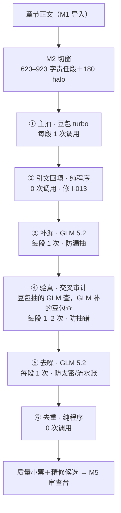

# 抽取质量管线设计稿 R01（已实装＋实测）

身份：**轻档设计稿＋第一轮实装实测记录，给 CZ 过目，不是施工合同。** 代码已落 [mvp/refine.py](../mvp/refine.py)（CZ 2026-08-13 授权边设计边实装边实测）；具体每段用哪个模型、阈值多少，凡标「等新正式管线对照票」的都是占位，等重新冻结的实验校准。不动别的设计稿。

---

## 0. 一句话＋一张图

这稿子解决一件事：**单次抽取抽不全、抽不对、太密、不该抽的也抽——一章进来多走几段处理，抽到「很对」的程度。**（CZ 原话意图）



一句话读图：模型负责语义（抽、补、判），程序负责机械正确（引文逐字回填、坐标、去重）——这是研究线长期原则（R07 04 页「模型负责语义选择，程序负责编号合法性、逐字回填、位置」）落到产品侧的形状。

## 1. 单次抽取的毛病，每段管线对着治什么

实测毛病台账（[ISSUES.md](../ISSUES.md)）逐条对位：

| 毛病 | 台账证据 | 治它的管线段 |
|---|---|---|
| 抽不全（漏抽） | I-007 密度波动（NBA 文 seg3 整段金手指系统设定漏抽，本次实测抓到） | ③ 补漏 |
| 抽不对（编造/张冠李戴） | I-013 quote 是模型转抄未校验；实测 NBA 文有「说话人写错」候选 | ② 引文回填＋④ 验真 |
| 太密/流水账 | I-007 万鬼 c01 每段约 25 条；I-008 102 条逐条确认太重 | ⑤ 去噪 |
| 不该抽的也抽 | 心理活动、过渡动作、修辞被当事实 | ④ 验真＋⑤ 去噪 |
| 同义重复 | 主抽与补漏产出撞车 | ⑥ 去重 |

## 2. 管线总形状（六段，五段可独立开关）

| 段 | 干什么 | 输入→输出 | 机械/API | 防哪类毛病 | 每章调用次数（4 段章） |
|---|---|---|---|---|---|
| ① 主抽 | 责任段→事实句候选（现行 M3 不动：冠军切窗＋极简规则＋无示例） | C2→C3 | API·豆包 turbo | — | 4 |
| ② 引文回填 | 在责任段原文里逐字定位每条 quote：命中给字符坐标；只差空白引号的换成原文逐字片段；找不到标 `missing` | 候选→候选＋`quote_status`/`quote_start`/`quote_end` | **纯程序** | 抽错（I-013：引文从「模型转抄」变「程序回填」） | 0 |
| ③ 补漏 | 把责任段＋已抽清单给另一家模型：「还有哪些已发生的事实没抽？」新候选标 `origin=supplement`，同样过②回填 | 段＋候选→新增候选 | API·GLM 5.2 | 漏抽 | 4 |
| ④ 验真 | 逐条问「责任段原文真的支持这句吗」：support / fixable（附修正建议）/ unsupported（剔除）。**修正建议不自动上账**，标 `needs_review` 留作者裁决 | 候选→候选＋判定 | API·交叉审计 | 抽错 | 4–8 |
| ⑤ 去噪 | 逐条问「这条值得进长期账吗」——判据：改变人物状态/关系/位置、揭示设定、具体事件、后文可能引用的具体信息；纯场面复述、碎步动作、无信息过渡滤掉 | 候选→候选＋keep 标 | API·GLM 5.2 | 太密/噪音 | 4 |
| ⑥ 去重 | 归一化文本＋相似度>0.92 判重；main 优先于 supplement 存活 | 候选→终稿＋removed 账 | **纯程序** | 重复 | 0 |

全管线一章（4 段）＝ **16–20 次调用**（主抽 4＋质检 12–16），对比现在单抽 4 次约 **4–5 倍**。被剔除的候选不消失，全部带原因进 `removed` 账（`data/<项目>/refine_<章>.json`），透明可查。

### 🔥 复查凭什么算独立：跨家族交叉审计

CZ 拍板：**抽取和质检必须不同 API**——「思路可能都差不多，同一个模型自查自话拦不住错」。这与两条既有原则同源：19 号捞货概念 10「生产模型不得自签质量绿票」、R07 04 页同款。同模型换 prompt 算不算独立？**不算数**：错误模式跟着模型家族走（训练数据和偏好相同，同样的过度推断两个 prompt 会一起犯）；SI-002 消化稿也明说「只看验真器自身 F1、两个模型一致或输出更自信，都不能证明产品改善」——独立性要靠家族隔离＋最终对着金标验（新正式管线对照票要回答）。

实装的交叉结构：**豆包抽的 GLM 查；GLM 补的豆包查**——谁的产出都不由自己签票。质检员选 GLM 5.2（`glm-5-2-260601`，智谱家族，Agent Plan 池内，CZ 点名可用）；豆包 turbo 继续坐主抽（现行 config 不动）。

### 边界：这条管线属于导入侧

ADD-013 G7（CZ 拍板）：体检只属导入侧，「我们不生产正文，产品内生成的事实句子……生成时就会质检」。本管线就是那道**生成时质检**——它在导入拆解时跑完，产物直接进 M5 审查台；不存在「入账后定期重抽复查」。验真里「原文不支持」和「前后矛盾」是两码事（捞货概念 11 材料不足≠内容矛盾）：本管线只管前者（单段内证据承托），跨章矛盾归 M7 体检。

## 3. 已实装：怎么跑

```bash
# 全管线（复用库里该章候选当主抽结果，省钱且可对照基线）
python3 cli.py refine 万鬼伏藏 --chapter c01

# 现场重新主抽再精修
python3 cli.py refine 万鬼伏藏 --chapter c01 --fresh

# 只跑机械段（零调用）
python3 cli.py refine 万鬼伏藏 --chapter c01 --stages anchor,dedup
```

工程要点：复用 `extract.py` 的 `call_json` 通道（顺手修了 GLM 输出带 ```json 围栏解析失败的问题）；单段调用失败重试一次、再失败记错误账不炸管线；每次调用记模型/耗时/tokens，进报告的 `calls` 账。

## 4. 实测结果（2026-08-13，真 API）

### 4.1 两章全管线

| | 《万鬼伏藏》c01（灵异，3928 字） | 《NBA：刚重生》c01（体育直播流，2241 字） |
|---|---|---|
| 主抽候选 | 101 | 39 |
| 引文回填 | 101/101 逐字命中 | 38 逐字＋1 模糊修正 |
| 补漏 | ＋5（**补漏率 5%**） | ＋13（**补漏率 33%**） |
| 验真 | 104 通过，2 带修正建议，0 剔除 | 41 通过，4 带修正建议，0 剔除 |
| 去噪 | 滤 32（30%） | 滤 17（33%） |
| 去重 | 0 | 0 |
| 最终 | **74** | **35** |
| 质检调用/耗时 | 14 次 / 80 秒 | 12 次 / 55 秒 |

### 4.2 改动质量人工抽查（我逐条对原文核）

- **补漏（18 条全看）**：零编造，条条能锚回原文。最有价值的一抓：NBA 文 seg3 主抽只出 5 条，把「系统任务：退役赛季第一场至少进一球」「奖励：技能卡体能回流（初级）」这类**金手指核心设定整段漏了**，补漏全部找回；万鬼补回「陈博学有强烈求生意念（死后成鬼的因）」关键背景。低值补漏（弹幕起哄、神态碎步）随后被去噪正确滤掉——补漏敢多报、去噪兜底，分工成立。
- **验真修正建议（6 条全看）**：**约一半是误改或吹毛求疵**。真金：NBA 文「JR 说打过招呼」实为林修说的——说话人张冠李戴被抓出。误改：万鬼「拨通了院长的电话」原句没错，GLM 的「修正」反而丢信息。⚠️ 结论已固化进代码：**fixable 只挂建议＋待人审标记，绝不自动改账**（生产模型不自签绿票的镜像：质检模型手写的修正文本同样不能自动上账）。
- **去噪（抽 13/49 条）**：13/13 判罚成立——过渡动作（「喝水咳嗽让继续说」）、瞬时神态、已被别条覆盖的重复（「精神出问题」已被存活的「妄想性障碍」盖住）。判罚理由逐条落在报告里可复核。0 剔除是因为这批基线质量高（豆包 quote 全逐字）；unsupported 的拦截力等新正式管线对照票用故意掺错的候选测。

### 4.3 API 速度对比（同一验真任务：940 字责任段＋24 条候选，各一次）

| 模型 | 耗时 | 输出 tokens | 印象与适岗 |
|---|---|---|---|
| minimax-m3-modelhub | 6.7s | 975 | 最快，判定敢标 fixable；质检备选 |
| glm-5-2-260601 | 7.2s | 636 | **现役质检员**：快、输出精炼、判罚理由质量高 |
| deepseek-v4-flash-260801 | 7.2s | 630 | 与 GLM 同速同风格；第三家族备胎（未来「二审」候选） |
| doubao-seed-2-0-mini-260215 | 9.7s | 1233 | 偏慢偏啰嗦；且与主抽同家族，不能当质检 |
| doubao-seed-2-1-turbo-260628 | 18.9s | 976 | 现役主抽；干验真最慢（近 GLM 3 倍） |
| kimi-k3-260701 | 调用被拒 | — | 套餐列表有但实际报「不支持 agent plan」，不可用 |

管线内 GLM 分段耗时：补漏 1.8–4.6s、验真 3.2–8.9s、去噪 4.3–9.8s，单章质检全程约 1 分钟。给 CZ 挑 API 的一句话：**GLM 5.2 / DeepSeek V4 Flash / MiniMax M3 三家速度同档（6–7s），能力都够干结构化审查活**，比豆包 turbo 快一截，其他地方需要「快且便宜的审查员」可从这三家挑。

### 4.4 成本印象

本轮全部实测（约 40 次真调用）耗 Agent Plan 积分 **16.6 分**（5h 窗 2000 分、月窗 20000 分）。折算：**精修一章约 7 分，快档单抽一章约 2 分**；一本 100 章全精修约 700 分＝月额度 3.5%。结论：套餐内成本完全不心疼，产品化计价另算（见第 7 节）。

## 5. 「很对」的标准＋质量小票

### 5.1 四个维度的可操作判据

| 维度 | 产品级判据（机械可算） | 验收口径 |
|---|---|---|
| 不全 | **补漏率**＝补漏段新增÷主抽数。持续高（如 NBA 的 33%）说明主抽在该题材系统性漏 | 对金标召回 ≥ 目标值（数值等新正式管线对照票；产品代理指标：补漏第二轮几乎补不出新东西） |
| 不对 | **引文锚定率**（quote 逐字命中原文比例，本次 139/140）＋**验真剔除率**＋修正建议采纳率（作者裁决数据回流） | 锚定率应接近 100%；验真误杀/漏放率等新正式管线对照票的掺错实验 |
| 太密 | **千字条数带**＋去噪率。去噪率长期恒高说明主抽过密该修主抽，而不是靠去噪硬扛 | 千字条数落进题材基准带（带宽等新正式管线对照票／更多书目统计） |
| 噪音 | 去噪判据固化为「可独立查询/改状态/后文可能引用」——即 19 号捞货概念 2 的**业务原子**：一条事实承担一个可独立查询、独立判真假、独立被后文引用的更新 | 作者驳回标签里「不重要」占比下降（ADD-009 驳回标签数据回流） |

### 5.2 质量小票（实跑原样）

每章精修完给作者看的就是这张，透明但不啰嗦；逐条明细和被剔除原因在报告文件里，点开才见：

```
── 抽取质量小票 ──
主抽候选 101 条
引文回填：101 条逐字命中，0 条模糊修正，0 条找不到原文
补漏：补出 5 条
验真：104 条通过，2 条带修正建议（待你裁决），0 条原文不支持（已剔除），0 条漏判待人看
去噪：滤掉 32 条流水账
去重：合并 0 条重复
最终入账候选 74 条
（质检调用 14 次，共 80.3 秒）
```

它同时是 I-008 的减负入口：`verify=support` 且锚定 `exact` 的候选可走「本章其余全通过」批量放行（ADD-009 章级封顶）；`fixable`/`missing`/漏判进必审小队列——作者只精读机器拿不准的。

## 6. 密度波动怎么治（I-007）

**核心认识（本次实测直接给的）：密度波动大头是主抽的漏抽，不是题材假象也不全是过抽。** 三本书主抽千字密度：万鬼 26 条、1979 西北 19 条、NBA 17 条；跑完管线：万鬼 19 条、NBA 16 条——**极差从 1.49 倍收窄到 1.21 倍**，且收窄的方式是「稀的补回漏抽（NBA ＋33%）、密的滤掉流水账（万鬼 −30%）」，两头向真实密度回归。

区分「题材本来就密」和「过抽」的两个仪表（都已在报告里可算）：

1. **补漏率/去噪率双表**：补漏率高＝主抽在漏（NBA 的弹幕/系统面板体例吃亏）；去噪率高＝主抽在灌水。题材天然密的书表现为「补漏率低＋去噪率也低＋千字条数高」——三个数联看就能把「密得有道理」和「密得虚」分开。
2. **按叙事功能归因**：去噪判罚理由已带功能分类的雏形（过渡动作/神态描写/设定/事件/状态变化）。等积累几十章判罚数据，可统计各题材「设定类/事件类占比」形成基准带——权谋文事件密度高是真密，流水账占比高才是过抽。（分类口径与基准带数值**等新正式管线对照票**＋更多书目，不拍脑袋。）

⚠️ 诚实标注：两本书去噪率都在 30–33%，不排除 GLM 判罚有固定砍幅倾向（宁砍三成的手感），需要新正式管线对照票用金标校准「砍得对不对」，而不是只看砍了多少。

## 7. 成本分档（产品化建议）

按 ADD-002 积分预估制（跑之前报预估积分和耗时，化解「不可预测」骂点；收费细节按 ADD-008 全部「暂行」口径）：

| 档 | 内容 | 每章调用 | 相对成本 | 给谁 |
|---|---|---|---|---|
| 快档 | 主抽＋引文回填＋去重（机械段免费白送） | 4 | 1× | 大批量整本工程的初扫；赶时间 |
| 精档 | 全管线六段 | 16–20 | 约 4–5× | **默认档** |

建议**全员默认精档、快档做成省钱选项**，理由：① 抽得对是本产品的命根（ADD-010：正文为真、抽错＝产品的错），首触体验给快档等于把最差一面先给人看；② 绝对成本低——套餐实测一章 7 积分，免费层前三章全精档也就 20 积分级别，是引客链路（ADD-002）花得起的获客成本；③ 质量小票本身是可感知的卖点（「AI 自己复查过、改了什么都告诉你」）。整本工程（>10 章）照 ADD-002 走黑盒批处理＋事前积分预估，可先精修 10 章看效果再继续。

## 8. 与旧 T03 证据及后续正式管线对照的分工

旧 T03 曾按 P0/P1/P2 多步管线、主抽／验真／补漏／合并四岗位做过隔离调试，与本设计**同构**；但当前只保留工程结论账 E-14 的“候选先验＋待复验”，没有正式 Gold，也没有冻结产品参数。这里定产品形态（段的划分、接口、审计字段、交叉审计规则）；要补参数证据必须重新开正式 Linear／GitHub 票、冻结输入输出后再跑。本稿仍待回答的清单：

| 占位参数 | 本稿暂用 | 新正式管线对照票要回答 |
|---|---|---|
| 各岗位模型 | 主抽豆包 turbo＋质检 GLM 5.2 | 哪个模型坐哪个岗位最优（含 DISCRIM17 胜者接主抽） |
| 每段增益量化 | 只有两章人工抽查印象 | 对金标的召回/精确增量，每段单独归因（预注册） |
| 验真误杀/漏放率 | 0 剔除（基线太干净测不出拦截力） | 掺错候选实验：unsupported 判罚的查准查全 |
| 去噪阈值与判据措辞 | 「宁多勿漏」提示语 | 30% 砍幅是对是狠；判据对金标的对齐度 |
| 补漏收敛轮数 | 1 轮 | 第二轮边际增益是否值一次调用 |
| 密度基准带 | 无 | 分题材千字条数带＋功能占比基准 |
| fixable 自动化门 | 全部人审 | 双裁一致率达标后哪类可自动 |
| 低优遗留（新书实测 I-018/I-020，2026-08-13 三修时未动） | 未动 | 主抽粒度规范（一条一个业务原子）等粒度实验；密度仪表改净口径（剔除假补/重复后再算补漏率去噪率）；needs_review 与 removed 撞车的去向规则（M5 对接时定） |

反向约定：新正式管线对照若推翻某段的存在价值（比如验真在掺错实验里拦不住错），产品侧按 `--stages` 开关直接关掉该段，管线形状不用重构——这就是分段可开关的意义。

## 9. 与现有模块的关系

- **归属**：管线是 **M3 的内部扩展**（M3a 主抽＝extract.py 不动；M3b 质检＝refine.py 新增），不拆新模块——理由：对外仍是「C2 进、C3 出」，M4 入账、M5 审查全都不用知道中间几段；拆新模块要新增合同，违反最小闭包。ARCHITECTURE 的 M3 行等吸收时顺带更新一句即可。
- **C3 合同建议升 v1**（收发两端只有 M3/M4，改造面小）：新增可选字段 `origin`（main/supplement，来源段要标——审查台和后续正式管线对照归因都要用）、`quote_status`＋`quote_start`/`quote_end`（字符级坐标，I-013 的正解，M7 定位矛盾双方证据要用）、`verify`/`verify_reason`/`fix_suggest`/`needs_review`（I-008 置信分层的地基）。v0 候选不带这些字段照常入账，向后兼容。
- **与 M5**：质量小票进审查台书封卡；`needs_review` 队列对接「高影响才请作者确认」（捞货 39）。
- **与 M7**：体检不再自己核引文——candidates 带字符坐标后，C6 报告的双方证据可直接点回原文。

## 10. 开放问题（3 个）

**O1 去噪滤掉的条目去哪？** 场景：管线把「陈医生喝水咳嗽」滤了，三十章后作者真想查这个细节。选项：A 彻底丢弃；B 留在 refine 报告文件里（现状），账本不进；C 入账但标「冷藏」。推荐 **B**——原文永远在，M6 取证问答回原文现查就行（「可回取≠预抽尽」，ARCHITECTURE 设计纪律 6）；C 会让账本重新变密，等于白去噪。

**O2 免费层给快档还是精档？** 场景：新用户导前三章看效果（引客链路）。选项：A 免费快档、付费精档；B 免费也精档（前三章封顶）。推荐 **B**——第 7 节的账：三章精档 20 积分级别，换的是「第一眼就看到复查小票」的信任感；免费层本来就不可导出，成本兜得住。

**O3 补漏要不要跑第二轮？** 场景：NBA seg3 一轮补回 6 条，谁保证没有第三层漏网？选项：A 固定一轮（现状）；B 补到「新增≈0」收敛；C 按补漏率动态决定（首轮补漏率>20% 才追第二轮）。推荐 **C**——密的书一轮足够（万鬼 5%），稀的书才值得追加，边际成本每段一次调用；触发线 20% 是拍的，**等新正式管线对照票**出边际增益曲线再定。

---

来源：CZ 2026-08-13 派单＋升级指令（边设计边实装边实测、抽取质检必须跨家族）；实测数据见 `data/万鬼伏藏/refine_c01.json`、`data/NBA：刚重生，让我退役巡演？/refine_c01.json`；引用出处——ISSUES I-007/I-008/I-013、19 号捞货概念 2/9/10/11、ADD-002/ADD-013 G7、R07 04 页、SI-002 消化稿、旧 T03 迁移证据（工程结论账 E-14）。Fable 5 Max 设计并实装。
