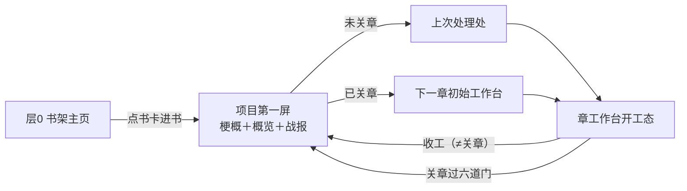

# 首屏体系设计稿 R02（FIRST_SCREEN_SYSTEM_DESIGN）

身份：**轻档设计稿。** 第二版按背景板 **R13** 对齐。管的是「第一眼」：打开一本小说先看见什么、层间怎么进怎么退、关章怎么建议「到此为止」。机制细节仍分给 [M8_PLANNING_DESIGN_R03.md](M8_PLANNING_DESIGN_R03.md)、[REVIEW_OVERVIEW_DESIGN_R02.md](REVIEW_OVERVIEW_DESIGN_R02.md)、[REVERSE_PLOT_MAP_DESIGN_R02.md](REVERSE_PLOT_MAP_DESIGN_R02.md)、[CHAPTER_WORKBENCH_DESIGN_R02.md](CHAPTER_WORKBENCH_DESIGN_R02.md)。

全文界面元素、按钮文案、系统提示语一律是**示意文案，非定稿**。本稿是设计／施工候选，不是现有产品能力。

拍板依据：R13 ADD-057～061；承接 ADD-012 F5／F2／F6／F7、ADD-006、ADD-016 H1／H3、ADD-050。历史稿 [FIRST_SCREEN_SYSTEM_DESIGN_R01.md](FIRST_SCREEN_SYSTEM_DESIGN_R01.md) 保留不动。

---

## 0. 一句话＋一张图

CZ 拍的基调（ADD-012 F5）就是一套进门动线：**门口被记得，进屋看世界，坐下干活。** 本稿把它落成三层第一眼——

- **层 0 书架主页**＝「被等待着」：昨天你写到哪。这里还不是小说项目内部。
- **项目第一屏**（进书之后立刻看见）＝故事梗概＋故事概览＋战报（ADD-059）。鼓励式，不要一打开就任务压迫。
- **层 1 书画布**＝进项目第一屏之后，才是大纲编辑台／故事横带。
- **层 2 章工作台**＝未关章则回到上次处理处；已关章则进下一章初始工作台。门厅／选线不是打开项目的第一屏。黄金三章是另一张独立工作台，不走这条进门。



核心设计三句话（CZ 快读）：

1. **打开一本小说，先看项目第一屏**：梗概＋概览＋战报。回到光标／进门厅是之后的事，不能跳过这一屏。
2. **接力点是现算投影，可以改**：改了先记在投影上，进真值必须作者确认。不是只读、也不是改了就自动进账。
3. **收工 ≠ 关章**：收工卡可以亮（规划做完、无书稿也可以）。关章要过六道硬门，系统才建议「这一章到此为止」。收工卡亮起，入口不要自动翻到下一章。

## 1. 总则：一份接力点，三个镜头

先立一条防重复施工的纪律。接力点（写到哪／上次收在／主线／出场者／未结事项／风险／下一步方向）是**一份现算投影**。投影上可以改（纠错为主）；进真值必须作者确认（ADD-061）。不要在投影上另开第二本真值。记下产品做错账，后期收集。三层不是三个功能，是同一份投影的三个浓度：

| 层 | 取几要素 | 形态 | 情绪任务 |
|---|---|---|---|
| 层 0 书卡 | 要素①②＋⑥的一句话版 | 三行字 | 被等待着——「它记得我写到哪」 |
| 层 1 编辑台 | 要素①的画面化（故事横带）＋⑥的入口 | 一条章卡横带＋一个按钮 | 回到故事世界——「这是我的书」 |
| 层 2 门厅 | **六要素全量**（正式稿见第 4 节） | 一屏 | 今天的活清清楚楚 |

为什么这样切：六要素本来就有货源表（反推稿 §6 逐项对上了账本），一次实现三处消费；哪层都不用自己攒数据，也就不会出现「主页说写到第 5 章、门厅说第 4 章」的两张皮。

## 2. 层 0 书架主页：「被等待着」

### 2.1 多本书：一书一卡

**【看见】** 竖排书卡流，默认按最近写作时间排。每张卡四行：书名行（章数字数＋连续天数）、「昨天写到」两行（上次收在的那句话）、「今天可做」一行。卡右下一个主按钮。没有任何账务编号、任何风险明细、任何积分数字（克制清单见第 7 节）。

```
┌────────────────────────────────────────────┐
│ 《雾都灯师》 5 章 · 16,100 字        连续 3 天 🔥 │
│ 昨晚你写到：老仵作留下警告，连夜离开——            │
│ 「它在数你的心跳。」                              │
│ 今天可做：第 6 章有 2 件必办 · 1 条伏笔正当时      │
│                          ［ 继续写第 6 章 → ］    │
├────────────────────────────────────────────┤
│ 《山海邮差》 23 章 · 71,400 字      停了 12 天    │
│ 上次你写到：邮差把最后一封信塞回了包里——          │
│ 「这封，我替你送到山那边。」                      │
│ 今天可做：第 24 章等着开线                        │
│                          ［ 回到这本书 → ］       │
└────────────────────────────────────────────┘
                 ［＋ 开新书 / 导入旧稿］
```

**【可点】** 点卡片本体或主按钮＝进这本书的**项目第一屏**（梗概＋概览＋战报）。不要从书架跳过项目第一屏直达光标或门厅。底部「开新书／导入旧稿」＝走导入分拣（INTAKE）。前三章打磨走黄金三章工作台，不跟已立项小说走同一扇门。

**【文案示意】**「被记得」的句子有固定骨架：**时间＋你写到＋钩子原句**。钩子原句直接取末章槽 `exit_hook`（影子槽或已移交槽同一个格子，反推稿 §2.2）——这句是作者自己写的或产品从他正文里抽的，**不是模型现编的恭维**，所以永远不会说错话。按状态换头：

| 状态 | 示意 |
|---|---|
| 昨天写过 | 「昨晚你写到：……」 |
| 停更 3–14 天 | 「上次你写到：……」＋书名行「停了 N 天」（陈述，不责备） |
| 停更更久 | 「《雾都灯师》停在第 5 章有一阵了。陈九棺还守在义庄。」——故事在等他，不是他欠更新 |
| 刚收工几小时 | 「今晚第 5 章收工了。棺里的东西，明天见。」 |

「今天可做」一行是**机械拼**的（零调用）：必办数＝门厅未结事项里欠在下一章的（机械捞账，M8 §1.1 表 1/2/5 类）；「正当时」＝触发相位在最佳期的候选数（M8 §1.3）。要不要升级成模型写的人话，见开放问题 O1。

为什么主页只有这么点东西：F5 的原话是「昨天你写到……接下来……」——被等待的感觉来自**具体到一句话的记得**，不来自信息量。卡上多一行风险、多一个待审计数，气氛就从「书房门口」变成「工位打卡机」。

### 2.2 单本书用户：不过主页，直接进书

**裁定：只有一本书时，打开产品可以不路过书架，但必须落在项目第一屏（梗概＋概览＋战报），不能直接进门厅或光标。** 被等待感由战报承担。书架仍然存在（面包屑第一级，开第二本书的入口在那）。

为什么：主页的本职是多本书之间的选择；只有一本书时选择不存在。但 R13 要求点进小说先看见项目状态，不能把「恢复工作」顶成第一屏。

黄金三章工作台是另一扇门：前三章打磨满意后，才移交进小说项目。不要把「只有一本书」理解成「跳过项目第一屏」。

### 2.3 空态（新用户，一本书都没有）

书架空态＝两条路的岔口：进**黄金三章工作台**（打磨前三章）／「把你已有的章节交给它」（导入进项目）。教程演示可以另开，但不能顶替这两扇门。空态不出现书卡骨架屏。

## 3. 层 1 书画布（大纲编辑台）：「回到故事世界」

### 3.0 进书第一屏：梗概＋概览＋战报（ADD-059）

点进一本已立项的小说，**第一屏不是门厅、不是光标、不是选线**。三块同一屏：

1. **故事梗概**：这本书现在是什么故事（鼓励式一两段，不要任务清单腔）。
2. **故事概览**：看得见的故事形状（横带／画面／走向）。可在投影上改；进真值须确认。
3. **战报**：写到哪、上一章什么样、还要处理什么。风险行只报「上次检查＋覆盖范围」，禁止写「风险：✓ 无」。

看完这一屏之后才分流：

- **本章未关** → 提供「回到上次处理处」（可回光标／回沙箱／回清点）。这是快捷，不是第一屏。
- **本章已关** → 进下一章初始工作台。
- 作者也可以留在概览／画布上逛。

黄金三章工作台不走本节。前三章还没移交进项目时，打开的是黄金三章那张台。

### 3.1 进项目第一屏之后：故事横带在上，篮子在下

**【看见】** 从上往下三段：①欢迎条（一行，单书用户的被等待感落点）；②**故事横带**——每章一张画面卡（配图＋一句梗概）从第 1 章排到最新章，自动滚到当前位置，最新一章带微光，下一章是半透明空位；③往下滚是大纲画布本体（五层篮子＋三横架，R02 结构）。收件箱和积分都在边角（见 3.3）。

```
┌──────────────────────────────────────────────────┐
│ 书架 / 雾都灯师                          收件箱 ◦2   ⚙ │
│ 昨晚你写到：「它在数你的心跳。」                        │
│                                                        │
│ ═══ 你的故事（第 1 章 ──────────▶ 第 5 章）═══          │
│ ┌────┐ ┌────┐ ┌────┐ ┌────┐ ┏━━━━┓ ┌╌╌╌╌┐          │
│ │图▪梗│ │图▪梗│ │图▪梗│ │图▪梗│ ┃图▪梗┃ ┆第6章┆          │
│ │第1章│ │第2章│ │第3章│ │第4章│ ┃第5章┃ ┆ ？  ┆          │
│ └────┘ └────┘ └────┘ └────┘ ┗━(微光)┛ └╌╌╌╌┘          │
│                              ［ 继续写第 6 章 → ］      │
│ ──────────────── 往下滚：大纲画布 ────────────────      │
│ 故事线泳道 · 章篮 · 伏笔架 · 人物 · 设定…（R02 地盘）    │
│                                                        │
│ ◦512（积分·淡显） 💬 聊天框 · 焦点：全书                │
└──────────────────────────────────────────────────┘
```

**【可点】** 点横带上任何一章卡＝展开那章的概览（梗概＋beat，点 beat 进细节层——REVIEW §1.3 的三层递进原样）；点下一章空位或主按钮＝进层 2 门厅；点画布任何对象＝该对象的局部动作（ADD-006 点哪问哪）；聊天框全程在底部，焦点跟着点击走。

**【文案示意】** 横带标题不叫「章节列表」，叫「你的故事」；空位上的「？」悬停显示「第 6 章还没写——陈九棺在等」。

为什么第一眼是横带不是待办：这是 F2 的拍板纠偏原文——概览的主产品是「看见自己故事变生动的愉悦＋读懂自己创作的认知」，效率是副产品；「只列大纲太枯燥」。作者每天路过自己的故事一次，看见它比昨天长了一格，这个感官本身就是留下来的理由。画面卡的素材走 REVIEW §6 的降级阶梯（V0 用 L0a 排版卡：章号＋标题＋氛围色带，零模型成本；将来 F2 的「可发抖音解说画面卡」管线成熟后同一个位置换图，合同不动）。

### 3.2 审查态与日常态是同一张画布

导入后有待审事项时，这张画布就是 REVIEW 稿的第一屏形态（书封卡＋收件箱预览条＋纵向章卡流，审查动作齐全）；审完清空后回到本节的日常态（横带＋画布）。**同一批 C5 概览卡，两种排法**（审查时纵排大卡好逐章签字，日常横排缩略卡好看进展），不是两个页面、不实现两套组件。审查收工的通过态屏（REVIEW §1.6）末尾加一个入口：「去看你的接力点 →」——首次导入的用户从这里第一次见到层 2 门厅，兑现捞货 38「导入后 15 分钟内能看见」（三章审查实走 5 分钟量级＋影子逐章就位，反推稿 §3.1 时序成立）。

### 3.3 收件箱与风险角标：收在角上，不上桌面

- **收件箱**＝右上角一枚角标「收件箱 ◦2」，只报数不摊开；有红灯时角标变红，仍然不弹（AI 主动开口的唯一位置就是收件箱，REVIEW §3.3——弹窗一律没有）。
- **章卡上的风险**＝卡角一枚灯（⚠1），灯和说明分开（捞货 23）：说明住收件箱，点灯跳过去。
- **stale 概览卡**＝卡角小字「已过期」，点了才重生成（P8 提醒不停，花钱确认照 F-3）。
- 通过态也要看得见（捞货 21）：收件箱清空时角标显示「✓」而不是消失——「没事」是个值得看见的状态，不是空白。

为什么角标能守住沉浸感：进屋第一眼看见的是自己的世界还是一排问题，决定作者第二天还来不来。风险不藏（角标常驻、红灯变色），但也不抢戏（不弹窗、不占首屏主区）——这跟「零唠叨」（捞货 21）和「体检只属导入侧」（ADD-013 G7：日常创作章不会天天长新红灯）是一致的。

## 4. 层 2 章工作台：「今天的活清清楚楚」

工作台分两态：**门厅**（本章现场：接力点浓度＋必要时选线）→ **开工态**（M8 地盘）。门厅不是打开项目的第一屏；进门厅之前已经看过梗概／概览／战报。

### 4.1 门厅＝本章接力点（不是项目第一屏）

**【看见】** 一屏五段，从上到下就是六要素的阅读顺序——先「我在哪」，再「我背着什么」，最后「往哪走」：

```
┌──────────────────────────────────────────────────┐
│ 书架 / 雾都灯师 / 第 6 章                              │
│                                                        │
│ ① 写到：第 5 章 · 16,100 字 · 连续 3 天                │
│ ② 上次收在：「它在数你的心跳。」——老仵作连夜离开        │
│ ③ 当前主线：师父与残灯 ｜ 上一场在：义庄停棺房          │
│    在场：陈九棺 · 师妹（留下陪守）· 老仵作（已离开）     │
│                                                        │
│ ④ 未结的账（4）：                                      │
│    · 心跳之谜——正在最佳期                              │
│    · 仵作的警告——预热中，可以开始铺垫                  │
│    · 族谱变淡的规律——预热中                            │
│    · 师妹还不知道开棺的代价（知情差）                   │
│ ⑤ 上次检查：昨晚（覆盖 1–5 章书稿＋事实账）· 0 红 0 黄 · 1 条已豁免 │
│                                                        │
│ ⑥ ── 下一章往哪走？先选线 ──────────────────           │
│  ● 主线·师父与残灯（推荐）：顺着警告查下去——钩子正热    │
│  ○ 师妹线：她回家撞见母亲的异样——已经 2 章没动了        │
│  ○ 开一条新线…（新视角 / 人物到了新地方）               │
│    拿不准？［两条线各开一张草稿比一比］                  │
│                                                        │
│              ［ 选定，备今天的桌子 → ］                  │
└──────────────────────────────────────────────────┘
```

六要素的排布决策（每条带为什么）：

| 要素 | 排位 | 为什么 |
|---|---|---|
| ①写到哪 | 头行，小字 | 是坐标不是重点，报数就走 |
| ②上次收在 | 第二行，**全屏最大字** | 走查屏 1 的实测感受原话：「空白页问你要写什么，这张卡说你走到了哪——后者不吓人」；钩子原句是把人拉回故事的最短路径 |
| ③主线／出场者 | ③紧贴② | 钩子＋现场＝完整的「上次画面」；出场者带一句状态尾注（留下陪守／已离开），货源是末场 characters＋章末状态（反推稿 §2.2） |
| ④未结事项 | 屏中列表，人话＋相位 | 这是「背在脑子里的账」的替身（走查画像的第二痛点）；只显示**相位**（最佳期／预热——有锚时机械可判，零调用，M8 §1.3），**星级不在门厅**（星级是选线后汇聚调用的产物，长在货架上，M8 §1.2）；也**不显示 H-0005 这种编号**——编号进了门厅就成账单了。接力点保持零调用纯读账（反推稿 §3.2） |
| ⑤明显风险 | 一行，含通过态 | 有红黄报数＋点开进收件箱；没有就报「上次检查＋覆盖范围」，禁止写「✓ 无」 |
| ⑥下一步方向 | 底部动作区＝**选线卡** | 见 4.2——「下一步方向」不再是一个按钮，而是几条线各给一句方向 |

**【可点】** 点②③④任何一行＝可在投影上改；要进真值须确认（ADD-061）。点⑤＝看覆盖范围／进收件箱。⑥区仅在没定线、改线、或对不上规划时必答；已定线则预选可一路点过。主按钮进开工态。

**【文案示意】** 未结事项的人话规则：伏笔写「底牌名——相位」，知情差写「谁还不知道什么」。风险行禁止「✓ 无」，改报上次检查＋覆盖范围。

**降级态**：未放行的章不建影（反推稿 §3.1），门厅②③④缺货时显示「审完第 N 章，接力点就齐了 ［去审 →］」——把缺口当审查的动力，不摆假数据。

### 4.2 选线前置：门厅与 M8 摆桌屏的接线（H1 落地）

H1 的拍板原话：**每开新章先选故事线，选完才准备内容**——选不同线要准备的东西完全不同（续线导入线状态；切视角＝切镜头，主角可能整章不出现）。落法：

1. **选线卡长在门厅⑥区**，选项三型：继续当前线（默认推荐，理由＝钩子热度／欠账落点）；切旧线（每条带「几章没动」提示——线久无动静该收该续，H1 原话的提醒落点）；开新线（引导一句：新视角／人物到新地方／关注的内容变了就是新线）。
2. **选定那一刻才装包摆桌**：汇聚调用（M8 §1.1）的输入加一项 `storyline_choice`——必选区、货架的过滤和评星都以选定线为准；跨线候选照常上货架但标「属他线」、星级压低，叉掉即不读。这条作为**接线增补提交 M8 稿 R02**（M8 R01 成稿早于 H1，其「进工作台第一屏＝摆桌」的说法由本稿更正为「选线后第一屏＝摆桌」）。
3. **并行推演入口**（H3）：门厅选线区留一行小字「两条线各开一张草稿比一比」——点了开两个章级沙箱页签，各自走汇聚→出题，切换着看，最后只认领一个（H3：这一章本来就在沙箱里进行，天然可以多开；两条不冲突的可以一先一后都用）。V0 允许最多 2 个并行沙箱，多了是自我干扰。
4. **省心档少一步**：上层规划已经定线时，选线卡预选推荐项、作者可一路点过——**不是每章必经选线屏**（ADD-050）。没定好、作者改线、或对不上规划时才真正停下来问。选线仍是闸：没定好就不能装错料；但已定好就不要再问一遍。

### 4.3 开工态一句话（不重复 M8）

选线后进 M8 稿的完整流程：要点汇聚一屏 → 主架卡片 → 逐卡出题 → 铺满 → **内置写作区为主路径**（外写粘回是备选）。工作台头部常驻一行会话预估，左下角积分淡显——花钱的知情在门口一次说清，过程零弹窗。规划进行时，项目第一屏上的概览／表／人物／箭头要跟着动（ADD-057），别让作者干等。

## 5. 收工卡与关章（两件不同的事）

### 5.1 收工卡：规划做完可以亮，不等于章已关

收工是规划侧完成（无书稿也可以）。收工卡在工作台原地长出，拍拍肩膀，不是开派对。

**收工完成态 ≠ 关章。** 无书稿收工只涨规划进度，不涨已写章数，不自动把入口翻到下一章。暗稿算不算签过字、收工后能不能开下一章，仍开口，本稿不拍。

### 5.2 关章：六道硬门过了，系统才建议到此为止

关章（ADD-058）要过：

1. 字数估计达标
2. 本章任务完成可见
3. 剧情真有进展
4. 质检过
5. 不跟前文冲突
6. 符合章节规划

过了之后，系统在画布工作流建议「这一章到此为止」，作者观察确认。空手宣布不算。正文对账是可选一站，不是六道门的替代。游戏存档／分镜导出是衍生，认同一份大纲。关完、下一章还没依赖前仍可改。

「不冲突」只是六道门中的一项，不是唯一红灯总闸。

收工卡亮起时，**入口不要悄悄翻到下一章**。人留在项目第一屏或本章现场。已关章之后，下次打开才进下一章初始工作台。

**【可点】** 点概览／战报上的一行可以改投影；要写进真值，走确认。点风险行＝看上次检查覆盖范围，进收件箱。

## 6. 三层导航：怎么进、怎么退、手机剩什么

### 6.1 面包屑与返回：按空间退，不按来路退

- 面包屑常驻左上：`书架 / 雾都灯师 / 第 6 章`。三段各自可点，就是三层。
- **返回＝上一层**（工作台→项目第一屏→书架）。不要从书架或书卡跳过项目第一屏。
- 聊天框跨层跟随，焦点标签随层切换：全书／某章／某卡。

### 6.2 跨层直达与快捷动线

| 动线 | 路径 | 为什么给 |
|---|---|---|
| 打开项目 | 书卡 → **项目第一屏**（梗概＋概览＋战报） | ADD-059，不能省 |
| 未关章续写 | 项目第一屏 → 上次处理处 | 快捷，不是第一屏 |
| 已关章续写 | 项目第一屏 → 下一章初始工作台 | 关章之后才翻 |
| 回味道 | 项目第一屏上继续逛概览／横带 | 想看看自己的书 |
| 粘贴新章 | 外写备选入口 | 默认不自动交棒 |

### 6.3 移动端（手机伴侣）：只有层 0 和层 2 的门厅

拍板边界内分配（ADD-002 Q5：查设定＋确认/驳回＋记灵感；ADD-013 G6：＋看进度；捞货 56：完整画布留桌面）：

| 层 | 手机上有什么 | 没有什么 |
|---|---|---|
| 层 0 书架 | 完整（书卡天然是手机卡片流；看进度的落点） | — |
| 层 1 编辑台 | **不做画布**。只保留三件：查设定/查前情（聊天框问答，答案带原文锚）、审批流（章卡流单列确认/驳回，REVIEW §1.9）、收件箱 | 五层篮子画布、拖拽编排 |
| 层 2 工作台 | **只做门厅只读版**（接力点六要素，通勤时看一眼今天的活）＋记灵感（随手记，落灵感账——走查第 2 天公交灵感那幕的正解） | 选线、摆桌、出题、铺满全留桌面（要不要放开轻版见 O3） |

一句话记忆：**手机管「记得、看见、点头」，桌面管「思考、编排、动笔」。**

## 7. 每层的信息克制：不该出现什么

对齐已拍纪律：UI 不暴露失败码（捞货 47，前台只有五个人话状态）、积分左下角淡显（F7）、AI 主动开口只在收件箱（REVIEW §3.3）、账务编号不上门面。逐层列负面清单：

| 层 | 这里**不出现** | 为什么 |
|---|---|---|
| 层 0 书架 | 事实句/账务编号；风险明细与体检灯（连角标都不放，最多一行人话「有 1 件事等你看」）；积分任何形式；待审计数；停更天数的红色警示 | 门口只负责「被记得」；催办气氛会让停更的人不敢开门 |
| 层 1 编辑台 | 积分明细（只有左下角淡显总数）；「你还有 N 件事没做」式待办墙当第一眼；体检报告正文（收进收件箱）；停点/口味设置项（住设置页）；失败码与内部状态 | 进屋看的是世界；效率信息全部退到角标和点开层 |
| 层 2 门厅 | 名场面画面卡（那是层 1 的沉浸感，进门厅就是来干活的）；全书统计（留给收工卡）；收件箱全量（只有⑤一行「影响本章」的口径）；H-/PE-/OPT- 编号；理论长文（插件内容只以 50 字层进选项，ADD-014） | 今天的活清清楚楚＝只有今天的活 |
| 层 2 开工态 | 逐次花钱弹窗（会话预估一次说清，F-4）；弹窗式 AI 建议（产出落画布，ADD-006）；庆祝元素（憋到收工卡） | M8 稿既有纪律，此处只重申归属 |
| 收工卡 | 未处理问题清单（收工卡上不催账——欠的账明天的桌子见）；积分消耗明细 | 庆祝时刻不对账；「明天的桌子」是预告不是催办 |

## 8. 开放问题（交 CZ 拍）

**O1｜主页「今天可做」那一行，机械拼还是模型写？**
场景：每天打开书架，那行字是「第 6 章有 2 件必办 · 1 条伏笔正当时」（机械拼账，零调用，永远准确但像账单摘要），还是「白翁的旧怨该揭开了，师妹还欠一次露面」（每书每天一次小调用，有温度，但会花钱、偶尔读歪）。
- A. 机械拼（本稿现案）：骨架零成本零出错；「被记得」的温度已由钩子原句承担
- B. 模型写：整张卡的文案气质统一，多一次调用
- C. 机械拼起步，F2 解说画面卡管线成熟后搭同一班车升级
- 👉 推荐 C：主页是每天必刷的屏，先用零成本方案跑通；升级时搭 F2 的车不单开管线——温度这件事钩子句已经给了八成，剩下两成不急。

**O2｜收工卡的「全书进度带」拿什么当分母？**
场景：网文连载没有固定总章数。进度带画到第 5 格点亮，右边画多长？画 120 格（作者自设目标）会天天提醒「还差 115 章」；不画分母又怕「进度」两个字名不副实。
- A. 对作者自设的全书目标画（设置里填「预计 120 章」）
- B. 有卷结构时对本卷画（本卷 30 章已完成 5——卷是拍过的折叠层，Q2）
- C. 不画分母：进度带只长不封口，庆祝「+1 格」和连续天数
- 👉 推荐 C 为默认、有卷结构自动升 B：连载是没有终点线的马拉松，封口的进度条对日更心理是负资产；「长了一格」＋连续天数才是打卡的爽点（F6 原话「网文作者日更打卡心理」）。A 留给设置里想要的人自己开。

**O3｜手机上放不放「选线＋四选一」的轻版出题？**
场景：通勤路上想把今晚的活先定下来——门厅只读版看完接力点，能不能顺手把线选了、把题目的推荐选项点了，晚上回家直接摆桌铺满？选线和四选一都是「点一下」量级，恰好是手机交互；但这超出了手机伴侣的拍板范围（查设定＋确认/驳回＋记灵感＋看进度）。
- A. 不放（本稿现案）：手机只读门厅，创作决策全留桌面——范围不扩，实现最省
- B. 放选线＋出题四选一：点选量级的决策上手机，铺满和编辑仍留桌面；花钱动作（汇聚/出题调用）在手机上也走会话预估
- C. 只放选线，不放出题
- 👉 推荐 A 起步、B 记入手机伴侣设计单待议：伴侣 V0 的使命是「别断片」不是「随时干活」；等桌面闭环跑顺、真有用户在手机上憋着想点题了，B 的机制（会话预估、选项卡）全是现成的，只差一个响应式布局。

## 9. 来源与追溯

- 挂账本（小说架构仓，路径含中文，复制用）：`/Users/a1234/挣钱/小说架构/TEMP/bgboard-audit-20260809-r01/18_R07_ADDENDUM_LEDGER_20260813_R01.md`——**ADD-012 F5**（三层基调，本稿宪法）／**F2**（概览=感官愉悦＋抖音解说卡两出口）／**F6**（关章庆祝）／F7（积分淡显）；ADD-016 **H1**（选线曾写成开章第一动作，后被 ADD-050 收窄为按需）／H3（章级沙箱多开）；ADD-006（画布真身三原则）；ADD-005（省心档预选放行）；ADD-002 Q5（手机伴侣范围）；ADD-013 G6（手机三件）／G7（体检只属导入侧）；ADD-001（教程双路→空态）；ADD-014（插件分层→门厅不出理论长文）。
- 捞货（同目录，复制用）：`.../19_NOTION_V2_SALVAGE_20260813_R01.md`——概念 38（接力点六要素＋导入后 15 分钟）、21（零唠叨＋通过态要看得见）、23（灯和说明分开）、47（不暴露失败码）、56（手机分工）。
- [DAILY_LOOP_WALKTHROUGH_R03.md](DAILY_LOOP_WALKTHROUGH_R03.md)：屏 1（项目第一屏）、收工不翻页、GAP 历史证据。
- [M8_PLANNING_DESIGN_R03.md](M8_PLANNING_DESIGN_R03.md)：§1.1–1.3（摆桌/货架/触发相位）、§6.6（收工卡；本稿只补视觉与「收工不翻页」）。
- [REVERSE_PLOT_MAP_DESIGN_R02.md](REVERSE_PLOT_MAP_DESIGN_R02.md)：§6（六要素货源表＋接力点可改须确认）。
- [REVIEW_OVERVIEW_DESIGN_R02.md](REVIEW_OVERVIEW_DESIGN_R02.md)：§1.1（审查态第一屏）、§1.3（三层递进）。
- [STOP_POINT_REGISTRY_R02.md](STOP_POINT_REGISTRY_R02.md)：P8、P13。
- [INTAKE_SHELVES_DESIGN_R02.md](INTAKE_SHELVES_DESIGN_R02.md)：空态导入入口。

## 10. 轻档自查记录

- 任务书七问逐项回对：①主页多书卡（2.1 一书一卡＋文案骨架）／单书裁定（2.2 直进书＋欢迎条）／被记得文案（2.1 表四状态）；②编辑台第一眼故事横带（3.1，F2 对齐）＋角标收纳（3.3）；③接力点六要素排布（4.1 表逐要素带为什么）＋H1 衔接（4.2 门厅→选线→沙箱，含 M8 接线增补与 H3 多开入口）；④导航（6.1–6.2）＋移动端降级（6.3 手机只剩层 0＋层 2 门厅只读）；⑤关章庆祝形态（5.1 一屏卡＋三处一次性动画标注）＋翻页语义（5.2 翻账不翻人）；⑥每层克制负面清单（第 7 节，对齐失败码/积分淡显纪律）；⑦开放问题 3 个（第 8 节，场景＋选项＋推荐）——无缺项。
- 每屏三件套核对：层 0（2.1）、层 1（3.1）、门厅（4.1）、收工卡（5.1）均有【看见】【可点】【文案示意】；层 2 开工态声明归 M8 不重复。
- 与既有稿冲突检查：选线按需（ADD-050）与 M8 摆桌时序已在 4.2 对齐；REVIEW 审查态第一屏与本稿日常态仍是同画布两态（3.2）；接力点是现算投影、可改、进真值须确认（反推稿 R02 §6）；六要素货源未新增任何账本字段。
- 示例数字与走查/M8 稿对表：16,100 字、连续 3 天、3,050/3,000、31 条入账、「仵作的警告」「族谱变淡预热」均沿用 M8 §6.5 收工卡同一组数字；门厅未结账 4 条＝M8 收工卡「3 挂」（心跳之谜/仵作的警告/族谱变淡）＋1 条知情差，逐笔对上。
- 机械诚实核对：门厅只显示相位不显示星级（星级是选线后汇聚调用的产物），接力点全链零调用与反推稿 §3.2 一致；层 0「今天可做」的必办数/正当时数均为机械捞账可得；积分角标按 F7 落左下。
- 编号纪律：未新占停点号、未新占 F 号；`storyline_choice` 是 M8 汇聚输入的增补建议不是新对象；无新前缀。
- 拍板边界：单书直进（2.2）、返回按层退（6.1）、进度带默认 C（O2 推荐）为本稿设计裁定，均带理由可被 CZ 推翻；手机扩权（O3-B）明确不自行放开。

来源：Cursor（Fable 5 Max）设计，2026-08-13；拍板真源始终是 CZ 账序（ADD-012／ADD-016 为本稿直接上游）。
