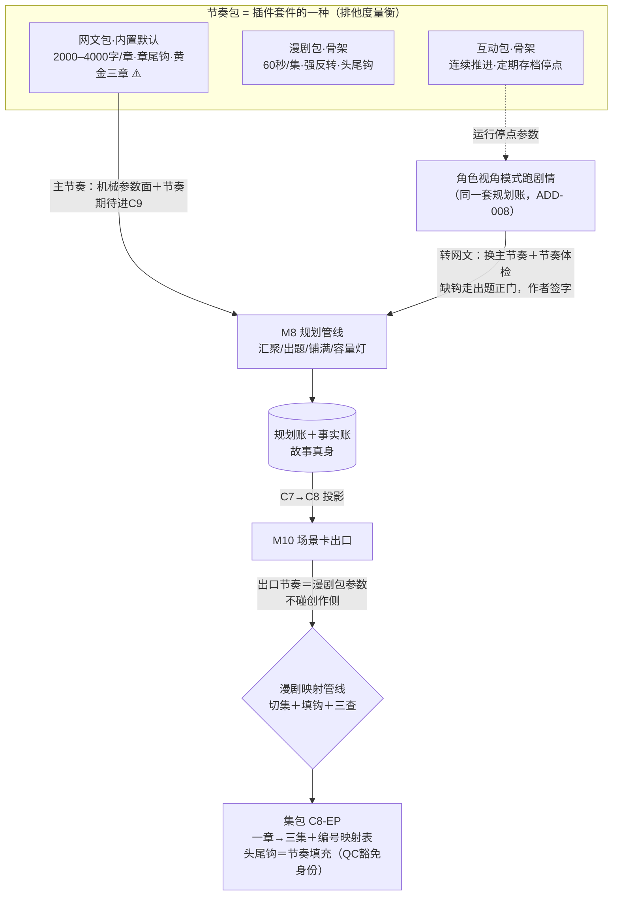

# 「故事真源引擎」体裁节奏包＋跨体裁映射管线设计稿 R01（GENRE_RHYTHM_PACK_DESIGN）

身份：**轻档设计稿。** 承接 CZ 2026-08-13 05:23–05:35 拍板（挂账本 ADD-016 H6：网文商业节奏内置默认但可解耦／漫剧与互动叙事各一套节奏／网文↔漫剧映射管线＋QC 豁免／全部插件化）。它回答三件事：节奏包里装什么、怎么插拔、一章怎么变三集。不是施工合同、不是数据库 Schema；第 4 节是字段建议。例子沿用设计稿一族的《万鬼伏藏》，贯穿例＝第 4 章「归家」转三集漫剧。

上承：[PLUGIN_SKILL_SYSTEM_DESIGN_R01.md](PLUGIN_SKILL_SYSTEM_DESIGN_R01.md)（节奏包是插件套件的一种——ADD-014 口径）、[M8_PLANNING_DESIGN_R01.md](M8_PLANNING_DESIGN_R01.md)（节奏参数的第一消费者：出题／字数预估／容量灯）、[SCENE_CARD_EXPORT_DESIGN_R01.md](SCENE_CARD_EXPORT_DESIGN_R01.md)（漫剧映射的原料 C8）、[OUTLINE_STRUCTURE_DESIGN_R02.md](OUTLINE_STRUCTURE_DESIGN_R02.md)（模板挂点机制＋槽位映射 N19-B）、[CONTEXT_PACKER_DESIGN_R01.md](CONTEXT_PACKER_DESIGN_R01.md)（C9 任务卡区——节奏期待的注入位置）。拍板真源：挂账本（小说架构仓，路径含中文，复制用）`/Users/a1234/挣钱/小说架构/TEMP/bgboard-audit-20260809-r01/18_R07_ADDENDUM_LEDGER_20260813_R01.md`——**ADD-016 H6**（本稿任务书）、ADD-014（插件分层规格）、ADD-008 第 5 条（角色视角模式＝互动叙事的宿主）、ADD-004 Q4/Q7（字数预估驱动槽位映射／黄金三章模板）、ADD-010（投影不回写）。市场先验：SI-006 消化稿 P6 节（小说架构仓，路径含中文，复制用）`/Users/a1234/挣钱/小说架构/TEMP/bgboard-audit-20260809-r01/17_SI006_DIGEST_20260813_R01.md`。

---

## 0. 一句话＋一张图

节奏包就是产品的**度量衡**：同一个故事真身（规划账＋事实账），按网文的尺子量就是「3000 字一章、章章带钩、黄金三章」，按漫剧的尺子量就是「60 秒一集、集集反转、头尾插钩」，按互动叙事的尺子量就是「一直往后跑、定期停点存档」。**尺子可以换、可以拔，秤台（M8 出题管线、两本账、对账机制）一动不动**——这就是 H6 说的「内置默认但可解耦、全部插件化」。

跨体裁映射两条腿，权利结构刚好相反：**网文→漫剧是投影**（一章切三集，头尾插的强情绪钩子带「节奏填充」身份，QC 见身份免事实对账，产物不回写任何账）；**互动→网文是再规划**（跑出来的剧情本来就在规划账里，换上网文尺子做节奏体检，缺的钩子走 M8 出题正门补，作者签字才落账）。一句话记忆：**进账走正门，不进账免对账。**



一句话读图：左边三个包只是三把尺子；往下走的创作链（M8→规划账→场景卡）体裁无关；漫剧包在**出口侧**当投影参数用（网文书出漫剧不用换包），互动包在**运行侧**管角色视角模式的停点，想把互动剧情写成网文才发生真正的「换主节奏」。

## 1. 节奏包的解剖

### 1.1 节奏包是哪种插件：排他的度量衡

ADD-016 H6 说「全部插件化」，ADD-014 的插件体系已经有两类随包对象：**组件**（写法内容，分层取用）和**模板**（坐标期待，如黄金三章）。节奏包补第三类：**节奏参数表（`rhythm_profile`）**——一张参数与期待的清单。所以：

- **节奏包＝一个插件套件**，特征是随包带 `rhythm_profiles[]`；通常还顺手带模板（网文包带 `template.黄金三章`）和组件（如「章尾钩」的五层写法内容，归 `technique` 命名空间——写法教学归组件管，参数表只管度量）。装卸、登记、校验全部复用插件系统 §4 的机制，**不另造安装体系**。
- **与普通内容套件的核心差别：主节奏排他。** 爽点套件可以装五个同时用；节奏参数表一本书同时只认一个当「主节奏」（度量衡不能同时用两把尺子量同一章）。`plugin_prefs.json` 加一个 `main_rhythm` 字段指着它。
- **命名空间零新增**：参数表有自己的 `profile_id`（ASCII 短名），不占 technique/theory/template/reader_effect 四空间，也不发新 ID 前缀（同插件稿 §5.3 的户口纪律）。

一条红线先钉死（拆书稿家法延伸）：**节奏包装的是商业节奏的度量（字数、密度、位置、频率），永远不装文风。**「某作者腔」不是节奏参数；将来拿拆书「结构节拍」测量反哺数值时，也只过桥聚合后的脱敏参数（见第 5 节数值工单）。

### 1.2 参数表六格：一个 profile 装什么

| 格 | 装什么 | 性质 | 谁消费 |
|---|---|---|---|
| ① 章／集制（`chapter_norm` / `episode`） | 章字数默认与软区间；或每集时长、文本预算、每章切几集 | 机械 | M8 汇聚屏头、容量灯、槽位映射（N19-B）；漫剧映射管线 |
| ② 卡点规则（`checkpoints`） | 章尾钩要不要必备、开篇模板引用、小高潮循环提示 | 机械＋期待 | 铺满校验、挂点模板机制、长线节奏监控台（远期） |
| ③ 密度与上限（`pacing`） | 单章还账上限 `payback_cap`、钩子密度口径 | 机械 | M8 出题校验第 5 条、`pacing_note` 口径 |
| ④ 情绪起伏期待（`rhythm_expectations`） | 人话短句数条：章内波形、蓄压-释放循环、钩型轮换 | 生成期待 | 注入 C9 任务卡区，汇聚评星／出题／铺满三处调用读 |
| ⑤ 停点流（`stop_flow`） | 跑剧情时多久一停、什么必停 | 机械 | 角色视角模式运行时（互动包专用） |
| ⑥ 节奏文案（`cadence_info`） | 日更提示这类信息性内容 | 信息性 | 收工卡、排期文案——不约束生成 |

两条设计说明：

- **④ 与 ADD-014 内容五层的关系**：参数表不走组件的五层结构（那是给「怎么写打脸」这种教法内容的）；④ 的期待短句在体量和姿态上对标组件的「剧情生成层」（每条一句话、进 prompt 要省字），走 C9 的同一条注入通道（`why_loaded: rhythm_pack`，枚举增补同 `plugin_declared` 先例）。**同一个包里，参数表管量、组件管法**：网文包的参数说「章尾必须有钩」，随包的「章尾钩」组件教「钩子怎么写不俗套」——出题时前者是约束、后者按 ADD-014 卡牌制声明后才注入。
- **情绪起伏曲线为什么是短句不是数学曲线**：V0 没有任何实测曲线数据，画一条假曲线喂模型是自欺；人话期待（「蓄压 2–4 章配一次释放」）模型读得懂、作者看得懂、将来可以被拆书聚合测量替换成真数据。可计算曲线挂远期。

### 1.3 网文包第一版：内容全文写出来

⚠️ 总标注先行：以下具体数值全部来自网文行业常识（起点／番茄通行口径），**没有一个经过实测或系统调研**——机制照此实装，数值等第 5 节的校准工单喂真数据。其中三项（章字数默认 3000、容量灯 105%/60%、pacing_cap=2）是把 M8 稿里已存在的 ⚠️ 起步值**收编进包**，不是新发明。

```json
{
  "schema": "rhythm-profile-v1",
  "profile_id": "webnovel-serial",
  "name": "网文连载节奏",
  "one_liner": "起点/番茄向商业连载的度量衡：章章带钩，黄金三章，日更节奏",
  "chapter_norm": {"target_length_default": 3000, "soft_min": 2000, "soft_max": 4000},
  "capacity_light": {"over_ratio": 1.05, "under_ratio": 0.60},
  "pacing": {"payback_cap_per_chapter": 2},
  "checkpoints": {
    "exit_hook_required": true,
    "opening_template_ref": "template.黄金三章",
    "mini_climax_cycle_hint": "每 5–10 章一个小高潮，卷尾大高潮"
  },
  "rhythm_expectations": [
    "每章一个完整小波形：起—压—放，收在钩上",
    "章尾钩类型要轮换（悬念/危机/反转/情绪），不连续同型",
    "蓄压 2–4 章配一次释放，压太久读者弃书，释放后 1–2 章内立新压力"
  ],
  "cadence_info": {"update_hint": "日更 4000–6000 字（约 2 章）"},
  "stop_flow": null,
  "episode": null
}
```

逐格人话＋出处：

| 格 | 第一版内容 | 为什么这么定 |
|---|---|---|
| 章制 | 默认 3000，软区间 2000–4000 | 起点/番茄通行章长 ⚠️；M8 §4.1「书级默认 3000 ⚠️ 起步值」收编于此。软区间给字数预估驱动的槽位映射当判据（ADD-004 Q4：预估装不下就提示拆章后挪） |
| 容量灯 | 超 105%／欠 60% | M8 §4.2 现值收编 ⚠️，随 M8 §1.6 实验校准 |
| 还账上限 | 每章 2 笔 | M8 §3.4／O1 现值收编；防「一章清仓」画风突变（ADD-012 F1②） |
| 章尾钩 | **必备**：铺满产出的 `exit_hook` 非空才算铺完（机械校验，提交 M8 R02 收编）；作者手动清空只亮一次提醒不拦——硬校验管模型产出，不管人（M8 §1.2 家法同款） | 网文追读的铁律 ⚠️ 常识口径 |
| 开篇 | 引用 `template.黄金三章`，坐标期待草案：第 1 章主角＋金手指/核心异象亮相＋第一钩；第 2 章冲突升级＋世界规则露一角；第 3 章第一个小高潮＋追读决断点 | ADD-004 Q7 点名的第一个模板（「等 M8 开工时做」——本稿给内容草案，机制走 R02 §6 挂点三件套现成的缺位提醒，不硬性规定不追旧账）⚠️ 模板内容常识需调研 |
| 情绪期待 | 上面 JSON 三句 | 与爽点套件「打脸」组件节奏编排层的口径同源（蓄压 2–4 章）⚠️ |
| 日更 | 4000–6000／天，信息性 | 进收工卡文案（F6 打卡心理），不约束生成 ⚠️ |

### 1.4 漫剧包骨架（内容可后补，形状先定）

先认市场定位再定参数：P6 数据（抖音 AI 漫剧 2026 上半年约 22.19 万部新剧、破亿播放仅 0.48%、个人创作者占供给 40% 却只占消费 11%）支持的用途是**测题材＋引流回阅读页**，不是替代收入（话术黑名单②）。所以漫剧包 V1 的身份是**出口投影参数**——服务「网文书低成本切成漫剧去试水」；「直接按漫剧节奏创作新故事」（漫剧当主节奏）排远期，等真需求。

```json
{
  "schema": "rhythm-profile-v1",
  "profile_id": "duanju-1min",
  "name": "一分钟漫剧节奏",
  "one_liner": "60 秒一集：冷开场即高张力，集集反转，头尾插钩",
  "chapter_norm": null,
  "episode": {
    "duration_target_s": 60,
    "duration_tolerance": 0.2,
    "text_budget_hint": "每集台词＋叙述约 120–180 字 ⚠️ 待标定",
    "shots_hint": "约 8–15 镜 ⚠️ 待标定",
    "eps_per_chapter_hint": [2, 4],
    "hooks": {"opening_s": [3, 5], "closing_s": [3, 5], "reversal_min_per_ep": 1}
  },
  "rhythm_expectations": [
    "开场即高张力，不做铺垫——漫剧观众没有耐心",
    "每集内完成一次微型起伏，断点切在情绪最高处",
    "尾钩只挑逗下一集已有的内容，不虚假承诺"
  ],
  "checkpoints": {"exit_hook_required": true},
  "stop_flow": null,
  "cadence_info": null
}
```

「一分钟一集、字数少、强反转强钩子」三要素全部来自 H6 原话；每集文本预算、镜头数是换算毛估 ⚠️（60 秒竖屏剧的台词量级），第 5 节数值工单标定。

### 1.5 互动叙事包骨架

消费宿主＝**角色视角模式**（ADD-008 第 5 条）：扮演故事中任一角色跑剧情，「依然生成大纲，用的是同一套规划账」；运行机制是「跑完约一章的内容到停点，问要不要存；关键节点（逃跑还是留下还是想办法）交给用户选择，其余自动跑」。互动包就是把这套运行节奏参数化：

```json
{
  "schema": "rhythm-profile-v1",
  "profile_id": "interactive-run",
  "name": "互动叙事节奏",
  "one_liner": "一直往后走，定期停点存档，关键抉择交给玩家",
  "chapter_norm": null,
  "stop_flow": {
    "save_stop_every": "约一章的内容量（ADD-008 运行机制原话）",
    "must_stop_on": "关键抉择节点（逃跑/留下/想办法这类分岔）",
    "auto_run_rest": true
  },
  "checkpoints": {"exit_hook_required": false, "pre_stop_tension": "存档停点前拉一手张力，停在想知道下一步的地方"},
  "rhythm_expectations": [
    "剧情持续向前推进，不为凑章数注水",
    "每个存档段落包含一个完整事件弧（有事发生、有结果落地）⚠️ 颗粒度待宿主实测"
  ],
  "cadence_info": null,
  "episode": null
}
```

边界一条：互动包的「定期停点」是**运行停点**（跑剧情时的存档点），不是创作停点 P1–P22——玩家存不存档跟真值签字、花钱确认是两回事。它要不要进停点注册表，随角色视角模式设计单一起定（【一致性修订 20260813】该模式排期已由 ADD-017 **J6** 拍定：V1 只防降智，沉浸冒险 v2——互动包跟沉浸冒险走），本稿只留参数位。

## 2. 可解耦机制

### 2.1 注入点：两条通道，一张对照表

节奏包影响产品的路径只有两条，没有第三条暗道：**机械参数面**（程序直接读数值：默认值、阈值、必填规则）和**节奏期待**（短句进 C9 任务卡区给模型读）。逐项对照：

| 包里的东西 | 通道 | 注入哪里 | 影响什么 |
|---|---|---|---|
| `chapter_norm` | 机械 | M8 参数面 | 汇聚屏头 `target_length` 默认；字数预估驱动的槽位映射判据（装不下→拆章建议，ADD-004 Q4） |
| `capacity_light` | 机械 | M8 参数面 | 容量灯阈值（M8 §4.2 的 105%/60% 改从包读） |
| `pacing.payback_cap` | 机械 | M8 参数面 | 出题机械校验第 5 条的上限值；选项 `pacing_note` 的口径 |
| `checkpoints.exit_hook_required` | 机械 | 铺满校验 | 铺满产出 `exit_hook` 非空才收（新增校验行，提交 M8 R02） |
| `checkpoints.opening_template_ref` | 机械 | 挂点模板机制 | 坐标期待＋缺位提醒（R02 §6 三件套现成，零新机制） |
| `rhythm_expectations` | 期待 | C9 任务卡区（`why_loaded: rhythm_pack`） | 汇聚评星（压力释放/金手指节奏类软要点的依据）、出题、铺满三处调用读到 |
| `cadence_info` | 信息 | 界面文案 | 收工卡日更提示（F6），不进任何 prompt |
| `stop_flow` | 机械 | 角色视角模式运行时 | 跑剧情的存档频率（宿主未立项，参数留位） |
| `episode` | 机械＋期待 | 漫剧映射管线（第 3 节） | 切集预算、填钩规格 |

**优先级一句话：作者书级设置 ＞ 包默认 ＞ 裸模式中性缺省。** 作者改过的 `target_length`、`pacing_cap` 永远压过包（他的书他说了算，M8 既有姿态不变）；包只提供「没改时的默认」。

预算自查：`rhythm_expectations` 三五条短句 ≈ 100 字出头，C9 里是一条保底小条目——账本可以细、执行包必须瘦（ADD-007），节奏包不许往执行包里塞教程（教程在组件的分层内容里，按卡牌制另走声明通道）。

### 2.2 换包＝换什么：主节奏与出口节奏分离（本稿最重要的裁决）

H6 里其实藏着两种「用另一套节奏」，性质完全不同，必须拆开：

| | 主节奏（书级唯一） | 出口节奏（导出时选） |
|---|---|---|
| 管什么 | **以后怎么写**：出题、字数预估、卡点、容量灯全按它 | **这次怎么投影**：漫剧映射用漫剧包的 `episode` 参数切集 |
| 换了动什么 | 参数面即时切换，**只影响往后的规划动作**；已铺的章篮一个字不动（那是作者签过字的计划，不是包的财产）；容量灯全书按新章制重算可能亮一片→问一次「要不要跑重排建议」（开放问题 O1） | 什么都不动——创作侧零感知 |
| 例子 | 互动跑出的剧情要接着按网文写 → 主节奏换成网文包 | 网文书切三集漫剧去抖音试水 → 导出时选漫剧包 |

为什么分离：网文一章切三集是**同一真身多一个投影**——就像一本书出平装又出精装，不用重写书。如果把它做成「换包」，作者每导一次漫剧就得把书切成漫剧节奏再切回来，度量衡来回跳，容量灯闪成迪厅。而互动转网文是真的要**换度量衡继续创作**，往后的每一章都按网文的尺子出题。两件事共用「节奏包」这个对象，但插的位置不同：一个插在 M8 上游，一个插在 M10 下游。

换主节奏的具体动作清单（全机械，作者主动设置动作，不占停点号）：`main_rhythm` 改引用 → 参数面切换 → C9 节奏期待换文 → 模板期待换挂（黄金三章的缺位提醒卸下，新包模板挂上——模板卸载＝删标签，R02 §6 语义现成）→ 容量灯重算 → 弹一次重排建议询问（O1）。

### 2.3 裸模式：不装包时产品长什么样

| 参数 | 裸模式行为 |
|---|---|
| 章字数 | 无默认——作者手填才有数；不填则容量灯不亮（没有标尺就不量） |
| 还账上限 | 无——出题校验第 5 条跳过，模型不受分期约束 |
| 章尾钩 | 可空——铺满不强制 |
| 开篇模板 | 无坐标期待、无缺位提醒 |
| 节奏期待 | C9 不注入这条（省字） |
| 收工卡 | 无日更文案 |

M8 的机制本身——汇聚、编排、出题、选定改账、铺满、收口对账——**全部照常转**。这就是「可解耦」的验收标准：度量衡可拔，秤台不动。

裸模式的存在首先是**架构自证**（证明节奏没写死在管线里），其次才是给写实验文体的作者一个清静（要不要暴露成用户开关，见 O3）。施工含义一句：**M8 施工时所有节奏类 ⚠️ 起步值常量必须从 profile 读，不许硬编码**——裸模式就是 profile 为空时的缺省分支，代码里出现 `3000` 字面量即算违规。

## 3. 网文→漫剧映射管线

### 3.1 用户画面＋吃什么吐什么

用户画面：做漫剧的人（多半就是作者本人）对《万鬼伏藏》第 4 章点「导出漫剧集包」，得到三集制作单——每集一张：**头钩（3–5 秒冷开场）＋正片镜头行＋尾钩（3–5 秒悬念）**，粘进即梦/剪映就能开工；包里附一张编号映射表，哪集来自哪场哪几拍一目了然，改了规划回来能对上账。

| | 内容 |
|---|---|
| 吃 | 该章 **C8 场景卡包**（镜头行/台词表/别拍出来清单/锚卡——M10 现成产物）＋漫剧包 `episode` 参数＋读者可知状态（已烙在 C8 里） |
| 吐 | **集包（C8-EP）**：episodes[]＋编号映射表；产品内留一份**映射登记**（过期对账用，§4.1） |

为什么吃 C8 不直接吃 C7 或正文：一章 3000 字切三集，每集文本预算才 120–180 字 ⚠️——映射是**浓缩投影不是搬运**，而 C8 已经把浓缩做完了（拍→镜头行、防泄底转译、锚卡注入）。映射管线只做两件新事：**再组织**（切集）＋**填钩**。这也是排期依赖 M10 的原因（第 5 节）。

顺手划清一个易混出口（ADD-012 F2）：概览侧的「可发抖音解说画面卡」是**解说剧情**的素材（M9 家的），漫剧集包是**改编成剧**的制作单（M10 家的）——同源不同用，别混。

### 3.2 切集逻辑：按情绪节拍切，场是首选切口

**集的立身格：一个完整的「张力起→反转/冲击→钩」微波形**（漫剧包 `reversal_min_per_ep: 1`——H6 原话「强反转强钩子」的机械化）。切分规则三条：

1. **默认一场一集**。场本来就是情绪单元（`mood_in→mood_out`、`turn` 必填非空是场篮立身格），多数情况下场边界就是集边界。第 4 章三场 → 三集，正好是 CZ 举的「一章→三集」。
2. **超预算的场按次级转折拆**。判定材料＝镜头行时长毛估和＋台词字数 vs 集预算；一个 1800 字双转折的大场切成两集，切口选在次级转折镜后。
3. **欠预算的短场并邻**。两个 400 字的过渡场并成一集，并集后仍须满足「至少一次反转/冲击」——查不到 `turn` 镜的集是废集，切分重调。

机械校验兜底：**覆盖率**——该章 C8 的每一条镜头行必须被分进恰好一个集，不许丢、不许重（同 M8 对账「不许藏账」思路）；每集时长预算灯（超/欠 20%）亮灯建议拆并。

诚实标注 ⚠️：C8 的镜头行本来就是骨架（秒数是毛估），漫剧成片密度由制作者补反应镜/空镜——切集预算按骨架毛估算，够排集次序、不够卡秒表；每集文本预算 120–180 字这个换算本身待标定（第 5 节数值工单）。切集用机械初切＋一次小额调用微调（拆口选哪个镜后、并集顺不顺），每章填钩一次调用（六条钩一起出）——一章映射约 2 次调用，量级同一次出题。

### 3.3 节奏填充身份＋QC 豁免协议（H6 的硬要求，本节是合同条款）

**问题原样**：每集头尾插的强情绪钩子，内容与剧情事实无关（它是氛围渲染、悬念挑逗，不是剧情），质检看到「查无此事」的句子不能报错。——H6 原话：「插的强情绪内容与剧情事实无关，质检不能报错（插件与 QC 的豁免协议）」。

**身份定义**：`identity: "rhythm_filler"`（节奏填充）——为节奏而生的情绪内容，不承载剧情事实。物理上只活在集包文件里：不进事实账、不进规划账、不进伏笔账，天生没有 `beat_ref` 锚。

**生成约束（上游只许做两件事）**：头钩＝把**本集已有内容**做情绪化预告或浓缩；尾钩＝拿**下一集已规划内容**做悬念挑逗（不揭底）。不许引入新人物、新事件、新设定断言——填充是垫片不是编剧。

**豁免协议（下游分流表）**：

| 检查项 | 普通镜头行/台词 | 节奏填充（`rhythm_filler`） |
|---|---|---|
| 事实一致性核对（与拍/事实账比对） | 查（凭 `beat_ref` 锚） | **豁免**——身份即免检凭证，QC 见身份标跳过，不报「查无此事」 |
| 源锚必填（`beat_ref` 非空） | 要 | 豁免（天生无锚） |
| 防泄底（`dont_show`／读者可知状态按故事位置判定） | 查 | **照查，不豁免** |
| 硬红线（`must_not` 转译的禁令） | 查 | **照查，不豁免** |
| fact-free 自检 | 不适用 | **专属检查**：专名白名单（只许出现本集/下集出场且该故事位置读者已知的人物地点）＋新断言扫描，扫出新事实句该条拒收重写 |
| AI 标识（合规件） | 随包 | 随包 |

一句话讲透豁免的边界：**豁免的是「对不上账」，不豁免「说漏嘴」。** 没有身份协议，QC 只有两个坏选择——要么对填充报一堆假阳性（作者从此不信质检），要么整体放水（真泄底也漏过去）。身份标让它分流：填充走专用清单，事实句照旧全查。

拿贯穿例演一遍拦截（这两条都是设计上**必须拦住**的案例）：

- **泄底拦截**：EP1 尾钩第一版「爷爷忘了他。可这只是这个家忘记他的开始——」→ 防泄底扫描命中 `dont_show` 第①条（只演个案，不得暗示还会有更多人忘记他）→ 拒收重写为「他冲进里屋翻出族谱——他要证明，自己是陈家的人」（挑逗下一集已规划内容，不揭底）。
- **fact-free 拦截**：EP3 头钩第一版「守棺人的祖训：棺前不许出声」→ 新断言扫描命中（账上没有这条祖训——填充编了条设定）→ 拒收重写为「深夜义庄，守棺人守着一屋子棺材。死人不会出声——他一直这么信」（常识陈述＋本集内容预告，零新断言）。

误回流边界一条：集包烙 `export_id`＋AI 标识，若被当材料导回产品，分拣器认出是本产品导出的投影文件，提醒「这是漫剧脚本不是正文」——填充本无事实可抽，但别让它污染章节架。

### 3.4 贯穿例全景：《万鬼伏藏》第 4 章「归家」→ 三集

第 4 章章篮（3000 字，三场，出自 PLAN-S004-r3）：场 1「归家不识」（SCN-0008，900 字：九棺归家，爷爷削着苹果问他找谁）；场 2「族谱淡名」（SCN-0009，800 字：翻开族谱，自己的名字淡得几乎看不见）；场 3「棺闻心跳」（SCN-0010，1300 字：深夜义庄，祖棺里传出心跳，第二声清清楚楚）。章尾钩＝第二声心跳（S-0005 的必选承接，与 M8 稿第 5 章工作台对上）。

三场三集，每集一张制作单。第 1 集渲染出来长这样：

```text
【万鬼伏藏 · 漫剧 · 第 1 集/3（源：第 4 章「归家」场 1）】目标 60 秒
▶ 头钩（3–5s · 节奏填充）：暮色院门，青年的手停在门环上
   「离家三年，他日夜想的就是这扇门。推开之前，他不知道自己已经是个陌生人。」
■ 正片（约 50s）：
  1｜全景缓推 3s｜暮色院子，堂屋透出昏黄灯光
  2｜中景 4s｜青年推门而入，藤箱未卸｜九棺：「爷爷，我回来了！」
  3｜特写 4s｜布满老年斑的手递出削好的苹果｜爷爷：「小伙子，尝尝？」
  4｜正反打 5s｜老人陌生地打量，九棺的笑僵在脸上｜爷爷：「小伙子，你找谁？」
  （骨架镜不足 60s 的部分由制作者按台词节奏补反应镜——毛估口径见设计稿 §3.2）
◀ 尾钩（3–5s · 节奏填充）：青年抱着族谱轴跪在灯下
   「他冲进里屋翻出族谱——他要证明，自己是陈家的人。」
■ 别拍出来：①只演个案，不暗示更多人会忘记他；②爷爷只能演「忘」，不能演病重濒死
（本集是场景卡的再组织 · PLAN-S004-r3 · 节奏填充已标注 · AI 辅助生成）
```

三集的钩子全表（正片略）：

| 集 | 头钩（本集情绪预告） | 尾钩（下集悬念挑逗） |
|---|---|---|
| EP1 爷爷问我找谁 | 「离家三年，他日夜想的就是这扇门。推开之前，他不知道自己已经是个陌生人。」 | 「他冲进里屋翻出族谱——他要证明，自己是陈家的人。」 |
| EP2 族谱上的名字淡了 | 「族谱上，祖辈的名字一个个墨迹如新。轮到他这一页——」 | 「名字会淡，人会忘。可义庄里那口祖棺——今晚，出了声。」 |
| EP3 棺里有心跳 | 「深夜义庄，守棺人守着一屋子棺材。死人不会出声——他一直这么信。」 | 「咚。第二声。死人不会心跳，可这口棺，跳了。」（收官钩，悬在与第 5 章相同的位置） |

注意 EP3 尾钩守住的一条：第 5 章才揭示「心跳在应和九棺自己的心跳」（SCN-0011 的 turn）——集包按**故事位置**判定读者可知状态（C8 §1.3 三原则原样继承），第 4 章位置的尾钩只能停在「跳了两声」，不许提前把第 5 章的发现说出去。

### 3.5 反向：互动跑出的剧情转网文微修

用户画面：作者用角色视角模式以陈九棺的身份跑了三个存档段的冒险（每段约一章内容量），觉得这段剧情好，想写成网文更新。H6 原话：「互动叙事跑出的剧情想写成网文→用网文节奏微修（加钩子、起伏）」。

机制四步，**没有一步是新发明**：

1. **素材已在账上**：角色视角模式的产物本来就是规划账内容（ADD-008：「依然生成大纲，用的是同一套规划账」）——不存在导入问题，跑出来的就是章篮/场/拍形态，只是节奏是互动味的（段落连续推进、没有章制、没有章尾钩）。
2. **换主节奏**：该书主节奏设为网文包（§2.2 的动作清单）。
3. **节奏体检**（机械＋一次小额调用）：拿网文包的度量衡对这段规划出**差距报告**——章切分（连续流按 2000–4000 字重新划章界 → 槽位映射批量建议，N19-B 现成机制）；章尾钩（每个新章界查 `exit_hook`，缺的列清单）；情绪起伏（对照 `rhythm_expectations` 把连平段标出来）；开篇对照（若是新书头三章，黄金三章模板缺位提醒自动生效）。
4. **节奏修补题**（M8 出题形态）：每个缺口一道题——「第 X 章切在这里，章尾还缺一个钩子」，主推荐＋2 备选，选项带变更清单（补钩＝新拍/新伏笔草案落 `exit_hook`；调切分＝`slot_mappings` 落行）；作者逐题选定，走 P1 正门落账。

为什么走出题正门而不是自动改：加钩子、调起伏是**剧情动作**（往规划账里加拍、埋伏笔），动账必须作者签字——跟填充刚好构成对照：**填充不进账所以可以免对账；微修要进账所以必须走正门。** 同一个 H6 里的两条管线，权利结构相反，因为一个是投影、一个动真身。

## 4. 与规划账的关系

### 4.1 投影不回写＋映射登记

**集包＝投影链的第三环**：规划账 →（C7 章计划快照）→ C8 场景卡 →（再组织＋填钩）→ **C8-EP 集包**。C8 的投影铁律四条（只读/带版本/不回写/过期标记，源自 ADD-010）原样继承，再加两条集包特有的：

- **填充不进账**：`rhythm_filler` 条目只存在于集包文件里，编号（EPF-）是**包内局部号**，与集号（EP-，从槽位号派生）一样不入全局前缀户口（N9 户口纪律，同 C8 `card_id`、镜头 `shot_no` 待遇）。
- **过期有波及规则**：产品内留一份**映射登记**（每次映射的 `export_id`＋plan 版本戳＋集↔场对照）；某场规划变了 → 按登记查到对应集标「已过期」，**且前一集连带标注**（它的尾钩挑逗的就是这一集的内容，内容变了钩子也馊了）；重导只重出受影响的集。

回写路径为零：映射管线对规划账、事实账、伏笔账零写权限；制作时发现剧情问题回规划账改，改完重导——与 C8 §2.1 逐字同款。

### 4.2 编号映射的数据形状（C8-EP 字段建议）

包级沿用 C8 的身份件（`export_id`/`ai_label`/`source_note`），新增 `rhythm_profile_ref`（这次投影用的哪把尺子）。核心是 `episodes[]` 和 `episode_map[]`：

```json
{
  "contract": "C8-EP",
  "version": "v0-draft-r1",
  "export_id": "EXP-20260815-02",
  "book_title": "万鬼伏藏",
  "chapter_ref": "S-0004",
  "source": {"plan_id": "PLAN-S004-r3", "scene_card_export": "EXP-20260813-01",
             "basis_note": "plan-ledger@2026-08-13T03:00"},
  "rhythm_profile_ref": "duanju-1min",
  "ai_label": {"contains_ai_generated_content": true, "note": "本文件内容由 AI 辅助生成"},
  "episodes": [
    {
      "ep_id": "EP-S0004-1",
      "ep_no": 1,
      "title_hint": "爷爷问我找谁",
      "duration_target_s": 60,
      "opening_hook": {
        "identity": "rhythm_filler",
        "filler_id": "EPF-S0004-1a",
        "text": "离家三年，他日夜想的就是这扇门。推开之前，他不知道自己已经是个陌生人。",
        "visual_hint": "暮色院门，青年的手停在门环上",
        "checks_passed": ["fact_free", "no_spoiler", "must_not"]
      },
      "body": {"covers": [{"scene_id": "SCN-0008", "shot_nos": [1, 2, 3, 4],
                            "beat_refs": ["PE-0411", "PE-0412"]}]},
      "closing_hook": {
        "identity": "rhythm_filler",
        "filler_id": "EPF-S0004-1z",
        "text": "他冲进里屋翻出族谱——他要证明，自己是陈家的人。",
        "visual_hint": "青年抱着族谱轴跪在灯下",
        "checks_passed": ["fact_free", "no_spoiler", "must_not"]
      }
    }
  ],
  "episode_map": [
    {"ep_id": "EP-S0004-1", "ep_no": 1,
     "covers": [{"scene_id": "SCN-0008", "shot_nos": [1, 2, 3, 4], "beat_refs": ["PE-0411", "PE-0412"]}],
     "fillers": ["EPF-S0004-1a", "EPF-S0004-1z"]},
    {"ep_id": "EP-S0004-2", "ep_no": 2,
     "covers": [{"scene_id": "SCN-0009", "shot_nos": [1, 2, 3], "beat_refs": ["PE-0421"]}],
     "fillers": ["EPF-S0004-2a", "EPF-S0004-2z"]},
    {"ep_id": "EP-S0004-3", "ep_no": 3,
     "covers": [{"scene_id": "SCN-0010", "shot_nos": [1, 2, 3, 4, 5], "beat_refs": ["PE-0431", "PE-0432"]}],
     "fillers": ["EPF-S0004-3a", "EPF-S0004-3z"]}
  ]
}
```

`episode_map` 就是 H6 要的「输出一章→三集＋编号映射」：每行说清这一集**盖住哪场哪几镜哪几拍**（covers）＋**垫了哪些填充**（fillers）。它同时是三件事的地基：过期对账（§4.1）、覆盖率校验（§3.2 不许丢镜）、将来「哪集火了反查是哪段剧情」的归因。

### 4.3 配套账本增补清单＋新词登记

增补全部机械小改，提交各宿主吸收（体例同 M8 §8.4）：

| 对象 | 增补 | 出处 |
|---|---|---|
| `suite.json`（插件稿 §6.2） | ＋`rhythm_profiles[]` 第三类随包对象 | 本稿 §1.1 |
| `plugin_prefs.json`（插件稿 §6.3） | ＋`main_rhythm`（书级主节奏引用；作者覆盖值仍在 `planning_prefs`） | 本稿 §2.2 |
| C9 `why_loaded` 枚举 | ＋`rhythm_pack` | 本稿 §2.1（同 `plugin_declared` 先例） |
| M8 参数面 | `target_length` 默认/`pacing_cap`/容量灯阈值改从主节奏 profile 读；铺满校验＋「`exit_hook` 非空（包要求时）」 | 本稿 §2.1/§1.3，提交 M8 R02 |
| 新合同 C8-EP（集包） | §4.2 形状；合同位提交 ARCHITECTURE 吸收 | 本稿 |
| 产品内新文件（映射登记） | 每书一份：export_id＋plan 版本戳＋集↔场对照＋过期标记 | 本稿 §4.1 |
| F 类花钱确认 | 漫剧映射批量导出、换包重排大工程——提交注册表 F 类领号（体例同 F-4 先例） | 本稿 §3/O1 |

新词登记（交词典，「谁发明谁当天登记」家法）：

| 词 | 圈 | 一句话干嘛的 |
|---|---|---|
| 节奏包 | 用户/工程 | 一种插件套件：体裁度量衡（参数表＋随包模板/组件） |
| 节奏参数表（`rhythm_profile`） | 工程 | 套件里的第三类随包对象，六格参数与期待 |
| 主节奏／出口节奏 | 工程 | 书级唯一的创作度量衡／导出时临时选用的投影参数 |
| 裸模式 | 工程 | 不装节奏包时的中性缺省：度量衡可拔、秤台不动 |
| 节奏填充（`rhythm_filler`） | 工程 | 集包头尾钩的身份标：不承载事实、QC 免事实对账、泄底与红线照查 |
| 集包（C8-EP） | 工程 | 漫剧映射产物：episodes＋编号映射表，投影不回写 |
| 节奏体检／节奏修补题 | 工程 | 换主节奏后的差距报告／按缺口出的 M8 补钩切章题 |

## 5. 排期建议

| 期 | 做什么 | 启动条件 | 明确不做 |
|---|---|---|---|
| **V0（随 M8 施工单）** | 网文包**收编成包**：`rhythm-profile-v1` 结构落地，M8 现有散落常量（3000 默认/pacing_cap 2/容量灯阈值）改从包读；新增铺满校验「exit_hook 非空」；黄金三章模板内容草案随挂点机制落地（ADD-004 Q7 原排期）；内置即已装、暂不可卸、无换包 UI | M8 施工单开工 | 漫剧包/互动包生效、映射管线、换包 UI、裸模式开关 |
| **V1（M10 之后）** | 漫剧出口映射管线全套：切集＋填钩＋豁免三查＋集包导出＋映射登记；漫剧包 `episode` 参数出口侧生效；花钱确认行提交注册表 | **C7 落地＋M10 场景卡出口就位＋锚卡可用**——映射吃 C8，没有 C8 就没有原料（正面回答任务书：对，就是场景卡出口就位后启动） | 漫剧当主节奏（直接按漫剧节奏创作） |
| **V1.x** | 换主节奏＋重排建议大工程（O1）＋裸模式设置页（O3） | 出现第二个可用包（漫剧包生效后自然出现换包需求） | — |
| **V2/远期** | 互动包生效＋反向「节奏体检/修补题」 | **角色视角模式沉浸冒险落地**（【一致性修订 20260813】J6 已拍：防降智 V1、沉浸冒险 v2——互动包跟沉浸冒险走，宿主排期从「未拍」变「已排 v2」） | 可计算情绪曲线 |

V0 为什么只是「收编」也值得做：把度量衡从代码常量升级为数据文件，是「可解耦」从口号变成架构事实的那一步——晚做一天，M8 里就多长一天的硬编码，将来漫剧/互动包每一个都要回头拆。

**数值调研工单（独立立单，同插件稿「内容建设独立工单」先例）**：①网文包数值校准——起点/番茄章长、章尾钩口径、黄金三章内容、小高潮周期，路径＝SI 外部调查＋拆书菜单「结构节拍」维度的聚合测量反哺（合规边界：只用聚合统计，不做单书模仿，文风红线不碰）；②漫剧每集文本预算/镜头密度标定——拿真实 60 秒漫剧样本量出来。数值到位前，包照常能用，数字带 ⚠️ 跑。

## 6. 开放问题（交 CZ 拍）

**O1｜换主节奏后，已经规划好的章要不要重排？**
场景：作者用互动模式跑了 20 个存档段，现在想转网文连载。换包后**往后**的章都按网文尺子出题没有争议；但已存的 20 段是互动节奏——章界不齐、没有章尾钩，账上摆着。
- A. 只管往后：旧段不动，作者想修哪段自己逐段走节奏修补题
- B. 换包时问一次「要不要跑重排建议？」：大工程（积分预估＋确认），产出＝切章建议（槽位映射批量提案）＋缺钩清单＋逐题修补队列，作者一屏确认后逐题走
- C. 自动重排：不问直接改——违反「不静默改规划」（N19-B），不给这个选项
- 👉 推荐 B：20 段手动逐段修是劝退级工作量；B 的产物全是提案、逐题作者签字，一步不踩静默改账的红线。

**O2｜漫剧填充钩子（QC 已免检事实）要不要人看一眼？**
场景：一章三集六条填充，机械三查（fact-free/泄底/红线）都过了，这些句子将直接面对观众。机械查拦得住「说漏嘴」，拦不住「写得尬」。
- A. 全自动：三查过了就出包，不打扰
- B. 导出预览里填充条目**高亮标「节奏填充」**，可单条改写/重生成，不强制逐条确认
- C. 逐条签字才出包
- 👉 推荐 B：尬不尬只有人知道，高亮＝看得见、改得动、不拦路（同审查概览的姿态）；C 批量导十章就是六十次点击，违反整本工程黑盒精神（ADD-002）。

**O3｜裸模式要不要做成用户可见的开关？**
场景：网文包内置默认。有作者写实验文体（意识流短篇），嫌「章尾还缺一个钩子」的提醒烦。
- A. 纯架构能力：裸模式只是工程保证（参数面可退中性），界面不给关
- B. 高级设置里可关：设置「节奏包」页一键关到裸模式，字数默认/卡点校验/节奏期待全静音；默认档永远是网文包开（H6：内置默认）
- C. 可关还可卸载
- 👉 推荐 B：H6 拍的「可解耦」做成作者真实可及的自由才算数；「卸载」比「关」多一套重装流程却没多任何效果，不值得做。

## 7. 轻档自查记录

- 任务书六项逐项回对：①解剖（§1：一种插件套件＋排他主节奏＋参数表六格；网文包第一版全文 §1.3 含 2000–4000/章尾钩/黄金三章/日更全部 ⚠️ 标注；漫剧/互动骨架 §1.4/1.5）；②可解耦（§2：注入点两通道对照表＋换包=主/出口分离＋裸模式中性缺省表＋硬编码禁令）；③映射管线（§3：切集逻辑按情绪节拍场为首选切口／填充身份＋豁免分流表＋两例拦截／一章→三集全例／反向四步）；④与规划账关系（§4：投影链第三环＋填充不进账＋过期波及＋C8-EP 形状与 episode_map）；⑤排期（§5：V0 收编成包、漫剧映射条件=C7＋M10＋锚卡就位、互动跟角色视角模式立项）；⑥开放问题 3 条（§6）——无缺项。
- H6 逐句吸收核对：内置默认（V0 网文包内置即装）；可解耦（裸模式＋参数面）；漫剧一分钟一集强反转强钩子（§1.4 episode 参数）；互动一直往后走定期停点（§1.5 stop_flow）；互动转网文微修加钩子起伏（§3.5）；一章两三千字切几集（§3.2）；每集头尾插强情绪钩（§3.3/3.4）；插的内容与剧情事实无关 QC 不报错（§3.3 豁免协议）；一章→三集＋编号映射（§3.4/§4.2 episode_map）；全部插件化（§1.1 挂进 ADD-014 套件体系）。
- 关联拍板核对：ADD-014 卡牌制未破（参数是约束、教法内容仍走组件声明通道，§1.2）；ADD-010 投影铁律继承＋两条集包新增（§4.1）；ADD-008 第 5 条互动宿主＋运行停点与创作停点划清（§1.5）；ADD-004 Q4 字数预估驱动槽位映射当反向切章的机械（§3.5）、Q7 黄金三章排期不变（§1.3/§5）；ADD-007 节奏期待 ~100 字预算自查（§2.1）；ADD-012 F2 两出口划清（§3.1）；拆书文风红线（§1.1/§5）。
- 没发明新拍板：不占新停点号（换包=设置动作、填充高亮=界面形态，盘点声明在 §2.2/O2）；不发新全局前缀（EP-/EPF- 是派生/包内局部号，§4.1）；F 类领号、C9 枚举、M8 参数面改造、C8-EP 合同位全部标「提交宿主承办」（§4.3）；O1–O3 推荐已标待 CZ。
- ⚠️ 起步值清点（无实测不拍死）：网文包全部数值（章长/容量灯/还账/钩口径/黄金三章内容/日更）、漫剧每集文本预算 120–180 字与镜头数 8–15、每章切 2–4 集、集时长容差 20%、互动存档段颗粒度——全部标 ⚠️ 且第 5 节数值工单接手。

修订记录：
- 一致性修订 20260813：两处「角色视角模式版本排期未拍」按 J6 更新（V1 防降智、沉浸冒险 v2，互动包随沉浸冒险走）；创作停点范围引用更新为 P1–P22（注册表 §5.1 号谱）。设计稿群一致性巡检执行。
- 示例自洽核对：第 4 章三场 900+800+1300=3000 与网文包默认对上；EP/EPF/SCN/PE 编号风格与存储稿四位零垫一致；EP3 尾钩停在「两声心跳」不越第 5 章揭示位（C8 按故事位置判定原则）；两条拦截例分别命中泄底与 fact-free 两类检查；episode_map 三行 covers 与三场一一对应无丢镜。JSON 三份机械可解析。

## 8. 来源与追溯

- 挂账本（小说架构仓，路径含中文，复制用）：`/Users/a1234/挣钱/小说架构/TEMP/bgboard-audit-20260809-r01/18_R07_ADDENDUM_LEDGER_20260813_R01.md`——**ADD-016 H6**（本稿任务书：节奏包＋映射＋QC 豁免＋插件化）、ADD-014（插件分层规格，节奏包的挂靠体系）、ADD-008 第 5 条（角色视角模式＝互动宿主）、ADD-004 Q4/Q7（槽位映射/黄金三章）、ADD-010（投影不回写）、ADD-007（执行包瘦）、ADD-012 F2/F6（两出口/收工卡）、ADD-002（整本工程黑盒＋预估）。
- [PLUGIN_SKILL_SYSTEM_DESIGN_R01.md](PLUGIN_SKILL_SYSTEM_DESIGN_R01.md)：套件/组件/模板结构（§1/§5/§6——`rhythm_profiles[]` 的挂靠处）、命名空间与前缀户口纪律（§5.3）、安装校验与启用范围（§4）。
- [M8_PLANNING_DESIGN_R01.md](M8_PLANNING_DESIGN_R01.md)：参数面的现值出处（§3.4 pacing_cap、§4.1 默认 3000、§4.2 容量灯）、出题机械校验体例（§3.5）、铺满格子（§4.1 exit_hook）、槽位映射行为（§4.2）。
- [SCENE_CARD_EXPORT_DESIGN_R01.md](SCENE_CARD_EXPORT_DESIGN_R01.md)：C8 字段与镜头行（§2）、防泄底三原则与按故事位置判定（§1.3）、投影铁律（§2.1）、锚卡（§3）、AI 标识合规（§4.3）。
- [OUTLINE_STRUCTURE_DESIGN_R02.md](OUTLINE_STRUCTURE_DESIGN_R02.md)：挂点三件套与模板语义（§6）、场篮立身格（§3.5）、N19-B 槽位映射。
- [CONTEXT_PACKER_DESIGN_R01.md](CONTEXT_PACKER_DESIGN_R01.md)：C9 任务卡区与 `why_loaded` 封闭枚举（本稿加 `rhythm_pack`）。
- [STOP_POINT_REGISTRY_R01.md](STOP_POINT_REGISTRY_R01.md)：F 类格式与不占号判例体例。
- [BOOK_DISSECT_MENU_DESIGN_R01.md](BOOK_DISSECT_MENU_DESIGN_R01.md)：文风红线与「结构节拍」测量（数值校准的反哺来源与合规边界）。
- SI-006 消化稿（小说架构仓，路径含中文，复制用）：`/Users/a1234/挣钱/小说架构/TEMP/bgboard-audit-20260809-r01/17_SI006_DIGEST_20260813_R01.md`——P6 漫剧市场数据（22.19 万部/破亿 0.48%/供给 40% 消费 11%）与「测题材＋引流」定位；引用其余数字前先查该稿「复用避雷」节。
- 产品词典（同仓，复制用）：`/Users/a1234/挣钱/小说架构/TEMP/bgboard-audit-20260809-r01/21_PRODUCT_GLOSSARY_V0_20260813.md`——三圈命名与「谁发明谁当天登记」家法（本稿 §4.3 照办）。

来源：Cursor（Fable 5 Max）设计，2026-08-13；拍板真源 CZ（ADD-016 H6），待 CZ 拍 O1–O3。
