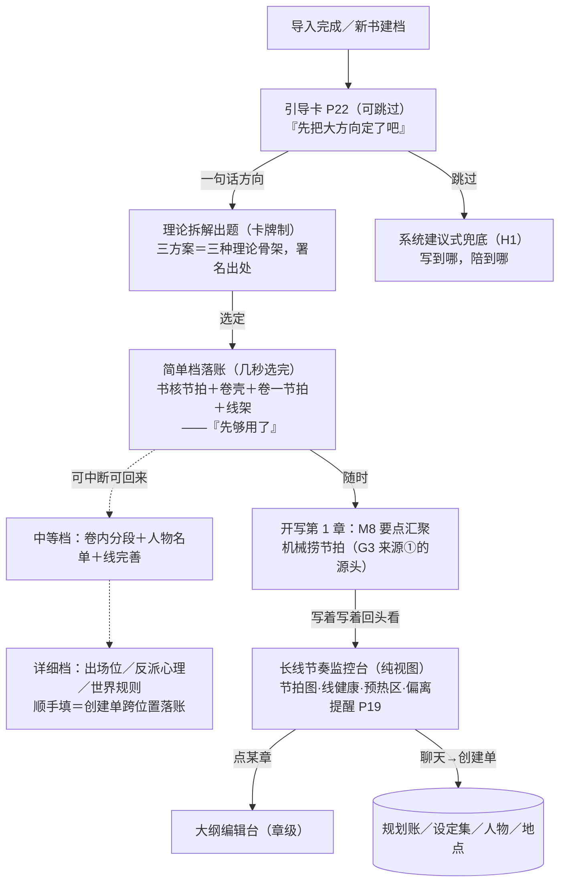

# 「故事真源引擎」全书大纲引导＋长线节奏监控台设计稿 R01（GLOBAL_OUTLINE_DESIGN）

身份：**轻档设计稿。** 承接 CZ 2026-08-13 05:23–05:35 拍板（挂账本 **ADD-016 H2**：导入后引导定大方向／内置理论拆解／分层深化＋每层停点／全局 AI 跨位置创建；**H1**：故事线在全局层设计、选线是开章第一动作）。它回答两件事：**作者从「一句话想法」到「能写第 1 章」的最短引导路，和写起来之后天天看的那张全书地图（长线节奏监控台）**。ADD-013 G3 说章计划的要点来源第一条是「全书／卷大纲下传方向」——本稿设计的就是那个下传的**源头**。不是施工合同、不是数据库 Schema；第 6 节是字段建议。

上承：[OUTLINE_STRUCTURE_DESIGN_R02.md](OUTLINE_STRUCTURE_DESIGN_R02.md)（书核／卷篮／线架——引导流程往这些篮子里填东西）、[PLUGIN_SKILL_SYSTEM_DESIGN_R01.md](PLUGIN_SKILL_SYSTEM_DESIGN_R01.md)（插件分层＋卡牌制——理论拆解的宪法，本稿是它「节奏编排层消费」的第一个立项宿主）、[M8_PLANNING_DESIGN_R01.md](M8_PLANNING_DESIGN_R01.md)（章级出题——监控台的下层，节拍下传的消费者）、[IDEA_LEDGER_DESIGN_R01.md](IDEA_LEDGER_DESIGN_R01.md)（灵感账——全局规划时灵感的安放通道照旧走它）、[STOP_POINT_REGISTRY_R01.md](STOP_POINT_REGISTRY_R01.md)（停点领号）。拍板真源：挂账本（小说架构仓，路径含中文，复制用）`/Users/a1234/挣钱/小说架构/TEMP/bgboard-audit-20260809-r01/18_R07_ADDENDUM_LEDGER_20260813_R01.md`——ADD-016 H1/H2（本稿任务书）、ADD-013 G2/G3、ADD-014、ADD-012 F1/F4/F5、ADD-010、ADD-006、ADD-005。

---

## 0. 一句话＋一张图

这套东西说白了就是：**开书时陪作者花一分钟把「前 100 章大概写什么」定下来（不强制），用救猫咪这类现成理论把一句话拆成卷级节拍；写起来之后，给他一张常开的全书地图——节拍走到哪、哪条线该收了、哪颗雷该预热了、写的是不是越来越偏。** 章里的事归 M8 和大纲编辑台，这里只管「整本书」这个粒度。



贯穿例子从零开始：作者只有一句「都市异能升级流＋复仇」的念头，书名暂叫**《万物回收》**——外卖员林野觉醒「回收」异能（能回收物件的使用痕迹、也能回收伤），一路升级，把当年逼死他爸的宏远集团一层层扒出来复仇。下面全程看他从这一句话走到能写第 1 章。

## 1. 引导流程：导入完怎么开口，跳过怎么兜底

### 1.1 什么时候出现

**时机＝产品第一次「认识完」这本书之后**：

- 新书从零建档：建档完成那一刻，主页亮引导卡；
- 存量书导入：等分拣＋反向剧情图收口之后再亮（引导要接着已有故事说话，反推没跑完，AI 对这本书还一无所知——时机细节见开放问题 O2）。

**姿态＝提一次＋常驻入口，绝不强制**（ADD-016 H2 原话「引导定全局大方向」，任务书明确「不强制」）：主页横幅提一次；作者跳过后不再主动提，「定方向」按钮常驻监控台的大纲区块，哪天想弄随时点。这是停点 **P22**（第 7 节；【一致性修订 20260813】原申报 P18 与人物账稿撞号，人物账 06:17 先占，本稿引导卡按注册表裁定改 P22）。

### 1.2 引导卡原文（话术）

```
🧭 先把大方向定了吧（可跳过）
一句话就行：前 50 或 100 章，大概写个什么故事？
写了比没写强——定了方向，以后每章该写什么，桌上自动摆好；
不定也能写，系统会写到哪陪你想到哪。
   [说一句话，帮我拆开（约 8 积分）]      [先不弄，直接开写第 1 章]
```

三个措辞决策，都有出处：「写了比没写强」是 CZ 原话（ADD-016 H2）照搬；「桌上自动摆好」指 M8 要点汇聚一屏（G3）——把好处说成画面，不讲机制名词；按钮上直接标预估积分＝花钱知情确认长在按钮上，不另弹窗（F-7，第 7 节；ADD-002 预估制精神：积分制不是雷，不可预测才是）。

### 1.3 最低档输入 → 能写第 1 章的最短路径

最低档输入就是**一句话**。林野这本书，作者敲了这么一句：

> 「外卖员林野觉醒『回收』异能（能回收物件的使用痕迹、也能回收伤），一路升级变强，把当年逼死他爸的宏远集团一层层扒出来复仇——前 100 章大概写到端掉宏远，并发现父亲的死另有隐情。」

最短路径四步，全程一两分钟：

| 步 | 动作 | 用时 | 花什么 |
|---|---|---|---|
| ① | 敲一句话 | ~30 秒 | 免费 |
| ② | 理论拆解出题（第 2 节），三方案选一个 | 一次调用＋几秒选 | ~8 积分（按钮上标过价） |
| ③ | 选定即落账：书核节拍＋卷壳＋卷一节拍＋线架（变更清单，2.3） | 自动 | 0 |
| ④ | 点「开写第 1 章」→ 选线（H1 第一动作，主线已在架上）→ M8 要点汇聚开桌 | — | 进 M8 的 F-4 会话包 |

第 ④ 步的桌上已经有货了——这就是「下传」的兑现：M8 汇聚来源①「全书／卷大纲下传方向」机械捞出窗口盖住第 1 章的节拍（`window_hint` 让「排到本章附近」机械可判，见 6.1）：

```
第 1 章工作台 ｜ 要点汇聚
━━ 必选 ━━━━━━━━━━━━━━━━━━━
 ① 本章目标（草案）：让林野和他的处境立起来——被欠着、被踩着、憋着
━━ 可选（素材货架）━━━━━━━━━━━━
 ☑ ★★★★★ BEAT-0005 引反派：马六和他背后的物业总监露头（窗口 1-6 章，正当时）
 ☑ ★★★★☆ BEAT-0001 觉醒「回收」（窗口 1-3 章——黄金三章内必须见金手指）
```

### 1.4 跳过之后：三级兜底（H1 的阶梯照搬）

H1 拍板的优先级阶梯，本稿原样落地，不发明第四级：

1. **有全局安排**（导入的大纲组织进来，或走了引导）：M8 照 G3 来源①下传；
2. **没安排但肯被引导**：本稿第 1–3 节；
3. **实在不要**：**系统建议式兜底**——写到哪陪到哪：人物到新地区、关系里长出新角色时问「开不开新线」；线久无动静提醒收或搁置（H1 原话）。监控台照常可用：节拍图区块空着摆「定方向」入口，线健康、预热区、当前进度照常显示（它们不依赖全书大纲存在）。哪天他后悔了，随时从监控台补引导——这时拆解题会带上已写摘要（2.4 存量变体同款）。

## 2. 理论拆解：卡牌制怎么把一句话拆成卷级节拍

### 2.1 理论的身份：官方内置套件＋随包模板，无新机制

三个内置理论（救猫咪十五拍／英雄之旅／起承转合）**不是硬编码在流程里的，是官方内置插件套件「全书结构理论包」的三个组件**（`theory.结构.救猫咪十五拍` 等），照 ADD-014「理论＝插件、一切走卡牌制」办。每个结构理论组件带两样东西：

- **组件五层照插件稿规格**：拆解场景取**节奏编排层**（这门骨架在长跨度上怎么用：拍的疏密、蓄压-释放曲线、网文前置修正）——插件稿 §3 把「卷纲编排」标了「❌ 远期，等宿主立项」，**本稿就是那个立项**（增补提交见 6.5）；
- **随包模板＝骨架本体**（`template.结构.救猫咪十五拍`）：十五拍的机械清单——每拍名字、一句话、默认百分比位置。模板是坐标映射，插件稿 §5.2 明说套件可随包带模板、分开登记——骨架本体是机械数据不是教法内容，住模板正合身份。

为什么这样拆而不是把十五拍塞进组件内容层：节奏编排层预算 100–150 字，装不下十五拍全文；而模板机制（R02 §6：坐标映射＋缺位提醒＋卸载=删标签）正好就是「骨架挂到书上、缺拍提醒一次」要用的东西——现成机制全覆盖，零新发明。

两条随手钉死的边界：①**网文前置修正内置**——官方组件的节奏编排层写明「黄金三章内必须见金手指：催化剂提前到 3% 而非教科书的 10%；中点压到 40–45%」，这是 H6「网文商业节奏内置默认、可解耦」的落点，理论不是死套；②⚠️ **理论包内容建设是独立工单**（同插件稿 §7 的量化警告）：三组件×五层＋三模板的正文要人写、要把关；表述用自己的话写要点、署名标理论出处名（救猫咪／Blake Snyder），不抄原文——同拆书稿「脱敏结构模板」精神，内容权利随内容工单核。

### 2.2 拆解出题卡（完整例子）

作者点「说一句话，帮我拆开」→ 一次调用，出**一道题、三个方案**（主推荐＋2 备选，D18 家法；任务书原话「每方案＝一种理论骨架的应用，标注理论出处」）。卡牌制全套照插件稿 §2：组件栏可见可改、注入只走声明清单、产出必署名：

```
定方向 ｜ 题：《万物回收》的骨架怎么搭？（选一个，卷级大纲就有了）
你的方向：外卖员林野觉醒「回收」异能……发现父亲的死另有隐情。（原话）
本题可用组件（用了会署名）：[理论·救猫咪十五拍 ×] [理论·英雄之旅 ×] [理论·起承转合 ×] [＋从库里挑]

✅ 方案一（推荐）：救猫咪十五拍骨架
   参考：全书结构理论包 · 救猫咪十五拍（Blake Snyder）
   怎么套你的故事：觉醒＝催化剂（约第 3 章，黄金三章内见金手指）→ 决定查父案＝
   进入第二幕（约第 7 章）→ 升级打怪主爽段＝玩闹与游戏（约 11-22 章）→ 假胜利＝
   中点（约 40-45 章：扳倒子公司拿到卷宗，签字人却查无此人）→ 一无所有＋真相
   反转（约 61-70 章）→ 终局清算（约 86-100 章）
   为什么适合：复仇＋升级流吃强情绪节拍，十五拍的蓄压-释放和爽文节奏天然合拍；
   拍位密，以后每章「该写什么」下传得最具体
   风险：拍位密＝约束多，后面不想按拍走会见到缺位提醒（提一次就闭嘴，不追账）
   ▸ 选它落什么账（变更清单）：书核大节拍 4 颗＋卷壳 4 个＋卷一节拍 6 颗＋
     故事线 3 条＋挂骨架模板
方案二：英雄之旅骨架 —— 参考：全书结构理论包 · 英雄之旅（坎贝尔／沃格勒）
   导师角色重（可长出「当年经办父案的老刑警」），成长弧完整；适合想把
   「复仇之后他成了什么人」写透的写法    ▸ 变更清单
方案三：起承转合骨架 —— 参考：全书结构理论包 · 起承转合
   拍位最少、章窗口最宽、自由度最大：起（1-25 觉醒立足）承（26-60 逐层上扒）
   转（61-85 父案真相反转）合（86-100 清算）；适合不想被节拍管太死的    ▸ 变更清单
        [换一批]        [不用理论，我自己写方向]
```

CZ 在 ADD-016 里给的原型例子「有金手指没反派→先引反派→打小 BOSS→提升实力」在这套里的位置：**拆解不光套骨架，还盘点缺件**——方案一发现「一句话里有金手指、有终极仇家，但没有够得着的第一层反派」，所以卷一节拍自动排出「引反派（马六和物业总监）→打小 BOSS→提升实力」（见 2.3 落账），缺的具体人选留给深化档去填。

「不用理论，我自己写方向」是自写路径：跳过拆解，直接手填书核和卷壳（同 M8「直接手写章计划」是一等公民的道理）——引导的立身之本是替他想清楚，不是必须经 AI 的手。

### 2.3 选定落账：变更清单，选定即执行

方案卡的折叠区就是变更清单（G1：生成时写好选它之后账上怎么动；选定即执行，机制同 M8 §3.6，规划账是计划层、P1 族选定就是授权）。方案一选定后落账：

**书核**（level=book 的大节拍，聚合显示在书核页）：

| 节拍 | 一句话 | 窗口估 | 理论出处 |
|---|---|---|---|
| BEAT-0001 | 觉醒「回收」 | 约 1-3 章 | 催化剂 |
| BEAT-0002 | 中点假胜利：扳倒子公司拿到卷宗，签字人查无此人 | 约 40-45 章 | 中点 |
| BEAT-0003 | 一无所有：父案真相反转 | 约 61-70 章 | 一无所有 |
| BEAT-0004 | 终局清算：端掉宏远 | 约 86-100 章 | 结局 |

**四个卷壳**：卷一「觉醒与第一刀」（约 1-30）／卷二「逼近中点」（约 31-60）／卷三「黑夜与真相」（约 61-85）／卷四「清算」（约 86-100+）。每卷带卷目标＋主冲突草案＋章窗口估。

**卷一节拍**（level=volume，CZ 原型「第 1-30 章：引反派＋打小 BOSS＋提升实力」的落账形态）：

| 节拍 | 一句话 | 窗口估 | 类型 |
|---|---|---|---|
| BEAT-0005 | 引反派：马六和他背后的物业总监露头 | 约 1-6 章 | 引反派 |
| BEAT-0006 | 决定查父案 | 约 7 章 | 进入第二幕 |
| BEAT-0007 | B 线开局：一个查宏远另一桩案子的记者入场 | 约 8-10 章 | B 故事 |
| BEAT-0008 | 升级主段：回收异能三段进阶，打穿爪牙层 | 约 11-22 章 | 提升实力 |
| BEAT-0009 | 卷末大节点：物业总监倒台，拿到父案第一条实线索 | 约 23-30 章 | 小 BOSS |

**故事线 3 条**（H1「故事线在全局层设计」的落点——开章选线时这些线已经在架上）：L-0001 复仇主线（活跃）／L-0002 记者线（`planned` 未开，预计 8-10 章开线）／L-0003 父案真相线（`planned`，暗线）。线状态值域加一个 `planned`，见 6.3。

**骨架模板挂书**：`template.结构.救猫咪十五拍` 的坐标期待落到各节拍上，从此缺位提醒生效（写到中点窗口、中点没动静→提一次；不硬性规定、不追旧账——捞货 46 家法照旧）。

全部落账对象 `source_identity=model_suggested`、`theory_ref` 署名到组件键、`origin_ref` 指回这次拆解记录（复用 `option_record`，`scope:"book"`，见 6.5）——AI 的权威来自引用的理论，账上查得到（ADD-012 F4）。作者随手改任何一格都是普通编辑留痕（规划账是作者的账，M8 §4.3 原则同款）。

### 2.4 存量书变体

导入了 50 章正文的作者，反向剧情图收口后引导卡问的是「**后 50 章**大概写什么」；拆解题的输入多带一份**已写骨架摘要**（反推产物的书核／卷投影，胶囊层），方案的本事变成「接着写到一半的故事套骨架」——比如判读「你已写到类似中点的位置，后 50 章按『坏人逼近→一无所有→三幕』排」。机制一个字不改，只是包里多一份材料；反推管线本身是反向剧情图稿的地盘，本稿不越界。

## 3. 分层深化＋停点：每层「先够用了」

### 3.1 三档一张表

CZ 的画面（ADD-016 H2）：简单卷级几秒选完→中等→详细级顺手填人物反派世界规则，每层有「先够用了」提醒。落成三档：

| 档 | 产出什么 | 谁生成 | 到这档能干嘛 |
|---|---|---|---|
| **简单档** | 书核大节拍＋卷壳＋当前卷节拍＋线架（就是 2.3 落的那些） | 拆解出题三选一（几秒选完） | **能写**——前 10 章每章开桌都有方向可捞 |
| **中等档** | 当前卷逐拍细化：每颗节拍的目标＋爽点/钩子安排（引节奏编排层：打脸一卷≤3 次、间隔 3-5 章这类）＋新人物**首次出场窗口**；人物名单草案（名字＋功能一句话，NPC 只填功能——H4 分层）；线架完善（每条线预期走向＋预计收束窗口） | 一次调用出草案，逐格可改（不搞三选一——深化是填充不是岔路，同 M8 铺满「一次铺、局部微调」先例） | 能写到本卷收尾——每章该有谁、爽点排在哪都有谱 |
| **详细档** | 逐人物／逐规则顺手填：新人物哪章出场、怎么参与、出场特征；反派的目的和心理（心理学标签，H4）；世界规则条目（异能体系、代价、边界） | 深化对话中 AI 起草，**跨位置产物打包成创建单**一屏确认（第 5 节）——「顺手填」的机制形态 | 本卷每章出题的料全备齐 |

中等档给《万物回收》卷一长这样（示意，节选）：

```
卷一深化 · 中等档（草案，逐格可改）
BEAT-0008 升级主段（11-22 章）细化：
  11-14 回收物件的使用痕迹（旧物翻新赚第一桶金，埋「痕迹去了哪」的问题）
  15-18 回收伤（救人立信，代价浮现：回收别人的伤，自己疼同样的量）
  19-22 回收「事」的雏形（第一次改小局面，惊动周凯）
  爽点安排：打脸 ×2（第 6 章马六、第 21 章周凯的白手套），间隔 ≥4 章
            —— 参考：网文爽点套件 · 打脸（节奏编排层）
人物名单草案：马六（物业经理，爪牙）／周凯（物业总监，卷一 BOSS）／
  苏晚（记者，B 线）／陈叔（老刑警，父案经办人，功能：情报＋导师）
线架完善：L-0002 记者线 第 8 章开线；L-0003 父案线 第 7 章首露、
  预计收束窗口 = 卷三真相反转段
```

详细档给周凯这一个人物长这样（示意）：

> 周凯：目的＝保住宏远给的灰色收益、把当年经手的旧账埋死；心理标签＝自恋型（NPD）——受不了被小人物下脸，被打脸后不收手、会加倍下注（模型按标签可解析行为逻辑，H4）；出场＝第 6 章末尾借马六的电话遥闻其名，第 12 章业主答谢会上首次正面出场；出场特征＝保温杯泡参片、说话先笑三声。
> 世界规则候选：R1「回收要等价——回收别人的伤，自己疼同样的量」；R2「被回收的痕迹去了哪（悬置，后期揭示）」→ 走创建单进设定集候选。

### 3.2 每档收尾：「先够用了」停点

每档收尾一张停点卡，话术三件套：**够用到哪＋更细的去哪＋两个按钮**。简单档收尾：

```
✅ 大方向定了（用时 40 秒）
书核 4 颗大节拍 · 4 个卷 · 卷一 6 颗节拍 · 3 条故事线 · 骨架模板已挂
先够用了——照这份卷级大纲，写到第 10 章都不缺方向。
更细的（每章谁出场、反派心理、世界规则）不急，随时回「全书」页继续弄。
   [开写第 1 章 →]      [继续深化卷一（约 15 积分）]
```

中等档收尾提醒「够写到卷一收尾了」；详细档收尾提醒「卷一每章出题的料齐了——**再细就是『这一章怎么写』的事，进大纲编辑台或直接开章**」（把作者往正确的粒度送，不在全局层越写越细）。为什么每层都放这句：引导最大的坑不是做不细，是**拉着新手一路做到细、迟迟开不了工**——停点卡就是「你已经能写了」的明示，深化永远是可选加餐（ADD-005 省心哲学：先让他顺畅看到效果）。

### 3.3 可中断可回来

- **产物完整性按档结算**：每档产物一次性完整落账（节拍齐、名单齐），档间没有半成品状态——中断发生在档与档之间，不发生在档中间（档内是一次调用＋改格子）；
- **书签**：卷篮记 `depth_reached`（simple/mid/detail，向导走到哪档的书签，只供「继续深化」入口定位，不当质量证明——作者手删节拍它也不撒谎说回简单档，见 6.2）；
- **回来入口**：监控台每个卷条上常驻「继续深化」，显示当前档；
- **只深化够得着的**：默认只建议深化**当前卷＋下一卷**，远期卷留简单档——计划赶不上变化，提前把卷四写细是白费（同灵感稿「轻安放」哲学：不确定的事不提前写死，留给临场的第二次 AI 发挥）。

## 4. 长线节奏监控台：天天看的那张全书地图

### 4.1 它是规划画布拉到最远的那一档

不发明新交互范式：规划账只有一份，画布按缩放分工——**拉到最远看全书（监控台）、拉近看章（大纲编辑台）、进入流程态处理当章（M8 工作台）**。这样 ADD-006「画布是真身、点哪问哪」天然成立：监控台上点某卷＝焦点到卷、点某章＝跳大纲编辑台、聊天框跟随焦点。界面词暂用「全书」页签（导航：全书／大纲／本章），正式命名交 UI 稿（词典 N3 体例）。

F5 三层递进的对位：主页＝被等待着 → **「全书」页＝回到故事世界的鸟瞰**（大纲编辑台是走进某一章的街景）→ 章工作台＝今天的活。

### 4.2 日常形态（《万物回收》写到第 38 章的一屏）

```
全书 ｜《万物回收》 写到第 38 章 · 规划约 100 章 ｜ 骨架：救猫咪十五拍
━━ 节拍图 ━━━━━━━━━━━━━━━━━━━━━━━━━━━
卷一 ██████████ 已完（30 章）   卷二 ███░░░░░ 8/30   卷三 ░ 简单档   卷四 ░ 简单档
下一个大节点：BEAT-0002 中点假胜利「扳倒子公司」 窗口 40-45 章（还差约 2-7 章）
骨架拍位：中点前该齐的 8 拍已齐 ✓
━━ 故事线 ━━━━━━━━━━━━━━━━━━━━━━━━━
● L-0001 复仇主线    活跃（上次现场：第 38 章）
● L-0002 记者线      活跃（第 37 章）
◐ L-0003 父案真相线  8 章没动——中点要用它，该回来了 ▸
○ L-0004 陈叔线      搁置中（作者手标，唤回条件：林野碰到卷宗）
━━ 预热区（全书素材栏）━━━━━━━━━━━━━━━━━
🔶 最佳期  H-0008「被回收的痕迹去了哪」——触发条件「回收『事』的雏形已示范」已满足  [安排进下一章]
🔸 预热    BEAT-0002 中点大节点（窗口 40-45 临近，可以开始铺垫了）
🔸 预热    H-0011 苏晚的身世（锚：中点之后）
⚠ 过期    MC-0021「回收代价的第二次示范」——窗口过了 6 章 ▸
━━ 提醒 ━━━━━━━━━━━━━━━━━━━━━━━━━
（今天没有偏离提醒）
                                    [定方向／继续深化 ▸]  [聊全书 💬]
```

### 4.3 四个区块逐个讲

**① 全书节拍图**：横轴＝规划槽位序列，叠三层信息——卷块与深化档、大节点旗子（BEAT，含骨架模板拍位）、**当前写到哪**（物理章 vs 槽位，数据就是 N19-B 的两条序列＋槽位映射，R02 §2）。已写段实心、未写段空心，一眼看出「写到哪、离下个大节点多远」。

**② 故事线健康度**：每条线一行，材料全部现成——状态（活跃／搁置／收束／planned）＋上次现场指针（R02 §3.2）算出「几章没动」。判读三种：**活跃**（近 3 章有现场）；**搁置中**（作者手标，显示唤回条件）；**该动了／该收了**——活跃线 N 章无现场（⚠️ 起步值 N=6，可调）提醒「露个面还是标搁置」，预计收束窗口（6.3 新字段）临近或线上欠账全清时提醒「该收了」。这正是 H1 原话「线久无动静提醒收或搁置」的常驻落点；提醒类提一次不复读。

**③ 预热区（全书素材栏）**：把 M8 触发系统（G2）的四相位（沉睡／预热／最佳期／过期未收）拉到全书视角：全书的伏笔、必写承接、大节拍按相位分堆，沉睡的不显示，预热和最佳期置顶，过期的亮黄。**与章级素材栏「对齐」的实义＝同一份相位评估，不算两遍**：有结构化锚（`trigger_refs`）的机械现算；无锚靠模型判的，读 M8 汇聚时的评估缓存并标注时点（「模型判 @第 37 章汇聚」），可点「重评」（小额调用，计 F-7）。区别只在动作：章级素材栏能勾进本章／叉掉；监控台是瞭望塔，唯一动作是「**安排进某章**」——把候选预订到目标章的要点货架上（预勾留痕，到章了照样可以叉掉，主权仍在开章那一刻）。

**④ 偏离提醒**：「写的和全书大纲越走越远」拆成三个机械可判的信号＋一个聚合判读：

| 信号 | 怎么判 | 例子 |
|---|---|---|
| 节拍过窗未消化 | BEAT 的 `window_hint` 过了、状态还是 pending | 写到 47 章，中点（窗口 40-45）还没动 |
| 偏差聚集 | P13 对账「就这样」（`deviation_note`）连续多章落在同一条线／同一颗节拍上 | 最近 5 章 3 处偏差全在记者线 |
| 骨架缺位 | 模板坐标期待落空（模板机制现成，提一次） | 中点前该有的「坏人逼近」拍没排 |

聚合后温和开口——口径照 G4「矛盾＝机会」不说「你错了」，照 F1 领航员给建议不裁判：

```
· 最近 5 章的实际剧情有 3 处偏到了记者线，中点大节拍过窗 2 章没动——
  写的和全书大纲在往感情戏走。两条路都行：
  [承认转向：改全书大纲认账 ▸]   [往回拉：把中点节拍安排进下一章 ▸]   [先不管]
```

「承认转向」＝作者编辑书核／卷节拍（改期、作废留痕，可顺手点「按新方向重拆后半程」——重出拆解题）；「往回拉」＝把过窗节拍预订进近期章的货架。**方向裁决权版本**：未写的未来节拍是计划，改计划是作者编辑自由；已写正文永远赢（ADD-010），监控台绝不建议「改正文迁就大纲」。这是停点 **P19**（提醒不停、可关，第 7 节）。

### 4.4 和大纲编辑台／章工作台的分工边界

| 台 | 粒度 | 干什么 | 不干什么 |
|---|---|---|---|
| **监控台（全书页）** | 书核／卷／线／长线账 | 看节拍图和健康度；编辑全局对象（书核、卷目标、节拍、线）；引导与深化的家；全局聊天→创建单（第 5 节） | 不编辑章内的场和拍；不出章级题——点某章一律跳走 |
| **大纲编辑台（章级）** | 章／场／拍 | 编辑章计划细节、要点货架回调（G3「随时选进来移出去」） | 不改书核卷篮（要改就近跳全书页，对象只有一份） |
| **章工作台（M8）** | 当章流程态 | 汇聚→编排→出题→铺满→收口 | — |

一句话记忆：**监控台管「这本书」，编辑台管「这一章」，工作台管「今天这一循环」**；三个台底下是同一本规划账，谁也不复制谁（防第二真源）。

## 5. 全局 AI 跨位置创建：创建单

### 5.1 链路（ADD-006 三原则的全书版）

监控台聊天框跟随焦点（默认焦点＝全书；点着某卷／某线聊就作用于它）。作者说一个跨位置的念头 → 一次调用 → **产出不留气泡，落成画布上的一张「创建单」**：要新建／要改的东西逐行列出，每行标目标账本＋来源身份，作者勾选后点「确认创建」才落账，**没勾的不写、没确认的整单丢弃只留流水**（同灵感稿建议卡先例）。

### 5.2 例子：「我想加个反派教会」

作者在全书页聊：「中期我想加个反派教会——『归零会』，信奉『一切都该被回收』，教主能回收别人的寿命。让它中点后浮出来，当卷三的大 BOSS 层，还要和宏远有暗中的资金关系。」

```
创建单（候选——勾选＋确认才落账，没勾的不写）
来自：全书聊天 · 焦点：全书
☑ 设定集候选 · 组织「归零会」（教义/结构/与回收异能同源的解释）      → 设定集
☑ 设定集候选 · 世界规则 R3「寿命也是痕迹，可被回收——代价未明」      → 设定集
☑ 人物 · 「归零会教主」名单条目＋人物卡草案（目的：救世妄想；
   出场窗口：约 65 章正面露面、55-60 章借信徒之口预热）              → 人物账
☑ 地点 · 归零会据点「回收站-0 号仓」                                → 地点条目
☑ 卷三节拍 · 新增 BEAT-0017「归零会浮出水面」（约 61-66）＋
   BEAT-0018「教主与林野第一次照面」（约 70-75）                     → 卷三卷篮
☑ 故事线 · L-0005 归零会线（planned，预计 55 章预热开线）            → 线架
☐ 伏笔草案 · H-0031「宏远背后有归零会的钱」（底牌；触发条件：
   林野查到宏远资金流）                                              → 伏笔账
        [确认创建 6 项]        [全部不要]
```

（伏笔那行作者没勾——他想自己再琢磨琢磨资金线怎么埋。没勾就不落账，改天可以在伏笔账手建或再聊。）

### 5.3 身份与确认边界（一行一个身份，不混）

| 目标 | 落账身份 | 确认语义 |
|---|---|---|
| 规划账对象（节拍／线／伏笔／必写承接） | 直接落账，`model_suggested`＋`origin_ref` 指回创建单流水 | 创建单确认＝P1 族授权（规划账是计划层）；随手可改可作废 |
| 设定集／世界规则 Bible | 落**设定集候选条目**，`model_suggested` | 创建单确认＝收进参考层；升「作者声明」走既有认领通道（注册表真值签字第 6 行），**创建单不代签**——同 G1「setting_proposals 恒带 requires_signoff」一脉 |
| 人物 | 人物名单条目＋人物卡草案（作者设定字段区） | 人物账细节归 H4 专项设计单，本稿只定接口：创建单产出草案、身份 `model_suggested` |
| 地点 | 地点条目（设定集一族） | 同设定集行 |

**不静默写**的机械保证：AI 产出只有创建单这一个出口（同插件「闸口唯一」思路），创建单不确认＝零落账；确认动作是作者主动动作的完成键，**永远显式、不设自动档**（同灵感「安放确认」判例，不占停点号）。详细档深化的「顺手填」（3.1）复用同一张创建单——一套机制服务两个入口。

## 6. 数据形状

### 6.1 新对象：节拍 BEAT（前缀暂定，交词典 N9）

**这是本稿唯一的新账本对象**，就是「全书／卷大纲下传方向」的物理形态：

| 字段 | 装什么 | 例子 |
|---|---|---|
| `id` | 门牌，`BEAT-` 四位零垫（暂定，交 N9 登记） | `BEAT-0002` |
| `text` | 一句话：这个节拍要发生什么 | 中点假胜利：扳倒子公司拿到卷宗，签字人查无此人 |
| `level` | `book`（全书级大转折）／`volume`（卷级节拍） | `book` |
| `window_hint` | 章范围估（槽位口径）——**「排到本章附近」机械可判的关键** | 约 S-0040～S-0045 |
| `kind` | 开放词表：引反派／小 BOSS／大节点／提升实力…（对齐 G3 要点类型词） | 大节点 |
| `theory_ref` | 骨架出处组件键（可空）——署名 | `theory.结构.救猫咪十五拍#中点` |
| `status` | `pending`／`digested`（挂 OPT 链）／`voided`（留痕） | `pending` |
| `source_identity`／`origin_ref`／`rev` 等 | 家族约定同存储稿 | `model_suggested`／拆解记录号 |

**住哪**：统一住卷篮 `beats[]`（level=book 的也住它窗口所在的卷）；**书核的「主线大节拍」格子升级为视图**——聚合显示各卷里 level=book 的节拍。为什么不两处各存：中点既是全书转折又是卷二节拍，存两份必然漂移；一个家＋一个视图，同 H4「人物页＝事实账的视图」思路。

**消化怎么走**：全程搭 M8 现成机制——汇聚来源①机械捞 `window_hint` 盖住本槽的 beats 上货架；选项变更清单 `resolves` 的 `kind` 值域加一种 `beat`；选定即消化挂 OPT 号。节拍从生到死不需要任何新流程。

### 6.2 书核／卷篮对照 R02：缺什么，升什么

| 篮子 | R02 现有 | 够不够 | 升级建议 |
|---|---|---|---|
| 书核 | 一句话前提 | 够——拆解时顺手把方向句整理成前提（作者确认） | ＋`direction_note`（可选）：作者方向原话原样存一份，出生证；AI 整理的前提改坏了还能回头看原话 |
| 书核 | 题材承诺 | 够（建书／材料架类型标签带入） | 无 |
| 书核 | 主线大节拍（3～5 个大转折） | **不够**——现在是松散文本，M8 没法机械判「排到本章附近」，也没有消化状态 | 升级为 level=book 节拍的**聚合视图**（真身在卷篮 `beats[]`，见 6.1） |
| 书核 | 结局锚点（允许空） | 够——拆解方案给候选，作者可不填 | 无 |
| 卷篮 | 卷目标／主冲突／入口出口状态 | 格子本身够（深化中等/详细档填） | ＋**`beats[]`**（6.1 对象，本稿主产物）；＋**`window_hint`**（本卷章窗口估——远期卷只有壳没有章槽，没这个字段节拍图画不出来）；＋`depth_reached`（深化书签，3.3） |
| 卷篮 | —— | 卷进度（未开／进行／已完） | **不加字段**——槽位映射＋章节架现算（派生值不落盘，同容量灯先例） |

骨架本身不占字段：挂 `template.*` 模板走 R02 §6 挂点机制原样。

### 6.3 线架小增（服务 H1 全局设计＋监控台健康度）

| 增补 | 为什么 |
|---|---|
| `line_status` 值域 ＋`planned`（未开线） | 全局设计会创建还没开的线（记者线预计第 8 章开）；现值域（活跃/搁置/收束/并线）没有这个态 |
| ＋`arc_note`（预期走向一句话，可空） | 中等档深化产物；开章选线时给作者看「这条线本来打算往哪走」 |
| ＋`close_window_hint`（预计收束窗口，可空） | 监控台「该收了」的机械依据；不填就只按「欠账全清」判 |

### 6.4 监控台为什么必须纯视图（论证）

监控台**零自有账本**。它显示的每一样都有现成的家：

| 区块 | 数据从哪来 |
|---|---|
| 节拍图 | 卷篮 `beats[]`＋槽位映射＋章节架（当前写到哪） |
| 线健康 | 线架（状态/上次现场/收束窗口）＋流水 |
| 预热区 | 伏笔账触发字段＋M8 相位评估缓存（同一份，不算两遍） |
| 偏离提醒 | BEAT 状态×窗口＋P13 偏差标注＋模板缺位——全是机械读账 |

为什么一个字都不该自己存：①**防第二真源**——全局视图若存自己的「全书摘要」，跟规划账必然漂移，将来对不上时谁说了算就成了新问题（H4 人物页同理）；②**执行包纪律不需要它**——模型要全局材料走 C9 从账上取，视图不是供料方（ADD-007）；③**删了无损**——纯视图意味着监控台整个页面炸了重画就行，不丢任何真值（同容量灯「现算派生值故意不落盘」，存储稿 §1.4 先例）。仅有的两笔「写」都落在别人账上：提醒的「先不管」静音标记落对应对象的处置流水；「安排进某章」落目标槽的 `point_board`（作者主动编辑）——监控台自己仍然无账。

### 6.5 配套增补清单（提交各宿主吸收，全部机械小改）

| 对象 | 增补 | 出处 |
|---|---|---|
| 新对象 `beat`（BEAT- 暂定，交词典 N9） | 6.1 字段表；住卷篮 `beats[]` | 本稿 |
| `volume`（卷篮） | ＋`beats[]`＋`window_hint`＋`depth_reached` | 本稿 6.2 |
| `book_core`（书核） | ＋`direction_note`（可选）；主线大节拍格改聚合视图 | 本稿 6.2 |
| `storyline` | 值域＋`planned`；＋`arc_note`＋`close_window_hint` | 本稿 6.3 |
| `option_record` | ＋`scope`（`slot`／`book`）——拆解与重拆记录复用它，slot_ref 可空 | 本稿 2.3 |
| M8 §1.1 汇聚来源① | 机械定义细化：捞 `window_hint` 盖住本槽的 beats；`resolves.kind` 值域＋`beat` | 本稿 6.1，提交 M8 R02 |
| 插件稿 §3 取用表 | 「卷纲编排」宿主立项＝本稿拆解／深化场景（消费节奏编排层＋随包模板）；新场景行「全书拆解」 | 本稿 2.1，提交插件稿 R02 |
| 流水动作词 | ＋`decompose`（拆解落账）＋`create_batch`（创建单确认） | 本稿 2.3／5.1 |

## 7. 停点标注（按注册表格式给建议行，落号归注册表承办）

【一致性修订 20260813】撞号核对后本稿号位改判：原申报 P18（引导卡）与人物账稿（06:17 提交，先占）撞号，引导卡改 **P22**；P19（偏离提醒）本稿首申无争议，维持；原申报 F-6 同样被人物账先占，全局规划会话改 **F-7**。注册表 §5.1 已收录，下表照改：

| 编号 | 停点名（人话） | 在哪触发 | 省心档默认 | 掌控档默认 | 能不能改档 | 出处·状态 |
|---|---|---|---|---|---|---|
| P22 | 全书方向引导卡（先把大方向定了吧） | 新书建档完成／存量书反推收口后，主页横幅一次＋监控台常驻入口 | 提醒不停 | 提醒不停 | 可关成「仅手动」；**不设必停**（引导不强制，ADD-016 H2）；**不设自动**（方向一句话只有作者能给，机器无从代答） | 本稿 §1〔候选，原 P18 改号〕 |
| P19 | 长线偏离提醒（写的和大纲越走越远） | 监控台偏离信号成立（节拍过窗未消化／偏差标注聚集／骨架缺位） | 提醒不停（一行＋角标，提一次） | 提醒不停 | 可关成「仅手动进全书页看」；**不升必停**（瞭望塔不拦创作）；「改正文迁就大纲」永不建议（ADD-010） | 本稿 §4.3〔候选〕 |

| # | 触发（F 类·护钱包） | 出处 |
|---|---|---|
| F-7 | 全局规划动作花钱：拆解／深化／重拆按钮上带预估价（点击即知情确认）；监控台聊天（创建单／重评相位）首次调用时报会话预估，累计达 120% 追加确认（姿态同 F-4） | 本稿 §1.2/§3/§5〔候选，原 F-6 改号〕 |

**盘点过、不占号的**（照注册表体例）：拆解方案选定＋各档「先够用了」层停——作者发起向导的流程本体步骤，不是系统打断作者（同「批量放行前的影响预览是签字动作第二步」判例）；创建单确认——作者主动动作完成键，永远显式不设自动（同灵感安放判例）；线健康／预热提示——提醒类提一次（素材栏形态同款）；「安排进某章」——作者主动编辑留痕。

## 8. 开放问题（交 CZ 拍）

**O1｜写到一半想换骨架，怎么办？**
场景：作者用救猫咪写到卷二，觉得拍位太密管得慌，想换成起承转合。可是卷一的节拍已经消化了一半、账上挂着 OPT 链。
- A. 支持换：卸旧模板（缺位提醒消失，卸载=删标签，R02 §6 现成）；**已落的节拍全保留**（它们已是这本书自己的账，骨架只是出生模具）；想按新理论重排后半程就重出一次拆解题，新节拍与旧未消化节拍出一张合并对账卡，作者裁决改期/作废/保留
- B. V0 不支持换骨架，只能手改节拍
- 👉 推荐 A：换骨架的本质是「卸标签＋重拆后半程」，两个动作机制全现成，不用新发明；锁死反而逼作者用「手动删一堆节拍」的笨办法达成同样目的，账还更乱。

**O2｜存量书的引导时机：反推没跑完，引导要不要先出来？**
场景：作者导入 50 章正文，反向剧情图是大工程（黑盒批处理可能数小时）。ADD-016 原话「导入完就引导」，但反推没收口时 AI 对这本书一无所知，这时候拆解「后 50 章」等于闭卷考试。
- A. 新书建档即引导；存量书等反推收口后再亮引导卡（本稿现案）——引导卡文案顺便当「反推跑完了」的好消息横幅
- B. 字面执行「导入完就引导」：分拣一结束就引导，拆解不带前文（先按作者的一句话拆，反推完成后提示「要不要按已写内容校一遍方向」）
- 👉 推荐 A：存量作者最想要的第一口是「产品读懂了我的书」，读懂之前先让他填方向，体验顺序反了；A 的代价只是引导晚几个小时，B 的代价是拆出来的方向可能和已写的 50 章打架、还得返工。

**O3｜拆解方案的来源：固定三内置理论各出一案，还是让模型自己挑？**
场景：都市异能复仇流这种强类型故事，救猫咪和英雄之旅出的方案可能长得像（都是三幕变体），作者盯着俩差不多的案子选不动。
- A. V0 固定三内置各出一案（本稿现案）：可预期、署名清楚、三案覆盖「拍位密／成长弧重／自由度大」三种口味
- B. 模型按类型标签从已装结构组件里挑 2–3 个最合适的出案：更贴题，但理论覆盖不稳定、作者装了新结构插件后行为变化难解释
- C. 两案理论骨架＋一案「不按理论，顺着你那句话直给」：给讨厌理论腔的作者一个对照位
- 👉 推荐 A 起步：三案三口味已经够分岔，先跑通；C 的「直给案」有真价值（有人就是烦理论），挂 v1 观察拆解题的弃用标签——如果「理论腔」类弃用多，就把第三案换成直给案。

## 9. 轻档自查记录

- 任务书八项逐项回对：①引导流程（§1：话术原文/跳过路径/最低档一句话→四步最短路径/三级兜底）；②理论拆解卡牌制（§2：插件身份＋随包模板/完整出题卡例子/三方案各署名理论出处/选定落账变更清单/CZ「引反派+打小BOSS+提升实力」原型落成卷一节拍表）；③分层深化＋停点（§3：三档表/每档「先够用了」原文/可中断书签＋只深化够得着的卷）；④监控台（§4：四区块＋38 章日常一屏/偏离三信号＋温和话术/与编辑台工作台分工表）；⑤跨位置创建（§5：创建单链路/反派教会完整例子/身份确认边界表）；⑥数据形状（§6：BEAT 新对象/书核卷篮对照升级表/纯视图论证）；⑦停点标注（§7：P22/P19/F-7 按注册表格式＋不占号盘点——原申报 P18/F-6，撞号改判见编号核对行）；⑧开放问题 3 条（§8）——无缺项。
- ADD-016 H2 逐条吸收核对：「导入完就引导定大方向，前 50/100 章一句话，写了比没写强」（§1.1–1.3，原话进话术）；「内置理论拆解救猫咪/英雄之旅/起承转合，把模糊想法拆成第 1-30 章写什么」（§2.2–2.3，例子含 CZ 原型三件套）；「分层深化＋停点，简单几秒选完→中等→详细级人物出场位/反派目的心理/世界规则顺手填，每层先够用了」（§3 全节）；「全局 AI 跨位置创建往 Bible/人物/地点新建」（§5）。H1 吸收：三级兜底阶梯（§1.4）、线在全局层生（§2.3 落账建线＋6.3 planned 值）、线久无动静提醒（§4.3②）。
- 关联拍板核对：ADD-014 卡牌制无自动冒出——拆解组件栏可见可改、产出署名、理论住插件套件（§2.1–2.2）；ADD-013 G3——BEAT 是汇聚来源①的源头，window_hint 让机械捞成立（§1.3/6.1）；G2——预热区与素材栏同一份相位评估（§4.3③）；G1——方案折叠区=变更清单（§2.3）；ADD-012 F4 署名（§2.3）/F1 领航员偏离话术（§4.3④）/F5 三层对位（§4.1）；ADD-010 正文赢——偏离提醒永不建议改正文（§4.3④）；ADD-006 聊天产出落画布=创建单（§5.1）；ADD-005 省心哲学——引导不强制、深化是加餐（§3.2）；ADD-007——监控台纯视图不供料（§6.4）；H6 网文前置修正（§2.1）；H4 人物账接口不越界（§5.3）。
- 例子数字自洽核对：100 章 4 卷（1-30/31-60/61-85/86-100+）；BEAT-0002 窗口 40-45 ∈ 卷二、BEAT-0003 61-70 ∈ 卷三、BEAT-0004 86-100 ∈ 卷四、卷一节拍全部 ≤30；38 章快照「还差 2-7 章」与窗口 40-45 一致；偏离例子 47 章 vs 窗口 40-45 过窗 2 章一致；创建单 BEAT-0017/0018（61-66/70-75）∈ 卷三窗口；L 线号与 §2.3 三条线＋监控台第四条（陈叔线为作者后来手建）＋创建单 L-0005 不撞号。
- 停点编号核对：注册表 §5 明说下一个 P16；灵感稿已提 P16、反向剧情图已提 P17（ADD-013 附）、F-4（M8）/F-5（反推）已占——本稿原判「P18/P19/F-6 无撞号」**有漏**：漏核了人物账稿（06:17 提交）已申报的 P18/F-6。【一致性修订 20260813】按先占先得改判：引导卡 P18→P22、全局会话 F-6→F-7、P19 维持；注册表 §5.1 为准。
- 没发明新拍板：BEAT- 前缀标暂定交词典 N9（同 AC- 先例）；界面词「全书」页签交 UI 稿；理论包内容与权利核对独立工单（§2.1 ⚠️）；存储/M8/插件稿增补列清单交各宿主（§6.5）；O1–O3 标待 CZ；反推管线、人物账细节、义务账不越界。
- ⚠️ 起步值清点（无实测不拍死）：线「该动了」阈值 N=6 章；深化建议范围=当前卷＋下一卷；偏离聚合触发条件（3 处偏差/过窗即提）；拆解 ~8 积分、深化 ~15 积分均为示意价，随 F-7 实测校准；三内置理论各一案（O3）。

## 10. 来源与追溯

- [OUTLINE_STRUCTURE_DESIGN_R02.md](OUTLINE_STRUCTURE_DESIGN_R02.md)：书核/卷篮/线架字段基线（§3）、N19-B 双序列与槽位映射（§2，节拍图的横轴）、挂点与模板机制（§6，骨架挂书）、停点 P1–P5。
- [PLUGIN_SKILL_SYSTEM_DESIGN_R01.md](PLUGIN_SKILL_SYSTEM_DESIGN_R01.md)：卡牌制五步链与三道锁（§2，拆解卡照办）、节奏编排层（§1.2，拆解消费层）、随包模板（§5.2）、分层取用表（§3，本稿立项其「卷纲编排」宿主）。
- [M8_PLANNING_DESIGN_R01.md](M8_PLANNING_DESIGN_R01.md)：要点汇聚十类来源（§1.1，来源①的消费侧）、触发四相位与素材栏（§1.3，预热区同源）、变更清单（§3.2）、口味配置（§3.8）、F-4 会话包（§7，F-7 的姿态模板）。
- [IDEA_LEDGER_DESIGN_R01.md](IDEA_LEDGER_DESIGN_R01.md)：建议卡「确认才入账、不确认丢弃留流水」（§4.3，创建单同款）、轻安放哲学（§4.4，远期卷不深化的依据）、P16 格式先例。
- [STOP_POINT_REGISTRY_R01.md](STOP_POINT_REGISTRY_R01.md)：领号规矩与不占号判例（P22/P19/F-7 照此提交，撞号改判后；号谱 §5.1）、真值签字第 6 行（创建单设定类不代签的依据）。
- [PLAN_LEDGER_STORAGE_DESIGN_R01.md](PLAN_LEDGER_STORAGE_DESIGN_R01.md)：字段家族约定、派生值不落盘先例（§1.4，监控台纯视图的依据）、流水五件套。
- 挂账本（小说架构仓，路径含中文，复制用）：`/Users/a1234/挣钱/小说架构/TEMP/bgboard-audit-20260809-r01/18_R07_ADDENDUM_LEDGER_20260813_R01.md`——**ADD-016 H1/H2**（本稿任务书）、ADD-014（卡牌制宪法）、ADD-013 G1/G2/G3、ADD-012 F1/F4/F5、ADD-010（真值方向）、ADD-006/007（交互与上下文纪律）、ADD-005（停点姿态）、ADD-002（预估制）。
- 产品词典（同仓，复制用）：`.../21_PRODUCT_GLOSSARY_V0_20260813.md`——N3 界面词体例、N9 前缀登记（BEAT- 待登）。

来源：Cursor（Fable 5 Max）设计，2026-08-13；拍板真源 CZ（ADD-016 H1/H2），待 CZ 拍 O1–O3。

修订记录：
- 一致性修订 20260813：撞号改判——引导卡 P18→P22、全局规划会话 F-6→F-7（人物账稿 06:17 先占 P18/F-6；本稿自查漏核），P19 维持；§0 图、§1.1、§1.2、§4.3③、§7 两表、§9 自查同步改字。设计稿群一致性巡检执行。
