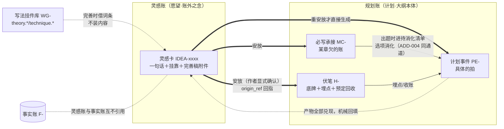

# 「故事真源引擎」灵感账设计稿 R02（IDEA_LEDGER_DESIGN）

身份：**轻档设计稿。** 回应 CZ 点名的产品缺口：作者会冒出便签式的好想法（「未来我要加一个什么样的人物，他有什么样的结局」），产品得能①让他记录、②帮他完善、③找到合适的位置安上去、④最后真正落地。本稿设计这四步的完整生命周期。不是施工合同、不是数据库 Schema；第 7 节字段表是合同的人读版。

## R01→R02 变化清单

R02 按第三册挂账本（`/Users/a1234/挣钱/小说架构/TEMP/bgboard-audit-20260809-r01/26_R09_ADDENDUM_LEDGER_VOL3_20260813_R01.md`，复制用）ADD-030 灵感侧返工，R01 原样保留。变化三组：

1. **placements 多实例（ADD-030.5）**：R01 的单值 `placement` 升为 `placements[]` 列表——一个灵感可以安放三处，每处各自追踪（各自的产物清单、各自的兑现进度、各自可作废）。改动落点：§5.1／§5.3／§7.2／§7.3。
2. **两层状态轴（ADD-030.1/.5）**：「安放」只在规划层——它生成的是计划对象，不制造任何「已发生」；「实际兑现」由**六态对账边**推进——R01 的 realized 判据「产物全部 digested/paid 自动翻」是拿规划层销账冒充兑现（选中≠写成），R02 改为吃产物的**实际兑现态**（对账边判「兑现」／`prose_status` 验证成文／伏笔 payoff 写成）。改动落点：§5.1／§6。
3. **伏笔完成度移交注记（ADD-030.5）**：「伏笔完成度由 payoff contributions 推导」的字段宿主是伏笔账（OUTLINE_STRUCTURE／STORAGE 侧），本稿只消费其推导结果，不在灵感账里建伏笔进度的第二套账——移交注记见 §5.1。

顺向小改一处：`attach_refs` 的人物引用改用 CH ID（ADD-032⑤「CH ID 第一天用」，人物账 R02 已开账）。文末新增「替拍决策记录」。修订处一律标「R02 修订（ADD-0XX，2026-08-13 替拍）」。

上承：[OUTLINE_STRUCTURE_DESIGN_R02.md](OUTLINE_STRUCTURE_DESIGN_R02.md)（规划账结构）、[PLAN_LEDGER_STORAGE_DESIGN_R01.md](PLAN_LEDGER_STORAGE_DESIGN_R01.md)（数据层口径）、[CONTEXT_PACKER_DESIGN_R01.md](CONTEXT_PACKER_DESIGN_R01.md)（执行包纪律）、[STOP_POINT_REGISTRY_R01.md](STOP_POINT_REGISTRY_R01.md)（停点编号）。

---

## 0. 开场画面＋一句话

凌晨一点，作者躺床上刷手机，突然想到：

> 「加一个卖伞的老头，总在雨天出现。结局揭示：他其实是九棺的师父，当年教他抬棺手艺的人。」

这个念头值钱。但他现在只想打完这行字就睡觉——不想选分类、不想回答任何问题、更不想现在决定放第几章。这出戏最后要不要，他自己也不确定。

**灵感账就是接住这类念头的地方**：一句话存进来（零负担）；哪天作者想弄了，点「帮我完善」，AI 拿文学理论和网文技巧把它长成人物卡草案（缺点不能太致命、动机要可共情）；再点「找位置」，系统按故事线、铺垫时机、章容量给出安放建议卡；作者点头，它变成规划账里的伏笔和欠账，走正常创作通道兑现——最后灵感卡上标一行「已落地@第 12 章」。全程四步，每一步都可以停在原地不走下一步。

例子沿用设计稿一族的《万鬼伏藏》（抬棺匠陈九棺，每开一口禁棺，世上多一个忘记他的人），卖伞老头这条灵感贯穿全稿。

## 1. 灵感是什么：身份判据，先把账分清

### 1.1 判据一句话

**看它删掉之后，故事欠不欠账。**

- 删一条**灵感**：谁也不欠。它是还没进故事的愿望，不占槽位、不欠读者、体检不查它、打包器不装它。作者哪天把灵感账清空，故事一个字不用改。
- 删一条**伏笔（H-）**：读者被赖账。伏笔是已经在故事里埋的债——钩子已经（或已计划）亮给读者看，不收就是断线。
- 删一条**计划事件（PE-）**：槽位缺一块。它已经排进某场某拍，在待消化清单里流转。
- **挂件（WG-）**不是内容，是写法指导标签，删了只是少条建议。

### 1.2 四对象对照表

| | 灵感 IDEA- | 伏笔 H- | 计划事件 PE- | 挂件 WG- |
|---|---|---|---|---|
| 一句话身份 | 还没进故事的愿望 | 已在故事里埋的债 | 已排进位置的安排 | 挂在节点上的写法建议 |
| 有位置吗 | 没有（这正是它的定义） | 有埋点＋预定回收位 | 有场/槽归属 | 挂靠任意节点 |
| 欠账吗 | 不欠 | 欠读者 | 欠消化 | 不欠（缺位提醒提一次就闭嘴） |
| 体检管吗 | 不管 | 管（挂着不收亮灯） | 管（消化状态） | 不管 |
| 进执行包吗 | **默认永不**（第 8 节） | 安全摘要按需进 | 待消化清单按需进 | 按挂点进 |

跟材料架也分清（早期捞货 10「素材三层身份」）：**外来素材归材料架，自产念头归灵感账**。两者同属「货架身份」（候选，不是任务），三层映射相同——货架上（raw/shelved）→ 处理现场（寻位建议卡打开时，任务参考）→ 已确认（安放后产物入规划账）。

### 1.3 三条铁律

1. **灵感账不是真源，不进任何下游。** M6 问答、M8 出题、M9 概览、M10 场景卡一概不引用灵感内容；唯一出口是「安放」动作生成的规划账对象。为什么这么狠：灵感常带底牌（「老头是师父」就是底牌），又没有伏笔账那套安全摘要机制护着——不进下游就天然不泄底，也兑现 ADD-007「存而不喂」。
2. **转化单向：灵感 →（安放）→ PE/H/MC，绝不反向。** 伏笔不会「退回」灵感；作废就是作废留痕。原灵感卡永远留在灵感账当愿望的出生证。
3. **追溯靠 `origin_ref`。** 安放生成的每个规划账对象，`origin_ref` 指回 `IDEA-xxxx`（计划事件表现成就有这个字段，扩一种取值即可）——将来作者问「第 12 章这场戏当初是哪个念头长出来的」，一条链拉到底。

命名：内部叫「灵感账」，界面就叫「灵感」（不让用户学新词，同 Q1 命名纪律）；`IDEA-` 前缀**暂定**，交词典 N9 前缀登记表定稿。

## 2. 第一步·记录：零负担

### 2.1 入口在哪（四个，全部现成机制搭车）

| 入口 | 场景 | 依据 |
|---|---|---|
| 画布全局快记键 | 任何界面右下角一个常驻小按钮（或快捷键），点开一个输入框 | ADD-006 画布是真身 |
| 点着对象快记 | 点着陈九棺的卡说「记个灵感」→ 自动挂靠陈九棺 | ADD-006 点哪问哪、聊天框跟随焦点 |
| 聊天框 | 作者在聊天框说「记一下：未来加个卖伞老头……」→ 产出落灵感账，不留气泡 | ADD-006 聊天产出必须落画布 |
| 手机 | 响应式伴侣页的快记框 | ADD-002 Q5 已拍：手机 V0＝查设定＋确认事实＋**记灵感**；捞货 56 同向 |

「写正文时想到」这个高发场景要点破一句：产品不代写、也不内置正文编辑器，作者写正文多半在产品外——所以**手机/网页快记就是写作现场的入口**，别指望作者切回桌面画布再记，念头活不过那趟切换。

### 2.2 最小记录单元

**一句话（`text`）是唯一必填**。可选项只有两个，都是顺手不填也行：

- **挂靠对象**（`attach_refs`）：这条灵感跟谁有关——人物名、故事线、某章槽、某条伏笔都行。打字时 `@陈九棺` 或点选；点着对象快记的自动带上。挂靠是后面「顺手提」的机械索引，不挂就只能靠作者主动想起（完善时模型会顺手建议补挂，见 3.4）。
- **种类**（`idea_kind`）：人物／剧情／设定／画面。可以不选，完善或寻位时再定。

### 2.3 零停顿铁律

记录动作**永远不触发模型调用、不弹任何追问、不要求分类**。「先存下来」是唯一目标——半夜的念头经不起一个多余的问题。记录不是停点、不占停点号（它是作者主动动作，不是系统停下来问人，见第 9 节盘点）。

## 3. 第二步·完善：AI 用真本事（可选，不是流水线）

### 3.1 触发与边界

作者点灵感卡上的「帮我完善」才发生。**完善是可选的，不是必经步骤**——有人就想留一句话，一句话的灵感照样可以直接寻位、直接安放。界面在寻位入口轻提示一次「完善过的灵感寻位更准」，提一次就闭嘴（捞货 46 家法）。

### 3.2 完善吃什么材料

三样，按需取，不全量倒（ADD-007）：

1. **灵感原句＋已有完善稿**（多轮完善时带上一版）；
2. **挂靠对象的当前状态**——从事实账/规划账按需查：陈九棺现在开到第几棺、主线走到哪、挂靠的线是活是收；
3. **写法挂件库的相关词条**——就是 R02 §6 已拍的挂点机制那套开放词表：`theory.*`（文学理论：人物弧光、动机设计）＋`technique.*`（网文技巧：缺点设计、金手指节制、出场记忆点）。完善器按灵感种类挑词条，产出里标注引用了哪几条（`widget_keys`），作者能点开看「这条建议是按哪路理论来的」。

⚠️ **理论/技巧库本身的内容建设是独立工作**——本稿只设计机制（词条怎么被引用、产出怎么标注）；库里装什么词条、词条正文谁来写、质量怎么把关，另开工单，跟「黄金三章模板等 M8 开工时做」（ADD-004 Q7）同族排期。

### 3.3 产出形态：按种类走模板，V0 只做两个

产出是**灵感卡的附件**（`drafts`，带版本），不是新账本、不自动进任何正式账。V0 两个模板：

**人物卡草案**（`idea_kind=人物`）——卖伞老头完善后长这样：

| 格子 | 装什么 | 例子 | 指导颗粒度从哪来 |
|---|---|---|---|
| 定位 | 这人物在故事里干什么用 | 传承线索的钥匙；主角孤立无援期的暗中托底 | `theory.功能性角色` |
| 动机 | 他为什么这么做——**要可共情** | 当年封棺失手害死师兄，赎罪式地暗中护着师兄的孙子九棺 | `theory.动机可共情` |
| 缺点 | **不能太致命**：要能制造麻烦，但不能毁掉功能、不能让读者弃他 | 嘴碎、爱占小便宜，关键情报总要拿三文钱来换——添堵不添恨 | `technique.缺点设计` |
| 与主角的关系弧 | 现在—中期—结局三点 | 陌生怪老头 → 屡次雨天「凑巧」出现 → 揭示师承 | `theory.关系弧光` |
| 结局锚点 | 作者原愿望，原样保留 | 揭示他是九棺的师父 | 灵感原句 |
| 出场记忆点 | 读者凭什么记住他 | 总在雨天卖伞，伞骨全是棺材木 | `technique.出场记忆点` |

**剧情种子卡**（`idea_kind=剧情`）：冲突一句话／需要的前置（什么得先成立）／预期读者效果／大概规模（一场戏、一章还是一条线）／风险。

设定类、画面类 V0 先套自由结构（`template=自由`），模板后补。

### 3.4 完善的三个顺手动作

- **顺手补挂靠**：灵感没挂对象的，完善时模型建议「这条像是挂陈九棺和主线的」，作者点头才挂——救活那些半夜懒得挂靠的卡；
- **顺手定种类**：`idea_kind` 空着的补上；
- **模型冒出的新点子老实标身份**：完善中模型若长出原句没有的成分（「伞骨是棺材木」），产出照记，但灵感卡的 `source_identity` 保持作者（`author_declared`）不变——完善稿只是附件参考，谁说的问题等安放产物入账时再按存储稿 §3.1 规则赋值。

### 3.5 完善稿的最终去向

安放时（第 4 节）可以选「把人物设定收进设定集」——走材料架设定集的既有身份通道（作者声明，INTAKE 稿管细节），让「老头嘴碎爱占小便宜」这类设定进正式参考层；不收就留在灵感卡附件里当私人参考。**不为完善稿发明新的正式账本**——人物系统将来若立项，是另一份设计稿的事。

## 4. 第三步·寻位：核心难题

「未来可能有这么一出戏」怎么找到安放位置。先定死触发纪律，再讲依据和产出。

### 4.1 什么时候找：两个触发，绝不后台常扫

**依据 ADD-007 存而不喂：灵感平时躺账上，寻位时才被查。** 没有任何「后台扫描全账找机会」的常驻进程——那等于让灵感变相常驻执行链，且必然唠叨。

1. **作者主动点「找位置」**（主通道）：灵感卡上一个按钮。这是一次模型调用（同出题量级的小额消耗，作者点的时候知情）。
2. **规划到相关章节时系统顺手提**（辅助通道）：作者编辑某章篮、或 M8 对某槽位出题时，系统跑一次**纯机械匹配**——灵感的挂靠对象 ∩ 该槽位的 `storyline_refs`/`characters`，命中就亮一行角标：「有 1 条灵感挂在陈九棺身上，还没找到家」。零模型成本、零误报源；点开角标才见灵感全文，点「就在这章找位置」才触发模型寻位。这是停点位 **P16**（第 9 节）。

### 4.2 寻位依据：三轴

| 轴 | 判什么 | 材料从哪来 |
|---|---|---|
| 故事线相关性 | 挂靠对象在哪条线、线是活是收——「故事线是第一过滤器」（捞货 14） | 故事线架：`line_status`＋上次现场指针。收束线警告「这条线快收了，要上车趁现在」 |
| 铺垫时机五档 | 太早／偏早／恰好／偏晚／太迟——「现在适不适合把未来安排拿出来埋」（早期捞货 9） | 挂靠人物已出场次数、相关伏笔埋点密度、线进度。⚠️ 五档是**时机事实不是红灯**，太迟也照实说，不进体检灯系统 |
| 字数容量 | 安放会新增场/拍，候选槽装不装得下 | 章篮容量灯（R02 字数预估驱动）：装不下时建议卡自带「顺延一槽」或明说会触发 P3 |

对「揭示类」灵感（卖伞老头这种带底牌的），时机五档天然拆成两问：**揭示位**放哪（太早没铺垫＝突兀，太迟读者已经不关心老头了）＋**铺垫链**怎么排（揭示之前老头得先出现过几次）。这正是伏笔账「埋点＋预定回收位置」结构的用武之地——寻位的产出直接长成一条伏笔。

V0 的时机判定**由寻位模型在建议卡里顺手给档＋理由**，不建独立判定器（那是过度设计；判得准不准，作者看理由自己裁）。

### 4.3 产出：安放建议卡

主建议＋1～2 个备选（D18 族：主建议＋明显不同备选），每个候选带五样（选项要给代价，捞货 45）：

| 格子 | 卖伞老头的主建议 |
|---|---|
| 位置 | 揭示位：S-0012（九棺第二次开棺遇挫、急需传承线索）场 2 前后 |
| 时机档＋理由 | **恰好**——此时九棺孤立无援，师承揭示既解燃眉之急又翻转前情；拖到 S-0015 之后就偏晚，读者对老头的记忆已凉 |
| 铺垫链 | S-0005 雨夜让老头首次出场（卖伞，一面之缘）→ S-0009 二次出场递一句似懂非懂的话 → S-0012 揭示 |
| 消化影响 | 会新建：伏笔 H-0021（底牌：老头是师父；预定回收 S-0012）＋必写承接 MC-0031（S-0005 老头出场）、MC-0032（S-0009 递话） |
| 容量影响＋风险 | S-0005 预估 +600 字，容量灯仍绿；风险：师父线与师妹线在 S-0009 撞车，注意分场 |

建议卡是临时产物（像出题卡），**作者确认才入账**；确认那刻整卡（含未选候选）留进改动流水，没确认就丢弃、不留账——寻位可以再跑，成本小。

### 4.4 安放两档深度：默认轻安放

**轻安放（默认）**：只建「债」不预写「戏」——生成伏笔 H（底牌＋埋点计划＋预定回收位）和必写承接 MC（「S-0005 要让老头出场」），**不预写具体拍**。到 S-0005 真出题时，MC-0031 出现在待消化清单里，选项点名消化它，那一刻才结合当时上下文长出具体的 PE——**灵感落地走的就是选项消化清单同一通道**（ADD-004 Q3 机制原样复用，不另发明对账）。

为什么轻安放当默认：CZ 原话「大概未来可能有这么一出戏，他自己也不确定」——不确定性是灵感的本性。提前半年把每一拍写死，既违背作者本意，也浪费了出题时「结合彼时剧情现挂」的第二次 AI 发挥机会。

**重安放（可选）**：作者已经想得很清楚时，建议卡可以连具体拍（PE）一起排进场。适合「这场戏我连台词都想好了」的灵感。

**确认边界**：安放产物入的是规划账（不是真值账），所以不占真值签字表；但**安放永远要作者显式点「安进去」，不设自动档**——系统顺手提之后自动替作者安放，等于系统静默改规划（N19-B 红线），而且灵感是作者的私念，「他自己也不确定」的事只有他自己能拍。产物的 `source_identity` 按存储稿 §3.1：模型起草的标 `model_suggested`、`origin_ref` 指回灵感卡，作者要认领走既有的来源身份认领通道（那个是真值签字类）。

## 5. 第四步·落地追踪：别让灵感烂在账上

### 5.1 状态机（五态＋多实例，人话在前）——R02 修订（ADD-030，2026-08-13 替拍）

```text
raw 新记 ──安放──▶ placed 已安放（placements 可多条，各自追踪）
   │                  │ 每个安放实例：placed ──该实例产物全部实际兑现──▶ realized
   │                  └ 实例可单独作废（voided，其余实例不受牵连）
   │              卡级 realized ＝ 所有未作废实例都 realized（指向各兑现章节）
   ├──搁置──▶ shelved（可留唤回条件）──唤回复核──▶ raw
   └──作废──▶ voided（留痕不删）        placed/shelved 同样可作废
```

- **placements 多实例**：一个灵感可以安放三处（卖伞老头既埋进主线揭示，又在师妹线借他递一次话）——每处一个安放实例（`pl-1`/`pl-2`…），各自带产物清单、各自追踪、各自可作废。R01 的单值 `placement` 表达不了「安放三处」，升列表。
- **placed 之后，进度不归灵感卡管**——归转化产物管。但「兑现」的判据 R02 换轴：**吃实际兑现态，不吃规划层销账**——
  - PE：对账边判「兑现」，或 `prose_status=written`（验证态）／暗稿作者签字；`digested` 只说明「安排进了章计划」，**不算兑现**（选中≠写成，这正是 ADD-030 打的病）；
  - MC：同 PE（它消化成的 PE 按上条判）；
  - H 伏笔：完成度由 **payoff contributions 推导**（回收场写成了几分）——⚠️ **移交注记**：payoff contributions 字段的宿主是伏笔账（OUTLINE_STRUCTURE／STORAGE R02 侧，随其升版吸收），本稿只消费推导结果，灵感账不建伏笔进度第二套账。
  - 灵感卡角标照旧机械汇总，只是数据源换成上面这些实际态（「铺垫 2/2 已写，揭示待写」——「已写」从此是真的已写）。
- **realized 的翻转仍机械可判**：某实例产物全部达实际兑现态时该实例翻 realized，留痕＋可手动改回；翻的那刻回填该实例 `realized_in`。灵感账不是真值账，自动翻无害——但翻的依据从此挂在对账边上，改一条 F 撤回对账结论时，实例角标跟着自动回退（support_set 机制的余波，零新机制）。
- **作废（voided）留痕**：时间＋可选一句原因。**搁置（shelved）≠ 作废**：「现在不想弄」和「不要了」分开记。

### 5.2 未安放的怎么防遗忘：零唠叨三件套

依据「零唠叨＋豁免」（捞货 21）和「已降级 ≠ 待唤回」（捞货 52），提醒只做三处、全部安静：

1. **常亮角标**：灵感账入口显示「3 条还没找到家」——不弹窗、不推送，路过看得见。
2. **线收束前一行**：作者把某条故事线标收束时，机械查挂该线的 raw 灵感：「师妹线要收了，还有 1 条灵感挂在她身上没安放——收线后就没家可回了」。这是灵感防烂账的最后闸口，提一次就闭嘴。
3. **顺手提（P16）**：见 4.1——规划到相关章节时亮角标，本身就是最自然的防遗忘。

明确不做：定期推送「你还有灵感没处理」（催命）、打开产品就弹清单（打扰）、给 raw 灵感设过期时间（愿望不过期）。

### 5.3 用过的再召回：借阅记录

依据「素材货架＋借阅记录」（捞货 51）：已安放/已落地的灵感再次被点开（或作者想再用同一个点子）时，**卡面首行就是全部去向**：「已安 2 处：S-0012（伏笔 H-0021，已兑现）· S-0019（师妹线递话，待写）」。对 placed/realized 的灵感再点「找位置」，先弹这一行再问「要再安一处吗？」——R02 修订（ADD-030）：多实例是**合法能力**不再是事故，但知情提示保留——寻位小包带上已有实例清单，防几处安放彼此撞车（同一个底牌在两条线各揭一次就是事故，寻位建议卡要看得见前面安过什么）。

### 5.4 搁置与唤回

搁置时可选填**唤回条件**（`wake`）：一句人话（「等主角进京再说」）＋ V0 唯一的机械触发器 `attach_hit`（挂靠对象再次被规划时）。**命中触发器 ≠ 自动恢复**——弹一张复核卡「你搁置的灵感提到了卖伞老头，这章他要出场了，要不要重看？」，作者点头才回 raw（捞货 52 原话照办）。复核卡走 P16 同一档位，不另占号。

## 6. 与现有账本的关系：一张图＋一段话



一段话说清（防第二真源、防混账）：**灵感账是愿望清单，规划账是计划清单，事实账是已发生清单——三本账三种身份，编号前缀分家（IDEA-/PE-·H-·MC-/F-），永不混写。** 灵感想进故事只有一扇门：安放动作（作者显式确认）生成规划账对象、`origin_ref` 回指出处；**安放只在规划层，不制造任何「已发生」**——R02 修订（ADD-030）：「实际兑现」由六态对账边（或作者签字）推进，灵感卡的落地角标吃的是对账结果，不吃「安排了没」。从那之后进度全归规划账与对账边的现成机制管，灵感卡只做被动汇总显示，不产生第二套进度真源。挂件库跟灵感账的关系是借书不搬家：完善时引用词条 key，词条本体永远住在挂件词表里。事实账与灵感账互不引用——灵感永远不是「已发生」的证据，事实也永远不需要向愿望对账。

## 7. 数据形状

### 7.1 存哪：独立文件，不塞进 plan.json

```text
data/<书名>/
  plan.json            规划账（已设计）
  plan_history.jsonl   规划账流水（已设计）
  ideas.json           灵感账主文件（新）
  ideas_history.jsonl  灵感账改动流水（新，纯追加，格式同 plan_history 五件套）
```

为什么独立文件而不是 plan.json 第十三个数组：①**身份不同**——plan.json 顶层有恒为 `"plan"` 的 `ledger` 铁字段，灵感整本是愿望态，硬塞进去要么撒谎要么破例；②**存而不喂物理成立**——打包器读规划账时根本不会路过灵感文件，「默认不装」从文件布局上就成立；③**手机快记安全**——手机端高频写的是这个小文件，写坏了也伤不到规划账主文件。流水单独一份的理由同上：两本账别混流水，撤销域各自清晰。

发号器三道闸（I-014 教训）原样照搬存储稿 §2.3：`id_counters` 领号、写前查重、载入预检。编号 `IDEA-0001` 四位零垫同族风格。

### 7.2 字段表

公共字段沿用存储稿 1.1 的家族约定，**但少一个 `truth_bearing`**：灵感没有真值方向可言（既不是「大纲为真」也不是「正文投影」，它压根还没进故事），顶层 `ledger:"idea"` 铁字段兜住身份。必填＝字段必须在场，没值写 `null`/空表。

**灵感卡 `idea`（IDEA-）：**

| 字段英文名 | 类型 | 必填 | 人话含义 | 例子 |
|---|---|---|---|---|
| `id` | str | 是 | 门牌号 | `"IDEA-0007"` |
| `text` | str | 是 | 一句话本体——唯一必填的内容字段 | `"加一个卖伞的老头……结局揭示他是九棺的师父"` |
| `idea_kind` | enum/null | 是(可 null) | 种类：`character` 人物／`plot` 剧情／`setting` 设定／`scene` 画面 | `"character"` |
| `attach_refs` | list[obj] | 是（可空表） | 挂靠对象，每条 `{kind, value}`；kind＝`character`（**CH ID**——R02 修订（ADD-032⑤），人物账已开账，显示名投影；无卡人名允许暂存字符串、建卡时回补）／`storyline`／`slot`／`hook`／`free` | `[{"kind":"character","value":"CH-0001"},{"kind":"storyline","value":"L-0001"}]` |
| `status` | enum | 是 | `raw` 新记／`placed` 已安放（≥1 个活实例）／`realized` 已落地（全部未作废实例兑现）／`shelved` 搁置／`voided` 作废（留痕） | `"placed"` |
| `drafts` | list[obj] | 是（可空表） | 完善稿附件，每条 `{draft_rev, template, content, widget_keys, created_at}`；template＝`人物卡`／`剧情种子`／`自由`；content 开放结构不枚举校验 | 见 JSON |
| `placements` | list[obj] | 是（可空表） | **安放实例列表**——R02 修订（ADD-030）：每条 `{pl_id 实例号, anchor_slot_ref 揭示/主安放位, position_hint, timing_grade 五档, reason, produced 产物清单[{ref, slot_ref, note}], depth 轻/重, decided_by, placed_at, pl_status placed/realized/voided, realized_in 兑现章位/null}`；实例各自追踪、各自可作废 | 见 JSON |
| `realized` | obj/null | 是(可 null) | 卡级落地回填 `{realized_at}`——全部未作废实例 `pl_status=realized` 时机械翻；**兑现判据吃对账边/验证成文/伏笔 payoff，不吃 digested**（§5.1） | 见 JSON |
| `shelf` | obj/null | 是(可 null) | 搁置记录 `{shelved_at, reason, wake_note 唤回人话, wake_trigger: none/attach_hit}` | `null` |
| `void_note` | str/null | 是(可 null) | 作废原因（voided 时填，可一句话） | `null` |
| `source_identity` | enum | 是 | 谁记的：几乎恒 `author_declared`；模型完善中冒出、作者单独收成新灵感的标 `model_suggested` | `"author_declared"` |
| `created_at`／`updated_at`／`rev`／`note` | — | 是 | 同存储稿家族约定 | — |

**ideas.json 顶层骨架：**

| 字段 | 装什么 |
|---|---|
| `schema` | `"idea-v1"` |
| `ledger` | 🔥 恒为 `"idea"` 的铁字段——整本账是愿望态，防冒充计划或事实 |
| `ideas` | 灵感卡数组 |
| `id_counters` | 发号器：`{"IDEA": 7}` |

规划账侧的配套小改动就一处：`planned_event`／`hook`／`must_carry` 的 `origin_ref` 取值域加一种「灵感卡」（现有值域是书核节拍／卷／伏笔），机械扩枚举，不动结构。

### 7.3 JSON 示例（ideas.json 切片：一条已安放＋一条新记）

```json
{
  "schema": "idea-v1",
  "ledger": "idea",
  "ideas": [
    {
      "id": "IDEA-0007",
      "text": "加一个卖伞的老头，总在雨天出现。结局揭示：他其实是九棺的师父，当年教他抬棺手艺的人。",
      "idea_kind": "character",
      "attach_refs": [
        {"kind": "character", "value": "CH-0001"},
        {"kind": "storyline", "value": "L-0001"}
      ],
      "status": "placed",
      "drafts": [
        {
          "draft_rev": 1,
          "template": "人物卡",
          "content": {
            "定位": "传承线索的钥匙；主角孤立无援期的暗中托底",
            "动机": "当年封棺失手害死师兄，赎罪式地暗中护着师兄的孙子",
            "缺点": "嘴碎、爱占小便宜，关键情报总要拿三文钱来换——添堵不添恨",
            "关系弧": "陌生怪老头 → 屡次雨天『凑巧』出现 → 揭示师承",
            "结局锚点": "揭示他是九棺的师父（作者原愿望）",
            "出场记忆点": "总在雨天卖伞，伞骨全是棺材木"
          },
          "widget_keys": ["theory.动机可共情", "technique.缺点设计", "technique.出场记忆点"],
          "created_at": "2026-08-16 21:10:00"
        }
      ],
      "placements": [
        {
          "pl_id": "pl-1",
          "anchor_slot_ref": "S-0012",
          "position_hint": "场 2 前后",
          "timing_grade": "恰好",
          "reason": "九棺二次开棺遇挫、急需传承线索；S-0015 之后揭示就偏晚",
          "produced": [
            {"ref": "H-0021", "slot_ref": "S-0012", "note": "底牌伏笔：老头是师父；预定回收 S-0012"},
            {"ref": "MC-0031", "slot_ref": "S-0005", "note": "雨夜首次出场（埋点）"},
            {"ref": "MC-0032", "slot_ref": "S-0009", "note": "二次出场递话（加深）"}
          ],
          "depth": "light",
          "decided_by": "author",
          "placed_at": "2026-08-18 23:05:00",
          "pl_status": "placed",
          "realized_in": null
        },
        {
          "pl_id": "pl-2",
          "anchor_slot_ref": "S-0019",
          "position_hint": "师妹线过场",
          "timing_grade": "偏早",
          "reason": "借老头给师妹递一句关于母亲的话——同一人物第二处用法，各自追踪",
          "produced": [
            {"ref": "MC-0040", "slot_ref": "S-0019", "note": "老头向师妹递话（不碰师承底牌）"}
          ],
          "depth": "light",
          "decided_by": "author",
          "placed_at": "2026-08-21 22:40:00",
          "pl_status": "placed",
          "realized_in": null
        }
      ],
      "realized": null,
      "shelf": null,
      "void_note": null,
      "source_identity": "author_declared",
      "created_at": "2026-08-14 01:12:00",
      "updated_at": "2026-08-18 23:05:00",
      "rev": 3,
      "note": ""
    },
    {
      "id": "IDEA-0003",
      "text": "让师妹会一点医术，后面救人用",
      "idea_kind": null,
      "attach_refs": [{"kind": "character", "value": "师妹"}],
      "status": "raw",
      "drafts": [],
      "placements": [],
      "realized": null,
      "shelf": null,
      "void_note": null,
      "source_identity": "author_declared",
      "created_at": "2026-08-12 09:30:00",
      "updated_at": "2026-08-12 09:30:00",
      "rev": 1,
      "note": ""
    }
  ],
  "id_counters": {"IDEA": 7}
}
```

流水动作词（`ideas_history.jsonl`，格式同 plan_history 五件套）：`create`／`update`／`refine` 完善／`seek` 寻位（payload 存整张建议卡，含未选候选）／`place` 安放／`realize` 落地／`shelve` 搁置／`wake` 唤回／`void` 作废／`undo`。

## 8. 与打包器的衔接：存而不喂三条

ADD-007 原话「灵感不能常驻执行包，寻位时才被查」，落成三条：

1. **默认不进包，连索引行都不占。** 灵感账不是 C9 的输入源（打包器输入表维持原样，C9 不用升版）；顺手提（P16）是**纯界面动作**——角标亮在章篮/出题界面上给作者看，不写进给模型的前提包。这样底牌也天然不泄给出题模型（1.3 铁律 1 的执行面）。
2. **作者点名才进，走现成通道。** 作者在出题前点「带上这条灵感」→ 灵感全文（＋完善稿摘要）作为**作者临时约束**进任务卡区——C9 任务卡区本来就收作者临时约束，零新机制。亮不亮牌给 AI，是作者的知情决定。
3. **寻位任务用自己的小包，不借 C9 全套。** 作者点「找位置」时，编一个寻位小包：灵感全文＋完善稿最新版＋**已有安放实例清单（位置＋产物＋兑现进度——R02 修订（ADD-030）：防多实例撞车）**＋候选范围的胶囊层材料（各候选槽的章胶囊、线状态与上次现场、容量灯读数、相关伏笔的埋点/回收位——D1/D2 档为主）。这就是「寻位时才被查」的正面形态：查也只查胶囊层，不拖全账。
4. （已安放灵感的产物 H/MC/PE 进不进包，归它们自己的身份管——待消化清单、安全摘要，全是现成规则，跟灵感账无关了。）

## 9. 停点与档位

### 9.1 新停点：建议领 P16（按注册表格式给行，落号归注册表承办）

| 编号 | 停点名（人话） | 在哪触发 | 省心档默认 | 掌控档默认 | 能不能改档 | 出处·状态 |
|---|---|---|---|---|---|---|
| P16 | 灵感顺手提（这章能安你的灵感） | 编辑章篮／M8 对某槽出题时，机械命中灵感挂靠；shelved 唤回复核卡同族同档 | 提醒不停（角标一行，提一次就闭嘴） | 提醒不停 | 可关成「仅手动找位置」；**不设自动档**——安放永远显式确认（N19-B 系统不得静默改规划＋灵感私念只有作者能拍） | 本稿 §4.1/§5.4〔候选〕 |

### 9.2 盘点过、不占号的（照注册表「盘点过不占号」体例）

- **记录**：作者主动动作，零停顿铁律（§2.3），不是停点。
- **完善**：作者主动点的查询类动作，产物是附件不改正式账；单次小额消耗同出题量级，不够 F 类花钱确认的门槛（F 类管的是体检/整本工程那种大额）。
- **安放确认**：作者发起动作的完成键，永远显式、不进档位系统——同「伏笔改期/作废是作者主动编辑动作」判例。
- **realized 自动翻**：机械可判＋留痕＋可改回，灵感账非真值账，不需要停。
- **线收束前提醒**：天生提醒不停、提一次就闭嘴——同「模板缺位提醒」判例。

### 9.3 真值边界重申（只说一次）

灵感全生命周期不碰真值账：记录、完善、安放改的都是灵感账和规划账；唯一挨着真值签字的位置是安放产物的**来源身份认领**（`model_suggested` 升 `author_declared`），那走注册表第 2 节第 6 行的既有通道，本稿不新开门。

## 10. V0 最小闭环 vs v2

**V0 做**（一条线跑通「记→完善→寻位→安放→落地回填」）：

- 四入口快记（画布快记键、点对象快记、聊天框、手机伴侣页）；一句话＋可选挂靠；
- 完善：单轮直出，两模板（人物卡／剧情种子），词条引用标注；
- 寻位：手动「找位置」＋顺手提机械匹配（顺手提施工搭 M8 的车，同打包器先例——模块边界第一天画，施工排进消费者的单）；建议卡主＋备选、时机五档标注、铺垫链、轻安放默认；
- 落地：五态状态机、产物状态机械汇总角标、realized 自动回填、借阅提示、线收束前一行提醒；
- 数据：ideas.json＋ideas_history.jsonl＋三道闸。

**v2 标清**（登记不实装）：

- 对话式多轮完善（模型追问再出稿——见开放问题 O2）；
- 唤回触发器扩展（V0 只有 `attach_hit` 一种；到点提醒、事实条件命中等后补）；
- 跨书灵感池（见 O1）；
- 灵感批量整理器（几十条乱灵感 AI 帮着归堆去重）；
- 铺垫时机五档的独立机械判定器（V0 由寻位模型顺手给档；等积累了「模型判档 vs 作者改档」的数据再谈要不要机械化）；
- 手机断网暂存本地、联网再同步（V0 在线即可）。

⚠️ 再钉一次：**理论/技巧库的内容建设是独立工作**，不在本稿也不在上面任何一期里——机制好了没词条，完善就是空转，这个依赖要在排期时明列。

## 11. 开放问题（交 CZ 拍）

**O1｜灵感还没想好给哪本书，记在哪？**
场景：作者正写《万鬼伏藏》，半夜冒出来的点子其实更适合将来的新书——「写一个开出租的女司机，乘客全是死人」。现在的灵感账跟着书走（`data/<书名>/ideas.json`），这条记进《万鬼伏藏》名不正言不顺。
- A. V0 就是跟书走：先记在当前书，将来想给新书用，复制一句话过去（灵感本体就一句话，搬家零成本）
- B. 做全局灵感池＋「归书」动作：池子跨书，安放时才归属某本书
- 👉 推荐 A：数据层现行格局是按书分目录，跨书池要动账本域，为一个低频场景 V0 就跨域不值；先用「搬家零成本」兜住，等真有作者喊「我灵感全在池里分不清」再上 B。

**O2｜完善是一轮直出，还是允许模型先追问？**
场景：「让师妹会一点医术」这条太薄，模型直出的人物卡多半是套话；要是允许它先反问两句（「医术是家传还是奇遇？要不要跟主线的『遗忘』代价勾上？」）再出稿，质量会好很多——但流程从「点一下等结果」变成「来回聊几轮」，零负担的手感会变重。
- A. V0 一轮直出：不满意就再点一次（每轮留版本），简单可预期
- B. 允许追问：完善变成对话式，出稿前最多问两个问题
- 👉 推荐 A 起步：完善本来就是可选步骤，先保「点一下就有」的轻手感；追问式做进 v2，且做成作者可选的「细聊模式」而不是默认——跟停点哲学同向，省心档少问，想细控的人自己开。

**O3｜防遗忘提醒，除了常亮角标，要不要在关键时机多提一句？**
场景：写到 40 章，灵感账里躺着 5 条没安放的。纯靠角标，作者可能几十章都想不起来点开；可提醒多一处就唠叨一分。现在稿里定的是「角标＋线收束前一行」两处。
- A. 只留常亮角标（最零唠叨；线收束提醒也砍掉）
- B. 角标＋线收束前一行（本稿现案）：收线是灵感「没家可回」的最后闸口，错过基本就烂账了，值得提一次
- C. 再加卷末盘点一行（「本卷收官，灵感账还有 5 条没找到家」）
- 👉 推荐 B：线收束的提醒有明确的「再不提就来不及」依据，不是定期唠叨；卷末盘点跟角标信息重复，先不加，等真实用户抱怨「忘了灵感」再考虑 C。

## 12. 轻档自查记录

- 生命周期四步逐项对照过任务书：记录（§2 入口/最小单元/零停顿）、完善（§3 材料/模板/颗粒度/可选性/库独立标注）、寻位（§4 触发/三轴/建议卡/确认边界）、落地（§5 状态机/防遗忘/借阅/作废搁置留痕）——无缺项。
- 身份区别（灵感 vs 伏笔 vs 计划事件 vs 挂件）用「删了欠不欠账」单一判据贯穿，§1 表格与 §6 关系图口径一致。
- 每个决策带出处：ADD-004（消化同通道）、ADD-005/注册表（P16 格式与不占号判例）、ADD-006（入口三原则）、ADD-007（存而不喂三条）、捞货 45/46/51/52、早期捞货 9/10、存储稿（字段家族/三道闸/origin_ref）、N19-B（不静默改规划）。
- 没发明新拍板：IDEA- 前缀标暂定交词典 N9；P16 标候选交注册表落号；C9 不升版（复用任务卡区临时约束通道）；模块归属不发号（完善/寻位挂哪个模块，交 ARCHITECTURE 挂线时定）。
- JSON 示例与字段表逐一对照过：字段集合一致、枚举值在值域内、`IDEA-0007` 的 placement.produced 与 §4.3 建议卡例子对得上；示例 JSON 机械可解析。
- 一处家族偏离已写明理由：灵感卡不带 `truth_bearing`（§7.2 开头）。
- R02 增量自查：ADD-030 灵感侧三件逐项回对（placements 多实例 §5.1/§7.2/§7.3 双实例示例／「安放只在规划层」§6／realized 判据换轴吃对账边不吃 digested §5.1）；伏笔完成度移交注记就位（§5.1，宿主=伏笔账）；JSON 与新字段表逐格对照，`pl-1`/`pl-2` 各自追踪且 IDEA-0003 空表合法；借阅提示与多实例的关系已改写（§5.3）。

## 13. 来源与追溯

- [OUTLINE_STRUCTURE_DESIGN_R02.md](OUTLINE_STRUCTURE_DESIGN_R02.md)：写法挂点机制（§6，完善的词条来源）、伏笔账结构（§3.7，寻位产物的容器）、故事线架、选项消化清单（§4）、容量灯。
- [PLAN_LEDGER_STORAGE_DESIGN_R01.md](PLAN_LEDGER_STORAGE_DESIGN_R01.md)：公共字段家族、ID 规则与三道闸、`origin_ref`、流水五件套、`source_identity` 赋值规则。
- [CONTEXT_PACKER_DESIGN_R01.md](CONTEXT_PACKER_DESIGN_R01.md)：C9 任务卡区（作者临时约束通道）、回取纪律、胶囊分档（寻位小包用 D1/D2）。
- [STOP_POINT_REGISTRY_R01.md](STOP_POINT_REGISTRY_R01.md)：P16 领号规矩（§5 新停点怎么登记）、不占号判例（模板缺位/伏笔改期）、真值签字第 6 行（来源身份认领）。
- 挂账本（小说架构仓，路径含中文，复制用）：`/Users/a1234/挣钱/小说架构/TEMP/bgboard-audit-20260809-r01/18_R07_ADDENDUM_LEDGER_20260813_R01.md`——ADD-002 Q5（手机记灵感）、ADD-004（选项消化清单）、ADD-005（停点即设置）、ADD-006（交互三原则）、ADD-007（存而不喂，本稿的第一约束）。
- 考古捞货（同上仓，复制用）：`.../19_NOTION_V2_SALVAGE_20260813_R01.md`——概念 45（选项给代价）、46（不唠叨不追旧账）、51（素材货架＋借阅记录）、52（已降级≠待唤回）、56（手机=灵感）；`.../20_NOTION_REQUIREMENTS_SALVAGE_20260813_R01.md`——概念 9（铺垫时机五档）、10（素材三层身份）。
- CZ 原话（本稿任务书）：便签式想法四步——记录／帮他完善（文学理论＋网文技巧）／找位置安上去／定期让人物出场。
- 第三册挂账本（小说架构仓，路径含中文，复制用）：`/Users/a1234/挣钱/小说架构/TEMP/bgboard-audit-20260809-r01/26_R09_ADDENDUM_LEDGER_VOL3_20260813_R01.md`——ADD-030（R02 主修订源）、ADD-032⑤；判词细节见组 A 消化稿（`.../external_returns_batch2_20260813/digest_A_ledger_architecture.md`，复制用，回包一 #20「伏笔/灵感只有三态」判 ACCEPT）。

来源：Cursor（Fable 5 Max）设计，2026-08-13；待 CZ 拍 O1–O3。

## 替拍决策记录（R02，2026-08-13，CZ 可逐条改判）

1. **实例号形状 `pl-数字`**：卡内自编不占全局前缀（同章工作台草稿号 `d-` 先例）；跨处引用写全称 `IDEA-0007#pl-2`。
2. **卡级 `status` 与实例 `pl_status` 的关系**：卡级 placed＝≥1 个活实例；卡级 realized＝全部未作废实例 realized；某实例作废不牵连其他实例、不改卡级状态（除非作废后活实例归零，卡退回 raw——退回留痕）。
3. **兑现判据的三条腿**（挂账本只说「对账边推进」，落枚举是替拍）：PE 吃对账边「兑现」或 `prose_status=written(verified)`／暗稿签字；MC 随其消化成的 PE；H 吃 payoff contributions（宿主在伏笔账，本稿只读）。
4. **多实例撞车防线放在寻位小包**（不建新检查器）：寻位建议卡看得见已有实例清单，撞不撞车由模型顺手提示＋作者裁——同「时机五档不建独立判定器」的克制。
5. **`attach_refs` 的 CH ID 迁移是软迁移**：有卡人物用 CH ID，无卡人名暂存字符串、建卡时回补——不为灵感快记加「必须先建人物卡」的负担（零停顿铁律优先）。
6. **对账结论被撤回时实例角标自动回退**：复用对账边 support_set 撤回机制，灵感账零新机制——这是「派生结论带支持集」在灵感侧的免费红利。

修订记录：
- R02 修订 20260813：按第三册挂账本 ADD-030 灵感侧返工（变化清单见文头）；替拍授权 CZ 2026-08-13 上午原话，全部条目可改判。
