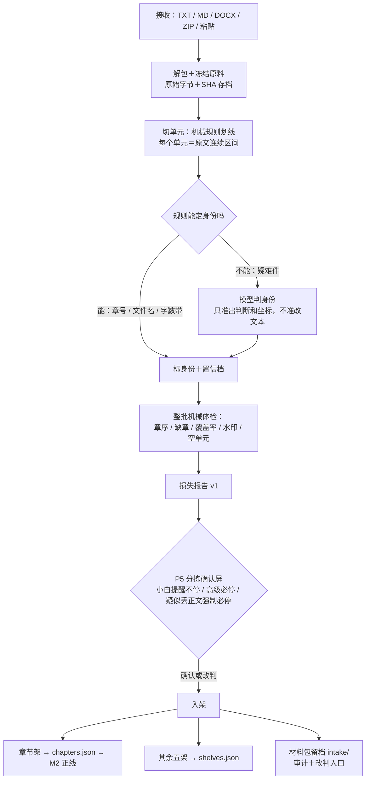

# M1 导入器·材料架分拣设计稿 R03（含 C1 v1 合同建议）

身份：**轻档设计稿。** 第三版清旧句。黄金三章是独立工作台，不是免费额度；收费数字仍冻。`chapters.json` 只收章节书稿，大纲进材料架／规划侧。历史稿 [INTAKE_SHELVES_DESIGN_R02.md](INTAKE_SHELVES_DESIGN_R02.md)／[R01](INTAKE_SHELVES_DESIGN_R01.md) 保留不动。C1 v0 仍描述当前代码；v1 方向见合同文首读法。标 ⚠️ 未调查 的解析细节，动手前必须先实测。

引用简写：「挂账本」＝小说架构仓 R07 增补挂账（ADD-XXX）；「19 号捞货」＝Notion v2 总库捞货（概念 1–59）；「20 号捞货」＝Notion 早期 requirements 捞货（概念 1–10）；「I-XXX」＝本仓 [ISSUES.md](../ISSUES.md) 台账。完整路径见第 9 节。

---

## 0. 一句话＋一张图

M1 是产品的**进货口＋安检台**：作者什么都能往里丢——TXT、MD、DOCX、ZIP、纯粘贴，一个文件里混着书名简介正文设定都行（ADD-003 原话「一份材料里可能混着多种身份的内容」）。M1 负责拆开、认出每块材料的身份、给作者一屏过目，然后各归各架。全程一条命根子规矩：**一个字都不许静默弄丢**——把正文丢掉或错拆是最严重事故，宁可标不确定让作者点一下（ADD-003 铁规 2，本稿所有防线都从这条长出来，下文只以「铁规 2」代称，不再复述）。



在线路图的位置：M1 吐 C1 给 M2（[ARCHITECTURE.md](../ARCHITECTURE.md) 线路图）。v1 之后 C1 从「一章的标准形态」升级成「一次导入的标准形态」（材料包），但**只有章节架流向 M2 正线**，这一点 v0 v1 不变。

## 1. 分拣管线：从文件进来到入架的六步

### 1.1 接收与解包（机械）

按扩展名＋文件头路由：TXT/MD 直读、DOCX 走 zip+xml 抽文本、ZIP 递归解包（限深 2 层）、粘贴按文本。各格式的具体策略和坑集中在第 4 节，这里只定一条结构规则：**解包产物统一变成「原料」清单**，每份原料记来源链（ZIP 内文件记父包），后面所有步骤只认原料，不再回头碰上传的文件本身。

### 1.2 冻结原料（机械；一切审计的地基）

每份原料落 `raw/`：原始字节、SHA-256、来源名、编码判定结果。两个为什么：

- 「冻结正文是最终证据：SHA／坐标／版本」（19 号捞货概念 1）——章节架入架后就是全线的证据底座，底座必须从进门第一刻就冻住；
- 更实际的：**没有冻结原料，就没法机械证明「没丢字」**。后面每个单元都带 source_ref（来自哪份原料、第几到第几字符），把所有单元的区间并起来跟原料全文对账，缺口就是疑似丢失。铁规 2 的零容忍不能靠嘴保证，靠这本覆盖账。

⚠️ 现状代码有一颗正在服役的雷：[ingest.py](../mvp/ingest.py) 第 32 行 `errors="ignore"`——GBK 编码的 txt 被当 utf-8 硬读时，解不出的字节**静默扔掉**，极端情况整章只剩标点和换行。这正是「静默丢正文」事故的现行版本，v1 第一刀砍它（编码防线见 4.0）。

### 1.3 切单元（机械规则，模型禁入）

一份原料切成若干候选单元。信号：行首章号模式（第X章／回／节、Chapter N、独立数字行）、MD 标题行、连续空行块、字数突变。

一条硬规则：**切分只按机械信号划线，模型不参与切分。** 每个单元必须是原文的连续字符区间（记 start/end），可随时从冻结原料回放。为什么这么狠：模型「整理」文本的方式是复述，复述就有丢字改字的风险；规则划线不产生任何新文本，天生满足铁规 2。模型后面只被允许干两件事：判身份、提边界坐标（1.4）。

### 1.4 识别身份（规则先行，模型只接疑难件）

每个单元赋予六架之一或「不确定」，带置信档。分工表：

| 判断点 | 谁来做 | 依据信号 | 为什么这么分 |
|---|---|---|---|
| 格式路由、解包 | 规则 | 扩展名＋文件头 | 纯机械 |
| 切单元划线 | 规则 | 章号行／标题行／空行块 | 见 1.3，模型禁入 |
| 章节身份（有章号信号） | 规则 | 行首「第X章」模式＋字数落在正文带 | I-001／I-006 证明文件名不可信，内容里的章号行是最硬的信号 |
| 章序、缺章、覆盖、空单元 | 规则 | 章号序列＋区间并集 | 可机械证明的事不请模型（I-002／I-012） |
| 水印候选 | 规则 | 跨章重复短行＋非叙事词表 | 重复性是机械信号（I-003） |
| 简介 vs 正文 vs 大纲 vs 设定的边界（无章号的叙述文本） | **模型** | 疑难件文本 | 这是语义边界：营销话术、压缩叙述、说明文、叙事文——几百字时规则分不动，ADD-003 点名的难点 |
| 混合文件内部的边界微调 | **模型提坐标 → 规则校验** | 全文＋初切结果 | 模型只准回「第 N 行是分界」这类坐标，程序校验区间连续、无重叠、无缺口后才采纳 |
| 档案表浅扫＋设定子类 | **模型搭车** | 已读单元 | 19 号捞货概念 26：类型／主角／金手指浅层可扫；只摘材料里明说的，拿不准留空 |

流程：规则能定的直接定（置信档 auto）；剩下的疑难件攒一批喂模型（省调用次数和积分）；模型给身份＋自评，程序再拿机械信号交叉校验——模型说是章节但没有章号且只有 300 字，降档进「请看一眼」。模型输出永远是候选，不碰文本本身。

置信档只有三档（数值分数留内部字段，不给作者看）：`auto` 规则命中或模型高自评且信号一致；`review` 信号打架，请作者看一眼；`unsure` 认不出，进不确定栏。⚠️ 三档之间的数值阈值、正文字数带的上下限，都要拿库里六本书＋新书榜脏样本实测标定，本稿不编数。

### 1.5 整批机械体检＋损失报告（机械）

单元定完身份后，整批过四本账，结果全部写进损失报告 v1（字段见 5.2）：

1. **章序审计**：按内容解析的章号排序、查连续性。缺章（I-002）、章号与文件名序矛盾（I-001 的 0001 文件实际是第六十七章）、章号重复（同章重导）分别记录；
2. **覆盖审计**：每份原料的非空白字符是否都被某单元覆盖或显式判丢弃，缺口记坐标和原文；
3. **水印候选**（I-003）：跨章重复的短行（「本章完」「求收藏」类），v1 默认**只标不剥**——剥错等于丢正文，任何剥离都要作者在确认屏点头（小白档的两难见开放问题 O2）；
4. **空单元**（I-012）：正文全空白的单元不入架，进警告。

### 1.6 P5 分拣确认屏 → 入架

第 3 节整节详述。入架动作：章节架 → `chapters.json`（只收章节书稿）；大纲区 → 材料架／规划侧，**不得**占用实际章节序列；书名卡／简介卡／类型标签／设定集 → `shelves.json`；材料包本体全程留在 `intake/`，当进货台账和事后改判的入口。当前代码若仍把 `kind=outline` 写进 `chapters.json`，那是 v0 现状，不是 v1 方向。

### 1.7 量闸（ADD-002 拍板的落地位）

- **黄金三章工作台**：前三章在独立工作台打磨，满意后移交进小说项目。导入器可以先只收前三章进这张台，但这是工作台身份，不是「免费额度用完再付费解锁其余章」。收费数字仍冻，本稿不拿付费墙决定入架。
- **普通导入**：正文章超过 10 → 确认屏切换成「大工程预告」：报识别出的规模、预估积分和时长（预估制是 ADD-002 拍的），作者选「先导前 10 章看效果」或「进大工程批处理」。M1 只负责识别规模＋引流，大工程批处理本体不在本稿。

## 2. 六架的字段设计

总原则两条：

1. **不确定留空不猜**（19 号捞货概念 26）：每个字段宁可空着，不填模型猜的值；模型建议的值必须带来源标签，跟作者填的、文件里带的分开存。
2. **架子身份 ≠ 真值身份**（ADD-003 铁规 3）：入架只等于「材料放对了地方」，每架另有自己的真值路径，见下表最后一列。

### 2.1 单元通用字段（六架共享）

| 字段 | 含义 |
|---|---|
| unit_id | 单元号，包内唯一 |
| shelf | 架子身份：`title` / `blurb` / `tags` / `chapter` / `outline` / `setting`，另有 `unsure`（待分类）和 `discard`（判丢弃——丢弃也显式可见，不静默） |
| text | 原文连续区间，未改写 |
| source_ref | 冻结原料坐标：source_id＋start＋end |
| confidence_band | `auto` / `review` / `unsure`（内部可另存数值分） |
| review_reason | 黄标必须带一句人话理由（见 3.2） |
| decided_by | 谁定的身份：`rule:模式名` / `model:模型名` / `author` |
| status | `candidate` 分拣中 / `shelved` 已入架 / `parked` 搁置（超量暂放；不是付费墙已拍）/ `discarded` 已丢弃 |

### 2.2 逐架专有字段

| 架子 | 专有字段 | 谁消费 | 真值路径 |
|---|---|---|---|
| 书名卡 | 无（text 即书名）。多个书名候选冲突时全降 `review`，不自动选 | 全局展示、档案表 | 作者可直接改，改了即准（展示层，低影响） |
| 简介卡 | 无。**铁规：不流向 M3 抽取、不进事实账、M7 体检不引用**——详情页文案可能与剧情毫无关系（ADD-003 六架定义原话） | 展示层 | 无真值化路径，永远只是文案 |
| 类型标签 | tags[]，每个 tag 带 origin：`file`（材料里写着）/ `model`（浅扫建议）/ `author`；含「疑似衍生」标记（I-005：综漫／×／同人等信号，只标不处理） | 展示层、M8 规划参考 | 作者勾选确认；模型建议的 tag 不确认不生效 |
| 章节架 | chapter_no（内容解析的章号）、title、title_source（`content` / `filename` / `assigned` 兜底序号）、watermark_spans[]（水印区间标注，默认只标不剥） | **M2 切窗 → M3 抽取，唯一流向正线的架子** | 冻结正文即最终证据（概念 1）；里面的「事实」要走 M3→M5 确认才进真值 |
| 大纲区 | source_identity 恒＝`author_import`（作者声明）；scope_hint（全书／分卷／不明，可空不猜） | 规划账组织（大纲设计稿 R02）、M8 对照 | 「作者声明的参考材料」；组织进规划账走规划侧自己的确认，不在 P5 里顺手办 |
| 设定集 | subtype（等级体系／金手指／系统／朝代／世界规则／其他，模型建议可空）；source_level 恒＝`imported`；promoted 默认 false | M8 规划参考、M7 体检对照 | 入架即「导入设定」＝世界规则四级来源的**第三级**（19 号捞货概念 17），默认不做硬约束；作者逐条升级为「作者声明」是真值签字动作，走设定集自己的确认流程 |

大纲区多说一句（19 号捞货概念 25）：大纲区**只收作者带进来的大纲**。产品自己从正文反推的东西叫「反向剧情图」，是 M8/M9 侧的产物，**不入大纲区**——AI 推断不冒充作者意图，两者在界面上也要能一眼分开。

### 2.3 书籍档案表候选（封面卡，不是第七个架子）

对齐 19 号捞货概念 26 的「书籍档案表」：类型、主角及别名、金手指、主要配角 3–5、单主角或群像、氛围基调——**不确定留空，不猜**。它是六架之上的一张项目级封面卡，不另设架子：

- 书名、类型 ← 书名卡、类型标签直供；
- 主角、金手指 ← 只从材料**明说处**浅扫（简介里写着「主角陈九棺」、设定集里写着「签到系统」才填），每个值带 origin 指回架子单元或模型浅扫；正文推断一律不做——那是 M3 之后的事；
- 浅扫搭 1.4 疑难件模型调用的车，不另起调用。

为什么要这张卡：确认屏顶上放它，作者第一眼就能判断「它认对了我的书没有」——这是免费层「导前三章看效果」动线里最早的一次效果体感（ADD-002）。概念 26 的七臂实验也说类型＋主角＋金手指这三样最省且并列最优。

### 2.4 设定集要不要按「Bible 两轴」预留字段——定了：v1 不带，v2 再上

两轴＝读者可知 × 世界内多硬（20 号捞货概念 4：世界怎么运转，和作者希望系统怎么写，不是一类事实；角色台词不能自动立法）。决策：

- **v1**：设定集只做**块级入架**——原文块＋subtype＋source_level，不拆条、不带两轴字段；
- **v2**（合同升版时一并做）：拆条＋`hardness`（硬规则／软设定／背景说明）＋`reader_visibility`（已揭示／未揭示），外加概念 17 配套的「导入设定字数上限」「长期无人引用标 unused、不进上下文」。

为什么押后：a) 两轴的消费者是 M7（区分「违反硬规则」和「碰了作者禁写」）和 M8 防泄底，都还没开工，字段先定容易白定；b) 给设定逐条标两轴是「重点细拆」档的深加工，不是入架动作——入架时逼作者标轴，等于把 P5 确认屏变成设定工作台，一屏就装不下了；c) 合同里放空字段有毒（消费者会去读、然后各自猜语义），在合同文档里**预告**比在数据里**预埋**干净。

## 3. 分拣确认屏（停点 P5）

### 3.1 一屏放什么

```
《万鬼伏藏》 悬疑·灵异·无限流          本次导入：4 个文件 → 12 个单元
┌ 请看一眼（1）──────────────────────────────
│ ⚠ U-002 「一口棺材，葬尽天下鬼……」412 字
│    判成【简介卡 ▾】，理由：营销句式为主，但末段像连续叙事
├ 待分类（1）────────────────────────────────
│ ？U-009 「本朝以孝治天下……」1,219 字
│    没认出来【待分类 ▾】：像朝代设定，也像作者随笔
├ 章节架（8）第 1–8 章 ✓ 连续无缺 ─────────［点开逐章看］
├ 简介卡（1）· 类型标签（1）· 设定集（2）✓ ──────────
└ ［全部入架］ ［逐架确认］ ［取消导入］
```

- **顶**：档案表候选一行（书名·类型·统计）——「它认对了吗」的第一眼；
- **中**：**异常置顶、正常折叠**。「请看一眼」（review）和「待分类」（unsure）逐条摆出来，每条带机器的一句人话理由；正常的章节折叠成「第 1–8 章 ✓」，点开才逐章看；
- **底**：全部入架／逐架确认／取消，三条出口。

为什么异常置顶正常折叠：I-008 的教训是 102 条逐条确认没人受得了；19 号捞货概念 39 也说「高影响才请作者确认，不要审几千条」。这一屏的性质对齐 20 号捞货概念 6 的「连排预览」——它回答「这批材料认得对不对」，不回答「哪条事实是真的」（那是 M5 审查台的事，两道闸别混）。

### 3.2 置信度怎么表达：三档视觉语言，不给数字

`auto` 无标记直接列在架子里；`review` 黄标＋一句机器理由；`unsure` 进「待分类」栏。数值分数是内部字段，永远不上屏——作者不该学「0.83 是什么意思」。黄标必须带人话理由（「营销句式为主，但末段像连续叙事」），说不出理由的降不了作者的判断成本，等于噪音。

### 3.3 改判怎么操作：点选换架为主，拖拽当快捷，批量必备

- **单条改判**：行卡上的架子标签就是下拉（六架＋丢弃），点开换。为什么下拉优先于拖拽：手机端 V0 是响应式网页伴侣（ADD-002），拖拽在触屏小屏上误操作率高，下拉两端通吃；桌面端拖拽可以加，但只当快捷方式，不当唯一通路。
- **批量**：多选 → 统一换架，应付「这 20 个文件全是章节」。
- **合并／拆分**：多选合并成一章（对付切碎了的）；「拆分」进对照视图点分界行（v1 最简版只支持按行划界——单元＝原文连续区间，划界即拆，不产生新文本，铁规 2 天然满足）。
- 所有改判即时写回材料包并留痕（decided_by 换成 author，p5_log 记一笔）；**入架后回访本屏仍可改判**，改判的下游牵连见开放问题 O3。

### 3.4 P5 三档在这一屏的表现（ADD-005）

| 档位 | 表现 |
|---|---|
| 小白／免费默认：**提醒不停** | 不弹屏。自动分拣直接入架、流程继续（比如接着抽取），顶部横幅「已自动入架：8 章正文＋1 简介＋2 设定 ✎ 查看／修改」，点开即本屏，随时回访改判 |
| 高级作者默认：**必停** | 导入后必进本屏，逐架确认（每架一个「本架无误」勾），全勾才入架 |
| **强制必停**（无视档位） | 见 3.5，不可被任何档位或 `--yes` 绕过 |

**跟铁规 1「作者一屏确认后才入架」怎么兼容**（这是本设计必须正面回答的一处张力）：ADD-005 晚于 ADD-003 同日拍板，把分拣确认定为停点位 P5 并给了小白放行档。本稿的落法是——小白档把「确认」**后置**而不是取消：入架的单元始终是候选身份、全程留痕、随时可撤销改判；真值身份从未被授予（章节进抽取产的也全是候选，要过 M5 审查台）；而高影响错误（疑似丢正文）不参与放行，直接强停。这正是 ADD-005 边界原话的落地：「小白路径放行的是过程中的选择停顿，不是真值签字」。

小白档还有一个特殊升格：**疑似正文的待分类单元**。unsure 单元本身没有丢——它可见地挂在待分类栏。但小白档不停，没人去看，一段疑似正文躺在待分类栏就等于永远进不了抽取正线，功能上跟丢了一样。所以规则是：unsure 单元字数落在正文带（❓ 阈值待标定）时，升格触发强制必停；其余 unsure 安静挂着等回访，不阻塞别的单元入架。

### 3.5 「疑似正文丢失」的强制必停长什么样

**全屏拦截，不是横幅**——不能被「下一步」滑过去。触发条件全部机械可判，不依赖模型：

1. **缺章断档**（I-002）：章号序列有洞；
2. **覆盖缺口**：某原料的非空白字符没被任何单元覆盖、也没被显式判丢弃，超过阈值（❓ 建议单源超 200 字或 5%，待标定）；
3. **章序矛盾**（I-001）：内容章号与文件名序严重冲突（0001.txt 里写着第六十七章）；
4. **整源解码失败或疑似乱码**（4.0）：同属丢正文风险；
5. 小白档下「疑似正文的待分类单元」（3.4 的升格）。

长这样（文字稿）：

```
⛔ 先停一下：疑似有正文没接住
① 缺第 3 章——第 2、4 章都识别到了，中间断档
② 「番外合集.txt」有 4,200 字没归进任何单元
［逐条查看对照］ ［都没问题，照此入架］ ［取消本次导入］
```

- **逐条查看对照**：左边冻结原料原文、右边已切单元，未覆盖区间高亮——作者亲眼看那 4,200 字是什么，可当场划给某个架子；
- **都没问题，照此入架**：作者签字放行。材料包记 waiver（哪条、谁、何时、备注），同一份材料重导不再拦同一条。为什么给放行出口：真实世界就是有「本来就没写第 3 章」（I-002 那两本书未必是导入弄丢的）；不给出口作者被卡死，给出口但留痕，正是铁规 1「结果永远候选＋作者确认」的本意；
- **取消本次导入**：整包退回，什么都不入架，冻结原料保留。

## 4. 格式解析的现实边界

### 4.0 编码防线（所有文本格式共用，最大的丢字源）

试探顺序：utf-8 严格 → gb18030 → utf-16（带 BOM）。两个诚实声明：

- ⚠️ gb18030 几乎什么字节序列都能解出点东西，「解码成功」≠「解对了」——还需要乱码启发式（比如常用汉字命中率），这套启发式**未实测**，阈值要拿真书标定；
- ⚠️ 要不要引 chardet 类第三方探测库未调查；倾向先标准库试探＋启发式，实测不够再说。

整源解码失败或疑似乱码 → 走强制必停（3.5 第 4 类）。**绝不 `errors="ignore"` 硬吞**——现状那行代码 v1 必须砍（见 1.2）。

### 4.1 TXT

- 切章靠行首章号模式库：`第[一二三…〇0-9]+[章回节卷]`、`Chapter\s*\d+`、独立数字行等。防误伤：行首锚定＋标题行长度上限（正文里「他想起第三章的内容」不在行首、行也长，不会误切）。⚠️ 模式库覆盖率未实测——下一步拿库里六本书＋新书榜脏样本跑通过率；
- I-006 兜底链（文件名没章号时）：内容首行找章号 → 文件名里找数字 → 都没有就按导入顺序赋 `assigned` 序号＋黄标「章号未识别」，让作者在确认屏看一眼。

### 4.2 MD

标题行（#）优先当切分信号；网文材料里规范 MD 少见，无标题时退化为 TXT 策略。代码块围栏里的「第X章」假标题要跳过——对小说材料罕见，一句话防线，不展开。

### 4.3 DOCX：标准库 zip+xml 可行，边界如下

docx 就是个 zip 包，正文在 `word/document.xml`，`w:p` 是段、`w:t` 是文本片段——标准库 `zipfile`＋`xml.etree` 抽主文档流纯文本**可行，是成熟做法**。防线与已知坑：

- 段落重建：逐 `w:p` 拼段、段内逐 `w:t` 拼接、`w:br` 算换行——机械可做；
- **表格（`w:tbl`）必须处理**：设定集爱用表格（等级体系表就是重灾区），至少做「单元格文本按文档序线性化」；⚠️ 线性化后的可读性未实测；
- 只抽主文档流：文本框、页眉页脚、批注里的字抽不到 → 检测到这些结构时，损失报告加「未抽取区域」警告（宁报勿瞒）；
- `.doc` 老格式不是 zip（OLE2 容器），标准库读不动 → **明确拒收**＋提示「请另存为 .docx」，不硬试；
- ⚠️ 未调查：带密码的 docx、WPS 产 docx 的兼容性、修订标记（`w:ins`/`w:del`）收不收——实测后定。

### 4.4 ZIP

- **递归限深 2 层**（zip 里再有 zip 就到底，更深拒收报「嵌套过深」）。为什么是 2：书包.zip → 卷.zip → 章.txt 是见过的最深合理结构，再深基本是失误或恶意；❓ 数字可调；
- 防炸弹三上限：解压总量、文件数、单文件大小（❓ 数值待定；普通导入 ≤10 章的量级本来就小，上限可以设得很保守，超限引去大工程线）；
- **文件名编码坑（重灾区）**：没打 utf-8 标志位的中文文件名，标准库按 cp437 解出乱码。防线：文件名字节按 cp437 还原再试 gb18030。⚠️ 各家压缩工具（好压／360／WinRAR 产的 zip）行为差异未实测；
- 垃圾过滤：`__MACOSX/`、`.DS_Store`、`Thumbs.db` 直接进 `discard`——丢弃列表在确认屏可见，不静默；
- 文件夹名（「第一卷」）只当提示信号，不当真值。

### 4.5 纯粘贴

按 TXT 策略走，来源标 `paste`，没有文件名信号，身份识别更依赖内容。多单元照切——作者一坨粘进来「书名＋简介＋三章」是常态。超长粘贴会不会被前端截断 ❓ 属 Web 端施工题，先记下不设计。

### 4.6 台账教训 → 防线对照表

| 台账 | 防线 | 落在哪步 |
|---|---|---|
| I-001 缓存脏序 | 章号从内容解析，与文件名序对照，矛盾 → 强制必停 | 1.5 章序审计＋3.5 |
| I-002 缺章 | 章号连续性审计 → 缺章清单 → 强制必停（可签字放行留痕） | 1.5＋3.5 |
| I-003 章末水印 | 跨章重复短行检测 → 只标不剥，剥离要作者点头 | 1.5＋开放问题 O2 |
| I-005 同人衍生 | 类型标签架标「疑似衍生」候选，只标不处理 | 2.2 |
| I-006 文件名无章号 | 兜底链：内容首行 → 文件名数字 → 导入顺序＋黄标 | 4.1 |
| I-012 空文件 | 空单元不入架＋警告（v0 已有，保留） | 1.5 |
| I-013 证据坐标粗 | source_ref 字符级坐标从进门就冻结，给下游打地基 | 1.2 |

## 5. C1 v1 合同建议：材料包

### 5.1 一句话＋v0 兼容总策略

v0 的 C1 是「一章的标准形态」；v1 升级成「一次导入的标准形态」——**材料包**＝多单元＋架子身份＋置信档＋整理程度档＋损失报告。

兼容策略三条，目标是 **v0 消费者零改动**：

1. **chapters.json 只收章节书稿**：章节架单元确认入架后，投影成章节文档。v0 代码里还有 `kind=outline`，那是现状，不是方向——大纲原稿不得再占用实际章节序列；
2. **新东西落新文件**：材料包 → `intake/PKG-*.json`；书名／简介／类型／设定四架 → `shelves.json`。v0 线路不读这两个文件，感知不到它们存在；
3. **ingest 返回值保留 v0 四键**（count／total_chars／warnings／chapters），新增 `package` 键只增不删，现有 CLI 打印不换血。

分工一句话：材料包是**进货台账**（怎么进来的、谁改判过、丢没丢），chapters.json 是章节的**正式户口**（v0 一致），事实真值只在 facts.json（M4）——三本账互不冒充。

正式升版动作（改 `contracts/C1_CHAPTER_DOC.md` 升 v1、通知 M2/M4 两端）留给施工单，本节是建议稿。

### 5.2 字段表

**包级：**

| 字段 | 类型 | 含义 |
|---|---|---|
| contract / version | str | `C1` / `v1` |
| package_id | str | 材料包号，`PKG-日期-序号` |
| project | str | 项目名 |
| purpose | str | 导入目的：`continue`（继续写）/ `consult`（查设定·检查）/ `browse`（先看看，默认）——见第 6 节 |
| processing_target | str | 整理程度目标档：`skeleton` 基础骨架 / `focused` 重点细拆 / `full` 完整可续写（20 号捞货概念 2）。⚠️ 这是「打算整理到哪」，不是「已经成真值」——看过 ≠ 已成真值，各单元的实际消化进度由下游各自记（抽没抽是 M3 的账、确认没确认是 M5 的账） |
| tier_gate | obj | 量闸结果：档位、上限、被搁置章数（1.7） |
| sources[] | list | 冻结原料清单：source_id／名字／格式／sha256／编码／字节数／parent（ZIP 内文件指父包） |
| units[] | list | 单元清单，字段见 2.1／2.2 |
| profile_card | obj | 书籍档案表候选（2.3），值可空、带 origin |
| loss_report | obj | 损失报告 v1，见下 |
| p5_log[] | list | 确认屏留痕：改判、放行签字（waiver）、逐架确认 |

**损失报告 v1**（v0 只报 count／total_chars／warnings＋chapters 四键，v1 全面展开）：

| 字段 | 含义 |
|---|---|
| coverage | 覆盖账：总字符／已覆盖／缺口清单（坐标＋原文＋判定） |
| chapter_audit | 章序账：识别到的章号列表／缺章／序冲突／重号 |
| watermarks | 水印候选：模式／命中次数／处置（`kept_flagged` 只标未剥 / `stripped` 已剥且记原文） |
| unparsed | 没解出来的区域：DOCX 文本框、拒收的 .doc 等 |
| blocks | 强停记录：类型／详情／处置（`pending` / `author_waived`＋备注） |
| warnings | 杂项警告（空单元等，兼容 v0 语义） |

### 5.3 JSON 示例

《万鬼伏藏》一个 zip 包（内含混合 txt、章节文件、设定 docx）的材料包，节选：

```json
{
  "contract": "C1",
  "version": "v1-draft",
  "package_id": "PKG-20260813-001",
  "project": "万鬼伏藏",
  "purpose": "browse",
  "processing_target": "skeleton",
  "tier_gate": {"tier": "paid", "chapter_limit": 10, "parked_chapters": 0},
  "sources": [
    {"source_id": "S1", "name": "万鬼伏藏书稿.zip", "format": "zip", "sha256": "9f2c…", "bytes": 184320, "parent": null},
    {"source_id": "S2", "name": "书名和简介.txt", "format": "txt", "encoding": "gb18030", "sha256": "31ab…", "chars": 412, "parent": "S1"},
    {"source_id": "S3", "name": "0001.txt", "format": "txt", "encoding": "utf-8", "sha256": "77de…", "chars": 4210, "parent": "S1"},
    {"source_id": "S4", "name": "设定.docx", "format": "docx", "sha256": "c0ff…", "chars": 1830, "parent": "S1"}
  ],
  "units": [
    {"unit_id": "U-001", "shelf": "title", "text": "万鬼伏藏",
     "source_ref": {"source": "S2", "start": 0, "end": 4},
     "confidence_band": "auto", "decided_by": "rule:first_line_short", "status": "shelved"},
    {"unit_id": "U-002", "shelf": "blurb", "text": "一口棺材，葬尽天下鬼……",
     "source_ref": {"source": "S2", "start": 5, "end": 128},
     "confidence_band": "review",
     "review_reason": "营销句式为主，但末段出现连续叙事，也可能是第一章开头",
     "decided_by": "author", "status": "shelved"},
    {"unit_id": "U-003", "shelf": "tags", "text": "悬疑·灵异·无限流",
     "tags": [{"tag": "悬疑", "origin": "file"}, {"tag": "灵异", "origin": "file"}, {"tag": "无限流", "origin": "file"}],
     "source_ref": {"source": "S2", "start": 129, "end": 137},
     "confidence_band": "auto", "decided_by": "rule:tag_line", "status": "shelved"},
    {"unit_id": "U-004", "shelf": "chapter", "chapter_no": 1,
     "title": "第1章 李星燃", "title_source": "content",
     "text": "“你叫李星燃对吧……（4,180 字，示例截断）",
     "source_ref": {"source": "S3", "start": 12, "end": 4192},
     "watermark_spans": [{"start": 4150, "end": 4192, "text": "（本章完，求收藏！）", "action": "kept_flagged"}],
     "confidence_band": "auto", "decided_by": "rule:chapter_heading", "status": "shelved"},
    {"unit_id": "U-007", "shelf": "setting", "subtype": "等级体系",
     "source_level": "imported", "promoted": false,
     "text": "灵气分九品，九品最低……（示例截断）",
     "source_ref": {"source": "S4", "start": 0, "end": 610},
     "confidence_band": "auto", "decided_by": "model:doubao-seed", "status": "shelved"},
    {"unit_id": "U-009", "shelf": "unsure",
     "text": "本朝以孝治天下……（示例截断，1,219 字）",
     "source_ref": {"source": "S4", "start": 611, "end": 1830},
     "confidence_band": "unsure",
     "review_reason": "像朝代背景设定，也像作者随笔感想，说明文体但无规则句",
     "decided_by": "model:doubao-seed", "status": "candidate"}
  ],
  "profile_card": {
    "title": {"value": "万鬼伏藏", "origin": "shelf:U-001"},
    "genre_tags": {"value": ["悬疑", "灵异", "无限流"], "origin": "shelf:U-003"},
    "protagonist": {"value": "", "origin": null},
    "golden_finger": {"value": "", "origin": null},
    "tone": {"value": "", "origin": null}
  },
  "loss_report": {
    "coverage": {"total_chars": 6452, "covered_chars": 6440,
      "gaps": [{"source": "S2", "start": 137, "end": 149, "text": "（完）----", "verdict": "分隔符，判丢弃"}]},
    "chapter_audit": {"found": [1, 2, 4], "missing": [3], "order_conflicts": [], "duplicates": []},
    "watermarks": [{"pattern": "本章完，求收藏", "hits": 3, "action": "kept_flagged"}],
    "unparsed": [{"source": "S4", "area": "textbox", "note": "DOCX 文本框 1 处未抽取"}],
    "blocks": [{"type": "missing_chapter", "detail": "缺第 3 章（第 2、4 章都在）",
      "resolution": "author_waived", "note": "作者：原稿本来就没有第 3 章", "at": "2026-08-13 02:20:45"}],
    "warnings": []
  },
  "p5_log": [
    {"at": "2026-08-13 02:20:11", "actor": "author", "action": "reshelve", "unit": "U-002", "from": "chapter", "to": "blurb"},
    {"at": "2026-08-13 02:20:45", "actor": "author", "action": "waive_block", "block": "missing_chapter", "note": "原稿本来就没有第 3 章"}
  ]
}
```

（注：protagonist／golden_finger 留空就是「材料里没明说、不猜」的样子；U-009 挂在待分类不阻塞其他单元；缺第 3 章触发过强停、作者签字放行留了痕。）

### 5.4 章节单元入架后的 v0 投影

U-004 确认入架后写进 chapters.json 的样子——v0 五字段一个不少，新增两个字段 v0 消费者直接无视：

```json
{
  "id": "c01",
  "title": "第1章 李星燃",
  "kind": "draft",
  "text": "“你叫李星燃对吧……",
  "added_at": "2026-08-13 02:21:05",
  "chapter_no": 1,
  "source_ref": {"package": "PKG-20260813-001", "unit": "U-004", "source": "S3", "start": 12, "end": 4192}
}
```

id 分配规则升级一处：v0 按导入顺序、v1 按 chapter_no 排序后分配——0001.txt 里装着第六十七章的脏序（I-001）从此进不了正式户口。缺章时 id 仍连续（c01/c02/c03 对应第 1、2、4 章），chapter_no 保真，映射在材料包里可查。

### 5.5 存储落位

```
data/万鬼伏藏/
  project.json
  raw/                      # 冻结原料：原始字节按 SHA 存
  intake/
    PKG-20260813-001.json   # 材料包：单元＋决策留痕＋损失报告
  chapters.json             # 只收章节书稿；大纲不进这个数组
  shelves.json              # 新增：书名卡/简介卡/类型标签/设定集＋档案表
  facts.json                # 不变（M4 的地盘）
```

CLI 形态（名字随施工定，行为是设计要点）：

```
python3 cli.py ingest 万鬼伏藏 书稿.zip          # 分拣 → 打印分组＋异常 → 终端版确认屏
python3 cli.py ingest 万鬼伏藏 书稿.zip --yes    # 小白档直通：自动入架；强停照样拦，--yes 绕不过
python3 cli.py intake 万鬼伏藏                   # 回访最近材料包：看／改判／处理待分类件
```

## 6. 导入目的分流：做「轻声道岔」，不做强制问卷

19 号捞货概念 55 说导入先问来干什么（继续写／查设定／检查修稿／改编），目的不同、首轮处理深度和落地页不同。要不要做？**做，但做成可选项，不做拦路弹窗**，三条：

1. **教程双路和免费层不问。** 路 A 是固定预制剧本没有真导入；路 B 和免费层的动线是拍死的「前三章 → 抽取 → 看效果」（ADD-001／ADD-002），目的已经内定，弹问卷是假选择，还打断「新手速通」的体感——这正是题目里担心的打架点，避开的办法就是不在这两条动线上出现。
2. **正式项目的导入面板放一个可选单选**：「这批材料想用来干嘛」——继续写（`continue`）／查设定·检查（`consult`）／先看看（`browse`，默认）。「改编」这一档 v0 不给（M10 远期，别提前许愿）。
3. **选择只影响两件事，不产生第三种流程**：
   - 整理程度目标档的默认值：继续写 → `focused` 重点细拆；查设定 → `skeleton`＋设定集优先；先看看 → `skeleton`。这个档位又直接进大工程的积分／时长预估（ADD-002 的预估制），等于目的选择顺手回答了「体检勾不勾、拆多深」的预设；
   - 导完的落地页：继续写 → 接力点／规划账；查设定 → 取证问答页；先看看 → 故事概览。

与概念 24（存量接入分层：黄金三章深读／中段摘要／近章细读）的关系一句话：那是大工程侧的深度模板，目的分流＋档位就是它的入口开关；≤10 章的普通导入用不上分层，全量处理。

❓ 待拍板：免费层要不要连这个可选单选都藏掉。我推荐藏——免费层只有一条动线，给选项是摆设，还多一次流失点。

## 7. 开放问题（3 个）

**O1｜疑难件喂模型：采样还是全文？**
- A. 采样（首 500 字＋尾 200 字）：省积分，但混合文件的内部边界定不准；
- B. 全文：边界准，长设定集一次调用吃不下还贵；
- C. 两段式：先采样判身份，判出「混合」的再全文二跑定边界坐标。
- 👉 推荐 C。⚠️ 采样窗口多大够用未实测，拿六本书的真实简介／设定跑一轮再定。

**O2｜水印剥离，小白档怎么办？**
本稿 v1 定的是「一律只标不剥，剥要作者点头」（1.5／4.6）。但小白档不停，等于水印默认带进抽取——垃圾候选靠 M5 挡。
- A. 维持一律不剥：绝对不丢正文，代价是小白的事实候选里混「求收藏」垃圾；
- B. 铁证级自动剥（仅限逐章完全一致的重复短行）＋留痕＋一键还原。
- 👉 推荐先 A，拿 I-003 的真实样本（《KPL黑称榜》《十二符咒》）把水印模式库实测过误伤率，再考虑放开 B——剥错＝丢正文，宁慢勿险。

**O3｜已入架章节被改判／删除，下游已抽的东西怎么办？**
- A. 级联硬删该章的事实候选：干净但毁审计线；
- B. 标记 `invalid_source` 不硬删；牵连到已确认事实时弹影响清单请作者处置；
- C. 禁止改判，直到人工清理完下游。
- 👉 推荐 B——对齐 19 号捞货概念 20「影响传播只沿直接支撑、不自动递归删除」；硬删毁账，禁改判把作者卡死。

## 8. M1 不管什么（边界，防这单越修越大）

| 事 | 归谁 | 备注 |
|---|---|---|
| I-004 人名前后不一致 | M7 体检 | 这是产品卖点场景，不是导入的活 |
| I-005 衍生作品的知情边界声明 | M3 prompt／M7 | M1 只在类型标签标「疑似衍生」候选 |
| I-007 抽取密度波动 | M3 | 密度监控在抽取侧 |
| I-013 字符级证据坐标＋引文回填 | M3／M4 | M1 的 source_ref 从进门就冻结坐标，是它的地基，但回填校验不在 M1 |
| 反向剧情图（从正文反推大纲） | M8／M9 | 概念 25：大纲区只收作者带来的，AI 反推产物不入大纲区 |
| 实体表、别名合并 | M4／M7 | 概念 18「别名是实体字段」记着，M1 不建实体表 |
| 同章重导（改稿后再导）的版本管理 | M4 侧未开工 | v1 只做「章号重复」提示进 review；❓ 版本机制待拍板，别在导入器里私搭 |
| 大工程批处理本体（黑盒、分批、预估执行） | 独立施工单 | M1 只识别规模＋引流（1.7） |

## 9. 来源与追溯

- [ARCHITECTURE.md](../ARCHITECTURE.md)：模块线路、材料架节（六架定义＋三铁规＋格式支持）、C1 行、施工第三单。
- [C1_CHAPTER_DOC.md](../contracts/C1_CHAPTER_DOC.md)：现行 v0 合同＋已知缺口（本稿 5.1 的兼容基线）。
- [ingest.py](../mvp/ingest.py)／[ISSUES.md](../ISSUES.md)：现状代码与真书教训 I-001～I-013。
- [OUTLINE_STRUCTURE_DESIGN_R02.md](OUTLINE_STRUCTURE_DESIGN_R02.md)：P5 停点行的既有口径（第 8 节）、大纲区的下游（规划账）。
- 挂账本（小说架构仓，路径含中文，复制用）：`/Users/a1234/挣钱/小说架构/TEMP/bgboard-audit-20260809-r01/18_R07_ADDENDUM_LEDGER_20260813_R01.md`——ADD-002（免费前三章／普通 10 章上限／大工程预估制／响应式手机端）、ADD-003（多格式＋六架＋分拣三铁规）、ADD-005（停点即设置、小白放行边界）。
- 19 号捞货：`…/19_NOTION_V2_SALVAGE_20260813_R01.md`——概念 1（冻结正文 SHA／坐标）、17（世界规则四级来源）、18（别名是实体字段）、20（影响传播）、24（存量接入分层）、25（反向剧情图）、26（书籍档案表）、39（高影响才请确认）、55（导入先问来干什么）。
- 20 号捞货：`…/20_NOTION_REQUIREMENTS_SALVAGE_20260813_R01.md`——概念 2（整理程度三档＋看过≠已成真值）、4（Bible 两轴）、6（确认两步：连排预览→逐条写入）。

来源：Cursor（Fable 5 Max）设计，2026-08-13；拍板依据 CZ 2026-08-13（ADD-002／003／005）。
