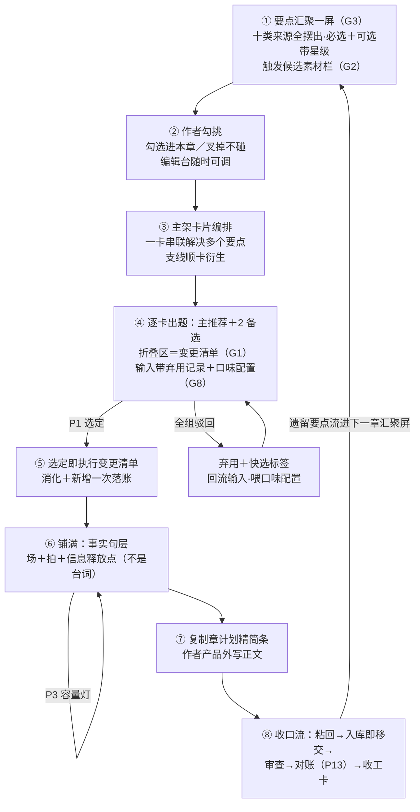
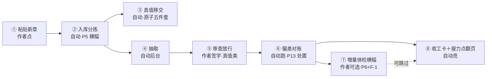

# M8 续写规划详细设计 R01（M8_PLANNING_DESIGN）

身份：**轻档设计稿。** 这是整个产品的心脏机制：要点汇聚→主架卡片→逐卡出题→选定即改账→事实句层铺满→作者写正文→回来收口。上承 [OUTLINE_STRUCTURE_DESIGN_R02.md](OUTLINE_STRUCTURE_DESIGN_R02.md)（篮子结构＋消化机制＋C7 字段建议）、[DAILY_LOOP_WALKTHROUGH_R01.md](DAILY_LOOP_WALKTHROUGH_R01.md)（日常走查——本稿正面填掉它的 GAP-02／04／05）、[PLAN_LEDGER_STORAGE_DESIGN_R01.md](PLAN_LEDGER_STORAGE_DESIGN_R01.md)（数据字段口径——本稿 C7 与增补全部同族）、[CONTEXT_PACKER_DESIGN_R01.md](CONTEXT_PACKER_DESIGN_R01.md)（M8 的输入侧 C9）、[STOP_POINT_REGISTRY_R01.md](STOP_POINT_REGISTRY_R01.md)（P1／P2／P13 停点＋F 类花钱确认）。

拍板依据全在挂账本（小说架构仓，路径含中文，复制用）：`/Users/a1234/挣钱/小说架构/TEMP/bgboard-audit-20260809-r01/18_R07_ADDENDUM_LEDGER_20260813_R01.md`——重点吃 ADD-004（选项消化）、ADD-010（真值接力棒）、ADD-011（GAP 分流）、ADD-012（F1 果断领航员＋前文最小修＋欠账分期／F5 工作台／F8 驳回=弃用）、**ADD-013（G1 折叠区=变更清单／G2 触发绑事件＋预热＋素材栏／G3 要点汇聚一屏＋必选可选星级＋主架卡片／G4 矛盾=剧情机会／G7 体检只属导入侧／G8 口味配置）**。ADD-013 是本稿的最新上游：与更早稿件（含走查）冲突处，以 ADD-013 画面为准。

不是施工合同；第 8 节 C7 是「可施工合同的人读版」，机器可校验的 JSON Schema 随施工单机械翻译落 `contracts/`。例子沿用设计稿一族的《万鬼伏藏》，编号按存储稿四位零垫风格。

> 🔴 【一致性修订 20260813｜R02 必须吸收的显眼待办：J5 选项＋手写混合输入＋落位核查】ADD-017 J5 拍板，本稿 R01 未含，R02 整体吸收（本次只立此牌不重写）：
> 1. **选项和手写不是二选一**：作者可以选了选项再手写补充（「方向对但太简单，我补两点」）——这是**常态输入形态，所有选择界面都要支持**（P1 出题卡、要点勾选、拆解三案等同理）；不只是 §1.5 那个「跳过出题直接手写」的分岔。
> 2. **选项＋手写 → 重新评估**：手写必然带来新东西（新事实句/新编排/新规则/人物状态），系统要针对组合输入重出一份**变更清单**（要修改哪些句子、哪些位置的规则），列出来给作者。
> 3. **落位核查环节（必须有）**：机械＋模型核查手写内容——有没有这个位置可填、是否硬填冲突（本有值又填一值）、名字写错（主角叫王刚写成李刚）——核查完回告作者哪里写错。**用户会写错，AI 也会生成错；事后核查和开头就带大量幻觉的生成是完全不同的效果**（CZ 原话）。
> 落点预告：§1.5（手写入口升级为混合输入）、§3.2（变更清单吃组合输入）、§3.5（校验清单加落位核查组）。

---

## 0. 一句话＋一张图

M8 干的事，说白了就是每天陪作者走这一圈：**先把「这一章要解决什么」全摆上一张桌子（要点汇聚，一屏看全不许藏）→ 作者像逛素材货架一样勾挑 → 系统把要点编排成几张主架卡片 → 逐卡出题给选项，每个选项折叠区里写好「选它账上怎么动」，选定那刻账就改完 → 铺成事实句层的章计划 → 作者去写 → 粘回来对账、翻页、道贺。** 作者的笔永远是自己的，M8 只管想清楚和记清楚。



三句话读图：

1. **章计划的上游是一张摆满的桌子，不是一道突然的题**（ADD-013 G3）：全书方向、上章遗留、该触发的剧情、人物转变、必揭秘密……十类来源汇聚一屏，必选钉死、可选带星级像素材货架；出题只发生在主架卡片编排之后，逐卡进行。
2. **选项是「剧情方向＋账务动作」二合一**（G1）：给人看的简短回答之外，折叠区在生成时就写好选它之后系统怎么改账——它既是细节说明也是入账指令；驳回全组喂弃用记录和口味配置（F8＋G8），越用越好用。
3. **收口是一条流**（填 GAP-02）：粘回→入库即移交→审查→对账（拿已确认事实比计划，默认正文赢，ADD-010）→收工卡庆祝；对账的「未写」桶直接流进下一章的要点汇聚屏——循环闭上。

## 1. 章计划的完整画面：要点汇聚 → 主架卡片 →逐卡出题（G3 重画）

### 1.1 要点汇聚一屏：十类来源，全部摆出来，不许藏

CZ 拍板的铁规矩：**一屏看全本章要解决的问题，不许隐藏、不许中途突然冒出「这个也要写」让作者迷茫。** 进入某章工作台的第一屏就是这张桌子。

要点从哪来（G3 点名的十类，按「机械捞账」还是「模型提议」分两栏说清楚）：

| # | 来源 | 怎么来的 | 例子 |
|---|---|---|---|
| 1 | 全书／卷大纲下传方向 | 机械捞：书核节拍／卷目标里排到本章附近的 | 「每开一棺多一人遗忘」主线该推进 |
| 2 | 上一章存留问题 | 机械捞：上章出口钩子＋上章对账「未写」桶改期来的（6.4 接线） | 接「棺中第二次心跳」 |
| 3 | 本章目标 | 槽位 `goal`（已有则带出，没有则汇聚时给草案） | 让「棺里的东西活着」立起来 |
| 4 | 预估字数 | 机械带：`target_length`（约束信息，显示在屏头，不是「要解决的点」） | 3,000 字 |
| 5 | 该触发的剧情 | **触发系统素材栏**（1.3）：伏笔／义务／灵感产物承接，按触发条件评期评星 | H-0005 心跳之谜，正在最佳期 |
| 6 | 人物必须完成的转变 | 模型提议（从线弧＋近章脉络推断，标 `model_suggested`）＋作者手填 | 九棺从「不敢想」到「必须查」 |
| 7 | 出场人物／地点／物品要达到的状态 | 机械捞后续槽位入口要求（有则带）＋模型提议 | 章末师妹须已知「九棺在守棺」 |
| 8 | 必须揭开的秘密 | 触发系统的揭示类特例（同 5，星级通常最高） | — |
| 9 | 必须释放的压力 | 模型提议（情绪节奏，理论挂件支撑） | 连压两章，该给一口喘息 |
| 10 | 金手指节奏 | 模型提议（多久没用、该不该释放；⚠️ 出场频次的机械统计等状态账建成后接手） | — |

诚实标注：1–5、7 的账本部分是**机械捞**（零积分、结果可复查）；6、9、10 和 7 的建议部分靠**汇聚调用**（一次模型调用，顺便给可选要点评星）——软要点是提议不是账，来源身份老实标模型，作者不勾它就不存在。

### 1.2 必选 vs 可选：素材货架，星级推荐

| 区 | 什么进来 | 行为 |
|---|---|---|
| **必选区** | 本章主架必须解决的：本章目标、上章钩子承接、大纲下传的硬节拍、作者手动钉「必须这章」的 | **不能移出**（G3 原话）；只能改内容不能撤掉 |
| **可选区** | 其余一切：触发候选、软要点提议、灵感产物、上章改期来的欠账 | 带**推荐星级**：5★ 最合适这章、4★ 次之、2★ 以下也列出来但不推；作者勾选＝进本章，**叉掉＝本章不读不用**（后续编排和出题的输入里没有它，G2 原话）；不动＝留在货架上 |

三条配套规矩：

- **编辑台里随时可调**（G3 原话）：进了大纲编辑台之后，没选的随时选进来、已选的随时移出去——勾选状态落槽位的 `point_board` 记录（8.4 增补），改动触发「受影响卡片重排提示」（提醒不停，不静默重排——N19-B 家法）。
- **勾选是作者主权，节奏灯只提醒不硬拦**：屏头常显「本章已勾偿还类 2／上限 2」，作者手动勾超了只亮提示不拦（他的书他说了算）；**硬约束只卡模型**——选项生成侧的分期上限见 3.4。
- **星级是推荐不是判决**：评星者是汇聚调用的模型（依据＝触发期相位＋理论挂件＋口味配置），⚠️ 评得准不准无实测，进 1.6 实验；作者的勾选/叉掉数据反过来喂星级校准。

工作台首屏示意（F5 工作台基调：今天的活清清楚楚）：

```
第 5 章工作台 ｜ 目标字数 3,000 ｜ 本章规划约 40 积分（包内动作不再逐次问）
已勾偿还类 1/2 ｜ 出题前注意到 1 个剧情机会 ▸
━━ 必选（本章主架必须解决）━━━━━━━━━━━━━━━
 ① 接上章钩子：棺中第二次心跳（S-0004 出口）
 ② 本章目标：让「棺里的东西活着」立起来（草案，可改）
━━ 可选（素材货架：勾＝进本章 · ✗＝本章不碰）━━━━
 ☑ ★★★★★ H-0005 心跳之谜推进——触发条件「九棺决意查棺」已满足，正在最佳期
 ☑ ★★★★☆ MC-0012 师妹线露面——挂靠师妹已 2 章未出场（灵感落地欠账）
 ☐ ★★★★  转变提议：九棺从「不敢想」到「必须查」（模型提议）
 ☐ ★★★   压力释放：连压两章，该给一小口喘息（theory.情绪节奏）
 ☐ ★★    H-0004 族谱变淡规律——触发条件「第二口棺开启后」未满足，预热中
 ✗ （无叉掉项）
        [编排主架卡片 →]        [直接手写章计划]
```

### 1.3 触发系统：绑事件不绑章节号＋预热＋素材栏（G2，新机制）

旧形态的毛病 CZ 点破了：「第 15 章必须揭露」很奇怪——来不及就得硬塞。新形态三件套：

**① 触发条件绑故事内事件，章节号只作辅助。** 伏笔账字段升级（存储增补，8.4）：

| 字段 | 装什么 | 例子（H-0004） |
|---|---|---|
| `trigger_condition` | 人话一句：什么事发生之后该触发 | 「第二口棺开启之后」 |
| `trigger_refs` | 可选的结构化锚：绑定的计划事件／事实 ID（有锚→相位判定可机械做；没锚→靠汇聚调用判） | `["PE-0601"]` |
| `window_hint` | 预估章节范围，**纯辅助**（给作者一个大概的感觉，不参与硬判定） | 「约 S-0006～S-0009」 |
| `payoff_slot_ref`（既有字段降级） | 语义从「预定回收位」降为「当前预估回收位」，随触发评估滚动改（改动留痕） | `"S-0008"` |

义务账 v1 未建（R02 §3.7 边界），建账那天同款三字段照搬。理论承接位：钩子放多久、情绪何时释放这类判断依据，就是挂件词表的 `theory.*` 词条（R02 §6 机制现成）——汇聚调用评星时点名引用了哪条（AI 建议署名到出处，ADD-012 F4），词条内容建设是独立工单（与灵感账稿同一句 ⚠️）。

**② 触发期相位四档＋预热提醒。** 每次要点汇聚时评一遍（有 `trigger_refs` 锚的机械判，没锚的模型判）：

| 相位 | 含义 | 素材栏表现 |
|---|---|---|
| 沉睡 | 触发条件未满足、也不临近 | 低星列出，不推 |
| **预热** | 条件快满足了（锚事件已排进计划／临近） | **提前亮出来**：「快到最佳期，可以开始铺垫了」——预热就是主动性的落点（G2 原话：不是快过期才叫） |
| 最佳期 | 条件已满足，正当时 | 高星置顶，系统主动积极推荐 |
| 过期未收 | 条件满足后拖了很久 | 星级反而回落＋亮「拖太久读者要凉」提示（提醒类，提一次） |

**③ 素材栏交互。** 到期候选一条条摆在可选区（1.2 的货架就是它的家）：系统挑拣（最佳期的自动打高星、可预勾）＋作者勾选「这章触发」或叉掉「这章不碰」——**叉掉的本章不读不用**，连出题输入都不进（G2 原话照办）。叉掉只管本章，下一章汇聚时它照常回货架。

### 1.4 主架卡片编排：一卡串联多个要点，支线顺卡衍生

作者点「编排主架卡片」→ 一次模型调用，输入＝必选要点＋已勾选要点（＋口味配置），输出＝**本章需要几张主架卡片**的草案。卡片是新的编排对象（`arc_card`，前缀 AC- 暂定，8.4 登记）：

| 字段 | 装什么 |
|---|---|
| `id` / `slot_ref` / `order` | 门牌＋归属章槽＋卡序 |
| `summary` | 这张卡的剧情一句话 |
| `point_refs` | 串联解决哪几个要点（引用要点的 source_ref——**一张卡可以串联解决多个目标**，G3 原话，这是编排调用的核心本事） |
| `branch_of` | null＝主架；AC-xxxx＝从哪张卡衍生出来的支线 |
| `card_status` | `draft` 草案／`questioned` 已出题／`resolved` 已选定／`dropped` 弃（留痕） |
| `opt_ref` | 该卡的出题记录号 |

编排完的画面示意：

```
本章主架 2 张卡（草案，可拆可并可增删）：
┌ 卡一「验灯问音」──── 串联解决：①接心跳钩子 ＋ ②本章目标 ＋ H-0005 推进
└ 卡二「师妹入局」──── 串联解决：MC-0012 师妹露面
   ↳ 衍生候选：师妹起疑后自己去查（要加一张支线卡吗？[加] [不加]）
```

**支线衍生**的机制（G3 原话「处理一个问题面临新剧情、新剧情产生新问题，不断衍生」）：每张卡选定选项后，变更清单里若长出新问题（新钩子、新欠账、人物新动机），系统建议衍生支线卡（`branch_of` 指父卡）——提醒不停，作者点头才加卡；支线卡同样可出题也可手写。衍生是**建议不是自动增殖**：不点头不加卡，防止一章被支线撑爆（容量灯也在后面把着门）。

卡片编排是草案：作者可拆卡、并卡、拖要点换卡、直接改卡的一句话——都是普通编辑留痕，不设停点（作者主动动作）。

### 1.5 出题粒度定论（GAP-04 正面填）

**粒度＝主架卡片。一卡一题：「这张卡的剧情怎么走」，主推荐＋2 备选。** 一章几道题由编排结果决定——简单章 1 张卡就是 1 题（走查屏 3 演的「一章一题」正是单卡章的特例，形态连续不作废），常见 1～3 张卡。

为什么这个粒度对：

- **题跟着剧情块走，不跟着行政单位走**。「一章」是发布单位，「一张卡」才是一个完整剧情动作——对一个剧情动作问「怎么走」，选项才有可比性；对整章问，多线章的选项会互相打架。
- **作者的真判断次数仍然可控**：1～3 卡×每卡扫一眼折叠区，省心档全自动串行（P1 逐卡 auto＋总览留痕），掌控档逐卡点头——P1 的档位语义原样适用，只是触发单位从章变卡。
- **积分仍可预估**：卡数在编排后就定了，会话包（第 7 节）按卡数报预估。

**生成的调用结构**（每次调用干什么、为什么这样切）：

| 步 | 调用 | 产出 | 为什么 |
|---|---|---|---|
| 汇聚 | 1 次（机械捞账＋模型补软要点评星） | 要点板 | 软要点和星级需要判断，机械捞不出来 |
| 编排 | 1 次 | 主架卡片草案 | 串联关系是整体设计，逐点分次会看不见彼此 |
| 出题 | 每卡 1 次 | 3 选项（含折叠区变更清单） | 选项要瘦到「能判断」为止，完整铺满等选定后 |
| 铺满 | 全卡选定后 1 次 | 整章事实句层（场＋拍＋信息释放点） | 场间节奏、字数分配是整章的事，逐卡铺会漂移 |

铺满之后的修改走**局部微调**：点哪个格子改哪个（ADD-006），小调用不重铺全章。

**专业路径：跳过出题，直接手写——一等公民入口。** 工作台常驻「直接手写章计划」：跳过编排和出题，打开空白章篮手填（或只借要点板不借卡片）。要点板**侧栏常驻**，作者把某个要点拖进某场（或点「本章解决这条」），系统生成一条**手写型选择记录**（`option_record` 的 `mode=manual`：`question` 固定文案、`options` 空表、变更按作者实际编辑记录）——消化状态、兑现链接、留痕全走同一条链，下游对手写和出题无感。为什么必须有：M8 的立身之本是「替他想清楚、替他记住」，不是「必须经我的手」。

### 1.6 ⚠️ 出题质量需真书原型实验（先跑实验再锁 Prompt）

上面定的是**机制形状**；汇聚捞得全不全、星级评得准不准、卡片编排合不合理、选项好不好，没有任何实测。实验设计如下，随 M8 施工单第一周跑：

**材料**：库里六本已入库的书（各三章正文＋事实候选池），每本预填最小规划骨架：书核一句话＋2～3 条伏笔（**带触发条件**，按 1.3 新字段填）＋1 条必写承接——正好是走查第 0 天建账的形态。

**跑什么**：每本书对「第 4 章」槽位走全管线两遍（模拟省心档全自动）＋人工干预一遍（模拟掌控档：调勾选、改卡）。

**看什么指标**：

| 层 | 指标 | 及格线（⚠️ 起步值） |
|---|---|---|
| 汇聚层 | 硬要点召回率（预埋的欠账/触发候选被捞回的比例）；软要点盲评可用率；星级合理性盲评（CZ＋设计师） | 硬召回 100%（机械捞漏＝bug）；软要点可用 ≥50% |
| 编排层 | 卡片数合理性盲评；串联度（平均每卡解决要点数——全是一卡一点＝编排没本事） | 串联度 >1.3 |
| 出题层 | JSON 可解析率；变更清单引用编造率；主推荐盲评可用率（可直接用/改改能用/没法用）；三选项区分度；同输入重复 2 次的稳定性 | 可解析 100%、编造 0%、可用 ≥2/3 |
| 变更层 | 变更清单落账后账本载入预检 0 错；设定类是否全部走了提案不直改 | 100% |
| 铺满层 | 场安排盲评；字数预估 vs 该书真实章均字数偏差 | 偏差中位数 ≤30% |
| 成本层 | 每环节 token/积分/延迟 | 喂第 7 节 F-4 预估公式初值 |

**产出与判停**：过线→锁管线默认＋各环节 Prompt 基线＋`pacing_cap` 初值＋星级校准基线＋F-4 预估初值；汇聚或编排不过线→先修那一环再谈出题（上游烂了下游无从谈起）。

## 2. 出题前的前文分析：剧情机会（G4 重框）＋最小修（ADD-012 F1①）

### 2.1 口径先定：矛盾＝剧情机会，不是「你写错了」

CZ 的哲学（G4 原话）：**逻辑问题往往可以通过后续精妙剧情解决——「因为有矛盾才会有剧情」**；全平铺直叙没冲突的文章不好看。所以发现前文矛盾时的呈现口径是：

> ✅ 「这里有一个剧情发生的机会：之前两个点有矛盾，我们想办法把它们解决掉。」
> ❌ 「检测到前文逻辑错误 2 处。」

### 2.2 在哪发生、看什么

**不加新调用**：前文分析是汇聚调用的一部分产出（材料就是 C9 近章区/本线区/禁做区，现成）。范围按 G4 拍板收窄：**只说影响当前章的**——跟本章要点、出场人物、本线剧情相关的矛盾才亮，陈年旧账不翻（要翻全书去跑导入侧体检）。

边界钉死：**这不是体检**。不进 C6 账、不发红黄灯、不占收件箱——按 G7 的定位修正，体检属导入侧；这里是领航员开车前扫一眼路况，只对「本章能不能顺利往下写」负责。

### 2.3 机会卡三级去向（已发表不能大改的落法，最小修原则）

每个机会带一个建议去向，动静从小到大，**默认推荐动静最小的**：

| 级 | 去向 | 例子（第 3 章说义庄夜里上锁，第 4 章九棺深夜自由出入没交代） | 落点 |
|---|---|---|---|
| ① 用剧情解决（默认首选） | 把矛盾变成戏：**一键收进要点板**（可选区，kind=剧情机会，星级通常给高——它是现成的冲突素材） | 「谁给了他钥匙？——这个人为什么帮他，本身就是一场戏」 | 勾选后进卡片编排，铺满时自然长成拍；比「补一句圆过去」多出一层剧情价值，正是 G4 说的机会 |
| ② 设定补丁 | 洞其实是设定没写清 | 设定集补一条「守庄人家属持钥」 | 跳设定集补条目（作者声明，走既有身份通道） |
| ③ 需改已发表正文 | 真硬伤，剧情圆不回来 | 第 3 章那句「夜里落三道锁」得改 | **只标注不出改稿方案**——正文改完怎么回产品是改稿重导设计单的地盘（GAP-01，ADD-011 已派），本稿不越界 |

界面落位：工作台首屏一行「出题前注意到 1 个剧情机会 ▸」，点开才展开（机会描述／双方证据可跳／三级去向按钮）。提醒类提一次不复读；不占停点号。**机械校验**：机会卡引用的证据 ID 必须在本次前提包内（含回取索引），引用悬空的整条丢弃——防拿幻觉当机会。

## 3. 选项生成合同（细化到可施工；折叠区＝变更清单）

### 3.1 输入（每卡出题一次）

| 输入 | 内容 | 来源 |
|---|---|---|
| C9 共同前提包 | 七分区全套 | M11（PACKER §1.2） |
| 本卡上下文 | 卡的一句话＋`point_refs` 指的要点全文＋已解决卡的出口状态（卡间接力） | 规划账 `arc_cards`＋要点板 |
| **弃用记录**（ADD-012 F8） | 本槽全部 `group_status=discarded` 的选择记录：题目＋各选项方向＋弃用理由＋快选标签 | 规划账，注入 C9 任务卡区（3.7） |
| **口味配置**（ADD-013 G8） | 作者口味摘要（一小段人话，3.8 的派生缓存） | `taste.json`，注入 C9 任务卡区 |
| 节奏参数 | `pacing_cap`＋本章已消化偿还数（跨卡累计）＋全书欠账池概况 | 规划账设置区＋伏笔/承接表 |
| 作者临时约束 | 现场要求 | 聊天框/工作台输入（C9 现成通道） |

### 3.2 输出：主推荐＋2 备选；每个选项＝简短回答＋折叠区

姿态照 ADD-012 F1：**果断领航员**——主推荐排第一、理由摆清；备选必须是明显不同的方向（D18），不是措辞变体。

**简短回答区**（给人扫一眼判断的）：

| 字段 | 装什么 | 必填 |
|---|---|---|
| `key` | `opt-1/2/3` | 是 |
| `summary` | 方向一句话：这张卡的剧情怎么走 | 是 |
| `why_fit` | 为什么适合：接什么钩子、顺什么线、合什么口味 | 是 |
| `tradeoffs` | 代价：选它会改变什么（改名自 R02 的「会改变什么」，避免与变更清单撞名） | 是 |
| `risks` | 风险：会写砸在哪、要守什么边界 | 是 |
| `expected_length` | 这张卡按此方向大概要多少字 | 是 |
| `pacing_note` | 节奏说明：本章已还几笔＋这个选项再还几笔、全书还剩几笔 | 是 |

**折叠区＝变更清单 `change_list`**（G1：生成时就写好「选它之后系统具体怎么改账」；既给作者看细节，也是选定后的入账指令；消化的＋新增的都在里面）：

| 分组 | 装什么 | 选定后的执行方式 |
|---|---|---|
| `resolves` | 解决哪些要点：`{ref, kind, note, variant_note}`——旧「消化清单」并入这里（引用必须来自本卡要点∪本章已勾选要点） | 直接执行：对应对象翻 `digested`/`paid`/推进，挂本次 OPT 号（选定即消化机制原样，ADD-004 Q3） |
| `planned_events` | 计划事实句怎么动：`add[]`（新增拍草案：text/purpose/hook_refs/场归属提示）／`revise[]`（改哪条 PE、怎么改）／`void[]`（作废哪条＋理由） | 直接执行（规划账是计划层，P1 选定就是授权；作废留痕不删） |
| `hooks` | 伏笔怎么动：推进／回收／**埋新钩**（新伏笔草案：底牌＋触发条件＋安全摘要）／改预估回收位 | 直接执行；新钩生来 `model_suggested`，认领走既有通道 |
| `character_states` | 人物状态怎么变：`{who, from, to}` | 落章篮出口状态＋场的状态要求（计划层的预期，不碰事实账） |
| `setting_proposals` | Bible／世界规则要动的：`{target, change, why}`，**恒带 `requires_signoff: true`** | **永不直接执行**——生成「设定变更提案」卡，作者在设定集侧显式确认才生效（真值签字边界，ADD-005：选项选定是停点放行，不是真值签字，AI 不能借它写 Bible） |
| `exit_state` | 这张卡走完，世界定格在哪 | 落卡片出口，供下一张卡接力 |

一条铁律写死：**变更清单只动计划层。** 「删事实句」在 G1 原话里出现，落到本产品的账本语义是：计划事实句（PE）可增可改可作废；**真值事实句（F-）任何选项都动不了**——真值要动走 M5 改史签字，变更清单最多生成提案。这不是打折扣，是 G1 的「入账指令」在两本账体系下的正确翻译：规划账的指令直接执行，真值账的指令降级为提案。

折叠区示意（卡一「验灯问音」选项一）：

```
✅ 选项一（推荐）：九棺请老仵作深夜听棺辨音
   为什么适合：顺钩直走；你偏好慢热推进（口味配置）——验音是慢戏
   代价：老仵作从背景人物变成知情者    风险：验的结果只能给一半
   节奏：本章已还 0 笔，此选项推进 1 不还账；全书还剩 2 笔    预计 1,700 字
   ▸ 选它之后账上怎么动（点开＝变更清单）
     解决要点：接心跳钩子 ✓ · H-0005 推进（不揭底）✓
     计划事实句 +3：老仵作贴棺听音，确认棺中有活物 / 九棺说出「我必须查」/
                    老仵作拒绝说出棺中身份
     人物状态：老仵作「背景人物 → 知情但不肯说」
     伏笔：埋新钩 H-0006 草案「仵作的警告」（触发条件：九棺第二次开棺前）
     设定提案：无
     卡片出口：九棺决意追查；老仵作连夜离开义庄
```

### 3.3 「要点不解决要说明」怎么落（原「绕账说明」升级）

判定域＝**本卡 `point_refs` 点名的要点**（必选要点被编排进哪张卡，哪张卡就欠它一个交代）。本卡点名的要点若不在该选项 `resolves` 里 → `skip_note` 必填非空＋建议去向（挪去本章另一卡／退回货架下章再说）。作者选定带 `skip_note` 的选项时，被绕开的要点自动按建议落位（改挂别卡或退货架，留痕）——不许出现「卡说要解决、选项没解决、账上还挂着」的悬空。

### 3.4 欠账偿还节奏：分期硬约束（ADD-012 F1②，与货架自由并存）

CZ 原话：「不许一章把前面欠的账全还了，画风突变是不允许的，要分期慢慢还。」两层落法：

- **机械层（只卡模型）**：单章**跨卡累计**的偿还类动作（伏笔回收＋承接兑现；「推进不揭底」不算偿还）≤ `pacing_cap`，默认 2（⚠️ 无实测，1.6 实验喂它；作者可改设置）。出题时已消化数带在输入里（3.1），超上限的选项**生成侧拒绝重出**。
- **作者层（只提醒不拦）**：要点板勾选超 cap 时亮提示（1.2）——硬约束管 AI 不管人，作者执意一章还三笔是他的自由，系统提醒过就闭嘴。

配套：货架上偿还类候选超 cap 的部分，星级自动压低＋附「分期建议：这条更适合 S-000x」——替他排还款计划，不是把账单全拍脸上。

### 3.5 程序机械校验清单（V0 级，逐条可写成断言）

| # | 校验 | 失败处置 |
|---|---|---|
| 1 | 输出 JSON 可解析、字段齐全（3.2 两区必填项） | 整组拒收重跑 |
| 2 | 恰好 3 个选项、`key` 不重复、主推荐有且仅有一个 | 整组拒收重跑 |
| 3 | `resolves` ⊆ 本卡要点∪本章已勾选要点（**一个编造引用都不行**）；被叉掉的要点绝不许出现 | 整组拒收重跑——编造引用是对账机制的地基性破坏；引用叉掉项＝违反 G2「不读不用」 |
| 4 | `change_list` 各 ref 存在；动作类型在白名单内；`setting_proposals` 恒带 `requires_signoff`，**不存在任何直改真值/设定的指令** | 该选项拒收重出 |
| 5 | 偿还类累计（已消化＋本选项）≤ `pacing_cap` | 该选项拒收重出 |
| 6 | 本卡点名要点未解决 → `skip_note` 非空且带去向（3.3） | 该选项拒收重出 |
| 7 | 伏笔回收但触发相位仍在沉睡/预热 → 必须带 `early_reveal_flag`（相位取汇聚时的评估缓存，程序可查可补标） | 程序补标后放行 |
| 8 | 弃用记录＋口味摘要已注入本次输入；新选项 `summary` 与弃用组各选项不得逐字/近字重复（字面查重） | 未注入＝装包 bug 拒跑；字面撞车该选项拒收重出 |

边界老实写明：第 8 条挡得住「原样端回来」，挡不住「换套措辞的同一思路」——语义不重复靠模型读弃用理由自律＋作者验收，程序不假装能验语义（ARCHITECTURE 纪律 2）。

### 3.6 选定那一刻：执行变更清单（P1→P2 的扩展语义）

选定（P1）→ 程序照折叠区逐条执行：`resolves` 翻消化状态挂 OPT 号（P2 随 P1 自动，机制原样）；`planned_events`/`hooks`/`character_states`/`exit_state` 落账（全部留痕，`actor: author`——选定就是授权）；`setting_proposals` 生成提案卡待签。卡片翻 `resolved`；衍生支线建议若有，此刻弹（1.4）。落选选项整包留档（未选≠驳回，不特别记，F8）。

### 3.7 驳回全组＝思路级弃用＋快选标签（ADD-012 F8＋ADD-013 G8）

语义分层照 F8 钉死：**未选**（四选一后落选的）＝正常淘汰，照旧留档不回流；**弃用**（作者点「这几个思路都不对」）＝思路级强负反馈，必须记档、必须被后续生成读到。

**数据**（`option_record` 增补，8.4）：`group_status`（`active`/`discarded`）＋`discard_tags`（快选多选：`节奏快了`/`节奏慢了`/`人物不像`/`动机不对`/`不好看`——G8 点名的五个）＋`discard_reason`（一句话）。**标签和理由至少填其一**：快选标签把负担降到一次点击，理由栏给想多说的人——两者都是口味配置的原料。

**回流**：本槽全部弃用组作为**保底条目**注入 C9 任务卡区（`why_loaded: discarded`，D0，不参与淘汰——CZ 说「必须被读到」）。范围裁定：**只本槽回流，不跨槽泛化**——弃用否定的是「这张卡怎么走」；跨章的长期倾向不靠逐条弃用记录背，靠口味配置汇总（3.8）——两条通道分工：弃用记录管「这次别再犯」，口味配置管「一直这个味」。

**界面**（F8 选 C）：弃用组**原地变灰、折叠可见**——工作台上压着一张灰单子，谁都看得见「这条路试过、为什么不行」；新题组长在灰组下方。连续弃用 3 组提示一句「要不要直接手写？或看看前提包缺什么料」（提示不强转，尊重人）。

### 3.8 口味配置：数据形状＋进 prompt 的方式（G8，新机制）

**原料（全部现成，零新采集动作）**：弃用记录（标签＋理由）、未选记录（落选 vs 选中的对比——OPT 表本来就整包留档）、选中记录、（可加）作者手改铺满结果的改动方向。CZ 原话：这些资料很珍贵，系统要收集——采集面已经全覆盖，不用加任何打扰性问卷。

**数据形状**：独立小文件 `data/<书名>/taste.json`——它是**派生缓存不是账**（可随时从 OPT 记录＋流水重算，删了不丢真值；同灵感账「独立文件、打包器默认不路过」的物理隔离思路）：

```json
{
  "schema": "taste-v1",
  "updated_at": "2026-08-20 23:40:00",
  "signal_counts": {"discards": 3, "unchosen": 14, "chosen": 9},
  "summary": "节奏偏慢热，反感一章多线并进；重人物内心戏多于事件推进；『主动查证』类方向连弃 2 组（想写逃避与害怕）；对白密度偏低。",
  "traits": [
    {"dimension": "节奏", "tendency": "偏慢热", "evidence_refs": ["OPT-0004", "OPT-0007"], "confidence": "中"},
    {"dimension": "人物", "tendency": "重内心戏", "evidence_refs": ["OPT-0008"], "confidence": "低"}
  ]
}
```

**重算时机**：关章沉降时增量更新（搭卷/线摘要的车，ADD-009 打包器三题的同一时点，成本摊薄）；`summary` 控制在 ~150 token。

**进 prompt 的方式**：`summary` 作为一条保底条目注入 C9 任务卡区（`why_loaded: taste`，D0）——汇聚评星、卡片编排、逐卡出题三处调用都读它；`traits` 明细不进包（账本细、执行包瘦——摘要够用，明细留给作者视图和重算）。选项的 `why_fit` 引用口味时要署名（「你偏好慢热推进（口味配置）」）——作者看得见系统按什么在迎合他，不对了随时纠。

**作者可见可改**：口味配置页摆在设置里，人话展示、可整条删、可手写补一条（手写条 `confidence` 恒高）。为什么透明：口味是作者的镜子不是系统的暗算；他说「我没有这个偏好」比任何算法校准都准。

## 4. 章篮成形与调整

### 4.1 铺满：铺的是事实句层（G3 纠正）

全部卡片 `resolved` 后一次铺满调用，把各卡的变更清单落成完整章篮。**铺的是事实句层**——场＋拍（计划事实句）＋信息释放点，不是正文素材：

| 格子 | 铺法 | 说明 |
|---|---|---|
| 本章目标／章梗概 | 自动铺（从卡片 summary 汇成） | — |
| 场安排（目标/胶囊/阻力/转折/POV/字数预估/画面提示） | 自动铺；**每场带 `arc_ref` 指回是哪张卡铺出来的**（追溯） | 阻力转折必填非空（R02 §3.5 场篮立身格） |
| 拍（PE） | 从各卡 `change_list.planned_events.add` 落正式 PE，生来 `digested` 挂各自 OPT | 计划事实句就是拍——一句「谁做了什么/什么变了」 |
| **信息释放点**（原「对白要点」，语义按 G3 纠正） | 每条格式「**谁说出/暴露什么信息**（可注方式）」——不是写正文的台词 | 例：「老仵作说出：棺中之物活着（不说是谁）」；台词怎么写是作者的笔，产品不代写 |
| 不能违反 | 从 C9 禁做区机械带入，不是模型现编 | 红线来自账本，模型只搬运 |
| 写法指导栏 | 自动建议 1～2 个挂件（`technique.*`，WG 记录） | 【一致性修订 20260813】口径更新：ADD-017 **J1** 已拍正文红线（指导＝要求/信息点，可细到句级「描写要求」，不给成文；全部指导是现成大纲账的组装）；ADD-014 已拍分层取用（本栏消费段落写法层）。本栏按这两条执行。G5「三种理解」是否就此视为全部关闭，待 CZ 一句话确认（存疑挂账） |
| 目标字数 | 留作者：默认沿用上一章（首章书级默认 3,000，⚠️ 起步值） | 平台习惯模型没资格定 |
| 各场字数预估 | 自动铺可改（ADD-011 已拍：模型默认＋作者可改＋实际回修） | 收口时顺手校准（6.5） |
| 出口钩子／风险 | 自动铺草案 | — |

### 4.2 容量灯与场挪动：走查屏 5 的行为定成规格

**触发时点**：铺满完成时；任何 `word_estimate`/`target_length` 被编辑时；卡片增删（支线衍生加卡）后重铺时。灯是现算派生值（STORAGE §1.4 故意不落盘）。

**判定**（⚠️ 阈值起步值，随 1.6 实验校准）：装得下＝预估合计 ∈ [目标×60%, 目标×105%]；装不下＝超 105%（触发 P3）；太空＝低于 60%（触发 P3）。

**P3 触发后的建议动作三型**（模型给建议＋人话理由，程序落账）：

| 型 | 动作 | 账上落什么 |
|---|---|---|
| 挪卡/挪场 | 「卡二整体挪下一槽」「场 3 的旧怨块挪 S-0006」 | 场/卡改挂目标槽＋`slot_mappings` 落预调整行（`mapping_kind=split`，`reason` 必填——N19-B 不静默改规划） |
| 并槽 | 太空且下一槽薄：「与 S-0006 合并」 | `slot_mappings` 落 `merge` 行 |
| 场内瘦身 | 超得不多：「场 2 砍铺垫块，900→700」 | 只改胶囊和预估，不动映射 |

档位照 REGISTRY P3 原样：省心档提醒不停（自动应用＋醒目留痕＋一键撤销＝流水 `undo` 逆放）；掌控档必停看影响预览；无静默档（值域里就没有）。

### 4.3 作者手动改的自由度

原则一句话：**规划账是作者的账，格子全部可改，系统只记账不拦路。**

- 一切格子（含模型铺的）直接编辑＝普通编辑留痕，`rev`+1，无确认——这不是真值账；
- 牵一发自动跟：改预估→容量灯重算（可能 P3）；删改已消化 PE→P4 重核；改要点勾选→受影响卡重排提示（1.2）；拖场序＝改 `scene_refs` 数组，拍跟场走；
- 局部 AI 微调是编辑的加速器：点格子在聊天框说话，产出落格子（ADD-006），计入会话包。

## 5. 写正文的交接：M8 侧给什么数据（对齐 GAP-07，不做视图设计）

完整「写作对照视图」另有小单（ADD-011：GAP-07 随宿主排队）。本稿只定交付合同：**「章计划精简条」＝C7 的字段投影，不另立合同。** 挑选原则：写到一半抬眼要核对的进，规划期已消化完的不进——进：本章目标／场序表（每场胶囊一句＋字数预估＋POV）／信息释放点／红线全量（含伏笔安全摘要）／出口钩子／写法指导一句；不进：章梗概、阻力转折画面提示（已内化）、拍全文（正文不是照拍翻译）、追溯字段。

【一致性修订 20260813】精简条的第二重身份（ADD-017 J1）：它同时是「提示词工厂」的出货形态——作者可把这份完整指导原样粘给**任何外部写作 AI** 生成正文（内容全部来自现成大纲账的组装，不用费劲另行生成）；产品的红线只有一条：不给写作模型、不生成正文。

「复制章计划（纯文本）」输出示意：

```text
【第 5 章 守棺 · 目标 3,000 字】
目标：让「棺里的东西活着」立起来，但不能露是谁
场 1 守棺听音（900 字·九棺视角）
场 2 师妹送饭（800 字·师妹视角）
场 3 仵作变色（1,300 字·九棺视角）
信息释放：❶老仵作说出「棺中之物活着」（不说是谁）❷师妹得知九棺在守棺（不知代价）
          ❸仵作警告「它在数你的心跳」（临走）
红线：❶棺中身份是底牌，只能写「另有其人」❷爷爷已忘九棺，不能认出他
钩子：老仵作收拾东西要走：「这活我不接了。你也别守了——它在数你的心跳。」
写法：验棺用手艺细节写紧张，不堆形容词
```

## 6. 收口流（GAP-02 正面填）：从粘贴到收工，一条流

### 6.1 七步一图，每步谁触发



| 步 | 谁触发 | 干什么 | 出处 |
|---|---|---|---|
| ① 粘贴新章 | 作者点（接力点卡常驻入口） | 粘贴框＋自动识别章号 | 走查屏 8；INTAKE 单章分拣 |
| ② 入库分拣 | 自动 | 单章走 P5（省心档横幅不弹屏；S 类强停照旧无视档位） | INTAKE §3.4、REGISTRY P5 |
| ③ 真值移交 | **自动，随入库连动，不单独确认**（裁决见 6.2） | 槽位翻 `handed_over`、场和拍翻「当初的打算」、映射落行、流水记 `handover`——原子五件套 | STORAGE §3.2、ADD-010 |
| ④ 抽取 | 自动后台 | M2→M3 出候选 | 现有管线 |
| ⑤ 审查放行 | **作者**（真值签字，任何档位显式） | 章卡流审查 | REVIEW §1、REGISTRY §2 |
| ⑥ 偏差对账 | **自动跑**（本章候选清账后），处置按 P13 档位 | 已确认事实 vs 已移交计划，三桶亮出（6.3） | ADD-010 第 3 条、REGISTRY P13 |
| ⑦ 增量体检横幅 | 作者可选 | 「给第 5 章做次体检？~5 积分」——**口径按 G7**：体检属导入侧，新章手写正文粘回＝导入侧的增量核对（手写可能偏离/引入新矛盾），这是它的合法场景；**不存在定期全书体检** | REVIEW §4.5 P6＋F-1；ADD-013 G7 |
| ⑧ 收工卡 | 自动亮（完成态判定见 6.5） | 本章统计＋庆祝＋明天的要点预览＋接力点翻页 | ADD-012 F6、捞货 38 |

### 6.2 两个悬了很久的口径，就地裁决

**裁决一：粘贴入库与移交是同一下，不加确认（走查屏 8 的 ⚠️ 关掉）。** 章节架新增 `c05` 那一刻五件套自动走。为什么：①ADD-010 原话「新章写成**入库后**，真值从计划交回正文」——触发点拍板里写着；②移交是**记账动作不是真值签字**——不往事实账写一个字（事实入账是⑤的事），改的是规划账自己的状态标记，可逆；③不自动移交会有窗口期谎言：正文已入库、账上还说「大纲为真」。横幅一句话交代：「已入架：第 5 章『守棺』· 章计划已移交（正文为准）✎ 查看」。

**裁决二：对账拿「已确认事实」比计划，不拿候选；所以排在审查放行之后自动跑。** 为什么：①候选没签字，拿它对账，驳回几条候选对账结果就翻烧饼——同一章要对两遍；②ADD-010 说偏差比对的是移交后的正文真值，正文真值的账内形态就是已确认事实；③顺序上审查本来就在前（走查屏 9→10 实演）。代价写明：作者长期不审查对账就不跑——可接受，不审查的章事实层本来就是空的。

### 6.3 对账怎么比：三桶＋机械覆盖校验

**谁跑**：M8 收口件（对账回答「计划兑现了没」，是规划账的问题；事实账不需要向计划负责）。输入＝C4 查本章已确认事实＋规划账查该槽已移交的 PE／出口钩子／变更记录。

**怎么比**：一次小额模型调用做语义匹配（事实句和计划事实句同构——「一种语言」正是为这一步铺的路），产出三桶：

| 桶 | 判定 | 处置动作（P13 档位内） |
|---|---|---|
| ✅ 兑现 | 该 PE 有对应已确认事实 | 无需处置；可选补弱链接（增强不属骨架） |
| ⚠️ 未写 | 该 PE 正文里找不到对应 | 三键：挪去下一章（改期留痕，**落进下一章汇聚屏「上章遗留」区**——循环闭上）／作废（留痕）／就这样（挂 `deviation_note`） |
| ➕ 新增 | 本章事实对不上任何 PE，且有分量（新人物/新设定/线级事件） | 提示登人物名单/故事线成员；零散小事实不亮（防唠叨） |

**机械校验兜底**（同 C5 覆盖率思路）：该槽每条已移交 PE 必须被判进三桶之一，程序核对覆盖率，模型漏判的强制进「未写」桶——**对账不许藏账**。对账卡是派生视图不落账本；落账本的只有处置结果。对账调用计入会话包，不单独弹费用。

### 6.4 分工接线：谁兜什么（走查点名要接的线）

| 机制 | 兜什么 | 不兜什么 |
|---|---|---|
| 变更清单执行（本稿 3.6，创作时） | 「要点有没有被安排」——选定那刻落账销账 | 不兜「安排了但没写」（明说的取舍，R02 §4） |
| **收口对账（6.3，P13，写完时）** | 「安排了的有没有写出来」——未写/新增亮出，默认正文赢 | 不改消化记录（选题时的决定不回滚）；不管正文内部矛盾 |
| P4 删改重核（改计划时） | 作者删改已消化计划后的兑现链接重核 | 不管正文侧 |
| 增量体检（G7 口径，粘回时可选） | 新正文与真值、与自身的**矛盾**（花钱、立案、进收件箱） | 不管计划兑现度 |

一句话记忆：**变更清单管「安排」，对账管「写没写」，P4 管「反悔」，体检管「写错」（且只在导入口岸站岗）。**

### 6.5 「本章收工」的完成态（F6 关章要庆祝）

**完成态判定（机械可判）**：③移交完成 ∧ ⑤本章候选清账 ∧ ⑥对账三桶无未处置项（省心档「自动正文赢＋标注挂着」即视为已处置）。体检不是完成条件。三条件齐→收工卡自动亮，接力点翻页。

```
🎉 第 5 章「守棺」收工！
今天：正文 3,050 字 · 入账 31 条 · 计划兑现 3/3 · 连续创作第 3 天
全书：5 章 · 16,100 字 · 伏笔 4 笔（1 收 3 挂——本章新埋「仵作的警告」；H-0004 已进预热期）
顺手校准：本章预估 3,000 / 实写 3,050，预估挺准，不用调
明天的桌面：第 6 章要点预览——必选 2 项 · 货架候选 4 项（1 条正在最佳期）
              [看一眼第 6 章 →]                [今天到此为止]
```

「顺手校准」＝ADD-011 拍掉的 GAP-13 校准动作落点（偏差持续 >30% 才提示调书级预估系数，不逐章唠叨）。庆祝的分寸：一行 emoji＋连续天数（网文日更打卡心理），不弹烟花——工作台的庆祝是拍拍肩膀，不是开派对。

### 6.6 P13 档位表现（给注册表回填）

| 档 | 表现 |
|---|---|
| 省心（提醒不停，默认） | 对账自动跑完：兑现桶静默；未写桶自动挂 `deviation_note`＋角标可回访；新增桶横幅一行。收工卡照亮 |
| 掌控（必停） | 对账卡弹出，未写/新增逐条处置完才到收工卡 |
| 铁边界 | 反向动作（改正文迁就大纲）任何档位显式选择（REGISTRY P13 行原话）；对账**跑不跑**不分档——账必须对，档位只管处置停不停 |

P13 状态从〔候选〕升〔已设计〕，宿主＝本稿本节；触发时点更正为「本章候选清账后」（裁决理由 6.2）。

## 7. 花钱确认户口：规划会话包（GAP-05 正面填，提交 F-4）

问题原样：规划是日常最高频花钱场景，REGISTRY F 类只有体检/整本工程/概览重生成——省心档自动走等于自动花钱；每步弹确认又变唠叨。方案：**会话级预估、包内动作免逐次确认**。

**会话定义**：从进入某槽工作台（要点汇聚前）起，到该章收工卡亮（或离开工作台超一天）止。一章一会话，边界机械可判。

**进入时报一次**（工作台头部一行，不弹窗）：「本章规划约 40 积分（汇聚、编排、出题、改来改去都算在内，超了会再问你）」。预估公式初值（⚠️ 全部示意值，1.6 实验成本层实测后校准；卡数在编排后确定，编排前按 2 卡估、编排后刷新一次数字）：

```text
会话预估 = 要点汇聚 1 次（~4） + 主架编排 1 次（~5） + 出题 2 卡 ×（~7）
         + 事实句层铺满 1 次（~8） + 局部微调预留 3 次（~2×3）
         + 缺料重编预留（~1） + 收口对账 1 次（~1） ≈ 39 → 报「约 40 积分」
```

**包内免确认**：汇聚、编排、出题、重出题（弃用换思路）、铺满、局部微调、缺料回取重编、收口对账。**不并入**：增量体检（F-1 照旧单独确认——可选大项不是规划固有环节）、概览重生成（F-3 照旧）。

**超支闸门**：累计达预估 **120%** 停一次：「本章已用 48/预估 40 积分（改得比较多），继续？」确认后额度再放 50%，触顶再问。为什么「再问」不「拦死」：花钱确认护知情权不限制消费——作者改十遍是自由，产品的义务是别让他糊里糊涂花钱（ADD-002 预估制精神：不可预测才是雷）。连续弃用的重出题同样被这道闸兜住（3.7 的提示＋这里的闸，钱和体验各管一头）。

**过程感知**（ADD-012 F7）：工作台左下角淡显剩余总积分，过程零弹窗，点开才见明细。

**提交注册表的 F-4 行**（照 REGISTRY §3 F 类格式，领号归注册表承办）：

| # | 触发 | 出处 |
|---|---|---|
| F-4 | 规划会话开始时：报本章会话预估积分（编排后按实际卡数刷新一次），包内动作（汇聚/编排/出题/铺满/微调/缺料重编/对账）免逐次确认；累计达预估 120% 追加确认 | 本稿 §7〔候选〕 |

配套一句：P1「自动通过」档从此语义干净——放行的是选择停顿，钱在会话门口知情过。

## 8. C7 落地版 v1（从 R02 建议版升为可施工合同）

### 8.1 定位与铁字段

一份 C7＝规划账里一个章篮的**只读快照**：会过期，要改回规划账改，不在快照上改出第二真源（ARCHITECTURE 纪律 1）。消费者：M9 概览（梗概＋画面提示）、M10 场景卡（画面/人物/情绪/信息释放）、写作精简条视图（第 5 节投影）。`status` 恒 `"plan"`——铁字段防冒充事实（纪律 3）。

### 8.2 字段表 v1

相对 R02 §7 建议版的变化：ID 对齐存储稿四位风格；`digested_refs` 子结构加 `variant_note`（ADD-011 拍掉 GAP-10）＋kind 值域扩到要点类；新增 `premise_pack_ref`（PACKER §5 追溯链）；场对象加 `goal`、`arc_ref`（从哪张主架卡铺出，G3）、`scene_id` 用 SCN- 永久号；`dialogue_hints` **语义按 G3 纠正**：每条＝「谁说出/暴露什么信息」的信息释放点，不是台词（字段名沿用存储稿登记名不折腾，合同文本重定义内容格式）；`spoiler_guard` 为打包时现拼的派生值不落盘。

| 字段 | 类型 | 装什么 | 主要给谁 |
|---|---|---|---|
| `contract` / `version` | str | `"C7_CHAPTER_PLAN"`＋`"v1"` | 都要 |
| `status` | str | 🔥 恒 `"plan"` | 都要（防冒充） |
| `plan_id` | str | 快照身份＋轮次：`PLAN-S0005-r1` | 都要 |
| `slot_ref` / `chapter_hint` | str / int | 槽位 ID＋预计物理章号（算出） | M9 排序 |
| `title_hint` | str/null | 建议章名 | M9 |
| `goal` / `summary` | str | 本章目标／章梗概胶囊 | 作者、M9 |
| `storyline_refs` | list[str] | 走哪几条线 | M9 |
| `based_on_facts` / `basis_note` | list / str | 依据事实 ID／生成时账本双时点 | 追溯、过期判定 |
| `premise_pack_ref` | str | 前提包 ID——C7 说依据什么 ← 包说为何装 ← C4 说证据在哪 | 调试归因 |
| `target_length` / `estimated_length` | int | 目标字数／预估合计（容量灯原料） | 作者、程序 |
| `digested_refs` | list[obj] | 本章解决了哪些要点：`{ref, kind: hook/must_carry/planned_event/point, via: OPT号, variant_note}` | M9「本章兑现了什么」、追溯 |
| `scenes[]` | list[obj] | 场列表，子结构见下 | M9、M10、精简条 |
| `must_carry` / `must_not` | list[str] | 必写承接／红线（从禁做区带入） | 作者、QC、精简条 |
| `exit_hook` / `risks` | str / list | 结尾钩子／风险 | 作者、M9 |
| `writing_guidance` | list[str] | 章级写法指导（WG 挂件渲染成人话） | 作者、精简条 |

场对象子结构：`scene_id`（SCN-）、`order`、`arc_ref`（AC- 卡号）、`goal`、`summary`、`location`、`characters`、`pov`、`mood_in`/`mood_out`、`resistance`、`turn`、`spoiler_guard`（现拼）、`word_estimate`、`planned_events[]`（`event_id`/`text`/`storyline_ref`/`purpose`/`hook_refs`/`digest_status`）、`writing_guidance`、`visual_hint`、`dialogue_hints`（信息释放点，格式「谁→信息」）。

### 8.3 JSON 示例（S-0005「守棺」，两张主架卡各自选定后铺满）

```json
{
  "contract": "C7_CHAPTER_PLAN",
  "version": "v1",
  "status": "plan",
  "plan_id": "PLAN-S0005-r1",
  "slot_ref": "S-0005",
  "chapter_hint": 5,
  "title_hint": "守棺",
  "goal": "让『棺里的东西活着』这件事立起来，但不能露是谁",
  "summary": "九棺请老仵作深夜听棺辨音；师妹送饭撞见守棺，第一次卷进棺事；老仵作听出名堂却脸色大变，留下警告连夜离开。",
  "storyline_refs": ["L-0001", "L-0002"],
  "based_on_facts": ["F-0031", "F-0048"],
  "basis_note": "fact-ledger@2026-08-14T03:00 / plan-ledger@2026-08-14T03:02",
  "premise_pack_ref": "PP-S0005-001",
  "target_length": 3000,
  "estimated_length": 3000,
  "digested_refs": [
    {"ref": "H-0005", "kind": "hook", "via": "OPT-0002", "variant_note": null},
    {"ref": "MC-0012", "kind": "must_carry", "via": "OPT-0003",
     "variant_note": "原设『师妹街上偶遇』，实际以『送饭撞见守棺』兑现"}
  ],
  "scenes": [
    {
      "scene_id": "SCN-0011",
      "order": 1,
      "arc_ref": "AC-0001",
      "goal": "确认棺中之物活着，同时守住底牌",
      "summary": "老仵作贴棺听了半炷香，手指跟着心跳打拍子",
      "location": "义庄停棺房",
      "characters": ["陈九棺", "老仵作"],
      "pov": "陈九棺",
      "mood_in": "紧绷（求证）",
      "mood_out": "更紧绷（证实了却不敢想）",
      "resistance": "老仵作只肯听不肯说，一句『你确定要知道？』把话堵回去",
      "turn": "拍子停了——心跳不是乱跳，是在应和九棺自己的心跳",
      "spoiler_guard": "棺中身份是未揭示底牌：只可写『另有其人且活着』，不得写明是谁、不得暗示与九棺的关系",
      "word_estimate": 900,
      "planned_events": [
        {"event_id": "PE-0501", "text": "老仵作贴棺听音，确认棺中有活物", "storyline_ref": "L-0001",
         "purpose": "advance", "hook_refs": ["H-0005"], "digest_status": "digested"}
      ],
      "writing_guidance": ["验棺用手艺细节写紧张，不堆形容词"],
      "visual_hint": "停棺房烛影，老人侧耳贴棺，手指在棺板上轻轻打拍",
      "dialogue_hints": ["老仵作说出：棺中之物活着（不说是谁）", "九棺说出：我必须查"]
    },
    {
      "scene_id": "SCN-0012",
      "order": 2,
      "arc_ref": "AC-0002",
      "goal": "师妹线入局：她第一次看见九棺在守什么",
      "summary": "师妹提食盒寻到义庄，撞见守棺的九棺",
      "location": "义庄院中",
      "characters": ["师妹", "陈九棺"],
      "pov": "师妹",
      "mood_in": "担忧（找人）",
      "mood_out": "不安（看见了不该看见的）",
      "resistance": "九棺想把她支走，谎话说得太快反而露馅",
      "turn": "师妹没走，把食盒放在棺前：陪守",
      "spoiler_guard": "同 SCN-0011 口径；另：师妹不知开棺代价，本场不得让她知晓",
      "word_estimate": 800,
      "planned_events": [
        {"event_id": "PE-0502", "text": "师妹撞见九棺守棺，决定留下陪守", "storyline_ref": "L-0002",
         "purpose": "advance", "hook_refs": [], "digest_status": "digested"}
      ],
      "writing_guidance": [],
      "visual_hint": "月下义庄院门，提食盒的少女与守棺人对望",
      "dialogue_hints": ["师妹得知：九棺在守棺（不知守的是什么、不知代价）"]
    },
    {
      "scene_id": "SCN-0013",
      "order": 3,
      "arc_ref": "AC-0001",
      "goal": "把悬念拧到下一章：知情人不敢接活",
      "summary": "老仵作听出名堂，脸色大变，连夜收拾东西要走",
      "location": "义庄停棺房",
      "characters": ["陈九棺", "老仵作", "师妹"],
      "pov": "陈九棺",
      "mood_in": "追问",
      "mood_out": "被抛下的凉意",
      "resistance": "老仵作打定主意不说，给钱也不说",
      "turn": "他走到门口回头补了一句——不是解释，是警告",
      "spoiler_guard": "同 SCN-0011 口径",
      "word_estimate": 1300,
      "planned_events": [
        {"event_id": "PE-0503", "text": "老仵作拒绝再管棺事，连夜离开义庄", "storyline_ref": "L-0001",
         "purpose": "advance", "hook_refs": ["H-0005", "H-0006"], "digest_status": "digested"}
      ],
      "writing_guidance": ["走之前的收拾动作写足，比对白更有分量"],
      "visual_hint": "老人背着布包站在门口，烛火把影子拉得很长",
      "dialogue_hints": ["老仵作警告：『它在数你的心跳』（新钩 H-0006 的埋点信息）"]
    }
  ],
  "must_carry": ["MC-0012 师妹线本章露面（已解决，变体兑现见 digested_refs）"],
  "must_not": [
    "棺中身份是未揭示底牌，不得写明、不得暗示与九棺的关系（H-0005 安全摘要）",
    "爷爷已忘九棺（F-0044，不可逆），本章如提及不得让他认出"
  ],
  "exit_hook": "「它在数你的心跳。」",
  "risks": ["『棺中活物如何感知外界』规则未定，SCN-0013 的警告要留模糊余地"],
  "writing_guidance": ["全章用『日常动作里的不对劲』推恐怖，避免直给"]
}
```

### 8.4 衔接点与配套账本增补

**与 C9（输入侧）**：`based_on_facts`/`basis_note` 从前提包继承，`premise_pack_ref` 指回包 ID——追溯链闭合。**与 C5（概览消费）**：M9 拿 C7 生成 `basis="plan_snapshot"` 概览卡（REVIEW §2.2 铁字段现成），`chapter_ref` 填 `slot_ref`、`synopsis` 用 `summary`、beat 的 `visual_hint` 用场的。C7 是拉取式快照无 stale 推送，消费方按需重取、看 `basis_note` 对时点。**与 M10**：场的 `visual_hint`/`characters`/`mood_*`/`dialogue_hints` 就是场景卡原料，C8 转换不在本稿。

**配套账本增补清单**（提交存储稿升 v1 时吸收）：

| 对象 | 增补 | 出处 |
|---|---|---|
| 新对象 `arc_card`（AC- 暂定，交词典 N9） | 1.4 字段表：slot_ref/order/summary/point_refs/branch_of/card_status/opt_ref | G3 主架卡片 |
| `chapter_slot` | ＋`point_board`（obj：`checked[]`/`dismissed[]`/`pinned_mandatory[]`——要点本身是现算派生视图，只有作者的勾选决定落盘） | G3 素材货架 |
| `hook` | ＋`trigger_condition`（人话）＋`trigger_refs`（结构化锚，可空）＋`window_hint`（辅助）；`payoff_slot_ref` 语义降为「当前预估回收位」 | G2 触发系统 |
| `option_record` | ＋`mode`（`question`/`manual`）＋`card_ref`（哪张卡的出题）＋`group_status`（`active`/`discarded`）＋`discard_tags`（五枚举多选）＋`discard_reason`；`variant_note` 转正实装 | 1.5／3.7；ADD-011 |
| `option_record.options[]` | 子结构改为：`key`/`summary`/`why_fit`/`tradeoffs`/`risks`/`expected_length`/`pacing_note`/`skip_note`/`early_reveal_flags`/**`change_list`**（3.2 六分组；原 `digest_refs` 并入 `change_list.resolves`） | G1 变更清单 |
| 流水动作词 | ＋`discard`、`apply_changes`（变更清单执行） | 3.6／3.7 |
| plan.json 设置区 | ＋`planning_prefs: {pacing_cap: 2, default_target_length: 3000}` | 3.4／4.1 |
| 新文件 `taste.json` | 3.8 形状；派生缓存可重算，不是账 | G8 |
| C9（落地时） | `why_loaded` ＋`discarded`、`taste`；任务卡区收弃用记录与口味摘要为保底条目 | 3.7／3.8 |

## 9. 停点与登记提交

- **F-4**：第 7 节整节，提交注册表 F 类领号。
- **P13**：升〔已设计〕，宿主＝本稿 6.3–6.6；触发时点更正为「本章候选清账后自动跑」（裁决 6.2）。
- **P1**：触发单位从「章」细化为「主架卡片」（一卡一题），档位语义不变；注册表行内「在哪触发」建议补一句「按主架卡片逐卡触发」。
- **P2／P3／P4／P9**：行为照注册表现行，零改动。
- **盘点过、不占号的**（照注册表体例）：剧情机会提示——汇聚产物的一部分，提醒类提一次；要点勾选/叉掉、卡片增删拆并——作者主动编辑；触发预热提醒——素材栏常亮形态，不拦路；支线衍生建议——提醒不停，点头才加卡；弃用（含快选标签）——作者主动动作＋至少一项反馈必填；收工卡与预估校准提示——自动反馈不问人。

## 10. 开放问题（交 CZ 拍）

**O1｜单章还账上限 `pacing_cap` 的默认值定几？**
场景：写到中后期，货架上三笔欠账同时进了最佳期。cap 定 2，模型的选项最多安排还两笔，第三笔给分期建议；作者手动勾三笔系统也只提醒不拦。数字本身定多少合适？
- A. 默认 2，作者可改（本稿现案）：够拦「一章清仓」的画风突变，改的自由留给作者
- B. 默认 3，宽一点少打扰
- C. 不设固定数，按「本章偿还数 ≤ 全书未还数的一半」动态算
- 👉 推荐 A：2 是「拦突变」和「少管闲事」的平衡点，1.6 实验的节奏层数据专门喂它；C 的动态公式在欠账少时会算出 0 或 1，反而怪。

**O2｜触发条件的形态：纯人话一句，还是必须绑结构化锚？**
场景：作者给伏笔填触发条件「九棺众叛亲离之后」——这是个状态不是单一事件，没法机械绑到某个 PE/F 号上。要求必须选个锚，填写负担重、还常常选不准；纯人话又意味着相位判定全靠汇聚调用的模型，判错了预热和最佳期就不准。
- A. 人话必填＋结构化锚可选（本稿现案）：有锚机械判、没锚模型判，判定来源在素材栏上标明（「机械」/「模型判」）
- B. 必须绑结构化锚，绑不上的不给触发功能
- C. 只要人话，全靠模型判
- 👉 推荐 A：填账要轻（人话一句谁都会写），判定要诚实（标明谁判的，作者对模型判的多扫一眼）；B 会把大量「状态型」触发条件挡在门外，C 则放弃了明明免费的机械精度。

**O3｜口味配置跨书吗？**
场景：作者写完《万鬼伏藏》开新书。他的节奏偏好（慢热、重内心戏）多半是人的属性会带过去；但「弃用过查证类方向」是上一本书的语境，带过去可能瞎干扰。现在的设计是 taste.json 跟书走。
- A. V0 跟书走（本稿现案）：新书冷启动，几章之后口味自然重新积累；将来加「从上一本书导入口味」按钮
- B. 分两层：人级口味（节奏/密度）全局共享，书级口味（题材/方向）跟书走
- 👉 推荐 A：B 的分层判断（哪条属于人、哪条属于书）本身要模型来做、容易分错，V0 不值得；口味几章就能重新长出来，冷启动代价小。等真有作者抱怨「新书还要重新教它」再上 B。

## 11. 轻档自查记录

- 任务书八项逐项回对：①出题粒度＋实验设计（§1，GAP-04——按 G3 重画后粒度答案改为「一卡一题」，走查单题形态收编为单卡特例）；②选项合同（§3，折叠区=变更清单）；③章篮成形与调整（§4，事实句层）；④写正文交接（§5，信息释放点口径更新）；⑤收口流（§6，两裁决＋接线表＋P13 档位＋G7 体检口径）；⑥花钱户口 F-4（§7，预算公式按新管线重算）；⑦C7 落地版（§8）；⑧开放问题 3 条（§10）——无缺项。
- ADD-013 四条＋一条侧影吸收核对：G3 要点汇聚十类一屏＋必选可选星级＋货架交互＋主架卡片＋支线衍生＋事实句层（§1.1–1.5、§4.1）；G1 折叠区=变更清单＋入账指令＋真值边界翻译（§3.2、3.6）；G2 绑事件不绑章号＋window_hint 辅助＋预热四相位＋素材栏勾/叉（§1.3，字段增补 §8.4）；G8 快选标签＋口味配置数据形状＋进 prompt 方式＋透明可改（§3.7–3.8）；G4 剧情机会口径＋只说影响本章的（§2）；G7 体检只属导入侧——收口流第⑦步改口径、「定期体检」说法全稿无（§6.1、6.4）。G5 待澄清项在 §4.1 写法指导栏如实标注不预设。
- ADD-012 存量三条复核未丢：F1 前文最小修（§2 并入剧情机会框架，三级修法保留）＋欠账分期（§3.4）；F8 未选≠驳回＋弃用回流＋原地变灰（§3.7）；F5 工作台基调（§1.2 首屏、§6.5 收工卡、§7 预算行文案）。F6/F7 在 §6.5/§7。
- 冲突处置声明（按任务书「以新画面为准」）：前一版的「一章一题定向→系统铺满」被 G3 取代，已整体重写为「汇聚→编排→逐卡出题」；「待消化清单」概念升级为「要点板」（必选/可选），底层消化机械（digest_status/OPT 链）不变；选项的 `digest_refs` 并入 `change_list.resolves`；「对白要点」语义按 G3 纠正为信息释放点。R02 §4 的选定即消化、ADD-010 移交、P 系停点、存储字段族全部原样承接。
- ⚠️ 标注清点（无实测不拍死）：全管线出题质量（§1.6 实验先行）、星级评定质量（§1.2）、软要点可用率（§1.1）、`pacing_cap`=2（O1）、容量灯阈值 105%/60%（§4.2）、会话预估各系数与 120% 闸门（§7）、弃用只本槽回流（§3.7）、口味摘要 150 token 上限（§3.8）、书级默认目标字数 3000（§4.1）。
- 没发明新拍板：F-4、P13 更新、P1 触发单位补注均标「提交注册表承办」；AC- 前缀标暂定交词典 N9；存储增补列清单交存储稿 v1（§8.4）；C9 枚举增补随 C9 落地吸收；GAP-01/GAP-03/写作视图小单只接口不越界；义务账 v1 不建、触发字段留同款位。
- 示例数字自洽核对：S-0005 三场 900+800+1300=3000=预估合计，目标 3000 绿灯；两张卡（AC-0001 铺出场 1/3、AC-0002 铺出场 2）与编排示意一致；卡一出题记录 OPT-0002（H-0005 via）、卡二 OPT-0003（MC-0012 via）与 digested_refs 对得上；口味示例的证据引用（OPT-0004/0007/0008）与主线选定记录不撞号；收工卡 3,050/3,000 偏差 1.7% 不触发校准；H-0004 预热中（触发条件「第二口棺开启后」未满足）与素材栏、收工卡口径一致。
- JSON 示例与 8.2 字段表逐一对照：字段集合一致、枚举在值域内、ID 四位零垫、`status:"plan"` 在位、场带 `arc_ref`、`dialogue_hints` 全部为「谁→信息」格式；示例机械可解析。

## 12. 来源与追溯

- [OUTLINE_STRUCTURE_DESIGN_R02.md](OUTLINE_STRUCTURE_DESIGN_R02.md)：篮子结构与格子（§3.4/3.5）、选定即消化（§4——变更清单的 resolves 就是它）、挂点机制（§6）、C7 建议版（§7——本稿 §8 的父版）、停点 P1–P5（§8）。
- [DAILY_LOOP_WALKTHROUGH_R01.md](DAILY_LOOP_WALKTHROUGH_R01.md)：屏 5/6/7/8/10/11 形态与 GAP-02/04/05/07 原文；屏 3 的单题形态收编为单卡特例。
- [PLAN_LEDGER_STORAGE_DESIGN_R01.md](PLAN_LEDGER_STORAGE_DESIGN_R01.md)：字段族与 ID 规则、`option_record`（§1.12——本稿主要增补对象）、移交五件套（§3.2）、流水（§7）。
- [CONTEXT_PACKER_DESIGN_R01.md](CONTEXT_PACKER_DESIGN_R01.md)：C9 七分区、任务卡区通道、`why_loaded`（本稿加 `discarded`/`taste`）、缺料逃生。
- [STOP_POINT_REGISTRY_R01.md](STOP_POINT_REGISTRY_R01.md)：P1/P2/P3/P4/P9/P13 基线、F 类格式（F-4 照此提交）、真值签字边界（变更清单的设定提案不越界正是按它）。
- [REVIEW_OVERVIEW_DESIGN_R01.md](REVIEW_OVERVIEW_DESIGN_R01.md)：审查放行（收口第⑤步）、C5 `basis=plan_snapshot`、覆盖率机械校验思路（对账兜底同款）。
- [INTAKE_SHELVES_DESIGN_R01.md](INTAKE_SHELVES_DESIGN_R01.md)：单章分拣、S 类强停。
- [IDEA_LEDGER_DESIGN_R01.md](IDEA_LEDGER_DESIGN_R01.md)：灵感落地产物（MC）自然进要点货架，零接口新增。
- [../ARCHITECTURE.md](../ARCHITECTURE.md)：M8/M11 模块位、C7/C9 合同位、设计纪律 1/2/3、第五施工单。
- 挂账本（小说架构仓，路径含中文，复制用）：`/Users/a1234/挣钱/小说架构/TEMP/bgboard-audit-20260809-r01/18_R07_ADDENDUM_LEDGER_20260813_R01.md`——ADD-004／005／006／007／009／010／011／**ADD-012（F1/F5/F6/F7/F8）**／**ADD-013（G1/G2/G3/G4/G5 待澄清/G7/G8——本稿最新上游，冲突以它为准）**。
- 考古捞货（同上仓，复制用）：`.../19_NOTION_V2_SALVAGE_20260813_R01.md`——概念 38（接力点第一屏）、45（选项给代价）、46（提一次就闭嘴）、51（素材货架——G3 可选区的形态远亲）。

来源：Cursor（Fable 5 Max）设计，2026-08-13；拍板真源 CZ（ADD-004/010/011/012/013），待 CZ 拍 O1–O3。

修订记录：
- 一致性修订 20260813：文首立 J5 显眼待办牌（选项＋手写混合输入＋落位核查，R02 必须吸收，本次不重写）；§4.1 写法指导栏口径按 J1＋ADD-014 更新（G5 是否全关标存疑）；§5 补精简条＝提示词工厂出货形态（J1）。设计稿群一致性巡检执行。
