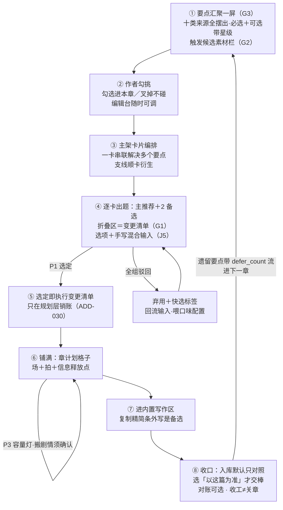
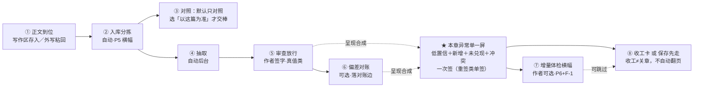

# M8 续写规划详细设计 R03（M8_PLANNING_DESIGN）

身份：**轻档设计稿。** 第二版按 R13 对齐。这是整个产品的心脏机制：要点汇聚→主架卡片→逐卡出题→选定即改账→铺成章计划→作者写正文→回来收口。计划不许叫已发生的事实。入库不自动交棒。对账可选。收工 ≠ 关章。内置写作区是主路径。历史稿 [M8_PLANNING_DESIGN_R02.md](M8_PLANNING_DESIGN_R02.md)／[R01](M8_PLANNING_DESIGN_R01.md) 保留不动。

上承 [OUTLINE_STRUCTURE_DESIGN_R02.md](OUTLINE_STRUCTURE_DESIGN_R02.md)、[DAILY_LOOP_WALKTHROUGH_R03.md](DAILY_LOOP_WALKTHROUGH_R03.md)、**[PLAN_LEDGER_STORAGE_DESIGN_R03.md](PLAN_LEDGER_STORAGE_DESIGN_R03.md)（数据字段口径）**、[CONTEXT_PACKER_DESIGN_R01.md](CONTEXT_PACKER_DESIGN_R01.md)、[STOP_POINT_REGISTRY_R02.md](STOP_POINT_REGISTRY_R02.md)、[WRITING_DESK_DESIGN_R03.md](WRITING_DESK_DESIGN_R03.md)。

不是施工合同；第 8 节 C7 是「可施工合同的人读版」。例子沿用《万鬼伏藏》。

## R01→R02 变化清单

依据：第三册挂账本（小说架构仓，路径含中文，复制用）`/Users/a1234/挣钱/小说架构/TEMP/bgboard-audit-20260809-r01/26_R09_ADDENDUM_LEDGER_VOL3_20260813_R01.md`。ADD 系全部 `PROXY_DECIDED` 替拍，CZ 可逐条改判；J5 是 CZ 已拍板（ADD-017）、R01 自立牌承诺 R02 吸收。

| # | 变化 | 出处 | 落点 |
|---|---|---|---|
| 1 | 🔥 **「选项消化」语义收窄为只在规划层销账**：选定只表示「安排进了章计划」；人物/伏笔/灵感的「实际发生」态只能由六态对账边或作者签字推进。R01 里「选中」被写成「已发生/已兑现」的地方逐处改（清单见 §3.6 铁律段） | ADD-030.1 | §0、§3.2、§3.6、§4.1、§6.5、§8.2 |
| 2 | **对账边升一等公民后，消化清单与对账的关系重画**：对账产出从「三桶派生视图」改为「落对账边实体（六态）＋归组视图」；改一条 F 自动撤回下游接上机器层 | ADD-030.2 | §6.3、§6.5 接线表 |
| 3 | **收工审计合成「本章异常单」一屏**：低置信抽取＋重要新增＋未兑现＋冲突集中一屏一次签（重签类照旧单签）；支持「保存先走、次日收口」 | ADD-035.2 | §6.4（新）、§6.6 |
| 4 | **欠账防滚雪球**：defer_count＋超阈值升级处置（不许无限挪期） | ADD-035.4 | §6.3、§1.1 |
| 5 | **字数预估校准三点**：触发阈值不得小于模型误差（105% 那档数学错误修正）；搬动剧情必须作者确认（R01 省心档自动搬是越权，Q4 原话是「系统提示」）；提示用柔性区间 | ADD-035.3 | §4.2、§9（P3 修订提交注册表） |
| 6 | **目的挂卡＋反向拆卡（A9 原题已拍）**：要达成的效果挂到卡上（附着或单独开卡），人加注解影响选项，不改底层；冲突爆给作者；工作流可向前拆前置卡。轻按钮只是入口之一，不是答案 | ADD-037／A9 | §1.2、§1.5、§3.2 |
| 6b | **写作指导＝出题副产品**，不另开生成 API；三层＝卡片要解决的问题／对白透露目的／插件写法 | ADD-036／G5 | §1.5 |
| 7 | **写作小抄默认节拍级、可展开句级**——章计划精简条的展示口径注明 | A10 替拍 | §5 |
| 8 | **J5 三件落地**（R01 文首待办牌销账）：选项＋手写混合输入是所有选择界面的常态；组合输入触发重新评估、重出变更清单；落位核查环节进机械校验清单 | ADD-017 J5 | §1.5、§3.2、§3.5、§3.6 |
| 9 | 数据字段增补清单（§8.4）与存储稿 R02 对齐：对账边/defer_count/handover parts 已进存储 R02，从挂账清单划走 | 本稿 | §8.4 |

## R02→R03 变化清单（2026-08-15，按 R13）

| # | 改了什么 |
|---|---|
| 1 | 铺满的是章计划格子，不许叫「事实句层」 |
| 2 | 内置写作区是主路径；复制出去写、粘回来是备选 |
| 3 | 入库默认只对照；作者选「以这篇为准」才交棒 |
| 4 | 正文对账可选；无正文收工不跑对账 |
| 5 | 收工 ≠ 关章；收工卡不要自动翻下一章 |

---

## 0. 一句话＋一张图

M8 干的事，说白了就是每天陪作者走这一圈：**先把「这一章要解决什么」全摆上一张桌子 → 作者像逛素材货架一样勾挑 → 系统把要点编排成几张主架卡片 → 逐卡出题给选项，每个选项折叠区里写好「选它账上怎么动」，选定那刻规划账就改完 → 铺成章计划 → 作者进内置写作区去写 → 收口时入库默认只对照，作者选「以这篇为准」才交棒；对账可选；收工不等于关章。** 作者的笔永远是自己的，M8 只管想清楚和记清楚。



三句话读图：

1. **章计划的上游是一张摆满的桌子，不是一道突然的题**（G3）：十类来源汇聚一屏，必选钉死、可选带星级；出题在主架卡片编排之后逐卡进行。
2. **选项是「剧情方向＋账务动作」二合一**（G1），🔥 但账务动作**只动规划层**【R02 修订（ADD-030，2026-08-13 替拍）】：选定销的是「这事安排了没」的账；「这事发生了没」由收口对账落的六态对账边回答——两层状态轴，选项永远推不动第二层。
3. **收口是一条流**：粘回→入库即移交→**本章异常单一屏**（审查＋对账＋冲突合成一次签）→对账边落账→收工卡或「保存先走」；未兑现项带着 defer_count 流进下一章汇聚屏——循环闭上，欠账滚不成雪球。

## 1. 章计划的完整画面：要点汇聚 → 主架卡片 → 逐卡出题

### 1.1 要点汇聚一屏：十类来源，全部摆出来，不许藏

与 R01 一致（十类来源表、机械捞/模型提议两栏、诚实标注），一处修订：

【R02 修订（ADD-035.4，2026-08-13 替拍）】来源 2「上一章存留问题」里，从对账「未实现」桶改期来的条目**带着 `defer_count` 显示**（「已挪 2 次」角标）；`defer_count` 达到阈值（默认 3，⚠️ 起步值）的条目**强制置顶＋只给三选处置**：钉进必选区这章必须还／降级改写（作者改小这笔账，如伏笔降级为背景色）／作废（留痕）——**不再提供「再挪一章」按钮**。防的是「越拖越沉底、出现概率越低」的滚雪球（F1「分期偿还」的补全，管的是「拖太久怎么办」）。

### 1.2 必选 vs 可选：素材货架，星级推荐

与 R01 一致（必选不能移出；可选带星级、勾＝进本章、叉＝本章不读不用；节奏灯只提醒不硬拦；星级是推荐不是判决）。

工作台首屏示意两处更新【R02 修订（A9＋ADD-035.4，2026-08-13 替拍）】：

```
第 5 章工作台 ｜ 目标字数 3,000 ｜ 本章规划约 40 积分（包内动作不再逐次问）
已勾偿还类 1/2 ｜ 出题前注意到 1 个剧情机会 ▸ ｜ [💡 我已有画面/想法]
━━ 必选（本章主架必须解决）━━━━━━━━━━━━━━━
 ① 接上章钩子：棺中第二次心跳（S-0004 出口）
 ② 本章目标：让「棺里的东西活着」立起来（草案，可改）
━━ 可选（素材货架：勾＝进本章 · ✗＝本章不碰）━━━━
 ☑ ★★★★★ H-0005 心跳之谜推进——触发条件「九棺决意查棺」已满足，正在最佳期
 ☑ ★★★★☆ MC-0012 师妹线露面——挂靠师妹已 2 章未出场（灵感落地欠账）
 ☐ ★★★★  转变提议：九棺从「不敢想」到「必须查」（模型提议）
 ☐ ★★★   压力释放：连压两章，该给一小口喘息（theory.情绪节奏）
 ☐ ★★★   ⏰已挪 2 次 PE-0388 族老托梦（上上章未写，再挪 1 次就要处置）
 ☐ ★★    H-0004 族谱变淡规律——触发条件「第二口棺开启后」未满足，预热中
        [编排主架卡片 →]        [直接手写章计划]
```

屏头的 **[💡 我已有画面/想法]** 可以当界面入口之一（J5 混合输入），**不是 A9 的答案**。CZ 亲拍（ADD-037）：要达成的目的挂到卡上——①附着在别的剧情生成上「顺便处理这个效果」；②单独开一张卡专门处理。人在卡上加注解／额外限制，**一起影响这张卡生成选项的内容**，不绕过 Agent 去改底层文件。跟已有内容／本章原意图打架时要爆出来，问作者改哪边。先有结局／画面、中间缺过程时，把意图交给工作流反向拆：「要达成这个，前面得先达成什么？」向前生成前置卡片。轻按钮只负责把这句话送进这套机制。

### 1.3 触发系统：绑事件不绑章节号＋预热＋素材栏（G2）

与 R01 一致（trigger_condition/trigger_refs/window_hint 三字段、四相位、素材栏勾/叉），不重抄。

### 1.4 主架卡片编排：一卡串联多个要点，支线顺卡衍生

与 R01 一致（arc_card 字段、串联解决、支线衍生是建议不是自动增殖），不重抄。

### 1.5 出题粒度＋输入形态【R02 修订（J5＝ADD-017；A9 由 ADD-037 亲拍改写）】

**粒度＝主架卡片，一卡一题：主推荐＋2 备选**（与 R01 一致，理由不重抄）。R02 把 R01 文首待办牌的 J5 三件正式落进来：

**① 选项和手写不是二选一——所有选择界面的常态输入形态。** 出题卡、要点勾选、拆解三案……一切给选项的地方，作者都可以：只选／只手写／**选了再手写补充**（「方向对但太简单，我补两点」）。界面上每张出题卡底部常驻：`[✍ 补充/修改这个方向]`（选中某选项后追加手写）＋把目的／限制写进**本卡注解**（ADD-037：注解影响下一轮选项，不是直接改账）。`[💡 我已有画面/想法]` 只是把这句话送进「目的挂卡／反向拆卡」，不是绕过 Agent 的打字捷径。

**①b 写作指导是出题时就已经给看的副产品（ADD-036／G5），不另调一次 API。** 三层对应已有位置：这段写什么＝这张卡要解决的问题；对白该透露什么＝选项里「声称／说／透露」的目的；该如何写＝插件自带写法（没有插件就空着）。J1 不变：给要求给信息点，不给示范成文。

**② 组合输入 → 重新评估，重出变更清单。** 手写必然带来新东西（新事实句/新编排/新规则/人物状态）。作者提交「选项＋手写补充」后，系统**针对组合输入重出一份变更清单**（一次小额调用，计入会话包）：原选项折叠区的清单作废，新清单列出组合后要动的每一笔——手写新增的拍、被手写覆盖的原方案条目、连带的人物状态变化。作者看的、P1 放行的、3.6 执行的都是**新清单**，不是旧的。纯手写（无选项）同理：变更清单完全从手写内容评估生成。

**③ 落位核查（必须有，进 3.5 校验清单）。** 机械＋模型核查手写内容：有没有这个位置可填、是否硬填冲突（本有值又填一值）、名字写错（主角叫王刚写成李刚——CH 号解析失败或指向不一致）。核查完回告作者哪里有问题、给修改建议，作者改完或坚持后才落账。**用户会写错，AI 也会生成错；事后核查和开头就带大量幻觉的生成是完全不同的效果**（CZ 原话）。

**专业路径**（与 R01 一致）：工作台常驻「直接手写章计划」，手写型选择记录 `mode=manual`，消化状态、兑现链接、留痕全走同一条链，下游对手写和出题无感。

**生成的调用结构**（R02 在 R01 四步外补一行）：

| 步 | 调用 | 产出 |
|---|---|---|
| 汇聚 | 1 次 | 要点板 |
| 编排 | 1 次 | 主架卡片草案 |
| 出题 | 每卡 1 次 | 3 选项（含折叠区变更清单） |
| **组合输入重评估**【R02 新增（J5）】 | 有手写补充时每次 1 次（小额） | 重出的变更清单＋落位核查报告 |
| 铺满 | 全卡选定后 1 次 | 整章计划格子 |

### 1.6 ⚠️ 出题质量需真书原型实验

与 R01 一致（六本书、指标表、判停），R02 补一条指标：**落位核查层**——预埋 10 处手写错误（错名字、填占用位、越权改设定），核查检出率起步线 ≥8/10（机械三类必须 10/10，模型判的指称类允许漏）。

## 2. 出题前的前文分析：剧情机会（G4）＋最小修

与 R01 一致（矛盾＝剧情机会口径、不加新调用、三级去向、机械校验防幻觉机会），不重抄。

## 3. 选项生成合同（细化到可施工；折叠区＝变更清单）

### 3.1 输入

与 R01 一致（C9 包、本卡上下文、弃用记录、口味配置、节奏参数、作者临时约束）。

### 3.2 输出：主推荐＋2 备选；每个选项＝简短回答＋折叠区

简短回答区字段与 R01 一致（key/summary/why_fit/tradeoffs/risks/expected_length/pacing_note）。

**折叠区＝变更清单 `change_list`**，六分组同 R01，两处语义修订【R02 修订（ADD-030，2026-08-13 替拍）】：

| 分组 | 装什么 | 选定后的执行方式 |
|---|---|---|
| `resolves` | 解决哪些要点（引用必须来自本卡要点∪本章已勾选要点） | 直接执行：对应对象翻 `digested`／`paid`，挂本次 OPT 号——🔥 **翻的全是规划层「已安排」**：`digested`＝安排进了章计划，伏笔 `paid`＝**安排了回收**（存储 R02 §1.8 已把 `paid` 语义收窄）；没有任何对象在这一步变成「已发生/已兑现/已揭示」 |
| `planned_events` | 计划事实句怎么动：`add[]`／`revise[]`／`void[]` | 直接执行（规划账是计划层，P1 选定就是授权） |
| `hooks` | 伏笔怎么动：推进／**安排回收**（R01 写「回收」，改名防误读）／埋新钩／改预估回收位 | 直接执行；新钩生来 `model_suggested` |
| `character_states` | 人物状态怎么变：用存储 R02 §5.7 的多值键形 `{ch_ref, state_key, value, effective_from_story}` | 落章篮出口状态＋场的状态要求——**只写计划层预期；人物页 current 一个字都动不了**，actual 态只能由对账边或作者签字推进（ADD-030.1） |
| `setting_proposals` | Bible／世界规则要动的，恒带 `requires_signoff: true` | 永不直接执行——生成提案卡，作者显式确认才生效 |
| `exit_state` | 这张卡走完，世界定格在哪 | 落卡片出口，供下一张卡接力 |

铁律不变：**变更清单只动计划层**；真值事实句（F-）任何选项都动不了。

**组合输入（J5）**：作者选中选项后手写补充→原折叠区清单作废，重评估调用出新清单（1.5②），新清单同样过 3.5 校验，作者确认的是新清单。

### 3.3 「要点不解决要说明」怎么落

与 R01 一致（skip_note 必填＋建议去向＋自动落位），不重抄。

### 3.4 欠账偿还节奏：分期硬约束

与 R01 一致（机械层卡模型 `pacing_cap`、作者层只提醒、分期建议）。R02 补一句：分期建议给出的「这条更适合 S-000x」若被采纳，是**改期不是对账挪期**，不涨 defer_count——defer_count 只数「安排了、写了正文、没写出来」的对账挪期（§6.3）。

### 3.5 程序机械校验清单（V0 级，逐条可写成断言）

1–8 条与 R01 一致（JSON 可解析／恰好 3 选项／resolves 引用不编造／change_list 白名单＋设定恒提案／pacing_cap／skip_note／early_reveal_flag／弃用注入与字面查重）。

【R02 新增（J5＝ADD-017，2026-08-13 落地）】**9–11：落位核查组**（作用于手写输入与组合输入的重评估产物）：

| # | 校验 | 谁判 | 失败处置 |
|---|---|---|---|
| 9 | **位置存在性**：手写内容声明的落点（某场/某槽/某要点）在账上存在且属本章范围 | 机械 | 回告作者「没有这个位置」，给近似候选 |
| 10 | **硬填冲突**：目标格子本有值又填一值（如出口状态已定又写一个不同的）——只拦「静默覆盖」，作者显式选「覆盖」放行 | 机械 | 亮对照（旧值 vs 新值），作者三选：覆盖／合并／收回 |
| 11 | **指称核对**：人物名解析到 CH 号；解析失败或与在场人物表冲突（主角叫王刚写成李刚）；地点/物品同理对设定集 | 机械（解析）＋模型（近似指称判定） | 回告「哪里可能写错」＋建议改法；作者可坚持（他的书他说了算，留痕） |

### 3.6 选定那一刻：执行变更清单【R02 修订（ADD-030，2026-08-13 替拍）】

选定（P1）→ 程序照折叠区（组合输入时是重评估后的新清单）逐条执行：`resolves` 翻消化状态挂 OPT 号；`planned_events`/`hooks`/`character_states`/`exit_state` 落账（留痕 `actor: author`）；`setting_proposals` 生成提案卡待签。卡片翻 `resolved`；支线衍生建议此刻弹。落选选项整包留档。

🔥 **两层状态轴铁律（ADD-030.1，本节钉死，全稿约束）**：

> **选定＝规划层销账**：它能翻的只有 `digest_status`／`mc_status`／`hook_status`（含义全是「安排了」）。
> **「实际发生」是另一根轴**：人物页 current、伏笔实际兑现（fulfillment）、灵感 realized、读者实际可知——只能由 **outcome ∈ {完全, 变体} 的对账边**（存储 R02 §1.14）或**作者显式签字**推进。
> R01 里所有把「选中」读成「已发生/已兑现/已收」的表述（§3.2 resolves 行的「翻 paid」旧读法、§6.5 收工卡「1 收」的口头禅、§8.2「本章兑现了什么」）已按此逐处改写；违反这条的实现直接算 bug——背景板原话「未写成不发已发生态编号」。

### 3.7 驳回全组＝思路级弃用＋快选标签

与 R01 一致（group_status/discard_tags/discard_reason、只本槽回流、原地变灰、连弃 3 组提示），不重抄。

### 3.8 口味配置：数据形状＋进 prompt 的方式

与 R01 一致（taste.json 派生缓存、关章沉降增量更新、summary 进包、透明可改），不重抄。

## 4. 章篮成形与调整

### 4.1 铺满：铺的是章计划格子，不是已发生的事实

与 R01 一致（铺满表：目标/场安排带 arc_ref/拍/信息释放点/不能违反/写法指导栏/目标字数/各场预估/出口钩子），一处语义钉子【R02 修订（ADD-030，2026-08-13 替拍）】：拍从各卡 `change_list.planned_events.add` 落正式 PE、**生来 `digested`＝生来「已安排」**——它出生在计划层，到对账边落账前永远没有「已发生」一说。

### 4.2 容量灯与场挪动【R02 重写（ADD-035.3，2026-08-13 替拍）】

**触发时点**不变：铺满完成时；预估/目标被编辑时；卡片增删重铺时。灯是现算派生值。

**判定——三点校准全部落进来**：

1. **触发阈值不得小于模型误差**（数学错误修正）：R01 的「超 105% 算装不下」意味着 5% 容差，而字数预估模型的允许误差是 30% 量级——灯会天天误报，作者一周内学会无视它。R02 判定：设 ε ＝ max(30% ⚠️起步值, 该书实测预估误差中位数)（数据源＝§6.6 收工卡的「顺手校准」逐章累积）——**装不下＝预估合计 > 目标×(1+ε)**（起步即 130%）；**太空＝低于目标×60%**（40% 容差本就 ≥ε，维持）。实测误差降下来，阈值自动收紧。
2. **提示用柔性区间**，不用百分比判决腔：✅「这章的戏大概要 3,800–4,600 字才写得完，目标是 3,000——要不要匀一点出去？」❌「预估 4,200，超标 140%」。
3. **搬动剧情必须作者确认**：R01 省心档「自动应用＋留痕＋撤销」对挪卡/挪场/并槽是**越权**——Q4 拍板原话是「系统提示」，自动搬剧情推翻了它。R02 三型动作全部改为**建议卡＋作者确认**：

| 型 | 动作 | R02 行为 |
|---|---|---|
| 挪卡/挪场 | 「卡二整体挪下一槽」「场 3 的旧怨块挪 S-0006」 | 建议卡（带影响预览：动哪些场、下一章会多多少）→作者点头才落 `slot_mappings` 预调整行 |
| 并槽 | 太空且下一槽薄：「与 S-0006 合并」 | 同上 |
| 场内瘦身 | 超得不多：「场 2 砍铺垫块，900→700」 | 建议卡→作者一键应用（也是显式确认，只是轻） |

省心档与掌控档的区别只剩**提示形态**：省心档建议卡收在横幅一行不弹窗、作者有空再点；掌控档当场弹卡。**没有任何档位自动搬剧情。** P3 注册表行按此修订，提交 [STOP_POINT_REGISTRY_R01.md](STOP_POINT_REGISTRY_R01.md) 承办（§9）。

### 4.3 作者手动改的自由度

与 R01 一致（格子全可改、牵一发自动跟、局部 AI 微调），一处随 4.2 连动：改预估触发容量灯后走「建议卡＋确认」，不再有自动应用路径。

## 5. 写正文的交接：M8 侧给什么数据

交付合同不变：**「章计划精简条」＝C7 的字段投影**；提示词工厂第二重身份（J1）不变。

【R02 修订（A10 替拍，2026-08-13）】**展示粒度口径注明**：精简条**默认「节拍档」**——本章目标／场序表（每场胶囊一句＋字数预估＋POV）／信息释放点／红线全量／出口钩子／写法指导一句。K1 拍板原话「本章核心内容其实很少」，130 条事实句 ÷ 3000 字＝每 23 字兑现一条，默认摆出来就是逐句翻译器，压死人。**可展开「逐句档」**：点开某场展开该场 `planned_events` 拍全文（R01「拍全文不进精简条」收窄为「不进默认档」）；「复制章计划（纯文本）」同样两档，默认复制节拍档。这是展示层选择不动账本；CZ 若想默认句级，翻一个默认值即可（A10 替拍，留改判口）。

节拍档输出示意（与 R01 相同，即 R01 那份示意就是节拍档）。

## 6. 收口流：从粘贴到收工，一条流【R02 重画（ADD-030＋ADD-035，2026-08-13 替拍）】

### 6.1 八步一图，每步谁触发



| 步 | 谁触发 | 干什么 | R03 变化 |
|---|---|---|---|
| ① 正文到位 | 作者点 | 写作区存入，或外写粘回 | 内置写作区是主路径 |
| ② 入库分拣 | 自动 | 单章走 P5 | 不变 |
| ③ 对照／交棒 | 作者选 | 默认只对照；选「以这篇为准」才走 handover_parts | 入库不自动交棒 |
| ④ 抽取 | 自动后台 | M2→M3 出候选 | 不变 |
| ⑤ 审查放行 | 作者（真值签字） | 章卡流审查 | 机制不变；**呈现并入异常单**（6.4） |
| ⑥ 偏差对账 | 作者可选（有稿才建议） | 比对结果落对账边实体（六态） | 无正文不跑；可跳过 |
| ⑦ 增量体检横幅 | 作者可选 | G7 口径不变 | 不变 |
| ⑧ 收工 | 作者点／条件满足可亮 | 收工卡或「保存先走」；**不自动翻下一章** | 收工 ≠ 关章 |

### 6.2 两个悬了很久的口径（R03 改判）

**裁决一**：外写新稿入库默认只对照，不自动交棒。作者选「以这篇为准」才移交。写作区「存入产品」同口径。operation_id 护栏仍管跨文件一致性（存储 R03 §5.1）。

**裁决二**：对账拿「已确认事实」比计划，排在审查放行之后。有稿才建议跑，作者可跳过。无正文收工不跑对账。

### 6.3 对账怎么比：落对账边（六态），三桶变归组视图【R02 重写（ADD-030.2，2026-08-13 替拍）】

**谁跑**：M8 收口件（对账回答「计划兑现了没」，规划账的问题）。输入＝C4 查本章已确认事实＋规划账查该槽已移交的 PE／伏笔回收安排／MC。

**怎么比**：一次小额模型调用做语义匹配，**产出＝每条已移交计划对象一条对账边**（存储 R02 §1.14），观察结果六态（背景板拍板词表）：

| outcome | 人话 | 归组视图 |
|---|---|---|
| `exact` 完全 | 按计划写出来了 | ✅ 兑现 |
| `variant` 变体 | 写出来了但变了样（带 `variant_note`） | ✅ 兑现（角标「变体」） |
| `unrealized` 未实现 | 正文里找不到 | ⚠️ 未写（进异常单） |
| `contradicted` 相反 | 正文写了相反的事 | ⛔ 冲突（进异常单，最重） |
| `unplanned` 新增 | 成文有、计划没有（`planned_ref=null`），且有分量 | ➕ 新增（进异常单；零散小事实不建边，防唠叨） |
| `ambiguous` 模糊 | 模型判不动 | ⚠️ 待人判（进异常单） |

R01 的「三桶」升级为这张归组视图——桶是给人看的归组，**边才是账**。R01 没有的 ⛔ 相反档补上（背景板六态里本来就有，三桶漏了它）。

**处置＝边上的 `author_decision`**（观察/处置两轴分开，存储 R02 替拍 1）：

- ✅ 兑现：无需处置；伏笔 fulfillment、人物 current、M9「本章兑现了什么」这些下游此刻才有权推进——全部带 `support_set` 指回这些边。
- ⚠️ 未写：三键——**挪去下一章**（`action: defer`，该 PE/H/MC 的 `defer_count` +1，落下一章汇聚屏；达到阈值后这个键消失，只剩三选处置，见 1.1）／作废（`void_plan`，留痕）／就这样（`accept_as_is`，挂 `deviation_note`）。
- ⛔ 相反：不许静默；进异常单冲突栏，作者选正文赢（默认，计划侧留痕）或改正文迁就大纲（任何档位显式——铁边界不变）。
- ➕ 新增：提示登人物名单/故事线成员；处置后边留档。

**机械覆盖校验兜底**：该槽每条已移交 PE 必须有边，模型漏判的强制建 `ambiguous` 边——对账不许藏账。**改史自动撤回**从此接上机器层：某条 F 被改判→反向索引（存储 R02 §5.4）找到引它的边→边转 `stale`→吃这些边的派生结论（伏笔 fulfillment、人物 current 投影）自动回撤或标过期，等重对。对账调用计入会话包。

### 6.4 本章异常单：一屏一次签【R02 新增（ADD-035.2，2026-08-13 替拍）】

**问题原样**：R01 收口让作者连做两轮审计——34 条事实候选审查一轮、对账三桶处置一轮，深夜写完最后一个字的人最容易在这里弃疗。

**做法**：⑤ 和 ⑥ 的**机制不动**（审查仍是真值签字、对账仍落边），**呈现合成一张「本章异常单」**，只摆四类真需要人看的东西：

```
━━ 第 5 章异常单 ━━━━━━━━━━━━━━━━━━━━━━━
⛔ 冲突 1 ｜ 计划「爷爷遗忘九棺」——正文写的是师妹遗忘 → [正文赢·计划留痕] [改正文(显式)]
⚠️ 未写 1 ｜ PE-0388 族老托梦（已挪 2 次）→ [挪下一章(最后一次)] [降级改写] [作废]
➕ 重要新增 2 ｜ 新人物「守夜人」出场 → [登人物名单] ｜ 义庄有第二层地窖 → [收编设定]
🔍 低置信抽取 3 条 ▸ 展开逐条看
━━ 重签区（照旧单签，不随批量）━━━━━━━━━━━━
 ☐ 死亡类：老仵作之死（正文第 41 段）——需单独签字
────────────────────────────────
   [✓ 签这一屏（重签区除外）]        [保存先走，明天收口]
━━━━━━━━━━━━━━━━━━━━━━━━━━━━━━
```

- **一次签**签掉的是：无争议低置信项的放行＋新增登记＋未写处置——批量语义与各机制原有档位一致；
- **重签类照旧单签**：死亡/秘密揭示/物品转手这类高影响事件（重签清单族）永不进批量，异常单里单独一块，逐条勾；
- **「保存先走」**：一个键把整单挂起——正文已安全入库（③早完成），异常单存为待办；不逼深夜的人做判断。
- 无异常时这一屏就一行「✅ 本章无异常，直接收工」。

### 6.5 分工接线：谁兜什么【R02 更新（ADD-030）】

| 机制 | 兜什么 | 不兜什么 |
|---|---|---|
| 变更清单执行（3.6，创作时） | 「要点有没有被**安排**」——选定那刻规划层销账 | 不兜「安排了但没写」；**推不动任何 actual 态** |
| **对账边（6.3，写完时）** | 「安排了的有没有**写出来**」——六态落账；**actual 态的唯一机器通道** | 不改消化记录（选题时的决定不回滚）；不管正文内部矛盾 |
| P4 删改重核（改计划时） | 作者删改已消化计划后的兑现链接重核 | 不管正文侧 |
| 增量体检（G7 口径，粘回时可选） | 新正文与真值、与自身的矛盾 | 不管计划兑现度 |

一句话记忆升级：**变更清单管「安排」，对账边管「发生」，P4 管「反悔」，体检管「写错」。** 两层状态轴的分界线就画在前两格之间。

### 6.6 「本章收工」的完成态＋保存先走【R02 修订（ADD-035.2）】

**全清收工（机械可判）**：规划做完 ∧ 异常单无未处置项（作者可把未写边标「就这样」）→ 收工卡可以亮。体检不是完成条件。对账不是完成条件。**收工卡亮起，入口不要自动翻到下一章。** 关章另走六道硬门。

**保存先走**：任何时刻可点——异常单挂为待办；收工卡换成暂存卡：

```
💾 第 5 章已保存（3,050 字安全入库）· 异常单 4 项明天收口
   明早首页主按钮就是它，放心睡。
```

次日首页主按钮变「收口第 5 章异常单（4 项）」，直达 6.4 那一屏；收口完成才亮正式收工卡。连续创作天数按「写了正文」计，暂存不扣（打卡心理不被收口时间绑架）。**人仍留在项目第一屏或本章现场，不自动进下一章。**

收工卡（与 R01 一致，两处措辞修正【R02 修订（ADD-030，2026-08-13 替拍）】）：

```
🎉 第 5 章「守棺」收工！
今天：正文 3,050 字 · 入账 31 条 · 计划兑现 3/3（对账边：2 完全 1 变体）· 连续创作第 3 天
全书：5 章 · 16,100 字 · 伏笔 4 笔（1 已兑现 3 挂——本章新埋「仵作的警告」；H-0004 已进预热期）
顺手校准：本章预估 3,000 / 实写 3,050，偏差 1.7%（累计中位数 12%，容量灯阈值已收紧到 ±30%→…）
明天的桌面：第 6 章要点预览——必选 2 项 · 货架候选 4 项（1 条正在最佳期）
              [看一眼第 6 章 →]                [今天到此为止]
```

措辞修正说明：「计划兑现 3/3」「1 已兑现」现在**只在对账边落账之后**出现，且数字直接数边（exact＋variant）——收工卡本来就在对账后亮，R01 的数字位置没错，错的是没写明数据源；「顺手校准」的累计偏差同时喂 4.2 的 ε。

### 6.7 P13 档位表现（给注册表回填）

| 档 | 表现 |
|---|---|
| 省心（默认） | 对账建议跑、可跳过：兑现边静默；未写边可一键「就这样」＋标注挂着＋角标可回访（defer 需作者点，不自动挪） |
| 掌控 | 若跑对账：异常单弹出，逐项处置完才到收工卡 |
| 铁边界 | 反向动作（改正文迁就大纲）任何档位显式；「以这篇为准」才交棒，不进自动档；对账跑不跑由作者选，无正文不跑 |

【R02 修订】省心档的「未写自动处置」从 R01 的「自动挂 deviation_note」细化为「自动 accept_as_is（挂标注）」——**自动路径永不选 defer**：挪期会涨 defer_count、改变下一章的桌面，这种有后果的决定只能作者亲手点。

## 7. 花钱确认户口：规划会话包（F-4）

与 R01 一致（会话定义、进入时报一次、包内免确认、120% 超支闸门、过程感知、F-4 提交行）。R02 两处小补：组合输入的重评估调用（1.5②）计入包内「局部微调预留」；异常单的对账调用本就在包内（收口对账 1 次）。

## 8. C7 落地版 v1

### 8.1 定位与铁字段

与 R01 一致：C7＝章篮只读快照，`status` 恒 `"plan"`。

### 8.2 字段表 v1

与 R01 一致，一处措辞修订【R02 修订（ADD-030，2026-08-13 替拍）】：`digested_refs` 的说明从「本章解决了哪些要点」订正为「本章**安排解决**了哪些要点」；给 M9 的展示口径同步分两句——未移交章显示「本章安排了…」，已移交章的「实际兑现」M9 必须改从对账边取数（带 support_set），不许拿 `digested_refs` 冒充兑现清单。`basis_note` 按存储 R02 §5.3 升级：双时点＋`story_commit_seq`。

### 8.3 JSON 示例

与 R01 一致（S-0005 三场示例），两处字段随上游连动：`basis_note` 加 seq（`"fact-ledger@2026-08-14T03:00 / plan-ledger@2026-08-14T03:02 / seq@112"`）；场的 `characters`／`pov` 按存储 R02 用 CH 号。其余不重抄。

### 8.4 衔接点与配套账本增补【R02 更新】

与 C9／C5／M10 的衔接不变。**配套账本增补清单对齐存储 R02 后的现状**：

| 对象 | 增补 | 状态 |
|---|---|---|
| `reconciliation_edge`（RE-） | 六态对账边全套字段 | ✅ **已进存储 R02 §1.14**，本稿只是消费方 |
| `planned_event`／`hook`／`must_carry` | `defer_count` | ✅ 已进存储 R02 |
| `chapter_slot` | `handover_parts[]`＋`slot_status: partial` | ✅ 已进存储 R02 |
| 新对象 `arc_card`（AC- 暂定） | 1.4 字段表 | ⏳ 挂账，随存储稿下一修订吸收 |
| `chapter_slot` | ＋`point_board` | ⏳ 同上 |
| `hook` | ＋`trigger_condition`／`trigger_refs`／`window_hint`；`payoff_slot_ref` 语义降级 | ⏳ 同上 |
| `option_record` | ＋`mode`／`card_ref`／`group_status`／`discard_tags`／`discard_reason`；`variant_note` 转正；options 子结构改（含 `change_list`） | ⏳ 同上 |
| 流水动作词 | ＋`discard`／`apply_changes`（`reconcile` 已进存储 R02） | ⏳ 部分挂账 |
| plan.json 设置区 | ＋`planning_prefs: {pacing_cap: 2, default_target_length: 3000, defer_escalate_at: 3}`【R02 加第三项】 | ⏳ 挂账 |
| 新文件 `taste.json` | 3.8 形状 | ⏳ 挂账 |
| C9（落地时） | `why_loaded` ＋`discarded`／`taste` | ⏳ 挂账 |

## 9. 停点与登记提交

- **F-4**：照 R01 提交注册表 F 类领号（第 7 节）。
- **P13**：宿主＝本稿 §6.3–6.7；【R02 修订】省心档未写处置「永不自动 defer」补进注册表行。
- **P3**：【R02 修订（ADD-035.3）】语义从「省心档提醒不停（自动应用＋留痕＋撤销）」修订为「**搬剧情类任何档位建议＋作者确认**；省心档区别只在提示形态（横幅 vs 弹卡）」——提交注册表承办改行。改判理由：Q4 拍板原话是「系统提示」，自动搬剧情是设计稿越权，且 N19-B 本就不许静默改规划。
- **P1／P2／P4／P9**：照注册表现行，零改动。
- **异常单不占停点号**：它是 ⑤⑥ 既有停点的呈现合成，签字语义没变；重签类单签沿用重签清单族纪律。
- 盘点过不占号的（照 R01）：剧情机会提示、要点勾选/叉掉、卡片增删拆并、触发预热提醒、支线衍生建议、弃用反馈、收工卡与校准提示；【R02 新增两笔】「我已有画面/想法」入口（作者主动动作）、落位核查回告（校验产物随输入流程走，提醒类）。

## 10. 开放问题（交 CZ 拍）

O1（`pacing_cap` 默认值）、O2（触发条件形态）、O3（口味配置跨书吗）三条维持 R01 原样待拍，不重抄。

【R02 新增】**O4｜defer 升级阈值 `defer_escalate_at` 默认 3 合适吗？** 挪 2 次还宽松、挪 3 次强制处置——数字是替拍起步值（⚠️ 无实测）。太小会逼作者在还没想好时作废好点子，太大回到滚雪球。可与 O1 一起拍（同属节奏参数族）。

## 11. 轻档自查记录

- 任务书逐项回对：ADD-030 规划侧——「消化＝规划层销账」语义收窄（§0/§3.2/§3.6/§4.1/§8.2 逐处改写，铁律段 §3.6 汇总清单）；对账边一等公民后消化清单与对账关系重画（§6.3 落边＋§6.5 接线表两轴分界）——无缺项。
- R01「选中＝已发生」逐处排查记录：§3.2 resolves「翻 paid」旧读法（改「安排回收」）；§3.2 character_states（补「current 动不了」）；§6.3 三桶无实体（改落边＋补 contradicted 档）；§6.5 收工卡「1 收」（改「1 已兑现」＋注明数据源＝对账边）；§8.2「本章兑现了什么」（拆「安排」/「实际兑现」两句，M9 取数改道）；§4.1 铺满「生来 digested」（补语义钉子）。全稿再查无残留「已发生/已兑现」冒充处。
- ADD-035 逐件回对：异常单一屏＋重签单签＋保存先走（§6.4/§6.6）；defer_count＋超阈值处置（§1.1/§6.3/§6.7 自动路径永不 defer/O4）；字数预估三点（§4.2 重写：阈值≥模型误差、搬剧情须确认＋P3 修订提交、柔性区间）——无缺项。
- A9 亲拍（ADD-037）落点：目的挂卡／卡上注解影响选项／冲突爆出／反向拆前置卡（§1.2/§1.5）；轻按钮只当入口，不再写成答案。G5（ADD-036）：写作指导＝出题副产品（§1.5①b）。A10 精简条默认节拍级可展开逐句档（§5）沿用替拍，亲拍未推翻。
- J5 待办牌销账核对（R01 文首牌三点）：①混合输入所有选择界面（§1.5①）②组合输入重出变更清单（§1.5②/§3.2/§3.6）③落位核查（§3.5 校验 9–11＋§1.6 实验补指标）——牌已撤，三落点齐。
- 与存储 R02 咬合核对：六态词表同源（背景板词典）；defer_count 落欠账对象本体、边只记单次观察（两稿一致）；观察/处置两轴（边的 `author_decision`）与 §6.3 处置键一一对应；`basis_note` 带 seq 与存储 §5.3 一致；§8.4 状态列与存储 R02 文头「M8 增补仍挂账」声明互不矛盾。
- 与已拍板一致性：G3/G1/G2/G8/G4/G7、F1/F5/F6/F7/F8、ADD-010 移交、K1/M3、重签清单族、J1 提示词工厂——全部原样承接；P3 修订有拍板依据（Q4 原话）不是新发明；「默认整章一次过」「沙箱真合并」两条 REJECT 未被本轮任何改动复活。
- ⚠️ 标注清点（新增部分）：ε 起步 30%＝模型允许误差沿用值；defer_escalate_at=3（O4）；落位核查检出率起步线 8/10；其余沿 R01。

## 12. 来源与追溯

- [M8_PLANNING_DESIGN_R01.md](M8_PLANNING_DESIGN_R01.md)：本稿父版，全文保留；R01 来源清单全部继续有效，不重抄。
- [PLAN_LEDGER_STORAGE_DESIGN_R02.md](PLAN_LEDGER_STORAGE_DESIGN_R02.md)：对账边（§1.14）、handover parts（§3.2）、defer_count、多值状态键（§5.7）、story_commit_seq（§5.3）——本稿消费的全部新字段。
- 第三册挂账本（小说架构仓，路径含中文，复制用）：`/Users/a1234/挣钱/小说架构/TEMP/bgboard-audit-20260809-r01/26_R09_ADDENDUM_LEDGER_VOL3_20260813_R01.md`——ADD-030、ADD-035、ADD-036（G5 写作指导副产品）、ADD-037（A9 目的挂卡＋反向拆卡）；A10 节拍级展示仍沿替拍。
- 组 A 消化稿（同仓，复制用）：`.../TEMP/external_returns_batch2_20260813/digest_A_ledger_architecture.md`——走查判词 3/10/11/12（本稿 §6 重画的直接证词）。
- 第一册挂账本（同仓，复制用）：`.../18_R07_ADDENDUM_LEDGER_20260813_R01.md`——ADD-017 J5（混合输入拍板原文）。

来源：Cursor（Fable 5）修订，2026-08-13；替拍授权依据第三册挂账本册首 CZ 原话；待 CZ 拍 O1–O4。

## 替拍决策记录（R02 新拍的细节层选择，供 CZ 复查改判）

1. **异常单四栏顺序**：冲突→未写→重要新增→低置信（按需要人脑的程度排，最要命的在最上面）；重签区独立块永不进批量签。
2. **「保存先走」的界面形态**：暂存卡＋次日首页主按钮直达异常单；连续创作天数按「写了正文」计，暂存不扣。
3. **defer 升级阈值默认 3**（`defer_escalate_at`，⚠️ 起步值，开放问题 O4）；达阈后「再挪」按钮消失，只剩钉必选区/降级改写/作废三选。
4. **自动路径永不选 defer**（§6.7）：省心档未写项自动 accept_as_is，挪期必须作者亲手点——挪期改变下一章桌面，是有后果的决定。
5. **分期建议采纳的改期不涨 defer_count**（§3.4）：defer 只数「写了正文没写出来」的对账挪期，规划期的排期调整不算欠账。
6. **容量灯 ε 公式**：max(30%, 该书实测预估误差中位数)，数据源＝收工卡顺手校准的逐章累积；实测降则阈值自动收紧。
7. **「我已有画面/想法」只是入口**（ADD-037 改判）：双落点仍在汇聚屏头＋出题卡底，但送进「目的挂卡／反向拆卡」，不是直达手写绕过 Agent。注解影响下一轮选项，不改底层。
8. **小抄两档命名**：默认「节拍档」、展开「逐句档」；「复制章计划」默认复制节拍档。
9. **落位核查三类分工**：位置存在性/硬填冲突＝机械必拦（10/10）；指称核对＝机械解析＋模型近似判（允许漏，作者可坚持）；核查是回告不是硬闸——作者坚持即放行留痕。
10. **组合输入重评估＝一次小额调用、原清单作废重出**（不做「旧清单＋补丁」的合并语义——两份清单叠加谁覆盖谁说不清，重出最诚实）；计入会话包微调预留。
11. **异常单不占新停点号**：它是 ⑤⑥ 既有签字点的呈现合成，机制零新增。

修订记录：
- R02 补记（2026-08-13 晚）：吸收 ADD-036／G5、ADD-037／A9 亲拍——目的挂卡、反向拆卡、写作指导＝副产品；轻按钮不再当 A9 答案。R01 保留不动。
- R02（2026-08-13）：按第三册挂账本替拍决策返工——ADD-030 规划侧、ADD-035、A10 替拍落地；J5 待办牌销账。
- R01 修订记录见父版文末。
