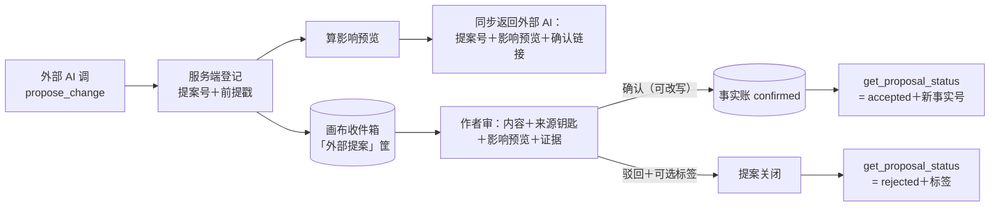

# 「故事真源引擎」MCP 对外接口设计稿 R01

身份：**轻档设计稿。** 它是总稿 F9 洞-23（MCP 正式工具清单未拍）的答卷候选：给出 V1 工具清单、提案生命周期、权限模型和分期，供 CZ 拍板；不是施工合同，字段名是建议。
拍板依据：CZ 2026-08-13 Q6（挂账本 ADD-002）——**MVP 核心环验证完成后即做「只读＋提案」版 MCP，早吃生态红利；写入正史永不开放给外部。** 本稿只管「怎么做」，不重新讨论「做不做、何时做」。
⚠️ 传输层、OAuth、token 存储这类协议实现细节全稿一律标「未调查」不展开——P1 报告明说授权体系是 MCP 实现里最花时间的部分，实施前开专项调查单。

---

## 0. 一句话＋三条铁边界

外部 AI（Claude／ChatGPT／Cursor／国内 Agent 平台）拿着作者发的钥匙连上来，能干两件事：**查这本书已经确认的事实（带原文证据），和交修改提案**。到此为止。

三条铁边界，全部已拍，本稿不再讨论：

1. **写入正史永不开放**（Q6 原话「永不」）：没有 `write_truth`、没有 `approve_fact`，提案批准只发生在网页端作者手里。P1 蓝本同款红线（returns/111 §4）。为什么：真值签字是作者独占权利，外部工具能写真源，「作者签字才成真」的信任结构就塌了——这是产品身份问题，不是安全加固问题（总稿 07 章）。
2. **MCP／CLI／人工成员同一权利边界**（N05-A，2026-08-12 拍板）：写侧只能提案，读侧最小授权、可撤销、可审计。
3. **候选不出门**：读工具只返回 `confirmed` 正史，`extracted` 候选和 `rejected` 一概不给。[C4 合同](../contracts/C4_FACT_QUERY.md)「只有 confirmed 是真值」的规矩，在大门口再执行一次。为什么：外部 AI 分不清「作者签过字」和「模型猜的」，混出去就是拿别人的幻觉污染作者的书。

### 0.1 和聊天框怎么分工（ADD-036／A14）

CZ 亲拍：聊天框**先暴露已有 MCP 能力**（就是上面这套只读＋提案），不要等「万能入口」做完才接线。意图识别住在**产品聊天**里：探讨 ≠ 真改 ≠ 查询。MCP 工具本身不负责猜作者想干什么，更不写真史。冲突交给质检模块。

V0 聊天可以仍薄（先把 `ask_story`／`get_fact`／`get_health_report`／`propose_change` 露出来），但不再写成「已降级成关键词框、等 CZ 拍要不要意图路由」。

---

## 1. 工具清单 v1

### 1.1 从 P1 七工具蓝本裁到我们的 V1

P1 蓝本（问／取证／状态／一致性／简报／导出／提案）是按「什么都有了」设想的。我们实际有的账本：**事实账**（C4，已实跑）、**体检报告**（C6，已实跑）、**规划账**（R02 设计稿，还没建）。按账裁剪：

| P1 蓝本 | 我们的处置 | 为什么 |
|---|---|---|
| 问 `story.ask` | ✅ V1 `ask_story` | M6 取证问答已实跑，正史＋证据都是现成的 |
| 取证 `get_fact`/`get_evidence` | ✅ V1 `get_fact`＋`get_evidence` | C4 每条事实自带引文和坐标；按需展开原文段是瘦包的标准第二步 |
| 状态 `get_state`（实体某时刻状态） | ⏳ V2 `get_entity_state` | 没有实体状态投影这本账；V1 「XX 现在什么状态」由 `ask_story` 现查现答兜住 |
| 一致性 `check_consistency` | 拆两半：✅ V1 `get_health_report`（读已有报告）；⏳ V2 `check_draft`（交草稿现跑） | 读报告是零成本只读（C6 现成）；现跑体检烧模型调用，要等体检引擎验证＋计价（积分预估制）后再开 |
| 简报 `story.build_brief` | ⏳ V2 `build_brief` | 章前简报吃规划账＋打包器 D11（[CONTEXT_PACKER_DESIGN_R01.md](CONTEXT_PACKER_DESIGN_R01.md)），两个都没落地，现在开就是空壳 |
| 导出 `export_projection` | ❌ 不开，远期再议 | 撞洞-23 的付费导出权利交叉（见开放问题 A）；全库带走的正路是网页导出 |
| 提案 `propose_change` | ✅ V1 `propose_change`＋配套 `get_proposal_status` | 提案通道是「只读＋提案」拍板的另一半身份，V1 必须有；蓝本没写查结果工具，轮询需要，补上 |
| （蓝本外补充） | ✅ V1 `get_project_status` | 外部 AI 连上来的第一句是「我能看哪几本书、账上有什么」，没有定向工具就只能瞎猜 |

结果还是七件套，但换了三张牌：状态／现跑体检／简报换成了项目定向、读体检报告、查提案结果。

### 1.2 V1 七张工具卡

字段名全部是建议值；返回字段跟着 C4/C6 合同走，合同升版（如字符级锚点 I-013 落地）MCP 投影同步升。

**`get_project_status`** ｜只读
- 干嘛：这把钥匙能看的书有哪些、每本账上概况如何——外部 AI 的开场定向。
- 输入：`project_id`（可省；省略＝列出全部可访问项目）
- 返回：书名、章数、事实账计数（confirmed 条数；候选只给条数不给内容）、最近一次体检时间＋红黄灯计数、账本版本戳 `ledger_version`（给提案当前提快照用）
- 为什么：一次调用完成定向，省得外部 AI 拿列表工具乱扫。

**`ask_story`** ｜只读
- 干嘛：自然语言问书里的事（「李星燃第一次见陈医生是哪章」），返回带证据的答案。
- 输入：`project_id`、`question`、`as_of_chapter`（可选，防泄底截断，见 1.3）、`mode`（`raw` 只给检索到的事实原料／`answer` 附一句站内模型组织的结论；默认档待拍，见开放问题 B）、`limit`（默认 5，上限 20）
- 返回：相关事实列表，每条三件套＝结论句 `text`＋逐字引文 `quote`＋坐标 `chapter_id`+`seg`；`answer` 档多一句总结论
- 为什么：这是外部 AI 最高频的一口；M6 已实跑，正史只读语义现成。

**`get_fact`** ｜只读
- 干嘛：按事实号取单条事实全档（外部 AI 拿着 `ask_story` 结果里的 id 深挖时用）。
- 输入：`project_id`、`fact_id`
- 返回：C4 投影：`id`／`text`／`quote`／`chapter_id`／`seg`／`decided_at`；内部溯源字段（`source`／`note`）不给，要看去网页
- 为什么：单点取数，配合分页配额，遍历成本天然高于网页导出。

**`get_evidence`** ｜只读
- 干嘛：按事实号展开来源段的原文——引文不够看时的「按需展开」第二级。
- 输入：`project_id`、`fact_id`
- 返回：该事实来源责任段（C2）的段落原文＋章节标题＋坐标；**一次一段，不给整章**
- 为什么：ADD-007 瘦包的标准动作——默认给引文，要上下文再单独展开，防止把正文当默认返回。

**`get_health_report`** ｜只读
- 干嘛：读最近一次一致性体检报告（[C6 合同](../contracts/C6_HEALTH_REPORT.md)），外部写作 AI 开工前先看「这本书哪里在打架」。
- 输入：`project_id`、`account`（`conflicts`／`insufficient`／`alias_hints`／`integrity`，可省＝只给摘要）、`page`
- 返回：报告摘要（生成时间＋红黄计数＋过期提示——C6 是快照、重跑覆盖）；指定账的条目分页，每条带涉事事实号＋双方证据
- 为什么：报告是事实账的只读投影快照，天然符合只读边界；四本账分开、摘要先行，正是瘦包形状。

**`propose_change`** ｜提案
- 干嘛：外部 AI 发现设定出入或想补一条事实时，交修改提案。**不改任何账，只投递。**
- 输入：`project_id`、提案体（三种之一：改已有事实 `target_fact_id`＋建议新表述／新增事实 `proposed_text`＋建议引文／质疑某条 `target_fact_id`＋理由）、`reason`、`based_on_version`（可选，调用方声明它看到的账本版本戳）
- 返回：`proposal_id`＋影响预览（V1＝涉事事实的引用处清单：来源章节、体检报告里牵到它的问题号；改史传播分析是 F10 长线账 v2 的事，V1 不吹）＋网页确认链接 `confirm_url`＋一句固定提醒「作者签字前此提案无效力」
- 为什么：P1 蓝本原样——`propose_change` 只返回影响预览和网页确认链接（SI-006 消化稿）；生命周期见第 2 节。

**`get_proposal_status`** ｜只读（查自己交的提案）
- 干嘛：外部 AI 回头查提案处理结果。
- 输入：`project_id`、`proposal_id`
- 返回：`pending`／`accepted`（附落账后的 `fact_id`）／`rejected`（附作者可选的原因标签，ADD-009 四标签同款）／`expired`
- 为什么：V1 用轮询闭合回路；webhook 推送 ⚠️ 未调查，远期。

### 1.3 防泄底在返回里怎么生效

防泄底不是全局开关，是**钥匙的属性**——同一本书可以同时有一把全知钥匙（自己写作用）和一把读者安全钥匙（对外问答 bot 用）。分两级落地：

**V1 机械档（现有字段就能做）：**
1. **章上限 `as_of_chapter`**：钥匙可设视角上限 N，所有读工具只返回来源章 ≤ N 的事实——C4 每条都有 `chapter_id`，纯机械过滤。场景：作者让外部 AI 给读者群做前 10 章问答，第 30 章的底牌根本不在返回集合里。
2. **正史门槛本身就是第一道防泄底**：没签字的猜测、抽错的候选不出门（铁边界 3）。
3. **收窄暴露面**：V1 只暴露事实账＋体检报告两本；材料架的简介卡、设定集、大纲原稿一概不给——设定集常整段写着结局级底牌，V1 没有逐条防泄能力就整类不开。

**V2 语义档（等字段建好）**：伏笔账「读者可知标记」（大纲 [R02](OUTLINE_STRUCTURE_DESIGN_R02.md) 已设计）和隐藏材料标记落地后——
- 全知钥匙：隐藏事实照给，但条目带 `spoiler: true`，提醒调用方别把这条写进对读者可见的产出；
- 读者安全钥匙：隐藏事实不给逐字，只给**安全摘要**（「此处有一条未揭晓设定，涉及〈某角色身世〉，按作者设置隐藏」）或整条不出现，两种由作者选。

---

## 2. 提案的完整生命周期

对齐 ADD-006：聊天框（这里是 MCP 通道）只是说话的地方，**产出必须落画布**——提案落收件箱，不悬在任何对话气泡里。

逐步说清：

1. **投递**：外部 AI 调 `propose_change`。服务端登记提案号，并盖一个**前提戳**——提案时的账本版本（23 号捞货概念 7「确认绑定当时前提快照」的轻量版）。作者后来审它时，如果涉事事实已经变了，界面亮「前提已变，先重看」。
2. **即时回执**：同步返回提案号＋影响预览＋网页确认链接。外部 AI 可以把链接直接说给作者（「我发现第 3 章和第 7 章的年龄对不上，提案在这里，你点开看」）。
3. **落画布**：提案进收件箱的**「外部提案」筐**——不跟体检风险混筐（23 号捞货「产物按身份分流」：不同身份的东西不倒进同一个候选池）。每条可见：谁提的（哪把钥匙）、什么时候、针对哪条事实、影响预览。
4. **作者处置**：桌面工作台或手机伴侣（查设定＋确认/驳回本来就是手机的活，总稿 07 章）看到收件箱。确认走审查台正常确认流——可改写后确认，原提案文备档进 `note`；驳回带可选原因标签（抽错了／重复／不重要／是梦境或假设，ADD-009 同款，标签数据一样喂迭代）。**没有「全部采纳」按钮**——章级封顶的签字含金量纪律（ADD-009）同样管提案。
5. **接受后的账务**：接受＝新事实以 `confirmed` 落账（C4 的 `source` 记 `mcp:<钥匙名>`，来源身份不冒充抽取器），或已有事实走改写确认。**提案在 pending 期间不是真值、不是候选**，不出现在任何读工具返回里——它是收件箱里的一封信，不是账上的一笔。
6. **结果回传**：外部 AI 轮询 `get_proposal_status`。V1 只有轮询；推送 ⚠️ 未调查。

---

## 3. 权限模型（人话）

一句话：**作者在网页端造钥匙，钥匙上写死了能看哪几本书、能干什么、看到哪一章；每本书还有一个总闸门，闸门一关，所有钥匙全部失效。**

- **谁能连**：V1 只有作者本人。作者在网页「外部连接」页给自己造钥匙（token），造钥匙时选四样：哪几本书、工具组（只读／只读＋提案）、视角档（全知／读者安全＋章上限）、有效期（默认值待定，建议 90 天）。一把钥匙给一个外部工具，别混用——审计流水才分得清是谁在读。这是 N05-A「按主体／对象／动作／有效期最小授权」在 V1 的落法；字段级、用途级的更细授权留 V2，先别把发钥匙页做成报税表。
- **项目级读取闸门**（23 号捞货概念 5，改造吸收）：每本书一个「MCP 访问」总开关，**默认关**——作者显式打开，这本书才对任何外部工具存在。关键在验权时机：**闸门是每次调用现场验的，不是发钥匙时验的**。所以关掉开关＝所有钥匙对这本书立即失效；**持有钥匙 ≠ 有读取权**。往后某类结构（隐藏材料、设定集）按书关掉后，任何工具任何入口都读不到——闸门装在数据层，不装在工具层，新工具忘了检查也漏不出去。
- **撤销**：三级——撤单把钥匙／关单本书闸门／全局关 MCP。全部立即生效（每次调用验权，不留长缓存）。
- **审计**：每次调用记一条流水：时间、哪把钥匙、哪个工具、哪本书、动了哪些对象（事实号）、返回多少条、有没有被闸门或配额拦下。作者有「访问记录」页，可看可导出（N05-A 要求支持导出授权记录）。异常模式提醒（如深夜高频扫读）V2 再细。
- ⚠️ **未调查区**：OAuth 2.1 还是别的授权协议、token 怎么存、传输安全——全部实施前专项调查。P1 的量级提醒记在这：权限和数据合同没稳时上 MCP 是 3–6 人月的坑，稳定后只是 6–10 人周的增量；**V1 的真正前置不是协议封装，是权限模型和 C4 合同先站稳**。

---

## 4. 返回内容的上下文纪律（ADD-007 瘦包）

账本可以细，出门的包必须瘦——对外部 AI 和对自家生成器同一标准：上下文太肥，外部模型一样找不到重点；瘦包同时就是防拖库的第一道闸（总稿 F9 执行包足迹：不给全书倾倒接口）。

- **统一返回形状＝三件套**：结论句 `text`＋逐字引文 `quote`＋出处坐标 `chapter_id`+`seg`。坐标粒度现状只有章＋段（C4 v0 已知缺口），字符级锚点等 I-013 落地后跟合同一起升。
- **默认预算**（初值是拍的，私测期调）：
  - `ask_story` 默认 5 条、上限 20；
  - `get_health_report` 摘要先行，条目按账分页、每页 20；
  - `get_evidence` 一次一段，不给整章；
  - **没有任何全量列表工具**——想遍历只能靠单点＋分页，而分页撞配额。
- **防拖走全库的三道闸**：瘦包形状（单次拿不多）→ 配额（单日拿不完，见第 5 节）→ 正路引导（真要全库带走，走网页导出，那是付费权利和护城河口径「可以完整带走」的地盘，不从 MCP 后门绕）。

---

## 5. 成本与积分（整节占位——ADD-008 暂行＋【一致性修订 20260813】ADD-017 J2 付费墙话题冻结待调查：哪些动作收费、怎么分层，等产品成形后的专门调查再议；本节与开放问题 A 的付费分层讨论一律按占位身份读，不删内容、不再展开）

原则一句话：**查自己的账不收钱，烧我们模型的按站内同价，滥用靠限流不靠收费。**

| 动作 | 扣不扣 | 为什么 |
|---|---|---|
| 纯读四件（`get_project_status`／`get_fact`／`get_evidence`／`get_health_report`） | 不扣积分 | 查自己的账本不该花钱，成本近零，靠配额兜底 |
| `ask_story`（`answer` 档，跑站内模型） | 按站内「日常查证」同价扣托管额度 | 同一动作不因走 MCP 加价——「同一轮读取拆多次收费」是 P7 实证的拒付雷 |
| `ask_story`（`raw` 检索档） | 不扣或极低 | 不跑我们的模型，只做检索（见开放问题 B） |
| `propose_change` | 不扣 | 鼓励外部产出回流；影响预览计算成本小；滥用由限流＋收件箱折叠管（开放问题 C） |
| `check_draft`（V2） | 体检计价＋**事前预估** | 对齐积分预估制（ADD-002 修正案：先报预估消耗和时长，知情后再跑） |

防滥用限流一句话：每把钥匙按「工具类别 × 时间窗」设配额（读类宽、模型类中、提案类窄），超限返回明确错误码和恢复时间；配额默认值按「够一天正常创作、不够拖走一本书」定。

---

## 6. 分期

**V1（核心环验证完成后立刻做——Q6 拍板的时机）**
- 七工具（第 1 节）＋钥匙按书授权＋项目闸门＋审计流水＋`as_of_chapter` 机械防泄底。
- 形态：**远程 MCP、私测邀请制**。远程是主路径——ChatGPT Web、Claude、国内 Agent 平台全都要求远程地址（P1 §4）；本地 STDIO 只服务技术型作者，V1 不做。只用普通 tools（兼容性最低公分母，P1 建议），不碰 MCP Apps。**不进公共注册表**——P1 原话：别为了曝光提前公开私有故事 server。

**V2（规划账＋体检引擎接入后）**
- `get_outline`：规划账只读投影。节点必须带来源身份（作者声明／旧稿反推／模型建议）＋**真值方向标签**（主／影，ADD-010）——不标清楚，外部 AI 会把「计划第 20 章他死」当成「他已经死了」。
- `build_brief`：章前写作简报，吃打包器 D11。这是对外部写作 AI 最值钱的一口（在 Claude 里直接拿到「写第 N 章需要知道的一切」），也正因为值钱，必须等打包器把「该装什么」想清楚。
- `check_draft`：交一段草稿现跑对账体检，按预估计价。
- `get_entity_state`：等实体状态投影建好。
- 防泄底语义档（读者可知标记／隐藏材料安全摘要）；字段级授权；异常访问提醒。

**远期**
- `export_projection`（等开放问题 A 连同收费设计一起拍）；webhook 结果推送；MCP Apps 交互卡片；工作室多成员钥匙（D36 协作权限表落地后）；CLI（N05-B：等真实任务流出现，Q6 未提 CLI，顺位不变）。

---

## 7. 开放问题（待 CZ 拍板）

**A. 免费层的外部 AI 会不会经 MCP 变相导出？（洞-23 的交叉，必须一并拍）**
场景：导出是付费权利（ADD-002），但免费作者接上 Claude，让它用 `ask_story`＋`get_fact` 分页把几百条事实全问一遍，等于白拿了一次导出。
选项：a) MCP 只对付费层开放；b) 免费也能开，靠日配额卡死「够创作、不够拖库」；c) V1 私测期不分层、只设配额，等收费体系落地时再绑权利等级。
推荐 **c**：收费整体是暂行口径（ADD-008），私测期本来就是邀请制；先用配额把「一天拖走一本书」堵死，付费分层留给收费设计一起拍，不单独抢跑。【一致性修订 20260813】J2 追加：付费墙话题冻结待调查——本题的付费分层部分按占位读，防拖库的配额设计不受影响。

**B. `ask_story` 默认档：替它答，还是给原料让它自己答？**
场景：调用方自己就是个大模型。`answer` 档＝我们服务端再跑一次模型把事实组织成结论句（站内 M6 同款），等于双份模型成本；`raw` 档＝只做检索，把相关 confirmed 事实三件套丢回去，让 Claude 自己组织语言——更便宜，也更贴 MCP 的分工（工具给事实，模型给语言）。
选项：a) 默认 `answer`、`raw` 可选；b) 默认 `raw`、`answer` 可选；c) 只给 `raw`。
推荐 **b**：外部场景里调用方模型通常不差，我们的增值在「对的事实＋证据」，不在复述；`answer` 档保留给「要一句能直接引用的结论」的场景并按站内同价扣额度。站内 M6 问答不受影响。

**C. 提案洪水：外部 AI 一个下午交 30 条提案，收件箱会不会淹？**
场景：写作 Agent 边写边报「发现设定出入」，高频提案是真实用法，不是攻击。
选项：a) 不管，全进收件箱；b) 同一钥匙同一工作时段的提案自动折叠成一批，批内逐条签；c) 每把钥匙每天提案上限 N 条，超了让外部 AI 攒着下次交。
推荐 **b＋c 兜底**：折叠保收件箱可读（产物分流原则），签字仍逐条（章级封顶纪律，签字含金量不稀释）；日上限防真滥用，N 初值 50，私测期调。

---

来源：Fable 5 设计。依据：CZ Q6／N05-A 拍板＋挂账本 ADD-006/007/009/010＋SI-006 P1（消化稿 17 号＋原文 returns/111）＋23 号捞货概念 5/7＋C4/C6 合同现状＋总稿 07 章。相关材料在小说架构仓：`小说架构/TEMP/bgboard-audit-20260809-r01/`（17/18/23 号）与 `小说架构/TEMP/product_master_spec_20260813/07_platforms_interfaces.md`。

修订记录：
- 2026-08-13 晚：对齐 ADD-036／A14——聊天框先暴露已有只读＋提案；意图识别走产品聊天，MCP 不写真史。
- 一致性修订 20260813：§5 与开放问题 A 补 J2 冻结标注（付费墙话题冻结待调查，占位身份）。另核对 J3（隐私＝私人空间感）：本稿无「默认不训练」类卖点文案，「不进公共注册表／私有故事 server」口径与 J3 一致，无需改动。设计稿群一致性巡检执行。
