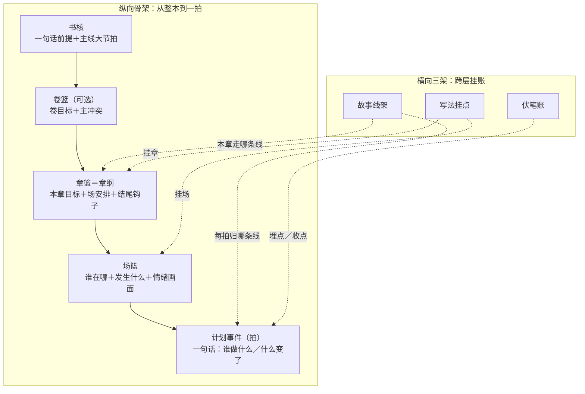
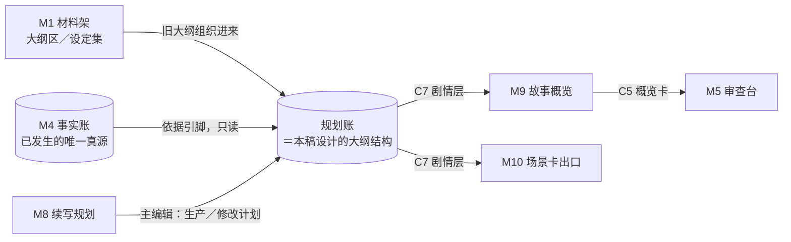

# 「故事真源引擎」大纲结构设计稿 R01

身份：**轻档设计稿，给 CZ 过目拍板用。** 不是施工合同、不是数据库 Schema、不改仓内任何代码；C7 部分是字段建议，不是已落的合同。术语跟随背景板 R07 现行口径。

---

## 0. 一句话＋一张图

大纲结构就是产品里的**「计划这本账」**：从「整本书要讲什么」一路细到「这一拍谁做了什么」，一共五层篮子，外加三条横着跨层挂的架子。M4 事实账管「已经发生了什么」，这本账管「接下来打算发生什么」——两本账，一种语言，中间一座桥。



它在 MVP 线路里的位置（进什么、出什么）：



一句话读图：作者导入的旧大纲从 M1 的「大纲区」进来，M8 续写规划往里生产新计划，M9 概览和 M10 场景卡从里面往外读（走 C7 合同），M4 事实账只被引用、永远不被这本账改写。

## 1. 先把「大纲」这个词说清（撞名处理）

背景板 R06 已经把「大纲」这个词**退休**了——因为它一词多义：有人拿它指全书规划，有人拿它指某一章的安排，还有人拿它指从旧稿反推出来的整理图。拆开后的现行叫法（07_GLOSSARY）：

- 全书→卷→章的层层约束，叫**三级盒子约束**（全书宏观大纲／卷纲／章盒子）；
- 章这一层作者可编辑、可重编译的装配单，叫**章纲**；
- 面向未来的计划图景，叫**规划剧情图**；从旧稿反推出来的历史整理图，叫**反向剧情图**。

本稿说的「大纲结构」＝把上面这些东西**装在一起的那个容器**，内部叫它**规划账**（跟 M4 事实账对仗：一本管已发生，一本管打算发生）。产品界面上对用户叫什么（还叫「大纲」还是叫「故事规划」）是开放问题 Q1，不在这里硬定。

## 2. 粒度阶梯：为什么是「全书→卷→章→场→拍」五级

- **全书**：整本书的承诺——讲什么故事、爽点是什么、往哪个结局走。
- **卷**（可选）：一段大剧情的打包，几十章一卷。主体用户是写到 3～20 章的作者（01_PRODUCT_NORTH_STAR），这个阶段多半用不上卷，所以卷**默认折叠**，短篇直接「全书→章」。
- **章**：网文的发布单位、也是背景板拍板的「关账」单位。这一层的篮子就是已拍的**章纲**。有一个重要细节：大纲里的「章」其实是**规划槽位**（计划中的第 N 章），不是物理章号——因为写着写着会拉伸（计划 3 章写成 5 章）、压缩、插支线（背景板 N19-B 槽位映射）。MVP 第一版可以简化成一对一，但槽位 ID 和物理章号从第一天就分开发，将来接得上。
- **场**：一章里的镜头切换单位——换地点、换人物组合、换时间就是新的一场。背景板拍过：场景是组织和交付的工作单位，不是真值容器。CZ 拍的审查 UX（半屏配图＋梗概）和 M10 场景卡都天然长在这一层。
- **拍**：最小的一格剧情——「谁做了什么／什么变了」的一句话。**拍不是新发明的对象**，它就是背景板已拍的**剧情原子**（剧情信息的统一最小单位）处在「计划态」时的样子，正式名叫**计划事件**。一场装若干拍。

到拍为止，不再往下分。再细就是具体文字怎么写，那是作者的事（产品立场：导写不代写）。

## 3. 篮子逐个讲

下面每个篮子给三样：装什么、粒度多细、一个真实网文手感的例子。例子统一用一部自拟的悬疑灵异文《万鬼伏藏》贯穿：

> 抬棺匠陈九棺发现祖传阴棺里封的不是尸体，而是他自己的名字。要活命，他必须找齐十二口禁棺——可每开一口，世上就多一个忘记他的人。

### 3.1 书核（全书篮）

| 格子 | 装什么 | 例子（《万鬼伏藏》） |
|---|---|---|
| 一句话前提 | 三十字内说清「谁＋困境＋代价」 | 上面那段引文 |
| 题材承诺 | 类型＋读者预期（与材料架「类型标签」联动） | 悬疑·灵异·升级流；预期＝每卷开一口棺、每棺一个诡案 |
| 主线大节拍 | 3～5 个全书级大转折，粗到一句话一个 | ①名字被封（开局钩子）→②首棺开启，付出代价→③镇魂司真面目（中点反转）→④十二棺齐，真相：自己是万鬼之主→⑤终局抉择：封己还是放鬼 |
| 结局锚点 | 结局定了就写，没定就空着（允许空） | 「开放：偏向封己救世，保留反转」 |

粒度：全书篮永远一屏读完。它是「作者对读者的承诺」，不是细纲。

### 3.2 故事线架（横向）

故事线是背景板拍过的轻量一等公民（**故事线三件套**：成员＋线状态＋上次现场指针）。主线支线是同一种对象，只差优先级标记。

| 格子 | 装什么 | 例子 |
|---|---|---|
| 线名＋优先级 | 一句话身份 | L-main「十二禁棺」（主线）；L-sub1「苏晚身世」（支线）；L-dark「镇魂司暗线」（暗线） |
| 成员 | 挂在这条线上的人物／地点／义务（多对多） | L-sub1：苏晚、族谱、义庄 |
| 线状态 | 活跃／搁置／收束／并线 | L-dark：前十章「搁置」，只埋不写 |
| 上次现场指针 | 这条线上一次写到哪，切回来时接得上 | L-sub1 上次现场＝第 3 章场 2「苏晚翻族谱」 |

它为什么是横向架：一条线穿过很多章，一章也可能走两条线，塞不进纵向任何一层，只能跨层挂。

### 3.3 卷篮（可选层）

| 格子 | 装什么 | 例子 |
|---|---|---|
| 卷目标 | 这一卷讲完什么 | 卷一「第一口棺」：主角接受设定，开出首棺 |
| 主冲突 | 这一卷跟谁／跟什么较劲 | 义庄老仵作的阻挠＋首棺诡案 |
| 入口／出口状态 | 卷首世界什么样、卷尾必须变成什么样 | 出口：首棺开启，爷爷忘了他，读者知道「开棺有代价」 |

### 3.4 章篮（＝规划槽位＋章纲）

这层直接沿用背景板已拍的**章纲最小内容**（账序 21:05 条判 6），不另起炉灶：

| 格子 | 装什么 | 例子（第 4 章槽位「爷爷忘了他」） |
|---|---|---|
| 章身份 | 槽位 ID＋建议章号＋章名 | S-004 → 第 4 章「归家」 |
| 本章目标 | 一句话：这章要达成什么 | 让「开棺的代价」第一次砸在主角身上，读者心里发凉 |
| 章梗概 | 两三句给概览层直接用（配半屏 SVG） | 九棺开首棺后回家报平安，爷爷却当他是陌生人；族谱上他的名字淡了一半；深夜，棺中传出第二次心跳 |
| 入口状态 | 开写前世界什么样，**引用事实账**（依据引脚，见 3.8） | 已开首棺（事实 F-0031）；爷爷健在（F-0007） |
| 走哪条线 | 故事线引用 | L-main 为主，L-sub1 露一面 |
| 场安排 | 本章几场、每场一句话（场的胶囊） | 场 1 归家不识 → 场 2 族谱除名 → 场 3 棺中心跳 |
| 出口条件＋结尾钩子 | 章尾必须成立什么、拿什么勾下一章 | 钩子：第二次心跳——棺里还封着「别人」 |
| 硬性承接（必写） | 上游欠的账这章必须还的 | 必须兑现 H-03「开棺有代价」（第 2 章埋的） |
| 不能违反 | 来自事实账和设定集的硬边界 | 爷爷只是「忘」，不能写死（设定：代价是遗忘不是死亡） |
| 风险与材料不足 | 写前就知道的坑 | 「遗忘」规则细节未定：只忘人还是连带物件？（缺设定，需作者补） |
| 写法指导栏 | 开放词表的手法建议（详见第 6 节挂点） | 「用日常写恐怖：爷爷削苹果的手法一模一样，只是不认得他」 |

粒度：一章一屏。前台默认只露目标、必须／不能、场安排、待决定，其余点开（对齐 D20）。

### 3.5 场篮

| 格子 | 装什么 | 例子（第 4 章场 1「归家不识」） |
|---|---|---|
| 场目标 | 这场存在的理由，一句话 | 让读者先于主角意识到「爷爷忘了他」 |
| 场胶囊 | 一句话梗概（概览层用） | 九棺推门喊爷爷，老人握着削了一半的苹果问「小伙子你找谁」 |
| 地点／人物 | 谁在哪 | 陈家老屋堂屋；陈九棺、爷爷 |
| 拍序列 | 本场的计划事件，按叙述顺序排 | 见 3.6 |
| 情绪 | 这场要读者是什么感觉 | 从暖（归家）到毛骨悚然（被遗忘） |
| 画面提示 | 给 M9 配图和 M10 场景卡两用的视觉一句话 | 昏黄堂屋，老人背光坐着削苹果，果皮不断 |
| 对白要点 | 关键台词点到为止，不代写 | 爷爷那句「你找谁」必须是全场最后一句 |

### 3.6 计划事件（拍；计划态剧情原子）

| 格子 | 装什么 | 例子 |
|---|---|---|
| 一句话 | 谁做了什么／什么变了（跟事实句同一种句法） | PE-0412「爷爷看着九棺，问他是谁」 |
| 归哪条线 | 故事线引用 | L-main |
| 目的标签 | 设置／推进／揭示／回收，四选一 | 回收（兑现 H-03） |
| 伏笔关联 | 埋了什么／收了什么（指向伏笔账） | 收 H-03「开棺有代价」 |
| 故事内时间提示 | 可选。倒叙插叙时标一下这拍在故事时间线的哪里 | 开棺次日清晨 |

粒度：一拍一句话，一场通常 3～8 拍。「先描写什么后描写什么」就是拍的排列顺序——这正好是 CZ 拍的审查细节层要展示的东西。

### 3.7 伏笔账（横向）

背景板的长线账管故事线、义务、规则、触发一大家子；MVP 先做其中作者最疼的一样——伏笔（埋了别忘收）。

| 格子 | 装什么 | 例子 |
|---|---|---|
| 伏笔内容 | 一句话 | H-03「开棺有代价」 |
| 埋点 | 挂在哪一拍／哪一场（可多处） | 第 2 章场 3，老仵作的警告 |
| 预定回收位置 | 挂在哪个章槽位（允许改期） | S-004 |
| 状态 | 挂着／已收／作废（作废要留痕） | 已收（PE-0412） |

### 3.8 依据引脚（通用件）

规划账里任何一个篮子都可以插「依据引脚」：**这个计划凭什么**。引脚只有三种合法指向——

1. M4 事实账里已确认的事实 ID（「爷爷健在」是确认过的事实，所以第 4 章才能写他忘了你）；
2. 材料架设定集／大纲区的条目（作者声明的世界规则）；
3. 作者当场的话（记下来就行）。

引脚是**只读引用**，规划账永远不能反过来改事实账——这条是全产品的地基纪律（ARCHITECTURE「唯一真源」），这里只是把插口做出来。引脚还有一个实用好处：事实以后被改判了，程序能顺着引脚找到哪些计划被牵连，亮灯提醒（对齐背景板「修改传播三层」里的计划态亮灯）。

## 4. 跟 M4 事实账什么关系：一种语言，两本账，一座桥

这是本稿最要紧的一节。问题：计划中的剧情原子和已确认的事实句，是同一种东西的两个状态，还是两种东西？

背景板和语义合同的现行倾向很清楚，**两句话概括：句法上是一种东西，账本上是两本账。**

- **一种语言**：背景板把「剧情原子」定为剧情信息的统一最小单位，带**状态戳**（这条原子处在计划、已发生、否定等哪个生命周期位置）——07_GLOSSARY「剧情原子」「状态戳」行、N17。所以计划事件和事实句写法同构，都是「谁做了什么／什么变了」的一句话。这就是「其他地方都有接收器」的底气：M9 概览、M10 场景卡、将来的一致性体检，认的都是同一种句法，不用为计划和事实各写一套解析。
- **两本账**：计划态与已发生态**分账**——07_GLOSSARY「计划事件」行写明「与已发生态分账」；02_SYSTEM_ARCHITECTURE 写明「未来事件只能发计划编号」「未写成不发已发生态编号」；MVP ARCHITECTURE 设计纪律第 3 条写明「计划和事实不进同一张表」。所以 PE-xxxx（计划事件号）和 F-xxxx（事实号）是两套编号，永远不混。
- **一座桥**：计划转正走**对账**，不走变身。背景板的回收核对分六态（按计划写成／变体写成／漏写／与计划冲突／新增未计划／延后处理，03_CREATION_AND_MEMORY_PIPELINES）。落到 MVP：新章写成后照常走 M1→M3→M5 入账，产生新的事实 F 号；然后对账，把 PE-0412 标成「已兑现 → 指向 F-0058」。计划事件自己**不变成**事实，它只是拿到一条兑现链接。语义合同（T3 草案）的 `status_stamp` 铁律在这里落地：计划不得伪装成已发生。

**一处真实张力，列出来不硬调和**：背景板的六态对账是「计划 ↔ 书稿」直接核对（写了／没写／写错），工序长在关章流程里；MVP 纪律是新章重新走抽取管线入账，对账就变成「计划事件 ↔ 新抽出的事实」的间接匹配——方向一致，工序不同，第一版对账做多重是开放问题 Q3。

## 5. 概览层／细节层：胶囊优先原则

CZ 已拍：审查默认视图是「半屏 SVG 配图＋事件梗概，点开才见细节」，且这是通用展示原则。大纲结构对此的支持不靠界面临时拼，靠一条结构级规矩：

> **每个篮子强制自带一格「胶囊」（一句话梗概），概览层永远只读胶囊，点开才进细节。**

各层的两级读取长这样：

| 你在看什么 | 概览层给你什么（全是现成胶囊，不现算） | 点开才见 |
|---|---|---|
| 全书页 | 书核一屏＋各故事线一句话＋各卷一句话 | 卷内容 |
| 卷页 | 各章槽位的章梗概列表 | 某一章 |
| 章页 | **半屏 SVG＋章梗概**＋场胶囊列表 | 某一场 |
| 场页 | 拍序列（先写什么后写什么）＋写法指导 | ——到底了 |

配图引用（SVG）挂在章和场两个节点上，跟 CZ 拍的「边生成边附带」对上：每段剧情生成时顺手出的图存成节点属性，最后的有声动态分镜就是把这些图按序拼起来，不需要回头补。M9 出 C5 概览卡时，梗概、配图引用、细节锚点三样都直接从结构里取。

## 6. 扩展挂点：写法、模板、文学理论怎么进来而不动骨架

CZ 的原话目标：「之后各种写法、可复用的模板、文学理论都可以顺着这个大纲结构进来。」机制三件套：

**第一件：稳定坐标。** 五层篮子每个节点发稳定 ID（book／volume／slot／scene／event 五种前缀）。挂件只认 ID，不碰内容。

**第二件：挂件对象。** 挂件独立存放，不长在骨架字段里。每个挂件五个格：挂在哪个节点、命名空间、类型词、正文、给谁消费。命名空间举例——

| 命名空间 | 装什么 | 例子 |
|---|---|---|
| `technique.*` | 技巧卡 | 挂在场 1：technique.对比「用日常写恐怖：削苹果的手一模一样，只是不认得他」 |
| `template.*` | 模板节拍标注 | 挂在第 1～3 章：template.黄金三章「钩子章／代价章／爆点章」 |
| `theory.*` | 文学理论注释 | 挂在中点反转章：theory.麦基「中点＝主角从被动转主动」 |
| `reader_effect.*` | 爽点／读者效果 | 挂在场 3：reader_effect.毛骨悚然「第二次心跳，安全感崩塌」 |

词表**开放**，不固化标签树——这是拍过的（判 9 写法指导栏用开放词表；D25 技巧爽点不进正史、不固化标签树）。挂件一律不进真值账、不进事实质量门。3.4 里的「写法指导栏」就是章节点上这类挂件的默认展示位。

**第三件：模板＝坐标映射＋检查清单，不是新骨架。** 三幕、救猫咪、网文黄金三章这类模板，本体是一张「节拍位清单」（救猫咪 15 拍、三幕 8 段……）。应用模板＝把节拍位映射到你的章槽位／场上（打 `template.*` 标签），外加可选的**缺位提醒**（「你的卷二缺中点反转」「第 3 章该出爆点了」）。骨架零改动，卸载模板＝删标签。文学理论同理：理论进来是给节点加注释和检查项，不是改篮子。

将来某个垂直场景真需要加字段，按背景板 N23 的规矩走：新挂件类型要登记命名空间、所有者、消费者、校验规则，不许匿名字段野蛮生长。

## 7. C7 合同字段建议（M8 → M9／M10）

C7 是「M8 续写规划把剧情层交给 M9 概览、M10 场景卡」的合同（ARCHITECTURE 合同清单，未开工）。按本稿结构，建议最小字段集如下——原则：一份 C7 就是规划账里**一个章篮的快照**，两个消费者各取所需（M9 吃梗概＋配图提示，M10 吃画面＋人物＋情绪＋对白要点），谁也不用再加工。

| 字段 | 装什么 | 主要给谁 |
|---|---|---|
| `plan_id` | 这份章计划的身份证 | 都要 |
| `slot_ref` / `chapter_hint` | 规划槽位 ID＋建议物理章号 | M9 排序 |
| `title_hint` | 建议章名 | M9 |
| `goal` | 本章目标一句话 | 作者、M9 |
| `summary` | 章梗概（胶囊，概览直接渲染） | M9 |
| `storyline_refs` | 本章走哪几条线 | M9 |
| `based_on_facts` | 依据的已确认事实 ID 列表 | 追溯、体检 |
| `basis_note` | 生成时依据的事实账时点（事实变了好判过期） | 程序 |
| `scenes[]` | 场列表，字段见 JSON | M9、M10 |
| `must_carry` / `must_not` | 必写承接／不能违反 | 作者、QC |
| `exit_hook` | 结尾钩子 | 作者、M9 |
| `risks` | 风险与材料不足 | 作者 |
| `status` | **恒为 `"plan"`**，铁字段 | 都要（防冒充事实） |

JSON 示例（就是第 4 章那个例子）：

```json
{
  "contract": "C7",
  "version": "v0-draft",
  "status": "plan",
  "plan_id": "PLAN-S004-r2",
  "slot_ref": "S-004",
  "chapter_hint": 4,
  "title_hint": "归家",
  "goal": "让开棺的代价第一次砸在主角身上",
  "summary": "九棺开首棺后回家报平安，爷爷却当他是陌生人；族谱上他的名字淡了一半；深夜，棺中传出第二次心跳。",
  "storyline_refs": ["L-main", "L-sub1"],
  "based_on_facts": ["F-0031", "F-0007"],
  "basis_note": "fact-ledger@2026-08-13T02:00",
  "scenes": [
    {
      "scene_id": "S-004-1",
      "order": 1,
      "summary": "九棺推门喊爷爷，老人握着削了一半的苹果问他找谁",
      "location": "陈家老屋堂屋",
      "characters": ["陈九棺", "爷爷"],
      "mood": "从暖到毛骨悚然",
      "planned_events": [
        {"event_id": "PE-0411", "text": "九棺进门，喊爷爷说自己回来了", "storyline": "L-main", "purpose": "设置", "hook_refs": []},
        {"event_id": "PE-0412", "text": "爷爷看着九棺，问他是谁", "storyline": "L-main", "purpose": "回收", "hook_refs": ["H-03"]}
      ],
      "writing_guidance": ["用日常写恐怖：削苹果的手法一模一样，只是不认得他", "『你找谁』必须是全场最后一句"],
      "visual_hint": "昏黄堂屋，老人背光坐着削苹果，果皮不断",
      "dialogue_hints": ["爷爷：小伙子，你找谁？"]
    }
  ],
  "must_carry": ["兑现 H-03『开棺有代价』"],
  "must_not": ["爷爷只能『忘』，不能死（设定：代价是遗忘不是死亡）"],
  "exit_hook": "棺中传出第二次心跳——里面还封着『别人』",
  "risks": ["『遗忘』规则细节未定：只忘人还是连带物件，需作者补设定"]
}
```

两点边界：C7 是规划账的**只读快照**（会过期，要改回规划账里改，对齐 ARCHITECTURE「唯一真源＋只读快照」）；`status:"plan"` 永远不许被下游改写成别的。

## 8. 开放问题清单（请 CZ 拍板）

**Q1｜产品界面上这套结构叫什么？**
背景板内部已把「大纲」退休，但用户嘴里就叫大纲。
- A. 界面照叫「大纲」，文档和代码内部叫规划账（用户语言优先，术语纪律管内部）
- B. 界面改叫「故事规划」，跟背景板措辞完全对齐
- C. 分层叫：全书层叫「大纲」，章层叫「章纲」
- 👉 推荐 A：别让用户学新词，术语洁癖留给内部。

**Q2｜卷层默认开还是收？**
- A. 默认折叠，章数超过阈值（比如 30 章）或作者手动才开卷
- B. 默认三级全开，短篇也见到卷
- 👉 推荐 A：主体用户 3～20 章，先别端出用不上的篮子。

**Q3｜计划↔事实的对账，MVP 做多重？**
- A. 手动轻量版：关章时给作者一屏「这章的计划事件，勾一下哪些写成了」，勾了就挂兑现链接
- B. 自动匹配版：程序把新入账事实和计划事件做相似匹配，作者只确认匹配结果（背景板六态对账的简化实装）
- C. 第一版不做对账，只把兑现链接字段留好
- 👉 推荐 A 起步、字段按 B 预留：对账是背景板明拍的方向，但自动匹配的验收成本 MVP 扛不动。

**Q4｜槽位映射第一版做多简？**
- A. 一对一简化：一个槽位＝一个章号，写偏了作者手动改号；但槽位 ID 与章号从第一天分开发
- B. 完整落背景板 N19-B 的槽位映射（拉伸／压缩／插入全支持）
- 👉 推荐 A：3～20 章阶段拉伸压缩还不痛，ID 分开发保住了将来升 B 的路。

**Q5｜反向剧情图（旧稿反推）和作者手写大纲，进不进同一结构？**
- A. 同一套篮子，节点带「来源身份」标签（作者声明／旧稿反推／模型建议），互不冒充
- B. 两套结构分开放，看的时候再合并
- 👉 推荐 A：篮子形状本来就一样，分两套等于每个下游写两遍接收器；来源身份标签正好对齐材料架铁规 3「架子身份≠真值身份」和 N06 五轴分诊。

**Q6｜计划事件要不要按语义合同 N16 拆「表述—命题」？**
- A. 不拆：计划态就是一句人话，语义拆分只发生在事实入账那一侧
- B. 拆：计划事件也走表述／命题两层
- 👉 推荐 A：N16 管的是「什么能算世界事实」，计划本来就不是事实，拆了徒增作者负担；转正对账时自然会过事实侧的语义门。

**Q7｜挂点机制和第一个模板，什么节奏？**
- A. 挂点机制随本结构落地，第一个模板（建议「网文黄金三章」，最贴目标用户）等 M8 开工时做
- B. 现在就连模板一起做一个出来验证
- C. 挂点机制也缓一缓，M8 开工再说
- 👉 推荐 A：挂点是结构的一部分（ID 和挂件表得先有），模板是内容、可以等；全缓（C）会让骨架落地时没留插口，回头要改骨架。

## 9. 来源与追溯

- [ARCHITECTURE.md](../ARCHITECTURE.md)：模块线路、C7 合同位、材料架六槽、设计纪律（唯一真源／计划不冒充事实）。
- 背景板 R07（小说架构仓，路径含中文，复制用）：
  - `/Users/a1234/挣钱/小说架构/references/shared-context/NOVEL_ARCH_SHARED_CONTEXT_CORE_MATERIALS_20260812_R07/01_PRODUCT_NORTH_STAR.md`：导写不代写、主体用户 3～20 章、三个中心。
  - `.../02_SYSTEM_ARCHITECTURE_AND_TRUTH_LAYERS.md`：计划事件不发已发生态编号、章纲最小内容（判 6）、三级盒子约束（21:35 条③）、D20 渐进展开、剧情图维度清单 v0、N16／N17、修改传播三层、N23 扩展字段合同。
  - `.../03_CREATION_AND_MEMORY_PIPELINES.md`：六态回收核对、N19-B 槽位映射、切线包、执行包。
  - `.../07_GLOSSARY.md`：「大纲」退休行、剧情原子／状态戳／计划事件／故事线三件套／章纲／写法指导栏（开放词表）。
- `/Users/a1234/挣钱/小说架构/TEMP/t08_semantic_contract_draft_20260813_r01/T3_PRE_SEMANTIC_CONTRACT_DRAFT_R01.md`：status_stamp 铁律（计划不伪装已发生）、真源分权、unknown 六分（「尚未发生」类对应计划态）。
- `/Users/a1234/挣钱/小说架构/TEMP/bgboard-audit-20260809-r01/18_R07_ADDENDUM_LEDGER_20260813_R01.md`：审查概览 UX（半屏 SVG＋梗概）、教程双路（路 B 生成到大纲形式）、材料架拍板。
- `/Users/a1234/挣钱/小说架构/TEMP/bgboard-audit-20260809-r01/17_SI006_DIGEST_20260813_R01.md`：不代写＝卖点、激活事件、付费点排序。

来源：Cursor（Fable 5 Max）设计，2026-08-13；CZ 待过目。
