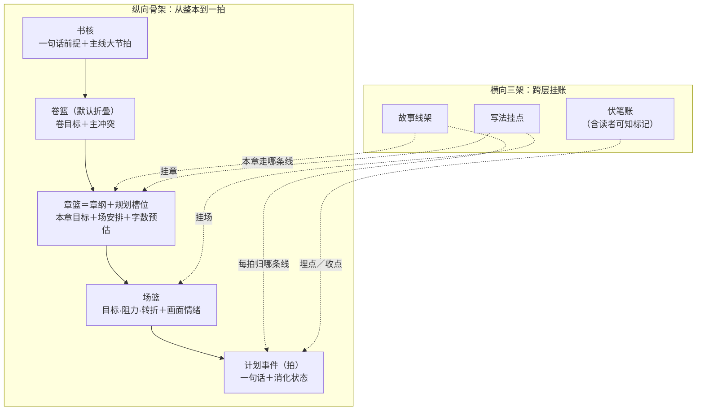
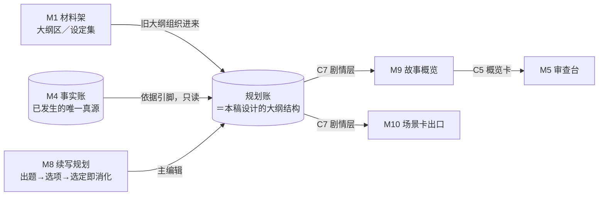

# 「故事真源引擎」大纲结构设计稿 R02

身份：**轻档设计稿，承接 R01。** R01 的七个开放问题已由 CZ 全部拍板（挂账本 ADD-004，2026-08-13 02:36–02:45），另有一条新产品原则「停点即设置」（ADD-005，02:45），以及两份 Notion 旧设计考古捞货补充对照。R02 把这些吸收进结构；[R01](OUTLINE_STRUCTURE_DESIGN_R01.md) 原样保留作历史。仍不是施工合同、不是数据库 Schema；C7 部分是字段建议。

---

## 0. 一句话＋一张图

大纲结构就是产品里的**「计划这本账」**（内部名：规划账；界面上照叫「大纲」，Q1 已拍）：从「整本书要讲什么」一路细到「这一拍谁做了什么」，五层篮子＋三条横架。M4 事实账管「已经发生了什么」，规划账管「接下来打算发生什么」——两本账，一种语言，中间一座桥。R02 桥换了新形态：**选项消化清单**——作者在创作流里选「下一步剧情怎么走」的同时，对账就地完成，不欠事后的账（详见第 4 节）。



它在 MVP 线路里的位置：



一句话读图：作者导入的旧大纲从 M1「大纲区」进来（⏸ 停点位 P5 分拣确认），M8 用「出题＋选项」的方式往规划账里生产新计划（⏸ 停点位 P1），M9 概览和 M10 场景卡从里面往外读（C7 合同），M4 事实账只被引用、永远不被规划账改写。

## 1. 命名（已拍）

**Q1 拍定（CZ 2026-08-13，ADD-004）：产品界面照叫「大纲」，文档和代码内部叫「规划账」。** 术语纪律管内部，不让用户学新词。背景板层面「大纲」仍是退休词（07_GLOSSARY），拆出来的现行叫法不变：三级盒子约束（全书宏观大纲／卷纲／章盒子）、章纲、规划剧情图、反向剧情图——规划账就是把这些装在一起的容器。

## 2. 粒度阶梯：全书→卷→章→场→拍（卷与章两级按拍板更新）

- **全书**：整本书的承诺——讲什么故事、爽点是什么、往哪个结局走。
- **卷**：**Q2 拍定——默认折叠**，章数超阈值（约 30 章）或作者手动才开卷。主体用户写到 3～20 章，先别端出用不上的篮子。
- **章＝规划槽位，完整落 N19-B（Q4 拍定选 B），由字数预估驱动**。这是 R02 相对 R01 的大升级，R01 的「简化一对一」作废：
  - 底层两条序列＋一张映射，照背景板 N19-B 原样：**规划槽位序列**（上层规划的逻辑节奏，原计划相对位置不因实际章数变化而重排或丢失）＋**实际章节序列**（作者真正写出的物理章节，含新增、拆分、合并、非叙事章）＋**槽位映射**（每个实际章承接哪个槽位，变化留痕，系统只建议、不静默改规划）。
  - **触发机制是 CZ 给的新设计——字数预估**：编辑规划账时，每个故事段落（场）就预估「写清楚大概需要多少字」，这是规划阶段的固有信息，不是写作时才发现。章篮把各场预估加总，对照本章目标字数：装不下 → 系统提示做映射调整（原第 18 章的内容改由 18、19 两章完成，后续槽位整体后挪一章）；没东西可写 → 提示合并槽位或补内容。这就是 ⏸ 停点位 P3。
  - 四种偏差的映射处理照背景板 N19-B 的表（拉伸／压缩提前收线／插入支线／插入非叙事章），不重抄；字数预估让这些偏差**在规划阶段就被看见**，而不是写崩了才发现。
  - 背景板挂靠点：关章编译本来就吃「字数目标」这条约束（03_CREATION_AND_MEMORY_PIPELINES 章纲关闭一节），字数预估等于把它前移到规划期。
- **场**：一章里的镜头切换单位，组织和交付的工作单位，不是真值容器。
- **拍**：最小一格剧情＝**计划事件**（计划态剧情原子），一句「谁做了什么／什么变了」。一场装若干拍，到拍为止不再往下分。

## 3. 篮子逐个讲

例子仍用自拟悬疑灵异文《万鬼伏藏》贯穿：

> 抬棺匠陈九棺发现祖传阴棺里封的不是尸体，而是他自己的名字。要活命，他必须找齐十二口禁棺——可每开一口，世上就多一个忘记他的人。

### 3.1 书核（全书篮）

同 R01，不变：一句话前提、题材承诺、主线大节拍（3～5 个全书级大转折）、结局锚点（允许空）。永远一屏读完。

### 3.2 故事线架（横向）

同 R01，不变：线名＋优先级、成员（多对多）、线状态（活跃／搁置／收束／并线）、上次现场指针。主线支线是同一种对象。

### 3.3 卷篮（默认折叠，Q2 已拍）

同 R01 字段：卷目标、主冲突、入口／出口状态。变化只有一处：折叠不再是建议而是拍定的默认行为。

### 3.4 章篮（＝规划槽位＋章纲；新增字数预估）

沿用背景板已拍的章纲最小内容（判 6），R02 新增最后两行：

| 格子 | 装什么 | 例子（槽位 S-004「爷爷忘了他」） |
|---|---|---|
| 章身份 | 槽位 ID＋映射到的物理章号＋章名 | S-004 ↦ 第 4 章「归家」 |
| 本章目标 | 一句话：这章要达成什么（＝旧设计「大卡」的位置，见下） | 让「开棺的代价」第一次砸在主角身上 |
| 章梗概 | 两三句给概览层直接用（配半屏 SVG） | 九棺回家报平安，爷爷却当他是陌生人；族谱名字淡了一半；深夜棺中传出第二次心跳 |
| 入口状态 | 开写前世界什么样，引用事实账（依据引脚） | 已开首棺（F-0031）；爷爷健在（F-0007） |
| 走哪条线 | 故事线引用 | L-main 为主，L-sub1 露一面 |
| 场安排 | 本章几场、每场一句话胶囊 | 场 1 归家不识 → 场 2 族谱除名 → 场 3 棺中心跳 |
| 出口条件＋结尾钩子 | 章尾必须成立什么、拿什么勾下一章 | 钩子：第二次心跳 |
| 硬性承接（必写） | 上游欠的账这章必须还的（进选项消化清单，见第 4 节） | 兑现 H-03「开棺有代价」 |
| 不能违反 | 来自事实账和设定集的硬边界 | 爷爷只能「忘」，不能写死 |
| 风险与材料不足 | 写前就知道的坑 | 「遗忘」规则细节未定 |
| 写法指导栏 | 开放词表的手法建议（挂件，见第 6 节） | 「用日常写恐怖」 |
| **目标字数**（新） | 本章打算写多长，作者按平台习惯设 | 2600 字 |
| **预估合计＋容量灯**（新） | 各场字数预估加总，对照目标字数亮灯：装得下／装不下／太空 | 900＋700＋1100＝2700，装得下 |

容量灯亮「装不下」或「太空」时触发 ⏸ 停点位 P3（槽位调整提示）。

**大卡小卡的说法**（考古对照，v2 捞货 31）：旧设计的「大卡＝本章主管线问题」在本结构里就是章篮的「本章目标」，不另设卡对象；「小卡＝修遗留逻辑」落在计划事件的目的标签里——R02 给目的标签加了第五种「修复」（见 3.6），一张小卡就是一个 purpose=修复 的计划事件，正文引用它要修的遗留问题（体检报告条目或风险项）。跨章遗留问题本身住在体检／风险侧（M7 的地盘），规划账只放「打算怎么修」。

#### 3.4.1 章纲整体版本与编译基线

章纲仍是现有 `plan.json` 中章槽、场、计划事件和写法挂件组成的章级可重编译工件，不新建章纲库或第二本 planstore。当前落位版本由 `chapter_slot.outline_checkpoint` 表达：

```json
{
  "outline_rev": 2,
  "source_slot_ref": "S-0001",
  "source_commit_seq": 8
}
```

- `outline_rev` 是同一稳定章槽下的章纲整体修订号，与场／PE／挂件自己的对象 `rev` 分开；
- `source_slot_ref` 必须等于承载该 checkpoint 的章槽 ID，防止另一章的合法 baseline 冒充；
- `source_commit_seq` 引用该章最近一个会改变章纲编译输入的正式 planning 提交水位，不复制 planning snapshot。

`S-0001@outline-r2` 只是“稳定章槽 ID＋整体修订号”的派生读法，不是新对象 ID，也不占新发号器。章纲落位动作 `outline_land` 是 planning 的派生结果，不推进该章 planning 输入水位；另一章变化同样不推进本章水位。当前章出现更新的有效 planning 输入后，旧 checkpoint 自动 stale，只失去消费资格：旧内容不删、不静默改 baseline，继续从现有规划流水和 blob 追溯，等 M8 重编译新版本。

只有消费就绪、baseline 存在且属于当前章、baseline 仍是该章最新 planning 输入水位的章纲才能成为 current。blocked／未消费就绪投影不能获得 current；`slot_status=partial` 仍只表示书稿部分交棒，不承担章纲编译状态。

### 3.5 场篮（按考古捞货升级，分两档）

旧设计的「场景单元最小合同」（v2 捞货 34）比 R01 的场篮多出一整套戏剧字段。R02 分两档吸收，**MVP 只上最小档**，别一次全上：

**MVP 最小档**（R01 原有七格＋新增五格）：

| 格子 | 装什么 | 例子（第 4 章场 1「归家不识」） |
|---|---|---|
| 场目标 | 这场存在的理由 | 让读者先于主角意识到「爷爷忘了他」 |
| 场胶囊 | 一句话梗概（概览层用） | 九棺推门喊爷爷，老人握着削了一半的苹果问「小伙子你找谁」 |
| 地点／人物 | 谁在哪 | 陈家老屋堂屋；陈九棺、爷爷 |
| 拍序列 | 计划事件按叙述顺序排 | 见 3.6 |
| 情绪进出 | 入场什么感觉、出场什么感觉 | 进：暖（归家）→ 出：毛骨悚然 |
| 画面提示 | 给 M9 配图和 M10 场景卡两用 | 昏黄堂屋，老人背光削苹果，果皮不断 |
| 对白要点 | 关键台词点到为止，不代写 | 「你找谁」必须是全场最后一句 |
| **阻力**（新） | 谁／什么挡着场目标——没阻力就没戏 | 爷爷表现完全正常，九棺一开始只当爷爷开玩笑 |
| **转折**（新） | 这场在哪里拐弯 | 爷爷把削好的苹果递给他：「小伙子，尝尝？」——待客的动作宣判了陌生 |
| **POV**（新） | 谁的视角 | 陈九棺 |
| **禁泄露**（新） | 这场绝不能提前抖出去的底牌（联动伏笔账的读者可知标记，见 3.7） | 不能暗示「忘记」会蔓延到更多人 |
| **字数预估**（新） | 写清楚这场大概要多少字（喂给章篮容量灯） | 900 字 |

**完整档**（后续按需开，字段先登记不实装）：赌注（输了失去什么）、策略（角色打算怎么达成目标）、决定（场末角色做了什么选择）、角色新知／读者新知／仍隐藏（这场各方知道了什么）、出口状态（场末世界定格在哪）。开启时机：作者用到多视角、强悬念误导这类进阶写法，或场景卡出口（M10）需要更厚的戏剧信息时。

为什么这样分档：阻力和转折是「有戏没戏」的分水岭，POV 和禁泄露是防泄底的最小件，这四样加字数预估就够 MVP 跑；剩下那套（赌注／策略／新知三分）价值在精细复盘和改编输出，3～20 章的作者先用不上。旧设计「卡片正面只放五件事」（v2 捞货 32：目标／谁行动／阻力／转折／结束改变什么）和 MVP 最小档基本重合，互相印证。

### 3.6 计划事件（拍；新增消化状态和「修复」标签）

| 格子 | 装什么 | 例子 |
|---|---|---|
| 一句话 | 谁做了什么／什么变了（跟事实句同一种句法） | PE-0412「爷爷看着九棺，问他是谁」 |
| 归哪条线 | 故事线引用 | L-main |
| 目的标签 | 设置／推进／揭示／回收／**修复**（新，五选一；修复＝小卡，见 3.4） | 回收（兑现 H-03） |
| 伏笔关联 | 埋了什么／收了什么 | 收 H-03 |
| 故事内时间提示 | 可选。倒叙插叙时标这拍在故事时间线的哪里 | 开棺次日清晨 |
| **消化状态**（新） | 待消化／已消化（挂选择记录）／已作废（留痕）——第 4 节的桥就靠它 | 已消化 ↦ 选择记录 OPT-S004-2 |

**双序的设计决策写明**（考古对照，v2 捞货 15）：旧设计要求 `story_order`（世界里实际发生顺序）和 `discourse_order`（读者看到的顺序）是两个独立序，同一批 ID 不能用一个数组位置扛两种语义。本结构目前是**轻量版**：拍序列的数组位置＝叙述顺序，「故事内时间提示」是可选标注。为什么轻量够用：主体用户 3～20 章、以线性叙述为主，倒叙插叙偶尔出现，可选标注兜得住；强上双序等于让每个作者为用不上的能力填两遍顺序。**升级触发条件**：作者开始多线交错或长倒叙，出现「同一批拍需要按两种顺序分别查询」的真实需求（比如体检要按故事序审因果）时，把「故事内时间提示」升格为必填可排序的 `story_order`——ID 从第一天就稳定，升级不用搬家。这与背景板三序拍板（判 8）方向一致，只是把完整实装押后。

### 3.7 伏笔账（横向；新增读者可知标记）

| 格子 | 装什么 | 例子 |
|---|---|---|
| 伏笔内容 | 一句话（这是底牌本体，只在作者视图展示） | H-03「开棺有代价：至亲会遗忘开棺者」 |
| 埋点 | 挂在哪一拍／哪一场（可多处） | 第 2 章场 3，老仵作的警告 |
| 预定回收位置 | 挂在哪个章槽位（允许改期，改期留痕） | S-004 |
| 状态 | 挂着／已收／作废（作废留痕） | 已收（PE-0412） |
| **读者可知**（新） | 未揭示／已揭示@位置 | 已揭示@第 4 章场 1（在此之前＝未揭示） |
| **安全摘要**（新） | 给 AI 下游看的脱敏版：「这里有隐藏约束，别写错、别提前抖」，不含底牌内容 | 「爷爷一线埋有未揭示设定，涉及『遗忘』，第 4 章前不得暗示范围」 |

**必要性判断**（考古对照，requirements 捞货 5）：要加，而且是结构级而非界面级。理由：伏笔天生就是「作者知道、读者还不知道」的东西，而伏笔账的内容会流进 M6 问答、M8 选项生成、M10 场景卡——任何一个下游把底牌原文带出去就是泄底。**防泄底最小机制**：未揭示状态下，下游合同（C7、问答上下文、场景卡）默认只带「安全摘要」，底牌本体只在作者视图和 AUTHOR 侧规划里可见；揭示后标记翻转，本体才可进下游。这正好是背景板 N17「对读者隐藏」unknown 类和可见范围（AUTHOR／读者已释放）在伏笔账上的落地，旧「暗稿层」设计已被 N17 吸收，这里不另建模块。场篮的「禁泄露」格就是从这里派生的本场提示。

**边界一句**：伏笔账只管 hook（作者层工具，忘了最多黄灯）；「义务」（角色自己立的债，到期没兑现且无后果＝红灯，v2 捞货 13）是另一种对象，属长线账／体检侧，不进本结构 v1——将来要加就照伏笔账的样子开一本兄弟账，挂点机制同款。

### 3.8 依据引脚（通用件）

同 R01，不变：规划账任何篮子可插「依据引脚」，只读指向 M4 事实 ID／材料架设定条目／作者原话；规划账永远不反写事实账；事实被改判时程序顺引脚找到受牵连的计划亮灯（修改传播三层的计划态档）。

## 4. 跟 M4 事实账什么关系：一种语言，两本账，桥换新了

前两段维持 R01 结论，已与背景板对齐：

- **一种语言**：剧情原子是统一最小单位带状态戳（07_GLOSSARY、N17），计划事件和事实句同构，都是「谁做了什么／什么变了」。
- **两本账**：计划态与已发生态分账、分编号（PE-xxx／F-xxx 永不混）——07_GLOSSARY「计划事件」行、02 页「未写成不发已发生态编号」、MVP 纪律「计划和事实不进同一张表」。

**桥是 R02 重写的部分。Q3 拍板给了超出 R01 选项的新机制——「选项消化清单」（CZ 2026-08-13，ADD-004）：对账不留到关章，创作选择的那一刻就地完成。**

创作流长这样（卡片题目流）：

1. **出题**：作者推进到某个槽位，M8 出题「下一步剧情怎么走」，给主推荐＋备选选项（承接 D18 的「主建议＋2 个明显不同备选」；每个选项写清为什么适合、会改变什么、有什么风险——旧设计「选项要给代价」，v2 捞货 45）。
2. **选项自带消化清单**：每个选项生成时就标注「选它会兑现哪些东西」——哪些计划事件、哪些伏笔、哪些必写承接。
3. **选定即消化**：作者选中一个选项（⏸ 停点位 P1），清单上的计划事件立刻标「已消化」、挂上选择记录（哪次出题、哪个选项、进了哪个章计划）（⏸ 停点位 P2，默认随 P1 自动走）。**没有关章后的勾选环节**——R01 开放问题 Q3 的选项 A（关章勾选）作废。
4. **事后只在删改时重核**：作者后来删减或修改已消化的剧情，才触发重新查看核对，受影响的兑现链接列清单请作者处置（⏸ 停点位 P4）。

**选项怎么知道自己消化了什么**——这是 CZ 点名要想清楚的：答案是**生成时就带上引用，程序机械校验**。M8 出题时，输入里就装着「本槽位待消化清单」：预定回收位置落在本槽位的伏笔、上游下达的必写承接、书核／卷篮节拍拆下来还挂着的计划事件。选项生成合同要求：每个选项必须从这份清单里**点名**自己消化哪几项（引用 ID），可以一项不消化（但要说明为什么这个选项值得绕开欠账）。程序只做机械校验——引用的 ID 确实在清单里、没有凭空编造；「这个选项是否真的兑现了那条伏笔」的语义判断，作者选的时候扫一眼消化清单就是在做（对齐「程序验机械、人验语义」纪律）。

**两道工序分清（CZ 原话口径）**：对账主要发生在**剧情生成层**——选项消化就是对账。正文写成后的**事实入账**是另一道独立工序（M1→M3→M5 照旧），事实 F 号不强制回连计划 PE 号；想连的话入账后可补弱链接，属增强不属骨架。所以兑现链接的指向从 R01 的「事实 F 号」改为「选择记录」。

**一个想清楚了的取舍，写明不藏**：作者选了选项、计划标了已消化，但手写正文时也可能实际跳过没写——这个缺口不由消化机制兜，交给两处：作者删改剧情时的重核（P4），和事实入账后体检发现的矛盾。这是「信任创作时决定」的设计取舍，换来的是作者全程零补账；R01 列的那处张力（六态对账 vs 重抽入账的工序差）由这次拍板正式了结：六态里的「按计划写成」由选项消化承担，「漏写／删改」由 P4 重核承担，「新增未计划」由事实入账侧自然长出来。

## 5. 概览层／细节层：胶囊优先，卡牌四层是细节层的里子

胶囊规矩不变：**每个篮子强制自带一格「一句话梗概」，概览层永远只读胶囊，点开才进细节。** 全书页→卷页→章页（半屏 SVG＋梗概）→场页的两级读取表同 R01。

**跟旧设计「卡牌四层」的关系一句话说清**（考古对照，v2 捞货 33）：胶囊两级管**上下**（同一个东西粗看还是细看），卡牌四层（原文证据→故事事实／计划→戏剧作用→分镜表达）管**里外**（同一个剧情点的四种身份面）——两者不打架：点开细节层之后，四层就是细节页里的页签／折叠区，概览胶囊默认展示的是「故事事实／计划」这一面。两级是导航，四层是对象的多面身份，前者是后者的入口。

## 6. 扩展挂点（Q7 已拍：机制先行）

机制三件套不变：稳定坐标（五种前缀的节点 ID）、挂件对象（命名空间＋开放词表，`technique.*`／`template.*`／`theory.*`／`reader_effect.*`）、模板＝坐标映射＋缺位提醒（不改骨架，卸载＝删标签）。新挂件类型按 N23 登记命名空间、所有者、消费者、校验规则。

**Q7 拍定（ADD-004）**：挂点机制（稳定 ID＋挂件表）随结构落地；第一个模板「网文黄金三章」等 M8 开工时做。

补一条旧设计的好纪律（v2 捞货 46）：**模板不硬性规定、不追旧账**——说好 20 章到高潮结果 15 章写完了，缺位提醒提一次就闭嘴，不准一直唠叨还差 5 章；爽点不是标签树，是知情差开合、义务承担、状态翻转这些底层件组合出来的效果，挂件只记可机械数的底层件＋作者自评。

## 7. C7 合同字段建议（M8 → M9／M10；随场篮和消化机制更新）

原则不变：一份 C7 就是规划账里一个章篮的只读快照（会过期，要改回规划账里改），M9 吃梗概＋配图提示，M10 吃画面＋人物＋情绪＋对白要点。R02 相对 R01 的字段增量加粗：

| 字段 | 装什么 | 主要给谁 |
|---|---|---|
| `plan_id` | 这份章计划的身份证 | 都要 |
| `slot_ref` / `chapter_hint` | 规划槽位 ID＋映射到的物理章号 | M9 排序 |
| `title_hint` | 建议章名 | M9 |
| `goal` | 本章目标一句话 | 作者、M9 |
| `summary` | 章梗概（胶囊，概览直接渲染） | M9 |
| `storyline_refs` | 本章走哪几条线 | M9 |
| `based_on_facts` | 依据的已确认事实 ID 列表 | 追溯、体检 |
| `basis_note` | 生成时依据的事实账时点 | 程序 |
| **`target_length` / `estimated_length`** | 目标字数／各场预估合计（容量灯的原料） | 作者、程序 |
| **`digested_refs`** | 本章计划消化了哪些上游欠账（伏笔／计划事件／必写承接），带选择记录 | M9 展示「本章兑现了什么」、追溯 |
| `scenes[]` | 场列表，含新增戏剧字段，见 JSON | M9、M10 |
| `must_carry` / `must_not` | 必写承接／不能违反 | 作者、QC |
| `exit_hook` | 结尾钩子 | 作者、M9 |
| `risks` | 风险与材料不足 | 作者 |
| `status` | **恒为 `"plan"`**，铁字段 | 都要（防冒充事实） |

场对象新增：`resistance`（阻力）、`turn`（转折）、`pov`（视角）、`spoiler_guard`（禁泄露安全摘要——只带脱敏提示，不带伏笔底牌）、`word_estimate`（字数预估）。

JSON 示例（第 4 章）：

```json
{
  "contract": "C7",
  "version": "v0-draft-r2",
  "status": "plan",
  "plan_id": "PLAN-S004-r3",
  "slot_ref": "S-004",
  "chapter_hint": 4,
  "title_hint": "归家",
  "goal": "让开棺的代价第一次砸在主角身上",
  "summary": "九棺开首棺后回家报平安，爷爷却当他是陌生人；族谱上他的名字淡了一半；深夜，棺中传出第二次心跳。",
  "storyline_refs": ["L-main", "L-sub1"],
  "based_on_facts": ["F-0031", "F-0007"],
  "basis_note": "fact-ledger@2026-08-13T02:00",
  "target_length": 2600,
  "estimated_length": 2700,
  "digested_refs": [
    {"ref": "H-03", "kind": "hook", "via": "OPT-S004-2"},
    {"ref": "MC-011", "kind": "must_carry", "via": "OPT-S004-2"}
  ],
  "scenes": [
    {
      "scene_id": "S-004-1",
      "order": 1,
      "summary": "九棺推门喊爷爷，老人握着削了一半的苹果问他找谁",
      "location": "陈家老屋堂屋",
      "characters": ["陈九棺", "爷爷"],
      "pov": "陈九棺",
      "mood": "进：暖（归家）→ 出：毛骨悚然",
      "resistance": "爷爷表现完全正常，九棺一开始只当爷爷开玩笑",
      "turn": "爷爷把削好的苹果递给他：『小伙子，尝尝？』——待客的动作宣判了陌生",
      "spoiler_guard": "爷爷一线埋有未揭示设定，涉及『遗忘』，本场只写个案、不得暗示范围",
      "word_estimate": 900,
      "planned_events": [
        {"event_id": "PE-0411", "text": "九棺进门，喊爷爷说自己回来了", "storyline": "L-main", "purpose": "设置", "hook_refs": [], "digest_status": "已消化↦OPT-S004-2"},
        {"event_id": "PE-0412", "text": "爷爷看着九棺，问他是谁", "storyline": "L-main", "purpose": "回收", "hook_refs": ["H-03"], "digest_status": "已消化↦OPT-S004-2"}
      ],
      "writing_guidance": ["用日常写恐怖：削苹果的手法一模一样，只是不认得他", "『你找谁』必须是全场最后一句"],
      "visual_hint": "昏黄堂屋，老人背光坐着削苹果，果皮不断",
      "dialogue_hints": ["爷爷：小伙子，你找谁？"]
    }
  ],
  "must_carry": ["兑现 H-03『开棺有代价』（已消化）"],
  "must_not": ["爷爷只能『忘』，不能死（设定：代价是遗忘不是死亡）"],
  "exit_hook": "棺中传出第二次心跳——里面还封着『别人』",
  "risks": ["『遗忘』规则细节未定：只忘人还是连带物件，需作者补设定"]
}
```

## 8. 停点位清单（新增，按 ADD-005「停点即设置」）

原则：全流程里所有「可以停下来问作者」的位置，统一做成可配置停点，三档——**自动通过／提醒不停／必停**。方向反直觉但拍死：**小白／免费层默认放行少打扰，高级／付费作者才频繁停、逐个细控**——控制颗粒度本身是高级能力。本结构涉及的停点位：

| 编号 | 停点位 | 在哪触发 | 小白／免费默认 | 高级作者默认 | 备注 |
|---|---|---|---|---|---|
| P1 | 选项选择（下一步剧情怎么走） | M8 出题时 | 自动通过（推荐选项自动走） | 必停（自己挑，看各选项的消化清单和代价） | 创作流最高频的停点 |
| P2 | 消化标记（选定即挂兑现链接） | 随 P1 动作即时发生 | 自动通过 | 提醒不停（消化清单可点开撤回） | 它本来就设计成不打扰，P2 单独开必停的场景很少 |
| P3 | 槽位调整提示（容量灯亮：装不下／太空） | 编辑规划账、字数预估变化时 | 提醒不停（建议调整自动应用＋醒目留痕＋一键撤销） | 必停（看影响预览再动） | ⚠️ 本停点**不开放无提示的自动通过**：N19-B 拍过系统不能静默改规划，留痕提醒是底线 |
| P4 | 删改重核（删减/修改已消化剧情后核对受影响兑现链接） | 作者删改计划时 | 提醒不停（受影响清单挂角标） | 必停（逐条处置：改期／作废留痕／重新安排） | 这是选项消化制下唯一的「事后账」 |
| P5 | 分拣确认（材料架入架） | M1 导入时 | 提醒不停（自动分拣直接入架＋一屏结果醒目可改） | 必停（逐架确认） | ⚠️ 检测到疑似正文章节丢失／错拆时，无视档位**强制必停**（分拣铁规 2：高影响错误零容忍） |

**边界只说一次（ADD-005 原话口径）**：停点放行 ≠ AI 可写真值。以下动作是**真值签字类**，不进停点档位系统，任何档位都要作者显式动作：事实入账确认（M5 审查台）、来源身份认领（旧稿反推节点升级为「作者声明」）、Bible 升级、改史。小白路径放行的是过程中的选择停顿，不是真值签字。

另外两处顺手标掉：模板缺位提醒天生就是「提醒不停」（亮灯类，第 6 节）；伏笔改期／作废是作者主动编辑动作＋留痕，不算停点。

## 9. 七题拍板定论（原 R01 开放问题清单，全部关闭）

拍板人 CZ，2026-08-13 02:36–02:45，全录挂账本 ADD-004：

| 题 | 定论 |
|---|---|
| Q1 命名 | A——界面照叫「大纲」，内部叫「规划账」 |
| Q2 卷层 | A——默认折叠，约 30 章或手动才开 |
| Q3 对账 | **超出选项的新机制「选项消化清单」**：创作流出题给选项，每个选项标注消化清单，选定即挂兑现链接；不做关章勾选；只有删改剧情才重核；对账在剧情生成层，事实入账是独立工序（本稿第 4 节已按此重写） |
| Q4 槽位映射 | **B（完整 N19-B）＋新触发机制「字数预估驱动」**：规划期每段预估字数，装不下／太空时提示映射调整（本稿第 2 节、3.4 已按此升级） |
| Q5 来源身份 | A——反向剧情图和作者手写大纲同一套篮子，节点带来源身份标签（作者声明／旧稿反推／模型建议），互不冒充 |
| Q6 语义拆分 | A——计划事件不拆「表述—命题」，一句人话；语义拆分只在事实入账侧 |
| Q7 挂点节奏 | A——挂点机制随结构落地，黄金三章模板等 M8 开工 |

## 10. 考古捞货处置表（19／20 号捞货中与本结构直接相关的）

前五项已吸收进正文（双序→3.6、场篮戏剧字段→3.5、大小卡→3.4＋3.6、伏笔读者可知→3.7、卡牌四层→第 5 节）。其余相关条目的处置：

| 捞货 | 处置 |
|---|---|
| v2-3 计划≠事实、独立 plan_event_id | 本结构本来如此（PE／F 分编号），互相印证 |
| v2-13 义务 vs hook 分表 | 伏笔账只管 hook；义务属长线账／M7 体检侧，不进本结构 v1，将来照伏笔账样式开兄弟账（3.7 已注） |
| v2-14 故事线是第一过滤器 | 故事线架已有成员／状态／上次现场指针，够 M8 按线过滤；印证不加料 |
| v2-29 只读快照带过期标 | C7 的 `basis_note` 承担；概览卡（C5）同理，属 M9 施工细节 |
| v2-45 选项要给代价 | 已并进第 4 节选项字段（为什么适合／会改变什么／风险） |
| v2-46 模板不唠叨、不追旧账 | 已并进第 6 节 |
| v2-42 执行包／上下文打包器 | M8 的输入侧合同，不进本结构；出题时的「待消化清单」是它的一部分 |
| v2-26 书籍档案表 | 属 M1 材料架，不进本结构 |
| req-2 导入整理程度三档 | 与 Q5 来源身份标签同族：反推节点可附「整理到哪档」（基础骨架／重点细拆／完整可续写），标签由 M1 导入侧产生，本结构只存 |
| req-9 铺垫时机五档（太早～太迟） | M8 的建议输出，消费伏笔账的埋点／预定回收位置字段——本结构数据已备好，判断逻辑属 M8 |
| req-4 Bible 两轴（读者可知×世界内多硬） | 属设定集／M7 的事，不进本结构；伏笔账的读者可知标记与它同向 |

## 11. 还真正开放的问题（很少了）

**O1｜字数预估谁来出、怎么校准？**
拍板说预估是规划阶段固有信息，但没说来源。
- A. 模型出章计划／场安排时顺手给预估，作者可改（预估当默认值）
- B. 作者手填，模型不掺和
- 👉 推荐 A；另留一个校准动作：写完几章后拿实际字数回头修模型的预估偏差（这一步属 M8 施工细节，不动结构）。

**O2｜选项的「部分消化／变体兑现」怎么标？**
旧六态里有「变体实现」：选项兑现了伏笔，但换了个方式（比如 H-03 由「爷爷遗忘」改成「师妹遗忘」兑现）。
- A. 消化清单支持标「变体」：消化时可附一句「以什么变体兑现」，伏笔状态照收、留变体说明
- B. 变体一律走「原伏笔作废留痕＋新开一条」
- 👉 推荐 A：变体是常态不是例外，作废重开会把伏笔账弄得全是尸体。

**O3｜停点档位要不要开放自定义预设包？**
两档默认（小白放行／高级细控）之外，作者能不能存自己的档位组合。
- 👉 推荐：V0 只做两档默认＋单点手动改，预设包等停点系统真的铺开再说。属设置系统，不动本结构。

## 12. 来源与追溯

- [R01 设计稿](OUTLINE_STRUCTURE_DESIGN_R01.md)：本稿的父版，篮子总形状、胶囊原则、挂点机制的首次成形。
- [ARCHITECTURE.md](../ARCHITECTURE.md)：模块线路、C7 合同位、材料架、设计纪律。
- 挂账本（小说架构仓，路径含中文，复制用）：`/Users/a1234/挣钱/小说架构/TEMP/bgboard-audit-20260809-r01/18_R07_ADDENDUM_LEDGER_20260813_R01.md`——ADD-004 七题拍板（选项消化清单、字数预估驱动槽位映射）、ADD-005 停点即设置。
- 考古捞货：`.../19_NOTION_V2_SALVAGE_20260813_R01.md`（双序、场景单元合同、大小卡、卡牌四层、选项给代价、模板不唠叨）；`.../20_NOTION_REQUIREMENTS_SALVAGE_20260813_R01.md`（隐藏材料安全摘要、整理程度三档、铺垫时机五档）。
- 背景板 R07（同仓）：`.../references/shared-context/NOVEL_ARCH_SHARED_CONTEXT_CORE_MATERIALS_20260812_R07/`——02 页（N19-B 槽位映射、章纲最小内容、三序判 8、N17 可见范围）、03 页（关章编译吃字数目标、六态回收核对）、07 页（术语）。
- `/Users/a1234/挣钱/小说架构/TEMP/t08_semantic_contract_draft_20260813_r01/T3_PRE_SEMANTIC_CONTRACT_DRAFT_R01.md`：status_stamp 铁律、「对读者隐藏」unknown 类（伏笔读者可知标记的语义依据）。

来源：Cursor（Fable 5 Max）设计，2026-08-13；七题拍板 CZ 2026-08-13 02:36–02:45。
