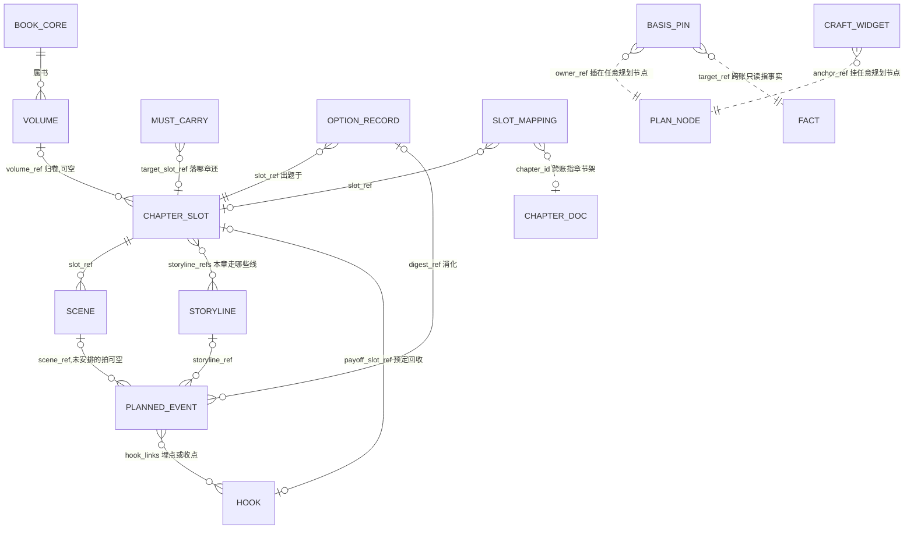

# 规划账存储层设计 R01（PLAN_LEDGER_STORAGE_DESIGN）

身份：**轻档设计稿。** 上承 [OUTLINE_STRUCTURE_DESIGN_R02.md](OUTLINE_STRUCTURE_DESIGN_R02.md)（概念定稿：五层篮子＋三横架＋消化清单＋字数预估）——那份稿回答「大纲长什么形状」，本稿回答 CZ 的下一问：**「数据结构是什么样子？如何存？都有哪些字段？」** 定下来之后，其他模块（M8 出题、M9 概览、M11 打包器）就知道该抓什么、往哪写。

本稿不是施工合同：字段表是合同的人读版，机器可校验的 JSON Schema 文件随施工单机械翻译落 `contracts/`（模块归属和合同编号等挂 [../ARCHITECTURE.md](../ARCHITECTURE.md) 线路图时定，本稿不越权发号）。

---

## 0. 三句话结论（CZ 快读）

1. **形状**：数据形状用一份与引擎无关的 JSON Schema 合同定死——本稿的十二类对象字段表就是它的人读版，上层模块照合同抓数，永远不关心底下是文件还是数据库。
2. **MVP 现阶段**：继续 JSON 文件——每本书 `data/<书名>/plan.json`（规划账主文件）＋ `plan_history.jsonl`（改动流水），跟现有 `facts.json` 同目录并存、同族做法、零新依赖；I-014 重复编号的教训用「发号器＋写前查重＋载入预检」三道闸堵死。
3. **产品化（Web 多用户）**：上 PostgreSQL——骨架字段进列、弹性内容进 JSONB，移交这类「一瞬间要改好几处」的动作用事务包住，顺引脚找受牵连计划用递归查询（图概念保留、工程先关系库，考古概念 58）；因为引擎藏在存储模块后面，迁移那天上层模块一行不改。

一个先说清的总原则（ADD-007）：**账本可以细，执行包必须瘦。** 下面字段看着多，但这是账本不是执行包——生成时喂模型什么，由 M11 打包器按预算挑；存储层不为省上下文砍字段，砍是打包器的事。

---

## 1. 字段表：十二类对象＋公共字段＋账本骨架

### 1.0 三条书写约定

- **英文字段名只进代码、合同、存储**；产品界面和给人读的文档一律人话（产品词典三铁律 1「英文字段名不回写产品正文」——界面上没人会看见 `digest_status` 这种词）。
- **「必填」＝字段必须写进记录**；暂时没有值就写 `null` 或空列表，不许整个字段缺席——机械校验（V0 级）靠这个。
- **时间不混轴**（T3 语义合同草案的三种时间）：下面所有 `created_at`／`updated_at` 都是**系统登记时间**；**故事内时间**只住在计划事件的 `story_time_hint`；**叙述释放位置**由槽位序列＋槽位映射（章的位置）承担。三个轴永不互相代填。

### 1.1 公共字段（每个规划对象都带，后面各表不再重复）

| 字段英文名 | 类型 | 必填 | 人话含义 | 例子 |
|---|---|---|---|---|
| `id` | str | 是 | 门牌号，前缀＋四位数字（规则见第 2 节） | `"PE-0412"` |
| `source_identity` | enum | 是 | 谁说的：`author_declared` 作者声明／`draft_inferred` 书稿反推／`model_suggested` 模型建议（ADD-004 Q5） | `"model_suggested"` |
| `truth_bearing` | enum | 是 | 真值方向：`primary` 主（大纲为真）／`shadow` 影（正文投影）／`handed_over` 已移交（当初的打算）——详见第 3 节 | `"primary"` |
| `created_at` | str | 是 | 系统登记时间 | `"2026-08-13 02:40:11"` |
| `updated_at` | str | 是 | 最近一次修改的系统时间 | `"2026-08-13 02:45:03"` |
| `rev` | int | 是 | 修订号，建档为 1，每改一次 +1（与改动流水对账用） | `3` |
| `note` | str | 是（可空串） | 备注 | `""` |

`book_id` 不作为记录字段：MVP 文件时代「这条记录属于哪本书」由所在目录天然决定；进数据库那天它升格为一列（复合唯一键的一半），这是迁移脚本的事，不是现在的字段。

### 1.2 书核 `book_core`（BK-，每书恒一条）

| 字段英文名 | 类型 | 必填 | 人话含义 | 例子 |
|---|---|---|---|---|
| `premise` | str | 是 | 一句话前提——它就是书核的胶囊，不另设梗概字段 | `"抬棺匠陈九棺发现祖传阴棺里封的不是尸体，而是他自己的名字……"` |
| `genre_promise` | str | 是(可 null) | 题材承诺：讲什么类型、爽点是什么 | `"悬疑灵异；开棺代价步步升级"` |
| `main_beats` | list[obj] | 是（可空表） | 主线大节拍 3～5 个，每个 `{key, text}`；`key` 建档即定、永不重编（供 `origin_ref` 回指） | `[{"key":"beat-2","text":"每开一口禁棺，世上多一个忘记他的人"}]` |
| `ending_anchor` | str | 是(可 null) | 结局锚点，允许空（R02 §3.1） | `"开尽十二棺那天，要么活成人，要么活成棺中名"` |
| `volumes_enabled` | bool | 是 | 卷层开没开：默认 `false`，约 30 章或作者手动才开（ADD-004 Q2） | `false` |

### 1.3 卷 `volume`（VOL-）

| 字段英文名 | 类型 | 必填 | 人话含义 | 例子 |
|---|---|---|---|---|
| `order` | int | 是 | 第几卷 | `1` |
| `title` | str | 是(可 null) | 卷名 | `"第一卷·首棺"` |
| `goal` | str | 是 | 卷目标 | `"让开棺代价从传说变成切身之痛"` |
| `main_conflict` | str | 是 | 主冲突 | `"求活 vs 被世界遗忘"` |
| `entry_state` | str | 是(可 null) | 入口状态：开卷时世界什么样 | `"首棺未开"` |
| `exit_state` | str | 是(可 null) | 出口状态：卷末世界什么样 | `"三棺已开，爷爷忘了他"` |
| `summary` | str | 是 | 卷胶囊一句话（概览层只读这格） | `"首棺开启，代价初现"` |

### 1.4 章槽位 `chapter_slot`（S-；＝章篮：槽位＋章纲装在一起）

| 字段英文名 | 类型 | 必填 | 人话含义 | 例子 |
|---|---|---|---|---|
| `volume_ref` | str/null | 是(可 null) | 归哪卷；卷没开就 null | `null` |
| `title_hint` | str | 是(可 null) | 章名建议 | `"归家"` |
| `goal` | str | 是 | 本章目标一句话（旧设计「大卡」的落位） | `"让开棺的代价第一次砸在主角身上"` |
| `summary` | str | 是 | 章梗概两三句＝章胶囊（M9 概览直接渲染） | `"九棺回家报平安，爷爷却当他是陌生人……"` |
| `entry_state` | str | 是(可 null) | 开写前世界什么样（人话；证据用依据引脚挂，见 1.10） | `"已开首棺；爷爷健在"` |
| `storyline_refs` | list[str] | 是（可空表） | 本章走哪几条线 | `["L-0001"]` |
| `scene_refs` | list[str] | 是（可空表） | 场安排——**数组顺序就是场序** | `["SCN-0007","SCN-0008"]` |
| `exit_condition` | str | 是(可 null) | 章尾必须成立什么 | `"九棺确认『遗忘』就是开棺的代价"` |
| `exit_hook` | str | 是(可 null) | 结尾钩子 | `"棺中传出第二次心跳"` |
| `must_not` | list[str] | 是（可空表） | 不能违反的硬边界（来自事实账／设定集） | `["爷爷只能『忘』，不能死"]` |
| `risks` | list[str] | 是（可空表） | 写前就知道的坑 | `["『遗忘』规则细节未定"]` |
| `target_length` | int/null | 是(可 null) | 目标字数，作者按平台习惯设 | `2600` |
| `slot_status` | enum | 是 | `planned` 计划中／`handed_over` 已移交／`dropped` 已作废（留痕不删） | `"planned"` |
| `handover` | obj/null | 是(可 null) | 移交记录 `{chapter_id, handed_at, decided_by}`，写成入库那刻填（见第 3 节） | `null` |

**四样东西故意不设字段**：①`estimated_length` 预估合计和容量灯——由各场 `word_estimate` 加总现算，属派生值，落盘会跟场数据不同步；②写法指导栏——由挂件对象（1.9）挂上来，不内嵌；③硬性承接——是独立对象 MC（1.11）指向槽位；④槽位顺序——住在账本顶层的 `slot_sequence` 数组里（1.14），插槽不用重编号。

### 1.5 场 `scene`（SCN-）

| 字段英文名 | 类型 | 必填 | 人话含义 | 例子 |
|---|---|---|---|---|
| `slot_ref` | str | 是 | 属哪个章槽 | `"S-0004"` |
| `goal` | str | 是 | 这场存在的理由 | `"让读者先于主角意识到爷爷忘了他"` |
| `summary` | str | 是 | 场胶囊一句话 | `"九棺推门喊爷爷，老人握着削了一半的苹果问他找谁"` |
| `location` | str | 是(可 null) | 地点 | `"陈家老屋堂屋"` |
| `characters` | list[str] | 是（可空表） | 谁在场 | `["陈九棺","爷爷"]` |
| `pe_refs` | list[str] | 是（可空表） | 拍序列——**数组顺序＝叙述顺序**（双序轻量版，R02 §3.6） | `["PE-0411","PE-0412"]` |
| `mood_in` | str | 是(可 null) | 入场情绪 | `"暖（归家）"` |
| `mood_out` | str | 是(可 null) | 出场情绪 | `"毛骨悚然"` |
| `visual_hint` | str | 是(可 null) | 画面提示（M9 配图、M10 场景卡两用） | `"昏黄堂屋，老人背光削苹果，果皮不断"` |
| `dialogue_hints` | list[str] | 是（可空表） | 对白要点，点到为止不代写 | `["「你找谁」必须是全场最后一句"]` |
| `resistance` | str | 是(可 null) | 阻力——没阻力就没戏 | `"爷爷表现完全正常，九棺只当他开玩笑"` |
| `turn` | str | 是(可 null) | 转折——这场在哪拐弯 | `"爷爷把削好的苹果递给他：『小伙子，尝尝？』"` |
| `pov` | str | 是(可 null) | 谁的视角 | `"陈九棺"` |
| `spoiler_notes` | list[str] | 是（可空表） | 作者手动加的禁泄露句；机器派生那部分（本槽未揭示伏笔的安全摘要）打包时现拼，不落盘 | `["不能暗示『忘记』会蔓延到更多人"]` |
| `word_estimate` | int/null | 是(可 null) | 这场写清楚大概要多少字（喂章篮容量灯，ADD-004 Q4） | `900` |

**v2 预留（场篮完整档，R02 §3.5，登记名不建字段）**：`stakes` 赌注／`tactics` 策略／`decision` 决定／`learned_by_cast`·`learned_by_reader`·`still_hidden` 新知三分／`exit_state` 出口状态。作者用到多视角强悬念或 M10 要更厚的戏剧信息时再开。

### 1.6 计划事件 `planned_event`（PE-；拍）

| 字段英文名 | 类型 | 必填 | 人话含义 | 例子 |
|---|---|---|---|---|
| `text` | str | 是 | 一句话：谁做了什么／什么变了（不拆表述—命题，ADD-004 Q6；本体即胶囊） | `"爷爷看着九棺，问他是谁"` |
| `scene_ref` | str/null | 是(可 null) | 属哪场；从书核节拍拆下来还没安排进场的拍＝null（这正是「待消化清单」要捞的） | `"SCN-0007"` |
| `storyline_ref` | str/null | 是(可 null) | 归哪条线 | `"L-0001"` |
| `purpose` | enum | 是 | 目的标签五选一：`setup` 设置／`advance` 推进／`reveal` 揭示／`payoff` 回收／`repair` 修复（＝旧小卡） | `"payoff"` |
| `hook_links` | list[obj] | 是（可空表） | 跟伏笔的关系，每条 `{hook_ref, role}`，role＝`plant` 埋／`payoff` 收 | `[{"hook_ref":"H-0003","role":"payoff"}]` |
| `story_time_hint` | str/null | 是(可 null) | 故事内时间提示（可选标注；将来真需要双序查询时升格为可排序 `story_order`，ID 不搬家） | `"开棺次日清晨"` |
| `digest_status` | enum | 是 | 消化状态：`pending` 待消化／`digested` 已消化／`voided` 已作废（留痕） | `"digested"` |
| `digest_ref` | str/null | 是(可 null) | 已消化时挂的选择记录号 | `"OPT-0001"` |
| `origin_ref` | str/null | 是(可 null) | 从哪拆出来的（书核节拍／卷／伏笔），待消化清单靠它认上游欠账 | `"BK-0001#beat-2"` |
| `repair_ref` | str/null | 是(可 null) | `purpose=repair` 时指要修的遗留问题（体检报告条目号或风险文字） | `null` |
| `deviation_note` | str/null | 是(可 null) | 移交对账后作者留的偏差标注（完整偏差报告是派生产物，不落这本账） | `null` |

一条纪律再钉一次：**选项不落 PE 表。** M8 出题给的候选选项整包留在选择记录（1.12）里；作者选定（或 P1 放行）那刻，选中方案里的拍才作为 PE 入账、生来就是 `digested`。落选选项永远只是选择记录里的历史。

### 1.7 故事线 `storyline`（L-）

| 字段英文名 | 类型 | 必填 | 人话含义 | 例子 |
|---|---|---|---|---|
| `name` | str | 是 | 线名 | `"十二禁棺主线"` |
| `alias` | str/null | 是(可 null) | 好认的短别名，只供展示（R02 例子里的 `L-main` 是别名写法，机器主键统一数字号——见开放问题二） | `"main"` |
| `priority` | int | 是 | 优先级，1 最高 | `1` |
| `members` | list[str] | 是（可空表） | 成员（人物名，多对多） | `["陈九棺","爷爷"]` |
| `line_status` | enum | 是 | `active` 活跃／`paused` 搁置／`converged` 收束／`merged` 并线 | `"active"` |
| `last_scene_ref` | str/null | 是(可 null) | 上次现场指针（切线包恢复现场用） | `"SCN-0007"` |

### 1.8 伏笔 `hook`（H-）

| 字段英文名 | 类型 | 必填 | 人话含义 | 例子 |
|---|---|---|---|---|
| `content` | str | 是 | 底牌一句话——只在作者视图展示，未揭示时不进任何下游 | `"开棺有代价：至亲会遗忘开棺者"` |
| `plant_refs` | list[obj] | 是（可空表） | 埋点，每条 `{ref, note}`，ref 指 PE 或场，可多处 | `[{"ref":"PE-0203","note":"老仵作的警告"}]` |
| `payoff_slot_ref` | str/null | 是(可 null) | 预定回收槽位；允许改期，改期走改动流水留痕 | `"S-0004"` |
| `hook_status` | enum | 是 | `open` 挂着／`paid` 已收／`voided` 作废（留痕） | `"paid"` |
| `paid_by_ref` | str/null | 是(可 null) | 收点的拍 | `"PE-0412"` |
| `revealed` | bool | 是 | 读者可知标记：揭没揭示。规划账里它是**计划揭示状态**（账本整本是计划态，铁字段兜着不冒充已发生）；移交后跟正文走 | `true` |
| `revealed_at` | str/null | 是(可 null) | 揭示位置（场或槽位号） | `"SCN-0007"` |
| `safety_summary` | str | 是 | 脱敏安全摘要——未揭示时给 AI 下游的唯一形态，不含底牌（R02 §3.7 防泄底最小机制） | `"爷爷一线埋有未揭示设定，涉及『遗忘』，第 4 章前不得暗示范围"` |

义务（角色立的债）不进这张表也不进这本账 v1——将来照伏笔账样式开兄弟账（R02 §3.7 边界）。

### 1.9 写法挂件 `craft_widget`（WG-）

| 字段英文名 | 类型 | 必填 | 人话含义 | 例子 |
|---|---|---|---|---|
| `key` | str | 是 | 开放词表键：命名空间.名字；命名空间限 `technique`／`template`／`theory`／`reader_effect` 四家（R02 §6），新空间按 N23 登记 | `"technique.用日常写恐怖"` |
| `anchor_ref` | str | 是 | 挂在哪个节点（BK-/VOL-/S-/SCN-/PE- 任意稳定 ID） | `"S-0004"` |
| `payload` | obj | 是（可空 `{}`） | 自由参数或说明，开放结构不枚举校验 | `{"note":"削苹果的手法一模一样，只是不认得他"}` |

卸载＝删这条记录，骨架无感（挂点机制拍板）。模板＝一组挂件坐标映射＋缺位提醒；提醒是运行时行为，提一次就闭嘴（捞货 46），不落账。

### 1.10 依据引脚 `basis_pin`（PIN-）

| 字段英文名 | 类型 | 必填 | 人话含义 | 例子 |
|---|---|---|---|---|
| `owner_ref` | str | 是 | 插在哪个规划节点上 | `"S-0004"` |
| `target_kind` | enum | 是 | 指向哪类依据：`fact` 事实账条目／`setting` 材料架设定条目／`author_quote` 作者原话 | `"fact"` |
| `target_ref` | str/null | 条件 | 目标编号（`fact`／`setting` 时必填） | `"F-0031"` |
| `quote` | str/null | 条件 | 作者原话正文（`author_quote` 时必填，此时 `target_ref` 为 null） | `null` |
| `purpose_note` | str | 是（可空串） | 为什么引它 | `"入口状态依据：已开首棺"` |

方向铁律：**规划→事实，单向只读**。引脚永不反写事实账；事实被改判时，程序反着扫引脚（`target_ref` 命中的），把受牵连的计划亮灯——修改传播三层的计划态档（R02 §3.8）。反推节点（`draft_inferred`）入账时自动带引脚指回抽取出处，抽取质量指标顺着这条链算。

### 1.11 必写承接 `must_carry`（MC-）

任务清单没单列它，但 ADD-009 已登记 MC- 前缀、消化清单里要点它的名，没有表就没法存，故补上：

| 字段英文名 | 类型 | 必填 | 人话含义 | 例子 |
|---|---|---|---|---|
| `text` | str | 是 | 必须还什么账 | `"兑现 H-0003『开棺有代价』"` |
| `target_slot_ref` | str/null | 是(可 null) | 预定落在哪章还 | `"S-0004"` |
| `origin_ref` | str/null | 是(可 null) | 这笔账谁欠下的（上游槽位／书核节拍／伏笔） | `"H-0003"` |
| `mc_status` | enum | 是 | `pending` 待还／`digested` 已还／`voided` 作废（留痕） | `"digested"` |
| `digest_ref` | str/null | 是(可 null) | 还账走的选择记录 | `"OPT-0001"` |

### 1.12 选择记录 `option_record`（OPT-；消化记录）

| 字段英文名 | 类型 | 必填 | 人话含义 | 例子 |
|---|---|---|---|---|
| `slot_ref` | str | 是 | 哪个槽位的出题 | `"S-0004"` |
| `question` | str | 是 | 题目：下一步剧情怎么走 | `"爷爷忘了九棺之后，这一章怎么收？"` |
| `options` | list[obj] | 是 | **全部候选留档**，每个 `{key, summary, why_fit 为什么适合, changes 会改变什么, risks 风险, digest_refs 消化清单}`（选项给代价，捞货 45；消化清单引用必须来自出题时的待消化清单，程序机械校验） | 见第 5 节样例 |
| `chosen_key` | str/null | 是(可 null) | 选中了哪个（未决时 null） | `"opt-2"` |
| `decided_by` | enum | 是 | `author` 作者亲选／`auto` P1 档位放行自动走（停点留痕） | `"author"` |
| `decided_at` | str/null | 是(可 null) | 选定时间 | `"2026-08-13 02:44:00"` |
| `digest_applied` | list[str] | 是（可空表） | 选定那刻实际标了已消化的对象（PE／H／MC 号） | `["PE-0412","H-0003","MC-0011"]` |
| `variant_note` | str/null | 是(可 null) | ⚠️ 变体兑现说明——R02 开放问题 O2 推荐 A 尚未拍板，字段先预留可空，不实装逻辑 | `null` |

### 1.13 槽位映射记录 `slot_mapping`（MAP-；N19-B 的第三件套）

设计取向：**映射表只记「例外」和「已写成」**。默认一槽一章按 `slot_sequence` 顺序推算（C7 的 `chapter_hint` 是算出来的），账里不为每个常规槽存一行废话；出现拆章、并章、插入章，或某章真的写成入库了，才落一行。

| 字段英文名 | 类型 | 必填 | 人话含义 | 例子 |
|---|---|---|---|---|
| `slot_ref` | str/null | 条件 | 哪个槽位；计划外插入的章（无槽承接）＝null | `"S-0004"` |
| `chapter_id` | str/null | 条件 | 实际章号（章节架 `c04`）；还没写成、只是预调整时＝null | `"c04"` |
| `expected_chapter_no` | int/null | 是(可 null) | 预计物理章号（写成前的调整用：原 18 章内容改由 18、19 两章完成→S-0018 两行，各填 18、19） | `4` |
| `mapping_kind` | enum | 是 | `as_written` 照常写成／`split` 一槽拆多章／`merge` 多槽并一章／`inserted` 计划外插入章／`non_narrative` 非叙事章 | `"as_written"` |
| `reason` | str | 是（可空串） | 为什么这样映射（系统只建议、不静默改，留痕是底线） | `"场预估合计超目标字数"` |
| `decided_by` | enum | 是 | `author`／`auto`（P3 档位「提醒不停」自动应用时记 auto＋醒目留痕） | `"author"` |
| `mapping_status` | enum | 是 | `active` 现行／`superseded` 已被顶替（留痕不删） | `"active"` |
| `superseded_by` | str/null | 是(可 null) | 被哪条新映射顶替 | `null` |

### 1.14 停点设置 `stop_points`（项目级，每书一份，存 plan.json 的设置区）

| 字段英文名 | 类型 | 必填 | 人话含义 | 例子 |
|---|---|---|---|---|
| `preset` | enum | 是 | 档位包：`novice` 小白／`advanced` 高级／`custom` 自定义 | `"novice"` |
| `P1` | enum | 是 | 选项选择：`auto_pass`／`remind`／`hard_stop` | `"auto_pass"` |
| `P2` | enum | 是 | 消化标记：同上（默认随 P1） | `"auto_pass"` |
| `P3` | enum | 是 | 槽位调整：**只有 `remind`／`hard_stop`**——N19-B 拍过不许静默改规划，值域里根本没有 auto_pass | `"remind"` |
| `P4` | enum | 是 | 删改重核：`auto_pass`／`remind`／`hard_stop` | `"remind"` |
| `P5` | enum | 是 | 分拣确认：同上；疑似丢正文的强制必停是**硬编码**，不受这个值影响（ADD-009 拍板） | `"remind"` |

真值签字类动作（事实入账、来源身份认领、Bible 升级、改史）不在这张表里——它们不进停点档位系统，任何档位都要作者显式动作（ADD-005 边界）。

### 1.15 账本骨架：plan.json 顶层

| 字段英文名 | 类型 | 必填 | 人话含义 | 例子 |
|---|---|---|---|---|
| `schema` | str | 是 | 账本格式版本 | `"plan-v1"` |
| `ledger` | str | 是 | 🔥 恒为 `"plan"` 的铁字段——整本账都是计划态，防冒充事实（status_stamp 铁律在账本级的落点） | `"plan"` |
| `book` | obj | 是 | 书核（单条内嵌，见 1.2） | `{…}` |
| `slot_sequence` | list[str] | 是 | 🔥 规划槽位序列——**顺序即数组序**（N19-B 第一序列；插槽＝数组插入，不重编号，原计划相对位置永不丢） | `["S-0001","S-0002",…]` |
| `volumes` / `slots` / `scenes` / `events` / `storylines` / `hooks` / `widgets` / `pins` / `must_carries` / `option_records` / `slot_mappings` | list | 是 | 十一类对象各一个数组 | `[…]` |
| `stop_points` | obj | 是 | 停点设置（1.14） | `{…}` |
| `id_counters` | obj | 是 | 发号器：每前缀已发出的最大号（第 2 节） | `{"S":4,"PE":412}` |

**实际章节序列不在这里**——它就是事实侧已有的 `chapters.json`（N19-B 第二序列），不重复存；两序靠槽位映射（1.13）连接。

### 1.16 ER 图＋引用方向铁律



图例：`PLAN_NODE` 是虚拟统称（书核／卷／槽／场／拍任意一个）；`FACT` 和 `CHAPTER_DOC` 在事实侧（`facts.json`／`chapters.json`），虚线＝跨账引用。

谁引用谁，四条铁律：

1. **子指父**：场指槽（`slot_ref`）、拍指场（`scene_ref`）——归属存在孩子身上；同时父持有顺序数组（`scene_refs`／`pe_refs`），因为顺序必须有个家。两边冗余靠载入预检机械核对（不一致＝拒载报错）。进数据库那天顺序数组换成 order 列，冗余消失。
2. **横架指骨架**：故事线、伏笔、挂件、引脚、承接、选择记录全都拿着骨架节点的 ID 来挂，骨架对象身上不长「谁挂了我」的反向列表——查反向关系用扫描（MVP 量级毫秒事）。
3. **规划→事实单向只读**：只有引脚和映射两处跨账，都只存对方 ID 字符串，读取时解引用；规划账永不写事实账。
4. **顺序不进对象进序列**：槽序在 `slot_sequence`、场序在 `scene_refs`、拍序在 `pe_refs`——插入元素不惊动任何编号。

---

## 2. ID 规则（吸收 ADD-009 拍板＋I-014 事故教训）

### 2.1 前缀登记表

| 前缀 | 对象 | 登记状态 |
|---|---|---|
| `S-` | 章槽位 | ADD-009 已登记 |
| `PE-` | 计划事件 | 已登记 |
| `H-` | 伏笔 | 已登记 |
| `L-` | 故事线 | 已登记 |
| `OPT-` | 选择记录 | 已登记（户口待词典 N9 正式定稿） |
| `MC-` | 必写承接 | 已登记（同上） |
| `F-` | 事实（事实账侧编号，本账只在引脚里引用，永不发放） | 已登记 |
| `BK-` 书核／`VOL-` 卷／`SCN-` 场／`WG-` 挂件／`PIN-` 引脚／`MAP-` 映射 | 本稿新增 | **暂定**，交词典 N9 前缀登记表一并定稿 |

编号样式全家统一 **前缀-四位零垫**（ADD-009 的 F-0001 风格）：`S-0004`、`PE-0412`、`H-0003`。超过 9999 就顺延五位，已发的号不重排。R02 例子里的 `S-004`、`H-03`、`L-main`、`OPT-S004-2` 都是概念稿草写，存储层统一按本节规则；`L-main` 那种好认名转存为 `alias` 字段（争议见开放问题二）。

### 2.2 唯一域

**书项目内唯一**：同一本书里 `PE-0412` 永远只有一条；跨书可以重号，因为每本书一个 `plan.json`（将来一个 `book_id`）。产品化后数据库用 `UNIQUE(book_id, id)` 复合约束兜底。两本账（PE／F）靠前缀天然分家，编号永不混——计划和事实不进同一张表，这条铁律顺带把撞号可能性归零。

### 2.3 发号方式＋三道闸（I-014 的账）

事故复盘一句话：事实账 v0 拿「当前条数＋1」当号（`store.py` 的 `f{len(fs)+1}`），重跑入账时炸出 50 个重复号（[../ISSUES.md](../ISSUES.md) I-014，f274–f323 各挂两条不同事实）。教训：**编号不能从数据推，要从发号器领。**

规划账从第一天三道闸：

1. **发号器**：`plan.json` 顶层 `id_counters` 记每前缀已发最大号，新对象领号＝计数器 +1 并随同一次保存写回；作废、删除不回收号、不回填空洞。
2. **写前查重**：入账函数写入前查 id 是否已存在，撞号直接抛错拒写，不静默覆盖。
3. **载入预检**：planstore 读账时先跑完整性预检（id 重复、引用悬空、父子数组与 back-ref 不一致），发现坏账当场报错拒载——M7 体检已经用「机械拦截＋副本单独报」挡过 I-014，这里把同款检查前移到账房门口。

MVP 是单进程 CLI 顺序写，一个写者，这三道够了；产品化后发号进数据库事务，UNIQUE 约束做最后防线。

---

## 3. ADD-010 落字段：来源身份、真值方向、移交

### 3.1 两个公共字段怎么取值

每个规划对象都带 `source_identity`（谁说的）和 `truth_bearing`（谁为真），出生时按场景赋值：

| 场景 | `source_identity` | `truth_bearing` 出生值 | 人话 |
|---|---|---|---|
| 作者手写／作者确认收编 | `author_declared` | `primary` | 作者的意图，大纲为真 |
| 旧稿（或新写成章节）反推 | `draft_inferred` | `shadow` | 从正文抽出来的投影——正文为真，抽错是产品的错 |
| 模型选项经 P1 选定落账 | `model_suggested` | `primary` | 进了账就是当前打算（大纲为真侧）；但来源老实标模型，不冒充作者 |

三条配套规则：

- **升级是真值签字**：`draft_inferred`／`model_suggested` 节点升级为 `author_declared`（来源身份认领）不走停点档位，任何档位都要作者显式动作＋改动流水留痕（ADD-005 边界）。
- **抽取指标只对影**：贴近正文程度＝产品责任，只在 `truth_bearing="shadow"` 的节点上算；影节点入账时自动带依据引脚指回抽取出处（章节＋事实号），指标顺链可回验。
- **偏差报告只对移交**：计划兑现度＝作者参考，只在 `handed_over` 节点上算；对 `primary` 节点谈「偏差」没有意义（它自己就是真值）。

### 3.2 移交（真值接力棒）在数据上怎么表达

作者写完某章、正文入库（章节架新增 `c04`）那一刻，真值从计划交回正文。数据上共五件事——**前四件在规划账内、包成一笔原子动作**，第五件走既有的独立工序：

1. 槽位填 `handover = {"chapter_id": "c04", "handed_at": "…", "decided_by": "author"}`，`slot_status` 翻 `handed_over`；
2. 该槽下所有场和拍的 `truth_bearing` 批量翻 `handed_over`——它们从「当前打算」变成「当初的打算」，原文原样保留、永不按正文改写（要贴正文的是影子节点，不是旧计划）；
3. `slot_mappings` 落一行（`S-0004 ↦ c04`，`mapping_kind` 按实际情况取 `as_written`／`split`／`merge`）；
4. 改动流水记一条 `handover`；
5. 新正文照常走 M1→M3→M5 入事实账领 F 号——事实不强制回连 PE（两道工序分清，R02 §4）；想连的话入账后补弱链接，属增强不属骨架。

MVP 文件时代「原子」靠一次整文件保存天然成立；数据库时代这五件事包进一个事务——这正是第 4 节选 PostgreSQL 的理由之一。

移交前后对照（同一个拍）：

```json
// 移交前：大纲为真
{"id": "PE-0412", "truth_bearing": "primary", "digest_status": "digested", "digest_ref": "OPT-0001", "deviation_note": null}
// 移交后：正文为真，这条变成「当初的打算」，对账发现作者实际写成师妹遗忘
{"id": "PE-0412", "truth_bearing": "handed_over", "digest_status": "digested", "digest_ref": "OPT-0001", "deviation_note": "实际写成师妹遗忘（正文赢，作者已阅）"}
```

对账把偏差亮给作者、由他选往哪边改（默认正文赢）；作者若选「照原计划改正文」，改的是书稿侧，规划账这条不动。已移交章节在大纲画布上显示什么，见开放问题三。

---

## 4. 存储选型（三层分开答）

### 4.1 第一层：数据形状＝一份引擎无关的 JSON Schema 合同

先把「形状」和「引擎」拆开：**形状是合同，引擎是实现。** 第 1 节字段表就是合同的人读版；施工时机械翻译成 JSON Schema 文件落 `contracts/`（枚举值、必填、引用格式全部可程序校验），M8 出题、M9 概览、M11 打包器靠它知道抓哪个字段，根本不用知道数据躺在文件里还是数据库里。翻译样式（以计划事件为例，施工时补全十二类）：

```json
{
  "$defs": {
    "planned_event": {
      "type": "object",
      "required": ["id", "text", "scene_ref", "storyline_ref", "purpose", "hook_links",
                   "story_time_hint", "digest_status", "digest_ref", "origin_ref",
                   "repair_ref", "deviation_note", "source_identity", "truth_bearing",
                   "created_at", "updated_at", "rev", "note"],
      "properties": {
        "id": {"type": "string", "pattern": "^PE-\\d{4,}$"},
        "purpose": {"enum": ["setup", "advance", "reveal", "payoff", "repair"]},
        "digest_status": {"enum": ["pending", "digested", "voided"]},
        "truth_bearing": {"enum": ["primary", "shadow", "handed_over"]}
      }
    }
  }
}
```

配套一条工程纪律：上层模块**禁止**自己 `open("plan.json")`——一律走存储模块（施工时新建 `mvp/planstore.py`，地位对标 [../mvp/store.py](../mvp/store.py) 之于 M4）的公开函数。I-011 记过一次绕过公开接口直摸内部的教训，这里提前立规矩。引擎藏在 planstore 后面，换引擎＝只改这一个文件，呼应 [../ARCHITECTURE.md](../ARCHITECTURE.md) 的模块化合同制（模块内部随便换，合同不变即可）。

### 4.2 第二层：MVP 现阶段——JSON 文件 vs SQLite，推荐 JSON 文件

| 维度 | JSON 文件 | SQLite |
|---|---|---|
| 依赖 | 标准库 `json`，零新依赖 | 标准库 `sqlite3`，也零新依赖（平手） |
| 肉眼可读／CZ 直接打开检查 | ✅ 文本，随手开 | ❌ 二进制，要工具 |
| git 可 diff、可回滚 | ✅（data/ 目前不进 git，但拷出来对比也方便） | ❌ 二进制 diff 无意义 |
| 唯一性／完整性约束 | 自己写三道闸（第 2.3 节） | ✅ 库层 UNIQUE／外键 |
| 局部更新、并发 | 整文件重写，单写者 | ✅ 行级更新、多连接 |
| 与现有 facts.json 并存 | ✅ 同族同目录同做法，一套心智 | 两种存储并存，认知负担 |
| 量级适配（3～20 章≈几百 KB） | 绰绰有余 | 能力过剩 |

✅ **推荐：JSON 文件。** 说白了就是：现在整本规划账才几百 KB、单机单进程一个写者，SQLite 的强项（约束、并发、局部更新）全用不上，而它的代价立刻要付——CZ 打不开肉眼看、diff 变瞎子、还要配迁移工具。调试期最值钱的就是「随手打开看一眼数据对不对」。SQLite 真正强的唯一性约束，用发号器＋查重＋预检三道闸补齐（I-014 正是这么修的思路）。工程细节两条：写盘用「临时文件＋原子替换」防写一半断电；改动流水单独放 `plan_history.jsonl` 纯追加（第 6 节）。

什么时候换：出现 Web 多用户、并发写、或查询肉眼可感地变慢，任一发生就换引擎——因为有 4.1 的合同，换的时候上层不动。

### 4.3 第三层：产品化（Web 多用户）——PostgreSQL，不选 MySQL

到了 Web 多用户，文件肯定不够了：几百个作者同时写、每人几本书、权限要隔离、备份要事务——这是数据库的地盘。两个候选里推荐 **PostgreSQL**，理由讲人话：

- **JSONB 两头兼得**：规划账天生一半是骨架（id、引用、状态、序——查询要快）、一半是弹性正文（选项数组、挂件 payload、场的戏剧字段——结构会演化）。PG 的 JSONB 让骨架进列、弹性进 JSON 字段，而且 JSON 里面照样能建索引、能按内容查——等于关系库和文档库一张桌子全坐下。MySQL 也有 JSON 类型，但索引和查询函数弱一截。⚠️ 未调查标注：PG/MySQL 的对比是行业通识判断，本仓没跑过两者实测。
- **事务包住移交**：第 3.2 节移交要一瞬间改四处，PG 事务包住，改一半崩了自动全退——文件时代靠整文件保存模拟的原子性，这里是真的。
- **图查询先用关系库扛**：「事实改判→顺引脚找受牵连计划→再顺消化链找选择记录」是图遍历，PG 的递归查询（WITH RECURSIVE）足够——正是考古概念 58 的拍法：图概念保留，工程先关系数据库＋引用，有真实性能需求再上专用图引擎。
- **多用户隔离现成**：PG 的行级安全（RLS）能按 `book_id`／作者直接隔离数据，Web 化少写一层权限代码。
- MySQL 不是不行，是**没有选它的理由**：上面每一项它都弱半档或持平，而我们也没有任何 MySQL 存量要迁就。

### 4.4 迁移路径（一段话）

形状不变，搬家就只是搬运：`plan.json` → PG 表＝骨架字段拆成列、弹性字段整块进 JSONB，写一个一次性脚本按 JSON Schema 校验后灌库、灌完跑同一套载入预检核数；上层模块因为只认 planstore 的合同函数，换引擎那天它们一行代码不改。中途如果单机版要长期发售、需要更强完整性，可以在 planstore 后面先换一站 SQLite（同接口换实现），但它不是必经站——JSON 直跳 PG 完全可行。

---

## 5. 《万鬼伏藏》mini 全量样例

一本书的 `plan.json` 切片：书核＋一条故事线＋一个章槽＋一场＋两拍＋一条伏笔＋一个挂件＋一条选择记录，外加引脚、必写承接各一条和停点设置，字段与第 1 节逐一对应。三处样例边界先说明：只截了第 4 章一场（实际本章三场 900+700+1100，容量灯按全场合计算）；伏笔埋点指向的 PE-0203 在第 2 章、不在切片内；引脚指向的 F-0031 按目标态 F-0001 风格写（现行 f001 写法的过渡见第 6 节）。

```json
{
  "schema": "plan-v1",
  "ledger": "plan",
  "book": {
    "id": "BK-0001",
    "premise": "抬棺匠陈九棺发现祖传阴棺里封的不是尸体，而是他自己的名字。要活命，他必须找齐十二口禁棺——可每开一口，世上就多一个忘记他的人。",
    "genre_promise": "悬疑灵异；开棺代价步步升级",
    "main_beats": [
      {"key": "beat-1", "text": "祖传阴棺里封着他自己的名字"},
      {"key": "beat-2", "text": "每开一口禁棺，世上多一个忘记他的人"},
      {"key": "beat-3", "text": "十二棺齐开，代价的真相反噬而来"}
    ],
    "ending_anchor": "开尽十二棺那天，要么活成人，要么活成棺中名",
    "volumes_enabled": false,
    "source_identity": "author_declared",
    "truth_bearing": "primary",
    "created_at": "2026-08-13 02:36:00",
    "updated_at": "2026-08-13 02:36:00",
    "rev": 1,
    "note": ""
  },
  "slot_sequence": ["S-0004"],
  "volumes": [],
  "slots": [
    {
      "id": "S-0004",
      "volume_ref": null,
      "title_hint": "归家",
      "goal": "让开棺的代价第一次砸在主角身上",
      "summary": "九棺开首棺后回家报平安，爷爷却当他是陌生人；族谱上他的名字淡了一半；深夜，棺中传出第二次心跳。",
      "entry_state": "已开首棺；爷爷健在（证据见引脚）",
      "storyline_refs": ["L-0001"],
      "scene_refs": ["SCN-0007"],
      "exit_condition": "九棺确认『遗忘』就是开棺的代价",
      "exit_hook": "棺中传出第二次心跳——里面还封着『别人』",
      "must_not": ["爷爷只能『忘』，不能死（设定：代价是遗忘不是死亡）"],
      "risks": ["『遗忘』规则细节未定：只忘人还是连带物件，需作者补设定"],
      "target_length": 2600,
      "slot_status": "planned",
      "handover": null,
      "source_identity": "model_suggested",
      "truth_bearing": "primary",
      "created_at": "2026-08-13 02:40:11",
      "updated_at": "2026-08-13 02:44:00",
      "rev": 2,
      "note": ""
    }
  ],
  "scenes": [
    {
      "id": "SCN-0007",
      "slot_ref": "S-0004",
      "goal": "让读者先于主角意识到『爷爷忘了他』",
      "summary": "九棺推门喊爷爷，老人握着削了一半的苹果问『小伙子你找谁』",
      "location": "陈家老屋堂屋",
      "characters": ["陈九棺", "爷爷"],
      "pe_refs": ["PE-0411", "PE-0412"],
      "mood_in": "暖（归家）",
      "mood_out": "毛骨悚然",
      "visual_hint": "昏黄堂屋，老人背光坐着削苹果，果皮不断",
      "dialogue_hints": ["「你找谁」必须是全场最后一句"],
      "resistance": "爷爷表现完全正常，九棺一开始只当爷爷开玩笑",
      "turn": "爷爷把削好的苹果递给他：『小伙子，尝尝？』——待客的动作宣判了陌生",
      "pov": "陈九棺",
      "spoiler_notes": ["本场只写个案，不能暗示『忘记』会蔓延到更多人"],
      "word_estimate": 900,
      "source_identity": "model_suggested",
      "truth_bearing": "primary",
      "created_at": "2026-08-13 02:44:00",
      "updated_at": "2026-08-13 02:44:00",
      "rev": 1,
      "note": ""
    }
  ],
  "events": [
    {
      "id": "PE-0411",
      "text": "九棺进门，喊爷爷说自己回来了",
      "scene_ref": "SCN-0007",
      "storyline_ref": "L-0001",
      "purpose": "setup",
      "hook_links": [],
      "story_time_hint": "开棺次日黄昏",
      "digest_status": "digested",
      "digest_ref": "OPT-0001",
      "origin_ref": null,
      "repair_ref": null,
      "deviation_note": null,
      "source_identity": "model_suggested",
      "truth_bearing": "primary",
      "created_at": "2026-08-13 02:44:00",
      "updated_at": "2026-08-13 02:44:00",
      "rev": 1,
      "note": ""
    },
    {
      "id": "PE-0412",
      "text": "爷爷看着九棺，问他是谁",
      "scene_ref": "SCN-0007",
      "storyline_ref": "L-0001",
      "purpose": "payoff",
      "hook_links": [{"hook_ref": "H-0003", "role": "payoff"}],
      "story_time_hint": "开棺次日黄昏",
      "digest_status": "digested",
      "digest_ref": "OPT-0001",
      "origin_ref": "BK-0001#beat-2",
      "repair_ref": null,
      "deviation_note": null,
      "source_identity": "model_suggested",
      "truth_bearing": "primary",
      "created_at": "2026-08-13 02:44:00",
      "updated_at": "2026-08-13 02:44:00",
      "rev": 1,
      "note": ""
    }
  ],
  "storylines": [
    {
      "id": "L-0001",
      "name": "十二禁棺主线",
      "alias": "main",
      "priority": 1,
      "members": ["陈九棺", "爷爷"],
      "line_status": "active",
      "last_scene_ref": "SCN-0007",
      "source_identity": "author_declared",
      "truth_bearing": "primary",
      "created_at": "2026-08-13 02:36:00",
      "updated_at": "2026-08-13 02:44:00",
      "rev": 2,
      "note": ""
    }
  ],
  "hooks": [
    {
      "id": "H-0003",
      "content": "开棺有代价：至亲会遗忘开棺者",
      "plant_refs": [{"ref": "PE-0203", "note": "第 2 章场 3，老仵作的警告"}],
      "payoff_slot_ref": "S-0004",
      "hook_status": "paid",
      "paid_by_ref": "PE-0412",
      "revealed": true,
      "revealed_at": "SCN-0007",
      "safety_summary": "爷爷一线埋有未揭示设定，涉及『遗忘』，第 4 章前不得暗示范围",
      "source_identity": "author_declared",
      "truth_bearing": "primary",
      "created_at": "2026-08-13 02:38:00",
      "updated_at": "2026-08-13 02:44:00",
      "rev": 3,
      "note": ""
    }
  ],
  "widgets": [
    {
      "id": "WG-0001",
      "key": "technique.用日常写恐怖",
      "anchor_ref": "S-0004",
      "payload": {"note": "削苹果的手法一模一样，只是不认得他"},
      "source_identity": "model_suggested",
      "truth_bearing": "primary",
      "created_at": "2026-08-13 02:44:00",
      "updated_at": "2026-08-13 02:44:00",
      "rev": 1,
      "note": ""
    }
  ],
  "pins": [
    {
      "id": "PIN-0001",
      "owner_ref": "S-0004",
      "target_kind": "fact",
      "target_ref": "F-0031",
      "quote": null,
      "purpose_note": "入口状态依据：已开首棺",
      "source_identity": "model_suggested",
      "truth_bearing": "primary",
      "created_at": "2026-08-13 02:44:00",
      "updated_at": "2026-08-13 02:44:00",
      "rev": 1,
      "note": ""
    }
  ],
  "must_carries": [
    {
      "id": "MC-0011",
      "text": "兑现 H-0003『开棺有代价』",
      "target_slot_ref": "S-0004",
      "origin_ref": "H-0003",
      "mc_status": "digested",
      "digest_ref": "OPT-0001",
      "source_identity": "author_declared",
      "truth_bearing": "primary",
      "created_at": "2026-08-13 02:39:00",
      "updated_at": "2026-08-13 02:44:00",
      "rev": 2,
      "note": ""
    }
  ],
  "option_records": [
    {
      "id": "OPT-0001",
      "slot_ref": "S-0004",
      "question": "首棺已开，第 4 章怎么让代价第一次落到主角身上？",
      "options": [
        {
          "key": "opt-1",
          "summary": "族里长辈接连认不出他，层层递进到爷爷",
          "why_fit": "递进节奏稳，铺垫充分",
          "changes": "需要多出一到两场，挤占章内空间",
          "risks": "节奏偏慢，钩子来得晚",
          "digest_refs": ["H-0003", "MC-0011"]
        },
        {
          "key": "opt-2",
          "summary": "直接写爷爷不认得他，用最亲的人打最疼的一拳",
          "why_fit": "冲击最大，正面兑现『至亲遗忘』",
          "changes": "爷爷线从此转入『陌生人』状态",
          "risks": "『遗忘』规则细节未定，写作时要守住边界",
          "digest_refs": ["H-0003", "MC-0011"]
        },
        {
          "key": "opt-3",
          "summary": "本章先不兑现代价，改写第二口棺的线索",
          "why_fit": "留着底牌，多攒一章悬念",
          "changes": "H-0003 改期到下一槽位",
          "risks": "欠账继续挂着，读者期待可能泄气",
          "digest_refs": []
        }
      ],
      "chosen_key": "opt-2",
      "decided_by": "author",
      "decided_at": "2026-08-13 02:44:00",
      "digest_applied": ["PE-0412", "H-0003", "MC-0011"],
      "variant_note": null,
      "source_identity": "model_suggested",
      "truth_bearing": "primary",
      "created_at": "2026-08-13 02:43:00",
      "updated_at": "2026-08-13 02:44:00",
      "rev": 2,
      "note": ""
    }
  ],
  "slot_mappings": [],
  "stop_points": {
    "preset": "novice",
    "P1": "auto_pass",
    "P2": "auto_pass",
    "P3": "remind",
    "P4": "remind",
    "P5": "remind"
  },
  "id_counters": {"BK": 1, "VOL": 0, "S": 4, "SCN": 7, "PE": 412, "L": 1, "H": 3, "WG": 1, "PIN": 1, "MC": 11, "OPT": 1, "MAP": 0}
}
```

对照读法：OPT-0001 的 opt-2 被选中那刻，`digest_applied` 里三个对象同步翻状态——PE-0412 生来 `digested`、H-0003 翻 `paid`、MC-0011 翻 `digested`，全都挂回 `OPT-0001`。这就是「选定即消化」在数据上的样子。

---

## 6. 与事实账的并存

### 6.1 文件怎么摆

分文件不分家——规划账新增两个文件，放进每本书现有目录：

```text
data/<书名>/
  project.json        项目元信息（已有）
  chapters.json       章节架＝实际章节序列（已有，事实侧）
  facts.json          事实账（已有，唯一真源）
  health_report.json  体检报告（已有，投影快照）
  plan.json           规划账主文件（新）
  plan_history.jsonl  规划账改动流水（新，纯追加）
```

为什么规划账整本一个文件、不按对象拆多个：几百 KB 量级拆文件只换来「多文件写一半崩了不一致」的风险，一个文件一次原子保存最省心；真到文件大得难受，那也是该换引擎的信号（4.2 的换车条件），不是拆文件的信号。数据库时代对应做法：`plan_*` 与 `fact_*` 表前缀分家（或分 schema），继续两本账不混编号。

### 6.2 跨账引用怎么存

全账只有两处跨账，都是「存对方 ID 字符串＋读取时解引用」：

- **依据引脚 → 事实**：`pins[].target_ref = "F-0031"`；planstore 提供解引用查询（拿引脚回事实句和原文依据）。事实被改判时程序反扫引脚亮灯（1.10）。
- **槽位映射 → 章节架**：`slot_mappings[].chapter_id = "c04"`；连接规划槽位序列与实际章节序列两条序。

一个必须写明的过渡：现行 `facts.json` 的事实号是 `f001` 小写无杠（[../contracts/C4_FACT_QUERY.md](../contracts/C4_FACT_QUERY.md) v0），词典 N2 已定「合同升版时统一成 F-0001」。规则：**引脚永远存事实账当时的真实 id**（现在建引脚就存 `f001`）；事实账升号那天，跑一次机械重写脚本把全部引脚同步换号（旧号→新号一一对应，可校验）。本稿样例按目标态 F-0001 写。

---

## 7. 修改留痕：推荐增量流水，不做全量快照

先把需求边界画清（免得过度设计）：真实需求是 N19-B 的映射调整留痕、伏笔改期留痕、P3 自动应用的醒目留痕＋一键撤销、来源身份升级留痕、「已作废不删」——说白了就是**看得出谁改了什么＋最近一步能撤销**，没有人要「回滚整本账到上周三」。

✅ **推荐：对象级增量流水**（`plan_history.jsonl`，一行一条纯追加）：

```json
{"ts": "2026-08-13 02:44:00", "actor": "author", "action": "digest", "object_id": "PE-0412", "rev": 1, "changes": {"digest_status": ["pending", "digested"]}, "note": "via OPT-0001"}
{"ts": "2026-08-13 02:50:00", "actor": "auto", "action": "remap", "object_id": "MAP-0001", "rev": 1, "changes": {}, "note": "P3 容量灯：预估 3400 超目标 2600，S-0018 拆两章"}
```

- 字段五件套：`ts` 时间、`actor` 谁干的（`author`／`model`／`auto`——停点放行留痕就在这）、`action` 动作、`object_id` 动了谁、`changes` 改动字段的前后值；`rev` 与对象身上的修订号对账。
- `action` 收敛为一小组动词：`create`／`update`／`void`／`digest`／`reschedule` 改期／`remap` 映射调整／`handover` 移交／`claim` 来源认领／`undo` 撤销。
- 一键撤销＝读最后一条、按 `changes` 逆放、再追加一条 `undo`——流水本身永不删改。
- 为什么单独一个文件且用 JSONL：留痕是纯追加流，塞进 plan.json 会让主账每次编辑都膨胀重写；JSONL 追加一行就是一次落盘，崩了最多丢半行、主账无恙。

❌ **不推荐全量快照**（每次编辑复制整本账）：一天几十次编辑就是几十份全账拷贝，文件疯长，而换来的「任意时刻回滚」没人要。也不能指望 git 兜底——`data/` 在 `.gitignore` 里（已核实），账本必须自带流水。数据库时代这套流水同构迁移成一张 history 表，语义不变。

---

## 8. 开放问题（交 CZ 拍）

**开放一｜作者粘进来的旧大纲，什么时候变成账里的卡片？**
场景：作者把三千字旧大纲粘进材料架的大纲原稿区。两个走法：
- A. 导入时就整段反推成书核／章槽／拍，全套入规划账（标「书稿反推」）
- B. 先原样存在大纲原稿区，作者点「组织进大纲」或写到对应章时，再按需反推那一段
- 👉 推荐 B：省额度，反推错误不会提前污染账本；账里始终只有作者至少看过一眼的东西。

**开放二｜场和故事线的门牌号：独立永久号，还是挂在章底下的好读写法？**
场景：概念稿例子里场景编成 S-004-1（第 4 槽第 1 场）、故事线叫 L-main，好读；可一旦一章拆成两章、场景搬家，挂靠式门牌就说谎了，引用它的伏笔、挂件全得跟着改号。
- A. 独立永久号（SCN-0007、L-0001），搬家不换号；界面上照样显示「第 4 章·场 1」这种人话位置——位置是算出来的，不焊进门牌（本稿按 A 写）
- B. 沿用挂靠式（S-004-1、L-main），肉眼好认，代价是搬家改号＋全账改引用
- 👉 推荐 A；L-main 这种好认名保留成别名字段，两头兼得。

**开放三｜写完的章节，在大纲画布上显示哪张脸？**
场景：第 4 章写完入库了，实际写的跟计划有点不一样。打开大纲，第 4 章那格给作者看什么？
- A. 显示当初的计划卡，角标「已移交＋有偏差」，点开看计划与正文的对照
- B. 照新正文重新反推一张「现状卡」当门面，当初的计划收进历史
- 👉 推荐 MVP 先 A（省一整条反推管线，卡上明标「这是当初的打算，正文已另有其形」，不撒谎）；B 是终态方向——「正文写成什么样，影子就必须是什么样」，等反向剧情图管线成熟再补成可切换视图。

---

## 9. 轻档自查记录

- 字段表 ↔ 样例逐一对照过：样例每个对象的字段集合与其字段表一致（含公共字段七件），枚举值都在值域内；样例 JSON 已机械校验可解析。
- 每个决策带出处或理由；两处 ⚠️：PG/MySQL 对比属行业通识、本仓未实测；`variant_note` 字段依 R02 开放问题 O2 的推荐预留、未拍板不实装。
- 没发明新拍板：新前缀（BK-/VOL-/SCN-/WG-/PIN-/MAP-）全部标暂定交词典 N9；模块归属与合同编号明确留给 ARCHITECTURE 挂线时定。
- v2 预留只登记不建字段：场篮完整档七项、`story_order` 升格、义务账、移交后「现状卡」反推视图。

## 10. 来源与追溯

- [OUTLINE_STRUCTURE_DESIGN_R02.md](OUTLINE_STRUCTURE_DESIGN_R02.md)：概念定稿——五层篮子、三横架、胶囊、依据引脚、选项消化清单、字数预估、停点位 P1–P5、C7 字段建议。
- 挂账本（小说架构仓，路径含中文，复制用）：`/Users/a1234/挣钱/小说架构/TEMP/bgboard-audit-20260809-r01/18_R07_ADDENDUM_LEDGER_20260813_R01.md`——ADD-004（七题拍板）、ADD-005（停点即设置）、ADD-007（账本细／执行包瘦）、ADD-009（编号 F-0001 风格＋前缀登记）、ADD-010（真值方向性＋移交）。
- 产品词典（同上仓，复制用）：`.../21_PRODUCT_GLOSSARY_V0_20260813.md`——三圈命名铁律、前缀速查、待命名 N2/N9。
- 语义合同草案（同上仓，复制用）：`.../t08_semantic_contract_draft_20260813_r01/T3_PRE_SEMANTIC_CONTRACT_DRAFT_R01.md`——三种时间、status_stamp 铁律、unknown 六分（规划账整本属「尚未发生」态的语义依据）。
- 考古捞货（同上仓，复制用）：`.../19_NOTION_V2_SALVAGE_20260813_R01.md` 概念 58——图概念保留、工程先关系数据库＋引用。
- [../mvp/store.py](../mvp/store.py)＋[../contracts/C4_FACT_QUERY.md](../contracts/C4_FACT_QUERY.md)：事实账存储现状（JSON 文件、f001 号、schema v0 临时件）。
- [../ISSUES.md](../ISSUES.md)：I-011（绕接口直摸内部）、I-014（重复事实号事故——发号器三道闸的直接来源）。
- [../ARCHITECTURE.md](../ARCHITECTURE.md)：模块化合同制、设计纪律（唯一真源／计划不冒充事实）、M11 打包器位置。

来源：Cursor（Fable 5 Max）设计，2026-08-13；依据 CZ 同日拍板（ADD-004/005/007/009/010）。
