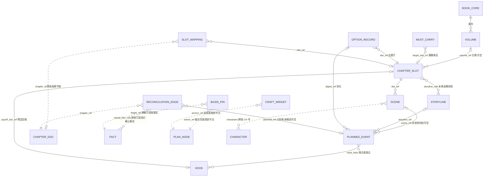

# 规划账存储层设计 R04（PLAN_LEDGER_STORAGE_DESIGN）

身份：**轻档设计稿。** 第三版清旧句。字段以 [PLAN_LEDGER_STORAGE.md](../contracts/PLAN_LEDGER_STORAGE.md) 为准；本稿只管提交护栏、恢复、影响传播等机制。历史稿 [PLAN_LEDGER_STORAGE_DESIGN_R03.md](PLAN_LEDGER_STORAGE_DESIGN_R03.md)／[R02](PLAN_LEDGER_STORAGE_DESIGN_R02.md)／[R01](PLAN_LEDGER_STORAGE_DESIGN_R01.md) 保留不动。上承 [OUTLINE_STRUCTURE_DESIGN_R02.md](OUTLINE_STRUCTURE_DESIGN_R02.md)。

## R01→R02 变化清单

依据：第三册挂账本（小说架构仓，路径含中文，复制用）`/Users/a1234/挣钱/小说架构/TEMP/bgboard-audit-20260809-r01/26_R09_ADDENDUM_LEDGER_VOL3_20260813_R01.md`——ADD-032 存储硬化九件（全部吸收）＋ADD-030 存储侧（对账边一等实体）。全部为 `PROXY_DECIDED` 替拍，CZ 可逐条改判。

| # | 变化 | 出处 | 落点 |
|---|---|---|---|
| 1 | 跨文件原子性护栏：`operation_id`＋跨文件 commit manifest＋启动恢复扫描＋以 operation_id 为单位的补偿撤销 | ADD-032.1 | §5.1、§8 |
| 1b | **存储终点 PostgreSQL**（亲拍）：JSON＋护栏可先跑；SQLite 不是终点；中间要不要 SQLite **未拍，不写死「脏账必切 SQLite」** | ADD-036／A7 | §0、§4.2、§4.4 |
| 2 | 版本链存不可变内容 blob（内容寻址）——「旧版永不删」从口号变机制 | ADD-032.2 | §5.2 |
| 3 | 读一致性：`story_commit_seq`＋投影 checkpoint＋新鲜度标 | ADD-032.3 | §5.3 |
| 4 | 改史影响扫描：依赖边反向索引（明确不上图数据库）＋遍历限深留位 | ADD-032.4 | §5.4、§1.17 铁律 2 修订 |
| 5 | ID 纪律：内部永久 ID 与人类显示编号分离；f001→F-0001 从「机械重写脚本」改为别名制 | ADD-032.5 | §5.5、§7.2 修订、开放问题二关闭 |
| 6 | 人物引用第一天用 CH ID：`characters`／`members`／`pov` 全部改存 CH 号，显示名是投影 | ADD-032.6 | §1.5、§1.7、§5.6、样例 |
| 7 | 人物状态多值 key＋故事内有效区间：规划侧状态预期采用与人物账同一词法（`injury:left_arm` 级） | ADD-032.7 | §5.7 |
| 8 | 锚迁移判据补强：逐字 quote 之外加邻域指纹＋否定/模态检查，邻域变了转 needs_recheck | ADD-032.8 | §5.8 |
| 9 | 故障半径：核心真值破损只读降级、非核心隔离修复；「遇一错全拒」口径收掉 | ADD-032.9 | §2.3 修订、§5.9 |
| 10 | 留位不实作：`parent_revision_id`／`event_schema_version`／遍历限深 `max_ripple_depth` | ADD-032.9 附带 | §5.10 |
| 11 | **对账边升一等实体**：新对象 `reconciliation_edge`（六态）＋派生结论带 `support_set`＋计算水位 | ADD-030.2 | §1.14（新）、§1.17 |
| 12 | `truth_bearing` 从公共字段撤下，只挂真正参与计划↔成文对账的五类对象 | ADD-030.3 | §1.1 修订、§3.1 |
| 13 | 槽位移交支持 partial：`handover` 单值改 `handover_parts[]`，`slot_status` 加 `partial` | ADD-030.4 | §1.4、§3.2 重写 |
| 14 | 伏笔加「实际兑现」第二轴：`hook_status` 收窄为计划轴，实际兑现由对账边推导（派生值不落可写字段） | ADD-030.5 | §1.8 修订 |
| 15 | 账本格式版本 `plan-v1`→`plan-v2`（字段形状变了；planstore 尚未施工，无存量迁移负担） | 本稿 | §1.16 |

## R02→R03 变化清单（2026-08-15，按 R13）

| # | 改了什么 |
|---|---|
| 1 | §3.2：正文入库那一刻不自动交棒；作者选「以这篇为准」才追加 `handover_parts` |
| 2 | 对账不再写「默认正文赢自动更新」；偏差亮出，作者选往哪边改 |

## R03→R04 变化清单（2026-08-15，清旧句）

| # | 改了什么 |
|---|---|
| 1 | 字段权威改指已落规划账合同 |
| 2 | 跨账引用示例从 `F-0031`／`F-0044` 改成内部号 `f001`／`f044` |
| 3 | 对账示例不再写「正文赢，作者已阅」 |

M8 稿 §8.4 的配套账本增补清单（arc_card／point_board／触发字段／option_record 增补等）**本轮仍挂账**：等 [M8_PLANNING_DESIGN_R04.md](M8_PLANNING_DESIGN_R04.md) 定稿后随存储稿下一修订一次吸收，避免两头同时改同一批字段。

---

## 0. 三句话结论（CZ 快读）

1. **形状**：数据形状用一份与引擎无关的合同定死——字段以 [PLAN_LEDGER_STORAGE.md](../contracts/PLAN_LEDGER_STORAGE.md) 为准，上层模块照合同抓数，永远不关心底下是文件还是数据库。
2. **MVP 现阶段**【R02 修订（ADD-032；ADD-036／A7 亲拍改写）】：继续 JSON 文件，但**不再裸奔**——每本书 `data/<书名>/plan.json`＋`plan_history.jsonl` 之外，加一套跨文件原子性护栏（`operation_id`＋commit manifest＋启动恢复扫描，§5.1）；两份独立外部回包都判跨文件一致性「必炸」级，护栏是我们不换引擎的前提。护栏实测仍出脏账时要换引擎——**终点是 PostgreSQL**；中间要不要先上 SQLite **未拍，不写死必切 SQLite**。
3. **产品化（Web 多用户）**：上 PostgreSQL——骨架字段进列、弹性内容进 JSONB，移交这类「一瞬间要改好几处」的动作用事务包住，顺引脚找受牵连计划用递归查询（图概念保留、工程先关系库，考古概念 58）；因为引擎藏在存储模块后面，迁移那天上层模块一行不改。SQLite 不是终点。

一个先说清的总原则（ADD-007）：**账本可以细，执行包必须瘦。** 下面字段看着多，但这是账本不是执行包——生成时喂模型什么，由 M11 打包器按预算挑；存储层不为省上下文砍字段，砍是打包器的事。

**知情硬账方向指针（ADD-037／A1，本稿不施工枚举）**：读者知情硬账进真值——至少已知道／不知道／被误导（记下误解成什么）带原文锚；「读者大概猜到多少」做可重算旁账，不进真值。字段级词表仍留 T3。人物页怎么展示见 [CHARACTER_LEDGER_DESIGN_R02.md](CHARACTER_LEDGER_DESIGN_R02.md)。

---

## 1. 字段表：十三类对象＋公共字段＋账本骨架

### 1.0 三条书写约定

- **英文字段名只进代码、合同、存储**；产品界面和给人读的文档一律人话（产品词典三铁律 1「英文字段名不回写产品正文」——界面上没人会看见 `digest_status` 这种词）。
- **「必填」＝字段必须写进记录**；暂时没有值就写 `null` 或空列表，不许整个字段缺席——机械校验（V0 级）靠这个。
- **时间不混轴**（T3 语义合同草案的三种时间）：下面所有 `created_at`／`updated_at` 都是**系统登记时间**；**故事内时间**只住在计划事件的 `story_time_hint`；**叙述释放位置**由槽位序列＋槽位映射（章的位置）承担。三个轴永不互相代填。

### 1.1 公共字段（每个规划对象都带，后面各表不再重复）

| 字段英文名 | 类型 | 必填 | 人话含义 | 例子 |
|---|---|---|---|---|
| `id` | str | 是 | 门牌号，前缀＋四位数字（规则见第 2 节）——**这是内部永久 ID**，一经发出永不重写、永不回收（§5.5） | `"PE-0412"` |
| `source_identity` | enum | 是 | 谁说的：`author_declared` 作者声明／`draft_inferred` 书稿反推／`model_suggested` 模型建议（ADD-004 Q5） | `"model_suggested"` |
| `created_at` | str | 是 | 系统登记时间 | `"2026-08-13 02:40:11"` |
| `updated_at` | str | 是 | 最近一次修改的系统时间 | `"2026-08-13 02:45:03"` |
| `rev` | int | 是 | 修订号，建档为 1，每改一次 +1（与改动流水对账用；每个 rev 的整对象快照存内容寻址 blob，§5.2） | `3` |
| `note` | str | 是（可空串） | 备注 | `""` |

**【R02 修订（ADD-030，2026-08-13 替拍）】`truth_bearing` 从公共字段撤下。** R01 把它当万能枚举挂给所有对象，等于给挂件、引脚、选择记录这些从不参与「计划↔成文对账」的东西伪造了统一状态机（组 A 判词 T05）。R02 起它是**专属字段**，只挂五类真正会被移交、被对账的对象：章槽位、场、计划事件、伏笔、必写承接（取值与移交语义见第 3 节）。其余对象各写各的生命周期字段（如挂件的存在即生效、选择记录的 `group_status`），不共用这根轴。

`book_id` 不作为记录字段：MVP 文件时代「这条记录属于哪本书」由所在目录天然决定；进数据库那天它升格为一列（复合唯一键的一半），这是迁移脚本的事，不是现在的字段。

### 1.2 书核 `book_core`（BK-，每书恒一条）

| 字段英文名 | 类型 | 必填 | 人话含义 | 例子 |
|---|---|---|---|---|
| `premise` | str | 是 | 一句话前提——它就是书核的胶囊，不另设梗概字段 | `"抬棺匠陈九棺发现祖传阴棺里封的不是尸体，而是他自己的名字……"` |
| `genre_promise` | str | 是(可 null) | 题材承诺：讲什么类型、爽点是什么 | `"悬疑灵异；开棺代价步步升级"` |
| `main_beats` | list[obj] | 是（可空表） | 主线大节拍 3～5 个，每个 `{key, text}`；`key` 建档即定、永不重编（供 `origin_ref` 回指） | `[{"key":"beat-2","text":"每开一口禁棺，世上多一个忘记他的人"}]` |
| `ending_anchor` | str | 是(可 null) | 结局锚点，允许空（R02 §3.1） | `"开尽十二棺那天，要么活成人，要么活成棺中名"` |
| `volumes_enabled` | bool | 是 | 卷层开没开：默认 `false`，约 30 章或作者手动才开（ADD-004 Q2） | `false` |

（不带 `truth_bearing`——书核是方向层，不按章移交、不进对账。）

### 1.3 卷 `volume`（VOL-）

与 R01 一致：`order`／`title`／`goal`／`main_conflict`／`entry_state`／`exit_state`／`summary`。不带 `truth_bearing`。

### 1.4 章槽位 `chapter_slot`（S-；＝章篮：槽位＋章纲装在一起）

| 字段英文名 | 类型 | 必填 | 人话含义 | 例子 |
|---|---|---|---|---|
| `volume_ref` | str/null | 是(可 null) | 归哪卷；卷没开就 null | `null` |
| `title_hint` | str | 是(可 null) | 章名建议 | `"归家"` |
| `goal` | str | 是 | 本章目标一句话 | `"让开棺的代价第一次砸在主角身上"` |
| `summary` | str | 是 | 章梗概两三句＝章胶囊（M9 概览直接渲染） | `"九棺回家报平安，爷爷却当他是陌生人……"` |
| `entry_state` | str | 是(可 null) | 开写前世界什么样（人话；证据用依据引脚挂） | `"已开首棺；爷爷健在"` |
| `storyline_refs` | list[str] | 是（可空表） | 本章走哪几条线 | `["L-0001"]` |
| `scene_refs` | list[str] | 是（可空表） | 场安排——**数组顺序就是场序** | `["SCN-0007","SCN-0008"]` |
| `exit_condition` | str | 是(可 null) | 章尾必须成立什么 | `"九棺确认『遗忘』就是开棺的代价"` |
| `exit_hook` | str | 是(可 null) | 结尾钩子 | `"棺中传出第二次心跳"` |
| `must_not` | list[str] | 是（可空表） | 不能违反的硬边界（来自事实账／设定集） | `["爷爷只能『忘』，不能死"]` |
| `risks` | list[str] | 是（可空表） | 写前就知道的坑 | `["『遗忘』规则细节未定"]` |
| `target_length` | int/null | 是(可 null) | 目标字数，作者按平台习惯设 | `2600` |
| `slot_status` | enum | 是 | `planned` 计划中／**`partial` 部分交棒**／`handed_over` 已交棒／`dropped` 已作废（留痕不删）——`partial`＝一槽拆两章写、作者已对其中一半点「以这篇为准」。入库本身不改这个字段 | `"planned"` |
| `handover_parts` | list[obj] | 是（可空表） | 交棒记录。只有作者选「以这篇为准」才追加一件 `{part_no, chapter_id, covered_scene_refs, covered_pe_refs, handed_at, decided_by}`。书稿入库不得自动追加。整槽状态由部件覆盖情况推导（见 §3.2） | `[]` |
| `truth_bearing` | enum | 是 | 参与对账对象专属（第 3 节） | `"primary"` |

**四样东西故意不设字段**（同 R01）：①预估合计和容量灯——派生值现算；②写法指导栏——挂件挂上来；③硬性承接——独立对象 MC；④槽位顺序——住在顶层 `slot_sequence`。

### 1.5 场 `scene`（SCN-）

| 字段英文名 | 类型 | 必填 | 人话含义 | 例子 |
|---|---|---|---|---|
| `slot_ref` | str | 是 | 属哪个章槽 | `"S-0004"` |
| `goal` | str | 是 | 这场存在的理由 | `"让读者先于主角意识到爷爷忘了他"` |
| `summary` | str | 是 | 场胶囊一句话 | `"九棺推门喊爷爷，老人握着削了一半的苹果问他找谁"` |
| `location` | str | 是(可 null) | 地点 | `"陈家老屋堂屋"` |
| `characters` | list[str] | 是（可空表） | 【R02 修订（ADD-032.6，2026-08-13 替拍）】谁在场——**改存人物账 CH 号**，显示名是读取时从人物账投影出来的；「暂不加外键」的口子收掉（K7 拍板对齐） | `["CH-0001","CH-0002"]` |
| `pe_refs` | list[str] | 是（可空表） | 拍序列——**数组顺序＝叙述顺序** | `["PE-0411","PE-0412"]` |
| `mood_in` | str | 是(可 null) | 入场情绪 | `"暖（归家）"` |
| `mood_out` | str | 是(可 null) | 出场情绪 | `"毛骨悚然"` |
| `visual_hint` | str | 是(可 null) | 画面提示（M9 配图、M10 场景卡两用） | `"昏黄堂屋，老人背光削苹果，果皮不断"` |
| `dialogue_hints` | list[str] | 是（可空表） | 对白要点（M8 稿已按 G3 纠正为「信息释放点」语义），点到为止不代写 | `["「你找谁」必须是全场最后一句"]` |
| `resistance` | str | 是(可 null) | 阻力——没阻力就没戏 | `"爷爷表现完全正常，九棺只当他开玩笑"` |
| `turn` | str | 是(可 null) | 转折——这场在哪拐弯 | `"爷爷把削好的苹果递给他：『小伙子，尝尝？』"` |
| `pov` | str | 是(可 null) | 【R02 修订（ADD-032.6，2026-08-13 替拍）】谁的视角——改存 CH 号 | `"CH-0001"` |
| `spoiler_notes` | list[str] | 是（可空表） | 作者手动加的禁泄露句；机器派生部分打包时现拼，不落盘 | `["不能暗示『忘记』会蔓延到更多人"]` |
| `word_estimate` | int/null | 是(可 null) | 这场写清楚大概要多少字（喂章篮容量灯，ADD-004 Q4） | `900` |
| `truth_bearing` | enum | 是 | 参与对账对象专属（第 3 节） | `"primary"` |

**v2 预留**（同 R01）：场篮完整档七项（`stakes`／`tactics`／`decision`／新知三分／`exit_state`），登记名不建字段。

### 1.6 计划事件 `planned_event`（PE-；拍）

| 字段英文名 | 类型 | 必填 | 人话含义 | 例子 |
|---|---|---|---|---|
| `text` | str | 是 | 一句话：谁做了什么／什么变了（不拆表述—命题；本体即胶囊；提到人物用 CH 号内联标注由投影渲染，正文串保持人话） | `"爷爷看着九棺，问他是谁"` |
| `scene_ref` | str/null | 是(可 null) | 属哪场；没安排进场的拍＝null（「待消化清单」捞的就是它） | `"SCN-0007"` |
| `storyline_ref` | str/null | 是(可 null) | 归哪条线 | `"L-0001"` |
| `purpose` | enum | 是 | 目的标签五选一：`setup`／`advance`／`reveal`／`payoff`／`repair` | `"payoff"` |
| `hook_links` | list[obj] | 是（可空表） | 跟伏笔的关系，每条 `{hook_ref, role}`，role＝`plant` 埋／`payoff` 收 | `[{"hook_ref":"H-0003","role":"payoff"}]` |
| `story_time_hint` | str/null | 是(可 null) | 故事内时间提示 | `"开棺次日清晨"` |
| `digest_status` | enum | 是 | 消化状态：`pending` 待消化／`digested` 已消化／`voided` 已作废（留痕）。**【R02 修订（ADD-030，2026-08-13 替拍）】语义钉死：`digested` 只表示「已安排进章计划」（规划层销账），不表示已发生**——「实际写成了没」由对账边（1.14）回答，本表不设也不许设「已兑现」字段 | `"digested"` |
| `digest_ref` | str/null | 是(可 null) | 已消化时挂的选择记录号 | `"OPT-0001"` |
| `origin_ref` | str/null | 是(可 null) | 从哪拆出来的（书核节拍／卷／伏笔） | `"BK-0001#beat-2"` |
| `repair_ref` | str/null | 是(可 null) | `purpose=repair` 时指要修的遗留问题 | `null` |
| `deviation_note` | str/null | 是(可 null) | 对账后作者留的偏差标注（人读备注；机器可判的对账结果在对账边，两者不互相代替） | `null` |
| `defer_count` | int | 是 | 【R02 新增（ADD-035，2026-08-13 替拍）】被挪期次数：对账「未实现」后作者选「挪去下一章」每次 +1；超阈值的升级处置在 M8 R02 §6.3 | `0` |
| `truth_bearing` | enum | 是 | 参与对账对象专属（第 3 节） | `"primary"` |

一条纪律再钉一次：**选项不落 PE 表。** 候选选项整包留在选择记录（1.12）；选定那刻选中方案里的拍才入账、生来 `digested`。

### 1.7 故事线 `storyline`（L-）

| 字段英文名 | 类型 | 必填 | 人话含义 | 例子 |
|---|---|---|---|---|
| `name` | str | 是 | 线名 | `"十二禁棺主线"` |
| `alias` | str/null | 是(可 null) | 好认的短别名，只供展示 | `"main"` |
| `priority` | int | 是 | 优先级，1 最高 | `1` |
| `members` | list[str] | 是（可空表） | 【R02 修订（ADD-032.6，2026-08-13 替拍）】成员——**改存 CH 号**（多对多），显示名投影 | `["CH-0001","CH-0002"]` |
| `line_status` | enum | 是 | `active`／`paused`／`converged`／`merged` | `"active"` |
| `last_scene_ref` | str/null | 是(可 null) | 上次现场指针（切线包恢复现场用） | `"SCN-0007"` |

不带 `truth_bearing`（线是组织层，不按章移交）。

### 1.8 伏笔 `hook`（H-）

| 字段英文名 | 类型 | 必填 | 人话含义 | 例子 |
|---|---|---|---|---|
| `content` | str | 是 | 底牌一句话——只在作者视图展示，未揭示时不进任何下游 | `"开棺有代价：至亲会遗忘开棺者"` |
| `plant_refs` | list[obj] | 是（可空表） | 埋点，每条 `{ref, note}`，ref 指 PE 或场，可多处 | `[{"ref":"PE-0203","note":"老仵作的警告"}]` |
| `payoff_slot_ref` | str/null | 是(可 null) | 预定回收槽位；允许改期，改期走改动流水留痕 | `"S-0004"` |
| `hook_status` | enum | 是 | 【R02 修订（ADD-030.5，2026-08-13 替拍）】**收窄为计划轴**：`open` 挂着／`paid` **已安排回收**（选定即消化——只表示规划层把回收安排进了章计划）／`voided` 作废（留痕）。R01 里 `paid`「已收」的读法作废——**「实际收没收到」是第二轴，由对账边推导，不落本表可写字段**（见下） | `"paid"` |
| `paid_by_ref` | str/null | 是(可 null) | 安排回收的拍 | `"PE-0412"` |
| `defer_count` | int | 是 | 【R02 新增（ADD-035，2026-08-13 替拍）】回收被改期次数 | `0` |
| `revealed` | bool | 是 | **计划揭示状态**（账本整本是计划态）；读者**实际**可知只认对账边确认后的成文 | `true` |
| `revealed_at` | str/null | 是(可 null) | 计划揭示位置（场或槽位号） | `"SCN-0007"` |
| `safety_summary` | str | 是 | 脱敏安全摘要——未揭示时给 AI 下游的唯一形态，不含底牌 | `"爷爷一线埋有未揭示设定，涉及『遗忘』，第 4 章前不得暗示范围"` |
| `truth_bearing` | enum | 是 | 参与对账对象专属（第 3 节） | `"primary"` |

**【R02 新增（ADD-030.5，2026-08-13 替拍）】伏笔「实际兑现」第二轴＝派生值，不设可写字段。** 完成度由 payoff contributions 推导：planstore 聚合「payoff 角色的对账边中 outcome ∈ {exact, variant}」现算出 `fulfillment`（`unfulfilled`／`partial`／`fulfilled`／`variant_fulfilled`），随答案带 `support_set`（支持它的对账边 ID 列表）＋计算水位。某条支持边被撤（改史）→派生值自动回撤或转 stale（§5.4 反向索引接手扫描）。一个伏笔分几章收、每章收一部分，天然表达为多条 partial 边。

义务（角色立的债）不进这张表也不进这本账 v1——将来照伏笔账样式开兄弟账。

### 1.9 写法挂件 `craft_widget`（WG-）

与 R01 一致：`key`／`anchor_ref`／`payload`。不带 `truth_bearing`（挂件挂上即生效、卸载即删，没有对账语义）。

### 1.10 依据引脚 `basis_pin`（PIN-）

| 字段英文名 | 类型 | 必填 | 人话含义 | 例子 |
|---|---|---|---|---|
| `owner_ref` | str | 是 | 插在哪个规划节点上 | `"S-0004"` |
| `target_kind` | enum | 是 | 指向哪类依据：`fact`／`setting`／`author_quote` | `"fact"` |
| `target_ref` | str/null | 条件 | 目标编号（`fact`／`setting` 时必填）——存对方**内部永久 ID**（§5.5） | `"f001"` |
| `quote` | str/null | 条件 | 作者原话正文（`author_quote` 时必填） | `null` |
| `purpose_note` | str | 是（可空串） | 为什么引它 | `"入口状态依据：已开首棺"` |
| `pin_status` | enum | 是 | 【R02 新增（ADD-032.8，2026-08-13 替拍）】`ok`／`needs_recheck`——所指事实的证据锚迁移失败或邻域变化时由程序翻 `needs_recheck`（判据见 §5.8），受牵连计划靠它亮灯 | `"ok"` |

方向铁律不变：**规划→事实，单向只读**。不带 `truth_bearing`。

### 1.11 必写承接 `must_carry`（MC-）

| 字段英文名 | 类型 | 必填 | 人话含义 | 例子 |
|---|---|---|---|---|
| `text` | str | 是 | 必须还什么账 | `"兑现 H-0003『开棺有代价』"` |
| `target_slot_ref` | str/null | 是(可 null) | 预定落在哪章还 | `"S-0004"` |
| `origin_ref` | str/null | 是(可 null) | 这笔账谁欠下的 | `"H-0003"` |
| `mc_status` | enum | 是 | `pending` 待还／`digested` **已安排还**（规划层销账，同 1.6 语义钉子）／`voided` 作废 | `"digested"` |
| `digest_ref` | str/null | 是(可 null) | 还账走的选择记录 | `"OPT-0001"` |
| `defer_count` | int | 是 | 【R02 新增（ADD-035，2026-08-13 替拍）】被挪期次数 | `0` |
| `truth_bearing` | enum | 是 | 参与对账对象专属（第 3 节） | `"primary"` |

### 1.12 选择记录 `option_record`（OPT-；消化记录）

与 R01 一致：`slot_ref`／`question`／`options`（全部候选留档）／`chosen_key`／`decided_by`／`decided_at`／`digest_applied`／`variant_note`（预留）。不带 `truth_bearing`（它是决策留痕，不参与对账；M8 R02 §8.4 的增补字段族仍挂账）。

### 1.13 槽位映射记录 `slot_mapping`（MAP-）

与 R01 一致：`slot_ref`／`chapter_id`／`expected_chapter_no`／`mapping_kind`（`as_written`／`split`／`merge`／`inserted`／`non_narrative`）／`reason`／`decided_by`／`mapping_status`／`superseded_by`。不带 `truth_bearing`。拆章时的「哪半写成了」由槽位的 `handover_parts` 承担（1.4），映射行只管两条序的对位。

### 1.14 对账边 `reconciliation_edge`（RE-，前缀暂定交词典 N9）【R02 新增（ADD-030.2，2026-08-13 替拍）】

**这是 R02 最重要的新对象。** 六态对账是早就拍板的机制（背景板 03 页；词典条目「计划—成文六态对账」），但 R01 里它没有实体——对账跑完只剩 `deviation_note` 一条人读备注，派生结论（伏笔收没收、人物状态变没变）没有支持集，改史后无法机械撤回。R02 把每次「计划 vs 成文」的比对结果落成一等实体边，**「改一条 F 自动撤回下游」从口号变机制**（接修改传播三层的机器层）。

| 字段英文名 | 类型 | 必填 | 人话含义 | 例子 |
|---|---|---|---|---|
| `planned_ref` | str/null | 是(可 null) | 计划侧对象：PE／H／MC 号；**成文有、计划没有（新增态）时为 null** | `"PE-0412"` |
| `actual_fact_refs` | list[str] | 是（可空表） | 成文侧证据：已确认事实内部 ID；「未实现」态＝空表 | `["f044"]` |
| `chapter_ref` | str | 是 | 对的是哪章（章节架章号） | `"c04"` |
| `outcome` | enum | 是 | **观察结果六态**（对齐背景板拍板词表）：`exact` 完全／`variant` 变体／`unrealized` 未实现／`contradicted` 相反／`unplanned` 新增／`ambiguous` 模糊 | `"variant"` |
| `coverage` | enum | 是 | `full`／`partial`——一拍只写出一半时标 partial（与 handover parts 同族语义） | `"full"` |
| `variant_note` | str/null | 条件 | `outcome=variant` 时必填：变在哪 | `"原设爷爷遗忘，实际写成师妹遗忘"` |
| `author_decision` | obj/null | 是(可 null) | **处置轴，与观察轴分开**：`{action, decided_at, note}`；action＝`accept_as_is` 就这样／`defer` 挪期（欠账对象 defer_count +1）／`void_plan` 作废计划／`rewrite_draft` 改正文迁就大纲（任何档位显式）。未处置＝null | `{"action":"accept_as_is",…}` |
| `basis_commit_seq` | int | 是 | 对账时的账本水位（story_commit_seq，§5.3）——「模型当时看到了什么」可复现 | `108` |
| `decided_by` | enum | 是 | `auto` 模型比对／`author` 作者改判 | `"auto"` |
| `edge_status` | enum | 是 | `active`／`superseded`（重跑对账时旧边留痕不删）／`stale`（所引 F 被改判，等重对） | `"active"` |
| `superseded_by` | str/null | 是(可 null) | 被哪条新边顶替 | `null` |

四条配套规则：

1. **两轴分开**：`outcome` 是机器观察（比对结果），`author_decision` 是作者处置。外部回包把「挪期（deferred）」列进结果枚举，本稿不采——挪期是决定不是观察，混在一根轴上，重跑对账就会把作者的决定刷掉。
2. **「实际发生」的唯一推进通道**：人物页 current、伏笔实际兑现、灵感 realized、读者实际可知——这些「actual」态**只能由 outcome ∈ {exact, variant} 的对账边，或作者显式签字**推进；选项选定（P1）推不动它们。这是 ADD-030.1 两层状态轴在存储层的落点。
3. **派生结论带 `support_set`**：凡由对账边推导的结论（1.8 的 fulfillment、人物账投影、M9 概览的「本章兑现了什么」），答案里带支持它的边 ID 列表＋计算水位；最后一个支持边转 `stale`/`superseded`，结论自动回撤或标过期。
4. **对账边住规划账**（替拍）：它回答「计划兑现了没」，是规划账的问题——事实账不为计划负责（与 M8 稿 6.3 分工一致）。数据库时代它是 `reconciliation_edges` 表，`(planned_ref)`、`(chapter_ref)` 两个索引即回包建议的形状。

### 1.15 停点设置 `stop_points`（项目级，每书一份，存 plan.json 的设置区）

与 R01 一致：`preset`／`P1`／`P2`／`P3`（值域无 auto_pass）／`P4`／`P5`。真值签字类动作不进这张表。

### 1.16 账本骨架：plan.json 顶层

| 字段英文名 | 类型 | 必填 | 人话含义 | 例子 |
|---|---|---|---|---|
| `schema` | str | 是 | 账本格式版本【R02 修订：`plan-v2`——handover_parts／truth_bearing 收窄／对账边等形状变化；planstore 未施工，无存量迁移】 | `"plan-v2"` |
| `ledger` | str | 是 | 🔥 恒为 `"plan"` 的铁字段——整本账都是计划态，防冒充事实 | `"plan"` |
| `book` | obj | 是 | 书核（单条内嵌，见 1.2） | `{…}` |
| `slot_sequence` | list[str] | 是 | 🔥 规划槽位序列——顺序即数组序（N19-B 第一序列） | `["S-0001","S-0002",…]` |
| `volumes` / `slots` / `scenes` / `events` / `storylines` / `hooks` / `widgets` / `pins` / `must_carries` / `option_records` / `slot_mappings` / **`reconciliation_edges`**【R02 新增】 | list | 是 | 十二类对象各一个数组 | `[…]` |
| `stop_points` | obj | 是 | 停点设置（1.15） | `{…}` |
| `id_counters` | obj | 是 | 发号器：每前缀已发出的最大号（第 2 节；R02 加 `RE`） | `{"S":4,"PE":412,"RE":0}` |

**实际章节序列不在这里**——它就是事实侧已有的 `chapters.json`（N19-B 第二序列），不重复存；两序靠槽位映射（1.13）连接。

### 1.17 ER 图＋引用方向铁律



图例：`PLAN_NODE` 是虚拟统称；`FACT`／`CHAPTER_DOC` 在事实侧、`CHARACTER` 在人物账，虚线＝跨账引用。

谁引用谁，四条铁律：

1. **子指父**：场指槽、拍指场——归属存在孩子身上；父持有顺序数组。两边冗余靠载入预检机械核对。
2. **横架指骨架**【R02 修订（ADD-032.4，2026-08-13 替拍）】：故事线、伏笔、挂件、引脚、承接、选择记录、对账边全都拿骨架节点 ID 来挂，骨架对象身上不长「谁挂了我」的反向列表——**查反向关系不再靠全表扫描，走 planstore 维护的依赖边反向索引**（§5.4：派生缓存，载入时构建、写时增量维护、可删可重建）；R01「扫描毫秒事」的说法在改史影响扫描这种要顺链走多跳的场景不成立（会退化成全表扫且有环）。
3. **规划→事实单向只读**：跨账处从两处增为三处（引脚、映射、**对账边**），都只存对方 ID 字符串，读取时解引用；规划账永不写事实账。
4. **顺序不进对象进序列**：槽序在 `slot_sequence`、场序在 `scene_refs`、拍序在 `pe_refs`。

---

## 2. ID 规则（吸收 ADD-009 拍板＋I-014 事故教训）

### 2.1 前缀登记表

| 前缀 | 对象 | 登记状态 |
|---|---|---|
| `S-`／`PE-`／`H-`／`L-`／`OPT-`／`MC-`／`F-` | 同 R01 | 已登记 |
| `BK-`／`VOL-`／`SCN-`／`WG-`／`PIN-`／`MAP-` | R01 新增 | 暂定，交词典 N9 |
| `RE-` | 对账边 | 【R02 新增】**暂定**，交词典 N9 |
| `CH-` | 人物（人物账侧编号，本账只引用，永不发放——同 `F-` 地位） | 人物账稿已登记暂定 |

编号样式全家统一前缀-四位零垫；超 9999 顺延五位，已发的号不重排。

### 2.2 唯一域

与 R01 一致：书项目内唯一；跨书可重号；产品化后 `UNIQUE(book_id, id)` 兜底。

### 2.3 发号方式＋三道闸（I-014 的账）

三道闸不变：**发号器**（`id_counters` 领号）＋**写前查重**＋**载入预检**。

【R02 修订（ADD-032.9，2026-08-13 替拍）】**预检发现坏账的处置，从「当场报错拒载」改为分级故障半径**：R01 的「遇一错全拒」会让一个挂件坏字段把整本 500 章的账全锁死。R02 口径——**核心真值破损→整账只读降级**（能看不能写，防在坏地基上继续记账）；**非核心破损→隔离修复**（坏条目移入隔离区，其余照常读写）。核心／非核心清单见 §5.9。

MVP 单进程 CLI 顺序写，一个写者；产品化后发号进数据库事务，UNIQUE 约束做最后防线。

---

## 3. ADD-010 落字段：来源身份、真值方向、移交

### 3.1 两个身份字段怎么取值

`source_identity`（谁说的）人人都带；`truth_bearing`（谁为真）【R02 修订（ADD-030，2026-08-13 替拍）】**只挂五类参与对账的对象：章槽位／场／计划事件／伏笔／必写承接**。出生时按场景赋值（取值表同 R01）：

| 场景 | `source_identity` | `truth_bearing` 出生值（仅五类对象） |
|---|---|---|
| 作者手写／作者确认收编 | `author_declared` | `primary` |
| 旧稿（或新写成章节）反推 | `draft_inferred` | `shadow` |
| 模型选项经 P1 选定落账 | `model_suggested` | `primary` |

三条配套规则：升级是真值签字（任何档位显式动作）；抽取指标只对影；对账读本槽当前可对照对象，不以交棒为前提。

### 3.2 移交（真值接力棒）在数据上怎么表达【R02 重写（ADD-030.4＋ADD-032.1，2026-08-13 替拍）】

R01 版的两处走样在这里修正：①`handover` 单值表达不了「一槽拆两章、先写完一半」（组 A 判词 B05）；②「一次整文件保存天然原子」对跨文件动作是假话（判词 B03——移交要动 plan.json＋流水＋章节架侧，rename 只保护单文件）。

作者写完某章、正文入库（章节架新增 `c04`）那一刻，数据上**默认只对照、不交棒**。只有作者选「以这篇为准」之后，才走下面这套移交——**整个动作包在一个 `operation_id` 里（§5.1 护栏）**：

1. **确定本次覆盖范围**：默认＝整槽；一槽拆多章时（映射有 `split` 行），按映射指定本次覆盖哪些场/拍；
2. 槽位 `handover_parts` 追加一件：`{"part_no": 1, "chapter_id": "c04", "covered_scene_refs": […], "covered_pe_refs": […], "handed_at": "…", "decided_by": "author"}`；
3. **只有被覆盖的**场和拍 `truth_bearing` 翻 `handed_over`（从「当前打算」变「当初的打算」，原文永不按正文改写）；未覆盖的保持 `primary`；
4. `slot_status` 推导：全部场/拍已覆盖→`handed_over`；部分覆盖→**`partial`**；
5. `slot_mappings` 落一行（`S-0004 ↦ c04`）；
6. 改动流水记 `handover` 行（带同一 `operation_id`）；
7. 新正文照常走 M1→M3→M5 入事实账领 F 号——事实不强制回连 PE；**计划↔成文的连接由对账边（1.14）在收口对账时建立**，那是独立工序（M8 R02 §6.3），不挤在移交这一步。

移交前后对照（同一个拍）：

```json
// 移交前：大纲为真
{"id": "PE-0412", "truth_bearing": "primary", "digest_status": "digested", "deviation_note": null}
// 移交后：正文为真，这条变成「当初的打算」；对账发现写成了变体，落对账边——
// RE-0001: {planned_ref: "PE-0412", actual_fact_refs: ["f044"], outcome: "variant",
//           variant_note: "原设爷爷遗忘，实际写成师妹遗忘", author_decision: {action:"accept_as_is"}}
{"id": "PE-0412", "truth_bearing": "handed_over", "digest_status": "digested",
 "deviation_note": "实际写成师妹遗忘（作者已选以这篇为准）", "defer_count": 0}
```

对账把偏差亮给作者、由他选往哪边改（不要默认正文赢自动更新）；机器可判的结果在对账边，`deviation_note` 只是人读备注。外写新稿没点「以这篇为准」之前，计划仍为真，正文只当对照件。

---

## 4. 存储选型（三层分开答）

### 4.1 第一层：数据形状＝一份引擎无关的 JSON Schema 合同

与 R01 一致：形状是合同，引擎是实现；上层模块禁止自己 `open("plan.json")`，一律走 planstore 公开函数（I-011 教训）。翻译样式（计划事件，R02 字段更新后）：

```json
{
  "$defs": {
    "planned_event": {
      "type": "object",
      "required": ["id", "text", "scene_ref", "storyline_ref", "purpose", "hook_links",
                   "story_time_hint", "digest_status", "digest_ref", "origin_ref",
                   "repair_ref", "deviation_note", "defer_count", "source_identity",
                   "truth_bearing", "created_at", "updated_at", "rev", "note"],
      "properties": {
        "id": {"type": "string", "pattern": "^PE-\\d{4,}$"},
        "purpose": {"enum": ["setup", "advance", "reveal", "payoff", "repair"]},
        "digest_status": {"enum": ["pending", "digested", "voided"]},
        "truth_bearing": {"enum": ["primary", "shadow", "handed_over"]},
        "defer_count": {"type": "integer", "minimum": 0}
      }
    }
  }
}
```

### 4.2 第二层：MVP 现阶段——JSON 文件＋护栏，推荐维持【R02 修订（ADD-032.1；ADD-036／A7 亲拍）】

对比表与 R01 一致（JSON 肉眼可读／零新依赖／量级绰绰有余 vs SQLite 约束与事务）。R02 的变化是**诚实承认短板并补护栏**：

- 两份独立外部回包都判「JSON 跨文件一致性必炸」——选项确认改 plan＋人物、移交动 plan＋映射＋流水、章重导动 chapters＋facts＋快照，任何一处「主文件替换成功、流水追加失败」都留脏账。R01「一次整文件保存天然原子」只对单文件成立，跨文件不成立。
- ✅ **替拍结论：不推翻已暂定的「JSON→PostgreSQL」阶梯，JSON＋护栏先行**——护栏三件套（`operation_id`＋commit manifest＋启动恢复扫描，§5.1）成本可控，调试期「随手打开看数据」的价值保留。
- 🔥 **护栏上线后若实测仍出脏账**（恢复扫描修不干净、或同类事故第二次发生），同接口换实现、上层不动。CZ 亲拍（ADD-036／A7）：**终点是 PostgreSQL**，SQLite 不是终点。中间要不要先切 SQLite **未拍**——本稿不写死「脏账必切 SQLite」。JSON＋护栏先行，不堵任何一条路。

单文件写盘工艺不变：临时文件＋原子替换；流水单独 `plan_history.jsonl` 纯追加。

### 4.3 第三层：产品化（Web 多用户）——PostgreSQL，不选 MySQL

与 R01 一致（JSONB 两头兼得／事务包移交／WITH RECURSIVE 扛图查询／RLS 隔离；⚠️ PG/MySQL 对比属行业通识未实测）。R02 补一句：届时 `reconciliation_edges(planned_ref)`、`reconciliation_edges(chapter_ref)`、`projection_checkpoints(projection_name, source_commit_seq)` 建索引——回包给的表形状直接可用。

### 4.4 迁移路径（一段话）

形状不变搬家只是搬运。**终点是 PostgreSQL。** SQLite 若出现，也只是可选中间站、不是必经站；要不要中转 **未拍**，不按「脏账必切 SQLite」自动上车。

---

## 5. 工程硬化九件（ADD-032 全量落地）【R02 新增整节（ADD-032，2026-08-13 替拍）】

这一节是 R02 的主体新增：把「账本不会骗人」从口号做成机制。九件全是工程护栏，不动任何产品语义。

### 5.1 跨文件原子性护栏：operation_id＋commit manifest＋恢复扫描＋补偿撤销

**operation_id**：每个复合动作（选项确认、移交、灵感安放、章重导……）领一个 ID（`op-` 前缀＋时间戳＋随机尾，不进 id_counters——它是动作号不是对象号）。该动作触碰的每一行流水、每一个文件写入都带它。

**跨文件 commit manifest**：动作要动多个文件时，先在书目录的 `commit_log.jsonl`（新文件，跨账公用，纯追加）写一行「意向单」，再动文件，全部成功后追加一行「完成单」：

```json
{"op": "op-20260813-a1b2", "phase": "prepare", "story_commit_seq": 108,
 "files": [{"path": "plan.json", "expected_rev": 41}, {"path": "plan_history.jsonl", "append": true}],
 "action": "handover", "ts": "2026-08-13 03:10:00"}
{"op": "op-20260813-a1b2", "phase": "commit", "ts": "2026-08-13 03:10:01"}
```

**启动恢复扫描**：planstore 每次启动先扫 `commit_log.jsonl` 尾部——发现只有 prepare 没有 commit 的悬空单，按单核对各文件实际状态：全部写成了就补 commit 行；写了一半就按补偿操作回滚到动作前状态，并把该 op 标 `rolled_back`。崩溃后账本要么整个动作在、要么整个动作不在，没有半截。

**幂等**：重试同一 `operation_id` 先查 commit_log——已 commit 的直接返回成功，不重复建 PE/H/MC（I-014 重复号事故的跨文件版防线；回包故障清单第 2 条「同一 operation_id 连续执行两次不重复建条目」就是验收用例）。

**补偿撤销**：一键撤销以 `operation_id` 为单位——读该 op 名下全部流水行，生成一组补偿操作（新 op，`action: undo`，`undo_of: op-…`）逆放，不再按「最后一行」猜逆操作（R01 §8 的单行撤销撤不动一次改五处的复合动作，组 A 判词 P08）。

### 5.2 版本链存不可变内容 blob（内容寻址）

对象每次 `rev` 变更，把**变更前整对象的 JSON 快照**写入 `data/<书名>/blobs/`（内容寻址：SHA-256 为名，前两位分桶子目录；同内容天然去重），流水行记 `content_hash`。这样「旧版永不删」有东西可验（GAP-01 拍板对齐），SHA 不再是空头支票；账本主文件保持只有当前态，不膨胀。正文章节修订的 blob 同款机制归章节架侧（改稿稿地盘），本稿只定账本族公用工艺。字段级 `changes` 前后值照旧记流水——blob 管「可验证的完整旧版」，changes 管「可读的差异」，两者不互相代替。

### 5.3 读一致性：story_commit_seq＋投影 checkpoint＋新鲜度标

**story_commit_seq**：每本书一根单调递增的提交序列，跨账公用（facts／plan／chapters 的每次权威提交都领号）。发号点＝commit_log 的 prepare 行（§5.1 已在写它，顺手带上，零新文件）。

**投影 checkpoint**：一切派生视图（体检报告、概览快照、taste.json、反向索引缓存、伏笔 fulfillment 缓存）落盘时记 `source_commit_seq`：「我是看着账本第 108 号提交算出来的」。

**新鲜度标**：读取投影时比对当前 seq——落后即标 `stale`，界面照 N20 口径显示「基于第 108 号账本状态，当前已到 112」；高风险写操作（改史、真值签字）遇 stale 投影必须回源现算，不许拿旧投影当依据。

**执行包可复现**：C9 前提包／C7 快照的 `basis_note` 从「双时间戳」升级为「双时间戳＋story_commit_seq」——「模型当时看到了什么」从约数变成精确坐标（对账边的 `basis_commit_seq` 同源）。

### 5.4 改史影响扫描：依赖边反向索引（不上图数据库）＋遍历限深留位

**问题**：事实 f001 被改判，谁受牵连？R01 靠反扫全账——单跳还行，但「F→引脚→槽→该槽选择记录→衍生 PE→对账边」是多跳遍历，全表扫会指数爆且账里有环（拍↔伏笔互指）。

**做法**：planstore 载入时构建**内存反向索引**（target_id → 引用者列表，covering 引脚 target_ref、hook_links、digest_ref、planned_ref、actual_fact_refs 等全部引用字段），写操作增量维护；可选持久化为 `ref_index.json` **派生缓存**（带 §5.3 的 checkpoint，可删可重建，坏了不算坏账——§5.9 归非核心）。**明确不上图数据库**（回包原话：劝住过度设计；PG 时代 WITH RECURSIVE 接手）。

**遍历纪律**：带 visited 集防环；深度上限 `max_ripple_depth` **留位不实作**（登记默认值 5，MVP 不强制——账本量级到不了；进 PG 前必须启用）。

### 5.5 ID 纪律：内部永久 ID 与人类显示编号分离

- 账内一切 `id` 是**内部永久 ID**：一经发出永不重写、永不回收、永不因「升号／改风格」变化；一切跨对象、跨账引用只认它。
- **人类显示编号是投影**：「第 4 章·场 1」这类位置号现算；`F-0001` 这类展示风格是渲染层的事。
- 【R02 改判（ADD-032.5，2026-08-13 替拍）】**f001→F-0001 过渡从「机械重写脚本全账换号」改为别名制**：事实账内部 ID 就是 `f001` 系（已发出即永久），`F-0001` 风格作为显示别名由中央别名登记（事实账侧一张 `alias` 映射）承担；引脚、对账边、人物 refs、历史流水**一个号都不用改**。R01 §6.2 的重写脚本方案作废——回包判词 P09 点破了它的坑：脚本只承诺扫引脚，别处引用（快照、历史、对账边）全会留旧号，改一半比不改更糟。词典 N2「合同升版统一 F-0001」照常成立，只是「统一」发生在显示层不是存储层。

### 5.6 人物引用第一天用 CH ID

`scene.characters`／`scene.pov`／`storyline.members` 改存 `CH-` 号（1.5／1.7 已改），显示名读取时从人物账投影。R01「暂不加 CH 外键」的口子收掉——K7「角色 ID 永不硬编码」是拍板，设计稿当初开的是走样口子。跨账做法与 `F-` 同族：只存 ID 字符串，读取解引用；人名改了、别名并了，账内引用一个不用动。现库若已有人名字符串存量（事实账侧），跑一次机械映射归人物账迁移管，本账从第一条记录就是 CH 号，无过渡态。

### 5.7 人物状态多值 key＋故事内有效区间（规划侧合同口径）

人物状态账本体在人物账（CHARACTER_LEDGER R02 承办，ADD-033 一并吸收）；本稿定**规划侧写状态预期时的同一词法**，防两账各造一套：

```json
{"ch_ref": "CH-0002", "state_key": "injury:left_arm", "value": "断裂未愈",
 "effective_from_story": "开棺次日", "effective_until_story": null}
```

- **多值 key**：状态键细到 `injury:left_arm`／`poison:蚀骨散` 这一级——断左臂与中毒是两条记录，不互相顶掉（R01 时代「一个 current 字段」会让后写的盖前写的）；
- **故事内有效区间**：`effective_from/until_story` 走故事时间轴，与系统登记时间严格分轴（1.0 约定三；N17 三种时间落地）。
- M8 变更清单的 `character_states`、章篮出口状态，落账时一律用这个形状（M8 R02 §8.4 增补随行）。

### 5.8 锚迁移判据补强：邻域指纹＋否定/模态检查

改稿后「逐字 quote 还在」不足以证明语义没变——前文加一句「他撒谎」，同一个 quote 就变天（组 A 判词 P07）。账本族公用判据升级为三件套：

- `quote`：逐字引文（既有）；
- `neighborhood_fp`：**邻域指纹**——证据句前后各 2 句做规范化（去空白标点）后的 hash；
- `polarity_sig`：**否定/模态签名**——证据句及邻域内的否定词、模态词（「不」「没」「也许」「据说」「假装」类）提取清单的 hash。

**迁移判据＝quote 命中 ∧ neighborhood_fp 一致 ∧ polarity_sig 一致**；任一变化→该锚转 `needs_recheck`（quote 命中只是必要条件）。锚本体存事实账证据侧（改稿重导设计单的地盘）；本账的落点是 1.10 引脚的 `pin_status`：所指事实的锚转 needs_recheck 时，程序顺 §5.4 反向索引把引它的引脚翻 `needs_recheck`，受牵连计划亮灯。

### 5.9 故障半径：核心只读降级、非核心隔离修复

| 级 | 什么算 | 破损处置 |
|---|---|---|
| **核心**（真值骨架） | plan.json 的骨架数组（slots/scenes/events/hooks/must_carries/reconciliation_edges）、`slot_sequence`、`id_counters`、`commit_log.jsonl` | **整账只读降级**：能看能导出，禁一切写入，提示作者「账本受损，已保护现场」；修复靠恢复扫描＋blob 回滚，修不好人工介入 |
| **非核心** | widgets／pins／option_records 单条坏损、taste.json、ref_index.json、投影缓存、体检报告 | **隔离修复**：坏条目移入 `quarantine/`（带原文＋坏在哪），其余照常读写；派生缓存直接删了重算 |

「一个小挂件坏了 500 章打不开」的 R01 行为就此关闭。

### 5.10 留位不实作（登记名，MVP 不建字段）

- `parent_revision_id`：修订 DAG（分叉修订谱系）——blob 已存快照，DAG 关系等真需求；
- `event_schema_version`：流水行格式版本——目前 schema 字段在文件头够用；
- `max_ripple_depth`：§5.4 遍历限深，默认 5，进 PG 前启用。

---

## 6. 《万鬼伏藏》mini 全量样例【R02 按新字段更新】

切片范围同 R01（书核＋一线＋一槽＋一场＋两拍＋一伏笔＋一挂件＋一选择记录＋引脚承接各一＋停点）。R02 变化：人物引用全部 CH 号（`CH-0001`＝陈九棺、`CH-0002`＝爷爷，显示名是投影）；`handover_parts`；`truth_bearing` 只在五类对象上；`defer_count`；新增 `reconciliation_edges` 空数组与 `RE` 计数器。

```json
{
  "schema": "plan-v2",
  "ledger": "plan",
  "book": {
    "id": "BK-0001",
    "premise": "抬棺匠陈九棺发现祖传阴棺里封的不是尸体，而是他自己的名字。要活命，他必须找齐十二口禁棺——可每开一口，世上就多一个忘记他的人。",
    "genre_promise": "悬疑灵异；开棺代价步步升级",
    "main_beats": [
      {"key": "beat-1", "text": "祖传阴棺里封着他自己的名字"},
      {"key": "beat-2", "text": "每开一口禁棺，世上多一个忘记他的人"},
      {"key": "beat-3", "text": "十二棺齐开，代价的真相反噬而来"}
    ],
    "ending_anchor": "开尽十二棺那天，要么活成人，要么活成棺中名",
    "volumes_enabled": false,
    "source_identity": "author_declared",
    "created_at": "2026-08-13 02:36:00",
    "updated_at": "2026-08-13 02:36:00",
    "rev": 1,
    "note": ""
  },
  "slot_sequence": ["S-0004"],
  "volumes": [],
  "slots": [
    {
      "id": "S-0004",
      "volume_ref": null,
      "title_hint": "归家",
      "goal": "让开棺的代价第一次砸在主角身上",
      "summary": "九棺开首棺后回家报平安，爷爷却当他是陌生人；族谱上他的名字淡了一半；深夜，棺中传出第二次心跳。",
      "entry_state": "已开首棺；爷爷健在（证据见引脚）",
      "storyline_refs": ["L-0001"],
      "scene_refs": ["SCN-0007"],
      "exit_condition": "九棺确认『遗忘』就是开棺的代价",
      "exit_hook": "棺中传出第二次心跳——里面还封着『别人』",
      "must_not": ["爷爷只能『忘』，不能死（设定：代价是遗忘不是死亡）"],
      "risks": ["『遗忘』规则细节未定：只忘人还是连带物件，需作者补设定"],
      "target_length": 2600,
      "slot_status": "planned",
      "handover_parts": [],
      "source_identity": "model_suggested",
      "truth_bearing": "primary",
      "created_at": "2026-08-13 02:40:11",
      "updated_at": "2026-08-13 02:44:00",
      "rev": 2,
      "note": ""
    }
  ],
  "scenes": [
    {
      "id": "SCN-0007",
      "slot_ref": "S-0004",
      "goal": "让读者先于主角意识到『爷爷忘了他』",
      "summary": "九棺推门喊爷爷，老人握着削了一半的苹果问『小伙子你找谁』",
      "location": "陈家老屋堂屋",
      "characters": ["CH-0001", "CH-0002"],
      "pe_refs": ["PE-0411", "PE-0412"],
      "mood_in": "暖（归家）",
      "mood_out": "毛骨悚然",
      "visual_hint": "昏黄堂屋，老人背光坐着削苹果，果皮不断",
      "dialogue_hints": ["「你找谁」必须是全场最后一句"],
      "resistance": "爷爷表现完全正常，九棺一开始只当爷爷开玩笑",
      "turn": "爷爷把削好的苹果递给他：『小伙子，尝尝？』——待客的动作宣判了陌生",
      "pov": "CH-0001",
      "spoiler_notes": ["本场只写个案，不能暗示『忘记』会蔓延到更多人"],
      "word_estimate": 900,
      "source_identity": "model_suggested",
      "truth_bearing": "primary",
      "created_at": "2026-08-13 02:44:00",
      "updated_at": "2026-08-13 02:44:00",
      "rev": 1,
      "note": ""
    }
  ],
  "events": [
    {
      "id": "PE-0411",
      "text": "九棺进门，喊爷爷说自己回来了",
      "scene_ref": "SCN-0007",
      "storyline_ref": "L-0001",
      "purpose": "setup",
      "hook_links": [],
      "story_time_hint": "开棺次日黄昏",
      "digest_status": "digested",
      "digest_ref": "OPT-0001",
      "origin_ref": null,
      "repair_ref": null,
      "deviation_note": null,
      "defer_count": 0,
      "source_identity": "model_suggested",
      "truth_bearing": "primary",
      "created_at": "2026-08-13 02:44:00",
      "updated_at": "2026-08-13 02:44:00",
      "rev": 1,
      "note": ""
    },
    {
      "id": "PE-0412",
      "text": "爷爷看着九棺，问他是谁",
      "scene_ref": "SCN-0007",
      "storyline_ref": "L-0001",
      "purpose": "payoff",
      "hook_links": [{"hook_ref": "H-0003", "role": "payoff"}],
      "story_time_hint": "开棺次日黄昏",
      "digest_status": "digested",
      "digest_ref": "OPT-0001",
      "origin_ref": "BK-0001#beat-2",
      "repair_ref": null,
      "deviation_note": null,
      "defer_count": 0,
      "source_identity": "model_suggested",
      "truth_bearing": "primary",
      "created_at": "2026-08-13 02:44:00",
      "updated_at": "2026-08-13 02:44:00",
      "rev": 1,
      "note": ""
    }
  ],
  "storylines": [
    {
      "id": "L-0001",
      "name": "十二禁棺主线",
      "alias": "main",
      "priority": 1,
      "members": ["CH-0001", "CH-0002"],
      "line_status": "active",
      "last_scene_ref": "SCN-0007",
      "source_identity": "author_declared",
      "created_at": "2026-08-13 02:36:00",
      "updated_at": "2026-08-13 02:44:00",
      "rev": 2,
      "note": ""
    }
  ],
  "hooks": [
    {
      "id": "H-0003",
      "content": "开棺有代价：至亲会遗忘开棺者",
      "plant_refs": [{"ref": "PE-0203", "note": "第 2 章场 3，老仵作的警告"}],
      "payoff_slot_ref": "S-0004",
      "hook_status": "paid",
      "paid_by_ref": "PE-0412",
      "defer_count": 0,
      "revealed": true,
      "revealed_at": "SCN-0007",
      "safety_summary": "爷爷一线埋有未揭示设定，涉及『遗忘』，第 4 章前不得暗示范围",
      "source_identity": "author_declared",
      "truth_bearing": "primary",
      "created_at": "2026-08-13 02:38:00",
      "updated_at": "2026-08-13 02:44:00",
      "rev": 3,
      "note": ""
    }
  ],
  "widgets": [
    {
      "id": "WG-0001",
      "key": "technique.用日常写恐怖",
      "anchor_ref": "S-0004",
      "payload": {"note": "削苹果的手法一模一样，只是不认得他"},
      "source_identity": "model_suggested",
      "created_at": "2026-08-13 02:44:00",
      "updated_at": "2026-08-13 02:44:00",
      "rev": 1,
      "note": ""
    }
  ],
  "pins": [
    {
      "id": "PIN-0001",
      "owner_ref": "S-0004",
      "target_kind": "fact",
      "target_ref": "f001",
      "quote": null,
      "purpose_note": "入口状态依据：已开首棺",
      "pin_status": "ok",
      "source_identity": "model_suggested",
      "created_at": "2026-08-13 02:44:00",
      "updated_at": "2026-08-13 02:44:00",
      "rev": 1,
      "note": ""
    }
  ],
  "must_carries": [
    {
      "id": "MC-0011",
      "text": "兑现 H-0003『开棺有代价』",
      "target_slot_ref": "S-0004",
      "origin_ref": "H-0003",
      "mc_status": "digested",
      "digest_ref": "OPT-0001",
      "defer_count": 0,
      "source_identity": "author_declared",
      "truth_bearing": "primary",
      "created_at": "2026-08-13 02:39:00",
      "updated_at": "2026-08-13 02:44:00",
      "rev": 2,
      "note": ""
    }
  ],
  "option_records": [
    {
      "id": "OPT-0001",
      "slot_ref": "S-0004",
      "question": "首棺已开，第 4 章怎么让代价第一次落到主角身上？",
      "options": [
        {
          "key": "opt-1",
          "summary": "族里长辈接连认不出他，层层递进到爷爷",
          "why_fit": "递进节奏稳，铺垫充分",
          "changes": "需要多出一到两场，挤占章内空间",
          "risks": "节奏偏慢，钩子来得晚",
          "digest_refs": ["H-0003", "MC-0011"]
        },
        {
          "key": "opt-2",
          "summary": "直接写爷爷不认得他，用最亲的人打最疼的一拳",
          "why_fit": "冲击最大，正面兑现『至亲遗忘』",
          "changes": "爷爷线从此转入『陌生人』状态",
          "risks": "『遗忘』规则细节未定，写作时要守住边界",
          "digest_refs": ["H-0003", "MC-0011"]
        },
        {
          "key": "opt-3",
          "summary": "本章先不兑现代价，改写第二口棺的线索",
          "why_fit": "留着底牌，多攒一章悬念",
          "changes": "H-0003 改期到下一槽位",
          "risks": "欠账继续挂着，读者期待可能泄气",
          "digest_refs": []
        }
      ],
      "chosen_key": "opt-2",
      "decided_by": "author",
      "decided_at": "2026-08-13 02:44:00",
      "digest_applied": ["PE-0412", "H-0003", "MC-0011"],
      "variant_note": null,
      "source_identity": "model_suggested",
      "created_at": "2026-08-13 02:43:00",
      "updated_at": "2026-08-13 02:44:00",
      "rev": 2,
      "note": ""
    }
  ],
  "slot_mappings": [],
  "reconciliation_edges": [],
  "stop_points": {
    "preset": "novice",
    "P1": "auto_pass",
    "P2": "auto_pass",
    "P3": "remind",
    "P4": "remind",
    "P5": "remind"
  },
  "id_counters": {"BK": 1, "VOL": 0, "S": 4, "SCN": 7, "PE": 412, "L": 1, "H": 3, "WG": 1, "PIN": 1, "MC": 11, "OPT": 1, "MAP": 0, "RE": 0}
}
```

对照读法：OPT-0001 的 opt-2 被选中那刻，`digest_applied` 里三个对象同步翻状态——PE-0412 生来 `digested`、H-0003 翻 `paid`（**已安排回收**）、MC-0011 翻 `digested`（**已安排还**）。🔥 R02 语义钉子：这三个翻的全是**规划层的「安排」**；第 4 章正文写成入库、收口对账落下 outcome=exact/variant 的对账边之前，账上没有任何东西声称「已发生」。

移交＋对账后的样子（示意，不在上面切片里）：S-0004 的 `handover_parts` 有一件覆盖全场、`slot_status: "handed_over"`；`reconciliation_edges` 里 RE-0001（PE-0411，exact）、RE-0002（PE-0412，variant＋作者 accept_as_is）；H-0003 的 fulfillment 由 planstore 从 RE-0002 现算为 `variant_fulfilled`，`support_set: ["RE-0002"]`。

---

## 7. 与事实账的并存

### 7.1 文件怎么摆【R02 修订（ADD-032，2026-08-13 替拍）】

```text
data/<书名>/
  project.json        项目元信息（已有）
  chapters.json       章节架＝实际章节序列（已有，事实侧）
  facts.json          事实账（已有，已确认事实写域）
  health_report.json  体检报告（已有，投影快照；R02 起带 source_commit_seq）
  plan.json           规划账主文件（新）
  plan_history.jsonl  规划账改动流水（新，纯追加）
  commit_log.jsonl    跨账提交日志（R02 新）：operation_id 意向单/完成单＋story_commit_seq 发号点
  blobs/              内容寻址快照库（R02 新）：对象旧版整快照，SHA-256 命名，两位分桶
  quarantine/         隔离区（R02 新）：载入预检揪出的非核心坏条目
  ref_index.json      反向索引派生缓存（R02 新，可删可重建）
```

规划账整本一个文件的理由不变（几百 KB 量级拆文件只换来不一致风险）；`commit_log.jsonl` 是**跨账文件**（移交、章重导这类动作横跨 plan 和 facts/chapters，意向单必须在两本账之外有个中立落点）。数据库时代：`plan_*` 与 `fact_*` 表前缀分家，commit_log 变 outbox 表。

### 7.2 跨账引用怎么存【R02 修订（ADD-032.5，2026-08-13 替拍）】

跨账处从两处增为三处，做法统一「存对方内部永久 ID＋读取时解引用」：

- **依据引脚 → 事实**：`pins[].target_ref`；事实被改判时程序走反向索引亮灯（§5.4）。
- **槽位映射 → 章节架**：`slot_mappings[].chapter_id`。
- **对账边 → 已确认事实＋章节架**：`reconciliation_edges[].actual_fact_refs`／`chapter_ref`。

**f001 过渡按别名制改判**（§5.5）：引脚和对账边永远存事实账**内部永久 ID**（现在建就存 `f001`，它就是永久号）；`F-0001` 风格是显示别名，由事实账侧中央别名登记承担。R01 的「机械重写脚本全账换号」方案作废，一个引用都不用改。

---

## 8. 修改留痕：增量流水＋operation_id 分组【R02 修订（ADD-032.1，2026-08-13 替拍）】

需求边界不变：看得出谁改了什么＋复合动作能整体撤销；没人要「回滚整本账到上周三」。

✅ **对象级增量流水**（`plan_history.jsonl`，一行一条纯追加），R02 每行**必带 `op`**：

```json
{"ts": "2026-08-13 02:44:00", "op": "op-20260813-a1b2", "actor": "author", "action": "digest",
 "object_id": "PE-0412", "rev": 1, "changes": {"digest_status": ["pending", "digested"]},
 "content_hash": "sha256:9f2c…", "note": "via OPT-0001"}
```

- 字段：`ts`／`op`（所属复合动作，§5.1）／`actor`（`author`／`model`／`auto`）／`action`／`object_id`／`changes` 前后值／`rev` 对账／`content_hash` 指向变更前快照 blob（§5.2）。
- `action` 动词组：`create`／`update`／`void`／`digest`／`reschedule`（挪期，欠账对象 defer_count +1 就在这）／`remap`／`handover`／`claim`／`reconcile`（落对账边，R02 新）／`undo`。
- **撤销以 operation_id 为单位**（§5.1 补偿撤销）：不再「读最后一行逆放」——那撤不动一次改五本账的复合动作。
- 流水永不删改；崩了最多丢半行，恢复扫描（§5.1）负责把半截动作清干净。

❌ 不做全量快照的结论不变（blob 存的是对象级旧版，不是全账拷贝，膨胀量级完全不同）。数据库时代流水迁移成 history 表＋outbox。

---

## 9. 开放问题

**开放一｜作者粘进来的旧大纲，什么时候变成账里的卡片？** 维持 R01：推荐 B（先存原稿区，按需反推），待 CZ 拍。

**开放二｜场和故事线的门牌号**：【R02 关闭（ADD-032.5，2026-08-13 替拍）】按 A 定案——独立永久号（SCN-0007、L-0001），位置与好认名全是投影/别名。挂账本替拍已覆盖此题，不再挂开放。

**开放三｜写完的章节，在大纲画布上显示哪张脸？** 维持 R01：推荐 MVP 先 A（计划卡＋「已移交＋有偏差」角标），待 CZ 拍。R02 补一句：角标数据源现在是现成的——对账边的 outcome 就是角标内容（variant 几条、unrealized 几条），不用另算。

---

## 10. 替拍决策记录（R02 新拍的字段/结构细节，供 CZ 复查改判）

挂账本给的是方向（ADD-030/032 条目级）；下面这些**字段与结构层的具体选择是本稿替拍**，逐条可单独改判、改判不连带：

1. **对账边观察/处置两轴分离**：外部回包把 `deferred` 列进 outcome 枚举，本稿把它挪到 `author_decision.action`——观察态严格对齐背景板六态词表（完全/变体/未实现/相反/新增/模糊），挪期是处置不是观察。
2. **六态英文枚举名**：`exact`／`variant`／`unrealized`／`contradicted`／`unplanned`／`ambiguous`。
3. **对账边住规划账**（不住事实账、不另立文件）：它回答规划账的问题；前缀 `RE-` 暂定交词典 N9。
4. **truth_bearing 保留对象集合＝五类**：章槽位／场／计划事件／伏笔／必写承接；书核、卷、故事线、挂件、引脚、选择记录、映射七类撤下。
5. **handover part 的键形**：`part_no` 顺序号＋`covered_scene_refs`/`covered_pe_refs` 覆盖清单；「还差几件才算整槽移交」由覆盖清单对槽内全量推导，不另存 expected_parts。
6. **commit_log.jsonl 放书目录顶层**（跨账中立落点）；story_commit_seq 发号点＝prepare 行；operation_id 格式 `op-日期-随机尾`，不进 id_counters。
7. **blob 粒度＝对象每次 rev 变更存整对象快照**（非 diff）；SHA-256、两位分桶；流水行 `content_hash` 回指。
8. **反向索引＝载入构建＋写时增量维护的内存结构**，持久化为可删缓存 `ref_index.json`；遍历限深 `max_ripple_depth` 默认 5 留位不强制。
9. **f001→F-0001 改别名制**（推翻 R01 §6.2 的机械重写脚本方案）：内部 ID 永不重写，显示风格统一发生在渲染层。⚠️ 这条与词典 N2 的原表述（「合同升版时统一成 F-0001」）是**实现方式改判**不是目标改判——若 CZ 想要存储层真换号，退回重写脚本方案即可，字段结构不受影响。
10. **锚三件套字段名与参数**：`quote`／`neighborhood_fp`（前后各 2 句规范化 hash）／`polarity_sig`（否定/模态词清单 hash）；引脚侧新增 `pin_status`（`ok`/`needs_recheck`）承接亮灯。
11. **故障半径分级清单**（§5.9 表）：核心＝骨架六数组＋slot_sequence＋id_counters＋commit_log；其余非核心。
12. **defer_count 落在欠账对象本体**（PE／H／MC 各一个 int），不落对账边——欠账跨多次对账累计，边是单次观察。
13. **schema 版本 plan-v1→plan-v2**，无迁移脚本（planstore 未施工、无存量数据）。
14. **伏笔 fulfillment 派生值词表**：`unfulfilled`／`partial`／`fulfilled`／`variant_fulfilled`，planstore 现算不落可写字段。

---

## 11. 轻档自查记录

- ADD-032 九件逐条回对：①§5.1（护栏三件套，§4.2）②§5.2 ③§5.3 ④§5.4＋§1.17 铁律 2 ⑤§5.5＋§7.2＋开放二关闭 ⑥§1.5/1.7/§5.6＋样例 ⑦§5.7 ⑧§5.8＋§1.10 `pin_status` ⑨§2.3＋§5.9；留位三件 §5.10——无缺项。ADD-036／A7：终点 PostgreSQL，SQLite 中转未拍，已从「脏账必切 SQLite」改口。
- ADD-030 存储侧逐条回对：对账边一等实体（§1.14 表设计＋六态＋support_set 规则）；truth_bearing 只挂参与对账对象（§1.1/§3.1，五类清单）；handover parts（§1.4/§3.2 重写）；伏笔实际兑现第二轴（§1.8 派生值）——无缺项。
- 字段表 ↔ 样例逐一对照：五类对象带 truth_bearing、其余不带；PE/H/MC 带 defer_count；场/线人物引用全 CH 号；`handover_parts: []`；`reconciliation_edges: []`＋`RE` 计数器在位；样例 JSON 机械可解析。
- 与已拍板一致性：JSON＋护栏先行、终点 PG（ADD-036 亲拍）；SQLite 中转未拍。N19-B 两序三件套原样；ADD-005 真值签字边界原样；GAP-01「旧版永不删」由 §5.2 从口号变机制；词典 N2 目标不变、实现方式改判已在替拍记录 9 声明。
- 挂账本内部矛盾检查：未发现——ADD-030/032 互相咬合（对账边的 basis_commit_seq 正好吃 §5.3 的 seq），与 A7「JSON＋护栏先行」一致。回包 deferred 枚举与背景板六态的出入按挂账本「六态」定调处理，记替拍 1。
- M8 稿 §8.4 增补清单本轮不吸收的决定已在文头声明（避免与 M8 R02 双头改同批字段）。
- ⚠️ 未实测标注沿袭 R01：PG/MySQL 对比属行业通识；新增 ⚠️：邻域指纹「前后各 2 句」参数无实测（改稿重导实验时校准）。

## 12. 来源与追溯

- [PLAN_LEDGER_STORAGE_DESIGN_R01.md](PLAN_LEDGER_STORAGE_DESIGN_R01.md)：本稿的父版，全文保留；R01 的来源清单（OUTLINE_STRUCTURE R02／ADD-004/005/007/009/010／词典／T3 草案／考古 58／store.py／ISSUES I-011 I-014／ARCHITECTURE）全部继续有效，不重抄。
- 第三册挂账本（小说架构仓，路径含中文，复制用）：`/Users/a1234/挣钱/小说架构/TEMP/bgboard-audit-20260809-r01/26_R09_ADDENDUM_LEDGER_VOL3_20260813_R01.md`——ADD-030、ADD-032、ADD-035、ADD-036／A7（终点 PG）、ADD-037／A1（知情方向指针）。
- 组 A 消化稿（同仓，复制用）：`.../TEMP/external_returns_batch2_20260813/digest_A_ledger_architecture.md`——23 条判词（B01–B08／P01–P11／T01–T05）。
- 原始回包（同仓，复制用）：`.../TEMP/external_returns_batch2_20260813/raw/ledger_architecture_review_prompt2_20260813.md`——对账边/handover parts/commit 协议的字段级细节与故障测试清单（可直接抄进施工验收）。
- 背景板 R09 词典（同仓，复制用）：`.../references/shared-context/NOVEL_ARCH_SHARED_CONTEXT_CORE_MATERIALS_20260813_R09/07_GLOSSARY.md`——「计划—成文六态对账（完全／变体／未实现／相反／新增／模糊）」词表来源。
- [CHARACTER_LEDGER_DESIGN_R01.md](CHARACTER_LEDGER_DESIGN_R01.md)：CH- 前缀与人物账现状（§5.6/5.7 跨账口径的对手方）。

来源：Cursor（Fable 5）修订，2026-08-13；替拍授权依据第三册挂账本册首 CZ 原话，全部 `PROXY_DECIDED` 可改判。

修订记录：
- R02 补记（2026-08-13 晚）：ADD-036／A7 亲拍——终点 PostgreSQL，SQLite 中转未拍，删掉「脏账必切 SQLite」；ADD-037／A1 知情方向指针（不施工枚举）。
- R02（2026-08-13）：按第三册挂账本替拍决策返工——吸收 ADD-032 九件＋ADD-030 存储侧；变化清单见文头，替拍明细见 §10。R01 保留不动。
