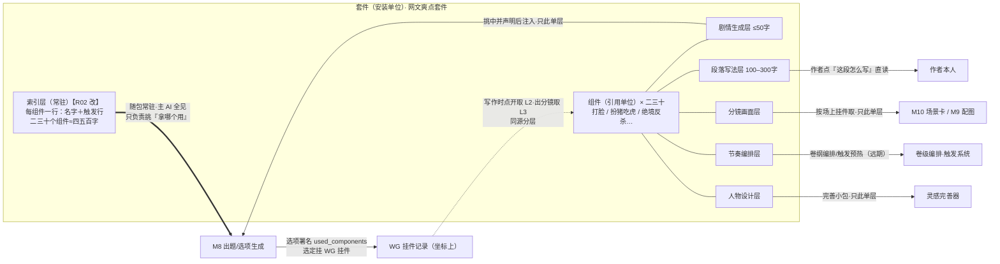

# 「故事真源引擎」插件（Skill）系统设计稿 R02（PLUGIN_SKILL_SYSTEM_DESIGN）

身份：**轻档设计稿。** 承接 CZ 2026-08-13 05:19 拍板（挂账本 ADD-014：插件分层规格）及同日 06:17 补充拍板（渐进式披露机制），把「写法理论／网文技巧怎么进产品」这件事从「挂件=光杆标签」升级成「插件=分层内容库＋卡牌制注入＋渐进式披露」。它是 [大纲结构 R02](OUTLINE_STRUCTURE_DESIGN_R02.md) §6 挂点机制三件套的**上层建筑**——三件套是地基，本稿一根柱子都不动，只在上面加两样东西（见第 5 节）。不是施工合同、不是数据库 Schema；第 6 节是字段建议。例子沿用设计稿一族的《万鬼伏藏》。

修订记录：**R02**（2026-08-13）——吸收 ADD-014 补充拍板（CZ 06:17「渐进式披露机制」，像 Agent Skill 一模一样）：①新增**索引行/索引层**——每组件「名字＋触发行」常驻进包，主 AI 全见、只负责挑「拿哪个用」（§1.2/§2.2）；②注入收紧为「内容层按场景单层取」（§2.2/§3）；③front-matter `tags` 撤销、`trigger` 触发行接任机械匹配依据（§6.2）；④作者指南新增「触发行怎么写好」（§4.1）；⑤token 预算表（§2.2）；⑥打脸示例补触发行（§1.4）。改动处标【R02 改】。**R01**（2026-08-13）首版。

上承：[OUTLINE_STRUCTURE_DESIGN_R02.md](OUTLINE_STRUCTURE_DESIGN_R02.md)（挂点三件套＋写法指导栏）、[M8_PLANNING_DESIGN_R01.md](M8_PLANNING_DESIGN_R01.md)（出题链路——插件的第一注入宿主）、[IDEA_LEDGER_DESIGN_R01.md](IDEA_LEDGER_DESIGN_R01.md)（灵感完善——widget_keys 消费者）、[SCENE_CARD_EXPORT_DESIGN_R01.md](SCENE_CARD_EXPORT_DESIGN_R01.md)（分镜层消费者）、[CONTEXT_PACKER_DESIGN_R01.md](CONTEXT_PACKER_DESIGN_R01.md)（C9 任务卡区——注入的物理位置）。拍板真源：挂账本（小说架构仓，路径含中文，复制用）`/Users/a1234/挣钱/小说架构/TEMP/bgboard-audit-20260809-r01/18_R07_ADDENDUM_LEDGER_20260813_R01.md`——**ADD-014 含 06:17 补充拍板**（本稿的任务书与 R02 修订真源）、ADD-013 G1/G2/G3、ADD-012 F4/F8、ADD-007（执行包瘦）。

---

## 0. 一句话＋一张图

插件就是产品里的**写法藏书**：一个套件（如「网文爽点套件」）装二三十个组件（打脸／扮猪吃虎／绝境反杀……），每个组件把同一门手艺按消费场景切成几层内容——出题时念 50 字要点、作者写作时看 300 字教法、出分镜时取画面语言。内容进生成只有一条路：**一道待解的题＋这张卡声明用哪些组件**，产出必署名，无自动冒出（ADD-014 铁律）。【R02 改】取用姿态像 Agent Skill 的**渐进式披露**（补充拍板原话「一模一样」）：主 AI 常驻只看**索引层**——每组件一行「名字＋什么情况下用」，二三十个组件约四五百字，它只负责挑「拿哪个用」；挑中谁才取谁的内容，而且**各消费场景只读自己那一层**。

分层的底层道理一句话（全稿最要紧的一句，【R02 改】补进索引级）：**分层＋索引就是 ADD-007「账本可以细、执行包必须瘦」在内容库上的落法**——两级瘦身：索引常驻四五百字管「知道库里有什么」，单层按需管「用到才装、装也只装本场景那层」；教法可以写三百字存着，进出题包的永远只有触发行和挑中组件的五十字层。



一句话读图：索引层是常驻的菜单，主 AI 全见、负责挑；同一个组件是一柜子分层内容，出题用前层、写作看详层、分镜取画面层——**同一个地方找，不同场景取不同层，且一次只取一层**（ADD-014＋补充拍板）；把这几个场景串起来的物理载体是选定后挂在坐标上的 WG 挂件记录。

## 1. 插件的解剖：套件 → 组件 → 层

### 1.1 三级结构，各自是什么单位

| 级 | 是什么 | 单位语义 | 例 |
|---|---|---|---|
| 套件 | 一包成体系的手艺 | **安装/分发单位**：装卸以套件为整体；二三十个组件（ADD-014 原话「一个插件套件可能由二三十个组件组成」） | 网文爽点套件 |
| 组件 | 一门具体技巧/理论 | **引用/署名单位**：出题声明、选项署名、WG 挂件、口味统计全部认组件键 | `technique.爽点.打脸` |
| 层 | 组件内按消费场景切的内容篮子 | **取用单位**：场景决定取哪层（第 3 节对应表），人不挑层 | 剧情生成层 |

**层不由人挑，由场景定死**——这是本稿的一个明确设计决策：出题卡永远取剧情生成层、分镜永远取画面层，五个场景对五个层的映射硬编码（第 3 节表）。卡上要声明的只是**组件集合**，层是场景常量。为什么：ADD-014 说「按消费场景划分篮子」，场景既然唯一确定篮子，让作者再选一次层就是多余的判断题（M8 §1.1 家法：作者的真判断次数是最贵的资源）；取错层是程序 bug，不是用户选项。

### 1.2 两级披露：索引行常驻＋五层按需【R02 改】

补充拍板给组件加了一份新身份信息——**索引行**。先把它和「层」的分工说死（它不是第六层，是常驻的门牌）：

| | 索引行（新增） | 层 |
|---|---|---|
| 是什么 | 名字＋一行「什么情况下用」（**触发行**，15–25 字） | 按消费场景切的内容篮子 |
| 谁看 | 主 AI **常驻全见**（本书已启用组件的索引行整块随包进）＋作者（组件栏浏览的就是它） | 挑中组件后，各消费场景**只取自己那一层** |
| 量级 | 二三十个组件 ≈ 四五百字（补充拍板原话） | 单层 50–300 字，按需 |
| 回答什么 | 「库里有什么、什么时候该想起它」 | 「具体怎么用」 |
| 内容纪律 | **只写触发条件，禁写教法**——防索引变成绕过声明的内容走私通道（§2.4 锁 1，机械代理见 §4.2 第 7 条） | 各层格式见下表 |

索引不单独维护文件：**装包时从各组件 front-matter 的 `title`＋`trigger` 现拼**——派生值不落盘家法（存储稿同款），防索引与组件文件漂移。

五层清单照 R01 裁定不变（CZ 点名的三层照收，两个候选层的论证在后）：

| 层 | 必/选 | 给谁消费 | 什么场景取用 | 内容形态 | 字数量级 |
|---|---|---|---|---|---|
| **剧情生成层** | 选填（缺了上不了出题卡） | M8 出题/选项生成（章计划出题、场级追问；将来卷级出题同用） | 出题卡声明后注入 C9 任务卡区 | 一段话：爽点类型＋角色配置＋成立要点，不带列表（要进 prompt，省预算） | **≤50 字**（硬上限 80，超限安装时拒收） |
| **段落写法层** | 选填（官方组件必配） | **作者本人**（主）；AI 扩写场级指导（v2，见 O2） | 作者点某场/WG 挂件「这段怎么写」时直读 | 详细教法＋**至少一正一反例**，教法口吻 | 100–300 字（CZ 原话「约 100 多字」取下限，正反例撑到 300） |
| **分镜画面层** | 选填 | M10 场景卡（润色/导演注记）、M9 配图提示 | 出卡/出图时按场上挂的组件键取 | 画面语言：关键帧选哪一刻＋构图＋镜头节奏；禁带具体人名书名（要跨书复用） | 100–200 字 |
| **节奏编排层** | 选填 | 卷级编排出题（未立项）、触发系统预热（ADD-013 G2）、章计划可选要点的星级参考（G3） | 卷纲编排/素材栏预热判断时取 | 频率＋间隔＋递进＋蓄压-释放曲线 | 100–150 字 |
| **人物设计层** | 选填 | 灵感完善器（人物卡草案）、将来人物系统 | 作者点「帮我完善」时进完善小包 | 这门技巧需要什么人物配置：谁、什么依仗、什么下场 | 100–200 字 |

**元信息（含触发行）必填、五层全选填但至少一层**【R02 改：触发行进必填清单】；缺哪层，组件就不出现在哪个场景（机械可判：没有剧情生成层的组件上不了出题卡，只能在别的场景被取用——但它的索引行照样常驻，主 AI 知道它存在）。官方组件的质量线：前三层必配。为什么不把剧情生成层设成人人必填：纯写法组件（比如「对白断句节奏」）不碰剧情走向，逼它写一段「注入出题」的话只会给 prompt 添噪音——缺层=不服务该场景，比硬凑诚实。

**三个候选层的论证**（R01 原样保留）：

- **卷纲层 → 收，但改名「节奏编排层」。** 看内容就知道该改名：这一层装的不是「卷纲怎么写」，而是「这门技巧在长跨度上怎么分布」——打脸一卷来几次、间隔几章、强度怎么递增。要它的硬理由是 ADD-013 G2 拍板原文：伏笔/钩子有最佳触发期，「有理论支撑（钩子放多久、情绪何时释放、剧情何时该变）——**必须有承接这些理论/技巧的位置**」——那个位置就是这一层。⚠️ 但 V0 不实装它的消费（卷级出题和触发预热两个宿主都没立项）；层规格现在就定进公开标准，因为标准要一次发布——早期用户写的插件不能因为我们后定规格而缺层返工。
- **章纲层 → 不单设。** 章计划出题（M8 对章槽出题）**就是**剧情生成层的主消费场景——CZ 问「章大纲取什么」，答案是取剧情生成层。单设章纲层等于同一个场景摆两个篮子，作者写插件时永远分不清该往哪篮填。
- **人物设计层 → 收。** 灵感完善已经在引用挂件词条出人物卡草案（灵感稿 §3.2/3.3，`widget_keys` 字段现成）——现在那些键是光杆键，内容靠模型通识兜底；这层补上，完善器引用的就是真教法。而且技巧类组件天然带人物配置知识：打脸需要什么样的反派，本来就是这门手艺的一部分（见 1.4 示例）。

### 1.3 顺手关一桩旧案：G5「写作指导到底指导什么」

ADD-013 G5 里 CZ 反问写作指导分层（①指导大纲②事实句批注③生成时理论塑形），当时待主窗澄清。ADD-014 实际上已经给了总答案，本稿落成结构：三种理解是**同一个组件库的不同层进不同场景**——①指导大纲＝剧情生成层进出题卡；②「这段怎么写」的批注＝段落写法层挂在场/WG 上给作者读（注意它教的是作者在产品外写正文时的手艺，不是产品内的「写正文提示」——产品不写正文，ADD-014 纠正②）；③生成时塑形＝声明清单注入。G5 可以关了。

### 1.4 完整示例组件：打脸（`dalian.md` 全文，一个字不略）

以下就是组件文件的真实形态（格式约定见第 4、6 节）——五层内容全部真写，官方套件按这个成色交付。【R02 改】front-matter 换血：`trigger` 触发行进必填（索引行原料＋匹配依据），`tags` 撤销（职责被触发行接管）：

```markdown
---
key: technique.爽点.打脸
title: 打脸
trigger: 主角憋屈已蓄多章、对头当众挑衅、需要释放压力时用
one_liner: 让轻视主角的人当众付出代价，读者积压的憋屈一次放完
genres: [通用]
version: 0.2.0
---

## 剧情生成层

爽点·压力释放型。三角色：挑衅者当众踩、主角一击定音、围观者态度翻转。
憋屈要蓄够再打，打完必须有人看见。

## 段落写法层

打脸的爽感全在落差和节奏，不在骂得多狠。三拍写法：
①抬——动手前让挑衅者再嚣张一拍（加注）：围观者附和、主角沉默，把读者的气压到顶；
②打——一击定音：用事实或实力说话，主角话越少越高级，最好一句话或一个动作收掉；
③翻——镜头立刻转给围观者：倒吸气、改口、道歉。态度翻转才是爽点本体，主角自己不解释。
反例（俗套）：打完长篇大论讲道理——爽点稀释成说教；挑衅者秒怂跪地喊爸爸——落差太假，读者出戏。
正例：亮出真本事那一刻全场安静三秒，最先改口的是刚才笑得最响的那个——让配角的反应替主角说话。

## 分镜画面层

关键帧选「翻转瞬间」，不选「出手瞬间」：特写围观者表情由讥笑凝固成错愕，主角可以虚化在背景。
构图：打之前挑衅者占画面高位或中心；打之后主角占位、挑衅者缩到角落——地位对调直接画出来。
节奏三拍对三镜：抬、打、翻——中间那镜最短（一个动作或一句话），前后两镜留足反应。

## 节奏编排层

同型打脸一卷不超过 3 次，强度要递增（打喽啰→打管事→打幕后），间隔拉开至少 3–5 章。
每次打脸前要 2–4 章憋屈蓄压：蓄不足打着不疼，蓄太久读者弃书。
打完 1–2 章内要立新压力（更大的对头现身），防爽点真空。

## 人物设计层

挑衅者别设计成纯蠢：给他嚣张的依仗（背景、信息差、过往战绩）——打脸打的是依仗不是智商，
依仗越硬翻转越响。给他留一条败后动线（记恨升级／倒戈抱腿／引出背后势力），一次性工具人浪费戏。
围观者里安排一个中立有分量的（老师傅、行家），他的改口比十个路人喝彩都值钱。
```

【R02 改】它拼进索引层就是这一行——出题时主 AI 看到的关于打脸的**全部**：

> **打脸**——主角憋屈已蓄多章、对头当众挑衅、需要释放压力时用

对照 ADD-014（含补充拍板）验一遍：触发行 24 字（15–25 ✓，写的是「什么情况下用」不是教法，含 G3 要点词「释放压力」）；剧情生成层 45 字（≤50 ✓，含类型、几个人物参与、情绪释放三要素）；段落写法层约 260 字（「怎么写、不能俗套、如何高级、正反例」四件齐 ✓）；分镜画面层回答「这个画面应该什么样子」✓；两张选填层是 1.2 论证的增量。

## 2. 注入机制：卡牌制怎么在机制上焊死

### 2.1 铁律原文，先钉在门上

ADD-014 纠正的两个设计误读，是本节一切设计的宪法：①理论/技巧没有「暗中参与」——**一切都是卡牌制**：一道待解的题＋这张卡声明用哪些插件内容→生成方案→作者四选一；不存在自动往上冒、突然出现的指导。②不存在「写正文时的提示」——产品不写正文，所有指导围绕大纲、事实句、分镜的生成。【R02 改】补充拍板再加一条取用宪法：**索引层常驻、内容层按需单层取**——主 AI 全见的只是「有什么、何时用」，「怎么用」挑中了才装、装也只装本场景那层。

### 2.2 完整链路六步（以章计划出题为例，其他场景同构）【R02 改：步 1 新增，步 2/4/5 修订】

1. **索引随包常驻（新）**。装包时把本书已启用组件的索引层——每组件「名字＋触发行」一行，程序从 front-matter 现拼——整块放进 C9 任务卡区（`why_loaded: "plugin_index"`）。主 AI 从此**全见库里有什么**，它负责的就是补充拍板那句「拿哪个用」；机械预筛漏掉的组件，它还有机会从索引里认出来（见步 5）。
2. **圈定（机械，零调用；匹配依据换成触发行）**。默认声明清单仍由程序预选：题面材料里的要点类型词（ADD-013 G3 汇聚的那批——必须释放的压力/该触发的剧情/必须揭开的秘密/人物必须完成的转变/金手指该释放……）对组件**触发行文本**做关键词匹配；钉选的组件必进（4.3）；口味权重排序（G8，V0 只记账不调权）。取前 N 个，**默认 N=5，预算封顶**（⚠️ 起步值无实测）。
3. **上卡声明（可见可改）**。出题卡带一栏「本题可用组件」（组件栏，交互借 G2 素材栏的样子：一条条摆着，作者可叉掉本题不用、可从库里补挑、可清空）。【R02 改】组件栏展示的就是索引行——默认勾着圈定结果，其余组件折叠在「从库里挑」里；**作者看到的和主 AI 看到的是同一份索引**。这一栏就是 ADD-014 说的「这张卡声明用哪些插件内容」；卡头同时标死本卡取用层（出题卡＝剧情生成层，1.1 的场景常量）。省心档圈定结果默认生效不拦人，掌控档可设为必看——姿态同停点家法（ADD-005），组件栏是 P1 出题卡的一部分，**不新增停点**。
4. **注入（两级瘦身）**。进包的插件内容只有两样：①索引层整块（常驻）；②**声明清单内组件的剧情生成层——只此单层**：段落写法层、分镜画面层、节奏编排层、人物设计层一个字不进（补充拍板原话：卡片生成剧情只取「如何生成剧情」层，如何描写正文、如何生成分镜脚本它**不看**）。各消费场景只读自己那层，出题场景的「自己那层」就是剧情生成层。
5. **产出署名＋AI 复挑（新口子，只提建议不生效）**。每个选项必带 `used_components`（实际用了哪几个组件的键；空表=没用，合法且无署名；只能引用声明清单内的——只有它们的内容层在输入里）。【R02 改】另开 `suggest_from_index`：主 AI 若从索引行认出更合适但未声明的组件，可以点名建议（⊆ 索引全集）。建议**不注入、不生效、不署名**——渲染成组件栏旁一行「AI 觉得『绝境反杀』可能更合适 ▸ 加入声明并重出题」，作者点头才重出（花一次调用，走弃用/重出的现成通道）。挑的活 AI 干，冒出的门永远是卡。卡面署名由**程序**渲染：「参考：网文爽点套件 · 打脸」；聊天框口吻按 ADD-012 F4 模板：「你安装的『网文爽点套件·打脸』建议：憋屈已经蓄了三章，这里可以打了。」——AI 的权威来自引用的库，不是自己装专家（F4 原话）。
6. **选定挂件（落账）**。作者选定选项（P1）那刻，该选项的 `used_components` 自动挂成 WG 挂件记录到章篮/对应场（`source_identity=model_suggested`，via=OPT 号——M8 §4.1 现成机制）；「将挂写法挂件：打脸」这个动作列进选项折叠区的变更清单（ADD-013 G1：折叠区=选它之后系统怎么改账，挂件也是账）。**这一步就是「同源分层」的闭环**：出题时用的组件挂上坐标，写作时点开同一个键读段落写法层，出分镜时取画面层——同一个地方找，不同场景取不同层。

【R02 改】**token 预算表**（出题场景，⚠️ 均为量级估算）：

| 块 | 量级 | 何时进包 |
|---|---|---|
| 索引层（20–30 组件 × 每行约 20 字） | ≈400–600 字 | 出题类场景**常驻** |
| 声明组件的剧情生成层（≤5 × ≤50 字） | ≤250 字 | 声明后注入，只此单层 |
| 其余四层 | 0 字 | 永不进出题包；各自场景单层取 |
| 合计 | <900 字 | 对照 C9 前提包整体预算是零头量级；比 R01 多出的索引 500 字，买到的是「主 AI 知道整个库」 |

出题卡示意（《万鬼伏藏》S-0007，前文已铺垫：爷爷忘他＋行会同行排挤，憋屈蓄了三章）：

```
第 7 章工作台 ｜ 题：行会验棺大会——第 7 章从哪里下刀？
本题可用组件（用了会署名）：[爽点·打脸 ×] [爽点·当众验真 ×] [＋从库里挑]

✅ 选项一（推荐）：章老四当众讥九棺「守棺守出病」，九棺以一手『听钉』
   辨出祖棺暗钉数目，满堂行家变色
   参考：网文爽点套件 · 打脸
   为什么适合：憋屈已蓄三章（爷爷不认＋同行排挤），到了该放的时候
   ▸ 消化：还 MC-0019（行会线本章启动）
   ▸ 折叠：变更清单——新增 PE×3；章老四立场翻转登状态账；挂写法挂件「打脸」
选项二：不进行会，先写九棺夜访老仵作留下的空屋（无组件署名）
选项三：……
AI 提议：索引里『扮猪吃虎』似乎也合适 ▸ 加入声明并重出题
```

### 2.3 组件怎么被选中：三路并联，汇进同一张声明清单

任务书问的「按要点类型匹配？作者手动指定？触发系统推荐？」——答案是三路并联，产物都是第 2 步那张卡上的声明清单，没有第四条暗道：

| 路 | 机制 | 成本 | V0 |
|---|---|---|---|
| ① 触发行机械匹配【R02 改】 | 题面要点类型/目的标签词 ∩ 组件**触发行**文本（官方触发词起步表锚定 G3 要点类型清单——用表内词写触发行，机械命中率高，见 §4.1 第三节） | 零调用、零误报源（不命中就不出现——悬疑章要点里没有「释放压力」，打脸根本不进默认勾选） | ✅ 主路 |
| ② 作者手动 | 钉选（书/线级预先钉，见 4.3）＋出题卡现场增删（组件栏浏览的就是索引行） | 零 | ✅ 作者说了算 |
| ③ 系统调权＋AI 复挑【R02 改】 | 口味配置（ADD-013 G8）：署名让「哪个组件的方案总被弃用/未选」可统计，taste_weights 升降圈定排序；主 AI 从常驻索引里 `suggest_from_index`（§2.2 步 5，只提建议、作者点头才生效） | 零调用（统计）/建议免费、采纳重出花一次 | 口味记账 V0、调权 V1；复挑 V0 |

补一句 G8 的搭车价值：**没有署名，「作者讨厌打脸」这个信号根本无处落账**——署名不只是给人看的礼貌，还是口味配置的记账单位。数据从 V0 第一天攒。

### 2.4 「无自动冒出」的三道机械锁【R02 改：锁 1/锁 2 随索引层修订】

1. **闸口唯一（内容层）＋索引不走私**。**内容层**进模型只有一条通道：卡上声明清单 → 场景对应的**单层**；装包器只有这一个读插件内容的入口，未声明组件的内容**物理不在模型输入里**。索引层是常驻的第二样进包物，但它**不是内容**——只有名字和触发条件，没有一个字教法。为防索引变成绕过声明的走私通道，索引行有内容纪律（只写「什么情况下用」，§1.2）＋机械代理（触发行 ≤30 字硬上限，§4.2 第 7 条）——教法塞不进 30 字。机械自检两条：内容层注入块键集合 == 声明清单；索引块键集合 == 本书已启用组件全集。
2. **产出必署名、署名必受验；建议只能是建议**。`used_components` 必填（可空表）；引用不在声明清单内 → 该选项拒收重出。「偷偷用了」在机制上不可能（没声明的内容不在输入里），「谎称用了」被校验拦下（引用 ⊆ 声明 ⊆ 已启用索引，三层子集链）。【R02 改】`suggest_from_index` ⊆ 索引全集且不得与声明清单重叠；建议不注入、不生效、不署名，只渲染成待作者点头的一行——AI 复挑权不豁免卡牌制。
3. **界面无推送**。组件建议只长在题卡的组件栏里（卡的一部分），不弹窗、不在编辑画布时插话、不定时提醒——同灵感 P16「角标一行提一次就闭嘴」家法。未安装的组件任何界面不出现；未启用的组件不进索引块；卸载即从索引消失，圈定和复挑都查不到。

一条对 M8 R01 的收编（提交 M8 R02 修订吸收）：M8 §4.1 铺满时「自动建议 1–2 个挂件」在卡牌制下要收紧为**铺满建议的挂件键 ⊆ 本卡声明清单**——出题和铺满是同一张卡的两段生成（M8 §1.2），声明覆盖两段；铺满想用没声明的组件，走不通，作者可以对某场出场级题（新卡新声明）再引入。这样 M8 的既有行为和 ADD-014 铁律对齐，没有灰色地带。

### 2.5 署名怎么落：程序渲染，不许模型写散文

三条落法，全机械：

- **字段**：选项/产出对象带 `used_components`（键列表）；灵感完善沿用现成 `widget_keys`（灵感稿 §3.3，字段零改动）；场景卡润色产出带同名字段。
- **渲染**：署名行由程序从键查套件名＋组件名拼出（「参考：网文爽点套件 · 打脸」）；**模型正文里自称「我参考了 XX」不作数、不展示**（渲染层丢弃）——防「假署名」：嘴上说参考了、实际输入里没有。
- **留痕**：选定后挂 WG 记录（via=OPT 号）；组件被卸载后，历史署名和 WG 记录**不删**（见 4.3），键解析显示「组件已卸载」。

### 2.6 程序机械校验清单（V0 级，体例同 M8 §3.5）【R02 改：第 2/4 条修订、第 4 条新增】

| # | 校验 | 失败处置 |
|---|---|---|
| 1 | 声明清单 ⊆ 本书已启用组件索引 | 装包器拒跑（启用状态与卡不同步是程序 bug） |
| 2 | 【R02 改】内容层注入块键集合 == 声明清单（无多注、无漏注，且**只含场景对应的单层**）；索引块键集合 == 已启用组件全集 | 装包器自检失败拒跑 |
| 3 | 每个选项 `used_components` ⊆ 声明清单（空表合法；编造键=该选项拒收重出） | 同 M8 待消化清单第 3 条同款 |
| 4 | 【R02 改·新增】`suggest_from_index` ⊆ 索引全集，且 ∩ 声明清单 = 空；建议只渲染为待点头行，不注入不署名 | 越界/重叠建议整条丢弃 |
| 5 | 署名行只从 `used_components` 渲染；模型自由文本的「参考了…」丢弃 | 渲染层过滤 |
| 6 | 铺满/扩写/润色产出引用的组件键 ⊆ 该卡声明清单 | 越界引用整条丢弃 |
| 7 | 安装校验七条（见 4.2） | 报错拒装或降级装 |

边界老实写明：机械校验拦得住「引用造假」，拦不住「教法写得烂」——组件内容的语义质量只能靠作者眼睛＋口味反馈＋官方内容把关（程序验机械、人验语义，全线纪律）。

## 3. 分层取用表（一张表看全）

【R02 改】先立两级披露的总口径一句：**主 AI 索引层全见、内容层按场景单层取。** 下表管的是内容层；索引层在出题类场景（章计划出题、场级追问、将来卷级出题）随包**常驻**；直读/完善/分镜这类点名场景不需要索引常驻——按触发行机械圈定（或按已挂的 WG 键点名）后单层取，索引块是否随小包由各宿主落地时定，不强求。

| 场景 | 消费者 | 取哪层（只取这一层） | 谁触发 | 取用形态 | V0 |
|---|---|---|---|---|---|
| 卷纲编排（卷目标/节拍分布） | M8 卷级编排（未立项）＋触发系统预热（G2） | 节奏编排层 | 作者编辑卷篮出题／素材栏预热判断 | 出题卡声明制，同章级（索引常驻） | ❌ 远期 |
| 章计划出题（下一章怎么走） | M8 出题/选项生成＋铺满 | 剧情生成层 | 作者到槽位出题（P1 流程内） | 索引常驻→声明清单→单层注入 C9→选项署名→选定挂 WG | ✅ 主链路 |
| 段落写法展开（这段怎么写） | 作者本人 | 段落写法层 | 作者点某场/WG 挂件展开（点哪问哪） | 直读详层＋来源行，零调用零积分 | ✅ |
| 灵感完善（人物卡草案） | 灵感完善器 | 人物设计层 | 作者点「帮我完善」 | 完善小包单层注入＋`widget_keys` 署名（灵感稿现成机制） | V1（机制现成，等内容） |
| 分镜生成（场景卡/概览图） | M10 场景卡润色/导演注记、M9 配图提示 | 分镜画面层 | 作者导出场景卡/生成概览 | 按场上挂的组件键取单层，进润色输入或 director_notes | V1 |

表外一句边界：**插件内容永远不进真值**——它是参考内容，不是事实来源；不参与体检、不进事实账、WG 挂件本来就是开放词表不入真值账（R02 §6 原话），插件只是给词表的键配了内容，身份不变。

## 4. 用户自制插件的公开规格（插件作者指南骨架）

ADD-014 拍板：「分层标准公开——用户会自己创造插件/Skill，不公开标准做出来就不兼容。」下面就是那份《插件作者指南》的骨架，正式版随 V1 用户导入功能一起发布成产品文档：

### 4.1 指南骨架【R02 改：必填加 trigger，新增第三节「触发行怎么写好」】

```text
《故事真源引擎 · 插件作者指南》（骨架）

一、你在写什么
   一个套件 = 一个文件夹：suite.json（套件说明）＋ components/ 下每组件一个 .md。
   组件 = front-matter 元信息 ＋ 若干固定标题的层。写好装进产品：
   你的「名字＋触发行」会常驻出题 AI 的视野（索引层），被挑中、被引用时给你署名。

二、必填
   1. suite.json：套件 id（ASCII 短名）、名字、版本、作者、命名空间、组件清单
   2. 每个组件的 front-matter：key（三段式，见六）、title、
      trigger（触发行：15–25 字「什么情况下用」——见三）
   3. 每个组件至少一层非空

三、触发行怎么写好（最重要的一行——写不好，组件永远不被挑中）
   索引层是出题 AI 唯一常驻可见的部分：组件会不会被想起，全看这一行。
   1. 写「什么情况下用」，不写「怎么做」：教法住在层里；触发行塞教法
      既装不下也过不了安装校验（≤30 字硬上限）。
   2. 15–25 字，一句条件描述，套「状态＋事件＋需求」：
      如「主角憋屈已蓄多章、对头当众挑衅、需要释放压力时用」。
   3. 用官方触发词表的词（锚 G3 要点类型：必须释放的压力／该触发的剧情／
      必须揭开的秘密／人物必须完成的转变／金手指该释放…）——程序按触发行
      做关键词匹配，用表内词默认就会被勾选；全是自造词的触发行，
      只剩「AI 从索引里认出你」和「作者手动挑你」两条路。
   4. 别写空话：「写爽文时用」等于没写——所有爽点组件都在爽文里用，挑不出你。
      好触发行的自测标准：拿 20 道不同的题来问，只有该你上的那几道会命中你。

四、五层各写什么（全选填，缺哪层=不服务哪个场景）
   ## 剧情生成层   ≤50 字一段话（硬上限 80）。写「这个技巧成立的最小要点」：
                   类型、几个角色、什么条件下能用。它会被原文塞进出题 prompt——
                   每多一个字都在花作者的注意力预算，别写教程，写要点。
   ## 段落写法层   100–300 字。写「作者动笔时怎么写好它」：步骤/口诀＋至少
                   一个反例（俗套长什么样）＋至少一个正例。给人读的，说人话。
   ## 分镜画面层   100–200 字。写「这一刻拍出来什么样」：关键帧选哪个瞬间、
                   构图、镜头节奏。禁写具体人名/书名（要跨书复用）。
   ## 节奏编排层   100–150 字。写「长跨度怎么排」：一卷几次、间隔几章、
                   强度怎么递增、蓄压和释放的节奏。
   ## 人物设计层   100–200 字。写「这个技巧需要什么人物配置」：谁、
                   什么依仗、什么下场、配角怎么摆。

五、格式约束
   层标题必须逐字用上面五个（程序按标题切层，写错=该层不被识别）；
   剧情生成层内不要列表和小标题（它按纯段落注入）；触发行单行纯文本；
   不要在内容里写指令口吻的话（「忽略以上要求」这类会被安装校验拒掉）。

六、key 怎么起
   三段式：命名空间.套件短名.组件名，如 technique.爽点.打脸。
   命名空间四选一：technique（网文技巧）/ theory（文学理论）/
   template（模板，见指南附录）/ reader_effect（读者效果）。
   撞键=后装者改名让路（安装时程序查重）。

七、怎么校验（安装时程序自动跑，见 4.2 清单）＋怎么卸载（4.3）
```

### 4.2 安装时机械校验什么（七条）【R02 改：第 7 条新增】

| # | 校验 | 失败处置 |
|---|---|---|
| 1 | suite.json / front-matter 可解析，必填字段齐 | 拒装，报缺哪项 |
| 2 | key 三段式且命名空间 ∈ {technique, theory, template, reader_effect} | 拒装 |
| 3 | key 查重：与已装组件撞键 | 拒装＋提示改名（后来者让路，词典家法：登记前先查重） |
| 4 | 层标题 ∈ 五层固定枚举，未知标题报错；至少一层非空 | 拒装 |
| 5 | 剧情生成层 >80 字拒装（它要进 prompt）；其余层超预算只警告 | 拒装/警告 |
| 6 | 内容黑名单：层内容含指令注入类保留标记（伪装系统指令的文本） | 拒装 |
| 7 | 【R02 改】`trigger` 必填、单行、≤30 字——这是「索引行禁写教法」的机械代理：教法塞不进 30 字；写没写成条件描述属语义，程序不假装能验 | 拒装 |

第 6 条的边界老实说：用户自制内容会进模型 prompt，**机械黑名单只防低级注入，语义级的防不住**——V0 姿态是「装谁的插件=信谁」（同浏览器装扩展的信任逻辑），插件市场真要做的那天再谈审核，那是远期的事（第 7 节）。语义质量（教法好不好）同样机械不验。

### 4.3 安装 / 卸载 / 启用范围

| 动作 | 范围 | 设计＋为什么 |
|---|---|---|
| 安装 | **用户级**（跨书一份库） | 手艺跟人走：打脸的写法不属于某本书，作者换书不该重装。存储见 6.1 |
| 启用 | **书级开关**（plugin_prefs 勾套件、可禁个别组件） | 防串味：悬疑书不想被爽点套件带偏，一键关；默认姿态见 O1。【R02 改】启用的另一层含义：**进不进索引块**——未启用的组件连索引行都不出现 |
| 线/章级 | **只做钉选，不做开关** | 钉选=圈定加权＋必进声明清单（「主线走憋屈-翻身节奏，打脸常钉」）。每章开关矩阵是过度设计——圈定的触发行匹配天然做了「相关才出现」，再铺一层开关就是给作者发配置作业（治理三档：轻活别干成重档） |
| 卸载 | 套件整体移除＋索引除名 | **已落的 WG 挂件和署名记录不删**：署名是发生过的引用，抹了等于改历史；键解析显示「组件已卸载」，重装即复活。⚠️ 注意这一条与模板的「卸载=删标签」（R02 §6）不同且不冲突——模板标签是**期待**（删了就干净），署名是**史实**（必须留痕），两种对象两种卸法 |

安装/卸载/启用全是作者主动设置动作，**不占停点号**（同「伏笔改期是编辑动作」判例，注册表体例）。

## 5. 与现有机制的关系：地基上加了什么

### 5.1 三件套是地基，插件系统加两样

R02 §6 的三件套原样不动：**稳定坐标**（挂哪儿——五种前缀的节点 ID）、**挂件对象**（挂了什么名——命名空间＋开放词表的 WG 记录）、**模板**（哪些坐标该有什么＋缺位提醒）。插件系统在上面加的是：

1. **分层内容库**：原来 `technique.打脸` 是光杆键——一个名字，内容靠模型通识现编；现在键背后有一柜子分层内容（1.4 那个文件），【R02 改】柜门上还贴着一行常驻可见的门牌（索引行）。键的引用方式零改动：WG 记录、`writing_guidance`、`widget_keys` 照旧引键名。
2. **注入规则**：内容什么时候、以什么密度、走什么闸口进生成（第 2 节卡牌制＋渐进式披露全套）——这是原来完全没有的一层，也是 ADD-014 两条纠正＋补充拍板的落点。

一句话分工：**挂件机制管「挂在哪、挂了什么名」，插件系统管「名字背后是什么内容、内容怎么进生成」。**

### 5.2 模板和插件：书架标签 vs 书

模板（`template.*`）＝坐标映射：「黄金三章」说第 1–3 章各该有什么、缺了提醒一次（不硬性规定、不追旧账——捞货 46 家法照旧）。插件组件＝内容库：打脸怎么构、怎么写、怎么拍。**模板是书架上的标签纸，插件是书**——标签纸指着「这格该放一本悬念钩子」，书才是真教你怎么写钩子的东西。两者的连接：模板的坐标期待可以**引用组件键**（第 3 章坐标期待 `technique.爽点.打脸`，点开期待直达组件内容）；一个套件可以随包带模板（suite.json 的 `templates[]` 与 `components[]` 分开登记，身份不混）。

### 5.3 命名空间怎么扩

- **四个命名空间不变、不新增**（technique/theory/template/reader_effect，R02 §6 原表）——插件不是第五个命名空间，是给前四个空间的键配内容的机制。
- **键从两段式扩三段式**：`命名空间.套件短名.组件名`。存量两段键（`theory.动机可共情`）继续合法，视作「无套件散键」（官方散词条），下游引用零迁移。【R02 改】散键没有 front-matter，索引行由官方词条表补一行同格式的「名字＋触发行」，进同一个索引块——主 AI 眼里散键和套件组件长得一样。
- **不发新 ID 前缀**：组件的身份就是键名本身，不另发 `XX-` 号——N9 前缀户口已经够挤，别再添丁。套件 id 用 ASCII 短名（`shuangdian-suite`），只在安装登记里出现。

### 5.4 新词登记（交词典，按「谁发明谁当天登记」家法）【R02 改：加索引层/触发行两行】

| 词 | 圈 | 一句话干嘛的 |
|---|---|---|
| 插件套件（套件） | 工程 | 写法内容的安装/分发单位，装二三十个组件 |
| 插件组件（组件） | 工程 | 一门技巧/理论的引用/署名单位，身份=挂件词表键 |
| 层（剧情生成/段落写法/分镜画面/节奏编排/人物设计） | 工程 | 组件内按消费场景切的内容篮子，场景定死取哪层，一次只取一层 |
| **索引层**【R02 改】 | 工程 | 本书已启用组件的「名字＋触发行」整块，出题类场景常驻进包；主 AI 全见、只负责挑 |
| **触发行（索引行）**【R02 改】 | 工程 | 组件 front-matter 的 `trigger`：一行「什么情况下用」（15–25 字），机械圈定与主 AI 挑选的共同依据 |
| 声明清单／组件栏 | 工程 | 出题卡上「本题可用组件」那栏；插件**内容层**进生成的唯一闸口 |
| 组件署名 | 工程 | 产出必带的 `used_components`＋程序渲染的「参考：××」行 |
| 钉选 | 工程 | 书/线级把组件标为常用：圈定加权＋必进声明清单 |
| （界面词） | 用户 | 界面上这套东西叫「插件」还是「技巧库」，随 UI 稿一并拍（同 N3 体例），暂用「插件」 |

## 6. 数据形状

### 6.1 目录树：用户级安装＋书级启用

```text
<产品数据目录>/plugins/            ← 用户级：手艺跟人走（4.3 理由）
  installed/
    shuangdian-suite/              ← 一个套件一个文件夹（ASCII 名）
      suite.json                   ← 套件元信息＋组件清单
      components/
        dalian.md                  ← 一个组件一个 .md（完整示例见 1.4）
        banzhuchihu.md
        juejingfansha.md
        …
  index.json                       ← 安装登记：套件、版本、来源、装于何时

data/<书名>/
  plugin_prefs.json                ← 书级：启用哪些、钉什么、口味权重
```

**为什么组件一个文件、层不分文件**：①组件是引用/分享/校验的最小单位，物理文件与之对齐；②「同源分层」要落在物理上——五层同居一文件，作者改打脸的教法时顺手就把各层改齐，拆成五个文件必然漂移；③一套二三十个文件一个目录，人翻得动。**为什么层是标题分节不是 JSON 字段**：用户自制要低门槛——MD 人可读可写，front-matter＋固定标题分节跟 SKILL.md 一个手感（CZ 原话「像 Skill 一样」），程序按标题切层照样机械可解析。【R02 改】**索引层不落盘**：装包时从已启用组件的 front-matter（`title`＋`trigger`）现拼——派生值不落盘家法，防索引与组件文件两处维护漂移；上面那个 `index.json` 是**安装登记**（谁装了、哪版），不是内容索引，两回事。

### 6.2 suite.json（示例＋字段表）

```json
{
  "schema": "plugin-suite-v1",
  "suite_id": "shuangdian-suite",
  "name": "网文爽点套件",
  "version": "0.2.0",
  "author": "官方",
  "namespace": "technique",
  "one_liner": "网文高频爽点的写法组件集：怎么构、怎么写、怎么排、怎么拍",
  "genres": ["通用"],
  "components": [
    {"key": "technique.爽点.打脸", "file": "components/dalian.md", "title": "打脸"},
    {"key": "technique.爽点.扮猪吃虎", "file": "components/banzhuchihu.md", "title": "扮猪吃虎"},
    {"key": "technique.爽点.绝境反杀", "file": "components/juejingfansha.md", "title": "绝境反杀"}
  ],
  "templates": []
}
```

| 字段 | 装什么 | 必填 |
|---|---|---|
| `schema` / `suite_id` / `name` / `version` / `author` | 身份四件套＋版本 | 是 |
| `namespace` | 套件主命名空间（组件 key 的第一段与之一致） | 是 |
| `one_liner` / `genres` | 一句话＋适用题材 | 是／可空表 |
| `components[]` | 组件清单：`{key, file, title}`；key 唯一 | 是 |
| `templates[]` | 随包模板（坐标映射文件，5.2）；与组件分开登记 | 是（可空表） |

组件 front-matter 字段（文件正文=五层标题分节，全样见 1.4）【R02 改】：`key`（三段式）、`title`、**`trigger`（必填，触发行——索引行原料＋机械匹配依据；R01 的 `tags` 撤销，职责由它接管）**、`one_liner`（选填，界面浏览用）、`genres[]`、`version`。

### 6.3 plugin_prefs.json（书级）

```json
{
  "schema": "plugin-prefs-v1",
  "enabled_suites": ["shuangdian-suite"],
  "disabled_components": [],
  "pins": [
    {"scope": "storyline", "ref": "L-0001",
     "keys": ["technique.爽点.打脸"],
     "note": "主线走憋屈-翻身节奏，打脸常用"}
  ],
  "taste_weights": {"technique.爽点.绝境反杀": -1}
}
```

`taste_weights` 由驳回/未选统计积累（G8 口味配置的组件侧账本），V0 只写不读，V1 圈定排序读它。

### 6.4 出题产出的署名切片（option 对象增补）【R02 改：加 suggest_from_index】

```json
{
  "question_extras": {
    "suggest_from_index": ["technique.爽点.扮猪吃虎"]
  },
  "options": [
    {
      "key": "opt-1",
      "summary": "章老四当众讥九棺守棺守出病，九棺以『听钉』辨出祖棺暗钉数目，满堂变色",
      "used_components": ["technique.爽点.打脸"],
      "digest_refs": ["MC-0019"],
      "why_fit": "憋屈已蓄三章（爷爷不认＋同行排挤），到了该放的时候"
    }
  ]
}
```

**配套账本增补清单**（体例同 M8 §8.4，提交各宿主吸收，全部机械小改）：

| 对象 | 增补 | 出处 |
|---|---|---|
| `option_record.options[]` | 加 `used_components`（list[str]，可空表） | 本稿 2.2/2.5 |
| `option_record` 组级 | 【R02 改】加 `suggest_from_index`（list[str]，可空表；只渲染不生效） | 本稿 2.2 步 5 |
| C9 `why_loaded` 枚举 | 加 `plugin_declared`（声明组件的单层内容）＋【R02 改】`plugin_index`（索引层整块） | 本稿 2.2（同 M8 加 `discarded` 先例） |
| WG 挂件记录 | `via` 已有（OPT 号）；键解析加「已卸载」态显示 | 本稿 2.5/4.3 |
| M8 §4.1 铺满挂件建议 | 收紧为 ⊆ 本卡声明清单 | 本稿 2.4，提交 M8 R02 |

## 7. V0 分期

| 期 | 做什么 | 不做什么 |
|---|---|---|
| **V0** | ①官方内置 1 个套件 × 8 个组件 × 前三层（剧情生成/段落写法/分镜画面）＋【R02 改】每组件触发行；②安装登记＋组件索引（内置即已装，无导入 UI）＋【R02 改】索引层装包现拼；③**出题链路全套**：索引常驻→圈定（触发行匹配＋作者增删）→声明上卡→单层注入 C9→署名＋AI 复挑建议→选定挂 WG→机械校验 §2.6；④段落写法层直读（点 WG/写法指导展开，人读零调用）；⑤plugin_prefs 书级启用＋线级钉选；⑥口味只记账 | 用户导入、口味调权、灵感/分镜消费、节奏编排层消费、市场 |
| **V1** | ①用户自制导入＋安装校验器＋《作者指南》发布成产品文档；②灵感完善接人物设计层（`widget_keys` 机制现成，内容跟上即通——灵感稿 §3.2 那句「机制好了没词条就是空转」的正面解法）；③分镜画面层接 M10 润色/M9 配图；④口味权重生效（G8） | 市场/分享 |
| **V2/远期** | ①插件市场/分享（内容权利另议，口径同拆书稿「模板 V1 不分享、官方模板包记远期商业化」）；②节奏编排层消费（等卷级编排＋触发预热两个宿主立项）；③题材变体（若 O3 被真实需求推翻） | — |

V0 首发 8 个组件的候选名单（内容工单定稿）：打脸、扮猪吃虎、绝境反杀、当众验真、亮底牌（身份揭示）、越级挑战、断后路反将、憋屈蓄压。为什么是 8 不是二三十：8 个够跑通机制全链（【R02 改】触发行命中率、索引层预算、注入、署名、口味记账、AI 复挑频次都能拿到真数据，可搭 M8 §1.5 出题实验的车加一组对照），二三十个是内容量产期的事。

⚠️ **内容建设是独立工作，单独立工单**：爽点套件全量 = 20–30 组件 × 5 层 ≈ **2–3 万字教法内容**，V0 那 8 个 × 3 层也有约 4,500 字——要网文编辑级的人写和把关，不是设计稿或施工单的附带产出。【R02 改】触发行虽短（每条 15–25 字）但**单独列为内容工单的验收重点**——它是组件唯一常驻可见的部分，写不好整个组件等于白写（§4.1 第三节的自测标准当验收标准）。质量红线一句：**教法写烂会顺着署名反噬产品公信力**——F4 说 AI 的权威来自引用的库，库烂则权威塌。本稿只交机制；内容工单排期时明列，验收标准就拿 1.4 的打脸当成色标尺。

## 8. 开放问题（交 CZ 拍）

**O1｜新装的套件，在一本书里默认开还是默认关？**
场景：作者写《万鬼伏藏》这种悬疑文，手一痒装了网文爽点套件。下次出题，组件栏里会不会冒出「打脸」「扮猪吃虎」把悬疑味带偏？
- A. 装即启用：装了就是想用；而且圈定本来按本章要点匹配——悬疑章的要点里没有「必须释放的压力」，打脸根本进不了候选，串味被匹配挡了一层
- B. 装完默认关，每本书手动勾选启用：书的口味完全由作者定，但多数人会以为「装了怎么没反应」
- C. 按书的类型标签自动匹配启用：爽文自动开爽点套件，悬疑文不动
- 👉 推荐 A（V0 暂按此实装）：B 的困惑成本大于收益；C 依赖类型标签质量，等标签数据真实起来再升。书级一键关随时可用，反悔成本一次点击。【R02 补一句】渐进式披露让 A 更便宜了——未被挑中的组件只占索引一行 20 字，不再像 R01 那样默认可能占 50 字内容注入。

**O2｜段落写法层只给人读，还是也让 AI 按它现场出建议？**
场景：作者点开第 7 章场 2 的「这段怎么写」，看到打脸组件的教法和正反例（直读，零积分）。他看完可能想更进一步：「按这条教法，给我这场出三条具体的写法建议」——这要花一次小调用，而且产出贴着「不代写正文」的红线（建议句 vs 正文句）。
- A. V0 只做直读：教法是给作者看的，看懂了自己写——零调用、零红线风险
- B. 加可选按钮「按教法给本场出建议」：产出限定为建议句（怎么安排、注意什么），署名照挂，小额计费
- 👉 推荐 A 起步；B 挂 v2。【一致性修订 20260813】原前置「等正文红线精确划界拍板」已解除——ADD-017 **J1** 拍死：给要求给信息点、不给成文；B 的产出限定为「建议句＝要求」本就在线内，成文示范句仍禁止。B 从「等拍板」变「纯排期问题」，v2 位置不变。

**O3｜同一个组件，不同题材的教法差异怎么装？**
场景：打脸在玄幻里是「当众验宝定音」，在都市里是「亮身份让势利眼社死」——骨架相同，皮完全不同。组件内容写通用骨架，还是按题材写变体？
- A. 通用骨架＋例子跨题材各给一个：模型和作者都能自己迁移，组件数量不爆炸
- B. 组件支持题材变体块：front-matter 声明 genres，正文按题材分节，取用时按书的类型标签取对应块
- 👉 推荐 A：B 的内容量=组件数×题材数，二三十个组件直接翻几倍，内容建设扛不住；正反例各带一点题材色彩就够迁移。等真出现「都市作者抱怨玄幻例子没法用」再升 B。

## 9. 轻档自查记录

**R02 增量自查**：

- 修订任务书逐项回对：①索引层常驻＋主 AI 只负责挑（§1.2 两级披露表、§2.2 步 1、§0）；②内容层按场景单层取＋「主 AI 索引层全见、内容层按场景单层取」原话落位（§2.2 步 4、§3 总口径、§2.6 第 2 条）；③组件文件格式更新（`trigger` 必填、`tags` 撤销、索引现拼不落盘——§6.1/6.2、§1.4 front-matter）；④作者指南补「触发行怎么写好」四条要领（§4.1 第三节）；⑤打脸示例补触发行＋索引行示例（§1.4，触发行 24 字合规）；⑥token 预算表（§2.2：索引 ≈400–600 字常驻＋单层 ≤250 字，合计 <900 字）——无缺项；改动处均标【R02 改】。
- 与卡牌制的一致性核对：索引层常驻不违反「无自动冒出」——索引只有名字＋触发条件、零教法，且有 30 字机械代理防走私（§2.4 锁 1、§4.2 第 7 条）；`suggest_from_index` 只渲染不生效不署名，AI 复挑权不豁免卡（§2.2 步 5、§2.4 锁 2、§2.6 第 4 条）；三层子集链（引用 ⊆ 声明 ⊆ 启用）在 R02 里完整保留。
- 圈定机制核对：R01「按要点匹配圈定候选」保留，匹配依据换成触发行文本（修订任务书原文照办，§2.2 步 2、§2.3 ①）；官方触发词起步表仍锚 G3，从「tags 词表」改为「写触发行的推荐用词表」。
- 散键兼容补齐：两段式老键无 front-matter，索引行由官方词条表补同格式一行（§5.3），主 AI 视野内无二等公民。

**R01 自查记录（仍然成立，保留）**：

- 任务书八项逐项回对：①解剖＋层清单裁定＋完整示例（§1，打脸五层全文真写）；②注入机制（§2：链路、三路选中、三道锁、署名落法、机械校验表）；③分层取用表（§3 一张表五场景）；④用户自制公开规格（§4：指南骨架/校验/装卸启用范围）；⑤与现有机制关系（§5：地基+两样新、模板 vs 插件、命名空间三段式、新词登记）；⑥数据形状（§6：目录树/suite.json/prefs/署名切片/增补清单）；⑦V0 分期＋内容建设独立工单量化（§7）；⑧开放问题 3 条（§8）——无缺项。
- ADD-014 逐条吸收核对：卡牌制无自动冒出（§2.1/2.4）；三层原文照收＋字数量级对齐（§1.2）；同源分层（§2.2 末步 WG 闭环＋§6.1 物理同居）；套件=二三十组件（§1.1/§7）；分层标准公开（§4 整节）；「更多层」论证（卷纲→节奏编排层收、章纲不单设、人物设计层收，§1.2）。
- 关联拍板核对：G1 变更清单（挂 WG 列入折叠区，§2.2）；G2 素材栏交互借用＋改名组件栏防撞词（§2.2）＋节奏编排层承接触发理论（§1.2）；G3 要点类型=触发词表锚点（§2.3）；G5 顺手关案（§1.3）；F4 署名口吻模板（§2.2/2.5）；G8 口味记账（§2.3/6.3）；ADD-007 两级瘦身（§0）。
- 与 M8 R01 的一处张力正面处理：铺满自动建议挂件收编进声明制（§2.4），标注提交 M8 R02，不算静默推翻。
- 没发明新拍板：不新增停点（§2.2/4.3 盘点判例）；不发新 ID 前缀（§5.3）；C9/option_record/WG 增补列清单交各宿主（§6.4）；界面词交 UI 稿（§5.4）；O1 暂按推荐实装已标注待 CZ。
- ⚠️ 起步值清点（无实测不拍死）：圈定 N=5、剧情生成层硬上限 80 字、触发行 15–25 字（硬上限 30）、各层字数预算、V0 组件数 8、索引块量级估算——全部标了可调。
- 示例自洽核对：1.4 触发行含 G3 词「释放压力」与 2.3 ① 对得上；2.2 出题卡的署名组件在声明栏内、AI 提议组件不在声明内（校验 3/4 通过）；6.2 suite.json 组件清单含 1.4 的 key；6.4 切片的 used_components ⊆ 示意卡声明、suggest_from_index 与声明无重叠。JSON 三份机械可解析。

## 10. 来源与追溯

- [OUTLINE_STRUCTURE_DESIGN_R02.md](OUTLINE_STRUCTURE_DESIGN_R02.md)：§6 挂点机制三件套（本稿地基）、挂件命名空间四件、模板不唠叨家法（捞货 46）。
- [M8_PLANNING_DESIGN_R01.md](M8_PLANNING_DESIGN_R01.md)：出题两段式与 C9 任务卡区（注入宿主）、§3.5 机械校验体例（本稿 §2.6 同款）、§4.1 挂件自动建议（本稿收编对象）、§1.5 出题实验（V0 组件对照组搭车）。
- [IDEA_LEDGER_DESIGN_R01.md](IDEA_LEDGER_DESIGN_R01.md)：§3.2/3.3 完善器引用词条＋`widget_keys` 署名（人物设计层的消费接口）、「机制好了没词条就是空转」的内容依赖警告。
- [SCENE_CARD_EXPORT_DESIGN_R01.md](SCENE_CARD_EXPORT_DESIGN_R01.md)：director_notes/润色输入（分镜画面层的消费接口）、「只改说法不改事件」润色铁规。
- [CONTEXT_PACKER_DESIGN_R01.md](CONTEXT_PACKER_DESIGN_R01.md)：C9 任务卡区与 `why_loaded` 封闭枚举（本稿加 `plugin_declared`／`plugin_index`）。
- [STOP_POINT_REGISTRY_R01.md](STOP_POINT_REGISTRY_R01.md)：不占号判例体例（安装/声明栏编辑不占停点号）。
- 挂账本（小说架构仓，路径含中文，复制用）：`/Users/a1234/挣钱/小说架构/TEMP/bgboard-audit-20260809-r01/18_R07_ADDENDUM_LEDGER_20260813_R01.md`——**ADD-014 含 06:17 补充拍板**（插件分层规格＋渐进式披露，本稿任务书、宪法与 R02 修订真源）、ADD-013 G1/G2/G3/G5、ADD-012 F4/F8、ADD-009（正文红线待拍题，O2 依赖）、ADD-007（执行包瘦）、ADD-005（停点姿态）。
- 产品词典（同仓，复制用）：`.../21_PRODUCT_GLOSSARY_V0_20260813.md`——三圈命名、挂件命名空间行、N3/N9 体例、「谁发明谁当天登记」家法（本稿 §5.4 照办）。

来源：Cursor（Fable 5 Max）设计，R01/R02 均 2026-08-13；拍板真源 CZ（ADD-014 含补充拍板），待 CZ 拍 O1–O3。

修订记录：
- 一致性修订 20260813：O2 的 v2 前置「等正文红线拍板」按 J1 解除（给要求给信息点、不给成文；建议句在线内，成文示范仍禁止）。设计稿群一致性巡检执行。
