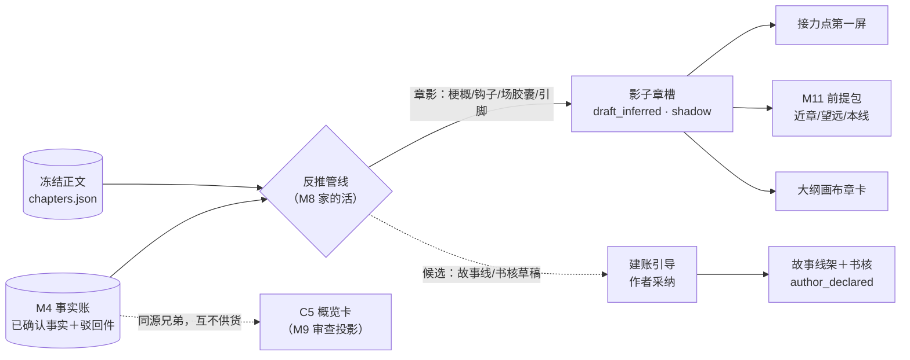

# 反向剧情图管线设计稿 R01（REVERSE_PLOT_MAP_DESIGN）

身份：**轻档设计稿，GAP-03 的设计单**（ADD-011 分流：「反向剧情图管线——存量章→影子章槽从哪来，日常循环的地基」）。回答一件事：**作者导入的存量章节，怎么变成规划账里可用的「影子章槽」**——章梗概、出口钩子、场胶囊、故事线、书核这些格子，哪些机器直接给、哪些等作者、错了怎么改、每章花几次调用。不是施工合同：字段沿用 [PLAN_LEDGER_STORAGE_DESIGN_R01.md](PLAN_LEDGER_STORAGE_DESIGN_R01.md)，本稿不发新前缀号；对存储稿的四条小增补集中列在第 8 节，交它 R02 吸收。

引用简写沿用走查稿口径：R02＝大纲结构稿、STORAGE＝存储稿、REVIEW＝审查概览稿、PACKER＝打包器稿、INTAKE＝导入分拣稿、REGISTRY＝停点注册表、走查＝[DAILY_LOOP_WALKTHROUGH_R01.md](DAILY_LOOP_WALKTHROUGH_R01.md)、ADD-XXX＝挂账本（小说架构仓，路径含中文，复制用）：`/Users/a1234/挣钱/小说架构/TEMP/bgboard-audit-20260809-r01/18_R07_ADDENDUM_LEDGER_20260813_R01.md`、捞货 XX＝19 号捞货同目录。

---

## 0. 一句话＋一张图

一句话：**反向剧情图就是给已经写完的章节补一份「贴着正文的大纲」**——正文为真、大纲为影，抽歪了是产品的错，产品的义务是抽出最靠近正文的影子（ADD-010 第 1 条原话）。接力点第一屏的「上次收在……」、前提包近章区的出口状态和梗概，全从这份影子里来；没有它，作者第一天打开产品就没有地面（走查第 0 天末尾的 ⚠️ 就踩在这）。



核心设计三句话（CZ 快读）：

1. **影子章槽的格子分三档**：机械件（章号、字数、槽章绑定）程序直接算；贴文件（章梗概、出口钩子、场划分＋场胶囊）每章一次调用整推、直接入影不设确认关——抽错是产品的错，改影不动文；推断件（故事线命名、书核、本章作用）只出候选，作者点头才进账。
2. **成本克制**：每章 +1 次调用、全书 +1 次故事线初建，积分并进导入时那一次预估知情；接力点、前提包、大纲画布全是纯读账，零调用。
3. **影子章槽和「现状卡」裁决为同一条管线的两个入口**：导入章反推＝建新槽（MVP 就做），写成章反推＝给已移交槽挂第二张脸（v2 随现状卡），产物同形同名叫「章影」，将来只接线不返工。

## 1. 三个名词先钉死（口径统一）

- **章影**：反推管线对一章正文产出的那包东西——章梗概、出口钩子、章末状态、场划分＋场胶囊、依据引脚。形状就是规划账章槽字段的子集，没有独立对象类型。
- **影子章槽**：章影安放进规划账后的槽形态——`source_identity="draft_inferred"`、`truth_bearing="shadow"`（STORAGE §3.1），进 `slot_sequence` 按章号占位，后续新计划槽从下一位接着长。
- **现状卡**：章影挂在**已移交槽**上的形态（新章写完后照正文再推一份，当第二张脸）。这是 STORAGE 开放三拍板里的「终态方向 B」（ADD-009 数据层三题），MVP 不做，第 7 节讲怎么接。

界面上不出现「反向剧情图」这个词（词典铁律：内部名不让用户学）；作者看到的就是大纲里带「从正文整理」角标的章卡。这个词在文档和代码里保留，为的是跟「作者大纲」划清界限——**成文里能看见的是实际结果，恢复不了写作前意图和删掉的伏笔；AI 推断的叙事作用单独标置信度；反向图和作者未来计划在页面上要一眼分得开**（捞货 25 全条照办，落法见第 2、4 节）。

## 2. 反推什么：格子逐个说来源，分三档

### 2.1 A 档·机械件（程序算，零调用，直接落）

| 格子 | 从哪来 | 说明 |
|---|---|---|
| 槽本体＋章绑定 | 程序建槽：`handover={chapter_id, handed_at, decided_by:"auto"}`、`slot_status="handed_over"`、映射落一行 `as_written`（`decided_by:"auto"`，reason 写「导入反推建槽」） | 为什么 `slot_status` 直接用 `handed_over`：这个枚举描述「槽和正文的绑定状态」，导入章生来就绑着正文；会不会误伤偏差机制？不会——偏差报告只认 `truth_bearing="handed_over"`（STORAGE §3.1 配套规则 3），影子槽是 `shadow`，天然不进偏差对账。不为此加新枚举值 |
| 章名／章号 | chapters.json 的 title／chapter_no | 导入分拣时已经识别过（INTAKE §4.1），不重判 |
| 实际字数 | 现算不落盘 | 派生值纪律，同容量灯（STORAGE §1.4 注①）；接力点的「9,909 字」就是它 |
| 依据引脚 | 章影每条产出自动带引脚指回出处（章 ID＋事实号） | STORAGE §1.10 原话：反推节点入账自动带引脚，抽取质量指标顺链算 |
| 入口状态（次章起） | 前一章的章末状态机械链推 | 章 N 开局的世界＝章 N-1 收尾的世界，程序抄一句，不请模型 |

### 2.2 B 档·贴文件（一次调用整推，直接入影，不设确认关）

每章一次「章影调用」，输入＝该章冻结正文＋该章已确认事实（含作者改写后的措辞）＋驳回条目及可选标签（负面清单：被驳的「是梦境或假设」件就是防错料）＋现有故事线清单（首轮导入为空）。产出：

| 格子 | 产出物 | 说明 |
|---|---|---|
| 章梗概 `summary` | 两三句，贴正文 | 不抄 C5 卡的梗概，理由见 §6 防第二真源第 1 条 |
| 出口钩子 `exit_hook` | 一句（接力点「上次收在……」的直接货源） | 「去现场」直接跳章末——钩子天然住章末，不用另存坐标 |
| 章末状态 → `exit_condition` | 一句「章尾世界定格在哪」 | 同一个格子两种读法：计划态读「必须成立什么」，影态读「已经成立什么」，方向由 `truth_bearing` 定——不加新字段 |
| 首章入口状态 `entry_state` | 一句开局状态（次章起走 A 档链推） | |
| 场划分＋场胶囊 | 场边界（章内原文区间坐标）＋每场：胶囊、地点、人物、POV | 边界坐标由程序校验连续、不重叠、不出章（同 INTAKE §1.4「模型提坐标→规则校验」纪律）。每场只填导航最小格；阻力／转折／情绪／对白要点全留 null——影子场没有下游消费这些戏剧格，填了白花 token（ADD-007：连账本都不必这么细） |
| 在场人物 | 末场 characters | 接力点「在场：陈更」的货源 |

**为什么 B 档不设确认关**，三个理由：

1. 它们不是真值——影不进事实账、不当铁律，在前提包里也只是近章导航（PACKER §1.2 ④区）；错了的最大伤害是误导一次出题，而出题有 P1 选项卡兜着。
2. 强制过目＝I-008 换个姿势复活：三章 × 十几个格子逐条点头，没人受得了；ADD-010 已经把责任判给产品（抽错＝产品的错），产品的义务是修，不是让作者签免责。
3. **影子的日常可见性本身就是审查**：接力点第一屏天天把钩子亮在作者脸上（走查屏 1），大纲画布章卡常驻（ADD-006 画布真身），错了第一眼就看到、点哪改哪——比一次性确认屏管用。掌控档作者要逐章过目，走 P17（第 4 节）。

### 2.3 C 档·推断件（只出候选，作者点头才进账）

| 产出 | 怎么给 | 为什么是候选不是直落 |
|---|---|---|
| **故事线初建** | 全书一次调用（吃各章影梗概，不吃全文）→ 1～3 条候选：建议线名＋成员＋各章归属＋上次现场建议。作者在建账引导里采纳／改名 → 建 L- 对象（`author_declared`），采纳动作同时把 `storyline_refs` 回填到各影子槽、`last_scene_ref` 落到线上。不采纳 → 默认建一条「主线」占位线（机械名，不算创造）挂全部章，保前提包本线区不断粮 | 线是第一过滤器（捞货 14），错线污染下游每个包；且命名是解读不是聚合——「师父与残灯」这种名字带主题判断，产品不该替作者宣布主线是什么（捞货 25 的边界）。候选量小（三章 1～3 条），确认成本三十秒 |
| **本章作用（AI 读法）** | 章影调用顺带给一句「这章在全书里干了什么」＋置信档（高／中／低），落槽上的展示件 `inferred_reading`（增补建议①，见第 8 节）；`goal` 保持 null。作者可一键把它填进 `goal`（记 author 改动留痕） | 这就是捞货 25「AI 推断的叙事作用单独标置信度」的落位。作用是意图层的解读，跟「发生了什么」不是一档事，混进贴文件会让影子冒充作者想法 |
| **书核引导补填** | **不自动生成。** 建账引导里留白＋提问（「一句话说这本书讲什么？」，提示语用类型标签＋各章影梗概拼）；旁边一个可选按钮「让 AI 起草一版」——单发花钱确认，产物标 `model_suggested`，作者改完认领才算数 | 书核进前提包铁律区（PACKER ②区），全书辐射面最大的一格；而「前提／题材承诺」是纯写作意图——正文里读得出「写了什么」，读不出「想写什么」（捞货 25）。走查第 0 天作者也是自己花二十分钟落的账，产品给梯子不代笔 |
| **追加导入章的线归属** | 后续再导旧章（如付费解锁 parked 章）时，章影调用的输入带现有线清单，顺带给「建议归哪条既有线」候选 | 首轮之后不重跑线初建；日常新写的章不走本管线（走移交，线归属由创作流出题时定） |

### 2.4 明确不反推的（边界，防第二真源）

- **伏笔不反推。** 伏笔是作者的债务登记（灵感账稿的判据：删了欠不欠账），成文里认不出「哪个细节是埋的」——自动挂伏笔＝替作者立债，还会给防泄底机制（安全摘要链，R02 §3.7）喂假底牌。走查第 0 天 H-0001／H-0002 就是作者手挂的，维持。
- **拍（PE）不建影。** 存量章「发生了什么」已经住在事实账（F 号，作者签过字的真值），再建一层影子 PE＝同一内容两个家。影子场 `pe_refs` 恒空表，场胶囊下面挂**引脚指 F 号**；前提包望远区对导入章的「覆盖 ID」写 F 号不写 PE 号（PACKER 示例里的 PE 覆盖写法只适用产品内创作的章）。
- **must_not／risks／写法挂件**：作者和创作流的地盘，留空。
- **卷不开**：`volumes_enabled` 照 Q2 拍板（约 30 章阈值，ADD-004），反推不动它。

## 3. 什么时候反推＋成本账

### 3.1 触发时机

1. **逐章：该章事实放行后自动跑。** 为什么等放行、不在抽取完就跑：章影要吃「作者改过措辞的已确认事实＋驳回件」——「林晚→林晚棠」的改写、「是梦境」的驳回标签都是防错料；抽取一完成就推，会把作者后来驳掉的梦境当真剧情写进影子。省心档不打扰：章卡角标从「已放行」翻「影子已就位」；掌控档走 P17 必停过目。
2. **批量：本次导入包内全部章放行后，跑一次故事线初建**，随后弹建账引导（故事线候选采纳＋书核留白提问＋伏笔／必写承接的手挂入口）。建账引导屏本体不在本稿（随接力点第一屏正式稿，GAP-12 族），本稿只定供料：线候选包＋书核提示语。
3. **未放行的章不建影**，接力点降级显示：章数字数照给（机械件不等人）＋一行「审完第 N 章，接力点就齐了」——把缺口当审查的动力，不做基于候选事实的「粗影」（省一遍双跑的钱；账里只有作者看过一眼的东西——同 ADD-009 数据层开放一的精神）。捞货 38 的「导入后 15 分钟内要能看见」够用：三章审查实走 5 分钟量级（REVIEW §1.7），影子紧随放行逐章长出来。
4. **导入目的分流接线**（INTAKE §6）：`purpose=consult`（查设定·检查）默认不跑反推，接力点给「一键补建」入口；`continue`／`browse` 跑。查证型用户的钱不白花。

### 3.2 成本账（每章几次调用，对着算）

| 动作 | 调用数 | 时机 |
|---|---|---|
| 章影整推 | **1／章** | 该章放行后自动 |
| 故事线初建 | **1／书**（吃梗概不吃全文，10 章导入也是 1 次） | 包内全部章放行后 |
| 书核起草 | 1／次 | 作者点了才跑 |
| 重推某章 | 1／次 | 作者点了才跑（F-5，见 §5） |
| 接力点／前提包／大纲画布 | **0** | 纯读账 |

对照基线：一章导入本来就要花约 4～5 次抽取调用（620–923 字责任段，3000 字章约 4～5 段）＋1 次概览卡顺路生成（REVIEW O3），即每章 5～6 次。反推加 1 次章影＋摊 1/3 次线初建，增幅**两成上下**；三章免费书全程共多花 4 次调用（3 章影＋1 线初建）。

**花钱确认怎么接**（不留 GAP-05 同款缝）：章影＋线初建的积分**并进导入／抽取开跑前那一次预估展示**——「拆解＋整理成大纲 预计 ~N 积分」，作者对整包知情一次，包内动作不逐章弹（预估制 ADD-002；「包内免逐弹」与 GAP-05 的会话级预估同方向）。重推、书核起草是单发动作，单发确认——建议登记 **F-5「影子重推／起草」**（F-4 已被 M8 出题设计单预订，ADD-011；编号以注册表发号为准）。免费层前三章的反推算进免费体验包——同「免费含一次轻量体检」的先例（ADD-009 第 2 条）；收费口径整体暂行（ADD-008 第 2 条），要收回随时能收。

## 4. 作者过目什么：分级＋停点 P17（不扩 P12）

### 4.1 过目分级（对齐第 2 节三档）

| 档 | 过目设计 |
|---|---|
| A 机械件 | 不过目——程序对，无语义可审 |
| B 贴文件 | 不设关卡，直接入影；靠日常可见＋点哪改哪兜底；掌控档可开 P17 必停逐章过 |
| C 推断件 | 必过作者手：故事线候选采纳、书核留白／候选认领、AI 读法一键填 goal——全是显式动作 |

### 4.2 新编号 P17，不扩 P12——理由写明

P12 管的是「**作者带来的大纲原稿**组织进规划账」：搬的是作者自己的话，确认的是「组织得对不对」，组织错了改一改就是。正文反推是**产品自产的影子**：确认的是「产品作业抽查」，抽错了是产品的责任（ADD-010）。两者触发时机不同（大纲原稿组织时 vs 章放行后）、对象来源不同（作者材料 vs 产品产物）、失败归责不同——硬塞进 P12 会让一行管两种语义，而且 P12 自己还是〔候选〕未设计，别给它加载重。

建议领 **P17**（P16 已被灵感账领走——[IDEA_LEDGER_DESIGN_R01.md](IDEA_LEDGER_DESIGN_R01.md) §9.1；按注册表格式给行，落号归注册表承办）：

| 编号 | 停点名（人话） | 在哪触发 | 省心档默认 | 掌控档默认 | 能不能改档 | 出处·状态 |
|---|---|---|---|---|---|---|
| P17 | 反推影子过目（正文整理成大纲后认一眼） | 章影落账／线初建候选就绪时 | 提醒不停（横幅「第 N 章影子已就位 ✎ 看一眼」） | 必停（逐章过影＋处置线候选） | 三档全开；C 档推断件的采纳动作不随档位自动，永远显式 | 本稿 §2/§4〔候选〕 |

设置页落位：「导入材料时」组，排 P12 旁边（一个管作者的大纲原稿，一个管产品的反推影子，摆一起正好让作者看清两回事）。

### 4.3 真值边界（不发明新的，两条现成的照走）

- **影子章槽认领升「作者声明」＝真值签字**：注册表第 2 节第 6 行现成（「旧稿反推节点升『作者声明』」），任何档位显式动作＋流水留痕。
- **故事线候选采纳、书核填写＝普通规划编辑**＋留痕，不是真值签字——规划账不是真值账（REGISTRY P12 行同款口径）。

## 5. 改错怎么办：改影不动文

场景：作者发现第 2 章影子梗概把一段梦境写成了真事。三条路，全在影子上，正文一个字不动（ADD-010：正文为真）：

1. **手改**：点格子直接改字。流水留痕 `actor:"author"`；槽整体身份不变（仍 `draft_inferred`／`shadow`）——除非作者显式点「认领这章大纲」（升 `author_declared`，走真值签字）。手改或认领过的槽**退出抽取质量统计**——指标只算纯产品产出的影（STORAGE §3.1「抽取指标只对影」的细化），别拿作者修过的算产品分。
2. **重推**：点「照正文重新整理这章」→ 花钱确认（F-5）→ 新章影整包顶上，旧影存进改动流水（增补建议③：流水动词加 `reinfer`，`changes` 存旧影快照——流水永不删改，STORAGE §7）。
3. **改上游**：发现影子错是因为事实就抽歪了 → 去审查台改事实（改写／驳回／改史，那边的签字流程管）→ 事实变更时程序反扫引脚（STORAGE §1.10 现成机制），受牵连章影亮 **stale 标**——过期是现算的（引脚目标的 `updated_at` 晚于章影 `updated_at` 即过期），不加存储字段；点了才重推，不自动花钱（同 P8 概览重生成的待遇，开放三专门讨论）。

**两轴独立铁律**（本稿钉的一条新口径，交 R08 吸收）：**`truth_bearing` 跟「这章有没有正文」走，`source_identity` 跟「谁背书这份描述」走，两轴不联动。** 所以「作者认领过的影子章槽」是 `author_declared`＋`shadow` 的合法组合——作者背书了这份描述，但正文仍为真（他改的是影，不是史）。STORAGE §3.1 那张表是**出生场景对照**，不是两轴绑定约束；这句写明，免得下游实现把两轴焊死。

正文本身改了怎么办（改稿重导）：归 GAP-01 单（[CHAPTER_REVISION_DESIGN_R01.md](CHAPTER_REVISION_DESIGN_R01.md)）。本稿只留接口：新版正文入库后，该章章影亮 stale 标 → 重推——同上第 3 条的机制，零新件。

## 6. 供货关系：谁生成谁消费（防第二真源）

| 对象 | 真源？ | 生成者 | 输入 | 消费者 | 生命周期 |
|---|---|---|---|---|---|
| 冻结正文 chapters.json | ✅ 发生了什么的最终证据 | M1 | — | 全线 | 永冻；改稿重导归 GAP-01 |
| 事实账（M4） | ✅ 已登记事项的真值 | M3 抽取→M5 签字 | 正文 | 全线 | 改史走签字 |
| **影子章槽（章影）** | ❌ 影 | 反推管线（M8 家） | 正文＋已确认事实＋驳回件 | 接力点、M11 前提包（近章 D0/D1、望远 D2 章胶囊、本线上次现场）、大纲画布、教程路 B「组织成我们的大纲形式给作者看」（ADD-001；速通里的时序随教程设计单定，本稿保证管线可单章调用） | 持久账目；stale→重推；引脚回指出处 |
| C5 概览卡（fact_snapshot） | ❌ 投影 | M9 | 事实账 | M5 审查台 | 快照，可过期可重生成 |
| 接力点第一屏 | ❌ 投影 | M5/M9 界面层 | 现算聚合（见下表） | 作者 | **不落盘、不可编辑**，每次打开现算 |

接力点六要素（捞货 38）的货源逐项对上：

| 要素 | 从哪来 |
|---|---|
| 现在写到哪（章数／字数） | chapters.json 现算（机械件，不等影子） |
| 上次收在（钩子） | 末章槽 `exit_hook`——影子槽或已移交槽，同一个格子 |
| 当前主线／出场者 | 故事线架 `line_status`＋`last_scene_ref` → 场 `characters` |
| 未结事项 | 伏笔账 H＋必写承接 MC＋偏差改期件——全是作者／创作流挂的，反推不产 |
| 明显风险 | 体检报告（M7） |
| 下一章可推进方向 | 「继续写第 N 章」入口（M8 出题） |

防第二真源三条：

1. **章影和 C5 卡是兄弟不是父子**：同源（正文＋事实）、各自生成、各归各家（规划账 vs 审查投影），互不抄袭。为什么不直接抄 C5 的梗概进槽省一笔：一是卡是审查投影、会重生成，抄＝建复制链，一头重生成另一头就陈了；二是钩子和场边界反正要一次调用，梗概搭同一班车零边际成本；三是槽梗概吃的是放行后净化过的输入（改写措辞＋驳回件），比审查开始时基于候选生成的卡更准。两边措辞小有出入不是事故——都是影，锚都指回同一处原文，点开见本尊。
2. **接力点不落盘不可编辑**：纯投影，点任何一行跳回账本本尊去改（画布是真身，ADD-006）。
3. **影子场不建 PE、不复制事实句正文**：场胶囊下挂引脚（F 号），点开现查 C4——同概览卡「卡上只装 ID 不装全文」的纪律（REVIEW §2.1 铁规一）。

## 7. 与「现状卡」终态：裁决＝统一，一条管线两个入口

STORAGE 开放三已拍（ADD-009 数据层三题）：已写成章 MVP 显示「计划卡＋已移交有偏差角标」（A），正文反推的「现状卡」是终态方向（B）、待管线成熟。本稿把这条线接完：

✅ **裁决：统一。** 章影管线只有一条，函数形状「给我章号 → 吐一包章影」；两个入口只差触发时机和落点：

| | 入口 A·导入反推（MVP 就做） | 入口 B·写成反推（v2，随现状卡） |
|---|---|---|
| 触发 | 存量章放行后 | 新章移交＋偏差对账完成后（收口流的时机，归 GAP-02 单） |
| 落点 | 新建影子章槽——这章唯一的一张脸 | 已移交槽的「当初的打算」原样不动（STORAGE §3.2 第 2 条），章影挂上去当**第二张脸**，视图可切换「打算／现状」 |
| 输入 | 该章正文＋已确认事实＋驳回件 | 同左（新章的） |
| 产物身份 | `draft_inferred`／`shadow` | 同左——挂件本身是影；槽的 handed_over 计划不被改写 |

为什么统一（对着「倾向统一」给硬理由）：输入同、输出形状同、义务同（贴正文，ADD-010 第 3 条「产品把新正文重新抽准入账」说的就是入口 B）、过期重推机制同——分两套就是两份 prompt 两处漂移，将来现状卡上线还得回头对齐口径。统一的代价只有一条：入口 B 的界面时机要等 GAP-02 收口流定，本稿先把数据形状钉死——**现状卡是挂在章位下的章影对象，不进 `slot_sequence`、不顶掉已移交槽**——到时候只接线不返工。顺序也顺了：影子章槽（入口 A）先上线把管线跑熟，现状卡（入口 B）等管线成熟，正是拍板里那句「待反向剧情图管线成熟」的成熟路径。

## 8. 对存储稿的增补建议（四条小件，交 STORAGE R02 吸收）

1. 章槽加可空字段 `inferred_reading`（obj/null）：`{text, confidence: high/mid/low}`——AI 读法的家，只影子槽用，别处恒 null。
2. 影子槽／影子场的 `goal` 按「可 null」用——影子没有义务替作者发明意图；请存储稿把这两格的可空口径补注。
3. 改动流水动词表加 `reinfer`（重推整章影子，`changes` 存旧影快照）。
4. 场加可空字段 `text_ref`（obj/null）：`{chapter_id, start, end}`，影子场专用，指回章内原文区间（INTAKE `source_ref` 同风格）——给「去现场」跳原文和将来场景卡用；计划场恒 null。

就这四条，没有新对象类型、没有新文件、没有新前缀。

## 9. 《雾都灯师》示例：第 3 章的影子章槽

沿用走查的书。第 3 章（残灯章）放行、且建账引导里作者采纳了故事线候选之后的账面（`storyline_refs` 是采纳时回填的，所以 rev 到 2；F 号按目标态 F- 风格写，现行 f001 过渡口径见 STORAGE §6.2）：

```json
{
  "id": "S-0003",
  "volume_ref": null,
  "title_hint": "第三章",
  "goal": null,
  "summary": "师父老崔失踪第七夜，陈更独守灯铺，翻出老崔留下的那盏残灯；灯油将尽，他擦拭灯身时发现灯芯上刻着自己的名字。",
  "entry_state": "老崔失踪多日，灯铺无主，陈更独自代守（链推自第 2 章章末状态）",
  "storyline_refs": ["L-0001"],
  "scene_refs": ["SCN-0005", "SCN-0006"],
  "exit_condition": "残灯已到陈更手上；灯芯刻名一事只有他自己知道",
  "exit_hook": "残灯灯芯上刻着「陈更」二字",
  "must_not": [],
  "risks": [],
  "target_length": null,
  "slot_status": "handed_over",
  "handover": {"chapter_id": "c03", "handed_at": "2026-08-15 21:40:00", "decided_by": "auto"},
  "inferred_reading": {"text": "把「师父失踪」从背景推成陈更必须接手的事，并交出全书最大的悬念物", "confidence": "mid"},
  "source_identity": "draft_inferred",
  "truth_bearing": "shadow",
  "created_at": "2026-08-15 21:40:00", "updated_at": "2026-08-15 21:58:00", "rev": 2, "note": ""
}
```

末场（只填导航最小格，戏剧格全 null）：

```json
{
  "id": "SCN-0006",
  "slot_ref": "S-0003",
  "goal": null,
  "summary": "陈更擦拭残灯，发现灯芯上刻着自己的名字",
  "location": "灯铺后间",
  "characters": ["陈更"],
  "pe_refs": [],
  "mood_in": null, "mood_out": null,
  "visual_hint": null, "dialogue_hints": [],
  "resistance": null, "turn": null,
  "pov": "陈更",
  "spoiler_notes": [],
  "word_estimate": null,
  "text_ref": {"chapter_id": "c03", "start": 2205, "end": 3348},
  "source_identity": "draft_inferred",
  "truth_bearing": "shadow",
  "created_at": "2026-08-15 21:40:00", "updated_at": "2026-08-15 21:40:00", "rev": 1, "note": ""
}
```

配套引脚一条（示意）：`{"owner_ref": "S-0003", "target_kind": "fact", "target_ref": "F-0048", "purpose_note": "出口钩子依据：灯芯刻名"}`——F-0048 即「残灯灯芯上刻着陈更的名字」那条已确认事实。走查第 1 天接力点上那行「上次收在：残灯灯芯上刻着『陈更』二字（第 3 章末钩子）」，货源就是这个槽的 `exit_hook`；第 4 章出题时前提包近章区的 D0 条目，也是它。

## 10. MVP 分期

### 10.1 降级阶梯（字段先行，形态后补——同 REVIEW 配图阶梯的做法）

| 档 | 形态 | 成本 | 判 |
|---|---|---|---|
| L0 零调用机械版 | 钩子＝章末尾窗截取；梗概＝空；场＝M2 责任段边界凑合 | 0 | ❌ 不当正式档：责任段是 620–923 字的机械窗（ARCHITECTURE M2 行），跟场景切换无关，会把一场戏拦腰斩——前提包拿到的「上次现场」是假现场。只留作章影调用失败时的兜底显示 |
| L1 一调用整推版 | 第 2.2 节 B 档全套一次调用出 | 1／章 | ✅ 推荐 MVP：接力点第一屏的质量整个押在钩子和梗概上，一次调用是最省的正经做法 |

直接回答走查里那个问号（「场划分 v1 直接用抽取时的 seg 边界凑合？」）：**不用。** 凑合的唯一收益是省调用，但钩子和梗概反正要一次调用，场边界搭同一班车零边际成本；seg 边界质量差，还白挂一个假现场进前提包。L0 只在调用失败时兜底。

### 10.2 MVP 做／不做

**做**：L1 章影调用＋落影子章槽；故事线初建候选＋「主线」占位线兜底；建账引导供料（线候选包＋书核提示语）；P17 登记；手改／重推（F-5）／认领／流水留痕；stale 亮标（事实改判顺引脚，现算）；接力点降级态（未放行章）；purpose=consult 不跑的道岔。

**不做（结构留位）**：现状卡挂载（入口 B，等 GAP-02 收口流）；整本工程档的反推分层（30 章以上导入按捞货 24 分层：近 7–10 章全推、中段只推梗概＋钩子、更远只留章胶囊——随整本工程单设计，本稿只保证章影可单章调用）；影子场的戏剧格反推；影子场景卡直出（M10 远期）；AI 读法批量刷新。

### 10.3 归属与排期建议（不越权）

模块归 **M8 家**——INTAKE §8 划的「M8／M9」里取 M8：写规划账的活都是 M8 的（M9 只产投影不写账）。施工排第五单头一件，跟 planstore 一起落（STORAGE §4.1 的 `mvp/planstore.py` 正好由它首用）。第四单（M9＋M5 概览化）期间，接力点先用机械件＋C5 卡出简版（章数字数＋审查状态）；第五单章影落地后补全钩子和主线两行。

## 11. 开放问题（交 CZ 拍）

**开放一｜免费层给不给完整反推？**
场景：免费用户导前三章，走完抽取审查。接力点第一屏这时候要是有钩子有主线（「你写到第 3 章，上次收在……」），他看到的是「它读懂了我的书」；要是没有，第一屏就剩章数字数，效果演示塌一半——可反推是每章一次调用的真金白银。
- A. 给：前三章反推算进免费体验（3＋1 次调用），激活时刻完整
- B. 不给：接力点简版，反推随付费解锁续写一起开
- 👉 推荐 A：免费层的使命就是看效果（ADD-002），接力点是效果的收口画面；成本每用户 4 次调用，比免费送的轻量体检还便宜（ADD-009 第 2 条先例）。收费口径整体暂行，随时能收回。【一致性修订 20260813】J2 追加：免费额度类讨论整体冻结待调查，本题按已暂定的推荐 A 执行、额度细节占位。

**开放二｜「AI 读法」默认亮出来还是折叠？**
场景：作者点开第 2 章影子，看到一行「AI 读法：这章在给女主线跟主线并轨铺路（置信：中）」。有人觉得被读懂了，有人觉得被指点江山——而且读歪了还容易带偏作者对自己书的理解。
- A. 默认显示（标置信，捞货 25 的字面落法）
- B. 默认折叠，点开才看；「一键填 goal」入口照留
- C. v1 不做这个字段，调用里也不出
- 👉 推荐 B：置信标解决「别当真」，折叠解决「别烦人」，两个都要；C 省的 token 很少（同一次调用里几十个字），却丢了建账引导里最好用的提示语来源。

**开放三｜影子过期后，自动重推还是手动？**
场景：作者把灯油设定从「记忆」改成「寿数」（改史 F-0012），第 2 章影子梗概里还写着「以记忆炼灯」，stale 标已经亮了——系统要不要顺手重推？
- A. 自动重推：影子永远新鲜（ADD-010 义务感的字面执行），但改一条事实可能牵好几章，积分不知情就花了
- B. 手动：亮 stale 标＋一键重推＋花钱确认，跟 P8 概览重生成同待遇
- C. 档位化：省心自动、掌控手动
- 👉 推荐 B：「花钱确认不进自动通过」是注册表 F 类原则，比新鲜度硬；stale 标挂着不撒谎，作者点了才花。A 等 GAP-05 的「会话级预估」口径（F-4）定了再升级不迟。

## 12. 来源与追溯

- 任务出处：走查 GAP-03＋ADD-011 分流（挂账本，小说架构仓，路径含中文，复制用）：`/Users/a1234/挣钱/小说架构/TEMP/bgboard-audit-20260809-r01/18_R07_ADDENDUM_LEDGER_20260813_R01.md`——另用 ADD-002（预估制／免费层）、ADD-004 Q2/Q5、ADD-006（画布真身）、ADD-007（执行包瘦）、ADD-008 第 2 条（收费暂行）、ADD-009（数据层三题／免费轻量体检／灵感账 P16）、ADD-010（真值方向性，本稿的宪法）。
- [DAILY_LOOP_WALKTHROUGH_R01.md](DAILY_LOOP_WALKTHROUGH_R01.md)：第 0 天影子章槽假设＋GAP-03 原文＋接力点／前提包的消费现场。
- [OUTLINE_STRUCTURE_DESIGN_R02.md](OUTLINE_STRUCTURE_DESIGN_R02.md)：章篮／场篮格子、Q5 来源身份同篮、胶囊原则。
- [PLAN_LEDGER_STORAGE_DESIGN_R01.md](PLAN_LEDGER_STORAGE_DESIGN_R01.md)：`source_identity`／`truth_bearing`／引脚／流水／移交五件套／开放三（现状卡）；本稿第 8 节四条增补交它 R02。
- [REVIEW_OVERVIEW_DESIGN_R01.md](REVIEW_OVERVIEW_DESIGN_R01.md)：C5 卡（兄弟投影）、梗概不用审的纪律、O3 顺路生成口径。
- [STOP_POINT_REGISTRY_R01.md](STOP_POINT_REGISTRY_R01.md)：P12 边界、领号规矩、真值签字第 6 行、F 类原则。
- [CONTEXT_PACKER_DESIGN_R01.md](CONTEXT_PACKER_DESIGN_R01.md)：近章区／望远区／本线区吃什么（影子的消费合同）。
- [INTAKE_SHELVES_DESIGN_R01.md](INTAKE_SHELVES_DESIGN_R01.md)：§8 归属（反向剧情图归 M8/M9）、§6 导入目的分流、§1.4 模型提坐标→规则校验纪律。
- [IDEA_LEDGER_DESIGN_R01.md](IDEA_LEDGER_DESIGN_R01.md)：P16 占号；[CHAPTER_REVISION_DESIGN_R01.md](CHAPTER_REVISION_DESIGN_R01.md)：改稿重导接口（stale→重推）。
- [../ARCHITECTURE.md](../ARCHITECTURE.md)：模块线路、M2 责任段（L0 判死的依据）、施工顺序。
- 捞货 24/25/38（小说架构仓，复制用）：`/Users/a1234/挣钱/小说架构/TEMP/bgboard-audit-20260809-r01/19_NOTION_V2_SALVAGE_20260813_R01.md`——存量接入分层、反向剧情地图命名与置信度、接力点六要素。

## 13. 轻档自查记录

- 七份必读逐一回对过：ADD-010 三条全落（正文为真→B 档直入影；抽错产品修→重推＋stale；接力棒→入口 B 统一）；捞货 25 三个半句各有落位（不叫作者大纲→§1 名词；置信度→`inferred_reading`；一眼分开→「从正文整理」角标＋C 档候选制）；捞货 38 六要素货源表齐（§6）；STORAGE 开放三的「前身／终态」口径统一成「章影两入口」。
- 字段核对：示例 JSON 的字段集合与 STORAGE §1.4/§1.5 一致（含公共七件），新增字段只有第 8 节四条且全部标增补建议；`handed_over`＋`shadow` 组合的合法性在 §2.1、§5 两处给了不误伤偏差机制的论证。
- 编号纪律：P17（查过 P16 已被灵感账领走）、F-5（F-4 已被 M8 单预订）均标「以注册表发号为准」，不自行续号；无新对象前缀。
- 成本自查：每章 +1、每书 +1、按需 2 种、读账 0——对照走查第 0 天三章场景共 4 次新增调用，基线约 12–15 次抽取＋3 次概览，增幅两成上下，§3.2 与本行口径一致。
- 走查兼容性：第 0 天收工状态（三个 draft_inferred 章槽、两条故事线、接力点完整）在本设计下可复现——线由候选采纳产生，发生在他那二十分钟建账引导内，时序不冲突。

来源：Cursor（Fable 5 Max）设计，2026-08-13；拍板真源始终是 CZ 账序。

修订记录：
- 一致性修订 20260813：开放一补 J2 冻结标注（免费额度讨论占位）。编号核对：P17/F-5 先占无争议，维持。设计稿群一致性巡检执行。
