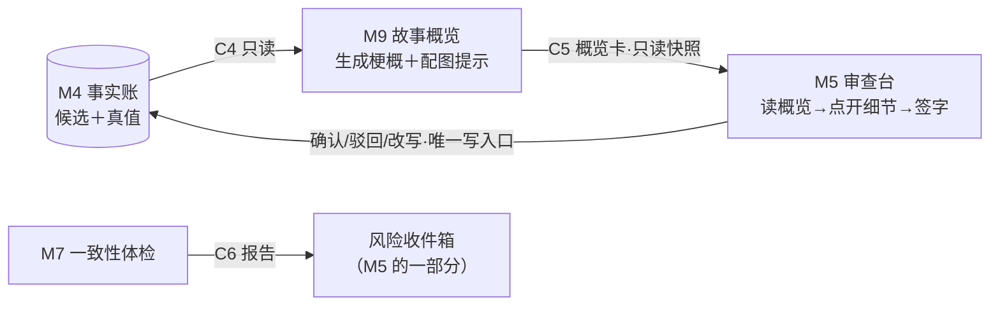

# M5 审查台＋M9 故事概览 设计稿 R01

身份：**轻档设计稿，给 CZ 过目，不是施工合同。** C5 部分是字段建议，落成合同文件前允许改。不动 [OUTLINE_STRUCTURE_DESIGN_R01](OUTLINE_STRUCTURE_DESIGN_R01.md)／[R02](OUTLINE_STRUCTURE_DESIGN_R02.md)。拿不准的地方标 ⚠️ 未调查／❓ 待拍板，末尾集中列开放问题。

---

## 0. 一句话＋一张图

这稿子解决一件事：**抽取完成后，作者怎么「像看一个作品」一样审完自己的书，而不是点一千多次确认按钮。**

I-008 的实测惨状：一次试用 102 条候选逐条点，真实作者不会干；库里六本书攒了 1352 条候选，逐条点是残酷的（[ISSUES.md](../ISSUES.md) I-008）。CZ 已拍的方向（ADD-002 Q1）：审查默认视图是「故事概览」——每章半屏 SVG 配图＋事件梗概，像看作品一样一眼判断满不满意；点开某一段才见事实句和细节；密密麻麻的全量清单保留但位置不显眼，给专业作者。类比：代码审查不能把全量 diff 拍在用户脸上。

【一致性修订 20260813｜F2 基调补写】概览的真正身份先钉死（ADD-012 F2）：**主产品是感官愉悦＋自我认知，效率是副产品。** 抽取侧把名场面解析成画面，让作者看到「我的故事是生动的、跃然纸上的」——这些解说画面卡还能形成投放抖音的解说素材（与场景卡是同源不同用的两个出口）；创作侧让作者自己先读一遍自己创造的故事，写正文时更顺畅。只列大纲太枯燥。本稿 §1.7 的「点击压缩比」按此口径读：那是顺带省下的力气，不是概览存在的理由。



一句话读图：M9 把事实账投影成「章概览卡」（C5，只读快照），M5 摆在画布上让作者读；体检报告（C6）进风险收件箱集中处理；作者的确认/驳回/改写是全线**唯一**能改事实状态的口子，写回 M4。

## 1. 审查的完整旅程

拿真实数据走一遍。《万鬼伏藏》（库里实测那本：李星燃，精神科，驱鬼）导入后抽出 200 多条候选，体检实跑出 3 条矛盾、2 条存疑。作者坐下来，看到什么、做什么：

### 1.1 第一屏：书封卡＋收件箱预览＋章卡流

第一屏不是清单，是**三样东西从上往下摆**：

1. **书封卡**：书名、几章、抽了多少条、审到哪了（「0/3 章放行」）、体检入口（勾选可选模块＋积分预估，ADD-002 Q3 口径）。
2. **收件箱预览条**：「有 5 个问题待看，其中 1 条顶撞已确认真值」——只报数，不摊开。点进去才是收件箱本体。
3. **章卡流**：每章一张概览卡，纵向排下去，第一章默认展开。

为什么这样排：捞货 38「当前接力点当第一屏」——先告诉作者「现在什么状态、哪里要你」，不是一上来倒知识图谱；捞货 39「高影响才请确认」——顶撞真值的问题放最显眼，几百条普通候选靠概览批量走。

### 1.2 章概览卡长什么样

一张卡约半屏（ADD-002 原话），从上到下四层：

| 区域 | 装什么 | 例子（第 1 章） |
|---|---|---|
| 配图区 | SVG 配图或排版卡（见第 6 节降级阶梯） | 诊室场景占位图 |
| 梗概区 | 章梗概 2～3 句，M9 生成 | 「李星燃在市医院精神科接受陈医生问诊；他实为天雷落下后穿越而来；来到这个世界一个月，炼了锁魂绳、画了符咒，准备驱鬼赚钱。」 |
| 事件条目区 | 3～6 条 beat（事件梗概），每条一句话＋角标 | ▸ 精神科问诊 ✓　▸ 穿越背景 ⚠1　▸ 驱鬼准备 ✓ |
| 动作区 | 「放行本章其余 N 条」「重生成梗概」 | 放行其余 34 条 |

卡上还有两个不起眼但必须在的东西：

- **散条区**：梗概没盖住的候选（「另有 2 条未归入梗概」），点开逐条看。为什么必须有：概览是给人省力的，不能变成藏事实的地方——每条候选要么被某个 beat 盖住、要么明着躺在散条区，程序机械校验这个覆盖率（见第 2 节铁规二）。
- **过期角标**：作者在细节层改了事实后，卡上的梗概可能已经不新鲜，亮「概览已过期」小标，点了才重生成（成本口径见开放问题 O3）。出处：捞货 29 只读快照带过期，R02 也已按此定了 C7 的 `basis_note`。

### 1.3 从概览进细节：点哪层看哪层

三层递进，全部是「点了才展开」，不点不摊：

1. **点 beat** → 展开这条梗概盖住的事实句列表（拿 beat 里的 fact_refs 现查 C4，不是读卡里的复制品）。
2. **点某条事实句** → 出单条动作（确认/驳回/改写）＋**证据抽屉**：逐字引文＋章节/段落坐标＋前后文窗口。看证据不调 AI、不计积分（捞货 37、54）。
3. **细节页签**：事实句页签之外留「戏剧作用」「分镜表达」页签位——这就是 R02 第 5 节说的「卡牌四层是细节层的里子」：胶囊两级管上下（粗看细看），四层管里外（同一剧情点的四种身份面）。审查场景默认停在前两层（原文证据、故事事实），后两层折叠。

### 1.4 签字动作：三个粒度，全部显式

| 粒度 | 动作 | 具体行为 |
|---|---|---|
| 单条 | 确认 ✓ | status → confirmed |
| 单条 | 驳回 ✗ | status → rejected，可选一键原因标签（见开放问题 O4） |
| 单条 | 改写 | 改事实句文字，改完即确认；原候选句备档进 note（C4 已有此机制） |
| 段级 | 「这段全对」／「这段抽错了」 | 该 beat 盖住的候选批量确认／批量驳回 |
| 章级 | 「放行本章其余 N 条」 | 本章所有**未被收件箱点名**的候选批量确认 |

两条配套纪律：

- **批量动作必带影响预览**：点「放行其余 34 条」先弹一屏「这 34 条是哪些」（可滚动扫一眼），再点一次才生效。这是捞货 6「确认两步：连排预览→逐条写入」的落地——凑一起看不等于必须同进同退，预览里可以剔除个别条再签。捞货 48「先给影响预览再确认」同族。
- **收件箱点名的条不进批量放行**：h003 涉及的 f077/f080 不会被「放行其余」裹挟着签掉，必须去收件箱单独处置。为什么：高影响错误零容忍（ADD-003 铁规精神），批量通道只给干净候选。

### 1.5 清收件箱

收件箱条目点开＝说明（为何亮）＋双方证据＋去向（next_step）＋处置动作。处置动作按灯分（详见第 4 节）：改事实、驳回候选、豁免（黄灯）、降灯（红灯）。每条带「去现场」按钮跳回对应章卡的 beat 焦点。

### 1.6 收工：通过态要看得见

全部章放行、收件箱清空后，第一屏变成通过态：「3 章全部放行，223 条已定（190 确认／33 驳回），体检 0 未决」＋下一步入口（取证问答、续写规划）。为什么专门写这条：捞货 21 原话「必须显示通过态，别做成只报错的问题墙」。

### 1.7 点击数对账（I-008 正面回答）

用 I-008 实测口径（一次试用 102 条候选，设 3 章）对比：

| | 旧流程（逐条点） | 新流程（概览审查） |
|---|---|---|
| 读 | 102 条事实句逐条读 | 3 张章卡（梗概＋beat）＋约 5 个收件箱问题 |
| 点 | 102 次确认 | 3 次章放行（含预览共 6 次点击）＋约 5 个问题处置＋散条零星几条 |
| 真判断次数 | 102 | 约 15 |

压缩比约 7 倍，且省掉的全是低信息量重复动作，留下的全是真判断。1352 条那个库级场景同理：六本书就是六摞章卡＋六个收件箱，不存在「1352 条排队」这个画面。

I-008 的解法拆开是四件套，各有出处：**概览代替清单**（ADD-002 Q1，读的密度降一个量级）；**连排预览→批量签**（捞货 6，签的次数降一个量级）；**高影响优先**（捞货 39，可疑条集中进收件箱先处理）；**零唠叨聚合**（捞货 21，同一问题一个条目，不是 30 条警告——详见第 4 节）。

### 1.8 清单模式：专业作者的密文字视图

全量事实句清单（近似现在 `cli.py confirm` 的逐条形态，加筛选排序）保留为「清单模式」，入口放章导航栏底部，不显眼。为什么保留：ADD-002 原话「密密麻麻的详细大纲依然存在，但位置不显眼，主要给专业作者」；有人就是要逐条过，产品不拦，只是不默认。

### 1.9 手机形态一句

三栏在手机上折叠成单列：章卡流是主体（天然适合竖屏滑），章导航收进抽屉，收件箱变角标浮层。手机伴侣的定位就是「确认/驳回事实」（ADD-002 Q5、捞货 56：手机＝审批＋查前情），章卡流正好是审批流。

## 2. C5 概览卡合同建议

### 2.1 三条铁规先立

1. **投影不是真源**：概览卡是 M4 事实账的只读快照，可物化、会过期作废；卡上不装事实句全文，只装 ID 引用（fact_refs），点开时现查 C4。要改事实回审查台动作区，禁止在卡上改出第二真源。出处：ARCHITECTURE 设计纪律 1、捞货 29。
2. **覆盖率机械校验**：M9 生成 beats 时必须引用真实存在的事实 ID；程序校验「每条候选 ∈ 某 beat.fact_refs ∪ orphan_refs」，盖不住的强制进散条区，防止概览把事实藏掉导致作者盲签。与 R02 选项消化清单的机械校验同思路（程序验机械，人验语义——ARCHITECTURE 纪律 2）。
3. **快照带过期标记**：卡记生成时的事实账时点（source_revision），账变了标 stale，重生成才翻新。R02 处置表明说「概览卡（C5）同理」承接捞货 29。

### 2.2 字段表（章级概览卡）

| 字段 | 类型 | 含义 | 必填 |
|---|---|---|---|
| contract / version | str | `"C5_OVERVIEW_CARD"` ＋版本 | 是 |
| card_id | str | 卡身份＋重生成轮次，如 `OV-c01-r1` | 是 |
| basis | str | **铁字段**：`fact_snapshot`（从 C4 生成，审查用）／`plan_snapshot`（从 C7 生成，教程/规划预览用）。防计划冒充事实（ARCHITECTURE 纪律 3） | 是 |
| chapter_ref | str | fact 路＝C1 章 ID；plan 路＝槽位 ref | 是 |
| title | str | 章标题 | 是 |
| synopsis | str | 章梗概 2～3 句（M9 生成） | 是 |
| beats | list | 事件梗概条目 3～6 条，子结构见下 | 是 |
| orphan_refs | list | 散条区：没被任何 beat 盖住的事实 ID。可以空，**不可省略**（铁规二的产物） | 是 |
| illustration | obj | 配图引用：`{kind, visual_hint, uri}`，kind 枚举见第 6 节 | 是 |
| stats | obj | 本章审查统计：`{total, extracted, confirmed, rejected, flagged}`；flagged＝被收件箱未决条目点名的条数（与状态正交） | 是 |
| risk_badges | list | 风险角标：**只有灯＋数量＋issue 引用**，`{severity, count, issue_refs}`；说明住收件箱（灯和说明分开，捞货 23） | 是（可空） |
| snapshot_meta | obj | `{source_revision, generated_at, stale}`；v0 的 source_revision 可用事实账最后变更时间 | 是 |

beat 子结构：

| 字段 | 含义 |
|---|---|
| beat_id | 如 `OV-c01-r1-b2`，卡内唯一 |
| text | 一句话事件梗概 |
| fact_refs | 这条梗概盖住的事实 ID 列表——**细节锚点**，点开就拿它现查 C4 |
| badge | 本 beat 最高灯（`red`/`yellow`/null）；null＝通过态 |
| visual_hint | 可选，本段画面提示（配图与教程分镜复用，见第 6 节） |

### 2.3 JSON 示例（真实数据：《万鬼伏藏》c01）

```json
{
  "contract": "C5_OVERVIEW_CARD",
  "version": "v0-draft",
  "card_id": "OV-c01-r1",
  "basis": "fact_snapshot",
  "chapter_ref": "c01",
  "title": "第一章",
  "synopsis": "李星燃在市医院精神科接受陈医生问诊；他实为天雷落下后穿越而来。来到这个世界一个月，他炼了七星锁魂绳、画了符咒，准备靠驱鬼赚第一笔钱。",
  "beats": [
    {"beat_id": "OV-c01-r1-b1", "text": "精神科问诊", "fact_refs": ["f001"], "badge": null,
     "visual_hint": "诊室白墙，白大褂医生提问，年轻人平静对答"},
    {"beat_id": "OV-c01-r1-b2", "text": "穿越背景交代", "fact_refs": ["f077", "f080"], "badge": "yellow",
     "visual_hint": "夜空炸开一道天雷，人影坠入陌生城市"},
    {"beat_id": "OV-c01-r1-b3", "text": "驱鬼准备", "fact_refs": ["f080"], "badge": null,
     "visual_hint": "桌上摆着锁魂绳与符纸"}
  ],
  "orphan_refs": [],
  "illustration": {"kind": "layout_card", "visual_hint": "精神科诊室，平静对话下藏着不属于这个世界的秘密", "uri": null},
  "stats": {"total": 38, "extracted": 36, "confirmed": 2, "rejected": 0, "flagged": 2},
  "risk_badges": [{"severity": "yellow", "count": 1, "issue_refs": ["h003"]}],
  "snapshot_meta": {"source_revision": "facts@2026-08-13T02:00", "generated_at": "2026-08-13T03:05", "stale": false}
}
```

（h003 是体检实跑出的时间线黄灯：f077「天雷落下后穿越」vs f080「来到这个世界一个月」，见 [C6 合同](../contracts/C6_HEALTH_REPORT.md) 真实示例。beat 允许共用 fact_refs——f080 同时讲了时间和驱鬼准备，两个 beat 都引用它，覆盖率校验按并集算。示例中的 beats 划分和 stats 数字是演示用的示意，事实 ID 和 h003 是真的。）

### 2.4 一件要说清的事：梗概自己不用审

梗概（synopsis/beats）是 M9 的模型产物，但它**不进真值账，不需要确认**——它只是地图。梗概错了不等于事实错了：作者发现梗概不对，动作是「重生成」或直接点进细节看事实句本尊。防梗概误导靠两样：铁规二的覆盖率校验（藏不住条目）＋每条 beat 可点开验证（锚点直达）。这样 M9 的质量问题不会污染真值层，也不给审查流程加一道「审梗概」的新负担。

## 3. 画布布局（按 ADD-006 交互模型）

### 3.1 布局图

```text
┌────────────────────────────────────────────────────────────────┐
│ 《万鬼伏藏》审查中   进度 0/3 章放行 · 收件箱 5（1 条顶撞真值）→点开│
├─────────┬─────────────────────────────────────┬────────────────┤
│ 章导航   │           主画布：章卡流              │  风险收件箱     │
│         │ ┌─────────────────────────────────┐ │ （默认收起，    │
│ 书封卡   │ │ ░░░░░ 配图区（SVG／排版卡）░░░░░  │ │   角标常驻）    │
│ 第1章 ⚠1 │ │                                 │ │                │
│ 第2章 ○  │ ├─────────────────────────────────┤ │ h001 🔴 人名    │
│ 第3章 ○  │ │ 梗概：李星燃在精神科接受问诊……    │ │ h003 ⚠ 时间线  │
│         │ ├─────────────────────────────────┤ │ n001 ？存疑    │
│         │ │ ▸ b1 精神科问诊            ✓     │ │ n002 ？存疑    │
│ ────────│ │ ▸ b2 穿越背景交代          ⚠1    │ │ …（共 5）      │
│ [清单模式]│ │ ▸ b3 驱鬼准备             ✓     │ │ 点条目＝说明＋  │
│ （不显眼）│ │ ▹ 散条区（0 条）                 │ │ 证据＋处置＋    │
│         │ │ ───────────────────────────────  │ │ 「去现场」      │
│         │ │ [放行本章其余 34 条] [重生成梗概]  │ │                │
│         │ └─────────────────────────────────┘ │                │
│         │  ▼ 点 b2 就地展开细节层：            │                │
│         │    f077 事实句 ＋[确认][驳回][改写]   │                │
│         │    f080 事实句 ＋…（点句子拉出证据抽屉）│                │
├─────────┴─────────────────────────────────────┴────────────────┤
│ 💬 聊天框 · 当前焦点：第1章 · b2「穿越背景交代」                   │
└────────────────────────────────────────────────────────────────┘
```

画布三原则怎么兑现（ADD-006）：**画布是真身**——章卡流常驻主画布，审查动作全部发生在卡上，不发生在对话气泡里；**点哪里哪里就是入口**——见 3.2 映射表；**聊天框万能入口、产出落画布**——见 3.3 落位表。

### 3.2 点哪出哪（对象→局部动作映射）

| 点什么 | 出什么 |
|---|---|
| 章导航一行 | 主画布滚到该章卡 |
| 书封卡 | 全书统计＋体检入口（勾选模块＋积分预估） |
| 章卡标题区 | 章级动作：放行其余／重生成梗概／本章进清单模式 |
| beat 一行 | 就地展开细节层（fact_refs 现查 C4 的事实句列表） |
| 细节层一条事实句 | 单条动作（确认/驳回/改写）＋证据抽屉（逐字引文＋前后文窗口） |
| beat 的 ⚠ 角标 | 跳收件箱对应条目——**不在原地展开说明**，灯和说明分开 |
| 收件箱条目 | 说明＋双方证据＋处置动作＋「去现场」跳回对应 beat 焦点 |
| 散条区 | 展开未归组候选，动作同细节层 |

### 3.3 聊天框：焦点跟随＋产出落位

聊天框常驻底部，标着当前焦点（点了 b2，焦点就是 b2），聊天默认作用于焦点对象——这就是防乱机制①「聊天框与卡片是同一对象模型的两种输入法」。产出固定落位（防乱机制②），举四个审查场景的例子：

| 你在聊天框说 | 产出落哪（不留在气泡里） |
|---|---|
| 「这两条为什么矛盾？」（焦点 h003） | 解释追加在收件箱 h003 条目下，带证据引用 |
| 「把这章带『孟诗研』的条目都列出来」 | 主画布切成临时筛选视图（带清除钮），列表长在画布上 |
| 「这段其实是梦境，别当事实」 | 生成一张**段级驳回提案卡**落在该 beat 下，作者点了确认才执行——AI 不代签（第 5 节边界） |
| 「第 2 章讲了什么？」 | 焦点跳到第 2 章卡（概览本来就在画布上，不重复生成一份） |

防乱机制③（出题频率受停点档位控制）在审查场景的对应：AI 主动开口的唯一固定位置是收件箱，绝不弹窗打断（见第 4 节）。

## 4. 灯与打扰纪律

### 4.1 灯从哪来：审查台自己不发明灯

审查台不跑判定逻辑，灯只有两个来源：

- **机械预检**（零 API 成本）：账本完整性（重复事实号）＋别名提示（写法只差一字的疑似同人，如《1979西北往事》实测 a001「周卫军/周新军」）。这些是 C6 里的机械部分，抽取完成后自动跑，第一时间进收件箱（推荐口径，随 O2 拍板）。
- **模型体检**（花积分，C6 的 conflicts/insufficient）：可选动作，作者勾选＋看积分预估后跑（ADD-002 Q3「体检是可选项」＋积分预估制）。

红黄的语义直接沿用 C6：红＝硬矛盾（同一事项被无解释推翻/明说设定被违反），黄＝疑似或低置信；「材料不足」单独进存疑账不混矛盾（C6 语义规则 1）。审查场景最值得先看的是 layer=mixed（候选顶撞已确认真值）——这就是「高影响优先」的机械抓手。

【一致性修订 20260813｜G7 口径】体检的家在导入口岸（ADD-013 G7）：本节的预检/体检全部发生在「导入→抽取→审查」这条进货动线上，属**进货检查**；产品内创作章的质量由生成时约束保证（打包器禁做清单＋选项消化＋程序校验），**不存在定期/例行全书体检**。新章正文粘回入库时的增量核对也算导入侧（见 M8 稿 §6.1 第⑦步）。§1.1 书封卡上的体检入口按同一语义理解。

### 4.2 灯和说明分开（捞货 23）

- **卡上只有灯**：章导航 ⚠1、beat 行 ⚠、收件箱预览条的计数。灯只管严重度和数量。
- **说明住收件箱**：为何亮、双方证据、下一步去哪（next_step），点收件箱条目才见。
- 好处：概览卡永远干净可读，作者扫一眼知道「哪里有事」，不被大段说明文字糊脸。

### 4.3 零唠叨＋豁免（捞货 21 落地）

- **同一问题只报一次**：一个人名不一致问题涉及 30 条候选，收件箱里是 1 个条目（涉事事实 ID 列在条目里），不是 30 条警告。C6 的 issue 合并（found_by 多组去重）已经做了单次报告内的聚合；跨轮重跑不再复读，靠下面的豁免表。
- **豁免（黄灯）**：条目上「豁免：这是故意的」，必填一句理由，可撤销。豁免记录建议落项目级 `waivers` 表（键＝kind＋涉事事实集合），M5 写、M7 重跑时读表过滤同键问题——这正好补上 C6 已知缺口「无豁免机制，重跑会原样再报」。属 C6 升 v1 方向，这里只给建议。❓ 待拍板（随 C6 升版）
- **降灯（红灯）**：红灯不可豁免消失，只能「降灯」（红→黄，提醒还在，要理由）或去处置（改事实/驳回候选/显式改判）。出处：捞货 21 原话「QC 降灯和 QC 豁免要分开，硬来源不能批量豁免」。
- **批量豁免**只对同键聚合的一组开放（同范围同原因），跨问题不给全选。

### 4.4 作者看到的状态词（捞货 47）

前台只有五个人话状态：**待审／可疑／已确认／已驳回／已放行（章级）**。quote 回填失败、JSON 截断复跑、api failed 这些内部码不见天日——要么翻译成人话进收件箱（「这条的原文依据没对上，建议看一眼」），要么只进日志。

### 4.5 停点档位在审查场景（接 R02 第 8 节编号，续 P6～P8）

| 编号 | 停点位 | 小白/免费默认 | 高级作者默认 | 备注 |
|---|---|---|---|---|
| P6 | 体检前置建议（抽取完成→建议先跑体检再审） | 提醒不停（横幅一条，可无视直接审） | 提醒不停（自己决定跑哪些模块） | 涉及花积分，任何档位都要知情确认才跑——花钱确认不进「自动通过」 |
| P7 | 放行前逐条过目锁（「本章必须逐条看过才允许放行」） | 关（章级批量放行为主） | 可自开（自我约束型停点） | 锁只约束自己，不改变签字语义 |
| P8 | 概览过期重生成 | 提醒不停（亮 stale 标，点了才重生成） | 同左 | 若重生成计积分则同 P6 待遇；成本口径见 O3 |

小白档 vs 高级档各看到什么（同一个画布，密度不同）：

| | 小白/免费档 | 高级/付费档 |
|---|---|---|
| 默认视图 | 章卡概览流（概览是通用展示原则，不是小白专属） | 同样概览流，可设「细节层默认展开」 |
| 事实句字段 | 句子＋证据，其余收起 | 全字段（来源模型、seg 坐标、入账时间） |
| 签字粒度 | 章级放行为主，单条随时可用 | 段级/条级细签，可开 P7 逐条锁 |
| 收件箱 | 红灯＋mixed 层黄灯在前，其余折叠进「次要提示」 | 全量可见，按灯/层/类筛选 |
| 清单模式 | 入口藏在导航栏底部 | 一键切换 |

方向对齐 ADD-005：小白默认省心顺畅，高级作者才细控；**但两档的差别只在「看多细、停多频」，不在「谁签字」**——签字边界见下节。

## 5. 确认的真值边界（对齐 ADD-005）

### 5.1 铁律一句：停点档位调的是签字的粒度和信息密度，不是要不要签

**真值签字类动作（任何档位都要作者显式点头，永不自动）**：

1. 单条确认／改写确认（候选 → confirmed）
2. 段级批量确认（beat 范围）
3. 章级放行（本章干净候选批量 confirmed）
4. 驳回，含批量驳回（rejected 也是账本判决，对称处理）
5. **改已确认事实（改史）**：比确认候选更重，加一道提示「这条已是真值，改动会让引用它的概览/体检结果过期」再签（弱版影响提示；完整影响传播是后话，捞货 20 记档）

批量为什么不违反签字边界：**批量是签字的粒度，不是代签**。作者点「放行其余 34 条」＝作者本人对这 34 条签了字（且签前有影响预览）；系统自动把置信高的候选转正才是代签——那条路被焊死（捞货 10「生产模型不得自签质量绿票」：将来 C3 就算加了置信分，也只用来排序提示，不能当免审凭证）。

### 5.2 不是签字的（可自动/可进档位）

概览卡生成与重生成（投影）；梗概分组、排序、视图切换；收件箱条目的已读/挂起；机械预检自动跑（零成本只读）；豁免/降灯——它们改的是**提醒系统**的状态，不是事实账，但因为有按掉真问题的风险，同样要求显式动作＋留理由＋可撤销。

### 5.3 第三类：花钱确认

模型体检、概览重生成（若计积分）不是真值签字，但涉及消耗，按 ADD-002 积分预估制：勾选时展示预估积分和时间，知情后才跑。它和真值签字一样不进「自动通过」，理由不同——一个护账本，一个护钱包。

## 6. SVG 配图的占位设计

### 6.1 配图从哪来（两条路）

- **审查场景（basis=fact_snapshot）**：M9 生成梗概时**旁挂**产出 visual_hint（一句画面描述，如「夜空炸开一道天雷，人影坠入陌生城市」）。依据：捞货 6「画面/情绪旁挂，不进事实句」——visual_hint 住概览卡（投影层），永不进 C4 事实账。
- **规划/教程场景（basis=plan_snapshot）**：C7 场对象自带 visual_hint（R02 场篮「画面提示」格，给 M9 配图和 M10 场景卡两用），M9 直接取用，不重复生成。

### 6.2 降级阶梯：字段先行，形态后补

| 档 | 形态 | 成本 | 状态 |
|---|---|---|---|
| L0a 排版卡 | 无图：章号＋标题＋氛围色带＋梗概排版；氛围色从情绪/题材词映射固定色板 | 零模型成本，纯前端 | ✅ 推荐 V0 起步 |
| L0b 模板 SVG | 确定性拼装：场景符号库＋人物剪影＋构图模板，按 visual_hint 关键词匹配 | 零模型成本，需先备图库 | ⚠️ 未调查：图库工作量、拼装效果没实测 |
| L1 文生图 | 每章一张风格化配图（SVG 化或位图） | 每张一次模型调用 | ⚠️ 未调查：文生图成本/延迟/积分定价都没实测，**不硬定** |

结构保证：`illustration.kind` 枚举（`none`/`layout_card`/`template_svg`/`generated`）从第一天就在 C5 里，配图升级只换 kind 和 uri，**合同不动**。这就是「占位」的含义——字段位留足，第一版用最便宜的形态跑通全流程。

### 6.3 跟教程分镜的关系

ADD-001 拍了教程要「边生成边附带 SVG 动画（图片形式）」，最后拼成有声动态分镜；旧拍板 D10 又说「第一版不做视觉生成」。两边这样接：**审查台 V0 停在 L0a 排版卡**（不等文生图，D10 的保守适用）；**教程线的 SVG 动画是独立承诺**（ADD-001 是新拍板，但成本形态 ⚠️ 未调查），两边共用 C5 的 illustration 结构和 visual_hint 链路——教程侧将来升 L1，审查台白捡，不用改合同。

## 7. 开放问题清单

**O1｜全书级一键放行给不给？**
- A. 给，审查动作最省
- B. 不给，章级封顶（👉 推荐）
- C. 高级档给、小白档不给
- 推荐 B 的理由：「先读后签」在章粒度还成立（一张卡一屏读得完），全书粒度就名存实亡；三章的书全书放行只比逐章省 2 次点击，签字含金量却清零。❓ 待拍板

**O2｜可疑分层的数据源——审查前跑什么？**
- A. 模型体检默认勾选（预估告知后跑）
- B. 全手动，作者自己决定
- C. 机械预检（完整性＋别名，零 API 成本）自动跑；模型体检默认推荐但知情确认（👉 推荐）
- 推荐 C 的理由：机械部分免费即时，「高影响低成本」的信号（重复号、别名）第一时间进收件箱；模型体检花积分，按预估制走。C3 v0 没有置信分（合同已知缺口），模型侧信号眼下只有 C6 这一个来源，别硬造第二个。❓ 待拍板
- 【一致性修订 20260813】G7 补注：本题问的「审查前跑什么」整个属于导入口岸的进货检查（含推荐 C 的模型体检），不是日常动作——G7 拍板后「体检当日常保养」的读法作废。

**O3｜概览梗概/配图的重生成成本口径？**
- A. stale 后自动重生成（体验顺，但花积分不知情）
- B. 手动触发＋预估告知（👉 推荐）
- C. 档位化：小白自动、高级手动
- 推荐 B 的理由：v0 梗概随抽取完成顺路批量生成一次（抽取本来就在花积分，梗概是小尾巴 ⚠️ 单卡 token 成本未实测），之后 stale 只亮标、点了才重跑，跟积分预估制一致。❓ 待拍板

**O4｜驳回要不要带原因标签？**
- A. 不带，点掉就走
- B. 可选一键标签：抽错了/重复/不重要/是梦境或假设（👉 推荐）
- C. 必填
- 推荐 B 的理由：原因数据能喂 M3 抽取器迭代（哪类错最多决定 prompt 往哪改）；但必填会把 I-008 换个姿势复活，故只做可选。❓ 待拍板

## 8. 来源与追溯

- 挂账本（小说架构仓，路径含中文，复制用）：`/Users/a1234/挣钱/小说架构/TEMP/bgboard-audit-20260809-r01/18_R07_ADDENDUM_LEDGER_20260813_R01.md`——ADD-002（概览审查 UX、体检可选、积分预估制、手机伴侣）、ADD-005（停点即设置＋真值签字边界）、ADD-006（画布真身/点哪问哪/聊天框落画布/防乱三机制）。
- [ARCHITECTURE.md](../ARCHITECTURE.md)：M5/M9 模块位、C5 合同位、设计纪律（唯一真源＋只读快照、程序验机械人验语义、计划不冒充事实）。
- [OUTLINE_STRUCTURE_DESIGN_R02.md](OUTLINE_STRUCTURE_DESIGN_R02.md)：胶囊两级读取（第 5 节）、卡牌四层是细节层里子、停点位 P1～P5（本稿续 P6～P8）、C7 的 visual_hint／basis_note。
- [C4_FACT_QUERY.md](../contracts/C4_FACT_QUERY.md)：事实账读取合同（M9 的输入）；改写确认的 note 备档机制。
- [C3_FACT_CANDIDATE.md](../contracts/C3_FACT_CANDIDATE.md)：候选无置信分（O2 的约束条件）。
- [C6_HEALTH_REPORT.md](../contracts/C6_HEALTH_REPORT.md)：灯/说明/证据/去向四分离、layer 三层、机械预检与模型体检的分界、无豁免缺口（4.3 的 waivers 建议对着它）；真实示例 h003/a001 直接用在本稿。
- Notion v2 捞货（复制用）：`/Users/a1234/挣钱/小说架构/TEMP/bgboard-audit-20260809-r01/19_NOTION_V2_SALVAGE_20260813_R01.md`——条目 21 零唠叨＋豁免、22 红灯四类、23 灯说明分开、29 只读快照带过期、35 三层信息密度、36 风险收件箱、37 证据抽屉、38 接力点第一屏、39 高影响优先、47 不暴露失败码、48 影响预览、54 看证据不计积分、6 画面旁挂、10 模型不自签绿票、20 影响传播。
- Notion requirements 捞货（复制用）：`/Users/a1234/挣钱/小说架构/TEMP/bgboard-audit-20260809-r01/20_NOTION_REQUIREMENTS_SALVAGE_20260813_R01.md`——概念 6 确认两步（连排预览→逐条写入）、概念 10 素材三层身份（待确认事实句＝「抽出来没点头」层）、概念 3 出场过≠长期追（人物榜类功能后置给 M7，本稿未纳入）。
- [ISSUES.md](../ISSUES.md)：I-008（本稿正面回答，见 1.7）、I-013（quote 未校验——证据抽屉 v0 的定位精度受它限制，段级坐标先跑）。

来源：Cursor（Fable 5 Max）设计，2026-08-13；拍板依据 CZ 2026-08-13 挂账 ADD-002／005／006。

修订记录：
- 一致性修订 20260813：§0 补 F2 基调段（概览=感官愉悦＋自我认知，效率是副产品，ADD-012 F2）；§4.1/O2 补 G7 口径注（体检=导入口岸进货检查，无定期档，ADD-013 G7）。设计稿群一致性巡检执行。
