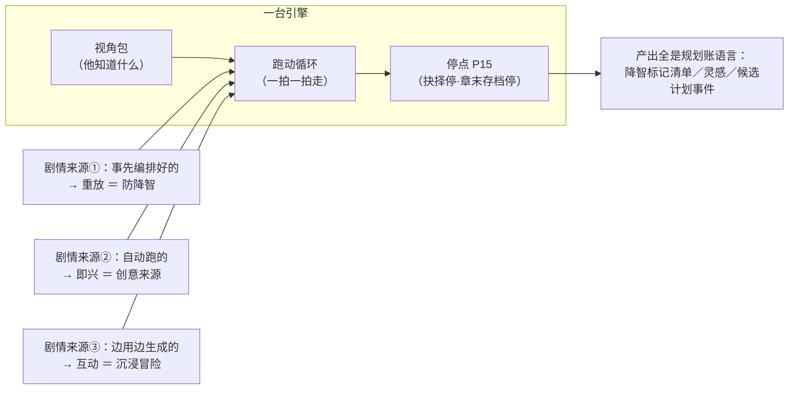

# 角色视角模式详细设计 R01（ROLE_POV_MODE_DESIGN）

身份：**轻档设计稿，候选，不产生执行权。** 这是总稿功能地图 **F12** 的宿主稿、停点注册表 **P15** 的宿主稿。✅ **版本排期已拍**（【一致性修订 20260813】ADD-017 **J6**，总稿洞-36 关闭）：**V1 只进「防降智重放」；创意跑和沉浸冒险 v2**——与第 7 节的排期建议同向，该节从「建议」升级为已拍口径的展开。

拍板本体：CZ 2026-08-13 03:08–03:15，ADD-008 第 5 条——推翻旧「导演／玩家／旁观」三身份（导演=编辑大纲本身；旁观=第三人称读小说，没什么可设计），真正的新东西是**角色视角模式**。挂账本（小说架构仓，路径含中文，复制用）：`/Users/a1234/挣钱/小说架构/TEMP/bgboard-audit-20260809-r01/18_R07_ADDENDUM_LEDGER_20260813_R01.md`。

上游衔接：[STOP_POINT_REGISTRY_R01.md](STOP_POINT_REGISTRY_R01.md)（P15 既有行）、[CONTEXT_PACKER_DESIGN_R01.md](CONTEXT_PACKER_DESIGN_R01.md)（C9 七分区——视角包的母体）、[M8_PLANNING_DESIGN_R01.md](M8_PLANNING_DESIGN_R01.md)（出题机制——抉择点的母体）、[IDEA_LEDGER_DESIGN_R01.md](IDEA_LEDGER_DESIGN_R01.md)（创意用途的落点）、[OUTLINE_STRUCTURE_DESIGN_R02.md](OUTLINE_STRUCTURE_DESIGN_R02.md) §3.7（伏笔账·安全摘要——知情边界的机制母体）。人物账详细设计（CHARACTER_LEDGER_DESIGN，专项单已派、稿未出）是本稿的数据地基，第 9 节列了给它的接口需求。

例子沿用设计稿一族的《万鬼伏藏》。**「王掌柜」是本稿为举例扩展的反派**（悦来棺材铺掌柜，卖出那批九口阴棺的人，知道「开棺有代价」的规则，不知道陈九棺已开了第一口）——与既有例子族（陈九棺守棺、老仵作听棺、师妹入局、爷爷遗忘、H-0005 心跳之谜）兼容，不与任何既有编号冲突。

---

## 0. 一句话＋核心三句

一句话：**让作者钻进故事里任何一个角色的脑袋，用「他知道的那点事」走一遍剧情**——旧剧情走一遍，立马看出他哪步蠢（防降智）；让他自己走走，看他想干什么（找创意）；或者作者亲自替他活一段（沉浸冒险）。



1. **引擎只有一台，玩法只由剧情来源决定。** CZ 拍死本质维度只有一个：剧情是**事先编排好的／自动跑的／边用边生成的**——「只有这些区别才产生了这些模式」（ADD-008 第 5 条原话）。三用途不是三个功能，是同一台引擎吃三种剧情来源：重放已编排的=防降智，自动即兴=创意来源，边用边生成=沉浸冒险。
2. **知情差是灵魂。** 该角色不知道的事，根本不装进他的视角包——防泄底最强的一手不是「叮嘱模型别说」，是「模型根本不知道」（伏笔安全摘要的核心思想，换个方向复用：从防泄底给读者，到防泄底给角色）。完整知情账是 v2（19 号捞货概念 12「改造吸收」），V1 用「出场推定＋例外表」凑，第 3 节给方案。
3. **全程沙箱，同一套账。** 跑动在视角沙箱里（章级沙箱机制复用，ADD-016 H3），生成的不直接进数据库；存了就变成规划账的候选（来源身份 `pov_run`，模型建议族），不存就丢——「依然生成大纲，用的是同一套规划账」（ADD-008 原话），不另立冒险存档的平行体系。

---

## 1. 模式入口与人称

### 1.1 三个入口（照 ADD-006「点哪里，哪里就是入口」）

| 入口 | 在哪 | 动线 | 主要服务 |
|---|---|---|---|
| **人物页**「以 TA 的视角跑一段」 | 人物账视图（H4）的常驻按钮 | 选起点（默认当前接力点）→ 选模式 → 开跑 | 创意来源、沉浸冒险 |
| **剧情段落**「换个视角看这段」 | 大纲编辑台／章工作台，选中一段已有剧情（章槽、场、一串计划事件或已入账事实）后的局部动作 | 选哪个角色的视角 → 重放 | 防降智（对象是剧情，所以入口长在剧情对象上） |
| **聊天框**万能入口 | 「让王掌柜从第 4 章开始走一遍」 | 解析成上面两种之一，产出落画布 | 兜底 |

为什么人物页是主入口：跑视角的第一个问题是「跑谁」，人物页手里正好攥着这个角色的全部材料（状态、动机、心理学标签、知情例外表）——数据在哪，门就开在哪。

### 1.2 人称三选：同一拍，三种外皮

人称是**渲染层不是数据层**——三种人称下的可见集、抉择点、账层产出完全同一套，只有叙述外皮不同。这与体检语气的裁决同族（ADD-012 F3：真源同一份，出口阐述不同）。

同一场景示例（第 4 章前夜：陈九棺深夜来棺材铺打听阴沉木的来路。王掌柜此刻可见集：知道上月出了九口阴棺、知道开棺有代价；**不知道**九棺已开第一口、不知道爷爷已遗忘）：

**第三人称「他」**（默认；防降智、创意用途的标配——保持观察距离，违和感看得冷静）：

> 王掌柜拨着算盘，眼皮都没抬。年轻人进门第三句就问阴沉木的来路——寻常客人不这么问。他心里把上个月那批货过了一遍：九口，一口没剩。「小哥，寿材看那边。」他把算盘一合，「这边的，不卖。」

**第一人称「我」**（代入检查——内心独白把动机摆到台面上，哪步不合理最刺眼）：

> 算盘珠子还在指头底下，我却听清了他的第三句话。阴沉木的来路。寻常客人不问这个。上个月那批货九口，一口没剩——这小子是从哪儿摸过来的？「小哥，寿材看那边。」我合上算盘。这边的不能卖，也不能让他再问下去。

**第二人称「你」**（沉浸冒险默认——游戏主持人腔，抉择点直接递到手上）：

> 你在柜台后拨算盘。进门的年轻人第三句就问到阴沉木的来路——你卖了三十年棺材，寻常客人不这么问。你想起上个月出的那批货：九口，一口没剩。
>
> 【你要怎么办？】
> ① 打发他去看寿材，暗中记下长相
> ② 套他的话，看他知道多少
> ③ 直说「这货不卖」，看他什么反应

**默认绑定＋设置可改**：防降智／创意默认第三人称、沉浸冒险默认第二人称，人称选择器摆在跑动设置里随时切（ADD-005 姿态：这类选择做成设置项，不做全局唯一答案）。三段示例共用同一可见集——注意没有一个字提到「开棺」「遗忘」：他不知道的事，任何人称下都写不出来。

---

## 2. 一台引擎：视角包＋跑动循环

### 2.1 视角包＝C9 的视角变体（角色知情切片）

总稿 F12 卡片原话：「视角包=该角色的知情切片＋当前场状态，天然比全知执行包瘦；角色知情过滤是它的前置能力。」落法：**共用 C9 打包机械，分区模板换成视角版**（PACKER §1.1 本来就说三种任务形态共用机械、模板不同——视角跑动是第四种模板）：

| C9 原区 | 视角包变体 | 装什么 |
|---|---|---|
| ① 任务卡 | 跑动卡 | 模式（重放/即兴/互动）＋角色＋起点＋人称＋作者临时约束 |
| ② 铁律区 | 公共铁律 | 世界规则里**该角色可知**的部分（公开规则全装；标了「秘密」的规则只装他知道的） |
| ③ 禁做区 | 不可知清单＋不可逆约束 | 🔥 新增**不可知清单**：对该角色未揭示的底牌，以安全摘要形态装入——「存在他不知道的隐情，叙述不得替他知道」，不含底牌内容 |
| ④ 近章区 | 他的近期经历 | 他在场的场次＋他被告知的事（出场推定＋例外表，见第 3 节） |
| ⑤ 本线区 | 他的现状 | 状态四元组＋动机＋面临的困境＋心理学标签＋做过的选择（防漂移）＋知情要点＋**误信条目** |
| ⑥ 望远区 | 他的个人史胶囊 | 他经历过的更早内容，每段一句 |
| ⑦ 回取索引 | 只列他可知的对象 | 不可知对象连索引行都不出现（索引标题本身可能泄底） |

包头新字段：`pov_character`（视角角色）＋`knowledge_basis`（可知集编译依据：出场推定截至哪一章＋例外表版本）——包是只读快照会过期，与 C9 的 `basis_note` 同族。

心理学标签在这里兑现价值：H4 拍板说「模型认识 NPD／焦虑型／INFP 这些标签，动机行为逻辑可解析」——跑动引擎替角色做选择时，依据就是本线区的动机＋困境＋心理学标签＋做过的选择。人物账越厚，跑出来的角色越像他自己。

### 2.2 跑动循环：一拍一拍走，抉择点是 M8 出题的角色版

```
装视角包 → 生成一拍（叙述呈现＋账层事件）→ 遇抉择点？
   ├─ 互动模式：停，把选项递给用户（P15 抉择停）
   ├─ 即兴模式：引擎按角色动机自选，走过路过留痕
   └─ 重放模式：没有抉择（剧情已定），换成「对照点」（4.1）
→ 循环 → 约一章的量 → 存档停点（P15 章末停）：问存不存
```

**抉择点的判定和出题，机械上就是 M8 出题的角色版**：M8 问作者「这张卡的剧情怎么走」，视角模式问角色「你现在怎么办」——选项是**角色可选的动作**（逃跑还是留下还是想办法，ADD-008 原话的例子），选项生成读的是他的动机、困境、心理学标签。不新造一套出题机械，M8 的选项合同（主推荐＋备选、程序校验）裁剪复用，只是折叠区的变更清单退化为「这一步对沙箱内状态的影响」——因为跑动全程在沙箱，不碰正式账。

**双层产出**：屏幕上是「戏」（叙述文本，像上面王掌柜三段——必须好看，防降智的违和直觉和冒险的沉浸感全靠它，同 ADD-012 F2「概览=感官愉悦」的基调）；账上是「事」（每拍背后一条计划事件草案：谁做了什么、什么变了）。**叙述文本的身份=预演材料，永不回流真值、不算正文**（同 20 号捞货 7「视觉产物不回流真值」的判法）——V1 不提供叙述文本导出。【一致性修订 20260813】那道「正文红线精确划界」合并待拍题已被 ADD-017 **J1** 关闭（口径：给要求给信息点、不给成文；红线＝不给写作模型、不生成正文）——但 J1 点名的是教程/台词扩写/场景卡三处，**未点名跑动叙述文本**；本稿维持「预演材料、不导出、不回流」的现行口径，它与 J1 红线的关系（沙箱内演给作者看的叙述算不算「生成正文」）列存疑清单交 CZ 一句话确认。

### 2.3 泄底双保险

1. **包里不装**（第一保险，最强）：不可知的事实、伏笔底牌、他没见过的场次，物理上不在包里——模型编不出它不知道的具体内容；
2. **产出扫描**（第二保险，机械）：每拍叙述文本过一遍「不可知清单」的专名／关键词扫描（拆书稿脱敏扫描的同款机械），扫中就地遮罩该拍重生成。挡的是字面泄底；语义级的「猜得太准」靠第一保险压基率，压不住的属于模型幻觉，作者肉眼兜底——程序不假装能验语义（ARCHITECTURE 纪律 2 的老实话）。

---

## 3. 视角的知情边界：V1 拼装方案

### 3.1 核心依赖与 V1 的取舍

19 号捞货概念 12（知情账／可见性）：「谁知道、怀疑、相信、误信、不知道……**降智检查＝角色决策时的可见集（含误信，才能区分『蠢』和『被骗』）**」——这就是本模式的灵魂依赖：该角色知道什么，才能演什么。但完整知情账（含群体知情边、五态区分）已裁定 v2（概念 12「改造吸收」＋概念 50「仅记录」＋总稿附录「完整可见性矩阵不捡、只存例外的轻量版并入长线账 v2」）。

⚠️ **V1 不等知情账，用三层拼装凑出「角色可知集」**：

| 层 | 机制 | 身份 | 例子（王掌柜） |
|---|---|---|---|
| ① 出场推定 | **机械可算**：事实的证据锚（或计划事件的场归属）所在场次，出场人物表含他 → 推定他知道 | 推定（可被例外表覆盖） | 九棺来铺里问过棺——王掌柜在场，知道「有个年轻人在打听阴棺」 |
| ② 公共信息默认可知 | 设定集世界规则默认全员可知；标了「秘密」的除外 | 机械 | 「镇上义庄停棺不入土」是常识，装 |
| ③ 例外表（作者手标） | 人物页两张小清单：「他还知道」（+人话一句）／「他不知道」（覆盖出场推定）；每行都是作者声明身份 | 作者声明 | 还知道：「开棺的代价规则——他卖棺时就清楚」；不知道：「九棺已开第一口」 |

为什么这么拼：①是零成本的机械近似，覆盖大头（角色知道的绝大多数事就是他在场看见的）；③只记例外——正好是总稿附录裁定的「只存例外的轻量版」方向，将来知情账 v2 建成时，例外表原样升格迁移，不是丢弃重做。防降智场景下这套拼装的误差可接受：推定错了顶多误报一条「他不该不知道」，作者一眼能判、顺手在例外表补一行——**误报本身在给例外表攒数据**。

### 3.2 误信的 V1 轻量落法

概念 12 要求误信的「说法内容」独立成信息项（不能只贴 false_belief 标签）。V1 不建独立误信对象，例外表里一行人话搞定：

> 误信：「他以为买棺的年轻人是替长辈置办寿材（真相：九棺在找封着自己名字的阴棺——别让他知道）」

跑动时**误信内容装包、真相不装包**（真相进不可知清单）。降智判定用「含误信的可见集」——王掌柜按错误认知行动不算蠢，算被骗；这正是概念 12 说「才能区分蠢和被骗」的落地。

### 3.3 与安全摘要的关系：两根轴，一套机制

既有伏笔账管**读者可知**（读者可知标记＋安全摘要，防向读者泄底——词典已有词条）；本稿加的是**角色可知**轴（防向角色泄底）。两根轴独立：一条底牌可以「读者已知道、角色还不知道」（读者看着王掌柜蒙在鼓里干着急——这正是知情差戏剧的日常形态）。机制完全同构复用：都是「下游只拿脱敏提示，不含底牌内容」。V1 落法：伏笔账不加新字段，角色可知走 3.1 三层拼装；伏笔底牌默认进所有非知情角色的不可知清单，除非例外表声明「他知道」。

---

## 4. 三用途＝三种剧情来源下的三种跑法

### 4.1 防降智：重放已编排的剧情 → 降智标记清单

**跑法**：作者在剧情段落入口选「王掌柜」＋选一段已有剧情（产品内创作的计划事件流，或导入书的已确认事实流＋反向剧情图——后者是最大用武之地：检查旧稿里的反派是不是工具人）→ 系统以王掌柜视角**重放**。剧情已定，引擎不生成新剧情，每一拍做的是「反事实对照」：

1. 亮出他此刻的可见集（他知道什么、误信什么、手里有什么、他的动机）；
2. 陈述剧情里他实际做了什么——**包括「什么都没做」（不动也是决策）**，CZ 原话的降智典型就是「这角色怎么一直不动？我看到主角做 XX 了肯定要有反应」；
3. 引擎以他的身份答一遍「此刻我最想做什么」，与实际行为对照——差距大就打标记。

**产出＝降智标记清单**（视角体检单），每条五件套：

```
【标记 2】位置：第 5 章场 3 之后
他当时知道：有个年轻人在打听那批阴棺（第4章亲见）；老仵作连夜出镇（伙计回报）；
           开棺有代价（例外表：卖棺时就清楚）
他实际做了：（第 5–6 章无任何动作）
违和点：靠这批棺发家的人，眼看棺主追上门、知情人跑路，两章按兵不动——
       以他的精明（做过的选择：当年压价收棺）说不通
机会：他该动了。找上门？给谁报信？连夜盘账？——他的每个动作都是一段新剧情
去向：[进第 6 章要点货架] [记成灵感] [标「故意的」→ 顺手记他的隐藏动机]
```

呈现口径按 ADD-013 G4 钉死：**报「机会」不报「错误」**——降智点就是现成的剧情机会（「因为有矛盾才会有剧情」）。修复建议三型：补动作（让他动起来）／补理由（给「不动」一个故事内解释）／补知情差（原来他不知道——例外表加一行，很多「降智」其实是作者忘了他不知道）。

重放没有抉择停点：它更像批处理，一口气跑完出清单（长段落跑之前报预估积分，走 6.4 花钱户口）。标记卡一键进对应章的要点货架（kind=剧情机会，与 M8 §2.3 机会卡同族同通道）。

### 4.2 创意来源：自动跑＋随时插话

**跑法**：人物页选「王掌柜」＋起点（默认当前接力点）→ 即兴模式开跑：引擎按他的动机／心理学标签自动做选择，一拍一拍往前演，作者旁观。作者随时暂停插想法，想法两个去向：

- **轻**：记灵感——「王掌柜跟老仵作是旧识！仵作出镇前会去棺材铺打招呼」→ 一键进灵感账（IDEA-*，「删了不欠账」的愿望身份，灵感账机制原样）；
- **重**：转向指令——「就按这个走：仵作真的来了铺子」→ 引擎吃进指令，从这拍起改道继续跑（只影响本次沙箱，不动任何账）。

跑完约一章到存档停点。创意用途的典型结局是**不存整段、摘着拿**：停点界面给「摘条目」动作（勾几拍进灵感账或直接挂某章候选要点），剩下丢弃。为什么默认不整存：即兴推演是抛砖引玉的砖，价值在激发的那几个想法，整段存下来反而变垃圾账（ADD-007：账本可以细，不等于什么都进账）。

### 4.3 沉浸冒险：边用边生成

**跑法**：人物页选「王掌柜」→ 互动模式：第二人称开跑，关键抉择必停等作者选（P15 抉择停：逃跑还是留下还是想办法），其余自动；约一章到存档停点问存不存。挂**互动叙事节奏包**（见第 5 节）。

**产出依然是规划账语言**（ADD-008 原话「依然生成大纲，用的是同一套规划账」的落法）：存档时整段跑动折成「候选支线」——一条故事线线头（王掌柜支线 L-x；视角切换本来就是 H1 拍的开新线判定之一）＋若干计划事件（候选）＋章槽草案（可选）。来源身份 `pov_run`（模型建议族——用户在抉择点选过不等于作者声明了剧情，选择记录留痕）。作者后续在大纲编辑台把它编进正式章序（槽位映射机制现成）——冒险爽完，账还是那套账。

### 4.4 三用途 × 本质维度对照（收拢）

| 用途 | 剧情来源（CZ 拍的唯一维度） | 引擎模式 | 抉择点行为 | 典型产出 |
|---|---|---|---|---|
| 防降智 | **事先编排好的** | 重放 | 无抉择，换对照点 | 降智标记清单 |
| 创意来源 | **自动跑的** | 即兴 | 引擎自选，作者可插话改道 | 灵感条目、章候选要点 |
| 沉浸冒险 | **边用边生成的** | 互动 | 必停等用户（P15） | 候选支线＋计划事件（同一套规划账） |

---

## 5. 运行节奏与体裁节奏包

**停点两档（P15 的细化，提交注册表回填）**：

- **抉择停**：互动模式必停（抉择即玩法，注册表原话「关键抉择标死必停」）；即兴模式默认不停（引擎自选留痕），作者可在设置里调密（「重要抉择也问我」——密度可调，机制同 P1 族，注册表原话照办）；重放模式无此停点。
- **章末存档停**：三模式统一，跑完约一章的量必停问存不存（重放的「一章」按重放范围分段）。「约一章」的量按目标字数预估折算（默认沿用书级 `target_length`），不是精确闸门。

**互动叙事节奏包（H6 拍的节奏包，本模式的标配）**：ADD-016 H6 拍了体裁节奏包可解耦——互动叙事／游戏闯关的节奏是「一直往后走、定期停点即可」。落到跑动引擎的节奏约束：

- **定期停点**：每隔一段给一个抉择或阶段感，节奏平稳推进；
- **不要哑谜钩子**：网文的章末钩子是设计给「要等下一章」的读者的；互动用户点一下就继续，吊胃口无意义——停点前给的是**明确的抉择或阶段收束**（「棺材铺的灯灭了。你打算今夜动手，还是等他先动？」），不是「欲知后事如何」；
- 插件化（ADD-014）：节奏包是插件，跑动生成层取它的简短层（停点密度＋推进节奏要点，50 字级），不是全文教法。

**转网文的桥**：H6 拍了「互动叙事跑出的剧情想写成网文→用网文节奏微修（加钩子、起伏）」。落点在存档动作上：沉浸冒险存为候选支线时，可选「按网文节奏重排」转换步骤（插件化调用）——把平稳推进的事件流重切成带章末钩子、起伏节拍的章槽草案。V1 只留按钮位，转换插件随节奏包体系落地。

---

## 6. 存不存的语义

### 6.1 全程视角沙箱

跑动在**视角沙箱**里进行——章级沙箱机制原样复用（ADD-016 H3：这一章本来就在沙箱里进行，生成的不直接进数据库；天然可多开）。多开的直接用法：王掌柜视角和师妹视角各跑同一段，并排看两边的知情差——这本身就是找戏的方法。旧 D33 边界在此全部兑现：**沙箱、只加载角色知情、新设定只算候选**（总稿附录裁定它是本模式的地基）。

### 6.2 存了变成什么（按用途分流）

| 用途 | 「存」的语义 | 落到哪 |
|---|---|---|
| 防降智 | 存的是**标记清单**不是剧情 | 标记卡进对应章要点货架（剧情机会）／灵感账；「标故意」的顺手记隐藏动机（O1） |
| 创意 | 摘条目 | 灵感账（IDEA-*）／某章候选要点；整段默认不存 |
| 沉浸冒险 | 整段折成候选支线 | 规划账：故事线线头＋计划事件（候选，`pov_run` 身份）＋章槽草案；叙述文本存为「跑动回放」（预演材料，不回流真值，可重看） |

真值边界一次说死：**跑动永不写事实账。** 跑出来的新设定点子（「棺材铺地窖里还有一口棺」）一律是候选提案，走设定集既有确认通道（D33 原话「新设定只算候选」）；`pov_run` 计划事件要升作者声明，走来源身份认领的既有通道（注册表第 2 节#6）。停点放行的是跑动节奏，不是真值签字（ADD-005 铁边界原话）。

### 6.3 不存的丢弃留痕吗

**默认真丢，只留两样**：积分流水一行（花了钱，账要查得到——ADD-012 F7 详情跳转的原料）＋跑动登记一行（时间／角色／模式／起点／章数／丢弃——给「我上次跑过什么」一个可查的目录，也给 O1 的「连跑同段」判重用）。叙述文本和事件流本体删掉。丢弃前给一个顺手动作：「摘几条进灵感账再丢？」为什么不整存留档：不存的推演堆起来就是垃圾账本，翻旧推演找灵感的需求真出现了再加「回收站 N 天」，V1 不预支这个复杂度。

### 6.4 花钱户口（按推荐暂定，提交注册表 F 类领号）

跑动是连续多次调用的场景，形态与 M8 规划会话同族，照 **F-4 会话包先例**办：开跑报一次预估（按模式和目标量折算：重放按段落长度、即兴/互动按「约一章」），包内每拍生成、抉择出题、扫描重跑免逐次确认；累计达预估 120% 追加确认。提交注册表领号（F-5 已被反向剧情图占用；【一致性修订 20260813】注册表 §5.1 已按序补号 **F-8**〔候选〕给本会话包）。

---

## 7. 排期（✅ 已拍——【一致性修订 20260813】ADD-017 J6：V1 只进防降智重放，创意跑＋沉浸冒险 v2；洞-36 关闭。本节原「建议」与拍板同向，保留为展开说明）

**顺序：防降智 → 创意来源 → 沉浸冒险。**

| 阶段 | 做什么 | 为什么先/后 |
|---|---|---|
| 第一步：防降智（建议 v1.5 候选，随体检家族深化） | 重放模式＋视角包＋V1 知情拼装＋标记清单 | ①最像作者工具（北极星：V0 专心伺候写作者；ADD-008 原话「首先是作者工具」）；②**依赖最少**——重放不需要即兴生成引擎，剧情是现成的，只需「视角包＋对照评估」两个调用件；③直接服务最强付费点——概念 12 说降智检查是人名/时间线/设定之外的「第四类硬问题」，它是一致性体检的深化；④V1 知情拼装的误差在此场景可接受（误报作者一眼能判，还反哺例外表） |
| 第二步：创意来源（建议 v2） | 即兴模式＋插话改道 | 依赖自动跑的生成质量（角色演得像不像），要人物账铺开（心理学标签、做过的选择）＋M8 出题质量实验（§1.6）的读数垫底 |
| 第三步：沉浸冒险（建议 v2 之后，消费向延伸） | 互动模式＋节奏包＋存档全套 | ①消费向是延伸不是主业（与 Q7「V0 不做读者入口」的关系按 ADD-008 处理：作者自用的冒险不算读者入口，但它的完整体验依赖互动节奏包、P15 全套、知情账 v2——欠的地基最多）；②转网文桥依赖节奏包体系 |

一句话版本：**防降智是「拿现成剧情跑评估」，最便宜也最刚需；沉浸冒险是「实时生成一整段互动叙事」，最贵也最靠后。** 洞-36 的三个选项里，这对应「独立更早（防降智是作者刚需）＋消费向随远期」的组合拍法。

---

## 8. 开放问题（交 CZ 拍）

**O1｜「假降智」怎么防：报违和之前，要不要先查伏笔账？**
场景：王掌柜眼看九棺买走第二口棺却按兵不动——从他的可见集看是降智；但作者就是安排他此刻不动（他在下更大的棋，隐藏动机还没揭）。系统不知道，报了「机会」，作者觉得被烦。
- A. 不查，全报，作者点「标故意的」压掉（同条不再报）
- B. 报之前先查伏笔账：该角色若挂着未揭示的隐藏动机／底牌，相关标记静默跳过
- C. B ＋ 作者点「标故意的」时顺手问一句：「要不要把他的真实动机记成一条伏笔？」——没记过的隐藏动机就地入伏笔账
- 👉 推荐 C：先查账（有现成解释就闭嘴，防重复打扰）；查不到才报；作者标「故意」的那一刻正是他脑子里有隐藏动机的一刻——顺手收进伏笔账，降智报告就成了伏笔生产线。「故意的降智」和「真降智」的区别，本来就是「作者心里有没有账」。

**O2｜沉浸冒险跑出的剧情撞了主线怎么办：跑的时候拦，还是存的时候对账？**
场景：作者以王掌柜身份冒险，跑出「王掌柜一把火烧了义庄」——把已计划的第 8 章主线（义庄开棺）撞没了。
- A. 跑动时就把主线不可逆锚装进禁做区，引擎根本不让剧情走到撞车——冒险永远「安全」
- B. 跑动自由（禁做区只装世界规则和已发生的不可逆事实，不装未来计划），存档时对账：与既有计划冲突的亮出来，作者三选（当平行灵感存着／真香、改主线迁就它／丢弃）
- 👉 推荐 B：冒险的价值就在「如果他这么干会怎样」，把未来计划当铁律装进去，跑出来的永远是主线的复读机；撞车本身是剧情机会（G4 的哲学在这里同样成立——王掌柜真会烧义庄，说明主线低估了他）。沙箱本来就是干这个的：跑时自由，入账把关。

**O3｜账太薄的角色（NPC）能不能跑？**
场景：作者想以「棺材铺伙计」视角跑一段找灵感——但 H4 拍了 NPC 只填功能一句话（男、二十岁、负责传话），没动机没心理学标签，引擎没材料，跑出来必然是白开水。
- A. 拦掉：只有人物账达标（动机＋困境＋至少一条性格/标签）的角色才给跑
- B. 能跑，跑前弹一句：「这个人物的账太薄，跑出来会很水——花一分钟补三个字段（动机／困境／性格）再跑？」补了就跑，不补也放行
- 👉 推荐 B：跑视角反过来是**人物卡的补全引擎**——作者为了跑得好看，心甘情愿把 NPC 补成配角；拦掉则把这个正循环掐死了。放行线只设一条硬的：连名字都没有的临时实体不给跑（没有账就没有视角）。

---

## 9. 登记提交与接口需求（只接口不越界）

| 提交给谁 | 内容 |
|---|---|
| 停点注册表 | P15 升〔已设计〕，宿主＝本稿第 5 节；行为细化：抉择停只属互动模式（即兴可调密、重放无）；章末存档停三模式统一 |
| 停点注册表 F 类 | 视角跑动会话包（6.4，照 F-4 先例），领号归注册表承办 |
| 人物账设计单（进行中） | 接口需求三件：①例外表（「他还知道／他不知道／误信」三清单，作者声明身份，3.1/3.2 的形状）；②「以 TA 的视角跑一段」按钮位；③跑动引擎要读的字段清单（动机／困境／心理学标签／做过的选择）——请该稿把这几个字段的「消费场景标签」标上视角跑动（H4 拍的字段按消费场景打标签，正好用上） |
| 存储稿升版 | `pov_run` 来源身份枚举；跑动登记表（6.3 一行式）；故事线线头的候选身份（4.3） |
| 打包器 C9 | 视角包分区模板（2.1）＋`pov_character`/`knowledge_basis` 包头字段——随 F12 施工时作为 C9 的第四种任务模板落地 |
| 词典 | 候选词条：视角包／角色可知／不可知清单／例外表／降智标记清单／视角沙箱／跑动回放（预演材料）；「安全摘要」词条建议补一句「角色可知轴同构复用」 |
| 总稿 R08 吸收时 | F12 卡片补指针指本稿；洞-36 挂本稿第 7 节建议待拍 |

模块号（M 系）随施工单领，本稿不占。

---

## 10. 轻档自查记录

- 任务书八问逐一回对：①入口与人称三示例（§1，同一可见集三种外皮）；②三用途三跑法（§4，防降智产出=降智标记清单五件套、创意=灵感账/转向指令双档、沉浸=同一套规划账候选支线）；③知情边界（§3，V1 三层拼装＋误信轻量落法＋安全摘要两轴同构）；④运行节奏（§5，P15 两档细化＋三维度关系表 §4.4）；⑤存不存语义（§6，按用途分流＋丢弃留痕两行）；⑥节奏包关系（§5，H6 定期停点/不哑谜钩子/转网文桥）；⑦排期建议（§7，防降智最先＋❓待拍原样保留）；⑧开放问题 3 条（§8）——无缺项。
- ADD-008 第 5 条逐句吸收核对：旧三身份处置（身份段）；扮演任一角色＋人称可设置（§1）；三用途（§4.1–4.3，防降智「立马知道降智了」靠反事实对照＋叙述好看，创意「把想法加进去」靠插话双档，沉浸「一致性存好＋同一套规划账」靠视角包＋候选支线）；运行机制「跑完约一章问存不存＋关键节点用户选其余自动」（§5 停点两档）；本质维度唯一（§0 核心句 1＋§4.4 对照表）；「首先是作者工具」（§7 排期理由①）。
- 上游拍板落点核对：概念 12 降智检查=可见集含误信（§3.2、§4.1）；概念 50 群体知情仅记录——V1 出场推定是其机械近似，不建群体边（§3.1）；D33 三边界全兑现（§6.1/6.2）；H3 沙箱多开（§6.1）；H4 字段消费（§2.1 心理学标签、§9 接口需求）；H6 节奏包（§5）；G2 触发系统未硬造接口——防降智标记进要点货架走 M8 既有通道，跑动中不做触发素材栏（跑动是推演不是章规划，触发候选在存档转章槽草案后由 M8 汇聚接手，边界清晰不重叠）；G4 机会口径（§4.1）；F3 渲染层先例（§1.2）；F8 弃用语义未涉及——跑动丢弃≠驳回，不喂口味配置（丢弃的是推演不是思路否定，不混）。
- 红线自查：不代写正文——叙述文本身份=预演材料不回流真值、不导出、划界并入既有待拍题（§2.2）；真值签字——跑动永不写事实账、新设定候选提案、`pov_run` 认领走既有通道（§6.2）；停点放行≠真值签字（§6.2）；账本细/执行包瘦——视角包天然瘦（知情切片）、整段推演默认不入账（§4.2/6.3）。
- 没发明新拍板：P15 细化提交注册表回填；F 类领号归注册表；例外表字段形状是给人物账设计单的接口需求不是替它定稿；节奏包转换插件只留按钮位；洞-36 仍标待拍，§7 是建议。
- 示例自洽：王掌柜标注为本稿扩展人物（身份段）；其可见集设定（知道九口棺＋代价规则、不知道已开棺/遗忘、误信寿材说）在 §1.2/§3.1/§3.2/§4.1 四处使用一致；三段人称示例零泄底（无「开棺」「遗忘」字样）；降智标记示例的「他当时知道」与例外表示例对得上；不与既有编号（H-0004/H-0005/F-0044/MC-0012 等）冲突，示例未新造带号对象。
- 链接自查：仓内同目录用相对文件名；跨仓含中文路径仅以反引号复制用形式出现，未做 href。

## 11. 来源与追溯

- 挂账本（小说架构仓，路径含中文，复制用）：`/Users/a1234/挣钱/小说架构/TEMP/bgboard-audit-20260809-r01/18_R07_ADDENDUM_LEDGER_20260813_R01.md`——**ADD-008 第 5 条**（拍板本体）；ADD-016 H3（沙箱多开）/H4（人物账字段）/H6（节奏包）；ADD-013 G2（触发系统边界）/G4（机会口径）；ADD-012 F2（呈现要好看）/F3（渲染层）/F7（积分详情）；ADD-014（插件分层）；ADD-005（停点即设置）；ADD-007（执行包瘦）；ADD-009（F-5 占用、正文划界待拍题）。
- 19 号捞货（同上仓，复制用）：`.../19_NOTION_V2_SALVAGE_20260813_R01.md`——概念 12（知情账/可见性，降智检查原话）、概念 50（群体知情，仅记录）、§4 后置清单（完整矩阵不捡）。
- 总稿（同上仓，复制用）：`.../product_master_spec_20260813/05_feature_map.md` F12 卡片＋洞-36；`.../12_appendix_far_concepts.md` 沙箱互动行（D33 地基裁定）。
- [STOP_POINT_REGISTRY_R01.md](STOP_POINT_REGISTRY_R01.md)：P15 既有行（本稿宿主化）、F 类格式、真值签字边界（§2#6 身份认领）。
- [CONTEXT_PACKER_DESIGN_R01.md](CONTEXT_PACKER_DESIGN_R01.md)：C9 七分区（视角包母体）、多任务模板共用机械（§1.1）、安全摘要进禁做区的先例（§1.2③）。
- [M8_PLANNING_DESIGN_R01.md](M8_PLANNING_DESIGN_R01.md)：出题机制（抉择点母体）、要点货架与剧情机会通道（§1.2/§2.3）、F-4 会话包先例（§7）。
- [OUTLINE_STRUCTURE_DESIGN_R02.md](OUTLINE_STRUCTURE_DESIGN_R02.md) §3.7：伏笔账·读者可知标记·安全摘要（角色可知轴的机制母体）。
- [IDEA_LEDGER_DESIGN_R01.md](IDEA_LEDGER_DESIGN_R01.md)：灵感身份判据与落地通道（创意用途的落点）。
- [BOOK_DISSECT_MENU_DESIGN_R01.md](BOOK_DISSECT_MENU_DESIGN_R01.md)：专名扫描机械（泄底第二保险同款）。
- [../ARCHITECTURE.md](../ARCHITECTURE.md)：设计纪律 1/2/3。

来源：Cursor（Fable 5 Max）设计，2026-08-13；拍板真源 CZ（ADD-008 第 5 条等）；待 CZ 拍：O1–O3（洞-36 排期已由 J6 拍掉）。

修订记录：
- 一致性修订 20260813：版本排期按 J6 更新为已拍（V1 只防降智，创意/沉浸 v2，洞-36 关闭——身份段＋§7）；§2.2 正文红线合并待拍题按 J1 更新为已关闭（跑动叙述文本与 J1 的关系单列存疑）；§6.4 会话包按注册表 §5.1 补号 F-8。设计稿群一致性巡检执行。
