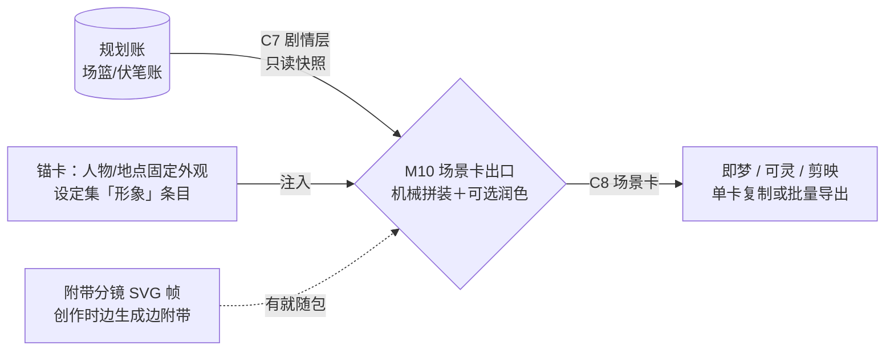

# 「故事真源引擎」场景卡出口设计稿 R01（M10＋C8 字段建议）

身份：**轻档设计稿。** 承接 [大纲结构 R02](OUTLINE_STRUCTURE_DESIGN_R02.md) 的场篮与 C7 合同建议，回应挂账本 ADD-001（分镜＝附带产物、试用/高级分界）、ADD-010（投影不回写）和 SI-006 P6 视觉调查采信结论（薄资产层不做 DAM、L0–L3 分档、话术黑名单）。不是施工合同、不是数据库 Schema；C8 部分是字段建议。施工位置不变：M10 排在 M8/C7 落地之后（ARCHITECTURE 施工顺序第 6 位），本稿只是提前把形状想清楚，让 C7 落合同时知道下游要吃什么。例子沿用《万鬼伏藏》第 4 章。

---

## 0. 一句话＋一张图

**用户的画面**：一个做推文/漫剧的人（多半就是作者本人），把第 4 章的场景卡拖到旁边的即梦里——人物段粘进角色描述，场景段粘进提示词框，台词信息表当字幕/配音的底稿（成句台词由他或作者自己写，【一致性修订 20260813】J1 口径，见 §1.2）。他最怕两件事：**每张图里爷爷长得不一样**（角色漂移），和**画面把后面章节的底牌提前画出来**（泄底）。

M10 场景卡出口干的就是：把 C7 剧情层**再加工成能直接粘的卡**——字段重组成提示词块、注入固定的人物外观锚、把防泄底转成「别拍出来」清单。它只是投影：不产新剧情、不回写、过期作废。



核心三句话：

1. **卡为「粘提示词的人」设计**：正面五件事一眼懂这场，制作块复制就能用，戏剧内幕折叠进导演注记（卡片正面五件事原则，v2 捞货 32）。
2. **一致性靠锚卡，不靠素材库**：每个角色一段版本化的固定外观描述，每张卡机械注入同一段；产品只管「长什么样、哪版是准的」，不管图片文件本体（P6 拍过：薄资产层不做 DAM）。
3. **卡是投影**：只读、带版本、过期标记、发现问题回规划账改完重导——绝不在卡上改出第二真源（ADD-010、ARCHITECTURE 纪律 1、v2 捞货 7/30）。

## 1. 卡上装什么

### 1.1 先认用户

C8 的消费者不是读者、也不是另一个模块，是**拿卡去视频工具里干活的制作者**。他的动作是复制粘贴，所以字段取舍只有一个标准：**粘过去能不能直接用**。戏剧结构（目标/阻力）他不需要天天看，但想拍好的人会要看——折叠，不删。

### 1.2 卡面三层

**正面五件事**（一眼懂这场；沿用「卡片正面只放五件事」原则，但五件事按视频制作者的需要重挑）：

1. 这场一句话（场胶囊）
2. 在哪、什么光线氛围（场景段）
3. 谁在场、长什么样（人物＋外观锚）
4. 情绪从哪到哪（进→出）
5. 关键画面（转折那一刻——封面/钱镜头候选）

**制作块**（复制即用的部分）：

- **整场提示词段**：环境＋人物外观＋核心动作＋氛围词拼成一段，直接粘进即梦/可灵的提示词框；
- **镜头行**：由拍序列机械投影——开场镜（交代环境）＋每拍一镜＋转折镜，每行带动作、画面处理、台词信息点、景别建议、建议秒数。为什么能机械做：拍本来就是「谁做了什么」（R02 3.6），正好是一个镜头拍的东西，不用 AI 另想分镜；
- **台词信息表**【一致性修订 20260813｜J1 口径】：**信息释放点＋语气标注**——每条＝「谁说出/暴露什么信息（什么口吻）」，**不给成句台词**。ADD-017 J1 拍死：教程「生成的故事」、台词扩写、场景卡对白要点全部按「给要求给信息点、不给成文」；成句台词是正文，笔在作者/制作者手里。这张表给字幕轨和配音当底稿依然够用（信息＋语气正是配音选声要的两样）；
- **别拍出来清单**：防泄底＋硬设定的视觉转译（见 1.3）。

**折叠区（导演注记）**：POV、场目标、阻力、转折说明、写法指导里的可视化项。给想拍得更贴戏的人，默认收起。

字段从 C7 哪来（M10 不产新内容，只加工）：

| 卡上的东西 | 从哪来 | 加工动作 |
|---|---|---|
| 一句话 | `scenes[].summary` | 原样 |
| 场景段 | `location`＋`visual_hint`＋`mood` | 拼装＋地点锚注入 |
| 人物 | `characters` | 换成锚卡引用＋本场状态一句 |
| 情绪 | `mood` | 原样 |
| 关键画面 | `turn` | 改写成画面语言（机械版＝原句） |
| 整场提示词段 | `location`＋`visual_hint`＋`mood`＋锚卡 | 模板拼装 |
| 镜头行 | `planned_events`＋`turn`＋场景段 | 开场镜＋每拍一镜＋转折镜；景别秒数给保守默认 |
| 台词信息表 | `dialogue_hints`（M8 稿已按 G3 纠正为「信息释放点」） | 原样＋语气标注（从情绪/写法指导提）；不扩写成句（J1） |
| 别拍出来 | `spoiler_guard`＋`must_not` 中视觉相关项 | 转译成动作指令句 |
| 导演注记 | `pov`＋`resistance`＋`turn`＋`writing_guidance` | 原样折叠 |

给 C7 的一条顺手建议：场对象落合同时把场篮本来就有的「场目标」带上（`goal`）——R02 的 C7 示例漏了这格，M10 导演注记要吃。

**基础导出纯机械，润色是可选付费动作**：机械拼装零 API 调用、天生不会编剧情，卡的质量＝场篮的质量（缺画面提示就回规划账补，不在出口现编）。「提示词润色」把素材话改写成更顺的生成提示词（补镜头语言、把拍文本改写成画面语句），铁规矩是**只改说法不改事件**——程序机械校验：镜头行的拍引用集合不变、不新增台词信息行，且**不得把信息点扩写成成句台词**（【一致性修订 20260813】J1：多写一句成文就是代写正文）。

时长建议给不给：给，机械默认值（无台词镜头 3 秒、有台词 4–5 秒），标明是毛估、可改。它的用处是批量制作者排片估总长，成本是零。

### 1.3 防泄底怎么生效

三道，全是机械的：

1. **源头就干净**：伏笔底牌未揭示时根本进不了 C7——下游合同只带脱敏「安全摘要」，这是 R02 3.7 已定的结构；M10 只读 C7，天生带不出底牌。
2. **转译成动作指令**：`spoiler_guard` 是给 AI 下游的提示语，上卡时转成给制作者的「别拍出来」句——例：「爷爷一线埋有未揭示设定」转成「只演『爷爷不认识九棺』这一个案，画面与台词不得暗示『还会有更多人忘记他』」。视频泄底多半泄在画面上（把棺里的东西画出来了），所以禁令必须说到画面。
3. **按故事位置判定，不按导出时间**：批量导 1–10 章，第 4 章的卡执行第 4 章时点的读者可知状态——哪怕第 10 章已经揭示了，第 4 章的卡照样带禁令；揭示位置之后的卡才放开。规则跟伏笔账「已揭示@位置」的语义完全对齐（R02 3.7）。

顺带剥除：伏笔引用（H-号）一律不上卡——伏笔的**名字本身**（如「开棺有代价」）就是剧情信息，带出去等于半泄底。

边界一句：防的是画面把底牌漏给**观众**，不是防制作者本人知道剧情——制作者跟作者是同侧的。

## 2. C8 合同（字段建议）

### 2.1 跟 C7 什么关系＋投影铁律

**C8 ＝ C7 场对象的投影再加工。** 对着旧设计说就是：卡牌四层（原文证据→故事事实/计划→戏剧作用→分镜表达，v2 捞货 33）里的**第四层「分镜表达」**——同一个剧情点的另一个身份面，不是新对象。「再加工」只有四种动作，全部不产新剧情：**重组**（拼提示词块）、**注入**（锚卡外观段）、**转译**（防泄底→禁令句）、**剥除**（内部件不出门）。剥除清单：消化状态、伏笔引用、必写承接、风险、字数预估——制作者用不上是其一，带出去泄结构是其二。卡上保留的内部引用只有拍号（`beat_ref`）和锚卡号，纯坐标、不含剧情，留着为了过期对账和局部重跑（v2 捞货 48）。

投影铁律四条（ADD-010＋v2 捞货 7/29/30 落到 C8）：

1. **只读**：M10 对规划账、事实账、伏笔账零写权限；
2. **带版本**：每张卡烙 `plan_id`＋`basis_note`（编卡时的规划账时点），包级另有 `source_note` 汇总；
3. **不回写**：制作时发现剧情问题（「这场爷爷怎么会在？他不是失踪了吗」）→ 回规划账/审查台改，改完重导；直接改导出文件只影响那份文件自己，产品不认；
4. **过期标记**：粒度到场——某场的规划变了，只有那场的卡在产品内标「已过期」，重导只重出那张。已拷走的文件管不着，但文件里烙着版本号，回来能对上账。

### 2.2 字段表

**包级**（一次导出＝一个包，单卡复制是包的退化形态）：

| 字段 | 装什么 |
|---|---|
| `contract` / `version` | "C8"＋合同版本 |
| `export_id` / `exported_at` | 本次导出身份＋时间（导出留痕，AI 使用记录同向——v2 捞货 53） |
| `book_title` | 书名（从材料架书名卡） |
| `range` | 本包覆盖哪些章/场 |
| `source_note[]` | 每章 `plan_id`＋`basis_note`——过期对账的根 |
| `ai_label` | AI 生成内容标识信息（合规件，见 4.3） |
| `anchors` | 锚卡集：人物＋地点（卡内引用，文本渲染时内联） |
| `cards[]` | 场景卡，见下 |

**锚卡**（人物/地点外观锚，详见第 3 节）：

| 字段 | 装什么 | 例子 |
|---|---|---|
| `anchor_id` | 身份 | AN-CHAR-002 |
| `kind` | character／location | character |
| `name` / `aliases` | 名字＋别名（别名是实体字段——v2 捞货 18） | 陈九棺／九棺 |
| `look` | 固定外观段（视觉语言，提示词直接用） | 见 JSON |
| `voice_hint` | 可选，声线提示（给配音选声） | 苍老沙哑，语速慢 |
| `valid_from` | 可选，阶段生效位置（V0 默认单阶段） | 第 1 章起 |
| `status` | draft（AI 聚的草稿）／confirmed（作者确认过） | confirmed |
| `source_refs` | 外观依据（设定条目/事实 ID） | ["SET-012"] |
| `revision` | 版本；改锚升版，已导出的卡随之过期 | 2 |

**卡级**（一场一卡；场＝工作单位不是真值容器——v2 捞货 30）：

| 区 | 字段 | 装什么 |
|---|---|---|
| 卡头 | `card_id` | SC-S004-1，从场号派生 |
| 卡头 | `chapter_hint` / `chapter_title` / `scene_order` / `scene_count` | 第 4 章「归家」第 1/3 场——批量排集用 |
| 卡头 | `source` | `plan_id`＋`scene_id`＋`basis_note`：投影版本戳 |
| 正面 | `logline` | 一句话（＝场胶囊） |
| 正面 | `setting` | 在哪＋何时＋光线氛围（含地点锚引用） |
| 正面 | `cast[]` | `anchor_ref`＋`presence`（本场状态一句） |
| 正面 | `mood_arc` | 情绪进→出 |
| 正面 | `key_frame` | 关键画面（转折时刻），封面/钱镜头候选 |
| 制作块 | `scene_prompt` | 整场提示词段，复制即用 |
| 制作块 | `shots[]` | 镜头行：`shot_no`＋`beat_ref`＋`action`＋`visual`＋`dialogue`（信息点：谁→信息，非成句，J1）＋`shot_hint`＋`duration_hint_s` |
| 制作块 | `dialogue_sheet[]` | `speaker`＋`info`（要说出/暴露什么信息）＋`tone`：台词信息汇总（字幕/配音底稿；【一致性修订 20260813】原 `line` 成句字段按 J1 改 `info` 信息点） |
| 制作块 | `dont_show[]` | 别拍出来清单 |
| 折叠 | `director_notes` | `pov`＋`goal`＋`resistance`＋`turn`＋`guidance[]` |
| 折叠 | `frame_refs[]` | 本场已有的附带分镜帧文件引用（没有就空） |

### 2.3 JSON 示例（第 4 章场 1「归家不识」，延伸 R02 的 C7 例子）

```json
{
  "contract": "C8",
  "version": "v0-draft-r1",
  "export_id": "EXP-20260813-01",
  "exported_at": "2026-08-13T03:40:00+08:00",
  "book_title": "万鬼伏藏",
  "range": {"chapters": [4]},
  "source_note": [
    {"chapter_hint": 4, "plan_id": "PLAN-S004-r3", "basis_note": "plan-ledger@2026-08-13T03:00"}
  ],
  "ai_label": {"contains_ai_generated_content": true, "note": "本文件内容由 AI 辅助生成"},
  "anchors": {
    "characters": [
      {
        "anchor_id": "AN-CHAR-001",
        "kind": "character",
        "name": "陈九棺",
        "aliases": ["九棺"],
        "look": "二十六七岁的清瘦青年，肤色偏白带倦色；黑色粗布短打，肩背褪色旧藤箱；左手腕缠一圈麻绳（抬棺行规）；眉眼温和，常带心事",
        "voice_hint": "年轻男声，低而稳，语速偏慢",
        "status": "confirmed",
        "source_refs": ["SET-012", "F-0102"],
        "revision": 1
      },
      {
        "anchor_id": "AN-CHAR-002",
        "kind": "character",
        "name": "爷爷",
        "aliases": [],
        "look": "七十多岁，白发稀疏束在脑后，深褐色对襟布衫；手背老年斑和青筋明显，指节粗大；常坐竹椅，手边一把旧削果刀",
        "voice_hint": "苍老沙哑，语速慢",
        "status": "confirmed",
        "source_refs": ["SET-013", "F-0007"],
        "revision": 1
      }
    ],
    "locations": [
      {
        "anchor_id": "AN-LOC-001",
        "kind": "location",
        "name": "陈家老屋堂屋",
        "look": "南方老宅堂屋：光线昏黄，条案上一盏油灯；正墙挂族谱轴；木柱漆色斑驳；门外是暮色院子",
        "status": "confirmed",
        "source_refs": ["SET-020"],
        "revision": 1
      }
    ]
  },
  "cards": [
    {
      "card_id": "SC-S004-1",
      "chapter_hint": 4,
      "chapter_title": "归家",
      "scene_order": 1,
      "scene_count": 3,
      "source": {"plan_id": "PLAN-S004-r3", "scene_id": "S-004-1", "basis_note": "plan-ledger@2026-08-13T03:00"},
      "logline": "九棺推门喊爷爷，老人握着削了一半的苹果问他找谁",
      "setting": {"location_ref": "AN-LOC-001", "time": "黄昏入夜", "tone": "暖黄油灯光；表面家常温暖，底色阴冷"},
      "cast": [
        {"anchor_ref": "AN-CHAR-001", "presence": "风尘仆仆刚进门，藤箱未卸"},
        {"anchor_ref": "AN-CHAR-002", "presence": "坐竹椅削苹果，果皮不断，神情平静"}
      ],
      "mood_arc": "暖（归家）→ 毛骨悚然",
      "key_frame": "特写：老人把削好的苹果客气地递过来——『小伙子，尝尝？』待客的笑，眼里没有一点认识他的痕迹",
      "scene_prompt": "昏黄油灯下的南方老宅堂屋，正墙挂族谱轴，门外暮色。七十多岁白发老人（深褐对襟布衫）坐竹椅上削苹果，果皮垂成一条不断。门口站着二十六七岁清瘦青年（黑色粗布短打、背旧藤箱），风尘仆仆。氛围表面温馨家常，底色阴冷诡异。",
      "shots": [
        {"shot_no": 1, "beat_ref": null, "action": "开场环境镜：暮色院子，堂屋透出昏黄灯光", "visual": "全景缓推：老宅院落暮色，堂屋门内一点暖黄", "dialogue": null, "shot_hint": "全景，缓推", "duration_hint_s": 3},
        {"shot_no": 2, "beat_ref": "PE-0411", "action": "九棺进门，喊爷爷说自己回来了", "visual": "中景：青年推门而入，藤箱未卸，脸上是抑不住的高兴", "dialogue": "九棺→唤爷爷、报自己回来了", "shot_hint": "中景", "duration_hint_s": 4},
        {"shot_no": 3, "beat_ref": "turn", "action": "转折：爷爷把削好的苹果递过来", "visual": "特写：布满老年斑的手递出削好的苹果，上移到老人客气的笑脸", "dialogue": "爷爷→以待客口吻请这个『陌生小伙』尝苹果", "shot_hint": "特写，缓慢上移", "duration_hint_s": 4},
        {"shot_no": 4, "beat_ref": "PE-0412", "action": "爷爷看着九棺，问他是谁", "visual": "正反打：老人抬眼陌生地打量青年；九棺的笑僵在脸上", "dialogue": "爷爷→问他找谁（认不出自己孙子）", "shot_hint": "正反打，特写收尾", "duration_hint_s": 5}
      ],
      "dialogue_sheet": [
        {"speaker": "陈九棺", "info": "唤爷爷、报自己回来了", "tone": "高兴、松了口气"},
        {"speaker": "爷爷", "info": "以待客口吻请他尝苹果——完全当陌生人接待", "tone": "客气、疏离"},
        {"speaker": "爷爷", "info": "问他找谁（不认识自己孙子；这是全场最后一句要释放的信息）", "tone": "平静得可怕"}
      ],
      "dont_show": [
        "只演『爷爷不认识九棺』这一个案；画面与台词不得暗示『还会有更多人忘记他』",
        "爷爷只能演『忘』：不得出现病重、濒死等暗示（设定：代价是遗忘，不是死亡）"
      ],
      "director_notes": {
        "pov": "陈九棺",
        "goal": "让读者先于主角意识到『爷爷忘了他』",
        "resistance": "爷爷表现完全正常，九棺一开始只当爷爷开玩笑",
        "turn": "递苹果——待客的动作宣判了陌生",
        "guidance": ["用日常写恐怖：削苹果的手法一模一样，只是不认得他", "『你找谁』必须是全场最后一句"]
      },
      "frame_refs": []
    }
  ]
}
```

### 2.4 单卡复制出来长这样（文本渲染，锚内联、自包含）

```text
【万鬼伏藏 · 第4章「归家」 · 场1/3】
一句话：九棺推门喊爷爷，老人握着削了一半的苹果问他找谁。
情绪：暖（归家）→ 毛骨悚然

■ 场景：南方老宅堂屋——光线昏黄，条案油灯，正墙族谱轴……黄昏入夜，表面家常、底色阴冷。
■ 人物：
  陈九棺——二十六七岁清瘦青年，黑色粗布短打，背旧藤箱……｜本场：风尘仆仆刚进门
  爷爷——七十多岁，白发稀疏，深褐对襟布衫……｜本场：坐竹椅削苹果，神情平静
■ 整场提示词：昏黄油灯下的南方老宅堂屋……（复制这段直接粘生成框）
■ 分镜（台词一栏是信息点＋语气，成句台词你来写）：
  1｜全景缓推 3s｜暮色院子，堂屋透出昏黄灯光
  2｜中景 4s｜青年推门而入……｜九棺→唤爷爷、报归家（欣喜）
  3｜特写 4s｜递苹果……｜爷爷→待客口吻请「陌生小伙」尝苹果（客气疏离）
  4｜正反打 5s｜老人陌生地打量……｜爷爷→问他找谁（认不出孙子；末句信息）
■ 关键帧（封面候选）：特写——递苹果的手，客气的笑，眼里没有认识的痕迹。
■ 别拍出来：①只演个案，不暗示更多人会忘记他；②爷爷只能演「忘」，不能演病重濒死。
（本卡是剧情计划的投影 · PLAN-S004-r3 · 2026-08-13 · AI 辅助生成）
```

单卡复制必须**自包含**（锚全文内联）——制作者粘一次就能干活；批量 JSON 里锚集中放一份、卡内引用，避免几十张卡重复同一段。

## 3. 人物外观一致性：锚卡（薄资产层的 V0 形态）

视频工作流最痛的就是角色长相漂移。P6 的结论是引擎该管「这个资产在故事里是什么、哪个版本被批准、绑哪些镜头」，海量文件留给用户自己的盘。V0 还没有图片资产，所以薄资产层的第一形态就是**一段管住嘴的文本**：

- **是什么**：每个角色一段固定外观描述（年龄体型/发型服装/标志物/气质）＋可选声线提示，版本化。每张卡机械注入同一段，即梦里每次生成用的都是同一个描述——文本层面能消掉的漂移先消掉（图像层面的一致性是 L2 挂形象图之后的事）。
- **住哪**：设定集架的「形象」子类条目（身份＝作者声明的参考材料，不是事实账；不新开材料架）。放这里的关键原因：**M9 画附带分镜和 M10 出卡必须共用同一份锚**，否则帧和卡迟早长成两个人。
- **谁写**：AI 从设定集＋已确认的外貌类事实聚一份草稿，作者确认一次才算数（AI 提案、人签字，与全线权利结构同构——SI-006 交叉结论 3）；没确认的锚标 `draft`，导出时如实带状态。
- **没锚怎么办**：卡照出，cast 里只有名字，加一行提醒「此角色没有外观锚，容易漂」；提醒一次不唠叨（v2 捞货 21）。不因缺锚堵死导出。
- **阶段（可选不实装默认）**：外观会变（受伤/换装/长大）。锚支持多阶段（`valid_from` 起点），M10 按场的故事位置选对应阶段注入——P6 说薄资产层本来就该绑「服装状态、年龄阶段」。V0 默认单阶段，字段留位。
- **地点同机制**：地点锚是同一种对象（kind=location），管场景环境一致性（同一间堂屋别每集换装修）。一套机制两类对象，不另做系统。

**明确不做**（P6 避雷）：不做图片托管、查重、全格式预览；不管 LoRA 权重文件；不做通用灵感采集库。将来 L2 需要「批准形象图」时，在锚卡上加一个图引用位（candidate→approved 状态照 P6 的资产状态机），文件本体优先外部存储。

## 4. 导出形态

### 4.1 两条路

- **单卡复制（主路径）**：卡面一个「复制」钮，出 2.4 那样的自包含文本；镜头行可单行复制（一行就是一条生成提示词）。这是「拖进即梦当提示词」用户的日常。
- **批量导出**：按章/卷/书选范围，三种格式一次出——JSON（机器可读，2.3 的包）、Markdown（人读文档，一场一节，直接发给外包或团队）、ZIP（前两样＋`frames/` 附带分镜帧＋`manifest.json`）。manifest 装文件清单＋每章 plan 版本＋校验和——P6 增量导出思想的 V0 版：先把账印在包里，增量同步机制后置。
- 每次导出记一条流水（export_id＋范围＋版本），追溯和合规两用。

### 4.2 附带分镜和场景卡：一个源头、两个产物

ADD-001 拍了：SVG 画面是创作时「边生成边附带」的产物，最后拼成有声动态分镜——它属于创作流，**不是 M10 造的**。场景卡是同一个「场」的另一种投影。关系定成**同源、两物、单向引用**：

- 卡可以带帧（ZIP 的 `frames/`、卡上的 `frame_refs`），帧对制作者是现成的构图/风格参考（即梦垫图就能用）；
- 帧不需要卡也能拼片（教程终点那条有声分镜线）；
- 卡不依赖帧存在——纯文本卡自己就完整可用。

为什么不合成一物：帧是给人看的画，卡是给工具吃的字，消费者、成本、更新节奏都不同；捆死了文本卡就被图片生成的成本拖住。两边都烙同一个 plan 版本号，源头一变一起过期。

### 4.3 边界（一次说完）

- **不直推第三方**：没有稳定公开的「写入剪映草稿/直推即梦项目」API（P6 强证据），逆向接口不进卖点；V0 承诺的是标准素材包。
- **不代发布**：发布是独立权限（话术黑名单①）；对外口径是「短视频测题材、引流回阅读页」，不说「发抖音代替小说平台」（黑名单②，P6 数据背书：个人占漫剧供给 40% 只占消费 11%）。
- **AI 标识随包走**：《人工智能生成合成内容标识办法》2025-09-01 施行，导出文件也要保留标识（P6 强证据）——包带 `ai_label`，文本渲染带落款行，打包帧图不剥离其隐式标识。

## 5. 试用版 vs 高级功能（⚠️ 全部占位——ADD-008 暂行＋【一致性修订 20260813】ADD-017 J2 付费墙话题冻结待调查，本节不再展开、只标身份不删内容）

框架照 ADD-001 拍的分界：**教程＋附带分镜是试用版的体验承诺，持续创作和成规模带走是高级功能**；再叠 ADD-002「导出是付费权利」。

| 能力 | 试用（免费/新手） | 高级（付费） |
|---|---|---|
| 教程演示书的场景卡＋拼好的有声分镜 | 全开放（预制内容不烧额度，效果承诺展示） | — |
| 自己的书：卡片在产品内查看 | 全可看（看 ≠ 带走） | 全可看 |
| 单卡复制（带走） | 尝鲜额度（给不给、给几张见开放问题 2） | 不限 |
| 批量导出 JSON/MD/ZIP | ❌ | ✅ |
| 提示词润色 | ❌（或烧新手积分） | 按章计；失败不收费（P7 拒付雷区） |
| 外观锚 | 单阶段＋AI 草稿确认 | 多阶段（换装/成长）；将来挂批准形象图 |
| 过期重导＋差异清单 | ❌ | ✅ |

## 6. 分档与成本：V0 停在 L0

| 档 | 是什么 | 触发 | 成本 |
|---|---|---|---|
| **L0 结构化文本卡（＝本稿）** | 机械拼装默认导出；润色可选 | 默认就有 | 机械版零 API 费；润色约一章一次调用，⚠️ 单次 token 成本未标定（量级小） |
| L1 有声动态分镜 | 已有附带帧＋TTS＋拼接渲染 9:16 MP4 | 教程终点体验；作者点「出预告片」 | ⚠️ TTS 单价、渲染/转码算力未调查；SVG 不能直接发平台，必须渲成 MP4/WebM（P6） |
| L2 关键镜头图生视频 | 少数镜头高成本升级 | 作者手动挑镜头（v2 捞货 40）＋锚卡已挂作者批准的形象图 | ⚠️ 即梦/可灵图生视频单价未调查；存储不是大头（P6：约 ¥0.1–0.15/GB/月），反复下行才是（约 ¥0.5/GB）——L2 真做大之后才碰到 |
| L3 全 AI 精品 | 不做 | — | P6：工作室精品线，不适合早期 |

升级路径的纪律一句：**每一档是上一档的付费加厚，不是替代**——L2 的图生视频提示词就是 L0 卡上的 `scene_prompt`＋锚段，L0 卡的质量决定所有上层。这也是 V0 先把文本卡做对的理由。

### 6.1 顺手记：跟角色视角模式的关系（ADD-008 第 5 条）

角色视角模式跑出来的也是规划账内容（「依然生成大纲，用的是同一套规划账」——CZ 原话），走 C7→C8 天然能出卡；卡上本来就有 POV（导演注记）。将来若做沉浸向第一人称漫剧，等于「按某角色的可见集出卡」——结构不用改，加一个过滤维度就行。V0 不为它加任何字段，这里只确认接口不堵路。

## 7. 开放问题（3 个；【一致性修订 20260813】三题均已有结论，状态就地标注）

**1｜提示词要不要按工具出不同版本？（✅ 已按推荐 A 暂定——ADD-009 场景卡三题）**
即梦、可灵、剪映吃提示词的口味不完全一样：有的爱自然长句，有的对镜头术语敏感。一张卡是只出一种通用写法，还是导出时选目标工具、按工具模板出不同版本？
- A. V0 只出通用版（中文自然语句＋分块结构），作者粘过去自己微调
- B. 出工具预设：导出时选「即梦版/可灵版/通用版」
- 👉 推荐 A 起步：单卡文本本来就是模板渲染出来的，机制上把「模板可换」的口子留好就行；等真实用户反馈集中在哪家工具，再加那家的预设，别一上来维护三套。

**2｜免费用户能不能把自己书的卡带走几张？（✅ 已暂定 B＝3 张尝鲜——ADD-009，CZ 已过目未反对；张数细节随 J2 收费冻结口径后议）**
教程演示书随便玩没争议；但免费用户自己的书出了卡，「带走」按现行口径是付费权利——可是让他真的粘进即梦出一张自己故事的图，又恰恰是最强的转化时刻。
- A. 一张不给：看得到、复制不了，想带走就付费
- B. 给小额尝鲜（比如 3 张卡），用完锁
- C. 只许复制单个字段（比如场景段），整卡锁
- 👉 推荐 B：转化靠「在自己的故事上尝到甜头」，三张卡泄不掉什么价值，比 C 的体验割裂干净；具体张数随收费暂行口径一起后议。

**3｜台词太薄怎么办？（🔴【一致性修订 20260813】已被 ADD-017 J1 关闭：定 A，B 永久出局）**
卡上的台词信息表来自「信息释放点」，设计上就只点到为止。但配音要整句，制作者可能想要一场的完整台词稿。
- A. 就这么薄：信息点＋语气，整句制作者自己写 ✅（J1 终局口径）
- B. ~~加一个付费可选动作「台词稿扩写」：AI 把要点扩成可配音的台词~~——J1 拍死：台词扩写属「生成成文」，越红线（红线只有一条：不给写作模型、不生成正文），不是 V0 不做，是**永久不做**。
- 划界的另一半照 J1 收好：指导可以细到句级「描写要求」（这句要透露什么信息、什么口吻、怎么旁敲侧击），因为那是要求不是示范句——这正是台词信息表现在的形态。

## 8. 来源与追溯

- [大纲结构 R02](OUTLINE_STRUCTURE_DESIGN_R02.md)：场篮字段（visual_hint/dialogue_hints/spoiler_guard）、C7 合同建议、《万鬼伏藏》例子、伏笔账读者可知标记。
- [ARCHITECTURE.md](../ARCHITECTURE.md)：M10/C8 合同位、设计纪律 1（投影快照）、施工顺序。
- 挂账本（小说架构仓，路径含中文，复制用）：`/Users/a1234/挣钱/小说架构/TEMP/bgboard-audit-20260809-r01/18_R07_ADDENDUM_LEDGER_20260813_R01.md`——ADD-001（分镜＝附带产物、试用/高级分界）、ADD-002（导出是付费权利）、ADD-008（收费暂行、角色视角模式）、ADD-010（投影不回写）。
- SI-006 消化稿（同仓，复制用）：`/Users/a1234/挣钱/小说架构/TEMP/bgboard-audit-20260809-r01/17_SI006_DIGEST_20260813_R01.md`；P6 原报告：`/Users/a1234/挣钱/小说架构/references/survey-inbox/packages/PRODUCT_DESIGN_RESEARCH_RETURNS_20260813_R01/returns/666.md`——薄资产层、L0–L3 分档、导出/存储成本、AI 标识法规、话术黑名单。
- 考古捞货（同仓，复制用）：`/Users/a1234/挣钱/小说架构/TEMP/bgboard-audit-20260809-r01/19_NOTION_V2_SALVAGE_20260813_R01.md`——概念 6/7/18/21/29/30/32/33/40/48/53。

来源：Cursor（Fable 5 Max）设计，2026-08-13。

修订记录：
- 一致性修订 20260813：台词表全稿按 J1 改「信息释放点＋语气」口径（§0/§1.2/§2.2/§2.3 JSON/§2.4 渲染，`dialogue_sheet.line`→`info`，示例成句台词全部改写为信息点）；润色铁规补「不得扩写成句」；§5 补 J2 冻结标注；§7 三个开放问题按已拍结果收口（Q1/Q2 按 ADD-009 暂定，Q3 被 J1 关闭）。设计稿群一致性巡检执行。
