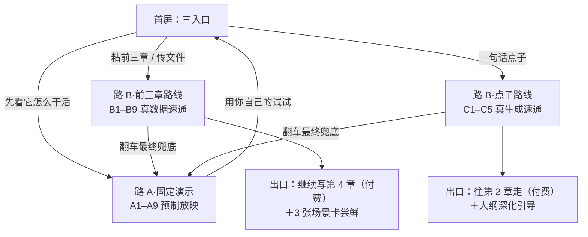

# 新手教程双路逐屏脚本 R01（TUTORIAL_SCRIPTS_DESIGN）

> 🔴 【一致性修订 20260813｜演示材料方案作废】CZ 拍板 ADD-017 **J7**：路 A 不自拟演示书——**《捡骨人》自拟微书方案作废，改从新书书库的前三章里挑几本真书当示例**。⚠️ 版权注意一句：真书用作产品内演示展示，选书与授权/合规口径须在 R02 落定前过一遍。本稿 A1–A9 的**机制骨架全部有效**（胶卷条、出题卡标价、伏笔锁、收工卡、放映厅容器、失败兜底），只是演示材料整体替换＝R02 大修；第 5 节开放问题一（题材选哪档）随之作废，改题为「从新书书库挑哪几本真书」。R02 吸收前，本稿的《捡骨人》内容仅当机制示意读。

身份：**轻档设计稿。** ADD-001 拍了教程双路的框架（路 A 零材料固定演示不耗额度、路 B 有材料速通、分镜＝附带产物、试用版边界），总稿 03 章洞-04 点名「路 A 演示的内容脚本完全没有材料」——本稿把两条路的逐屏脚本写出来：每一屏看见什么、点什么、系统回什么、图什么。不是施工合同；界面元素、按钮文案、系统提示语**全文一律是示意，非定稿**（这句全文只说这一次）。人物是设计画像不是访谈；路 B 沿用走查稿的宋岸和《雾都灯师》，演示书《捡骨人》与点子例子是本稿自拟（自拟方案已作废，见顶部修订框）。

出处简写（同目录设计稿给可点链接；小说架构仓路径含中文，只给复制用）：

| 简写 | 文件 |
|---|---|
| ADD-XXX | 挂账本（复制用）：`/Users/a1234/挣钱/小说架构/TEMP/bgboard-audit-20260809-r01/18_R07_ADDENDUM_LEDGER_20260813_R01.md` |
| 总稿03 | 总稿进入产品章（复制用）：`/Users/a1234/挣钱/小说架构/TEMP/product_master_spec_20260813/03_onboarding.md` |
| 走查 | [DAILY_LOOP_WALKTHROUGH_R01.md](DAILY_LOOP_WALKTHROUGH_R01.md) |
| INTAKE | [INTAKE_SHELVES_DESIGN_R01.md](INTAKE_SHELVES_DESIGN_R01.md) |
| REVIEW | [REVIEW_OVERVIEW_DESIGN_R01.md](REVIEW_OVERVIEW_DESIGN_R01.md) |
| REVERSE | [REVERSE_PLOT_MAP_DESIGN_R01.md](REVERSE_PLOT_MAP_DESIGN_R01.md) |
| SCENE | [SCENE_CARD_EXPORT_DESIGN_R01.md](SCENE_CARD_EXPORT_DESIGN_R01.md) |
| REGISTRY | [STOP_POINT_REGISTRY_R01.md](STOP_POINT_REGISTRY_R01.md) |
| M8 | [M8_PLANNING_DESIGN_R01.md](M8_PLANNING_DESIGN_R01.md) |
| 捞货38 | 19 号捞货概念 38「接力点第一屏」（复制用）：`/Users/a1234/挣钱/小说架构/TEMP/bgboard-audit-20260809-r01/19_NOTION_V2_SALVAGE_20260813_R01.md` |

---

## 0. 一句话＋一张图

教程双路是**同一个效果承诺的两种证法**：路 A 拿预制内容证「它能做到什么样」（一个 3 分钟的可点放映厅，零额度、永不翻车）；路 B 拿用户自己的材料证「它对你的书也行」（真流程上叠一层导览皮肤，90 秒内亮出第一条能点回原文的事实）。两条路的终点互相指：路 A 看完的出口是「用你自己的试试」（进路 B），路 B 翻车时的最终兜底是「先看看它干活的样子」（回路 A）。



三条路况先报清楚：

- **路 A 全程没有正文出现。** 它演的是创作流（点子→大纲→章计划→剧情层→分镜），而产品不代写正文——所以演示里压根没有「生成正文」这一幕。「不代写」的立场从演示第一分钟就立住，不用嘴说。
- **路 B 不是独立流程**，就是免费层首次动线（导入前三章→抽取→看效果，ADD-002 Q2）加一层可跳过的导览气泡。总稿洞-07 问「试用版和免费层是不是同一个边界」——本稿按「教程＝免费层首次动线上的导览皮肤」落，不新造第三种账号状态，供那题拍板时参考。
- **熟手路不单独写脚本**：它就是路 B 前三章路线走到出口后的第一次正式续写（第 4 章的故事），教程结束的地方正好是它开始的地方（ADD-001「迅速生成第四章」）。

## 1. 两路共用的三个骨架件

### 1.1 画面胶卷条：附带分镜怎么呈现（别做成最后的大招）

ADD-001 的原话是「边生成边附带」——SVG 画面跟着剧情长，最后的有声分镜只是把它们拼起来。落到界面上是一个常驻件：

**胶卷条**：屏幕底部一条窄带，像相机的胶卷。每当一段剧情成形（路 A：每张章计划卡铺满时；路 B：每章概览卡生成时；点子路：第 1 章剧情层出来时），对应的画面帧「咔」一声落进条里，帧数角标 +1。用户全程眼角看得见画面在积累——到最后一屏点「串起来」时，他不是被塞了一个惊喜，是收获自己看着攒起来的东西。

帧的形态分档（对齐 REVIEW §6.2 的降级阶梯，不另造）：

| 路 | 帧形态 | 成本 |
|---|---|---|
| 路 A | 预制 SVG 帧（人物简笔画＋场景符号，ADD-016 H4 的两眼一嘴线条式） | 一次性制作，运行零成本 |
| 路 B / 点子路 | L0b 模板 SVG 拼装（visual_hint 关键词→符号库＋剪影）；图库没就绪前退 L0a 排版帧（氛围色＋大字梗概） | 零模型调用；⚠️ 图库工作量未实测（REVIEW §6.2 原标注） |

🔥 一条制作纪律：**路 A 预制帧的精致度必须钉在产品真实能力的天花板上**——路 B 用户下一分钟就会拿自己的书对照，预制内容手工美化到产品做不到的程度，效果承诺就成了效果吹牛，第一印象反噬比没有演示更狠。

「有声」怎么落：路 A 的成片是预制配音（一次录死，播放零成本零风险）；路 B 的「配上声音」是 TTS 念各章钩子和梗概——⚠️ TTS 单价、渲染成本未调查（SCENE §6 L1 档原标注），就绪前路 B 先给**无声轮播＋字幕卡**打底，按钮文案不许诺「有声」。

### 1.2 演示态与导览层：教程和正式产品的边界

两条路的边界机制不同，一张表说完：

| | 路 A＝演示态 | 路 B＝导览层 |
|---|---|---|
| 本体 | 独立的「放映厅」容器：预制脚本状态机，点击推进播放，**无任何 API 调用、无任何写账** | 正式产品流程本身，上面叠气泡＋高亮＋步骤条（「第 2 步／共 5 步」） |
| 顶部常驻 | 「🎬 演示放映中 · 预制内容，不花你一分额度 ｜ 退出演示」 | 「新手引导 · 可随时跳过」＋步骤条 |
| 确认动作 | **演的**：按钮照点（动作记忆是路 A 的教学产出），但不写任何账 | **真的**：第一条事实的确认就是真值签字，不豁免、不放轻——激活事件（ADD-002）要求的就是真确认 |
| 数据去向 | 退出即弃，不建项目、不进项目列表——没有「演示书删不删」的垃圾问题 | 全部进用户自己的真账（本来就是他的书） |
| 可跳过 | 随时右上退出，进度不挽留 | 「跳过引导」只关气泡，流程本体照走（导入→抽取→审查本来就是产品正式动线） |
| 可重看 | 帮助菜单「再看一遍产品演示」，随时重播 | 帮助菜单「重开新手引导」；完成或跳过后，下次导入不再自动弹 |
| 状态存哪 | 用户级 `tutorial_state`（看没看过、看到哪屏）——**不进任何项目账本** | 同左（引导走到第几步、完成/跳过标记） |

真值边界多说一句就够：路 B 教程里作者做的每一次确认、放行、豁免，跟走查里宋岸第 0 天做的是同一批动作、同一个签字语义（REVIEW §5.1）；教程气泡只负责「第一次有人在旁边指」，不改变任何动作的分量。

### 1.3 首屏三入口

```
你写到哪了，从哪开始都行
┌────────────────────────────────────────┐
│  ［粘贴你的章节］  ← 主位，光标已就位     │
│  ［上传文件（txt/docx/zip）］            │
│  ── 或者 ──                             │
│  ［我只有一个点子 →］                    │
└────────────────────────────────────────┘
        没有材料？🎬 先看它怎么干活（3 分钟）
```

粘贴/上传进前三章路线（B 屏），点子进点子路线（C 屏），角落的演示进路 A。主位给「粘贴/上传」：激活事件的正主是有正文的用户（没有正文就没有「点回原文」），别让他多点一下。这个排法是 SI-006 P4 的候选形态（总稿03 标注候选未拍板）——摆放顺序进开放问题三。

## 2. 路 A：零材料固定演示（A1–A9，约 3 分钟）

### 2.0 演示书《捡骨人》＋题材推荐（🔴 本节方案已作废——J7 改用真书，见顶部修订框）

【一致性修订 20260813】本节原判断「不能拿库里的真书」被 ADD-017 J7 直接推翻：CZ 拍板**从新书书库挑真书前三章当演示材料**（拆书菜单裁决管的是「拆解研究别人的书」，演示展示是另一回事，以 J7 为准；版权注意事项 ⚠️ 已标顶部）。以下《捡骨人》内容仅作机制示意保留，R02 重做演示材料。

~~演示书是自制原创微书（不能拿库里的真书——拆别人的书是隔离研究项目，ADD-009 拆书菜单裁决；演示更不能拿别人的书当自己的货架）。~~本稿自拟《捡骨人》：

> **一句话点子**：替死人捡骨的年轻人，在一口十年前就该空了的棺里，捡出了父亲昨天的骨头。

民俗悬疑底色（南方二次葬「捡骨」习俗），主角宋拾，捡骨师学徒；父亲宋道年十年前失踪。演示覆盖三章：第 1 章「开棺」（迁坟见新骨，骨有六指——父亲的特征）、第 2 章「守夜」（偷留指骨，夜里骨头回潮；师父警告别管）、第 3 章「验骨」（家传手艺验出骨龄不足三天；章末敲门声，来人自称是他父亲）。

**题材推荐（❓ 开放问题一，待 CZ 拍）**：推荐悬疑/民俗灵异这一档，不推网文最大盘的玄幻升级流。理由：路 A 的任务是效果承诺展示，它要放大的三样活——画面感（SVG 简笔画演「递苹果式的日常恐怖」效果远好过演打斗光效）、伏笔记账（悬疑天然多债）、选项标价（「提前揭底」的风险警告只有悬疑题材演得直观）。受众广度靠点子本身普世（亲情＋悬念）补。

**预制资产清单＋量级**（回答总稿03 洞-04「谁来做、成本多少」）：三章的章计划卡＋剧情层文案（注意：不含正文，量级约等于三章的大纲和事实句，不是三章小说）、约 12–16 帧 SVG、一条 45 秒有声成片（配音一次录死）、演示脚本状态机（前端件）。一次性制作，量级在「周级、单人」——⚠️ 配音单价、SVG 制作工时未调查，上线前实报。

### 屏 A1｜开场：一句话点子亮相

**【看见】** 点了「先看它怎么干活」，整屏只有一句话打出来（打字机效果），下面一个按钮：

```
「替死人捡骨的年轻人，在一口十年前就该空了的棺里，
  捡出了父亲昨天的骨头。」

这是一个点子。看它怎么变成一本书。
                ［开始 →］
```

顶部同时出现演示态常驻条（1.2 节）。

**【点了】** ［开始］。

**【系统回】** 进入大纲引导演示（A2）。

**【感受】** 没有功能列表、没有注册引导，第一屏就是一个让人想知道后事的钩子——产品用一个好点子自我介绍。

### 屏 A2｜大纲引导：点子撑开成方向

**【看见】** 点子沉到顶部变小，下面长出一张「全书方向卡」，几个格子按顺序亮起来（预制动画，每格半秒）：

```
类型底色：民俗悬疑 · 亲情内核
故事骨架：三幕（内置理论拆解 · 可换成救猫咪十五拍）
前 20 章大方向：
  第 1–6 章   开棺见骨，宋拾瞒着师父私查，查到父亲失踪当晚的迁坟
  第 7–14 章  「父亲」回来了——但捡骨人验得出：回来的东西骨龄不对
  第 15–20 章 师父的旧账翻出来，十年前那口棺里原本装的是什么
                ［方向可以，往下走 →］
```

**【点了】** ［方向可以，往下走］。

**【系统回】** 方向卡收起，进第 1 章出题（A3）。

**【感受】** 「一句话真能变成 20 章的路线」这个承诺，在第 30 秒就兑现了一次——虽然他知道是演示，但路线本身编得像样，这比任何广告词都硬。

### 屏 A3｜出题卡：每个选项都标着价钱

**【看见】** 第 1 章的题卡（M8 的一卡一题形态）：

```
题：棺里的新骨——第 1 章怎么让读者看到它？
✅ 选项一（推荐）：把迁坟活计的规矩写足，最后一刻开棺见骨
   为什么：日常写得越实，异常翻出来越狠
   ▸ 消化清单：埋 H-001「六指」· 立宋拾的手艺人设
选项二：开头直接见骨，倒叙这单活怎么来的
   ▸ 消化清单：同上 · ⚠️ 代价：迁坟规矩没铺，后面验骨的说服力要补课
选项三：从父亲失踪十年祭写起，迁坟只是巧合
   ▸ 消化清单：⚠️ 第 1 章就把「父亲」和「骨头」焊死——悬念提前，
     读者比宋拾先想到答案
                ［就按推荐走 →］
```

**【点了】** 他好奇点了选项三，气泡回：「演示里先按推荐走；你自己的书里，每一步都是你说了算。」然后点［就按推荐走］。

**【系统回】** 选项一选定，消化清单打勾动画（H-001 挂上伏笔账），进 A4。

**【感受】** 三个选项不是「三个都行」，是**三个不同的代价**——他第一次看见有工具把「这么写会亏什么」明码标出来。

### 屏 A4｜章计划成形：格子填上，第一帧落条

**【看见】** 第 1 章章计划卡逐格长出来（预制动画）：

```
第 1 章「开棺」（草案）              目标字数 3,000
场 1  雨前赶山（宋拾随师父上山，迁坟的规矩一样样过）   预估 1,100 字
场 2  开棺（棺盖起，师徒同时僵住——骨是新的）          预估 900 字
场 3  六指（宋拾清点指骨，左手多出一节）              预估 1,000 字
出口钩子：师父盯着那节骨头，说了句「收工，今天的事烂在肚子里」
不能违反：H-001 六指的来历第 7 章前不得写明
```

卡片铺满的瞬间，**屏幕底部滑出胶卷条，第一帧「咔」地落进去**：一张 SVG 简笔画——雨雾山坡，两个人影抬着棺盖，帧角标「画面 ×1」。

**【点了】** 被声音提示吸引，点了胶卷条里那帧。

**【系统回】** 帧放大：开棺瞬间的简笔画构图，下面一行小字「这些画面会跟着剧情一路攒，最后拼成你的分镜预告」。关掉，进 A5。

**【感受】** 🔥 分镜不是「最后送你个视频」的许愿，是**现在就开始攒的东西**——胶卷条从这一刻起就是全程的进度糖。

### 屏 A5｜剧情层特写：给到哪一层，笔在谁手里

**【看见】** 场 2「开棺」点开的细节层：

```
场 2 开棺
事实句（这场过后账上会多什么）：
  · 棺主周老太十年前下葬，此次迁坟由其子委托
  · 棺内白骨骨色新，不符合十年骨相
  · 师父认出异常但当场收声
写作指导（这场怎么写）：
  · 开棺前用规矩堆仪式感：三敲棺、报姓名、道迁由——越郑重越好
  · 见骨的瞬间不写心理，只写两双手同时停住
  · 师父的反应要「压」：他见过，所以他不惊，他怕
────────────────────────────
正文？正文的笔在你手里。它管剧情和账，你管文字。
                ［下一章 →］
```

**【点了】** ［下一章］。

**【系统回】** 快进到 A6。

**【感受】** 「不代写」不是一句免责声明，是看得见的分工线：剧情、账、写法建议在屏上，文字不在——**它到剧情层为止，最后一步留给人**。

### 屏 A6｜快进第 2、3 章：账在长，画面在攒

**【看见】** 节奏加快的蒙太奇（预制，每章约 20 秒）：第 2 章出题→选定→章计划成形（胶卷 +2 帧：骨头回潮的水珠特写、师父背影）；第 3 章出题时有个停顿——某个备选选项上跳出红字：

```
⚠️ 这个选项会让宋拾直接质问师父十年前的事——
   H-002「师父知情」预定第 8 章揭，现在抖出等于提前掀桌
```

然后推荐选项走（验骨→敲门声钩子），胶卷再 +2 帧（灯下验骨、门缝里的人影）。右侧伏笔账小窗全程可见：H-001 挂 · H-002 挂 · 均带「第 N 章前不得写明」的锁。

**【点了】** 一路［就按推荐走］（共两次）。

**【系统回】** 三章章计划全部成形，胶卷条累到「画面 ×5」，进 A7。

**【感受】** 它不只往前编故事，还**替你看住了你埋的东西**——底牌锁着、提前掀桌会被拦。这是他见过的写作工具没有的东西。

### 屏 A7｜关章庆祝：三章收工

**【看见】** 收工卡（ADD-012 F6 的关章庆祝）：

```
🎉 三章计划齐了
《捡骨人》 3 章 · 计划 9,100 字 · 伏笔 2 挂 0 泄 · 画面 ×5
从一句话到这里，走了 2 分 40 秒
                ［把画面串起来看看 →］
```

**【点了】** ［把画面串起来看看］。

**【系统回】** 进 A8，播放成片。

**【感受】** 有一个明确的「到站了」时刻，而且数字都在替他说话：2 挂 0 泄——账是平的。

### 屏 A8｜有声动态分镜：预告片时刻

**【看见】** 全屏播放 45 秒预制成片（9:16 竖版）：5 帧 SVG 简笔画按章序推进，镜头缓推缓移，配预制旁白（书粉解说腔）＋字幕：

```
（旁白）「替死人捡骨的宋拾，这次开出来的骨头——是新的。」
（帧 1 开棺 → 帧 2 六指特写）
「他偷偷留下一节指骨，当晚，骨头回潮了。」
（帧 3 水珠 → 帧 4 师父背影）「师父说：烂在肚子里。」
（帧 5 门缝人影）「第三夜，有人敲门，自称是他爸。」
（黑屏，一行字）——这是《捡骨人》的前三章，从一句话开始。
```

**【点了】** 看完（可随时跳过）。

**【系统回】** 进 A9 收尾。

**【感受】** 攒了一路的胶卷在这里兑了现。他心里的算盘已经拨响：**我的那个点子/我的那三章，出来会是什么样？**

### 屏 A9｜转化出口

**【看见】**

```
这就是它干活的样子。
换你的了：
  ［粘贴/上传你写的章节 →］   （有稿子：90 秒看到它读懂你）
  ［说出你的点子 →］          （没动笔：像刚才那样，从一句话开始）
                                    ［再看一遍］［先逛逛］
```

**【点了】** 任选。

**【系统回】** 前两个按钮直接落到路 B 对应入口（不回首屏绕路）；「先逛逛」进产品主页，演示入口沉进帮助菜单。

**【感受】** 出口只有一个问题：「换你的了」。看完演示的冲动被接住，而不是被丢回首页自己找门。

### 路 A 时长对账

A1–A9 主线点击 8 次，预制动画总长约 2 分 40 秒＋自由查看余量 ≈ **3 分钟主线、5 分钟上限**。全程 API 调用 0 次、写账 0 笔。

## 3. 路 B：有材料速通

三个入口变体的合流：**粘前三章**和**传文件**只差第一屏的动作（B1 内两个控件），从分拣起完全同路；**一句话点子**走独立的 C 屏路线（没有正文可抽，动线完全不同）。以下前三章路线以宋岸粘贴《雾都灯师》三章为例（走查画像沿用）。

### 3.1 前三章路线（B1–B9，约 9 分钟）

#### 屏 B1｜入口：粘或传

**【看见】** 首屏主位（1.3 节）。粘贴框有一行浅字：「整本粘进来也行，书名简介设定混着也行——我来分。」旁边上传区标着「txt / docx / zip，.doc 太老了请另存为 .docx」。

**【点了】** 宋岸把三章合一的文档全选、粘贴（另一个平行宇宙的他拖了两个文件进上传区——后续屏完全相同）。

**【系统回】** 接收，进分拣。导览层同时启动：右上步骤条「①认书 ②读书 ③体检 ④分镜 ⑤接着写」。

**【感受】** 没有「请按格式整理后上传」的门槛感——它说了「我来分」。

#### 屏 B2｜认书卡：3 秒确认它认对了

**【看见】** 分拣完成（机械为主，秒级），不弹整屏确认（教程走省心档后置确认，INTAKE §3.4），给一张认书卡：

```
《雾都灯师》 都市·灵异        ✓ 章节 3 章（第 1–3 章，连续无缺）
✓ 设定 2 条（灯油规则 · 食影习性）   ✓ 简介 1 段（不会混进事实）
                （认错了？点任何一行改）    ［开始读书 →］
```

导览气泡（第一条，也是全程最短的一条）：「先看一眼——它认对你的书了吗？」

**【点了】** 扫了一眼，对的。［开始读书］。

**【系统回】** 章节架三章进抽取正线，计时开始（B3）。若分拣有异常（疑似正文没接住），强停照常全屏拦（INTAKE §3.5，`--yes` 也绕不过）——教程不豁免安全线，兜底话术见第 4 节。

**【感受】** 「它认对了我的书」是第一口甜——书名、类型、章数都对，简介还特意声明不混进事实，这个工具懂行。

#### 屏 B3｜抽取候场：90 秒的主战场

**【看见】** 不是转圈，是一个「它正在读你的书」的现场：

```
正在读《雾都灯师》……
第 1 章 ████░░░░░░ 正在读第 3 段
（下方候场区，机械件先亮：3 章 · 9,909 字 · 都市灵异 · 设定 2 条）
```

抽取按责任段流式跑，**第一段抽完立刻推第一条事实**——不等全章、更不等三章。约 40–60 秒后候场区跳出第一张事实卡（进 B4）。

**【点了】** 等待（无操作）。

**【系统回】** 第一条事实到达即切 B4。

**【感受】** 等待有内容可看（它认出的东西一件件亮出来），不是黑盒转圈。

> ⚠️ 总稿03 洞-03 原样立着：90 秒达标没有端到端实测读数（抽取调 API，密度高的段还会截断重试）。本屏的「第一段抽完即推」是把 90 秒从「等全部」改成「等第一条」的实现路径，把达标概率从碰运气变成设计目标——但仍需实测，教程上线前拿真书跑计时。

#### 屏 B4｜🔥 激活时刻：第一条能点回原文的事实

**【看见】** 第一张事实卡，占屏中央：

```
它从你的第 1 章里读出了第一条事实：
┌──────────────────────────────────────┐
│ 陈更师从老崔学点灯，入行三年            │
│ 📎 出处：第 1 章 第 2 段  ［点开看原文］ │
└──────────────────────────────────────┘
           ［✓ 对］ ［✎ 改一改］ ［✗ 不对］
```

导览气泡：「点出处——你自己写的字会亮给你看。」

**【点了】** 点［点开看原文］：证据抽屉拉开，第 1 章第 2 段逐字引文，相关句子高亮（看证据不调 AI 不计积分，REVIEW §1.3）。他盯着自己六周前改的句子看了两秒，点［✓ 对］。

**【系统回】** 这条事实转正（真值签字，真账）。卡片缩小飞进右侧「已确认 1」，候场区继续流出后续事实（不再逐条打断，静静攒着计数）。

**【感受】** 🔥 这是整条路 B 的定音锤：**它说的每句话都能指回我写的字。** 「确认」这个动作第一次有了分量——不是同意一个 AI 的输出，是核准一条有出处的账。（激活事件三要素在此屏集齐：导入自己的章节→90 秒内看到能点回原文的事实→确认它。ADD-002 拍板定义。）

#### 屏 B5｜概览画面卡·第 1 章：像读别人的书一样读自己的

**【看见】** 抽取全部完成后（三章 100 余条候选攒齐），主画布切成章卡流，第 1 章卡展开：

```
┌ 第 1 章 ────────────────────────────┐
│ ░░ 画面：雾夜街灯下，提灯人只身走进雾里 ░░ │ ← 名场面帧（SVG）
│ 梗概：灯师陈更随师父老崔巡街点灯；雾里的  │
│ 「食影」怕灯光；老崔当夜失踪，只留一盏残灯。│
│ ▸ 巡街点灯 ✓   ▸ 食影现身   ▸ 师父失踪   │
│ ▹ 散条区（2 条）                          │
│        ［放行本章其余 31 条］              │
└──────────────────────────────────────┘
```

名场面帧落卡的同时，**胶卷条出现，「咔」+1**。导览气泡：「这是它读完第 1 章讲给你听的样子。点任何一条都能查证据；都对的话，一次放行。」

**【点了】** 点开「师父失踪」beat 抽查了一条（证据抽屉又亮一次原文），扫了散条区两条，点［放行本章其余 31 条］→ 影响预览一屏（这 31 条是哪些）→ 确认（两步签字，REVIEW §1.4）。

**【系统回】** 第 1 章清账。后台顺手开跑第 1 章的反推（REVERSE §3.1：放行后自动建影子章槽，为 B9 的接力点备料）。

**【感受】** 概览的愉悦先于审查的严肃：**先看见自己的故事「跃然纸上」，再顺手把账签了**（ADD-012 F2：概览的身份是感官愉悦＋自我认知，效率是副产品）。「放行 31 条」没有心理负担——收件箱点名的可疑条不在批量里（REVIEW §1.4 纪律）。

#### 屏 B6｜概览速审·第 2、3 章：自己走一遍

**【看见】** 第 2、3 章卡排在下面，形态同款（各带名场面帧：林晚棠在灯楼下回头 / 残灯灯芯特写）。导览气泡退到角落：「后两章交给你，方法一样。」

**【点了】** 他自己走：第 2 章扫梗概、放行；第 3 章看到名场面帧正是「灯芯上刻着陈更二字」——他停了几秒，点开看了那条事实的原文，然后放行。胶卷条累到 ×3。

**【系统回】** 三章全放行。后台：三章章影齐＋故事线初建跑完（REVERSE §3.1 批量步），候选线揣在兜里等 B9 用。

**【感受】** 第二次做同样的事不需要教——导览气泡退场退得对。三章审完合计约 4 分钟，他体感是「翻了一遍带插图的自己」，不是「点了一百次确认」。

#### 屏 B7｜轻量体检：书粉的第一句问话

**【看见】** 横幅建议（P6 提醒不停）：「要不要让它把三章前后对一遍？免费额度包着这次，不花积分。」（ADD-009 第 2 条：免费层含一次轻量体检；F 类知情确认照走，这次金额为零）点了之后约几十秒，收件箱进来一条，书粉腔（ADD-012 F3 默认语气）：

```
⚠ 诶，第 1 章说陈更入行三年，第 3 章怎么说
   「接任点灯人不足一月」？［双方证据］［去现场］
   ［改事实］［这是故意的（留一句理由）］
```

**【点了】** 宋岸笑了——这是他设计里的「学徒期 vs 转正」，不是漏洞。点［这是故意的］，理由栏写「入行=学徒期，接任=转正」。

**【系统回】** 黄灯豁免留痕（REVIEW §4.3）。

**【感受】** 被一个「细心书粉」追问的感觉很妙：**有人把我的书读得这么细。** 豁免动作也在告诉他：它提醒，但听我的。

> 体检 0 发现的文案也备好（教程不能赌用户的书一定有矛盾）：「三章翻完，没抓到前后打架的地方——底子干净。往后每章入库我都会盯着。」0 发现同样是好消息，不是哑场。

#### 屏 B8｜附带分镜：你的前三章预告片

**【看见】** 步骤条走到④，胶卷条整体亮起，抖了一下：

```
🎬 读你三章的时候，攒下了 3 张画面
        ［串起来看看（30 秒）→］
```

点了之后：三帧按章序轮播（缓推缓移），字幕打各章钩子——「老崔失踪，只留一盏残灯」「她跟着他，撞见不认得她的母亲」「灯芯上，刻着他自己的名字」。若 TTS 就绪则配书粉解说音（⚠️ 1.1 节的成本标注在此生效；未就绪就是无声＋字幕版，按钮不写「有声」）。播放完尾帧：

```
—— 以上画面来自《雾都灯师》前三章 ·
   往后你每写一章，画面会自己攒下去
        ［保存这段到手机］（❓ 免费可否带走，见开放问题二的备注）
```

**【点了】** 看完。

**【感受】** 路 A 用户看的是《捡骨人》的预告片，他现在看的是**自己的书**的——「我的故事是生动的、跃然纸上的」（ADD-012 F2 原话）在这 30 秒里落地。这也是他第一次想把一个产品里的东西发给别人看。

#### 屏 B9｜接力点＋出口：账已备好，接着写

**【看见】** 步骤条走到⑤，最后一屏是接力点第一屏（捞货38 六要素，走查屏 1 同款）：

```
（顶部一行）它猜你的主线叫「师父与残灯」——［对］［改个名］
────────────────────────────────────────
《雾都灯师》 · 写到第 3 章（9,909 字）
上次收在：残灯灯芯上刻着「陈更」二字
当前主线：师父与残灯 ｜ 在场：陈更
体检：0 红 1 黄（已豁免）｜ 已确认事实 96 条，每条都能点回原文
────────────────────────────────────────
接下来：
  ［继续写：第 4 章 →］  它会带着上面这本账，陪你规划下一章
  ［带 3 张场景卡走］    你的名场面，可以去即梦出图（免费额度）
```

**【点了】** 顶部线名点［对］（故事线候选一键采纳，REVERSE §2.3，30 秒成本压缩成 1 次点击）。然后他点了［继续写：第 4 章］。

**【系统回】** 权利卡（免费层边界，ADD-002 Q2；文案不做冷付费墙）：「续写规划是付费功能。你的账本已经建好——96 条事实、2 条设定、1 条主线，随时可以接着写。」（价格表从简，收费口径整体暂行，ADD-008 第 2 条。）他若点［带 3 张场景卡走］：3 张卡尝鲜额度（ADD-009 场景卡三题的已过目豁免），单卡复制自包含文本（SCENE §2.4）。

**【感受】** 教程收在 F5 说的「被等待着」的感觉上：不是「教程结束」，是**这本书在这里有了一本活账，等他回来**。付费不付费他都带走了东西——查证据、看接力点永久免费（引客链路），场景卡还能去别处晒。

### 3.2 点子路线（C1–C5，约 4 分钟）

画像：阿灿，大三，备忘录里攒了三十几个点子，一章没写过。走「我只有一个点子」入口。

#### 屏 C1｜点子入口

**【看见】** 一个大输入框＋三个示例 chips（点了填进框，防「不知道怎么说点子」）：

```
用一两句话说你的点子（说人话就行，不用像简介）
┌──────────────────────────────────────┐
│                                        │
└──────────────────────────────────────┘
💡 比如：「高考落榜生捡到一部能给三年前的自己发消息的手机」
   「全城的猫某天开始集体注视同一个人」
   「殡仪馆化妆师发现每具遗体都比死亡当天年轻一岁」
```

**【点了】** 阿灿打了自己的：「捡到一部能给三年前自己发消息的手机，但每发一条，现在就有一样东西消失。」

**【系统回】** 进大纲引导简档（C2）。

**【感受】** 「说人话就行」四个字卸了防——他最怕的就是被要求写「正规大纲」。

#### 屏 C2｜全书大纲引导·简档：几秒选完，达到能写

**【看见】** 引导只问两个选择题（ADD-016 H2 的简档：「几秒选完、达到能写」；内置理论拆解在后面撑着，不考他名词）：

```
① 这个故事的底色更像——
   ✅ 情感救赎（改变过去救一个人）｜ 悬疑烧脑 ｜ 轻科幻设定流
② 代价往哪押——
   ✅ 每改一次过去，失去一段现在（推荐：跟点子里的「消失」同构）
   ｜ 手机本身有主，它在收账
```

选完两下，方向卡出来（一次真调用）：

```
前 12 章大方向（三幕骨架已代排）：
  第 1–4 章   第一条消息：救回一件小事，消失一样小东西
  第 5–9 章   越救越大，消失的东西开始长出人形代价
  第 10–12 章 他发现三年前的自己也在给六年前发消息
      ［够了，先写第 1 章 →］ ［再调调方向］
```

**【点了】** ［够了，先写第 1 章］。

**【系统回】** 进第 1 章生成（C3）。「再调调方向」通向分层深化（H2 的中等/详细档），教程不推——「先够用了」的提醒本来就是 H2 拍的。

**【感受】** 两个选择题就把「我只有一个梗」变成了「我有一条路」——而且第二题的选项明显读懂了他点子里「消失」的味道。

#### 屏 C3｜第 1 章生成到剧情层：点子第一次有了形状

**【看见】** 生成进行约 60–90 秒（流式，格子逐个亮），出第 1 章章计划卡：

```
第 1 章「旧手机」（草案）
场 1  落榜的下午（高考出分，他把自己关进老屋）
场 2  抽屉里的手机（充不上电却自己亮了，通讯录只有一个号码：我）
场 3  第一条消息（他试着发「别在数学卷上改答案」——
      桌上的准考证，消失了）
出口钩子：手机屏亮起回复：「你是谁？」
每场带：事实句层（这场过后账上多什么）＋写作指导（这场怎么写）
对白要点只记「谁说出什么信息」，成句台词留给你
```

卡片铺满时**胶卷条出现，+1 帧**（老屋抽屉里幽幽亮着的手机屏）。

**【点了】** 点开场 3 看了细节层（事实句＋写作指导，形态同 A5）。

**【系统回】** 展示，不催。

**【感受】** 自己的点子第一次有了「能往下写」的形状——而且他注意到写作指导只教方法，没替他写一个字：**这东西是教练，不是枪手。**

> ✅ **正文红线标注（【一致性修订 20260813】已拍，划界关闭）**：ADD-017 **J1** 把红线拍死——产品＝**提示词工厂**：把「怎么写」的全部思考展示给用户（可细到句级「描写要求」，因为它是要求不是示范句），用户拿完整指导去外部写作 AI 生成正文；红线只有一条：**不给写作模型、不生成正文**。教程「生成的故事」、台词扩写、场景卡对白要点全部按「给要求给信息点、不给成文」口径。本屏的落法（对白要点只记信息不成句）正是终局口径，不再有「拍下来若放宽」一说。

#### 屏 C4｜概览＋附带分镜：一章的画面卡

**【看见】** 第 1 章概览卡（plan_snapshot 底子，REVIEW C5 的 basis 铁字段——计划不冒充事实）＋名场面帧；胶卷条抖动：

```
🎬 这一章攒下了 2 张画面    ［串起来看看 →］
```

轮播：抽屉手机屏亮 → 准考证从桌面淡出，字幕打出口钩子「你是谁？」。

**【点了】** 看完。顺手点了「保存画面」（❓ 同 B8 的带走口径）。

**【系统回】** 播放；保存动作按当时拍的免费口径放行或提示。

**【感受】** 从一句话到「能看的一章」用了不到 4 分钟——他备忘录里那三十几个点子突然全都值钱了起来。

#### 屏 C5｜出口

**【看见】**

```
第 1 章的故事已经立住了。往下有两条路：
  ［接着想第 2 章 →］     （付费：续写规划＋伏笔记账一路陪跑）
  ［把全书方向调细一点］   （免费：前 12 章骨架还能往深里排）
  你随时可以把写好的正文粘回来——账会替你记着。
```

**【点了】** 任选。

**【系统回】** 按钮各归各位：续写进权利卡（同 B9 口径）；调方向进 H2 分层深化；粘正文回 B1 动线。

**【感受】** 没写过一个字的人，走出教程时手里有：一条 12 章的路、一章剧情、两张画面——和一个「写完随时粘回来」的承诺。

> 点子路线与激活事件的关系，诚实记一笔：ADD-002 的正式激活定义要求「导入自己的章节＋点回原文」，点子用户没有正文，**走完 C 线不算正式激活**——他的激活要等第一次把写好的正文粘回来。C 线的指标另立（点子→第 1 章完成率），别把两种「aha」混进一个漏斗。

### 路 B 时长对账

| 段 | 前三章路线 | 点子路线 |
|---|---|---|
| 入口＋分拣确认 | B1–B2 约 40 秒 | C1 约 40 秒 |
| 抽取候场→激活 | B3–B4 约 90–120 秒 🔥 | C2 简档约 40 秒 |
| 概览＋审查 | B5–B6 约 4 分钟 | C3 生成＋看约 2 分钟 |
| 体检 | B7 约 1 分钟 | — |
| 分镜＋出口 | B8–B9 约 1.5 分钟 | C4–C5 约 1 分钟 |
| **合计** | **约 9 分钟**（捞货38 的 15 分钟红线内） | **约 4–5 分钟** |

## 4. 失败兜底：教程语境的优雅降级

铁律一句：**每一屏翻车都必须给下一步，永远不留死屏；最后的总兜底是路 A**——预制内容永不翻车，「先看看它干活的样子」永远接得住。逐屏对照：

| 屏 | 翻车 | 教程语境的降级 |
|---|---|---|
| B1 传文件 | .doc 老格式／带密码／整源乱码（INTAKE §4.0 拒收线） | 不弹错误码，当场换路：「这个文件我打不开（可能太老或加密了）——直接把正文粘进来吧，效果一样」＋粘贴框就地展开。粘贴是万能兜底 |
| B2 分拣 | 章界认不出、全进待分类 | 「我没认出章和章的分界——粘的时候每章开头带上『第 X 章』就行」＋一键回粘贴框；或进对照划界（INTAKE §3.3 拆分），教程里只给「按行点分界」最简版 |
| B2 分拣 | 粘的根本不是小说（购物清单、论文） | 温柔改道：「这看起来不像小说正文。想先看看它对小说能干什么吗？」→ 路 A；或「有点子的话，从一句话开始也行」→ C1 |
| B2 强停 | 疑似正文丢失（缺章/覆盖缺口，INTAKE §3.5） | 强停照拦不豁免（安全线高于流畅度），但文案按教程调软：「先停一下——有 4,200 字我没接住，帮我看一眼是什么」；处理完回到原步骤，步骤条不清零 |
| B3 抽取慢 | 30 秒没出第一条 | 候场区换文案：「你这章信息密度不小，我多读一会儿」＋机械件持续亮（章数字数设定条数）——先让「它在干活」可信 |
| B3 抽取挂 | API 失败／超时（I-009 族） | 静默重试 1 次；再挂就诚实收场：「我这边出了点问题，正在修。你的书稿一个字没丢，修好第一时间叫你（站内信）。等的这几分钟，看看它干活的样子？」→ 路 A。绝不让用户对着报错码 |
| B5/B6 概览 | 配图或梗概生成失败 | 帧退 L0a 排版卡（氛围色＋文字，REVIEW §6.2 阶梯现成）；梗概失败则直接列 beat 条目——审查照走，愉悦降档但流程不断 |
| B7 体检 | 体检调用失败 | 不报错不阻塞，横幅改：「体检往后放了一步，结果稍后进收件箱」——体检本来就是可选项（ADD-002 Q3），异步补上 |
| B8 分镜 | 帧数不足 3／TTS 未就绪 | 帧不足改「画面卡墙」（静态并排展示）；无 TTS 就是字幕版，按钮文案相应改，不许诺没有的东西 |
| C2/C3 生成 | 大纲或章生成翻车 | 重试 1 次；再翻给两条路：「换个说法再试一次你的点子」／「先看一个点子变成书的完整样子」→ 路 A |
| 全局 | 用户中途关页 | `tutorial_state` 记断点，回来从断点续；已完成的真实步骤（已确认事实、已放行章）本来就在真账里，不重放 |

## 5. 开放问题（3 个，交 CZ 拍）

**开放一｜演示书题材选哪个？（🔴【一致性修订 20260813】本题作废——J7 拍板改用真书前三章，题目变为「从新书书库挑哪几本真书」，交 R02；原选项仅存档）**
场景：路 A 要预制一本三章微书当门面，题材定生死——它同时是新用户对「这产品懂不懂写故事」的第一判断。
- A. 东方玄幻升级流：受众最大（网文最大盘，金手指＋升级人人秒懂）
- B. 都市悬疑／民俗灵异（本稿的《捡骨人》档）：展示能力最大——画面感（简笔画演日常恐怖出效果，演打斗光效吃亏）、伏笔矛盾天然多（记账和防泄底有戏可演）
- C. 做两本按来源分发：广告来的看 A、社区来的看 B（制作成本翻倍）
- 👉 推荐 B：路 A 的任务是效果承诺展示，不是题材投喂；分镜、伏笔账、选项标价三样看家活在悬疑题材里全能放大。受众广度靠点子普世（亲情＋悬念）补。❓ 待拍

**开放二｜路 B 教程链路的额度谁出？（总稿03 洞-05 的教程侧落法）**
场景：路 B 真跑真花：前三章路线约 20 次上下调用（抽取 12–15＋概览 3＋反推 3+1＋轻体检 1），点子路线约 3–4 次；分镜帧走零调用的 SVG 模板不烧钱。
- A. 全算免费体验包（获客成本，不动新手积分）
- B. 新手积分覆盖（用完即止——教程中途可能断粮）
- C. 部分预制省额度（概览/分镜多用模板少用生成）
- 👉 推荐 A＋C 组合：20 次调用是获客成本的正常量级（免费轻量体检已开了「体验包」先例，ADD-009 第 2 条），教程中途断粮是最烂的死法；帧本来就该走模板。附带一题一起拍：B8/C4 的「保存画面到手机」算不算「带走」（现行口径导出是付费权利）——建议按场景卡 3 张尝鲜的同一逻辑给小豁免，画面带走是最强的自来水素材。❓ 与新手积分额度一起拍
- 收费口径整体暂行（ADD-008 第 2 条），本题拍的是教程期的临时口径，随时可改。【一致性修订 20260813】ADD-017 J2 追加：付费墙/免费额度话题整体冻结待调查——本题的额度讨论按「占位」身份读，不再展开。

**开放三｜首屏三入口怎么摆？**
场景：新用户落地第一屏，四个动作抢眼球：粘章节、传文件、说点子、看演示。
- A. 「粘贴/上传你的章节」主位，点子次之，「看演示」放角落（本稿 1.3 的画法，SI-006 P4 候选形态）
- B. 先问一句「你手上有写好的稿子吗」，答完再分流（多一屏，但分流准）
- C. 「看 3 分钟演示」当主位（所有人先看戏再动手）
- 👉 推荐 A：激活事件的正主是有稿用户，别让他多点一下；零材料用户视线扫到角落的「看演示」成本极低；C 会把有稿用户的 90 秒激活推迟 3 分钟。❓ 待拍（总稿03 首屏形态本就标候选）

## 6. 来源与追溯

- 挂账本（复制用）：`/Users/a1234/挣钱/小说架构/TEMP/bgboard-audit-20260809-r01/18_R07_ADDENDUM_LEDGER_20260813_R01.md`——ADD-001（双路框架＋分镜附带＋试用版边界）、ADD-002（激活事件 90 秒／免费层边界／体检可选／Q1 剧情层）、ADD-008（收费暂行）、ADD-009（免费轻量体检／场景卡 3 张尝鲜／正文红线合并待拍）、ADD-012（F2 概览=感官愉悦、F3 书粉腔、F5 三层递进、F6 关章庆祝）、ADD-016（H2 全书大纲引导分层深化、H4 SVG 简笔画）。
- 总稿进入产品章（复制用）：`/Users/a1234/挣钱/小说架构/TEMP/product_master_spec_20260813/03_onboarding.md`——洞-03（90 秒未实测）、洞-04（演示内容无材料，本稿回答）、洞-05（路 B 额度，进开放二）、洞-06（教程结束落哪个工作台）、洞-07（试用版 vs 免费层，本稿 0 节表态）。
- 同目录设计稿：[DAILY_LOOP_WALKTHROUGH_R01.md](DAILY_LOOP_WALKTHROUGH_R01.md)（四栏格式与宋岸画像）、[INTAKE_SHELVES_DESIGN_R01.md](INTAKE_SHELVES_DESIGN_R01.md)（分拣/强停/量闸/免费前三章）、[REVIEW_OVERVIEW_DESIGN_R01.md](REVIEW_OVERVIEW_DESIGN_R01.md)（章卡/两步签字/降级阶梯/体检语气载体）、[REVERSE_PLOT_MAP_DESIGN_R01.md](REVERSE_PLOT_MAP_DESIGN_R01.md)（放行后反推/线候选采纳/接力点货源/免费反推开放一）、[SCENE_CARD_EXPORT_DESIGN_R01.md](SCENE_CARD_EXPORT_DESIGN_R01.md)（场景卡尝鲜/L0–L3 分档/AI 标识）、[M8_PLANNING_DESIGN_R01.md](M8_PLANNING_DESIGN_R01.md)（一卡一题/消化清单）、[STOP_POINT_REGISTRY_R01.md](STOP_POINT_REGISTRY_R01.md)（P5/P6/F 类知情确认）。
- 捞货38（复制用）：`/Users/a1234/挣钱/小说架构/TEMP/bgboard-audit-20260809-r01/19_NOTION_V2_SALVAGE_20260813_R01.md`——接力点六要素＋15 分钟红线。

## 7. 轻档自查记录

- 任务六问逐条回对：①路 A 逐屏（A1–A9＋题材推荐❓＋时长 3 分钟＋转化出口 A9）；②路 B 三入口（B1 粘/传合流＋C1 点子）、前三章路线 B1–B9 按「导入→分拣→抽取→90 秒激活→概览画面卡→体检→分镜→继续写第 4 章」全序落屏、点子路线 C1–C5 按「点子→大纲引导简档→剧情层❓→概览＋分镜」落屏；③边界（1.2 演示态/导览层表：路 A 假签不写账、路 B 真签不豁免、可跳可重看、tutorial_state 用户级不进项目账）；④分镜呈现（1.1 胶卷条＋各屏落帧点：A4/A6/B5/B6/C3，拼接时刻 A8/B8/C4）；⑤失败兜底（第 4 节逐屏表＋路 A 总兜底）；⑥开放问题 3 个含题材题。
- 拍板红线核对：路 A 不耗额度（全程 0 调用 0 写账，2.0/A9）；正文不代写（路 A 无正文出现、C3 只到剧情层＋对白要点不成句、❓ 精确划界标注与 ADD-009 合并题对齐，未与已拍的 Q1 冲突）；激活定义原样（B4 三要素齐；点子路不算正式激活已诚实标注）；体检只属导入侧（路 A 无体检屏，B7 在导入动线上）；强停不豁免（B2 行）；批量放行章级封顶（B5/B6 无全书放行）；真值签字不进档位（1.2 表）。
- 机制出处核对：每屏所用机制均指回 INTAKE/REVIEW/REVERSE/SCENE/M8/REGISTRY 现成设计，本稿新发明的界面件只有三个——胶卷条（1.1，落帧点挂在现成的 visual_hint 链路上）、认书卡（B2，INTAKE §2.3 档案表候选的教程精简版）、步骤条/导览气泡（1.2，纯前端导览层）；均已在文中就地声明。
- 数字自洽：路 B 前三章调用量（抽取 12–15＋概览 3＋反推 4＋体检 1 ≈ 20）与 REVERSE §3.2 成本账同口径；B 线 9 分钟 < 捞货38 的 15 分钟；《雾都灯师》三章 9,909 字、96 条确认、1 黄灯豁免与走查稿第 0 天状态一致。
- 未实测清单（全部行内已标 ⚠️）：90 秒端到端耗时（洞-03）、L0b 模板 SVG 图库工作量、TTS 单价与渲染成本、路 A 预制资产制作工时。

来源：Cursor（Fable 5 Max）设计，2026-08-13；拍板真源始终是 CZ 账序。

修订记录：
- 一致性修订 20260813：《捡骨人》自拟演示书方案按 J7 作废（改真书前三章＋版权⚠️，R02 大修承接）；C3 屏正文红线标注按 J1 更新为已拍关闭（给要求给信息点、不给成文）；开放问题一作废改题；开放问题二补 J2 冻结标注。设计稿群一致性巡检执行。
