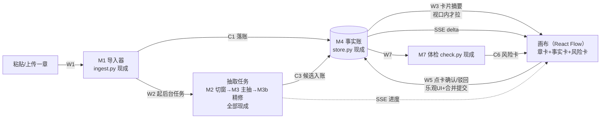

# 网页版 MVP 画布工作流设计稿 R01（WEB_CANVAS_MVP_DESIGN）

身份：**轻档设计稿。** 它接的是 CZ 2026-08-13 点名的网页 MVP（原话：「网页也可以做一个 MVP 版的，因为它的核心就是那个画布工作流。一张内容进来之后，这个画布工作流它是可运行；然后流畅度需要很高，不然体验就会很差。网速的话，如何在最少的网速能够达到最好的效果？……如何解决频繁交流信息？还是说有信息缓存？」）。这段话就是本稿的验收标准，拆开是三件事：**一张内容进来链路可运行、画布流畅、低网速下体验不塌**。技术底盘按第三册挂账本 ADD-025/026 已拍口径＋4356 技术选型回包展开；交互口径按背景板 R10 草案 02 页「画布真身」＋ **ADD-036／A14·A15、ADD-037 反向拆卡** 亲拍。不是施工合同；接口和字段是建议形状。M8 后端未建时画布只留卡位，不出网页绿场。

出处简写：

| 简写 | 文件 |
|---|---|
| ADD-025/026 | 第三册挂账本（小说架构仓，路径含中文，复制用）：`/Users/a1234/挣钱/小说架构/TEMP/bgboard-audit-20260809-r01/26_R09_ADDENDUM_LEDGER_VOL3_20260813_R01.md` |
| 4356 | 技术栈选型回包（复制用）：`/Users/a1234/挣钱/小说架构/TEMP/external_returns_batch2_20260813/raw/4356结论.md` |
| 交互模型 | 背景板 R10 草案 02 页「画布真身＋点哪问哪＋聊天框」（复制用）：`/Users/a1234/挣钱/小说架构/references/shared-context/NOVEL_ARCH_SHARED_CONTEXT_CORE_MATERIALS_20260813_R10_DRAFT/02_SYSTEM_ARCHITECTURE_AND_TRUTH_LAYERS.md` |
| ARCH | [ARCHITECTURE.md](../ARCHITECTURE.md)（M0–M11 模块清单＋C1–C9 合同） |
| WRITING_DESK | [WRITING_DESK_DESIGN_R01.md](WRITING_DESK_DESIGN_R01.md)（K3 左小抄右净桌＋当场检测三选） |
| 首屏 | [FIRST_SCREEN_SYSTEM_DESIGN_R01.md](FIRST_SCREEN_SYSTEM_DESIGN_R01.md)（三层动线，网页版最终要长进去的壳） |

界面元素、按钮文案一律示意非定稿（这句只说这一次）。

---

## 0. 一句话＋一张图

说白了就是：**把现在 CLI 里已经跑通的「导入→抽取→确认→入账」那条链，搬到浏览器里变成一张画布——章是卡、事实候选是卡、风险是卡，作者在卡上点确认，账就落了；画布只画你看得见的那一块（视口渲染＋LOD），数据分层拉、本地有缓存、变更走轻量增量，所以卡片几千张不卡、网速很慢也能干活。**

核心三句话（CZ 快读）：

1. **后端一行业务逻辑都不新写**：M1–M7 全部现成，网页版只加一层薄 API 皮（FastAPI）把它们暴露出来，外加一条「变更推送」通道。链路里唯一的新东西是画布前端本身。
2. **画布是投影，不是第二本账**（ADD-025 第 2 条）：事实、章节永远在 M4 的账里走 API；画布只存「哪张卡摆在哪」这一层布局，删了布局随时能从账里重建。「画布真身」说的是交互中心，不是存储中心。
3. **低网速的答案＝分层＋增量＋缓存三板斧**：首屏只拉骨架和视口内摘要（一本百章书约十几 KB）；之后只收轻量 delta（一条状态变更约 150 字节）；代码包、SVG、已确认事实全部本地缓存带版本失效。频繁交流的不是数据，是几百字节的小包。

## 1. 一张内容进来的最短可运行链

CZ 验收标准第一条。每步标注：调用哪个现成模块、新增什么接口（W 系列＝Web API，新件）。

| 步 | 作者看到什么 | 现成模块 | 新增接口 |
|---|---|---|---|
| ① 粘贴/上传一章 | 导入屏：粘贴框＋拖文件区，点「导入」 | M1 `ingest.ingest_text/ingest_files`（C1 落账＋损失报告） | **W1** `POST /api/projects/{p}/chapters`（body＝标题＋正文 或 multipart 文件） |
| ② 后端跑抽取管线 | 画布上出现一张「任务卡」，进度条走：切窗 n 段→主抽→精修五段 | M2 `segment.build_segments`→M3 `extract`→M3b `refine`（补漏/验真/去噪/去重，质量小票现成） | **W2** `POST /api/projects/{p}/chapters/{c}/extract` 起后台任务；**W6** `GET /api/projects/{p}/events`（SSE）推进度 |
| ③ 候选落画布 | 该章卡下方长出一排事实卡（候选态，黄边），每张一句事实＋状态 | M4 `store` 入账（status=extracted），refine 的 origin/verify 审计字段随卡 | **W3** `GET /api/projects/{p}/cards?bbox=…`（视口内卡片摘要，带 rev）；**W4** `GET /api/projects/{p}/facts/{id}`（详情：quote＋审计） |
| ④ 点卡确认/驳回 | 卡上两个键；点确认卡先变「确认中」灰勾（乐观 UI），几百毫秒后变实勾绿边 | M4 `store.set_status`（CLI confirm 命令的同一段逻辑） | **W5** `POST /api/projects/{p}/facts/decide`（批量体：`[{id, action}]`，见 3.4 请求合并） |
| ⑤ 入账 | — | M4 状态翻 confirmed/rejected，全局 rev+1 | （W5 的服务端半边） |
| ⑥ 画布概览更新 | 章卡角标刷新（候选 12→11，已确认 3→4）；项目概览卡计数跳动 | 计数从 M4 现查；体检按钮走 M7 `check` 出 C6 风险卡 | SSE delta 广播（W6 复用）；**W7** `POST /api/projects/{p}/check` 起体检任务＋`GET .../report` |

三条补充：

- **W 系列是皮不是脑**：每个 W 接口内部就是一次对 mvp/ 模块函数的调用，跟 `cli.py` 的各 cmd 函数一一同构——M0 编排器从「CLI 入口」长出「Web 入口」第二个头，ARCH 里 M0 那行本来就写着「CLI／未来 Web 入口」。业务逻辑一行不挪窝。
- **后台任务用最笨的做法**：抽取一章要多次模型调用（分钟级），W2 起一个进程内任务队列（单机单人，先不上 Redis/Celery，4356 同款建议「先用 jobs/outbox，吞吐上来再引」），任务状态进 SSE。浏览器关了任务照跑，回来看结果。
- **点哪问哪的最小版**：点任何事实卡出局部菜单——「看原文依据」（W4 拉 quote，跳证据）、「就这条问一下」（走 M6 `ask.search_confirmed` 关键词版，**W8** `GET /api/projects/{p}/ask?keywords=…`）。交互模型第 2 原则在 V0 的落法。

## 2. 画布对象模型

### 2.1 卡片类型清单

| 卡 | 数据源 | 正身/顶替 | 卡面（近景） |
|---|---|---|---|
| **章卡** | C1（chapters.json：id/title/kind/字数） | 正身 | 标题＋字数＋候选/已确认/驳回三计数角标＋「抽取」「体检」按钮 |
| **事实卡** | C3 候选＋C4 已确认（facts.json：text/quote/status/chapter_id＋refine 审计字段） | 正身 | 事实句全文＋状态色边（黄=候选/绿=确认/灰=驳回）＋确认/驳回键＋「看依据」 |
| **人物卡** | 事实句实体名频次＋M7 的 alias_hints | ⚠️ 顶替：人物账（CH- 编号）未建，V0 是**派生聚合视图**——同名实体的相关事实数＋别名提示，不落账 | 名字＋牵涉事实数＋别名疑似提示 |
| **概览卡** | 项目计数（M4 现查） | ⚠️ 顶替：M9 故事概览＋C5 未建，V0 是统计卡（章数/候选数/已确认数/体检灯）；M9 落地后换成「梗概＋SVG 配图」正身，卡位现在就留 | 四个数字＋体检红黄灯 |
| **风险卡** | C6 体检报告（conflicts/insufficient/alias_hints 三账分开） | 正身 | 矛盾描述＋涉事双方引文＋severity 灯；点开跳两条事实卡 |
| **任务卡** | 后台任务状态（运行态，不落账） | 新件（运输区性质） | 任务类型＋进度条＋失败重试键 |

卡片间的线 V0 只画两种：章卡→其事实卡的归属线（LOD 中景以上才画）、风险卡→涉事事实卡的指认线（点风险卡才亮）。关系线比节点更早成为瓶颈（4356 原话），V0 不做全量关系图。

### 2.2 视口渲染＋LOD：三档（4356 方案照抄，数值替拍）

| 档 | 缩放 | 显示什么 | 不渲染什么 |
|---|---|---|---|
| 远景 | zoom < 0.4 | 章簇色块＋计数徽标（一章一块） | 单条事实卡一律不挂 DOM |
| 中景 | 0.4–0.9 | 章卡完整＋事实卡缩成一行（前 20 字＋状态色条） | 按钮、引文、归属线细节 |
| 近景 | > 0.9 | 事实卡完整（全文＋按钮＋状态） | quote/审计详情仍不内嵌——点卡才走 W4 拉，进侧栏 |

配套纪律（全部来自 4356 实践清单，写进施工合同）：视口外＋半屏 overscan 之外的卡不挂载；选中/拖拽中的卡不裁；拖拽和缩放**过程中锁定档位**，手松了再切档，防全画布反复重排；卡片 `React.memo`＋只订阅自己那条数据；拖拽坐标画布内部高频更新，`dragEnd` 才提交；`onlyRenderVisibleElements` 压测后再决定开不开（它自己也有计算成本）。

### 2.3 画布状态与领域数据的边界

| 数据 | 存哪 | 走什么通道 |
|---|---|---|
| 事实/章节/状态（领域真值） | M4 事实账（服务端） | 恒走 API（TanStack Query 管），画布永不私藏一份可改写的副本 |
| 画布布局（`object_id/x/y/collapsed`） | 服务端 `data/<项目>/canvas_layout.json`（**W9** `GET/PUT .../canvas-layout`）＋本地副本 | 默认布局机械生成（按章分列，事实卡挂章下），作者拖过的卡才记；「重置布局」一键重建——可重建投影的字面落实 |
| 选中/缩放/侧栏开合（临时 UI 态） | Zustand，只活在内存 | 不存不同步 |
| 未提交的确认操作/草稿 | IndexedDB（outbox，见 3.4） | 提交成功即清 |

一句话记忆：**账走 API，布局走布局文件，手感留内存，欠账进 outbox——四层谁也不冒充谁**（4356「不要让同一份节点数组存四份」的正面表述）。

### 2.4 按章工作流、时间轴、反向拆卡【ADD-036／A15＋ADD-037／A9】

- **按章一张工作流**：默认单位是一章——任务卡、连线、红黄灯、接收区。不是全书一张星图。
- **时间轴是分离的预览**，不跟章工作流叠在同一张默认视图上。章分列仍可当工作流的机械布局；想看故事流，另开时间轴预览，不动账。
- **反向拆卡**：作者先有结局／画面时，把目的交给工作流——「要达成这个，前面得先达成什么？」向前生成前置卡。不另起打字入口。轻按钮「我已有画面」只负责把这句话送进来。
- **聊天框（A14）**：先把已有 MCP 能力露出来（只读查账＋提案）。意图识别只分三类：探讨 ≠ 真改 ≠ 查询。探讨不改账、真改走作者确认、查询走取证。冲突丢给质检，不在聊天里偷偷改。V0 聊天可以仍薄，但不再写成「已降级成关键词框、等 CZ 拍」。

## 3. 低网速优化设计（CZ 重点）

CZ 的原话拆成两问：①最少的网速怎么达到最好效果？②频繁交流信息怎么办，是不是要缓存？本节的答案：**该缓存的全缓存（②），剩下必须走网的做小做增量（①）**。

### 3.1 数据分层加载：首屏最小包 → 按需拉详情

| 层 | 内容 | 估算字节（gzip 后） | 什么时候拉 |
|---|---|---|---|
| L0 代码包 | React＋React Flow＋TanStack Query＋Zustand＋CodeMirror 6 | ⚠️ 约 200–280KB（一次性；hash 命名强缓存，第二次访问 0 字节） | 首次访问 |
| L1 骨架 | 项目元信息＋章列表（id/title/计数）＋画布布局 | 百章书约 8–15KB | 打开项目 |
| L2 视口摘要 | 视口内卡片的 id/一行文/状态/rev | 每卡约 180B 原始；300 卡约 54KB 原始 ≈ **10–15KB** | 视口变了才拉（W3 带 bbox），已缓存且 rev 未变的卡不重复传（见 3.3） |
| L3 单卡详情 | 事实全文＋quote＋审计字段 | 每卡 0.5–1.5KB | 点开卡才拉（W4） |
| L4 章正文 | 全文（写作区/证据跳转用） | 3000 字章约 3–4KB | 进写作区或点「看原文」才拉 |

⚠️ 字节数全是估算未实测，压测时校准（第 6 节 V-6）。要点是形状：**首屏可交互只需要 L0（多为缓存命中）＋L1＋L2，热缓存下总共二三十 KB**——2G 网也就是几秒的事。

### 3.2 增量同步：SSE 主通道＋版本号轮询兜底

变更不整页刷新，推轻量 delta：`{type:"fact_decided", id, status, rev}` 一条约 150 字节。通道两个候选：

| 方案 | 弱网表现 | 判词 |
|---|---|---|
| 轮询（每 N 秒 GET） | 每次请求头就 500B–1KB 开销，空转也花流量；间隔长了确认回执慢 | 只配当兜底 |
| **SSE 单连接** | 一条长连接零重复头开销，有事才下发字节；断线带 `Last-Event-ID` 重连补漏；4356 本来就推荐 SSE 管任务进度 | ✅ 推荐 |
| WebSocket | 双向能力用不上（上行本来就走普通 POST），多人协作才需要 | ❌ V0 不上（4356 同判） |

👉 **推荐：SSE 一条连接同时推任务进度和账本 delta；SSE 断开或被代理掐掉时自动回退成 30 秒轮询 `GET /api/projects/{p}/changes?since_rev=N`**（全局 rev 是游标，漏多少补多少）。单人单机场景下这套的服务端成本接近零。

### 3.3 缓存策略：哪些能缓存、哪些必须实时

**SVG（细化 ADD-025 第 4 条 / N1）**：URL 定死 `/assets/{projectId}/{assetId}/{revision}-{sha256}.svg`——编号是逻辑身份，revision+hash 是内容身份，**永不原地覆盖**（防 CDN/浏览器拿旧图）。取图流程：IndexedDB 查编号→当前 revision URL → `cache.match(url)` 命中直接用 → 未命中才联网，下载后先写 Cache API 再更新 IndexedDB 索引（含大小/最后访问时间，LRU 清理）。重生成不满意时的旧版还在缓存里，回退零流量。V0 不上 Service Worker（4356 判词：应用代码直接读写 Cache API 就够，等承诺「整本离线」再上 Workbox）。

**事实/卡片数据**：IndexedDB 存卡片摘要和已拉过的详情，键＝`fact_id`，值带 `rev`。W3 请求带上「我已有这些卡的这些 rev」摘要（bloom 或简单列表），服务端只回 rev 变过的——**弱网下二次打开画布，L2 大头直接本地出，网上只走差集**。

**能缓存/必须实时清单**：

| 能缓存（带失效条件） | 必须实时（每次走网） |
|---|---|
| 代码包（hash，永久） | 确认/驳回的**最终结果**（乐观 UI 只是垫付，账以服务器回执为准） |
| SVG（编号+revision+hash，永久，LRU 限额） | 后台任务进度 |
| 已确认事实卡（rev 失效） | 体检报告的新鲜度（报告可缓存，但「账变过没有」要问服务器） |
| 章正文（章 rev 失效） | 登录态/权限 |
| 画布布局（本地副本加速，服务器为真源） | — |

**两条红线（ADD-025 原文，写进施工合同）**：本地缓存只是加速层，浏览器存储是 best-effort 随时可能被清，作者确认过的事实、正文、布局必须在服务端有真身；缓存按租户/项目隔离，**退出登录同步清空** Cache API＋IndexedDB＋outbox（政策页删除承诺的前端半边）。

### 3.4 弱网降级：合并、乐观 UI、重试队列

- **请求合并**：确认/驳回不是点一下发一枪——300ms 窗口内的操作攒成一个 W5 批量包。作者刷刷刷连点 20 张卡确认，网上只走一个约 1KB 的请求。窗口极短，正常网速下无感。
- **乐观 UI**：点确认，卡**立即**变「确认中」灰勾（0ms 反馈），操作进 IndexedDB outbox；服务器回执到了变实勾＋rev 更新。⚠️ 乐观范围只覆盖确认/驳回/布局拖动这三类幂等小写；导入、抽取这种重活老实显示真实进度，不装快。
- **失败重试队列**：提交失败（断网/超时）不弹错打断——outbox 里排队，指数退避自动重发，画布右下角一枚「N 条待同步」小徽标；点开可看可手动重试。断网期间照样可以点确认（都进队列），网一恢复批量清账。冲突兜底：服务器发现该 fact 的 rev 已变（几乎不会发生，单人产品），回执标 conflict，本地回滚该卡＋提示。
- **上传降级**：粘贴导入本来就小（一章几 KB）；文件上传按章切片，断点续传 V0 不做（一章重传就重传，代价可接受）。

### 3.5 弱网指标目标（验收用）

⚠️ 数字是替拍目标值，无实测；压测（第 6 节）后校准。测试环境用 Chrome DevTools 网络节流档。

| 指标 | 目标 | 条件 |
|---|---|---|
| 首屏可交互（TTI） | ≤ 8s | Slow 3G（约 400kbps/RTT 400ms），空缓存冷启动 |
| 首屏可交互（热缓存） | ≤ 3s | Slow 3G，代码包/数据缓存命中 |
| 单次确认往返总字节 | ≤ 2KB（上行含头 ≤ 1.2KB，下行 ≤ 0.8KB）；批量 20 条 ≤ 3KB | 任意网络 |
| 确认操作本地反馈 | 0ms（乐观 UI）；服务器实勾 ≤ 1×RTT＋200ms | — |
| 2G 级（约 50kbps） | 核心操作可用：浏览已缓存画布、点确认/驳回（进队列）、看已缓存卡详情 | 允许任务进度延迟、SVG 新图慢 |
| 完全断网 | 已加载画布可浏览可标记，写操作全部排队，恢复后自动清账 | — |

## 4. 写作区嵌入

口径全套照 [WRITING_DESK_DESIGN_R01.md](WRITING_DESK_DESIGN_R01.md)（K3：左小抄右净桌、AI 零介入、当场检测标红三选），本节只讲网页版的落法：

- **编辑器直接 CodeMirror 6 起步**（ADD-025 第 5 条，跳过 textarea 阶段）：K3 的「写错标红」首日就要行内 decoration，CM6 只渲染视口附近内容，长章不卡。数据库只存纯字符串＋独立 anchor，不存编辑器内部文档树（4356 纪律）。
- **中文输入法闸门**：监听 `compositionstart/compositionend`，拼音组合期间机械检测（人名/数字本地对照）一律不跑，`compositionend` 后停顿约 2 秒才静默跑——防止「lin」还没打完就标红「林」。
- **布局**：左栏小抄（可折叠）＋右栏净桌，约三七开。⚠️ V0 顶替：章计划/PE 体系（M8）未建，小抄降级为**本章已确认事实清单**（从 W3/W4 现拉）——「照着账写」的最小版；M8 落地后小抄换成 C7 精简条投影正身，桌子不用重造。
- **性能隔离**：编辑区输入状态完全隔离在写作屏内，按键不触发任何画布更新；草稿 0.8–1.5 秒空闲后存 IndexedDB（本地运输区性质，收工才谈入库），弱网断网写作零影响——写作区是全产品最不怕弱网的屏。
- 模型级「查一下」按钮 V0 只留位不接线（检测对照的章计划还不存在）。

## 5. MVP 砍法：V0 四屏封顶

| 屏 | 装什么 | 对应链路 |
|---|---|---|
| ① 导入屏 | 粘贴框＋文件区＋导入损失报告展示 | W1 |
| ② 画布主屏 | 2.1 的六类卡＋确认/驳回＋点哪问哪局部菜单＋取证问答框（右侧收件箱收结果）＋体检按钮 | W2–W8，产品核心 |
| ③ 写作区 | 第 4 节 | 独立屏，从章卡进 |
| ④ 设置 | 缓存管理（占用量＋一键清空）＋退出登录（连带清缓存）＋正文去向偏好 | 3.3 红线的用户侧把手 |

**明确不做**（列出来防止施工时手痒）：

- 多人协作/实时共享光标（CRDT 整条线 MVP 不上，ADD-025 拍死）；
- 手机适配（后置到「响应式网页伴侣」线，Q5 已拍的另一条线，不混）；
- 聊天框不当万能改账口（A14 已拍：先暴露已有 MCP 只读＋提案；意图识别＝探讨≠真改≠查询，冲突走质检。V0 聊天可以仍薄，不再降级成「只有关键词、待 CZ 拍」）；
- 时间轴不跟章工作流叠成默认画布（A15：时间轴是分离预览）；
- M8 出题/停点系统/剧情层卡片的**网页画布**（CLI 可先出最小出题；画布只留卡位，本轮不开绿场）；
- M9 SVG 概览生成（同上；SVG 缓存管线按 3.3 先建好，等图来）；
- Service Worker/离线包承诺（3.3 已述）、自由绘制/手绘白板（tldraw 商用许可坑，ADD-025）、图数据库、自研画布内核；
- 撤销重做全画布历史、卡片自定义样式、导出画布为图片——都是装饰，V0 不配。

## 6. 压测与验收表（ADD-025 第 3 条落成可执行）

写进模块 README，中端设备（⚠️ 具体机型施工时定，建议 4 核 8G 内存的普通笔记本＋节流 CPU 4×）跑，卡片必须是**真实中文内容＋状态＋按钮**，不许拿圆点 demo 交差。

| # | 场景 | 规模 | 通过标准 |
|---|---|---|---|
| V-1 | 冷启动到画布可交互 | 总对象 1k / 3k / 5k | 1k ≤ 2s；5k ≤ 5s（本地网络，不含弱网项） |
| V-2 | 平移＋缩放 | 同屏完整卡 100 / 300 | 稳定 ≥ 55fps，无白屏闪 |
| V-3 | 平移＋缩放（占位档） | 同屏简化占位 800 | ≥ 30fps 可用 |
| V-4 | 单卡更新（确认一条） | 3k 总对象在场 | 只有该卡及其角标重渲（React Profiler 验证受影响组件数为常数），帧不掉 |
| V-5 | 框选＋拖动 50 张卡 | 3k 总对象 | 拖动 ≥ 30fps，dragEnd 一次提交 |
| V-6 | 弱网全套 | 3.5 节六项指标 | 逐项达标；字节数用 DevTools 实测回填 3.1 估算表 |
| V-7 | 关系线压力 | 每节点 2 / 5 / 10 条边 | 中景以上归属线不拖帧；不达标就砍线的显示密度（先砍线不砍卡） |
| V-8 | 缓存纪律 | 退出登录 | Cache API＋IndexedDB＋outbox 可验证清空；换账号登录看不到前一租户任何缓存 |

验收口径一句话：**「100–300 张完整卡同屏流畅、800 张占位可用」是承诺；「5k 张完整卡同屏」不承诺**（4356 判词原样）。

## 7. 替拍决策记录（供 CZ 复查）

按第三册挂账本授权替拍，逐条列出；`PROXY` 是工程选择。A1／A2 原 `ASK_CZ` 已由 ADD-036 亲拍销账。

| # | 决策 | 状态 | 一句话理由 |
|---|---|---|---|
| P1 | 薄服务端用 FastAPI 包现有 mvp/ 模块，W1–W9 九个接口，业务逻辑零重写 | `PROXY` | 4356 同款建议；M0 本来就预留了 Web 入口身份 |
| P2 | **V0 存储沿用现有 data/ JSON 文件**（store.py 不动，加全局 rev 计数＋条目 rev 字段），托管 Postgres 定为 V1 迁移项，触发条件＝多用户或并发写出现 | `PROXY` ⚠️ | ADD-025 拍的 Postgres 我理解为正式版选型方向；V0 单人验证期为迁库停两周不值。CZ 若要求首日就上 Postgres，改判只影响 store.py 一层 |
| P3 | 增量同步＝SSE 主通道＋rev 游标轮询兜底；不上 WebSocket | `PROXY` | 3.2 的取舍表 |
| P4 | 确认/驳回 300ms 窗口请求合并＋乐观 UI 只覆盖幂等小写（确认/驳回/布局） | `PROXY` | 弱网字节预算的主要来源 |
| P5 | 全局 rev 单调计数作为增量同步游标（每次写账 +1） | `PROXY` | 轮询兜底和缓存失效共用一个游标，最笨最稳 |
| P6 | 人物卡/概览卡 V0 用派生顶替（2.1 表），卡位留正身位 | `PROXY` | 人物账、M9 未建；顶替物都是只读投影不落账 |
| P7 | 画布默认布局＝按章分列机械生成，拖过才存，可一键重置 | `PROXY` | 「可重建投影」的直接推论 |
| P8 | 弱网指标数字（3.5 全表）＋字节估算（3.1 全表） | `PROXY` ⚠️ 无实测 | 先立靶再校准，V-6 回填 |
| P9 | V0 写作区小抄内容＝本章已确认事实清单（顶替章计划） | `PROXY` | M8 未建；桌子形状按 WRITING_DESK 建好，换料不换桌 |
| P10 | 四屏清单＋「明确不做」清单（第 5 节） | `PROXY` | 任务书建议四屏，照收 |
| A1 | **聊天框先暴露 MCP**；意图识别（探讨≠真改≠查询）；冲突走质检。V0 聊天可薄（先接已有只读＋提案），不把 MCP 写成万能改账 | `CZ_CONFIRMED` | ADD-036／A14 亲拍销账 |
| A2 | **按章一张工作流**（任务卡＋连线＋红黄灯＋接收区）；**时间轴是分离预览**，不跟章工作流叠成默认视图 | `CZ_CONFIRMED` | ADD-036／A15 亲拍销账 |

## 8. 来源与追溯

- CZ 原话需求（验收标准）：2026-08-13 网页 MVP 点名，本稿开头全文引用。
- ADD-025（选型/投影/性能口径/SVG 缓存/CM6）、ADD-026（SVG 视觉系统，本稿 3.3 只用其缓存侧）：第三册挂账本（复制用）`/Users/a1234/挣钱/小说架构/TEMP/bgboard-audit-20260809-r01/26_R09_ADDENDUM_LEDGER_VOL3_20260813_R01.md`
- 技术底稿：4356 回包（复制用）`/Users/a1234/挣钱/小说架构/TEMP/external_returns_batch2_20260813/raw/4356结论.md`——画布方案对比、LOD/裁剪实践、Cache API/IndexedDB 分工、SSE 推荐、压测矩阵全部出自它。
- 交互模型＋亲拍：背景板 R10 草案 02 页（复制用）`/Users/a1234/挣钱/小说架构/references/shared-context/NOVEL_ARCH_SHARED_CONTEXT_CORE_MATERIALS_20260813_R10_DRAFT/02_SYSTEM_ARCHITECTURE_AND_TRUTH_LAYERS.md`；ADD-036／A14·A15、ADD-037 反向拆卡。
- 现有模块与合同：[ARCHITECTURE.md](../ARCHITECTURE.md)（M0–M11/C1–C9）；`mvp/ingest.py`、`segment.py`、`extract.py`、`refine.py`、`store.py`、`ask.py`、`check.py`＋`contracts/` C1–C4/C6。
- 写作区口径：[WRITING_DESK_DESIGN_R01.md](WRITING_DESK_DESIGN_R01.md)（K3/K4）。

来源：Cursor 设计员（Fable 5），2026-08-13，依据 ADD-025/026＋4356 回包；2026-08-13 晚补 ADD-036／037 亲拍（A1／A2 销账）。
