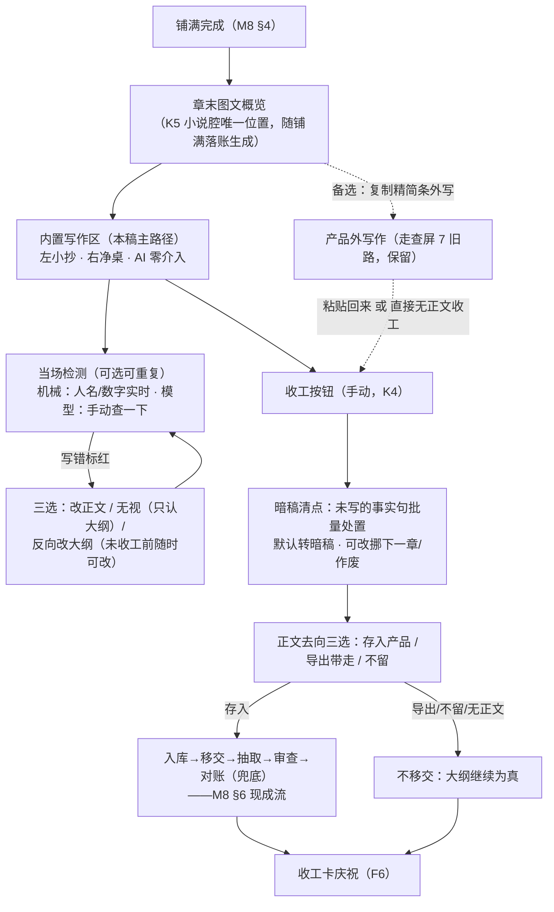

# 内置写作区＋对照检测＋暗稿机制 设计稿 R01（WRITING_DESK_DESIGN）

身份：**轻档设计稿。** 它接的是 CZ 第五轮校准的新拍板（ADD-018 K3/K4，兼吃 K5/K7）：产品要有**内置纯净写作区**——此前所有稿件假设的「作者复制章计划出去写、写完粘回来」被推翻，那是备选路径不再是主画面。本稿正面回答走查的 GAP-07（写作对照视图），并给 [M8_PLANNING_DESIGN_R01.md](M8_PLANNING_DESIGN_R01.md) 的收口流（§6）开出修订清单——本稿不改 M8 稿正文，清单在第 6 节。

出处简写：

| 简写 | 文件 |
|---|---|
| K3/K4/K5/K7 | 第二册挂账本 ADD-018 各节（小说架构仓，路径含中文，复制用）：`/Users/a1234/挣钱/小说架构/TEMP/bgboard-audit-20260809-r01/24_R08_ADDENDUM_LEDGER_20260813_R01.md` |
| M8 | [M8_PLANNING_DESIGN_R01.md](M8_PLANNING_DESIGN_R01.md)（收口流＋精简条＋C7＋F-4 会话包） |
| 走查 | [DAILY_LOOP_WALKTHROUGH_R01.md](DAILY_LOOP_WALKTHROUGH_R01.md)（屏 7＝被 K3 推翻的旧画面；GAP-07 现场） |
| REVISION | [CHAPTER_REVISION_DESIGN_R01.md](CHAPTER_REVISION_DESIGN_R01.md)（版本链＋同章重导） |
| STORAGE | [PLAN_LEDGER_STORAGE_DESIGN_R01.md](PLAN_LEDGER_STORAGE_DESIGN_R01.md)（PE 字段＋移交五件套＋流水） |
| 首屏 | [FIRST_SCREEN_SYSTEM_DESIGN_R01.md](FIRST_SCREEN_SYSTEM_DESIGN_R01.md)（三层动线，写作区的宿主层） |
| ADD-XXX | 第一册挂账本（复制用）：`.../18_R07_ADDENDUM_LEDGER_20260813_R01.md` |

全文界面元素、按钮文案一律示意非定稿（这句只说这一次）。贯穿例沿用走查的宋岸写《雾都灯师》第 4 章。

---

## 0. 一句话＋一张图

说白了就是：**产品里放一张干净桌子——左边章计划当小抄，右边一片纯文本编辑区，AI 一个字不碰你的正文；写的过程中随时可以「查一下」：我引出的事实句你写了没有、写错没有（文笔我不管）；点收工时清点一遍，写了的标已成文，没写的默认转「暗稿」——背地里发生了、读者没看到、仍然是事实。没有正文也能收工，检测是增值不是门票。**



核心三句话（CZ 快读）：

1. **桌子是死的，检测是活的**：编辑区就是一块纯文本，连自动补全都没有（K3 原话「AI 零介入零补全」）；产品的智能全部长在左边小抄和「查一下」按钮上，查的只有一件事——事实句覆盖，不碰文笔。
2. **暗稿＝已发生、未描写、仍是事实**：列了 130 条只写出 100 条，剩下 30 条默认当它发生过，打个标记完事；前提包照带（标注「读者没看到」）、体检照当事实——不承认它，前后剧情就会打架（K3 原话）。只打标记不处理，捞取归将来的暗稿插件（打标记哲学）。
3. **收工是手动按钮，正文是可选项**（K4）：有正文全检、有正文跳检、无正文直接收工，三条路都通；唯一必经的环节是暗稿清点。正文存不存也是作者的选择——存入走全链路（版本链/证据/对账都有），不存就大纲继续为真，代价明说不藏。

## 1. 写作区形态：左小抄，右净桌

### 1.1 在三层里的位置

写作区住**层 2 章工作台**（首屏稿的三层），是开工态的最后一段：门厅选线 → 摆桌 → 编排 → 出题 → 铺满 →（章末图文概览，见 1.4）→ **写作区**。入口＝铺满完成后章计划卡上的主按钮［开始写正文 →］；旁边保留小字入口「复制章计划外写」（走查屏 7 的旧路降为备选，精简条的「提示词工厂」身份不变，M8 §5）。

### 1.2 布局：两栏，比例大约三七开

```
┌──────────────┬──────────────────────────────────────┐
│ 小抄（可折叠）  │  第 4 章「验灯」            3,000 字目标   │
│              │                                        │
│ ▼ 场 1 雾中进城│  雾比昨夜更沉。陈更把残灯揣进怀里，       │
│   目标：食影首 │  出门前又摸了一次灯芯上那两个字。          │
│   次挨近      │  ……（纯文本，光标在闪，仅此而已）          │
│   □ PE-0413 陈│                                        │
│     更带残灯进 │                                        │
│     城        │                                        │
│   □ PE-0414 食│                                        │
│     影首次挨近 │                                        │
│ ▶ 场 2 雪夜的滋│                                        │
│   味（3 条）   │                                        │
│ ▶ 场 3 验灯（4 │                                        │
│   条）        │                                        │
│ ─────────    │                                        │
│ 🚫 红线（2）   │                                        │
│ 🪝 出口钩子    │                                        │
│ ✍ 写法指导    │                                        │
├──────────────┤                                        │
│ ［查一下 本场］ │                                        │
│ ［查一下 全章］ │            已写 1,214 字 · 自动存草稿 ✓  │
└──────────────┴──────────────────────────────────────┘
```

**左栏小抄**＝章计划精简条的活版本（同一份 C7 投影，M8 §5 的字段挑选原则原样沿用）：按场分组折叠，每场展开是场目标一句＋该场的事实句清单（PE 逐条，前面一个空框——检测过后打勾）＋信息释放点；小抄底部常驻三个抽屉：红线全量（含伏笔安全摘要）、出口钩子、写法指导。**小抄是只读投影**，想改计划点任何一条跳回章计划卡去改（不在小抄上改出第二真源）。

**右栏编辑区**＝纯文本。没有 AI 补全、没有联想、没有波浪线建议、没有任何模型触碰——这是 K3 钉死的：产品的「不代写」在这张桌子上是物理性的。编辑器本体用成熟纯文本组件，V0 不做富文本、不做排版（作者要发布格式，导出后自己排）。字数实时计、**本地草稿自动保存**——草稿是运输区暂存（同 TEMP 性质），不进账本、不进版本链、不给任何下游读，收工或放弃时清理；它存在只为一件事：写到一半断电不丢字。这不违反「尽量不存正文」——那条管的是账，不是防丢。

### 1.3 「哪一段对着哪部分抄」：手动锚定，不做滚动联动

三个候选比过：

- ❌ **滚动联动**（正文滚到哪、小抄跟到哪）：得实时判断「这段正文对应哪场」——那本身就是语义匹配，要么调模型（写作全程持续花钱＋打扰），要么机械猜（错了乱跳更烦）。
- ❌ **正文里插场标记**（写到场 2 输入分隔符）：往作者的稿子里塞产品符号，脏了净桌，导出还得洗。
- ✅ **手动锚定**（本稿采用）：作者点小抄上某场的标题＝「我现在写这场」，该场高亮展开、其余收起；写完点下一场。就这么笨，但每天最多点三次（一章常见三场），且完全不产生数据——锚定纯粹是小抄侧的阅读状态，检测不依赖它（检测模型自己判断段落归属，见 2.4）。

检测跑过之后有个自然的增强：判定「已覆盖」的事实句在小抄上自动打勾——小抄从「要抄什么」慢慢变成「抄完了多少」，对照定位的后半程由检测结果免费接管。

### 1.4 全屏专注模式＋小说腔的位置交代

- **专注模式**：一键把小抄收成左缘一条窄带，只留当前场目标一句＋红线数角标（🚫2）；悬停临时浮出，移开即收。检测按钮也收进窄带。要的就是一张纸一支笔的感觉。
- **K5 落位交代**：全产品 AI 文字默认说明腔，唯一小说腔位置＝**章末图文概览**——它长在「大纲创作完成与对照写正文之间」，即铺满落账时与 SVG 图绑定生成（同属创造性产物，K5）。作者从章计划进写作区的路上会路过它：一幅图接一幅图带故事梗概，看完带着画面感开写。写作区内部的一切系统文字（检测卡、清点屏、按钮）全部说明腔，一句小说腔不许有——位置唯一性靠这条守住。

## 2. 当场检测（核心）：查事实句，不查文笔

### 2.1 检测什么、不检测什么

K3 的口径一字不折：「描写方式你遵守不够我不管，但我引出的事实句你是不是都写了？没写是一回事，写错是另一回事。」

| 查 | 不查 |
|---|---|
| **覆盖**：本章每条 PE（计划事实句），正文里有没有对应内容——写了没写 | 文笔、风格、节奏、描写方式 |
| **正确**：写了但跟大纲说的不一样——大纲说 X 你写的是 Y | 写法指导有没有被遵守（那是建议不是账） |
| **红线**：must_not／伏笔安全摘要有没有被踩（提前抖底、写死不能死的人） | 正文内部自身的矛盾（那是体检的活，导入侧站岗，ADD-013 G7） |
| **人名/数字**（机械层，2.4） | 错别字、语病（V0 不做，编辑器不是校对器） |

边界一句钉死：**检测对照的是本章章计划，不是全书账本。** 全书一致性归体检（正文入库后的导入侧增量核对）；检测是写作时的「照着抄有没有抄对」，输入就是小抄那份料＋正文，轻、快、便宜。

### 2.2 时机：机械层随手跑，模型层手动点，收工前提示一次

三个候选摆开：

| 方案 | 成本 | 打扰度 | 判词 |
|---|---|---|---|
| 实时逐段（写完一段自动查） | 一章 3,000 字≈15 段，段段调用，一章十几次模型调用 | 写作心流最忌身后有人念叨；标红在你还没写完时就跳出来，等于 AI 在桌边指手画脚——违背净桌精神 | ❌ |
| 段落/场完成时自动 | 中（一场一次） | 「场完成」系统判不准（作者跳着写很常见），判错了就是乱查 | ❌ V0 不做，O1 留档 |
| **手动「查一下」**（本场/全章两档） | 作者控制，一章典型 3～5 次 | 零——他想被检查时才被检查 | ✅ 推荐 |

配套两条：

- **机械层免费常跑**：人名/数字对照（2.4）是本地零积分动作，打字停顿约 2 秒后静默跑一遍，命中才亮（右缘一枚小红点，不划正文不弹窗）——机械命中是确定性的（「林晚」逐字撞上别名表），不存在误报打扰。
- **收工兜底**：走「全检收工」路径时，点收工先强制跑最后一次全章检测（没查过或正文查后又改过，都在这里兜住）；跳检路径明确跳过（4.1）。检测调用计入 F-4 会话包（M8 §7），预估公式加一项「检测 2～3 次 ×（~2）」，不单独弹费用。

为什么「当场」成立：K3 说「检测是当场的，不是事后核对」——当场指**未收工、大纲还能反向改**的窗口期内（写错的可以当场决定改稿还是改大纲），不是指毫秒级实时。手动查完全满足这个语义。

### 2.3 标红交互：三选，不自动改

宋岸写完场 3 点「查一下 本场」。几秒后小抄和正文两侧同时亮：

```
检测完成（场 3 · 4 条事实句）：
✅ 已覆盖 3 ｜ ⚠️ 写得不一样 1 ｜ ◻ 未写 0
─────────────────────────────
⚠️ PE-0415 白翁验出灯油主人时脸色大变
   大纲说的是：白翁验出主人后「脸色大变」但拒绝说出是谁
   你写的是：白翁直接说出「这灯油……是拿你自己的记忆熬的」
   🔥 同时踩线：H-0001 残灯底牌预定第 6 章揭，这里提前抖了
   ［我去改正文］ ［无视：账上只认大纲］ ［按我写的改大纲］
```

三个按钮的账面语义：

| 按钮 | 谁动手 | 账上发生什么 |
|---|---|---|
| **改正文** | 作者自己改编辑区（系统永不代改正文——净桌铁律） | 无账务动作；改完可再查，红条消 |
| **无视（只认大纲）** | 作者点一下 | 该 PE 挂 `deviation_note`（「作者无视：正文写 Y，账以大纲 X 为准」）；若这章后来存入产品，抽取审查时正文侧的 Y 会自然进候选、跟大纲冲突由体检抓——账没撒谎，只是各记各的 |
| **反向改大纲** | 作者改 PE 文本（可就地改，落的是章计划那条 PE） | 普通编辑留痕 `rev`+1；未收工前大纲随时可改（K3/K4 原话）。若该 PE 已消化挂 OPT，改文本触发 P4 重核提示（既有机制，按作者档位停或不停） |

踩红线的条目（如上例提前抖底）永远置顶＋🔥标——它比「写得不一样」重：写岔了是偏差，抖底是事故。但处置仍是同三键，系统不拦（他的书他说了算，提醒过就闭嘴）。

### 2.4 机械与模型的分工（程序验机械、人验语义的写作区版）

| 层 | 查什么 | 怎么查 | 成本/时机 |
|---|---|---|---|
| **机械** | ①人名：正文出现的人名对照角色名＋别名表——表内名直接认；表外名且与在场人物编辑距离近 → 「你是不是想写林晚棠？（正文第 4 段写的是『林晚』）」②数字：章计划里出现的具体数字（年数、金额、次数）在正文里逐字对照 ③红线关键词：must_not 里的硬词（如被封禁的名字）出现即亮 | 本地字符串匹配，零积分 | 打字停顿静默跑，随时 |
| **模型** | ①覆盖判定：每条 PE 在正文里有无对应（语义级——「师妹送饭」写成「师妹提着食盒找来」算覆盖）②正确判定：对应上了但关键内容不符 ③红线语义级：暗示性泄底这种机械抓不到的 | 一次调用：输入＝本章 PE 清单＋红线＋信息释放点＋正文（本场或全章），输出＝逐条判定＋证据引文 | 手动触发，计入会话包 |

模型输出的机械校验（V0 级断言，同 M8 §3.5 家法）：判定的 `pe_id` 必须 ⊆ 输入清单；`evidence_quote` 必须逐字存在于本次正文（防拿幻觉当证据）；**每条输入 PE 必须被判进 covered/mismatch/missing 三态之一**，漏判强制进 missing——检测不许藏账（同对账覆盖率兜底思路，M8 §6.3）。检测卡是派生视图不落账；落账的只有作者的处置结果（deviation_note、PE 改动、勾选状态）。

## 3. 暗稿机制：没写的，默认已经发生

### 3.1 收工清点：一张批量界面

宋岸点收工。系统把本章 PE 清点一遍（有检测结果用检测结果，没有的按 4.1 路径规则预填），未写的摆上来：

```
第 4 章收工清点 · 11 条事实句
✅ 已成文 9（检测确认）——小抄上都打了勾，不再列
◻ 没写出来的 2 条——它们怎么算？
─────────────────────────────
默认：转暗稿＝这事发生了，只是没写给读者看（推荐，防前后打架）
│ ◻ PE-0416 陈更质问白翁失踪当晚为何来过铺子   ［暗稿 ▾］
│      ▾ 可改：挪去下一章（我还想正面写它）／作废（这事没发生）
│ ◻ PE-0417 陈更注意到白翁柜上少了一盏灯       ［暗稿 ▾］
─────────────────────────────
［按上面的处置收工 →］     ［回去再写会儿］
```

处置三选的语义分工（为什么是三个不是 K3 说的两个）：K3 拍的是「默认转暗稿＋可单条改作废」；本稿补第三键「挪下一章」，因为它语义上跟前两个都不同——暗稿＝发生了不写，作废＝没发生，挪＝发生了**且我还要正面写**（走查屏 10 宋岸挪 PE-0416 就是这个真实需求）。挪的机制现成：改期留痕、落进下一章要点汇聚屏「上章遗留」区（M8 §6.3 未写桶原路）。默认键顺序：暗稿置顶（K3 拍的默认）。

批量体验：全部默认暗稿，一键收工零逐条点击；想改哪条点开哪条。30 条没写也是一屏一键的事——清点是打标记，不是审判。

### 3.2 字段设计：一个成文状态＋一个判定来源，只打标记

STORAGE 的 PE（§1.6）增补两个字段（提交存储稿升版清单，第 6 节）：

| 字段 | 类型 | 值域 | 人话 |
|---|---|---|---|
| `prose_status` | enum | `unwritten`（出生值）／`written` 已成文／`dark_draft` 暗稿 | 这条事实句读者见没见过 |
| `prose_basis` | enum/null | `verified` 检测确认／`self_reported` 作者自报／null（未收工） | 谁说它成文的——诚实标注证据等级 |

四条配套规矩：

- **暗稿不是消化状态也不是作废**：`digest_status` 照旧管「计划安排了没」（暗稿的 PE 通常是 `digested`——当初安排了，只是没写）；清点里点「作废」才翻 `digest_status: voided`（既有语义留痕）。两个维度正交，不混。
- **打标记哲学落到底**（K3 原话「很多位置内容先打标签，后续想用随时抓」）：V0 对暗稿做的**只有**打上 `dark_draft` 这个标记＋流水一行；不建暗稿清单页、不做捞取提醒、不做「暗稿该回收了」的相位——那些全归将来的暗稿插件（要捞的时候按 `prose_status=dark_draft` 一查全出来，标记就是接口）。
- 收工动作在槽位上落一个 `closeout` 对象：`{mode: full_check/self_report/no_prose, closed_at, dark_count, prose_disposition: stored/exported/discarded}`——一章收工的账面身份证，收工卡和下游都从这读。
- 流水动作词加 `closeout`、`dark_mark`（STORAGE §7 词表增补）。

### 3.3 暗稿在下游的裁决：暗稿＝事实，只是 undescribed

这是本稿最重要的一个裁决，钉死：

> ✅ **暗稿是真事实。它跟普通事实的唯一区别是「读者没看到」。**

| 下游 | 带不带暗稿 | 怎么带 |
|---|---|---|
| **前提包（C9/M11）** | ✅ 必须带 | 已收工章的 PE 按成文状态装入；暗稿条目带标注「已发生·未向读者描写」。为什么必须：K3 的原理由——这些句子可能既引发本章也引发后续剧情，出题时 AI 不知道它发生过，就会安排出跟它打架的剧情 |
| **体检（M7）** | ✅ 当事实 | 正文与暗稿冲突＝真矛盾照亮灯；不因「没写出来」降级 |
| **读者可知性判断**（知情差、揭示节奏、概览） | ❌ 按「读者不知道」算 | 暗稿≠底牌（它不是伏笔，没有防泄语义），但读者视角的一切产物（章末概览、揭示时机建议）不得把暗稿当已展示内容 |
| **取证问答（M6）** | ✅ 可引用 | 答案里如实标「这在账上成立，但正文未描写（第 4 章暗稿）」 |

一个必须交代的张力：C4 铁律说「只有 confirmed 的 F- 是真值」，暗稿没有正文、永远抽不出 F-，它凭什么当事实？答：**凭作者签字。** 收工清点里点「转暗稿」是一次显式确认动作——作者亲口认定「这事发生了」，效力等同他在审查台确认一条事实。暗稿的账内正身＝规划账里 `prose_status=dark_draft` 的 PE，它不进 F- 账（两本账不混），但打包器和体检把它列为**作者认定的事实源**读取，来源老实标「暗稿」。F- 账一个字不动，铁律不破。

## 4. 正文可选的收工语义：三条路，一张清点屏

### 4.1 三路径流程与账面差异

收工其实是两个正交开关：**检测跑没跑 × 正文存没存**。摊平成作者视角的三条路（K4：「没有正文也可以点收工」）：

| | A 有正文·全检 | B 有正文·跳检 | C 无正文·直接收工 |
|---|---|---|---|
| 流程 | 收工键→强制末次全查→处置完标红→暗稿清点→正文去向三选 | 收工键→提示「跳过检测？」→暗稿清点（全部 PE 摆出，作者手勾「写了」，没勾的走暗稿默认）→正文去向三选 | 收工键→问一句「这章在别处写完了，还是先不写正文？」→暗稿清点（预填见下）→收工 |
| `prose_basis` | `verified` | `self_reported` | `self_reported` |
| 清点预填 | 检测结果自动填 | 默认全勾「写了」，作者扫一眼改 | 「别处写完了」→默认全 written；「先不写」→默认全暗稿 |
| 正文入库/版本链 | 存入才有 | 存入才有 | 无 |
| **真值接力棒** | 存入→移交，正文为真；不存→**不移交，大纲继续为真** | 同左 | **不移交，大纲继续为真** |
| 对账（P13） | 存入→照跑（此时是兜底，未写桶预期为空）；不存→不跑 | 存入→照跑（跳检时对账是唯一核对）；不存→不跑 | 不跑（没料） |
| 事实抽取/证据坐标/取证 | 存入才有 | 存入才有 | 无——这章的事实层＝已收工的 PE（含暗稿） |

两处就地裁决：

- **裁决一：不移交的收工是合法状态。** ADD-010 的移交触发点是「正文入库」；无正文（或不存正文）收工时没有入库，真值接力棒**不交**——大纲继续为真（`truth_bearing` 保持 `primary`），槽位 `slot_status` 加新值 `closed`（已收工·无正文入库），跟 `handed_over` 并列。为什么对：K4 说正文对照是可选增值不是流程必经，那么「移交」这个以正文为前提的动作自然也不能是收工的必经；账上老实分两种收工态，谁也不冒充谁。
- **裁决二：收工后大纲锁定编辑吗？不锁，但反向改大纲的自由窗口关闭。** K3 原话「未收工前都可以改」——收工后再改本章计划走普通编辑＋P4 重核，跟改任何历史章计划同权；「写错了顺手改大纲迁就」的快捷通道只在写作区窗口期内。

### 4.2 与版本链的关系（REVISION 对接）

- 写作区稿子「存入产品」＝走既有单章入库流，版本链 rev 1 起建（REVISION §1.2 的 `versions[]`，`source_ref` 记「写作区收工存入」）——这就是 K3 说的「用户导入的才存」：作者点了存入，就是一次导入。
- 日后改这章：章卡「更新本章正文」可以**把现行版载入写作区**继续改（左小抄换成当时的章计划投影），收工存入＝同章重导（版本链 rev+1、事实三类分流，REVISION §2–3 全套现成）。写作区从此也是改稿的桌子，重导不再只有粘贴框一个入口。

## 5. 正文存不存：裁决与调和

K3 说「尽量不存正文（用户导入的才存；用户存的也只作参考）」；版本链稿和证据坐标体系又整个建立在正文存在之上。调和方案：

**「尽量不存」是姿态条款，管的是默认与主权，不是禁令。** 拆成三句话：

1. **产品不扣稿**：写作区的稿子在收工前只是本地草稿（1.2），不进账；收工时**正文去向三选**——［存入产品］［导出带走（剪贴板/txt，产品不留）］［不留］。不存是完整可走的路，不是残废模式。
2. **存了也只作参考**：正文入库后它是证据底座（版本链、quote、体检、对账都靠它），但产品的真值大梁是事实句层——「参考」的准确含义是：产品永远不拿正文做二次创作输入，不喂写作模型（J1 红线），只做核对与取证。
3. ✅ **推荐默认＝存入**，首次收工时问一次、记住偏好（设置可改）。为什么敢推荐存：不存的代价是实打实的——这章没有 F- 事实、没有证据坐标、取证问答对它失明、改稿重导无从谈起，「可核验」卖点在这章上是空的。清点屏上把代价一行写明（「不存：这章将只有大纲账，正文相关功能不可用」），知情后选不存是他的自由。

一句话记忆：**不存是权利，存是推荐；草稿暂存不算存，签字入库才算存。**

## 6. 与 M8 收口流的对接：新流一图＋修订清单

### 6.1 新收口流（本稿视角）

```
写作区写完 → 当场检测已处置完（A 路径）→ 收工按钮 → 暗稿清点 →
正文去向三选 →（存入：入库→移交→抽取→审查→对账兜底）→ 收工卡庆祝
```

旧流的「①粘贴新章→②入库」不再是收口的起点，而是「存入产品」这一个按钮的内部动作——粘回入库变成写作区的自然产物。外写路径（复制精简条出去写）保留，粘贴框还在，殊途同归到同一张清点屏。

### 6.2 M8 稿（R02 时）的修订点清单——只列不改

| # | 位置 | 修订 |
|---|---|---|
| 1 | §0 一图⑦⑧步 | 「复制精简条→产品外写」改为主路径「进内置写作区」，外写降备选 |
| 2 | §5 写正文的交接 | 精简条降为外写路径出货形态（提示词工厂身份保留，J1）；GAP-07 标注「已由 WRITING_DESK 稿正面关闭」 |
| 3 | §6.1 七步表 | 第①步入口双轨：写作区「存入产品」自动触发入库（无粘贴动作）；粘贴保留给外写者。②–⑧机制不变 |
| 4 | §6.2 裁决一 | 语义扩展：写作区存入＝同一下自动移交（原裁决精神不变）；**新增第三态**——无正文/不存收工不移交，槽位 `closed`，大纲继续为真（本稿 4.1 裁决一） |
| 5 | §6.3 对账未写桶 | 三键升四键：「转暗稿」置顶为默认（K3），挪下一章/作废/就这样保留；并注明全检路径下未写桶预期为空（当场检测已前移处理），对账降级为兜底核对 |
| 6 | §6.5 完成态判定 | 按收工路径分叉：存入路径＝原三条件（移交∧审查清账∧对账无未处置）；无正文/不存路径＝暗稿清点完成即达成。收工卡统计加一行暗稿数（「转暗稿 2 条——它们发生了，读者还不知道」） |
| 7 | §7 会话包 | 预估公式加「当场检测 2～3 次×（~2）」项 |
| 8 | §8.4 存储增补清单 | 加本稿字段：PE `prose_status`/`prose_basis`；槽位 `closeout` 对象＋`slot_status` 新值 `closed`；流水动作词 `closeout`/`dark_mark`（词条「暗稿」「收工」交词典 N9） |
| 9 | 走查稿 | 屏 7「离开产品去写正文」加作废注：K3 推翻，内置写作区为主画面（走查感受与毛刺记录保留作历史证据） |
| 10 | C9/M11（落地时） | 打包规则加暗稿装载：已收工章 PE 按 `prose_status` 装入，`dark_draft` 带「已发生·未描写」标注（本稿 3.3） |

## 7. 角色 ID 在写作区（K7）：轻方案

K7 拍的是数据层原则：所有引用永远指向唯一角色 ID，不硬编码名字。写作区的问题具体一点——**作者手打人名，系统怎么知道他写的是谁**。轻方案三层，一层比一层便宜：

1. **机械层（免费，实时）**：角色名＋别名表（角色账现成）逐字匹配——正文里出现「林晚棠」「晚棠」都直接命中角色 ID，零调用零打扰。表外人名＋编辑距离近＝疑似写错，机械标红（2.4 已含：「你是不是想写林晚棠？」）——I-004 人名漂移在写作时就被摁住，不用等六周后自己找。
2. **模型层（搭检测的车，不加调用）**：「查一下」的输出里顺手带一张「本次正文人物→角色 ID」映射；映射不上的新名字（宋岸写嗨了加的哑巴学徒「小满」）在检测卡尾部亮一条：「『小满』是谁？［新角色，登记］［是某人的别名 ▾］［路人，不管］」。登记＝建角色 ID；挂别名＝alias 表加一行；不管＝本章不再问。
3. **收工兜底**：跳检/无正文路径没跑过检测，清点屏不做人名核对（没有正文或没花这个钱，不硬凑）；存入产品的稿子在抽取审查时走既有的新人名提示（走查屏 9 现成机制）。

不做的：实时 NER 常驻扫描（每敲几个字跑一次识别——成本和打扰都不配这个需求）；在编辑区里给人名上色/悬停卡（净桌不装饰）。改名一键全换（K7 的核心福利）发生在账本层——正文是作者的字，产品不代改；已存入的正文里旧名怎么办，归改稿重导（作者自己改，或不改——账上 ID 不变，渲染层的事）。

## 8. 开放问题（交 CZ 拍）

**O1｜模型检测要不要加一档「写完一场自动查」？**
场景：宋岸写完场 1 顺手点了下一场的锚定——系统其实能猜到「场 1 大概写完了」。要不要就着这个信号自动跑一次场级检测（一次小调用），省得他自己记得点？
- A. 不加（本稿现案）：手动「查一下」＋收工强制末查，触发权 100% 在作者手里
- B. 加，默认关：设置里「锚定下一场时自动查上一场」，想要的人自己开
- C. 加，默认开：多数人会忘记点查，自动查才让「当场检测」名副其实
- 👉 推荐 B：A 的纯手动对忘性大的作者等于没有当场检测（全堆到收工那次，跟事后核对没区别）；C 在作者只是「跳过去先写后面」时会误触发白花钱。B 让锚定这个已有动作免费长出第二用途，且不改任何默认成本。

**O2｜暗稿攒多了，产品要不要主动提一嘴？**
场景：宋岸写到第 20 章，账上暗稿累计 60 条——全是「发生了没写」的事。暗稿插件还没影，这 60 条就静静躺着。要不要在哪里给个数？
- A. 完全沉默（纯打标记哲学）：插件来之前一个字不提
- B. 只在收工卡报本章增量（「本章转暗稿 2 条」），全书累计数在书画布某个角落可查，不提醒不催
- C. 攒到阈值提醒「要不要回头看看暗稿」
- 👉 推荐 B：A 会让作者忘了这个机制存在（他点过的「暗稿」去哪了？）；C 是催办，违背「打标记不处理」的拍板精神。B 只陈述不催——数字看得见，动不动随他。

**O3｜正文去向的默认值，第一次问过之后还问吗？**
场景：宋岸第一次收工选了「存入产品」并勾了记住。第 15 章他其实想写一章只给自己看的番外，不想入库——但收工一键直接按记住的偏好存了。
- A. 记住偏好后不再问，清点屏上留一行小字可临时改（本稿现案）
- B. 每次收工都三选一遍
- C. 记住偏好，但「不存」类偏好每次仍确认（防止不知情地一直裸奔）
- 👉 推荐 A＋C 的后半句合体：默认存的人一键到底（高频路径零摩擦）；默认不存的人每次收工提醒一行「这章将不留正文（点此改）」——裸奔可以，但每章都知情。

## 9. 轻档自查记录

- 任务书八问逐项回对：①形态（§1：左小抄右净桌＋手动锚定裁决＋专注模式＋K5 落位）；②当场检测（§2：查什么表＋时机三案推荐手动＋标红三选账面语义＋机械/模型分工与输出断言）；③暗稿（§3：清点屏＋`prose_status`/`prose_basis` 字段＋打标记哲学四规矩＋下游裁决表「暗稿=事实 undescribed」）；④三路径收工（§4.1 矩阵＋不移交裁决＋K4「没有正文也可以点收工」落成 `slot_status: closed`）；⑤存不存裁决（§5：姿态条款三句拆解＋推荐默认存入＋草稿暂存定性）；⑥M8 对接（§6：新流一图＋10 条修订清单，未改 M8 稿一字）；⑦角色 ID（§7：机械表匹配＋搭检测车＋三个不做）；⑧开放问题 3 条（§8，场景＋选项＋推荐）——无缺项。
- K3 逐句吸收核对：「可手打可粘贴」（1.2 编辑区＋外写粘贴保留）；「章计划当小抄对照」（1.2/1.3）；「AI 零介入零补全」（1.2 净桌铁律＋7 节不做实时 NER/上色）；「没写是一回事写错是另一回事」（2.1 覆盖/正确两分）；「写错标红不自动改＋三选」（2.3 逐键落账）；「未收工前都可以改大纲」（2.3 反向改＋4.1 裁决二窗口期）；「默认已发生转暗稿＋理由防前后打架」（3.1/3.3）；「打标记哲学＋暗稿插件管捞取」（3.2）；「尽量不存正文三句」（§5）。K4 全文（§4）；K5 位置交代（1.4）；K7 轻方案（§7）。
- 与既有稿冲突自检：对账三桶未写处置与暗稿清点的关系已接线（清点前移、对账降兜底、三键升四键——§6.2 第 5 条）；移交触发点与无正文收工的矛盾以「第三态不移交」化解且标注为对 M8 §6.2 裁决一的扩展不是推翻；REVISION 版本链与「不存正文」以「存入=导入」调和（4.2/§5）；C4「只有 confirmed 是真值」与暗稿以「作者签字的规划账事实源，不进 F- 账」调和（3.3）。
- 例子自洽：宋岸第 4 章沿用走查数字（3 场、PE-0416 质问戏被删、小满新人名、林晚/林晚棠漂移）；清点屏 11=9+2；检测示例的 H-0001 提前抖底对应走查屏 3 选项三同款事故形态。
- 没发明新拍板：新字段全部标注提交存储稿升版（§6.2 第 8 条）；`closed` 槽位新值、四键升级、C9 暗稿装载均列为 M8 R02/合同升版建议；停点未新占号（清点屏是收工按钮的组成部分，作者主动动作；检测手动触发不设停点）；词条交 N9。
- ⚠️ 无实测清单：检测调用的准确率与成本（覆盖判定的漏报/误报率——随 M8 §1.6 真书实验加检测组）；机械人名匹配对绰号/代词的覆盖盲区；一章典型检测次数（预估 3～5 次未验证）；清点屏 30 条未写时的批量体验。

## 10. 来源与追溯

- 第二册挂账本 ADD-018（小说架构仓，路径含中文，复制用）：`/Users/a1234/挣钱/小说架构/TEMP/bgboard-audit-20260809-r01/24_R08_ADDENDUM_LEDGER_20260813_R01.md`——K3（本稿宪法：写作区/检测/暗稿/不存正文）、K4（正文可选收工）、K5（小说腔唯一位置）、K7（角色 ID 不硬编码）。
- [M8_PLANNING_DESIGN_R01.md](M8_PLANNING_DESIGN_R01.md)：§5 精简条（小抄的字段投影同源）、§6 收口流（本稿修订对象）、§6.3 对账三桶、§6.5 完成态与收工卡、§7 会话包 F-4、§3.5 机械校验家法。
- [DAILY_LOOP_WALKTHROUGH_R01.md](DAILY_LOOP_WALKTHROUGH_R01.md)：屏 7（被推翻的旧画面＋「旁挂精简对照条」的原始需求——写作区正是它的答案）、GAP-07、屏 9/10（小满、PE-0416 素材）。
- [CHAPTER_REVISION_DESIGN_R01.md](CHAPTER_REVISION_DESIGN_R01.md)：版本链＋同章重导（4.2 对接）、「用户导入的才存」的入库语义。
- [PLAN_LEDGER_STORAGE_DESIGN_R01.md](PLAN_LEDGER_STORAGE_DESIGN_R01.md)：PE 字段（增补宿主）、移交五件套与 `truth_bearing`（4.1 裁决一的地基）、流水词表。
- [FIRST_SCREEN_SYSTEM_DESIGN_R01.md](FIRST_SCREEN_SYSTEM_DESIGN_R01.md)：三层动线（写作区住层 2 开工态末段）、收工卡视觉与翻页语义。
- 第一册挂账本（复制用）：`.../18_R07_ADDENDUM_LEDGER_20260813_R01.md`——ADD-010（移交触发点）、ADD-013 G7（体检只属导入侧——检测与体检的分工依据）、ADD-017 J1（不给写作模型/不生成正文红线）、ADD-006（产出落画布）。

来源：Cursor（Fable 5 Max）设计，2026-08-13；拍板真源 CZ（ADD-018 K3/K4/K5/K7），待 CZ 拍 O1–O3。
