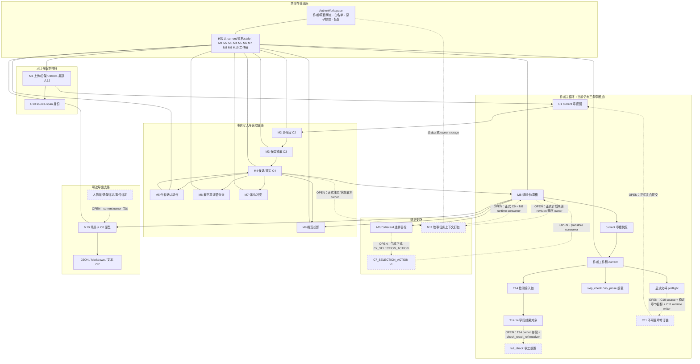

# GLOBAL CAPABILITY GRAPH AND NEXT WAVE REVIEW

> 身份：`ADVISORY_ONLY`。本报告不修改正式合同、R13、原子预期、代码、Gold、训练、生产、上传、作者真值或本地施工状态。
>
> 证据读法：`【背景目标】`说明产品应该是什么；`【正式合同】`说明已经冻结的语义与 owner；`【代码证据】`说明当前实现；`【直接测试】`说明对应机械行为；`【上游回执】`只说明有边界的最新局部结果；`【顾问推断】`是本报告在这些材料上的判断。

## 1. 一句话总判定

**当前已经不是“11 个孤立工具”：M1、M2、M4～M10 以及作者工作稿，大多形成了可独立运行、可经 AuthorWorkspace 保存、可重启读回、可识别过期、并有某种人读出口的局部能力；但作者主循环仍被三条窄缝切断——T14 结果缺 owner 持久化与引用解析、C7 选择缺正式 action 生成与 planstore 消费、作者工作稿缺 C10→C11→C1 的正式提交链。M3 的真实小说抽取质量与 M11 的正式 C9 仍未被证明。下一波应做 4 张窄施工票＋2 张一次性只读探针，不应扩成统一编排、共享平台或新治理层。**

依据：`【背景目标】01_current_truth/references/shared-context/NOVEL_ARCH_SHARED_CONTEXT_CORE_MATERIALS_20260814_R13/01_PRODUCT_NORTH_STAR.md`；`【背景目标】01_current_truth/references/shared-context/NOVEL_ARCH_SHARED_CONTEXT_CORE_MATERIALS_20260814_R13/03_CREATION_AND_MEMORY_PIPELINES.md`；`【正式合同】02_current_route/novel-mvp/contracts/WRITING_DESK_CHECK_RESULT.md`；`【正式合同】02_current_route/novel-mvp/contracts/C7_SELECTION_ACTION.md`；`【正式合同】02_current_route/novel-mvp/contracts/C11_CHAPTER_REVISION_LEDGER.md`；`【代码证据】02_current_route/novel-mvp/mvp/workspace.py`；`【顾问推断】本报告综合判断。

---

## 2. 相比上一轮 Pro，哪些判断保持、哪些被最新代码改写

### 2.1 保持不变

| 判断 | 当前重判 | 证据 |
|---|---|---|
| M1～M11 暂时全部保留 | **保持。** 这些模块的 owner、失败边界和消费者仍然不同，没有机械合并理由，也没有理由为了完整感续编 M12／M13。 | `【背景目标】01_current_truth/references/shared-context/NOVEL_ARCH_SHARED_CONTEXT_CORE_MATERIALS_20260814_R13/02_SYSTEM_ARCHITECTURE_AND_TRUTH_LAYERS.md`；`【上一轮顾问】04_external_reviews/prior_module_expansion_review/MODULE_EXPANSION_ARCHITECTURE_DESIGN.md` |
| 11 个模块是一张能力图，不是固定单线 | **保持。** 查询、体检、规划、概览、导出与打包都能从不同当前对象起步，不要求每次从 M1 串到 M11。 | `【包内边界】01_current_truth/TEMP/chatgpt_pro_module_review_four_windows_20260819_r01/00_SHARED_UPLOAD_INSTRUCTIONS.md`；`【背景目标】01_current_truth/references/shared-context/NOVEL_ARCH_SHARED_CONTEXT_CORE_MATERIALS_20260814_R13/03_CREATION_AND_MEMORY_PIPELINES.md` |
| M9 是核心读侧投影 | **保持。** M9 读取事实和章版本，生成可重建、会 stale 的概览，不拥有事实写权。 | `【背景目标】01_current_truth/references/shared-context/NOVEL_ARCH_SHARED_CONTEXT_CORE_MATERIALS_20260814_R13/02_SYSTEM_ARCHITECTURE_AND_TRUTH_LAYERS.md`；`【代码证据】02_current_route/novel-mvp/mvp/overview_workspace.py` |
| M10 是可选跨媒介出口 | **保持。** M10 已能生成场景卡与文本 ZIP，但纯小说作者不用 M10 也应能完成写作、核对和入账。 | `【背景目标】01_current_truth/references/shared-context/NOVEL_ARCH_SHARED_CONTEXT_CORE_MATERIALS_20260814_R13/01_PRODUCT_NORTH_STAR.md`；`【代码证据】02_current_route/novel-mvp/mvp/scene_export_bundle_workspace.py` |
| M11 是故事领域打包模块，不是通用基础设施 | **保持。** actuality、硬约束、预算、遗漏和 unresolved 都是故事任务语义；当前原型也直接消费这些字段。 | `【代码证据】02_current_route/novel-mvp/mvp/packer.py`；`【背景目标】01_current_truth/references/shared-context/NOVEL_ARCH_SHARED_CONTEXT_CORE_MATERIALS_20260814_R13/03_CREATION_AND_MEMORY_PIPELINES.md` |
| 不建统一工作流引擎 | **保持，并提高优先级。** 当前断点各自有明确合同或 owner，统一编排只会把三个窄缝包装成平台。 | `【包内边界】01_current_truth/TEMP/chatgpt_pro_module_review_four_windows_20260819_r01/00_SHARED_UPLOAD_INSTRUCTIONS.md`；`【上一轮本地分诊】03_upstream_evidence/TEMP/chatgpt_review_returns/MODULE_EXPANSION_ARCHITECTURE_DESIGN_20260819_R01/LOCAL_TRIAGE_R01.md` |

### 2.2 被最新代码与正式合同改写

| 上一轮／当前停点旧读法 | 最新重判 | 为什么被改写 |
|---|---|---|
| 作者工作稿需要从零建设 P-A | **已过时。** current 工作稿可保存、重启读回、单调修订、识别 stale；显式交棒、`skip_check`、`no_prose`、检测输入包和检测结果接收器也已有局部实现。真正缺口只剩正式提交到 C10／C11／C1。 | `【代码证据】02_current_route/novel-mvp/mvp/work_draft_workspace.py`；`【代码证据】02_current_route/novel-mvp/mvp/work_draft_reader_workspace.py`；`【上游回执】03_upstream_evidence/TEMP/a_p_a_work_draft_author_workspace_current_save_20260819_r01/MODULE_RESULT.md`；`【上游回执】03_upstream_evidence/TEMP/a_p_a_work_draft_explicit_handover_preflight_20260819_r01/MODULE_RESULT.md` |
| T14 结果 owner 是 A／B 二选一，需要 CZ 先拍 | **合同已经给出主答案。** `WRITING_DESK_CHECK_RESULT v1` 明写“保存 T14 结果”、owner=T14；`full_check` 明写必须通过 `check_result_ref` 解析到 detection side 所有的 current 结果。因此应补 T14 owner 持久化与 resolver。完整内联对象可以作为接收／复核载体，但不能替代可重启解析的 owner 存储，除非主动改正式合同。 | `【正式合同】02_current_route/novel-mvp/contracts/WRITING_DESK_CHECK_RESULT.md`；`【正式合同】02_current_route/novel-mvp/contracts/WRITING_DESK_CLOSEOUT_ACTION.md`；`【当前停点旧读法】01_current_truth/TEMP/t03_total_control_hub_20260818_r01/CURRENT_CONTROLLER_BRIEF.md` |
| C7 正式 selection action 还没冻结 | **已过时。** `C7_SELECTION_ACTION v1` 已冻结完整字段、actor、stop point、snapshot SHA、expected revs、mutation 和 planstore 写前硬门。当前只缺 builder 与 consumer。 | `【正式合同】02_current_route/novel-mvp/contracts/C7_SELECTION_ACTION.md`；`【代码证据】02_current_route/novel-mvp/mvp/plan_selection_target_tool.py` |
| M9／M10／M11 仍是“未建” | **必须拆开写。** M9 和 M10 已是有 workspace、restart、stale 与人读／导出出口的强原型；M11 是可独立运行并稳定渲染的显式材料原型，但没有正式 C9 owner 链。三者都不能写成完成。 | `【代码证据】02_current_route/novel-mvp/mvp/overview_workspace.py`；`【代码证据】02_current_route/novel-mvp/mvp/scene_export_workspace.py`；`【代码证据】02_current_route/novel-mvp/mvp/packer_tool.py`；`【直接测试】02_current_route/tests/test_novel_mvp_overview_workspace.py`、`test_novel_mvp_scene_export_workspace.py`、`test_novel_mvp_packer.py` |
| M10 连 current 章槽都要调用方手工喂 | **部分关闭。** M10 workspace 已能从 AuthorWorkspace 自读 current plan／slot；但人物锚、场景绑定、事件绑定和 export context 仍由调用方补。 | `【代码证据】02_current_route/novel-mvp/mvp/scene_export_workspace.py`；`【代码证据】02_current_route/novel-mvp/mvp/m10_scene_slice_adapter.py`；`【上游回执】03_upstream_evidence/TEMP/f_m8_m10_workspace_file_handoff_20260819_r01/README.md` |
| “6 条独立管线＋8 个旁挂＋8 个共享服务”可直接拆施工 | **继续降级为候选地图。** 当前真实价值集中在少数窄接缝；共享能力只有出现至少两个真实消费者和重复错误时才值得抽。 | `【上一轮顾问】04_external_reviews/prior_module_expansion_review/MODULE_EXPANSION_ARCHITECTURE_DESIGN.md`；`【上一轮本地分诊】03_upstream_evidence/TEMP/chatgpt_review_returns/MODULE_EXPANSION_ARCHITECTURE_DESIGN_20260819_R01/LOCAL_TRIAGE_R01.md` |

---

## 3. 当前能力图

### 3.1 图例

- **实线**：包内已有代码对象或直接文件／对象交接；只证明对应机械关系存在。
- **虚线**：正式合同已规定但 runtime 未接，或只有设计／顾问候选。
- **`OPEN`**：当前没有唯一 runtime owner、writer、resolver 或正式消费者。
- AuthorWorkspace 是共享存储底座：它提供作者／项目绑定、白名单、原子提交、崩溃恢复与不可变上传；**它不替业务模块决定真值、选择、关章或版本语义。** `【代码证据】02_current_route/novel-mvp/mvp/workspace.py`

### 3.2 非单线能力图

### 3.3 这张图怎样读

**主循环**不是 M1→M11，而是：规划 current 章槽 → 作者工作稿 → 检测／收工选择 → 作者显式交棒 → C11／C1 → 事实候选与作者确认 → 读侧投影／下一章规划。现阶段最早的正式断点在工作稿交棒后的 C10／C11 写入；`skip_check` 与 `no_prose` 只结束一次写作区工作，不冻结书稿、不关章、不写 actual。`【正式合同】02_current_route/novel-mvp/contracts/WRITING_DESK_CLOSEOUT_ACTION.md`；`【正式合同】02_current_route/novel-mvp/contracts/WORK_DRAFT_HANDOVER_ACTION.md`

**事实写入支路**已经有 C1→M2→M3→M4→M5 的对象链，也有 M4→M6／M7／M9 的读侧支路。这里的真实产品风险已从“文件接不上”转成两件事：M3 的真实语义质量没被证明；C11 版本变更尚未成为正式 runtime writer，所以跨版本重锚还没有完整接到正式章版本提交。`【代码证据】02_current_route/novel-mvp/mvp/extract_tool.py`；`【正式合同】02_current_route/novel-mvp/contracts/C11_CHAPTER_REVISION_LEDGER.md`

**规划支路**已经有 C7 快照、规划卡、章槽和选择目标；正式 action 的语义已经冻结，缺的是机械生成与 planstore 消费。M11 当前不应挡住已有 M8 规划原型，但会挡住“由 current owners 自动选材、按 revision 打正式 C9、再给 M8 消费”的完整故事任务打包旅程。`【正式合同】02_current_route/novel-mvp/contracts/C7_SELECTION_ACTION.md`；`【代码证据】02_current_route/novel-mvp/mvp/packer.py`

**可选导出**已经能从 current 章槽进入 M10，并生成确定性场景卡和文本包；但补料仍依赖调用方。它是 M10 自身能力缺口，不是纯小说作者主循环阻断。`【代码证据】02_current_route/novel-mvp/mvp/scene_export_workspace.py`；`【上游回执】03_upstream_evidence/TEMP/f_m8_m10_workspace_file_handoff_20260819_r01/README.md`

---

## 4. M1～M11 三层完成度表

### 4.1 评分尺子

| 分数 | 独立工具能跑 | 作者实际能用 | 跨模块主循环接得上 |
|---:|---|---|---|
| 0 | 没有可运行对象 | 没有可理解出口 | 没有正式或直接交接 |
| 1 | 技术原型，只能手工拼输入 | 能看技术回执，但还不能完成清楚任务 | 只有设计／手工桥接 |
| 2 | 核心对象可跑且有边界 | 作者能完成一个**局部任务**，但有手工补料、语义质量或正式写入缺口 | 文件／对象能接，但关键 owner 或正式 action 未闭合 |
| 3 | 有直接测试、失败关闭、幂等或确定性 | 局部作者任务有清楚操作／人读出口，并支持 current／restart／stale | 对该局部能力存在直接 owner 交接；**不等于整个模块完成** |

> 分数只描述“当前包证明的最窄能力”。没有 UI 不等于 0；有 100 个测试也不自动等于 3。原子预期共有 127 条，其中 44 条明确需要真实小说材料，不能用合成测试替代。`【原子背景】01_current_truth/references/atomic-expectations/ATOMIC_EXPECTATION_BACKGROUND_20260819_R02/00_READ_ME_FIRST.md`

### 4.2 逐模块判定

| 模块 | 独立工具 | AuthorWorkspace／restart／stale | 作者出口 | 直接交接 | 当前证据边界 | 三层分数：工具／作者／接环 | 离“作者实际可用”最近还缺什么 |
|---|---|---|---|---|---|---|---|
| **M1 导入与材料身份** | TXT／MD／DOCX／ZIP 内存对象入口、路径与归档防护、C10 身份、C1 current 局部物化可跑。`【代码】02_current_route/novel-mvp/mvp/upload_source.py`、`input_router.py`、`intake_identity.py` | 原始上传不可变保存；业务可见状态与 current C1 可重启读回并做版本门。`【代码】02_current_route/novel-mvp/mvp/ingest_workspace.py`、`chapter_workspace.py` | 已有上传前检查与损失小票；作者能看格式、保留／拒绝／警告。`【代码】02_current_route/novel-mvp/mvp/upload_inspect_tool.py` | Confirmed Chapter 可进入 C1；有效 C1 可给 M2。 | 本窗安全组复跑 75 项通过；这只证明格式、存储、版本与安全，不证明混合材料自动分类、20／80 章快启或裸三章元数据推断。`【直接测试】02_current_route/tests/test_novel_mvp_upload_source.py`、`test_novel_mvp_ingest_workspace.py`、`test_novel_mvp_chapter_workspace.py` | **3／2／2** | 对“上传材料”局部任务，最近缺混合材料的人话候选分类与大书路线；对作者主循环，最近缺正式 C11-backed current chapter 写入。原子：M1-E03、M1-E06。 |
| **M2 切段** | C1 v1→C2 v1 确定性切段、责任区、halo、逐字覆盖、批次失败关闭。`【代码】02_current_route/novel-mvp/mvp/segment.py`、`segment_tool.py` | C2 current 可保存、重启读回、拒绝 stale／错 revision。`【代码】02_current_route/novel-mvp/mvp/segment_workspace.py` | 已有作者可读切段地图，能说明段数、责任区、覆盖和异常。 | 直接消费 C1，直接产 C2 给 M3。 | 本窗 M2／M3 机械组复跑中 M2 路线通过；证明机械切段，不证明真实章节跨边界理解收益。`【直接测试】02_current_route/tests/test_novel_mvp_c1_c2_v1_pipeline.py`、`test_novel_mvp_segment_workspace.py` | **3／3／3** | 不是新 owner；最近缺真实密／稀章和跨边界事件上的收益校准。原子：M2-B01、M2-B02。 |
| **M3 候选抽取** | C2→C3 的 provider 唯一替换点、严格 JSON／字段／证据区校验、批次原子失败、文件工具均可跑。`【代码】02_current_route/novel-mvp/mvp/extract_tool.py` | C3 候选可进 `fact_candidates`，重启读回并按 C2 revision 判断 stale。`【代码】02_current_route/novel-mvp/mvp/extract_workspace.py` | 当前主要是机器对象；尚缺只展示现有 C3 的作者可读候选地图。 | C2→C3→M4 直接对象链成立。 | 本窗 M2／M3 机械组复跑合计 86 项通过；多数测试使用冻结／合成 provider 响应。它证明运输与门，不证明真实小说召回、误升计划／猜测、限定词保真。`【直接测试】02_current_route/tests/test_novel_mvp_extract_tool.py`、`test_novel_mvp_extract_workspace.py` | **3／1／2** | 最近的代码能力是人读 C3 地图；真正的作者价值门是 M3-E02／E03／E05 的真实小说语义质量，必须放到 `REAL_MATERIAL_LATER`。 |
| **M4 事实候选与事实账** | C1／C2／C3 可生成 C4；候选、锚、状态和全批失败规则可跑。`【代码】02_current_route/novel-mvp/mvp/fact_tool.py` | C4／facts current 可保存、重启读回、stale 排除；factstore 有唯一 writer、事务与历史。`【代码】02_current_route/novel-mvp/mvp/fact_workspace.py`、`factstore.py` | 作者不直接在 M4 操作，主要经 M5 审查；因此作者分数不写满。 | 有 `fact_handoff_adapter` 交给 M5、M6、M7、M9。`【代码】02_current_route/novel-mvp/mvp/fact_handoff_adapter.py` | 本窗 M4 组复跑 60 项通过，证明候选／事实机械链；C11 runtime writer 尚缺，正式改稿后的重锚与 needs_recheck 还没接进完整章版本提交。 | **3／2／3** | 把 M4-C04 的证据续存／断锚语义接到正式 C11 revision commit；不是另造事实版本平台。 |
| **M5 作者确认** | 逐条 confirm／reject／edit／edit_confirm 动作、队列、页和 decision 工具可跑。`【代码】02_current_route/novel-mvp/mvp/review_tool.py`、`review_decision_tool.py` | 动作与队列可经 workspace 保存、重启、拒绝 stale／跨作者。`【代码】02_current_route/novel-mvp/mvp/review_workspace.py`、`review_queue_workspace.py` | 这是当前最明确的作者动作出口之一：按章看候选、证据、状态并明确处理。 | 正式动作回 M4／factstore，下游 M6／M7／M9 读取 current confirmed facts。 | 本窗 M5 组复跑 86 项通过；但“死亡后复活的双时间点＋高影响单签”仍主要是合同目标，不能用普通动作测试冒充。`【原子】M5-C04` | **3／3／3** | 最近缺真实高影响时间语义与确认负担验证，不缺新审查平台。 |
| **M6 证据查询** | 当前 confirmed＋verified facts 查询、截至章过滤、同 revision 上下文、证据与排除范围可跑。`【代码】02_current_route/novel-mvp/mvp/ask_tool.py`、`ask_context_tool.py` | 查询上下文可保存、重启并判断水位／revision；reader 有人读出口。`【代码】02_current_route/novel-mvp/mvp/ask_context_workspace.py`、`ask_reader_context_workspace.py` | 作者能做截至某章的防剧透查询，看到逐字证据与未读范围。 | 直接读取 M4 current confirmed facts；默认不反写事实。 | 本窗相关组 107 项中 106 通过；唯一失败是旧测试写死内部 `read()` 次数，功能输出未被证伪。当前检索仍偏字面。`【直接测试】02_current_route/tests/test_novel_mvp_ask_context_workspace.py` | **3／3／3** | 最近缺 M6-C06：别名、关系和大白话问法的召回；这应做真实查询材料校准，不是扩检索平台。 |
| **M7 体检与冲突** | conflict／insufficient／alias／integrity 分类、冻结 provider、覆盖回执、人读 render 可跑。`【代码】02_current_route/novel-mvp/mvp/check_tool.py` | health report 可保存、重启、current／stale；reader 可读。`【代码】02_current_route/novel-mvp/mvp/check_workspace.py`、`check_reader_workspace.py` | 作者能看到体检、证据强度、未读范围；系统不自动改稿。 | 读取 M4 current facts，生成读侧 C6 投影。 | 本窗 M7 组复跑 54 项通过；真实长距离“死亡后相遇”、关系破裂后合作是否冲突的语义质量未被合成 provider 证明。 | **3／2／2** | 最近缺 M7-E02／E03 的真实小说判别与误报负担；机械 owner 不缺。 |
| **M8 规划** | C7 规划卡、plan tool、章槽快照、选择目标均可独立运行。`【代码】02_current_route/novel-mvp/mvp/plan_tool.py`、`chapter_slot_snapshot_tool.py`、`plan_selection_target_tool.py` | plan 与 slot current 可保存、重启、按 source watermarks 判断 stale。`【代码】02_current_route/novel-mvp/mvp/plan_workspace.py`、`chapter_slot_workspace.py` | 作者能看规划卡和 current 章槽，也能机械点中 A／B／C／discard；但选择还不能正式落账。 | M4 facts→M8，M8→M9／M10；selection target 尚未形成正式 action。 | 本窗 M8 核心组复跑 78 项通过；`C7_SELECTION_ACTION v1` 合同已存在，缺 builder／consumer。 | **3／2／2** | 最近缺两步：选择目标→正式 action；正式 action→planstore 原子消费。原子：M8-E02、M8-E07。 |
| **M9 概览投影** | C4 facts→C5／概览卡、事件点、散条区、证据、人读 render 可跑。`【代码】02_current_route/novel-mvp/mvp/overview.py`、`overview_tool.py` | current 概览卡与全书卡册可保存、重启、按 fact/chapter watermarks stale。`【代码】02_current_route/novel-mvp/mvp/overview_workspace.py`、`overview_card_workspace.py`、`overview_book_workspace.py` | 作者可看当前章卡与已保存全书卡册，是现阶段最接近“打开项目看到东西”的读侧出口。 | M4/M5 事实直交 M9；M8 计划可作为独立规划输入，但不得混成已发生。 | 本窗 M9 组复跑 85 项通过；多数语义输出仍由冻结 provider 支撑，未证明真实章梗概质量；完整“梗概＋概览＋战报”项目首屏尚未组装。 | **3／3／2** | 最近缺 M9-E05 的只读项目入口组合，以及 M9-E01 的真实章概览质量；不要让 M9 获得事实写权。 |
| **M10 场景卡与导出** | C7／slot→C8 场景卡、spoiler guard、no-prose、确定性 JSON／MD／ZIP 可跑。`【代码】02_current_route/novel-mvp/mvp/scene_export.py`、`scene_export_bundle.py` | current 场景卡可保存、重启、按 plan／补料依赖判断 stale。`【代码】02_current_route/novel-mvp/mvp/scene_export_workspace.py`、`scene_card_workspace.py` | 作者可在补料明确时导出可携带文本包。 | M8 current plan／slot 已能自读；真实文件级 M8→M10 handoff 已跑通。 | 本窗 M10 组复跑 89 项通过；上游 handoff 使用显式 bindings 文件，人物锚／场景／事件补料还不是 owner 自读。`【上游回执】03_upstream_evidence/TEMP/f_m8_m10_workspace_file_handoff_20260819_r01/README.md` | **3／2／2** | 最近缺一次只读 owner 探针，再补自动取料；M10 不阻塞纯小说作者主循环。 |
| **M11 上下文打包** | 显式材料列表、actuality、HARD 优先、预算、遗漏、unresolved、稳定排序、文件工具与人读回执可跑。`【代码】02_current_route/novel-mvp/mvp/packer.py`、`packer_tool.py` | **没有正式 AuthorWorkspace owner／C9 存储。** 当前由调用方直接组材料。 | 能看包内容和遗漏回执，但作者尚不能从 current 项目里选择任务后自动打包。 | 正式 C9 producer／revision／M8 consumer 都未闭合。 | 本窗 M11 组复跑 44 项通过；源码明确自称“原型，不是正式 C9”。`selection_rank` 由调用方提供，不能冒充 M11 已拥有排序语义。 | **3／1／0** | 最近缺一次性 owner／revision／rank／consumer 探针；探针后才决定正式 C9 最小实现。原子：AE-M11-C01～C06。 |

### 4.3 作者工作稿与 T14 的补充判定

作者工作稿不在 M1～M11 编号里，但已是作者主循环的一等工件：current 保存、`work_rev` 单调、重启读回、stale 门、显式交棒、`skip_check`、`no_prose`、T14 输入包和结果 intake 都有直接代码／回执。`【正式合同】02_current_route/novel-mvp/contracts/WRITING_DESK_WORK_DRAFT.md`；`【代码证据】02_current_route/novel-mvp/mvp/work_draft_workspace.py`；`【上游回执】03_upstream_evidence/TEMP/a_p_a_writing_check_result_intake_tool_20260819_r01/MODULE_RESULT.md`

它仍不能被称为“作者工作区主循环完成”，因为：

1. `full_check` 还不能在重启后按 `check_result_ref` 解析 current T14 结果；
2. 显式交棒只做 preflight，不会创建 C10 source、C11 revision 或 C1；
3. `no_prose` 的长期规划进度 owner 仍是正式 GAP，合同禁止随便塞进 planstore；
4. 收工不等于关章，三条路线都没有 truth／chapter-close effect。`【正式合同】02_current_route/novel-mvp/contracts/WRITING_DESK_CLOSEOUT_ACTION.md`

---

## 5. 作者真实旅程与最早断点

### 5.1 上传并安全保存材料

**现在能走到：** 作者交 TXT／MD／DOCX／ZIP 的文件名＋bytes，M1 做路径、归档、编码和未覆盖区域检查；原始 bytes 以不可变对象保存，保存 SHA 与来源链；作者能看一张上传前损失小票；重启后能读回当前导入状态。`【代码】02_current_route/novel-mvp/mvp/upload_source.py`；`【代码】02_current_route/novel-mvp/mvp/ingest_workspace.py`；`【代码】02_current_route/novel-mvp/mvp/upload_inspect_tool.py`

**最早断点：** 对“安全上传并保存”这个局部旅程，核心路径已能走；对“自动认清整包材料并进入正式章版本链”，最早断在混合材料的语义分架／作者改判，以及由 Confirmed Chapter／工作稿形成 C10 source、C11 current revision。20／80 章路线、Excel／CSV、裸三章元数据推断是增强项，不应挡住当前 1～10 章安全入口。`【原子】M1-E03、M1-E06、M1-B01、M1-N01、M1-N02`

### 5.2 当前章进入切段、候选抽取、事实保存和作者确认

**现在能走到：** 只要已有合法 current C1 v1，M2 可产 C2；M3 在给定合法 provider 响应时产 C3；M4 产 C4 候选并保存；M5 作者按章 confirm／reject／edit；M4／factstore 再提供 current confirmed facts。全链已有直接对象交接与工作区测试。`【代码】02_current_route/novel-mvp/mvp/segment_workspace.py`；`extract_workspace.py`；`fact_workspace.py`；`review_workspace.py`；`fact_handoff_adapter.py`

**最早断点分两种入口：**

- **作者刚在写作区写完的新章：** 最早断在显式交棒后的 C10／C11／C1 正式提交，甚至还没到 M2。
- **已经手工准备好合法 C1 的测试／导入章：** 机械链可走，最早的产品价值断点在 M3 真实语义质量。当前不能据冻结响应证明“只抽已发生、证据真托住、不会误升计划／猜测”。`【原子】M3-E02、M3-E03、M3-E05`

### 5.3 截至某章做防剧透查询并查看逐字证据

**现在能走到：** 作者可指定截至章，查询 current confirmed＋verified facts；结果带逐字 evidence、同 revision 上下文、排除范围与未读说明；没有证据时明确未找到；默认不反写事实。`【代码】02_current_route/novel-mvp/mvp/ask_context_tool.py`；`ask_context_workspace.py`；`ask_reader_context_workspace.py`

**最早断点：** 只会查“已经成功进入 current facts”的材料；别名、关系和自然语言召回仍偏字面。当前一条旧测试因写死内部读取次数失败，不构成功能链反证，但说明不要宣称“全套回归无噪声”。`【直接测试】02_current_route/tests/test_novel_mvp_ask_context_workspace.py`；`【原子】M6-C06`

### 5.4 查看体检、概览和规划卡

**现在能走到：** M7 能展示分类后的体检和覆盖；M9 能展示 current 章概览与保存的全书卡册；M8 能展示 C7 规划卡和 current 章槽。三者均有 restart／stale。`【代码】02_current_route/novel-mvp/mvp/check_reader_workspace.py`；`overview_reader_workspace.py`；`overview_book_workspace.py`；`chapter_slot_workspace.py`

**最早断点：**

- 体检：真实长程冲突语义与误报负担尚未验证；
- 概览：项目首屏需要的“梗概＋概览＋战报”尚未有统一只读 composer；
- 规划：作者选 A／B／C／discard 后，当前只能得到 selection target，不能形成正式 C7 action 并落 planstore。

### 5.5 保存工作稿、做检测、选择收工路线并显式交棒

**现在能走到：** current 工作稿可保存、重启；可生成 T14 检测输入包；provider judgments 可被程序收成严格 14 字段结果；`skip_check`、`no_prose`、显式交棒都有只读 preflight。`【代码】02_current_route/novel-mvp/mvp/work_draft_workspace.py`；`writing_check_package_tool.py`；`writing_check_result_tool.py`；`【上游回执】03_upstream_evidence/TEMP/a_p_a_work_draft_skip_check_closeout_preflight_20260819_r01/MODULE_RESULT.md`

**最早断点：**

- `full_check`：在 T14 owner 持久化与 `check_result_ref` resolver；
- 显式交棒：在 C10 source、稳定章节目标、C11 runtime writer 与正式复合提交；
- `no_prose`：动作本身成立，但长期“规划进度 +1”由谁写仍开放；
- 任何收工路线都不等于关章、冻结书稿或 actual。`【正式合同】02_current_route/novel-mvp/contracts/WRITING_DESK_CLOSEOUT_ACTION.md`

### 5.6 从章槽导出场景卡和可携带文本包

**现在能走到：** M10 可从 AuthorWorkspace 读取 current plan／slot，合并调用方给出的 anchors、scene bindings、event bindings 与 export context，生成 C8 原型；保存 current 场景卡并导出 JSON／Markdown／文本 ZIP。`【代码】02_current_route/novel-mvp/mvp/scene_export_workspace.py`；`scene_export_bundle_workspace.py`

**最早断点：** 人物锚、场景、事件补料还不能从 current owner 自动取；当前真实文件级 handoff 仍提供 `explicit_bindings.json`。这不阻塞纯小说作者主循环，但阻塞“章槽一键导出且不手工补料”。`【上游证据】03_upstream_evidence/TEMP/f_m8_m10_workspace_file_handoff_20260819_r01/inputs/explicit_bindings.json`

### 5.7 为一个故事任务选择并打包上下文

**现在能走到：** 调用方明确提供材料、actuality、硬约束、预算、selection rank、recall 与 unresolved 时，M11 能稳定选择、按 HARD 优先、报告 omissions、遇到冲突停下，并输出人读回执。`【代码】02_current_route/novel-mvp/mvp/packer.py`；`packer_tool.py`

**最早断点：** 在调用 M11 之前：没有正式 C9 producer 从 current facts／plan／settings／规则 owner 拉取材料；没有冻结 source revision bundle；`selection_rank` 的生产者不明；没有 M8 runtime consumer。当前只能叫“显式材料打包原型”，不能叫正式故事任务前提包。`【正式合同候选登记】02_current_route/novel-mvp/contracts/PLAN_LEDGER_STORAGE.md`；`【设计候选】02_current_route/novel-mvp/design/CONTEXT_PACKER_DESIGN_R01.md`

---

## 6. 主循环阻断与增强项

### 6.1 真阻断

| 阻断 | 当前重判 | 为什么是阻断 | 不该怎么修 |
|---|---|---|---|
| **B1｜工作稿显式交棒→C10→C11→C1** | 仍缺四块：工作稿 adoption 的 C10 source／source span；未绑定新章的稳定 chapter target owner；C11 runtime writer；复用 planstore transaction／lock 的正式复合提交。 | 没有它，作者在产品里写完的新章不能成为可版本化、可回验的正式章证据，也不能安全进入 M2。 | 不重造工作稿合同；不继续使用 legacy handover 生成缺 `chapter_revision_ref` 的旧 C1 冒充正式完成；不建第二套锁或事务平台。`【正式合同】C11_CHAPTER_REVISION_LEDGER.md`、`CHAPTER_REVISION_COMMIT_ACTION.md` |
| **B2｜T14 owner 存储＋resolver** | 应按正式合同施工，不再当一般 CZ 二选一。可用现有 AuthorWorkspace 窄命名空间或最小逻辑键；物理位置是实现问题。 | `full_check` 必须在重启后解析 `check_result_ref` 并复核 work／outline／coverage current。只保留内联临时对象会破坏这个语义。 | 不给 T14 增加 PASS／all_clear；不把 finding 写进 plan／facts；不让 T14拥有处置权。 |
| **B3｜C7 target→formal action→planstore** | action 语义已冻结；缺 builder 与 consumer。 | 作者目前可以“点到目标”，但选择不会成为带 actor、snapshot SHA、expected revs、stop point 的正式命令，也不会原子落规划账。 | 不按标题／第一个选项猜；不让 model 成为 actor；不把整份 action 信封存成第三本规划账。 |
| **B4｜M3 真实抽取质量门** | 机械链成立，真实质量未成立。 | 事实、查询、体检、概览都依赖候选质量；若 M3 大量漏抽、误升计划或丢限定词，后面越顺只会更快传播错。 | 不用冻结响应、Schema PASS 或调用为 0 宣布真实小说能力。真实材料验证另获权限后再跑。 |
| **B5｜M11 正式 C9 owner 链** | 对“自动为任务打包上下文”是阻断；对当前手工材料 M8 原型不是全局阻断。 | 没有 source owner／revision／rank／consumer，就无法保证包来自 current 项目，也无法在来源变更后 stale／重编。 | 不先建通用 RAG 服务、全局 context registry 或 provider 平台。先做一次性探针。 |

### 6.2 不是当前主循环阻断，只是增强或后续验证

- M10 人物锚／场景／事件自动取料：提升可选导出顺滑度，不挡纯小说创作。`【代码】02_current_route/novel-mvp/mvp/m10_scene_slice_adapter.py`
- M1 Excel／CSV、20／80 章大书路线、裸三章元数据推断：有价值，但不应压过 1～10 章安全主链。`【原子】M1-B01、M1-N01、M1-N02`
- M6 自然语言别名／关系召回、M7 真实冲突、M9 真实梗概：属于真实材料校准，不是新 owner 平台。
- M9 项目首屏 composer：是作者入口增强；应只读组合现有 synopsis／overview／report，不新建第二套真值或长期首页账。
- 云 StorageBackend、统一 provider SDK、全局权限外壳、统一回执平台：当前消费者不足，提前做会扩大失败半径。

### 6.3 对五个公开缺口的明确判决

1. **工作稿→C11／C1：仍然缺。** 最新代码只关闭了 current draft 保存、preflight 和短命动作；没有关闭 C10 source、稳定章目标、C11 writer、复合提交。`【正式合同】02_current_route/novel-mvp/contracts/CHAPTER_REVISION_COMMIT_ACTION.md`；`【代码检索结论】02_current_route/novel-mvp/mvp/` 中存在 C11 validator／reader 相关能力，但没有正式 revision writer。
2. **T14：应进入 owner 存储。** “内联复核”可以保留为接收端校验步骤，不能替代 `check_result_ref` 可解析、可重启、可 stale 的正式 owner 结果。若要改成 inline-only，属于正式合同语义变更，才需要 CZ。
3. **C7 局部 A／B／C／discard：能生成选择目标，不能生成正式 action。** 正式 action 合同已存在，因此下一步是机械 builder，不是重新设计。
4. **M11：formal C9 的 source owner、source revisions、selection rank producer、M8 consumer 仍 OPEN。** `PLAN_LEDGER_STORAGE.md` 只给出候选 producer=M11／consumer=M8 的方向，不能冒充 runtime。
5. **M10：current plan／slot 自读已关闭；人物锚、场景、事件补料自读未关闭。** 先探针找 owner，找不到就保持显式输入，不猜。
6. **M3：当前只证明接口运输与门。** 真实小说抽取质量必须另做真实材料验证；不能写成“模块已可用于事实生产”。

---

## 7. 下一阶段优先级

| 类别 | 候选 | 当前判定与理由 |
|---|---|---|
| `SAFE_NOW` | T14 结果 owner 持久化＋ref resolver | 正式合同语义唯一；只补 detection owner 的 current／restart／stale，不改真值。 |
| `SAFE_NOW` | C7 selection target→formal action builder | 正式合同字段和硬门已冻结；不触碰 planstore 写域。 |
| `SAFE_NOW` | M3 C3 作者可读候选地图 | 只展示现有 C3、证据与范围，不判断真假、不调模型，能立即提高作者可观察性。 |
| `SAFE_NOW` | M8 current 章槽人读卡 | current slot 对象与 workspace 已存在；只做只读出口，不改规划。 |
| `CALIBRATE_FIRST` | M10 补料 owner 一次性探针 | 必须先证明 character anchor／scene／event 分别由谁 current 维护；否则自动取料会造第二 owner。 |
| `CALIBRATE_FIRST` | M11 C9 source／revision／rank／consumer 一次性探针 | 当前最大风险不是代码难，而是从错误 owner 取料和把 caller rank 冒充模块排序。 |
| `CALIBRATE_FIRST` | 工作稿正式 commit 的 source／target 只读清单 | 在 CZ 决定前可列出现有 C10 source 类型、slot↔chapter 映射和 C11 transaction 入口；不能先写。此项可并入第二波准备，不必占第一波窗口。 |
| `CZ_DECISION` | 工作稿 adoption 怎样形成合法 C10 Confirmed Chapter source | 这改变来源权力与正式章证据身份；必须由 CZ 拍。 |
| `CZ_DECISION` | 未绑定新章由谁发稳定 chapter target | 这是 owner／写域，不是显示章号算法。需要决定由 slot mapping、chapter ledger 还是另一个现有 owner发号；不能由文件名或相似度猜。 |
| `CZ_DECISION` | `no_prose` 长期规划进度 owner；暗稿是否算签字、能否开下一章 | 正式合同明确仍是 GAP，涉及产品语义与长期写域。不要绑进当前四张安全票。 |
| `CZ_DECISION` | M11 探针后若仍有多种真实来源／排序方案 | 只有探针证明存在无法机械消解的二选一时再问；现在不预造决策。 |
| `REAL_MATERIAL_LATER` | M3 已发生／计划／猜测／限定词；M6 大白话查询；M7 长程冲突；M9 真实梗概；M10 真实场景卡可用性 | 这些都需要权利清楚的真实小说或作者材料。当前禁止调用 API／上传／真实实验，因此只登记，不施工。 |
| `DEFER` | 统一 workflow engine、通用 RAG 平台、大一统 provider SDK、全局权限平台、统一回执治理、云后端、插件市场、M12／M13、新训练／Gold／生产 | 当前做只会扩大写域、复制 owner 或把局部接缝包装成平台；没有真实消费者和授权。 |

**排序原则：** 先把作者已经能触摸到的动作变成可保存、可解析、可正式落账的窄闭环；再做真实质量校准。文件多、测试多、图漂亮都不能替代“作者交进什么、得到什么、失败后什么不变”。`【共同验收】01_current_truth/references/atomic-expectations/ATOMIC_EXPECTATION_BACKGROUND_20260819_R02/04_GLOBAL_ACCEPTANCE_RULES.md`

---

## 8. 第一波并行工作包

> 建议开 **6 包**。四包是窄实现，两包是一次性只读探针。六包互不写同一业务 owner；不需要为了“七窗常亮”再造第七票。每包覆盖诊断→实现／探针→验证→回归→收口，普通格式和单测失败由窗口自行修复。

### W1｜T14 current 结果持久化与 `check_result_ref` resolver

| 项 | 内容 |
|---|---|
| 服务对象 | 作者工作稿／T14／`full_check` 窄接缝 |
| 原子预期 | AE-AW-C03、AE-AW-C04、AE-AW-C06、AE-X-C02、AE-X-C05 |
| 作者交进什么 | current 工作稿、current outline checkpoint、一次已程序校验完成的 `WRITING_DESK_CHECK_RESULT v1` |
| 工具产出什么 | T14 owner 的 current 结果记录；可由 `check_result_ref` 重启解析；能区分 current／stale；不产生 PASS、处置或 truth effect |
| 当前基础 | 严格 14 字段结果 intake 已存在；`full_check` resolver 要求已在合同冻结。`【代码】02_current_route/novel-mvp/mvp/writing_check_result_tool.py`；`【正式合同】02_current_route/novel-mvp/contracts/WRITING_DESK_CHECK_RESULT.md` |
| 只补一个缺口 | **只补 T14 owner 存取与 ref 解析。** 不顺带做 finding 处置、closeout writer、关章或 C1。 |
| 建议触碰文件族 | `novel-mvp/mvp/writing_check_result_*`、窄 workspace adapter；如确有必要，最小触碰 `mvp/workspace.py` 的逻辑键／命名空间；对应 `tests/test_novel_mvp_writing_check_result_*`、`test_novel_mvp_workspace.py`。不预报精确写集。 |
| 最小正常例 | work-r2＋outline-r2 产生 completed 结果；保存后新进程按 ref 读回，逐字段一致，`full_check` 前置机械复核通过。 |
| 最小失败例 | 工作稿变为 r3，或 outline baseline 改变后再解析 r2 结果；必须返回 stale／reject，不能静默抬高 revision。 |
| 失败不变式 | `draft`、`plan`、`chapters`、`facts`、章节状态与已有 T14 结果历史不变；零部分写入。 |
| 并行与依赖 | 可与 W2～W6 全并行；只依赖现有合同，不依赖 CZ 新拍。 |
| 完成后仍不能宣称 | 不能宣称全绿、作者已处置 finding、收工完成、关章完成或作者主循环完成。 |

### W2｜C7 选择目标→正式 `C7_SELECTION_ACTION v1` builder

| 项 | 内容 |
|---|---|
| 服务对象 | M8 规划选择动作 |
| 原子预期 | M8-E02、M8-E07、AE-X-C02、AE-X-C05 |
| 作者交进什么 | current C7 snapshot、作者点中的 A／B／C 或 `discard`、当前 stop point／operation context |
| 工具产出什么 | 严格符合正式合同的短命 action：actor、snapshot SHA、card ref、expected revs、mutations、option_record 均可复算；不写 planstore |
| 当前基础 | `plan_selection_target_tool.py` 已能验证局部目标；正式 action 合同已冻结。`【代码】02_current_route/novel-mvp/mvp/plan_selection_target_tool.py`；`【正式合同】02_current_route/novel-mvp/contracts/C7_SELECTION_ACTION.md` |
| 只补一个缺口 | **只生成／校验 action。** 不消费 action、不写 plan、不做重规划。 |
| 建议触碰文件族 | `mvp/plan_selection_*` 新增或扩展 builder；C7 validator／render；对应 `tests/test_novel_mvp_plan_selection_*`。不碰 planstore 写逻辑。 |
| 最小正常例 | 作者选择真实 B 项；builder 生成 `digest_selection`，recommended、chosen、digest PE、expected revs 三处一致。 |
| 最小失败例 | C7 snapshot SHA stale、card rev stale、discard 携带 mutation、actor=model；写出 action 前拒绝。 |
| 失败不变式 | `plan.json`、option history、PE rev、facts 和 C7 snapshot 均不变。 |
| 并行与依赖 | 与 W1、W3～W6 全并行；第二波 S2 依赖本包。 |
| 完成后仍不能宣称 | 不能宣称作者选择已落账、规划已消化或故事已发生。 |

### W3｜M3 C3 作者可读候选地图

| 项 | 内容 |
|---|---|
| 服务对象 | M3 观察出口 |
| 原子预期 | M3-E01、M3-E03、M3-E04、M3-E06；只支持 M3-E02 的人工审查，不宣称完成它 |
| 作者交进什么 | 一份已经合法生成并保存的 current C3 候选集 |
| 工具产出什么 | 人读地图：章／revision／segment、候选句、逐字 quote、责任区、候选数、失败／未覆盖提示；不判断候选真假 |
| 当前基础 | C3 Schema、workspace、证据门和确定性对象均已存在。`【代码】02_current_route/novel-mvp/mvp/extract_tool.py`、`extract_workspace.py` |
| 只补一个缺口 | **只补人读出口。** 不改 prompt、provider、抽取类型、阈值或候选。 |
| 建议触碰文件族 | `mvp/extract_reader_*` 或 `extract_tool.py` 的纯 render；对应 reader tests。 |
| 最小正常例 | 两段四条候选，每条按 segment/ref/quote 展示，quote 能逐字回责任区。 |
| 最小失败例 | 候选 quote 不在责任区、revision 错配或 C3 不完整；停止显示正式地图并给明确错误。 |
| 失败不变式 | C2、C3、fact_candidates、调用计数和任何 provider 配置不变。 |
| 并行与依赖 | 与全部第一波并行；不依赖真实模型。 |
| 完成后仍不能宣称 | 不能宣称候选准确、召回足够、真实小说抽取可用或 M3 完成。 |

### W4｜M8 current 章槽人读卡

| 项 | 内容 |
|---|---|
| 服务对象 | M8 规划／写作区入口可观察性 |
| 原子预期 | M8-E01、M8-E02、M8-E07、M8-N03、AE-X-C02 |
| 作者交进什么 | 已存在的 current plan 与 current chapter slot snapshot |
| 工具产出什么 | 人读 current 章槽卡：slot ref、目标、场景、计划事件、must／must-not、source refs、commit seq、stale 状态；不生成剧情答案 |
| 当前基础 | slot snapshot tool／workspace 已存在并被 M10 读取。`【代码】02_current_route/novel-mvp/mvp/chapter_slot_snapshot_tool.py`、`chapter_slot_workspace.py` |
| 只补一个缺口 | **只补作者可读 current slot 卡。** 不改 plan、不创建 C7 选项、不打开下一章。 |
| 建议触碰文件族 | `mvp/chapter_slot_*` 的纯 reader／render；对应 tests。 |
| 最小正常例 | current S-0007 卡完整显示目标、两个场景、三个 PE 和 source watermarks。 |
| 最小失败例 | 读取过程中 plan commit seq 改变；必须拒绝把混合水位内容标 current。 |
| 失败不变式 | plan、slot snapshot、work draft、M10 cards 和 facts 不变。 |
| 并行与依赖 | 与 W1～W3、W5、W6 全并行。 |
| 完成后仍不能宣称 | 不能宣称章计划已选定、已落账、已写成或可关章。 |

### W5｜M10 人物锚／场景／事件补料 owner 一次性探针

| 项 | 内容 |
|---|---|
| 服务对象 | M10 自动取料前置校准 |
| 原子预期 | AE-M10-C01、AE-M10-C03、AE-M10-C04、AE-M10-C06、AE-AW-C06、AE-X-C02 |
| 作者交进什么 | 无新增作者输入；只读当前合同、代码、workspace keys 与 M8→M10 handoff 样例 |
| 工具产出什么 | 一张**一次性、非长期注册表**：每个 supplement 字段的候选 current owner、可读 ref／revision、是否唯一、缺失时应显式输入还是阻断；无法唯一判断的标 `OPEN` |
| 当前基础 | M10 已自读 current plan／slot；显式 bindings 样例已跑通。`【代码】02_current_route/novel-mvp/mvp/m10_scene_slice_adapter.py`；`【上游样例】03_upstream_evidence/TEMP/f_m8_m10_workspace_file_handoff_20260819_r01/inputs/explicit_bindings.json` |
| 只补一个缺口 | **只回答 owner 在哪。** 不改代码、不新增逻辑键、不自动抓取。 |
| 建议触碰文件族 | 只读检查 `mvp/scene_export_*`、`mvp/plan*`、人物／事实／场景相关 owner、contracts；输出单份窄探针结果到该窗口 TEMP。 |
| 最小正常例 | `character_anchor` 能唯一回到 current facts／entity owner，`scene_binding` 回当前 slot，`event_binding` 回稳定 PE；每项都有 ref/revision。 |
| 最小失败例 | 同一人物锚在 facts 与 overview 各存一份且权威不明；必须标 `OPEN`，不能挑离 M10 最近的文件。 |
| 失败不变式 | 零代码写入、零新 workspace key、零 owner 改动、零运行状态变化。 |
| 并行与依赖 | 与 W1～W4、W6 全并行；第二波 S4 依赖探针有唯一答案。 |
| 完成后仍不能宣称 | 不能宣称 M10 已自动取料、场景卡语义正确或正式 C8 完成。 |

### W6｜M11 正式 C9 owner／revision／rank／consumer 一次性探针

| 项 | 内容 |
|---|---|
| 服务对象 | M11→M8 正式上下文包接缝 |
| 原子预期 | AE-M11-C01～AE-M11-C06、AE-AW-C06、AE-X-C02、AE-X-C04 |
| 作者交进什么 | 一个明确任务类型的**合成任务壳**，不含真实小说；只读 current facts、plan、settings、规则／设定 owner 候选 |
| 工具产出什么 | 一张一次性接缝表：材料类别→owner→ref/revision→actuality 来源→rank producer→预算输入→遗漏回捞口→M8 消费点；不唯一处标 `OPEN` |
| 当前基础 | packer 的 actuality／budget／omission／unresolved 算法已可跑；`PLAN_LEDGER_STORAGE.md` 登记 producer=M11、consumer=M8 的候选方向。`【代码】02_current_route/novel-mvp/mvp/packer.py`；`【正式候选登记】02_current_route/novel-mvp/contracts/PLAN_LEDGER_STORAGE.md` |
| 只补一个缺口 | **只确定正式 C9 的最小读取接缝。** 不写 C9 Schema、不新增 workspace key、不造通用 RAG。 |
| 建议触碰文件族 | 只读 `mvp/packer*`、fact／plan／settings owners、M8 consumer、相关 contracts/design；输出一份窄探针。 |
| 最小正常例 | 人物状态、current facts、章槽约束、设定材料各有唯一 owner 和 revision；rank 明确由任务策略或既有字段提供。 |
| 最小失败例 | `selection_rank` 只有调用方临时数字，没有任何正式 producer；必须标 `OPEN`，不能让 M11 自行发明排序语义。 |
| 失败不变式 | 零代码／合同／plan／facts 写入；不创建 C9；不调用模型。 |
| 并行与依赖 | 与 W1～W5 全并行；第二波 S5 依赖探针结果，必要时再触发 CZ。 |
| 完成后仍不能宣称 | 不能宣称正式 C9、M11 workspace、自动回捞或 M8 runtime consumer 已完成。 |

---

## 9. 第二波候选工作包

> 第二波只在第一波交付与 CZ 必要选择明确后开。依赖没解开的包保持候选，不用让窗口空转。

### S1｜`full_check` 收工前置解析

| 项 | 内容 |
|---|---|
| 服务对象 | 作者工作区／T14 closeout |
| 原子预期 | AE-AW-C03、AE-AW-C06、AE-X-C02、AE-X-C05 |
| 作者交进什么 | current 工作稿、一次 current 全章 T14 结果、作者 `full_check` 动作 |
| 工具产出什么 | 只读／短命 preflight 回执：结果可解析、work／outline／coverage current；finding 可非全绿；truth／close／handover 均为 none |
| 当前已有基础 | W1 的 owner store＋resolver；正式 closeout 合同。 |
| 只补哪一个缺口 | 只补 `full_check` 前置，不写长期 closeout 状态。 |
| 建议文件族 | `mvp/work_draft_workspace.py` 或窄 closeout preflight、T14 resolver、对应 tests。 |
| 正常例／失败例 | 正常：completed 结果含 mismatch 仍可被引用；失败：scene scope 或 stale result 拒绝。 |
| 失败不变式 | draft、plan、facts、chapter close 全不变。 |
| 并行／依赖 | 依赖 W1；可与 S2、S4、S5、S6 并行。 |
| 仍不能宣称 | 不能宣称 finding 已解决、收工已持久化、关章或交棒完成。 |

### S2｜planstore 正式消费 `C7_SELECTION_ACTION v1`

| 项 | 内容 |
|---|---|
| 服务对象 | M8 选择落账 |
| 原子预期 | M8-E02、M8-E07、AE-AW-C03、AE-AW-C04、AE-X-C02、AE-X-C05 |
| 作者交进什么 | W2 生成的 current action |
| 工具产出什么 | planstore 写前八门验证、原子提交 option_record 与合法 digest mutation、幂等回执、stale／失败关闭 |
| 当前已有基础 | planstore 事务／恢复／幂等、正式 action 合同。`【代码】02_current_route/novel-mvp/mvp/planstore.py` |
| 只补哪一个缺口 | 只消费正式 action；不重做 C7、不卡片推荐、不写 facts／actual。 |
| 建议文件族 | `mvp/planstore.py` 的窄 consumer、C7 action validator、planstore tests。 |
| 正常例／失败例 | 正常：作者 B 项原子落 option_record＋一个 PE digest；失败：expected rev stale，零写入。 |
| 失败不变式 | 旧 plan 字节／SHA、facts、C7 snapshot、工作稿不变。 |
| 并行／依赖 | 依赖 W2；与 S1／S4／S5／S6 并行；不要与同一 planstore 写域的其他票同时改同文件。 |
| 仍不能宣称 | 不能宣称计划已写成事实、章纲完成或作者主循环闭合。 |

### S3｜作者工作稿→C10→C11→C1→planstore 正式复合提交

| 项 | 内容 |
|---|---|
| 服务对象 | 作者主循环最关键接缝 |
| 原子预期 | M1-E06、M4-C04、AE-AW-C03、AE-AW-C04、AE-AW-C06、AE-X-C01、AE-X-C02、AE-X-C03、AE-X-C05 |
| 作者交进什么 | current 工作稿、作者显式 `adopt_as_manuscript`、CZ 已确定的合法 C10 source 形成规则与稳定 chapter target |
| 工具产出什么 | C10 source-span／Confirmed Chapter 身份、C11 r1 或新 revision、C1 current 物化、planstore handover／stale 传播与单一事务回执 |
| 当前已有基础 | 工作稿 preflight；C10／C11／commit action 正式合同；planstore legacy handover 和事务原语。 |
| 只补哪一个缺口 | 只补正式提交链，不顺带做关章、事实抽取或暗稿语义。 |
| 建议文件族 | `contracts/C10*`、`C11*`、`CHAPTER_REVISION_COMMIT*` 只读对齐；runtime writer／chapter workspace／planstore transaction／fact stale adapter；对应高风险 tests。 |
| 正常例／失败例 | 正常：未绑定 slot 取得唯一稳定 target，工作稿 bytes 成合法 source，C11 r1＋C1＋handover 同事务可见；失败：target 歧义、C10 span 不可回验或 current work 已变，全部拒绝。 |
| 失败不变式 | C10、C11、C1、plan、facts、chapter index 全部保持提交前字节；不留半套 revision。 |
| 并行／依赖 | 依赖 CZ-1／CZ-2；实施时独占 C11／planstore 复合写域；可与纯读包并行。 |
| 仍不能宣称 | 不能宣称 M3 语义质量、事实确认、关章或首个作者可用产品完成。 |

### S4｜M10 supplement current-owner 自动取料

| 项 | 内容 |
|---|---|
| 服务对象 | M10 可选导出 |
| 原子预期 | AE-M10-C01、C03、C04、C06、AE-AW-C06、AE-X-C02、C03 |
| 作者交进什么 | current 章槽和明确导出动作，不再手工拼已存在的 supplement |
| 工具产出什么 | 从 W5 证明的唯一 owners 读取锚／绑定／事件，连同 revisions 生成 C8 request；缺 owner 时显式阻断或要求输入 |
| 当前已有基础 | W5 owner 图；现有 scene export workspace。 |
| 只补哪一个缺口 | 只补自动取料，不改 C8 语义或视频模板平台。 |
| 建议文件族 | `mvp/m10_scene_slice_adapter.py`、`scene_export_workspace.py`、对应 owner readers 与 tests。 |
| 正常例／失败例 | 正常：current owners 自动提供三个 supplement；失败：任一 source stale，旧 C8 标 stale 且不生成 current 包。 |
| 失败不变式 | plan、facts、entities、旧 scene cards 不变；零跨 owner 写入。 |
| 并行／依赖 | 依赖 W5 唯一答案；若仍 OPEN，包不启动。 |
| 仍不能宣称 | 不能宣称场景卡适配所有视频工具或跨媒介产品完成。 |

### S5｜正式 C9 最小 producer／workspace／M8 consumer

| 项 | 内容 |
|---|---|
| 服务对象 | M11→M8 故事任务前提包 |
| 原子预期 | AE-M11-C01～C06、M8-E01、M8-E02、AE-X-C02、AE-X-C04、AE-X-C05 |
| 作者交进什么 | 明确 task scope／budget；current owners 中可授权读取的事实、计划、设置、设定材料 |
| 工具产出什么 | 带 source refs/revisions、排序来源、omissions、unresolved、current／stale 的正式 C9 最小文件；M8 只读消费 |
| 当前已有基础 | W6 探针；现有 packer 算法和人读回执。 |
| 只补哪一个缺口 | 只补一个任务类型的 C9 纵切片，不建通用检索／上下文平台。 |
| 建议文件族 | `contracts` 中 C9 最小合同（仅 CZ／owner 语义已定时）、`mvp/packer*`、窄 workspace、M8 reader、tests。 |
| 正常例／失败例 | 正常：任务包 HARD 前提不被预算挤掉，来源 revision 可复核；失败：HARD 冲突或 source stale，停止并列 unresolved。 |
| 失败不变式 | facts、plan、settings、书稿和 M8 规划不被反写。 |
| 并行／依赖 | 依赖 W6；若探针留下真实二选一，再依赖 CZ-4。 |
| 仍不能宣称 | 不能宣称多任务通用、自动扫全书、RAG 平台或真实小说上下文质量完成。 |

### S6｜M9 项目第一屏只读 composer

| 项 | 内容 |
|---|---|
| 服务对象 | M9／项目打开旅程 |
| 原子预期 | M9-E01、M9-E04、M9-E05、M9-E06、M9-E08、AE-AW-B01 |
| 作者交进什么 | current synopsis／overview cards／progress-report 可用对象；不存在的部分明确缺失 |
| 工具产出什么 | 一张只读“梗概＋概览＋战报”组合视图，逐块显示 source refs／current／stale；不复制第二套故事数据 |
| 当前已有基础 | M9 current／book readers；R13 已拍第一屏语义。`【背景目标】01_current_truth/references/shared-context/NOVEL_ARCH_SHARED_CONTEXT_CORE_MATERIALS_20260814_R13/01_PRODUCT_NORTH_STAR.md` |
| 只补哪一个缺口 | 只组合现有 owner 读面，不新建首页账、不自动生成缺失内容。 |
| 建议文件族 | `mvp/overview_*reader*`、project reader／view model、对应 tests。 |
| 正常例／失败例 | 正常：三块均 current；失败：overview stale 或 synopsis 缺 owner，视图明确标记，不用旧数据补齐。 |
| 失败不变式 | facts、plan、overview cards、project state 不变。 |
| 并行／依赖 | 可在 owner 读面明确后与其他第二波并行；没有 synopsis/report owner 时先缩成两块，不造 owner。 |
| 仍不能宣称 | 不能宣称真实梗概质量、完整前端、激活／留存已验证。 |

### S7｜真实小说语义校准包（只登记，暂不执行）

| 项 | 内容 |
|---|---|
| 服务对象 | M3／M6／M7／M9 真实作者价值 |
| 原子预期 | M3-E02／E03／E05、M6-C06、M7-E02／E03／E04、M9-E01／E03 |
| 作者交进什么 | 权利清楚、预注册、与 Gold／训练隔离的真实小说片段和真实问题；当前包没有该授权 |
| 工具产出什么 | 分任务语义报告：漏抽、误升、限定词、别名召回、冲突误报、梗概覆盖；不压成一个总分 |
| 当前已有基础 | 机械 harness 与原子验收配方。 |
| 只补哪一个缺口 | 只测真实质量，不顺带改 prompt／模型／Gold。 |
| 建议文件族 | 未来独立评测包、现有 offline harness；正式材料不进入普通 tests。 |
| 正常例／失败例 | 正常：每项结论回真实证据；失败：材料权利／分母／blind 不清，整批不跑。 |
| 失败不变式 | Gold、训练集、生产模型、费用和用户真值不变。 |
| 并行／依赖 | 依赖独立上传／材料／费用／Gold 边界授权；当前 `REAL_MATERIAL_LATER`。 |
| 仍不能宣称 | 单批通过不能宣称模块完成、跨题材泛化或生产可用。 |

---

## 10. 只需 CZ 回答的真实选择

| CZ 选择 | 为什么必须由 CZ | 不回答时怎样处理 |
|---|---|---|
| **CZ-1｜作者显式采用工作稿时，什么对象成为合法 C10 source／Confirmed Chapter source span？** | 这决定作者原始资产怎样变成正式章证据、来源权力与后续回验，属于真值边界。`【正式合同】C10_INTAKE_MATERIAL_IDENTITY.md`、`WORK_DRAFT_HANDOVER_ACTION.md` | 只阻断 S3；第一波 W1～W6 与第二波其他读侧包继续。 |
| **CZ-2｜新工作稿尚未绑定现有章时，谁有权发稳定 chapter target？** | `CHAPTER_REVISION_COMMIT_ACTION` 禁止 writer 根据文件名、标题、章号或相似度自行 mint；这是 owner／写域。显示章号不等于稳定 target。 | 只允许已绑定 existing chapter／slot 的提交；新章 S3 停在 preflight。 |
| **CZ-3｜`no_prose` 的长期规划进度由谁保存；暗稿是否算签字、能否打开下一章？** | 合同明确 no-prose action 已成立，但进度 owner 与暗稿／开下一章是产品语义开放题，会改变长期写域和关章边界。`【正式合同】WRITING_DESK_CLOSEOUT_ACTION.md`；`【背景开放题】01_current_truth/references/shared-context/NOVEL_ARCH_SHARED_CONTEXT_CORE_MATERIALS_20260814_R13/00_READ_ME_FIRST.md` | 不把进度塞进 planstore；保持 `truth_effect=none`、`chapter_close_effect=none`、不自动开下一章。 |
| **CZ-4｜仅当 W6 证明仍有真实二选一：C9 的正式 rank producer／来源集合由谁拥有？** | 若既有 owner 无法唯一推出排序与材料边界，这会改变 M11／M8 写读边界。 | 探针可完成；S5 不施工，显式 caller-input 原型继续存在。 |

**不需要 CZ 回答：** T14 结果是否应有 owner 存储（正式合同已经选了 T14 owner＋ref resolver）；C7 action 长什么样（合同已冻结）；跨存储协调是否复用 planstore transaction／lock（C11 合同已给方向）；reader／renderer 文件名、测试夹具和普通实现细节。

---

## 11. 不该继续做的事

### 11.1 过度设计停损规则（最多 8 条）

1. **没有新合同、代码、直接测试或反例，不重复做同一轮“全局大审”。** 旧回执换目录、改标题或 Notion 镜像更新，不算新证据。
2. **窗口数不是任务数。** 找不到独立 owner、独立失败边界和用户产出的窗口可以保持 IDLE；不为七窗常亮制造票。
3. **回执、Notion 镜像、设计稿和测试数量都不是能力。** 能力至少要落到代码对象、直接测试和作者可理解出口；真实语义还要真实材料。
4. **共享函数只有至少两个真实消费者重复实现、且抽出后能减少错误时，才升共享服务。** 否则留在所属模块。
5. **真实消费者出现前，不造统一 workflow engine、context platform、provider SDK、权限平台或全局 receipt bus。** 当前三个断点分别按现有合同修。
6. **合成／冻结 provider PASS 永远标“机械”。** 不得写成真实小说抽取、冲突判断、梗概质量或作者可用。
7. **能复用现有 AuthorWorkspace／planstore transaction／owner namespace 时，不新增第二套 key、ledger、锁或 current 指针。** 必须新增时先证明现有 owner 无法承接。
8. **不以外部调用、训练、Gold、生产、云后端、上传真实书稿或新模块编号来掩盖当前窄缝。** 这些动作只有明确用户价值、权限与费用授权后再开。

### 11.2 当前明确停止

- 不再把上一轮 6＋8＋8 展开成 22 张票。
- 不新建 `ideas`、`observations`、`migration`、`releases` 等逻辑键来“接住所有未来”。
- 不用 legacy `planstore.accept_work_draft_handover` 的旧 C1 形状冒充 C11 正式提交完成。
- 不给 T14 添加 `PASS`／`all_clear`；`completed` 可以含 mismatch／missing／unplanned／unknown。
- 不让 C7 model 成为 actor，不把“推荐项”静默当“作者选择”。
- 不让 M11 因为能稳定排序显式输入，就冒充拥有 current owner 与正式排序语义。
- 不让 M9 首页 composer 新建第二套 synopsis／progress 真源。

---

## 12. 证据索引

### 12.1 包与权威边界

- `【包入口】00_READ_ME_FOR_REVIEWER.md`：223 个业务成员、四层取材结构、当前代码／直接测试与 R13／原子／旧顾问的身份分工。
- `【窗口边界】01_current_truth/TEMP/chatgpt_pro_module_review_four_windows_20260819_r01/00_SHARED_UPLOAD_INSTRUCTIONS.md`：权威顺序、非单线、禁止统一平台、回包要求。
- `【完整性】SHA256SUMS`、`MANIFEST.json`：本包成员与哈希。

### 12.2 产品目标与原子需求

- `【背景目标】01_current_truth/references/shared-context/NOVEL_ARCH_SHARED_CONTEXT_CORE_MATERIALS_20260814_R13/01_PRODUCT_NORTH_STAR.md`
- `【背景目标】01_current_truth/references/shared-context/NOVEL_ARCH_SHARED_CONTEXT_CORE_MATERIALS_20260814_R13/02_SYSTEM_ARCHITECTURE_AND_TRUTH_LAYERS.md`
- `【背景目标】01_current_truth/references/shared-context/NOVEL_ARCH_SHARED_CONTEXT_CORE_MATERIALS_20260814_R13/03_CREATION_AND_MEMORY_PIPELINES.md`
- `【开放问题】01_current_truth/references/shared-context/NOVEL_ARCH_SHARED_CONTEXT_CORE_MATERIALS_20260814_R13/00_READ_ME_FIRST.md`
- `【原子需求】01_current_truth/references/atomic-expectations/ATOMIC_EXPECTATION_BACKGROUND_20260819_R02/02_ATOMIC_EXPECTATIONS.json`
- `【共同验收】01_current_truth/references/atomic-expectations/ATOMIC_EXPECTATION_BACKGROUND_20260819_R02/04_GLOBAL_ACCEPTANCE_RULES.md`
- `【作者情境】01_current_truth/references/atomic-expectations/ATOMIC_EXPECTATION_BACKGROUND_20260819_R02/05_AUTHOR_USAGE_SCENARIOS.md`

### 12.3 主循环正式合同

- `【正式合同】02_current_route/novel-mvp/contracts/WRITING_DESK_WORK_DRAFT.md`
- `【正式合同】02_current_route/novel-mvp/contracts/WRITING_DESK_CHECK_RESULT.md`
- `【正式合同】02_current_route/novel-mvp/contracts/WRITING_DESK_CLOSEOUT_ACTION.md`
- `【正式合同】02_current_route/novel-mvp/contracts/WORK_DRAFT_HANDOVER_ACTION.md`
- `【正式合同】02_current_route/novel-mvp/contracts/C10_INTAKE_MATERIAL_IDENTITY.md`
- `【正式合同】02_current_route/novel-mvp/contracts/C11_CHAPTER_REVISION_LEDGER.md`
- `【正式合同】02_current_route/novel-mvp/contracts/CHAPTER_REVISION_COMMIT_ACTION.md`
- `【正式合同】02_current_route/novel-mvp/contracts/C1_CHAPTER_DOC.md`
- `【正式合同】02_current_route/novel-mvp/contracts/C7_SELECTION_ACTION.md`
- `【正式候选登记】02_current_route/novel-mvp/contracts/PLAN_LEDGER_STORAGE.md`

### 12.4 当前代码主索引

- AuthorWorkspace：`02_current_route/novel-mvp/mvp/workspace.py`
- M1：`mvp/upload_source.py`、`input_router.py`、`intake_identity.py`、`ingest_workspace.py`、`chapter_workspace.py`、`upload_inspect_tool.py`
- M2：`mvp/segment.py`、`segment_tool.py`、`segment_workspace.py`
- M3：`mvp/extract_tool.py`、`extract_workspace.py`
- M4：`mvp/fact_tool.py`、`fact_workspace.py`、`factstore.py`、`fact_handoff_adapter.py`
- M5：`mvp/review_tool.py`、`review_decision_tool.py`、`review_workspace.py`、`review_queue_workspace.py`
- M6：`mvp/ask_tool.py`、`ask_context_tool.py`、`ask_context_workspace.py`、`ask_reader_context_workspace.py`
- M7：`mvp/check_tool.py`、`check_workspace.py`、`check_reader_workspace.py`
- M8：`mvp/plan_tool.py`、`plan_workspace.py`、`chapter_slot_snapshot_tool.py`、`chapter_slot_workspace.py`、`plan_selection_target_tool.py`、`planstore.py`
- M9：`mvp/overview.py`、`overview_tool.py`、`overview_workspace.py`、`overview_card_workspace.py`、`overview_reader_workspace.py`、`overview_book_workspace.py`
- M10：`mvp/m10_scene_slice_adapter.py`、`scene_export.py`、`scene_export_workspace.py`、`scene_card_workspace.py`、`scene_export_bundle.py`、`scene_export_bundle_workspace.py`
- M11：`mvp/packer.py`、`packer_tool.py`
- 作者工作稿／T14：`mvp/work_draft_workspace.py`、`work_draft_reader_workspace.py`、`writing_check_package_tool.py`、`writing_check_result_tool.py`

> 上述 `mvp/...` 路径均相对于包内 `02_current_route/novel-mvp/`。

### 12.5 最新上游结果与直接交接

- `03_upstream_evidence/TEMP/a_p_a_work_draft_author_workspace_current_save_20260819_r01/MODULE_RESULT.md`
- `03_upstream_evidence/TEMP/a_p_a_work_draft_explicit_handover_preflight_20260819_r01/MODULE_RESULT.md`
- `03_upstream_evidence/TEMP/a_p_a_work_draft_skip_check_closeout_preflight_20260819_r01/MODULE_RESULT.md`
- `03_upstream_evidence/TEMP/a_p_a_no_prose_closeout_preflight_20260819_r01/MODULE_RESULT.md`
- `03_upstream_evidence/TEMP/a_p_a_writing_check_package_standalone_tool_20260819_r01/MODULE_RESULT.md`
- `03_upstream_evidence/TEMP/a_p_a_writing_check_result_intake_tool_20260819_r01/MODULE_RESULT.md`
- `03_upstream_evidence/TEMP/f_m8_m10_workspace_file_handoff_20260819_r01/README.md`
- `01_current_truth/TEMP/t03_total_control_hub_20260818_r01/CURRENT_CONTROLLER_BRIEF.md`：只作最近停点定位；与正式合同时由合同覆盖。

### 12.6 上一轮顾问先验

- `04_external_reviews/prior_module_expansion_review/MODULE_EXPANSION_ARCHITECTURE_DESIGN.md`
- `03_upstream_evidence/TEMP/chatgpt_review_returns/MODULE_EXPANSION_ARCHITECTURE_DESIGN_20260819_R01/LOCAL_TRIAGE_R01.md`

### 12.7 本窗独立复跑说明

本窗在包内代码上做了定向复跑，用来验证“当前快照还能直接执行”，没有产生代码修改：

- M1 安全入口组：75 passed；
- M2／M3 机械组：86 passed；
- M4：60 passed；M5：86 passed；M7：54 passed；M8 核心：78 passed；
- 作者工作稿／T14：118 passed；
- M9：85 passed；M10：89 passed；M11：44 passed；
- M6 相关组：106 passed、1 failed；失败是 `tests/test_novel_mvp_ask_context_workspace.py::test_restart_returns_exact_context_and_three_source_watermarks` 写死内部 `read()` 次数。

这些数字只佐证对应测试文件的机械行为。一次大组合测试曾超时；部分 CLI-facing 测试因 review ZIP 未含 `cli.py` 无法收集，所以本报告**不宣称全套测试通过**，也不把运输缺件写成模块失败。

---

## 13. 给本地总控最多 20 行的短接力

1. 总判定：事实链、读侧投影、作者工作稿和 M10 已有大量可跑局部能力；不要再按“11 个孤立玩具”推进。
2. 第一波开 6 包即可：W1 T14 store/ref、W2 C7 action builder、W3 C3 人读图、W4 章槽人读卡、W5 M10 owner 探针、W6 M11 C9 探针。
3. 不为第七窗造票；空窗保持 IDLE。
4. W1 按正式合同走 T14 owner 存储，不再把 inline-only 当默认二选一。
5. W2 只生成正式 action，不碰 planstore；planstore consumer 留 S2。
6. W3 只展示现有 C3，不调 prompt／模型、不判断真假。
7. W4 只做人读 current slot，不生成剧情答案。
8. W5／W6 都是一次性只读探针，不建注册表、平台或新 workspace key。
9. 第二波 S1 依赖 W1；S2 依赖 W2；S4 依赖 W5；S5 依赖 W6。
10. S3 正式工作稿提交必须等 CZ-1／CZ-2，不得用 legacy handover 冒充 C11。
11. CZ-1：工作稿 adoption 的合法 C10 source／source span。
12. CZ-2：未绑定新章的稳定 chapter target owner。
13. CZ-3：no-prose 长期进度 owner；暗稿签字／开下一章语义。
14. CZ-4 只在 W6 探针证明仍有真实二选一时再问。
15. M3／M6／M7／M9 真实语义统一放 `REAL_MATERIAL_LATER`，当前不调用 API、不上传真实书稿。
16. M10 是可选出口，不得拿它阻塞纯小说作者主循环。
17. M9 项目首屏只做 owner 读面组合，不新建第二套 synopsis／report 真源。
18. 共享函数只有两个真实消费者重复需要时才抽；不建 workflow engine／RAG platform／provider SDK。
19. 每票失败都必须保持原 owner 文件字节不变，不留半套 current。
20. 所有完成回执继续写“局部机械能力”，禁止写模块完成、产品完成或生产可用。
