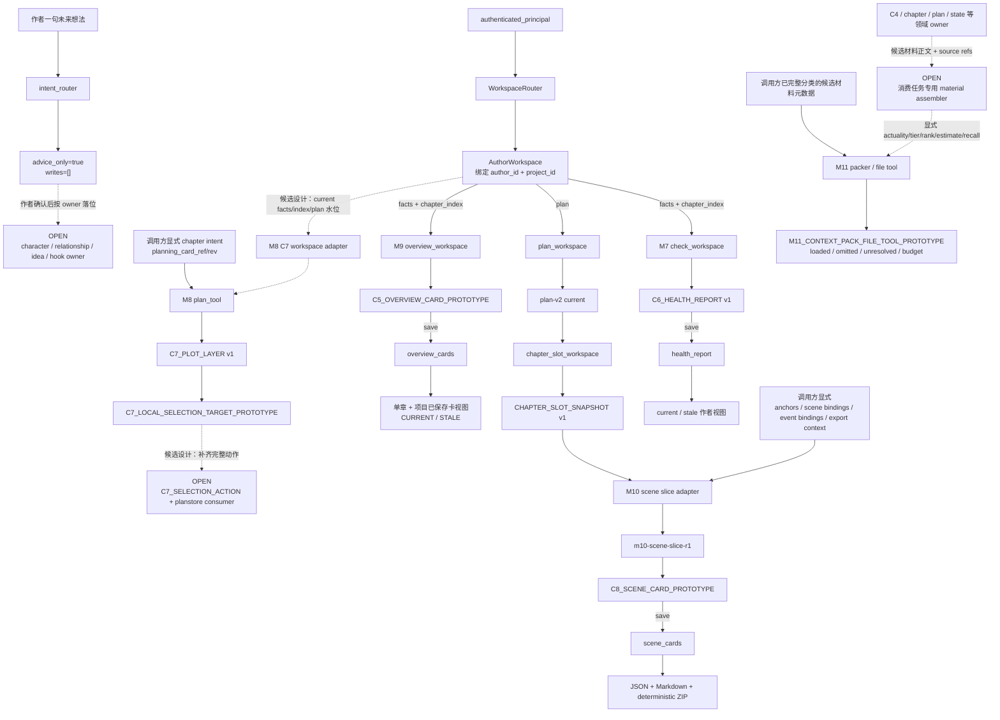

# M7～M11 独立可用性、读侧接缝与下一批施工审查

- 审查身份：`ADVISORY_ONLY`
- 范围：M7～M11 与 AuthorWorkspace 取料、保存、新鲜度接缝
- 不在范围：M1～M6、统一工作流平台、正式 C9 冻结、图片／视频生产线、Git／生产／训练／Gold／真实 API／上传／部署
- 现行产品边界：M1～M11 是能力图，不是强制串行流水线；`C5_OVERVIEW_CARD_PROTOTYPE`、`C8_SCENE_CARD_PROTOTYPE` 和 M11 文件工具仍是原型

## 0. 审查口径与验证说明

本报告按四层分开判断：

1. **R13／原子预期**说明产品应当解决什么；
2. **正式合同**说明哪些身份、字段和写权已经冻结；
3. **当前代码**说明函数今天实际接什么、做什么、写什么；
4. **直接测试与本轮复跑**说明这些机械行为是否真实可重复。

包内 `00_READ_ME_FOR_REVIEWER.md:L25-L31` 明确要求用当前代码和直接测试判断机械现实；`00_SHARED_UPLOAD_INSTRUCTIONS.md:L7-L30` 又明确禁止把原型、机械 PASS 或顾问箭头外推成产品完成。本报告遵守这两层边界。

本轮实际完成：

- 共用 ZIP 解压后为 **230 个成员**；`SHA256SUMS` 逐项重算为 **0 缺失、0 不一致**；
- 230 个成员均已打开检查；文本、JSON、JSONL、CSV 的可解析成员无解析失败；
- 定向复跑共 **75 个测试通过**：AuthorWorkspace 11、M7 10、M8 18、M9 12、M10 15、M11 9；
- 两次更宽的组合测试因大量跨进程与故障注入超过当前运行时限，未观察到失败，但**没有计入 PASS**。因此本报告只把 75 个定向节点写成实际复跑结果，完整覆盖仍引用包内测试代码本身。

---

# 1. 一页结论

## 1.1 总判定

✅ **最接近“作者今天就能独立用”的是 M7；M10 的文本导出链在调用方补齐明确材料后也已可用。**

- **M7** 已形成完整机械闭环：从绑定 AuthorWorkspace 读取 `facts + chapter_index`，生成 C6，原子保存到 `health_report`，重启读回，来源前进后保留历史并标 `STALE`，作者能直接看到带证据、覆盖与排除项的人读报告。真实卡点不在保存，而在语义：当前红灯门只看 provider 给出的 `hard + high`，没有再要求冲突层必须是 `confirmed`，因此还不能宣称完全满足 `M7-E04`。
- **M8** 必须拆成四件看：C7 生成／校验／排版可跑；`plan-v2` 可保存重启；章槽快照可从 current `plan` 只读生成；但 A／B／C／discard 目前只产生 `C7_LOCAL_SELECTION_TARGET_PROTOTYPE`，明确写着 `transport_only_no_plan_write`。模糊意图路由也只给 `advice_only=true, writes=[]`。所以 M8 是“规划对象与只读工具可用，作者选择落账仍未接通”。
- **M9** 的保存、重启读回、单章视图、项目已保存卡视图和 stale 标记都已成闭环，且没有 `plan` 输入，不会直接把未来计划写成已发生。但当前原型明确接收 `extracted / confirmed / rejected` 三种 C4 状态；测试还把 rejected 记录放进散条区。它因此是“可用的事实记录投影原型”，还不是严格的“仅已确认、已发生事实概览”。
- **M10** 的后半段已经够用：`CHAPTER_SLOT_SNAPSHOT → 显式补料 → m10-scene-slice-r1 → C8 prototype → scene_cards → JSON / Markdown / 固定三成员 ZIP` 可跑，且能按场景、锚和绑定做局部 stale。真正断点是前半段取料：人物／地点 anchors、scene bindings、event bindings、export context 仍由调用方明确提供，当前没有唯一 owner 可以自动捞。
- **M11** 只算独立机械工具。它要求调用方已经给完 actuality、HARD／SHOULD／MAY、rank、token estimate、recall handle 和 unresolved 原因，然后做确定性筛选、硬预算和停止。它没有从 AuthorWorkspace 取料，没有材料正文，没有项目保存／重启读回，没有来源水位或 stale 判断，也没有正式 C9 合同。

## 1.2 真实卡点

当前主要缺口不是更多 SHA、回执或 CLI 测试，而是三类**业务 owner 与真实取料**：

1. **M8 正式选择动作**缺完整长期 `option_record`、current 稳定规划卡、stop point、expected revs 和合法 `plan_mutations`；
2. **M10 显式补料**缺人物／地点 anchor 与场景／事件呈现绑定的稳定 owner；
3. **M11 真实材料包**缺候选生产者、actuality／义务层级／排序／回取 owner，以及来源变化后的重编规则。

## 1.3 下一批应做什么

建议下一批只做六张票：

1. `SAFE_NOW`：M7 红灯必须受事实层约束；
2. `CALIBRATE_FIRST`：M9 把 confirmed 叙事与 extracted／rejected 审查附件分开；
3. `SAFE_NOW`：M8 从绑定 AuthorWorkspace 读取 current facts／chapter index／plan 生成带水位的 C7，只读不落选择；
4. `SAFE_NOW`：M10 做模块内“一次提交明确补料→保存场景卡→返回 JSON／Markdown／ZIP”的作者文本包入口；
5. `CALIBRATE_FIRST`：只为 M8 下一章任务做一条 M11 真实材料批次原型，不建正式 C9；
6. `CZ_DECISION`：决定 M8 稳定规划卡和完整 option record 的 owner 后，才接正式选择动作到 planstore。

## 1.4 应立即停止的方向

- 不再给 M7／M9／M10 重复补“保存、重启、SHA、原子写、跨作者”同类外壳；
- 不再给 M8 局部 selection target 堆测试，直到正式动作所需来源确定；
- 不再给 M11 增加排序算法、估算器花样或正式 C9 字段，直到候选材料 owner 能在一个真实消费任务中跑通；
- 不为 M9 现在就建设细粒度全局依赖图；现行保守 stale 安全且够用；
- 不用统一 coordinator、总控账或第二份 current 真值填补 owner 缺口。

---

# 2. 逐模块证据表

| 模块 | 已验证能力 | 直接代码／测试证据 | 仍缺核心预期 ID | 不可外推边界 | 身份结论 |
|---|---|---|---|---|---|
| M7 | current C4 筛选、C6 生成、证据绑定、人读报告、`health_report` 保存、重启读回、来源前进后历史 stale、失败不覆盖 | `mvp/check_tool.py:L289-L444,L484-L605,L1037-L1116`；`mvp/check_workspace.py:L314-L458`；`mvp/check_reader_workspace.py:L110-L175`；`test_novel_mvp_check_workspace.py:test_execute_save_restart_read_preserves_report_and_evidence_bytes`、`test_saved_report_reads_stale_after_source_advance_without_writing` | `M7-E02`、`M7-E03`；`M7-E04` 部分未满足 | 冻结 provider 只证明运输与约束；不能证明能发现死亡／相遇、关系破裂／并肩等真实语义；当前 severity 门未绑定 confirmed layer | **独立机械闭环可用；语义体检能力未完成** |
| M8 | C7 v1 生成、严格校验、排版；plan-v2 保存读回；局部选项与整份 C7 SHA 绑定；模糊意图只读建议；current plan→章槽快照 | `mvp/plan_tool.py:L32-L78,L211-L305,L316-L390,L628-L681`；`mvp/plan_workspace.py:L29-L63`；`mvp/plan_selection_target_tool.py:L46-L116`；`mvp/intent_router.py:L144-L250`；`mvp/chapter_slot_workspace.py:L48-L74`；对应 plan／selection／intent／slot tests | `M8-E01`、`M8-E03`、`M8-E04`、`M8-E05`；`M8-E02`、`M8-E06` 部分；选择后的 `M8-E07` 未接 | C7 局部卡不是长期规划卡；selection target 不是正式动作；intent home 不是已存在 owner；C7 provider 质量未证明 | **对象工具分段可用；作者选择落账与灵感落位未接通** |
| M9 | C5 prototype 生成、全事实引用覆盖、散条可见、保存到 `overview_cards`、单章读回、项目已保存卡文档、current/stale | `mvp/overview.py:L18-L24,L159-L266,L286-L428,L659-L714`；`mvp/overview_workspace.py:L254-L360`；`mvp/overview_card_workspace.py:L235-L358`；`mvp/overview_reader_workspace.py:L113-L192`；`mvp/overview_book_workspace.py:L112-L163` | `M9-E03` 部分；`M9-E05`、`M9-E06`；`M9-E08` 仅机械拼接 | 不是正式 C5；没有全书／卷语义综合；provider 质量未证明；当前接收 extracted／rejected，不能称“只讲已确认事实” | **保存与读侧闭环可用的投影原型；事实准入仍需收口** |
| M10 | current plan→slot snapshot；显式补料闭合；C8 prototype；scene_cards 保存读回；场景级 stale；JSON／Markdown／确定性 ZIP | `mvp/m10_scene_slice_adapter.py:L29-L59,L124-L206,L209-L416`；`mvp/scene_export.py:L19-L20,L430-L570`；`mvp/scene_export_workspace.py:L485-L625`；`mvp/scene_card_workspace.py:L103-L165`；`mvp/scene_export_bundle.py:L30-L31,L112-L202`；`mvp/scene_export_bundle_workspace.py:L147-L222` | `AE-M10-C01`、`AE-M10-C04`、`AE-M10-C06` 部分 | 不是正式 C8；人物地点一致性来自调用方 anchors，不是模块推断；未建视频生产；真实 C7 仍需先经章槽快照且补料 | **后半段独立可用；前半段取料 owner 缺失** |
| M11 | 显式材料形状、actuality、义务层级、hard-first、预算硬停、optional omission、recall 说明、unresolved 停止、确定性文件输出 | `mvp/packer.py:L1-L58,L148-L255,L277-L436`；`mvp/packer_tool.py:L25-L65,L106-L211,L248-L270,L484-L508`；packer tests | `AE-M11-C01`、`AE-M11-C02`、`AE-M11-C04`、`AE-M11-C06`；`C03/C05` 仅机械满足 | 不含材料正文；不取料、不回取、不保存、不判 stale；分类／层级／排序／估算均非 M11 推断；不是正式 C9 | **独立机械 packer；尚非真实项目上下文模块** |

---

# 3. M7～M11 与 AuthorWorkspace 的真实职责和数据流图

实线＝当前代码可运行；虚线＝候选设计；`OPEN`＝包内没有唯一 owner。



这张图有三条必须守住的权力线：

- AuthorWorkspace 只提供隔离、白名单、版本、原子提交和后端替换，不判断事实或计划是否合法；
- M8 selection target 与 intent advice 都不获得 `plan` 写权；
- M10／M9 投影和 M11 临时包都不能反写真值。

---

# 4. A｜逐模块当前真实可用性

## 4.1 M7｜一致性体检

### 当前真实输入

工作区入口实际是：

- 一个已经绑定作者与项目的 `AuthorWorkspace`；
- `check_config` 的 `project / generated_at / scope_name / scope_kind / kinds`；
- 一个符合 `FindingProvider` 形状的 provider。

模块自己只从白名单读取 `facts` 与 `chapter_index`，不接路径、作者 ID 或项目 ID，并只允许保存到 `health_report`。见 `mvp/check_workspace.py:L1-L5,L17-L20,L314-L408`。

### 核心函数实际行为

`check_tool._eligible_facts` 只把当前 revision、`confirmed / extracted`、VERIFIED anchor、无需 recheck 的 C4 送入检查；rejected、needs_recheck、旧 revision、无当前章索引、坏证据均计入排除项。重复事实 ID 会保留一条并产出 integrity 记录。见 `mvp/check_tool.py:L289-L353`。

provider 返回必须完整引用已知 fact IDs、使用显式检查 kind、只给 `conflict / insufficient`，整批形状错误直接拒绝。见 `mvp/check_tool.py:L390-L444`。`execute` 随后绑定证据、层级和固定 next step，生成 `C6_HEALTH_REPORT v1`。见 `mvp/check_tool.py:L484-L605`。

### 输出身份

输出是正式身份的 `C6_HEALTH_REPORT v1`，但合同明确它是**可覆盖投影，不是真值**；旧来源只能展示为历史，不能作为高影响写入依据。见 `contracts/C6_HEALTH_REPORT.md:L5-L22,L131-L132`。

### 保存、重启读回

`execute_and_save` 只写 `health_report`，并使用 expected version 交给 AuthorWorkspace 原子提交；测试覆盖保存、重启读回、字节保持、幂等与版本竞争。见 `mvp/check_workspace.py:L360-L408`；`test_novel_mvp_check_workspace.py:test_execute_save_restart_read_preserves_report_and_evidence_bytes`、`test_save_is_idempotent_and_conflicts_never_replace_current_report`。

### 来源变化和过期

生成前双读、provider 后再读、保存前再读；任一水位变化都在写前停止。读回时把保存的 `facts`／`chapter_index` version+SHA 与 current 比较，来源前进派生 `STALE`，版本回退或同版本不同 SHA 则报完整性错误。见 `mvp/check_workspace.py:L299-L311,L314-L383,L411-L458`。

### 哪些失败在写入前停止

- 非 AuthorWorkspace 句柄；
- 非法 facts／chapter index 或 nonempty facts 缺 current index；
- provider 前／中／保存前来源漂移；
- provider 结果有未知事实、重复集合、非法 kind／verdict／severity；
- expected report version 竞争；
- 保存内容损坏、同版本 SHA 冲突。

对应测试包括 `test_source_change_between_pre_reads_rejects_before_provider`、`test_source_change_during_provider_discards_report_and_keeps_new_state`、`test_bad_provider_leaves_workspace_byte_identical`、`test_provider_or_source_failure_does_not_overwrite_saved_report`。

### 作者今天能直接得到什么

`check_reader_workspace.read_author_view` 连续读取两次稳定副本，返回 UTF-8 文本；current 显示“当前体检报告”，过期时保留历史内容并列出过期原因。人读报告包含来源 revisions、事实水位、finding、逐字 quote／锚、排除／弃权／未知项；零 finding 明确写“不能证明没有问题”。见 `mvp/check_reader_workspace.py:L110-L175`；`mvp/check_tool.py:L1037-L1116`。

### 不能外推成什么

- 包内 provider 是冻结离线输入，不能证明模型能发现真实小说中的死亡／复活、关系断裂／并肩或复杂因果；
- 当前 `_expected_severity` 只按 timeline、hard、confidence 判红黄，事实层 `confirmed/mixed/candidate` 是之后才计算。代码因此没有强制“只有 confirmed layer 才能红”，`M7-E04` 仍有局部缺口；
- 没有实现作者“这是故意的”长期抑制，也没有生成两套可执行修法；`M7-E08/E09` 仍未形成作者闭环。

### 判定

**M7 已是独立可保存、可重开、可过期、可作者阅读的小工具；下一步应修语义门，不应再补存储壳。**

---

## 4.2 M8｜C7、选择、意图路由与章槽

### 当前真实输入

M8 当前不是一个单入口，而是四条分开的对象工具：

1. `plan_tool.execute`：项目显示名、时间、purpose、mode、chapter intent、current chapter revision、C4 facts，以及**调用方显式给出的** `planning_card_ref / planning_card_rev`；
2. `plan_workspace`：完整合法 `plan-v2` 与 expected version；
3. `plan_selection_target_tool`：完整 C7、完整快照 SHA、局部卡号、A／B／C／discard；
4. `intent_router`：作者一句话＋调用方给的 known entities；
5. `chapter_slot_workspace`：绑定 AuthorWorkspace＋显式 `slot_ref`，只读 current `plan`。

代码证据：`mvp/plan_tool.py:L32-L44`、`mvp/plan_workspace.py:L36-L63`、`mvp/plan_selection_target_tool.py:L23-L29,L46-L116`、`mvp/intent_router.py:L144-L250`、`mvp/chapter_slot_workspace.py:L48-L74`。

### 核心函数实际行为

`plan_tool` 只把 current、confirmed、VERIFIED 的 C4 送给 provider，并明确不分配、不猜稳定 planning card ref；provider 返回的每张卡必须回同一 ref/rev，A／B／C 和推荐项严格闭合。C7 只是规划快照，排版还明确“作者尚未选择”。见 `mvp/plan_tool.py:L211-L305,L316-L390,L521-L602,L628-L681`。

`plan_selection_target_tool` 只把局部 choice 绑定到整份 C7 SHA、卡和真实 option，输出身份明确为 `transport_only_no_plan_write`。见 `mvp/plan_selection_target_tool.py:L46-L116`。

`intent_router` 用确定性线索在 `chapter_plan / volume_outline / character_arc / relationship_arc / open_hook` 中给一个主建议、最多两个候选和最多一个澄清问题，固定返回 `advice_only=true, writes=[]`。见 `mvp/intent_router.py:L13-L19,L144-L250`。

`chapter_slot_snapshot_tool` 对完整 plan-v2、计划 SHA、slot ref 做严格闭包，返回 slot、scene、event、storyline 与 generation watermark，状态固定为 `plan`，不含 facts／actual。见 `mvp/chapter_slot_snapshot_tool.py:L264-L373`。

### 输出身份

- `C7_PLOT_LAYER v1`：只读规划快照；
- `C7_LOCAL_SELECTION_TARGET_PROTOTYPE v1`：局部选择运输原型；
- intent advice：零写入建议对象；
- `CHAPTER_SLOT_SNAPSHOT v1`：current plan 的只读章槽投影；
- `plan-v2`：唯一可持久化规划账对象。

### 保存、重启读回

- `plan-v2` 可通过 `plan_workspace.save_plan/read_plan` 保存与重启读回；
- C7 本身目前没有 AuthorWorkspace 逻辑键，只能由调用方接收或用文件 CLI 保存；
- selection target 与 intent advice 不写 plan；
- 章槽快照是随 current plan 重建的只读投影，不单独保存。

### 来源变化和过期

- plan 保存使用 expected version；
- selection target 用完整 C7 SHA 拒绝旧快照，卡／option 重排即 SHA 变化；
- C7 卡带 planning card rev，但当前没有读 current 稳定 planning card 对象的工作区适配器；
- 章槽快照绑定 source plan version、SHA、slot rev 和 outline source commit seq；消费者应在这些水位变化时重投影。

对应测试：`test_card_or_option_list_reorder_changes_sha_and_rejects_old_selection`、`test_user_visible_demo_writes_and_reads_current_revision_planning_record`、`test_current_plan_reopens_as_exact_slot_snapshot`（章槽测试族）。

### 哪些失败在写入前停止

- C7 事实不是 current confirmed／anchor 不合法；
- planning card ref/rev 缺失或 provider 改写；
- C7 SHA stale、局部卡或选项不存在；
- plan expected version stale；
- slot 不存在、scene/event/storyline 引用不闭合；
- intent 为空或候选位置超过规则上限。

selection target／intent 失败时没有 plan 写入；plan 保存失败由 AuthorWorkspace 保证旧版不变。

### 作者今天能直接得到什么

- 一份可读 C7：目的、冲突、卡、A／B／C、主推荐、写法提示；
- 对某张卡选择 A／B／C／discard 后，得到“自己究竟点了什么”的不可歪曲运输对象；
- 一句模糊想法得到放置建议与澄清问题；
- 从 current plan 点名一个 slot，得到完整 scene/event/storyline 章槽快照。

**作者今天还得不到：选择后 current plan 真正变化。**

### 不能外推成什么

- C7 的局部 A／B／C 只有 `id / label / reveal_intent`，不足以构成长期 `option_record`；
- `planning_card_ref/rev` 是调用方先给的稳定引用，不证明稳定规划卡对象已在 current plan 中可读取；
- intent router 的 home 只是建议名，代码并不存在 character arc、relationship arc、idea/open hook 的确定存储 owner；
- discard 也不是“什么都不用保存”，正式合同要求保存整组长期选项记录；
- provider 能输出合法 C7，不等于它在三档规划、插件冲突、关系桥接、容量拆章等语义上合格。

### 判定

**M8 的“生成／展示／章槽读取”可独立运行；“作者选择→正式规划写入”和“模糊意图→正确 owner”仍是实质断点。**

---

## 4.3 M9｜事实概览投影

### 当前真实输入

工作区入口是：绑定 AuthorWorkspace、显式 `chapter_id`、显式 `generated_at`、overview provider。模块只读 `facts` 与 `chapter_index`，不猜当前章、不读 plan。见 `mvp/overview_workspace.py:L1-L6,L254-L305`。

对象核心只接 `facts / current_revision_ref / source_revision / generated_at`。见 `mvp/overview.py:L18-L25`。

### 核心函数实际行为

它校验 C4 当前 revision 与 VERIFIED anchor，要求 provider 把每个输入 fact **恰好一次**放入 beat 或 orphan，不能重复、漏掉或引用未知 ID，然后输出 synopsis、beats、orphan、coverage、source summary 和 evidence。见 `mvp/overview.py:L159-L266,L286-L428`。

### 输出身份

输出固定为：

- `contract=C5_OVERVIEW_CARD_PROTOTYPE`
- `version=v0`
- `projection_only=true`
- `writes_truth=false`

见 `mvp/overview.py:L18-L20,L352-L428`。它不是正式 C5。

### 保存、重启读回

`overview_card_workspace` 只保存 freshness 仍为 CURRENT 的原型结果到 `overview_cards`，按 chapter ID 覆盖该章投影；读回可列出所有已保存卡。见 `mvp/overview_card_workspace.py:L1-L18,L235-L358`。

`overview_reader_workspace` 给单章 current/stale Markdown；`overview_book_workspace` 按 inventory 顺序拼接所有已保存单章卡，重读前后水位必须一致。见 `mvp/overview_reader_workspace.py:L113-L192`、`mvp/overview_book_workspace.py:L1-L5,L112-L163`。

### 来源变化和过期

保存结果带：

- `facts` version/SHA；
- `chapter_index` version/SHA；
- 目标章 current revision ref；
- AuthorWorkspace binding。

任一不同即给 `FACTS_SNAPSHOT_CHANGED / CHAPTER_INDEX_SNAPSHOT_CHANGED / CHAPTER_REVISION_CHANGED`。见 `mvp/overview_workspace.py:L308-L360`。

### 哪些失败在写入前停止

- facts/index 缺失或损坏；
- 目标章 current ref 不唯一；
- C4 旧 revision／坏 anchor／混章；
- provider 漏 fact、重复 fact、未知 fact；
- provider 前／中来源变化；
- 保存前已 stale；
- expected overview_cards version 竞争；
- reader/book 读取期间 inventory 变化。

### 作者今天能直接得到什么

- 一章两三句 synopsis、beats、散条、证据与 coverage；
- 保存后重启直接打开单章概览；
- 打开“项目已保存概览”看到已保存章卡及 current／历史数量；
- 来源变化后历史卡仍可见，但不会冒充 current。

### 不能外推成什么

1. **不会混未来计划**：对象请求没有 plan 字段，这一点是硬边界。
2. **还不能保证只讲已确认事实**：`CURRENT_FACT_STATUSES` 当前是 `extracted / confirmed / rejected`。包内测试明确用一条 rejected 作为 orphan，并要求 evidence 中保留 rejected 状态。见 `mvp/overview.py:L59,L194-L205`、`test_novel_mvp_overview_tool.py:L86-L140,L171-L202`。
3. “全书视图”目前只是把已保存单章 Markdown 拼在一起，不是全书／卷语义综合，也没有缩放层级。
4. synopsis／beat 的文本质量仍来自 provider，机械覆盖 1.0 不证明叙事摘要正确。

### 对保守 stale 的判断

✅ **现行“facts 或 chapter index 一变化就让旧卡过期”够用，应保留。**

它确实会在改动无关章节时让所有卡 stale，但好处是：

- 规则局部、确定、可解释；
- 不复制第二份当前事实；
- 不需要新建全局依赖图或猜“这个事实是否影响那张卡”；
- 旧卡仍可作为历史查看，不会丢失。

只有真实作者使用出现明显 stale 风暴，且上游能给稳定的**逐章 C4 快照身份**时，才值得测更细依赖。现在继续细化不会比修复“confirmed 叙事准入”更增加作者价值。

### 判定

**M9 是可保存、可重开的读侧投影原型；先收紧事实准入，再谈全书缩放或细粒度 stale。**

---

## 4.4 M10｜章槽到文本场景包

### 当前真实输入

工作区链的真实输入分两部分：

**可从 current plan 直接拿到：**

- `slot_ref / slot_rev`；
- slot goal、summary、entry/exit、must_not、risks；
- scene refs、scene 字段、planned event refs；
- event 计划内容与 storyline refs；
- source plan version/SHA、outline checkpoint。

这由 `chapter_slot_workspace → chapter_slot_snapshot_tool` 生成。见 `mvp/chapter_slot_workspace.py:L48-L74`、`mvp/chapter_slot_snapshot_tool.py:L264-L373`。

**仍由调用方显式提供：**

- `anchors`：人物／地点 anchor；
- `scene_bindings`：每场 location anchor、time、character presence、writing guidance；
- `event_bindings`：visual、shot hint、dialogue bindings；
- `export_context`：project、book title、plan ID、chapter hint/title、model、basis note、generated_at。

见 `mvp/m10_scene_slice_adapter.py:L29-L59,L209-L247`。

### 核心函数实际行为

适配器要求 scene/event binding 与快照引用**完整相等**，人物与地点 anchor 唯一，场景中每个人物都有 anchor，dialogue 只允许信息点而非成文台词；缺任一项整批拒绝，不猜。见 `mvp/m10_scene_slice_adapter.py:L124-L206,L209-L416`。

`scene_export` 将规范 slice 转成 C8 prototype；验证 future spoiler、逐字台词、anchor 引用、顺序和 frame refs。见 `mvp/scene_export.py:L19-L20,L430-L570`。

### 输出身份

- 中间：`m10-scene-slice-r1`；
- 输出：`C8_SCENE_CARD_PROTOTYPE / v0-prototype-r1`；
- 保存：`scene_cards`；
- 导出：`scene_cards.json`、`scene_cards.md`、`manifest.json` 三成员 ZIP。

不是正式 C8，也不是视频资产真值。

### 保存、重启读回

`scene_card_workspace.save_scene_cards` 只在全部场景 freshness 为 CURRENT 时写 `scene_cards`；重启可按 slot 读回。见 `mvp/scene_card_workspace.py:L103-L165`。

包内 M8→M10 文件交接还证明：plan 写入临时 AuthorWorkspace，新进程重开后生成 slot snapshot，再经 M10 适配与独立导出进程得到 C8，中间 JSON 无人工修改；缺地点 anchor 时停止且旧输出字节不变。见 `03_upstream_evidence/TEMP/f_m8_m10_workspace_file_handoff_20260819_r01/README.md:L1-L9`。

### 来源变化和过期

M10 不只比较整份 plan：它保存每个场景的 source slice、anchor、scene binding、event binding 依赖摘要。`inspect_freshness` 能让改动场景／anchor／binding 只 stale 相关场景；无关 plan 变化只记录 plan snapshot changed，不会让场景误 stale。见 `mvp/scene_export_workspace.py:L446-L625`；测试 `test_only_changed_scene_becomes_stale`、`test_unrelated_plan_change_does_not_stale_any_scene`、`test_anchor_drift_only_stales_scenes_using_that_anchor`。

构建 ZIP 前后还会复读 `scene_cards` 与 `plan`，水位变化即停止。见 `mvp/scene_export_bundle_workspace.py:L147-L222`。

### 哪些失败在写入前停止

- slot snapshot schema／watermark／闭包错误；
- binding 缺失、多余、重复；
- 人物／地点 anchor 缺失或歧义；
- dialogue speaker 不在场、信息点不匹配或出现成文台词；
- future spoiler；
- scene result 已 stale；
- plan／scene_cards 在保存或打包期间变化；
- expected scene_cards version 竞争。

### 作者今天能直接得到什么

在调用方把补料完整给出后，作者能得到：

- 每场可阅读的场景卡；
- 人物、地点、事件、对白信息点与“不要泄露”的明确文本；
- JSON 和 Markdown；
- 字节确定、带 manifest 与 AI label、禁止 frame 引用的文本 ZIP。

### 哪些补料有唯一 owner

| 补料 | 当前唯一 owner 判断 | 结论 |
|---|---|---|
| slot／scene／planned event／storyline 计划内容 | `plan-v2`／planstore | **有**，已由章槽快照读取 |
| current plan 水位、slot rev、outline checkpoint | `plan` | **有** |
| 人物／地点稳定 anchor | 包内没有正式 entity/anchor 逻辑键或合同；`state` 只是白名单名，不能据此猜 Schema | `OPEN` |
| 每场 character presence、time、writing guidance | 部分语义可能来自 plan，部分是作者呈现决定；当前快照字段不足以唯一生成 | `OPEN` |
| event visual／shot hint／dialogue bindings | 当前由调用方补；没有唯一长期 owner | `OPEN` |
| book title、chapter title/hint、plan ID 的 author-facing export context | 可能分散在 plan／章节／项目元数据；当前适配器没有唯一读取路径 | `OPEN` |

### 判定

**M10 不缺导出格式，缺的是补料 owner。下一步应先让显式补料的一次运行更像作者工具；不要用新通用表或图片生产线假装自动取料。**

---

## 4.5 M11｜上下文筛选与预算

### 当前真实输入

`packer.pack_context` 要求调用方显式给：

- `task_id`；
- `task_actuality_scope`；
- `budget_tokens`；
- `token_estimator_ref`；
- 每条材料的 `id / estimated_tokens / actuality_class / obligation_tier / selection_rank / task_relation / recall_disposition / recall_handle / unresolved_reason`。

见 `mvp/packer.py:L14-L58,L90-L95,L148-L255`。

文件工具再要求固定机械估算器及完整 estimate lookup，并把所有业务身份编入 normalized request SHA。见 `mvp/packer_tool.py:L25-L65,L106-L211`。

### 核心函数实际行为

1. 任一 required 字段缺失或矛盾，`STOP_INPUT_INVALID`；
2. 任一 `UNRESOLVED`，`STOP_UNRESOLVED`，不形成包；
3. current 任务遇到 future HARD，`STOP_CONFLICT`；future optional 列为 omission；
4. HARD 按 ID 稳定排序并优先装入；HARD 总量超预算，`STOP_HARD_BUDGET`，不返回半包；
5. optional 按 SHOULD→MAY、rank、ID 排序，超预算列 omission；
6. 复算预算后才返回 READY。

见 `mvp/packer.py:L277-L436`。

### 输出身份

文件工具输出：

- `M11_CONTEXT_PACK_FILE_TOOL_PROTOTYPE / v1`；
- task receipt；
- loaded **材料元数据**；
- omitted、why loaded、unresolved、budget、errors。

它不是正式 C9；renderer 也明确写“已形成本次 M11 原型包；不代表正式 C9 或生产可用”。见 `mvp/packer_tool.py:L25-L50,L248-L270,L484-L508`。

### 保存、重启读回

- CLI 可以把 JSON 原子写到调用方指定文件，并可跨进程解析；
- **没有 AuthorWorkspace 适配器，没有模块自己的逻辑键，没有项目级 save/restart 语义**；
- 当前也没有材料包内容存储，只有元数据选择结果。

### 来源变化和过期

当前没有 source version/SHA、material content SHA、task base revision 或 current source comparison，因此**没有 stale 判断**。normalized request SHA 只能证明“这份显式请求是否相同”，不能证明请求引用的项目材料仍 current。

### 哪些失败在写入前停止

全部核心失败都发生在纯对象返回前，文件 CLI 失败也保留旧输出：字段不全、actuality／tier／rank／recall 矛盾、estimate drift、unresolved、future HARD conflict、HARD 预算超限、结果覆盖不全。

### 作者今天能直接得到什么

如果另一个调用方已经把所有材料分类、排序、估算并给好回取入口，作者能看到：

- 哪些 ID 被装入；
- 为什么装入；
- 哪些因预算或任务 actuality 被省略；
- 省略项是否可回取；
- 哪些未决或硬预算冲突导致没有包。

作者还拿不到“可直接交给 M8 的真实材料正文包”，也不能点击 recall handle 让 M11 自己回取。

### 判定

**M11 的预算机械核心已经够了；真正下一步是给一个具体消费者做真实材料责任链，不是继续把 packer 做得更复杂。**

---

# 5. B｜哪些已经够了，应停止加壳

## 5.1 已足够支撑下一步的部分

| 能力 | 已经足够的理由 | 接下来只保留什么回归 |
|---|---|---|
| AuthorWorkspace 隔离／白名单／原子提交／恢复 | 绑定 handle、逻辑键校验、version+SHA 乐观锁、prepare/pointer/receipt 恢复、不可变对象、后端替换点均已存在 | 每个公开 workspace adapter 保留 1 个跨作者、1 个 stale、1 个失败不写回归即可 |
| M7 保存／重启／stale／人读 | `health_report` 唯一槽位、生成前后水位、保存前水位、历史 stale 和双读 reader 已闭合 | 不再扩写同类保存和文件原子替换测试；转向 red-layer 语义门和真实体检校准 |
| M8 C7 严格对象与局部 target | C7 卡、选项、推荐、稳定 ref/rev 与整份 SHA 都已严格验证 | selection target 不再堆 transport 测试；等正式 action 来源齐全 |
| M8 plan 保存与章槽快照 | `plan` 保存读回、current slot 闭包、水位与 plan/actual 隔离已建立 | 只增加真实取料 adapter，不另建章槽账 |
| M9 投影保存与保守 stale | `overview_cards`、单章／项目读取、历史保留、全局水位变化即 stale 已安全 | 不做细依赖，先修 confirmed 准入；以后只有真实 stale 风暴才重开 |
| M10 C8 prototype 与文本 ZIP | JSON／Markdown／固定三成员 ZIP、无 frame、AI label、场景级依赖和保存已齐 | 不再加 HTML/PDF/更多 ZIP 清单；只做作者一次运行和 owner 取料 |
| M11 确定性预算核 | actuality、HARD、rank、预算、omission、recall、unresolved 的机械规则已充分 | 不再加新排序或估算策略；先接一个真实消费任务 |

## 5.2 重复、过度防御或偏治理的工作

❌ 不建议继续：

- 给每个 render helper 都重复做跨作者／路径逃逸测试；AuthorWorkspace handle 已经阻断这些入口；
- 为每个 CLI 模式重复制造十几种 atomic replace 故障；对象核心通过 AuthorWorkspace 时，作者能力并不会随这些测试数量增长；
- 新建“所有模块水位总账”“全局依赖图”“运行总控账”来代替模块自己的 source refs；
- 把 M10 anchors、M11 candidate semantics 或 M8 option record 暂时塞进 `module_state`、`settings`、`state` 这类泛键；
- 冻结正式 C9、正式 C5/C8，或把 prototype 改名伪装成熟；
- 给 M9 现在就做逐事实依赖图；
- 给 M11 增加模型自动判断 actuality／HARD／rank；
- 把 intent router 的建议直接写入 plan、character、relationship 或 hook。

---

# 6. C｜M8 选择动作与模糊意图路由

## 6.1 C7 局部选择目标怎样走到正式规划写入

现有路径只能走到：

```text
完整 C7 + 完整快照 SHA + card_local_id + A/B/C/discard
→ C7_LOCAL_SELECTION_TARGET_PROTOTYPE
→ 停
```

正式合同要求的是：

```text
current 稳定规划卡 + current plan 对象 + stop point + 完整 option_record
+ expected card rev + expected target revs + 合法 plan_mutations
→ C7_SELECTION_ACTION v1
→ planstore 写前全部校验
→ 只写 plan 及其既有流水
```

`C7_SELECTION_ACTION.md:L5-L39,L70-L104` 明确：C7 和动作层都没有 plan 写权；动作只是写前命令。`PLAN_LEDGER_STORAGE.md:L416-L455` 明确：选择和 discard 都需要完整长期 `option_record`，未处理则没有记录。

### M8 选择动作逐字段差距表

| 正式动作／长期记录字段 | 当前已有唯一来源 | 当前材料是否足够 | 缺口／owner | 是否需 CZ |
|---|---|---|---|---|
| `contract / identity` | 合同固定值 | 足够 | 无 | 否 |
| `operation_id` | 动作层可生成 | 足够 | 需与 planstore 幂等规则一致 | 否 |
| `actor` | 作者点击或既有 auto-pass 策略 | 只有真实动作发生时才有 | 不得由模型或 C7 推断 | 否 |
| `ts` | 系统时间 | 足够 | 无 | 否 |
| `action_kind` | A/B/C→`digest_selection`；discard→`discard_group` | 机械可映射 | 无 | 否 |
| `stop_point` | 合同要求引用现行停点 | **不足** | 当前 target 无 stop point；不得默认空串或新造 P 号 | **是：确认 runtime owner** |
| `source_c7_snapshot_sha256` | target 已有整份 SHA | 足够 | 无 | 否 |
| `card_local_id` | target 已有 | 足够，仅写前定位 | 不得落长期账 | 否 |
| `planning_card_ref` | C7 卡有，但最初由调用方显式给入 | 字段有，current 对象未证明 | 需要稳定规划卡 owner 与读取入口 | **是** |
| `expected_card_rev` | C7 `planning_card_rev` | 只能作为所见 rev | 必须再与 current 稳定卡对象比较 | **是：同上** |
| `expected_revs` | 无 | **不足** | 需知道实际要 digest 的现有 PE 及 current rev | 是，取决于 option source |
| `plan_mutations` | 无 | **不足** | 选定只允许指向现有 PE；不能静默新建 | 是，取决于 option source |
| `option_record.slot_ref` | C7 没有 | **不足** | 稳定卡必须绑定真实 slot | 是 |
| `option_record.question` | C7 只有 title/purpose/guidance，没有合同意义上的 question | **不足** | 不能把 title 默认冒充 question | 是 |
| `options[].key` | C7 A/B/C | 足够 | 映射 id→key 可机械做 | 否 |
| `options[].summary` | C7 有 label，但合同未定义 label=summary | 材料不足 | 需稳定 option 源冻结语义 | 是 |
| `options[].why_fit` | 无 | **不足** | 禁止空串／默认值 | 是 |
| `options[].changes` | 无 | **不足** | 禁止空串／默认值 | 是 |
| `options[].risks` | 无 | **不足** | 禁止空串／默认值 | 是 |
| `options[].digest_refs` | 无 | **不足** | 必须引用真实规划对象 | 是 |
| `chosen_key / recommended_key` | target 与 C7 均有 | 足够 | discard 时 chosen=null | 否 |
| `decided_by / decided_at` | 动作上下文 | 足够 | 不由模型填写 author | 否 |
| `digest_applied` | 无 | **不足** | 必须与 mutation、选项 digest_refs 同一 PE | 是 |
| `variant_note` | 只有作者混合输入时才有 | 当前 target 无 | `M8-E07` 需要独立来源；无则 null，不能吞掉作者补充 | 是 |
| `card_ref` | planning_card_ref 可候选映射 | 需 current stable owner | 不保存 local card id | 是 |
| `group_status` | choice/discard 可机械映射 | 足够 | active/discarded | 否 |

### discard 为什么仍需完整长期规划卡来源

`discard_group` 虽然没有 chosen、digest 或 mutation，但它仍是作者明确否定一个完整题组的长期决定。正式记录要保留当时问题、全部 options、推荐项、稳定 card ref、作者和时间；否则后续无法区分：

- 作者明确不要这一组；
- 作者还没处理；
- 系统当时根本没展示完整组；
- 旧 C7 已经 stale。

所以 discard 不能只凭“局部卡号＋discard”落账，更不能用空的 `why_fit / changes / risks / digest_refs` 伪造完整记录。

## 6.2 模糊未来想法怎样得到建议并进入 owner

当前 `intent_router` 唯一可靠提供的是：

- 规范化后的原话线索；
- 一个 primary home；
- 可选 link targets；
- commitment、time horizon、entity scope、confidence；
- 最多一个澄清问题；
- `advice_only=true, writes=[]`。

这足够做纯对象／只读工具，也足够告诉作者“系统建议放人物走向／关系走向／卷纲／章计划／开放钩子”。

当前不足：

- `known_entities` 仍由调用方给，没有 current 实体 registry owner；
- 没有已冻结的 character arc／relationship arc owner；
- 没有 `ideas`／灵感账正式逻辑键和生命周期；
- `open_hook` 是建议名，不等于已有存储对象；
- 没有作者确认动作、expected revision、目标对象引用和 mutation 合同。

因此正确的两步是：

1. **现在可做**：纯对象 route + 人读解释；如有唯一实体 owner，只读补 known entities；
2. **以后可写**：作者确认后，由目标 owner 自己接收一份 owner-specific action；router 不写任何业务键。

路由建议不能直接写成决定，因为它只能根据表面词语判断，不能证明作者是否承诺、放在哪一卷／章、是否只是灵感，也没有 current object 或 revision 可以防 stale。

---

# 7. D｜M9 投影边界

## 7.1 已满足

- **未来计划隔离**：请求字段没有 plan，`projection_only=true / writes_truth=false`；
- **散条与证据覆盖**：provider 必须把所有输入 ID 分到 beat 或 orphan，coverage 可复算；
- **单章到项目视图**：已保存单章卡可拼成项目文档；
- **来源变化旧卡过期**：facts/index/chapter ref 任一变化标 stale；
- **没有第二真值**：只写 `overview_cards`，不写 `facts`、`state` 或 `plan`。

## 7.2 未满足或只部分满足

- “只讲已发生事实”还差一刀：当前 core 接受 extracted 与 rejected；
- 项目视图只是已保存单章卡拼接，不是全书／卷层摘要与缩放；
- 第一屏所需“故事、进度、下一步”还需要 M8 plan 与项目状态的其它只读投影，不能由 M9 单独冒充；
- 风险灯与点开证据不是当前 M9 主要输出；
- 写法特征 `M9-N01` 未实现。

## 7.3 对更细依赖的结论

**保留全局保守 stale。** 只有下面四件同时成立才重开：

1. 真实项目反复因无关章更新导致大量卡 stale；
2. `facts` 能提供稳定逐章 snapshot 或每卡 exact fact dependency；
3. 保存与 source publication 能保持同一原子水位；
4. 新策略不需要语义猜测“是否影响”。

在那之前，局部收益不够抵消复杂度与第二真值风险。

---

# 8. E｜M10 最缺哪类取料接缝

## 8.1 已经能从 AuthorWorkspace current 计划读的内容

`plan` 是唯一直接读取键。它能经章槽快照给出：目标 slot、计划 scene 顺序、计划 event 顺序、storyline、目标／出口／风险／must-not、场景中的人物引用和计划提示，以及计划 version/SHA/slot rev。

## 8.2 仍由调用方提供的内容

- 人物／地点 anchors；
- 人物在本场的可见存在描述；
- 场景 location、time、writing guidance；
- event visual、shot hint；
- dialogue info、speaker、tone；
- export context。

这些不是“格式没接上”，而是“谁有权定义它们”尚未唯一。

## 8.3 哪些不能靠猜测或复制进新通用表

- 不能从人物名字自动生成稳定视觉 anchor；
- 不能把某场计划中的 characters 自动改写成 appearance／服装／伤势；
- 不能把计划 event 文本自动当 visual／shot；
- 不能把 dialogue hint 自动写成台词；
- 不能把 `state` 泛键当成实体 Schema；
- 不能为补齐导出 context 新建一个“所有模块共享元数据表”。

## 8.4 下一步怎样让作者拿到真正可用的文本场景包

建议做一个**候选设计：M10 模块内文本包工作区入口**，而不是新增平台编排器：

```text
AuthorWorkspace + slot_ref + 显式 supplement object
+ operation_id + expected scene_cards version
→ 预检缺料
→ 缺料：返回逐场／逐事件 missing list，0 写入
→ 完整：复用现有 adapter/export/save/bundle
→ 返回 C8 prototype + Markdown + JSON + deterministic ZIP
```

它只写 `scene_cards`，不保存 supplement 为第二本账；补料 owner 未拍前，supplement 继续是本次运行输入。这样作者得到的是一份能直接阅读／交给外部文本工具的场景包，而不是图片或视频生产线。

---

# 9. F｜M11／C9 开放缝与 M11 材料责任表

| 责任 | 当前可用来源 | 应有 owner | M11 当前职责 | 当前状态 | 最小验证办法 |
|---|---|---|---|---|---|
| 产生候选材料及正文 | C4 facts、current chapter、plan slot／scene／event、设定／状态等各领域对象 | **各领域 owner 的消费任务 adapter**；不得由万能 coordinator 扫全项目 | 不产生，只接 metadata | `OPEN`：当前连正文都没进 packer | 只选 M8 下一章任务，人工点名 facts+plan 两类材料，adapter 附正文与 source refs |
| 判断 current／future／unresolved | C4 status/revision、plan 对象身份、作者未决动作 | 原对象 owner；跨 owner 无唯一时保持 unresolved | 只校验调用方显式枚举并按 scope 过滤 | 部分开放 | 三条 fixtures：confirmed C4、future PE、无 owner 设定；第三条必须 unresolved 停止 |
| 给 HARD／SHOULD／MAY | 作者 pin、current slot must/must-not、任务要求、其它明确约束 | **当前消费任务 owner**；M8 规划任务优先由 M8 task adapter 定义 | 只执行 hard-first 与 optional 顺序 | `OPEN` | 人工冻结一张任务义务表，验证 M11 不会自行升降级 |
| 任务相关性与排序 | task relation、角色／线／场景关联 | 消费任务 adapter；排序语义需校准 | 只按显式 tier/rank/ID 排序 | `OPEN` | 同一材料集两种任务，要求 adapter 给不同 relation/rank，M11 结果可复算 |
| token 估算 | 材料实际序列化文本 | 可替换 estimator adapter | 只相信并复核显式 estimate；文件工具用固定 lookup | 机械已做，真实估算未接 | 固定一种序列化与估算器 identity；estimate 或正文变化使请求身份变化 |
| 生成回取入口 | frozen chapter refs、fact evidence refs、plan object refs | **材料 source owner**；入口必须受 AuthorWorkspace 权限约束 | 只保存／展示 recall handle，不执行回取 | `OPEN` | 用 opaque handle 绑定 logical key + object ref + version/SHA；另一作者打开必须与不存在一致 |
| 预算、遗漏、未决停止 | 完整候选 metadata | M11 | validate、scope filter、hard-first、budget、omission、unresolved/conflict stop | 已完成机械核 | 现有 tests 已足够，不再扩壳 |
| 包内容 | 当前无 material body 字段 | 首个消费者的 prototype adapter | 当前只返回 loaded metadata | `OPEN` | 原型把 load_ids 解析回冻结 material body，保证顺序与 source SHA；不命名正式 C9 |
| 新鲜度 | 当前无 source watermarks | source owner + consumer adapter | 当前不判断 | `OPEN` | 保存 source refs； referenced source 改动 stale，无关 source 改动不 stale |

## 9.1 谁负责什么的窄责任图

- **候选来源**：M4／事实 owner、C11／章节 owner、planstore／计划 owner、未来明确的状态／设定 owner；
- **actuality**：由来源身份给，不由 M11 看文本猜；
- **义务层级和任务相关性**：由具体消费者的 task adapter 给；
- **排序**：由消费者 task adapter 按冻结规则给；
- **token**：可替换 estimator 给；
- **recall handle**：来源 owner 给，AuthorWorkspace 负责权限边界；
- **M11**：只做机械校验、筛选、预算、遗漏与停止；
- **过期**：任一被引用 source version/SHA、任务 scope、budget、estimator、material metadata 或正文 SHA 变化，旧包都应 stale。当前原型尚未实现。

## 9.2 不应做的事

- 不新建正式 C9；
- 不让 M11 自动从 `facts/plan/state` 全扫；
- 不让 M11 推断 actuality 或 HARD；
- 不用一个万能 coordinator 同时拥有所有 source 读权和业务写权；
- 不把 `normalized_request_sha256` 冒充项目新鲜度。

---

# 10. G｜AuthorWorkspace 取料与保存

## 10.1 当前基础边界

AuthorWorkspace 白名单包含 `facts / chapter_index / health_report / overview_cards / plan / scene_cards` 等逻辑键。逻辑键带路径、`..`、绝对路径或未登记名会拒绝；项目 ID 不合法或跨作者猜号统一返回 `PROJECT_NOT_FOUND`。见 `mvp/workspace.py:L24-L42,L120-L160`。

`commit` 同时比较 expected version 与可选 SHA，以 operation ID 幂等；先写不可变 blob 和 generation manifest，再 prepare journal、原子切 current pointer、写 receipt；崩溃恢复能明确回滚或补完。见 `mvp/workspace.py:L538-L781`。

业务模块只拿绑定的 `AuthorWorkspace` 句柄，其公开接口保持 `read / commit / store_immutable / read_immutable / recover`。云迁移点只在 `WorkspaceRouter` 的 backend 绑定。见 `mvp/workspace.py:L924-L1004`。

## 10.2 M7～M11 白名单键、水位与保存表

| 模块 | 当前读取逻辑键 | 必须一起冻结的水位 | 结果要不要保存 | 当前保存键 | 跨作者／跨项目防护 | 云端替换时不变的接口 |
|---|---|---|---|---|---|---|
| M7 | `facts`, `chapter_index` | 两者 version+SHA；报告内 chapter revision refs | 是，作者要重开和看历史 | `health_report` | 只收 bound handle；report 还保存 author/project binding | `read`, `commit` |
| M8 | `plan`；current C7 workspace adapter 尚未建，未来至少读 `facts`, `chapter_index`, `plan` | plan version+SHA；slot rev；C7 需要 facts/index/current chapter ref 与稳定 card rev | plan 要保存；C7／intent／slot 可重建 | `plan` | 只收 bound handle；正式选择最终也只由 planstore 写 plan | `read`, `commit` |
| M9 | `facts`, `chapter_index` | 两者 version+SHA＋目标章 revision ref | 是 | `overview_cards` | 结果保存 workspace binding；另一作者结果拒绝 | `read`, `commit` |
| M10 | `plan`；打包时再读 `scene_cards`；anchors/bindings 目前不是工作区来源 | plan version+SHA、slot rev、每场 slice／anchor／binding dependency；bundle 前后 scene_cards+plan | 场景卡要保存；ZIP 可即时返回 | `scene_cards` | bound handle；saved result 与当前 author/project 比对 | `read`, `commit` |
| M11 | 当前**不读任何工作区键** | 当前无 | 当前无项目保存语义 | 无 | 尚未接 AuthorWorkspace；未来必须由 source-specific adapters 读最小键 | `read` 为主；是否保存以后按消费者决定 |

## 10.3 必须保持的工程边界

- 业务模块不得重新接收 `project_dir`、任意 Path、作者 ID 或项目 ID；
- 不能给一个“通用取料器”全部逻辑键读权；每个 adapter 只读本任务明确键；
- StorageBackend 替换不改变 M7～M11 对象核心、逻辑键或 version/SHA 语义；
- AuthorWorkspace 原子成功只证明存储成功，不证明事实／计划／投影语义成立。

---

# 11. 下一批施工票

## T1｜M7 红灯必须受 confirmed layer 约束

- 分类：`SAFE_NOW`
- 作者多得到什么：候选之间或候选顶撞真值时不会被误亮成硬红灯；红灯真正代表“current、confirmed、可回验的硬冲突”。
- 原子预期：`M7-E04`、`M7-E01`、`M7-E05`
- 输入：现有 current C4 混合 confirmed／extracted facts＋冻结 provider finding。
- 行为：先计算 `layer`；只有 `layer=confirmed`、非 timeline、`hard=true`、`confidence=high` 才允许 red。mixed/candidate 封顶 yellow；provider 试图给 red 时在输出前失败关闭或由程序唯一重算，二选一必须写进候选设计说明。
- 输出：仍是 `C6_HEALTH_REPORT v1`；不新增合同身份，不写事实。
- 建议精确写集：
  - `02_current_route/novel-mvp/mvp/check_tool.py`
  - `02_current_route/tests/test_novel_mvp_check_tool.py`
  - `02_current_route/tests/test_novel_mvp_check_workspace.py`
  - 如需澄清现有句子，仅改 `contracts/C6_HEALTH_REPORT.md` 对 red/layer 的说明；不改 R13。
- 最小测试：confirmed+confirmed red 保留；confirmed+extracted 与 extracted+extracted 即使 provider 给 hard/high 也不得 red；timeline 永远 yellow；失败时旧 `health_report` 不覆盖。
- 并行条件：可与 M8/M9/M10/M11 全部并行，只改 M7 写集。
- 停止条件：若现行正式合同被找到明确允许 candidate red，先停到 CZ；不得静默改合同。
- 为什么比治理更值：直接修作者风险灯的含义，避免误报压力；不增加任何账或回执。

## T2｜M9 confirmed 叙事与候选／驳回附件分开

- 分类：`CALIBRATE_FIRST`
- 候选设计：`M9_CONFIRMED_NARRATIVE_ADMISSION_PROTOTYPE`
- 作者多得到什么：故事梗概和事件点只叙述已确认事实；extracted／rejected 仍可在审查附件中看到，但不被写成已发生故事。
- 原子预期：`M9-E01`、`M9-E02`、`M9-E03`、`M9-E04`、`AE-X-C04`
- 输入：同一章 current C4，至少含 confirmed、extracted、rejected 三种状态。
- 行为：
  - provider 只接 confirmed；
  - confirmed 必须 100% 分入 beat/orphan；
  - extracted／rejected 只进入 wrapper 的 admission receipt／审查附件，保留 ID、status、证据与排除理由；
  - 无 confirmed 时返回明确 EMPTY，不生成虚构 synopsis。
- 输出：C5 仍保持 prototype 身份；工作区 wrapper 可新增**候选字段** `admission_receipt`，不能叫正式 C5 字段。
- 建议精确写集：
  - `mvp/overview.py`
  - `mvp/overview_workspace.py`
  - `mvp/overview_card_workspace.py`
  - `mvp/overview_reader_workspace.py`
  - `tests/test_novel_mvp_overview_tool.py`
  - `tests/test_novel_mvp_overview_workspace.py`
  - `tests/test_novel_mvp_overview_card_workspace.py`
- 最小测试：1 confirmed＋1 extracted＋1 rejected；provider request 只见 confirmed；synopsis/beat/orphan 无非 confirmed ID；附件三条来源状态可见；保存重启和 stale 仍成立。
- 并行条件：可与 M7、M8、M10 并行；M9 保存／reader 测试需同窗收口。
- 停止条件：先检查是否有当前消费者依赖“候选也进入 synopsis”；如有，保留独立 review view，不得把两种语义继续混在一张叙事卡。
- 为什么比治理更值：修正作者第一眼看到的故事内容身份，比细粒度 stale 或更多卡片格式更重要。

## T3｜M8 从绑定 current 项目生成带水位 C7

- 分类：`SAFE_NOW`
- 候选设计：`M8_C7_WORKSPACE_READ_ADAPTER`
- 作者多得到什么：不再由调用方手工拼 facts／current revision；点当前项目即可生成一份绑定 current facts、chapter index 与 plan 水位的 C7。
- 原子预期：`M8-E02`、`M8-E03`、`AE-AW-C01`、`AE-AW-C02`、`AE-AW-C06`、`AE-X-C02`
- 输入：bound AuthorWorkspace、显式 chapter ID／intent／purpose／mode、**显式稳定 planning_card_ref/rev**、generated_at、provider。
- 行为：只读 `facts + chapter_index + plan`；双读冻结三个 source snapshots；只把 current confirmed facts 交给 `plan_tool`；验证 provider 后再读；任何水位变化停止。不得自动发现、分配或猜 planning card。
- 输出：wrapper 包含完整 C7、facts/index/plan version+SHA、current chapter ref；零写入。
- 建议精确写集：
  - 新增 `mvp/plan_generation_workspace.py`（候选文件名）
  - 新增 `tests/test_novel_mvp_plan_generation_workspace.py`
  - 复用 `plan_tool.py`、`plan_workspace.py`，不改 `workspace.py` 白名单。
- 最小测试：current 成功；旧 chapter ref；provider 前／中 plan 或 facts 变化；跨作者；planning ref 缺失；断言 0 plan 写入。
- 并行条件：可与正式 selection action 决策并行；不得依赖它。
- 停止条件：一旦实现开始尝试从标题或 C7 local ID 猜稳定 card，立即停线。
- 为什么比治理更值：直接减少调用方拼包，让 C7 真正从作者 current 项目取料，同时不碰写权。

## T4｜M10 显式补料的一次性作者文本包入口

- 分类：`SAFE_NOW`
- 候选设计：`M10_TEXT_SCENE_PACKAGE_WORKSPACE_ENTRY`
- 作者多得到什么：一次提交当前 slot 和明确补料，即得到已保存场景卡、Markdown、JSON 和确定性 ZIP；缺什么会逐场点名，不留下半套结果。
- 原子预期：`AE-M10-B01`、`AE-M10-C01`、`AE-M10-C02`、`AE-M10-C03`、`AE-M10-C05`、`AE-M10-C06`、`AE-X-C05`
- 输入：bound AuthorWorkspace、slot_ref、export_context、anchors、scene/event bindings、operation_id、expected scene_cards version。
- 行为：
  - current slot snapshot；
  - 预检输出 missing／extra／ambiguous 清单；
  - 完整时复用现有 adapter→C8→save→bundle；
  - 保存前后复查 plan，bundle 前后复查 scene_cards+plan；
  - 不保存 supplement 为通用表。
- 输出：C8 prototype、author Markdown、JSON bytes、ZIP bytes+SHA、scene_cards commit receipt。
- 建议精确写集：
  - 新增 `mvp/scene_text_package_workspace.py`（候选文件名）
  - 新增 `tests/test_novel_mvp_scene_text_package_workspace.py`
  - 只复用，不扩写 `m10_scene_slice_adapter.py`、`scene_export_workspace.py`、`scene_card_workspace.py`、`scene_export_bundle_workspace.py`。
- 最小测试：两场完整成功；缺地点 anchor 返回精确 missing 且 0 写；第二场 binding 错只说明第二场；重启后 bundle 字节一致；禁止 frame／成文台词。
- 并行条件：与 M10 owner 决策并行；本票保持所有补料显式输入。
- 停止条件：若实现试图自动从 `state`、名字或 event 文本猜 anchor／visual，立即停线。
- 为什么比治理更值：把已存在的多个函数变成作者真正拿得到的文本产物，不建设新平台或图片线。

## T5｜M11 为 M8 下一章做第一条真实材料批次

- 分类：`CALIBRATE_FIRST`
- 候选设计：`M11_M8_MATERIAL_BATCH_PROTOTYPE`；**不得命名 C9**
- 作者多得到什么：M8 第一次收到带真实材料正文、来源水位、遗漏与回取入口的临时前提包，而不是只有材料 ID 的预算清单。
- 原子预期：`AE-M11-C01`、`AE-M11-C02`、`AE-M11-C03`、`AE-M11-C04`、`AE-M11-C05`、`AE-M11-C06`、`M8-E01`
- 输入：bound AuthorWorkspace、一个明确 M8 next-chapter task、人工冻结的材料 selector；首轮只允许 current confirmed facts、current plan slot／scene／event 两类来源；actuality/tier/rank 由 M8 task adapter 显式给。
- 行为：
  - source-specific adapter 读取正文／对象并附 version+SHA；
  - M11 只做现有筛选；
  - load IDs 回填为冻结 material bodies；
  - omitted 保留可执行 recall handle；
  - 任一 owner／actuality 不唯一即 unresolved；
  - 引用 source 变化则 stale；无关 source 变化不影响。
- 输出：临时 batch prototype，含 task receipt、source refs、loaded bodies、omitted/recall、budget、freshness；零项目写入。
- 建议精确写集：
  - 新增 `mvp/m11_m8_material_batch_prototype.py`
  - 新增 `tests/test_novel_mvp_m11_m8_material_batch_prototype.py`
  - 复用 `packer.py`、`packer_tool.py`，不改其业务推断边界；
  - 不新增 workspace 逻辑键。
- 最小测试：confirmed fact HARD、plan constraint HARD、两条 optional、一个 unresolved；预算遗漏可回取；计划内容不能进入 CURRENT_TRUTH_REQUIRED；引用 facts 变化 stale，无关 scene 变化不 stale。
- 并行条件：M8 C7 workspace adapter完成其 source snapshot helper 后可复用；M11 核心无需等待。
- 停止条件：任何材料需要 M11 自己判断 current/future、HARD 或 rank 时停止并标 `OPEN`；不为过测试写默认值。
- 为什么比治理更值：首次检验 M11 是否真能给消费者交材料，直接暴露 owner 缺口；比正式化 C9 更有信息增益。

## T6｜M8 正式选择动作与 planstore 消费

- 分类：`CZ_DECISION`
- 作者多得到什么：作者点 A／B／C 或明确 discard 后，current plan 真正、安全、可重启地记录选择；不再停在运输原型。
- 原子预期：`M8-E02`、`M8-E07`、`AE-X-C02`、`AE-X-C05`
- 决策前必须回答：稳定 planning card 放哪；完整 question/options 从哪来；每个 option 的 `why_fit/changes/risks/digest_refs` 谁产生并冻结；stop point owner；slot_ref 与 digest PE 如何绑定；variant_note 如何来自作者混合输入。
- 输入：完整 C7＋current plan＋current stable card＋stop settings＋作者动作上下文。
- 行为：构造严格 `C7_SELECTION_ACTION v1`；全部写前门通过后由 planstore 只写 plan／既有流水；discard 保存完整 group，不做 digest；任何缺字段/stale/未知 PE 0 写。
- 输出：plan commit receipt、完整 option_record、规划层 digest 结果；facts/actual/state 写入恒为 0。
- 建议精确写集（仅 CZ 决定后开放）：
  - `contracts/C7_SELECTION_ACTION.md`
  - `contracts/PLAN_LEDGER_STORAGE.md`
  - 新增或改造 `mvp/plan_selection_action_tool.py`
  - `mvp/planstore.py`
  - selection action／planstore tests
- 最小测试：A/B/C/discard；非推荐选择保持；空 `why_fit` 等拒绝；旧 C7／旧 card rev／旧 PE rev 拒绝；stop point 不允许 auto 时拒绝；重放幂等；facts 0 写。
- 并行条件：决策资料可与 T1～T5 并行；正式代码不能抢跑。
- 停止条件：任一必填字段没有唯一来源，保持 target prototype，不生成动作。
- 为什么比治理更值：这是 M8 从“能出卡”到“作者决定真正生效”的唯一关键跨越。

本批没有单列 `DEFER` 施工票：需要延期的图片／视频生产线、正式 C9、细粒度全局依赖图、统一编排器等，已进入下方停止清单，不占用本地七窗口。

---

# 12. 保留／停止清单

## 12.1 保留

- 保留 M7～M11 模块身份，不合并，不续编号；
- 保留 M9 作为核心读侧投影，M10 作为可选文本／跨媒介出口，M11 作为领域 packer；
- 保留 AuthorWorkspace bound handle、逻辑键白名单、version+SHA、原子 commit 与 backend swap；
- 保留 M7 当前／历史报告并存，不自动重跑、不自动清灯；
- 保留 M8 C7 完整快照 SHA、稳定 planning ref/rev、local target 的只读身份；
- 保留 intent router 的零写入边界；
- 保留 M9 `overview_cards` 作为可重建投影，不另建 current story truth；
- 保留 M9 当前全局保守 stale；
- 保留 M10 显式补料、场景级依赖、无 frame、无成文台词、固定文本 ZIP；
- 保留 M11 调用方显式 actuality/tier/rank/estimate/recall，HARD 超预算与 unresolved 失败关闭。

## 12.2 停止

- 停止给已闭合保存链继续堆回执、SHA 和重复崩溃测试；
- 停止把 C5/C8 prototype 写成正式 C5/C8；
- 停止把 `packer.py` 或 `packer_tool.py` 写成正式 C9；
- 停止用空串、默认值或标题匹配补 `why_fit / changes / risks / digest_refs / question / slot_ref`；
- 停止让 discard 变成“什么都不保存”；
- 停止把路由建议直接写为作者决定；
- 停止让业务模块接受 Path、project_dir、作者 ID、项目 ID；
- 停止让一个通用工具拥有 `facts + plan + state + chapters + scene_cards` 全部读写权；
- 停止建设 M10 图片／视频生成线；
- 停止在没有真实 source owner 前细化 M11 正式字段、压缩层级或模型排序；
- 停止因测试数量多就宣布模块完成。

---

# 13. 最多 5 个真正需要 CZ 的问题

1. **M8 稳定规划卡的唯一 owner 是谁？** C7 当前只接调用方给的 `planning_card_ref/rev`，而 plan-v2 只明确保存 option records；需要决定稳定卡对象住 planstore、独立规划卡域，还是已有对象的完整引用。
2. **C7 生成时是否必须同时产生完整长期 option source？** 也就是 question、全部 option 的 summary/why_fit/changes/risks/digest_refs、slot_ref；若不是，哪一层在作者选择前补齐，且如何保证不是事后编造？
3. **模糊意图 V0 真正允许写入哪些 owner？** 是只开放 chapter plan／volume outline，还是同时建立 character arc、relationship arc、idea/open hook；没有 owner 的 home 是否继续只显示建议？
4. **M10 的人物／地点 anchors 与 scene/event bindings 放哪？** 是 plan 的 typed attachment、已有实体／状态对象的投影，还是一个独立且有消费者的领域对象；在决定前继续只做显式运行输入。
5. **M11 首个正式消费者是否确定为 M8 下一章？** 若是，是否确认由 M8 task adapter 负责候选、actuality、义务层级和排序，source owner 负责正文与 recall，M11 只做机械编译？

---

# 14. 关键证据索引

- 审查层级与边界：`00_READ_ME_FOR_REVIEWER.md`、`00_ROUTE_MAP.md`、`00_SHARED_UPLOAD_INSTRUCTIONS.md`
- 当前总控开放缝：`01_current_truth/TEMP/t03_total_control_hub_20260818_r01/CURRENT_CONTROLLER_BRIEF.md`
- AuthorWorkspace：`02_current_route/novel-mvp/mvp/workspace.py`、`02_current_route/tests/test_novel_mvp_workspace.py`
- M7：`mvp/check_tool.py`、`mvp/check_workspace.py`、`mvp/check_reader_workspace.py`、`contracts/C6_HEALTH_REPORT.md`、M7 tests
- M8：`mvp/plan_tool.py`、`mvp/plan_workspace.py`、`mvp/plan_selection_target_tool.py`、`mvp/intent_router.py`、`mvp/chapter_slot_*`、`contracts/C7_SELECTION_ACTION.md`、`contracts/PLAN_LEDGER_STORAGE.md`
- M9：`mvp/overview.py`、`mvp/overview_workspace.py`、`mvp/overview_card_workspace.py`、`mvp/overview_reader_workspace.py`、`mvp/overview_book_workspace.py`
- M10：`mvp/m10_scene_slice_adapter.py`、`mvp/scene_export*.py`、`mvp/scene_card_workspace.py`、M8→M10 handoff README
- M11：`mvp/packer.py`、`mvp/packer_tool.py`、packer tests
- 原子预期：`01_current_truth/references/atomic-expectations/ATOMIC_EXPECTATION_BACKGROUND_20260819_R02/02_ATOMIC_EXPECTATIONS.json`

来源：CZ 委托，Codex 整理；ChatGPT Pro 只读审查
