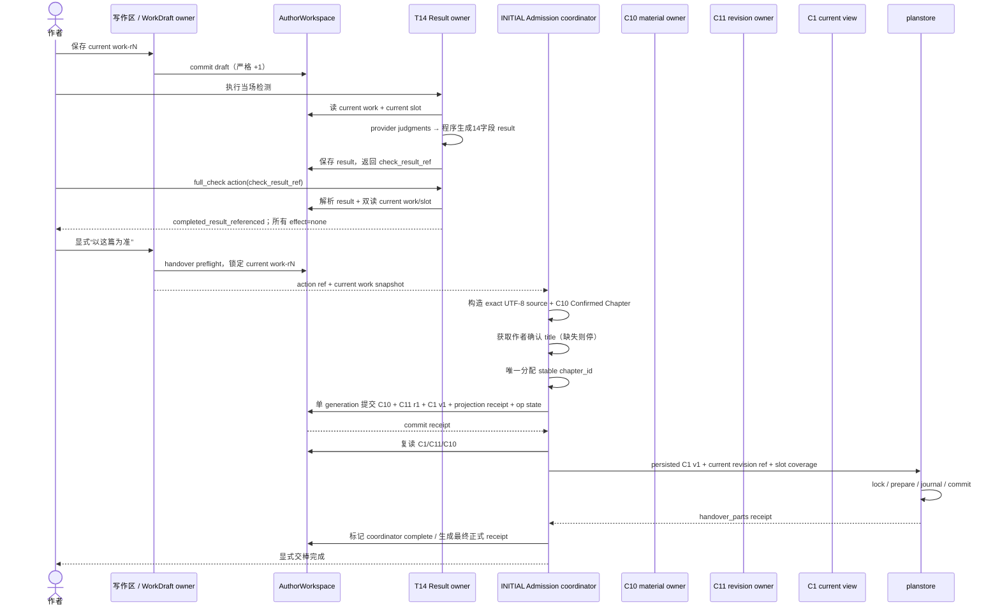

# PA｜作者工作稿、检测、收工与显式交棒架构审查

- **审查身份**：`ADVISORY_ONLY`
- **审查范围**：`作者工作稿 → T14 当场检测 → 作者处置 finding → full_check / skip_check / no_prose 收工 → 作者显式“以这篇为准” → C10 → C11 → C1 → planstore handover_parts`
- **材料包**：`chatgpt_review_route_r13-module-usable-pro-four-window-review-20260819-r01_20260819_185106.zip`
- **包 SHA-256**：`9f3b19b3405bd7fbab58069ef54d3b27b380ab55cdd9cf1b7382c5102db08879`
- **完整性**：230 个 ZIP 成员，`testzip = none`，包内 `SHA256SUMS` 全部通过
- **审查动作**：只读代码、合同、直接测试与结果票；未改代码、合同、R13、Gold、作者真值或任何运行数据
- **总判决**：`ROUTE_B_REQUIRED__AUTHOR_CAN_REACH_PREFLIGHTS__END_TO_END_HANDOVER_NOT_YET_RUNTIME_COMPLETE`

## 证据身份标记

本文用以下标签避免把产品原则、合同、代码和建议混成一种事实：

- **[正式规则]**：R13 或正式合同已经冻结的语义。
- **[代码现状]**：包内当前代码直接证明的行为。
- **[直接测试]**：包内可运行测试、正式 validator 或当前结果票证明的机械能力。
- **[建议]**：本次外审给出的最小施工路线，不自动成为合同或授权。
- **[GAP]**：合同要求与当前 runtime 之间仍有断口。
- **[待 CZ]**：缺少唯一产品／合同选择，不能靠实现者猜默认值。

材料采用顺序按共用说明执行：当前 Prompt／CZ → R13 → 正式合同 → 当前代码与直接测试 → 原子预期 → 当前停点 → 旧设计与外审建议；冲突必须显式列出。`01_current_truth/TEMP/chatgpt_pro_module_review_four_windows_20260819_r01/00_SHARED_UPLOAD_INSTRUCTIONS.md:L7-L19`

---

# 1. 一页结论

## 1.1 主路线

✅ **T14 检测结果 owner 选择 B。**

正式检测结果必须先由 T14 owner 保存，再由 `check_result_ref` 解析。A 只能保留为“同一次调用里的 intake／transport 形态”，不能成为 MVP 的长期 owner 路线。正式结果合同已经把 owner 指向 T14、把直接消费者指向 `full_check`；收工合同又明确要求 `check_result_ref` 必须解析到“detection side owned”的 current 结果。`02_current_route/novel-mvp/contracts/WRITING_DESK_CHECK_RESULT.md:L9-L18`；`02_current_route/novel-mvp/contracts/WRITING_DESK_CLOSEOUT_ACTION.md:L51-L68`

建议的 MVP 链是：

```text
current 工作稿 + current 章槽
  → 冻结 T14 输入包
  → provider 只交 judgments
  → 程序生成并验证正式 14 字段结果
  → T14 owner 持久化，得到可跨重启解析的 check_result_ref
  → 作者查看 finding／做短命处置
  → full_check 只读 preflight 按 ref 重新解析并复核 current、scope、coverage
  → 收工回执只写 completed_result_referenced，其他 effects 全为 none
  → 作者另行显式“以这篇为准”
  → 把 current 作者原文构造成受控、可逐字回放的 C10 source + Confirmed Chapter material unit
  → C11 INITIAL 唯一发 stable chapter_id，建立 r1
  → C1 v1 作为 C11 current revision 的物化视图
  → 持久化并复读 C1/C11 后，planstore 才追加 handover_parts
```

工作稿、检测和收工不会自动走到交棒。R13 明确：写作区 AI 零介入；检测只诊断、不自动改；三路收工中 `no_prose` 不移交真值；外写或产品内新稿只有作者显式选择“以这篇为准”才交棒。`01_current_truth/references/shared-context/NOVEL_ARCH_SHARED_CONTEXT_CORE_MATERIALS_20260814_R13/03_CREATION_AND_MEMORY_PIPELINES.md:L292-L300`

## 1.2 当前作者实际能做到哪里

作者现在已经可以：保存 current 工作稿、严格递增并重启读回；从 current 工作稿和 current 章槽构造零模型检测输入；把 provider 的 `judgments` 变成程序验证的正式结果对象；执行 `skip_check`、`no_prose` 和显式交棒的只读 preflight。对应结果票分别证明了保存、交棒 preflight、skip、no-prose、检测输入包和结果 intake 的局部能力。`03_upstream_evidence/TEMP/a_p_a_work_draft_author_workspace_current_save_20260819_r01/MODULE_RESULT.md:L8-L15`；`03_upstream_evidence/TEMP/a_p_a_work_draft_explicit_handover_preflight_20260819_r01/MODULE_RESULT.md:L8-L15`；`03_upstream_evidence/TEMP/a_p_a_writing_check_result_intake_tool_20260819_r01/MODULE_RESULT.md:L8-L17`

作者现在还不能在产品 runtime 中完成：

```text
正式结果保存并跨重启按 ref 解析
→ full_check
→ C10 受控 source 接收
→ C11 INITIAL writer
→ C1 v1 current view
→ planstore handover_parts
```

当前停点也把这几个缺口明确列为 T14 owner、C10 origin、唯一章节号 owner、C11 runtime writer 和跨存储协调器。`01_current_truth/TEMP/t03_total_control_hub_20260818_r01/CURRENT_CONTROLLER_BRIEF.md:L18-L30`

## 1.3 三个最大阻断

### 阻断 A｜T14 正式结果有合同、没有 runtime owner

[正式规则] 结果要“保存”，由 T14 owner 管，`full_check` 只携带 ref。`02_current_route/novel-mvp/contracts/WRITING_DESK_CHECK_RESULT.md:L5-L18`

[代码现状] AuthorWorkspace 允许的逻辑键中没有检测结果键；结果工具只返回对象，不持久化。`02_current_route/novel-mvp/mvp/workspace.py:L24-L42`；`03_upstream_evidence/TEMP/a_p_a_writing_check_result_intake_tool_20260819_r01/MODULE_RESULT.md:L39-L42`

**后果**：重启后无法解析 ref；延后处置 finding 无 owner；unknown overlay 无 parent 保存点；旧结果 stale 只能靠调用方自己记忆，容易产生第二份结果真值。

### 阻断 B｜显式交棒缺少完整 INITIAL admission runtime

现有交棒 action 只有 11 个字段，没有章节标题；C1 v1 却要求 `title`。`02_current_route/novel-mvp/contracts/WORK_DRAFT_HANDOVER_ACTION.md:L9-L25`；`02_current_route/novel-mvp/contracts/C1_CHAPTER_DOC.md:L14-L27`

规划槽里的 `title_hint` 正式写明“不是实际章节标题”，不能拿来补默认。`02_current_route/novel-mvp/contracts/PLAN_LEDGER_STORAGE.md:L183-L203`

同时，`CHAPTER_REVISION_COMMIT_ACTION` 只绑定现有 stable chapter，明确禁止动作自行发新 `chapter_id`；当前没有唯一 INITIAL chapter ID owner，也没有 C11 writer。`02_current_route/novel-mvp/contracts/CHAPTER_REVISION_COMMIT_ACTION.md:L20-L40`；`02_current_route/novel-mvp/contracts/CHAPTER_REVISION_COMMIT_ACTION.md:L71-L75`

### 阻断 C｜C11 正式原子组与两个物理事务边界不一致

C11 正式原子组要求 ledger、C1、C10→revision receipt、受影响 planstore effects 和 transaction receipt 一起只出现完整 before 或完整 after。`02_current_route/novel-mvp/contracts/C11_CHAPTER_REVISION_LEDGER.md:L131-L142`

当前 AuthorWorkspace 由 `.workspace.lock`、generation pointer 和自己的 prepare receipt 保证单工作区原子；旧 planstore 由 `.planstore.lock` 和 `.planstore_txn/` 保证另一套事务。`02_current_route/novel-mvp/mvp/workspace.py:L412-L427`；`02_current_route/novel-mvp/mvp/workspace.py:L599-L641`；`02_current_route/novel-mvp/contracts/PLAN_LEDGER_STORAGE.md:L42-L57`

**结论**：现在可以设计成可恢复的两阶段接缝，但不能诚实宣称“跨 owner 真原子”。正式 `CHAPTER_REVISION_COMMIT_RECEIPT status=COMMITTED` 只有在两侧都完成并复读后才能发；中间 pending 必须是内部恢复状态，不得冒充正式 COMMITTED。回执的正式状态规则要求 COMMITTED 时所有 owner 都是完整 after。`02_current_route/novel-mvp/contracts/CHAPTER_REVISION_COMMIT_RECEIPT.md:L48-L54`

## 1.4 本次直接复核

本次审查在包内直接复核了以下机械能力：

- AuthorWorkspace、工作稿、章槽快照、检测输入包、检测结果对象、C1 AuthorWorkspace adapter：`117/117 PASS`。
- 旧 planstore handover 定向测试：`33/33 PASS`。这证明旧事务恢复机制可运行，不证明其业务语义符合 C11/C1 新合同。
- C10 正式 validator：`PASS`，28 个 fixtures，33 个 negative probes。
- C11 正式 validator：`all_pass=true`；42 个 formal cases、15 个 eligibility gates、5 个 restore gates、1 个 batch atomicity gate、10 个 machine gates、5 个 action-entry cases 全通过。

⚠️ `tests/test_novel_mvp_c10_first_entrypoints.py` 在运输包内引用顶层 `cli`，但包内没有 `novel-mvp/cli.py`，因此本次无法在该 ZIP 内复跑产品入口测试。这个是“运输可复现 GAP”，不能反推 C10 合同失败，也不能把上游入口回执冒充本包可复跑能力。`02_current_route/tests/test_novel_mvp_c10_first_entrypoints.py:L14-L22`

---

# 2. 现状能力图

| 链路节点 | 当前身份 | 直接证据 | 作者现在能做什么 | 仍不能宣称什么 |
|---|---|---|---|---|
| current 工作稿保存 | **已可运行** | `mvp/work_draft_workspace.py` 只写 `draft`；结果票证明严格 +1、幂等、重启读回。`02_current_route/novel-mvp/mvp/work_draft_workspace.py:L1-L5`；`03_upstream_evidence/TEMP/a_p_a_work_draft_author_workspace_current_save_20260819_r01/MODULE_RESULT.md:L10-L15` | 保存、继续编辑、重启恢复 current 原文 | 不是 C1、冻结证据、fact、actual 或完整历史树 |
| current 工作稿 + 章槽冻结检测输入 | **已可运行的纯工具** | 只编译 current PE + `must_not`，输出包 SHA，不出 judgments。`03_upstream_evidence/TEMP/a_p_a_writing_check_package_standalone_tool_20260819_r01/MODULE_RESULT.md:L10-L17` | 得到可重复、零模型的 T14 输入工件 | 不是正式检测、不是 R13 全部 QC |
| provider judgments → 14 字段正式结果对象 | **已可运行的纯工具** | 程序重算 identity、scope、coverage、SHA、status；provider 只交 judgments。`03_upstream_evidence/TEMP/a_p_a_writing_check_result_intake_tool_20260819_r01/MODULE_RESULT.md:L10-L17` | 生成合法 `WRITING_DESK_CHECK_RESULT v1` 对象 | 未保存、未成为可跨重启 ref；不证明语义诊断正确 |
| T14 结果 owner／ref resolver | **缺 runtime** | 正式合同要求 owner=T14；AuthorWorkspace 无对应逻辑键。`02_current_route/novel-mvp/contracts/WRITING_DESK_CHECK_RESULT.md:L9-L18`；`02_current_route/novel-mvp/mvp/workspace.py:L24-L42` | — | 不能说 full_check 可跨请求／重启使用 |
| mismatch 作者处置 | **合同够用；runtime 未见** | 三条 route 只返回既有入口，不能把 finding 标 resolved。`02_current_route/novel-mvp/contracts/WRITING_DESK_CHECK_DISPOSITION_ACTION.md:L71-L125` | 语义上已能明确改稿／保持规划／进规划编辑 | 没有结果 owner 前无法安全解析 finding_ref；没有 disposition ledger |
| unknown 人工裁决 | **合同够用；runtime 未见** | 作者 overlay，parent finding 永远 unknown，full_check 不消费。`02_current_route/novel-mvp/contracts/WRITING_DESK_CHECK_UNKNOWN_ADJUDICATION_ACTION.md:L98-L123` | 语义上可显示“模型 unknown + 作者判断” | 不是 evidence、PASS、PE 兑现或真值 |
| full_check | **只有合同，缺 preflight runtime** | 收工合同定义 ref/current/coverage 机械复验。`02_current_route/novel-mvp/contracts/WRITING_DESK_CLOSEOUT_ACTION.md:L41-L68` | — | 不能说正式 full_check 可用 |
| skip_check | **只有只读 preflight** | 双读 current 工作稿、返回 `skipped_by_author`、零写。`03_upstream_evidence/TEMP/a_p_a_work_draft_skip_check_closeout_preflight_20260819_r01/MODULE_RESULT.md:L10-L15` | 作者可明确选择跳过检测并得到短命前置结果 | 不等于 PASS、clean、checked、关章或已持久化收工 |
| no_prose | **只有只读 preflight** | 空 draft + 双读 current slot，effects 全 none。`03_upstream_evidence/TEMP/a_p_a_no_prose_closeout_preflight_20260819_r01/MODULE_RESULT.md:L10-L15` | 作者可明确结束本轮无书稿工作 | 规划进度未保存；不写成、不关章、不 actual、不自动开下一章 |
| 显式“以这篇为准” | **只有只读 preflight** | 双读 current 工作稿，返回 action + draft snapshot；无 C1/C11/planstore。`03_upstream_evidence/TEMP/a_p_a_work_draft_explicit_handover_preflight_20260819_r01/MODULE_RESULT.md:L10-L15` | 作者动作和 current 工作稿能对平 | 不等于交棒成功 |
| C10 material identity | **正式合同 + 旧产品 writer；未接 AuthorWorkspace 工作稿** | source span、authority、Confirmed Chapter 门已冻结。`02_current_route/novel-mvp/contracts/C10_INTAKE_MATERIAL_IDENTITY.md:L21-L40`；`02_current_route/novel-mvp/contracts/C10_INTAKE_MATERIAL_IDENTITY.md:L116-L139` | 旧导入路径能保存显式 C10 材料 | 旧路径接项目字符串、分文件顺序写，不能直接当新交棒 runtime |
| C11 ledger | **合同／Schema／validator 可用；writer 缺失** | stable ID、append-only revision、INITIAL 门、原子组已冻结。`02_current_route/novel-mvp/contracts/C11_CHAPTER_REVISION_LEDGER.md:L21-L48`；`02_current_route/novel-mvp/contracts/C11_CHAPTER_REVISION_LEDGER.md:L79-L85` | 可验证候选 ledger 和 action entry | 不能正式创建、保存或恢复 current ledger |
| C1 v1 AuthorWorkspace current view | **接收 adapter 已可运行** | 只接受调用方给出的合法 C1 v1 + current refs，一次提交 `chapters` + `chapter_index`。`02_current_route/novel-mvp/mvp/chapter_workspace.py:L1-L5`；`02_current_route/novel-mvp/mvp/chapter_workspace.py:L108-L143` | 已有合法 C11/C1 时可保存和读回 | 不创建 C11、不能自己发 chapter ID |
| 旧 `planstore.accept_work_draft_handover` | **事务机制可运行；业务语义必须退役** | 当前会自己发 cNN、直接写 legacy C1、把 slot/scenes/events 标 handed_over。`02_current_route/novel-mvp/mvp/planstore.py:L588-L599`；`02_current_route/novel-mvp/mvp/planstore.py:L633-L723`；`02_current_route/novel-mvp/mvp/planstore.py:L725-L815` | 可复用 lock/journal/recovery/idempotency 机制 | 不能原样接新链；不能再消费 work text、发 ID 或造 C1 |
| persisted C1 v1 → handover_parts | **合同要求存在；新 adapter 缺失** | planstore 只能在 C1 成功后消费合法 chapter identity，不能伪造 C1。`02_current_route/novel-mvp/contracts/PLAN_LEDGER_STORAGE.md:L271-L281` | — | 端到端显式交棒尚未完成 |

---

# 3. T14 结果 owner 二选一裁决

## 3.1 裁决：B 是主路线，A 只保留为 transport

### 为什么 B 才能承担 owner

1. **重启可解析**：`check_result_ref` 是后续动作唯一稳定入口。没有 owner 持久层，重启后 ref 只剩字符串，无法重新获得 14 字段结果。
2. **延后处置**：作者可能隔一段时间再处理 mismatch／unknown；处置动作要求从 parent result 重新计算 `finding_ref`，不能靠 UI 缓存或“最相似文本”匹配。`02_current_route/novel-mvp/contracts/WRITING_DESK_CHECK_DISPOSITION_ACTION.md:L23-L31`
3. **unknown overlay 有 parent 生命周期**：人工裁决要和 parent result 一起 current／stale，并在重新检测后失去当前展示资格。`02_current_route/novel-mvp/contracts/WRITING_DESK_CHECK_UNKNOWN_ADJUDICATION_ACTION.md:L125-L140`
4. **旧结果要保留但不得冒充 current**：工作稿或章纲变化后，旧结果仍可追，但立即失去 full_check 资格；这需要 owner 保存历史对象，current 资格由读取时重算，而不是删除旧结果。`02_current_route/novel-mvp/contracts/WRITING_DESK_CHECK_RESULT.md:L139-L156`
5. **避免第二份结果真值**：B 让完整正式结果只在 T14 owner 保存一次；消费者只带 ref。A 会迫使每个调用方保存完整对象、各自决定 stale，结果很快分叉。
6. **作者隔离与后端替换**：AuthorWorkspace 已把已认证主体绑定成 opaque author/project capability，业务模块不接调用方路径；未来后端替换点集中在 `WorkspaceRouter`。`02_current_route/novel-mvp/mvp/workspace.py:L120-L160`；`02_current_route/novel-mvp/mvp/workspace.py:L924-L1005`

## 3.2 MVP 最小存储形态

[建议] 在 AuthorWorkspace 增加一个可见逻辑键：

```text
writing_check_results
```

它不是通用检测平台，只服务 `WRITING_DESK_CHECK_RESULT v1` 和它的 current UI overlay。最小 payload：

```json
{
  "schema": "writing-check-results-v1",
  "results": {
    "<check_result_ref>": {
      "result": { "...正式14字段...": "..." },
      "result_sha256": "...",
      "recorded_at": "...",
      "unknown_overlays": []
    }
  }
}
```

约束：

- `results[check_result_ref]` **只追加、不可原地改写**。
- 不保存 `current=true/false`；current 每次按 current work + current slot/outline 重算。
- `result_sha256` 对完整正式结果做 canonical JSON SHA，防损坏和键下替换。
- unknown adjudication 若产品要在重启后继续显示，作为 parent entry 下的 child receipt 保存；不建独立 adjudication ledger。
- mismatch route 只返回下一入口，无长期消费者，不写 disposition ledger。
- MVP 不需要额外 immutable blob + index：AuthorWorkspace 每次 commit 已把逻辑键 payload 写入内容寻址的不可变 state blob，再由 generation pointer 原子切换。`02_current_route/novel-mvp/mvp/workspace.py:L695-L721`
- 未来结果量过大时，才把完整结果下沉为 AuthorWorkspace immutable blob，并保留轻索引；这不是当前票的前置。

## 3.3 写入、幂等、竞态和损坏处理

建议 admission 顺序：

```text
冻结输入包
→ provider 返回 judgments
→ 程序构造并验证正式 result
→ 再读 current work + current slot
→ 任一来源变化：SOURCE_CHANGED_DURING_CHECK，结果不进入 owner
→ 读取 writing_check_results 当前 version/SHA
→ 追加目标 ref
→ AuthorWorkspace.commit(expected version/SHA, operation_id)
→ 成功后按 ref 复读并校验 result SHA
```

- **同 operation + 同 payload**：由 AuthorWorkspace operation receipt 原样重放。
- **同 operation + 不同 payload**：拒绝 operation conflict。`02_current_route/novel-mvp/mvp/workspace.py:L579-L597`
- **并发追加**：一个 writer 成功，另一个收到 `VERSION_CONFLICT`，重读键后仅在 ref 不存在时重新 append；不得覆盖整个旧 map。
- **同 ref 不同 payload**：硬拒绝 `CHECK_RESULT_REF_PAYLOAD_CONFLICT`。
- **损坏**：AuthorWorkspace 会复验 current pointer、manifest、state blob 和 payload SHA；损坏时 fail closed。`02_current_route/novel-mvp/mvp/workspace.py:L439-L522`
- **读中变化**：resolver 首次读 parent entry，消费者完成 current 复核后再读同 ref；只要 parent result SHA 或 current work/slot snapshot 变化就失败。结果键因其他 ref 追加而升版不必误伤目标，只比较目标 entry SHA。
- **失败不覆盖**：AuthorWorkspace prepare journal 和 generation pointer 已能恢复为完整 old 或完整 new generation。`02_current_route/novel-mvp/mvp/workspace.py:L599-L641`

## 3.4 A 路线淘汰场景

| 场景 | A：内联完整对象 | B：owner + ref | 裁决 |
|---|---|---|---|
| 应用重启后 full_check | 调用方若没私存对象，ref 无法解析 | owner 直接按 ref 取回 | A 失败 |
| 作者两小时后处置 mismatch | UI 缓存可能丢失或已经旧 | 解析 parent，重算 finding_ref/current | B 可验证 |
| unknown 作者裁决 | overlay 不知挂在哪个原结果 | child receipt 归 parent entry | B 唯一清楚 |
| work-r2 → work-r3 | 各调用方可能仍拿 r2 对象说 current | owner 保留 r2，读取时统一判 stale | B 避免分叉 |
| outline baseline 变化 | 内联对象的调用方可能不重查 | resolver + preflight 机械重查 | B 可失败关闭 |
| 跨作者误用 | 内联对象可被带到另一个项目入口 | bound AuthorWorkspace 内 ref 只在本项目解析 | B 隔离 |
| 对象损坏／字段被 UI 改 | 无权威原件，难区分传输修改 | owner result SHA 可复验 | B 可审计 |
| 同一 ref 两份对象 | 会产生第二结果真值 | 同 ref 不同 payload 硬拒绝 | B 防分叉 |

**结论**：A 可作为 `writing_check_result_tool.execute()` 的返回对象和 owner writer 的 intake；A 不能成为正式消费者之间的持久传递方式。

---

# 4. `full_check` 最小只读 preflight

## 4.1 输入与输出

### 输入

```text
prepare_full_check_closeout(
    workspace: AuthorWorkspace,
    action: WRITING_DESK_CLOSEOUT_ACTION v1
)
```

硬边界：

- 业务入口只接已绑定 `AuthorWorkspace`，不接 path、author id、project id。
- action 必须精确 9 字段，`actor=author`、`route=full_check`。
- action 只携带 `check_result_ref`，不能夹带完整 result 对象。

### 输出

```json
{
  "status": "PREFLIGHT_READY",
  "closeout_action": { "...原样9字段...": "..." },
  "check_result_source": {
    "check_result_ref": "...",
    "result_sha256": "...",
    "results_key_version": 3,
    "results_key_sha256": "..."
  },
  "result": "completed_result_referenced",
  "handover_effect": "none",
  "chapter_close_effect": "none",
  "truth_effect": "none"
}
```

输出**不得**包含：`pass`、`clean`、`all_clear`、`resolved_findings`、`chapter_closed`、`C1_created`、`handover_parts_written`。正式收工合同只允许三个结果文案与三个 none effects。`02_current_route/novel-mvp/contracts/WRITING_DESK_CLOSEOUT_ACTION.md:L70-L90`

## 4.2 精确调用与失败顺序

所有错误都必须在任何业务写入前发生。建议函数从类型上就没有 write dependency；只调用 T14 resolver、work draft reader、chapter slot reader 和纯工具。

| 顺序 | 动作 | 失败码方向 | 为什么放在这里 |
|---:|---|---|---|
| 1 | 校验 `AuthorWorkspace` 类型和 action 精确字段 | `AUTHOR_WORKSPACE_HANDLE_REQUIRED` / `WRITING_DESK_CLOSEOUT_ACTION_INVALID` | 先挡路径、跨作者和多字段注入 |
| 2 | 校验 contract/version/actor/route/nullability | `FULL_CHECK_ROUTE_REQUIRED` 等 | 不读取任何业务对象前确定动作语义 |
| 3 | 从 T14 owner 解析 `check_result_ref`，复验 entry/result SHA | `CHECK_RESULT_NOT_FOUND` / `CHECK_RESULT_CORRUPT` | 不能让调用方对象代替 owner |
| 4 | 重新跑正式结果 Schema、14 字段、派生 ref、`status=completed` | `CHECK_RESULT_INVALID` / `CHECK_RESULT_NOT_COMPLETED` | 保存过不等于永远合法 |
| 5 | 第一次读取 current work draft 与 current chapter slot snapshot | `WORK_DRAFT_NOT_FOUND` / `PLAN_SNAPSHOT_NOT_FOUND` | 获取真实 current 水位 |
| 6 | 比较 action、result、work、slot、outline ref、plan watermarks | `STALE_WORK_REVISION` / `OUTLINE_NOT_CURRENT` / `PLAN_BASELINE_STALE` | 旧结果不能模糊抬到新版本 |
| 7 | 用 current work + current slot + result.operation_id 重新编译输入包 | `CHECK_PACKAGE_REBUILD_FAILED` | 不信任结果自报 scope |
| 8 | 要求重编包 SHA、scope、requirement_refs 与保存结果逐字段一致；重新验证 judgment coverage 和逐字 quote | `CHECK_SCOPE_CHANGED` / `CHECK_COVERAGE_INCOMPLETE` / `CHECK_EVIDENCE_INVALID` | 证明“当前全章要求集合已经逐条判定” |
| 9 | 第二次读取目标 result entry、current work 和 current slot snapshot | `SOURCE_CHANGED_DURING_FULL_CHECK_PREFLIGHT` | provider 或 preflight 读中变化时丢弃结果 |
| 10 | 返回只读 `PREFLIGHT_READY` | — | 无任何 closeout/plan/truth 持久写 |

## 4.3 requirement coverage 怎样证明“当前全章且完整”

正式证明不是“模型说检查完了”，而是：

```text
CurrentRequirementSet
  = deterministic_compile(current outline/slot legal sources)

ResultPlannedRefs
  = all non-unplanned judgments.requirement_ref

必须满足：
- scope.mode == chapter
- scope.target_ref == slot_ref
- scope.requirement_refs == CurrentRequirementSet（顺序和内容完全一致）
- 每个 CurrentRequirementSet ref 恰好出现一次
- planned category 只能 covered / mismatch / missing / unknown
- unplanned 只允许额外出现，requirement_ref = null
```

这正是正式结果合同的 coverage 语义。`02_current_route/novel-mvp/contracts/WRITING_DESK_CHECK_RESULT.md:L87-L100`

🔥 **当前 runtime 能证明的 requirement universe 只有“current PE 事件 + current must_not”。** 输入包结果票明确没有把 `risks`、`exit_condition` 等扩成 requirement。`03_upstream_evidence/TEMP/a_p_a_writing_check_package_standalone_tool_20260819_r01/MODULE_RESULT.md:L10-L16`

因此当前可以诚实写：

> `T14 v1 当前全章 scope（PE + must_not）coverage 完整。`

当前不能写：

> `R13 关章全部 QC 已完整覆盖。`

R13 关章还有字数、任务、剧情进展、质检、不冲突、符合规划等多道门；T14 full_check 只是收工引用，不是关章状态机。`01_current_truth/references/shared-context/NOVEL_ARCH_SHARED_CONTEXT_CORE_MATERIALS_20260814_R13/03_CREATION_AND_MEMORY_PIPELINES.md:L297-L300`

[待 CZ] 必须明确：MVP 是否接受 `PE + must_not` 作为 T14 v1 的完整 requirement universe。若要把更多章纲字段纳入 T14，应该先修正式 requirement 编译合同和数据夹具，不能在 full_check 里临时扩 scope。

## 4.4 为什么 completed 含 finding 仍可引用

`status=completed` 只证明机械执行完整：Schema 合法、版本绑定有效、coverage 完整、每个 requirement 已判定。它明确允许包含 `mismatch / missing / unplanned / unknown`，且合同没有 `pass` 或 `all_clear` 字段。`02_current_route/novel-mvp/contracts/WRITING_DESK_CHECK_RESULT.md:L158-L166`

因此：

- `mismatch` 表示发现已写内容和规划不一致，不等于检测没跑完。
- `missing` 表示某 requirement 未找到，不等于结果无效。
- `unplanned` 是额外 finding，不替代 planned coverage。
- `unknown` 是保留不确定性，不得 fallback 成其他类。

`full_check` 只能返回 `completed_result_referenced`，不能建立“全绿门”。

## 4.5 哪些回执长期保存，哪些只是短命投影

| 工件 | 建议生命周期 | 理由／消费者 |
|---|---|---|
| 正式 T14 result admission | **持久、幂等** | full_check、finding UI、延后作者处置和重启解析都消费 |
| unknown adjudication receipt | **如需跨重启 UI，则随 parent 持久** | 只给 finding 展示层；parent stale 时一起 stale |
| mismatch route receipt | **短命、可确定性重算** | 只返回下一入口；真正 work/plan 写有自己的 operation receipt |
| full_check preflight | **短命投影** | 零写、无业务状态，不进 plan.json |
| skip_check / no_prose preflight | **短命投影** | 已有实现也是零写；不表示正式 closeout 状态 |
| work draft save receipt | **持久、幂等** | current 工作稿 revision 的真正写入回执 |
| plan edit commit receipt | **持久、幂等** | planning baseline 真正变化的回执 |
| handover/C11/planstore coordinator receipt | **持久、可恢复** | 跨阶段崩溃后决定重试哪一侧 |

---

# 5. 检测后作者处置的真实消费者

## 5.1 mismatch 三选合同够用

| route | 当前真实语义 | 真正消费者 | 是否保存 route 本身 | 何时旧结果 stale |
|---|---|---|---|---|
| `edit_work` | 返回现有工作稿编辑／保存入口 | work draft UI + `save_current_work_draft` | 不建 disposition ledger；可返回短命 receipt | 作者真正保存 work-rN+1 后 |
| `keep_plan` | 当前既不改稿也不改规划 | 只有当前 finding UI；full_check 仍可引用原 completed result | **不保存长期决定**，除非将来证明有消费者 | 不 stale；result 仍 current，finding 仍 mismatch |
| `edit_plan` | 返回现有作者规划编辑入口 | plan edit UI + planstore author commit | 不建 disposition ledger；真正 plan commit 自己留 operation | planning baseline 真正前进后 |

合同已经清楚规定 route 只是下一入口，不直接写 work、plan、facts 或 actual。`02_current_route/novel-mvp/contracts/WRITING_DESK_CHECK_DISPOSITION_ACTION.md:L71-L125`

### 为什么 keep_plan 不能把 finding 改成 resolved

`keep_plan` 的机械事实是四个 diff 都为 0：work、outline、planstore、facts/actual。诊断证据和 requirement 都没变，系统没有新依据把 mismatch 改成 covered/resolved。合同也明确原 finding 继续是 mismatch，但 result 仍可作为一次完整检测供 full_check 引用。`02_current_route/novel-mvp/contracts/WRITING_DESK_CHECK_DISPOSITION_ACTION.md:L91-L104`

把“作者暂时不改”写成“问题已解决”会混淆三件事：

```text
作者看见了
≠ 作者认同规划正确
≠ 检测诊断已经改变
```

没有长期消费者时，不应为“作者看过”新建 disposition ledger。

## 5.2 unknown 人工裁决合同够用

当前合同把作者判断保存成 `self_reported` overlay，原模型 finding 永远保持 unknown；full_check 前后资格不变。`02_current_route/novel-mvp/contracts/WRITING_DESK_CHECK_UNKNOWN_ADJUDICATION_ACTION.md:L81-L123`

建议在 B 路线下把 receipt 存在 parent result entry 内，理由只有一个：写作区可能重启后仍需并列显示：

```text
模型诊断：unknown
作者裁决：covered / missing / mismatch（self-reported）
```

它不是第二份 check result，不产生 evidence、`prose_basis=verified`、PE 兑现、facts 或 actual。`02_current_route/novel-mvp/contracts/WRITING_DESK_CHECK_UNKNOWN_ADJUDICATION_ACTION.md:L142-L153`

## 5.3 missing / unplanned 现在不需要新动作

### `missing`

真实消费者只有 finding UI。作者可以直接进入现有工作稿编辑入口，或暂时不处理；这两个行为都不需要新语义 action。

不应新建“accept missing”“dismiss missing”状态，因为：

- 作者不处理不等于 requirement 已满足；
- 真正补写后 work revision 会变化，旧结果自然 stale；
- 下次检测会重新判定，不需要第二本 finding 状态账。

### `unplanned`

当前只说明工作稿出现规划外内容。它不创建 PE、F- 或 actual。作者若想修改未来规划，直接进入已有 plan edit；若作者后来显式交棒，规划—书稿对账属于独立 reconciliation 消费口，不应由 T14 在收工阶段偷写。

正式 result 合同也明确 `unplanned` 只进入后续作者对账候选。`02_current_route/novel-mvp/contracts/WRITING_DESK_CHECK_RESULT.md:L112-L122`

## 5.4 stale 与重新检测

- **只点 route**：不 stale。
- **真正保存新工作稿 revision**：旧 result 和它的 finding/overlay 全部 stale，必须重检。
- **真正提交新 planning baseline／outline**：旧 result 全部 stale，必须重检。
- **keep_plan**：无来源变化，不要求重检；finding 保持 mismatch。
- **unknown overlay**：只随 parent result current；新检测生成新 ref 后不迁移旧裁决。

---

# 6. 显式交棒到 C10／C11／C1／planstore 的最小安全接缝

## 6.1 各问题的裁决

| 问题 | 裁决 |
|---|---|
| current 工作稿是否先冻结为受控 source | **是。** 但“先”是验证顺序；可见提交最好与 C11/C1 在同一 AuthorWorkspace generation 一起出现，避免露出半份 C10。 |
| source 如何逐字回放 | 对 `draft.text.encode("utf-8")` 保存原始 bytes；encoding=`utf-8`、normalization=`none`；decoded text 必须逐字等于工作稿；C10 span 为 `[0, len(text))`，slice SHA 对 UTF-8 切片计算。 |
| Confirmed + Chapter authority | 显式 handover 是作者声明，使用现有 C10 合法组合 `USER_DECLARATION + USER`；basis reference 指向受认证作者的 handover operation，不能由模型确认。 |
| stable chapter ID 谁发 | **C11 INITIAL admission coordinator 是唯一 owner。** action 不发号，planstore 不发号，C1 不发号。 |
| C11/C1/C10→revision receipt 谁写 | 同一个窄 `chapter initial admission coordinator` 计算并提交；C1 只是 C11 current 的物化视图。 |
| planstore 何时消费 | C1 v1 已成功持久化、重新读回，并与 C11 current ref／text SHA 完全一致后。 |
| 旧 handover 复用什么 | 复用 planstore lock、prepare journal、operation id、crash recovery 和 history/blob 写法。 |
| 旧 handover 退役什么 | `_next_c1_id`、从 `current_work` 造 legacy C1、调用方任意 title、直接接 `project_dir` 的业务入口。 |
| C1 成功、planstore 失败 | C1/C11/C10 保持有效，不删除、不重发 ID；operation 进入内部 `PLANSTORE_PENDING`，只重试 planstore。 |
| 两边能否宣称真原子 | **当前不能。** 只能做可恢复两阶段，并在 CZ 选择合同口径前标 GAP。 |

## 6.2 工作稿 → C10 controlled source

工作稿是作者原始资产但尚不是证据；冻结后才另生成不可静默覆盖的证据版本。`01_current_truth/references/shared-context/NOVEL_ARCH_SHARED_CONTEXT_CORE_MATERIALS_20260814_R13/02_SYSTEM_ARCHITECTURE_AND_TRUTH_LAYERS.md:L193-L195`

建议的 source 构造：

```text
raw_bytes = current_work.text.encode("utf-8")
decoded_text = current_work.text
encoding = "utf-8"
normalization = "none"
source_sha256 = SHA256(raw_bytes)
span = [0, len(decoded_text))
slice_sha256 = SHA256(decoded_text.encode("utf-8"))
```

C10 正式规则要求保存原始 bytes、解码方式、精确 decoded text；解码后不得 normalization、换行归一、trim 或其他改写，任一 SHA/span 不匹配都 fail closed。`02_current_route/novel-mvp/contracts/C10_INTAKE_MATERIAL_IDENTITY.md:L116-L126`

C10 identity revision：

```text
state = CONFIRMED
role = CHAPTER
basis.type = USER_DECLARATION
basis.reference = 已认证 handover operation/ref
actor.type = USER
actor.reference = 从 bound AuthorWorkspace 推导的内部作者主体，不接调用方 author id
```

模型没有 Confirmed Chapter authority；C10 允许的 Confirmed Chapter 权力只来自 `USER_DECLARATION + USER` 或受控 `STRUCTURED_ENTRY + SYSTEM`。`02_current_route/novel-mvp/contracts/C10_INTAKE_MATERIAL_IDENTITY.md:L128-L139`

## 6.3 标题是硬 GAP，不能偷用 title_hint

`WORK_DRAFT_HANDOVER_ACTION v1` 没有 title 字段，而 C1 和 C11 revision 都要求本版 title。`02_current_route/novel-mvp/contracts/WORK_DRAFT_HANDOVER_ACTION.md:L13-L25`；`02_current_route/novel-mvp/contracts/C11_CHAPTER_REVISION_LEDGER.md:L32-L47`

planstore 的 `chapter_slot.title_hint` 明确只是“章名建议，不是实际章节标题”。`02_current_route/novel-mvp/contracts/PLAN_LEDGER_STORAGE.md:L183-L203`

所以 runtime 不能：

- 默认用 `title_hint`；
- 从正文第一行猜标题；
- 继续接受旧 planstore 的任意 `title` 参数；
- 用文件名补标题，因为工作稿没有文件名语义。

[待 CZ] 两个最小候选：

1. **推荐**：受控修订 `WORK_DRAFT_HANDOVER_ACTION`，增加作者明确确认的 `chapter_title`；
2. 复用一个已经存在、能回到作者确认的章节标题对象／入口，并让 handover 只引用它。

在这项决定前，C11 INITIAL/C1 施工票必须停在 preflight，不能凭默认值写正式章。

## 6.4 stable chapter ID 的唯一 owner

`CHAPTER_REVISION_COMMIT_ACTION` 的 `target_chapter_id` 必须绑定现有 stable chapter，并明确禁止动作发新 ID。`02_current_route/novel-mvp/contracts/CHAPTER_REVISION_COMMIT_ACTION.md:L20-L40`；`02_current_route/novel-mvp/contracts/CHAPTER_REVISION_COMMIT_ACTION.md:L71-L75`

建议：

- INITIAL coordinator 在 AuthorWorkspace 锁／乐观版本门内读取全部 C11 ledgers。
- 以现有最大合法 `cNN` + 1 发新号，不回收空洞，不让调用方预占。
- C11 ledger、C1 view、chapter index 和 operation record 同一 AuthorWorkspace commit。
- 并发双 INITIAL 时，一个提交成功；另一个收到 version conflict，重读后重新计算整个候选，不能保留旧预发号。
- ID 只有在 commit 成功后对外可见。

这不是新全局 ID 平台，只是把 stable chapter ID 归还给它唯一的 C11 INITIAL owner。

## 6.5 C11、C1、C10 projection 的 writer

建议一个窄 owner：

```text
chapter_initial_admission_workspace
```

它只做 INITIAL，不顺手承包通用 revision、facts、关章或 reconciliation。一次 AuthorWorkspace atomic commit 的可见对象：

```text
intake_materials
  - parent source
  - C10 material unit + identity revision

chapter_revisions
  - C11 ledger r1, change_kind=INITIAL

chapters
  - C1 v1 current view（逐字原文）

chapter_index
  - current chapter_revision_ref

chapter_admission_operations
  - operation 状态、payload SHA、C10→revision projection receipt
```

C1 adapter 的现有验证逻辑可以复用，但不能先单独调用 `persist_c1_current_views()` 再补 C11；那会让 C1 暂时没有 owner。当前 adapter 自己也明确只物化上游已确认 current view，不创建 C11。`02_current_route/novel-mvp/mvp/chapter_workspace.py:L1-L5`

## 6.6 planstore 新接缝：只消费 persisted C1 v1

旧入口的事务恢复价值可以保留，但业务输入必须改成：

```text
accept_persisted_c1_handover(
  bound workspace,
  trusted planstore backend,
  handover_action_ref,
  persisted_c1_v1,
  c11_current_revision_ref,
  slot_ref,
  covered_scene_refs / covered_pe_refs
)
```

写前必须：

1. 从 AuthorWorkspace 重新读 C1，不信调用方内联对象；
2. 复验 C1 v1 Schema、id、text SHA、revision ref；
3. 解析 C11 current，要求 ref 完全相同；
4. 复验 handover action 仍指向产生该 C10/C11/C1 的 current work revision；
5. 复验 current plan slot/outline；
6. 才运行 planstore 自己的 lock/journal/commit。

旧 `accept_work_draft_handover` 不能继续作为业务入口：它接任意 `project_dir`、`current_work` 和调用方 title，然后自行发 chapter ID、写 legacy C1。`02_current_route/novel-mvp/mvp/planstore.py:L1520-L1553`；`02_current_route/novel-mvp/mvp/planstore.py:L676-L684`

新入口不得创建：C10、C11、C1、facts、actual 或 reconciliation。它只按现行 plan contract 追加 `handover_parts`、mapping，并更新明确覆盖的 slot/scenes/PE `truth_bearing`。正式合同允许的交棒 effects 见 `02_current_route/novel-mvp/contracts/PLAN_LEDGER_STORAGE.md:L239-L269`。

## 6.7 显式交棒时序图



## 6.8 C1 成功、planstore 失败的恢复

### 最小诚实状态

```text
AUTHOR_WORKSPACE_COMMITTED__PLANSTORE_PENDING
```

它是**内部 operation recovery state**，不是新业务账、不是 chapter state，也不是正式 `CHAPTER_REVISION_COMMIT_RECEIPT` 新枚举。

### 恢复规则

| 崩溃点 | 可见状态 | 恢复动作 |
|---|---|---|
| AuthorWorkspace pointer commit 前 | C10/C11/C1 全不可见 | AuthorWorkspace 自己回到 before；整次重试 |
| AW commit 后、planstore prepare 前 | C10/C11/C1 有效；planstore 未交棒 | 按 operation record 复读同一 C1/C11，只重试 planstore |
| planstore prepare 后、commit 前 | AW after；planstore 有恢复 journal | 运行 planstore recovery，得到其完整 before 或 after |
| planstore commit 后、最终 receipt 前 | 两边都已 after | 复读 C1/C11 + planstore handover，补最终 receipt；不重复写 |
| 任一侧 SHA 既不等于 before 也不等于 after | 未知 | `NEEDS_MANUAL_RECOVERY`，禁止猜、补写、宣布成功 |

### 安全重试

- 不删除已成功的 C1/C11，也不重新发 chapter ID。
- planstore 子操作使用确定性 operation id；同载荷重放返回旧 receipt。
- planstore 重试前若 C11 current 已变化，停下，不把旧 C1 交棒为 current。
- 若 planstore 已 commit，只补 coordinator completion，不重复追加 handover_parts。

## 6.9 这是不是正式原子

**不是。当前物理条件下只能叫“可恢复两阶段”，不能叫 true cross-owner atomic commit。**

真矛盾在于：

- C11 合同要求一个正式原子组；
- AuthorWorkspace 和 planstore 各有自己的 lock、journal 和 current pointer；
- 没有共同事务管理器或共同数据库；
- 用户边界又明确禁止为此建设统一工作流平台或第二套真值锁。

[待 CZ] 有两条诚实路线：

1. **推荐 MVP 口径**：把“C10/C11/C1 admission 成功”和“planstore handover 成功”冻结成两个有顺序、各自幂等的正式动作；只有第二步完成才向作者宣称“交棒完成”。这需要修订 C11 原子组对 INITIAL handover 的读法。
2. **保持现行 C11 原子承诺**：在同一物理事务 owner／数据库落地前，不宣称这条 runtime 合同完成；本轮只能做候选协调器与失败恢复测试。

禁止使用的说法：

- “先写进去，稍后总会一致”；
- “C1 有了就算交棒完成”；
- “planstore 失败后重新建一个 chapter”；
- “内部 pending 等于 COMMITTED”；
- “测试里最终恢复成功，所以物理上原子”。

---

# 7. 合同与 runtime 冲突清单

| ID | 冲突／缺口 | 正式规则 | 当前 runtime | 影响 | 最小决策／修法 |
|---|---|---|---|---|---|
| CR-01 | T14 owner 缺失 | 结果保存于 T14，full_check 按 ref 解析 | AuthorWorkspace 无结果键；工具只返回对象 | 重启、延后处置和 stale 统一判断不可用 | 选 B，增加单一 `writing_check_results` owner |
| CR-02 | full_check 缺 runtime | 机械复核 current work/outline/scope/coverage | 只有 skip/no-prose/handover preflight | 三路收工并未完整 | 新增只读 full_check preflight |
| CR-03 | T14 “全章”范围不等于 R13 全 QC | 正式 result 可表达合法 requirement source | 当前 package 只含 PE + must_not | 容易把局部 coverage 写成整章全绿 | CZ 冻结 T14 v1 universe 或先扩合同 |
| CR-04 | handover action 无 title | C1/C11 revision 必须有 title | preflight bundle 只有 current work 和 action | INITIAL 不能合法构造 | CZ 选择 author-confirmed title 来源 |
| CR-05 | INITIAL chapter ID owner 缺失 | revision action 不得发新 ID；C11 拥有 stable chapter | 旧 store/planstore 各自发号 | 双号源、同章多 ID | C11 INITIAL coordinator 唯一发号 |
| CR-06 | C11 writer 缺失 | ledger append/current pointer 是章节历史唯一真值 | 只有 Schema/validator | C1 无上游 owner | 建窄 INITIAL writer；不扩通用工作流 |
| CR-07 | C1 current adapter 只能接合法对象 | C1 是 C11 current materialized view | `chapter_workspace` 不创建 C11 | 单独调用会造悬空 C1 风险 | 和 C11/C10 同一 AW commit |
| CR-08 | 旧 C10 writer 不在 AuthorWorkspace | 作者隔离边界只接 bound workspace | 旧 store 接项目字符串；分文件顺序写 | 跨作者边界和半份状态风险 | 复用纯 builder/validator，退役旧 persistence seam |
| CR-09 | 旧 planstore 自己造 C1/ID | planstore 只能消费成功持久化的 C1 v1 | 旧入口接 work text + title，发 cNN，写 legacy C1 | 正面违反 C11/C1 | 新 persisted-C1 adapter；旧入口标 legacy/退役 |
| CR-10 | 两套物理事务 vs C11 原子组 | 所有 owner 完整 before/after | AW 与 planstore 各自锁和 journal | 不能发诚实 COMMITTED | CZ 选“两动作正式化”或等待同 owner 存储 |
| CR-11 | no_prose 规划进度 owner 缺失 | R13 说规划进度 +1；合同明确 owner GAP | preflight 零写 | 不能展示正式进度变化 | 继续 GAP，不建 progress ledger |
| CR-12 | C10 产品入口运输不可复跑 | 上游声称入口已实现 | ZIP 缺 `cli.py`，测试无法收集 | 本包不能独立证明该入口 | 下次 review 包补齐依赖；本次只采合同 validator |

---

# 8. 本地施工票（按依赖排序）

下面 6 张票都坚持单 owner、窄语义和独立验收。T1/T4 可并行；T2/T3 依赖 T1；T5 依赖 T4 和 CZ 标题／ID决定；T6 依赖 T5 和跨 owner 原子口径。

## T1｜T14 正式结果 owner 与 ref resolver

- **一句话目的**：让完整、已程序验证的 `WRITING_DESK_CHECK_RESULT v1` 在 AuthorWorkspace 中唯一保存，重启后仍能按 ref 解析。
- **owner／模块**：写作区 T14；`AuthorWorkspace` 只提供存储护栏。
- **精确输入**：bound `AuthorWorkspace`；完整 14 字段 formal result；expected `writing_check_results` version/SHA；现有 operation id。
- **精确输出**：result admission receipt；`check_result_ref`；resolver 返回的深拷贝 result + result SHA + owner 水位。
- **最小建议写集**：
  - 改：`novel-mvp/mvp/workspace.py`（只增加 `writing_check_results` 白名单键）
  - 新：`novel-mvp/mvp/writing_check_result_workspace.py`
  - 新：`tests/test_novel_mvp_writing_check_result_workspace.py`
- **禁改**：T14 正式合同、planstore、work draft text、C1/C11、facts、actual、R13。
- **前置依赖**：现有 `writing_check_result_tool.execute()`。
- **正常例**：保存含 mismatch+unknown 的 completed result，进程重启后按 ref 得到逐字段相同对象。
- **关键失败例**：provider 完成后、admission 前 work 或 slot 变化 → `SOURCE_CHANGED_DURING_CHECK`，results key 零变化。
- **完成后作者多做什么**：隔一段时间仍能打开同一检测结果、处理 finding，并给 full_check 提供稳定 ref。
- **仍不能宣称**：诊断语义正确、结果全绿、收工完成、C1/事实已写。
- **必须停下问 CZ**：CZ 不接受 B；要求结果有独立项目外保留期／删除语义；要求一个 ref 可被跨项目解析。

## T2｜`full_check` 最小只读 preflight

- **一句话目的**：把 `check_result_ref`、current work、current slot 和 deterministic coverage 对平，只返回 `completed_result_referenced`。
- **owner／模块**：写作区 closeout preflight。
- **精确输入**：bound AuthorWorkspace；精确 `WRITING_DESK_CLOSEOUT_ACTION v1(route=full_check)`。
- **精确输出**：`PREFLIGHT_READY` + action copy + result source watermark + 三个 none effects。
- **最小建议写集**：
  - 新：`novel-mvp/mvp/writing_closeout_workspace.py`
  - 新：`tests/test_novel_mvp_writing_closeout_workspace.py`
- **禁改**：work draft、plan、C1/C11、T14 result、facts；禁止写 closeout 状态机。
- **前置依赖**：T1；现有 package/result validators；current work/slot readers。
- **正常例**：completed result 同时含 mismatch、missing、unplanned、unknown，scope=current chapter，仍返回 `completed_result_referenced`。
- **关键失败例**：current plan baseline 已变化，或某 current PE ref 没有恰好一条 planned judgment → 写入前拒绝，workspace 全键不变。
- **完成后作者多做什么**：可以诚实选择“引用一次完整发生的当前全章 T14 检测后收工”。
- **仍不能宣称**：PASS、all clear、chapter close、handover、truth、R13 全 QC。
- **必须停下问 CZ**：产品要求把 `risks/exit_condition/字数/剧情进展` 同时塞入 T14 full_check；要求 finding 非空就拒绝收工。

## T3｜finding 处置 resolver 与 unknown parent overlay

- **一句话目的**：让 mismatch 三选和 unknown 人工裁决都从 T14 owner 解析真实 parent/finding，不建 disposition ledger。
- **owner／模块**：写作区作者动作层。
- **精确输入**：bound AuthorWorkspace；正式 mismatch action 或 unknown adjudication action。
- **精确输出**：
  - mismatch：`AWAITING_WORK_EDIT`／`KEEP_PLAN_NO_MUTATION`／`AWAITING_PLAN_EDIT` 短命 receipt；
  - unknown：parent 下的 `self_reported` overlay receipt。
- **最小建议写集**：
  - 新：`novel-mvp/mvp/writing_check_disposition_workspace.py`
  - 改：`novel-mvp/mvp/writing_check_result_workspace.py`（只追加 unknown child receipt）
  - 新：`tests/test_novel_mvp_writing_check_disposition_workspace.py`
- **禁改**：原 result judgment、work text、planstore、PE/F/actual、handover、chapter close。
- **前置依赖**：T1。
- **正常例**：重启后 author 对 unknown 选择 `covered`，界面仍显示模型 unknown + author self-reported covered。
- **关键失败例**：同一 finding_ref 属于旧 work-r2，而 current 已是 r3 → action/overlay 零写并返回 stale。
- **完成后作者多做什么**：能安全选择去改稿／保持规划／改规划，并在重启后继续看到 unknown 人工判断。
- **仍不能宣称**：finding resolved、模型改判、PE 兑现、证据 verified。
- **必须停下问 CZ**：要求长期统计“作者看过但不改”的 keep_plan；在没有明确消费者前不得顺手建 ledger。

## T4｜current 工作稿 → controlled C10 source 候选

- **一句话目的**：把显式 handover preflight 中的 current 作者原文构造成 exact UTF-8 source 与合法 Confirmed Chapter C10 candidate，不创建 C11/C1。
- **owner／模块**：写作区 handover intake / C10 pure preparation。
- **精确输入**：bound AuthorWorkspace；成功的 handover preflight bundle；当前 work snapshot；author-bound operation identity。
- **精确输出**：parent source candidate；一个覆盖全文的 C10 material unit candidate；source/span/SHA validation receipt。
- **最小建议写集**：
  - 新：`novel-mvp/mvp/work_draft_c10_source.py`
  - 新：`tests/test_novel_mvp_work_draft_c10_source.py`
  - 复用：`mvp/intake_identity.py` 的纯构造／validator；不复用旧 store persistence
- **禁改**：`mvp/store.py` 的旧项目路径、C1/planstore/facts、工作稿原文、C10 正式合同。
- **前置依赖**：现有 handover preflight；C10 validator。
- **正常例**：包含中文标点、CRLF、空行和尾随空格的工作稿逐字生成 source/span，回放完全相同。
- **关键失败例**：UTF-8 编码失败、source SHA/slice SHA 不闭合、action actor 不是 author → 零可见写入。
- **完成后作者多做什么**：显式选择的工作稿有了可逐字回放、可进入 C11 INITIAL 门的受控材料候选。
- **仍不能宣称**：章节已建立、C11/C1 已写、计划已交棒、事实已发生。
- **必须停下问 CZ**：有人要求用模型分类来写 Confirmed Chapter；要求 normalize/trim 工作稿；要求 source 在项目外共享。

## T5｜C11 INITIAL admission + C1 v1 AuthorWorkspace 原子组

- **一句话目的**：在唯一 stable chapter ID 下，同一 AuthorWorkspace generation 写入 C10 source/material、C11 r1、C1 v1 current view、chapter index 和 C10→revision receipt。
- **owner／模块**：C11 INITIAL admission coordinator。
- **精确输入**：bound AuthorWorkspace；T4 candidate；作者确认的 chapter title；expected C10/C11/C1 logical-key versions；operation id。
- **精确输出**：stable `chapter_id`；C11 r1 current ref；C1 v1；projection receipt；AW commit receipt；`PLANSTORE_PENDING` internal operation state。
- **最小建议写集**：
  - 改：`novel-mvp/mvp/workspace.py`（最少增加 `intake_materials`、`chapter_revisions`、`chapter_admission_operations`）
  - 新：`novel-mvp/mvp/chapter_initial_admission_workspace.py`
  - 必要时小改：`novel-mvp/mvp/chapter_workspace.py`（把现有纯验证逻辑公开复用，不单独 commit）
  - 新：`tests/test_novel_mvp_chapter_initial_admission_workspace.py`
- **禁改**：legacy `store.add_c1_v1_current_view` 发号语义、planstore、facts、reconciliation、actual。
- **前置依赖**：T4；CZ 拍定 title 来源与 C11 INITIAL ID owner。
- **正常例**：空项目内一次生成 c01/r1；C1 text 与 source span 逐字一致；重启后 C11 current 和 C1 ref 对平。
- **关键失败例**：两个并发 INITIAL 都预想 c01，只有一个 commit；另一个 version conflict 后重算为 c02，绝不出现双 c01 或悬空 C1。
- **完成后作者多做什么**：工作稿正式成为可回验的 chapter revision 和 current C1 manuscript。
- **仍不能宣称**：planstore 已交棒、跨 owner 原子、facts/actual/closeout 已推进。
- **必须停下问 CZ**：title 仍无 authority；要求 action 自己发 chapter ID；C11 INITIAL 需要同时迁移 facts；要求 COMMITTED 在 planstore 前发出。

## T6｜persisted C1 v1 → planstore handover bridge 与恢复

- **一句话目的**：让 planstore 只消费复读通过的 C1 v1/C11 current，追加 handover_parts，不再造 C1 或发 chapter ID。
- **owner／模块**：planstore + 窄 handover coordinator。
- **精确输入**：bound AuthorWorkspace；可信 server-side planstore backend；T5 operation ref；re-read C1 v1/C11 ref；slot/coverage refs。
- **精确输出**：planstore handover receipt；mapping；handover_part；最终 coordinator completion／正式 receipt。
- **最小建议写集**：
  - 新：`novel-mvp/mvp/planstore_workspace_bridge.py`
  - 改：`novel-mvp/mvp/planstore.py`（新增 persisted-C1 入口；保留现有 lock/journal/recovery，禁止调用 `_next_c1_id`）
  - 新：`novel-mvp/mvp/chapter_handover_coordinator.py`
  - 改／新测试：`tests/test_novel_mvp_planstore_handover.py` + `tests/test_novel_mvp_chapter_handover_coordinator.py`
- **禁改**：C10/C11/C1 writer、facts/factstore、reconciliation writer、actual、统一 workflow engine。
- **前置依赖**：T5；CZ 拍定“两动作正式化”或保持 C11 原子承诺的停线策略；可信 server-side workspace→planstore 物理映射。
- **正常例**：C1/C11 已成功，planstore 一次提交 handover_parts；同 operation 重放不重复追加。
- **关键失败例**：AW commit 后 planstore crash；重启恢复同一 C1 和同一 chapter ID，最终只产生一条 handover_part。另测调用方传任意 path、跨作者 project、C1 ref stale 全部拒绝。
- **完成后作者多做什么**：显式“以这篇为准”能真正落到 planstore handover_parts，链路第一次端到端可用。
- **仍不能宣称**：事实／actual 已确认、chapter close、自动下一章、物理真原子（除非合同与存储已另行对齐）。
- **必须停下问 CZ**：没有可信 server-side planstore backend 映射；出现未知 before/after SHA；C1 current 已改变；要求失败时删除或重发 C1；要求把协调器扩成统一工作流平台。

---

# 9. 最小验收场景表

| 场景 | 预置 | 动作 | 必须结果 | 禁止结果 |
|---|---|---|---|---|
| 重启后解析 result | 已保存 completed result | 重启，按 ref resolve | 14 字段和 result SHA 完全相同 | 依赖 UI 内联缓存 |
| provider 运行中 work 变化 | 输入包来自 work-r2 | provider 返回前作者保存 r3 | 不保存正式 result；`SOURCE_CHANGED_DURING_CHECK` | 把 r2 result 标 current |
| work stale | result 绑定 r2，current=r3 | full_check | 写前拒绝 | 自动抬到 r3 |
| plan stale | result 绑定 outline-r2/seq 10，current seq 11 | full_check | 写前拒绝 | 只按 slot_ref 放行 |
| coverage 缺项 | current 有 PE-A/PE-B，结果只判 A | full_check | `CHECK_COVERAGE_INCOMPLETE`，零写 | 模型 status=completed 覆盖缺项 |
| completed 含 mismatch | current 全章 coverage 完整 | full_check | `completed_result_referenced` | 要求 all-clear 或改 finding |
| completed 含 unknown/unplanned | current 全章 coverage 完整 | full_check | 合法引用 | unknown fallback；unplanned 写 PE/F |
| skip_check | current work-rN | author route=skip_check | `skipped_by_author` + effects none | PASS/checked/C1/close |
| no_prose | draft key 为空，slot current | author route=no_prose | `not_applicable_no_manuscript` + effects none | plan progress、actual、开下一章 |
| no_prose 但存在任意 current draft | draft 非空 | no_prose | 写前拒绝 | 因 slot 不同忽略 draft |
| mismatch edit_work | current mismatch finding | author 选 edit_work | 返回 work edit 入口；不改稿 | 自动生成 replacement prose |
| keep_plan | current mismatch finding | author 选 keep_plan | 四账 0 mutation；finding 保持 mismatch | 写 resolved/dismissed |
| unknown overlay | current unknown | author 选 covered | parent 下记录 self_reported overlay | 改原 judgment 或 full_check PASS |
| current work 精确 C10 source | 文本含标点/换行/尾空格 | 显式 handover | source/span 回放逐字相同 | trim/换行归一/润色 |
| C10 不合格 | current C10 role=SETTING 或 CANDIDATE | INITIAL | 全部写入 0 | 降级为 Chapter |
| title 缺失 | 合法工作稿/C10，无 author-confirmed title | INITIAL | `NEEDS_TITLE_CONFIRMATION` | 用 title_hint／首行猜标题 |
| chapter ID 双号源 | planstore/调用方尝试提供新 cNN | INITIAL | 拒绝；只有 C11 coordinator 发号 | 接受 caller/planstore ID |
| 并发 INITIAL | 两请求同时读同一 current | commit | 一个成功；另一个 conflict 后重算 | 两条 ledger 同 ID |
| C1/C11 原子组失败 | 任一 C10/C11/C1 validation 失败 | AW commit | 所有 visible keys 保持 before | 留半份 C1 或 C10 |
| C1 成功、planstore 失败 | AW group 已 after | 注入 planstore crash | operation 标 pending；C1/C11 保留；可恢复同一 ID | 删除 C1、重发 ID、宣称交棒完成 |
| planstore 已 commit、receipt 未写 | 注入 after_commit crash | recovery | 复读两侧并补 receipt；handover_part 只有一条 | 重复 append |
| cross-author ref | 作者 B 带作者 A 的 result/C1/ref | 任一业务入口 | `PROJECT_NOT_FOUND`／author mismatch，零写 | 通过调用方 project id 定位 |
| 任意路径注入 | 调用方传 `/tmp/x` 或 `../p` | handover bridge | 入口 schema 拒绝 | 直接调用旧 path API |
| target result 损坏 | ref 对应 entry SHA 漂移 | resolve/full_check | fail closed | 用 UI 对象覆盖修复 |
| 读中变化 | preflight 首读后 work/slot/result 改变 | 第二次水位检查 | `SOURCE_CHANGED_DURING_*` | 返回旧 `PREFLIGHT_READY` |
| 失败不留半份状态 | 每个票注入验证/commit 故障 | 重试 | 完整 before 或定义清楚的内部 pending；业务对象不互相矛盾 | 半套 visible business state |

---

# 10. 仍需 CZ 拍板的问题

## CZ-01｜确认 T14 结果 owner 选 B

**建议拍板**：正式结果先进入 T14 owner 的 AuthorWorkspace 持久层；A 只作为 writer intake／transport。这个决定是 T1、T2、T3 的前置。

## CZ-02｜章节实际标题从哪里获得

当前 handover action 没有 title，`title_hint` 不是实际标题。建议给显式 handover 增加 author-confirmed `chapter_title`，或者指定一个已有作者确认 title ref。没有这项决定，不允许 INITIAL writer猜值。

## CZ-03｜stable chapter ID 唯一 owner

**建议拍板**：C11 INITIAL admission coordinator 唯一分配 stable `cNN`；planstore、C1、action、旧 store 都不得发新号。

## CZ-04｜C11 原子组怎样面对 AuthorWorkspace + planstore 两个事务边界

建议二选一：

- **MVP 推荐**：正式拆成“C10/C11/C1 admission committed”与“planstore handover committed”两个有序动作，第二步成功后才对作者说交棒完成；修订 C11 INITIAL 原子组口径。
- **保持现合同**：不改 C11 原子承诺，则当前两阶段实现只能标候选，不得宣布 runtime 合同完成，直到存储同 owner／同事务。

不能由施工者用“最终一致”默认替 CZ 选择。

## CZ-05｜T14 v1 的“当前全章 requirements”是否固定为 PE + must_not

当前直接工具只能证明这两类完整。建议 MVP 先冻结这个窄 scope，并明确它不是关章全部 QC；若不同意，先扩正式 requirement 编译合同与夹具，再施工 full_check。

## CZ-06｜`no_prose` 的规划进度是否继续延期

**建议继续 GAP。** 当前没有唯一 owner 或明确消费者，不为流程好看新建 progress ledger；`no_prose` 继续只读，不写 plan、actual、chapter close 或下一章。等产品出现真实进度消费者后再单独拍。

---

# 终局判决

✅ **可以施工，但不能从旧 planstore 直接接。**

最短可信顺序是：

```text
T14 result owner（B）
→ full_check read-only preflight
→ controlled C10 source
→ C11 INITIAL + C1 v1 AuthorWorkspace commit
→ persisted C1-only planstore bridge
```

🔥 当前最危险的错方向有三个：

1. 把内联 result 对象当 owner，导致重启和 stale 分叉；
2. 复用旧 planstore 的“发 chapter ID + 造 legacy C1”业务语义；
3. 用“最终可恢复”冒充 C11 正式跨 owner 原子。

在 CZ 拍定 title、stable ID owner、T14 scope 和跨事务合同口径前，端到端状态必须保持：

```text
AUTHOR_WORKFLOW_PREFLIGHTS_AVAILABLE
T14_RESULT_OWNER_RUNTIME_MISSING
C11_INITIAL_HANDOVER_RUNTIME_BLOCKED
NO_END_TO_END_HANDOVER_CLAIM
```

来源：ChatGPT
