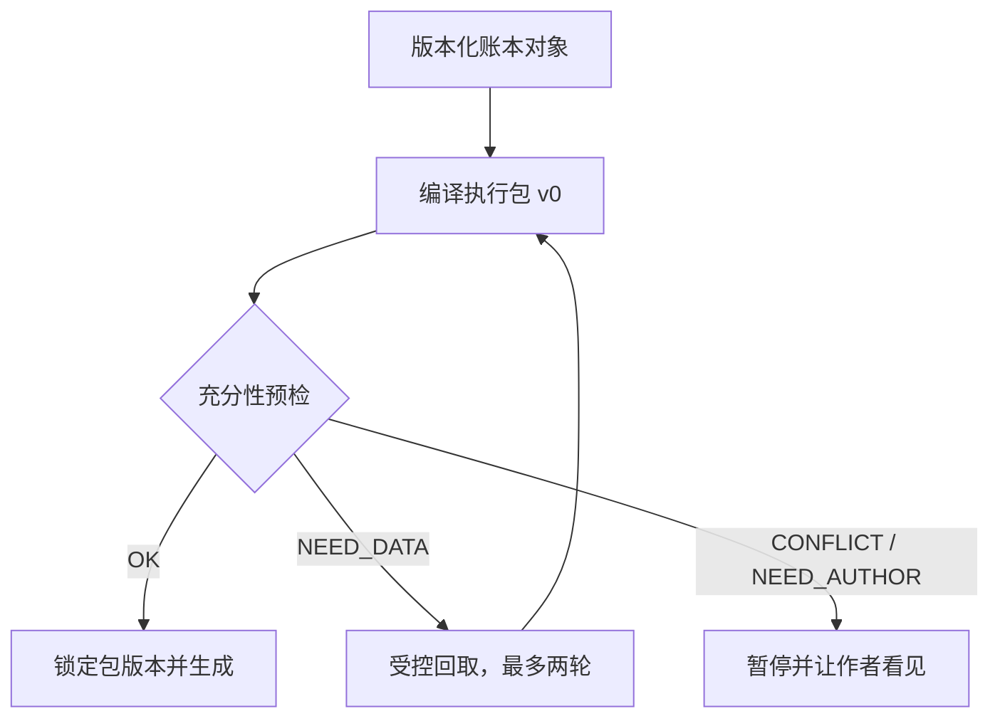

✅ 结论：推荐默认采用「任务编译器 + 充分性闸门 + 受控回取」，不是在编译、RAG、Agent 里三选一。

- 固定铁律、不可逆变化、当前状态：由程序按规则编进执行包。
- 模糊相关内容：RAG 只负责找候选账本对象。
- 真正多跳的缺口：才让检索 Agent 工作，最多两轮。
- 主模型生成阶段只看锁定后的瘦包。
- 没拿到 `OK` 回执，不生成章纲或选项。
- 向量库返回的是“可能相关”，绝不是故事真值。

以下只使用公开资料和题面里的既定约束，没有把附件当论据。



## 1. 编译、RAG、Agent 各管什么

这里说的“编译器式”是产品架构说法，不是某篇论文统一命名的算法。你可以直接理解成：输入任务和账本版本，程序按固定规则算出一份可复现的执行包。

| 方法                | 最适合                                                       | 不该承担                               | 典型失败                                       |
| ------------------- | ------------------------------------------------------------ | -------------------------------------- | ---------------------------------------------- |
| 按任务编译          | 任务类型稳定、必备槽位明确；章纲、续写、换线都有固定输入契约 | 临时发现模糊联系、跨多条线探索未知依赖 | 编译规则漏了一类对象，导致不可逆事实没有进入包 |
| 单轮 RAG            | 找语义相关的事实、计划、线索；定位久未出现的人物或证据锚     | 保证铁律齐全；判断什么是真值           | 相似但无用、过期或互相矛盾的对象被召回         |
| 多轮 retrieve Agent | 后一轮查询依赖前一轮结果的多跳问题；例如“谁知道秘密 X，依据哪几次传递” | 每章都无边界地自行逛全库               | 查询漂移、成本失控、重复材料和摘要误差越滚越大 |

RAG 原始工作解决的是“让生成模型访问外部非参数记忆”，方便更新知识和提供出处；它没有证明检索结果就是真值。[RAG 原论文](https://arxiv.org/abs/2005.11401)

多轮检索只有在“下一步查什么取决于刚刚查到什么”时才明显占优。IRCoT 在多跳问答里交替推理与检索；FLARE 在长文本生成中按低置信位置触发检索；Adaptive-RAG 则在不检索、单轮和多轮之间按问题复杂度路由。[IRCoT](https://arxiv.org/abs/2212.10509)、[FLARE](https://arxiv.org/abs/2305.06983)、[Adaptive-RAG](https://aclanthology.org/2024.naacl-long.389/)

⚠️ 关于“哪种失败最多”，目前没有公开研究在长篇小说章纲场景里，把“丢不可逆、召回噪音、重复摘要”放在同一套数据上给出统一频率排名。因此不能假装有一个科学百分比。

更可靠的工程判断是：

- **日常最频繁：召回噪音。** Top-k 检索几乎总会返回东西，即使库里没有充分答案；无关上下文已经被实验证明会显著降低模型表现。[ICML 2023 干扰实验](https://arxiv.org/abs/2302.00093)
- **后果最严重：丢不可逆事实。** 噪音可能让一章变钝，漏掉死亡、身份揭露、能力损失、关系决裂，往往直接改写故事世界。
- **最容易长期暗中恶化：重复摘要。** 摘要再摘要会累计误差；长文摘要研究也明确指出，多次递归摘要容易积累错误。[EACL 2023](https://aclanthology.org/2023.findings-eacl.94/)
- **编译系统的最大风险不是“压得不够好”，而是规则漏项。** 所以不可逆项不能靠语义相关度决定，应走强制依赖闭包：只要本章涉及某人物、地点、能力或伏笔，就把与之关联的有效不可逆变化强制带入。

长上下文也不能兜底。模型即便支持很大的窗口，也可能忽视输入中部的信息；增加长度并不等于稳定使用全部信息。[Lost in the Middle](https://arxiv.org/abs/2307.03172)

## 2. 把“及时去读”做成生成前的硬步骤

生成前单独跑一次“充分性预检”，这一步禁止写章纲，只能检查材料。

预检至少检查这些槽位：

1. 章号、分支、时间点、视角和当前故事线是否明确。
2. 上一章交接现场是否存在；换线时，该线最后一次现场是否存在。
3. 本章登场人物的当前身体、情绪、目标、关系、位置是否齐。
4. 谁知道什么、谁误以为什么、哪些信息尚未公开是否齐。
5. 活跃欠账、承诺、计时器、因果前置条件是否齐。
6. 铁律、不可逆变化、本章禁做是否齐。
7. 同一时间范围内是否有两个仍然有效、却互相冲突的对象。
8. 需要原文证据的条目是否带冻结书稿锚点。

回取分两档：

- **第 1 轮：精确回取。** 按对象 ID、人物、故事线、有效时间、依赖关系查账本；不碰向量搜索。
- **第 2 轮：模糊回取。** 在账本对象上做关键词或向量召回，再按状态、时效、故事线、来源和冲突情况重排。只有还无法判断时，才按证据锚读少量冻结原文。

每次回取后都应**重新编译整个包**，不能把新结果继续堆在旧包末尾。否则上下文只会越补越胖，过期内容也可能继续残留。

如果模型在生成途中发现某个选项依赖包里不存在的设定，它应丢弃未完成选项，返回 `NEED_DATA`。不能一边补设定，一边把补出来的东西写成方案。

### 建议的硬预算

“token”是模型计算输入长度和费用的单位，不完全等于汉字数。下面是适合拿去做首版实验的工程起始值，不是学术定律：

| 项目                   | 建议起始值                         |
| ---------------------- | ---------------------------------- |
| 初始执行包             | 8,000～12,000 tokens               |
| 执行包绝对硬顶         | 16,000 tokens                      |
| 检索轮次               | 最多 2 轮                          |
| 一次允许处理的缺料槽位 | 最多 4 个                          |
| 每轮实际展开的账本对象 | 最多 6 个、合计不超 2,500 tokens   |
| 原文证据回取           | 最多 2 个锚点，每个不超 600 tokens |
| 每个查询的候选元数据   | 最多 12 条；候选列表不进入主模型包 |

小窗口模型可用这个上限：

```text
包硬顶 = min(
  16,000,
  模型总窗口 - 固定指令 - 预留输出 - 10%安全余量
)
```

出现以下任一情况就停止，不再偷偷扩张：

- 两轮后仍缺料；
- 缺料槽位超过 4 个；
- 两个有效账本对象冲突且无法按版本、时效或优先级裁决；
- 必须读的原文范围已经不再是“少量锚点”；
- 编译器对同一任务连续漏掉多个必备区。

这时应返回作者，或路由到“大书重建／全书体检”。宽窗口是异常路线，不是普通章节的第三轮检索。

## 3. 主模型该看到什么，回执怎么做

✅ **生成阶段，主模型只应看到编译后的包。**

但“整个系统只能有一次模型调用”没必要。合理分工是：

- 普通程序：精确过滤、版本判断、有效期判断、依赖展开、去重和预算控制。
- 检索器：提供候选对象，不决定正史。
- 小模型或检索 Agent：只处理模糊查询和多跳查询。
- 主模型：在收到锁定包和 `OK` 后写章纲或选项。
- 作者：处理真正缺失的创作决定，以及无法自动裁决的冲突。

检索子程序最好返回对象 ID、有效期、状态和证据锚，不要只交一段漂亮摘要。Agent 的摘要是派生物，不是证据，也不能覆盖账本对象。

公开协议里没有统一的 `OK / 缺料 / 冲突` 三态标准，但有几套可借鉴的做法：

- A2A Agent 协议有 `COMPLETED`、`INPUT_REQUIRED`、`FAILED`、`REJECTED` 等任务状态，明确允许 Agent 暂停等待输入。[A2A 规范](https://a2a-protocol.org/latest/specification/)
- MCP 工具结果支持经输出 Schema 校验的 `structuredContent`，并用 `isError` 表示工具执行错误。[MCP Tools 规范](https://modelcontextprotocol.io/specification/2026-07-28/server/tools)
- CRAG 的检索评估器使用 `Correct / Ambiguous / Incorrect` 三档，说明“先判断检索是否可靠，再决定后续动作”已经是成熟研究路线。[CRAG](https://arxiv.org/abs/2401.15884)
- RFC 9457 给 HTTP API 定义了机器可读的问题详情格式，适合承载冲突和失败细节。[RFC 9457](https://www.rfc-editor.org/info/rfc9457/)

建议产品自己定义以下回执：

```json
{
  "status": "OK | NEED_DATA | CONFLICT | NEED_AUTHOR | ERROR",
  "task_id": "outline-N042",
  "pack_version": "N042-v3",
  "pack_hash": "sha256:...",
  "missing": [
    {
      "slot": "same_line_last_scene",
      "why": "本章切回 L3，但包内没有该线上次现场",
      "query_hint": {"line_id": "L3"}
    }
  ],
  "conflicts": [
    {
      "object_ids": ["FACT-082", "FACT-091"],
      "field": "character.location",
      "as_of": "chapter-41"
    }
  ],
  "fetched_ids": ["STATE-211", "FACT-082"],
  "evidence_anchors": ["manuscript:chapter-37#scene-2"],
  "budget": {"round": 1, "used_tokens": 2210, "remaining_rounds": 1},
  "next": "GENERATE | RETRIEVE | ASK_AUTHOR | STOP"
}
```

几个关键语义：

- `NEED_DATA` 是正常控制流，不应标成工具错误。
- `CONFLICT` 只表示“两个对象都仍有效，而且规则无法判胜”。已过期或已被覆盖的旧对象不算冲突。
- `PARTIAL_OK` 不建议直接放行生成；它容易变成静默缺料。内部可以有 partial，生成闸门必须把它映射成 `NEED_DATA`。
- 主模型通常只需看到最终包和简短 `OK`；作者界面应能展开完整回执。

Agent 官方工程经验也建议：路径明确的任务优先用可预测工作流，开放且无法预先确定步骤的任务再用 Agent，并给循环设置最大次数。[Anthropic：Building Effective Agents](https://www.anthropic.com/engineering/building-effective-agents)

## 4. 「编本章大纲」的分区

下面的比例是首版预算分配，不是每章必须精确照抄。

| 分区       | 包占比 | 放什么、为什么                                               | 超预算怎么处理                                               |
| ---------- | ------ | ------------------------------------------------------------ | ------------------------------------------------------------ |
| 任务       | 5%     | 章号、分支、视角、目标、要产出章纲还是选项、选项数量与差异要求。防止模型把“查资料”误当“写正文” | 不踢。把说明改成字段，不留长篇解释                           |
| 铁律       | 12%    | 有效的世界规则、作者硬指令、不可逆事实、正史优先级。它们决定什么绝对不能被后文改写 | 不降语义、不踢；只按 ID 去重、改成原子条目                   |
| 本章禁做   | 8%     | 本章不能揭露、不能让谁登场、不能解决哪笔欠账，以及禁令有效期 | 活跃项不踢；过期项移入望远索引                               |
| 近章       | 30%    | 紧邻前章的完整事件／状态交接；再往前 2～4 章展开关键变化。换线时强制接回该线上次现场 | 先把较早部分降成一行状态变化，再把详细内容移出；交接现场不能踢 |
| 本线状态   | 27%    | 截至 N−1 章的人物位置、身体、情绪、目标、知识、关系、资源、活跃线索和计时器 | 活跃人物和因果前置不踢；休眠人物、旁支关系降成索引           |
| 望远索引   | 8%     | 每条远期线一句话，附覆盖章节／对象 ID、状态、有效期、下次可能施压点 | 先压成更短的一行；再移出正文，但必须留下可查询指针           |
| 可回取目录 | 10%    | 可继续读取的对象类型、ID、覆盖范围、状态、证据锚、预计读取成本 | 压缩字段或分页；不把目录展开成内容，不因分页失去查询入口     |

每个事实或状态条目至少应带：

```text
object_id
type
scope / line_id
valid_from
valid_to 或 expires_at
status
supersedes
source_anchor
content
```

这类“原子事实 + 有效时间 + 冲突检测”在长篇叙事研究里已有直接支持。FactTrack 会把事件拆成原子事实、计算有效区间、检测冲突，再更新世界状态。[FactTrack，NAACL 2025](https://aclanthology.org/2025.naacl-long.144/)

长故事研究也普遍把规划和局部生成分开，并单独维护可查询的故事状态：Re³ 动态重建每一步提示，只选择计划和既有故事里的相关部分；DOME 用动态分层大纲和时间化记忆减少上下文冲突。[Re³](https://arxiv.org/abs/2210.06774)、[DOME](https://aclanthology.org/2025.naacl-long.63/)

为了减轻“中部失焦”，物理排列可以这样放：

- 开头：任务、铁律、本章禁做。
- 中间：望远索引、可回取目录。
- 靠近输出指令的位置：近章交接、本线当前状态。

不要为了首尾都醒目而把同一事实复制两遍。重复条目可能版本不同，反而制造假冲突。

## 5. 最不该丢的 10 类，以及不该默认塞的 10 类

| #    | 最不该从包里丢掉                                  | 最不该默认塞进来                       |
| ---- | ------------------------------------------------- | -------------------------------------- |
| 1    | 当前任务、章号、分支和输出契约                    | 整部冻结书稿                           |
| 2    | 仍有效的世界铁律和作者硬约束                      | 向量检索返回的原始正文 Top-k           |
| 3    | 死亡、暴露、毁损、能力丧失等不可逆变化            | 每一章的历史摘要及摘要的摘要           |
| 4    | 当前时间、地点、视角和故事线                      | 所有人物与世界设定的百科全档           |
| 5    | 紧邻前章交接；换线时该线上次现场                  | 与本章无关的其他故事线完整历史         |
| 6    | 本章活跃人物的身体、情绪、目标、关系、资源状态    | 远期计划的全部细节和所有备选分支       |
| 7    | 人物知识差：谁知道、谁不知道、谁误解              | 已废弃、已覆盖、已过期对象的全文       |
| 8    | 活跃欠账、承诺、计时器和因果前置                  | 尚未升格为计划或约束的灵感             |
| 9    | 本章禁做、揭露边界和仍有效的伏笔限制              | 大量文风样例、同类作品和写作理论材料   |
| 10   | 对象 ID、版本、有效期、覆盖关系、来源锚和未决冲突 | 低分候选、检索轨迹、工具日志和重复改写 |

🔥 压缩顺序应该是：

```text
去重复
→ 清除已失效内容
→ 把自然语言改成结构字段
→ 近期内容降档
→ 远期内容降成索引
→ 把详细内容移出但保留指针
```

不是：

```text
把一切反复总结
→ 把新总结当真值
→ 继续总结旧总结
```

公开的 Agent 上下文工程经验同样强调“高信息密度的小上下文”和按需读取，同时提醒运行时探索会走弯路、浪费上下文；长期任务中的压缩也应优先保召回，再逐步去掉多余内容。[Anthropic：Effective Context Engineering](https://www.anthropic.com/engineering/effective-context-engineering-for-ai-agents)

说白了就是一句话：**用编译器保证“不该忘的绝不忘”，用检索补“眼下才知道要查的”，用闸门保证“没查清就不写”。**

来源：ChatGPT