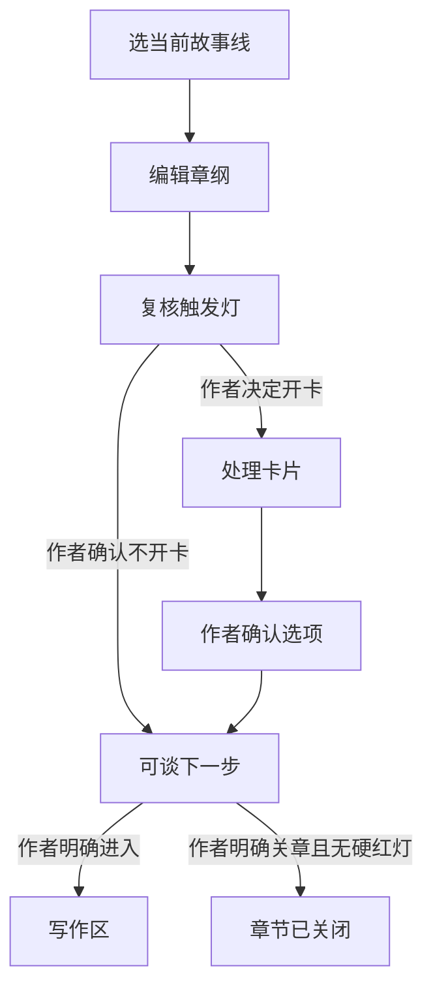

# 调查结论

✅ 最稳的方案是：把“管线游标”放在服务端，作为唯一可信进度；AI 只能读取、讨论、产提案、请求动作，不能直接改步骤、改当前对象、代替作者确认或宣布关章。

聊天、卡片、按钮、未来的管理员命令行，都必须提交同一种“带游标版本的命令”，再由服务端重新检查：

- 现在处在哪一步
- 正在处理哪一章、哪张卡、哪一版
- 谁发起了动作
- 这个角色能不能做
- 停点是否放行
- 是否存在硬冲突红灯
- 游标有没有被别处更新

🔥 还要彻底拆开这几个容易混淆的“完成”：

```text
AI 这轮回答结束
≠ 分析任务完成
≠ 章纲工件完成
≠ 卡片处理完成
≠ 作者已经确认
≠ 章节已经关闭
```

工作流框架里的 `completed`、`END`、`onDone`，只表示那次运行或子任务结束。MCP Tasks 把 `completed` 定义为工具任务终态；XState 的子状态进入 final 后还会自动触发父状态的 `onDone`。如果产品把这些通用状态直接接成“关章”，就会出现你描述的事故。[MCP Tasks](https://modelcontextprotocol.io/extensions/tasks/overview)、[XState 父子状态](https://stately.ai/docs/parent-states)

所以应禁止裸的 `done` 字段，至少分成：

- `agent_run.completed`
- `artifact.ready`
- `work_item.resolved`
- `author_choice.confirmed`
- `chapter.closed`

只有最后一个能让章节真正关闭。

------

## 1. 四种常见机制，各自能管什么

| 机制           | 适合承担的职责                     | 常见翻车方式                                   | 在你们产品里的位置     |
| -------------- | ---------------------------------- | ---------------------------------------------- | ---------------------- |
| 状态机         | 规定哪些步骤之间可以跳转           | 自动跳转、状态过多、把子任务完成误当关章       | 管合法路线             |
| 会话模式       | 告诉 AI 当前是在讨论、规划还是执行 | 只写在提示词里；重启、长对话、多窗口后漂移     | 只做显眼提示和能力预设 |
| 工具按状态门控 | 让 AI 看不到当前不能用的工具       | 只隐藏工具但后端仍可调用；工具太宽；缓存过期   | 降低误调用概率         |
| 显式游标       | 固定当前管线、对象、版本、未完工作 | 缺省取“最新对象”、并发覆盖、只塞进提示词不校验 | 管“现在到底在哪”       |

### 状态机

状态机的优点是确定：当前状态收到某个事件，只有满足守卫条件才允许跳转；还可以直接算出某动作当前是否可用。[XState 的转换和守卫](https://stately.ai/docs/transitions)、[XState Guards](https://stately.ai/docs/guards)

最危险的两个坑：

- `always` 之类的无事件跳转会立即发生，中间状态甚至可能不给订阅者发快照，用户看不到它经过了哪里。[XState Eventless Transitions](https://stately.ai/docs/eventless-transitions)
- 子流程标记完成后，父流程可能自动执行 `onDone`。章纲工件“完成”如果被建模成章节父流程的 final，系统就可能顺手关章。

因此：

- `章纲检查完成 → 关章` 之间不能用自动跳转。
- `卡片全部处理完 → 关章` 之间也不能用自动跳转。
- 必须等一个明确命名的业务事件，例如 `AUTHOR_CLOSE_CHAPTER`。
- 冲突检查、模型判断这些异步结果不要直接写进状态机守卫；先落成有版本、有覆盖范围的检查工件，再让守卫读取确定值。XState 也要求守卫是纯函数和同步判断。

### 会话模式

Claude Code 的 Plan 模式会显示状态指示器，并保证批准前只读取、提计划、不编辑；VS Code 的自定义 Agent 也允许给“规划模式”只装只读工具。[Claude Code Plan 模式](https://code.claude.com/docs/en/common-workflows)、[VS Code Custom Agents](https://code.visualstudio.com/docs/agent-customization/custom-agents)

这类模式很适合告诉作者“现在是编章纲，不是写正文”，但不能当业务真值，因为它通常缺少：

- 当前章节 ID
- 当前章纲版本
- 已打开但未确认的卡片
- 谁通过了哪个停点
- 多窗口并发版本

推荐把模式从游标推导出来，而不是让模式和游标各自保存一份。

### 工具门控

编章纲时，模型只应看到读取、讨论、生成章纲修改提案、查看触发灯等工具；生成正式稿、关章、进入写作区等工具不应出现在模型工具列表里。VS Code 已采用按请求或模式选择工具的做法；OWASP 也建议只给 Agent 最少、最细的工具权限。[VS Code 工具选择](https://code.visualstudio.com/docs/agents/run/tools)、[OWASP Excessive Agency](https://genai.owasp.org/llmrisk/llm062025-excessive-agency/)

⚠️ 工具不可见只是减少犯错，不是最终防线：

- 旧客户端可能缓存了工具。
- 管理员命令行可能直接调用接口。
- 模型可能拿错对象 ID。
- 一个“万能更新工具”仍然可以绕过所有细分限制。

因此后端仍要每次重新检查。OWASP 把这叫“完整中介”：所有下游请求都必须过权限和规则校验，不能让模型自己判断自己能不能做。

### 显式游标

LangGraph 用 `thread_id` 找到该恢复哪份检查点，换一个 ID 就是另一段空状态；A2A 协议也要求继续某项工作时沿用匹配的 `taskId` 和 `contextId`，两者对不上应拒绝。[LangGraph Interrupts](https://docs.langchain.com/oss/python/langgraph/interrupts)、[A2A 多轮任务规范](https://a2a-protocol.org/latest/specification/)

你们还应多带一项递增版本号。每次写入必须说明“我是按游标 v86 发起的”，当前已经是 v87 就拒绝。HTTP 的 `If-Match` 正是用这种方式防止多个客户端互相覆盖；条件不匹配时不执行写入。[RFC 9110 If-Match](https://datatracker.ietf.org/doc/html/rfc9110#section-13.1.1)

------

## 2. 防跳跃要靠可执行护栏，不靠一句提示词

早期的 τ-bench 把业务政策和 API 工具都交给 Agent，强模型在多轮任务中仍表现出明显的不稳定。这项结果不应用来评价今天某个具体模型，但足以说明：自然语言规则不能充当事务边界。[τ-bench 论文](https://arxiv.org/abs/2406.12045)

推荐动作链如下：

1. 服务端给模型一份只读的当前游标快照。
2. 模型输出回答、修改提案或动作请求。
3. 工具层按“当前步骤＋执行者”收窄可调用工具。
4. 任何写工具都在服务端重新校验步骤、对象、版本、角色、停点和冲突。
5. 缺作者确认时，保存待确认动作，状态变成 `input_required`，不产生副作用。
6. 确认通过后，再原子地写工件、推进游标、追加事件记录。
7. 回执明确写出 `state_changed=true/false`，UI 只信回执，不信模型说“已经完成”。

语言模型返回的工具调用原本就只是结构化请求，是否执行由应用决定；不必把“模型调用了工具”理解成“动作已经发生”。[Claude Tool Use](https://platform.claude.com/docs/en/agents-and-tools/tool-use/overview)

### 不同跳跃的具体处理

| 风险               | 可执行护栏                                                   |
| ------------------ | ------------------------------------------------------------ |
| 跳过作者确认       | 合法动作进入 `input_required`；发一次性确认凭证，绑定动作、对象和版本 |
| 提前关章           | 编章纲阶段不向模型提供关章工具；服务端仍拒绝旧工具调用       |
| 把探讨当真改       | 分开“生成提案”和“应用提案”；自由聊天默认只能生成提案         |
| 改错章节或卡片     | 写工具不让模型自由填写目标，目标由服务端从游标注入           |
| 旧回答覆盖新版本   | 所有写入检查 `cursor_version` 和 `object_revision`           |
| 重试造成重复写入   | 每个动作带幂等键，同一个确认只能提交一次                     |
| 确认后内容又被编辑 | 确认绑定动作摘要和工件版本；版本改变，旧确认自动失效         |
| AI 自称“已经关章”  | 没有成功的服务端关章事件，UI 就显示“未关章”                  |

LangGraph 的暂停节点恢复时会从节点开头重跑，暂停前的非幂等副作用可能被重复执行。官方建议把副作用放在批准之后，或者拆到独立节点，并让动作可安全重试。[LangGraph Interrupt 规则](https://docs.langchain.com/oss/python/langgraph/interrupts)

### 非法动作分三类处理

不要一律弹错误，也不要一律偷偷执行：

- `reject`：游标过期、对象不匹配、执行者无权、硬冲突红灯。直接拒绝。
- `proposal_only`：动作现在不能做，但表达了未来意图，例如编章纲时说“后面可以考虑关章”。可记成下一步提案，游标不变。
- `input_required`：动作在当前步骤合法，但缺作者对这一个具体动作的确认。保存现场并等待。

LangChain 的人审中间件也把动作拆成批准、编辑、拒绝、代答，并警告不要把“代答”错当成副作用工具成功。[LangChain Human-in-the-loop](https://docs.langchain.com/oss/python/langchain/human-in-the-loop)

### 关章的独立规则

关章应同时满足两组条件，不能混成一个“通过”：

- 流程条件：已到 `ready_for_next`，必要选择已由作者确认。
- 冲突条件：没有当前版本对应的硬冲突红灯。

在冲突这一维里，只有硬红灯是 blocker。黄色提醒、未运行、覆盖不全、当前未检出都不能伪装成红灯。

同时，关章依然必须由作者明确发起。这是权限条件，不是把黄色提醒升级成 blocker。

没有硬红灯时，只能显示：

> 当前覆盖范围内未检出硬冲突。

不能显示“确定无冲突”。

------

## 3. 作者编章纲时，聊天能做什么

| 行为                             | 处理方式                                           |
| -------------------------------- | -------------------------------------------------- |
| 探讨情节、比较方案、追问原因     | 允许                                               |
| 读取、总结当前章纲               | 允许                                               |
| 生成章纲修改建议                 | 允许，固定落到当前章纲的建议位                     |
| 应用某份章纲修改                 | 只有作者明确点“应用”或在待确认问题里明确回答才执行 |
| 检测触发条件                     | 允许更新亮灯结果                                   |
| 自动打开卡片                     | 禁止                                               |
| 建议作者是否开卡                 | 允许，显示为当前页内建议                           |
| 作者主动开卡                     | 允许，产生明确的 `open_card` 事件                  |
| 生成卡片候选项                   | 允许，只是候选                                     |
| 把候选项写成真值                 | 必须等作者确认                                     |
| 生成正式正文                     | 章纲阶段工具不可见，后端也拒绝                     |
| 关章、切去写作区                 | AI 只能提议；当前步骤不允许时不执行                |
| 关闭章纲编辑器、抢焦点、随机弹窗 | AI 永远没有这项能力                                |

自由聊天和卡片点选要落到同一件工作上。可以这样理解：

- 卡片点选“A”
- 作者在该卡片的待回答聊天里输入“A”

两者都转成同一个 `answer_work_item` 命令，并携带相同的卡片 ID、选项版本和游标版本。

但作者在普通聊天里说“感觉 A 也许不错”，没有待确认问题 ID，就只能算讨论或提案，不能当签字。

异步结果也必须绑定它发起时的对象和版本。作者已经切到别处时：

- 结果仍落回原章纲或原卡片。
- 当前页面只显示“某对象有新结果”。
- 不切页、不关编辑器、不抢焦点。
- 原对象已经换版时，结果标记为“旧版建议”，不能自动应用。

### 作者和模型共用的进度指示器

不建议显示一个笼统的“完成度 80%”，因为开卡是可选分支。更清楚的是同时显示位置、必需项和未完工作：

> **管线：** 2/7 · 编辑章纲
> **当前对象：** 第 37 章章纲 · v12 · 编辑中
> **本阶段必需项：** 3/5
> **未关闭工作：** 2 项
> **触发灯：** 2 个，均未开卡
> **作者确认：** 未请求
> **现在可做：** 继续编辑 / 查看触发灯
> **关章：** 当前不可用，还缺触发灯复核
> **冲突检查：** 当前覆盖范围内未检出硬冲突

模型收到的是同一份服务端投影，只是结构化显示；不能让 UI 自己算一版，提示词再拼一版。

`允许的下一动作` 还要写清执行者，例如：

| 动作         | 作者               | AI       |
| ------------ | ------------------ | -------- |
| 继续讨论     | 可执行             | 可执行   |
| 生成修改提案 | 可执行             | 可执行   |
| 应用提案     | 可确认             | 只能请求 |
| 打开卡片     | 可执行             | 只能建议 |
| 确认选项     | 可执行             | 禁止代签 |
| 关章         | 到正确步骤后可执行 | 只能建议 |

如果管理员命令行在别处推进了管线，网页可以显示“管线已在别处改变”，但仍保留作者的编辑区，由作者决定何时切换。W3C 的界面指导同样主张用不抢焦点的状态消息传达进度，重大上下文变化由用户发起。[W3C 状态消息](https://www.w3.org/WAI/WCAG22/Understanding/status-messages.html)、[W3C Change on Request](https://www.w3.org/WAI/WCAG22/Understanding/change-on-request.html)

------

## 4. 停点三档必须进入工具层

🔥 不要设计一个含糊的 `approved=true`。

至少拆成两个互不替代的权限：

```text
允许管线继续 = 是/否
允许写入作者真值 = 是/否
```

| 档位     | 工具层行为                                | 记录内容                                     | 模型看到的含义                 |
| -------- | ----------------------------------------- | -------------------------------------------- | ------------------------------ |
| 自动放行 | 策略引擎写入放行事件，再推进可逆步骤      | 使用了哪条规则、规则版本、前后游标、撤销动作 | “系统策略放行”，不是作者确认   |
| 提醒不停 | 写提醒事件并继续；提醒固定落在进度区      | 提醒内容、是否展示、推进事件                 | “作者尚未确认”，不能脑补成同意 |
| 必停     | 保存待执行动作，状态进入 `input_required` | 动作摘要、对象版本、请求者、确认范围         | 只能等待作者批准、编辑或拒绝   |

AWS Step Functions 使用任务凭证把工作流暂停到外部确认返回；MCP Tasks 和 A2A 也都使用 `input_required` 表示尚需人的输入，而不是假装任务成功。[AWS Callback Task Token](https://docs.aws.amazon.com/step-functions/latest/dg/connect-to-resource.html)、[MCP Tasks](https://modelcontextprotocol.io/extensions/tasks/overview)

### 小白自动走推荐时怎样留痕

自动放行事件至少记录：

- 谁放行：`system_policy`
- 采用的用户档位：新手推荐
- 使用的规则及版本
- 放行的是哪个停点
- 放行前、放行后的游标版本
- 是否产生了业务写入
- 撤销入口
- 后面有哪些动作依赖它

界面文字应是：

> 系统按“新手推荐”自动放行了此停点，作者尚未签字。可撤回。

而不是：

> 作者已确认。

自动放行只适合低风险、可撤销的管线推进。它不能产生 `author_choice.confirmed`，也不能给 AI 发写真值、关章的权力。

撤销不要删除原记录，而是追加一条补偿事件，例如“撤回系统放行”。事件溯源的常见做法也是保留原事件，再追加纠正事件，从而保住审计历史。[Azure Event Sourcing](https://learn.microsoft.com/en-us/azure/architecture/patterns/event-sourcing)

管理员命令行也走相同入口：

- 必停仍返回 `input_required`。
- 不能直接 `set_phase`。
- 不能把管理员身份伪装成作者确认。
- 如果未来确有维护越权操作，记录成 `admin_override`，不能写成 `author_confirmed`。

------

## 5. “管线游标”最小设计

推荐的主流程：



作者只想编章纲时，完全可以停留在“编辑章纲”，工件正常保存，不产正式稿，也不自动关章。

### 游标至少包含什么

| 信息             | 建议字段             | 用处                                          |
| ---------------- | -------------------- | --------------------------------------------- |
| 这是哪次章节管线 | `pipeline_run_id`    | 防止混到其他章节                              |
| 当前是第几版位置 | `cursor_version`     | 防并发覆盖                                    |
| 当前步骤         | `phase`              | 决定合法跳转                                  |
| 工作状态         | `work_status`        | `working / input_required / ready / terminal` |
| 当前工作对象     | `work_object`        | 类型、ID、工件版本                            |
| 尚未关闭的工作   | `open_work`          | 卡片、提案、待确认动作                        |
| 停点状态         | `gate`               | 档位、是否放行、决定来源                      |
| 正等作者确认什么 | `pending_action`     | 动作摘要和动作指纹                            |
| 已有作者授权     | `authorizations`     | 绑定具体动作和对象版本                        |
| 冲突检查工件     | `conflict_check_ref` | 结果、覆盖范围、所检查版本                    |
| 最近一次事件     | `last_event_id`      | 审计、恢复、撤销                              |

`allowed_actions`、阶段完成度和模型可见工具应从这些数据实时算出，不能让模型写，也不应保存成另一份容易过期的真值。

### 谁能改

| 参与者       | 权限                                           |
| ------------ | ---------------------------------------------- |
| AI 模型      | 不能改游标；只能产生回答、提案和动作请求       |
| 作者         | 通过按钮、卡片或处于明确待回答状态的聊天发命令 |
| 分析任务     | 写分析工件、亮灯和冲突结果；不能推进章节       |
| 停点策略引擎 | 只能按已配置档位放行或提醒                     |
| 管线服务     | 唯一实际写游标的组件                           |
| 管理员命令行 | 作为一个受权限约束的客户端调用管线服务         |

### 非法动作回执应该长这样

作者可见版本：

> ❌ 动作未执行，章纲编辑器没有关闭。
> 当前步骤：编辑章纲
> 当前对象：第 37 章章纲 v12
> 请求动作：关章
> 拒绝原因：当前步骤不允许关章
> 尚缺：复核触发灯；2 项已打开工作尚未确认
> 现在可做：继续编辑 / 查看触发灯
> 管线游标：v86，未发生变化

如果适合变成提案，再补一句：

> 已把“稍后关章”记为下一步提案 P-104；没有执行关章。

给程序的同一回执至少包含：

| 字段               | 示例                                      |
| ------------------ | ----------------------------------------- |
| `code`             | `PIPELINE_STEP_NOT_ALLOWED`               |
| `state_changed`    | `false`                                   |
| `disposition`      | `reject / proposal_only / input_required` |
| `requested_action` | `close_chapter`                           |
| `current_phase`    | `outline_editing`                         |
| `current_object`   | 第 37 章章纲 v12                          |
| `cursor_version`   | 86                                        |
| `allowed_actions`  | 当前合法动作及执行者                      |
| `required_before`  | 还缺哪些条件                              |
| `proposal_id`      | 只有转成提案时才有                        |

⚠️ 失败回执里一定要有 `state_changed=false`。否则模型很容易收到错误后继续用自然语言说“已经处理好了”。

------

## 上线前建议锁死的验收用例

- AI 在编章纲时说“这章可以结束了”——游标不变，编辑器不关。
- AI 即使构造出旧的关章工具调用——服务端仍拒绝。
- 作者说“也许用方案 A”——只产生讨论或提案。
- 作者在待确认卡片中回答“A”——与点击卡片 A 产生同一命令。
- 系统自动放行——显示“系统策略”，作者确认仍为否。
- 作者确认 v12 后，章纲变成 v13——旧确认失效。
- 异步结果返回时作者正在编辑别处——结果固定落回原对象，不抢焦点。
- 管理员命令行遇到必停——同样进入 `input_required`。
- 检查没发现冲突——只说“当前覆盖范围内未检出”。
- 模型调用重试两次——只产生一次业务事件。

这些用例全部通过，才能说明“管线游标”真的在控制系统，而不是只显示在界面上。

### 主要来源

- [XState：状态转换、守卫与自动跳转](https://stately.ai/docs/transitions)
- [LangGraph：检查点、游标和人审暂停](https://docs.langchain.com/oss/python/langgraph/interrupts)
- [Temporal：写入前验证与结构化失败](https://docs.temporal.io/design-patterns/request-response-via-updates)
- [MCP：工具调用的人审与可见性要求](https://modelcontextprotocol.io/specification/2026-07-28/server/tools)
- [MCP Tasks：进度状态与 input_required](https://modelcontextprotocol.io/extensions/tasks/overview)
- [A2A：taskId、contextId 与多轮连续性](https://a2a-protocol.org/latest/specification/)
- [OWASP：最小工具权限、服务端完整校验](https://genai.owasp.org/llmrisk/llm062025-excessive-agency/)
- [RFC 9110：版本条件与防止丢失更新](https://datatracker.ietf.org/doc/html/rfc9110#section-13.1.1)
- [W3C：不抢焦点的状态提示](https://www.w3.org/WAI/WCAG22/Understanding/status-messages.html)
- [τ-bench：多轮工具 Agent 的规则遵循不稳定性](https://arxiv.org/abs/2406.12045)
- [Anthropic：实际使用中的分级监督与可介入性](https://www.anthropic.com/research/measuring-agent-autonomy)

来源：ChatGPT