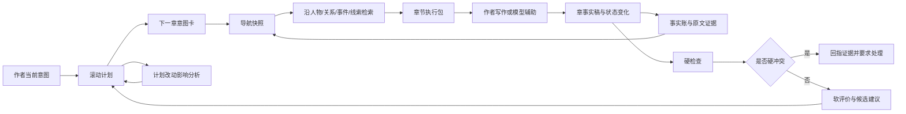

# 研究总览与阅读路线

## 结论先说

这轮研究支持的方向，不是把中文网文压成一棵 `Story → Scene → Beat → Event` 树，也不是让一个超长 Prompt 吃下整本书。更稳的方向是：

> **用多条可交叉的“故事索引”管理同一部小说；用滚动计划承认作者会改主意；用快照帮助快速回忆；用图和证据链继续深挖；下一章只组装当前任务需要的材料；硬冲突负责守底线，软评价只给有证据的建议。**

这套系统更像“小说 IDE + 版本控制 + 故事数据库 + 检查器”，而不是一个只会聊天的代笔机器人。

## 九条核心判断

### 1. 中文网文的第一约束是持续生产，不是一次性完成

**证据结论。** 中文网文平台公开规则把连续更新、日更字数、月更字数和收入激励直接连在一起。纵横 2026 版福利仍按日更 4,000/6,000 字和月更 12/18 万字设全勤；晋江公开信息显示平台日均更新量巨大；起点、番茄、七猫等都把作者后台、数据反馈、评论互动和持续更新放在产品核心位置。网络作家访谈也反复提到：当天写、当天发、当天读评论，是现实工作节奏。

产品不能假设作者会先把全书规划到足够细，再按计划执行。它要帮作者在“今天必须交一章”的压力下，仍然保住长期方向和已发生事实。

### 2. 读者反馈是传感器，不是远程方向盘

**证据结论。** 爱潜水的乌贼明确说，他会看章评，借此发现遗漏和调整细节、节奏，但已经确定的核心事件不会因反馈随意改变。狐尾的笔也描述了用小规模铺垫测试争议点、根据反馈判断爽点或泪点，同时保留作品内核。

**产品假设（待验证）。** 产品应该把读者反馈分成：

- 读者没看懂什么；
- 读者期待什么；
- 读者误判了什么；
- 哪个角色或线索被忽略；
- 哪个节点出现异常流失；
- 作者是否愿意让这些反馈改变计划。

不能把“评论多”直接翻译成“必须改剧情”。

### 3. 作者希望保留关键决定权，而不是拒绝一切 AI

**证据结论。** 多项人机协作研究发现，作者对 AI 的接受度随阶段和任务变化。资料整理、脑暴、故事管理、查错、替代方案通常更容易被接受；核心声音、关键场景、重要人物决定和最终表达更谨慎。作品归属感主要来自“谁做了关键创作决定”，不只来自“谁敲了字”。

因此，产品授权单位不该只有“允许 AI / 禁止 AI”。更细的做法是：

- 哪一类对象可读；
- 哪一类对象可提议；
- 哪一类对象可局部修改；
- 哪一类对象必须作者确认；
- 哪一类对象永远不可自动覆盖。

### 4. Story/Scene/Beat 只能是一种视图，不能成为唯一真源

**证据结论。** Fabula、TombWriter、Dramatron、DOC 等研究证明，分层结构能帮助规划和局部控制；SARD、StoryNode 等研究也显示，结构一复杂，节点图会产生认知负担。Fabula 还遇到文化偏置问题：西方戏剧结构不一定适合所有文化、题材与媒介。

**产品假设（待验证）。** 中文网文更适合多轴结构：

- 作品承诺；
- 卷或阶段；
- 故事线；
- 人物与关系；
- 地图、任务、案件、秘境等题材单元；
- 章槽；
- 场景或片段；
- 已发生事实与状态变化；
- 伏笔、承诺、期待债与回收。

同一个事件可以同时挂在“第三卷、复仇线、师徒关系、北境地图、第 87 章”上，而不是被迫只属于某个 Scene。

### 5. 长篇计划应该是滚动预算，不是精密施工图

**证据结论。** DOME 用粗略长期大纲配合动态生成的局部详细大纲；PlotMachines 跟踪剧情状态；Re³ 和 DOC 用计划、当前状态、最近文本和局部大纲逐段推进。这些工作共同说明：固定大纲不够，纯临场续写也不够。

**产品假设（待验证）。** 规划粒度应随距离变化：

- 已发布部分：事实锁定；
- 未来 3—10 章：较细，可直接执行；
- 本阶段或本卷：目标、关键转折和约束明确；
- 更远部分：保留方向、候选和不可违背的锚点；
- 大结局：可有终点意向，但不要求每一步预先确定。

作者改计划时，系统不直接重排，而是提出影响范围：哪些伏笔会失效、哪些人物动机会断、哪些已公开承诺要重新处理、哪些时间安排会冲突。

### 6. 快照只是地图，不是真相仓库

**证据结论。** RAPTOR 说明多层摘要有助于从全局到局部检索，但摘要会压缩；HippoRAG、Zep/Graphiti 等图记忆工作说明，实体和关系链能帮助跨文档、多跳找资料；Zep 还保留原始 episode 和事实来源，并为动态事实保存有效时间。

所以“当前快照”应该让作者或模型一眼知道：

- 现在写到哪里；
- 哪些人物活跃；
- 哪些线正在推进；
- 最近发生了什么；
- 哪些债没还；
- 哪些地方有风险；
- 继续查资料应该点谁、点哪条线、点哪个事件。

它不能替代原文、证据段、历史状态和版本记录。

### 7. 下一章供料的目标不是绝对最小，而是有边界的高覆盖

**证据结论。** 代码仓库检索研究发现，推理可以提高检索精度，却不擅长判断“材料是否已经够了”；召回往往随上下文增长。结构化工具和依赖图能明显提升检索。MutaGReP 还显示：用不到 5% 的上下文形成“任务意图 + 相关符号”的计划，可以接近全仓库上下文效果。

迁移到小说后，下一章执行包不应追求神奇的“只取唯一必要事实”。更合理的是四层：

1. 必带：当前意图、最近正文、当前状态、硬约束；
2. 关联：人物关系、前因、伏笔、相关旧事件；
3. 背景：本卷、本线、世界规则的必要摘要；
4. 可选：灵感、替代路线、低置信线索。

系统要说明“为什么带这条”，还要允许沿链接继续查。

### 8. 吃书检查必须区分“变化”与“矛盾”

**证据结论。** FactTrack 把事件拆成前置事实与后置事实，并给事实有效区间；Zep/Graphiti 用双时间模型保存“世界何时成立”和“系统何时得知”；ConStory-Bench 把长故事一致性错误拆成多类，并要求检查结果回指证据。

“甲在北京”与“甲后来到上海”不是冲突；“甲在同一时间同时被明确写在北京和上海”才可能是冲突。关系、伤势、所有权、身份、认知、公开秘密都要用相同逻辑处理。

### 9. 故事好不好不能压成一个真值分数

**证据结论。** Art or Artifice 发现 LLM 作为创意评委与专业创作者判断并不可靠；LitBench 即使有数万对人类偏好数据，专门训练后的评委也只是把一致率提高到约 78%。其他研究还表明，一致性提高可能让作品更保守、更公式化。

因此：

- 事实打架、时间不可能、人物不该知道某事，可以做硬检查；
- 人物动机是否充分、伏笔是否太明显，可以做带证据的风险提示；
- 节奏好不好、爽不爽、是否原创、情感是否有效，只能做多视角软评价，不能自动挡关。

## 推荐阅读顺序

### 产品路线

`01 → 02 → 03`

看作者真实工作如何转成前台对象，再看结构和动态规划。

### 技术路线

`04 → 05 → 06`

看记忆如何保存、下一章如何取材、怎样检查硬错误。

### 评价与落地

`07 → 08 → 10`

看软硬边界、代码工程类比、原型和评测设计。

### 继续调查

`09 → 12`

用资料总表和缺口清单继续做专项研究。

## 一张总图

## 本轮最重要的研究缺口

- 缺少对起点、番茄、七猫、纵横、飞卢、晋江作者的同一套结构化访谈。
- 缺少真实“日更 30—100 章”过程数据，现有论文多看最终文本或短期实验。
- 缺少中文网文专用的事实、时间、关系和知识边界错误集。
- 缺少“下一章应该带哪些旧信息”的人工金标数据。
- 缺少作者在改纲时真实的影响传播记录。
- 缺少把读者反馈与作者决定分开的长期产品实验。

这些缺口决定了：本资料包适合作为产品研究和原型设计底稿，不适合直接当最终合同。
