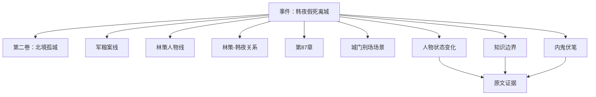

# 中文网文叙事结构：超越 Story / Scene / Beat / Event

## 结论先说

你对 `Story → Scene → Beat → Event` 的怀疑是合理的。它能描述“正文怎样被拆小”，却不够描述中文长篇网文怎样长期运行。

中文网文往往同时按多种方式组织：

- 按卷、地图、境界、案件、任务或关系阶段推进；
- 多条故事线交替出现，可能几十章暂停后再回来；
- 一章可以跨多个场景，一个场景也可能跨章；
- 伏笔、承诺、人物关系和世界规则会横跨所有层级；
- 作者最常操作的未必是 Scene，而可能是“这一卷要解决什么”“这条线什么时候回来”“这个人现在站哪边”“下一章给读者什么”。

所以更合适的不是换一套单一层级，而是：

> **一份已发生事实真源 + 多条可交叉的组织轴 + 面向不同创作任务的视图。**

## 1. Story / Scene / Beat / Event 有什么用

这套结构并非无用。Fabula、TombWriter、Dramatron 等系统证明，它有三个明显优点：

- 把大故事拆成可局部操作的单位；
- 让作者只修改一小块，减少整篇重写；
- 方便模型在局部生成时看到清楚的目标和上下文。

其中：

- `Story` 可以理解为整体作品或一个完整故事；
- `Scene` 是在较连续的时间、地点和人物组合中发生的一段戏；
- `Beat` 是场景内部一次小变化，如一次决定、发现、反击或情绪转折；
- `Event` 是发生了某件可描述、可影响后续的事。

它最适合剧本、影视分场、短篇故事和局部改写。

## 2. 为什么它不足以成为中文网文唯一骨架

### 2.1 它把“正文切分”误当成“故事管理”

作者写第 300 章时，更关心的可能是：

- 当前卷目标是不是快偏了；
- 升级线是否太久没兑现；
- 反派线已经停了多少章；
- 某件法宝的限制是否忘了；
- 女主角对主角的误解是否已经解除；
- 读者等了 50 章的承诺还要多久回收。

这些都不能自然地放进 Scene/Beat 层级。

### 2.2 场景边界不稳定

中文网文章节常见情况：

- 一章先在客栈对话，再切战场，再以远方反派收尾；
- 同一场大战跨五章；
- 一段回忆嵌在当前场景；
- 同一事件被不同视角分几章讲；
- 一章主要是过渡和信息交换，没有明显完整场景。

强迫每章等于一个 Scene、每个 Scene 等于若干 Beat，会产生大量人为边界争议。

### 2.3 “Event”容易变成万能桶

如果人物受伤、关系恶化、知道秘密、获得物品、立下誓言、世界规则被打破，全都叫 Event，后台仍然不知道这些对象应该怎样被查找、更新和检查。

事件需要连接到不同类型的状态和关系，而不能替代它们。

### 2.4 它容易携带单一叙事文化假设

Fabula 的研究者和参与者已经指出，角色弧、冲突和场景推进等结构常带有西方戏剧理论偏好。中文网文当然也有冲突和场景，但还常按修炼阶段、地图、身份升级、案件、任务、势力经营、关系阶段和读者期待来组织。

不能把“西方结构不适合”简单换成“中文网文固定三段式”。更稳的做法是允许多种结构并存。

## 3. 候选结构：一份真源，八条组织轴

### 3.1 作品承诺轴

它回答“这本书为什么值得继续追”。

可以包括：

- 题材和核心幻想；
- 主角的核心处境；
- 长期读者承诺；
- 作品调性；
- 叙事边界；
- 核心谜团；
- 禁止背离的方向。

例子：

> 一个被逐出宗门的阵法师，要用只能修补、不能创造的古阵盘，在乱世中重建一座庇护凡人的城。

这里已经包含能力边界、事业线、长期目标和道德底色。它比“Story”更能约束长篇。

### 3.2 卷 / 阶段轴

卷不是简单目录分组，而是一个中期运行单元。

每一卷可记录：

- 进入状态；
- 阶段任务；
- 主要敌对力量；
- 主要地图；
- 关键人物变化；
- 计划回收；
- 阶段高潮；
- 离开时世界状态；
- 与下一卷的交接。

不同题材可以把它命名为：卷、赛季、案件、地图、任务、秘境、学期、朝局阶段、关系阶段。

### 3.3 故事线轴

故事线允许跨卷、跨场景、跨人物持续。

候选类型：

- 主线；
- 成长或升级线；
- 人物个人线；
- 关系线；
- 悬疑或真相线；
- 阵营线；
- 事业线；
- 伏笔与承诺线。

每条线至少有：

`当前状态 → 最近推进 → 当前阻力 → 下一可能推进 → 关联人物 → 关联事件 → 是否暂停 → 预计回收`。

### 3.4 人物与关系轴

人物不是只挂在场景里的演员。人物要有跨场景的稳定身份和动态状态。

关系也不能只挂在两个角色之间的一条静态边。它需要保存：

- 双方真实立场；
- 公开关系；
- 各自认知；
- 信任、债务、利益和情感；
- 最近变化事件；
- 当前未解决的紧张点。

### 3.5 题材单元轴

中文网文常用的组织单位与题材强相关：

| 题材 | 常见单元候选 |
|---|---|
| 玄幻/仙侠 | 境界、地图、宗门任务、秘境、传承、势力阶段 |
| 都市/商战 | 项目、公司阶段、竞标、案件、事业目标 |
| 悬疑 | 案件、线索链、嫌疑人、证词、时间段 |
| 历史/权谋 | 朝局阶段、阵营、战役、政策、官职变化 |
| 无限流 | 副本、规则、任务、通关条件、队伍变化 |
| 种田/经营 | 资源周期、建设项目、人口、产能、危机 |
| 言情 | 关系阶段、误解、边界、共同事件、承诺 |
| 群像 | 角色小队、阵营、交汇点、共同危机 |

这些单元不是互斥的。一本玄幻也可以同时有感情线和案件线。

### 3.6 章节轴

章节是中文网文真正的发布单位，必须成为一级对象。

每章可以挂：

- 主要故事线；
- 当前阶段；
- 视角；
- 地点；
- 故事时间；
- 本章目标；
- 关键变化；
- 信息披露；
- 回收和新承诺；
- 章末状态；
- 发布状态；
- 原文证据。

章节不必等于场景，也不必被强迫只有一个事件。

### 3.7 场景 / 片段轴

场景保留，但降级为一种可选的正文组织视图。

它适合：

- 影视化分场；
- 分析人物在场和地点连续性；
- 局部改写；
- 对话、动作和情绪节奏检查；
- 生成局部执行包。

对不习惯分场的作者，系统可以后台自动推测场景边界，前台不强制维护。

### 3.8 事实、状态与未结事项轴

这是所有视图共同依赖的真源层。

它记录：

- 发生过的事件；
- 人物和物品状态变化；
- 地点与时间；
- 关系变化；
- 人物知道、相信、误信、隐瞒的内容；
- 公开与未公开信息；
- 伏笔、承诺、义务、倒计时；
- 每条信息的原文证据和有效区间。

Scene/Beat 结构可以重算或重画，但已发生事实不能因为视图变化被改写。

## 4. 结构之间怎样连接

一个事件可以有多个坐标。

例子：

> 第 87 章，北境守将林策公开处决副将韩夜，实际用假死把他送出城调查军粮案。

它可以同时连接：

- 第二卷“北境孤城”；
- 军粮案故事线；
- 林策人物线；
- 林策—韩夜关系线；
- “城内有内鬼”的伏笔；
- 第 87 章；
- 城门刑场场景；
- 韩夜状态从“公开在城”变成“公开死亡、实际潜逃”；
- 林策知道真相，普通士兵不知道；
- 读者是否知道，取决于叙事视角。

这比把它只放成一个 Event 节点更有用。



## 5. 前台视图，不等于底层结构

同一份底层数据可以有不同视图。

### 今日写作视图

只显示：上一章、当前章槽、最近变化、必查约束、相关人物和未结事项。

### 卷规划视图

显示：阶段目标、故事线进度、关键事件、候选章槽、偏移与风险。

### 人物视图

显示：人物当前状态、关系、知识、最近事件、未来计划。

### 时间线视图

显示：故事内时间、事件区间、旅行、倒计时和并行线同步点。

### 读者承诺视图

显示：什么时候提出、读者知道什么、已经等待多久、候选回收点。

### 版本与改纲视图

显示：当前计划、旧版本、分支、影响范围和作者确认。

作者不需要理解所有底层表，正如程序员不需要每天直接改数据库索引。

## 6. 数据对象候选

下面是为了帮助理解的简化模型，不是现行合同。

```yaml
work_core:
  promise: "作品给读者的核心体验"
  hard_boundaries: []
  locked_destinations: []

stage:
  id: VOL-02
  goal: "守住北境并找出军粮内鬼"
  entry_state: []
  exit_targets: []
  status: active

storyline:
  id: LINE-GRAIN
  type: mystery
  status: active
  recent_progress: EVENT-087
  next_pressure: "韩夜在三日内找到假账源头"

chapter_slot:
  id: CH-088
  pov: "韩夜"
  story_time: "冬月十三日夜"
  location: "北城粮仓"
  intents: []
  required_context: []
  unresolved_questions: []

fact:
  id: FACT-2041
  subject: "韩夜"
  predicate: "公开状态"
  object: "已被处决"
  valid_from: EVENT-087
  valid_to: null
  perspective: "城中公众"
  source_anchor: "CH-087:P18-P22"
```

🔥 关键不是字段叫法，而是四个原则：

- 计划与已发生事实分开；
- 当前状态与历史状态分开；
- 摘要与原文证据分开；
- 作者视图与模型执行包分开。

## 7. 怎样避免结构越来越重

SARD 等研究已经提醒：节点多了以后，结构本身会变成负担。

建议用以下办法控制：

### 自动提取，作者只确认高价值变化

系统可以从每章提取候选事件、状态和关系变化。作者不必手工填所有字段，只处理高风险、低置信和会影响后续的内容。

### 渐进展开

默认只看当前层级。点人物才展开关系，点事件才展开证据，点计划改动才展开影响。

### 允许自然语言入口

作者可以直接问“韩夜现在到底算死了没有”，系统再用结构化数据找答案。结构不是为了迫使作者学数据库。

### 不为短暂动作建永久对象

喝了一口茶、走过走廊、短暂皱眉等一般不该进入长期事实层，除非它们后来承担因果或线索作用。

### 让系统承认不知道

边界不清时标记“待确认”，不要为了完整图谱强行编造 Scene、Beat 或关系类型。

## 8. 不同题材怎样套用

### 玄幻升级流

主视图可能是：阶段/地图 + 境界与能力约束 + 势力 + 任务线 + 章槽。

### 晋江关系驱动长篇

主视图可能是：人物关系 + 认知差 + 关系阶段 + 共同事件 + 公开/私下承诺。

### 悬疑

主视图可能是：案件 + 证据 + 证词 + 人物知识 + 故事时间线 + 披露顺序。

### 群像战争

主视图可能是：阵营 + 地图 + 并行时间线 + 角色队伍 + 战役阶段 + 信息传播。

底层事实和证据机制不变，前台默认视图改变。

## 9. 验证这个结构是否更适合中文网文

不要只问作者“你喜欢哪个界面”。让同一批作者完成真实任务，对比：

- 单一 Story/Scene/Beat 树；
- 纯文档和文件夹；
- 多轴结构工作台。

任务包括：

1. 找 40 章前埋下、现在要回收的伏笔；
2. 从主角线切到长期暂停的配角线；
3. 提前一个高潮并检查影响；
4. 判断人物此时知道什么；
5. 解释一段关系为什么已经变化；
6. 停更两周后恢复写作。

评测：完成时间、找错率、遗漏约束、点击次数、认知负担、作者是否愿意维护、能否回到原文证据。

只有在这些任务上明显更好，多轴结构才有产品价值。

## 10. 来源入口

- Fabula、TombWriter、Dramatron、SARD、StoryNode：P03、P04、P09、P12、P13。
- PlotMachines、Re³、DOC、DOME：P19、P21、P22、P25。
- 中文网络文学的类型、连载和互动研究：CN04—CN05。
- 中文网文作者访谈：CN06—CN09。
