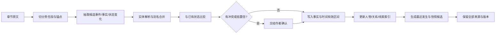

# 故事记忆系统：快照、索引、链路与版本

## 结论先说

“已经发生的东西怎么记住”不能只靠一份全书摘要，也不能把所有原文塞进模型上下文。

更稳的候选结构是：

> **原文是证据底座；事件和状态变化是可查询事实；人物、关系、地点、物品和故事线形成索引；当前快照负责导航；所有摘要都能回到来源；动态事实保存有效时间；计划与事实分库；不确定和多视角信息不能被强行合并。**

快照的作用不是“一眼看完所有内容”，而是让作者像接手一个大型项目一样，知道现在在哪里、哪些东西活跃、要去哪里继续查。

## 1. 为什么单一全书摘要不够

### 1.1 摘要会丢细节

长篇摘要必然压缩。它可能保留“韩夜被处决”，却丢掉“这是假死，只有林策和军医知道”；也可能保留“二人决裂”，却丢掉公开决裂与私下合作的区别。

### 1.2 摘要会覆盖历史

如果人物从朋友变成敌人，当前摘要只写“敌人”，闪回到旧时间点时就会出错。历史关系不能被当前状态抹掉。

### 1.3 摘要容易混淆视角

以下几句话完全不同：

- 事实：韩夜活着；
- 城中公众相信：韩夜已死；
- 林策知道：韩夜活着；
- 读者知道：取决于叙事是否揭示；
- 韩夜担心：林策可能出卖他。

摘要如果不带视角，就会把“相信”和“真实”混成一件事。

### 1.4 摘要不能证明自己

作者问“为什么系统说他们已经决裂”，必须能点回原章和证据段。没有来源的摘要只能靠信任，无法审查。

## 2. 记忆系统的七层候选

### 第 1 层：原文与锚点

保存：

- 章节原文；
- 段落或句子锚点；
- 版本；
- 发布时间；
- 作者修订记录；
- 所属视角、地点和故事时间候选。

这是不可丢的底座。上层所有事实、摘要和检查结果都要能回到这里。

### 第 2 层：章事实稿

每章完成后，记录真正影响后续的变化：

- 发生了什么；
- 谁参与；
- 时间、地点；
- 事件前后状态；
- 新增知识、误信和公开信息；
- 新承诺、伏笔和义务；
- 直接后果；
- 最小证据。

章事实稿不是正文总结。它只收会影响后续运行的内容。

### 第 3 层：实体索引

实体可以是：

- 人物；
- 组织；
- 地点；
- 物品；
- 能力；
- 规则；
- 计划或承诺；
- 事件；
- 故事线。

每个实体有稳定 ID、别名、首次出现、最近出现、相关事实和原文入口。

### 第 4 层：动态关系与状态

记录带时间的事实：

- 人物位置；
- 伤势；
- 所有权；
- 身份；
- 阵营；
- 人物关系；
- 能力可用性；
- 是否在场；
- 谁知道什么。

每条动态事实要有有效区间，而不是只保存当前值。

### 第 5 层：事件、因果与时间链

保存：

- 事件先后；
- 原因与结果；
- 触发条件；
- 并行发生；
- 闪回或转述；
- 计划时间与实际发生时间；
- 事件对哪些状态产生变化。

### 第 6 层：分层摘要与导航快照

包括：

- 章节摘要；
- 最近 5 章摘要；
- 故事线摘要；
- 阶段/卷摘要；
- 人物摘要；
- 当前一页快照；
- 全书高层摘要。

RAPTOR 的研究表明，跨不同抽象层检索比只取叶子文本更有效。这里要借用它的思想，但保持每层都能回到原文。

### 第 7 层：版本与来源

保存：

- 事实由哪次抽取得到；
- 作者是否确认；
- 后来是否被修订；
- 哪条新事实使旧事实失效；
- 摘要使用了哪些事实；
- 冲突检查使用了哪些证据；
- 计划分支和正式事实的边界。

## 3. 一页“当前快照”应该包含什么

快照不要追求百科全书式完整。建议分成九块：

### 当前坐标

- 已发布到第几章；
- 当前故事时间；
- 当前主视角；
- 当前地点；
- 当前阶段或卷。

### 最近发生

最近 3—10 章逐章列出关键变化，不写流水账。

### 活跃人物

- 当前状态；
- 当前目标；
- 当前困境；
- 最近一次重要变化；
- 与本章相关的关系。

### 活跃故事线

- 最近推进；
- 当前压力；
- 下一可能动作；
- 暂停了多久。

### 未结事项

- 快到期的承诺；
- 未回收伏笔；
- 未回答问题；
- 倒计时；
- 失踪人物或暂离线。

### 硬约束

- 世界规则；
- 人物不能违反的稳定条件；
- 已发布事实；
- 当前时间和旅行限制。

### 未来近程

未来 3—10 章的当前计划和未决问题。

### 风险

- 信息冲突；
- 低置信抽取；
- 时间不明；
- 作者尚未确认的状态；
- 计划与事实可能混淆。

### 继续探索入口

把人物、关系、故事线、事件和证据做成可点入口。

## 4. “换一个作者来续写”时要交什么

可以把它设计成**故事交接包**：

### A. 一页快照

帮助新作者在几分钟内知道当前局面。

### B. 最近正文

最近 2—5 章原文，保证语言、场景和直接连续性。

### C. 当前阶段说明

这一卷或这个阶段要完成什么，哪些部分已经变化。

### D. 主要人物卡

只给当前相关人物，不把全书人物都塞进去。

### E. 关系和知识边界

谁和谁是什么关系；谁知道什么；谁在误解什么；哪些秘密不能提前泄露。

### F. 未结事项

哪些东西读者在等，哪些事情人物必须处理。

### G. 检索地图

告诉新作者：

- 想查人物，点人物卡；
- 想查关系，点关系变化事件；
- 想查物品，点所有权历史；
- 想查时间，点时间线；
- 想查某个谜团，点故事线和证据链。

这比把整本书压成 20 页摘要更可靠。

## 5. 事实应该怎样存

一个动态事实可以有以下字段：

```yaml
fact_id: FACT-2041
subject_id: CHAR-HANYE
predicate: public_status
object: executed
valid_from_event: EVT-0087
valid_to_event: null
story_time_from: "冬月十二日午时"
story_time_to: null
perspective: public_belief
canon_status: confirmed
confidence: 0.98
source_anchors:
  - CH-087:P18-P22
supersedes: FACT-1988
notes: "真实状态另见 FACT-2042"
```

另一个事实记录真实状态：

```yaml
fact_id: FACT-2042
subject_id: CHAR-HANYE
predicate: actual_status
object: alive_and_undercover
valid_from_event: EVT-0087
perspective: world_truth
known_by:
  - CHAR-LINCE
  - CHAR-DOCTOR-WU
source_anchors:
  - CH-087:P31-P36
```

这种拆分能避免把公开认知和世界真相混在一起。

## 6. 双时间为什么重要

Zep/Graphiti 使用双时间：

- **有效时间**：事实在故事世界里从什么时候到什么时候成立；
- **记录时间**：系统什么时候获得或修改这条信息。

小说里也需要相似区分。

例子：

- 第 100 章发布时，作者写明“凶手是乙”；
- 第 120 章作者修订第 100 章，把凶手改成丙；
- 故事内凶案发生在三年前。

系统要知道：故事真相的时间、章节披露的时间、系统记录变化的时间不是一回事。

还要加一个常用轴：

- **读者披露时间**：读者在第几章知道；
- **人物得知时间**：某个人在故事何时知道。

## 7. 关系怎么存才不会失真

不要只存：`林策 — friend — 韩夜`。

建议拆成多个关系事实：

- 林策真实信任韩夜；
- 林策公开指控韩夜叛国；
- 韩夜相信林策仍会保护自己；
- 城中公众相信二人是死敌；
- 二人共同承担军粮案调查；
- 韩夜欠林策一次救命之恩；
- 关系在第 87 章发生公开断裂和私下加深。

关系卡可以给作者一个当前摘要，但底层必须保留这些分量和变化历史。

## 8. 知识、相信、误信、谎言要分开

长篇吃书常发生在“谁知道什么”上。

候选分类：

| 类型 | 例子 |
|---|---|
| 世界事实 | 韩夜活着 |
| 人物亲知 | 林策亲自安排假死 |
| 人物推断 | 敌将怀疑韩夜活着 |
| 人物误信 | 普通士兵相信韩夜已死 |
| 人物说法 | 林策公开说韩夜已被处决 |
| 谎言 | 林策明知其活着仍宣称已死 |
| 传闻 | 城外流传韩夜投敌 |
| 读者已知 | 章节直接展示假死过程 |
| 读者未知 | 叙事切走，没有揭示真相 |

系统必须保留“来源”和“认识主体”，否则会错误判断人物泄密或降智。

## 9. 写完一章后怎样更新记忆

推荐流程：



关键控制：

- 原文抽取失败不能静默；
- 同名和别名合并要可撤销；
- 新事实使旧事实失效时，不删除旧历史；
- 自动摘要不直接成为事实；
- 低置信事实不得进入硬检查；
- 计划事件不能写入已发生事实。

## 10. 怎样沿链路找资料

作者问：“我能不能在下一章让林策把韩夜当朋友公开接回来？”

系统可以这样探索：

1. 从林策人物节点进入；
2. 找到与韩夜的关系边；
3. 看关系当前摘要；
4. 沿“最近变化”到第 87 章假死事件；
5. 查看公众认知：韩夜已死；
6. 查看军粮案故事线：潜伏任务未完成；
7. 查看未结事项：林策公开处决的政治后果；
8. 查看计划：第 94 章准备让敌将发现韩夜踪迹；
9. 回到原文证据确认措辞。

系统不必一次给出所有内容，但必须让这条路径走得通。

## 11. 摘要怎样更新才不会漂移

### 摘要由事实生成，不反过来改事实

事实是输入，摘要是视图。摘要出现错误时，只修摘要，不能自动改底层事实。

### 增量更新后定期重建

每章只更新受影响的局部摘要，减少成本；每个阶段结束后从事实和原文重新生成一次，避免长期增量漂移。

### 保存摘要版本

作者需要知道某个摘要在第 80 章时是什么样，在第 100 章时为什么变化。

### 关键摘要要求引用

人物卡上的当前目标、伤势、关系和知识都应该能点出来源。

### 不确定内容显式标记

“可能”“传闻”“作者未确认”“抽取低置信”不能被摘要写成确定事实。

## 12. 检索技术怎样组合

单一向量搜索不够。推荐混合：

- **全文搜索**：找精确名字、台词、物品名；
- **语义搜索**：找意思相近的旧事件；
- **实体索引**：从人物、地点、物品进入；
- **图遍历**：沿关系、因果、伏笔和故事线找多跳内容；
- **时间过滤**：只看某个故事时间或章节切面之前；
- **最近性**：优先最近状态和最近正文；
- **来源回溯**：从摘要或事实回到原文。

HippoRAG 支持图式多跳检索，RAPTOR 支持多层摘要，Zep/Graphiti 支持动态事实和历史关系。三者的思想可以组合，但没有一篇论文直接验证“中文网文记忆系统”。

## 13. 数据安全与作者控制

长篇书稿是高价值未公开内容。候选要求：

- 原文和事实库可完整导出；
- 作者能查看、修改和删除抽取结果；
- 云端处理范围透明；
- 敏感未发布大纲可选择本地保存；
- 模型训练使用必须单独授权；
- 每次自动改动有审计记录；
- 不能因系统停服而失去故事真源。

## 14. 评测记忆系统

### 人工考卷

从真实 30—100 章小说建立问题：

- 人物当前在哪里；
- 某关系何时改变；
- 某人是否知道某秘密；
- 某物品现在归谁；
- 某伤势是否已经恢复；
- 某伏笔有哪些证据；
- 某条线最近一次推进在哪里；
- 某个当前状态由哪些事件造成。

### 指标

- 当前状态准确率；
- 历史状态准确率；
- 证据定位准确率；
- 多跳问题完成率；
- 时间切面泄漏率；
- 摘要错误传播率；
- 作者纠错成本；
- 断更回归时进入状态耗时；
- 检索上下文 token 和延迟。

### 必须专测的反例

- 同名人物；
- 化名和身份揭示；
- 谎言和误信；
- 梦境、幻境、小说中小说；
- 闪回；
- 非线性叙事；
- 时间旅行；
- 修订旧章；
- 公开状态与真实状态不同；
- 计划里有但正文没发生。

## 15. 来源入口

- RAPTOR、HippoRAG、Zep/Graphiti：P43—P45。
- FactTrack、NarrativeFactScore：P37—P38。
- DOME、Re³、PlotMachines：P19、P21、P25。
- 长期记忆与代码检索类比：P47—P53。
