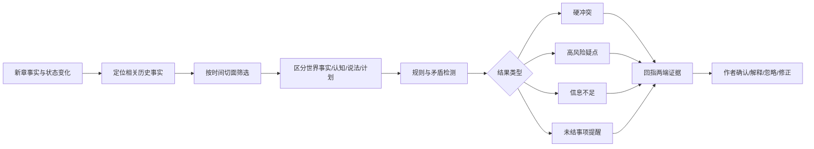

# 吃书与故事时间冲突检测

## 结论先说

“吃书”不能只做成一句模糊的“前后不一致”。要把它拆成不同错误类型，并区分：

- 合法变化与真实矛盾；
- 世界事实与人物认知；
- 故事内时间与发布章序；
- 作者计划与已发生正文；
- 明确冲突、疑点、信息不足和故意设置。

最重要的产品规则是：

> **检查器必须回指两端证据、说明冲突发生在哪个时间切面，并允许作者标记“这是故意的”“后文会解释”“系统理解错了”。**

## 1. 吃书有哪些主要类型

### 1.1 稳定身份冲突

例子：

- 前文明确人物是独生子，后文突然出现“从小一起长大的亲哥哥”；
- 某宗门规定掌门必须出自嫡系，后文无解释地让外姓客卿继任。

这类通常较硬，但仍要检查是否存在隐藏身份、谎言或规则例外。

### 1.2 动态状态冲突

- 伤势未恢复却无解释完成高强度动作；
- 物品已经被毁，后文又直接使用；
- 人物已离开地点，却在同一时刻继续对话；
- 能力处于冷却期却再次释放。

动态事实必须带有效时间，不能只比较两句话。

### 1.3 人物关系冲突

- 双方已决裂，后文却按旧友状态互动；
- 人物已经知道对方背叛，却仍毫无理由地完全信任；
- 债务、承诺、利益关系被忘记。

关系比单一“朋友/敌人”复杂，很多只是变化缺少过渡，不一定是二元矛盾。

### 1.4 知识与信息泄漏

- 人物说出自己不可能知道的秘密；
- 叙事视角提前泄露幕后信息；
- 角色根据尚未收到的消息采取行动；
- 谎言对象突然知道真相却无获得渠道。

这是长篇最常见、也最容易被普通事实库忽略的错误。

### 1.5 地点与旅行冲突

- 两地距离需要三天，人物半天到达；
- 并行事件里同一人物在两个地点；
- 交通条件、天气、封锁等约束被忽略。

### 1.6 世界规则与能力冲突

- 前文规则写明“每人只能契约一只灵兽”，后文无例外说明契约第二只；
- 能力代价、触发条件、适用范围被改掉；
- 世界经济、官制、技术条件前后不一致。

### 1.7 因果断裂

- 后果没有原因；
- 原因已经被取消，后果仍照常发生；
- 人物动机依赖一个已经不存在的事实；
- 改纲后旧的连带剧情没有处理。

### 1.8 重复发现与重复披露

- 人物第二次“第一次知道”同一秘密；
- 读者已经看过完整真相，后文仍按首次揭晓写；
- 角色重复经历同一关系转折而没有新的层次。

### 1.9 未结事项遗忘

这类不是严格矛盾，但会产生“作者忘了”的感觉：

- 重要誓言长期不提；
- 倒计时过期；
- 已经拿到的关键线索无人处理；
- 重大伤亡没有后续反应；
- 读者承诺被新线覆盖。

更适合做风险提示，不宜当硬冲突。

## 2. 三条时间轴必须分开

### A. 故事时间 `T_story`

角色世界里的日期、时刻、事件先后和持续时间。

### B. 叙事/披露时间 `T_narration`

读者在第几章看到某件事。闪回可以让较早的故事事件在较晚章节披露。

### C. 发布与计划时间 `T_release / T_plan`

- 第几章发布；
- 哪一天更新；
- 作者计划“第 100 章发生 X”；
- 平台活动或完结节点。

用户特别提到的“作者给自己设定第几章发生什么，结果与故事内时间串位”，就是 `T_plan` 与 `T_story` 混在一起。

例子：

- 计划写“第 100 章决战”；
- 但正文第 98 章故事内只过了一天，援军需要五天；
- 章序目标要求决战提前，故事时间不允许。

系统应该提示：

- 延后决战章；
- 增加时间跳跃；
- 修改交通条件；
- 改援军参与方式；
- 接受缺席；
- 明确这是作者故意制造的不可能状态。

它不能偷偷把五天路程改成一天。

## 3. FactTrack 给了什么可用思路

FactTrack 把每个事件拆成：

- **前置事实**：事件发生前成立；
- **后置事实**：事件发生后成立；
- **静态事实**：事件前后都成立。

并给每条事实一个有效区间。

例子：

> 韩夜进入粮仓，拿到账本后离开。

可能拆成：

- 前置：韩夜不持有账本；
- 后置：韩夜持有账本；
- 前置：韩夜在粮仓；
- 后置：韩夜不在粮仓；
- 静态：账本属于军粮案证物。

下一章如果写“韩夜仍在粮仓等待林策”，系统就会发现位置状态与离开事件冲突。

FactTrack 证明这种分解比直接让模型通读 outline 找矛盾更有效，但其实验只有约 2,000—3,000 词大纲，标注和评测也大量依赖 GPT-4。中文百万字网文还需要重新验证。

## 4. ConStory-Bench 给了什么错误分类思路

Lost in Stories / ConStory-Bench 专门研究约 8,000—10,000 词长故事的一致性：

- 2,000 个 prompt；
- 5 大类、19 个细分错误；
- 检查器要求回指具体证据；
- 事实和时间错误最常见；
- 错误常在故事中段聚集；
- 某些错误会一起出现。

这提醒产品：

- 不能只在结尾检查；
- 章节写完就要增量检查；
- 某个状态错误可能进一步造成关系、知识和因果错误；
- 需要把错误看成传播链。

## 5. 检查流程候选



## 6. 什么可以做硬阻挡

只有满足以下条件才适合强提示甚至挡关：

- 两端都有明确文本证据；
- 指向同一实体；
- 位于重叠时间切面；
- 视角或认知层相同；
- 不存在已记录的例外、谎言、幻境、闪回或修订；
- 冲突会让世界状态不可能同时成立；
- 置信度达到预设阈值。

例子：

- 同一故事时刻，人物被明确写在两地；
- 已销毁且不可恢复的物品再次出现；
- 人物在得知秘密前说出秘密；
- 已发布硬规则被无解释违反。

即使挡关，也应允许作者强制通过并记录原因。

## 7. 什么只适合提醒

- 人物动机似乎不足；
- 关系变化过快；
- 伤势恢复可能太快，但世界规则不明确；
- 伏笔拖得过久；
- 某个角色很久没出现；
- 旅行时间可能紧张；
- 读者可能忘记旧线；
- 本章重复了类似揭示；
- 高潮提前导致后续计划压力。

这些没有唯一正确答案，不能冒充硬规则。

## 8. 检查结果应该长什么样

不建议：

> “第 188 章人物设定不一致，建议修改。”

建议：

> **高风险：韩夜的位置可能冲突**  
> 新章候选事实：冬月十三日子时，韩夜仍藏在北城粮仓。  
> 历史事实：第 187 章末明确写“他在巡逻换岗前离开粮仓，前往西井”。  
> 时间关系：两处都指向同一夜、同一换岗前后，当前未找到返回事件。  
> 可能解释：新章是回溯；韩夜返回；第 187 章“离开”是佯动；抽取错误。  
> 操作：补充返回事件 / 标为回溯 / 查看两端原文 / 忽略并记录原因。

## 9. 时间冲突的具体检查

### 持续时间

- 旅行；
- 伤势恢复；
- 建设、训练、炼制；
- 怀孕、季节、年龄；
- 倒计时；
- 通信和消息传播。

### 区间关系

可以借用 Allen 区间关系：之前、之后、相接、重叠、包含、同时开始等。产品前台不必展示数学名词，但后台要能表达。

### 并行线同步

每条故事线保存自己的最近故事时间和同步点。切线时检查：

- 是并行、回溯还是追上；
- 人物跨线移动是否可能；
- 某条线是否提前知道另一线结果。

### 章计划时间

计划对象单独保存：

```yaml
planned_event:
  target_chapter_range: [198, 202]
  story_time_requirement: "冬月十八日之后"
  prerequisites:
    - "援军到达"
    - "城内粮尽"
```

如果当前章序推进快于故事时间，系统提示“章位目标与故事条件不匹配”。

## 10. 特殊叙事不能误报

检查器必须识别或允许作者标记：

- 闪回；
- 梦境；
- 幻境；
- 预言；
- 时间旅行；
- 不可靠叙述；
- 谎言；
- 小说中小说；
- 角色扮演和化名；
- 多世界或分支线；
- 作者修订旧章；
- 有意留白。

没有这些标记，系统会把大量正常叙事当成 bug。

## 11. 吃书检测如何与计划改动结合

当作者改未来计划时，检查器不应该马上说“冲突”，因为未来还没发生。

它应该生成两类结果：

### 与已发生事实不兼容

例如计划让已死亡且不可复活的人物出场，这是硬阻塞。

### 与其他未来计划不一致

例如新路线与原第 205 章计划冲突。这只是计划分支问题，可以选择替换、重排或保留两个方案。

计划冲突不能写进事实账。

## 12. 建立中文网文错误基准

现有英文基准远不够。建议从真实中文长篇构造六类样本：

1. 正常变化，不是冲突；
2. 明确硬冲突；
3. 人物知识泄漏；
4. 故事时间冲突；
5. 章序计划与故事时间冲突；
6. 需要上下文才能判断的疑点。

每条样本保存：

- 冲突两端原文；
- 实体 ID；
- 故事时间；
- 章节位置；
- 视角和认知主体；
- 是否故意；
- 作者裁决；
- 严重度；
- 可接受修复方式。

## 13. 指标

- 硬冲突精确率；
- 硬冲突召回率；
- 合法变化误报率；
- 人物知识泄漏召回率；
- 时间推理准确率；
- 证据定位准确率；
- 计划/事实混淆率；
- 作者确认耗时；
- 作者强制忽略后系统是否重复骚扰；
- 修复后是否产生新冲突。

⚠️ 对作者工具，硬冲突的高精度通常比“什么都提醒”更重要。大量误报会让作者直接关闭检查器。

## 14. 来源入口

- FactTrack：P37。
- Lost in Stories / ConStory-Bench：P32。
- Finding Flawed Fictions、TurnaboutLLM、ChronoSense、Temporal Grounding：P39—P42。
- DOME、Zep/Graphiti：P25、P45。
