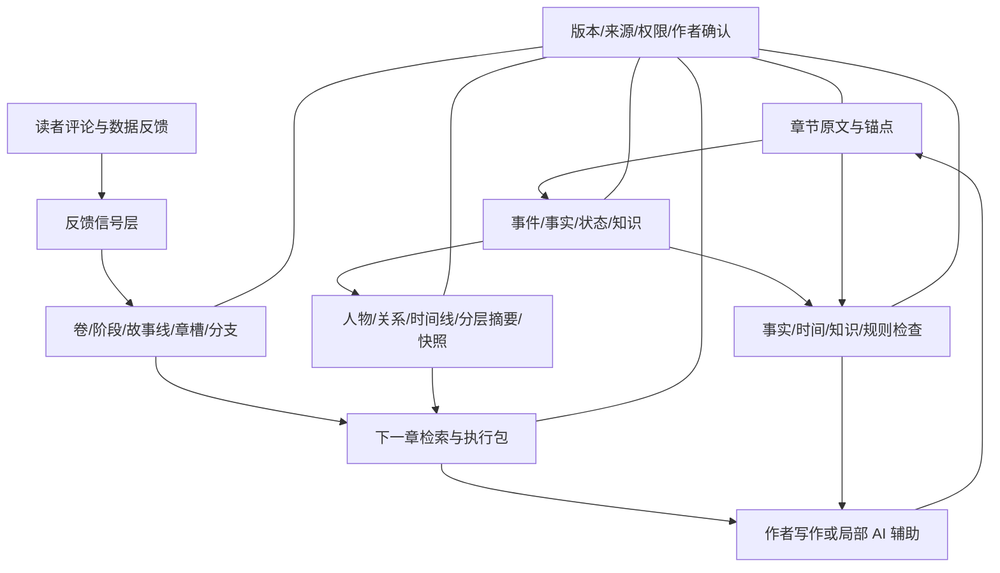

# 候选产品架构与验证实验

> 本文把研究压成一套可测试的产品候选，不是已拍板合同。对象名称、字段和模块都需要与现行项目合同另行核对。

## 结论先说

候选产品可以理解成六个相互分开的系统：

1. **原文与事实系统**：保存已发布内容、证据和动态状态；
2. **规划系统**：保存未来方向、章槽、分支和改动；
3. **导航与记忆系统**：提供快照、人物、关系、故事线和多跳入口；
4. **下一章供料系统**：围绕当前意图组装材料；
5. **检查系统**：处理事实、时间、知识和规则冲突；
6. **作者控制系统**：负责权限、版本、确认、撤销和来源。

正文生成可以接在这套系统后面，也可以完全不接。核心价值不依赖一键写章。

## 1. 五条架构原则

### 事实唯一，视图可以很多

人物页、快照、卷总结和执行包都只是视图。它们不能各自形成第二份真相。

### 计划与事实永不混写

作者“打算第 100 章让反派死”不等于反派已经死。计划只有在正文发布并经事实抽取确认后，才转为已发生。

### 摘要可丢，证据不可丢

摘要可以重建；原文、锚点、作者确认和版本历史必须保留。

### 改动先分支，再提升

高层计划、关系结局、人物命运和世界规则的改动先成为候选分支。作者确认后才替代当前方案。

### 检查器只在证据足够时强硬

硬冲突要求同实体、同时间切面、同视角层和双端证据。软评价默认不挡关。

## 2. 候选模块图

## 3. 原文与事实系统

### 输入

- 作者上传的旧稿；
- 新发布章节；
- 作者修订章；
- 已确认设定材料；
- 外来材料与产品自产内容要保留来源身份。

### 输出

- 稳定章节 ID；
- 段落锚点；
- 候选事件；
- 状态变化；
- 人物知识变化；
- 关系变化；
- 新伏笔、承诺和未结事项；
- 作者确认后的事实。

### 关键护栏

- 只从责任文本抽取；
- 每条事实有最小证据；
- 计划内容不进入事实；
- 梦、谎言、传闻、人物相信和世界真相分开；
- 历史状态不被当前状态覆盖。

## 4. 规划系统

### 主要对象

- 作品内核；
- 卷或阶段；
- 故事线；
- 题材单元；
- 章槽；
- 候选事件；
- 计划分支；
- 计划改动；
- 锚点和弹性区。

### 主要动作

- 建立候选；
- 锁定；
- 排入近程；
- 暂停；
- 提前或延后；
- 合并；
- 分叉；
- 放弃；
- 从旧版本恢复；
- 查看影响。

### 影响分析

至少沿这些依赖找：

- 已发布事实；
- 因果前提；
- 人物动机；
- 时间与地点；
- 伏笔和回收；
- 读者承诺；
- 后续章槽；
- 世界规则；
- 人物知识。

## 5. 导航与记忆系统

### 默认入口：今日写作快照

- 上一章停点；
- 当前坐标；
- 最近发生；
- 活跃人物；
- 活跃故事线；
- 未结事项；
- 近程计划；
- 风险；
- 可继续探索的入口。

### 深入入口

- 人物；
- 关系；
- 事件；
- 故事线；
- 时间线；
- 地点；
- 物品；
- 能力和规则；
- 伏笔与承诺；
- 原文证据。

### 技术组合候选

- 精确全文搜索；
- 语义检索；
- 实体索引；
- 关系图遍历；
- 时间过滤；
- 分层摘要；
- 最近性排序；
- 来源回溯。

任何图或摘要都不能脱离原文单独充当硬真相。

## 6. 下一章供料系统

### 输入

- 下一章意图卡；
- 近程计划；
- 最近正文；
- 当前状态；
- 相关人物与线；
- 检索问题；
- 作者上下文预算。

### 输出

四层材料：

- 必带；
- 强关联；
- 背景；
- 可选探索。

每条内容显示：

- 为什么带入；
- 适用时间；
- 视角或认知主体；
- 来源；
- 置信度；
- 是否硬约束。

### 跨线重入

换视角、地图或故事线时自动补：

- 上次出现；
- 当时状态；
- 时间差；
- 暂停目标；
- 离屏变化待确认；
- 与当前主线同步点。

## 7. 检查系统

### 硬检查

- 事实矛盾；
- 时间区间；
- 同时在两地；
- 状态不可能；
- 人物知识泄漏；
- 物品所有权；
- 世界规则；
- 计划与事实混淆。

### 风险检查

- 关系跳变；
- 动机不足；
- 重复披露；
- 未结事项过期；
- 故事线长期停滞；
- 节奏偏移；
- 高潮提前的后续压力。

### 输出合同候选

每条必须含：

- 类型；
- 严重度；
- 两端证据；
- 时间切面；
- 为什么可能冲突；
- 可解释例外；
- 作者操作；
- 忽略记录。

## 8. 作者控制系统

### 权限粒度

- 可读；
- 可检索；
- 可建议；
- 可生成候选；
- 可局部更新；
- 必须确认；
- 禁止触碰。

### 可按对象设置

例如：

- 人物最近出现章节：允许自动更新；
- 当前伤势：自动提取、作者确认；
- 人物核心欲望：只读；
- 结局分支：禁止模型自动改；
- 读者反馈：可归纳，不可写入事实。

### 版本

- 原文版本；
- 事实版本；
- 摘要版本；
- 计划分支；
- AI 建议记录；
- 作者决定和原因；
- 撤回与恢复。

## 9. 前台页面候选

### 首页：继续写

只放：恢复快照、当前章槽、必查风险、最近正文和开始写作。

### 故事地图

按卷、线、人物或时间切换，不展示一张巨型全图。

### 人物与关系

当前摘要 + 历史变化 + 知识边界 + 原文入口。

### 计划台

滚动窗口、分支、锚点、影响分析、旧版本。

### 未结事项

伏笔、承诺、义务、倒计时、暂停线；按紧迫度和关联当前章排序。

### 检查台

只显示有证据的问题，支持确认、解释、忽略和修正。

### 资料搜索

自然语言搜索 + 结构过滤 + 沿链路继续查。

## 10. 分阶段最小产品

### 阶段 A：只做恢复和查询

- 导入 30—100 章；
- 章事实与证据；
- 人物当前状态；
- 最近发生；
- 自然语言问答回原文；
- 不做生成和自动改纲。

**验证问题：** 作者能否更快重新进入故事，回答旧事实是否更准。

### 阶段 B：下一章意图与执行包

- 章槽；
- 必带/关联/背景材料；
- 跨线重入；
- 作者删改材料；
- 记录哪些材料最终被使用。

**验证问题：** 是否减少漏约束和翻旧章时间。

### 阶段 C：动态规划与影响分析

- 近程滚动窗口；
- 分支；
- 提前/删除/合并事件；
- 依赖传播；
- 废案保留。

**验证问题：** 改纲后能否发现足够多的连带义务，且误报可接受。

### 阶段 D：硬检查

- 动态状态；
- 故事时间；
- 人物知识；
- 世界规则；
- 双端证据。

**验证问题：** 高精度发现真实吃书，不用大量误报骚扰作者。

### 阶段 E：软评价与读者信号

- 评论归纳；
- 读者认知候选；
- 信息披露风险；
- 结构模式卡；
- 成对方案比较。

**验证问题：** 是否提供启发，而不是把作品推向同质化。

## 11. 核心实验

### 实验 1：断更回归

- 对照：作者只用原文件；
- 实验：快照 + 最近详细 + 链路检索；
- 指标：进入状态时间、事实问答、首章错误、主观负担。

### 实验 2：下一章资料

- 对照：全书长摘要；
- 实验 A：向量检索；
- 实验 B：意图卡 + 混合检索 + 覆盖检查；
- 指标：必带召回、噪声、未来泄漏、下游错误、作者补查次数。

### 实验 3：改纲影响

人工构造 20 类改动：提前高潮、人物不死、支线删除、能力限制改变、换地图等。

指标：影响召回、误报、作者处理时间、改后冲突。

### 实验 4：吃书检测

用真实作者裁决的中文样本，区分合法变化、硬冲突、知识泄漏和时间冲突。

指标：硬冲突精确率优先，另测证据定位和作者忽略后的重复提醒。

### 实验 5：软评价

比较：总分、证据化问题卡、成对比较、真实读者反馈。

指标：作者信任、采用率、越权感、作品同质化和真实读者结果。

## 12. 建议的产品指标

### 作者效率

- 打开项目到开始有效写作的时间；
- 翻旧章时间；
- 查人物关系和时间线的完成时间；
- 计划改动处理时间。

### 事实可靠性

- 状态准确率；
- 证据定位；
- 未来泄漏；
- 计划/事实混淆；
- 吃书错误率。

### 控制与信任

- AI 越权次数；
- 自动结果被作者纠正比例；
- 撤销成功率；
- 作者查看来源比例；
- 作者愿意持续维护的对象数量。

### 创作结果

- 作者自评帮助程度；
- 真实读者追更或理解变化；
- 作品是否变得套路化；
- 作者声音是否保留。

## 13. 不建议早期做的功能

- 一键把整本大纲自动重排；
- 无证据的“人物 OOC 评分”；
- 单一故事质量总分；
- 把所有关系和事件展示在一张全图；
- 自动把评论改写成剧情需求；
- 没有版本控制的自动事实更新；
- 直接模仿特定在世作者；
- 把计划写回事实库；
- 为了“完整”强行填满未知字段。

## 14. 一句话候选定义

> **帮助中文长篇作者在持续连载中恢复故事状态、管理可变计划、按需找到旧信息、守住已发生事实，并把创作决定留给作者的工作台。**
