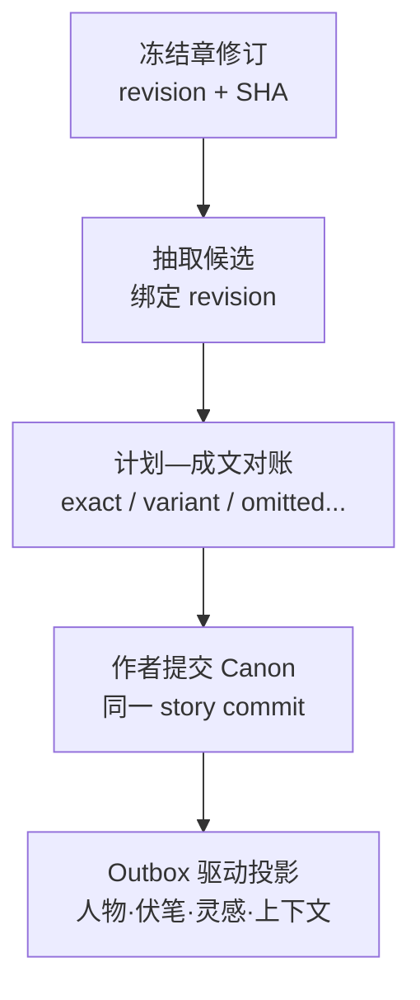

# 故事真源引擎｜账本体系架构审查（Prompt 2）

审查日期：2026-08-13  
审查对象：`pack2_ledger_system.zip` 内五份设计稿，并以同产品现行背景板为语义上位约束  
视角：系统架构、数据一致性、状态机、容量与演进性

## 0. 结论先行

**按当前设计直接施工：No-Go。** 方向上有四个好地基——计划与事实分号、事实账集中、旧计划保留、展示层只读——但真正会守住这些原则的“事务边界、对账边、依赖回撤、双时态、投影水位”还没有落进数据合同。

这不是“写到 500 章后才可能慢”的问题。最早会出事故的是：

1. **选中计划被写成已经兑现。** 同一次选项确认会把 PE 标成 `digested`、H 标成 `paid`、MC 标成 `digested`，人物页和灵感页又沿这些状态继续推导；正文尚未写或写成变体时，五本账已经互相说不同的话。
2. **所谓原子动作跨文件。** 单个 JSON 临时文件替换只能保证“一本文件没有写半截”，不能保证 `plan.json`、`characters.json`、`ideas.json`、`chapters.json`、`facts.json` 和 JSONL 流水一起成功。
3. **“真值移交”被做成翻开关。** 正文入库、抽取、事实确认、计划对账、人物影子重算并非同一瞬间；异步任务晚到或作者立即再改稿，会制造真值空窗和旧结果覆盖新稿。
4. **派生结论没有支持集。** 只记录“已消化／已回收／当前状态”，不记录它具体由哪些 F、哪版正文、哪条作者签字支持。改史后无法机械撤回。

一句架构判断：**不要把“计划是否选定、世界中是否发生、正文是否写出、读者是否已知、证据是否仍有效”压进同一个状态。它们是五条正交轴。**

### 审查效力边界

- 包内人物账自称“轻档设计稿，不是施工合同”（`CHARACTER_LEDGER_DESIGN_R01.md:L3`）；章节改稿稿也把多项合同改动列为建议（`CHAPTER_REVISION_DESIGN_R01.md:L5`）。本报告审的是候选设计一旦施工后的结构风险，不把候选字段冒充现行实现。
- 同产品背景板已经拍定“角色 ID 永不硬编码”“计划—成文六态对账”“暗稿为作者签字的已发生未描写事实”等语义方向，但字段和接口仍待施工合同。包内设计与这些上位语义不一致之处，应视作整合缺口，而不是用包内旧字段覆盖背景板。
- 用户口中的“五本账”是逻辑分类；当前稿面实际是事实账、规划账（伏笔 H 内嵌）、人物账、灵感账四个物理账，加章节证据／版本架。**伏笔是不是独立聚合体、谁拥有其状态，尚未被物理边界说清。**

## 1. 真源语义必须先重写

“事实账是唯一真源”与“有正文则正文为真／产品内创作时大纲为真”若按字面同时执行，会出现三个真源。建议改成三个不同的权威范围：

| 权威范围 | 唯一权威 | 含义 |
|---|---|---|
| 写过什么 | 不可变章修订＋逐字证据 | 正文冲突时，正文是最高优先级证据；它不是所有下游直接查询的结构化库 |
| 世界中发生了什么 | confirmed 剧情原子／事实账 | 所有机器推理、问答、人物状态和上下文编译只读这里；每条必须能回到正文证据或 `AUTHOR_ATTESTATION` |
| 接下来打算写什么 | 已选定规划事件 | 只在章关闭前约束创作；它是权威意图，不是已发生事实 |
| 页面与摘要显示什么 | 可重建投影 | 人物页、伏笔面板、灵感进度、体检、上下文包都不反写真源 |

因此，“正文接管真值”应改名为：**计划意图与冻结正文修订完成对账，确认后的事实原子成为新 Canon；旧计划转为不可变历史。** 正文变更时不是直接静默改事实，而是让相关事实进入复核、补偿或重确认流程。

## 2. 风险分级

### A. 必炸：正常使用路径即可稳定触发

| 编号 | 风险 | 具体触发场景 | 后果 | 建议 |
|---|---|---|---|---|
| B01 | **“选中”冒充“已发生／已揭示／已兑现”** | 作者选中“爷爷遗忘”；系统立刻让 PE 生来 `digested`、H 变 `paid`、MC 变 `digested`；人物页写入 current，灵感页汇总成 realized。正文随后没写，或改成“师妹遗忘”。证据：`PLAN_LEDGER_STORAGE_DESIGN_R01.md:L106–122,L135–146,L181–195,L670`；`CHARACTER_LEDGER_DESIGN_R01.md:L149–187`；`IDEA_LEDGER_DESIGN_R01.md:L170–181`。 | 规划、伏笔、人物、灵感都显示已落地，事实账却无 F；底牌还可能被 `revealed` 提前释放。 | 拆成 `decision_status`、`placement_status`、`reconciliation_status`、`audience_visibility`、`validity_status`。只有 confirmed F 或显式作者离屏签字才能推进 actual 状态。 |
| B02 | **暗稿在上位语义里存在，在包内可执行合同里不存在** | 背景板规定 130 条计划只写出 100 条时，未写 30 条可经作者签字成为“已发生未描写”；包内 PE 只有 pending/digested/voided，F 又不强制回连 PE。若移交只翻 `handed_over`，30 条要么丢失，要么被 PE 冒充事实。证据：`03_CREATION_AND_MEMORY_PIPELINES:L275`；`02_SYSTEM_ARCHITECTURE_AND_TRUTH_LAYERS:L127–140`；`PLAN_LEDGER_STORAGE_DESIGN_R01.md:L116,L333`。 | 事实账不再是唯一真源，或人物状态吃到没有证据身份的“幽灵事实”。“默认发生”与“作者签字”措辞还可能造成无意批量确认为 Canon。 | 暗稿不另建账；同一事实原子记录 `support_kind=AUTHOR_ATTESTATION`、`portrayal=undescribed`、AUTHOR 可见范围、故事生效区间、签字版本和作用范围。关章时必须显示数量、差异和排除项，由作者显式提交。 |
| B03 | **跨账双写没有真正原子性** | 选项确认改 plan＋characters；灵感安放改 ideas＋plan；章重导改 chapters＋facts＋快照并启动异步抽取；主 JSON 替换成功但 JSONL 追加失败。稿面却称“一次整文件保存天然原子”。证据：`PLAN_LEDGER_STORAGE_DESIGN_R01.md:L325–335,L390,L674–719`；`IDEA_LEDGER_DESIGN_R01.md:L225–239`；`CHAPTER_REVISION_DESIGN_R01.md:L116–126`。 | 崩溃后半边成功；重试又重复造 PE/H/MC、事实候选或投影条目。审计流水与当前状态也可能互不证明。 | MVP 直接用 SQLite；Web 版用 PostgreSQL。权威变更与 outbox 同事务提交；每个命令带 `operation_id`、`expected_rev` 和幂等键。若仍用 JSON，至少要 prepare/commit WAL、恢复扫描和跨文件 commit manifest，不能只靠 rename。 |
| B04 | **移交不是状态机，旧异步结果会写进新正文** | 作者冻结 rev18 后开始抽取，马上又改成 rev19；rev18 任务晚到并把事实、人物影子和伏笔状态写入。或“槽已 handed_over”但事实还在候选复核，计划已失去 primary，事实也尚未 confirmed。 | 同一页面混合 rev18 与 rev19；出现“没有任何结构化权威”的真值空窗。 | 把移交做成带 `handover_id` 的协调流程：`drafting → prepared → extracting → reconciliation_required → committed`，失败进 `handover_failed`，改稿进 `reopened`。每一步校验 `chapter_revision_id` 和 `expected_story_revision`；只有 committed 才切换 current Canon。 |
| B05 | **一槽拆多章与单值 handover 冲突** | S-0018 映射成 c18、c19；c18 先写完。槽只有一个 `handover.chapter_id`，而移交会一次性翻整槽所有场和 PE。证据：`PLAN_LEDGER_STORAGE_DESIGN_R01.md:L63–80,L197–210,L327–333`。 | c18 完成时把属于 c19 的计划提前关闭；若等 c19，又无法表示 c18 已完成。并章也无法表达覆盖贡献。 | 用 `handover_parts[]`／`reconciliation_edges[]`，每部分记录覆盖的 scene/PE、实际 chapter_revision、ordinal、expected_parts；槽状态加入 partial，整体 closed 由所有必需部分推导。 |
| B06 | **没有强制 PE↔F 对账边，也没有派生支持集** | PE-21 被两个 F 判为兑现；改史撤销其中一个 F。当前设计只让事实“可选弱链接”回 PE，H/人物/灵感只留下结果状态。证据：`PLAN_LEDGER_STORAGE_DESIGN_R01.md:L333–343`；`CHARACTER_LEDGER_DESIGN_R01.md:L149–160`。 | 系统不知道是完全兑现、变体、部分、遗漏还是相反，更无法在依据消失时回撤。 | 建立一等公民 `reconciliation_edge`：`planned_ref`、`actual_fact_refs[]`、`outcome=exact/variant/omitted/contradicted/deferred`、coverage、author_decision。所有派生 claim 保存 `support_set`、规则版本、计算水位；最后一个支持失效时自动撤回或转 stale。 |
| B07 | **版本链只存元数据，旧正文并未真正保存** | v0 章 rev1 的 `source_ref=null`；导入 rev2 后 `text` 被覆盖。`versions[]` 只有 SHA、字数、坐标，无法回放 rev1。证据：`CHAPTER_REVISION_DESIGN_R01.md:L50–73`。 | 旧事实的逐字证据和作者签字前提不可核验，“旧版永不删”成为口号。回滚也可能重新生成重复事实。 | 每个修订必须引用不可变正文 blob；按 SHA-256 内容寻址，`source_ref` 只做来源追踪，不承担恢复。逻辑章 ID 稳定，`active_head` 指向当前 revision。 |
| B08 | **跨账读取没有一致快照／投影水位** | 上下文编译同一请求读到 facts commit 102、characters projection 99、plan commit 105；UI 又把旧人物页当“当前”继续生成新计划。当前字段主要是各对象时间戳和 rev，没有全故事 commit 序列。 | 单次回答内部自相矛盾；越是异步重算，越难复现“模型当时看到了什么”。 | 每次权威提交生成单调递增 `story_commit_seq`。投影带 `source_checkpoint`、`projection_version`、`freshness_status`；上下文包记录 revision vector／manifest。高风险写操作若投影 stale，要回源现算或阻止提交。 |

### B. 大概率：达到几十到数百章或频繁改稿时出现

| 编号 | 风险 | 具体触发场景 | 建议 |
|---|---|---|---|
| P01 | **整本 JSON 的写放大先于容量本身崩** | 500 章、5 万事实、上万计划对象时，改单个状态也要全文件解析、全量 Schema 校验、查重、序列化和原子替换；历史数组继续膨胀。5 万行对数据库很小，对“单文档事务”很大。稿面选 JSON 的依据仍是 3–20 章、几百 KB（`PLAN_LEDGER_STORAGE_DESIGN_R01.md:L390,L690`；背景板首发画像见 `01_PRODUCT_NORTH_STAR:L93`）。 | 不要按对象拆成更多 JSON；迁到 SQLite/PostgreSQL 的规范化表和索引。JSON 只保留导入导出格式。 |
| P02 | **反向影响扫描退化为全表扫，且会形成环** | 改一条 F 后扫描所有 PIN、人物 refs、伏笔、上下文摘要和灵感产物；事实→人物→计划→伏笔→事实又形成循环。 | 建 `dependency_edge(target_id,target_rev,dependent_id,kind)` 反向索引；传播限定边类型、深度和 visited set，记录影响任务；不要一开始上图数据库。 |
| P03 | **上下文编译没有查询合同** | 50k 事实中按语义相似度捞素材，却漏掉某角色死亡、世界规则或禁止项；或混入未来计划、作者私密底牌、旧投影。 | 先按角色 ID、故事有效期、canon、可见性、故事线做结构过滤；硬约束与未结义务固定注入，再做语义召回和预算排序。输出 manifest：每条为何入包、来源 revision、commit、规则版本。 |
| P04 | **人物“影子”既可手改又可被 OPT 当作 evidenced/current** | 作者选未来 OPT，人物页马上显示 current；又可在人物页把“左臂断”手改为“右臂断”而 F 不变。证据：`CHARACTER_LEDGER_DESIGN_R01.md:L40–53,L149–187,L361–367`。 | 真投影不可原地编辑。编辑动作生成 correction proposal 回事实侧；若保留作者设定，单独建自有 setting 记录。OPT 只能生成 `plane=planned`，actual/evidenced 必须有 confirmed F 或作者签字。 |
| P05 | **人物当前状态没有故事时间与多值维度** | 先断左臂、再中毒，新 body_state 把旧状态 supersede；更新“与师妹关系”又顶掉“与爷爷关系”。倒叙章节还会按章号把过去状态当现在。 | 状态 key 细到 `injury:left_arm`、`condition:poison`、`relation:<CH-ID>`；带故事有效区间与系统记录区间，支持 as-of 查询。叙述章号不能代替故事时间。 |
| P06 | **人名字符串违反现行角色 ID 规则** | 两个“小七”、角色改名、马甲揭示或实体合并时，`scene.characters`、`storyline.members`、灵感挂靠串人。包内明确暂不加 CH 外键（`CHARACTER_LEDGER_DESIGN_R01.md:L415–447`），而现行背景板要求所有引用用唯一角色 ID（`02_SYSTEM_ARCHITECTURE_AND_TRUTH_LAYERS:L273–276`）。 | 新写入从第一天统一用 CH ID；显示名、别名、人称都是投影。旧字符串由一次迁移和人工歧义队列解析。 |
| P07 | **“逐字 quote 仍在”不足以证明事实语义未变** | 证据句没改，但前段新加“不一定”“他撒谎”或条件限定；自动迁移仍保留 confirmed。证据：`CHAPTER_REVISION_DESIGN_R01.md:L128–148`。 | 保存证据句、局部上下文指纹、说话者／模态／否定等命题结构。证据邻域或 actuality 改变时转 `needs_recheck`；quote 命中只是必要条件。 |
| P08 | **一键撤销按“最后一行”回放，无法撤销复合动作** | 一次选择同时改 PE/H/MC/人物/灵感；history 每对象一行。撤销最后一行后只回了一部分，或并发动作插入中间。证据：`PLAN_LEDGER_STORAGE_DESIGN_R01.md:L703–719`。 | 以 `operation_id` 分组保存原子补丁、base_rev、commit marker、主状态 hash；撤销追加一条 compensating operation，不逐对象猜逆操作。 |
| P09 | **事实 ID 升号只承诺重写 PIN** | f001→F-0001 时只扫描引脚，人物 refs、体检报告、快照、历史和对账边仍留旧号（`PLAN_LEDGER_STORAGE_DESIGN_R01.md:L692–699`）。 | 内部永久 ID 与人类显示编号分离；或维护 central alias registry，并用引用完整性扫描覆盖所有表和投影。 |
| P10 | **全量载入“遇一错整本拒绝”扩大故障半径** | 一个低价值挂件 dangling ref 或旧版字段不兼容，500 章整本无法打开。 | 核心真值破损时只读降级；非核心对象隔离到 quarantine，生成 repair plan。Schema 校验分结构、引用、业务不变量三层。 |
| P11 | **伏笔和灵感只有三态，表达不了部分兑现与多次安放** | 伏笔只兑现一半；三个灵感产物两个落地、一个作废；同一灵感第二次安放覆盖第一次。稿面也承认“部分／变体兑现”仍开放（`OUTLINE_STRUCTURE_DESIGN_R02.md:L327–331`）。 | 伏笔完成度由 payoff contributions 推导；分开计划回收、实际回收和读者释放。灵感使用 `placements[]` 实例，actual realized 只能由已对账事实派生。 |

### C. 理论上：不是首个事故，但现在不预留会造成昂贵返工

| 编号 | 风险 | 具体触发场景 | 建议 |
|---|---|---|---|
| T01 | **章节修订单链无法表达并行方案** | 作者从 rev20 同时试 A、B 两个版本，最后合并；单纯自增 rev 只能覆盖或伪造先后。 | 若产品确定支持沙箱／并行方案，revision 建成 DAG：不可变节点＋parent(s)＋active_head；否则先保留 `parent_revision_id`，不要提前上复杂 merge UI。 |
| T02 | **事件、投影代码与 Schema 升级后无法稳定重放** | character projector v4 与 v3 对同一事实算出不同状态；旧 JSONL 字段已被新读取器删除。 | 事件带 `event_schema_version`；使用 upcaster／宽容读取；投影带 `projection_code_version`。用真实旧事件做 replay compatibility test，新旧投影蓝绿对比后切换。LLM 输出作为带模型、Prompt、输入 revision 的记录保存，不放进“纯重放函数”。 |
| T03 | **无界依赖图查询呈指数增长** | 影响分析从 F 沿所有关系无限遍历，遇到环或高出度伏笔节点后爆炸。 | 图仅作投影；限定允许传播的边类型与最大深度，检测环和强连通分量。5 万事实优先用关系表＋索引。 |
| T04 | **为了审计而全盘 Event Sourcing，复杂度反噬 MVP** | 团队把每个字符输入都做成事件、所有页面都靠全历史重放，调试和迁移成本超过产品价值。 | 先用“关系型当前真源＋不可变修订＋领域提交日志＋outbox＋可重建投影”。只有需要时点查询、分支或完整重放的聚合体再升级为事件源。 |
| T05 | **`truth_bearing` 被强塞给所有规划对象，伪造统一状态机** | WG、PIN、OPT、H、storyline 都带 primary/shadow/handed_over，却没有各自合法迁移；跨章 hook 也无法归一次 handover。 | 删除万能枚举或仅保留在真正参与计划↔成文对账的对象；其余对象用明确生命周期和 authority domain。 |

## 3. 500 章时哪里先崩

结论不是“数据库扛不住 5 万条”。5 万事实对 SQLite/PostgreSQL 很小，**最先崩的是单文档更新模型和一致性维护算法**。

| 顺序 | 首个瓶颈 | 为什么先发生 | 最低改造 |
|---|---|---|---|
| 1 | 写入与校验延迟 | 任意微小状态变化都触发整本 JSON 读、校验、复制、写回；后台任务与用户写入争用同一文件 | 关系型局部事务；`expected_rev`；分表索引 |
| 2 | 改史影响维护 | 当前主要靠 ID 反扫和重算，没有统一 dependency index、支持集和 checkpoint | 依赖边表、支持集、失效任务队列、幂等 projector |
| 3 | 上下文编译 | 没有统一 commit 快照、结构过滤、冲突决议和入包 manifest；压缩缓存难精确失效 | revision vector；hard-constraint first；增量摘要；manifest |
| 4 | 全量恢复与迁移 | 版本正文不可回放、事件无 schema version、投影规则升级后结果漂移 | 内容寻址 blob；upcaster；replay test；快照 |

建议至少建立这些索引：

- `facts(chapter_revision_id, adjudication_status)`、`facts(character_id, story_valid_from, story_valid_to)`；
- `dependency_edges(target_id, target_revision)`、`supports(derived_claim_id, support_id)`；
- `reconciliation_edges(planned_event_id, outcome)`、`reconciliation_edges(chapter_revision_id)`；
- `plan_events(slot_id, storyline_id, decision_status, reconciliation_status)`；
- `hooks(actual_status, due_slot)`、`character_states(character_id, state_key, valid_from, valid_to)`；
- `projection_checkpoints(projection_name, story_id, source_commit_seq)`。

上下文编译建议固定为五步：

1. 锁定一个 `story_commit_seq`／revision vector；
2. 用角色、故事时间、故事线、Canon、可见性做结构过滤；
3. 强制加入世界规则、不可逆状态、未结义务和禁泄露约束；
4. 仅对剩余候选做 BM25／向量召回与预算排序；
5. 输出 manifest、输入 hash、投影水位和编译器版本，确保可复现。

## 4. 建议的状态机合同

不要继续给一个大枚举补 `partial`。采用并行状态轴，类似正式状态机中的并行区域：各轴独立迁移，再用守卫条件限制非法组合。

| 对象 | 建议状态轴 | 值／说明 |
|---|---|---|
| 事实原子 | 裁决 | candidate / confirmed / rejected / needs_recheck / superseded |
| 事实原子 | 支持 | prose_evidence / author_attestation / both / missing；保存支持对象与 revision |
| 事实原子 | 书稿呈现 | described / undescribed / partially_described / not_applicable |
| 事实原子 | 可见性 | AUTHOR / READER_RELEASED；角色知情另建 scope，不与读者可见性混用 |
| 事实原子 | 时间 | `story_valid_from/to`＋`recorded_from/to`；另存叙述释放位置 |
| 计划事件 | 决策 | draft / chosen / superseded / voided |
| 计划事件 | 安排 | unplaced / scheduled / rescheduled |
| 计划事件 | 成文对账 | pending / exact / variant / omitted / contradicted / deferred；`new_unplanned` 作为实际事实对该章的对账结果 |
| 章槽 | 工作流 | planned / drafting / handover_prepared / extracting / reconciliation_required / closed / handover_failed / reopened / dropped |
| 章槽 | 覆盖度 | none / partial / full，由 handover parts 和必需对账推导 |
| 伏笔 | 计划 | open / scheduled / cancelled |
| 伏笔 | 实际 | unfulfilled / partially_fulfilled / fulfilled / contradicted / voided；由 payoff contributions 推导 |
| 伏笔 | 释放 | hidden / partially_released / released；必须有正文释放证据 |
| 人物投影 | 新鲜度 | fresh / stale / rebuilding / failed；另存 checkpoint |
| 灵感 | 生命周期 | raw / shelved / placed / partially_realized / realized / blocked / voided；placement 为多实例 |

至少禁止以下组合／迁移：

- `H.actual=fulfilled`，但 support_set 只有 PE、没有 confirmed F 或作者签字；
- `PE.reconciliation=exact`，但没有 reconciliation edge 或实际事实引用；
- `Fact.confirmed + support=missing`；唯一例外不能叫 missing，而应明确为 `author_attestation`；
- `Fact.portrayal=described`，却没有现行章修订的 prose evidence；
- `Character.plane=actual/current`，但 refs 只有 OPT；
- `Slot.closed`，但存在未完成 split part、必写 PE 未对账或抽取任务仍在运行；
- `Projection.fresh`，但 checkpoint 小于当前 story commit；
- 旧 revision 的异步结果直接合并到 current；应落入 stale_candidate；
- `dropped` 槽仍有 active mapping；
- OPT 的 `chosen_key` 为空但有 decided_at/by，或 chosen_key 不在 options。

## 5. 稳固的“真值移交”协议

推荐把移交做成一个可恢复的提交协议，而不是一次字段翻转：

提交语义：

- A–C 都是 prepared 状态；旧 Canon 仍可稳定读取，新稿不得被旧投影冒充为已生效。
- D 是唯一提交点：事实裁决、对账边、槽覆盖和 outbox 在同一数据库事务写入。
- E 可以最终一致，但页面必须知道 checkpoint；消费者按 event_id 幂等，重复投递不重复“消化”。
- 正文 rev 在 A–D 任一步变化时，旧 handover 失败并转 stale；不能把旧结果补写到新 head。
- 已 closed 章节可 `reopened`；不是物理改旧事实，而是追加新修订、新裁决和补偿关系。
- 旧计划保留为“当时意图”；它不继续向 Canon 喂状态。

这比“事实抽取也塞进一个超长 ACID 事务”稳，因为 LLM 调用和人工确认不能长时间锁数据库。若未来拆成多个服务，才需要 Saga；当前阶段更适合模块化单体＋数据库事务＋outbox。

## 6. 建议的最小目标架构

不建议一上来微服务，也不建议为了“高级”直接上图数据库或全量事件溯源。

### 权威写侧

- `chapter_revision`＋不可变 `chapter_blob`；
- `fact_atom`、`fact_support`、双时态有效区间；
- `plan_event`、`hook`、`slot_mapping`；
- `reconciliation_edge`、`dependency_edge`；
- `story_commit`、`outbox_event`、`operation_log`。

这些放在同一个 SQLite（桌面 MVP）或 PostgreSQL（Web／多端）事务域。PE-/F- 仍分前缀、分表、永不复用；内部引用使用不可变 UUID/ULID，展示编号只是别名。

### 可重建读侧

- 人物当前状态、人物页；
- 伏笔面板与完成度；
- 灵感落地进度；
- 体检报告、章节摘要、上下文包；
- 依赖图查询视图。

每个投影至少有 `source_commit_seq`、`projection_version`、`freshness_status`、`last_error`。用户不能直接修改投影；修改转成上游提案和影响预览。

## 7. 业界同构做法：可借什么、不要误借什么

没有成熟产品与“五账＋暗稿＋真值移交”完全同构。最可靠的是组合模式：

| 模式／系统 | 可借做法 | 对本产品的映射 | 警示 |
|---|---|---|---|
| [Microsoft Event Sourcing](https://learn.microsoft.com/en-us/azure/architecture/patterns/event-sourcing) | 有序不可变变更、乐观并发、快照、可重建读模型 | `story_commit_seq`、expected revision、审计与回放 | 不必现在把所有当前表都改成事件源；官方也强调重放、版本和复杂度成本 |
| [Materialized View](https://learn.microsoft.com/en-us/azure/architecture/patterns/materialized-view) | 视图可丢弃、从源重建、应用不得直接写；更新存在一致性窗口 | 人物页、伏笔面板、摘要、上下文包 | “只读投影”若允许手改或无水位，就不再是物化视图 |
| [AWS Transactional Outbox](https://docs.aws.amazon.com/prescriptive-guidance/latest/cloud-design-patterns/transactional-outbox.html) | 业务变更与待发事件同事务；消费者幂等；保序 | Canon 提交后可靠刷新各投影 | 直接“先写主账再发事件”会永久漏刷新；至少一次投递会重复，必须去重 |
| [Drools Truth Maintenance System](https://kie.apache.org/docs/10.2.x/drools/drools/rule-engine/index.html) | logical fact 保存 justification；最后一个依据消失时自动撤回，并可级联 | 人物状态、伏笔回收、计划消化、上下文结论保存 support_set | 布尔状态没有理由链，就无法正确改史 |
| [IBM Db2 temporal tables](https://www.ibm.com/docs/en/db2/11.5.x?topic=tables-time-travel-query-using-temporal)／[Fowler Bitemporal History](https://martinfowler.com/articles/bitemporal-history.html) | 业务有效时间与系统记录时间分离 | 故事世界有效区间＋产品何时确认／撤销 | 角色知情和读者揭示不是双时态的别名，还需独立 scope／释放轴 |
| [W3C SCXML](https://www.w3.org/TR/scxml/) | 并行状态区域、守卫、终态和历史状态 | 把裁决、呈现、可见性、新鲜度拆成正交轴 | 不要求采用 XML；借的是正式状态语义和非法配置测试 |
| [Git content-addressed objects](https://git-scm.com/book/en/v2/Git-Internals-Git-Objects) | 内容寻址、不可变对象、父提交 | 章正文 blob、修订 DAG、active head | 只有 SHA 没有保存内容，并不等于 Git 式版本链 |
| [Ink runtime state](https://github.com/inkle/ink/blob/master/Documentation/RunningYourInk.md) | 能保存变量、访问次数和运行位置 | 可参考“运行态快照” | 它不负责逐事实证据、改史传播和多账对账；[Ink 自身也提醒](https://github.com/inkle/ink/releases)已发布故事改内容后，旧存档兼容永远无法做到完美 |
| [Microsoft Saga](https://learn.microsoft.com/en-us/azure/architecture/patterns/saga) | 长流程分步、重试与补偿、集中协调 | 若以后抽取／存储拆成多个服务，可协调 handover | 当前单体能用数据库事务＋outbox解决时，不要提前承担 Saga 复杂度 |

## 8. P0／P1 落地顺序

### P0：施工前必须拍板

1. 重写真源术语：正文＝权威证据，事实账＝结构化 Canon，规划＝权威意图，投影＝可重建读模型。
2. 增加一等公民对账边，采用六态结果；任何 actual 消化／回收都必须由对账或作者签字驱动。
3. 给事实、计划、伏笔、章槽写正交状态轴、守卫与非法组合测试。
4. 把章修订存成不可变 blob；所有抽取结果绑定 revision。
5. 确定跨账提交协议：`operation_id`、`story_commit_seq`、expected rev、outbox、幂等 consumer。
6. 所有派生结论保存 support_set；投影保存 checkpoint 和版本。
7. 新引用全面切 CH ID；明确暗稿是同一事实原子的支持／呈现／可见性组合。

### P1：500 章容量前完成

1. 从整本 JSON 迁到 SQLite/PostgreSQL；JSON 保留导入导出。
2. 建依赖、事实、对账、人物时态和伏笔到期索引。
3. 定上下文编译合同和可复现 manifest。
4. 建 projection rebuild、schema upcast、旧事件 replay 测试。
5. 区分核心损坏与非核心 quarantine，避免一条坏引用锁死全书。

### P2：有真实需求再上

- 章节修订 DAG／合并；
- 选择性 Event Sourcing；
- 图数据库依赖投影；
- 跨服务 Saga。

## 9. 必做故障测试

在宣布账本可用前，至少自动化以下序列：

1. 移交每一步后强制崩溃，重启后只允许回到 prepared 或完整 committed，不能半提交；
2. 同一 `operation_id` 连续执行两次，不重复建 PE/F/人物条目；
3. 一槽拆两章，第一章移交后只关闭其覆盖部分；
4. 证据句原文不变但上下文新增否定，相关事实必须进入复核；
5. confirmed F 被 supersede，人物／伏笔／计划消化自动撤回或 stale；
6. rev18 抽取晚于 rev19 到达，只能进入 stale_candidate；
7. 两个客户端基于同一 expected_rev 提交，后到者收到冲突；
8. 从零重建所有投影，结果与在线投影逐项相等；
9. v0、v1、v2 事件经 upcaster 后重放一致；
10. 当前正文每一历史 revision 都能凭 blob 引用恢复全文并验证 SHA。

## 10. 最终判定

这套设计的“产品哲学”是对的：计划不冒充事实、事实集中、影子只读、历史保留。但当前字段把这四条原则在关键操作上又破坏了。

**真正的 P0 不是继续补 JSON Schema，而是先把五个问题写成合同：谁是哪个范围的权威、一次 Canon 提交包含什么、计划与事实怎样对账、派生结论凭什么成立、同一读取基于哪个 commit。** 这五项补齐后，500 章与 5 万事实只是普通的关系型数据规模；补不齐，几十章和一次频繁改稿就足以让账互相打架。
