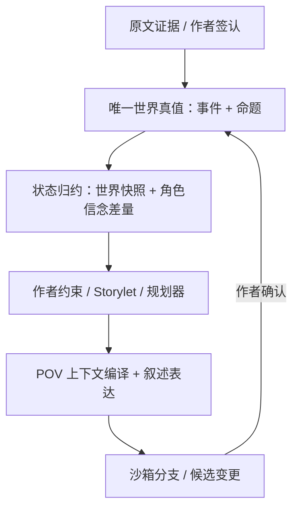

# Prompt 12｜互动叙事引擎与游戏叙事中间件的架构拆解

调研日期：2026-08-13  
适用目标：小说创作产品的事实账、人物状态账、角色知情账，以及“以任一角色视角重放／推演剧情”  

## 0. 先说结论

1. **articy:draft、Arcweave、Yarn Spinner、Ink 都没有原生的“角色 × 世界命题 × 知情立场 × 来源 × 时间”账本。**它们主要解决的是流程、内容、全局变量和“玩家是否走过某段内容”。`seen/visited` 不等于“某角色知道某事实”。
2. **四个中间件中，articy 最适合作为编辑与内容建模层；Yarn 的 Storylet/Saliency 最值得借鉴为运行时调度器；Ink 最适合作为文本执行 DSL。**它们都不适合成为你们的事实真源。
3. **商业 AI 叙事产品公开最多的是“上下文编译与记忆召回”，不是严格世界状态机。**AI Dungeon 的帮助中心公开到了摘要切片、向量查询和淘汰，2026 年又公布了重做后的三层编排；Character.AI 公开了 Facts、Story Memory、Lorebook 和提示词裁剪；彩云小梦没有公开应用层记忆算法；星野／Talkie 公开的是训练与评测管线，并把动态世界状态列为下一阶段。
4. **真正与你们高度同构的先例是 Curveship、Versu、Talk of the Town／Bad News、Elsinore、Sabre、HeadSpace。**共同模式是：唯一世界真值、角色私有信念、作者约束、读者状态、POV 表达彼此分离。
5. **作者意图与系统自由度不是一根二选一滑杆。**比较稳的结构是：作者给硬规则、已发生事实、必达锚点和偏序；角色只在其知情、目标和风险下选择合理行动；系统自由生成局部连接组织与表达。
6. **你们当前方向基本正确，不应退回“人物卡 + 全局布尔变量 + 向量库”的常见做法。**V1 最合适的是“共享事实真值 + 一层稀疏角色知情差量 + 来源链 + 只读 POV 编译 + 沙箱推演”。

### 证据标记

- **A｜强证据**：官方文档、官方源码、正式论文／同行评审论文。
- **B｜厂商自述**：官方博客、产品公告、官方案例；能说明厂商怎么描述自己，不能当独立性能验证。
- **C｜前沿信号**：预印本或早期原型；适合看方向，不宜直接抄成生产承诺。
- **未发现**：截至调研日，公开资料未证明；不等于内部一定没有。

## 1. 推荐的总架构：五层分离，而不是一棵万能剧情图



五层分别承担：

| 层 | 唯一职责 | 不该做什么 |
|---|---|---|
| 世界真值 | 记录发生过什么、什么命题成立、证据与有效期 | 不记录“某人以为如何” |
| 角色认知 | 记录谁观察、听说、推断、怀疑或误信什么 | 不反向篡改世界真值 |
| 作者意图 | 记录必须、偏好、避免的剧情锚点和偏序 | 不冒充已经发生 |
| 读者状态 | 记录已释放、明确误导和揭示位置 | 不等同于角色知情 |
| POV 投影 | 按角色可访问事实、信念、语气组织内容 | 不产生新的 Canon |

这一分层与 Curveship 的“Simulator / Narrator”隔离、2024 叙事规划综述对 plot / discourse / narration 的区分相符。[Curveship](https://aclanthology.org/W09-2008/)、[The Story So Far on Narrative Planning](https://ojs.aaai.org/index.php/ICAPS/article/view/31509)

---

## 2. 四个游戏叙事中间件的数据模型

### 2.1 总表

| 工具 | 核心模型 | 变量与条件 | 角色知识状态 | 大项目手段 | 对你们的最佳定位 |
|---|---|---|---|---|---|
| articy:draft X | 嵌套 Flow；Entity、Location、Asset；Template 自定义属性；对象引用 | 全局变量集、对象属性、Condition / Instruction、节点访问计数 | **未发现原生支持**；可用模板、引用或布尔变量搭建 | 分层 Flow、对象树、搜索、引用反查、多人 Partition | 编辑／建模前台与投影视图 |
| Arcweave | Board 上的 Element、Branch、Jumper；Component 与 Attribute | 全局／Board 变量、Arcscript、`visits()` | **未发现原生支持**；Component 可放静态关系，动态知情仍靠变量／外部引擎 | 多 Board、Folder、Jumper、扁平 JSON、搜索 | 轻量可视化编排与交换格式 |
| Yarn Spinner | `.yarn` 文本；Node、Line、Option、Command | 标量变量、条件、`visited()`、Node Group／Storylet、Saliency | **未发现原生支持**；连 Character 都不是领域对象 | 多文件项目、跨文件图、cluster、稳定 Line ID、编译检查 | Storylet 候选过滤与调度 |
| Ink | 文本 DSL；Knot、Stitch、Choice、Gather、Divert、Thread、LIST | 变量、LIST、条件、访问计数、外部函数 | 官方明确不是完整世界模型；可用 LIST 近似，完整知情账应外置 | `INCLUDE`、纯文本 Git、Profiler、运行时 JSON | 文本执行器／下游叙述 DSL |

### 2.2 articy:draft X

**数据模型。**articy 把项目组织成分层对象库，Flow、Entity、Location、Asset 是一等对象；Flow Fragment 和 Dialogue 又可继续嵌套，Dialogue Fragment 可以绑定 Speaker Entity。Template 允许为对象增加文本、数字、布尔、枚举、对象引用和脚本属性。[对象与 UI 层级](https://www.articy.com/help/UI_Overview.html)、[Flow](https://www.articy.com/help/Flow_WhatsThis.html)、[Dialogue](https://www.articy.com/help/Flow_Dialog.html)、[Template](https://www.articy.com/help/Templates_Templates.html)

**状态与条件。**articy:expresso 把判断和副作用区分为 Condition 与 Instruction；全局变量按 Variable Set 命名空间管理，脚本也可读写 Entity 的自定义属性。Flow Object 还有 `seen / unseen / seenCounter`。[Scripting](https://www.articy.com/help/adx/Scripting_in_articy.html)、[Conditions / Instructions](https://www.articy.com/help/Scripting_Conditions_Instructions.html)

**知识状态。**没有发现 `(character, proposition)`、belief、knowledge source 之类的一等对象。`seen` 只表示运行路径是否访问了 Flow Object，不表示哪个角色在何时通过何种来源获知一项命题。可以把 Fact 建成 Entity，再用引用连到 Character；也可以创建 `alice_knows_x`，但这只是自建模型。

**规模经验。**articy 靠嵌套 Flow、对象树、搜索、引用和多人 Partition 拆解项目；多人协作采用分区 Claim/Unclaim，而不是多人同时写同一分区。[Partitions](https://www.articy.com/help/ad3/MU_Partitions.html)、[多人项目](https://www.articy.com/help/MU_Overview.html) 官方案例中，《Disco Elysium》和《Broken Roads》都大量使用布尔变量并强调命名、分组和完整试玩成本，这也暴露了“每个回调一枚 Boolean”的扩张问题。[Disco Elysium 案例](https://www.articy.com/en/showcase/disco-elysium/)、[Broken Roads 案例](https://www.articy.com/en/showcase/broken_roads/)

**判断。**articy 最像“叙事 CMS + 可视化图编辑器”，值得借鉴稳定 ID、模板、引用反查和层级下钻；但让它直接承载长篇小说的知情账，会落入变量爆炸和多真源。

### 2.3 Arcweave

**数据模型。**项目由 Board、Element、Connection、Branch、Jumper、Component、Variable 组成。Component 可代表人物、地点、物品、线索、记忆等，并通过 Attribute 和 Component List 建静态引用；JSON 导出用 UUID 和扁平 ID 引用表示对象与连接。[Project Items](https://docs.arcweave.com/project-items/overview)、[Components](https://docs.arcweave.com/project-items/components)、[JSON](https://docs.arcweave.com/integrations/json)

**状态与条件。**变量支持 Boolean、String、Integer、Float；Board Variable 实质是带命名空间的项目级可访问变量。Arcscript 在 Element 与 Connection 中读写变量，Branch 依次执行条件；`visits(element)` 返回访问次数。[Variables](https://docs.arcweave.com/project-items/variables/overview)、[Branches](https://docs.arcweave.com/project-items/branches)

**知识状态。**没有角色级知情模型。官方把“Memories”列为 Component 的可能用途，只能说明它可承载一张静态卡片，不能证明运行时会维护角色信念。`visits()` 同样是路径状态，不是人物知情。官方教程还提醒：为每个动作或信息建全局变量会迅速失控。[Visits 教程](https://docs.arcweave.com/tutorials/basic/pt-19)

**规模经验。**官方推荐用多 Board 保持模块化，用 Jumper 跨 Board，用 Folder 分组；项目 Item 不限并不等于单 Board 可无代价容纳数千节点，官方另有 GPU renderer 与画布卡顿排查。[Boards](https://docs.arcweave.com/project-items/boards)、[Jumpers](https://docs.arcweave.com/project-items/jumpers)、[性能排查](https://docs.arcweave.com/project-tools/troubleshooting)

**判断。**适合参考“Board 分片 + Jumper + 扁平 UUID JSON”，不适合承担严格账本语义。

### 2.4 Yarn Spinner

**数据模型。**内容是 `.yarn` 文本文件；Node 由 Header 和 Body 组成，Body 包含台词、命令和选项。`CharacterName:` 只是说话者文本约定，并不存在 Character Entity。变量存储独立于脚本，可替换为游戏自己的持久层。[Lines, Nodes and Options](https://docs.yarnspinner.dev/write-yarn-scripts/scripting-fundamentals/lines-nodes-and-options)、[Custom Variable Storage](https://docs.yarnspinner.dev/components/variable-storage/custom-variable-storage)

**最有价值的机制：Storylet / Saliency。**同名 Node 可组成 Node Group，每个候选用 `when:` 声明资格条件，Saliency 再从合法候选中选择 First、Best、Least Recently Seen 等策略，也允许自定义。[Node Groups](https://docs.yarnspinner.dev/write-yarn-scripts/advanced-scripting/node-groups)、[Saliency](https://docs.yarnspinner.dev/write-yarn-scripts/advanced-scripting/saliency)

这正适合你们未来的调度层：

```text
eligible = 所有硬条件成立的剧情卡
selected = 在 eligible 中按锚点、紧迫度、相关性、重复惩罚评分
commit   = 只对最终选中的卡原子提交状态变化
```

条件求值必须是纯函数。Yarn 官方专门记录过一个坑：如果在 Saliency 评估候选时顺手修改状态，结果会依赖候选检查顺序，造成难复现错误。[Saliency and State Mutation](https://yarnspinner.dev/blog/saliency-and-state-mutation/)

**知识状态。**官方 Storylet 示例可以写 `$alice_knows_barry_is_cop`，但它仍是普通布尔变量，而非知识本体。更合理的接法是让 Yarn 调用外部 `knows(character_id, proposition_id)`，知情真源留在你们系统。

**规模经验。**多 `.yarn` 文件由项目文件收集，编辑器可显示跨文件图、cluster 与稳定 Line ID，适合 Git 和编译期检查；没有公开统一的最大节点基准。[Project Files](https://docs.yarnspinner.dev/3.1/write-yarn-scripts/yarn-spinner-editor/yarn-spinner-project-files)、[Yarn Spinner 3.2](https://yarnspinner.dev/blog/yarn-spinner-3-2-release/)

### 2.5 Ink

**数据模型。**Ink 是纯文本控制语言，不是对象数据库。结构单元包括 Knot、Stitch、Choice、Gather、Divert、Tunnel、Thread、Variable、Function、LIST；运行时编译成 JSON Container。[Writing with Ink](https://github.com/inkle/ink/blob/master/Documentation/WritingWithInk.md)、[Runtime JSON Format](https://github.com/inkle/ink/blob/master/Documentation/ink_JSON_runtime_format.md)

**状态与知识。**Knot / Stitch 自带访问计数，LIST 可以近似“已知事实集合”。但官方手册明确表示 Ink 不提供完整世界建模系统：对象、包含关系、门锁等都要由作者用状态机制或外部游戏系统搭建。[Writing with Ink：Advanced State Tracking](https://github.com/inkle/ink/blob/master/Documentation/WritingWithInk.md) 外部函数和游戏侧变量读写使 `knows(character, fact)` 易于接到自有数据库。[Running Your Ink](https://github.com/inkle/ink/blob/master/Documentation/RunningYourInk.md)

**规模经验。**`INCLUDE` 可拆文件，但不产生命名空间；大型项目必须自建全局命名规则。Ink 的优势是纯文本 diff、即时编译、自动汇流的 Weave 和 Profiler，而不是可视化事实管理。[Ink 1.0](https://www.inklestudios.com/2021/02/22/ink-version-1.html)、[Ink 官网](https://www.inklestudios.com/ink/)

### 2.6 数千节点的共同经验

四套工具没有可靠的“单画布放几千节点仍流畅”公开基准。共同答案不是更大的画布，而是：

- 层级／Board／文件分片，每个模块有明确责任；
- 全局稳定 ID 与跨模块引用，允许反查依赖；
- 只加载当前局部子图，概览使用压缩投影；
- 命名空间、静态检查、搜索、模拟运行与自动测试；
- 内容、状态、运行时保存和外部数据库之间必须规定唯一写权。

对你们而言，应避免“整部小说一张图”，改成“事件／场／线的局部投影 + 稳定跨区引用 + 按需编译”。

---

## 3. AI 互动叙事产品：公开到什么程度

### 3.1 证据总表

| 产品 | 公开的记忆结构 | 公开的召回细节 | 结构化世界状态 | 角色级知情权限 | 证据判断 |
|---|---|---|---|---|---|
| AI Dungeon | 近期正文、Story Summary、Memory Bank、Plot Essentials、Story Cards、Author’s Note | **有**：2026 当前三层为近期原文、Memory Bridge／Flashback、总摘要；帮助中心另披露六 action 切片、向量查询和最少使用淘汰 | AI Dungeon 本身没有移植 Voyage 的 health / quest / inventory game state | 未公开 | 算法级公开最充分，但新旧公开文档有口径差异 |
| Character.AI | Story Memory、Pinned Message、Facts、Persona、Lorebook、聊天历史 | 提示词拼装和裁剪公开；Facts 的抽取、冲突合并和召回算法未公开 | Lorebook 是共享 canon，不是动态状态机 | 未公开同一 Lorebook 内的角色级访问控制 | 产品结构清楚，后端检索不透明 |
| 彩云小梦 | 世界背景、人物词条、关系、续写与角色聊天 | 未找到官方算法披露 | 未证明 | 未证明 | 只能确认产品字段 |
| 星野／Talkie | 世界、故事、用户偏好；角色 Prompt 与对话历史 | 公开 100 轮评测、训练数据规划／检查管线；未公开在线记忆服务 | 官方把 Dynamic World State 列为下一阶段 Worldplay | 未证明 | 模型训练能力不等于状态机 |

### 3.2 AI Dungeon：最可复现的“上下文编译器”

AI Dungeon 官方说明的上下文由 AI Instructions、Plot Essentials、Author’s Note、触发的 Story Cards、Story Summary、Memory Bank 和尽量多的近期正文组成；每次生成前由服务端编译。[响应生成流程](https://help.aidungeon.com/faq/how-are-ai-responses-generated)

2026-02 的官方 Aura 更新宣布把 Auto-Summarization 与 Memory 重做成两个互不重叠的系统，当前高层编排是：

- **Recent History**：最近动作逐字进入上下文；
- **Memory Bridges & Flashbacks**：补齐近期正文与总摘要之间的空隙，并按最新几轮的相关性找回很久以前的高保真片段；
- **Story Summary**：直接吃原始故事文本，持续分块汇总大局；它只覆盖近期正文之前的轮次，避免同一内容重复占预算。

官方说旧系统把摘要和记忆绑在一起，造成信息重复、细节丢失和职责混乱。[Even MORE Aura：Redesigned Memory System](https://latitude.io/news/even-more-aura-for-everyone)

帮助中心仍披露了更底层、可复现的 Memory Bank 细节：

- 一条 Memory 是对六个过去 action 及相应 AI 回复的模型摘要；故事达到 12 个 action 后先摘要最早六个，此后每六个新增一条；
- Story Summary 约每 15 个 action 更新，负责全局方向；Memory Bank 负责局部细节；
- 每条 Memory 保存文本与 embedding；用最近一次 action 的 embedding 查询全部记忆，按相关性排名，取能塞进上下文预算的前几条；
- Bank 满后，删除使用最少的记忆，而非简单删除最老的；
- 历史早期正文若被修改，旧摘要不会完整自动重算，官方要求用户手动修 Story Summary。

以上均见官方的 [Memory System 技术说明](https://help.aidungeon.com/faq/the-memory-system)。其中“总摘要由 Memories 补齐”的旧描述与 2026 Aura 公告的“二者独立、摘要直接吃原文”并不完全一致；因此六 action 切片、最近 action 查询和最少使用淘汰可以视为官方披露过的底层实现，但不应在没有进一步文档时断言它们全部仍是 2026 新编排的最终在线口径。

最重要的边界也由官方写明：这套系统来自 Voyage，但 AI Dungeon 没有移植 Voyage 的 health、quest、inventory、level 等结构化 `game state`，因为 AI Dungeon 定位是协作叙事。换言之，AI Dungeon 的核心仍是**摘要 + 检索 + 上下文拼装**，不是严格事实账。

**值得借鉴：**常驻约束、全局摘要、近期原文、按需记忆四类信息分槽；让各层覆盖互斥时间段，减少重复；提供 Context Viewer 让作者看到本次模型到底吃到了什么。  
**不应照抄：**把 embedding 相关性当真值或可见权限；只用近期文本查询容易漏掉别名、长因果链、关系和旧伏笔；摘要会丢来源、时态与限定条件；历史编辑后的派生失效不完整。AI Dungeon 自己重做架构来消除“摘要与记忆互相踩脚”，正说明记忆层必须有清晰职责边界。

### 3.3 Character.AI：记忆产品化和提示词编排

Character.AI 的 Prompt Poet 公开了生产提示词的组成：角色、聊天类型、用户属性、实验、模态、Pinned Memories、Persona、对话历史等。它用 YAML + Jinja2 组成可命名片段，每段有裁剪优先级；旧消息可从旧到新裁剪，固定裁剪点用于提高前缀缓存命中率。[Prompt Design at Character.AI](https://blog.character.ai/prompt-design-at-character-ai/)

2026 年公开的记忆产品包含：

- **Story Memory**：用户手写的背景、关键事件和特殊时刻；
- **Pin to Memory**：把原始消息精确固定；
- **Facts**：自动抽取 Persona、当前 Character 和侧面人物的外貌、习惯、关系等，可编辑、禁用、删除或复制到新聊天；
- **Memory Usage**：显示 Facts、Story Memory、消息历史分别占用多少；手写和 pinned 内容受保护。

来源：[Smarter Memory for Smarter Chats](https://blog.character.ai/memory/)

2026-07-24 上线 beta 的 Lorebook 把世界知识拆成带关键词的条目，关键词出现时条目进入角色上下文；多个 Character 可以共享同一本 Lorebook。[Lorebook 公告](https://blog.character.ai/lorebook/)

**边界：**官方没有公开 Facts 的抽取模型、向量库、查询构造、排序、冲突合并和淘汰算法。Lorebook 的“多个角色共享同一 Canon”也不等于“每个角色有不同知情权限”；公开文档没有证明 A 能看、B 不能看的条目级策略。

**值得借鉴：**自动事实必须可见、可改、可禁用；让作者看到上下文预算；世界 lore 与聊天记忆分槽。  
**不应照抄：**让所有角色连接一套无权限共享 Lorebook，秘密会直接泄漏。

### 3.4 彩云小梦：只能确认产品字段，不能反推后台

官方产品页能确认：用户可定义世界背景、人物词条、人物关系，可续写并扮演角色聊天。[彩云小梦 App Store](https://apps.apple.com/cn/app/%E5%BD%A9%E4%BA%91%E5%B0%8F%E6%A2%A6/id1564619616)

截至调研日，未找到彩云官方技术博客、演讲或论文披露：如何抽取长期记忆、是否使用向量库、召回查询怎么构造、人物设定与动态剧情如何分离、历史冲突如何合并、是否存在角色级知情权限。彩云团队公开的 DCFormer 解决的是注意力头组合，不是小梦应用层的长期记忆架构，不能互相推断。[DCFormer 论文](https://proceedings.mlr.press/v235/xiao24d.html)、[官方开源实现](https://github.com/Caiyun-AI/DCFormer)

### 3.5 星野／Talkie：公开的是训练与评测，不是成熟在线世界状态

MiniMax 2026 技术报告明确说，这套工作来自三年的 Talkie／Xingye 角色扮演优化。其公开内容包括：

- 从超过百万 NPC / User Prompt 与关系设置中聚类、人工校验后采样；
- 每组设定做 100 轮 self-play，检查人物关系、代词归属、世界规则、重复、剧情停滞和替用户行动；
- 训练数据管线用动态 planning prompt、Reward Model、Best-of-N，每隔 M 轮由 LLM judge 检查并改写上下文衔接、剧情推进与人设一致性；
- User-side Planning Agent 判断剧情是否停滞，并从带因果关系的角色经历中取诱发事件或闪回；
- 在线偏好学习使用隐式信号、因果去噪和 RLHF。

来源：[MiniMax-M2-her 官方技术拆解](https://www.talkie-ai.com/blog/m2-role-play)（同内容亦见 [MiniMax 中文版](https://www.minimaxi.com/blog/minimax-m2-her)）。

这里必须区分：上述检查器和规划器位于 **Agentic Data Synthesis / 训练评测管线**；公开证据不足以证明每次星野在线回复都执行整套代理。更关键的是，官方在“下一步”中才提出从静态 prompt injection 走向 Dynamic World State，结构化实体、关系、因果链，追踪百轮／千轮变化和多角色协作。因此，当前能证明的是“模型怎样训练得更像角色”，不能证明已有成熟的在线状态账。

**值得借鉴：**与其定义唯一“好回答”，不如建立可判定的 misalignment 检查；做 20、50、100 轮长程测试；把指代混乱、物理空间错误、OOC、停滞、重复和越权列为独立指标。  
**不应照抄：**把模型长上下文能力当状态机能力；把训练时检查器写成在线系统已有能力。

---

## 4. 叙事状态机与 narrative planning：经典到最新

### 4.1 研究脉络

| 年份 | 方法 | 状态与控制模型 | 对你们的启示 |
|---|---|---|---|
| 2003 | Mimesis | 用户动作破坏计划时，先 `accommodation` 接受后重规划；必要时才 `intervention` 阻止／改写 | 默认局部重规划，世界硬规则才拦截；不能暗改结果。[论文](https://faculty.cc.gatech.edu/~riedl/pubs/riedl-young-aamas03.pdf) |
| 2005 | Façade | ABL 联合行为 → beat → drama manager；数千对白行为由高层 beat 编排 | 分层内容有效，但 authoring cost 极高。[论文](https://ojs.aaai.org/index.php/AIIDE/article/view/18722) |
| 2009 | Curveship | Simulator 修改世界，Narrator 只改变顺序、频次、速度、语言与 focalization | “同一事件、多 POV”的结构模板。[论文](https://aclanthology.org/W09-2008/) |
| 2009 | Authorial Leverage | 用规则复杂度、改动后的维护量、可支持分支数衡量作者杠杆 | 核心指标不是分支数，而是“改一处要修多少地方”。[论文](https://ojs.aaai.org/index.php/AIIDE/article/view/12377) |
| 2010 | IPOCL | 初始状态、目标、带前置／效果的动作 + 角色目标 `frame of commitment` | 防降智要检验行动能否由角色当时目标与因果解释。[JAIR](https://jair.org/index.php/jair/article/view/10669) |
| 2010 | State / trajectory constraints | 用必须经过的中间状态、偏序和 landmarks 约束轨迹，而非写死每一步 | 作者意图应表达为锚点，不绑死章节号。[论文](https://doi.org/10.1145/1869397.1869399) |
| 2015–17 | Talk of the Town / Dynamic Epistemic Logic | 世界真相与角色 mental model 分离；动作同时改变世界与角色信念 | 把观察、转述、误信、来源、时间做一等结构。[Talk of the Town](https://ojs.aaai.org/index.php/AIIDE/article/view/12825)、[Character Beliefs](https://ojs.aaai.org/index.php/AIIDE/article/view/12990) |
| 2021 | Sabre | 全知规划器达成作者目标，但每个角色动作必须符合其有限甚至错误的信念与意图；支持深层 ToM | 事件要带 observation rule；深层 ToM 只按需算。[论文](https://ojs.aaai.org/index.php/AIIDE/article/view/18896) |
| 2022 | HeadSpace | 角色可因错误信念尝试行动并失败 | 失败不等于降智；要在角色相信的世界里判断合理性。[论文](https://ojs.aaai.org/index.php/AIIDE/article/view/21961) |
| 2024 | 叙事规划综述 | 统一回顾 agents、objects、states、events；区分 plot、discourse、narration 和 trajectory goals | 角色知情与读者知情必须分账。[ICAPS 综述](https://ojs.aaai.org/index.php/ICAPS/article/view/31509) |
| 2024 | StoryVerse | 作者写 `abstract acts` 高层轮廓，LLM 规划器基于世界状态迭代生成／评审角色行动序列 | “高层锚点 + 局部生成”比全写死或全涌现更稳。[ACM / FDG](https://dl.acm.org/doi/10.1145/3649921.3656987) |
| 2024/25 | LLM 引导符号搜索 | LLM 提议多个下一步，符号规划器只从合法动作中选 | LLM 负责提议／排序，账本与规则负责准入。[论文](https://cs.uky.edu/~sgware/reading/papers/farrell2024large.pdf) |
| 2025 | DiriGent | 角色维护动态 beliefs、理想世界与 tension；导演通过改变处境而非直接命令角色实现作者意图 | “环境施压，不把角色变木偶”。[AIIDE](https://ojs.aaai.org/index.php/AIIDE/article/view/36841) |
| 2025 | Pareto planning | 同时衡量收益与风险，只允许位于 Pareto 前沿的角色行动 | 防降智要比较备选方案，不只是问“是否有一个目标”。[AIIDE](https://ojs.aaai.org/index.php/AIIDE/article/view/36837) |
| 2025 | WhatELSE / Drama Llama | 前者让作者编辑 pivot、outline、variants 的可能性空间；后者组合 Storylet 结构与 LLM 自然语言 trigger | 作者控制应作用于可能性边界与合法候选。[WhatELSE](https://dl.acm.org/doi/10.1145/3706598.3713363)、[Drama Llama，预印本](https://arxiv.org/html/2501.09099v1) |
| 2026 | NCP-Bench | 显式 `Fact Ledger + Narrative Commitments + Reference Trajectory`，逐轮审计 | 事实账与非可选承诺应显式、可自动检查。[预印本](https://arxiv.org/html/2608.08160v1) |
| 2026 | Magnet / Atlas | 多角色代理共享世界状态与演进目标；图式评估器比较各场世界状态找矛盾 | 生成与验证分离；但仍是新预印本。[预印本](https://arxiv.org/abs/2607.00918) |

NCP-Bench 是截至调研日非常新的预印本，不能当成稳定行业标准；但它的结果是强烈警报：其测试中最优模型 20 轮后仅 42% 轨迹存活，事实冲突出现在 40%–68% 的交互中。论文也承认当前只处理单线顺时叙事，闪回、并行 POV 和条件有效期仍待扩展。[NCP-Bench](https://arxiv.org/html/2608.08160v1)

2026 的 NarraBench 调查 78 个叙事 benchmark，指出 perspective 和 revelation 仍几乎没有成熟通用评测；你们必须自建 POV 测试集，而不是等待通用模型榜单回答这个问题。[NarraBench](https://aclanthology.org/2026.eacl-long.176/)

### 4.2 作者意图与系统自由度：推荐四级控制

| 控制级别 | 例子 | 执行语义 |
|---|---|---|
| 硬不变量 | 已发生事实、世界法则、不可逆死亡、作者锁定真相 | 任何候选违反即拒绝 |
| 必达承诺 | 必须揭示身份、两事件必须先后发生 | 允许局部绕路，但必须保持仍可满足 |
| 软锚点 | 节奏、情绪峰值、伏笔最佳期、倾向某角色行动 | 进入评分，不直接判非法 |
| 自由区 | 局部行动组织、衔接、措辞、细节 | 角色／LLM 可自由生成，之后审计 |

推荐顺序是：**接受选择并局部重规划 → 调整 NPC / 环境 / 信息释放 → 仅在硬规则破坏时拦截**。2025 的人类玩家／GM 研究还表明，感知到的结构与 agency 并非天然零和；真正破坏 agency 的往往是系统违背此前建立的因果预期。[Structure, Agency, and Improvisation](https://ojs.aaai.org/index.php/AIIDE/article/view/36827)

---

## 5. “同一事件、不同角色视角／知情差”的先例

### 5.1 先拆开三个常被混为 POV 的问题

1. **知觉访问**：角色当时能否看到、听到、被告知或推断该事件？
2. **信念解释**：角色把同一命题理解成什么，是否怀疑、误信或仍未决定？
3. **叙述表达**：从该角色出发，选择哪些事件、以什么顺序、速度、人称和语气呈现？

换第一／第三人称只解决第 3 项的一个表面维度，不是“角色视角模式”。

### 5.2 Curveship：同一事实，不同 focalization

Curveship 把世界模拟器和叙述器分开；只有模拟器改变事件世界，叙述器改变次序、频次、速度、语体和 focalizer。不同 focalizer 可以保有自己的 concept / world view。[论文](https://aclanthology.org/W09-2008/)

**适合抄：**V1 重放永远查询同一事件，不复制事实，不新造剧情。  
**限制：**它更偏叙述生成原型，不是成熟的大型协作编辑器。

### 5.3 Versu：角色位与具体人物分离，可换位重放

Versu 的 Social Practice 先定义 interviewer、interviewee、host、guest 等角色位与可做动作，再把具体人物分配进去；同一 job interview 可从应聘者、面试官甚至 DM 角度体验。实践只提供 affordance，由独立角色按 beliefs、desires 和 utility 选择行动。[Versu 论文](https://cs.uky.edu/~sgware/reading/papers/evans2014versu.pdf)、[官方工作原理汇总](https://versu.com/about/how-versu-works/)

它还做了重要工程取舍：共享权威世界状态，只有需要分歧的部分才存角色私有 belief。这是“共享真值 + 稀疏信念差量”的直接先例。

**适合抄：**场景角色位与人物实体分离；公共事实共享，秘密／误信做稀疏覆盖。  
**坑：**并发 Social Practice、数百 desire 和 utility 权重非常难调；完整深层信念会迅速膨胀。

### 5.4 Talk of the Town / Bad News：最完整的主观知识传播

Talk of the Town 为角色建立关于人物和地点的 mental model。belief facet 包含当前值、前任认知、证据、来源传播链、相信强度和与世界真值的准确关系；观察、转述、偷听、撒谎、误记、遗忘都可生成证据，信息通过实际人物互动传播，而不是向全世界广播。[知识系统论文](https://ojs.aaai.org/index.php/AIIDE/article/view/12825)、[完整章节](https://www.taylorfrancis.com/chapters/edit/10.1201/9780429055119-13/simulating-character-knowledge-phenomena-talk-town-james-ryan-michael-mateas)

Bad News 实际使用了这套模拟：真人演员切换扮演不同 NPC 时，界面只显示当前 NPC 的人生经历和主观知识。[Bad News](https://eis.ucsc.edu/papers/ryanEtAl_BadNewsCHI2016.pdf)

**适合抄：**来源、地点、时间、传播链、predecessor / supersession。  
**坑：**显著度、遗忘率、误记率、撒谎率、证据强度等参数很多，计算和调参成本高；自动“误记变异”不适合默认用于严肃小说账本。

### 5.5 Elsinore：手写场景，按角色精神状态调度

Elsinore 把场景内容手写，但能否发生由 temporal predicate logic 中的角色 mental state 与时间条件决定；玩家获得并传播 hearsay 会修改角色 beliefs / desires，从而改变后续可发生事件。[AIIDE 说明](https://cdn.aaai.org/ojs/12868/12868-52-16385-1-2-20201228.pdf)、[开发观察](https://emshort.blog/2019/07/30/elsinore-golden-glitch/)

**适合抄：**作者决定场景内容，系统只决定在什么状态下可发生；这比“LLM 自由生成全部剧情”更接近你们的目标。

### 5.6 Sabre / HeadSpace：按错误信念仍然合理地行动

Sabre 有一个全知规划器负责作者目标，但每个角色的动作必须按自己的有限、甚至错误的信念和意图可解释；动作有观察规则，观察者更新信念，未观察者不更新。[Sabre](https://ojs.aaai.org/index.php/AIIDE/article/view/18896)

HeadSpace 进一步允许角色因误解世界而尝试注定失败的动作。[HeadSpace](https://ojs.aaai.org/index.php/AIIDE/article/view/21961)

**对防降智的直接结论：**“结果失败”不能作为降智判据；应问“在他当时相信的世界里，这是不是服务其目标、且相对备选方案不明显更差的行动”。

### 5.7 固定多视角：The Invisible Hours

The Invisible Hours 把七名人物在同一时间轴中的行动同步运行，观众可以倒带、换人跟随，从别的空间位置观看同时发生的场景。制作时要统一约束房间、移动路径、步行时间和演出时长。[开发者复盘](https://www.gamedeveloper.com/design/game-design-deep-dive-creating-the-spherical-narrative-in-i-the-invisible-hours-i-)

它证明了统一时空轴上的多视角内容管理可行，但它是固定演出，不是动态 belief 系统；任何场景时间微调都会牵连其他线，显示了“每 POV 各写一套内容”的高维护成本。

---

## 6. 对照你们现有设计：哪些方向应保留

对照你们当前材料，以下方向不仅不该简化，反而构成差异化壁垒：

- 冻结书稿证据、作者签认、长期事实账、状态／知情账、计划账、执行包彼此分层；
- 已发生事实与未来计划分账，作者确认才转真；
- 表述事件与世界命题拆开：“张三说城主死了”只证明说话事件，不自动证明城主死亡；
- 故事内顺序、叙述释放顺序、系统修订时间三条时间轴分开；
- 人物页是事实账投影，不成为第二真源；
- 修改后，派生图自动重算，计划只告警，冻结原文永不自动改写；
- 角色视角 V1 只做防降智重放，且全程沙箱、永不写事实账。

外部系统普遍在这些位置缩水：用 `seen` 代替知情、用向量召回代替真值、用共享 lore 代替权限、用静态人物描述代替目标与信念。你们不应为了“兼容中间件”而向这些简化倒退。

### 6.1 建议直接拍板的读者知情口径

读者知情与角色知情分账。机器真账只记录两类有原文锚点的硬事件：

```text
READER_RELEASED(proposition_id, discourse_position, evidence_span)
READER_MISLED(proposition_id, misleading_assertion_id, evidence_span)
```

“读者大概能猜到多少”可以作为模型推断的 sidecar，必须带模型版本、置信度和可重算标记，不得进入真值层。反转、悬念和误导属于 discourse / reader state，而非世界事实或角色 belief。这个拍法与 2024 综述的 plot / discourse 区分一致。[ICAPS 综述](https://ojs.aaai.org/index.php/ICAPS/article/view/31509)

---

## 7. 推荐的数据模型

### 7.1 核心对象

| 对象 | 最小字段 | 说明 |
|---|---|---|
| `Proposition` | `id, predicate, arguments, world_status, valid_from, valid_to, authority, evidence_ids, revision` | 与具体说法分离的世界命题 |
| `CanonicalEvent` | `id, type, participants, roles, location, story_time, preconditions, effects, evidence_ids` | 唯一事件核心；不同 POV 不复制 |
| `Observation` | `id, event_id, observer_id, channel, perceived_payload, conditions, reliability, observed_at` | 看到、听到、偷听、被告知等感知记录 |
| `KnowledgeAssertion` | `holder_id, proposition_id, stance, polarity, source_id, acquired_at, valid_to, predecessor_id` | 稀疏角色信念边 |
| `AuthorConstraint` | `id, kind, priority, scope, partial_order, rationale, relaxability` | outcome / landmark / avoid；hard / soft |
| `ReaderState` | `proposition_id, released_at, misled_by, evidence_id` | 只记硬释放与硬误导 |
| `POVProjection` | `focalizer_id, cutoff, accessible_event_ids, belief_ids, withheld_ids, render_config` | 派生结果或缓存，不是真源 |
| `SandboxDelta` | `branch_id, base_revision, proposed_events, proposed_belief_updates, violations` | 推演结果；确认前不回写 |

### 7.2 知情状态的四轴，而不是一个枚举包打天下

前台仍可显示“知道／怀疑／相信／误信／不知道”；后台建议拆为：

| 轴 | 示例 |
|---|---|
| 角色立场 | `accepts / suspects / rejects / undecided` |
| 世界命题状态 | `true / false / unresolved / author_withheld` |
| 来源与通道 | `observed / told / overheard / inferred / fabricated / author_attestation` |
| 时间与版本 | `acquired_at / valid_from / valid_to / supersedes` |

`misbelief` 不是世界里的特殊事实，而是“角色立场与世界状态不一致”的派生关系。`accuracy` 也应从两层比较得出，不能成为第二真相。

“不知道”通常是稀疏边的缺失，不应给每个角色 × 每个事实都写一行；只有“角色明确意识到自己不知道”“覆盖范围内未找到”“作者未决定”“对读者隐藏”等具有业务意义的 unknown 才显式记录。

### 7.3 同一事件的多 POV 例子

```text
CanonicalEvent E17: A 在仓库把钥匙交给 B

Observation O1: A 直接参与，完整看见交付
Observation O2: C 在门外听见金属声，只知道“有人交接物品”
Observation O3: D 不在场；后来被 B 告知“钥匙是捡到的”

Belief(A, key_owner=B, knows, source=O1)
Belief(C, item_exchange=true, suspects, source=O2)
Belief(D, key_origin=found, believes, source=O3)   # 与世界真值冲突
```

POV 模式只对 E17、O1/O2/O3 和相应 belief 做不同查询与表达；绝不建立三份 E17。

---

## 8. 角色视角模式的落地方案

### 8.1 V1：防降智重放

输入：`角色 + 截止故事时间 + 场景／事件范围 + 是否允许作者私有说明`。

运行：

1. 从 Canon 快照取当时世界状态，但不直接全部暴露给角色；
2. 按位置、参与、观察规则、传播记录和作者例外，编译角色可访问的 Observation；
3. 归约出角色当时相信、怀疑、误信、尚未知的命题；
4. 取角色活跃目标、困境、性格权重和可选行动；
5. 让模型提出 2–4 个行动候选，并逐个声明“依赖的信念、服务的目标、承担的风险”；
6. 确定性校验器检查泄密、物理不可能、无信息路径、目标断裂和明显支配劣势；
7. 输出报告与创意选项，只写 `SandboxDelta`。

防降智判据建议是：

```text
legally_possible
AND epistemically_available
AND serves_active_goal
AND causally_explainable
AND not_obviously_dominated_by_known_alternative
```

这组合了 IPOCL 的目标解释、HeadSpace 的错误信念和 2025 Pareto planner 的备选风险比较。[IPOCL](https://jair.org/index.php/jair/article/view/10669)、[HeadSpace](https://ojs.aaai.org/index.php/AIIDE/article/view/21961)、[Pareto Planning](https://ojs.aaai.org/index.php/AIIDE/article/view/36837)

### 8.2 V2：创意推演

从某个 Canon revision fork：

- 硬不变量：世界规则、已发生事实、不可逆结果；
- 必达承诺：作者锁定的后续锚点和偏序；
- 自由区：角色局部行动、NPC 反应、环境变化、连接场景；
- 规划策略：先改变处境／信息／张力，让角色自己有理由走向锚点；
- 存档策略：分支始终保留 base revision 和完整 delta，作者逐项确认才可合并。

这更接近 StoryVerse 的 abstract acts、DiriGent 的环境施压和 Mimesis 的局部 accommodation，而不是全局自由角色模拟。[StoryVerse](https://dl.acm.org/doi/10.1145/3649921.3656987)、[DiriGent](https://ojs.aaai.org/index.php/AIIDE/article/view/36841)、[Mimesis](https://faculty.cc.gatech.edu/~riedl/pubs/riedl-young-aamas03.pdf)

### 8.3 暂不做

- 全局持久化任意深的 `A 相信 B 相信 C ...`；
- 为每个 POV 复制完整世界、事件或 plan library；
- 自动模拟普遍遗忘、误记和流言变异；
- 在数千节点上预计算所有分支；
- 让模型同时负责真值、知情、规划、表达和自我验收。

Sabre 可以表达深层 Theory of Mind，但 2025 的重复信念状态优化研究仍显示搜索昂贵；实际产品应以一阶信念为常态，仅在欺骗、合作、惊奇等局部场景按需计算二阶信念。[Sabre](https://ojs.aaai.org/index.php/AIIDE/article/view/18896)、[Duplicate States with Belief](https://ojs.aaai.org/index.php/AIIDE/article/view/36810)

---

## 9. 大型剧情的工程方案

### 9.1 存储与索引

- 真值用 append-only 事件／命题修订日志，定期生成故事时间快照；
- 知情用稀疏边表，不做稠密 `character × fact` 矩阵；
- 建 `by_entity`、`by_story_time`、`by_evidence`、`by_holder`、`by_proposition`、`dependency` 索引；
- 每次执行只编译局部子图：当前角色、场景、临近事件、活跃目标、相关 Hook；
- POV、摘要、向量索引和人物卡都是可丢弃的派生物，必须记录依赖 revision；
- 历史事件修改后按依赖图标脏重算，不能像 AI Dungeon 旧摘要那样依赖用户手修。[AI Dungeon 编辑限制](https://help.aidungeon.com/faq/the-memory-system)

### 9.2 编辑器

- 默认显示故事／线／场的层级概览，不显示全量边；
- 画布节点只是投影，稳定 ID 留在账本；
- 每个局部图设置责任范围、对象数告警和跨区引用；
- 提供“为什么角色可见／不可见”的 Explain 面板；
- 提供 POV Context Viewer：本次给模型的真值、信念、误信、被挡秘密、目标、硬约束、检索片段逐项可见；
- 每条自动事实、信念和摘要都可点回证据并被作者纠正。

### 9.3 编译与测试

至少建立以下自动检查：

1. 角色说出尚无获得路径的秘密；
2. 角色忘记已经确认获得且未失效的信息；
3. 错误信念在没有纠正事件时自动变真；
4. 同一角色同时接受互斥命题；
5. 角色在不可能的空间距离继续对话；
6. 角色在信息尚未于故事时间获得前使用它；
7. 叙述提前泄露只属于后续 discourse position 的内容；
8. 读者知情被错误写入某角色知情；
9. 修改原文后 POV 缓存、摘要或向量索引没有失效；
10. 候选条件求值期间修改状态；
11. 同一沙箱与种子无法重放；
12. 模型输出违反硬约束却被自动入账。

长程评测要覆盖 20、50、100 轮，并分开统计：事实冲突、身份／指代混淆、空间逻辑、知情泄漏、目标断裂、重复停滞、回复膨胀。星野／Talkie 的公开评测和 NCP-Bench 都说明单轮质量远远不够。[MiniMax-M2-her](https://www.talkie-ai.com/blog/m2-role-play)、[NCP-Bench](https://arxiv.org/html/2608.08160v1)

---

## 10. 借鉴清单

### 10.1 值得抄

| 来源 | 值得抄的设计 |
|---|---|
| articy | 稳定对象 ID、Template、引用反查、层级 Flow、多人分区 |
| Arcweave | Board 分片、Jumper、扁平 UUID JSON |
| Yarn | “合法候选过滤 → Saliency 选择 → 原子提交”；条件纯函数；编译期诊断 |
| Ink | 纯文本 DSL、自动汇流、访问历史、外部函数、可 diff |
| AI Dungeon | 常驻／摘要／近期／按需记忆分槽；Context Viewer |
| Character.AI | 自动 Facts 可见、可编辑、可禁用；Memory Usage；Lore 与会话记忆分开 |
| Curveship | 唯一世界模拟器与 POV 叙述器隔离 |
| Versu | 角色位与具体人物分离；共享真值 + 稀疏私有信念 |
| Talk of the Town | 证据来源、地点、时间、传播链、前任信念 |
| Elsinore | 手写场景 + 知情／时间条件调度 |
| IPOCL / Pareto | 用目标、因果和备选风险检查角色理性 |
| Planning / DiriGent | 作者给 landmarks，系统通过环境与 NPC 局部适配 |
| LLM-guided planning | LLM 只提议与排序，确定性层准入和验证 |

### 10.2 他们踩过、你们应避开的坑

| 坑 | 后果 | 规避 |
|---|---|---|
| 每个知识点一个 Boolean | 命名、迁移、调试、回溯迅速失控 | 稀疏 `KnowledgeAssertion` 关系表 |
| 用 `seen/visited` 兼任知情 | 混淆玩家路径、角色经历、角色得知和事实真值 | 四层分别建模 |
| 向量召回等于事实 | 相关不等于真实、可见或仍有效 | 检索只提证据候选，账本裁决 |
| 所有角色共享 Lorebook | 秘密泄漏、全知 NPC | 条目级 principal / visibility 过滤 |
| 摘要不随历史编辑失效 | 旧设定幽灵般回流 | revision 依赖与自动标脏重算 |
| 条件求值有副作用 | 候选检查顺序改变结果 | 纯条件 + 最终原子 commit |
| 为每个 POV 复制事件／计划 | 多份内容漂移、修改传播爆炸 | 单 Event + Observation + POV 投影 |
| 一张无限大画布 | 性能、认知负担和协作冲突 | 分层局部图 + 稳定引用 |
| 全量深层 ToM | 状态空间组合爆炸 | 一阶持久化；二阶局部按需 |
| 纯角色涌现 | 作者意图失控、故事停滞 | 硬不变量 + 必达承诺 + 软锚点 |
| 剧情经理硬命令角色 | 木偶感、动机断裂 | 优先改变环境、信息和张力 |
| 一个 LLM 包办全部 | 错误自证、事实静默漂移 | 生成、状态更新、验证、签认分离 |

---

## 11. 建议的产品排期

### P0｜V1 防降智重放

- 固化 `CanonicalEvent / Proposition / Observation / KnowledgeAssertion` 最小 Schema；
- 一阶稀疏知情边 + 作者例外；
- POV Context Viewer；
- 五类自动报告：知情泄漏、动机断裂、物理不可能、明显劣势行动、隐藏动机豁免；
- 全程沙箱、零 Canon 写入。

### P1｜读者状态与修改传播

- 只记硬 `released / misled`；
- 建依赖图，原文修改后自动标脏 POV、摘要、检索索引和人物投影；
- 建 20／50／100 轮回归集。

### P2｜Storylet 调度

- 硬条件过滤、软评分、近期重复惩罚；
- 纯条件、原子 commit、可解释选择；
- 作者 landmarks 和偏序进入调度器。

### P3｜创意推演

- 从 Canon revision fork；
- 角色目标／信念／风险驱动候选；
- 通过环境张力引导而非硬控角色；
- 二阶信念只在欺骗／合作场景局部展开；
- 作者逐项合并 delta。

## 最终判断

你们要做的不是“更大的 articy”或“给 Ink 加一个向量库”，而是一个**证据化、权限化、时间化的叙事状态内核**：

> 中间件负责编辑与执行；向量检索负责找候选证据；LLM 负责局部提议与表达；唯一事实账和角色知情账负责裁决；作者负责 Canon。

其中最小、最有价值、也最现实的切口就是：**共享事实真值 + 一层角色知情差量 + 观察／传播来源链 + 只读 POV 编译 + 沙箱推演**。

来源：ChatGPT
