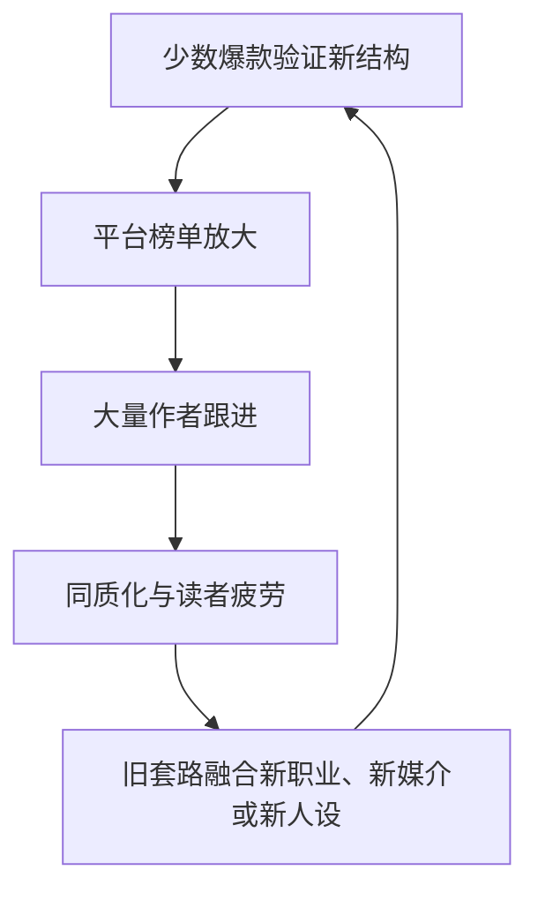

# 中文网文行业 2026 最新图景

**资料检索截至：2026 年 8 月 13 日。**

✅ 先说结论：

中文网文仍在增长，但已经不是“读者和作者一起高速增长”的单线市场，而是分成了三块：

- 免费阅读继续掌握最大流量，番茄是最强入口。
- 起点、晋江等付费平台用户总量未必增长，但核心付费用户和头部作品仍然很强。
- 真正增长最快的已经不是单纯文字订阅，而是短剧、AI 漫剧、动画、出海等 IP 转化。

对创作工具来说，最大的机会不是再做一个“AI 一键写小说”，而是帮助作者提高成书率、减少设定错误、适配不同平台、把小说转成短剧/漫剧可用的结构资产。

------

## 一、市场规模与平台格局

### 1. 行业大盘

| 指标             | 2025 年底数据    | 同比             | 数据时点与口径                     |
| ---------------- | ---------------- | ---------------- | ---------------------------------- |
| 网络文学阅读市场 | **502.1 亿元**   | +16.6%           | 2025 年全年                        |
| 网文 IP 改编市场 | **3676.1 亿元**  | +23.13%          | 含影视、短剧、动漫、游戏、衍生品等 |
| 网络文学用户     | **5.26 亿**      | 未披露同口径增速 | CNNIC 使用口径                     |
| 网络文学作者     | **3269.4 万**    | 新增149.6万      | 累计创作者口径，不是签约作者       |
| 网络文学作品     | **4583.7 万部**  | 新增418.6万      | 累计作品口径                       |
| 微短剧市场       | **超过1000亿元** | 超过+110%        | 2025 年                            |
| AI 漫剧市场      | **189.8亿元**    | 新兴市场         | 2025 年                            |

来源：[人民日报：2025年网络文学阅读市场规模502.1亿元](https://paper.people.com.cn/rmrb/pc/content/202604/14/content_30150931.html)、[《2025中国网络文学发展研究报告》](https://www.cssn.cn/skgz/bwyc/202604/t20260420_5981165.shtml)、[光明日报：网络文学走向多样性繁荣](https://epaper.gmw.cn/gmrb/html/content/202604/20/content_11568.html)。

⚠️ 这里有一个数据冲突：

- 《2024中国网络文学蓝皮书》称2024年网文用户5.75亿。
- 《2025中国网络文学发展研究报告》称2025年网文用户5.26亿。

这不适合直接解读成用户减少4900万，更可能是调查样本、网文定义或统计方法发生变化。2024年另有“行业月活约1.36亿”的数据，说明“过去一年读过网文的人”和“每月真实活跃用户”完全不是一个概念。[国家新闻出版署：2024中国网络文学蓝皮书](https://www.nppa.gov.cn/xxfb/ywdt/202506/t20250619_900890.html)

### 2. 平台位置

| 平台           | 2025—2026 可核实数据                                         | 商业位置                           |
| -------------- | ------------------------------------------------------------ | ---------------------------------- |
| 起点/阅文      | 2025年平均月活1.378亿，其中自有平台1.041亿；平均月付费用户900万；付费用户月均收入32.9元 | 男频精品付费、IP开发中心           |
| 番茄小说       | 截至2024年12月签约作者超过60万；超过50万作者获得过收入       | 免费阅读最大创作入口，流量驱动明显 |
| 晋江文学城     | 2025—2026未见官方更新月活、签约作者总量                      | 女频、言情、纯爱及高黏性付费社区   |
| 七猫/奇妙/纵横 | 没有可靠的2025—2026月活和签约作者总量披露；2025年1月有329名原创作者月收入过万 | 免费阅读＋保底/分成＋纵横订阅混合  |
| 知乎盐言       | 没有单独披露网文用户和作者规模                               | 中短篇故事、悬疑、治愈、民俗志怪   |
| 飞卢           | 缺少公开可审计经营数据                                       | 高频更新、小众题材、高付费强度     |

阅文数据来源于其[2025年年度业绩公告](https://www.prnewswire.com/apac/zh/news-releases/2025-302715775.html)。番茄数据来源于[2024年底创作者大会](https://www.chinawriter.com.cn/n1/2024/1213/c404023-40381590.html)。七猫月度数据来自[七猫官方稿费公告](https://www.qimao.com/gonggao/67a707b587cbf96400391711/)。

我没有采用网上流传的“番茄月活2.6亿”“晋江付费率30%—50%”等数字，因为没有找到可核验的官方财报、QuestMobile原始报告或统计说明。

### 3. 免费与付费的真实关系

免费阅读没有消灭付费阅读，更像是形成两套生意：

- 免费平台靠广告收入、推荐流量和大规模内容供给。
- 起点等付费平台靠少数高黏性读者、头部作品和IP价值。
- 免费流量适合迅速测试题材；付费平台更依赖持续追订、口碑和作者品牌。

阅文2025年平均月付费用户由910万微降至900万，但付费用户月均收入由32元升至32.9元；自有平台月活基本持平。总月活下降主要来自腾讯渠道中免费阅读用户从6280万降到3370万，而不是起点核心读者大规模流失。[阅文2025年业绩公告](https://www.prnewswire.com/apac/zh/news-releases/2025-302715775.html)

这说明：

> 免费流量更大，但精品付费并没有被免费模式替代；付费市场正在变得更集中、更头部化。

------

## 二、作者生态：人很多，稳定挣钱的人极少

### 1. 平台公布的作者漏斗

番茄是目前少数披露了较完整收入分层的平台。截至2024年10—12月：

- 签约作者超过60万。
- 超过50万作者获得过收入。
- 过去12个月年收入超过3万元：9374人。
- 年收入超过10万元：3228人。
- LV5以上作者：2900余人。
- “金番”作者：39人。

据此粗算：

| 收入门槛       | 占60万签约作者比例 |
| -------------- | ------------------ |
| 年入3万元以上  | 约1.56%            |
| 年入10万元以上 | 约0.54%            |
| 金番作者       | 约0.0065%          |

来源：[中国作家网：番茄小说创作者大会](https://www.chinawriter.com.cn/n1/2024/1213/c404023-40381590.html)。

🔥 这组数字比“全国3269万作者”更能描述新人处境。说白了就是：能签约不等于能赚钱，获得过收入也不等于能靠它生活。

### 2. 阅文的公开数据也主要集中在头部

阅文2025年披露：

- 新增入驻作家40万。
- 新增小说超过80万部。
- 新增文本420亿字。
- 新签约作者中95后占70%。
- 年入百万元的00后作者人数同比增长150%。
- 起点新增均订超过10万的作品同比增长40%。
- 首次出现两部全平台均订突破30万的作品。

来源：[阅文集团2025年业绩公告](https://www.prnewswire.com/apac/zh/news-releases/2025-302715775.html)。

⚠️ “年入百万00后作者增长150%”没有公布绝对人数。它能说明年轻头部作者在增加，不能说明新人平均收入明显改善。

### 3. 全职与兼职

目前没有找到覆盖全行业、方法透明的2025—2026“全职/兼职比例”调查。

现有证据只能说明兼职是主体：

- 阅文兼职作者职业前五位是IT互联网、在校大学生、电商新零售、商业门市、金融。
- 另有470余名科研人员、3100余名高校教师、6100余名外卖骑手、4000余名司机在阅文创作。

来源：[央广网：2025中国网络文学发展研究报告](https://tech.cnr.cn/techph/20260414/t20260414_527584382.shtml)、[光明日报](https://epaper.gmw.cn/gmrb/html/content/202604/20/content_11568.html)。

所以更准确的说法是：

> 网文是一个“海量兼职尝试者＋少量稳定职业作者＋极少数明星作者”的金字塔市场。

### 4. 新人的真实生存状态

2025—2026公开材料反复出现的困难包括：

- 起量高度依赖推荐系统，首秀或测试期失败后很难恢复。
- 免费平台收入跟读完率、留存、广告价值联动，波动非常大。
- 为获得全勤奖励，需要稳定日更4000字左右。
- 热门题材周期越来越短，跟风作品容易在上线时已经过时。
- AI批量内容增加供给后，普通新人面对的竞争数量更大。

七猫2025福利要求多数全勤档位满足日更不低于4000字，并根据千字收入和留存数据分档；每月最高统计20万字。[七猫2025作者福利](https://www.qimao.com/fuli/)

番茄则在2025年投入2亿元扶持，其中1亿元升级作者福利，另1亿元扶持精品现实、历史、科幻作品。但这属于扶持资金，不等于普通作者收入普遍上涨。[新华网](https://www.news.cn/tech/20241212/7a3a29fb2cca4c4c96f7d7b71a6f9579/c.html)

------

## 三、AI 对行业的实际冲击

### 1. 监管已经从“倡议”变成强制标识

《人工智能生成合成内容标识办法》于2025年9月1日起实施，覆盖AI生成的文本、图片、音频、视频和虚拟场景，要求服务提供者添加显式和隐式标识，并禁止恶意删除、篡改或隐藏标识。[国家网信办原文](https://www.cac.gov.cn/2025-03/14/c_1743654684782215.htm)

但它不等于“作者只要用AI想过大纲，正文就必须标AI”。实际责任还取决于：

- AI是否直接生成了对外发布内容；
- 平台是不是AI生成服务提供者或内容传播平台；
- 作者是否直接复制、加工或发布生成内容；
- 各平台自己的签约与内容规则。

### 2. 平台政策明显趋于保守

2026年公开报告总结称，阅文、晋江、番茄等主流平台原则上允许AI辅助梳理大纲，但禁止AI直接代写段落。[科技日报](https://www.stdaily.com/web/gdxw/2026-04/15/content_502678.html)

其中晋江的规则最清楚：

- 文字辅助：允许校对和有限润色，不能由AI添加叙事情节。
- 创意辅助：允许起名、梗概汇总，不允许生成完整细纲。
- 暂不准备在作者创作端引入AI工具。

来源：[中新网《AI搅浑网文圈》](https://www.chinanews.com/cul/2026/03-09/10584016.shtml)。

番茄的情况比较矛盾：

- 平台向作者提供过起名、大纲、扩写、续写等AI工具。
- 2025年曾因AI训练补充协议引发作者争议，后来提供解除条款通道。
- 国家AI标识办法实施后，平台开始要求作者标识AI生成内容。

所以现在不是“平台全面拥抱AI写文”，而是“平台想利用AI提高供给和IP改编效率，同时又怕AI正文污染内容池”。

### 3. AI普及率：没有可信的全国数字

截至2026年8月，我没有找到以下任何一种合格调查：

- 有明确样本量和抽样方法的网文作者AI使用率；
- 区分“起名/查资料/大纲”和“直接生成正文”的调查；
- 能覆盖番茄、起点、晋江等不同作者群体的横向调查。

因此不能负责任地说“已有多少百分比作者使用AI”。

能确认的是：

- AI辅助或全文生成作品已经大量出现，平台编辑审核压力上升。
- 检测标准仍然模糊，AI文本检测并不能稳定证明创作过程。
- 作者更愿意接受总结、查资料、起名、回顾前情等辅助。
- 作者和读者对纯AI正文仍普遍抱有“套路旧、情绪假、像预制菜”的负面评价。

来源：[中国作家网：AI对网络文学的冲击现状与对策](https://www.chinawriter.com.cn/n1/2025/0905/c404027-40557712.html)、[中新网访谈](https://www.chinanews.com/cul/2026/03-09/10584016.shtml)。

### 4. AI真正产生收入的地方不一定是正文

2025年AI在网文产业中最明确的商业成果集中在下游：

- 起点国际累计AI翻译作品超过1.7万部，相关收入同比增长39%。
- 阅文2025年下半年上线近千部AI漫剧。
- 其中超过100部播放量破千万，12部破亿。
- 2025年下半年AI漫剧收入超过1亿元。

来源：[科技日报](https://www.stdaily.com/web/gdxw/2026-04/15/content_502678.html)、[阅文2025年业绩公告](https://www.prnewswire.com/apac/zh/news-releases/2025-302715775.html)。

🔥 这对你的产品很重要：AI最先跑通的不是“替作者写出好小说”，而是翻译、内容理解、资产拆解和IP可视化。

------

## 四、内容趋势与短剧影响

### 1. 2025年的核心不是某一个题材统治，而是题材继续细分

《2025中国网络文学发展研究报告》给出的方向包括：

- 现实题材与传统文化题材继续增长。
- 晋江年度题材覆盖现实、古典、幻想、玄奇、科幻。
- 知乎盐言继续加码推理、治愈、民俗志怪。
- 起点的玄幻、仙侠、诡秘式世界构建仍然强势。
- 年代文、职业文、知识型写作继续扩大。
- 单纯“换皮升级打怪”竞争力下降，人物复杂度和现实感上升。

来源：[光明日报](https://epaper.gmw.cn/gmrb/html/content/202604/20/content_11568.html)、[2024中国网络文学蓝皮书](https://www.nppa.gov.cn/xxfb/ywdt/202506/t20250619_900890.html)。

平台榜单里可以观察到的热门元素还有：

- 男频：高概念世界观、规则怪谈、幕后流、群像、经营建设、职业知识。
- 女频：年代生活、先婚后爱、家庭关系、女性成长、治愈、悬疑言情。
- 中短篇：民俗志怪、反转悬疑、情绪冲突、高概念设定。
- IP方向：容易视觉化、人物关系清楚、开场冲突快、可拆成连续钩子的作品更受关注。

但这些属于榜单归纳，不是平台公布的全量题材占比，不能写成精确市场份额。

### 2. 题材周期越来越短

2026年作者访谈中提到，“废柴退婚流”已经从热门模板变成容易被读者嘲笑的旧套路，“圣母型主角”也明显让位于更主动、更利己或边界感更强的主角。[中新网](https://www.chinanews.com/cul/2026/03-09/10584016.shtml)

题材周期现在大致表现为：

真正能持续的往往不是某个题材名称，而是更底层的阅读需求，例如：

- 地位提升；
- 信息差反杀；
- 关系确定；
- 生存掌控；
- 经营积累；
- 身份揭晓；
- 情绪补偿。

### 3. 短剧正在反向改变小说写法

2025年：

- 微短剧用户超过8.5亿。
- 市场规模首次突破1000亿元。
- 阅文上线短剧超过120部，全网播放约500亿。
- 阅文开放2000余部IP供短剧行业开发。
- AI漫剧市场达到189.8亿元。

来源：[新华社：IP改编市场突破3600亿元](https://www.news.cn/culture/20260414/1be78a33265546d0bc7190741c0195f4/c.html)、[阅文2025年业绩](https://www.prnewswire.com/apac/zh/news-releases/2025-302715775.html)。

它对写作产生了几个实际影响：

- 开头更强调30秒内出现人物目标或冲突。
- 每章更像一个可独立拆分的情节单元。
- 人物关系、身份反差和视觉动作权重上升。
- 纯内心独白、复杂世界说明和慢热铺垫更难直接改编。
- 平台会更重视作品有没有短剧、漫剧、动画的可视化潜力。

⚠️ 但“作者大量转行当短剧编剧”暂时缺少可靠的行业比例。可以确认的是网文作者正在尝试短故事、短剧本和漫剧脚本，但不能据此推断长篇网文会被替代。

------

## 五、网文写作工具市场

### 1. 市场已经分成四类

| 类型            | 代表产品                                         | 典型能力                               |
| --------------- | ------------------------------------------------ | -------------------------------------- |
| 平台内工具      | 番茄作家助手、作家助手、晋江写作端、七猫作家助手 | 码字、发布、收益、数据、签约           |
| 通用AI写作      | 笔灵、秘塔、Kimi、豆包等                         | 起名、大纲、续写、润色、去AI味         |
| 小说工程工具    | Novelcrafter、Sudowrite、Campfire、Plottr        | 人物设定、世界观、长篇上下文、章节管理 |
| 小说转视频/漫剧 | 蛙蛙写作及大量AI漫剧工具                         | 拆书、剧本化、分镜、角色、配音、视频   |

国内产品越来越喜欢把“小说—剧本—漫剧—投稿”放进一套工具里；海外产品则更强调长篇小说管理、故事圣经和可选择模型。

### 2. 价格带正在两极化

| 产品         | 2026公开价格                                     | 模式                          |
| ------------ | ------------------------------------------------ | ----------------------------- |
| 笔灵         | 终身VIP促销199元，含50万AI字数                   | 低价终身会员＋字数            |
| Novelcrafter | 4/8/14/20美元每月                                | 软件订阅；AI档位通常需自备API |
| Sudowrite    | 约19/29/59美元每月                               | 订阅＋AI积分                  |
| 蛙蛙写作     | 海外App Store显示约60—200美元/年分层，另有无限卡 | 会员＋无限生成档位            |

来源：[笔灵官网](https://ibiling.cn/)、[Novelcrafter官方定价](https://www.novelcrafter.com/pricing)、[Sudowrite](https://sudowrite.com/)、[蛙蛙写作App Store](https://apps.apple.com/us/app/蛙蛙写作/id6758374411)。

国内低价工具已经出现明显的“功能堆叠＋终身会员”竞争，甚至把“去AI味”“降低AI率”作为卖点。海外成熟小说工具仍维持每月约4—60美元的价格带。

### 3. 融资、倒闭情况

公开搜索没有发现2025—2026国内“专门面向网文作者的AI写作工具”披露具有代表性的新融资，也没有可信的行业倒闭清单。

这不代表没有产品关闭，而是这个市场存在几个特点：

- 很多产品由小团队运营，不公开公司经营数据。
- 产品停更、换域名或转向短剧，不一定发布关停公告。
- 大量产品只是调用通用模型的轻应用，存活状态很难核实。
- 融资热点已经从单纯AI写文移向AI视频、漫剧和内容工作流。

Novelcrafter明确表示自己没有风险投资，由独立创作者运营。[Novelcrafter官网](https://www.novelcrafter.com/)

------

## 六、对“故事真源引擎”的商业判断

✅ 这轮数据反而加强了你现在“不替作者代写正文”的定位。

最有价值的产品位置不是：

> 帮用户每天生成更多AI正文。

而是：

> 帮作者把自己的故事管清楚、写稳定、适配平台，并把结构资产安全送往短剧、漫剧、翻译和其他下游。

对应到功能优先级，我会这样排：

1. **长篇一致性和故事记忆**
   这是通用聊天模型和一键写作工具最容易失控的地方。
2. **大纲、事实和正文明确分账**
   正好适应平台“允许辅助规划、不允许直接代写段落”的政策方向。
3. **平台适配检查**
   同一个故事分别检查番茄首秀、起点追订、晋江文案与情感结构、短剧钩子。
4. **IP资产化输出**
   从事实账自动生成角色锚点、地点、关系、场景卡和防穿帮约束，供漫剧和短剧生产使用。
5. **创作证据与版本记录**
   保留作者自己的输入、修改轨迹、正文版本和AI只参与规划的记录。它未必能直接推翻平台检测，但能在争议时提供更完整的创作过程证据。

🔥 最大的商业机会不是争夺那3269万“注册过或写过东西的人”，而是服务其中愿意持续完成一部长篇、正在承受日更压力、又不想把创作控制权交给AI的作者。这个人群比全行业作者数小得多，但痛点更真实，付费意愿也更可能成立。

来源：ChatGPT