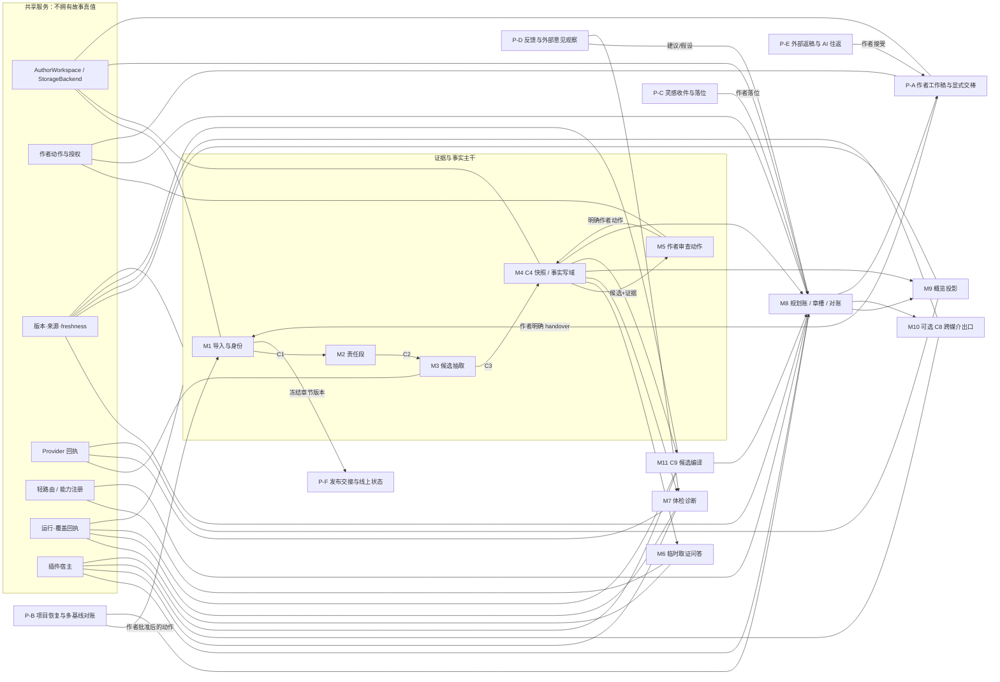

# M1～M11 主干与新增可插拔能力候选架构

> 身份：`ADVISORY_ONLY`  
> 适用材料：review ZIP 内 `01_current_truth/`、`02_current_route/`、`03_upstream_evidence/`  
> 不产生：正式合同、R13、代码、Gold、训练、API／模型费用、生产、上传、作者真值或模块完成结论。

材料核对：`SHA256SUMS` 列出的 126 个成员已逐项对平；`_route/SECRET_SCAN.json` 记录扫描通过、命中 0。该核对只说明 review 包运输完整，不证明其中任何模块完成。

## 执行摘要

✅ **建议保留 M1～M11 的模块身份，不合并、不续编号。** 但要把“主干”读成一组围绕作者创作循环协作的核心能力，而不是一条每次都必须从 M1 串到 M11 的流水线。当前代码与测试只证明每个模块至少有一个可独立运行的薄切片；事实分支和 M8→M10 两次交接只证明对象／文件形状能接力，不证明统一编排平台、产品端到端或生产可用。证据：`01_current_truth/TEMP/t03_total_control_hub_20260818_r01/CURRENT_CONTROLLER_BRIEF.md`、`01_current_truth/TEMP/t03_pro_module_expansion_architecture_design_20260819_r01/MODULE_CAPABILITY_MAP.md`、`02_current_route/novel-mvp/mvp/fact_handoff_adapter.py`、`03_upstream_evidence/TEMP/f_m8_m10_workspace_file_handoff_20260819_r01/README.md`。

建议的拓扑读法：

- **证据与事实主干**：M1 → M2 → M3 → M4 ↔ M5；
- **只读核对支路**：M4 → M6 / M7；
- **规划主干**：M4、计划账与 M11 → M8；
- **作者可见投影支路**：M4 / M8 → M9；
- **可选跨媒介出口**：M8 章槽 → M10；
- **需要新增的创作回路缺口**：M8 → 作者工作稿与显式交棒管线 → C11/C1 → M2；
- **共享底座**：AuthorWorkspace/StorageBackend、版本与来源原语、作者动作授权、provider 回执、轻路由、运行覆盖回执、插件宿主。

M9 应继续是核心读侧模块；M10 保留现有模块名与出口合同候选，但不列为作者主循环必经站；M11 保持领域模块，不能因为它“打包上下文”就下放成通用服务。R13 明确区分计划、已发生事实、工作书稿、作者签字、查询结果、投影和 AI 推断，且投影纠错进入真值必须再经作者确认。证据：`01_current_truth/references/shared-context/NOVEL_ARCH_SHARED_CONTEXT_CORE_MATERIALS_20260814_R13/01_PRODUCT_NORTH_STAR.md`、`01_current_truth/references/shared-context/NOVEL_ARCH_SHARED_CONTEXT_CORE_MATERIALS_20260814_R13/02_SYSTEM_ARCHITECTURE_AND_TRUTH_LAYERS.md`、`01_current_truth/references/shared-context/NOVEL_ARCH_SHARED_CONTEXT_CORE_MATERIALS_20260814_R13/03_CREATION_AND_MEMORY_PIPELINES.md`。

### 结论分级

| 结论 | 建议 |
|---|---|
| M1～M11 是否合理 | 合理，保持模块身份；主干改读为“图”，不是强制串行链。 |
| 是否合并模块 | 不合并。M4/M5、M6/M7、M8/M11、M9/M5 的权力、生命周期和失败边界都不同。 |
| 是否新增 M12/M13 | 不建议。新增能力用具名独立管线、旁挂组件或共享服务表示。 |
| 最优先新增独立管线 | 作者工作稿与显式交棒。它补齐作者自己写完之后如何安全回到 C11/C1。 |
| 最优先共享件 | 作者动作授权、版本／来源／freshness 原语、运行／覆盖回执。 |
| 是否建设 workflow engine | 不建议。当前两次交接只够支持薄 adapter 和显式批次，不支持通用编排平台。 |

## 1. M1～M11 主干审查

### 1.1 总体判定：保留模块，调整拓扑

现有模块拆分遵守“模块之间只认合同”的方向，且多数模块已显露独立输入输出、版本门、失败关闭与替换面。当前最危险的做法不是“模块太多”，而是把独立权力边界为了省文件而合并：M4 与 M5 合并会让事实写域吞掉作者授权；M6 与 M7 合并会混淆临时问答与批量诊断；M8 与 M11 合并会在 C9 语义仍开放时锁死材料编译；M9 并入 M5 会让可重建投影和作者动作共用一个生命周期。证据：`02_current_route/novel-mvp/ARCHITECTURE.md`、`01_current_truth/TEMP/t03_pro_module_expansion_architecture_design_20260819_r01/MODULE_CAPABILITY_MAP.md`、`01_current_truth/TEMP/t03_total_control_hub_20260818_r01/CURRENT_CONTROLLER_BRIEF.md`。

M10 只做拓扑降级，不做模块降级：它仍是 M1～M11 能力族中的正式候选出口，但不应出现在“作者必须经过”的核心环上。迁移代价低到中：更新架构图、端到端过门条件和文档措辞；现有适配器、原型输出和测试不用改名。若把 M10 改成共享服务，反而要重写 C8 领域语义、资产绑定和消费者合同，代价更高。证据：`03_upstream_evidence/TEMP/f_m8_m10_workspace_file_handoff_20260819_r01/README.md`、`02_current_route/novel-mvp/mvp/m10_scene_slice_adapter.py`、`01_current_truth/references/shared-context/NOVEL_ARCH_SHARED_CONTEXT_CORE_MATERIALS_20260814_R13/02_SYSTEM_ARCHITECTURE_AND_TRUTH_LAYERS.md` 的视频投影边界。

M11 不下放共享服务。它拥有 actuality 分类、HARD 保底、硬预算、遗漏与 unresolved 停机，这些是故事任务语义，不是基础设施。可共享的是 token 估算、检索连接器、provider、版本和回执；C9 编译器仍归 M11。证据：`02_current_route/novel-mvp/mvp/packer.py`、`01_current_truth/TEMP/t03_total_control_hub_20260818_r01/CURRENT_CONTROLLER_BRIEF.md`。

### M1｜把作者交来的材料安全收进项目
| 项目 | 审查结论 |
|---|---|
| 人话职责 | 把作者交来的材料安全收进项目，分清材料身份、来源与章节版本；只有合格章节才能进入后续正线。 |
| 当前最清晰输入 → 输出 | 上传字节／纯文本／显式材料身份 → C10 身份对象、不可变原始对象、合格 C1 章节对象。 |
| 保留在主干的理由 | 它拥有独立的“外部材料进入项目”生命周期和最高损失风险。格式、容器、编码、材料身份、版本门与租户边界都必须在 M2 前失败关闭，不能塞进切窗器或存储后端。 |
| 当前已有最小切片 | TXT、MD、DOCX、ZIP 的纯内存上传对象入口；C10-first 身份门；Confirmed Chapter 才生成 C1；原始上传可写为 AuthorWorkspace 不可变对象。 |
| 仍然缺什么 | 复杂混合材料自动六架分诊、20／80 章分层快启、解释与作者改判界面、表格类材料、首次导入完整接入 C11 current revision 的现役迁移。 |
| 不该继续塞进它的需求 | 不要继续塞外部返稿比对、发布状态、长断更恢复、云存储实现、事实抽取或作者确认事实。它们分别属于新增管线、共享服务、M3/M5。 |
| 包内证据 | `01_current_truth/TEMP/t03_pro_module_expansion_architecture_design_20260819_r01/MODULE_CAPABILITY_MAP.md`；`02_current_route/novel-mvp/mvp/upload_source.py`；`02_current_route/novel-mvp/mvp/input_router.py`；`02_current_route/novel-mvp/mvp/ingest_workspace.py`；`02_current_route/tests/test_novel_mvp_upload_source.py`；`02_current_route/tests/test_novel_mvp_ingest_workspace.py`；`02_current_route/novel-mvp/contracts/C10_INTAKE_MATERIAL_IDENTITY.md`；`02_current_route/novel-mvp/contracts/C11_CHAPTER_REVISION_LEDGER.md`。 |

### M2｜把当前章节逐字切成责任明确、可回拼、带只读前后文的责任段。
| 项目 | 审查结论 |
|---|---|
| 人话职责 | 把当前章节逐字切成责任明确、可回拼、带只读前后文的责任段。 |
| 当前最清晰输入 → 输出 | current C1 v1 → C2 v1 责任段批次与输入／输出回执。 |
| 保留在主干的理由 | 切段是确定性数据变换，拥有独立版本门、批次原子性与回拼失败边界。它可在不触碰模型和事实语义的情况下独立替换或回归。 |
| 当前已有最小切片 | 合法 C1 v1 可原子切成 C2 v1，继承 revision ref；对象核心、文件工具和工作区适配均可独立运行。 |
| 仍然缺什么 | 重复开头等复杂文本的全量无损回拼证明、1／3／10／20 章批次覆盖、空章与超长自然段边界、80 章回执、自适应切段和宽读窄写实证。 |
| 不该继续塞进它的需求 | 不要塞事实选择、检索、上下文预算或 provider。M2 只决定文本责任边界，不决定什么值得记。 |
| 包内证据 | `01_current_truth/TEMP/t03_pro_module_expansion_architecture_design_20260819_r01/MODULE_CAPABILITY_MAP.md`；`02_current_route/novel-mvp/mvp/segment.py`；`02_current_route/novel-mvp/mvp/segment_tool.py`；`02_current_route/novel-mvp/mvp/segment_workspace.py`；`02_current_route/tests/test_novel_mvp_segment_tool.py`；`02_current_route/novel-mvp/contracts/C2_SEGMENT.md`。 |

### M3｜在责任段内提出“已发生事实候选”
| 项目 | 审查结论 |
|---|---|
| 人话职责 | 在责任段内提出“已发生事实候选”，把模型替换限制在 provider 缝里。 |
| 当前最清晰输入 → 输出 | C2 v1＋response_provider → C3 v1 候选批次。 |
| 保留在主干的理由 | 它拥有模型语义错误、坏 JSON、候选证据越界、重试和密度异常等独立失败面；业务合同可以在换模型时保持不变。 |
| 当前已有最小切片 | 冻结离线 provider 可把 C2 v1 变成 C3 v1；候选必须回到自身责任段；provider 是唯一模型替换点，本批模型调用为 0。 |
| 仍然缺什么 | 真实小说上的召回／精度／限定词验证、补漏—验真—去噪—去重阶段净收益、fact_core＋qualifiers 表示、provider 版本／成本／延迟回执。 |
| 不该继续塞进它的需求 | 不要塞作者确认、永久事实写入、通用 provider 网关、全项目覆盖账或自动修事实。 |
| 包内证据 | `01_current_truth/TEMP/t03_pro_module_expansion_architecture_design_20260819_r01/MODULE_CAPABILITY_MAP.md`；`02_current_route/novel-mvp/mvp/extract.py`；`02_current_route/novel-mvp/mvp/extract_tool.py`；`02_current_route/novel-mvp/mvp/extract_workspace.py`；`02_current_route/novel-mvp/mvp/refine.py`；`02_current_route/tests/test_novel_mvp_extract_tool.py`；`02_current_route/novel-mvp/contracts/C3_FACT_CANDIDATE.md`。 |

### M4｜接收合法候选
| 项目 | 审查结论 |
|---|---|
| 人话职责 | 接收合法候选，形成带证据锚和 revision 的事实快照；在作者动作之后承担确认事实的唯一业务写域。 |
| 当前最清晰输入 → 输出 | 同版 C1＋C2＋C3 → C4 extracted 快照；M5 合法作者动作 → 新 C4 快照。 |
| 保留在主干的理由 | M4 是候选、确认、驳回、历史与证据锚的业务边界。把它下放给存储服务会让“存得进去”误变成“有真值权”。 |
| 当前已有最小切片 | 同版 C1/C2/C3 可生成 `EXTRACTED` C4；factstore 负责快照写入与版本；不会自行晋升 CONFIRMED。 |
| 仍然缺什么 | 完整长期事实语义、源文反向覆盖账、限定词结构、合并／拆分／冲突分组、改稿后的锚迁移与下游 stale 传播。 |
| 不该继续塞进它的需求 | 不要塞作者审查 UI、AI 自动确认、当前状态快照、查询结果、概览、体检或计划。 |
| 包内证据 | `01_current_truth/TEMP/t03_pro_module_expansion_architecture_design_20260819_r01/MODULE_CAPABILITY_MAP.md`；`02_current_route/novel-mvp/ARCHITECTURE.md`；`02_current_route/novel-mvp/mvp/fact_tool.py`；`02_current_route/novel-mvp/mvp/factstore.py`；`02_current_route/novel-mvp/mvp/fact_workspace.py`；`02_current_route/tests/test_novel_mvp_fact_workspace.py`；`02_current_route/novel-mvp/contracts/C4_FACT_QUERY.md`。 |

### M5｜把事实候选与证据交给作者
| 项目 | 审查结论 |
|---|---|
| 人话职责 | 把事实候选与证据交给作者，执行作者明确的确认、驳回、改判等短命动作。 |
| 当前最清晰输入 → 输出 | C4 快照＋FACT_REVIEW_ACTION → 新 C4 快照＋动作回执。 |
| 保留在主干的理由 | M5 与 M4 分开，才能让“真值写域”和“谁有权批准”成为两道门。合并会显著提高 provider 或批处理自签的风险。 |
| 当前已有最小切片 | 单条与工作区原子批次动作可跑；事实薄交接可按作者动作顺序调用 M5，再组装 M6/M7/M9 请求。 |
| 仍然缺什么 | 概览优先审查体验、章级批量边界、低风险默认与高影响单签、证据消失后的复核、驳回原因、确认负担计量。 |
| 不该继续塞进它的需求 | 不要塞模型 judge、自助修复、事实查询、概览生成或默认确认。薄交接适配器也不应升成 M5 内的编排器。 |
| 包内证据 | `01_current_truth/TEMP/t03_pro_module_expansion_architecture_design_20260819_r01/MODULE_CAPABILITY_MAP.md`；`02_current_route/novel-mvp/mvp/review_tool.py`；`02_current_route/novel-mvp/mvp/review_workspace.py`；`02_current_route/novel-mvp/mvp/fact_handoff_adapter.py`；`02_current_route/tests/test_novel_mvp_fact_handoff_adapter.py`；`02_current_route/novel-mvp/contracts/FACT_REVIEW_ACTION.md`。 |

### M6｜对当前、合格、可回验的事实做临时查询
| 项目 | 审查结论 |
|---|---|
| 人话职责 | 对当前、合格、可回验的事实做临时查询，返回答案、证据与读取范围。 |
| 当前最清晰输入 → 输出 | 问题＋current C4＋current revision／范围 → matches、逐字证据、临时回答。 |
| 保留在主干的理由 | 查询有自己的范围、时点、防剧透、材料不足和“默认不入账”生命周期；它与批量体检的触发和失败面不同。 |
| 当前已有最小切片 | 关键词问答、上下文窗口、防剧透 reader-scope 三个零模型只读工具及工作区入口可独立运行。 |
| 仍然缺什么 | 自然语言语义查询、长书按需回捞、覆盖回执、材料不足轨迹、as-of chapter、查询结果提名闸与权限规则。 |
| 不该继续塞进它的需求 | 不要塞永久事实写入、全局搜索平台、M7 体检或自动把回答升格为 Canon。 |
| 包内证据 | `01_current_truth/TEMP/t03_pro_module_expansion_architecture_design_20260819_r01/MODULE_CAPABILITY_MAP.md`；`02_current_route/novel-mvp/mvp/ask_tool.py`；`02_current_route/novel-mvp/mvp/ask_context_tool.py`；`02_current_route/novel-mvp/mvp/ask_reader_scope_tool.py`；`02_current_route/tests/test_novel_mvp_ask_tool.py`；`02_current_route/tests/test_novel_mvp_ask_context_tool.py`；`02_current_route/tests/test_novel_mvp_ask_reader_scope_tool.py`。 |

### M7｜在明确覆盖范围内检查当前事实、计划或新章材料的冲突与健康问题
| 项目 | 审查结论 |
|---|---|
| 人话职责 | 在明确覆盖范围内检查当前事实、计划或新章材料的冲突与健康问题，输出诊断而不改账。 |
| 当前最清晰输入 → 输出 | current C4＋检查配置＋finding_provider → C6 报告。 |
| 保留在主干的理由 | 体检是批量诊断任务，拥有四账分离、provider 语义、严重度、覆盖水位、豁免与失败关闭边界，不能并入问答或作者动作层。 |
| 当前已有最小切片 | 冻结 finding provider 可生成 C6；current revision 可自读；机械去重、证据校验和四类报告结构可跑。 |
| 仍然缺什么 | 来源水位闭合、真实小说误报／漏报、provider 共错、作者豁免、直接影响范围、最小修复与未来桥接建议。 |
| 不该继续塞进它的需求 | 不要塞自动修书稿、自动改事实、统一告警总线或 M8 的剧情选择。 |
| 包内证据 | `01_current_truth/TEMP/t03_pro_module_expansion_architecture_design_20260819_r01/MODULE_CAPABILITY_MAP.md`；`02_current_route/novel-mvp/mvp/check_tool.py`；`02_current_route/novel-mvp/mvp/check_workspace.py`；`02_current_route/tests/test_novel_mvp_check_tool.py`；`02_current_route/novel-mvp/contracts/C6_HEALTH_REPORT.md`。 |

### M8｜维护未来计划、章槽、作者选择与计划—书稿对账
| 项目 | 审查结论 |
|---|---|
| 人话职责 | 维护未来计划、章槽、作者选择与计划—书稿对账，帮助作者决定下一章怎么推进，不生成书稿成文。 |
| 当前最清晰输入 → 输出 | plan-v2／C7、事实与上下文包、作者意图／动作 → 新规划账、C7 快照、章槽快照、对账记录。 |
| 保留在主干的理由 | 它拥有未来态、作者决策、槽位映射、对账与可回滚计划的独立生命周期，是创作主干的领域核心，不应变成通用工作流引擎。 |
| 当前已有最小切片 | C7 v1 离线规划工具、planstore、工作区读写、章槽快照、六态对账和零模型 intent_router 的若干薄切片可跑。 |
| 仍然缺什么 | 完整作者工作台、全书／卷／章／临时约束组合、插件冲突、三档规划深度、容量拆章、变体铺满、真实作者选择质量。 |
| 不该继续塞进它的需求 | 不要塞作者书稿正文、永久事实写入、provider 网关、外部反馈账、通用编排或 M11 的预算／actuality 编译。 |
| 包内证据 | `01_current_truth/TEMP/t03_pro_module_expansion_architecture_design_20260819_r01/MODULE_CAPABILITY_MAP.md`；`02_current_route/novel-mvp/mvp/plan_tool.py`；`02_current_route/novel-mvp/mvp/planstore.py`；`02_current_route/novel-mvp/mvp/chapter_slot_snapshot_tool.py`；`02_current_route/novel-mvp/mvp/reconcile.py`；`02_current_route/novel-mvp/mvp/intent_router.py`；`02_current_route/novel-mvp/contracts/C7_PLOT_LAYER.md`；`02_current_route/novel-mvp/contracts/PLAN_LEDGER_STORAGE.md`。 |

### M9｜把事实与计划的当前状态编译成作者可读的故事概览、战报和审查投影。
| 项目 | 审查结论 |
|---|---|
| 人话职责 | 把事实与计划的当前状态编译成作者可读的故事概览、战报和审查投影。 |
| 当前最清晰输入 → 输出 | current C4（后续还应含 plan snapshot）＋overview_provider → `C5_OVERVIEW_CARD_PROTOTYPE`／概览投影。 |
| 保留在主干的理由 | 概览有自己的刷新、缩放、过期、视觉降级和多宿主复用生命周期。它是主干读侧支路，不是 M5 的 UI 小函数，也不拥有真值。 |
| 当前已有最小切片 | current C4 可经离线 overview_provider 生成 C5 原型并写入工作区；工作区概览卡持久化可跑。 |
| 仍然缺什么 | 正式 C5、plan/fact 同屏身份、第一屏梗概＋概览＋战报、孤儿事实、缩放摘要、风险灯、可访问视觉降级与 stale 传播。 |
| 不该继续塞进它的需求 | 不要塞作者确认动作、第二份状态真值、视频卡、全局渲染框架或自动修账。 |
| 包内证据 | `01_current_truth/TEMP/t03_pro_module_expansion_architecture_design_20260819_r01/MODULE_CAPABILITY_MAP.md`；`01_current_truth/references/shared-context/NOVEL_ARCH_SHARED_CONTEXT_CORE_MATERIALS_20260814_R13/01_PRODUCT_NORTH_STAR.md`；`02_current_route/novel-mvp/mvp/overview.py`；`02_current_route/novel-mvp/mvp/overview_tool.py`；`02_current_route/novel-mvp/mvp/overview_workspace.py`；`02_current_route/tests/test_novel_mvp_overview_workspace.py`。 |

### M10｜把已选章槽和调用方明确补齐的绑定
| 项目 | 审查结论 |
|---|---|
| 人话职责 | 把已选章槽和调用方明确补齐的绑定，导出只读场景／镜头工作卡，供跨媒介工具使用。 |
| 当前最清晰输入 → 输出 | CHAPTER_SLOT_SNAPSHOT＋人物／地点／事件／对白信息点／镜头绑定 → `m10-scene-slice-r1` → C8 prototype。 |
| 保留在主干的理由 | 它有独立的输出消费者、显式补料、资产引用、顺序、平台方言和失败边界，不能降成 StorageBackend 或 renderer。保留 M10 名称与接口，但在拓扑上应是可选支路，不是作者主循环必经站。 |
| 当前已有最小切片 | 章槽→M10 薄适配→C8 原型可跨进程文件交接；缺地点锚时失败，旧输出字节不变；scene card 工作区出口可跑。 |
| 仍然缺什么 | 正式 C8、生产资产四分、平台方言、镜头连续性、素材权限、外部视频工具服从性和真实跨媒介验收。 |
| 不该继续塞进它的需求 | 不要塞视频生成工厂、平台上传、资产存储后端、书稿台词生成、故事真值或统一工作流。 |
| 包内证据 | `01_current_truth/TEMP/t03_pro_module_expansion_architecture_design_20260819_r01/MODULE_CAPABILITY_MAP.md`；`03_upstream_evidence/TEMP/f_m8_m10_workspace_file_handoff_20260819_r01/README.md`；`03_upstream_evidence/TEMP/f_m8_m10_workspace_file_handoff_20260819_r01/run_handoff.py`；`02_current_route/novel-mvp/mvp/m10_scene_slice_adapter.py`；`02_current_route/novel-mvp/mvp/scene_export_tool.py`；`02_current_route/tests/test_novel_mvp_m10_scene_slice_adapter.py`。 |

### M11｜按当前任务、actuality、硬约束与预算
| 项目 | 审查结论 |
|---|---|
| 人话职责 | 按当前任务、actuality、硬约束与预算，把可用材料编译成最小充分、可回捞的共同前提包。 |
| 当前最清晰输入 → 输出 | 任务、候选材料、版本／来源、硬预算 → C9 候选包、遗漏与失败回执。 |
| 保留在主干的理由 | 它不是“把文本凑到 token 上限”的通用服务，而是拥有计划／已发生／未知身份、HARD 保底、遗漏可见和冲突停机语义的领域编译器。独立失败边界清楚，且未来可被 M8/M6/M7 消费。 |
| 当前已有最小切片 | 严格材料形状、actuality 分类、硬预算、HARD 优先、遗漏列表和 unresolved 停机的机械 packer 可跑。 |
| 仍然缺什么 | 正式 C9 producer／consumer、上游材料身份、检索与回捞、压缩正确性、低置信扩张、来源变化重编和真实任务的“最小充分”证据。 |
| 不该继续塞进它的需求 | 不要塞通用 provider、全库检索、router、StorageBackend、workflow engine 或作者确认权。 |
| 包内证据 | `01_current_truth/TEMP/t03_pro_module_expansion_architecture_design_20260819_r01/MODULE_CAPABILITY_MAP.md`；`01_current_truth/TEMP/t03_total_control_hub_20260818_r01/CURRENT_CONTROLLER_BRIEF.md`；`02_current_route/novel-mvp/mvp/packer.py`；`02_current_route/novel-mvp/mvp/packer_tool.py`；`02_current_route/tests/test_novel_mvp_packer.py`；`02_current_route/tests/test_novel_mvp_packer_tool.py`。 |

### 1.2 合并／下放反证与迁移代价

| 候选动作 | 判定 | 为什么不做 | 真要做的迁移代价 |
|---|---|---|---|
| M1＋M2 | 不合并 | 外部材料损失／身份门与确定性切段的失败面不同；M2 可独立重跑。 | C1/C2 合同、工具入口、工作区键、回归集与故障隔离全部重写。 |
| M3＋M4 | 不合并 | provider 候选与事实快照／真值写域必须分开。 | 模型失败将与事实事务耦合，需重写 C3/C4 和回滚。 |
| M4＋M5 | 明确禁止 | 会把“谁能写”与“谁能批准”合并，破坏作者权力。 | FACT_REVIEW_ACTION、审计史、事实事务与全部下游 stale 语义重构。 |
| M6＋M7 | 不合并 | 查询是临时、按问题；体检是批量、按覆盖范围，并可能调用 provider。 | 两套输入输出、覆盖回执、缓存、UI 与误报处置需要重新拆回。 |
| M8＋M11 | 不合并 | M11 是任务材料编译器，C9 上游语义仍开放；M8 是作者计划写域。 | C9/C7/planstore 依赖被锁死，M6/M7 未来复用 M11 更困难。 |
| M9 并入 M5 | 不合并 | M9 是可重建、可多宿主复用的读投影；M5 是作者动作层。 | 第一屏、教程、审查台、stale 与 provider 生命周期全部耦合。 |
| M10 改共享服务 | 不做 | C8 场景／资产绑定是领域输出，不是通用基础设施。 | 需剥离并重建 C8、平台方言与消费者边界，收益不明。 |
| M11 改通用上下文服务 | 不做 | actuality、HARD、遗漏与任务范围是故事领域语义。 | 需要把语义散回每个调用方，极易出现不同模块读法不一致。 |

## 2. 新增候选严格分三类

下表中的“允许写入”只描述候选边界，不冻结新逻辑键。当前 `workspace.py` 白名单比能力地图摘要多出 `fact_candidates`、`overview_cards`、`scene_cards`、`segments`；这说明摘要会漂移，现有代码只能作为当前工程事实，不应由本报告把白名单升成正式产品合同。证据：`02_current_route/novel-mvp/mvp/workspace.py`、`01_current_truth/TEMP/t03_pro_module_expansion_architecture_design_20260819_r01/MODULE_CAPABILITY_MAP.md`。

### 2.1 独立管线

判定尺子：有自己的触发、完整输入输出、可暂停／恢复的阶段产物和独立失败边界；它可以调用 M 模块，但不借此获得真值权。

| 候选 | 人话目标 | 输入 | 输出 | 读取的数据／逻辑键 | 允许写入 | 禁止写入 | 调用时机 | 失败关闭 | 云端替换点 | 最小本地验收包 | 127／DS 映射 | 建议身份 | 优先级 | 包内证据 |
|---|---|---|---|---|---|---|---|---|---|---|---|---|---|---|
| **P-A 作者工作稿与显式交棒管线** | 把“作者在产品里写”与“这一版可以成为章节证据”分成两个可恢复阶段，闭合 M8→作者写作→M1/C11 的创作回路，同时坚持 AI 零成文。 | M8 章槽／计划快照、作者键入的工作稿、当前 draft revision、显式 closeout 或 handover 动作。 | 不可覆盖的工作稿 revision、计划—现稿差异单、closeout 回执、显式 handover 请求；交棒成功后由 C11/C1 现有边界接管。 | `draft`、`plan`、`chapter_index`、`chapters`、`reconciliation`；只读事实／约束时走 M6/M11，不直接遍历事实存储。 | `draft`；经现有正式动作可写 C11/C1 对应章节版本；差异单只写临时工件或 `reconciliation` 的明确命名空间。 | `facts`、`fact_candidates`、`state`、`project_state`；禁止生成、补写、改写书稿成文；禁止 closeout 自动关章或 handover 自动确认事实。 | 作者打开已选章槽开始写、保存、收工或明确选择“以这篇为准”时。 | base plan/draft revision 变了、动作重复但载荷不同、章节身份不符、写入中断时整次失败；旧工作稿与旧 C1 不变。 | 对象核心不接 Path；AuthorWorkspace/WorkspaceRouter 是持久化替换点；任何语言模型只能用于旁挂检查，不能写工作稿。 | 合成 plan-v2＋章槽；3 个连续 draft revision；一次正常 handover；一次 stale base；一次同 operation_id 不同载荷；一次崩溃恢复；断言 facts 0 写入。 | M8-E01、M8-E02、M8-E06、AE-X-C01、AE-X-C02、AE-X-C03、AE-X-C05；DS-RA-010；与 DS-RA-011 的焦点队列配合。 | 核心候选。R13 已明确产品内写作区、工作书稿身份与显式交棒，但当前包只给出相关合同与薄工具，尚未形成完整独立管线。 | P0。它补的是现有创作主干中最清楚的“作者自己写完怎样安全回到 M1/C11”断点，且可完全用合成文本验收。 | `01_current_truth/references/shared-context/NOVEL_ARCH_SHARED_CONTEXT_CORE_MATERIALS_20260814_R13/01_PRODUCT_NORTH_STAR.md`；`01_current_truth/references/shared-context/NOVEL_ARCH_SHARED_CONTEXT_CORE_MATERIALS_20260814_R13/02_SYSTEM_ARCHITECTURE_AND_TRUTH_LAYERS.md`；`01_current_truth/references/shared-context/NOVEL_ARCH_SHARED_CONTEXT_CORE_MATERIALS_20260814_R13/03_CREATION_AND_MEMORY_PIPELINES.md`；`02_current_route/novel-mvp/ARCHITECTURE.md` 中 WORK_DRAFT／WRITING_CLOSEOUT／WORK_DRAFT_HANDOVER／C11 条目；`02_current_route/novel-mvp/contracts/C11_CHAPTER_REVISION_LEDGER.md`。 |
| **P-B 项目恢复与多基线对账管线** | 在首次迁入、长断更或旧项目恢复时，分清本地稿、平台稿、已发布稿、旧计划与替代计划，先形成待作者裁决的基线包，不让旧未来计划静默生效。 | 多个材料版本、旧规划、已发布版本声明、来源时间、作者选择的恢复目标。 | 基线候选包、版本差异、仍执行／已替代／备选／未知分类、决策理由与待重签清单；作者批准后再调用 M1/C11/M8/M5。 | `input_manifest`、`chapters`、`chapter_index`、`plan`、`draft`、`facts`（只读 current 与来源）。 | 当前白名单没有专用恢复账键。首个本地切片只写不可变 `module_blob` 与外部结果文件；正式项目写键需 CZ 决定。批准动作只能委托既有模块写各自数据。 | 不得覆盖 `chapters`、`draft`、`plan` 或 `facts`；不得按断更时长自动作废计划；不得自己选择哪个版本是真源。 | 导入已有项目、发现线上／本地不同步、长断更重开、跨卷改线恢复时。 | 来源版本、SHA、平台身份或对应章节无法唯一识别时返回 unresolved 包；任何一项不清就不写正式项目状态。 | 文件解析可由 M1 adapters 扩展；持久化走 AuthorWorkspace；平台连接器只提供来源快照，不获得裁决权。 | 四个合成版本：本地 current、平台草稿、已发布、旧计划；含一处错序、一处已替代计划、一处未知；验证恢复包可重放、作者动作前正式键 0 变化。 | M1-E01、M1-E03、M1-E06、M5-C03、M5-C05、M9-E05、M9-E09、AE-X-C02；DS-RA-001～004。 | 附加候选。问题真实且跨 M1/M5/M8/M9，但 19 条研究账仍要求真实作者验证，不能直接升核心。 | P1。先用合成多版本证明身份与失败门，再决定是否进入真实断更作者验证。 | `01_current_truth/TEMP/deep_search_real_author_needs_returns_20260819_r01/CANDIDATE_LEDGER_R01.json`；`01_current_truth/TEMP/deep_search_real_author_needs_returns_20260819_r01/LOCAL_TRIAGE_R01.md`；`01_current_truth/references/shared-context/NOVEL_ARCH_SHARED_CONTEXT_CORE_MATERIALS_20260814_R13/02_SYSTEM_ARCHITECTURE_AND_TRUTH_LAYERS.md` 的真源按问题分权与版本谱系；`02_current_route/novel-mvp/contracts/C11_CHAPTER_REVISION_LEDGER.md`。 |
| **P-C 灵感收件与作者落位管线** | 让作者随时存下一句话灵感，保持“存而不喂”，在作者决定时才把它落到人物走向、卷纲、章计划或开放钩子。 | 作者原话、可选来源／关联实体、创建时上下文、作者的落位或放弃动作。 | 不可变灵感条目、提醒候选、落位建议、作者落位回执；落位后只向 M8 提交明确计划动作。 | 可选读 `plan`、`chapters` 的最小身份和 M8 intent_router 的已知实体；默认不读 `facts`。 | 当前无 `ideas` 正式逻辑键。首切片写 `module_blob` 与独立索引；正式键、保留期和提醒策略需 CZ 决定。作者落位后由 M8 写 `plan`。 | 不得写 `facts`、不得自动加入 M11 执行包、不得按关键词自动承诺剧情、不得因提醒到期自动转成计划。 | 作者随手记录、回看灵感、M8 提示材料不足、作者明确落位时。 | 没有可用落位或多个位置无法区分时保持未放置；不得强猜。重复动作幂等，冲突动作留两条记录等待作者。 | 零模型路径为默认；可选 placement provider 只能给建议，最终落位走 M8 作者动作。存储走 AuthorWorkspace。 | 10 条合成灵感：明确人物／卷／章／开放钩子各 2 条＋2 条模糊；验证未落位不进入 plan/C9，作者落位后只新增目标 plan 引用。 | M8-E06、M8-N01、M8-N04、AE-X-C04；无新增 DS-RA，属于现行 127 条的独立生命周期承载。 | 附加候选。不是新真值主线，但触发、存放、提醒、落位、放弃与过期有完整生命周期，适合独立管线而不是 M8 内一个字段。 | P1。纯本地、低风险，能直接测试“存而不喂”和作者落位权。 | `01_current_truth/TEMP/deep_search_real_author_needs_20260819_r01/CURRENT_ATOMIC_EXPECTATIONS_R01.json`；`01_current_truth/references/shared-context/NOVEL_ARCH_SHARED_CONTEXT_CORE_MATERIALS_20260814_R13/02_SYSTEM_ARCHITECTURE_AND_TRUTH_LAYERS.md` 的计划／查询／旁挂分层；`02_current_route/novel-mvp/mvp/intent_router.py`。 |
| **P-D 发布后反馈与外部意见观察管线** | 把评论、段评、后台指标、编辑原话和外部 AI 意见保存成有来源的观察与竞争解释，作者决定和后续结果只追加，不把相关性写成故事因果。 | 平台／指标定义／统计窗口、评论原文与锚、编辑或 AI 建议、对应书稿版本、作者决定、后续结果。 | 外部观察、解释候选、作者决定回执、后续结果记录、来源与版本链；可向 M8/M7 提交建议，不直写真值。 | `chapters`／`chapter_index` 的版本身份、`plan` 的当前目标、必要时读 M9 概览；不直接读取 AUTHOR 私密范围，除非当前任务授权。 | 当前无 observation 正式键。首切片只写不可变 `module_blob` 与独立观察账；正式键、保留与权限需另拍。 | 不得写 `facts`、不得把指标变化写成因果、不得多数投票改线、不得把编辑／AI 建议冒充作者决定。 | 作者导入发布反馈、编辑返评或外部建议，并希望决定是否调整后续计划时。 | 平台、时间、章节、统计窗口或底稿版本缺失时只保存原件并标 unresolved；不生成跨平台比较。 | 平台连接器与 OCR/解析器是可替换输入适配；推断 provider 只能生成解释候选；存储和权限走共享服务。 | 两平台同名指标但不同口径、6 条评论、2 条编辑意见、1 份 AI 建议；验证来源分离、多个解释共存、作者决定追加、facts/plan 0 自动写。 | M1-E01、M4-C05、M5-C02、M5-C03、M6-B03、AE-AW-C05；DS-RA-014～016。 | 调查候选。研究材料明确要求真人回放，当前只能先验证数据身份和失败门。 | P2。先等作者主循环和共享权限／版本回执稳定，再做脱敏合成观察账。 | `01_current_truth/TEMP/deep_search_real_author_needs_returns_20260819_r01/CANDIDATE_LEDGER_R01.json`；`01_current_truth/TEMP/deep_search_real_author_needs_returns_20260819_r01/LOCAL_TRIAGE_R01.md`；`01_current_truth/references/shared-context/NOVEL_ARCH_SHARED_CONTEXT_CORE_MATERIALS_20260814_R13/01_PRODUCT_NORTH_STAR.md` 的作者决策权；`01_current_truth/references/shared-context/NOVEL_ARCH_SHARED_CONTEXT_CORE_MATERIALS_20260814_R13/02_SYSTEM_ARCHITECTURE_AND_TRUTH_LAYERS.md` 的外部来源与查询结果边界。 |
| **P-E 外部返稿与 AI 往返对账管线** | Word/WPS 或外部 AI 返回内容时，先锁定它基于哪一版，再把正文改动、批注、修订和工具回包分开呈现；只有作者接受的部分形成新工作稿 revision。 | 原始外发包回执、返回文件／文本、底稿 version/SHA、工具／用途／时间／数据范围。 | 正文 diff、批注／修订列表、锚漂移告警、AI 往返回执、作者接受动作；接受后由作者工作稿管线生成新 draft revision。 | `draft`、`chapters`、`chapter_index`、`input_manifest`；必要时读取不可变外发包。 | `raw_upload` 不可变对象；diff 与回执先写 `module_blob`；作者批准后只通过 P-A 写 `draft`。 | 不得直接覆盖 `draft`／`chapters`，不得写 `facts`，不得把 AI 返回当作者文本，未显示外发范围不得发送云端。 | 外部文档返稿、编辑返修、云端／本地 AI 回包、作者选择导回时。 | 无法匹配底稿版本、批注锚漂移、返回包来源不明、外发范围缺失时停在隔离区；旧工作稿不变。 | 格式解析器、外部工具连接器、provider 都是边界适配；业务 diff/接受合同不随工具变化。 | 合成 docx-like 主文＋批注清单、旧底稿与 current 底稿、一个越界改动、一个工具回包；验证旧底稿覆盖被阻断、接受动作可部分应用且幂等。 | M1-E01、M1-B03、M1-E06、M4-C05、M5-C02、AE-X-C02、AE-X-C05；DS-RA-018、DS-RA-019。 | 调查候选。可以本地证明版本与权限，但真实 Word/WPS 复杂修订和各供应商数据边界仍需后续验证。 | P2。放在 P-A 之后，避免另造一套工作稿写域。 | `01_current_truth/TEMP/deep_search_real_author_needs_returns_20260819_r01/CANDIDATE_LEDGER_R01.json`；`01_current_truth/TEMP/deep_search_real_author_needs_returns_20260819_r01/LOCAL_TRIAGE_R01.md`；`01_current_truth/references/shared-context/NOVEL_ARCH_SHARED_CONTEXT_CORE_MATERIALS_20260814_R13/02_SYSTEM_ARCHITECTURE_AND_TRUTH_LAYERS.md` 的工作书稿／第三方处理边界；`02_current_route/novel-mvp/mvp/workspace.py` 的不可变对象与版本冲突。 |
| **P-F 发布交接与线上状态管线** | 在不让平台状态反写故事真值的前提下，记录“哪一版、哪一章、何时、发到哪、现在是什么状态”，把发布副作用与创作主干分开。 | 冻结章节版本、平台、卷章与标题顺序、立即／定时、作者发布动作、平台返回状态。 | 发布包、提交回执、审核中／定时等待／已公开／修改中／撤回等外部状态历史。 | `chapters`、`chapter_index`、不可变书稿版本；不需要读取 `facts` 全量。 | 当前无 release 正式键。首切片只生成本地发布包和模拟状态回执；任何平台写操作另需明确权限与正式连接器合同。 | 不得改 `facts`／`plan`／`draft`，不得把“已提交”当“已公开”，不得把平台当前版自动提升为项目 Canon。 | 作者明确准备发布、修改已发布章或撤回时。 | 版本、卷章顺序、平台身份或幂等键不完整时不提交；未知平台状态保持 unknown，不猜成功。 | 平台 connector 是唯一外部副作用点；核心只产发布请求与核验回执。 | 合成三章冻结版本、错序包、重复提交、定时状态机和撤回模拟；只验本地请求与回执，不调用真实平台。 | M1-E06、AE-X-C02、AE-X-C05；DS-RA-017。 | 调查候选。独立生命周期成立，但不属于当前首个作者可用主循环，且真实平台写权限完全未授权。 | P3。前三批不施工，仅保留接口占位和本地状态机测试建议。 | `01_current_truth/TEMP/deep_search_real_author_needs_returns_20260819_r01/CANDIDATE_LEDGER_R01.json`；`01_current_truth/TEMP/deep_search_real_author_needs_returns_20260819_r01/LOCAL_TRIAGE_R01.md`；`01_current_truth/references/shared-context/NOVEL_ARCH_SHARED_CONTEXT_CORE_MATERIALS_20260814_R13/02_SYSTEM_ARCHITECTURE_AND_TRUTH_LAYERS.md` 的真源按问题分权。 |

#### 暂不立项的研究候选

| 研究候选 | 处理 |
|---|---|
| `DS-RA-005` 多人／编辑接手 | 只保留未来团队分支。当前目标是单作者主线，缺真实多人项目；先复用 V-C 授权内核，不另开管线。 |
| `DS-RA-012` 局部改写 | 按原意不立项。它要求系统给出小说文字补丁，与 R13“系统不生成书稿成文、写作区 AI 零介入”冲突。若未来只做“选区范围检查器”，需要另提不生成内容的新候选，不能偷偷改写这条。 |

### 2.2 主干旁挂组件

判定尺子：只补一个或多个模块的局部能力，不拥有新的真值主线；默认输出建议、投影、队列或短命提案。

| 候选 | 人话目标 | 输入 | 输出 | 读取的数据／逻辑键 | 允许写入 | 禁止写入 | 调用时机 | 失败关闭 | 云端替换点 | 最小本地验收包 | 127／DS 映射 | 建议身份 | 优先级 | 包内证据 |
|---|---|---|---|---|---|---|---|---|---|---|---|---|---|---|
| **S-A 当前状态投影编译器** | 从确认事实和版本水位重建人物、地点、持有、伤势等 current 读取面，并明确 stale/unknown/conflict。 | current confirmed C4、故事时间规则、目标实体／字段。 | 带 source watermark 的 state/project_state 投影和重建回执。 | `facts`、`chapters`／revision refs。 | 只允许 `state`／`project_state` 可重建投影；必须携带来源水位。 | 不得写 `facts`，不得保存无法回源的“当前值”，不得把 unknown 当 false。 | 事实版本变化、M6/M7/M8/M9 读取当前状态前。 | 历史缺口、规则冲突或来源 stale 时输出 stale/unresolved，不用旧快照冒充 current。 | 纯确定性核心优先；复杂规则 provider 只能给候选，最终投影要可解释重放。 | 3 个实体、5 次状态变化、1 个时间冲突、1 个旧水位；删除投影后重建字节一致。 | M4-C04、M6-C01、M7-E04、M8-E03、M9-E04；R13 当前状态非第二真源。 | 核心旁挂组件。 | P1。可独立验证，能减少下游重复现算，但不应先于共享版本水位。 | `01_current_truth/references/shared-context/NOVEL_ARCH_SHARED_CONTEXT_CORE_MATERIALS_20260814_R13/02_SYSTEM_ARCHITECTURE_AND_TRUTH_LAYERS.md`；`02_current_route/novel-mvp/mvp/workspace.py`；`01_current_truth/TEMP/deep_search_real_author_needs_20260819_r01/CURRENT_ATOMIC_EXPECTATIONS_R01.json`。 |
| **S-B 查询结果提名闸** | 把 M6 临时回答转换为“是否值得提名长期记录”的可审查提案，而不是直接入账。 | M6 回答、证据闭包、持续依赖理由、当前 C4。 | 提名／拒绝／材料不足提案，交 M5/M4 正式动作。 | M6 临时结果、`facts` current。 | 无业务键；只产短命 proposal。 | 不得确认事实、不得改证据、不得以模型置信度替作者。 | 作者明确要求“把这个记下来”或系统检测持续依赖时。 | 证据、范围、类型或当前版本不完整时拒绝提名。 | provider 可辅助分类，输出仍是提案。 | 4 个 M6 回答：持续依赖、普通细节、证据不足、与 current 冲突；断言只一项进入待审。 | M6-B03、M4-C01、M5-C01/C02。 | 附加旁挂组件。 | P2。等 M6 覆盖回执更稳定后再接。 | `01_current_truth/references/shared-context/NOVEL_ARCH_SHARED_CONTEXT_CORE_MATERIALS_20260814_R13/02_SYSTEM_ARCHITECTURE_AND_TRUTH_LAYERS.md` 的查询升格边界；`01_current_truth/TEMP/t03_pro_module_expansion_architecture_design_20260819_r01/MODULE_CAPABILITY_MAP.md`。 |
| **S-C 偏离与修复半径顾问** | 在 M7 发现“未必是硬冲突但路线越写越歪”时，比较局部补丁、后文拉回、改计划或主线级处理，只给选项与影响。 | M7 finding、相关计划、直接依赖、作者目标。 | 修复选项、影响范围、不可逆度和待作者选择。 | C6、`plan`、只读 current facts。 | 无；作者选择后分别调用 M8 或 M5。 | 不得改稿、改事实、自动选择最优路线或把软偏离亮红。 | M7 finding 非硬矛盾且作者请求处理路径时。 | 影响范围或证据不足时只给“待复核”，不猜修法。 | provider 是建议替换点；影响范围计算与权限在本地。 | 3 个合成偏离：局部、跨章、主线；验证选项差异与 0 写入。 | M7-E09、M8-E04；DS-RA-009。 | 调查旁挂组件。 | P2。真实作者收益未证，先做合成影响半径。 | `01_current_truth/TEMP/deep_search_real_author_needs_returns_20260819_r01/CANDIDATE_LEDGER_R01.json`；`01_current_truth/TEMP/deep_search_real_author_needs_returns_20260819_r01/LOCAL_TRIAGE_R01.md`；`01_current_truth/references/shared-context/NOVEL_ARCH_SHARED_CONTEXT_CORE_MATERIALS_20260814_R13/03_CREATION_AND_MEMORY_PIPELINES.md`。 |
| **S-D 意图落位顾问** | 把作者一句未来想法放到最合适的规划层，最多提出少量澄清问题，保持 advice-only。 | 作者意图、已知实体与当前规划层。 | 候选落位、理由、澄清问题、`advice_only=true`、`writes=[]`。 | 最小 plan/entity 索引。 | 无；落位需作者动作交 M8 或 P-C。 | 不得直接写 plan/facts，不得把探讨误判为真改。 | M8 或灵感管线收到模糊未来意图时。 | 候选过多或无法安全判断时问 1～3 个必要问题。 | 当前零模型规则器可替换为 provider，但输出合同与无写入边界不变。 | 20 条合成意图，覆盖人物、卷、章、Hook、探讨与歧义。 | M8-N01、M8-N03、M8-N04。 | 附加旁挂组件；当前已有最小切片。 | P1。继续作为旁挂，不升级为新模块。 | `02_current_route/novel-mvp/mvp/intent_router.py`；`02_current_route/tests/test_novel_mvp_intent_router.py`。 |
| **S-E 当日容量与承诺比较器** | 把剩余时间、更新要求、场景难度、查资料成本、存稿安全垫和反馈时效并列展示，帮助作者选今天能完成什么。 | 作者当天预算、更新承诺、候选章计划、场景复杂度、存稿／反馈偏好。 | 可交付组合、风险与不可逆度比较。 | M8 计划与作者设置。 | 无；作者选择后交 M8。 | 不得自动砍情节、承诺发布日期、修改计划或把所有作者套同一策略。 | 作者准备今日任务或高风险剧情选择时。 | 时间／要求缺失时只比较故事容量，不伪造日程。 | 估算 provider 可替换；约束和选择留在本地。 | 4 种作者偏好、3 种剩余时间、2 个高风险转折；输出必须保留多方案。 | M8-E02、M8-E08；DS-RA-006～008。 | 调查旁挂组件。 | P2。需要真实作者校准，不应先做硬规则。 | `01_current_truth/TEMP/deep_search_real_author_needs_returns_20260819_r01/CANDIDATE_LEDGER_R01.json`；`01_current_truth/TEMP/deep_search_real_author_needs_returns_20260819_r01/LOCAL_TRIAGE_R01.md`。 |
| **S-F 焦点与通知队列** | 作者连续输入时让后台检查继续跑，但普通建议排队，在场景停点或作者主动打开时集中呈现。 | 运行事件、finding/建议、当前焦点、严重度、作者停点设置。 | 排队／即时打断／已读／延后回执。 | M5/M7/M8/P-A 事件与 `settings`。 | 当前无正式 queue 键；首切片只写模块状态或外部结果文件。 | 不得吞掉硬冲突、不得把普通建议升级红灯、不得改书稿或真值。 | 作者正在写作、批量审查或处理规划时。 | 严重度／来源不明时默认排队并标 unknown，不静默丢弃。 | 纯本地调度；通知渠道可替换。 | 12 个事件，含硬冲突、普通建议、重复建议、场景结束；验证顺序与不抢焦点。 | M5-B03、M7-E06、M8-E05；DS-RA-011。 | 附加旁挂组件。 | P2。只在 P-A 有稳定写作事件后施工。 | `01_current_truth/TEMP/deep_search_real_author_needs_returns_20260819_r01/CANDIDATE_LEDGER_R01.json`；`01_current_truth/TEMP/deep_search_real_author_needs_returns_20260819_r01/LOCAL_TRIAGE_R01.md`；`01_current_truth/references/shared-context/NOVEL_ARCH_SHARED_CONTEXT_CORE_MATERIALS_20260814_R13/01_PRODUCT_NORTH_STAR.md` 的停点纪律。 |
| **S-G 外部事实不确定性闸** | 历史、职业、悬疑等题材遇到外部事实不确定时，给“查清／模糊处理／换场景／推迟”选项，外部资料保持参考身份。 | M8 计划问题、外部资料候选、来源与时点、题材策略。 | 不确定性分类、查询建议、替代路线与来源回执。 | M8 任务、M11 材料候选；可调用外部检索连接器。 | 无 story truth；外部资料只进参考材料或独立缓存。 | 不得把外部网页写进小说事实账、不得强迫所有题材考据、不得无来源给硬结论。 | M8/M11 发现任务依赖未确定外部事实时。 | 来源无法核验就保持 unknown，并允许作者绕开该事实。 | search/provider 是替换点；来源、范围和权限合同不变。 | 6 个合成考据问题，含当前可核、冲突来源、无来源、可模糊、可换场景。 | AE-M11-C01、AE-M11-C04；DS-RA-013。 | 条件性调查旁挂组件。 | P2。只对明确题材开启。 | `01_current_truth/TEMP/deep_search_real_author_needs_returns_20260819_r01/CANDIDATE_LEDGER_R01.json`；`01_current_truth/TEMP/deep_search_real_author_needs_returns_20260819_r01/LOCAL_TRIAGE_R01.md`；`01_current_truth/references/shared-context/NOVEL_ARCH_SHARED_CONTEXT_CORE_MATERIALS_20260814_R13/02_SYSTEM_ARCHITECTURE_AND_TRUTH_LAYERS.md` 的外部资料身份。 |
| **S-H 插件能力与冲突解析器** | 在 M8/M7/M10/M11 使用技巧插件时，核对宿主、版本、读写能力和规则冲突，产出可追来源的组合计划。 | 插件清单、版本锁、能力声明、宿主、当前任务、作者启用项。 | 允许注入内容、冲突组、禁用原因、运行来源回执。 | 插件注册表、`settings`、宿主能力声明。 | 只写插件运行回执／配置；不写事实、计划或书稿。 | 不得偷联网、偷读 AUTHOR、直写真值、跨宿主复用未声明输出或把插件建议当硬规则。 | M8 规划、M7 检查、M10 导出、M11 打包准备加载插件时。 | 能力不明、版本不锁、冲突不可消解或宿主不兼容时拒绝加载。 | 插件执行沙箱和分发可替换；能力合同、签名和来源回执不变。 | 4 个假插件：只读技巧、计划提案、越权 facts 写、互相冲突；验证后两者失败关闭。 | M8-E05、AE-X-C04、AE-X-C05；R13 插件最小权限方向。 | 附加旁挂组件；底层执行依赖共享插件宿主。 | P1。插件越权会污染多个模块，先做声明与拒绝，不做内容市场。 | `01_current_truth/references/shared-context/NOVEL_ARCH_SHARED_CONTEXT_CORE_MATERIALS_20260814_R13/01_PRODUCT_NORTH_STAR.md`；`01_current_truth/references/shared-context/NOVEL_ARCH_SHARED_CONTEXT_CORE_MATERIALS_20260814_R13/02_SYSTEM_ARCHITECTURE_AND_TRUTH_LAYERS.md`；`01_current_truth/references/shared-context/NOVEL_ARCH_SHARED_CONTEXT_CORE_MATERIALS_20260814_R13/03_CREATION_AND_MEMORY_PIPELINES.md`。 |

### 2.3 共享服务

判定尺子：多模块共同依赖，提供存储、身份、版本、权限、路由、provider、回执或插件执行边界；它不决定故事内容是否成立。

| 候选 | 人话目标 | 输入 | 输出 | 读取的数据／逻辑键 | 允许写入 | 禁止写入 | 调用时机 | 失败关闭 | 云端替换点 | 最小本地验收包 | 127／DS 映射 | 建议身份 | 优先级 | 包内证据 |
|---|---|---|---|---|---|---|---|---|---|---|---|---|---|---|
| **V-A AuthorWorkspace＋StorageBackend＋不可变对象库** | 给所有模块提供绑定作者／项目的受限逻辑键、原子可见提交、不可变对象、幂等、恢复和本地安全边界。 | 已认证主体、project handle、逻辑键、期望版本/SHA、operation_id、JSON 对象或不可变 bytes。 | 版本化读写回执、不可变对象回执、恢复结果。 | 当前白名单：`chapter_index`、`chapters`、`draft`、`fact_candidates`、`facts`、`input_manifest`、`module_state`、`overview_cards`、`plan`、`project_state`、`reconciliation`、`scene_cards`、`segments`、`settings`、`state`。 | 只按白名单与模块适配器写；不可变种类为 `attachment`、`module_blob`、`raw_upload`。 | 不得接受调用方任意路径、不得判断事实真假、不得绕过模块业务校验、不得把显示名当认证身份。 | 任何模块需要项目持久化、重启读回、不可变上传或多键原子提交时。 | 路径越界、symlink、版本冲突、operation_id 冲突、完整性漂移、恢复异常时拒绝；旧可见状态保持。 | `_LocalFilesystemBackend` 是当前实现；StorageBackend/WorkspaceRouter 替换时保持逻辑键、版本、幂等、原子性、隔离与不可变语义。 | 两作者两项目、跨租户猜号、恶意逻辑键、两键事务中断、重复 operation_id、不可变碰撞、恢复扫描。 | AE-AW-C01～C06、AE-AW-B01～B03、AE-X-C05。 | 现有核心共享服务。 | 持续 P0 护栏，不另立业务模块。 | `02_current_route/novel-mvp/mvp/workspace.py`；`02_current_route/tests/test_novel_mvp_workspace.py`；`01_current_truth/TEMP/t03_pro_module_expansion_architecture_design_20260819_r01/MODULE_CAPABILITY_MAP.md`。 |
| **V-B WorkspaceRouter／云后端替换缝** | 让本地文件后端未来可换成云对象／数据库后端，而不改变模块看到的作者项目句柄和业务合同。 | 已认证主体、项目定位、后端配置。 | 同一 AuthorWorkspace 能力句柄。 | 服务配置与项目目录／租户路由；不读业务内容决定路由。 | 无业务数据；只选择后端实例和连接。 | 不得改变逻辑键、对象身份、版本/SHA、作者权限、真值身份或错误语义。 | 创建或重开项目工作区时。 | 后端不可用或租户映射不唯一时不降级到别的项目／作者。 | 它本身就是云替换点；后端可为本地 FS、对象存储＋数据库等。 | 同一 20 个 workspace 测试向量跑本地 backend 与假云 backend，比较对象与错误回执。 | AE-AW-B03、AE-X-C02、AE-X-C05。 | 现有共享服务边界，云实现尚未存在。 | P2。先保留接口和兼容测试，不提前施工云端。 | `02_current_route/novel-mvp/mvp/workspace.py`；`01_current_truth/TEMP/t03_pro_module_expansion_architecture_design_20260819_r01/MODULE_CAPABILITY_MAP.md`。 |
| **V-C 作者动作与授权内核** | 统一验证“谁、对什么对象、以什么动作、在什么版本上、是否有权”，并产出幂等授权回执；领域模块仍决定动作语义。 | authenticated principal、capability、object scope、expected version/SHA、operation_id、短命动作。 | ALLOW/DENY 与审计回执；ALLOW 后把动作交给 M1/M5/M8/P-A 等领域 handler。 | 项目身份、`settings` 中权限配置、对象水位；不读取正文做授权推断。 | 当前无正式 audit 键；首切片只写外部回执或 `module_blob`，不写领域键。 | 不得决定“事实成立”、不得把聊天中的模糊同意当签字、不得代替 M5/M8 的领域 validator。 | 所有会改变 draft/plan/facts/章节版本/外部发布状态的动作前。 | 主体、范围、版本、权限或幂等键不完整时 DENY；不做“尽量执行”。 | 认证提供方可替换；能力合同与本地授权决策不变。 | author、editor、provider、anonymous 四主体；query/propose/confirm/publish 四动作；跨项目、stale、重复动作。 | AE-AW-C01、AE-AW-C02、AE-X-C04、AE-X-C05、M5-C02、M8-E07；DS-RA-005 未来多人分支只复用此内核，不因此立项。 | 核心共享服务候选。 | P0。新增管线越多，越需要先把 author authority 放在模型之外。 | `01_current_truth/references/shared-context/NOVEL_ARCH_SHARED_CONTEXT_CORE_MATERIALS_20260814_R13/02_SYSTEM_ARCHITECTURE_AND_TRUTH_LAYERS.md` 的外部工具读写边界；`02_current_route/novel-mvp/mvp/workspace.py`；`01_current_truth/TEMP/t03_pro_module_expansion_architecture_design_20260819_r01/MODULE_CAPABILITY_MAP.md`。 |
| **V-D 版本、来源、谱系与新鲜度原语** | 为各模块提供统一 revision ref、SHA、source ref、watermark、supersedes、stale 判断和直接依赖描述，但不建立新的“全局真值图”。 | 对象身份、版本、内容 SHA、来源、依赖水位、替代关系。 | 标准引用、fresh/stale/unresolved 判定、直接影响列表。 | 各对象元数据，不必读完整正文。 | 只返回原语或写模块自己的元数据；不拥有统一业务记录库。 | 不得把所有对象塞进一个总状态机、不得自动传播业务改写、不得用“最近修改时间”替代谱系。 | 任何模块读 current、编译投影、提交动作、恢复或跨模块交接时。 | 依赖水位缺失、循环或 SHA 不一致时返回 unresolved/stale。 | 纯数据合同；数据库或对象存储可替换。 | 章节、C4、plan、C5、C8、C9 六类对象的更新链；验证旧投影 stale、直接依赖可解释、无业务键被自动改。 | M1-E06、M4-C04、M9-E04、M10-C03、AE-M11-C06、AE-X-C01～C03。 | 核心共享服务候选。 | P0。它是多个薄交接继续扩展前最小共同件，不是 workflow engine。 | `01_current_truth/references/shared-context/NOVEL_ARCH_SHARED_CONTEXT_CORE_MATERIALS_20260814_R13/02_SYSTEM_ARCHITECTURE_AND_TRUTH_LAYERS.md`；`01_current_truth/TEMP/t03_total_control_hub_20260818_r01/CURRENT_CONTROLLER_BRIEF.md`；`02_current_route/novel-mvp/mvp/workspace.py`。 |
| **V-E Provider 网关与调用来源回执** | 把模型／规则 provider 的身份、输入范围、版本、重试、预算、返回与失败回执统一起来，业务模块仍保留自己的请求／响应合同。 | 模块声明的 provider request、允许发送的字段、预算、provider 配置。 | 原始返回、provider/model/version、调用时间、token/成本（若有）、重试、失败和输入材料版本回执。 | 仅当前任务允许发送的最小数据；AUTHOR 默认拒发。 | 只写运行／外发回执，不写 `facts`/`plan`/`draft`。 | 不得解释业务语义、不得给输出签作者确认或 Gold、不得静默扩大发送范围。 | M3/M7/M9 及未来允许 provider 的旁挂组件调用前后。 | provider 不可用、返回不合格、预算超限、权限不明时把错误交回模块；不能换模型后静默重试到成功。 | 网关就是供应商替换点；离线 provider 仍须走同一回执形状。 | 三个冻结 provider、一次超时、一次坏 JSON、一次预算超限、一次 AUTHOR 越权；断言业务输出不自动落账。 | M3-E04、M3-B02、M7-E05、M9-E07、AE-X-C02/C05；DS-RA-019 外发范围。 | 附加共享服务候选。 | P2。当前 provider 缝已经清楚，先补回执，不急着造统一 SDK。 | `02_current_route/novel-mvp/mvp/extract_tool.py`；`02_current_route/novel-mvp/mvp/check_tool.py`；`02_current_route/novel-mvp/mvp/overview_tool.py`；R13 第三方处理边界。 |
| **V-F 能力注册与轻路由服务** | 让聊天、按钮、CLI 只选择已登记能力，返回路由理由与候选动作；路由器不拥有领域语义，也不执行未授权动作。 | 用户意图、当前焦点、可用 capability 列表、权限摘要。 | 候选 capability、必要澄清、route receipt。 | capability metadata、当前焦点和最小权限摘要。 | 无领域键。 | 不得成为统一业务总线、不得把“探讨”变“真改”、不得自己拼接跨模块事务。 | 入口需要在 query/explore/propose/change 等已注册能力间选择时。 | 意图或权限不清时澄清／只读降级，不默认选择高影响动作。 | 规则／模型路由可替换；注册表和权限合同不变。 | 30 条意图，含探讨、查询、改计划、确认事实、外发；验证高影响动作不自动执行。 | M1-E03、M8-N01、AE-X-C04/C05。 | 现有 router 边界的共享服务候选。 | P2。保持轻，不因两次交接去建编排平台。 | `01_current_truth/TEMP/t03_pro_module_expansion_architecture_design_20260819_r01/MODULE_CAPABILITY_MAP.md`；`02_current_route/novel-mvp/mvp/input_router.py`；`02_current_route/novel-mvp/mvp/intent_router.py`。 |
| **V-G 运行、覆盖与遗漏回执服务** | 让每次模块运行都能说明读了什么、没读什么、输入／输出水位、阶段结果、遗漏、弃权和失败，不把裸 PASS 当完整覆盖。 | 模块 run events、输入／输出 refs、读取范围、遗漏与错误。 | 统一外壳的 run receipt／coverage receipt；模块内容仍由模块提供。 | 模块显式上报的元数据；不自行扫描项目内容。 | 运行日志／回执；当前无正式统一键，首切片写外部结果文件或 `module_blob`。 | 不得判断语义正确、不得宣称全量、不得成为数据永久保留后门。 | 每次 M1～M11 或新增管线运行结束／失败时。 | 模块没有给出范围或水位时回执标 incomplete，不补“全量”。 | 日志后端可替换；回执 schema 与模块边界不变。 | M2 成功、M3 provider 失败、M6 未读章节、M7 弃权、M11 预算遗漏、事务崩溃六种运行。 | M1-B03、M2-B03、M3-B01/B02、M6-C03/C04、M7-E06、M9-E04、AE-M11-C04、AE-X-C01/C06。 | 核心共享服务候选。 | P0。信息增益高、无新业务语义、可完全合成验收。 | `01_current_truth/TEMP/deep_search_real_author_needs_20260819_r01/CURRENT_ATOMIC_EXPECTATIONS_R01.json`；`01_current_truth/TEMP/t03_total_control_hub_20260818_r01/CURRENT_CONTROLLER_BRIEF.md`；`03_upstream_evidence/TEMP/f_m8_m10_workspace_file_handoff_20260819_r01/README.md` 的失败不覆盖证据。 |
| **V-H 插件宿主与能力强制服务** | 加载、隔离和执行声明清楚的插件，把网络、读写、宿主兼容、版本和来源放在模型之外强制校验。 | 插件包／哈希／版本锁、能力声明、宿主、授权、任务输入。 | 受限插件结果、加载／拒绝／运行回执。 | 插件 registry、权限、当前任务允许的最小数据。 | 插件结果只能回到宿主声明的候选接口；宿主外只写审计回执。 | 不得直接访问 workspace 任意键、不得联网或写文件除非声明授权、不得直写真值、不得冒充已加载。 | S-H 解析通过后，宿主准备执行插件时。 | 哈希、版本、权限、依赖、宿主或输出类型任一不符即拒绝。 | 执行沙箱／分发仓可替换；能力声明与审计不变。 | 签名正确插件、哈希篡改、未声明网络、跨宿主、facts 写入五例。 | M8-E05、AE-X-C04/C05；R13 插件硬化方向。 | 附加共享服务候选。 | P1。先做最小权限与拒绝，后做内容生态。 | `01_current_truth/references/shared-context/NOVEL_ARCH_SHARED_CONTEXT_CORE_MATERIALS_20260814_R13/01_PRODUCT_NORTH_STAR.md`；`01_current_truth/references/shared-context/NOVEL_ARCH_SHARED_CONTEXT_CORE_MATERIALS_20260814_R13/02_SYSTEM_ARCHITECTURE_AND_TRUTH_LAYERS.md`；`01_current_truth/references/shared-context/NOVEL_ARCH_SHARED_CONTEXT_CORE_MATERIALS_20260814_R13/03_CREATION_AND_MEMORY_PIPELINES.md`。 |

## 3. 读写与调用总图

### 3.1 对象身份与写权

| 对象 | 身份 | 主要 owner | 谁可写／确认 | 是否可重建 | 不能冒充 |
|---|---|---|---|---|---|
| `raw_upload`／附件 | 作者原始资产 | M1＋AuthorWorkspace | 作者上传；存储只保字节与回执 | 否 | 冻结书稿、事实、计划 |
| 工作稿 `draft` | 作者可变创作工件 | P-A | 作者动作写；AI 不写 | 否 | C1、冻结证据、投影 |
| C11/C1 current revision | 已交棒章节版本／证据入口 | M1/C11 | 作者显式 handover 后写 | 否，旧版保留 | 事实真值本身 |
| C2 | 责任段 | M2 | 程序确定性生成 | 是 | 原文真源、事实 |
| C3 / C4 `EXTRACTED` | 候选 | M3/M4 | 模块生成；无真值权 | 可从来源重跑，但需保历史 | confirmed fact |
| C4 `CONFIRMED` | 已确认故事事实 | M4 | 只有合法 M5／正式作者动作可推进 | 历史不可静默覆盖 | 计划、推断、查询 |
| plan-v2／C7／章槽 | 未来计划与装配工件 | M8 | 作者计划动作；系统可提议 | 部分可重编 | 已发生事实 |
| C6 | 体检诊断 | M7 | provider/程序生成，作者处置 | 是 | 硬真值、自动修法 |
| M6 answer | 临时查询结果 | M6 | 程序/provider 生成 | 是 | 永久事实 |
| C5 prototype／概览 | 可编辑投影 | M9 | 系统生成；纠错进真值须再确认 | 是 | 第二状态真源 |
| C8 prototype／场景卡 | 跨媒介投影 | M10 | 系统＋显式绑定生成 | 是 | 视频资产真值、故事真值 |
| C9 candidate pack | 临时执行包 | M11 | 程序编译 | 是 | 长期记忆、正式共同前提 |
| 外部评论／指标／建议 | 外部观察 | P-D | 导入与作者追加决定 | 原件不可替代，摘要可重编 | 故事因果或作者决定 |
| 作者动作回执 | 权力与审计记录 | V-C＋领域模块 | 经认证作者／授权主体 | 否 | 内容真值本身 |

### 3.2 必须作者确认的动作

- M1 的材料身份改判、工作稿交棒与版本基线选择；
- M5 对事实的确认、驳回、改判和证据变化后的重新签字；
- M8 的计划选择、计划修改、沙箱转正、计划—书稿对账和高影响重签；
- 投影纠错进入 facts/plan/draft；
- 项目恢复包中的 current baseline、旧计划是否仍执行；
- 外部返稿／AI 回包哪些改动进入新工作稿；
- 发布提交、修改或撤回等外部副作用。

provider、router、StorageBackend、插件和 thin adapter 均无上述权力。证据：`01_current_truth/references/shared-context/NOVEL_ARCH_SHARED_CONTEXT_CORE_MATERIALS_20260814_R13/02_SYSTEM_ARCHITECTURE_AND_TRUTH_LAYERS.md`、`01_current_truth/TEMP/t03_pro_module_expansion_architecture_design_20260819_r01/MODULE_CAPABILITY_MAP.md`、`02_current_route/novel-mvp/mvp/fact_handoff_adapter.py`。

### 3.3 替换基础设施时业务合同不应变化

| 替换 | 可以变化 | 不应变化 |
|---|---|---|
| provider 更换 | 模型、供应商、延迟、成本、重试实现 | 模块输入输出合同、材料权限、候选／投影身份、作者确认权、失败关闭、版本与来源回执 |
| StorageBackend 云化 | 文件系统、对象存储、数据库、锁与事务实现 | 逻辑键、对象 ID、版本/SHA、租户隔离、原子可见、不可变对象、幂等、恢复、业务 validator |
| router 扩展 | 规则或模型、可识别意图、入口 UI | 只能选已登记能力、不能写业务数据、不能把探讨当真改、不能拼出未授权跨模块事务 |
| 插件宿主扩展 | 沙箱、分发、插件数量 | 能力声明、版本锁、最小权限、来源回执、宿主兼容、禁止直写真值 |

## 4. 原子预期与研究候选映射

### 4.1 现行 127 条基线保持原编号与身份

本报告不改任何 ID、层级、权重或当前完成度。下表只是把现行基线路由到候选架构。源数据：`01_current_truth/TEMP/deep_search_real_author_needs_20260819_r01/CURRENT_ATOMIC_EXPECTATIONS_R01.json`。

| 责任域 | 数量 | 现行 ID |
|---|---:|---|
| M1 | 11 | `M1-B01`, `M1-B02`, `M1-B03`, `M1-E01`, `M1-E02`, `M1-E03`, `M1-E04`, `M1-E05`, `M1-E06`, `M1-N01`, `M1-N02` |
| M2 | 9 | `M2-B01`, `M2-B02`, `M2-B03`, `M2-E01`, `M2-E02`, `M2-E03`, `M2-E04`, `M2-E05`, `M2-E06` |
| M3 | 12 | `M3-B01`, `M3-B02`, `M3-B03`, `M3-E01`, `M3-E02`, `M3-E03`, `M3-E04`, `M3-E05`, `M3-E06`, `M3-N01`, `M3-N02`, `M3-N03` |
| M4 | 9 | `M4-B01`, `M4-B02`, `M4-B03`, `M4-C01`, `M4-C02`, `M4-C03`, `M4-C04`, `M4-C05`, `M4-C06` |
| M5 | 9 | `M5-B01`, `M5-B02`, `M5-B03`, `M5-C01`, `M5-C02`, `M5-C03`, `M5-C04`, `M5-C05`, `M5-C06` |
| M6 | 9 | `M6-B01`, `M6-B02`, `M6-B03`, `M6-C01`, `M6-C02`, `M6-C03`, `M6-C04`, `M6-C05`, `M6-C06` |
| M7 | 9 | `M7-E01`, `M7-E02`, `M7-E03`, `M7-E04`, `M7-E05`, `M7-E06`, `M7-E07`, `M7-E08`, `M7-E09` |
| M8 | 13 | `M8-E01`, `M8-E02`, `M8-E03`, `M8-E04`, `M8-E05`, `M8-E06`, `M8-E07`, `M8-E08`, `M8-E09`, `M8-N01`, `M8-N02`, `M8-N03`, `M8-N04` |
| M9 | 10 | `M9-E01`, `M9-E02`, `M9-E03`, `M9-E04`, `M9-E05`, `M9-E06`, `M9-E07`, `M9-E08`, `M9-E09`, `M9-N01` |
| M10 | 9 | `AE-M10-B01`, `AE-M10-B02`, `AE-M10-B03`, `AE-M10-C01`, `AE-M10-C02`, `AE-M10-C03`, `AE-M10-C04`, `AE-M10-C05`, `AE-M10-C06` |
| M11 | 9 | `AE-M11-B01`, `AE-M11-B02`, `AE-M11-B03`, `AE-M11-C01`, `AE-M11-C02`, `AE-M11-C03`, `AE-M11-C04`, `AE-M11-C05`, `AE-M11-C06` |
| 作者工作区 / AuthorWorkspace | 9 | `AE-AW-B01`, `AE-AW-B02`, `AE-AW-B03`, `AE-AW-C01`, `AE-AW-C02`, `AE-AW-C03`, `AE-AW-C04`, `AE-AW-C05`, `AE-AW-C06` |
| 跨模块 | 9 | `AE-X-B01`, `AE-X-B02`, `AE-X-B03`, `AE-X-C01`, `AE-X-C02`, `AE-X-C03`, `AE-X-C04`, `AE-X-C05`, `AE-X-C06` |

解释：M1～M11 继续承担各自同名前缀预期；`AuthorWorkspace` 预期归 V-A/V-B，并由 V-C/V-D/V-G 补足权限、版本与回执；跨模块预期由 V-C/V-D/V-G、thin adapters 和各独立管线共同覆盖。新增候选只有在现行 ID 无法表达且经 CZ 决策后，才可能进入下一版预期库。

### 4.2 19 条 Deep Research 候选去重路由

| DS 候选 | 本架构处理 | 最近现有能力／ID | 当前身份 |
|---|---|---|---|
| DS-RA-001 | 并入 P-B：旧计划生命周期分类 | M1-E03、M8-E01 | 调查场景，不新造原子 |
| DS-RA-002 | 并入 P-B：本地／平台／已发布基线 | M1-E06 | 低到中证据，先合成验身份 |
| DS-RA-003 | 并入 P-B：恢复决策理由 | M5-C03 | 调查场景 |
| DS-RA-004 | 并入 P-B：时间只触发复看 | M5-C03、M9-E05/E09 | 调查场景 |
| DS-RA-005 | 暂不立项；未来团队分支复用 V-C | M9-E09 | FUTURE_TEAM_BRANCH |
| DS-RA-006 | 并入 S-E：当日容量 | M8-E08 | 调查旁挂 |
| DS-RA-007 | 并入 S-E：存稿与反馈取舍 | 无完全对应；先不新建正式预期 | 调查旁挂 |
| DS-RA-008 | 并入 S-E：高风险低承诺方案 | M8-E02 | 调查旁挂 |
| DS-RA-009 | 并入 S-C：偏离／修复半径 | M7-E09 | 调查旁挂 |
| DS-RA-010 | 并入 P-A：计划—现稿差异 | M4-C05、M8-E01、M9-E03 | 作者工作稿管线场景 |
| DS-RA-011 | 并入 S-F：焦点队列 | M5-B03 | 附加旁挂 |
| DS-RA-012 | 不立项；原意违反不生成书稿成文 | M7-E05 只支持“报告不写” | 与 R13 冲突 |
| DS-RA-013 | 并入 S-G：外部事实不确定性 | AE-M11-C01 | 条件性旁挂 |
| DS-RA-014 | 并入 P-D：反馈来源与口径 | M1-E01、M4-C05、AE-AW-C05 | 调查管线 |
| DS-RA-015 | 并入 P-D：观察—解释—决定—结果 | M4-C05、M5-C02、M6-B03 | 调查管线 |
| DS-RA-016 | 并入 P-D/P-E：编辑与 AI 意见来源 | M4-C05、M5-C02/C03 | 调查管线 |
| DS-RA-017 | 并入 P-F：发布状态 | M1-E06、AE-X-C02 | P3 调查管线 |
| DS-RA-018 | 并入 P-E：Word/WPS 返稿 | M1-E01/B03/E06 | P2 调查管线 |
| DS-RA-019 | 并入 P-E＋V-E：外发范围与回包来源 | M4-C05 | 条件性调查管线 |

结论：19 条里没有一条足以覆盖或替换现行 127 条；多数只是给已有 ID 补更真实的场景。证据：`01_current_truth/TEMP/deep_search_real_author_needs_returns_20260819_r01/LOCAL_TRIAGE_R01.md`。

## 5. 三个施工批次

> 这些是候选批次，不是施工授权。每批都只允许合成数据或已登记的本地结构，不读取真实小说、不调 API／模型、不改正式合同、R13、Gold、训练或生产。

批次排序依据：现行开放缝、127 条基线的可合成验收性、AuthorWorkspace 当前能力与两次薄交接的边界。证据：`01_current_truth/TEMP/t03_total_control_hub_20260818_r01/CURRENT_CONTROLLER_BRIEF.md`、`01_current_truth/TEMP/deep_search_real_author_needs_20260819_r01/CURRENT_ATOMIC_EXPECTATIONS_R01.json`、`02_current_route/novel-mvp/mvp/workspace.py`、`02_current_route/novel-mvp/mvp/fact_handoff_adapter.py`、`03_upstream_evidence/TEMP/f_m8_m10_workspace_file_handoff_20260819_r01/README.md`。

### 批次 A｜把现有边界变成可复用回执

| 项目 | 内容 |
|---|---|
| 本批目标 | 在不改变任何业务合同的前提下，给后续管线建立作者动作、版本／来源／freshness 和运行／覆盖回执三件最小共享原语。 |
| 只做 | V-C 作者动作与授权内核的 envelope；V-D 版本／来源／freshness 原语；V-G 运行／覆盖回执外壳。 |
| 直接依赖 | 当前 AuthorWorkspace、现有 revision/SHA、各模块现有对象核心。 |
| 最小输入包 | 两作者两项目；current/stale 章节、C4、plan、C5/C8/C9；允许／拒绝动作；M2 成功、M3 失败、M6 未读范围、M11 预算遗漏。 |
| 验收命令应验证什么 | 同输入确定性；跨租户拒绝；stale 拒绝；operation_id 幂等；回执准确列出读／未读、输入／输出水位和失败；领域键字节不因回执生成而变化。 |
| 通过条件 | 全部合成向量通过；任何 DENY/失败均无部分业务写入；旧模块合同字节不改；无统一 workflow 状态机。 |
| 首个停止条件 | 为了统一回执必须改变 C1～C11、C4/C7 等正式业务字段，或无法在不集中业务语义的情况下表达。 |
| 明确不做 | 编排器、任务队列平台、云后端、provider SDK、产品 UI、新逻辑键、真实用户权限。 |

### 批次 B｜闭合作者自己写与灵感落位

| 项目 | 内容 |
|---|---|
| 本批目标 | 证明作者工作稿可以独立版本化、显式交棒；灵感可以存而不喂、经作者落位后才进入 M8。 |
| 只做 | P-A 作者工作稿与显式交棒；P-C 灵感收件与落位；复用 S-D 意图落位和 S-F 的最小排队策略。 |
| 直接依赖 | 批次 A、`draft`/C11/C1 当前边界、M8 plan/slot、AuthorWorkspace。 |
| 最小输入包 | 合成 plan-v2、章槽、三版作者工作稿、一次正常 handover、一次 stale handover、10 条不同落位的灵感。 |
| 验收命令应验证什么 | 重启后 draft current 可读；旧 draft 保留；handover 必须作者动作；成功后 C1/C11 指向同一版；计划—现稿只报差异；未落位灵感不进入 plan/C9；重复动作幂等。 |
| 通过条件 | facts 0 写入；系统生成书稿字符数 0；无书稿 closeout 不被写成关章；失败不覆盖旧 draft/C1/plan。 |
| 首个停止条件 | 必须先决定“暗稿算不算签过字／能否开下一章”、自动关章或让 AI 写正文，才可继续。遇到这些语义立即停在现有开放题前。 |
| 明确不做 | 书稿生成、改写、润色；关章；真实书；外部编辑器；平台发布；模型调用。 |

### 批次 C｜验证多版本恢复与外部往返的隔离层

| 项目 | 内容 |
|---|---|
| 本批目标 | 用纯合成材料证明旧计划、本地稿、平台稿、已发布稿、评论、编辑／AI 返稿可以被分层保存和对账，不覆盖当前工作稿或故事真值。 |
| 只做 | P-B 项目恢复与多基线对账；P-D 反馈与外部意见观察的本地账；P-E 外部返稿／AI 往返 diff。 |
| 直接依赖 | 批次 A、P-A、M1 原始上传、C11 revision、M8 plan、不可变对象。 |
| 最小输入包 | 四版本合成项目、两平台不同口径指标、评论与编辑意见、一个旧底稿 Word-like 返稿、一个带外发范围的 AI 回包。 |
| 验收命令应验证什么 | 来源／平台／时间／版本可追；旧计划不自动生效；观察与解释分开；返稿先做底稿匹配；部分接受只产生新 draft revision；正式 facts/plan/chapters 在作者动作前不变。 |
| 通过条件 | unresolved 项一律隔离；跨平台同名指标不合并；外部建议不获得作者身份；所有失败保留原件且旧 current 不变。 |
| 首个停止条件 | 需要真实平台写入、真实供应商条款、真人判断收益或新增正式 project key 才能继续。此时只返回待 CZ 决策，不外推。 |
| 明确不做 | P-F 实际发布、团队协作、平台 API、云模型、OCR、真实 Word/WPS 全格式承诺、真实作者验证。 |

P-F 发布交接不进入前三批。它的外部副作用、平台状态和权限比当前三批更重，先保留本地状态机候选。

## 6. 风险与反方审查

本节只审拆分风险，不把旧愿景、原型 PASS 或调查建议写成当前能力。证据：`01_current_truth/TEMP/t03_total_control_hub_20260818_r01/CURRENT_CONTROLLER_BRIEF.md`、`01_current_truth/TEMP/t03_pro_module_expansion_architecture_design_20260819_r01/MODULE_CAPABILITY_MAP.md`、`01_current_truth/references/shared-context/NOVEL_ARCH_SHARED_CONTEXT_CORE_MATERIALS_20260814_R13/02_SYSTEM_ARCHITECTURE_AND_TRUTH_LAYERS.md`、`01_current_truth/TEMP/deep_search_real_author_needs_returns_20260819_r01/LOCAL_TRIAGE_R01.md`、`03_upstream_evidence/TEMP/f_m8_m10_workspace_file_handoff_20260819_r01/README.md`。

| 容易走歪的拆分 | 风险 | 纠偏 |
|---|---|---|
| 把 intent router、容量比较器、焦点队列抬成新 M 模块 | 一段策略获得不存在的真值主线和长期存储。 | 保持旁挂组件，输出 advice/proposal/queue。 |
| 把 AuthorWorkspace 当事实账 | 只要事务成功就被误写成语义成立。 | 存储只管隔离、原子性与版本；M4/M5 仍管事实与批准。 |
| 因两次文件交接成功就建 workflow engine | 当前只证明显式对象接力，未证明重试、补偿、权限和跨模块状态机。 | 保留 thin adapter；只有重复出现的稳定编排需求才重新评估。 |
| 让 provider 输出直接成为 confirmed | 模型替换缝变成作者权限后门。 | provider 永远只交候选／投影；V-C＋M5/M8/P-A 管作者动作。 |
| 把 state/project_state 投影变第二真源 | 事实历史与 current 双写漂移。 | S-A 必须可删重建、带水位、stale/unknown 显式。 |
| 用 19 条 DS 候选覆盖 127 条基线 | 研究场景被误当正式需求与权重。 | 保留 ID 和权重；先并回最近现有 ID，真人验证后再决定。 |
| 把旧 ARCHITECTURE 的“未建／已建”表当当前状态 | 旧文中 M9/M10“未建”已被新原型证据部分更新，也仍不等于正式完成。 | 当前工程事实看代码、测试和最新回执；旧文只作设计历史。 |
| 为云化提前改变核心对象和任意路径接口 | 破坏本地纯对象、逻辑键和失败关闭。 | 只替换 V-B 后端，业务合同和 AuthorWorkspace 句柄不动。 |
| 把 M10 重新画成作者必经主干 | 跨媒介出口阻塞纯作者流程，并诱导把视频资产反写真值。 | 保留 M10，但明确为可选支路。 |
| 把 M11 下放成“通用上下文服务” | actuality、HARD、遗漏语义散落到调用方，C9 开放缝被假装关闭。 | M11 保持领域模块；共享的只是版本、检索、provider、回执。 |
| 用统一授权内核吞掉领域 validator | “有权限”被误解成“这个事实／计划动作合法”。 | V-C 只验主体、范围、版本、能力；M5/M8/P-A 继续验业务。 |
| 把评论和指标写成故事因果 | 相关变化冒充可复用规律，作者决策权被数据替代。 | P-D 只记观察、竞争解释、作者决定和后续结果。 |
| 外部 AI 回包直接覆盖工作稿 | 失去作者文本边界、底稿身份和外发回执。 | P-E 只做 diff；作者接受后经 P-A 生成新 draft revision。 |
| 灵感提醒到期自动进计划 | “记一下”变成剧情承诺。 | P-C 未落位条目永不进入 plan/C9。 |
| 把局部改写 DS-RA-012 偷换成产品能力 | 违反 R13 不生成书稿成文。 | 本轮明确不立项；未来若只做范围检查，另提新候选。 |
| 让全局依赖图成为新真源 | 版本、投影和业务对象被一张图接管。 | V-D 只给引用与直接依赖原语，不拥有业务写权。 |
| 把回执日志永久保存用户正文 | 可观测性成为数据保留后门。 | V-G 默认只记录 refs、范围、计数和错误，不记录完整书稿。 |

## 7. 仍需 CZ 决策

这些事项来自当前明确开放缝、研究候选身份和 R13 未冻结边界；本报告不替 CZ 裁定。证据：`01_current_truth/TEMP/t03_total_control_hub_20260818_r01/CURRENT_CONTROLLER_BRIEF.md`、`01_current_truth/TEMP/deep_search_real_author_needs_returns_20260819_r01/CANDIDATE_LEDGER_R01.json`、`01_current_truth/TEMP/deep_search_real_author_needs_returns_20260819_r01/LOCAL_TRIAGE_R01.md`、`01_current_truth/references/shared-context/NOVEL_ARCH_SHARED_CONTEXT_CORE_MATERIALS_20260814_R13/02_SYSTEM_ARCHITECTURE_AND_TRUTH_LAYERS.md`。

1. **是否确认“核心能力族而非强制串行链”这一拓扑读法**：M9 为核心读侧支路；M10 为可选跨媒介出口；名称和编号不变。
2. **是否允许把“作者工作稿与显式交棒”列为下一条独立核心管线**，但不编号 M12，不生成书稿。
3. **新增管线的正式存储键策略**：P-C/P-D/P-B/P-F 当前无专用逻辑键。建议前期只用 `module_blob`＋局部结果文件；是否开 `ideas/observations/migration/releases` 等键必须另拍，本文不冻结名称。
4. **V-C 作者动作与授权内核的最小范围**：只做主体／对象／版本／capability envelope，还是同时纳入团队角色；建议先单作者。
5. **M11/C9 的正式 producer、consumer、材料身份与回捞边界**。这仍是当前明确开放缝，不能由新增架构绕过。
6. **P-B 多基线对账是否进入当前产品期**，还是只作为断更／迁入作者的附加轨道。
7. **P-D/P-E 是否只做本地合成隔离层，何时允许真人脱敏验证**。
8. **P-F 发布交接是否继续远期**。建议不进入前三批，不开放平台写权限。
9. **DS-RA-005 多人创作是否进入首版范围**。建议继续 FUTURE_TEAM_BRANCH。
10. **DS-RA-012 局部改写的处置**。建议维持不立项；任何书稿生成方向都需要先改变 R13，而本任务无此权力。
11. **暗稿、无书稿收工与能否开下一章的开放题**。批次 B 必须停在该题前，不替 CZ 冻结。

## 8. 证据边界与阅读索引

- review 包身份、层级、数量与权力边界：`00_READ_ME_FOR_REVIEWER.md`。
- 当前总控、模块薄切片、两次交接与明确禁止扩权：`01_current_truth/TEMP/t03_total_control_hub_20260818_r01/CURRENT_CONTROLLER_BRIEF.md`。
- M1～M11 当前最小能力地图与共享边界：`01_current_truth/TEMP/t03_pro_module_expansion_architecture_design_20260819_r01/MODULE_CAPABILITY_MAP.md`。
- R13 产品定位、作者主线与不代写：`01_current_truth/references/shared-context/NOVEL_ARCH_SHARED_CONTEXT_CORE_MATERIALS_20260814_R13/01_PRODUCT_NORTH_STAR.md`。
- 真值、计划、工作稿、投影、查询与外部工具权力：`01_current_truth/references/shared-context/NOVEL_ARCH_SHARED_CONTEXT_CORE_MATERIALS_20260814_R13/02_SYSTEM_ARCHITECTURE_AND_TRUTH_LAYERS.md`。
- 导入、规划、回收、关章、M11 与读取管线方向：`01_current_truth/references/shared-context/NOVEL_ARCH_SHARED_CONTEXT_CORE_MATERIALS_20260814_R13/03_CREATION_AND_MEMORY_PIPELINES.md`。
- 127 条现行基线：`01_current_truth/TEMP/deep_search_real_author_needs_20260819_r01/CURRENT_ATOMIC_EXPECTATIONS_R01.json`、`01_current_truth/TEMP/deep_search_real_author_needs_20260819_r01/CURRENT_ATOMIC_EXPECTATIONS_R01.md`。
- 19 条研究候选与本地排重：`01_current_truth/TEMP/deep_search_real_author_needs_returns_20260819_r01/CANDIDATE_LEDGER_R01.json`、`01_current_truth/TEMP/deep_search_real_author_needs_returns_20260819_r01/LOCAL_TRIAGE_R01.md`。
- 当前代码架构与合同历史：`02_current_route/novel-mvp/ARCHITECTURE.md`、`02_current_route/novel-mvp/README.md`。
- AuthorWorkspace 当前工程边界：`02_current_route/novel-mvp/mvp/workspace.py`。
- 事实薄交接：`02_current_route/novel-mvp/mvp/fact_handoff_adapter.py`、`02_current_route/tests/test_novel_mvp_fact_handoff_adapter.py`。
- M8→M10 文件交接：`03_upstream_evidence/TEMP/f_m8_m10_workspace_file_handoff_20260819_r01/README.md`、`03_upstream_evidence/TEMP/f_m8_m10_workspace_file_handoff_20260819_r01/run_handoff.py`。

---

来源：ChatGPT Pro（候选架构审查；`ADVISORY_ONLY`）
