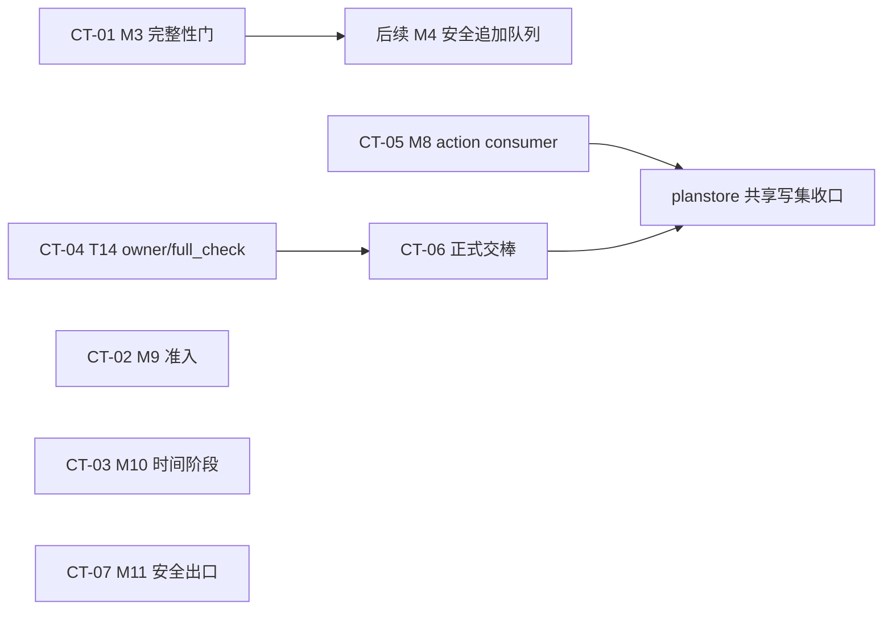

# 六份报告压成组件设计与干净施工卡

- 身份：`ADVISORY_ONLY`
- 输入包：`chatgpt_review_route_r13-six-return-component-design-and-content-pilot-pro-two-window-20260819-r01_20260819_223125.zip`
- 证据顺位：当前正式合同与 Schema → 当前代码 → 当前直接测试 → 当前合成案例 → 六份 Pro 报告 → R13／原子预期
- 输出边界：本文件只提供候选组件设计与候选施工卡，不授予施工、合同改版、R13 修改、模型调用、训练、Gold、上传、Git、生产或上线权限。

> 复核说明：六份报告、相关合同、代码、直接测试与合成案例均已逐项打开核对。尝试在运输包内重跑聚焦测试时，完整收集被运输包缺失的依赖文件与 Schema 阻断；可独立收集的一组测试为 9 条通过。本文因此只把包内直接测试源码和可复现合成输出作为当前证据，不虚报“整套测试已在本环境通过”。

---

## 1. 一页结论

### 1.1 总判决

✅ **保留 7 张候选施工卡，不凑第 8 张：**

1. `CT-01`：M3 实时解析严格化＋不完整批次边界；
2. `CT-02`：M9 梗概主文准入门；
3. `CT-03`：M10 故事时间—人物阶段唯一解析；
4. `CT-04`：T14 结果 owner／resolver／只读 `full_check`＋页面状态统一；
5. `CT-05`：M8 正式 `C7_SELECTION_ACTION v1` builder＋planstore consumer；
6. `CT-06`：作者工作稿 → C10 → C11 → C1 → planstore 正式交棒，并退役旧直写入口；
7. `CT-07`：M11 作者页／导出页未来材料元数据脱敏。

🔥 **本轮不再派工的三件事：**

- M6 旧“通用 renderer 丢防剧透范围”问题按当前代码判为 `ALREADY_CLOSED`，只保留现有专用路径与回归门，不新造 renderer；
- M7 “表述事件／世界命题”判为 `CONFLICT`，因为 R13 已要求分层，而当前正式 C4／C6 还没有足够命题类型。不能靠字符串规则或检测器私自扩合同；
- M4 “第二批 current C3 安全追加”仍是 `STILL_OPEN`，但风险顺位低于 M3 静默丢失，放进下一队列，不挤进本轮 7 张卡。

### 1.2 原 7 主题核对

| # | 候选主题 | 判定 | 当前证据结论 | 本轮处置 |
|---:|---|---|---|---|
| 1 | M9 梗概主文准入门 | `STILL_OPEN` | `overview.py` 明确接受 `extracted / confirmed / rejected`，并把三种状态全量送 provider；合成主梗概已写入 rejected 与 extracted 内容 | 选入 `CT-02` |
| 2 | M10 故事时间与人物阶段锚 | `STILL_OPEN` | 当前只有“一个人物一个 current anchor＋自由文本场景时间”，没有生效区间闭合；合成“受伤前”场景装入“新绷带” | 选入 `CT-03` |
| 3 | M6 防剧透范围唯一人读出口 | `ALREADY_CLOSED` | 专用 `ask_reader_context_tool.render_result` 已固定输出截至章、可见范围、未来阻断数、限定空结果；包内未发现 scoped 结果再进入通用 renderer 的现役调用路径 | `KEEP`，不派新卡 |
| 4 | M7 表述事件与世界事实分层 | `CONFLICT` | R13 N16 要求区分“说过／相信／世界为真／作者 Canon”；当前 C4／C6 只够表达 status、hard、confidence，测试还把“某人说……”直接当红灯输入 | 停在正式语义合同前，不派机械卡 |
| 5 | T14 owner、引用解析和 `full_check` | `STILL_OPEN` | owner 选择已由正式合同关闭：T14 唯一长期 owner，动作只存 `check_result_ref`；但 runtime 只有纯对象工具，没有持久 owner、跨重启 resolver、只读 `full_check` | 选入 `CT-04` |
| 6 | M8 正式 builder 与 planstore consumer | `STILL_OPEN` | `C7_SELECTION_ACTION v1` 已冻结；当前工具只生成局部 selection target，缺完整 action builder，planstore 也没有正式 consumer | 选入 `CT-05` |
| 7 | 正式交棒 | `STILL_OPEN` | C10／C11／C1 的正式路线已清楚，但 runtime 仍由 planstore 自发 chapter ID、直接写 legacy C1，再写 handover | 选入 `CT-06` |

### 1.3 替换题核对

| 替换题 | 判定 | 当前证据结论 | 本轮处置 |
|---|---|---|---|
| M11 通过未来材料 ID／名称／handle 间接泄底 | `STILL_OPEN` | author renderer 明确输出 omission `id` 与 `recall_handle`；合成页暴露 `FUTURE-REVEAL-01`、`plan://.../future-sender` | 选入 `CT-07` |
| T14 输入页与 completed 结果页打架 | `STILL_OPEN` | 同一案例 Markdown 写“尚未运行”，JSON 却是合法 `completed`，包含 mismatch／unknown／unplanned | 合并进 `CT-04`，不另开第 8 张 |
| M3 实时 parser 静默丢坏条目、截断后冒充完成 | `STILL_OPEN` | 严格离线工具会整批拒绝；实时 parser 会过滤坏项、补空 quote；高密度重试写明只留前 25 条，其余舍弃，且没有 incomplete 身份 | 选入 `CT-01` |
| M4 第二批 current C3 安全追加 | `STILL_OPEN` | 物化函数从空 snapshot、`expected_version=0` 开始；已有 facts 后第二次调用冲突，不能追加 | 留下一队列，不挤占本轮 7 张 |

**M7 停线时仍必须保留的未来硬门：**只有同一实体、故事时间相容、两端都是 current confirmed 的世界事实、证据仍有效且不存在合法桥接时，才允许硬红；“角色说过”“角色相信”“传闻／梦境／假设”只能先保留命题身份，其他情况最多待复核／黄灯，并明确写“这是检测器判断”。当前 C4／C6 无法机械证明这些条件，所以不能先写代码。

**M4 下一队列的既定边界：**重读现有 current C4，按 current C3 增量全有或全无地追加；旧 fact ID、confirmed／rejected、作者决定保持不变；重复候选不得新增第二条；任何 stale／冲突在写入前失败。下一轮不用再调查“问题是否存在”。

### 1.4 最关键的路线收口

- **M9** 不靠页脚状态保护。provider 不再拥有主叙述文字权，只能对 confirmed refs 排序／分组；主文由程序从 current confirmed 原文事实机械装配。extracted 只在“待确认候选”区显示，rejected 不进入作者主文。
- **M10** 不再把 current 外观当历史任意时点默认值。场景时间和人物状态有效区间必须唯一相交；零匹配、多匹配、缺区间、冲突都在 C8／提示词／导出包之前停止。
- **T14** 不重问 owner。完整结果对象只作 writer intake，长期保存与解析由 T14 owner 负责；`full_check` 是只读 preflight，不要求全绿。
- **正式交棒** 采用诚实两步：AuthorWorkspace 先落 C10＋C11＋C1，planstore 复读成功后再完成 handover。两套存储不能原子时，不提前写“交棒成功”。
- **M3／M11** 都属于“不能静默丢、不能侧信道泄”的外壳硬门，优先级高于新增内容能力。

---

## 2. 六份报告主张与当前代码新鲜度对账

### 2.1 对账原则

六份报告都是顾问材料，不获得施工权。报告中的问题只有在当前合同、代码、直接测试或合成反例仍能复现时，才进入施工候选；报告中的旧二选一、旧入口和旧缺口，一旦被正式合同或新代码关闭，就删除或收窄。

### 2.2 六报告逐份对账

| 报告 | 仍然新鲜的主张 | 已被当前证据收窄／替代的主张 | 当前用途 |
|---|---|---|---|
| `GLOBAL_CAPABILITY_GRAPH_AND_NEXT_WAVE_REVIEW.md` | 三条窄接缝仍成立：T14 持久 owner／resolver；C7 action builder／consumer；工作稿正式交棒 | 不再讨论 T14 owner A/B；正式合同已经选 T14 owner。也不重画 M1～M11 平台 | 作为本轮三条主链的范围上限 |
| `M1_M6_USABILITY_REVIEW.md` | M3 严格 parser 与完整／不完整回执仍是高风险；M4 追加边界仍开 | M6 旧人读范围缺口已被专用 `ask_reader_context_tool` 关闭；不新造第二 renderer | 提供 `CT-01`，并把 M4放后队列 |
| `M7_M11_PRO_REVIEW.md` | M9 准入、M10 时间阶段、M11 作者出口泄底仍可复现；M8 正式消费接缝仍缺 | M7 不能只靠“红黄灯降级”解决，当前更深断点是 N16 命题类型未进入正式事实合同；M8 action 不再重设计 | 提供 `CT-02/03/05/07` 的问题证据，M7停线 |
| `PA_AUTHOR_DRAFT_CHECK_CLOSEOUT_HANDOVER_REVIEW.md` | T14 owner＋ref 路线、只读 `full_check`、C10→C11→C1→planstore 顺序仍成立；title 来源仍是真选择 | 完整结果内联／只存 ref 的二选一已经关闭；不得让 closeout action、C1 或 planstore 发 chapter ID | 提供 `CT-04/06` 的唯一主路 |
| `CURRENT_SYNTHETIC_CONTENT_EXPERIENCE_REVIEW.md` | M7、M9、M10、M11、T14 页面冲突均有直接作者体验反例 | M6 旧 human receipt 结论已过期；当前专用 renderer 已补齐截至章与范围统计 | 只作反例，不用来证明模块完成度 |
| `CONTENT_CAPABILITY_EVALUATION_BLUEPRINT.md` | “不完整不能冒充完整”“截至章范围必须保留”“表述事件不等于世界事实”“梗概 confirmed-only”“人物阶段闭合”“未来材料不泄底”等验收语义仍有效 | 评测蓝图不能决定 owner、字段或施工写集，也不能把未来试卷变成当前实现事实 | 作为每张卡的对抗例与回归门来源 |

报告主张的定位证据：

- 全局报告把当前三条窄缝定为 T14 owner/ref、C7 builder/consumer、C10→C11→C1 正式提交，并明确旧 owner 二选一与“C7 未冻结”已过时：`04_external_reviews/pro_global_capability_graph_review/GLOBAL_CAPABILITY_GRAPH_AND_NEXT_WAVE_REVIEW.md:L7-L11,L28-L37`。
- M1～M6 报告直接指出 live／frozen parser 不同尺、截断“其余舍弃”、M4 只能首次物化，并给 T04/T05 窄票：`04_external_reviews/pro_m1_m6_usability_review/M1_M6_USABILITY_REVIEW.md:L45-L49,L168-L182,L456-L480`。
- M7～M11 报告保留 M9/M10/M11 的作者可用缺口，但其 M7 降灯方案不能覆盖当前 N16 命题合同缺失：`04_external_reviews/pro_m7_m11_usability_review/M7_M11_PRO_REVIEW.md:L30-L44,L334-L348`。
- 作者循环报告把 T14 owner/ref、只读 `full_check`、正式 handover 顺序和 title 缺口连成一条：`04_external_reviews/pro_pa_author_loop_review/PA_AUTHOR_DRAFT_CHECK_CLOSEOUT_HANDOVER_REVIEW.md:L24-L92,L220-L275`。
- 合成体验报告给出 T14 页面冲突、M9 状态污染、M10 阶段污染、M11 metadata 泄底；同报告的 M6 旧人读结论被当前专用 renderer 替代：`04_external_reviews/pro_current_synthetic_experience_review/CURRENT_SYNTHETIC_CONTENT_EXPERIENCE_REVIEW.md:L445-L472,L535-L641,L721-L732`。
- 评测蓝图把对应红线固定为“坏响应失败关闭／不静默截断”“M9 confirmed-only”“M10 阶段对齐”“M11 future isolation”：`04_external_reviews/pro_content_evaluation_blueprint/CONTENT_CAPABILITY_EVALUATION_BLUEPRINT.md:L388-L406,L1067-L1088,L1161-L1180,L1255-L1274`。

### 2.3 当前直接证据索引

以下路径均为共用 ZIP 内相对路径。

| 主题 | 合同／产品边界 | 当前代码 | 直接测试／合成反例 |
|---|---|---|---|
| M3 | `02_current_route/novel-mvp/contracts/C3_FACT_CANDIDATE.md` | `02_current_route/novel-mvp/mvp/extract.py:L35-L40,L208-L225,L246-L267`；严格对照 `mvp/extract_tool.py:L101-L128` | `tests/test_novel_mvp_extract_tool.py:L260-L318`；`tests/test_novel_mvp_extract_workspace.py:L182-L251,L414-L442` |
| M9 | `contracts/C4_FACT_QUERY.md:L18-L37,L77-L80` | `mvp/overview.py:L59-L63,L159-L224,L286-L395` | `tests/test_novel_mvp_overview_tool.py:L86-L96,L128-L140,L171-L215`；`03_upstream_evidence/.../case_03_m9_overview/current_output.md:L9-L16` |
| M10 | R13 三序／故事时间方向：`01_current_truth/.../02_SYSTEM_ARCHITECTURE_AND_TRUTH_LAYERS.md` | `mvp/m10_scene_slice_adapter.py:L29-L52,L177-L196,L255-L285,L350-L388`；`mvp/scene_export.py:L78-L144,L576-L605` | `tests/test_novel_mvp_m10_scene_slice_adapter.py:L113-L163,L180-L332`；`.../case_04_m10_scene_card/current_output.md:L10-L18` |
| M6 | `contracts/C4_FACT_QUERY.md`＋reader scope 工具边界 | `mvp/ask_reader_context_tool.py:L262-L329` | `tests/test_novel_mvp_ask_reader_context_tool.py:L132-L163,L193-L223`；`tests/test_novel_mvp_ask_reader_context_workspace.py:L161-L217` |
| M7 | R13 N16：`01_current_truth/.../02_SYSTEM_ARCHITECTURE_AND_TRUTH_LAYERS.md:L201-L211`；C4 临时合同：`contracts/C4_FACT_QUERY.md:L77-L80` | `mvp/check.py:L334-L384` | `tests/test_novel_mvp_check_workspace.py:L95-L129`；`tests/test_novel_mvp_check_reader_workspace.py:L45-L108,L173-L181`；`.../07_m7_health_report/input.json:L62-L100` |
| T14 | `contracts/WRITING_DESK_CHECK_RESULT.md:L5-L54,L87-L99,L139-L184`；`contracts/WRITING_DESK_CLOSEOUT_ACTION.md:L20-L68` | `mvp/writing_check_result_tool.py`；`mvp/work_draft_workspace.py:L185-L242` | `tests/test_novel_mvp_writing_check_result_tool.py:L157-L241,L289-L372`；`tests/test_novel_mvp_work_draft_workspace.py:L646-L695`；`.../case_01_pa_writing_check/current_output.md:L1-L3,L41`＋`current_output.json:L13-L60` |
| M8 | `contracts/C7_SELECTION_ACTION.md:L5-L104` | `mvp/plan_selection_target_tool.py:L46-L47,L87-L116`；包内未发现正式 planstore consumer | `tests/test_novel_mvp_plan_selection_target_tool.py:L105-L149,L166-L230` |
| 正式交棒 | `contracts/C10_INTAKE_MATERIAL_IDENTITY.md:L9-L65,L116-L126`；`C11_CHAPTER_REVISION_LEDGER.md:L5-L48,L79-L85,L131-L142`；`C1_CHAPTER_DOC.md:L5-L27,L73-L85`；`WORK_DRAFT_HANDOVER_ACTION.md:L13-L83` | `mvp/planstore.py:L588-L599,L633-L684,L1520-L1584` | `tests/test_novel_mvp_planstore_handover.py:L206-L280` |
| M11 | M11 actuality／future exclusion 方向 | `mvp/packer_tool.py:L62,L222-L234,L302-L322,L478-L481,L532-L538` | `tests/test_novel_mvp_packer_tool.py:L84-L114,L285-L299,L409-L440`；`.../case_05_m11_budget_selection/current_output.md:L17-L19` |
| M4 | `contracts/C4_FACT_QUERY.md` | `mvp/fact_workspace.py:L305-L375` | `tests/test_novel_mvp_fact_workspace.py:L499-L548,L621-L642` |

---

## 3. 最终保留的组件设计清单

| 组件 ID | 组件名 | 动作 | 唯一作者问题 | 主要消费者 | 候选卡 |
|---|---|---|---|---|---|
| `CMP-01` | `M3_EXTRACT_COMPLETION_GATE` | `CHANGE + ADD` | 抽取不能静默丢条目，也不能把截断批次写成完成 | M4、覆盖回执、作者抽取状态页 | `CT-01` |
| `CMP-02` | `M9_NARRATIVE_ADMISSION_PROJECTOR` | `CHANGE` | 驳回项不进主梗概，待确认项不冒充已发生 | M9 作者概览页、概览保存／导出 | `CT-02` |
| `CMP-03` | `M10_STORY_TIME_STATE_RESOLVER` | `ADD + CHANGE` | 历史场景只装入该故事时点唯一成立的人物状态 | M10 scene adapter、提示词包、导出 | `CT-03` |
| `CMP-04` | `T14_CHECK_RESULT_OWNER_AND_FULL_CHECK_PREFLIGHT` | `ADD + CHANGE` | 作者能保存、重启读回检测结果，并据此安全收工 | closeout、结果页、resolver | `CT-04` |
| `CMP-05` | `M8_SELECTION_ACTION_BUILDER_AND_PLANSTORE_CONSUMER` | `ADD + CHANGE` | 作者选项能形成完整动作并只消费 current action | planstore、规划历史页 | `CT-05` |
| `CMP-06` | `WORK_DRAFT_FORMAL_HANDOVER_COORDINATOR` | `ADD + CHANGE + DELETE_OR_RETIRE` | “以这篇为准”后能安全形成正式章版本与下一步接力 | C10、C11、C1、planstore | `CT-06` |
| `CMP-07` | `M11_SAFE_OMISSION_RENDERER` | `KEEP + CHANGE` | 作者知道未来材料被挡住，但看不到泄底名称／ID／handle | M11 作者页、Markdown／文本导出 | `CT-07` |

附带处理：

- `M6_SCOPE_PRESERVING_RENDERER`：`KEEP`，已有组件够用；只保留现有测试与防误路由断言，不派施工卡。
- `M7_PROPOSITION_SEMANTICS_GATE`：`CHANGE` 被正式语义合同阻断；不得机械施工。
- `M4_APPEND_CURRENT_C3_TO_C4`：`CHANGE`，仍开放但排在本轮 7 张之后。

---

## 4. 每个组件完整设计

## 4.1 `CMP-01`｜M3 抽取完整性门

**动作：`CHANGE + ADD`**

### 1. 它解决的唯一作者问题

作者交给系统的一批责任段，不能因为 provider 某一条坏格式、数量过多或重试截断，就悄悄少几条；更不能把“不完整结果”保存成“本批已完成”。

### 2. 当前直接反例和证据路径

- 实时 parser 会跳过非对象、空 text 等坏条目，并把缺失 quote 补成空字符串：`02_current_route/novel-mvp/mvp/extract.py:L208-L225`。
- 高密度重试提示明确“只保留前 25 条，其余舍弃”：`mvp/extract.py:L35-L40`；后续仍按普通 candidates 返回：`L246-L267`。
- 严格离线工具反而会整批拒绝坏结构：`mvp/extract_tool.py:L101-L128`，直接测试覆盖坏形状：`tests/test_novel_mvp_extract_tool.py:L260-L318`。
- workspace 当前只保存 items／source／responses，没有完整性身份：`mvp/extract_workspace.py:L20-L31`。

### 3. 现有 owner／消费者

- owner：M3／`extract_workspace` 当前 C3 候选状态。
- 消费者：M4 事实快照物化、M5 待审页、覆盖回执与作者抽取状态页。
- 新增的 completion receipt 只描述这次 M3 run 是否完整，不成为第二份 C3 真源。

### 4. 精确输入

- current C2 v1 responsibility segments，含稳定 segment refs 与 current chapter revision ref；
- provider 原始返回对象，未经宽松修复；
- 本次 `operation_id`、输入 C2 集合 SHA、provider identity／response identity；
- 明确的数量上限与停止原因；若存在 cap，必须把“是否仍有未处理候选”作为显式输入，不能靠截断猜完。

### 5. 精确输出

二选一：

- `COMPLETE`：严格合法的完整 C3 v1 candidates＋completion receipt；
- `INCOMPLETE_TRUNCATED`／`FAILED_PROVIDER_SHAPE`／`FAILED_SEGMENT`：只写 run receipt，不生成可供 M4 消费的 current C3 替换。

receipt 至少包含：operation、C2 source SHA、segment counts、accepted item count、failure／truncation reason、unprocessed scope、provider response refs、完成身份。

### 6. 哪些字段只能读取、哪些允许写

- 只读：C1/C2 内容、revision refs、provider 原始响应、旧 current C3。
- 可写：M3 run receipt；仅 `COMPLETE` 时写 current C3 candidate snapshot。
- 禁写：C4 fact 状态、M5 决定、事实 Canon、C1/C2、provider 原始回包。

### 7. 正常顺序

1. 复读 current C2 与 source SHA；
2. 对 provider 整体对象和每个 item 使用与离线工具同一严格 validator；
3. 检查是否发生 cap／截断／分页遗漏；
4. 只有所有责任段都完成，组装 `COMPLETE` receipt；
5. 在同一 workspace 操作中提交 C3＋receipt；
6. M4 只接受 `COMPLETE` 所绑定的 current C3。

### 8. 所有失败必须发生在什么写入之前

- provider 结构、任一 item、segment coverage、截断身份、source revision 任一失败，必须发生在 current C3 commit 之前；
- `INCOMPLETE_TRUNCATED` 可以保存独立 run receipt，但不能先写部分 current C3 再补状态。

### 9. 失败后哪些状态必须保持不变

- 旧 current C3 bytes、版本号、items 顺序与 source refs 不变；
- C4／M5／M6 不产生任何新输入；
- 允许新增一条失败／不完整 run receipt，且它不能被 current consumer 当候选快照。

### 10. 幂等与重启行为

- 同一 `operation_id + C2 source SHA + provider response SHA` 重放，返回同一 receipt／同一 C3，不追加重复 items；
- 相同 operation ID 但 payload 不同，冲突失败；
- 重启后先读 receipt：`COMPLETE` 可直接复读，`INCOMPLETE` 只能从明确未处理范围重试，不从头重复写入。

### 11. current／stale 判定

- C2 集合、chapter revision、segment boundary、provider response identity 任一变化，旧 receipt 与旧 C3 对本次运行均 stale；
- `INCOMPLETE` 永不成为 current C3；
- `COMPLETE` 只对绑定的 C2 source SHA current。

### 12. 建议窄文件族和明确禁改文件

建议窄文件族：

- `novel-mvp/mvp/extract.py`
- `novel-mvp/mvp/extract_workspace.py`
- 可新增薄文件 `novel-mvp/mvp/extract_run_receipt.py`
- `tests/test_novel_mvp_extract_tool.py`
- `tests/test_novel_mvp_extract_workspace.py`
- 新增针对截断／坏条目／重启的窄测试

明确禁改：

- `contracts/C3_FACT_CANDIDATE.md` 的事实语义；
- M4／factstore、M5 决策、C1/C2 合同；
- Gold、模型路由、模型 API；
- 不以“提高上限”替代不完整身份。

### 13. 一个最小正常例

2 个 C2 段；provider 各返回 2 条严格合法 item；无截断。输出 4 条 C3，receipt=`COMPLETE`，重启后逐字复读相同。

### 14. 一个最小对抗例

provider 返回 26 条，其中第 8 条缺 text，且系统配置 cap=25。正确结果是整批不写 current C3，保存 `INCOMPLETE_TRUNCATED` 或 provider-shape failure receipt；不能过滤第 8 条、截到 25 条后写成完成。

### 15. 完成后作者能多做什么

作者能看见“本批完整完成／因何不完整／还剩哪一段”，可以安全重试，而不是在后续确认页里误以为系统已看完。

### 16. 完成后仍不能宣称什么

不能宣称语义召回已好、事实没有漏抽、模型质量达标、M3 模块完成；它只关闭静默结构丢失与完整性冒充。

### 17. 哪种情况必须停下问 CZ

本卡本身无产品选择。若有人提议“允许部分 C3 成为 current、后续增量补齐”，这是新的作者可见语义与 consumer 合同，必须停下问 CZ；本卡默认不允许。

### 18. 与其他任务的依赖与可并行关系

- 可与 `CT-02/03/04/05/07` 并行；
- 应在后续 M4 安全追加之前完成，因为 M4 不能可靠消费“看似完整的部分 C3”；
- 与 `CT-06` 无直接依赖。

---

## 4.2 `CMP-02`｜M9 梗概主文准入投影器

**动作：`CHANGE`**

### 1. 它解决的唯一作者问题

作者打开梗概时，主文只能陈述 current confirmed、证据仍有效的已发生事实；被驳回内容不能混进去，待确认候选也不能写成已经发生。

### 2. 当前直接反例和证据路径

- `CURRENT_FACT_STATUSES` 同时接受 extracted／confirmed／rejected：`mvp/overview.py:L59-L63`。
- 三种状态都通过 current verified 门，并全量送入 provider：`L159-L224,L352-L371`。
- provider 的 synopsis／beat text 只校验形状和 refs，不校验叙述身份：`L286-L349`。
- 直接测试故意输入三状态并要求全部覆盖：`tests/test_novel_mvp_overview_tool.py:L86-L96,L128-L140,L171-L215`。
- 合成主梗概把 rejected“店主就是寄件人”和 extracted 事件写进主文：`03_upstream_evidence/.../case_03_m9_overview/current_output.md:L9-L16`。

### 3. 现有 owner／消费者

- owner：M9 prototype overview card／overview workspace；它是投影，不写真值。
- 上游 owner：C4 fact snapshot，status 与 evidence 仍由 C4 负责。
- 消费者：作者项目首屏梗概／概览、overview 保存与导出。

### 4. 精确输入

- 同一 current chapter revision 下的 C4 fact snapshot；
- 每条 fact 的 status、anchor_state、recheck、text、evidence、record SHA；
- current fact snapshot SHA；
- provider 只接收 `confirmed` fact refs 与必要视觉／排序提示，不接收 rejected；extracted 不参与主叙述。

### 5. 精确输出

- 主 `synopsis`：只由 current confirmed fact text 机械装配；
- 主 `beats`：只引用 current confirmed refs，beat 主文由程序从 confirmed fact text 生成，provider 只决定合法 refs 的顺序／分组；
- 明确“待确认候选”区域：只显示 extracted，逐条保留候选身份和证据；
- rejected 只保留在内部审计来源中，不进入作者主梗概、事件主文或候选区；
- admission receipt：confirmed／extracted／rejected 数量与主文使用数。

### 6. 哪些字段只能读取、哪些允许写

- 只读：C4 facts、status、evidence、current revision、provider 排序结果。
- 可写：M9 projection card、author renderer 输出、admission receipt。
- 禁写：任何 C4 status、作者决定、C1/C11、事实 Canon。

### 7. 正常顺序

1. 复读 current C4 snapshot；
2. 按 status 分成 confirmed／extracted／rejected；
3. rejected 从 provider input 与 author narrative input 中彻底排除；
4. provider 仅返回 confirmed ref 排序／分组；
5. 程序用 exact confirmed fact text 装配主 synopsis／beats；
6. 程序单独渲染 extracted 候选区；
7. 保存 projection 与 admission receipt。

### 8. 所有失败必须发生在什么写入之前

- status 非法、evidence stale、provider 返回未知／重复／非 confirmed ref、confirmed coverage 不完整，必须在 overview card commit 之前失败；
- 不允许先保存恶意 provider 文本，再在页脚标“有 rejected”。

### 9. 失败后哪些状态必须保持不变

- 旧 overview card、overview current pointer、C4 facts 与作者决定不变；
- provider 恶意文本只可留在隔离运行日志，不成为作者可见 projection。

### 10. 幂等与重启行为

- 同一 fact snapshot SHA＋同一合法 ref ordering 生成逐字一致 card；
- 相同 card ID 不同内容冲突失败；
- 重启后重新校验 source snapshot current，stale card 不冒充 current。

### 11. current／stale 判定

- chapter revision、C4 source revision／SHA、任一 confirmed status/evidence、provider ordering identity 变化，旧 card stale；
- extracted→confirmed 或 confirmed→rejected 必须使旧主文 stale并重编；
- 只改 rejected note、且 rejected 从主文完全隔离时，是否重编由现行 overview source SHA 规则决定，不另造第二 current 规则。

### 12. 建议窄文件族和明确禁改文件

建议窄文件族：

- `novel-mvp/mvp/overview.py`
- 如作者 renderer 独立存在，只改同族 renderer；
- `tests/test_novel_mvp_overview_tool.py`
- `tests/test_novel_mvp_overview_workspace.py`
- 新增恶意 provider 与三状态作者输出测试

明确禁改：

- C4 正式状态合同、M5 决策、R13；
- 不新增第二 overview owner；
- 不用字符串黑名单／相似度扫描冒充安全门；
- 不让 provider 自由改写主事实文本。

### 13. 一个最小正常例

C4 含 confirmed A、extracted B、rejected C。作者主梗概只出现 A；“待确认候选”区出现 B 并标待确认；C 在作者页完全不出现，admission receipt 记录 rejected=1。

### 14. 一个最小对抗例

provider 返回合法 confirmed ref A，却在自由文本中写入 rejected C 的内容。程序忽略 provider 自由文本，只用 A 的 exact fact text 生成主文；C 不可见。若 provider 返回 C 的 ref，写入前拒绝。

### 15. 完成后作者能多做什么

作者可以把梗概当作“当前已确认历史”的可信入口，同时在单独区域决定哪些候选值得确认。

### 16. 完成后仍不能宣称什么

不能宣称梗概文学性、重点排序、全章完整性或全书故事理解已经过真实小说评测；当前路线优先保证身份安全，主文可能偏机械。

### 17. 哪种情况必须停下问 CZ

若希望恢复 provider 对 confirmed facts 的自由改写，并要求自动判定“改写是否偷偷加入 rejected／未确认内容”，这会引入新的语义裁判与风险选择，必须停下问 CZ。当前单一路线是程序装配 exact confirmed text。

### 18. 与其他任务的依赖与可并行关系

- 依赖现有 C4 current／verified status，不依赖 M4 新追加；
- 可与 `CT-01/03/04/05/06/07` 并行；
- M7 命题类型冻结后，M9 可再消费更细的 world-fact admission，但本卡不等待 M7。

---

## 4.3 `CMP-03`｜M10 故事时间—人物状态解析器

**动作：`ADD + CHANGE`**

### 1. 它解决的唯一作者问题

写历史场景、倒叙或受伤前后场景时，场景卡必须装入当时唯一成立的人物阶段，不能把人物“现在的外观”倒灌到过去。

### 2. 当前直接反例和证据路径

- adapter 输入只有自由文本 `time`、`character_presence` 等字段：`mvp/m10_scene_slice_adapter.py:L29-L52`。
- anchor index 强制每个实体只有一个 anchor，没有有效区间：`L177-L196`。
- 校验只检查人物是否有 anchor、presence 是否齐全，不检查故事时间交集：`L255-L285`。
- export 也直接把 current appearance 与场景 time 放进完整提示词：`mvp/scene_export.py:L78-L144,L576-L605`。
- 合成页明确是“受伤前”，却装入“新绷带”“两手并用”：`03_upstream_evidence/.../case_04_m10_scene_card/current_output.md:L10-L18`。

### 3. 现有 owner／消费者

- 当前输入 owner：M10 caller 提供的 scene bindings 与 anchors；本卡不另造人物真值 owner。
- 解析器：新增纯函数薄组件，只对 caller 提供的权威快照做时间区间匹配。
- 消费者：`m10_scene_slice_adapter`、scene card、scene prompt、Markdown／JSON／ZIP export。

### 4. 精确输入

- `scene_ref`；
- 明确的 `scene_story_time`：故事内时点或闭合区间，不能只给“较早”“之前”一类无解析文本；
- 每个出场人物的候选状态记录：`entity_ref`、`state_anchor_ref`、`effective_from`、`effective_to`（可开区间但语义明确）、source／revision ref、状态摘要；
- scene snapshot／plan revision 与 character-state source revision；
- caller 若只有 current appearance 而无有效区间，视为缺输入，不默认匹配。

### 5. 精确输出

- `resolved_scene_state_bindings`：每个人物恰好一个匹配状态 anchor；
- resolution receipt：scene time、候选数、匹配数、选中 anchor、source revisions；
- 或明确失败：`NO_STAGE_MATCH`、`AMBIGUOUS_STAGE_MATCH`、`STORY_TIME_UNRESOLVED`、`STATE_INTERVAL_CONFLICT`。

### 6. 哪些字段只能读取、哪些允许写

- 只读：scene plan／snapshot、caller 提供的状态区间、source refs。
- resolver 本身不写长期状态；
- adapter 只有在全部人物唯一解析后，才允许写 C8／scene card／export bundle。
- 禁写：人物状态 owner、事实、C7 plan、C11/C1。

### 7. 正常顺序

1. 解析并标准化 scene story time；
2. 按 entity 收集带有效区间的状态候选；
3. 计算 scene interval 与 state interval 的交集；
4. 每个 entity 必须恰好一个合法匹配；
5. 生成 resolved bindings 与 receipt；
6. adapter 只接收 resolved bindings，随后组装 scene card；
7. prompt／export 只能读取已解析 card。

### 8. 所有失败必须发生在什么写入之前

任何人物零匹配、多匹配、缺 story time、区间冲突、source stale，都必须发生在 scene card commit、整场提示词生成、Markdown／JSON／ZIP 导出之前。

### 9. 失败后哪些状态必须保持不变

- 旧 scene card、scene export bundle、plan、人物状态、current pointers 全部不变；
- 不生成“部分人物正确、部分人物 current fallback”的混合卡；
- 可返回纯错误 receipt，但不保存为可消费 scene card。

### 10. 幂等与重启行为

- 同一 scene time＋相同状态 source revisions 解析结果逐字一致；
- 重启后复读 source revisions 再解析；
- 同一 operation ID 不同 source rev 冲突失败，不覆盖旧结果。

### 11. current／stale 判定

scene plan revision、story time、任一人物状态 source revision、有效区间、出场人物列表变化，旧 resolved binding stale；current appearance 变化本身不应使历史场景自动换阶段，只有绑定的 source rev／interval 变化才影响。

### 12. 建议窄文件族和明确禁改文件

建议窄文件族：

- 新增 `novel-mvp/mvp/scene_state_interval_resolver.py`
- `novel-mvp/mvp/m10_scene_slice_adapter.py`
- `novel-mvp/mvp/scene_export.py`
- `tests/test_novel_mvp_m10_scene_slice_adapter.py`
- `tests/test_novel_mvp_scene_export*.py`

明确禁改：

- 人物状态正式 owner／Schema、C4/C6、C7、C11；
- 不把 current appearance 复制成全时间有效；
- 不以章号代替故事时间；
- 不在 prompt 层“提醒模型自己判断”替代程序门。

### 13. 一个最小正常例

人物甲有状态 S1 `[T1,T3)`＝未受伤，S2 `[T3,∞)`＝右手缠新绷带。场景时点 T2，只唯一匹配 S1，卡片不得出现绷带。

### 14. 一个最小对抗例

场景只写“受伤前”，无法映射到故事时点；或 S1、S2 的有效区间在 T2 重叠。正确行为是停止并要求 caller／作者选择或补权威时间，不能取 current S2，也不能把两套状态一起塞进 prompt。

### 15. 完成后作者能多做什么

作者可以安全制作倒叙、回忆、跨时间场景卡，不必逐次手工删掉未来外观与伤势。

### 16. 完成后仍不能宣称什么

不能宣称系统已自动维护完整人物时间线、已解决三序、已能从自然语言唯一推断故事时点；本卡只验证显式权威输入的闭合。

### 17. 哪种情况必须停下问 CZ

- 当前单卡不要求 CZ 选择 owner：先沿用 caller 明确提供权威区间的边界。
- 若本地核写集后发现必须新增长期人物阶段 owner，或产品要在“零匹配时自动选最近阶段”与“强停”之间选择，必须停下问 CZ；默认强停。

### 18. 与其他任务的依赖与可并行关系

- 可与所有其他卡并行；
- 不依赖 M7 命题类型；
- future 若有统一故事时间 owner，可替换 caller adapter，但 resolver 输入输出不应改变。

---

## 4.4 `CMP-04`｜T14 结果 owner、resolver 与 `full_check` 只读预检

**动作：`ADD + CHANGE`**

### 1. 它解决的唯一作者问题

作者完成当场检测后，结果要能保存、重启读回、判断 current／stale，并作为 `full_check` 收工依据；页面不能一边说“没运行”，另一边已有 completed 结果。

### 2. 当前直接反例和证据路径

- 正式合同已明确 T14 是长期 owner，closeout 只持有 `check_result_ref`：`contracts/WRITING_DESK_CHECK_RESULT.md:L5-L32`。
- `completed` 可含 mismatch／missing／unplanned／unknown，不等于全绿：`L158-L166`。
- closeout 合同要求 resolver 与只读 preflight：`contracts/WRITING_DESK_CLOSEOUT_ACTION.md:L43-L68`。
- runtime 只有纯对象工具，没有 workspace 持久 owner／resolver；`work_draft_workspace` 只实现 skip_check／no_prose：`mvp/work_draft_workspace.py:L185-L242`。
- 直接测试明确 full_check 当前被拒绝并保持 bytes：`tests/test_novel_mvp_work_draft_workspace.py:L646-L695`。
- 合成 Markdown 写“检测尚未运行”，同案例 JSON 却是 completed：`.../case_01_pa_writing_check/current_output.md:L1-L3,L41` 与 `current_output.json:L13-L60`。

### 3. 现有 owner／消费者

- 唯一长期 owner：T14 writing check result store（正式合同已定）。
- writer intake：完整 `WRITING_DESK_CHECK_RESULT v1` 对象。
- 消费者：跨重启 resolver、作者 completed 结果页、`full_check` closeout preflight、后续 stale 展示。
- closeout action、work draft、C10/C11 都不能复制完整结果成为第二 owner。

### 4. 精确输入

写入端：

- 完整合法 result object；
- current work draft ref／SHA、outline／plan source refs、coverage、producer identity；
- operation ID。

解析端：

- `check_result_ref`；
- current work draft／outline refs；
- author/workspace identity。

`full_check` preflight：

- current work draft；
- current outline／expected refs；
- 已解析且 completed 的 current result；
- closeout route=`full_check`。

### 5. 精确输出

- append-only persisted result record 与稳定 `check_result_ref`；
- resolver 输出：完整结果＋`CURRENT / STALE / INVALID` 判定与原因；
- `full_check` preflight 输出：只读 eligibility receipt，允许 result 含 mismatch／missing／unplanned／unknown；
- 作者页：明确“检测已运行，不等于通过”，显示 coverage、四类 finding、作者可做动作与 stale 状态。

### 6. 哪些字段只能读取、哪些允许写

- writer 可写：T14 result owner 的 append-only records／index；
- resolver 与 `full_check` preflight 只读；
- author page 只读投影；
- closeout action 只写 `check_result_ref`，不得写完整 result；
- 禁写：work draft 文本、plan、C10/C11/C1、事实、actual。

### 7. 正常顺序

1. writer 对完整 result 做正式 validator；
2. 复读 work／outline source refs，计算 current identity；
3. append-only 保存 result，返回 ref；
4. resolver 跨重启按 ref 读取，重算 current/stale；
5. author page 从 resolver 结果渲染 completed 状态；
6. `full_check` closeout 调只读 preflight；
7. preflight 只检查“完整结果存在、coverage 完整、refs current”，不检查全绿；
8. closeout 自己再决定后续动作，不把 T14 findings 改成事实。

### 8. 所有失败必须发生在什么写入之前

- result shape、coverage、source ref、workspace identity 任一失败，发生在 T14 result append 之前；
- resolver／preflight 任一失败发生在 closeout action、handover、planstore、C10/C11/C1 写入之前；
- author page 不得自行修复状态。

### 9. 失败后哪些状态必须保持不变

- 既有 result records、work draft、closeout history、handover、planstore 全部不变；
- 失败 result 不产生 ref；
- stale result 保留历史但不能被 current `full_check` 消费。

### 10. 幂等与重启行为

- 同一 operation ID＋同一 result SHA 重放返回同一 ref；payload 不同则冲突；
- append-only，不覆盖旧 result；
- 重启后 resolver 只靠 persisted ref 与 current sources 工作；
- `full_check` preflight 多次调用零写入、结果一致。

### 11. current／stale 判定

- work draft text SHA／revision、outline／plan expected refs、coverage source、result schema／producer identity 中合同指定的 current 基础任一变化，旧 result stale；
- finding 是否 mismatch 不影响 current；
- `completed` 是运行完成身份，不是质量通过身份。

### 12. 建议窄文件族和明确禁改文件

建议窄文件族：

- 新增 `novel-mvp/mvp/writing_check_result_workspace.py` 或同族 owner 薄层
- 新增／补齐 resolver 与 `prepare_full_check_closeout`
- `novel-mvp/mvp/work_draft_workspace.py`
- author result renderer 同族文件
- `tests/test_novel_mvp_writing_check_result_tool.py`
- `tests/test_novel_mvp_work_draft_workspace.py`
- 新增重启／stale／页面一致性测试

明确禁改：

- `WRITING_DESK_CHECK_RESULT` 与 `WRITING_DESK_CLOSEOUT_ACTION` owner 选择；
- 不把完整 result 内联进 action；
- 不新增“全绿才 completed”门；
- 不碰 C10/C11/C1、事实或 actual。

### 13. 一个最小正常例

completed 结果含 1 个 mismatch、1 个 unknown，coverage 完整且 refs current。保存后重启 resolver 读回；作者页显示“已运行／有 2 个待处置项”；`full_check` preflight 通过资格检查，但不宣称无问题。

### 14. 一个最小对抗例

结果保存后作者修改 work draft 一个字。resolver 返回 `STALE_WORK_REVISION`；作者页不得继续显示“当前检测已完成”，`full_check` 必须在任何 closeout／handover 写入前失败。输入页也不得覆盖 completed 历史说“从未运行”。

### 15. 完成后作者能多做什么

作者能在跨重启后继续查看检测、处置 finding，并选择合法 `full_check` 收工，不必靠临时内存或手工带完整 JSON。

### 16. 完成后仍不能宣称什么

不能宣称 T14 内容判断准确、finding 已解决、章节可关、真值已移交、full_check 等于全绿。

### 17. 哪种情况必须停下问 CZ

本卡无 owner 选择，正式合同已唯一决定。若有人要求“允许 stale result 继续 full_check”或“mismatch 阻断 completed”，属于产品语义改动，必须停下问 CZ。

### 18. 与其他任务的依赖与可并行关系

- `CT-06` 的正式交棒若要求 `full_check` route，依赖本卡；
- 与 `CT-01/02/03/05/07` 可并行；
- author page 状态冲突直接合并在本卡，不另开任务。

---

## 4.5 `CMP-05`｜M8 selection action builder 与 planstore consumer

**动作：`ADD + CHANGE`**

### 1. 它解决的唯一作者问题

作者在规划页选了一个目标后，系统要形成一份完整、可审计、不会补空值的正式 action，并且 planstore 只消费仍然 current 的 action。

### 2. 当前直接反例和证据路径

- 正式 action 已冻结精确字段、current gate 与持久化边界：`contracts/C7_SELECTION_ACTION.md:L5-L104`。
- 当前 `plan_selection_target_tool` 只做局部 target，明示不是正式 action：`mvp/plan_selection_target_tool.py:L46-L47,L87-L116`。
- 直接测试证明它不包含 contract／完整 option record／expected revs／plan mutations：`tests/test_novel_mvp_plan_selection_target_tool.py:L105-L149`。
- 包内未发现 planstore 对 `C7_SELECTION_ACTION v1` 的正式 consumer。

### 3. 现有 owner／消费者

- C7 plan／options owner：现行 M8／plan workspace。
- stable planning card 与长期 option record 的 owner：必须由显式 selection context 指向现有权威来源；builder 不发明。
- builder：新增纯装配组件，不是 owner。
- 唯一 consumer：planstore；只有它写规划消费历史。

### 4. 精确输入

- current C7 v1 与 source／rev；
- current local selection target；
- 显式权威 `selection_context`，必须完整提供：
  - full long-term `option_record`；
  - stable planning card ref＋expected card rev；
  - expected plan／PE revs；
  - exact plan mutations；
  - actor、operation ID、selected_at；
  - stop-point／author decision context；
- 所有 required 字段必须来自输入，不许 builder 用空字符串、当前时间、默认卡号补齐。

### 5. 精确输出

- 一份严格合法的 `C7_SELECTION_ACTION v1`；
- builder receipt：每个字段来源、input revs、action digest；
- planstore consumer 成功后只持久化正式合同允许的长期 option record、digest 与 history，action envelope 本身按合同处置。

### 6. 哪些字段只能读取、哪些允许写

- builder 全只读，无长期写；
- planstore 只写 plan mutation／selection history／digest／长期 option record；
- 禁写：C7 原 plan owner、facts、actual、C1/C11、作者工作稿；
- action 不得反写真值或把“选中”写成“已发生”。

### 7. 正常顺序

1. builder 复读 current C7、target、selection context；
2. 验证 stable card 与 option record 来源唯一；
3. 检查所有 expected revs 与 exact mutations；
4. 组装并 validate action；
5. planstore consumer 重新复读 current plan/card/revs；
6. 全部门通过后一次 planstore transaction 写 mutation＋history＋digest；
7. action envelope 按正式合同丢弃／不作为长期第二 owner。

### 8. 所有失败必须发生在什么写入之前

- builder 缺字段、空值、owner 不唯一、stale rev、mutation 不闭合，必须在 action 交付前失败；
- consumer 的 current gate 任一失败，必须在 planstore journal／plan／history 写入之前失败。

### 9. 失败后哪些状态必须保持不变

- C7、planstore plan、selection history、option record、card refs 全不变；
- 不留下“target 已选但 action 半写”的长期状态；
- 可以返回只读错误 receipt，不写 action history。

### 10. 幂等与重启行为

- action digest 由规范化 payload 决定；同一 operation＋digest 重放只生效一次；
- 相同 operation 不同 digest 冲突；
- 重启后 consumer 必须复读 current rev，不能信内存 action current。

### 11. current／stale 判定

C7 source rev／SHA、planning card rev、option record rev、plan expected rev、PE rev、selected target 任一变化，action stale；planstore 只消费 current action，一旦成功，重复消费返回已应用而不重写。

### 12. 建议窄文件族和明确禁改文件

建议窄文件族：

- 新增 `novel-mvp/mvp/c7_selection_action_builder.py`
- `novel-mvp/mvp/planstore.py` 的独立 consumer 入口
- `tests/test_novel_mvp_plan_selection_target_tool.py`
- 新增 builder／consumer／restart／stale 测试

明确禁改：

- `contracts/C7_SELECTION_ACTION.md`
- C7 Schema、M8 规划语义、事实／actual；
- 不把 local target 扩名冒充正式 action；
- 不由 builder 生成空 option record、假 card ref 或当前时间默认值。

### 13. 一个最小正常例

显式 context 给出 option O1 的完整 record、card `pc-7@r3`、plan expected r8、mutation M1。builder 生成 action；consumer 复读仍是 r8／r3 后写入一次，重启重放不重复。

### 14. 一个最小对抗例

target 指向 O1，但 selection context 缺 full option record，或 card rev 已从 r3 变 r4。builder／consumer 必须停止这一项，不补空对象、不改 plan，也不重新设计 action 合同。

### 15. 完成后作者能多做什么

作者的选择可以真正进入可恢复的规划历史，重启后仍能解释“选了什么、依据哪张卡、改了哪些计划”。

### 16. 完成后仍不能宣称什么

不能宣称 M8 规划质量、选项好坏、实际兑现、下一章已写、C7 模块完成。

### 17. 哪种情况必须停下问 CZ

本地先核现有 owner。只有在完整长期 option record 或 stable planning card 存在两个都合法、互不兼容的权威来源时，才把“哪一个是 owner”这一窄问题交 CZ；找不到 owner 只停本卡，不发明新合同。

### 18. 与其他任务的依赖与可并行关系

- 可与 `CT-01/02/03/04/07` 并行；
- `CT-06` planstore handover 与本卡可能同时改 `planstore.py`，写集重叠，不能同窗并行修改；可分支并行设计、按顺序落地与回归；
- 推荐先落 `CT-05` 的 consumer 框架，再落 `CT-06` handover finisher，或由总控明确拆文件 owner。

---

## 4.6 `CMP-06`｜作者工作稿正式交棒协调器

**动作：`ADD + CHANGE + DELETE_OR_RETIRE`**

### 1. 它解决的唯一作者问题

作者明确点“以这篇为准”后，这篇工作稿要先变成可逐字回放的正式来源和章节版本，再安全交给下一步；不能由 planstore 临时发 chapter ID、写一份 legacy C1 就宣称完成。

### 2. 当前直接反例和证据路径

- C10 要求先有不可变 source／span 身份，不能补默认：`contracts/C10_INTAKE_MATERIAL_IDENTITY.md:L9-L65,L116-L126`。
- C11 是章节版本唯一 owner，C1 只是 current view，planstore 只消费映射：`contracts/C11_CHAPTER_REVISION_LEDGER.md:L5-L48,L79-L85,L131-L142`。
- C1 正式路线写明 handover→C11 r1→C1→planstore：`contracts/C1_CHAPTER_DOC.md:L5-L27,L73-L85`。
- handover action 没有正式 chapter title 字段：`contracts/WORK_DRAFT_HANDOVER_ACTION.md:L13-L25`。
- 当前 planstore 会自己 `_next_c1_id`，构造 legacy C1，再写 handover：`mvp/planstore.py:L588-L599,L633-L684,L1520-L1584`。
- 直接测试也把 legacy `{id,title,kind,text,added_at}` 与 plan handover 当成原子结果：`tests/test_novel_mvp_planstore_handover.py:L206-L280`。

### 3. 现有 owner／消费者

- 工作稿 owner：AuthorWorkspace work draft。
- C10 owner：intake source／material identity store。
- C11 owner：chapter revision ledger，唯一发 stable chapter ID／revision。
- C1 owner：不是独立 owner，是 C11 current revision 的物化读取面。
- planstore：只消费已持久化且复读成功的 C1 与 slot mapping；不能发章 ID。
- 新协调器只编排，不成为第五个 owner。

### 4. 精确输入

- current work draft exact UTF-8 text／bytes、work ref／SHA；
- current outline／plan source refs；
- current handover action，route 已合法（full_check／skip_check／no_prose）；
- stable slot target 与 expected plan rev；
- author identity、operation ID、adopted_at；
- **正式 chapter title 来源**：见第 17 项两个方案，不能用 `title_hint` 当权威；
- 若 route=`full_check`，必须有 `CT-04` 解析出的 current check result。

### 5. 精确输出

阶段 A（AuthorWorkspace）：

- 不可变 C10 source＋CHAPTER material unit；
- C11 INITIAL r1，C11 发 stable chapter ID；
- 从 persisted C11 current 复读后物化 C1 v1；
- handover operation 状态=`AW_COMMITTED_PLANSTORE_PENDING`。

阶段 B（planstore）：

- 复读 persisted C1／C11 identity 后，写 slot mapping／handover history；
- operation 状态=`HANDOVER_COMPLETE`。

失败输出：明确 pending／retryable receipt；不得提前返回 complete。

### 6. 哪些字段只能读取、哪些允许写

- 只读：工作稿 current、outline/check refs、plan expected rev、旧 slot mapping。
- C10 writer：只写 source/material identity；
- C11 writer：只写 ledger revision／stable chapter ID；
- C1 materializer：只写／更新 current view；
- planstore finisher：只写 slot mapping／handover history；
- 禁写：facts、actual、M4、旧章替换／恢复语义（本卡只做 unmapped initial handover）。

### 7. 正常顺序

1. 复读 work draft current、route 与所有 preflight；
2. 解析权威 chapter title；
3. 冻结 exact work bytes 成 C10 source；
4. 由 C11 INITIAL 发 stable chapter ID 与 r1；
5. 复读 persisted C11；
6. 物化并复读 C1 v1；
7. 写 operation=`AW_COMMITTED_PLANSTORE_PENDING`；
8. planstore finisher 复读 C1/C11、slot expected rev；
9. 写 slot mapping／handover history；
10. 标记 `HANDOVER_COMPLETE`。

### 8. 所有失败必须发生在什么写入之前

- route、title、work SHA、slot、权限、C10/C11 preflight 失败，必须在任何 C10/C11/C1 写入之前；
- AuthorWorkspace 阶段一旦成功，不伪造跨存储回滚；planstore 失败必须发生在 planstore plan／history 写入之前，并保留 `AW_COMMITTED_PLANSTORE_PENDING`；
- 只有 planstore commit 完成后才能写 `HANDOVER_COMPLETE`。

### 9. 失败后哪些状态必须保持不变

- 阶段 A 前失败：工作稿、C10、C11、C1、planstore 全不变；
- 阶段 A 后、阶段 B 前失败：已提交的 C10/C11/C1 保持不可变，planstore 不变，operation 保持 pending，可重试；
- 不创建第二 stable chapter ID；不回写 facts／actual；不把 pending 章显示成已完成交棒。

### 10. 幂等与重启行为

- operation ID 贯穿两套存储；
- 同一 work SHA／title／slot 重放，复用同一 C10/C11/C1，不发第二 chapter ID；
- payload 改变则冲突；
- 重启 recovery 扫描 pending operation，复读 C1/C11 后仅重试 planstore finisher；
- complete operation 重放返回原 receipt。

### 11. current／stale 判定

- 阶段 A 前：work ref/SHA、outline/check ref、route、slot expected rev、title source 任一变化则 action stale；
- 阶段 A 后：C10/C11/C1 已冻结，不随工作稿后续编辑改变；pending recovery 只认已持久化 C1/C11；
- planstore slot 已被其他 operation 映射时冲突，不自动转 replacement。

### 12. 建议窄文件族和明确禁改文件

建议窄文件族：

- 新增 `novel-mvp/mvp/work_draft_handover_coordinator.py`
- 现有 C10/C11/C1 workspace writer／reader 家族
- `novel-mvp/mvp/planstore.py` 新增只消费 persisted C1 的 finisher
- `novel-mvp/mvp/work_draft_workspace.py` 只接协调器，不再直写 planstore
- `tests/test_novel_mvp_planstore_handover.py`
- 新增两阶段 crash／restart／idempotency／title 测试

明确禁改：

- C10/C11/C1 owner 与字段语义，R13；
- facts／actual、M4/M5；
- 不允许 planstore／C1／handover action 发 stable chapter ID；
- 不把 `title_hint` 当权威 title；
- 不扩成 REPLACE／RESTORE，本卡只处理 unmapped initial handover。

### 13. 一个最小正常例

work `w-r3`、合法 skip_check、unmapped slot S7、author-confirmed title。阶段 A 生成 C10 source、C11 chapter `ch-09` r1、C1 v1；模拟进程重启；recovery 复读三者后完成 planstore S7→ch-09，最终 complete。全程只有一个 chapter ID。

### 14. 一个最小对抗例

C11/C1 已提交，planstore commit 前崩溃。重启后不能再次发 chapter ID，也不能显示“交棒成功”；应从 pending operation 复读同一 C1，完成或继续失败。另一个对抗例：slot 已映射，必须在阶段 A 前停止，不偷偷走 replacement。

### 15. 完成后作者能多做什么

作者可以把当前工作稿正式采用成一个可回放、可版本化、可跨重启恢复的章节，并让下一步规划准确接到这一个 stable chapter。

### 16. 完成后仍不能宣称什么

不能宣称章节已关、facts 已确认、actual 已推进、旧章替换／恢复已完成、跨数据库强原子事务已实现、整个作者循环完成。

### 17. 哪种情况必须停下问 CZ

**只需 CZ 回答一个真实问题：INITIAL 章标题的权威来源选哪一个？**

- 方案 A：在 `WORK_DRAFT_HANDOVER_ACTION` 增加作者明确确认的 `chapter_title`；优点是采用动作自包含，缺点是要改正式 action 合同。
- 方案 B：action 只引用既有、作者已确认的 title object/ref；优点是不把 title 重复写进 action，缺点是本地必须存在唯一 title owner。

不能用 planstore 调用参数、`title_hint`、文件名或模型推断代替。CZ 只需选 A 或 B，整张卡其余路线不回推。

### 18. 与其他任务的依赖与可并行关系

- route=`full_check` 时依赖 `CT-04`；skip_check／no_prose 可先做其余基础设施，但完整验收应覆盖三路；
- 与 `CT-05` 都改 planstore，不能同一写集并行落地；
- 与 `CT-01/02/03/07` 可并行；
- 先由 CZ 回答 title 单点后再开正式合同改动／施工。

---

## 4.7 `CMP-07`｜M11 安全 omission renderer

**动作：`KEEP + CHANGE`**

### 1. 它解决的唯一作者问题

作者要知道系统挡住了未来材料、还能按需回取，但不能从被排除材料的 ID、名称、任务关系、URI 或 handle 猜到未来揭示。

### 2. 当前直接反例和证据路径

- omission 字段包含 `id` 与 `recall_handle`：`mvp/packer_tool.py:L62,L222-L234`。
- renderer 直接输出 recall handle／ID：`L478-L481,L532-L538`。
- 直接测试把 raw ID／`material://...` 暴露当成期望：`tests/test_novel_mvp_packer_tool.py:L84-L114,L409-L440`。
- 合成作者页暴露 `FUTURE-REVEAL-01` 与 `plan://synthetic/future-sender`：`03_upstream_evidence/.../case_05_m11_budget_selection/current_output.md:L17-L19`。

### 3. 现有 owner／消费者

- M11 core packer 继续 owner 机器结果与 omission refs；不新造第二 packer。
- 内部授权 consumer 可使用 raw ref 做回捞。
- 新安全 renderer 只负责作者页／Markdown／文本导出投影。

### 4. 精确输入

- 已通过 M11 actuality／budget gate 的 machine result；
- omission records，含内部 ID／handle、scope classification、reason；
- 当前 author-visible scope／spoiler policy；
- renderer audience=`AUTHOR_SAFE` 或 machine audience。

### 5. 精确输出

`AUTHOR_SAFE` 输出只允许：

- 被排除的未来材料总数；
- 通用原因，如“超出当前故事时点／当前任务不允许读取”；
- 可选的不透明序号 `未来材料 #1`，不能可逆回真实 ID；
- 通用回捞动作说明：“需要时由系统重新检查”，不暴露 handle。

禁止输出 raw future `id/name/title/task_relation/chapter_ref/recall_handle/URI/path`。

machine 输出保持现有 raw refs，受内部权限边界控制。

### 6. 哪些字段只能读取、哪些允许写

- renderer 全只读；
- 可生成 author Markdown／text／export projection；
- 不改 machine result，不改 plan/facts/current scope；
- 不在作者页保存可逆映射。

### 7. 正常顺序

1. core packer 完成 actuality／budget 选择；
2. safe renderer 按 audience 过滤字段；
3. 对 future/excluded records 只汇总数量和通用 reason；
4. 对最终文本做禁止字段结构检查；
5. 通过后才返回作者页／导出文本。

### 8. 所有失败必须发生在什么写入之前

发现 author output 含 raw future metadata，必须在 Markdown／文本／ZIP 成员落盘或返回 UI 前失败；machine result 可保留，但不得降级成“先显示再警告”。

### 9. 失败后哪些状态必须保持不变

- M11 machine result、plan、facts、预算记录不变；
- 不产生部分作者导出；
- 旧安全 author projection 不被覆盖。

### 10. 幂等与重启行为

- 纯函数：同一 machine result＋audience policy 输出逐字一致；
- 重启无需状态恢复；
- source result 变化必须重新渲染，不能复用旧 safe output。

### 11. current／stale 判定

safe projection 只对绑定的 M11 result digest、task scope、spoiler policy current；任一变化旧 projection stale。它不自己判断 plan current，沿用 core packer current gate。

### 12. 建议窄文件族和明确禁改文件

建议窄文件族：

- `novel-mvp/mvp/packer_tool.py` 中作者 renderer，或新增同族 `packer_author_renderer.py`
- `tests/test_novel_mvp_packer_tool.py`
- scene／bundle 导出中复用同一 safe renderer 的窄测试

明确禁改：

- M11 selection／budget／actuality 核心算法、C9/C7；
- 不删除内部 machine refs；
- 不新造第二 omission owner；
- 不把 raw handle base64／hash 后当安全显示；可逆或可猜的仍禁止。

### 13. 一个最小正常例

machine omission 有未来材料 `FUTURE-REVEAL-01` 与内部 handle。作者页只显示“未来材料已阻断：1 条；原因：超出当前故事时点”，不出现任何名称、ID、URI。

### 14. 一个最小对抗例

未来材料 ID 为“凶手其实是店主”，handle 为 `plan://reveal/killer-shopkeeper`。safe renderer 必须完全移除二者；仅把字符串改成链接标题、截短或 hash 都不算通过。

### 15. 完成后作者能多做什么

作者能确认系统确实挡住了未来内容、理解为什么材料没装入，又不会被 omission receipt 自己剧透。

### 16. 完成后仍不能宣称什么

不能宣称模型从未读到未来文本、所有语义侧信道都已消除、M11 内容选择质量已验证；本卡只关闭作者出口元数据泄漏。

### 17. 哪种情况必须停下问 CZ

若产品要让作者主动展开“被挡材料的标题／章节”，这会改变防剧透交互和授权边界，必须停下问 CZ。当前默认完全不显示。

### 18. 与其他任务的依赖与可并行关系

- 可与 `CT-01/02/03/04/05/06` 并行；
- 不依赖 M11 core 改写；
- 与 M6 scope renderer 可共享测试思想，但不得合并成统一 renderer 平台。

---

## 5. `KEEP / CHANGE / ADD / DELETE_OR_RETIRE` 总表

| 对象 | 状态 | 动作 | 说明 |
|---|---|---|---|
| M3 live parser | `STILL_OPEN` | `CHANGE` | 与严格离线 validator 对齐，禁止过滤坏条目／补空 quote |
| M3 completion receipt | `STILL_OPEN` | `ADD` | `COMPLETE` 与 `INCOMPLETE_TRUNCATED` 分开，后者不得成为 current C3 |
| M9 overview provider 自由主文 | `STILL_OPEN` | `CHANGE` | 降为 confirmed ref 排序／分组；主文由程序装配 |
| M9 rejected/extracted author main | `STILL_OPEN` | `CHANGE` | rejected 隔离；extracted 只进待确认区 |
| M10 current anchor 直装 | `STILL_OPEN` | `CHANGE` | 只允许 resolved historical binding |
| M10 story-time interval resolver | `STILL_OPEN` | `ADD` | 纯函数薄组件，零／多匹配强停 |
| M6 dedicated scoped renderer | `ALREADY_CLOSED` | `KEEP` | 现有专用 renderer 与测试足够，不新建第二个 |
| M6 generic renderer 新任务 | `ALREADY_CLOSED` | `DELETE_OR_RETIRE` | 删除旧任务描述；未来只做防误路由回归 |
| M7 红黄灯规则 | `CONFLICT` | `CHANGE（BLOCKED）` | 等 N16／T3 正式命题类型，不做字符串补丁 |
| T14 owner／resolver | `STILL_OPEN` | `ADD` | T14 唯一长期 owner；完整对象只作 intake |
| T14 `full_check`／页面 | `STILL_OPEN` | `CHANGE` | 加只读 preflight；completed 不等于全绿；页面一致 |
| M8 action builder | `STILL_OPEN` | `ADD` | 只装配完整显式 context，不补默认 |
| M8 planstore consumer | `STILL_OPEN` | `ADD + CHANGE` | 只消费 current action，按合同持久化最小记录 |
| 正式 handover coordinator | `STILL_OPEN` | `ADD` | 两阶段持久化与 recovery |
| planstore legacy direct handover | `STILL_OPEN` | `DELETE_OR_RETIRE` | 从正式路线退役；必要时只留迁移／测试入口并明确命名 |
| planstore 自发 chapter ID | `STILL_OPEN` | `DELETE_OR_RETIRE` | chapter ID 只由 C11 INITIAL 发 |
| M11 core packer | `STILL_OPEN（出口问题）` | `KEEP` | machine result 与内部 refs 保留 |
| M11 author/export renderer | `STILL_OPEN` | `CHANGE` | raw future metadata 全部隐藏 |
| M4 safe append | `STILL_OPEN` | `CHANGE（NEXT_QUEUE）` | 本轮不派；下一队列处理第二批 current C3 |

---

## 6. 最多 7 张干净候选施工卡

> 每张卡都是候选。派工前，本地总控仍要核对 exact write set、直接消费者、并行分支和当前 HEAD。任何卡都不能借“机械施工”修改正式合同语义。

## `CT-01`｜M3 strict parser 与 incomplete gate

- **目标**：任何坏 item／截断／未处理范围都不能写成 current complete C3。
- **动作**：`CHANGE + ADD`。
- **建议写集**：`mvp/extract.py`、`mvp/extract_workspace.py`、可新增 `mvp/extract_run_receipt.py`、M3 对应测试。
- **明确禁改**：C3 事实语义、C4/M4/M5、Gold、provider 路由、API。
- **机械要求**：live parser 复用 strict validator；`INCOMPLETE_*` 只保存 run receipt；M4 只收 `COMPLETE`。
- **必测正常例**：多段完整 provider 返回，重启复读一致。
- **必测对抗例**：26 条＋第 8 条坏格式＋cap=25，零 current C3 写入。
- **失败不变量**：旧 current C3 bytes 完全不变。
- **停点**：有人要求“部分 current C3”时停下问 CZ。
- **依赖**：无；后续 M4 append 在它之后。
- **验收句**：系统能明确说“完整／不完整”，不再静默丢条目。

## `CT-02`｜M9 confirmed-only narrative admission

- **目标**：主梗概／事件主文只来自 current confirmed；extracted 单列；rejected 不可见。
- **动作**：`CHANGE`。
- **建议写集**：`mvp/overview.py`、同族 renderer／workspace 必要窄改、M9 测试。
- **明确禁改**：C4 状态合同、M5、R13、事实 owner。
- **机械要求**：provider 只排 confirmed refs；程序以 exact confirmed text 组装主文；恶意自由文本不获作者可见权。
- **必测正常例**：confirmed/extracted/rejected 各 1，三者出现在正确区域。
- **必测对抗例**：provider 尝试把 rejected 文本写回 synopsis，输出仍只含 confirmed。
- **失败不变量**：旧 card 与 C4 不变。
- **停点**：若要恢复自由改写并增加语义审判器，停下问 CZ。
- **依赖**：无。
- **验收句**：作者可把主梗概理解成已确认历史，不会被驳回项误导。

## `CT-03`｜M10 story-time state interval resolver

- **目标**：每个场景人物只装入故事时点唯一匹配的状态阶段。
- **动作**：`ADD + CHANGE`。
- **建议写集**：新增 `mvp/scene_state_interval_resolver.py`；`m10_scene_slice_adapter.py`；`scene_export.py`；M10/export 测试。
- **明确禁改**：长期人物状态 owner／Schema、C7、C11、事实合同。
- **机械要求**：caller 显式给 scene time 与 state intervals；零／多匹配强停；current appearance 无 fallback。
- **必测正常例**：受伤前 T2 唯一命中无绷带阶段。
- **必测对抗例**：区间重叠或只给“以前”，C8／prompt／ZIP 均不产生。
- **失败不变量**：旧 scene card／bundle 不变。
- **停点**：若必须新增长期阶段 owner，或有人要求自动取最近阶段，停下问 CZ。
- **依赖**：无。
- **验收句**：时间污染不能进入整场提示词或导出包。

## `CT-04`｜T14 result store、resolver、full_check 与作者页

- **目标**：T14 结果 append-only 保存、跨重启解析、current/stale 重算；`full_check` 只读；页面状态唯一。
- **动作**：`ADD + CHANGE`。
- **建议写集**：新增 T14 result workspace／resolver；`work_draft_workspace.py`；作者 result renderer；T14/work-draft 测试。
- **明确禁改**：正式 owner 选择、结果内联路线、C10/C11/C1、facts/actual。
- **机械要求**：完整对象只作 writer intake；action 只持 ref；completed 可含四类 finding；preflight 零写入。
- **必测正常例**：completed＋mismatch／unknown，重启后 current，full_check eligibility 通过。
- **必测对抗例**：保存后改 work 一个字，resolver stale，closeout 前失败；页面不得再说“尚未运行”。
- **失败不变量**：work、result 历史、closeout、handover 不变。
- **停点**：要求全绿门或 stale 继续消费时问 CZ。
- **依赖**：`CT-06` 的 full_check 路线依赖它。
- **验收句**：作者能跨重启处置真实检测结果，completed 不被冒充成通过。

## `CT-05`｜M8 action builder 与 planstore consumer

- **目标**：完整显式 selection context → 合法 action → current-only planstore 消费。
- **动作**：`ADD + CHANGE`。
- **建议写集**：新增 `mvp/c7_selection_action_builder.py`；`planstore.py` 窄 consumer；相关测试。
- **明确禁改**：`C7_SELECTION_ACTION.md`、C7 Schema、actual/facts。
- **机械要求**：option record、stable card、expected revs、mutations 均来自输入；不补空值；成功只写合同允许的长期记录。
- **必测正常例**：完整 context，首次生效；重启重放不重复。
- **必测对抗例**：缺 option record／card stale，planstore 零写入。
- **失败不变量**：plan、history、card refs 不变。
- **停点**：只有 owner 审计发现两个合法权威来源时问 CZ；找不到只停本卡。
- **依赖**：与 `CT-06` 写集冲突，顺序落地。
- **验收句**：作者选择不再停留在临时 target，而能安全进入规划历史。

## `CT-06`｜正式 work draft handover

- **目标**：工作稿采用后按 C10→C11→C1→planstore 走完，跨存储失败可恢复。
- **动作**：`ADD + CHANGE + DELETE_OR_RETIRE`。
- **前置 CZ 问题**：INITIAL 章 title 选 action 内 author-confirmed title，还是引用既有 author-confirmed title owner。
- **建议写集**：新增 handover coordinator；C10/C11/C1 workspace 窄调用；`planstore.py` finisher；work-draft／handover 测试。
- **明确禁改**：facts/actual、REPLACE/RESTORE、R13、C11 owner。
- **退役项**：正式路线中的 `planstore.accept_work_draft_handover` 直发 ID／legacy C1；planstore `_next_c1_id` 不得再服务正式 handover。
- **机械要求**：阶段 A `AW_COMMITTED_PLANSTORE_PENDING`；阶段 B 后才 `HANDOVER_COMPLETE`。
- **必测正常例**：阶段 A 后重启，复读同一 C1 完成 planstore，只有一个 chapter ID。
- **必测对抗例**：slot 已映射／planstore 中途崩溃，不重复发 ID、不提前成功。
- **失败不变量**：阶段 A 前全不变；阶段 A 后 planstore 不变且 operation 保持 pending。
- **依赖**：full_check 路线依赖 `CT-04`；与 `CT-05` 不同批改 `planstore.py`。
- **验收句**：作者的“以这篇为准”产生可回放正式章版本，并诚实处理跨存储恢复。

## `CT-07`｜M11 author-safe omission renderer

- **目标**：作者知道未来材料被挡，但看不到 raw ID／name／title／handle／URI／chapter。
- **动作**：`KEEP + CHANGE`。
- **建议写集**：`mvp/packer_tool.py` author renderer，或新增同族 `packer_author_renderer.py`；M11 导出测试。
- **明确禁改**：M11 core packer、budget／actuality、C9/C7、内部 machine refs。
- **机械要求**：AUTHOR_SAFE 只给数量＋通用原因；最终文本做禁止字段结构检查。
- **必测正常例**：未来 omission 1 条，作者只见“已阻断 1 条”。
- **必测对抗例**：ID／handle 本身含凶手揭示，任何截短／hash／链接标题都不得显示。
- **失败不变量**：machine result 不变，作者导出不产生半包。
- **停点**：若允许作者展开未来材料标题，问 CZ。
- **依赖**：无。
- **验收句**：遗漏回执不再自己成为剧透通道。

---

## 7. 可并行关系与依赖顺序

### 7.1 推荐依赖图

### 7.2 并行安排

| 组 | 可并行任务 | 原因 |
|---|---|---|
| A | `CT-01`、`CT-02`、`CT-03`、`CT-04`、`CT-07` | 文件族基本独立，可同时做诊断→修复→验证→回归→收口 |
| B | `CT-05` 与 `CT-06` 只可并行做只读设计／测试准备 | 两者都可能修改 `planstore.py`，正式落地必须分顺序或拆明确文件 owner |
| C | 后续 M4 append | 应等 `CT-01` 完成，避免追加不完整 C3 |

### 7.3 推荐落地顺序

1. `CT-01 / CT-02 / CT-03 / CT-04 / CT-07` 五条独立线可同时启动；
2. 本地总控核 `CT-05` 与 `CT-06` 的 planstore 写集，指定先后；
3. 推荐先完成 `CT-05` 的 action consumer 边界，再完成 `CT-06` handover finisher；若本地结构更适合反序，必须保持独立入口与测试；
4. `CT-04` 通过后，`CT-06` 才能验收 full_check 路线；
5. 本轮 7 张收口后，再派 M4 safe append；
6. M7 等 N16／T3 正式语义，不占施工窗口。

---

## 8. 只需 CZ 回答的真实问题

### `CZ-Q1`｜INITIAL 章标题由谁权威提供？

这是本轮唯一需要 CZ 直接回答的问题。

- **A｜handover action 自包含**：给 `WORK_DRAFT_HANDOVER_ACTION` 增加作者明确确认的 `chapter_title`。
- **B｜引用既有 title owner**：action 只带一个 author-confirmed title ref，C11 INITIAL 复读该对象。

推荐判断尺子：

- 当前若已经有稳定、可复读、author-confirmed 的 title owner，选 B；
- 若没有，选 A，避免为了一个标题新造长期 owner。

❌ 不接受：`title_hint`、文件名、planstore 调用参数、模型推断、默认“未命名章节”。

### 不应现在问 CZ 的事项

- M10 的状态区间 owner：先沿用 caller 显式权威输入；只有本地证明必须新增 owner 才问。
- M8 option record／planning card owner：先做现役 owner 审计；找不到只停该卡，不让 CZ 在缺证据时拍空气。
- M7 红黄灯：不是 CZ 现在选一个颜色的问题，而是 N16 命题类型尚未进入正式合同，先停线。

---

## 9. 明确删除、合并或不再重复做的旧任务

1. **删除**“给 M6 再造一个防剧透 renderer”的旧任务。现有 `ask_reader_context_tool.render_result` 是唯一优先路径。
2. **保留** M6 防误路由回归：任何截至章结果必须继续显示截至章、已读范围、未来阻断数、限定空结果；这不是新组件卡。
3. **删除** T14 owner A/B 二选一。正式合同已经选 T14 owner＋`check_result_ref`。
4. **合并**“T14 输入页与 completed 结果页打架”进 `CT-04`，不单开页面美容任务。
5. **删除**重新设计 `C7_SELECTION_ACTION v1` 的任务。action 已冻结；只补 builder／consumer。
6. **退役** formal handover 中 planstore 自发 chapter ID＋legacy C1 的入口；必要历史兼容必须改名为 migration／legacy-only，不能继续被主流程调用。
7. **不做** M9 仅在页脚标状态的修补；状态准入必须发生在主叙述生成之前。
8. **不做** M10 prompt 里加一句“注意时间”的软提醒；时间污染必须在 prompt／export 前程序阻断。
9. **不做** M7 用“说、声称、认为”关键词降黄灯。正式事实合同无法表达命题身份时，字符串补丁会制造新误判。
10. **不做** M3 “把 cap 从 25 调大”的假修复；任何 cap 都必须有 incomplete 身份。
11. **不做** M11 把 raw handle hash／截短后继续显示；可猜／可逆元数据仍然泄底。
12. **后移** M4 safe append：仍是开放任务，下一队列直接承接，不再重新调查问题是否存在。
13. **不扩** 统一平台、统一 owner registry、统一 renderer、M12/M13 或跨模块总状态机。
14. **不让** 本文件、六份报告或合成案例获得施工／合同／生产权。

---

## 10. 给本地总控的接力摘要（20 行内）

1. 本轮保留 7 张候选卡：M3、M9、M10、T14、M8、正式交棒、M11。
2. M6 判 `ALREADY_CLOSED`；保留专用 renderer 与回归，不派新卡。
3. M7 判 `CONFLICT`；等 N16／T3 正式命题类型，禁止字符串补丁。
4. M4 safe append 仍 `STILL_OPEN`，排在 7 张之后。
5. CT-01：live parser 与 strict validator 合一；incomplete 不得写 current C3。
6. CT-02：provider 只排 confirmed refs；主文程序装配；extracted 单列；rejected 隔离。
7. CT-03：scene time × state interval 必须唯一匹配，零／多匹配在 C8／prompt／export 前停。
8. CT-04：T14 唯一 owner；完整对象只作 intake；resolver 跨重启；full_check 只读且不要求全绿。
9. CT-04 同时修页面“未运行／completed”冲突，不另开 UI 卡。
10. CT-05：完整 selection context → C7 action；planstore 只消费 current action，不补空值。
11. CT-06：C10→C11 发 ID→C1 复读→planstore；两阶段 pending／complete，不伪原子。
12. CT-06 退役 planstore 正式路线中的自发 chapter ID 与 legacy C1。
13. CT-07：保留 machine refs；author/export 只显示未来阻断数量＋通用原因。
14. CT-05 与 CT-06 都可能改 planstore，落地不可并行抢写集。
15. CT-04 是 CT-06 full_check 路线前置；其余五条可并行。
16. 本轮唯一 CZ 问题：INITIAL 章 title 选 action 内 author-confirmed 字段，还是引用既有 title owner。
17. 找不到 M8／M10 唯一 owner 时只停对应卡，不发明合同，不把整批推回 CZ。
18. 派工前核当前 HEAD、exact write set、直接消费者和禁改文件。
19. 每卡必须跑正常例、对抗例、失败不变量、重启幂等与 current/stale 回归。
20. 所有结论继续是 `ADVISORY_ONLY`，报告不获得施工权。

来源：ChatGPT Pro（六份外审压缩设计；当前合同、代码、直接测试与合成案例对账）
