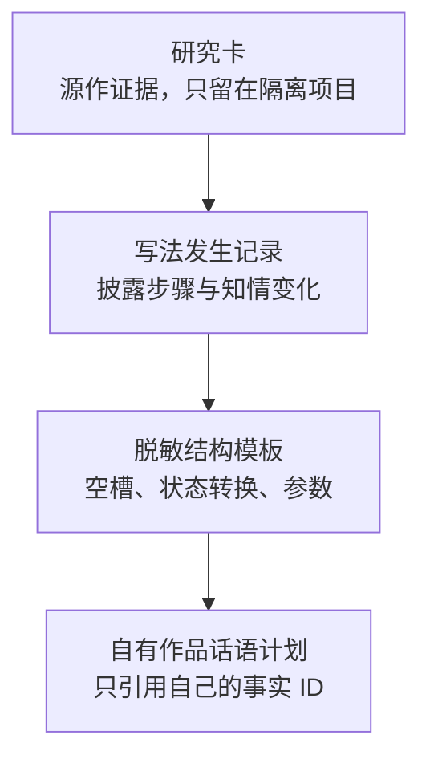

✅ 结论：不要把“深度拆书”做成更细的梗概，而要记录“一次写法怎样改变读者状态”。推荐四层结构：



“写法挂点”只是研究文本中的定位锚点，不适合单独承载模板；“计划事件的话语序”记录模板在自有作品里的具体应用，也不应该反过来容纳源作信息。

调研截止 2026-08-14。以下是独立公开调查，没有把你们的内部文件当作证据。

## 1. 可以拆成哪些“写法结构”单位

叙事学里已有不少可操作单位，但工具成熟度很不均衡。

| 写法单位           | 可以记录什么                                                 | 公开数据化程度                                               |
| ------------------ | ------------------------------------------------------------ | ------------------------------------------------------------ |
| 故事顺序／话语顺序 | 事件实际先后、文本呈现先后、倒叙／预叙、停顿／场景／概述／省略、重复叙述 | **成熟。**叙事学已有 order、duration、frequency 分类；TimeML 可标事件和时间关系。[Living Handbook：Time](https://www-archiv.fdm.uni-hamburg.de/lhn/node/106.html)、[TimeML 规范](https://timeml.github.io/site/publications/timeMLdocs/timeml_1.1b.htm) |
| 信息披露步骤       | 暗示、隐瞒、误导、确认、纠正；问题何时提出、答案何时给出     | **可自定义，缺少通用标准。**工具能存标签和关系，但没有通行的“读者知情协议” |
| 视角与认知错位     | 谁感知、谁叙述；读者、视角人物、其他人物各知道什么           | **理论成熟，标注多靠人工。**聚焦理论把叙事信息的选择和限制作为独立问题；戏剧反讽研究也直接考察读者对人物认知状态的推断。[Focalization](https://www-archiv.fdm.uni-hamburg.de/lhn/node/18.html)、[戏剧反讽实验研究](https://www.frontiersin.org/journals/psychology/articles/10.3389/fpsyg.2023.1183660/full) |
| 人物出场编排       | 先出现痕迹、声音、身体、称谓还是名字；直接介绍还是行动暗示；身份揭示延迟 | **大多停留在教程或自定义标签。**人物塑造研究已有直接／间接表征等概念，但没有统一的“人物出场数据格式”。[Living Handbook：Character](https://www-archiv.fdm.uni-hamburg.de/lhn/node/41.html) |
| 场景与节拍功能     | 行动场／反应场、目标、阻力、转折、决定、价值变化             | **教学产品已结构化，但彼此不互通。**Story Grid、Save the Cat、Scene/Sequel 都有自己的字段和口诀。[Story Grid 场景模型](https://storygrid.com/scenes/)、[Save the Cat 软件](https://savethecat.com/save-the-cat-story-structure-software-suite)、[Scene/Sequel 教学模型](https://www.helpingwritersbecomeauthors.com/scene-structure/) |
| 人物能动链         | 目标、信念、计划、尝试、结果、情绪                           | **研究语料已有图结构。**Story Intention Graph 把文本、时间线和解释层分开，并只标与目标、计划、信念、结果、情绪有关的片段，不要求逐句原子化。[DramaBank / Story Intention Graph](https://www.cs.columbia.edu/~delson/pubs/LREC2012-Elson.pdf) |
| 对白功能           | 提问、回答、请求、承诺、拒绝、确认，以及对白造成的信息或关系变化 | **通用会话行为已标准化，小说功能仍需扩展。**ISO 24617-2 可标多维对话行为和行为间关系，但不直接覆盖“借对白埋设定”“表面合作、实际试探”等文学功能。[ISO 24617-2:2020](https://www.iso.org/standard/76443.html) |
| 情绪节拍           | 目标情绪、强度、转折方向、悬念／好奇／惊讶、释放点           | **粗粒度情感曲线可计算，目标读者情绪仍靠分析者判断。**公开研究曾从 1,327 部公版故事中归纳六类粗粒度情感轨迹，但论文也说明情感曲线不能直接等同于情节或作者意图。[情感弧研究](https://link.springer.com/article/10.1140/epjds/s13688-016-0093-1) |
| 铺垫—兑现关系      | 线索、承诺、误导、揭示、回收；两端距离与中间干扰             | **关系型标注可做，主流写作软件通常只给卡片和标签。**Plottr 能保存场景卡、人物、地点、标签和自定义属性，但筛选能力仍偏通用元数据。[Plottr 时间线](https://docs.plottr.com/article/54-timeline-overview)、[Plottr 筛选](https://docs.plottr.com/article/61-timeline-filtering) |

学术工具已经证明“文本范围＋标准标签＋实体关系”可以落地：heureCLÉA 在 CATMA 中标注了叙事时间和层级等大量概念；CATMA 支持分层标签与 TEI 导出；INCEpTION 支持文本跨度、关系、指代链和自定义字段。[heureCLÉA](https://heureclea.de/index.html)、[CATMA 标签系统](https://catma.de/how-to/glossary/)、[INCEpTION 指南](https://inception-project.github.io/releases/35.4/docs/user-guide.html)

但它们没有替产品回答三个关键判断：

- 读者在这一拍究竟知道什么；
- 这条信息是暗示、误导还是确认；
- 作者想制造的是怀疑、焦虑、期待还是释放。

这三项应由机器预标、人工确认。BookNLP 可预取人物、指代和引语归属，但其文档也把长篇指代消解视为仍待解决的问题，不能据此自动断言“人物已经被读者认出”。[BookNLP](https://github.com/booknlp/booknlp)

公开网文教程抽样中，常见表述仍是“情绪起伏”“设置阻碍”“人物＋情节＋读者情绪”等大类，离可交换的数据定义还有距离。[番茄作家课堂示例](https://fanqienovel.com/writer/zone/article/7273042943110283326)、[公开拆书产品示例](https://ibiling.cn/chaishu)

## 2. “同样五条信息、两种编排”怎样存

### 对象应该挂在哪里

| 对象                               | 保存内容                                         | 能否过桥       |
| ---------------------------------- | ------------------------------------------------ | -------------- |
| `ResearchCard` 研究卡              | 来源、分析结论、写法发生记录                     | 否             |
| `TechniqueOccurrence` 写法发生记录 | 源作里的步骤、挂点、信息项、知情变化、分析置信度 | 否，隶属研究卡 |
| `TechniqueTemplate` 脱敏模板       | 空槽角色、状态转换、参数范围、适用条件           | 可以           |
| `DiscoursePlan` 自有作品话语计划   | 自有事实 ID、呈现顺序、目标知情状态、目标情绪    | 正线对象       |

研究项目里不要叫“事实 ID”，建议叫 `research_info_item_id`，明确它只是分析用的信息项。模板里进一步变成 `slot_id`；落到作者作品时才绑定 `own_fact_id`。

### 最小字段

真正不可少的是“顺序＋位置＋知情变化＋效果”。要长期维护，还应补上标识、版本和出处。

| 字段组       | 最小字段                                                     |
| ------------ | ------------------------------------------------------------ |
| 身份与范围   | `occurrence_id`、`pattern_code`、`schema_version`、场景／段落范围 |
| 信息与顺序   | `step_no`、`research_info_item_id` 或 `slot_id`、`presentation_order`；涉及倒叙时再加 `story_order` |
| 叙述位置     | 章／场／节拍锚点，以及发生在某动作之前还是之后               |
| 披露方式     | `hint`、`withhold`、`misdirect`、`inferable`、`confirm`、`correct`、`explicit` |
| 信息接收者   | 读者、视角人物、指定角色                                     |
| 知情变化     | 各接收者的 `state_before`、`state_after`                     |
| 认知状态枚举 | 未知、已有暗示、怀疑、相信、确认、错误相信、已纠正           |
| 视角条件     | 聚焦者、信息来源、来源可靠度                                 |
| 目标效果     | 悬念／好奇／惊讶／戏剧反讽等模式，情绪标签、强度、曲线方向   |
| 研究限定字段 | `source_anchor`、分析置信度、是否允许生成脱敏模板            |

“目标情绪”和“实际读者反应”要分开。后者只能来自测试、评论或行为数据，不能由拆书者推测后写成事实。事件顺序影响悬念、好奇与惊讶的实验研究支持这种区分，但也发现“已经知道结果”不一定消灭悬念，因此不能用固定公式代替验证。[Hoeken 与 van Vliet 的事件顺序实验](https://doi.org/10.1016/S0304-422X(99)00021-2)

### 自拟五信息示例

五个信息项：

- I1：来客遮住面部
- I2：来客知道暗格位置
- I3：主人把来客当陌生人
- I4：来客带着一张旧合照
- I5：来客是主人失散的兄弟

| 编排 | 呈现序列                                       | 读者位置           | 目标情绪                 |
| ---- | ---------------------------------------------- | ------------------ | ------------------------ |
| A    | I1 → I3 → I2 → I4 → I5                         | 读者与主人接近同步 | 怀疑、好奇，揭示后释放   |
| B    | I5 只向读者披露 → I1 → I2 → I3 → I4 向主人确认 | 读者领先主人       | 戏剧反讽、担忧、期待相认 |

由此可见，只存 `[I1,I3,I2,I4,I5]` 不够：还必须存“I5向谁披露”和披露前后的知情状态。

## 3. 怎样检索“先隐瞒身份再揭示的出场”

推荐“两级索引”。

### 隔离项目内的详细记录

一条 `craft_occurrence` 表示整段人物出场，子表 `disclosure_step` 只保存造成知情变化的步骤。

父记录可存：

- `unit_type = CHARACTER_ENTRANCE`
- `mechanism = IDENTITY_WITHHOLD_THEN_REVEAL`
- `subject_local_id`
- `scope_start / scope_end`
- `first_presence_mode = TRACE | VOICE | UNNAMED_BODY | ROLE | NAME`
- `reader_position = BEHIND | EQUAL | AHEAD`
- `delay_beats / delay_scenes`
- `target_emotion`
- `confidence`

子步骤形成状态路径：

```text
ABSENT
→ PRESENT_UNIDENTIFIED
→ IDENTITY_SUSPECTED
→ IDENTITY_CONFIRMED
```

查询条件不是搜索“隐瞒身份”这几个自然语言字，而是：

```text
unit_type = CHARACTER_ENTRANCE
AND same_subject = true
AND state_path contains_in_order(
  PRESENT_UNIDENTIFIED,
  IDENTITY_CONFIRMED
)
```

### 跨研究项目的脱敏索引

全局索引只保存：

- 机制码；
- 脱敏状态路径；
- 延迟区间；
- 读者领先／同步／落后；
- 目标情绪；
- 研究卡指针和访问权限。

人物是谁、具体隐瞒了什么、原文位置和情节说明仍留在各自的隔离项目。

### 防止过度原子化的规则

- 标注单位从“第一次可感知存在”到“身份确认或离场”，不是每句话。
- 只有知情状态发生变化才新增子步骤。
- 原文不复制进全局索引，只留项目内锚点。
- 核心字段用封闭枚举，分析备注才允许自由文本。
- `state_path`、延迟和复合机制码由步骤计算，避免人为维护大量重复标签。
- 暂时无法确定是“暗示”还是“确认”时，保留候选标签和置信度，不强行定性。

这和 Story Intention Graph 的选择性标注思路相符：只标与目标、信念、计划、结果和情绪有关的片段，长篇文本才可维护。时间标注研究也显示，过细的关系体系会显著增加成本；较简化的呈现顺序和事件顺序仍能支持有用检索。[TIE-ML 对 TimeML 复杂度的分析](https://arxiv.org/pdf/2109.13892)

V1 用关系表加倒排／JSON 状态路径索引就够了，不必急着上知识图谱。

## 4. 结构复用与“仿表达”的边界

法律原则不是“只要叫结构就安全”。《世界知识产权组织版权条约》第二条区分表达与思想、程序、方法；第五条同时承认，具有独创性的材料选择或编排也可能受保护。因此，抽象机制通常风险较低，但高度具体、足以重构一部作品的编排不能只换个“模板”名称。[WIPO 条约第二、第五条](https://www.wipo.int/wipolex/en/text/295166)

### 建议的产品分界

| 区域 | 允许或阻止的内容                                             |
| ---- | ------------------------------------------------------------ |
| 绿区 | “身份先隐后揭”“读者领先角色知情”“提示与确认相隔三到五节拍”等通用关系；空槽模板；参数对照；只绑定作者自有事实 |
| 黄区 | 高度独特的多步顺序、罕见人物关系组合、可辨认的桥段骨架、整套复制某教学品牌的表格和解释；进入人工审核 |
| 红区 | 原文或近似改写、专名与设定、独特人物关系网、连续事件链、对白和描写、“换名字即可使用”的桥段、续写、仿某作者／某作品正文 |

中国《著作权法》第二十四条允许为介绍、评论或说明问题而适当引用，但要求标明作者和作品名称，并不得影响作品正常使用或不合理损害权利人利益；课堂和科研例外也不等于商业产品可以公开分发材料。[中国《著作权法》第二十四条](https://policy.mofcom.gov.cn/claw/clawContent.shtml?id=87976)

美国版权局同样明确说明，合理使用没有固定的字数、行数或百分比安全线，必须逐案判断。[美国版权局合理使用说明](https://www.copyright.gov/fair-use/)

平台通常从“你是否拥有内容权利”而不是“用了多少字”切入：

- Amazon KDP 要求发布者拥有相应出版权，侵权内容可能被下架并影响账户和版税。[KDP 出版权说明](https://kdp.amazon.com/help/topic/G200672400)、[KDP 内容规则](https://kdp.amazon.com/help/topic/G200672390)
- Royal Road 把使用他人角色、设定和特有术语的内容纳入同人规则，并限制其变现。[Royal Road 内容规则](https://www.royalroad.com/support/knowledgebase/114)
- 教学产品往往另外用合同保护课程文本、视频、表格和品牌化材料；通用方法可讨论，不代表可以复制其讲义或工作表。[Story Grid 使用条款](https://storygrid.com/terms-and-conditions/)

中国语境中，金庸诉江南案在 2025 年以全面和解收束，协议还涉及再版不再使用独特人物名称及相关内容；原一、二审判决不再产生法律效力。它不能当成现行判例引用，但可视为一个产品风险信号：专名和高识别度人物组合不要过桥。[和解公开报道](https://www.peopleapp.com/column/30050320334-500007100558)

### 可以公开写进产品政策的版本

> 本产品只提取可跨作品描述的叙事关系和参数，例如“身份先隐后揭”“读者先于角色知情”及“提示与揭示相隔若干节拍”。产品不迁移源作原文、专名、人物关系网、独特事件组合、对白或描写，也不生成“像某作者或某作品”的正文。研究证据只保存在隔离研究项目；跨项目仅允许空槽模板、枚举标签和汇总参数。模板应用时只能引用用户自有作品的事实、人物与设定。

### “不代写”自检

- **类型检查**：自有作品计划中的每个内容项只能引用 `own_fact_id`；数据库层面禁止引用 `research_info_item_id`。
- **过桥白名单**：机制码、空槽角色、状态变化、节拍数、距离区间、目标情绪。
- **过桥黑名单**：原文、专名、关系网、事件说明、对白、描写和源作人物 ID。
- **改名测试**：只换人物名字便能还原源作桥段，判为越界。
- **去来源测试**：删除作品名后，如果模板不能广泛适用于大量不同故事，说明仍过于具体。
- **可识别性测试**：审核者仅看模板就能稳定猜出源作，进入人工复核。
- **可粘贴测试**：输出已经可以直接贴进小说成为完整正文，已超出“标注、比较、排序、检查”的产品承诺。
- **输出形态限制**：给诊断、问题、参数对照和多个结构选项，不给完整场景正文。
- **审计记录**：保存模板版本、脱敏规则和审批结果；研究出处只在隔离系统内可追溯。

语义相似度检测可以当辅助报警，不能替代这些硬规则。这部分属于产品风险研究，不是正式法律意见；商用上线前应让中国版权律师拿一批真实输出样本做压力测试。

## 5. 普通梗概之外必须增加的结构槽

| 结构槽                                                 | 研究项目 | 自有作品章纲 | 作用                                 |
| ------------------------------------------------------ | -------- | ------------ | ------------------------------------ |
| 1. 来源挂点、证据范围、分析置信度                      | ✓        | —            | 让研究判断可核查；不随模板过桥       |
| 2. 源作信息项与脱敏槽位映射、过桥状态、模板版本        | ✓        | —            | 证明跨项目留下的是空槽结构           |
| 3. 故事顺序／话语顺序／叙述时长模式                    | ✓        | ✓            | 区分“发生了什么”和“何时告诉读者”     |
| 4. 披露序列、披露方式、信息接收者                      | ✓        | ✓            | 表示暗示、隐瞒、误导、确认、纠正     |
| 5. 读者与关键人物的知情状态变化                        | ✓        | ✓            | 支持认知错位、戏剧反讽和身份揭示检索 |
| 6. 聚焦者、信息来源及可靠度                            | ✓        | ✓            | 区分谁看到、谁相信、谁可能误导       |
| 7. 人物出场方式与身份／姓名揭示延迟                    | ✓        | 条件必填     | 支持“先声后人”“先角色后姓名”等结构   |
| 8. 场景／节拍功能、行动／反应、价值变化                | ✓        | ✓            | 防止章纲只有事件清单                 |
| 9. 目标情绪、张力模式、强度和转折；实际反应另列        | ✓        | ✓            | 让编排目的可比较、可测试             |
| 10. 对白功能、信息增量、问题—回答／铺垫—兑现关系和距离 | ✓        | 条件必填     | 检索对白承担了什么，以及承诺是否回收 |

“条件必填”表示该章没有人物出场或关键对白时可以记为 `not_applicable`，不是强迫每章填满所有格子。

最合适的 MVP 是：

- 四种对象：研究卡、写法发生记录、脱敏模板、自有作品话语计划；
- 六套封闭词表：写法家族、披露方式、知情状态、读者位置、情绪／张力、场景功能；
- 一套跨项目硬约束：只有模板码、空槽和参数能过桥；
- 自动化只负责找人物、引语、文本锚点和表面顺序；写法边界、知情状态、误导意图和目标情绪由人确认。

这样得到的不是“把别人的书拆得更碎”，而是一套能检索、能比较、但无法把源作内容带入作者事实账的写法研究系统。

来源：ChatGPT