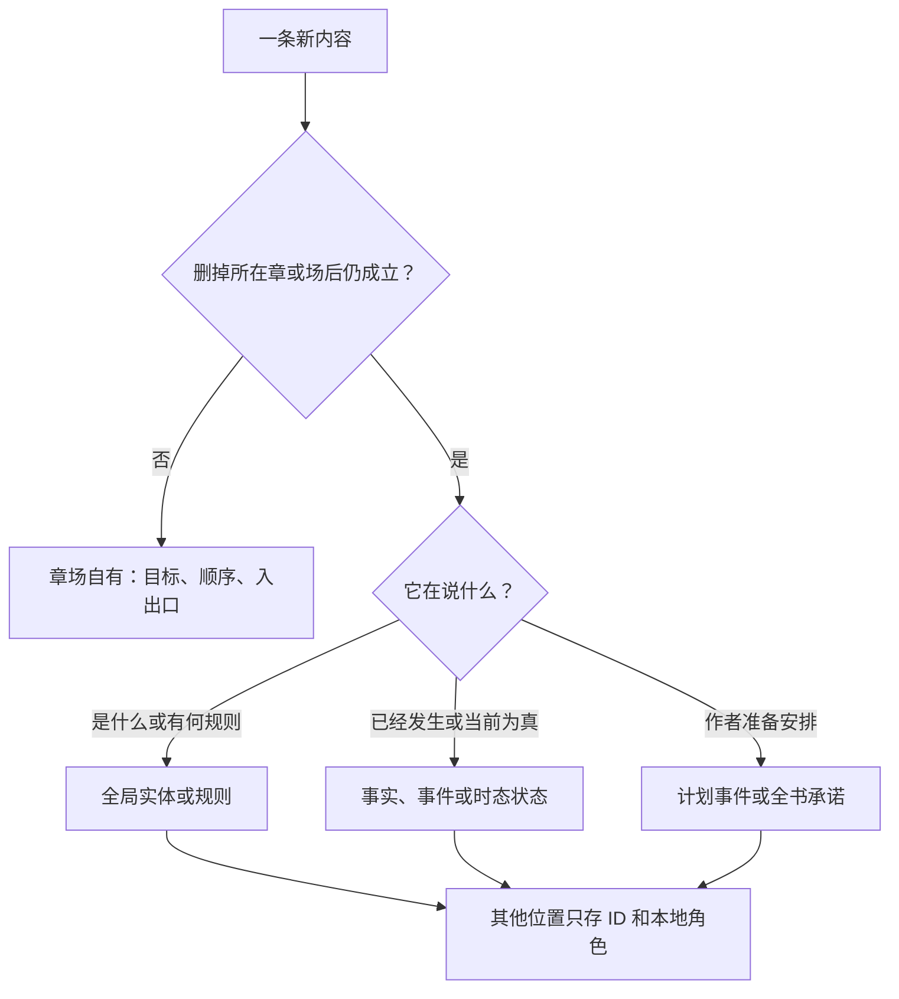

✅ 这份结论只取公开资料，不依赖附件。

双篮子最有效的解法，不是继续加栏目，而是把两件事拆开：

- 内容本体：它到底是什么、发生了什么、作者准备安排什么。这里是唯一可编辑的主记录。
- 使用关系：它在哪章出现、在这里起什么作用、谁知道、何时揭示。这里只存对象编号，也就是 ID，加上“本地角色”。

🔥 一句话测试：

> 去掉“第 X 章／本场”后，这句话还成立吗？成立，就住全局对应对象；只剩“本章／本场要完成什么”，才住章场。其他篮子只存它的 ID 和在此处的作用。

公开资料里没有叙事数据库行业统一采用的一棵标准树，但知识库和叙事产品的做法高度一致：

- 数据库规范化主要解决“同一个值改了一处、另一处没改”的更新异常。[IBM 数据库规范化说明](https://www.ibm.com/think/topics/database-normalization)
- Wikibase 把“对象身份”和“关于对象的陈述”分开：一个页面描述一个对象，事实作为陈述挂在对象上。[Wikibase 数据模型](https://www.mediawiki.org/wiki/Wikibase/DataModel/Primer)
- Plottr 的章纲由时间线内容生成，场卡链接人物、地点和标签，不在场卡里再造人物、地点。[章纲说明](https://docs.plottr.com/article/68-outline-overview)、[场卡链接说明](https://docs.plottr.com/article/71-outline-linking-characters-places-tags)
- Aeon Timeline 把“事件—人物／地点／故事线”做成带角色的多对多关系。[Aeon 关系模型](https://help.aeontimeline.com/article/28-adding-entities-and-relationships-ipad)
- World Anvil 明说：同一事件进入两条时间线时复用已有事件，不用再创建；秘密嵌入多篇文章后，只改秘密本体，所有嵌入处一起变化。[时间线](https://www.worldanvil.com/learn/timelines/timelines)、[秘密](https://www.worldanvil.com/learn/secrets/secrets)

## 1. 可执行的放入树

下面这棵树是我把上述公开规则压成的产品判定法，不是某家产品原图。



“谁知道”“读者何时看见”“在哪章用来制造误会”不再参加住址竞争。它们是关系，例如：

- `场景 S 揭示事实 F`
- `人物 A 从事件 E 得知事实 F`
- `伏笔 H 指向规则 R`
- `反派线 P 涉及组织 O`

关系表不是第三本真值。它保存的是“谁和谁有什么关系”，不重复被指向对象的正文。

新开表也要有硬门槛：

- 同一种身份、同一种生命周期：并进已有表，加类型字段。
- 能独立被引用，而且有完全不同的状态变化：新开表。
- 只是两个对象之间的关系：开关系表，不开内容表。
- 只是为了换个地方展示：做只读视图或摘要，不开表。

公开可核对的对象流程也很明确：Wikidata 对重复项采用“同一概念就合并、不同概念就分开、不确定就暂缓”；合并时汇总进一个接收项，旧 ID 改成重定向。[去重流程](https://www.wikidata.org/wiki/Help:Deduplication)、[合并流程](https://www.wikidata.org/wiki/Help:Merge)、[重定向规则](https://www.wikidata.org/wiki/Help:Redirects)

建议你们采用的生命周期是：

```
待分类候选 → 唯一归属 → 活跃记录 → 同 ID 修订 / 并入另一 ID / 退役留痕
```

计划事件写成正文后，不要直接改成事实类型，而是：

```
计划事件 --实际由它落地--> 已发生事实
```

这样计划落空、改写或部分完成时，不会篡改历史。

## 2. 全局对象和章场对象怎样分工

| 层级       | 自己拥有、允许编辑的内容                                     | 在章纲里的形态       |
| ---------- | ------------------------------------------------------------ | -------------------- |
| 全局对象   | 人物、地点、组织、规则、事实、已发生事件、计划事件、书级承诺、秘密对应的真相 | ID、角色、只读卡片   |
| 章／场对象 | 本章目标、场目标、局部冲突、顺序、视角、入场条件、出口要求   | 直接编辑             |
| 使用关系   | 参与、发生地、受哪条规则约束、建立哪个事实、揭示什么、完成哪项承诺 | `目标 ID + 本地角色` |
| 展示摘要   | 为写当前章临时显示的全局内容                                 | 只读，带来源版本     |

全局事实只有同时满足下面四条，才允许在章纲里显示摘要：

1. 它已经确认；计划、传闻、推测必须带自己的类型标签。
2. 它确实承担本章的因果角色。
3. 对会变化的状态，写清“故事时间切片”，不能拿全书最新状态倒灌早期章节。
4. 摘要不能在章纲里单独编辑。

允许的本地角色只建议留这四类：

- 入场前提：进入本章前必须已经成立。
- 生效约束：本章实际受到哪条规则限制。
- 输出变化：本章结束时建立或改变了什么。
- 揭示变化：谁在本章知道了什么，读者看见了什么。

💡 例如第 2 章发生在断臂前，人物卡即使现在显示“左臂已断”，第 2 章也必须按当时故事时间查询，不能显示后来的状态。

摘要过期不要靠人猜。为了知道摘要看的是哪一版，至少记录：

- 来源是谁：`source_id`
- 它在本章干嘛：`role`
- 按哪个故事时点读取：`as_of`
- 摘要生成时来源是第几版：`observed_revision`

判定规则固定为：

```
observed_revision != 当前来源 revision → stale
```

界面直接显示：

> ⚠ 摘要已过期：事实 F-031 已从 r7 更新到 r9

这种比较法可对照 Kubernetes 的 `observedGeneration`：观察版本落后于对象当前版本，就明确判为过期。[Kubernetes 字段说明](https://kubernetes.io/docs/reference/kubernetes-api/apiextensions/custom-resource-definition-v1/)

来源 ID 已合并时，显示“已迁移”，自动跟到新 ID 并排队改指针；来源消失且没有去向时，显示“断链”，不能继续当材料使用。

## 3. 发现双写后怎么合并

### 谁赢

固定优先级，不让编辑者临场拍脑袋：

1. 正确的语义住址赢。事实账和章纲都有同一句，事实账赢；章纲换成指针。
2. 同一住址内撞出两条时，被引用更多、已对外稳定使用的 ID 赢。
3. 仍然打平，较早创建的 ID 赢。Wikidata 也把“使用更广”放在前面，旧 ID 只作为犹豫时的决胜项。
4. “哪条记录赢”和“每个字段留哪个值”分开判断。不是赢家整行覆盖输家。

字段取值规则建议固定为：

```
已确认作者真相 > 草稿或推测 > 自动摘要
```

同级冲突时：

```
直接材料 > 转述摘要；时间限定更完整 > 没有时间限定
```

还打平就进入人工复核，不用“最新修改时间”蒙混过去。IBM 的主数据合并也采用按来源优先级、完整度、有效性等条件逐字段挑值，而不是简单整行取新。[IBM 数据幸存规则](https://www.ibm.com/docs/en/product-master/12.0.0?topic=features-data-survivorship-feature)

### 怎样留痕、改指针

1. 确认两条真的是同一对象。名字相同但概念不同，不合并。
2. 生成合并预览：赢家、输家、字段选择、受影响指针、会过期的摘要。
3. 保存两边合并前版本。
4. 用一次“全成或全不成”的操作迁移字段、关系和指针。
5. 输家不再允许编辑，只留下 `merged_into = 胜者 ID`。
6. 重复关系去重；所有摘要重算或标记过期。
7. 写合并日志：原因、操作人、时间、前后版本、字段裁决、改过哪些指针。
8. 验证旧 ID 都能跳到赢家，且没有仍指向旧正文的有效引用。

W3C 的公开来源模型专门区分“由谁派生”“是谁的修订版”“何时失效”，很适合给合并日志和回滚留证据。[W3C PROV-O](https://www.w3.org/TR/prov-o/)

⚠️ 两句看似矛盾，也可能是不同时间的状态，不应合并。例如“左臂完好”和“左臂已断”若分别属于断臂前后，它们是两个时间区间，不是重复项。

## 4. 六条典型歧义的判词

CIDOC CRM 的公开模型把事件、对象及某个时间段内的状态分开；这正好能处理断臂、入会、夺物等变化。[CIDOC CRM 7.1.3](https://cidoc-crm.org/sites/default/files/Documents/cidoc_crm_version_7.1.3.html)

| 内容                   | 只准住这                                                     | 其他篮子只存什么                                             | 缺家怎么办                                                   |
| ---------------------- | ------------------------------------------------------------ | ------------------------------------------------------------ | ------------------------------------------------------------ |
| 爷爷会遗忘开棺者       | **世界规则**。按作者上帝视角理解，这是可重复生效的条件—结果规则，不是某次已发生事实。 | 伏笔指向 `rule_id`；章场“不能违反”存 `applies_rule_id`；真发生遗忘时，事实记录再指向这条规则。 | 并进已有设定集的规则类型。只有现有设定无法给规则独立 ID、范围和例外时，才开 `world_rule`；不并进伏笔。 |
| 陈九棺断左臂           | **事实／事件账，类型为状态变更**。这句按完成态解释为发生了一次断臂事件。 | 人物状态按故事时间从该事实推导；场出口存 `establishes_fact_id`。 | 并进事实账，补时间、参与者和状态变化字段；不另开一份可编辑人物状态真值。若作者写的是“准备让他断臂”，那是另一条计划事件。 |
| 宏远集团               | **组织／势力实体**。公司有成员、目标、资产和组织关系，不是地点，也不是反派线。 | 总部地点指向组织；反派线用 `involved_org_id`。口语中的“去宏远集团”应解析成它的办公地点。 | 已有统一实体表就加 `organization/faction` 类型；没有组织对象时新开组织表，绝不塞进地点或剧情线。 |
| 第 4 章回家不认        | **计划事件**。动作句说的是作者准备安排一次“回家却不被认出”。 | 第 4 章只是排期／导航指针；章目标可写另一个目标，例如“切断主角的家庭归属感”，再指向该事件。 | 没有计划事件对象就新开 `plan_event`。不要并进章目标，因为事件移动到第 5 章后仍是同一个事件。 |
| 开局三章见金手指       | **全书核心承诺下面的交付约束**。它要求开局阶段兑现核心机制，不是卷内普通节拍。 | 具体揭示事件存 `fulfills_commitment_id`；“第 1～3 章”只作导航提示，语义条件写成“开局阶段结束前”。 | 并进已有书核／读者承诺表，增加“交付内容、语义窗口、导航提示”。不放插件；插件最多负责检查。也不放模板，除非抽成跨多本书复用的通用规则。Plottr 也把模板定义为跨项目复用的快照。[模板说明](https://docs.plottr.com/article/149-custom-timeline-templates) |
| 里面封的是他自己的名字 | **事实账，类型为静态真相**。所有人明天都知道后，这句话仍然为真；变化的只是保密与知情状态。 | 秘密账只存 `fact_id + 可见范围 + 揭示状态`；伏笔指向该事实；知情记录存“谁从何时知道 fact_id”。 | 并进事实账，不再在秘密账保存第二份正文。若缺知情或揭示管理，补关系表，不开第二个秘密真值表。 |

## 5. 另外 12 类高频错篮子内容

下面也用同一套硬判据。

| 高频内容                 | 判据与唯一住址                                               |
| ------------------------ | ------------------------------------------------------------ |
| 人物别名、马甲、称号     | 能否独立行动、独立知道事情、独立承担后果？不能，就是同一人物的别名；所有出场指向同一人物 ID。 |
| 门派身份、公司职位       | 人和组织都不消失，身份却能开始、结束或变化，所以住带起止时间的“成员／职位关系”，不抄进双方简介。 |
| 师徒、夫妻、仇敌关系     | “当前是什么关系”住时态关系；“结盟、决裂、离婚”是改变关系的事件事实。 |
| 神兵、戒指、钥匙归谁     | “某时谁持有”住持有关系；得到、抢走、丢失是事件。道具本体不随主人复制。 |
| 能力、禁术及使用代价     | 每次使用都成立的限制住能力规则；某次发动和实际付出的代价住事件事实；人物只链接自己拥有的能力。 |
| 传闻、谎言、误会         | 作者尚未确认其为真，就住“主张／说法”，带说话者、可信度和真假状态；传播这句话可以是已发生事件。 |
| 预言、梦境、幻觉         | “做过这场梦／听过预言”是事实事件；梦或预言的内容是主张，不提前登记成未来事实；伏笔指向主张。 |
| 线索、证据、遗留物       | 血鞋印、断刀等住物件或观察事实；“它是某悬案的线索”是叙事角色关系，不把物件正文复制到伏笔。 |
| 七日之限、倒计时         | 住故事时间里的计划事件或义务到期条件；章号只导航。若只是某角色声称“七日后会发生”，先住主张。 |
| 十年前大火、身世往事     | 只住过去事件事实；人物小传显示只读摘要，回忆／闪回场景保存“在这里呈现该事件”的指针。 |
| 复仇线、感情线、人物弧   | 住剧情线对象；相关事件用“属于／推动／逆转”关系挂上去，不在剧情线里再抄一份事件清单正文。 |
| 诺言、债、角色任务、禁令 | **建议单开义务账**：它有欠债者、受益者、应做之事、到期条件，以及成立、履行、违背、免除等状态。伏笔可以指它，计划事件可以安排履行它，但三者不能合表。 |

按这批案例，真正可能缺的“家”主要是：

- 组织／势力对象
- 计划事件对象
- 义务对象
- 知情、揭示、参与、适用规则等关系

摘要不需要家；它只是带版本号的只读显示。插件也不需要拥有业务内容；它只负责检查、提取或生成。

来源：ChatGPT