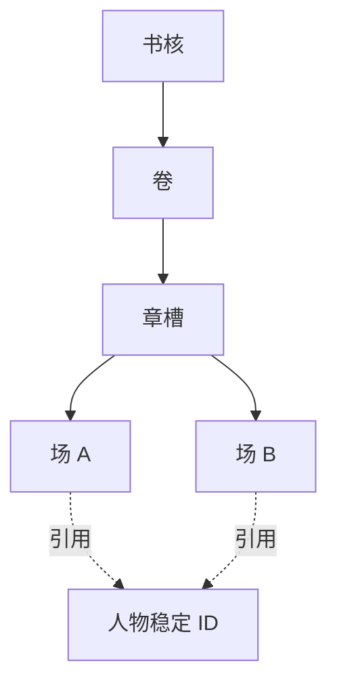

✅ 结论：网文工作台最稳妥的是“4 层叙事模型 + 12 张首发核心表”。

- 书、卷、章槽、场走一棵严格的包含树。
- 人物、地点、事实、故事线等都与场平级，通过稳定 ID 引用。
- 计划对象可以共用一张受控类型表，但计划与事实永远不共表。
- 每段关系只存一次；所谓“双向”只是两边都能查到，不是保存两份。
- 检查器、时间线、人物账页面、执行包都读投影，不再维护第二套真值。
- 插件内容卡单独放在集成区，只保存故事对象 ID，不进入故事真值表。

以下结论只参考公开文档和开源仓库。截至 2026-08-14，articy、World Anvil、Novelcrafter 没公开 PostgreSQL 物理表结构，所以能核对的是它们的对象模型、导出格式和产品行为，不能把“28 种文章类型”误当成“28 张数据库表”。

## 1. 常见是几层

学术模型通常是 3 个维度：按故事时间发生的事件网络、讲述文本、两者之间的对应关系；同一事件可以出现在不同文本位置，文本顺序也可以不同于事件时间顺序。[叙事形式化模型论文](https://d-nb.info/1365193373/34)

落到长篇写作工具，通常会展开成 4 层；游戏再加第 5 层“运行状态”。

| 层                   | 人话解释               | 首发常见表数 | 典型内容                             |
| -------------------- | ---------------------- | ------------ | ------------------------------------ |
| 世界实体层           | 谁、哪里、什么东西     | 2～4         | 人物/地点/势力/物品、名称与别名      |
| 故事时间与事实层     | 发生什么、何时成立     | 2～4         | 计划事件、正式事实、参与者、时间关系 |
| 编排层               | 作者准备在哪里讲       | 2～4         | 书核、卷章场树、故事线、伏笔、选择   |
| 表达层               | 最终写出来的文字或分支 | 1～3         | 正文、版本、对白/选项                |
| 公共支撑，不算叙事层 | 稳定门牌和跨层联系     | 3～5         | 对象 ID、引用、依赖、灵感、材料      |

这里不是“一层对应一个 PostgreSQL schema”。同一张受控的计划项表可以同时服务计划事件和故事线，公共引用表也会跨层，所以首发可以压在约 12 张。

### 可以核对的产品与引擎

| 系统         | 公开模型                                                     | 对你们有用的证据                                             |
| ------------ | ------------------------------------------------------------ | ------------------------------------------------------------ |
| Ink          | knot、stitch、choice、divert、变量                           | 官方说主流程是扁平跳转，甚至可能长成“意大利面”；knot/stitch 只是表达结构，不是人物或事实库。适合借鉴表达编译，不适合照抄成完整工作台。[Ink 官方文档](https://github.com/inkle/ink/blob/master/Documentation/WritingWithInk.md) |
| Yarn Spinner | 文件、节点、台词、选项、命令、变量                           | 编译会产出程序、字符串表、元数据表，清楚地区分创作源和执行产物。这正好支持“执行包是投影”。[Yarn 基础模型](https://docs.yarnspinner.dev/2.5/getting-started/writing-in-yarn/lines-nodes-and-options)、[官方编译工具](https://github.com/yarnspinnertool/yarnspinner-console) |
| Twine        | 一个故事、许多 passage、passage 间的有向链接                 | 模型很小，因为人物、事实、地点大多埋在 passage 文本和脚本里；而且规范明确说编辑中的 passage PID 可能变化。适合轻量互动故事，不适合直接承担稳定人物账。[Twine 输出规范](https://github.com/iftechfoundation/twine-specs/blob/master/twine-2-htmloutput-spec.md)、[链接文档](https://twinery.org/reference/en/editing-stories/linking-passages.html) |
| articy:draft | 通用 Entity＋模板；Flow 容器、嵌套、引脚、连接；独立引用     | 它把“嵌套包含”和“引用人物”明确分开：对话/流程节点可嵌套，人物通过 reference strip 挂上去；引用页是自动生成的反向视图。[Entity 与模板](https://www.articy.com/en/adx_basics_entities/)、[Flow 嵌套与引用](https://www.articy.com/en/articydraft-first-steps-tutorial-series-l05-the-flow/) |
| World Anvil  | 世界文章、时间线、手稿三个明显模块                           | 有 28 种文章模板，但手稿仍是“章文件夹→场文档”；一个历史事件能出现在多条时间线里，不需要复制事件。这说明类型丰富不等于一类一表，时间线也应是事件的安排视图。[文章模板](https://www.worldanvil.com/learn/article-guides/article-templates)、[时间线](https://www.worldanvil.com/learn/timelines/timelines)、[章与场](https://www.worldanvil.com/learn/manuscripts-guides/create-scenes-and-chapters) |
| Novelcrafter | Act/Chapter/Scene 树；Codex 固定类型；名称/别名；按场生效的 progression | 场与人物不是父子；表格视图根据名称、别名和显式引用算出人物出现位置。人物变化挂到某场之后才送给 AI，也很接近“事实具有生效区间”。官方还警告：关系连太多会级联拉入无关上下文。[编排视图](https://www.novelcrafter.com/help/docs/plan/plan-views)、[Codex 类型](https://www.novelcrafter.com/help/docs/codex/codex-types)、[按场变化](https://www.novelcrafter.com/help/docs/codex/progressions-additions)、[关系级联警告](https://www.novelcrafter.com/help/docs/codex/codex-relations) |

🔥 Ink、Yarn、Twine 表少，是因为它们主要解决“文字怎么走”，不是因为长篇故事只需要两三类数据。

## 2. 树形包含和平级引用怎么混

核心判断很简单：

> 删除或移动父项时，这个对象是否理应跟着走？同一个对象能否同时出现在多个地方？

- 会跟着走、只能有一个父项：包含关系。
- 能被很多地方重复使用：引用关系。

推荐规则：

- 卷、章槽、场放在编排树里，由子项指向父项。
- 人物、地点、势力、物品永远是作品级实体，不带 `chapter_id`，也不是场的子行。
- 场引用人物走关联记录；删除场只删引用，不删人物。
- 故事线包含许多场、同一场加入多条故事线，也是关联，不是树。
- 计划事件锚定某场，仍然是引用。因为它以后可能移动、跨场展开，或者同时拥有铺垫点和兑现点。
- 叙事顺序和故事时间必须分开：章场树表示“读者先看到什么”；事实和事件时间表示“世界里先发生什么”。

PostgreSQL 用“每个节点保存直接父项”已经足够，递归查询原生支持树形数据；不必首发就引入路径字符串或图数据库。[PostgreSQL 递归查询](https://www.postgresql.org/docs/current/queries-with.html)

## 3. 单向、双向与循环更新

### 必须单向保存

| 关系                     | 保存方向                | 另一边怎么办                         |
| ------------------------ | ----------------------- | ------------------------------------ |
| 卷/章/场包含             | 子项 → 父项             | 父项的子列表查询得到                 |
| 名称别名、影子记录       | 影子 → 真源稳定 ID      | 真源的所有影子反查得到               |
| 计划读取既有事实         | 计划项 → 事实           | 事实不保存“被哪些计划使用”           |
| 计划兑现为事实           | 计划项 → 新事实         | 这是对账关系，不把计划行改成事实行   |
| 改史依赖                 | 依赖者 → 所依赖的真源   | 在真源 ID 上建反向索引，查受影响对象 |
| 新事实纠正旧事实         | 新事实 → 被替代事实     | 旧事实不反写新 ID 列表               |
| 检查结果、执行包、插件卡 | 派生物 → 来源对象及版本 | 真值表不保存派生物正文               |

计划兑现时，正确动作是“新建事实＋增加计划到事实的对账边”，不是把计划对象的 `type` 翻成事实。

### 可以双向浏览，但仍只保存一份

- 故事线 ↔ 成员
- 场 ↔ 出场人物
- 伏笔 ↔ 埋设场/兑现场
- 人物 ↔ 人物关系
- 事实 ↔ 证据材料

PostgreSQL 官方也把多对多建模为一张拥有两个外键的关联表。[外键与多对多](https://www.postgresql.org/docs/current/ddl-constraints.html)

避免循环更新的办法：

- 关联行是唯一真源，两边页面都查询同一行。
- 不保存 `member_ids`，也不额外生成一批反向关系行。
- 对“夫妻、盟友”这类对称关系，只保存规范化的一对 ID。
- 对“父亲/子女、债权人/债务人”这类有角色的关系，保存一行两个角色，反向称呼由投影计算。
- 包含树必须禁止环；硬依赖通常也应禁止环。
- 故事流程、人物关系可以合法成环，不能拿树的防环规则去限制它们。
- 不写“更新 A 后触发器更新 B，B 又触发更新 A”这一类镜像触发器。

## 4. `type` 一表多类，还是一类一表

| 方案               | 合适的地方                               | 在故事工具里的常见翻车方式                                   |
| ------------------ | ---------------------------------------- | ------------------------------------------------------------ |
| 万物一表＋`type`   | 很小的原型、只做稳定 ID 登记             | 大量空字段；人物状态、场顺序、事实可信度共用含糊列；特殊属性全滑进 JSON；外键无法判断目标类型；作者最终只看见一个“其他”口袋 |
| 一类对象一张表     | 类型有明显不同的必填字段、权限和生命周期 | 很快长到几十张；地点/势力/物品重复通用列；跨类型引用被迫使用没有真实外键的 `target_type＋target_id`；作者面对过多入口 |
| 门牌表＋少数家族表 | 最适合你们                               | 稳定 ID 统一；实体、计划、事实、编排仍有各自明确入口；某个类型长大后再增加一对一扩展表 |

推荐允许 `type` 的地方只有几类：

- 编排节点：卷、章槽、场。它们都满足“有顺序、一个父项、可以移动”的合同。
- 世界实体身份：人物、地点、势力、物品。共用的只是稳定门牌、名称和归档状态。
- 计划项：计划事件、故事线、伏笔、选择记录。共用计划状态、说明、锚点和引用方式。
- 对象门牌：只有 ID、所属作品、家族类型、版本和归档状态，不装业务正文。

出现下面任意两项，就把该类型拆成一对一扩展表：

- 有三项以上独有且必填的字段；
- 有自己的权限、版本或归档流程；
- 有专属关系和基数限制；
- 查询量、数据量或索引需求明显不同；
- 改类型会改变对象含义，而不只是分类名称。

⚠️ 不建议使用 PostgreSQL 原生 `INHERITS` 来做人物/地点这类继承。官方文档明确写着，唯一约束和外键不会自动覆盖所有子表。[PostgreSQL 表继承限制](https://www.postgresql.org/docs/current/ddl-inherit.html)

## 5. 建议的首发 12 张表

括号里只是工程暂名，帮助沟通，不是 SQL 设计稿。

| 人话名                             | 一句话职责                                                   | 主要外键指向                                             |
| ---------------------------------- | ------------------------------------------------------------ | -------------------------------------------------------- |
| 1. 作品/书核（Work）               | 保存作品身份、总合同、状态和当前版本                         | 无；系列以后再接                                         |
| 2. 对象门牌（Object Registry）     | 给所有可引用对象发稳定 ID，只管身份，不装正文                | 所属作品 → 作品                                          |
| 3. 编排树（Outline Node）          | 用受控类型装卷、章槽、场及其顺序                             | 对象 ID → 门牌；子节点 → 父节点                          |
| 4. 正文片段（Manuscript Fragment） | 保存每场实际文字及当前修订状态                               | 所属场 → 编排树                                          |
| 5. 世界实体/人物账（Story Entity） | 保存人物、地点、势力、物品的稳定身份                         | 对象 ID → 门牌                                           |
| 6. 名称与别名（Entity Name）       | 保存真名、别名、称号及适用阶段，显示名由此投影               | 实体 ID → 世界实体                                       |
| 7. 计划项（Plan Item）             | 用受控类型装计划事件、故事线、伏笔、选择记录                 | 对象 ID → 门牌；其他联系走语义引用                       |
| 8. 事实账（Fact Record）           | 保存已经成立的原子事实、实际事件、有效阶段和可信状态         | 对象 ID → 门牌；主要主体 → 世界实体；新事实 → 被替代事实 |
| 9. 语义引用（Object Link）         | 保存场引用人物、故事线成员、伏笔锚点、计划→事实、事实→材料等联系 | 起点和终点都 → 对象门牌                                  |
| 10. 改史依赖边（Dependency Edge）  | 明确“这个对象依赖哪个真源”，供变更影响反查                   | 依赖者和真源都 → 对象门牌                                |
| 11. 灵感账（Idea Ledger）          | 存未经确认的想法，避免混进事实和计划                         | 对象 ID → 门牌；采纳去向走语义引用                       |
| 12. 材料架（Source Material）      | 存外部材料、设定底稿、出处、授权和校验信息                   | 对象 ID → 门牌；支持哪些事实走语义引用                   |

这 12 张里，作者真正需要选择入口的只有：编排、正文、世界实体、计划、事实、灵感、材料。对象门牌、语义引用和依赖边都是系统内部设施，不会给作者增加“到底放哪张表”的负担。

### 几个现有对象不必各开一张表

- 引脚：语义引用里的“锚定于”关系。
- 伏笔埋设/兑现点：计划项到场的两种引用角色。
- 故事线成员：故事线计划项到成员对象的引用。
- 对账边：计划项到事实的“兑现为/偏离为”关系。
- 挂件：如果是故事语义，归入计划、事实或材料；如果只是插件卡和 UI 内容，放集成区。
- 时间线：首发是计划项和事实账按故事时间生成的投影，不复制事件。
- 人物账页面：世界实体＋名称＋事实＋场引用的组合投影，不再维护一份人物 JSON。

语义引用不能开放成“任何类型随便连任何类型”。首发只允许少数关系码，并规定起点类型、终点类型、方向和数量。例如“场→人物”“计划→事实”“伏笔→场”。结构包含和改史依赖继续使用各自专表，不能塞进万能边。

### 可以后开

| 后开表             | 什么时候值得拆                                   | 主要指向                      |
| ------------------ | ------------------------------------------------ | ----------------------------- |
| 人物档案扩展       | 人物出现多项固定必填资料或独立权限               | 世界实体，且类型必须是人物    |
| 地点/势力/物品扩展 | 某类出现稳定的专属字段和高频查询                 | 对应世界实体                  |
| 事件参与者         | 角色、顺序、动作、伤亡等无法再用简单引用表达     | 计划项或事实＋世界实体        |
| 知情账             | 必须检查“某人在某场是否已经知道某事实”           | 知情者＋事实＋生效/失效位置   |
| 义务账             | 债务、承诺、任务具有债权人、债务人、期限和状态机 | 双方实体＋来源计划/事实       |
| 丰富人物关系       | 关系要保存方向、阶段、公开程度、不同视角         | 两个实体＋生效区间            |
| 时间轴与时间轴成员 | 需要多历法、平行轴、年代、不确定先后关系         | 作品＋计划项/事实；不复制事件 |
| 检查运行与问题记录 | 要保存检查历史、人工确认和忽略理由               | 来源对象及版本                |

### 明确不要

- ❌ 一张 `objects(type, json)` 装人物、场、计划、事实、材料和插件卡。
- ❌ 整份大纲 JSON 作为唯一真值。
- ❌ 人物随每个场复制一行，或让人物“属于某章”。
- ❌ 同时保存 `parent_id` 和 `child_ids`。
- ❌ 用两行互为反向的关系表示同一件事。
- ❌ 使用没有对象门牌外键保护的 `target_type＋target_id`。
- ❌ 为“地点、势力、知情、义务、时间线”预先全部开专表。
- ❌ 把插件内容卡、模型提示词、检查结果写进故事真值表。
- ❌ 让执行包反向覆盖事实或正文。
- ❌ 因为存在依赖边，就把 PostgreSQL 换成图数据库主存储。

## 检查器和执行包怎么读

✅ 两者都读投影，不另存一份可编辑真值。

建议的数据流是：

- 上层合同读取普通视图：场上下文、人物当前状态、时间线、伏笔状态、反向引用。
- 数据量上来后，可以把少数重查询换成物化视图；它只是可重建缓存。PostgreSQL 普通视图不保存结果，物化视图会保存结果但需要刷新。[普通视图](https://www.postgresql.org/docs/current/sql-createview.html)、[物化视图](https://www.postgresql.org/docs/current/rules-materializedviews.html)
- 检查器可以保存“某次检查及其问题”，但每条问题必须带来源对象 ID、来源版本和规则版本。
- 执行包应是不可编辑快照，带输入对象 ID、版本或内容指纹；源对象变化后标记过期，再重新生成。
- 插件卡放单独的集成表，只保存自己的内容及 `story_object_id` 指针。故事对象表不保存插件卡正文。

🔥 这套方案最重要的边界是：**树只回答“装在哪里”，引用只回答“与谁有关”，依赖只回答“谁变了要重算谁”**。三种关系分开，引用网才不会长成毛线。

来源：ChatGPT